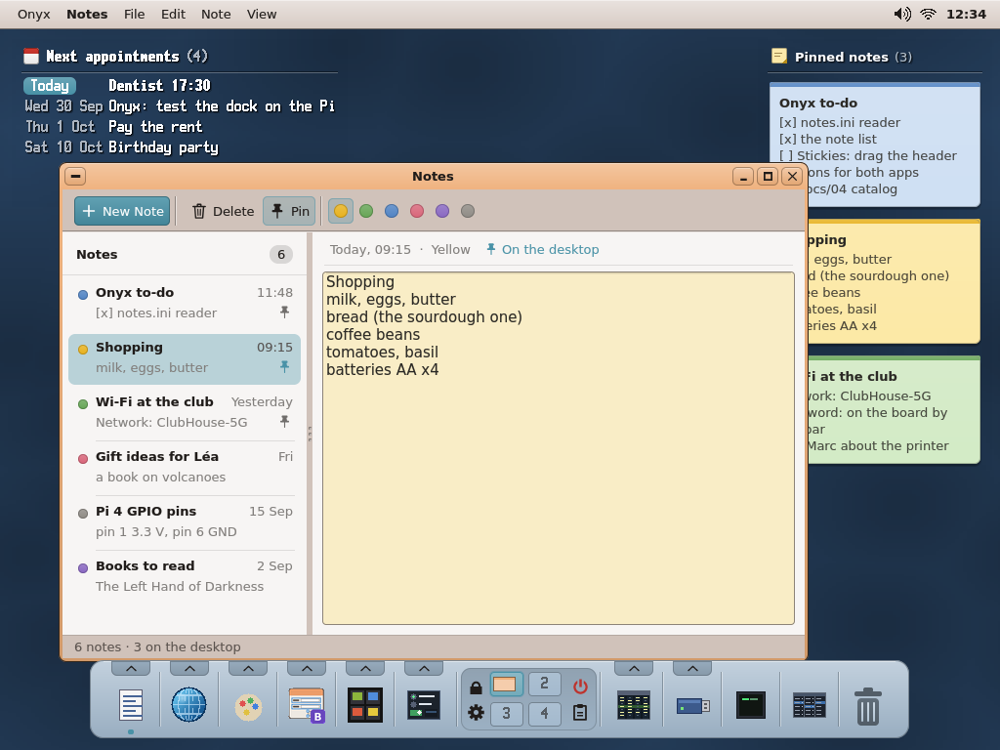
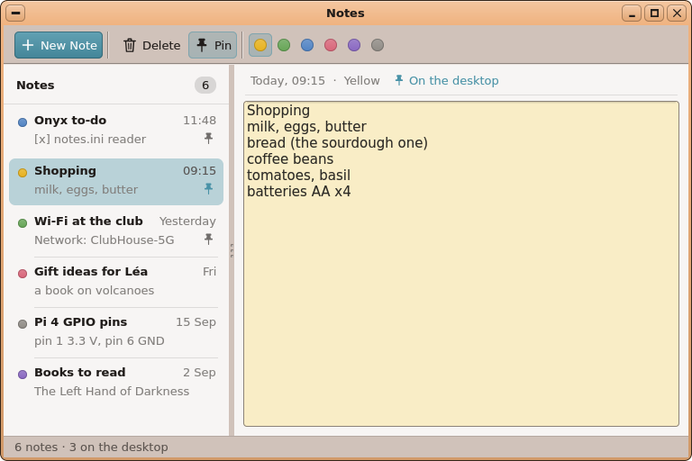
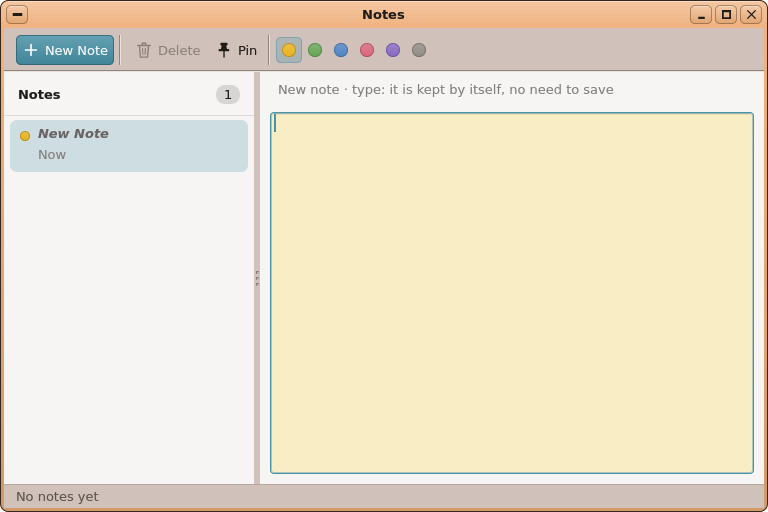
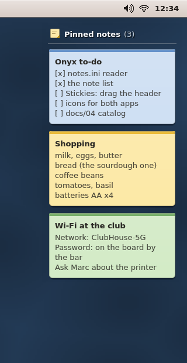
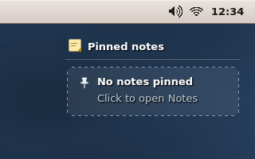

# AutoDev — tour 1 : Notes et Stickies

*6 octobre 2026 — branche `AutoDev`, en attente de votre validation (rien dans `main`, aucun paquet publié).*

## L'application choisie, et pourquoi

**Notes** (prise de notes rapide) avec son widget de bureau **Stickies** (les notes épinglées sur le
fond d'écran). C'est l'entrée « Quick notes » de votre liste Priorité 2 dans `docs/HANDOFF.md` ;
toute la Priorité 1 et Présentations étant faites, c'était le meilleur choix (19/20) devant la page
de réglages Région & Clavier (17), Horloge (16, proposée pour un prochain tour), À propos / Système
(11, exigerait un nouveau kapi pour la température CPU) et un coffre à mots de passe (10).
Usage quotidien, tout existe déjà dans les kits, testable entièrement dans le simulateur PC,
**aucun changement de kapi ni de noyau**. Détail : `autodev/rounds/01-notes/01-product-manager.md`.

## Ce qu'elle fait



**Notes** (`SD:/apps/notes.app`, catégorie Productivité)
- Liste des notes (la plus récente en haut ; titre = première ligne, date, pastille de couleur,
  punaise si épinglée) et éditeur sur le papier de la couleur de la note.
- Nouvelle note (Ctrl+N) ; une note vide n'est jamais écrite ; une note vidée part à la Corbeille.
- Enregistrement automatique 1 s après la frappe, au changement de note, à la fermeture.
- Supprimer → Corbeille + notification ; 6 couleurs ; Épingler au bureau (Ctrl+P) ;
  Couper / Copier / Coller / Copier la note via le presse-papiers partagé ;
  Ouvrir dans l'éditeur de texte (Ctrl+E) ; `notes <chemin>` ouvre une note.
- Un `.txt` / `.md` déposé sur la liste devient une note (refus > 64 Ko dans une boîte de dialogue) ;
  du texte déposé s'insère au curseur.
- Échec d'écriture : ligne d'état rouge, nouvel essai à chaque pause ; à la fermeture le texte est
  mis au presse-papiers et une notification le dit.
- Vue ▸ Afficher / Masquer Stickies sur le bureau ; instance unique (une 2ᵉ Notes transmet son
  argument à la première).

**Stickies** (`SD:/apps/stickies.app`, catégorie Shell, comme Agenda)
- Les notes épinglées en cartes de papier coloré en haut à droite du fond d'écran (Agenda est à
  gauche), jusqu'à 6, « +N de plus dans Notes » au-delà ; indice d'une ligne si rien n'est épinglé.
- Relit les notes toutes les 3 s ; clic sur une carte → Notes ouvert sur cette note ;
  glisser l'en-tête la déplace (position dans son `config.ini`) ; sous les cartes, les clics passent
  au bureau.

**Fichiers sur la carte** : une note = un fichier UTF-8 `SD:/Notes/note-AAAAMMJJ-HHMMSS.txt`
(64 Ko max), `SD:/Notes/notes.ini` (couleur, épinglée, date), `notes.app/config.ini`,
`stickies.app/config.ini`. Notes ne réclame aucune extension (`.txt`/`.md` restent à tinypad).

| Notes | Notes, premier lancement | Stickies | Stickies vide |
|---|---|---|---|
|  |  |  |  |

## Ce qui a été construit

- **App** `user/Apps/notes/` : `main.cpp`, `notelist.h` (liste dessinée par l'app), `notesmodel.h/.cpp`
  (le modèle, testé seul), `stickies_proto.h` (messages IPC) ; **widget** `user/Apps/stickies/main.cpp` ;
  `sdcard/apps/notes.app` et `stickies.app` (app.txt + icônes, `tools/icons/notes_icon.py`) ;
  `user/Makefile`.
- **UIKit** (ajouts seulement) : `uk_text_wrap`, `uk_text_over` (texte FreeType correct en mode
  transparent), icônes de barre d'outils `WKT_TRASH`, `WKT_PIN` — `uikit.abi` lignes 779–780.
- **SystemKit** : `systemkit/autostart.h` + `autostart.inc` (`autostart_has`, `autostart_ensure`),
  `systemkit.abi` lignes 59–60. Notes n'écrit `SD:/etc/autostart` **que** sur l'action explicite
  Vue ▸ Afficher Stickies, jamais sur un épinglage ni sur Masquer ; rien si la ligne existe déjà ;
  sinon insérée juste après celle d'Agenda (ou avant `preload /boot`), avec un message d'état comme
  Clavier & Souris.
- `sdcard/etc/autostart` : `#setup: run stickies` juste après `#setup: run agenda`.
- **Paquet** `[notes]` déclaré dans `tools/pkg/packages.ini` (avant `[onyx]`), **non publié**.
- **Banc de test PC** (`fakekapi.cpp`) : `SIM_SERVICES`, `SIM_ROFS`, `SIM_CURSOR=follow`, `SIM_STAT`,
  étape `copy`, messages `SIM_MBOX` datés `@<ticks>:`, journal des drapeaux de fenêtre ; notes
  d'exemple dans `tools/tests/desktop_sim/sd/Notes/` ; scénarios `shots.sh` `notes`, `notes-empty`,
  `stickies`, `stickies-empty`, `notes-desktop`.
- **Docs** : docs/04 (catalogue, section Stickies, autostart), docs/03 (outils du simulateur),
  docs/06, docs/11 et 12 régénérés, HANDOFF, IDEAS.md (ce qui est remis à plus tard), exports
  DOCX/PDF régénérés.
- Au passage : `run_trash_test.sh` affichait « réussi » alors que son test ne compilait pas — corrigé.
- **Aucun changement de kapi ni de noyau.**

## Tests et résultats

| Commande | Résultat |
|---|---|
| `sh tools/tests/run_notes_test.sh` (simulateur, découpe de texte, autostart, modèle) | tout passe (58 + 56 + 143 vérifications) |
| `sh tools/tests/run_notes_sim_test.sh` (fenêtre Notes scriptée dans le simulateur) | 67/67 |
| `sh tools/tests/run_stickies_sim_test.sh` (widget scripté, cartes relues dans l'image) | 29/29 |
| tests corbeille, presse-papiers, Mail, Letters | passent |
| `shots.sh notes notes-empty agenda desktop` | images identiques à l'octet (pas de régression sur agenda / bureau) |

Critères d'acceptation : **31 sur 33 vérifiés sur PC**, 2 laissés à vous (ci-dessous).
Le processus : 2 validations techniques (la 1ʳᵉ a refusé : écriture d'autostart trop large, tour
trop ambitieux, trous dans les outils de test ; corrigés, la 2ᵉ est VERTE).

## Ce qui reste / limites connues

- **Pas de compilateur aarch64 dans ce conteneur** : rien n'a été compilé pour le Pi.
- Remis à plus tard (IDEAS.md) : recherche, cases à cocher `[ ]`/`[x]` cliquables depuis le widget,
  tri, glisser une note vers l'extérieur, Exporter…, rappels.
- Les menus d'UIKit n'ont pas de coches : les bascules changent leur libellé (Épingler / Désépingler,
  Afficher / Masquer), la barre d'outils montre l'état.
- Une carte déjà installée ne reçoit pas la ligne d'autostart par mise à jour (`etc/` vous appartient) :
  c'est Vue ▸ Afficher Stickies qui l'ajoute. `sdcard_lite/etc/autostart` ne l'aura qu'à la publication.
- Horloge pas encore réglée (avant NTP) : noms uniques, mais ordre de tri étrange jusqu'à la
  prochaine modification.

## À vérifier à la main

1. `make` puis `make stage` depuis `kernel/` : cela confirme aussi les lignes ajoutées à la main
   `uikit.abi` 779–780 et `systemkit.abi` 59–60 (libgen doit ajouter exactement celles-là).
2. Sur le Pi : épingler une note → elle apparaît sur le bureau en quelques secondes ; clic sur la carte
   → Notes s'ouvre dessus ; glisser l'en-tête de Stickies ; redémarrer → épinglages, position et
   réglage Afficher/Masquer conservés.
3. Vue ▸ Masquer puis Afficher Stickies : vérifier la ligne dans `SD:/etc/autostart` (après Agenda).
4. Les versions `needs = uikit >= 1.781, systemkit >= 1.61` du paquet `[notes]` au moment de publier.

## Comment l'essayer

```sh
git fetch origin AutoDev && git checkout AutoDev
sh tools/tests/run_notes_test.sh && sh tools/tests/run_notes_sim_test.sh && sh tools/tests/run_stickies_sim_test.sh
sh tools/tests/desktop_sim/shots.sh notes-desktop     # → screenshots/notes-desktop.png
cd kernel && make && make stage                       # sur votre PC avec la chaîne aarch64
```
Puis sur le Pi : lancer **Notes** depuis le dock / le menu Productivité.
Pour intégrer : fusionner `AutoDev` dans `main`, puis publier les paquets (skill onyx-packages).

Documents du tour : `autodev/rounds/01-notes/` (01 chef de produit → 06 développement, maquettes
dans `mockups/`).
