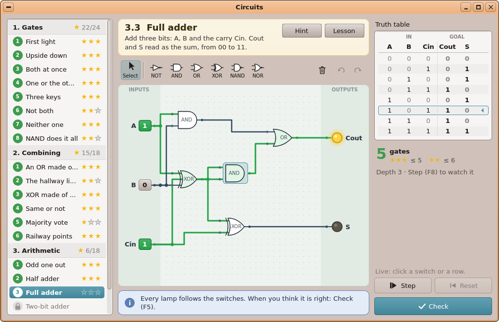
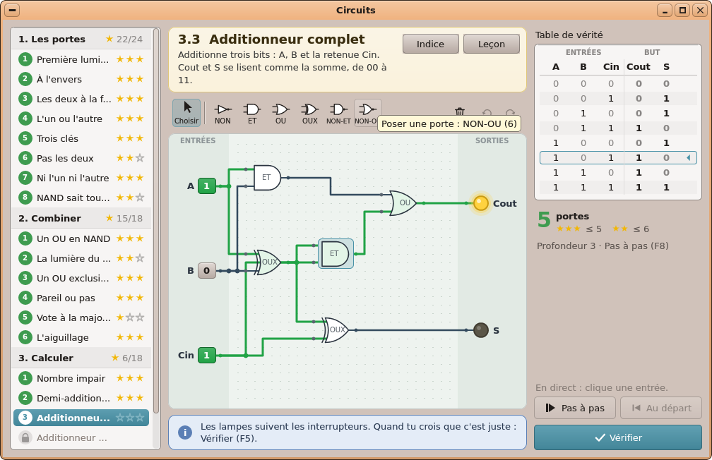

# AutoDev — tour 2 : **Circuits**, le jeu de circuits logiques

*Branche `AutoDev`, le 2026-10-06. En attente de ta validation : rien n'est dans `main`, aucun paquet publié.*

## L'application choisie, et pourquoi

C'est le **premier élément de ta file** (`autodev/QUEUE.md`), et ta priorité. Le Product Manager l'a noté 18/20,
ex æquo avec « Turtle Quest : plus de missions ». Il ne demande aucune modification du noyau ni de kapi, ni de
nouveau kit, et il se teste entièrement sur le PC (un test hôte pour le moteur, le simulateur pour la fenêtre).
Périmètre retenu pour un tour : **la logique combinatoire seule**. La logique séquentielle (horloge,
bascules, chronogrammes), les puces personnelles, l'éditeur de niveaux et l'export vers GPIO Lab sont
reportés à des tours suivants (voir *Ce qui reste*).

## Ce que fait Circuits

Un jeu de puzzles dans la lignée de Turtle Quest :

- **20 missions** en 3 mondes :
  - *1. Les portes* (8 missions) ;
  - *2. Combiner* (6) : le OU en NAND, la lumière du couloir, le XOR, la majorité, l'aiguillage… ;
  - *3. Calculer* (6) : bit de parité, demi-additionneur, additionneur complet, additionneur 2 bits, décodeur, comparateur.
- **L'objectif** de chaque mission est une table de vérité. La mission précise aussi les pièces permises et le nombre de portes visé : de 1 à 3 étoiles. Les minimums ont été vérifiés par une recherche exhaustive, sauf celui de l'additionneur 2 bits (7 portes) : trop grand pour la recherche, c'est la solution demi-additionneur + additionneur complet, pas un minimum prouvé.
- **Le plateau** est une grille (40 × 30). On pose des portes (NON, ET, OU, OUX, NON-ET, NON-OU) par clic, par glisser depuis la palette ou par les touches 1–6. On tire les fils de broche à broche (anneau vert ou rouge). On déplace aux flèches, on supprime au clic droit, on annule ou refait (Ctrl+Z / Ctrl+Y). Les boucles sont refusées.
- **Simulation en direct** : on clique un interrupteur ou une ligne de la table, et les lampes suivent.
- **Pas à pas** (F8, une profondeur de porte à la fois, avec un badge) et **Au départ** (F9).
- **Vérifier** (F5) essaie toutes les combinaisons et marque les lignes fausses. Une victoire affiche une carte de résultat avec les étoiles et ouvre le niveau suivant.
- Les **cartes de leçon** s'affichent la première fois qu'une porte apparaît. Il y a aussi un indice par niveau.
- **La progression est sauvée** dans `SD:/apps/circuits.app/progress.ini` : les étoiles et le circuit de chaque niveau, sauvegarde automatique.
- **Copier la table de vérité** en texte va dans le presse-papiers. Les packs `.circuits` s'ouvrent depuis le File Viewer (association) ou par Ctrl+O.
- **Bilingue anglais / français dès cette version** :
  - l'interface passe par `TR()` et `lang/fr.txt` ; les titres, consignes, leçons et indices des missions ont leurs clés `.fr` ;
  - `python3 tools/lang/check.py circuits` donne **108 mots, 0 manquant, 0 inutilisé** ;
  - le rendu français a été vérifié avec `SHOTS_LANG=fr`, à la taille par défaut et à la taille minimale 920 × 600 : les mots tiennent ;
  - noms des portes en français : NON, ET, OU, OUX, NON-ET, NON-OU.




Les autres captures sont `screenshots/circuits-step.png` (le pas à pas) et `screenshots/circuits-check.png` (une
vérification ratée, ligne fausse marquée). Les maquettes UIKit de la conception sont dans
`autodev/rounds/02-circuits/mockups/`.

## Ce qui a été construit

- **L'application** `user/Apps/circuits/` :
  - `circuit.h/.cpp` : le moteur, sans interface ni entrées/sorties. Plateau, fils, évaluation directe et pas à pas, vérification, étoiles, texte d'un circuit, historique d'annulation, packs, progression, déverrouillage, géométrie (routage, sélection).
  - `lessons.h` : les 18 cartes de leçon en anglais et en français.
  - `main.cpp`, `gates.h`, `board.h`, `views.h` : la fenêtre.
- **Les données** `sdcard/apps/circuits.app/` : `app.txt`, `icon.bmp` (dessinée par `tools/icons/circuits_icon.py`), `lang/fr.txt`, `levels/1-gates.circuits`, `2-combining.circuits`, `3-arithmetic.circuits`.
- **FileKit (kit modifié)** : un nouveau sujet, `filekit/kvtext.h`. Ce sont 18 fonctions `fk_kv_*` pour un document texte de `[sections]` et de lignes `clé = valeur`, lu et réécrit sans perte : sections répétées, lignes `|` avec leurs numéros, échappements `\n`, clés inconnues gardées.
  - Il répond à la question du PM : le magasin de progression et le parseur de packs seraient sinon copiés une troisième fois (après Turtle et Notes).
  - Le code est en ligne sur le PC et dans `filekit.so` sur le Pi. `filekit.abi` reçoit les entrées 78–95 (ajout en fin de table seulement) ; le paquet Circuits demande `filekit >= 1.96`.
  - `docs/14-FILEKIT.md` est régénéré (`kitdocs.py`) ; docs/06 et docs/03 le mentionnent.
- **Intégration** : `user/Makefile` (`FT_APPS`, `FT_EXTRA_circuits`, `FK_OBJ += lib/fk/kvtext.o`), `sdcard/etc/fileassoc.ini` (`.circuits`), `tools/pkg/packages.ini` (`[app.circuits]` **déclaré, pas publié**).
- **Documentation** : docs/04 (catalogue §12 et section Circuits), docs/03, docs/06, docs/14, `docs/HANDOFF.md` (Circuits et les suites). Les exports `.docx` et `.pdf` sont régénérés.
- **Ni kapi ni noyau touchés**, ni AppKit, ni Turtle Quest.
- **Resynchronisations de la branche** :
  - avec `main` en début de tour : conflits résolus. `main` avait ajouté les `locale_*` à SystemKit, donc les `autostart_*` du tour 1 passent aux entrées 74–75 de `systemkit.abi`. Notes et Stickies, déjà recompilés depuis les sources, s'y adaptent.
  - avec deux commits poussés pendant le tour sur `AutoDev` : la règle « toute app bilingue » et Notes/Stickies en français.

## Les tests

| Test | Résultat |
|---|---|
| `sh tools/tests/run_kvtext_test.sh` (FileKit `fk_kv`) | ok — 101 vérifications (ASan) + 115 (couche fichiers du simulateur) |
| `sh tools/tests/run_circuits_test.sh` (moteur + les 20 missions) | ok — 582 vérifications ; chaque solution de référence gagne avec 3 étoiles |
| `sh tools/tests/run_circuits_sim_test.sh` (la fenêtre dans le simulateur) | **61/61** — souris, touches 1–6, flèches, fils, lignes de table, F5/F8/F9, progression, pack en argument, pack invalide, FR, 920 × 600 |
| `python3 tools/lang/check.py circuits` | 108 mots, 0 manquant |
| `sh tools/tests/desktop_sim/shots.sh circuits` (EN et `SHOTS_LANG=fr`) | 4 captures, relues une à une |
| Non-régression : Turtle (27 niveaux, captures identiques à l'octet), Archiver, Notes, Notes sim, Stickies sim, pkg | tous verts |
| `mkrepo.py --no-sign` à blanc dans un dossier temporaire | paquet `[circuits]` correct |

Le plan a été validé en **2 boucles** :
- la première a relevé deux trous : l'édition des liens sur PC (corrigée, sans `fkcore`/zlib) et une palette trop large à 920 px (corrigée, boutons de 40 px) ;
- la seconde a été **GREEN**.

## Ce qui reste / limites connues

- **Pas de compilation pour le Pi ici** : aucun compilateur AArch64 dans le conteneur. `make` / `make stage` sont à faire chez toi ; ils confirment aussi les lignes 78–95 de `filekit.abi`, posées à la main avec libgen sur des objets hôte.
- Au plus **35 portes tiennent** sur le plateau. Le moteur refuserait la 49e, mais on ne peut pas l'atteindre. C'est documenté.
- Le détail d'une erreur de pack reste en anglais dans la boîte de dialogue française : le moteur n'a pas de langue.
- Une 7e pièce dans la palette (les puces) ne tiendrait plus à 920 px. Ce sera à décider le jour où on les fait.
- **Reporté** (dans HANDOFF) :
  - logique séquentielle et chronogrammes ;
  - circuits résolus réutilisés comme puces ;
  - éditeur de niveaux ;
  - bac à sable ;
  - export vers GPIO Lab ;
  - passer Turtle Quest et Notes sur `fk_kv`.
- **Hors périmètre, constaté** : sur `main` aussi, `shots.sh` ne compile plus paint, letters, sheet, slides, media, pdf et photos (fonctions PrinterKit non liées sur PC). Ce n'est pas corrigé ici.
- `main` a reçu un commit après la resynchronisation (4b2b26bf, `turtle/world.h`). Il arrivera au prochain tour ou à la fusion.

## Ce que tu dois vérifier à la main (sur le Pi)

1. Depuis `kernel/`, lancer `make` :
   - `lib/fk/kvtext.o` compile pour AArch64 ;
   - libgen accepte les lignes 78–95 de `filekit.abi`. S'il les réordonne, garde son ordre et ajuste `needs = filekit >= 1.96` ;
   - `circuits.elf` se lie.
   Ensuite `make stage` doit produire `SD:/apps/circuits.app/main`.
2. Lancer Circuits depuis *Onyx ▸ Programming* : la carte de leçon du premier lancement s'affiche et seul le niveau 1.1 est ouvert.
3. La souris sur le vrai matériel :
   - glisser une porte depuis la palette ;
   - clic puis clic ;
   - tirer un fil sortie → entrée ;
   - reprendre un fil ;
   - déplacer une porte ;
   - clic droit.
4. Les touches F5 / F8 / F9 / F7, la carte de résultat avec ouverture du niveau suivant, et Ctrl+Z / Ctrl+Y.
5. La sauvegarde automatique : quitter puis relancer, le plateau et les étoiles doivent revenir.
6. Un `.circuits` double-cliqué dans le File Viewer, et Ctrl+O.
7. En français (Langue et région ▸ Français, puis relancer) : les mots tiennent comme sur `circuits-fr.png`.
8. Après validation : fusionner `AutoDev` dans `main`, puis publier les paquets (`tools/pkg/publish.sh`).

## Pour l'essayer sur le PC

```sh
sh tools/tests/desktop_sim/shots.sh circuits                  # les captures (EN)
SHOTS_LANG=fr SHOTS_PNG=/tmp/fr sh tools/tests/desktop_sim/shots.sh circuits   # en français
sh tools/tests/run_circuits_sim_test.sh                        # le banc de test de la fenêtre
```

Les documents du tour (PM, analyse, plan technique, UX, validation, développement) sont dans
`autodev/rounds/02-circuits/`.
