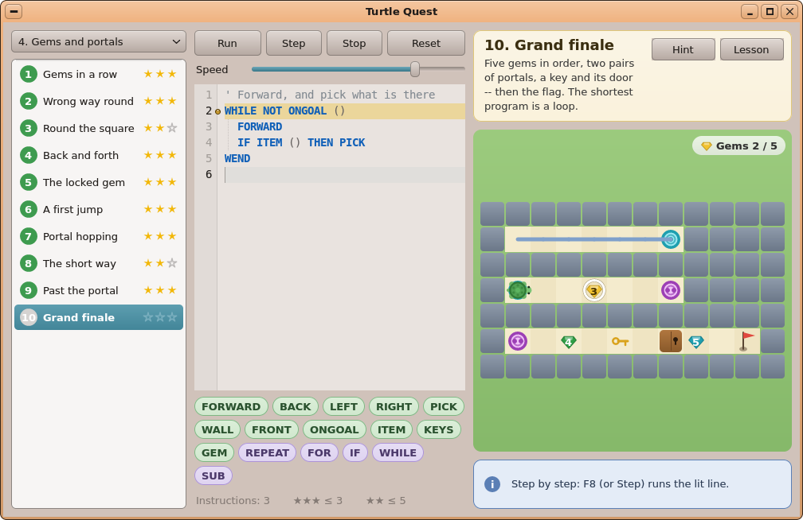
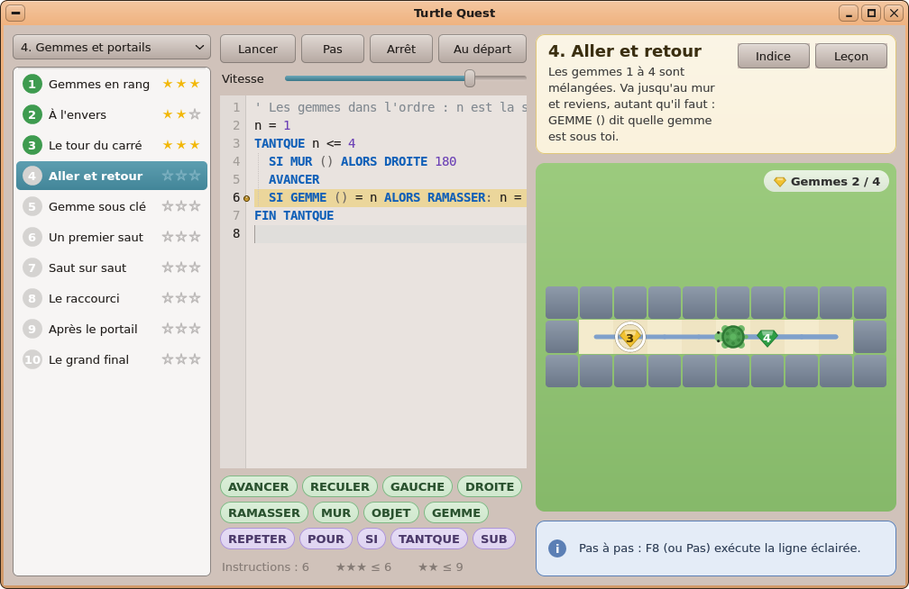
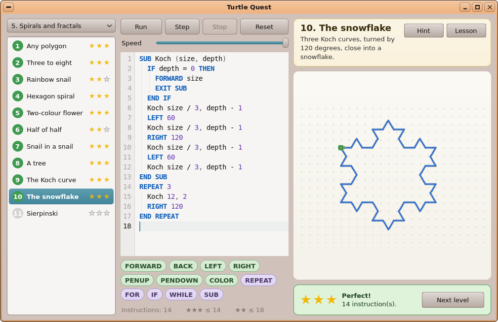
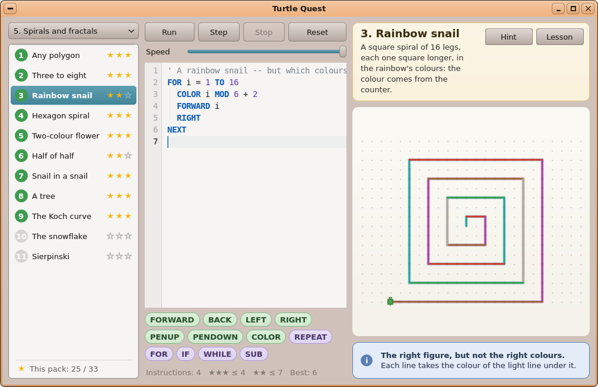
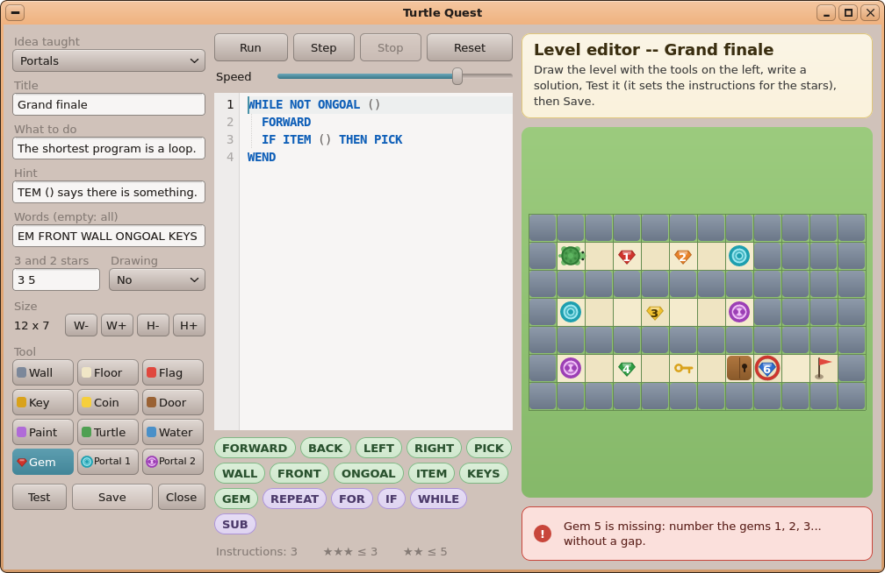

# AutoDev — tour 3 : **Turtle Quest, plus de missions** (gemmes, portails et fractales)

*Branche `AutoDev`, le 2026-10-06. En attente de ta validation : rien n'est dans `main`, aucun paquet publié.*

## Ce qui a été choisi, et pourquoi

C'est le **2ᵉ élément de ta file** (`autodev/QUEUE.md`) ; Circuits (1ᵉʳ élément) a été fait au tour 2.
Le Product Manager a constaté que Turtle Quest avait **déjà** les clés et portes, les pièces, les cases à
peindre, les dessins à reproduire, les spirales, les SUB et les étoiles par nombre d'instructions (le défi du
« programme le plus court »). Le tour apporte donc **de nouvelles mécaniques et deux nouveaux recueils**, sans
toucher au noyau, à kapi, à un kit ni au BASIC : tout tient dans l'application (`user/Apps/turtle`) et ses données.
Reportés : plusieurs tortues (un tour à part entière), le défi quotidien (il faut un générateur et un solveur),
les niveaux GPIO (il faut le Pi), les clés de couleur, le verrouillage des niveaux (Turtle Quest les laisse tous
ouverts : ton choix), le passage de Turtle Quest à `TR()`, `SAY` et les sons.

## Ce qui est nouveau dans Turtle Quest

- **Les gemmes à ramasser dans l'ordre** : caractères `1`…`9` sur la carte, dessinées en pierres taillées
  numérotées ; la prochaine porte un anneau blanc ; le bandeau affiche « Gemmes n / N ». Le mauvais ordre donne
  « Gem 2 first! This is gem 3. » à sa ligne. Le capteur **`GEM ()` / `GEMME ()`** dit quelle gemme est sous la
  tortue ; `ITEM ()` / `OBJET ()` vaut vrai dessus, `FRONT ()` dit 2. Le niveau n'est gagné que toutes les gemmes prises.
- **Les portails** : paires `T` (cyan, un point) et `U` (magenta, deux points), donc distinguables sans la
  couleur. La tortue qui s'arrête sur un portail ressort par son jumeau, **garde son cap**, finit ses pas
  restants, ne revient pas en arrière, et **le stylo ne trace rien** dans le saut (animation : elle se rétracte,
  un arc pointillé, elle réapparaît). `FRONT ()` dit 5 devant un portail. Mot affiché : *portal / portail*.
- **Les dessins en couleur** : `draw = color` dans un niveau ; la figure doit avoir **les couleurs** de la
  solution (cible teintée), avec un message à part « La bonne figure, mais pas les bonnes couleurs ».
  Les niveaux `draw = 1` restent inchangés (toute couleur acceptée).
- **Deux nouveaux recueils, 21 niveaux** (48 en tout), anglais et français :
  - *4. Gems and portals / Gemmes et portails* (10) : Gemmes en rang, À l'envers, Le tour du carré, Aller et
    retour, Gemme sous clé, Un premier saut, Saut sur saut, Le raccourci, Après le portail, Le grand final ;
  - *5. Spirals and fractals / Spirales et fractales* (11) : SUB avec paramètres (Tout polygone, De trois à
    huit), spirales colorées (Arc-en-ciel, Spirale à six pans, Fleur bicolore), une FUNCTION qui renvoie une
    valeur (Moitié de moitié), puis la **récursion** : Escargot gigogne, Un arbre, La courbe de Koch, Le flocon
    de neige, Sierpinski.
- **Six nouvelles cartes de leçon** (gemmes, portail, couleurs avec ses 16 pastilles, paramètres, fonction,
  récursion), une puce **FUNCTION / FONCTION** dans la barre des mots, et un message clair quand une récursion ne
  s'arrête pas (au lieu de « Out of stack space »).
- **L'éditeur de niveaux** : 12 outils (dont Gemme — un clic fait tourner son numéro de 1 à 9 — et les deux
  portails ; un 3ᵉ portail d'une paire remplace le plus ancien), le choix **Dessin : Non / Forme / Couleurs**,
  et Tester / Enregistrer **refusés** avec un message rouge et un anneau rouge sur la case fautive (trou ou
  doublon dans les numéros de gemmes, portail sans jumeau). Le menu *Idée* passe en tête du panneau pour que
  ses 20 lignes ne soient plus coupées ; la taille minimale de la fenêtre passe de 920 × 560 à **920 × 600**.
- **En plus (les « should »)** : le **meilleur programme** de chaque niveau est gardé (`<id>.best`) et affiché
  (« Record : 6 ») ; le **total d'étoiles du recueil** au pied de la liste (« Ce recueil : 21 / 30 ») ;
  la fiche du niveau se replie sur une police plus petite si le titre est trop long et tient 6 lignes au lieu de 4.

Les 36 maquettes de conception (rendues par l'application elle-même dans le simulateur, en anglais et en
français) sont dans `autodev/rounds/03-turtle-missions/mockups/`.

## Ce qui a été construit

| Fichier | Changement |
|---|---|
| `user/Apps/turtle/world.h` | Moteur : mode de dessin 0/1/2, gemmes (`W_GEM`, ordre, `GEM`), portails (`EV_TELEPORT`), comparaison des couleurs, `check_level` (une seule vérification, formulée en anglais pour le lecteur de recueils, en anglais/français pour l'éditeur), `edit_gem` / `edit_pad` (fonctions pures testées), le meilleur programme |
| `user/Apps/turtle/main.cpp` | Plateau (gemmes, anneau, portails, animation du saut, cible teintée), bandeau, cartes de leçon, fiche du niveau, éditeur (12 outils, choix du dessin, refus avec anneau rouge), Record, étoiles du recueil |
| `sdcard/apps/turtle.app/levels/4-gems-and-portals.turtle`, `5-spirals-and-fractals.turtle` | Les 21 niveaux, chacun avec sa solution de référence (`par` = son nombre d'instructions → 3 étoiles) |
| `tools/tests/turtle/turtletest.cpp` | Aller-retour de tous les champs, les cas de gemmes / portails / couleurs / récursion, l'éditeur, et une vérification des recueils (ids uniques, textes EN/FR non coupés, crayons 1–14 sauf 7 et 8, 48 niveaux) |
| `tools/tests/desktop_sim/shots.sh` + `turtle/{portals,fractals,gems-fr}.ini` | Le scénario mis à jour (clics de l'éditeur déplacés) et 5 nouvelles captures |
| Docs | docs/04 §12 et §13, docs/03 *Turtle Quest*, HANDOFF, IDEAS, exports régénérés (`build_docs.py`) |

**Aucun changement** de noyau, de kapi, de kit ni de BASIC. `tools/pkg/packages.ini` n'a pas besoin de
changement (le paquet de l'app emporte déjà `levels/`). Le dossier du tour (`autodev/rounds/03-turtle-missions/`)
contient les 6 documents des rôles ; la validation technique a été **VERTE dès le premier passage**.

Au début du tour, puis à nouveau avant les docs, `origin/main` a été fusionné dans `AutoDev` (un conflit dans
docs/03, résolu en gardant la mention de Circuits).

## Les tests

- `sh tools/tests/run_turtle_test.sh` → **ok, 48 niveaux résolus avec 3 étoiles, réécrits à l'identique, les
  erreurs attendues** (ASan/UBSan, 0 avertissement). Relancé par moi en fin de tour : ok. Le plus gros
  niveau, Sierpinski, fait 1007 événements.
- `run_basic_test.sh`, `run_kvtext_test.sh`, `tools/tests/desktop_sim/run.sh` : ok.
- `sh tools/tests/desktop_sim/shots.sh turtle` : 8 captures, identiques sur deux passages ; le français
  (`SHOTS_LANG=fr`) regardé : tout tient, y compris les six cartes de leçon à 1000 × 640 et à 920 × 600.
- `python tools/lang/check.py --all` : 0 manquant partout (pour Turtle Quest il signale « pas de lang/fr.txt » :
  normal, l'app a ses propres paires `L2` et les clés `.fr` de ses recueils, contrôlées par le test hôte).
- Critères d'acceptation : **AC1 à AC18 tous verts** sur le PC (tableau dans `06-development.md`).
  `turtle-editor.png` change volontairement (le panneau réorganisé) ; `turtle.png` / `turtle-fr.png` ne
  diffèrent que par la nouvelle ligne « Ce recueil » au pied de la liste.
- **Non fait ici** : la construction pour la carte (`make` depuis `kernel/`) — pas de compilateur AArch64 dans ce
  conteneur. C'est à toi de la lancer.

## Ce qui reste / limites connues

- À 920 × 600, le titre et la 6ᵉ ligne d'une fiche de niveau longue peuvent encore être coupés.
- En français, un long titre de niveau sélectionné peut toucher ses étoiles (défaut plus ancien : le titre est
  coupé selon sa largeur normale mais dessiné en gras) — noté dans HANDOFF.
- Non faits : la progression sur `fk_kv` de FileKit (le fichier ne resterait pas identique octet pour octet : l'ancien
  écrivain réécrit la section d'un joueur, `fk_kv_set` ajoute au premier bloc) ; le bac à sable libre (il
  demande une règle « sans but » dans `run_program`).
- Les grandes fractales prennent environ une minute à rejouer à la vitesse par défaut (le curseur Vitesse aide).

## À vérifier à la main (sur le Pi)

1. `make` puis `make stage` depuis `kernel/` : l'app se construit pour la carte.
2. Un saut de portail à la vitesse réelle (*4. Gemmes et portails → Un premier saut*).
3. La fenêtre réduite à 920 × 600 en français : les cartes de leçon (surtout « Couleurs ») et le menu *Idée* de l'éditeur.
4. Les outils de l'éditeur à la souris : une gemme cliquée plusieurs fois (1 → 9), un 3ᵉ portail, Enregistrer refusé puis accepté.
5. « Record » qui se met à jour après une deuxième victoire plus courte.
6. Une récursion sans fin (par ex. `SUB F : F : END SUB`) : le message clair, sans plantage.

## Pour l'essayer

- Sur le PC : `sh tools/tests/desktop_sim/shots.sh turtle` (captures dans `screenshots/`), ou
  `SHOTS_LANG=fr SHOTS_PNG=/tmp/tq sh tools/tests/desktop_sim/shots.sh turtle` pour le français.
- Sur le Pi : construire, copier la carte, ouvrir Turtle Quest, choisir le recueil 4 ou 5 dans la liste déroulante.
- Pour valider : fusionner `AutoDev` dans `main` puis publier le paquet `turtle` (non fait ici, comme le veut le pipeline).
