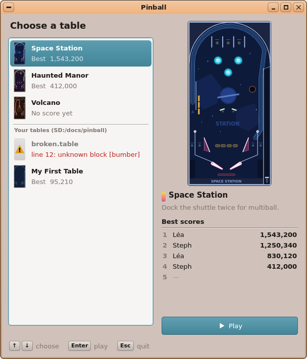
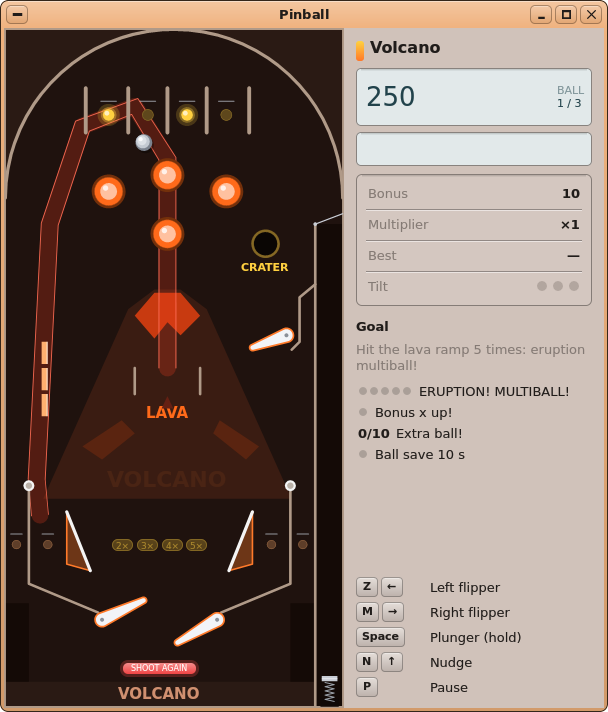
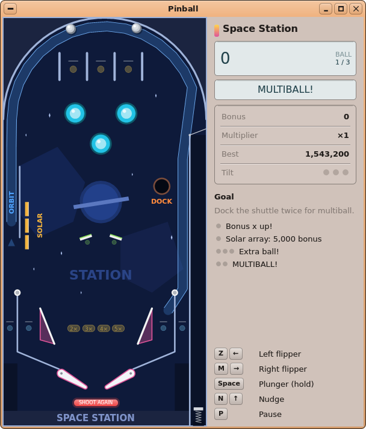
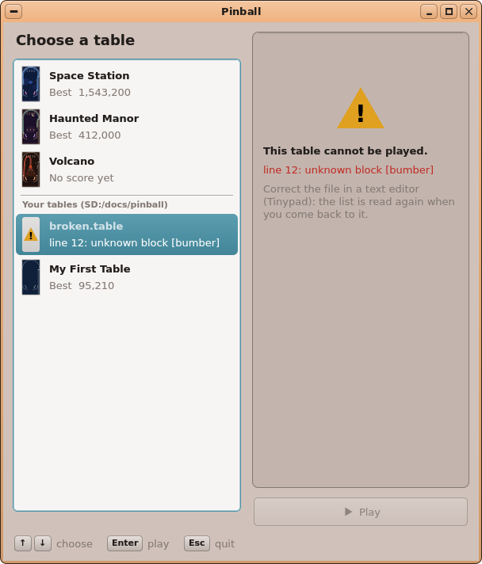
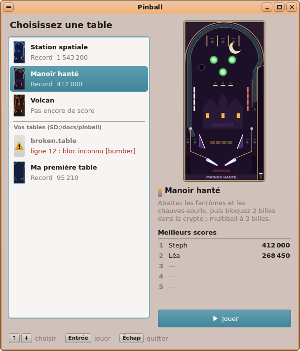

# AutoDev — tour 4 : **Pinball**, un flipper physique

*Branche `AutoDev`, le 2026-10-07. En attente de ta validation : rien n'est dans `main`, aucun paquet publié.*

## Ce qui a été choisi, et pourquoi

C'est le **3ᵉ élément de ta file** (`autodev/QUEUE.md`). Circuits et Turtle Quest ont été faits aux tours 2 et 3.
Le Product Manager lui donne 17/20 : un jeu pour tous, et Onyx a déjà ce qu'il faut. `game.h` fournit la vue de
jeu, le menu *Jeu* et les sons (AudioKit). `gamepad.h` gère la manette, et FileKit lit les fichiers texte avec
`fk_kv`. Tout se teste sur le PC.

Sans changement du noyau, de kapi, d'un kit ni d'un `.abi` (`git diff origin/main -- kernel user/Kits` est vide).

## Ce que fait Pinball

- **Trois tables**, en anglais et en français :

  | Table | Caractère | Objectif |
  |---|---|---|
  | *Space Station* / *Station spatiale* | la table de départ | amarrer la navette deux fois → multiball à 2 billes |
  | *Haunted Manor* / *Manoir hanté* | normale | vider les deux rangées de cibles, bloquer 2 billes dans la crypte → multiball à 3 |
  | *Volcano* / *Volcan* | plus rapide, avec un 3ᵉ batteur | 5 fois la rampe de lave → multiball « Éruption » |

- **La physique** est déterministe : un pas fixe de 1/60 s, découpé en sous-pas pour que la bille ne
  traverse jamais un mur. Les batteurs sont testés pendant toute leur course. Le résultat est identique bit à
  bit entre le PC et le Pi grâce à `-ffp-contract=off` et à des sinus et cosinus maison.
- **Les éléments** :
  - les batteurs et le lanceur : on tire en le tenant, et une pression brève lance à vitesse fixe ;
  - les bumpers, les slingshots, les cibles tombantes en rangées et les cibles fixes ;
  - les couloirs de passage, qui tournent avec les batteurs ;
  - les portillons à sens unique, une rampe (la bille suit un trajet dessiné, sans 3D) et un trou qui garde
    la bille puis l'éjecte.
- **Les règles** :
  - 3 billes et une bille sauvée au début ;
  - un bonus multiplié jusqu'à ×5, une bille en plus et le multiball ;
  - la secousse, avec TILT à la 3ᵉ en 5 s ;
  - des blocs `[rule]` qui comptent un événement puis déclenchent des actions.
- **Les écrans** :
  - le choix de la table : nom, objectif, miniature et top 5. Une table cassée y est grisée, avec son erreur
    « line 12: unknown block [bumber] » ;
  - le jeu, avec à droite un panneau en widgets UIKit (score, messages, bonus, multiplicateur, règles en
    pastilles, légende des touches) ;
  - la pause, le bonus de fin de bille, la saisie du nom et le top 5.
- **Les commandes** :
  - au clavier : batteurs ←/Z et →/M, lanceur Espace/↓/Entrée, secousse ↑/N, P pause, Échap retour aux
    tables, Ctrl+N nouvelle partie, S le son ;
  - à la manette : L/R pour les batteurs, A le lanceur, Y la secousse, Start la pause, Select retour aux tables.
  - Maj gauche et Maj droite ne sont pas possibles : le noyau ne signale qu'un seul modificateur Maj. Ce serait
    un changement du noyau, laissé pour plus tard.
- **Les tables sont des fichiers texte** `.table`, lus avec `fk_kv`. Leur format est décrit en entier dans
  docs/04 §12, avec ses erreurs et un exemple. Les tables du joueur s'ouvrent par *Ouvrir un fichier de
  table…* (^O), en argument, ou par double-clic : association `table = pinball`.
- **Bilingue** dès la 1ʳᵉ version : `TR ()` partout et `lang/fr.txt` (91 mots, 0 manquant). Les tables ont
  leurs clés `.fr`, et les scores sont groupés avec une espace fine en français.

## Ce qui a été construit

- **`user/Apps/pinball/`** :
  - le cœur, en C++ simple, sans UIKit, sans STL et sans fichier : `table.{h,cpp}` (lecture et erreurs avec
    leur ligne), `physics.{h,cpp}`, `rules.{h,cpp}`, `scores.{h,cpp}` (top 5 dans `scores.ini` via FileKit) ;
  - l'interface : `main.cpp`, `draw.h` (la table fixe est mise en cache hors écran : une copie et quelques
    formes par image), `panel.h` et `picker.h`.
- **Le générateur des tables** : `tools/pinball/mktables.py`. Les tables sont dans
  `sdcard/apps/pinball.app/tables/` ; on modifie le générateur, puis on régénère.
- **Les fichiers de la carte** : `app.txt` (catégorie Jeux, `opens = table`), l'icône (dessinée par
  `tools/icons/pinball_icon.py`), `lang/fr.txt`, et la ligne `table = pinball` dans `sdcard/etc/fileassoc.ini`.
- **La compilation** : `user/Makefile` (Pinball est une application FT, liée à `audiokit.imp.a`, compilée avec
  `-ffp-contract=off`).
- **Le paquet** `[app.pinball]` est déclaré dans `tools/pkg/packages.ini`, **mais pas publié**.
- **Le simulateur** : les commandes de script `hold <touche>` et `release <touche>`, et `key_held` qui leur
  répond dans `fakekapi.cpp`. Seuls les scripts de test changent ; les autres scripts ne bougent pas.
- **La doc** : docs/04 (fiche complète, tableau des jeux, liste des applications traduites), docs/03,
  HANDOFF, IDEAS. Les exports ont été régénérés.
- **Le dossier du tour** : `autodev/rounds/04-pinball/` (les 6 documents des rôles et 19 maquettes rendues par
  UIKit).

## Les tests

| Test | Résultat |
|---|---|
| `sh tools/tests/run_pinball_test.sh` (critères 1–27) | **ok**, 516 vérifications en ASan/UBSan et en -O2, 2 100 lancers seedés par table sans sortie de la table ; même empreinte de déterminisme `73999beb7987e858` dans les deux builds |
| `sh tools/tests/run_pinball_sim_test.sh` (nouveau, critères 30–31) | **ok**, 19 vérifications |
| `python3 tools/lang/check.py pinball` | 91 mots, **0 manquant** |
| `run_circuits_test.sh` | toujours **ok** |
| `shots.sh invaders pipes` (critère 37) | captures **identiques** à celles du dépôt |

Le test du simulateur, `run_pinball_sim_test.sh`, vérifie :

- une table cassée donnée en argument ouvre le choix des tables avec son erreur ;
- une bonne table donnée en argument se joue tout de suite ;
- une pression brève lance à 2300 et un tir tenu à 1863 ;
- la pause et la reprise ;
- une partie entière jusqu'à `scores.ini` (`[user.quick] 1 = 550 Player`) ;
- le nom par défaut « Joueur » en français.

Le test sur PC a été vérifié contre lui-même : en coupant volontairement les collisions des batteurs ou le
portillon, les tests correspondants échouent.

## Écarts et limites connues

- **Une bille ne reste pas posée** sur un batteur baissé : la pente la fait rouler en 0,25 s. Le test de tir
  du batteur part donc d'une bille qui le touche.
- **Les tables ont été corrigées** après les problèmes trouvés par les tests :
  - les couloirs intérieurs (inlanes) menaient au trou ;
  - l'espace entre les slingshots était trop étroit pour la bille ;
  - une bille lente pouvait rester posée sur le portillon du lanceur ;
  - les orbites étaient inatteignables ;
  - Volcano avait un coin où la bille se coinçait.
- **Le format est plus limité que prévu à deux endroits** :
  - une règle ne compte qu'un événement : la bille en plus du Manoir hanté est donc « la rangée des chauves-souris
    vidée deux fois » ;
  - le 3ᵉ batteur de Volcano alimente le cratère et les bumpers, pas la rampe.
- **Les orbites sont des tirs difficiles** : environ 2 % des coups au hasard, contre 20 % pour la rampe de lave.
- **Fenêtre et menu** : la taille minimum est de 600 × 680 (le choix des tables ne se réorganise pas). *Pause*
  n'est pas grisé dans le choix des tables : il n'y fait rien.
- **Pas faits** (les « SHOULD ») : le vérificateur de tables, une table d'exemple sur la carte, le mode
  démonstration, le *skill shot*.
- **Rien de compilé pour le Pi** : il n'y a pas de compilateur AArch64 dans le conteneur.

## Ce que tu dois vérifier à la main

1. **La compilation sur ton PC** : `make` puis `make stage` depuis `kernel/`. `pinball.elf` doit compiler (le
   Makefile a été relu ligne à ligne contre Circuits).
2. **Sur le Pi** :
   - la fluidité : la boucle tourne à environ 50 Hz et la physique rattrape jusqu'à 3 pas ;
   - les batteurs tenus, avec le vrai noyau (`KeyHeldAny`) ;
   - une manette USB, et les sons ;
   - **la sensation de jeu** : la force des batteurs, la gravité et les rebonds se règlent dans les `.table`
     et `tools/pinball/mktables.py`.
3. **Les tables** : sont-elles amusantes ? Ont-elles la bonne difficulté ? Les orbites sont-elles trop dures ?
4. Si tout te va : **fusionner `AutoDev` dans `main`**, puis publier le paquet `pinball` (skill onyx-packages).

## Comment l'essayer

- Sur le PC :
  - `sh tools/tests/run_pinball_test.sh` et `sh tools/tests/run_pinball_sim_test.sh` ;
  - `sh tools/tests/desktop_sim/shots.sh pinball` pour les captures ;
  - `SHOTS_LANG=fr` pour les voir en français.
- Sur le Pi : *Jeux → Pinball*, choisir une table, puis Espace (tenir pour tirer) et Z / M pour les batteurs.
