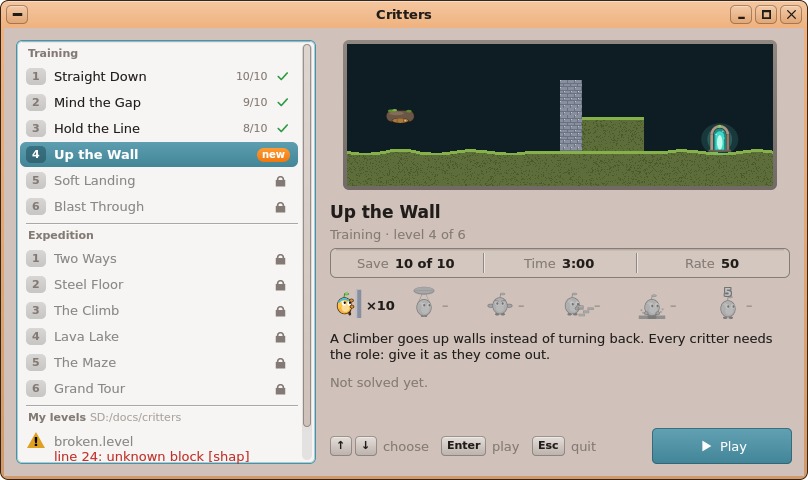
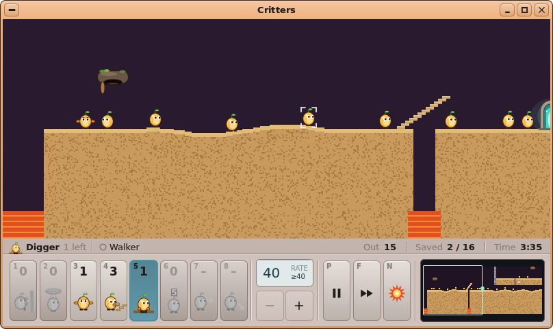
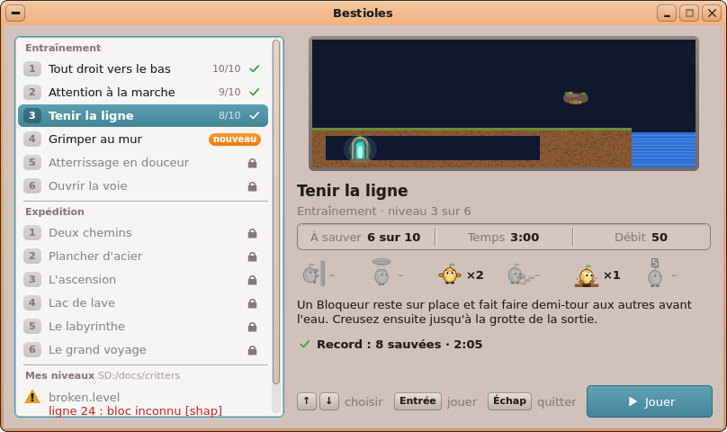
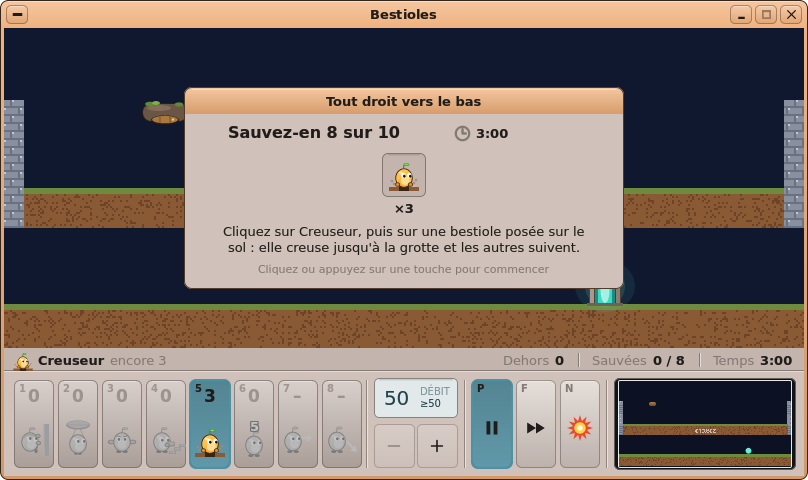
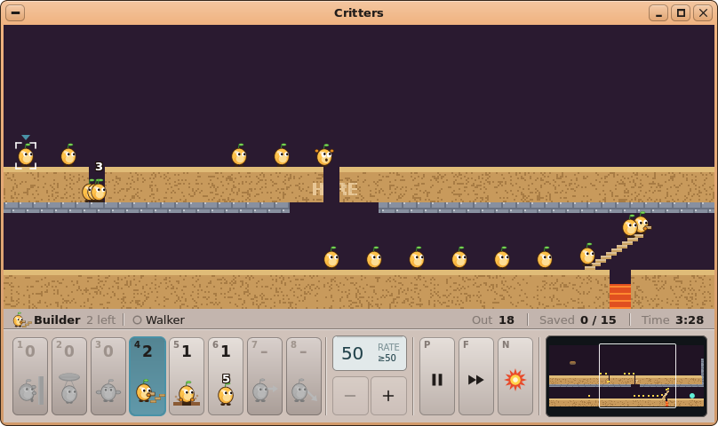
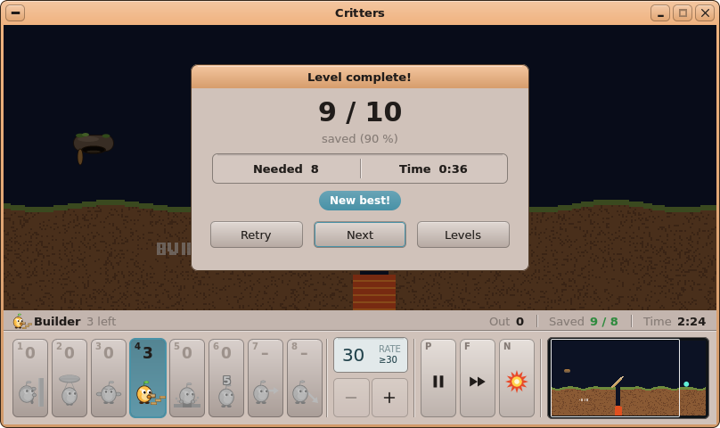
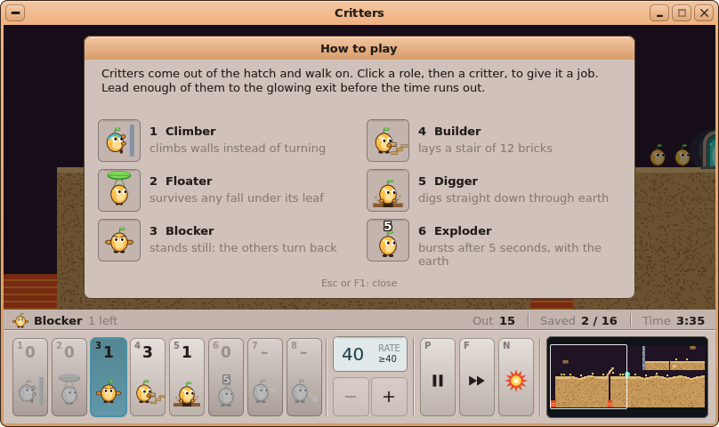

# AutoDev — tour 5 : **Critters** (*Bestioles*), guider les petites créatures vers la sortie

*Branche `AutoDev`, le 2026-10-07. En attente de ta validation : rien n'est dans `main`, aucun paquet publié.*

## Ce qui a été choisi, et pourquoi

C'est le **4ᵉ et dernier élément de ta file** (`autodev/QUEUE.md`), le « Lemmings-like ». Les trois premiers
(Circuits, Turtle Quest, Pinball) ont été faits aux tours 2 à 4. Le Product Manager lui donne 16/20 : un jeu de
réflexion pour tous, qui s'appuie sur ce que Pinball a mis en place (un moteur sans interface et déterministe, des
niveaux en fichiers texte lus par FileKit `fk_kv`, les tests sur le PC). Lemmings est une marque déposée : le nom,
les créatures et les graphismes sont **les nôtres**. Le mot « lemming » n'apparaît nulle part.

Aucun changement du noyau, de kapi, d'un kit, d'un `.abi`, du simulateur ni de `game.h`
(`git diff origin/main -- kernel user/Kits` est vide).

## Ce que fait Critters

- **Les créatures** sont rondes et jaunes, avec de grands yeux et une pousse verte sur la tête. Elles sortent
  d'un **terrier** en pierre moussue au rythme du « débit ». Elles marchent, montent les petites marches
  (6 px) et se retournent contre un mur. Une chute de plus de 60 px les tue, tout comme l'eau, la lave ou une
  chute hors de la carte. Une créature qui atteint l'**arche lumineuse** de la sortie est sauvée.
- **Le terrain est en pixels**, destructible : terre, acier (indestructible), eau, lave. Une carte fait 320 à
  1600 px de large et défile horizontalement. Elle est affichée ×2, avec une minicarte.
- **Six rôles**, donnés en nombre limité par niveau :

  | Rôle | Touche | Effet |
  |---|---|---|
  | Grimpeur (bandeau cyan) | 1 | escalade les murs ; permanent, se cumule avec les autres |
  | Parachutiste (seconde feuille) | 2 | survit à toutes les chutes ; permanent |
  | Bloqueur | 3 | reste sur place et fait faire demi-tour aux autres |
  | Bâtisseur | 4 | pose un escalier de 12 briques |
  | Creuseur | 5 | creuse droit vers le bas (jamais l'acier) |
  | Explosif | 6 | compte 5 secondes puis explose en emportant un disque de terre |

  Les emplacements 7 et 8 (Foreur horizontal et Mineur) sont prévus mais grisés pour l'instant.
- **L'objectif** : sauver *n* créatures sur *m* avant la fin du temps. La carte de fin indique gagné ou perdu,
  avec Recommencer / Suivant / Niveaux. Un bloqueur empêche le niveau de finir tout seul : quand il ne reste
  que des bloqueurs, la barre d'état le dit en ambre et l'emplacement **N** (*Tout faire exploser*) pulse.
- **12 niveaux** en deux séries, en anglais et en français. Chacun s'ouvre quand le précédent est réussi ; la
  série Expédition s'ouvre quand l'Entraînement est fini.
  - *Entraînement* (un rôle par niveau) : Tout droit vers le bas, Attention à la marche, Tenir la ligne, Grimper
    au mur, Atterrissage en douceur, Ouvrir la voie.
  - *Expédition* : Deux chemins, Plancher d'acier, L'ascension, Lac de lave, Le labyrinthe, Le grand voyage
    (1600 px, 60 créatures, deux sorties).
- **Les écrans** :
  - le **choix du niveau** : les séries, une coche et le meilleur résultat pour un niveau réussi, « nouveau »
    pour un niveau ouvert, un cadenas pour un niveau fermé, un aperçu, les rôles donnés, l'indice ;
  - la carte de départ avec l'indice, le bandeau de pause, la carte *Pause* (Échap) ;
  - la confirmation de *Tout faire exploser*, qui met le jeu en pause ;
  - la carte de fin (« Nouveau record ! ») et la carte *Comment jouer* (F1).
- **Les commandes** : 1…8 choisir un rôle ; un clic sur une créature (des crochets blancs si elle peut prendre le
  rôle, rouges sinon, avec la raison dans la barre d'état), ou **Tab / Maj+Tab** puis **Entrée** au clavier ;
  **P**/Espace la pause, **F** l'avance rapide ×3, **N** tout faire exploser, **−/+** le débit,
  **←/→** (Maj : plus vite), Origine/Fin, la molette, un glisser au bouton droit ou la minicarte pour défiler ;
  **M** le son, **Ctrl+R** recommencer, **Ctrl+O** ouvrir un niveau, **Ctrl+Q** quitter.
- **Les niveaux sont des fichiers texte `.level`**, avec des blocs `[level]`, `[shape]` (rect / points / cercle,
  matière, couleur), `[hatch]`, `[exit]` et `[label]`, et des clés `.fr` pour le français. Le format est décrit en
  entier dans docs/04 §12. Un fichier invalide est refusé avec sa ligne et la raison (« line 24: unknown block
  [shap] ») et apparaît grisé dans *Mes niveaux*. Les niveaux du joueur vont dans `SD:/docs/critters` ;
  l'association `level = critters` permet de les ouvrir par double-clic.
- **Les solutions `.sol`** (`étape action créature#`) se rejouent exactement :
  `critters <niveau> --replay <sol> --until <étape|end>` rejoue jusqu'à un point puis met en pause.
- **La progression** : `SD:/apps/critters.app/progress.ini` (réussi, meilleur nombre sauvé, meilleur temps).
- **Bilingue** dès la 1ʳᵉ version : `TR ()` partout, `lang/fr.txt` (122 mots, 0 manquant), espaces insécables
  avant `: ? ! ;` en français.

## Ce qui a été construit

- **Le moteur** (`user/Apps/critters/`) : `terrain`, `level`, `world`, `solution`, `progress` (`.h`/`.cpp`).
  Il n'utilise que des entiers (pas de flottant, de hasard, d'horloge, de kapi ni d'UIKit), avec un pas fixe de
  1/20 s. Un niveau et sa liste d'actions donnent donc toujours la même partie, au bit près sur le PC et sur le Pi.
- **La fenêtre** : `main.cpp`, `draw.h` (créatures dessinées en code avec `VPath`, pré-rendues une fois), `bar.h`
  (barre des rôles, débit, minicarte) et `picker.h` (choix du niveau).
- **Les outils** : `tools/critters/crsim.cpp` (exécution sans interface, trace, image PPM, recherche de la
  fenêtre gagnante d'une action, vérification) et `tools/critters/mklevels.py` (génère les 12 niveaux EN/FR).
- **Les données** : les 12 niveaux dans `sdcard/apps/critters.app/levels/`, leurs solutions dans
  `tools/tests/critters/solutions/`, `app.txt`, l'icône, `lang/fr.txt`, `level = critters` dans `fileassoc.ini`.
- **La construction** : `user/Makefile` (comme Pinball : `FT_APPS`, AudioKit) et `[app.critters]` **déclaré**
  dans `tools/pkg/packages.ini`, **non publié**.
- **La documentation** : docs/04 §12 (le catalogue et une section complète, avec les formats `.level` et `.sol`),
  docs/03, HANDOFF, IDEAS ; `python docs/build_docs.py` a régénéré les exports.
- **Les documents du tour** : `autodev/rounds/05-critters/` (01 à 06, et 26 maquettes rendues avec UIKit dans
  `mockups/`).

## Les tests (sur le PC)

| Test | Résultat |
|---|---|
| `sh tools/tests/run_critters_test.sh` : recherche de flottants, `rand`, horloge, kapi et UIKit dans le moteur, puis le test compilé en ASan/UBSan et en `-O2` | **ok, 930 vérifications** (12 niveaux, 12 solutions, 66 145 pas) ; même empreinte `1492ed8e6873c835` dans les deux compilations |
| Chaque niveau **gagné par sa solution enregistrée**, sans action refusée et avant la limite de temps (AC-30) | 12/12 |
| Chaque niveau **perdu sans rien faire**, et chaque niveau d'Entraînement perdu sans son rôle (AC-31) | 12/12 et 6/6 |
| Mutation : cinq constantes des règles modifiées une à une | le test échoue à chaque fois |
| `sh tools/tests/run_critters_sim_test.sh` (simulateur : fichier refusé, écriture de la progression, clic de souris sur une créature, Tab/Entrée, cartes, niveau fermé) | **25/25** |
| `python tools/lang/check.py critters` | 122 mots, 0 manquant, 0 inutilisé |
| `shots.sh critters` | 7 captures, regardées en anglais et en français, aucun texte coupé |
| Non-régression : `run_pinball_test.sh`, `run_pinball_sim_test.sh` (19/19), `run_circuits_test.sh`, `desktop_sim/run.sh`, `shots.sh pinball invaders` | tout passe ; les captures de Pinball et d'Invaders sont identiques à celles du dépôt |

## Écarts et limites connues

- **Les niveaux ont été ajustés** par rapport à l'analyse : débit plus lent sur T2, E1 et E4 (sinon la créature
  qui suit un bâtisseur tombe de l'escalier inachevé), et E3 passe à 16 créatures dont 12 à sauver, avec 14
  grimpeurs et 14 parachutistes (02 n'était pas gagnable).
- **Les grimpeurs n'escaladent pas les bords de la carte** : ils s'y retournent, sinon ils montaient au plafond et
  mouraient en tombant.
- **La confirmation de *Tout faire exploser*** est une carte qui met en pause, au lieu de « N deux fois en 2 s ».
- **Pas faits (souhaitables, pour un prochain tour)** : le Foreur horizontal et le Mineur (emplacements 7–8
  grisés), la manette, l'enregistrement des parties du joueur, `critters --check`, l'éditeur de niveaux
  graphique, et trois petits effets (le flash de l'emplacement choisi, l'éclat de la sortie, le flash de brique).
- `critters-build.png` est fait avec une `.sol` réservée aux captures, qui n'est pas une vraie solution.
- `shots.sh` (sans argument) ne lie toujours pas 3dforge, paint, pdf et printconf sur le PC (PrinterKit dans la
  compilation hôte). C'était déjà le cas avant ce tour, qui n'y touche pas.
- Dans le dock et le lanceur, le nom reste « Critters » dans les deux langues : `app.txt` n'a pas de nom par
  langue. La fenêtre, elle, s'appelle *Bestioles* en français. Une clé `name.fr` serait un petit changement
  système à prévoir.

## Ce que tu dois vérifier à la main

1. **La compilation pour le Pi** : il n'y a pas de compilateur AArch64 dans ce conteneur. Depuis `kernel/`,
   lance `make` puis `make stage` ; les lignes du `user/Makefile` sont écrites comme celles de Pinball.
2. **Sur le Pi** :
   - la fluidité : affichage ×2 de 400 colonnes, jusqu'à 80 créatures et des particules, en particulier sur
     *Le grand voyage* (1600 px, 60 créatures) et en avance rapide ;
   - les flèches tenues pour défiler, à travers le vrai noyau ;
   - les sons.
3. **Le plaisir de jeu** : la difficulté des 12 niveaux. Les solutions sont prouvées gagnables, mais certaines
   fenêtres sont serrées (*Lac de lave* : environ ±7 pas pour les bâtisseurs).
4. **Le français** dans le jeu (les noms et indices des niveaux).
5. Puis, si tout te convient : fusionner `AutoDev` dans `main` et publier le paquet `critters` (avec
   `tools/pkg/publish.sh`, que AutoDev ne lance jamais).

## Comment l'essayer

- Sur le PC : `sh tools/tests/desktop_sim/shots.sh critters` (les captures arrivent dans `screenshots/`) ;
  `SHOTS_LANG=fr` pour le français.
- Les tests : `sh tools/tests/run_critters_test.sh` et `sh tools/tests/run_critters_sim_test.sh`.
- Rejouer une solution sans interface : `tools/critters/crsim` (voir `06-development.md`).
- Sur le Pi : `make && make stage` depuis `kernel/`, puis *Jeux ▸ Critters* ; un double-clic sur un `.level`.

*AutoDev : c'était le tour 5 sur 5 ; la file est vide et `rounds_done` atteint `rounds_max`.*
