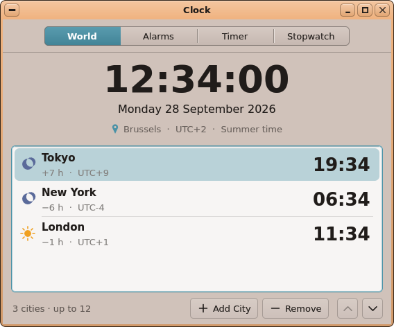
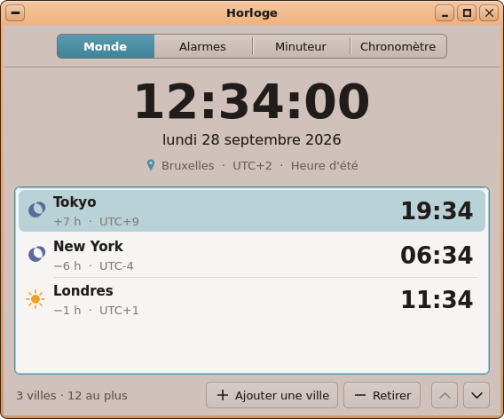
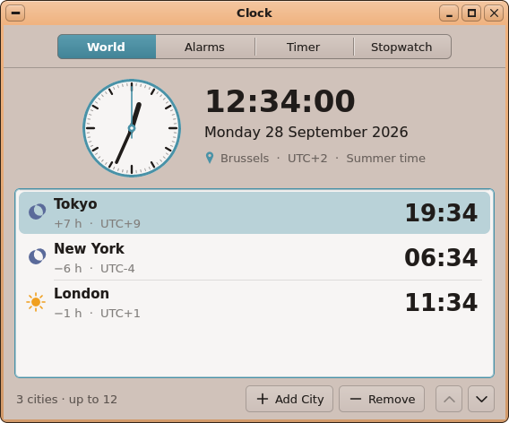
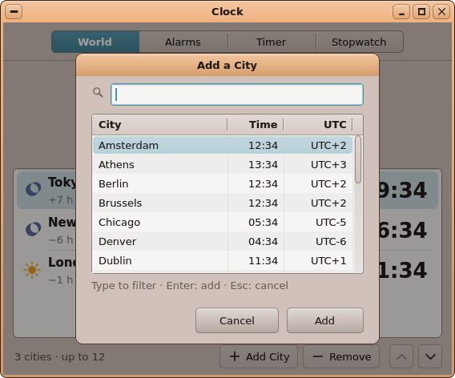
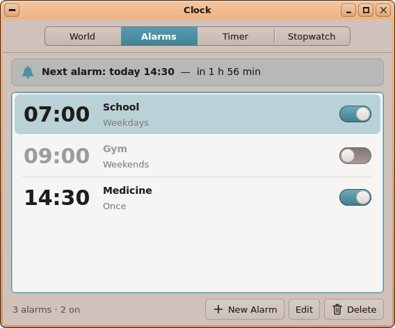
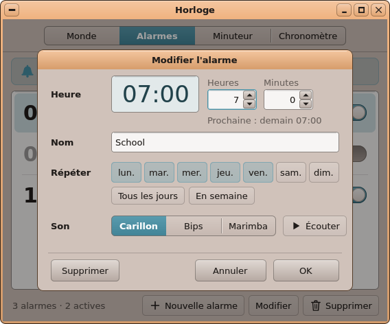
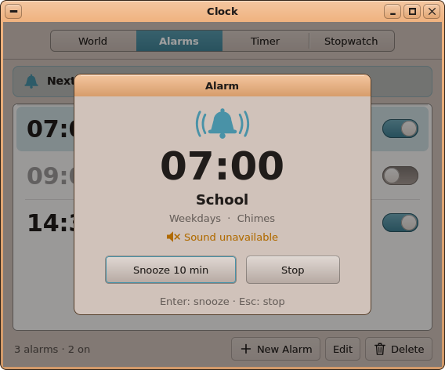
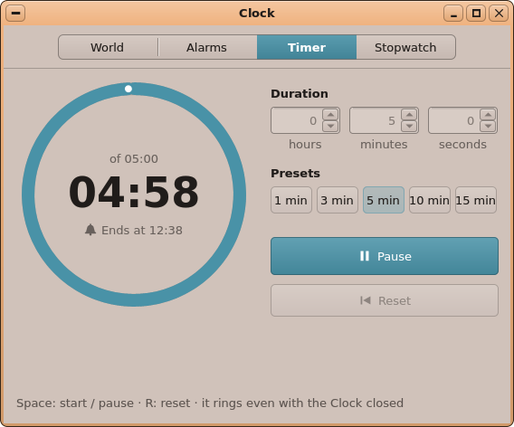
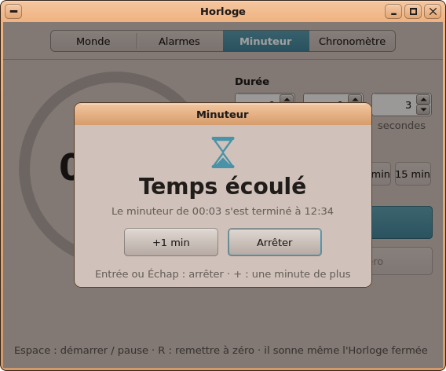
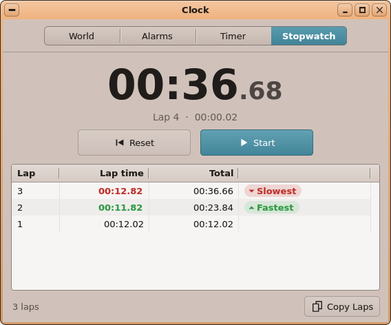

# AutoDev — tour 6 : **Clock** (*Horloge*) et son service **clockd**

*Branche `AutoDev`, le 2026-10-07. En attente de ta validation : rien n'est dans `main`, aucun paquet publié.*

## Ce qui a été choisi, et pourquoi

La file de la série 2 (tours 6 à 10) était vide : choix libre. Le Product Manager a noté sept candidats sur 20 :

| Candidat | Note | Pourquoi pas (ou pourquoi) |
|---|:-:|---|
| **Horloge** : alarmes, minuteur, chronomètre, horloges du monde | **19** | Ta feuille de route (HANDOFF, priorité 3-4, avec la liste des fonctions, déplacée par toi le 2026-10-02). Une app de tous les jours que tout bureau a et qu'Onyx n'avait pas. Tout existe dans les kits, aucun changement du noyau, presque tout est testable dans le simulateur. Et ce n'est pas un jeu (les tours 2 à 5 en étaient). |
| Sokoban : 10 niveaux de plus | 17 | Une heure de travail sur des données, pas une application ; pourra accompagner un tour de jeu. |
| À propos / Système | 15 | Le Gestionnaire des tâches en montre déjà la plus grande part ; la température et le firmware ne se voient que sur le Pi. |
| File Viewer : couleurs, étiquettes, favoris | 14 | Touche une app centrale, avec un index à tenir à jour à travers tous les déplacements : trop large pour un tour. |
| Planificateur de tâches | 12 | Sa valeur ne se voit qu'au fil des heures sur le Pi. clockd pourra en être la graine. |
| Serveur HTTP simple | 12 | — |
| Coffre à secrets | 11 | Touche cinq apps et ses choix de cryptographie méritent ton avis d'abord. |

## Ce que fait l'Horloge

Une fenêtre à quatre onglets (Monde, Alarmes, Minuteur, Chronomètre), en anglais et en français dès la première
version (*Horloge* en français). Les alarmes sonnent **même l'Horloge fermée**, grâce à un petit service sans
fenêtre, `clockd`, lancé au démarrage.

- **Monde** : l'heure d'ici en grand (secondes, date dans la langue du système, ville, `UTC+2`, *Heure d'été*), puis
  jusqu'à 12 villes choisies parmi les zones de SystemKit, avec leur heure, le soleil ou la lune, « demain » /
  « hier » et l'écart avec ici (« +7 h », « Même heure »). On ajoute une ville par une fiche avec recherche (accents
  et casse ignorés), on la retire ou on la déplace (Ctrl+N, Suppr, Ctrl+↑/↓). Sans zone choisie, un avertissement et
  un bouton *Langue et région…*. **Affichage ▸ Horloge analogique / numérique** : un cadran à aiguilles (gardé dans
  `config.ini`).

- **Alarmes** (20 au plus) : heure, libellé (40 caractères), marche / arrêt, une fois ou certains jours (*Tous les
  jours*, *En semaine*…), un son parmi trois (Carillon, Bips, Marimba) avec *Écouter*. La barre du haut dit
  « Prochaine alarme : aujourd'hui 14:30 — dans 1 h 56 min ». Une ligne montre *Reportée à 12:44* ou
  *Manquée à 07:00*.

- **Une alarme qui sonne** : une notification (un clic ouvre l'Horloge), le son en boucle, la fenêtre au premier
  plan et la fiche de sonnerie avec **Rappel dans N min** (Entrée) et **Arrêter** (Échap). Sans réponse pendant
  2 minutes : le son s'arrête et une notification *Alarme manquée* part. Si la sortie audio est occupée ou absente,
  la fiche le dit (*Son indisponible : la sortie audio est occupée*).
- **Les alarmes manquées pendant que le Pi était éteint** (dans les 12 dernières heures, alarmes « une fois ») :
  dites au démarrage, sans son, et marquées sur leur ligne.

- **Minuteur** : heures / minutes / secondes, cinq préréglages (1, 3, 5, 10, 15 min ; un double-clic règle et
  démarre), Démarrer / Pause / Reprendre / Remettre à zéro, un anneau de progression et « Sonne à 12:37 ». À
  zéro : la fiche *Temps écoulé* (Arrêter, +1 min), la notification et le Carillon. **Fermer l'Horloge ne perd
  rien** : un minuteur en marche est confié à clockd, qui le fait sonner ; rouverte avant la fin, l'Horloge le
  reprend et le montre en marche. Un minuteur en pause revient en pause.

- **Chronomètre** : Espace (démarrer / arrêter), L (tour), R (remettre à zéro), les centièmes, les tours du plus
  récent au plus ancien, le plus rapide en vert et le plus lent en rouge (à partir de 3 tours). **Copier les tours**
  (Ctrl+C) met un texte avec des tabulations dans le presse-papiers. Le chronomètre est gardé à la fermeture, et
  même à un redémarrage quand l'heure réelle était connue.

- **La barre de menus** : une petite **cloche** à gauche de l'heure quand une alarme sonne dans les 24 h (un clic
  ouvre les Alarmes), et un bouton **Alarmes et minuteurs…** sous *Ouvrir le Calendrier* dans le calendrier de
  l'heure. Sans alarme, rien ne bouge. **La barre de menus est maintenant traduite en français** (règle de
  CLAUDE.md : une app plus ancienne est traduite quand on y travaille).

- **clockd** fait aussi suivre l'**heure d'été** à l'horloge du système : la nuit du changement, l'heure change
  toute seule en moins d'une minute (seulement si une zone `zone=` est choisie dans *Langue et région*).

Toutes les captures existent en anglais et en français (`clock-*.png` et `clock-*-fr.png` : world, analogue,
cities, alarms, edit, ring, timer, timesup, stopwatch).

## Ce qui a été construit

**Aucun changement du noyau, de kapi ni d'AppKit** (`git diff origin/main -- kernel user/Kits/appkit` est vide).

| Partie | Fichiers | Quoi |
|---|---|---|
| Le cœur, sans interface | `user/Apps/clock/alarms.{h,cpp}`, `clocktime.{h,cpp}`, `clock_proto.h` | Le modèle des alarmes (`alarms.txt` lu et écrit par FileKit), le « Ringer » de clockd (une seule sonnerie, fenêtre de 2 min, saut d'heure en arrière, garde de 90 s au démarrage), les alarmes manquées, le minuteur, le chronomètre, les formats. Ni kapi ni UIKit : partagé par l'Horloge, clockd et la barre de menus. |
| L'Horloge | `user/Apps/clock/main.cpp`, `ui.h`, `world.h`, `alarmsview.h`, `ring.h`, `sounds.h`, `timerview.h`, `swview.h`, `sdcard/apps/clock.app/` (`app.txt`, icône, `lang/fr.txt` : 160 mots) | La fenêtre, les onglets, les fiches (*Veil*), une seule instance à la fois, `--ring`, `--missed`, les trois sons en **voix FM** d'AudioKit. |
| clockd | `user/Apps/clockd/main.cpp`, `sdcard/apps/clockd.app/`, `run clockd` dans `sdcard/etc/autostart` | Le service : relit `alarms.txt` (message ou changement du fichier), sonne en passant la main à l'Horloge, `locale_zone_sync` chaque minute. **clockd n'a pas de mots** : c'est l'Horloge qui notifie, dans la langue du système. |
| **SystemKit** | `systemkit/locale.h`, `locale.inc`, `systemkit.abi` : **`76 locale_zone_offset_at`**, **`77 locale_zone_sync`** | Le décalage d'une zone à un instant UTC, l'heure du changement comptée (règles UE et US) ; et l'application de ce décalage à l'horloge du système (`kapi_set_timezone` + `timezone=`), **seulement avec un `zone=` explicite**. |
| **FileKit** | `filekit/kvtext.h`, `kvtext.inc`, `filekit.abi` : **`96 fk_kv_block_get`**, **`97 fk_kv_block_new`**, **`98 fk_kv_block_set`** | Écrire plusieurs blocs du même nom (`[alarm]` répété), ce que `fk_kv_set` ne savait pas faire. |
| Le simulateur | `tools/tests/desktop_sim/fakekapi.cpp` | `SIM_CLOCK=AAAAMMJJHHMMSS` (une horloge qui avance avec les ticks), `SIM_TZ`, `kapi_clock_info`, `set_timezone` journalisé. Sans `SIM_CLOCK`, tout est comme avant. |
| La barre de menus | `user/Apps/menubar/main.cpp`, `sdcard/apps/menubar.app/lang/fr.txt` (nouveau, 41 mots) | La cloche, *Alarmes et minuteurs…*, la traduction. Elle lie le cœur de l'Horloge. |
| Construction, captures | `user/Makefile` (`clock.elf`, `clockd.elf`, `menubar`), `tools/tests/desktop_sim/shots.sh` (bloc `clock`), `tools/tests/desktop_sim/clock/` (fixtures), `tools/icons/clock_icon.py` | — |
| Documentation | docs/04 (catalogue Clock et clockd, une section complète, la barre de menus, *Langue et région*), docs/03 (l'Horloge et clockd comme **modèle d'une app avec un service sans fenêtre**, la règle de fermeture, `SIM_CLOCK`), docs/06, docs/12 et docs/14 (régénérés ; `kitdocs.py` documente maintenant `systemkit/locale.h`), HANDOFF, IDEAS ; exports régénérés | — |
| Paquet | `tools/pkg/packages.ini` (`[clock]` déclaré), `tools/pkg/versions.ini` | **Voir l'avertissement plus bas.** |

Les documents du tour : `autodev/rounds/06-clock/` (01 à 06, et les maquettes rendues avec UIKit dans `mockups/`).

## Les changements de périmètre décidés à l'analyse

- **Pas de « Quitter quand même ? »** à la fermeture avec un minuteur ou un chronomètre en marche : le bouton de
  fermeture ne peut pas être refusé sans un nouveau kapi. Donc **aucune question, et chaque sortie passe la main** :
  le minuteur à clockd, le chronomètre dans `config.ini`. (Un « fermeture refusable » est noté dans IDEAS.)
- **L'alarme manquée est montrée sur sa ligne** (*Manquée à 07:00*) plutôt que dans un historique des notifications :
  notifyd n'en garde pas (une bulle reste 8 s). Un centre de notifications est noté dans IDEAS.
- **Les sons sont des voix FM**, pas la SoundFont : 32 Mo à charger au moment de sonner, absente d'une carte légère.
  Les voix FM ne demandent aucun fichier et partent tout de suite.
- **Les notifications sont envoyées par l'Horloge**, pas par clockd : clockd lance l'Horloge (ou lui envoie un
  message) et n'a donc aucun mot à traduire. Sans Horloge installée, clockd envoie une bulle sans mots (`07:00`, le
  libellé).
- Une alarme dans l'heure sautée au passage à l'heure d'été (02:30) ne sonne pas ce jour-là ; à l'heure d'hiver,
  l'heure répétée ne sonne pas deux fois. C'est dit dans docs/04.

**Les « souhaitables » faits** : le minuteur confié à clockd et le chronomètre gardé (passés en « obligatoires »), la
cloche et *Alarmes et minuteurs…* dans la barre de menus (S1), les alarmes manquées Pi éteint (S2), le cadran
analogique (S3). **Pas fait** : plusieurs minuteurs nommés à la fois (noté dans IDEAS).

## La boucle de validation

Trois passes de validation, par un analyste technique « neuf » à chaque fois :

| Passe | Verdict | Écarts trouvés et corrigés |
|---|---|---|
| 1 | Pas vert, 5 écarts | (1) `locale_zone_sync` aurait **deviné** la zone depuis `timezone=` : le 25 octobre, une carte sans `zone=` serait passée à Helsinki et à **UTC+3** → il ne lit plus que `zone=` ; (2) « Son indisponible » ne pouvait pas être détecté comme prévu → `ak_out_open (0, 0)` en sonde ; (3) un minuteur confié à clockd puis l'Horloge rouverte : rien n'était dit → l'Horloge le reprend ; (4) les captures françaises n'auraient pas été produites → lignes `-fr` explicites ; (5) Entrée / Échap et Ctrl+1…4 mangés par les zones numériques → un `Spin` à côté de l'app. |
| 2 | Pas vert, 2 écarts | (1) le minuteur, une fois sonné, aurait été relancé toutes les 0,5 s → `timer_rung` dans le Ringer et le bloc `[timer]` retiré par l'Horloge ; (2) des textes encore « Ctrl+Q demande » → alignés sur « aucune question ». |
| 3 | **Vert** | Cinq notes non bloquantes, toutes suivies (un `[timer]` périmé d'un ancien démarrage effacé, `+1 min` qui garde l'Horloge ouverte, etc.). |

## Les tests (sur le PC)

| Test | Résultat |
|---|---|
| `sh tools/tests/run_clock_test.sh` : simulateur, `locale_zone_offset_at` (77 vérifications, toutes les zones heure par heure sur 2026-2027), `locale_zone_sync` (y compris le cas « pas de `zone=` » : rien n'est écrit), cœur en UBSan `-O1` et en `-O2` | **ok** : alarmes 174, clocktime 129 |
| `sh tools/tests/run_clock_sim_test.sh` : clockd, l'Horloge et la barre de menus pilotés dans le simulateur | **220 / 220** |
| `sh tools/tests/run_kvtext_test.sh` | 148 + 162 vérifications, 21 symboles exportés |
| Non-régression : `run_notes_test`, `run_notes_sim_test` (67), `run_stickies_sim_test` (29), `run_clipboard_test`, `run_pkg_test`, `desktop_sim/run.sh` ; au début du tour aussi circuits, critters, pinball, mail, media, letters, slides, archiver | tout passe |
| `python3 tools/lang/check.py clock menubar` | clock 160 mots, menubar 41 : **0 manquant** |
| `shots.sh clock` | 19 captures, regardées en anglais et en français, aucun mot coupé |
| Les autres captures de la barre de menus (menubar, tray, usb, wifi, volume, stickies…) | identiques (voir les deux exceptions plus bas) |
| Compilation AArch64 (`clang++ --target=aarch64-none-elf`, les drapeaux du Makefile, `-Wall -Wextra`) de clockd, l'Horloge, le cœur, la barre de menus, SystemKit, FileKit | aucune erreur, aucun avertissement propre ; `libgen` sur ces objets ajoute **exactement** les lignes `.abi` commitées |

Le `make` du Pi **n'a pas été lancé** : il n'y a pas de `aarch64-none-elf-g++` dans ce conteneur.

## Limites connues et problèmes déjà là avant ce tour

- `shots.sh` lancé **sans argument** s'arrête : la compilation PC ne lie pas PrinterKit (3dforge, letters, ledger,
  paint, pdf, photos, sheet, slides). Le groupe `media` demande le module Python `mutagen`. `shots.sh <noms>`
  fonctionne. Déjà vu au tour 5.
- `clock.png` (la barre de menus) : le cadre du bouton *Ouvrir le Calendrier* différait de l'image commitée, mais
  `origin/main` le dessine de la même façon (un changement de style des boutons UIKit dans `main`). L'image est de
  toute façon refaite (deux boutons maintenant).
- `desktop.png` et `milk.png` diffèrent de `screenshots/`, mais **pareil sur `origin/main`** : une dérive plus
  ancienne, non touchée.
- Une alarme due dans les 90 s après le démarrage ne sonne pas (l'heure n'est pas encore sûre) : elle est désormais
  dite manquée (S2).
- Les sons FM sont une première version, à juger à l'oreille.
- Trois programmes lient maintenant le cœur de l'Horloge (et le code des dates existe en plusieurs exemplaires dans
  Onyx) : un **kit de dates** est proposé dans IDEAS.
- Un second clockd qui doit se fermer seul : pas testable dans le simulateur.

## ⚠ Important : les versions des kits et le paquet

`tools/pkg/versions.ini` **a été modifié** : `filekit = 1.99.0` (était 1.96.0) et `systemkit = 1.78.0` (était
1.76.0), pour que les besoins déclarés puissent être satisfaits à la publication. `[clock]` est **déclaré** dans
`tools/pkg/packages.ini`, et `[onyx]` demande maintenant `filekit >= 1.99` (la barre de menus lie le cœur de
l'Horloge). **RIEN n'a été publié** : à faire **après ta validation**, avec `sh tools/pkg/publish.sh` (le paquet
`clock`, `onyx` avec la barre de menus, FileKit 1.99 et SystemKit 1.78).

## Ce que tu dois vérifier à la main sur le Pi

- [ ] **`make` puis `make stage`** depuis `kernel/` ; vérifier que `systemkit.abi` et `filekit.abi` ne bougent pas
      (les lignes 76-77 et 96-98 doivent rester celles commitées).
- [ ] **Une alarme avec l'Horloge fermée**, une autre app devant : elle sonne, la fiche vient, *Rappel* et
      *Arrêter* répondent tout de suite ; le délai entre la minute et la sonnerie.
- [ ] **Les trois sons** (Carillon, Bips, Marimba) sur le jack et en HDMI ; le son coupé.
- [ ] **Sortie son occupée** (le Lecteur multimédia qui joue) : *Son indisponible : la sortie audio est occupée*,
      l'alarme vient quand même.
- [ ] **2 minutes sans réponse** : le son s'arrête, *Alarme manquée*, la ligne marquée.
- [ ] **Un redémarrage** : les alarmes sont gardées, la suivante sonne ; une alarme passée pendant que le Pi était
      éteint n'est **pas** sonnée mais dite manquée (après 90 s).
- [ ] **La précision du minuteur** (AC-36) : 10 minutes à 1 s près ; *Temps écoulé* venu par clockd après une
      vraie fermeture.
- [ ] **La nuit de l'heure d'été** (ou en réglant la date) : l'horloge change en moins d'une minute.
- [ ] **La cloche** de la barre de menus apparaît moins d'une minute après une alarme créée ; la barre de menus en
      français après un redémarrage.
- [ ] **Un second `clockd`** lancé à la main se ferme tout seul.
- [ ] Puis, si tout te convient : fusionner `AutoDev` dans `main` et publier.

## Comment l'essayer

- Sur le PC :
  - `sh tools/tests/run_clock_test.sh` (le cœur, les zones, le simulateur) ;
  - `sh tools/tests/run_clock_sim_test.sh` (clockd, l'Horloge et la barre de menus ; les images de chaque cas
    restent dans `/tmp/onyx_clock_sim/`) ;
  - `sh tools/tests/desktop_sim/shots.sh clock` (les 19 captures dans `screenshots/` ; pour regarder ailleurs :
    `SHOTS_PNG=<dossier>`, et `SHOTS_LANG=fr` pour la barre de menus en français).
- Sur le Pi : fusionner `AutoDev`, puis `make && make stage` depuis `kernel/`, copier la carte, redémarrer
  (clockd part de `autostart`), puis *Productivité ▸ Horloge*, ou la cloche / *Alarmes et minuteurs…* de la barre
  de menus.
