# AutoDev round 1 — UX Designer: Notes + Stickies

Date: 2026-10-06. Inputs: `01-product-manager.md`, `02-product-analysis.md` (the acceptance criteria, "AC n"),
`03-technical-analysis.md` (the plan, "03 §n"). Read for consistency: `docs/11-UIKIT.md` (ToolBar / ToolButton, Splitter,
Textarea, Menu, dialog, paint, text), `docs/gui-redesign/README.md` (the modernised CDE: the agenda as part of the
wallpaper, no window shadows, the theme's palette), and the polished FreeType apps — **Mail** (`user/Apps/mail/main.cpp`:
the accent "New message" pill, the list on the field colour with a rounded tinted selection, a count badge, a search
field at the right of the tool bar), **Calendar** (`views.h`: `HintBox`, `AccentButton`), **Letters** (the UIKit
`ToolBar`), and the **agenda** widget (`user/Apps/agenda/main.cpp`: the see-through, back-most window, its header, its
etched line, its `wall_text`).

**Every picture below is rendered by UIKit itself** in the desktop simulator (host `g++`, `fakekapi.cpp`, FreeType's
DejaVu Sans 13 px as the FT apps): a throwaway gallery, `mockups/notes_mock.cpp`, builds the window and the widget
from real UIKit widgets (`ToolBar`, `ToolButton`, `HSplitter`, `Panel`, `Textarea`, `Textbox`, `MessageBox`) plus
the two owner-drawn pieces the plan puts beside the app (`NoteList`, the Stickies cards), and the **real** menu bar,
agenda and dock run around it; `compose.py` lays them over the default Voronoi wallpaper. To redo them:

```sh
sh autodev/rounds/01-notes/mockups/mockups.sh      # ~15 s; writes autodev/rounds/01-notes/mockups/*.png
```

(The sample notes are dated for the simulator's fixed clock, Monday 28 September 2026, 12:34.)

---

## 0. The decisions taken (the open questions of 02 / 03)

| # | Question | Decision |
|---|---|---|
| D1 | Menus have **no check marks** (03 §3.4, R10) — how is a toggle's state shown? | **Label toggles in the menus + the state in the tool bar.** *Note ▸ Pin to Desktop* ↔ *Unpin from Desktop*; *View ▸ Show Stickies on the Desktop* ↔ *Hide Stickies from the Desktop* (the label says what the item **will do**). The colour items carry no mark: the tool bar's six colour buttons show the current one lit (a `ToolButton` toggle `on`), and the editor's info line names it. The tool bar's **Pin** toggle is lit when the note is pinned. AC 10's "check mark" is read as *the lit Pin toggle + the label "Unpin from Desktop"*. Real check marks: a later UIKit + menu bar feature. |
| D2 | Does Notes write `run stickies` into `SD:/etc/autostart` (03 R3)? | **Only on the explicit *View ▸ Show Stickies on the Desktop*, never as a side effect** (revised after validation 1). On that action, and only then, Notes calls SystemKit's helper (`systemkit/autostart.h`, 03 G7): `autostart_has ("run stickies")` — true for an active `run stickies` line **or** a held-back `#setup: run stickies` line → **nothing is written**. Otherwise `autostart_ensure ("run stickies", "run agenda")` inserts the line (with one comment line before it, `# Stickies: the pinned notes on the desktop (Notes, View menu)`) **right after the agenda's line** (`run agenda` or `#setup: run agenda`); with no agenda line, **before `preload /boot`** (which stays the last line, as `preloadini.h` and the Preload applet say); with neither, at the end. It never edits, moves or removes another line. Then Stickies is launched and the **status line** says what happened, in keyconf's words (`user/Apps/keyconf/main.cpp:94`): written → *"Stickies shown, and started at every boot (SD:/etc/autostart)."*; already there → *"Stickies shown."*; the write failed → *"Stickies shown (autostart not written)."* (dim, not red: Stickies runs anyway). **A pin never touches autostart**: pinned while Stickies is off → the note is pinned, nothing is launched, the View item still reads *Show Stickies…*; pinned while on but not running → `lx_launch ("stickies")` only. ***Hide* never writes autostart** (Stickies reads `stickies = 0` and quits, AC 22); its status: *"Stickies hidden."* Why write at all: "Show" must survive a reboot on a card updated by a package (where `etc/*` is the user's and never gets the new line). New cards ship `#setup: run stickies` (Setup gives it back), which `autostart_has` counts as present, so Stickies is never started during Setup. |
| D3 | A note **emptied** by the user (it had a file) — `kapi_remove` or the Trash (03 §3.3)? | **The Trash** (`notes_trash`), silently (no notification): the file still holds the last text written before it was emptied, so the Trash keeps it recoverable. A note that never had text has no file: it just disappears. |
| D4 | **Delete** confirmation? | None (02 §4.5): the Trash is the undo; the notification *"Note moved to the Trash"* says where it went. |
| D5 | The **colour** control | Six small round `ToolButton`s in the tool bar (a click = that colour), plus the six flat items of the *Note* menu. No split button, no pop-up palette (UIKit has none ready), no colour shortcuts (`UK_CTRL ('1')` is `^Q`). |
| D6 | The editor's look | `NoteEdit` (a `Textarea`) **in the note's paper**: its colours (`setColors`) are the paper softened toward the field (`uk_mix (C_FIELD, paper, 150)`), the text one size up (DejaVu Sans **15 px**, a face of its own around its `onDraw` / `onMouse` / `onKey`: `UkFaceScope`) — the colour is felt while writing, as on a real sticky note. The first line is the title (plain text: the Textarea has no styles). |
| D7 | The primary action | **New Note** as the accent pill of Mail and Calendar — done with UIKit's own `ToolButton` (`filled = true`, `setOn (true)`, not a toggle: a click does not flip it), so no app copy of `AccentButton`. |
| D8 | A save that **fails** (card full, read-only) | No dialog while typing: the status line says so in red and Notes retries at each pause. If the window is closed with the note still unsaved, its text is put on the **clipboard** (`clip_set_text_n`) and a notification says *"Notes could not save “<title>”: its text is on the clipboard"* — nothing typed is ever lost silently, and no modal is needed at quit time. |
| D9 | Stickies' **cards** | Each its own height (its title + up to **6** wrapped body lines), not a fixed height: three short notes take little room. Cards are paper on the wallpaper (a soft shadow, a coloured band at the top); the header is the agenda's (text and etched line straight on the wallpaper). |
| D10 | Stickies' window size | One window **240 px wide**, as tall as the screen allows above the dock (`screen_h − 40 − 120`); the pixels below the last card fully see-through (`0xFF000000`: the clicks fall through to the desktop), the header and the cards `0xFE…`-backed like the agenda's (the clicks land). No resize at each change. |
| D11 | Stickies' **header text** (FreeType on a see-through canvas) | `uk_text` with a face does not heed `uk_paint_alpha` (the mock-up's first try came out garbled): the glyphs must be blended by coverage. The agenda's `wall_text` (bitmap glyphs only) becomes a UIKit helper that works with a face too — **`uk_text_over`** (§10, GUI plan G1). |
| D12 | The search | **Later (not this round**, validation 1 gap 2): no search field, no *Find…*, no Ctrl+F. When it comes: a `HintBox` ("Search notes") at the right of the tool bar, `HintBox` moved into UIKit in a header of its own not included by `uikit.h` (Mail, Calendar and Photos each define one). |
| D13 | The trash and pin icons | Added to UIKit's tool icons (`WKT_TRASH`, `WKT_PIN`, appended before `WKT_COUNT`), reusable by any app; the colour buttons' round dots are drawn by Notes' own `ToolIconFn` (a colour per button: app-specific). |

---

## 1. The pictures

| Picture | What it shows |
|---|---|
| `mockups/notes-window.png` | The Notes window, six notes, *Shopping* selected (pinned, yellow), the list focused |
| `mockups/notes-empty.png` | The first start: no `SD:/Notes`, one new empty note, the caret in the editor |
| `mockups/notes-search.png` | **Later idea, not this round**: the search field holding "club": one note found (kept for the record) |
| `mockups/notes-error.png` | A save that failed: the status line |
| `mockups/notes-dialog.png` | The one dialog: a dropped file larger than 64 KB refused (`MessageBox`) |
| `mockups/notes-menu-file.png`, `-edit`, `-note`, `-view` | The four menus in the menu bar (the real `menubar` app, Notes' spec) |
| `mockups/stickies.png` | Stickies on the wallpaper: three pinned notes |
| `mockups/stickies-hover.png` | The pointer over a card |
| `mockups/stickies-empty.png` | Nothing pinned: the hint |
| `mockups/desktop-stickies.png` | The whole desktop: agenda top left, Stickies top right, the Notes window in front (it covers the cards: back-most, AC 27), the dock |
| `mockups/desktop-clean.png` | The desktop with no window: agenda and Stickies side by side |

> **Scope of round 1 (validation 1):** of the *should* items only **Open in Text Editor (Ctrl+E)** is kept; the
> search, the checklist boxes and their tick, *Sort by*, the drag out and *Export…* are **later, not this round**. The
> mock-ups were re-rendered without them (no search field in the tool bar, no *Export…* / *Find…* in the menus,
> `[ ]` / `[x]` drawn as plain text on the cards), except `notes-search.png`, kept as a later idea. **The real
> `notes` screenshot (`shots.sh`) has no search field either.**

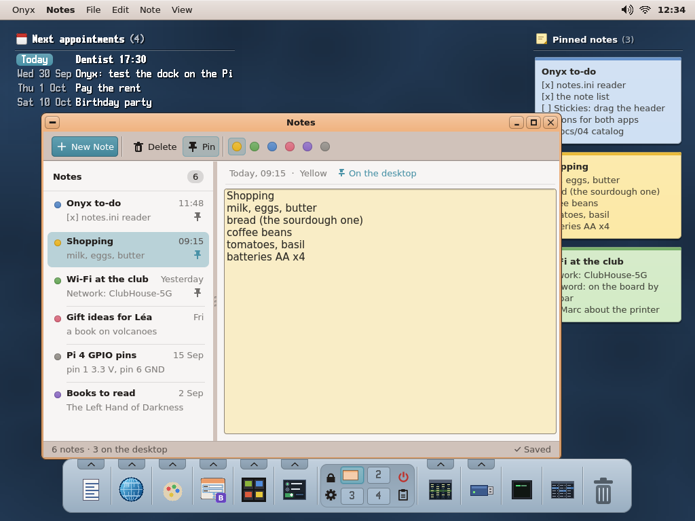

---

## 2. The Notes window

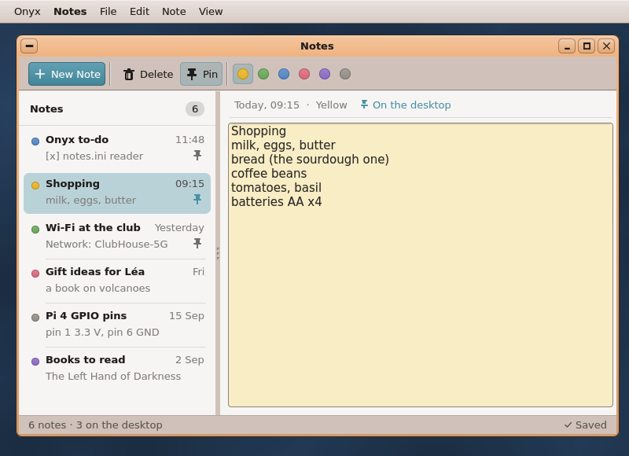

**Window**: `Root (760, 480, "Notes")`, `setResizable (true)`, `setMinSize (520, 320)`; size and split from
`SD:/apps/notes.app/config.ini` (`width`, `height`, `split`). Title *Notes* (the frame draws it). One window: a second
`notes` forwards its argument and quits (03 §3.3).

### 2.1 The widget tree (client coordinates, the default 760 × 480)

| Widget | UIKit class | Place, size (px) | Notes |
|---|---|---|---|
| tool bar | `ToolBar` (`uikit/toolbar.h`), `line = true` | 0, 0, 760 × 44; anchored left + right | the buttons below, centred vertically |
| New Note | `ToolButton` 30 high, `setGlyph (WKT_PLUS)`, `setText ("New Note")`, `fitWidth`, `filled = true`, `setOn (true)` (not a toggle) | gap 6 | tip *New note (Ctrl+N)*; the accent pill |
| — | `ToolBar::sep ()` | | |
| Delete | `ToolButton` 30 high, `setGlyph (WKT_TRASH)` (new, D13), `setText ("Delete")`, `fitWidth` | gap 4 | tip *Delete note: to the Trash (Ctrl+D)*; `setDisabled` when the note is new and empty |
| Pin | `ToolButton` 30 high, `setGlyph (WKT_PIN)` (new), `setText ("Pin")`, `setToggle (true, pinned)`, `fitWidth` | gap 2 | tip *Pin to the desktop (Ctrl+P)*; lit = pinned (D1) |
| — | `sep ()` | | |
| six colours | 6 × `ToolButton (26, 26)`, `setIcon (notes_icon, IC_DOT0 + c)`, `iconSize = 18`, `setToggle (true, c == current)` | gap 2 then 0 | tips *Yellow* … *Grey*; a click sets the colour and lights only that one (the others `setOn (false)`) |
| body | `HSplitter`, `split = 250`, `minA = 180`, `minB = 260`, `bg = C_FIELD` | 0, 44, 760 × 412; `ANCHOR_FILL` | the grip: UIKit's |
| the list | **`NoteList`** — owner-drawn, beside the app (`user/Apps/notes/notelist.h`, a `Widget`) | pane A | §2.2 |
| the editor's pane | `Panel` (`bg = C_FIELD`) | pane B | |
| info line | `Label` (`fg = uk_mix (C_FIELD, C_FIELD_TEXT, 140)`, `bg = C_FIELD`) | 0, 0, pane width × 34 | *"Today, 09:15 · Yellow · On the desktop"*; the mock-up's pin glyph before *On the desktop* (in the accent) is optional: a 10-line `Label` subclass beside the app if wanted |
| the editor | **`NoteEdit : Textarea`** — beside the app (`main.cpp` or `notelist.h`), capacity 65 536 | 10, 40, pane − 20 × pane − 50; `ANCHOR_FILL` | D6: `setColors (sheet, NOTE_INK, C_ACCENT, uk_mix (sheet, C_ACCENT, 90))`, an `FtTextFace` 15 px in a `UkFaceScope` around `onDraw` / `onMouse` / `onKey`; `onKey` → base, then the dirty mark (03 §3.3) |
| status line | 2 × `Label` on `C_BG` (left: counts; right: what happened) — or one owner-drawn strip | 0, 456, 760 × 24; anchored left + right + bottom | a 1-px line on top (`uk_mix (C_BG, C_TEXT, 40)`); §5 |

### 2.2 `NoteList` — the rows (owner-drawn, beside the app)

On `C_FIELD`, scrolls with UIKit's own bar (`uk_draw_vscroll`, `UkBarDrag`) when the rows overflow.

- **Head**, 44 px: *Notes* in bold at x = 14; at the right a count badge — a pill 19 px
  high, radius 9, `uk_mix (C_FIELD, C_FIELD_TEXT, 36)`, the number in `C_FIELD_TEXT` (*6*); a 1-px line under it (`uk_mix (C_FIELD, C_FIELD_TEXT, 30)`).
- **Rows**, 56 px each, from y = 48 (newest first):
  - the colour **dot**: 10 px round at (16, y + 11), the dot colour's gradient (`uk_rbox`, `uk_tone (dot, 150)` →
    `dot`), a darker rim;
  - the **title** (first line; *New Note* in bold italic and dim while empty) in **bold** at (34, y + 5), cut with
    `uk_text_fit` to what the date leaves;
  - the **date** right-aligned at width − 14, dim: today *09:15*; yesterday *Yesterday*; this week the day *Fri*;
    this year *15 Sep*; before *15/09/2025*; unknown (`modified = 0`): nothing;
  - the **preview** (the second line, else nothing) at (34, y + 26), dim, cut with `uk_text_fit`;
  - the **pin** glyph (15 px) at (width − 30, y + 26) when the note is on the desktop — `C_ACCENT` on the selected
    row, else `uk_mix (C_FIELD, C_FIELD_TEXT, 160)`;
  - between rows a 1-px line from x = 34 (none next to the selection);
  - the **selection**: a rounded box (6, y, width − 12, 52, radius 7) in `uk_mix (C_FIELD, C_ACCENT, 90)` when the
    list has the focus, `… 60)` when not (Mail's tinted selection — the text stays `C_FIELD_TEXT`).
- **Mouse**: a click selects (saves the note left first); the wheel scrolls; a **drop** of `.txt` / `.md` files
  over the list imports them (AC 13). Hover: no highlight (Mail's list has none either). Right-click: nothing this
  round.
- **Keys** (focused): Up / Down / Page Up / Page Down / Home / End move the selection; **Enter** or **Tab** → the
  editor (caret where it was); **Delete** → Delete Note.

### 2.3 The editor

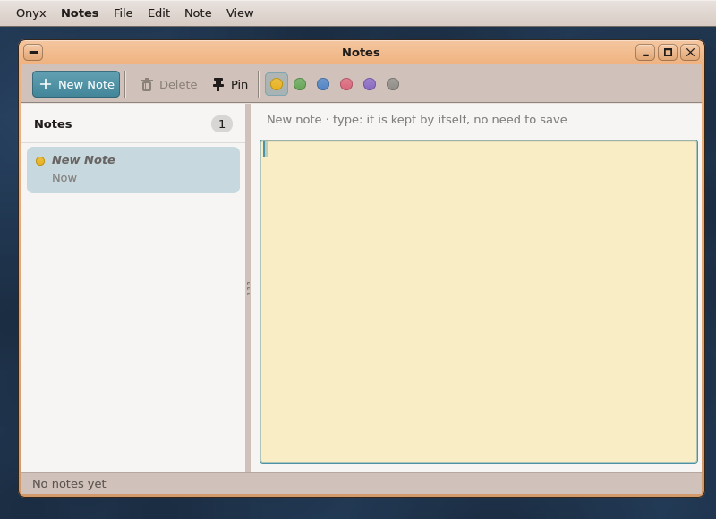

The selected note's whole text; typing marks it dirty (03 §3.3: written ~1 s after the last key, on selection change,
on quit). The list's row follows the first line as it is typed. **Tab** goes back to the list (a Textarea has no
tab character in a note). Ctrl+X / C / V / A as in every UIKit text (the menu's shortcuts call `cut / copy / paste /
selectAll`). A drop of text lands at the caret.

---

## 3. The menus (the system menu bar; `uikit::Menu`)

| File | Edit | Note | View |
|---|---|---|---|
| 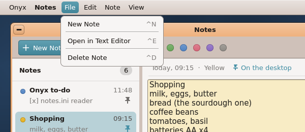 | 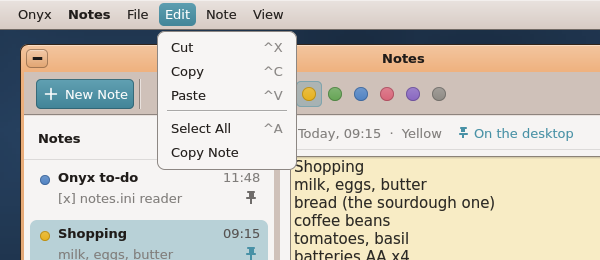 | 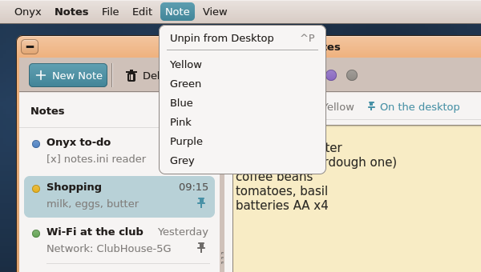 | 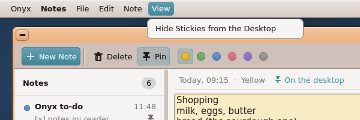 |

| Menu | Item | Shortcut | What it does / when |
|---|---|---|---|
| **File** | New Note | **Ctrl+N** | an empty note on top, selected, the caret in the editor |
| | — | | |
| | Open in Text Editor (the one *should* kept) | **Ctrl+E** | saves, then `lx_launch ("tinypad", path)` |
| | — | | |
| | Delete Note | **Ctrl+D** | to the Trash (`notes_trash`), the next note selected, the notification; on a new empty note: nothing |
| **Edit** | Cut / Copy / Paste | **Ctrl+X / C / V** | the editor's (`Textarea::cut / copy / paste`, the shared clipboard) |
| | — | | |
| | Select All | **Ctrl+A** | the editor's |
| | Copy Note | — | the whole note's text to the clipboard (`clip_set_text_n`) |
| **Note** | Pin to Desktop **/** Unpin from Desktop | **Ctrl+P** | the label says what it will do (D1); the tool bar's Pin toggle follows |
| | — | | |
| | Yellow, Green, Blue, Pink, Purple, Grey | — | the colour (D5); no mark: the tool bar shows the current one |
| **View** | Show Stickies on the Desktop **/** Hide Stickies from the Desktop | — | AC 11; the label says what it will do (D1); "Show" also ensures the autostart line and says so in the status line (D2); "Hide" writes nothing |

The menu bar adds *Notes ▸ Quit* (**Ctrl+Q**) itself. The menus are built by one `build_menu ()` and **re-published
whenever a label changes** (a selection change, a pin, the Stickies switch) — the Game Library's pattern
(`user/Apps/gamelib/main.cpp`). The menu spec used for the pictures is in `mockups/mockups.sh` (`MENU=`).

## 4. Keyboard

| Keys | Where | Does |
|---|---|---|
| Ctrl+N | anywhere | New Note |
| Ctrl+D | anywhere (a menu shortcut: Root routes keys through the menu first) | Delete Note |
| Delete | the list | Delete Note |
| Ctrl+P | anywhere | Pin / Unpin |
| Ctrl+E (the one *should* kept) | anywhere | Open in Text Editor |
| Ctrl+X / C / V / A | the editor | cut / copy / paste / select all |
| Up / Down / Page Up / Page Down / Home / End | the list | move the selection (the note left is saved) |
| Enter, Tab | the list | to the editor |
| Tab | the editor | back to the list |
| Ctrl+Q, the close button | anywhere | quit (after the save, D8) |

## 5. The states

| State | What the user sees | Picture |
|---|---|---|
| **First start / no notes** (no `SD:/Notes`, or empty) | One row *New Note* (bold italic, dim, the yellow dot, *Now*), selected; the info line *"New note · type: it is kept by itself, no need to save"*; the editor in yellow paper, the caret in it, focused; Delete greyed; status *No notes yet*. Nothing is written until a character is typed (AC 3). | `notes-empty.png` |
| **Normal** | The list focused on the last note (`last`) or the newest; status left *"6 notes · 3 on the desktop"*, right *"✓ Saved"* (dim) once written, nothing while dirty. | `notes-window.png` |
| **Typing** | The row's title follows; after ~1 s idle the file is written, *✓ Saved* comes back. | — |
| **Loading** | None shown: the scan reads names, `notes.ini` and each note's first 2 KB — instant for hundreds of notes. Beyond `NOTES_MAX` (512): the 512 newest listed and the status says *"Showing the 512 newest notes"*. | — |
| **Stickies shown / hidden** (View menu) | Status right, dim, 4 s: *"Stickies shown, and started at every boot (SD:/etc/autostart)."*, *"Stickies shown."* (the line was there), *"Stickies shown (autostart not written)."*, *"Stickies hidden."* (D2) | — |
| **Save failed** | Status right, in red (`0x00B02A1E`) with a small cross: *"Not saved: the card is full or read-only — trying again"*; retried at each pause; on quit D8 (clipboard + notification). | `notes-error.png` |
| **Note full** (64 KB) | The key / paste refused past the cap (the Textarea's capacity); status right *"This note is full (64 KB)"* (dim, not red) for 4 s. | — |
| **Clock not set** (03 R4) | Dates shown from what is stored; a note made before the clock is set shows no date until it is next edited. | — |
| **A note changed elsewhere** (tinypad, FTP) | Picked up at the next rescan (the ~5 s idle rescan; there is no "window activated" event), never while the current note is dirty. | — |

## 6. The dialogs

Notes has almost none (the Trash is the undo, saving is automatic):

- **Import refused** — a dropped file larger than 64 KB (or unreadable): `ft_messagebox ("Import a note",
  "“server-log.txt” is larger than 64 KB, the most a note can hold.\nIt was not imported; open it in the Text Editor
  instead.", MB_OK)`. Several files dropped: the others are imported, one box lists the refused ones.

  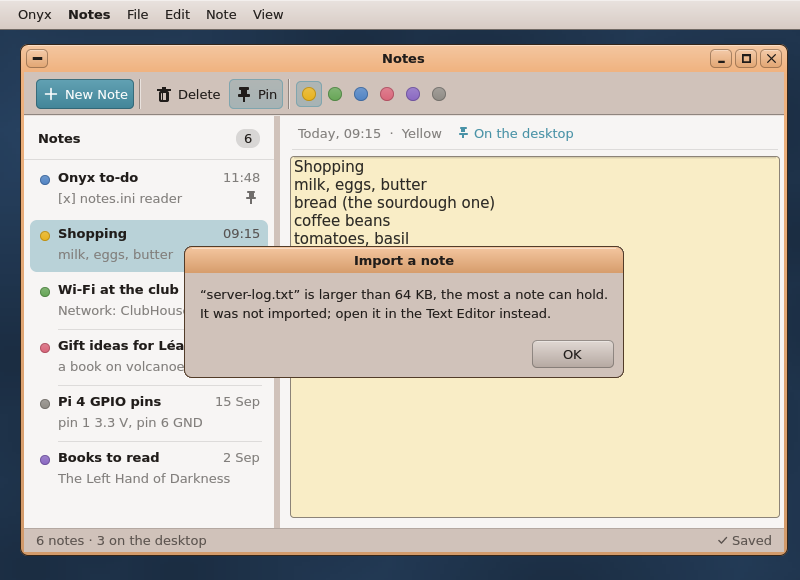

- No confirmation for Delete (D4), none at quit (D8).

---

## 7. The colours

The six note colours are soft pastels **of the desktop's own hues**: the dots take the CDE themes' colours
(*Peach* `F0B07A` → a warmer yellow, *Sage* `80AA76` → green, *Steel* `7A98C0` → blue, *Brick* `C45450` → a softened
pink), the same saturation as Calendar's calendars (`calendar.png`), so a note's dot sits among the theme's accent
`4992A7` without shouting. Every paper is light enough for the one ink: contrast ≥ 10:1 (WCAG AAA).

| Colour | `notes.ini` | Paper (cards; `0x00RRGGBB`) | Dot / band | The editor's sheet |
|---|---|---|---|---|
| Yellow (default) | `yellow` | `0xFCE9A6` | `0xE8B21F` | `uk_mix (C_FIELD, paper, 150)` |
| Green | `green` | `0xD3EBC6` | `0x67A657` | ″ |
| Blue | `blue` | `0xCFE0F3` | `0x5284C4` | ″ |
| Pink | `pink` | `0xF8D3D8` | `0xD9667A` | ″ |
| Purple | `purple` | `0xE2D6F0` | `0x8A68C2` | ″ |
| Grey | `grey` | `0xE4E2DE` | `0x908C86` | ″ |
| **Ink** on every paper | | `0x2B2925` (contrast 12.0, 11.4, 10.8, 10.6, 10.4, 11.2) | | the same ink |

`notes_colour_paper (c)` / `notes_colour_dot (c)` (03 §3.2) return the two first columns. Derived shades: a card's
paper is a gradient `uk_tone (paper, 140)` → `paper`; its band `uk_tone (dot, 150)` → `uk_tone (dot, 140)`; its
outline `uk_tone (paper, 80)` at 150/255. Theme-independent on purpose (a yellow note stays yellow in Milk or Slate).

---

## 8. Stickies — the widget

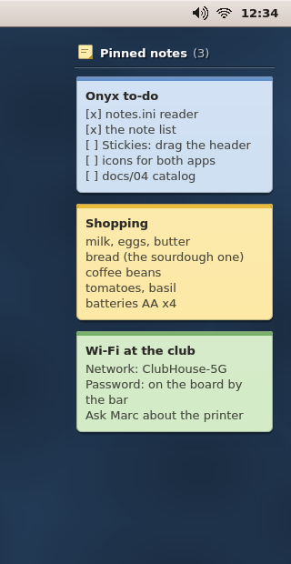 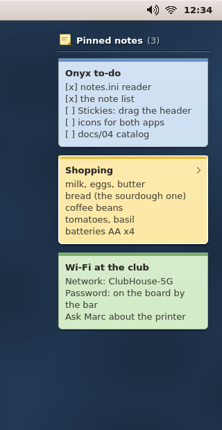 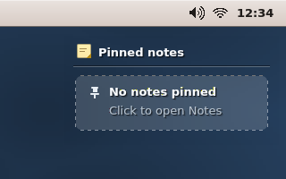

The agenda's window kind (`Root (x, y, 240, h, "stickies", WIN_FLAG_BORDERLESS | WIN_FLAG_BACKMOST | WIN_FLAG_SYSTEM |
WIN_FLAG_ALPHA)`), its header drawn as the agenda's — the agenda and Stickies read as one family at the two top
corners of the wallpaper; the notes themselves are **paper cards** (a sticky note is an object, an appointment is
text).

### 8.1 Geometry (px)

| Part | Value |
|---|---|
| Window | **W = 240**; default place **x = screen_w − 248, y = 40** (the agenda: x = 12, y = 40); `config.ini` `x`, `y` once dragged; height `screen_h − 40 − 120` at most (D10) |
| Header | 34 high: an icon 16 × 16 at (14, 9) (a small yellow note, its corner turned); **"Pinned notes"** in bold at x = 38, vertically centred in 5..31; the count *(3)* dim after it (6 px gap), none when 0; the agenda's etched line at y = 33 (dark, 110/255) and y = 34 (light, 70/255) from x = 10 to 230 |
| Header ink | the agenda's rule from the wallpaper under the widget (`kapi_wallpaper_buffer`): dark wallpaper → white `0xFAFCFF` (count `0xB8C4D0`) with a soft shadow; light → engraved dark ink `0x182232` |
| Cards | x = **12**, width **216**, the first at y = **44**, a gap of **12** between cards; radius **6** |
| A card's height | band 5 + padding 10 + title 18 + **17 per body line** (1..6 lines) + padding 10 → **60 to 145** |
| Band | the top 5 px, top corners rounded, the colour's dot shade (§7) |
| Title | bold, at (22, top + 13), cut with `uk_text_fit` to 196 px (to 178 when hovered: room for the chevron) |
| Body | at x = 22, from top + 33, 17 px a line, **word-wrapped** to 196 px (`uk_text_wrap`, 03 step 1), at most 6 lines; the last line ends with "…" when the text goes on; ink `uk_mix (paper, NOTE_INK, 215)` |
| Checklist lines | **plain text this round**: `[ ] ` / `[x] ` drawn as typed. *Later idea:* a 12 × 12 box (radius 3), ticked = the dot colour + a white `WKG_CHECK`, the text dimmed, and click-to-tick (which would make Stickies a second writer) |
| Shadow | two blended boxes under the paper: (x + 1, y + 3, 216 × h, r 7) black 45/255 (70 when hovered) and (x, y + 1, 216 × h + 1) black 40/255 — inside the see-through window: no compositor cost beyond the agenda's |
| Hover | a white outline 230/255 + an inner one 140/255, the shadow deeper, a chevron `WKG_CHEV_RIGHT` (9 px) at the title's right: "click to open" |
| More pinned than fit | the cards stop before passing the window's bottom; a dim line *"+2 more in Notes"* under the last (a click opens Notes); never more than 6 cards (02 §4.7) |
| Nothing pinned | a dashed rounded place 216 × 62 at (12, 44): dashes 4 px on, 4 off, white 120/255, filled white 18/255 (40 hovered); a pin glyph 16 px at (26, 56); **"No notes pinned"** bold at (50, 54); *"Click to open Notes"* dim at (50, 75) |
| See-through | header and cards on `0xFE000000` (the agenda's CATCH: the clicks land); below the last card `0xFF000000` (the clicks go to the desktop) |

### 8.2 Behaviour

- **Click a card** → Notes on that note (AC 15, 23). **Click the empty place / "+N more"** → Notes (AC 21).
- **Drag the header** (y < 34) → moves the widget, `x` / `y` written on release (the agenda's code, AC 24). The
  pointer over the header: `uk_cursor (KAPI_CURSOR_MOVE)` (kapi v81).
- **No editing** on the desktop (02 §8); the checklist tick is a later idea, not this round.
- Hidden (*View ▸ Hide Stickies*): the process quits; nothing drawn at all.

---

## 9. The icons (the dock, the drawer, the File Viewer)

Drawn by `tools/icons/notes_icon.py` (03 §3.1), in the style of the other app icons (`slides_icon.py`):

- **Notes** (`apps/notes.app/icon.bmp`): a square yellow note pad (`0xFCE9A6`, a darker band `0xE8B21F` on top as
  the cards), three grey ruled lines, a pencil across its lower right corner.
- **Stickies** (`apps/stickies.app/icon.bmp`, seen only in the Task Manager / App Settings): a yellow sticky note
  with its corner turned and a red push pin (`0xD9667A`) at its top.

---

## 10. What changes against the plan (summary — the details: 03's "GUI plan")

- UIKit gains, besides `uk_text_wrap`: **`WKT_TRASH`, `WKT_PIN`** (two tool icons) and **`uk_text_over`** (text over
  a see-through canvas, by coverage, a soft shadow or engraved — the agenda's `wall_text` generalised to faces).
- `NoteEdit` has its own colours (the paper) and a 15-px face; New Note is a filled `ToolButton`.
- Six colour `ToolButton`s replace "a split button or 6 dots"; the colour items in the *Note* menu stay.
- Ctrl+E (Open in Text Editor) added — the only *should* kept; search, checklists, Sort by, drag out and Export are later; Copy Note has no shortcut; Ctrl+D is a menu shortcut everywhere.
- An emptied note goes to the Trash (not `kapi_remove`); a failed save at quit goes to the clipboard.
- Notes writes the `run stickies` autostart line only on *View ▸ Show Stickies* (never on a pin, never on Hide), after the agenda's line, through SystemKit's `autostart_has` / `autostart_ensure`, and says so in the status line (D2).
- Stickies: cards of their own height, a window of fixed maximum height partly click-through, x = screen_w − 248.
- `shots.sh`: the scenarios take the mock-ups' scenes (window, empty, stickies, desktop).

---

## Revision after validation 1

- **D2 rewritten** (gap 1): autostart is written only by the explicit *View ▸ Show Stickies on the Desktop*, never by
  a pin, never by Hide; nothing if `run stickies` or `#setup: run stickies` exists; else inserted after the agenda's
  line, else before `preload /boot`, else at the end; through SystemKit's `autostart_has` / `autostart_ensure`; the
  status line says it in keyconf's wording (§5 lists the four messages).
- **Scope cut** (gap 2): search (D12, Find…, Ctrl+F, the tool bar field, the list's *Found* head), checklist boxes and
  click-to-tick, *Sort by*, the drag out and *Export…* marked **later, not this round**; Open in Text Editor (Ctrl+E)
  is the one *should* kept. The real `notes` screenshot has no search field.
- **Mock-ups re-rendered** (`mockups.sh`): the menus without *Export…* / *Find…*, the window without the search
  field, the cards with `[ ]` / `[x]` as plain text; `notes-search.png` kept, flagged as a later idea.
- Smaller: the dialog through `ft_messagebox` (FontKit, validation note 4); the rescan is the idle one (note 1).
