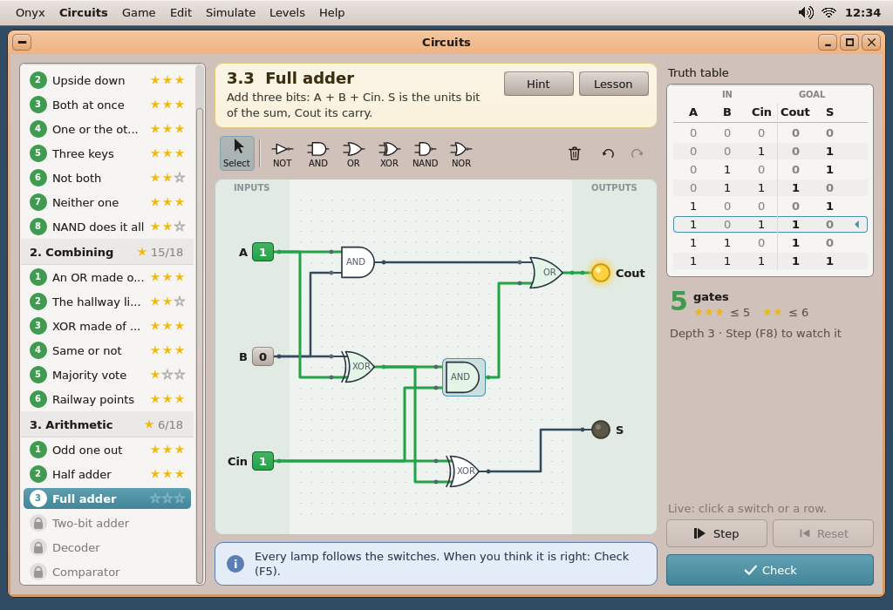
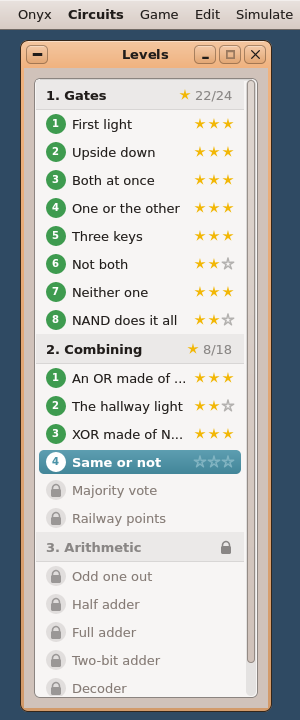
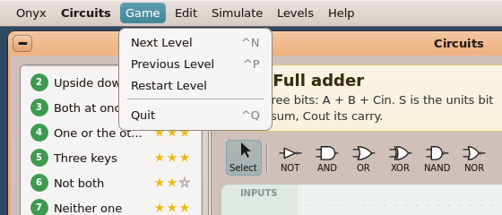
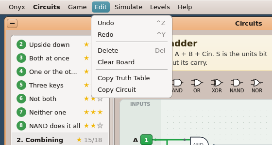
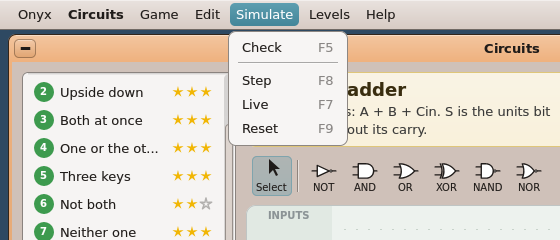
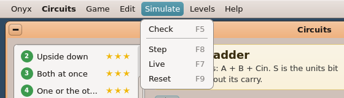
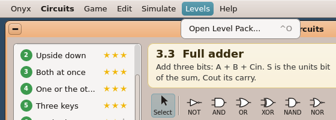
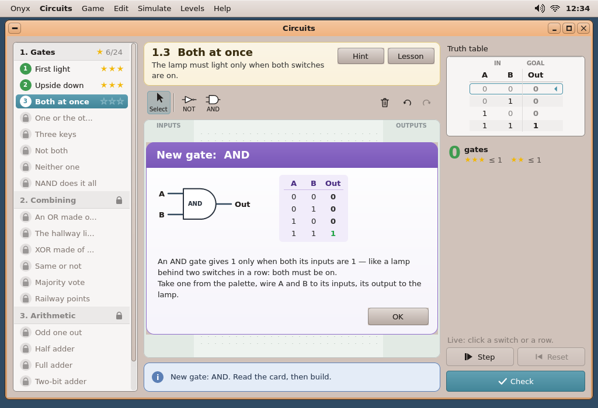
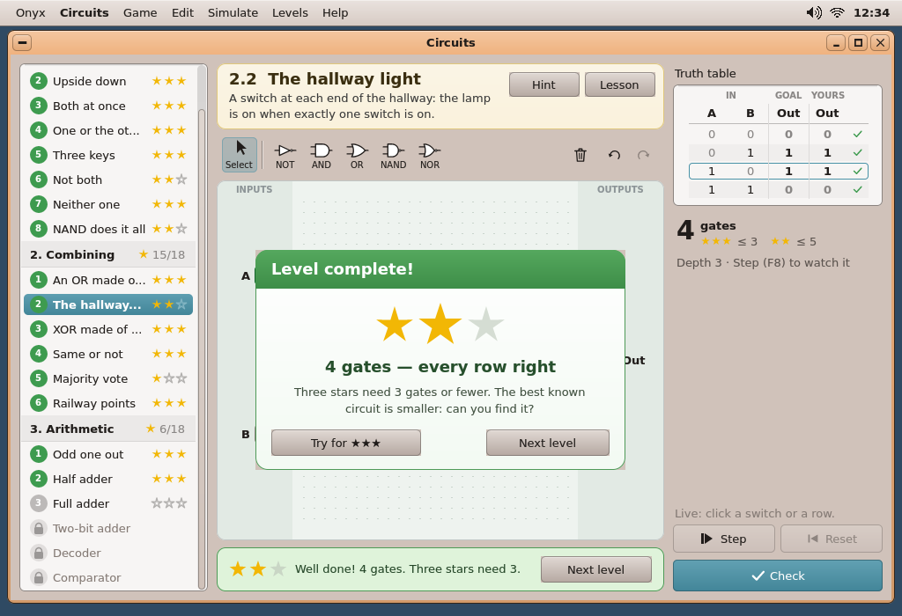
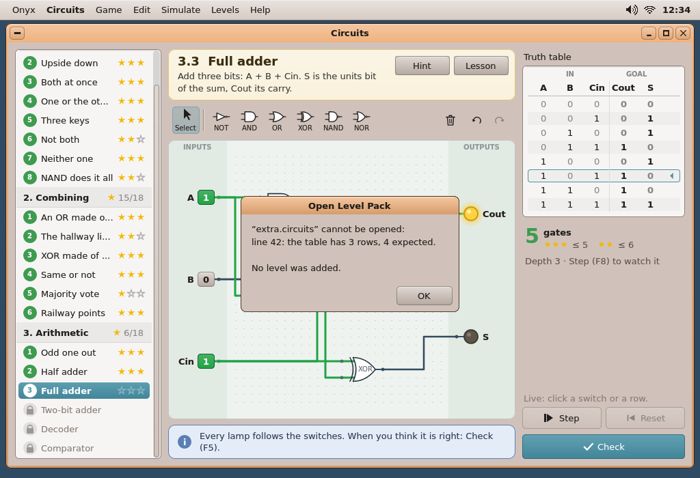

# AutoDev round 2 — UX Designer: Circuits

Date: 2026-10-06. Inputs: `01-product-manager.md`, `02-product-analysis.md` (the features "02 §4.n", the acceptance
criteria "AC n"), `03-technical-analysis.md` (the plan "03 §n", the window constraints of 03 §5). Read for consistency:
`docs/11-UIKIT.md` (ToolBar / ToolButton, VPath, paint, text, Menu, dialogs), `docs/gui-redesign/README.md` (the
modernised CDE: the theme's palette, raised faces, rounded corners, no shadows), **Turtle Quest**
(`user/Apps/turtle/main.cpp`: the levels list with its discs and stars, the cream card, the message bar with its stars
and *Next level*, the purple lesson card, the F-keys), **Notes** (round 1: the accent pill made with UIKit's own
`ToolButton`), and the screenshots of Letters and Photos.

**Every picture below is rendered by UIKit itself** in the desktop simulator (host `g++`, `fakekapi.cpp`, FreeType's
DejaVu Sans as the FT apps): a throwaway program, `mockups/circuits_mock.cpp`, builds the window from real UIKit
widgets (`Root`, `ToolBar`, `ToolButton`, `Button`, `Label`, `ft_messagebox`) plus the owner-drawn views the GUI plan
puts beside the app (the levels list, the board, the truth table, the cards), and the **real** menu bar is run above
it; `compose.py` lays them on the desktop (a flat desktop colour: the Voronoi wallpaper needs the `circle` submodule,
not checked out in this container — `MOCK_WALL=""` uses it). To redo them:

```sh
sh autodev/rounds/02-circuits/mockups/mockups.sh      # ~20 s once UIKit / FreeType are built (~1 min the first time)
```

The gate shapes, the wires' routes, the switches and lamps are drawn by the mock-up exactly as specified in §5 — the
developer can lift `gate_outline ()`, `drawSwitch ()`, `drawLamp ()` and the palette's `tool_icon ()` from it (they use
`double` for the curves; the app does the same with integers, 03 §5).

---

## 0. The decisions taken

| # | Question | Decision |
|---|---|---|
| D1 | Where is the objective (02 §4.2 put it under the levels list)? | **A right-hand column, the "bench"**: the truth table on top, the gate count and the stars needed under it, then *Step*, *Reset* and the accent **Check** at the bottom. The left column is the levels list alone, full height, as Turtle Quest's; the centre is Turtle's own stack: the cream card, the palette, the board, the message bar. Reason: the table must be read *while* toggling switches on the board — beside the board, not under a list; and 16 rows do not fit under 23 list rows. |
| D2 | The packs: a `Dropdown` (Turtle) or headers in the list (02 §4.1)? | **Headers in the list** (02's choice): one list for the three worlds, each world a grey header row with its name and its stars (*★ 15/18*), or a padlock while none of its levels is open. 23 rows fit at 620 px but for ~2 rows: the list scrolls (wheel, UIKit's bar). A pack opened from a file adds its header and rows at the end. |
| D3 | The palette's buttons | **Icon over name** (not text beside): `ToolButton (40, 40)` — **40 px wide at most** (validation 1, gap 2) —, `iconSize = 36`, an app `ToolIconFn` that draws the gate's symbol in the top 24 px and its name in 10 px under it (9 px for a name wider than the button: *NON-ET*, *NON-OU*). Width with UIKit's real `ToolBar` (`m_x` from 6, gap 1, `sep ()` 11, `addRight` from `w − 6` with gap 4): left 6 + 7 × 41 + 11 = **304 px**, right 3 × (4 + 34) + 6 = **120 px**, together **424 ≤ 428**, the centre column's width at the minimum window (920 px) — they fit on every level, in English and French ([`circuits-min.png`](mockups/circuits-min.png), [`circuits-min-fr.png`](mockups/circuits-min-fr.png)); at the default 1000 px 80 px are spare. A later 7th part (SHOULD *chips*) does not fit at 920: it would need the minimum raised to ~965 or Delete / Undo / Redo moved — to decide then. The armed tool is the lit toggle. |
| D4 | The switches | **A key showing its digit**: a 2 × 2-cell rounded key, raised face (`uk_raised`, `C_FACE`) with **0** when off, filled lit green with a white **1** when on; the input's name in bold at its left. Clearer than a slide toggle at 12-px cells (a toggle with a name inside did not fit: the first mock-up). |
| D5 | The result of a won Check | **A result card over the board** (the lesson card's form, green): big stars, *"4 gates — every row right"*, what three stars need, **Next level** (default) and **Try for ★★★** (or *Stay here* at 3 stars). The message bar says it too and keeps its *Next level* button after the card is closed (Turtle's way), so a player who dismissed the card still has it. A failed Check has **no card**: the table and the message bar say it, the board stays visible. |
| D6 | Wrong rows | Red tint + a red ✕ disc at the row's end, the obtained bit in red; right rows a green ✓. The **first wrong row** is set on the switches (02 §4.11) and outlined in red; the board then shows that row live. |
| D7 | The current input row | Always visible in the table: the row the switches make is outlined in the accent with a small ◂ at its end. **A click on a row sets the switches to it** (live mode) — the table is also a remote control. |
| D8 | Step by step | Each gate gets a small **depth badge** (a disc with its depth, above it): accent when computed, grey when not yet; uncomputed gates have a grey face, their wires grey and dashed, an unknown lamp shows **?**. The *Step* button is a lit toggle in step mode; the line above it says *"Step 2 of 3 · F7: back to live"*. |
| D9 | Mouse without capture (03 §5) | Press on a palette button **arms** it (a `PaletteButton : ToolButton` overriding `onMouse`); the board shows the gate's **ghost** under the pointer (green: fits; red: overlaps / outside) and places it on release or on the next click. Drags on the board set `catchOutside` while the button is held (a release outside cancels). Right click deletes. §6. |
| D10 | Wire routes | Orthogonal, 3 segments (out → vertical → in) with the vertical in a **free column** near the middle; a dot where a wire leaves another of the same source; crossings without a dot. §5.4. |
| D11 | Where the gate count is | Big in the bench (**5** *gates*, green when within the 3-star count) with *★★★ ≤ 5 · ★★ ≤ 6* under it, and the circuit's depth. Not in the message bar (it is busy with the messages). |
| D12 | Menus and check marks | Menus have no check marks (round 1, D1): the mode (live / step) is shown by the *Step* toggle and the bench's line. Five menus as 02 / 03: **Game, Edit, Simulate, Levels, Help**. |
| D13 | Gate names in French | **NON, ET, OU, OUX, NON-ET, NON-OU** on the palette, in the gates and the lesson cards (French school usage; *OUX* = *OU eXclusif*); tooltips give the full name. The pack and circuit text keep the English type names (`AND`…): the engine is language-free. |

---

## 1. The pictures

| Picture | What it shows |
|---|---|
| `mockups/circuits-main.png` | **The main window**: level 3.3 *Full adder* solved, live (A = 1, B = 0, Cin = 1 → Cout lit, S dark), an AND gate selected; the list scrolled to world 3; the table's current row outlined |
| `mockups/circuits-place.png` | Placing a gate: *AND* armed in the palette, its green ghost under the pointer |
| `mockups/circuits-wire.png` | Drawing a wire from the XOR's output: the dashed accent route, the target input ringed green |
| `mockups/circuits-step.png` | Step by step, step 2 of 3: depth badges, the OR gate and lamp Cout not computed yet |
| `mockups/circuits-check.png` | A failed Check on 2.2 (an OR instead of an XOR): row 1 1 marked wrong, set on the switches, the message |
| `mockups/circuits-won.png` | A won Check with 4 gates: the result card, two stars, *Next level* in the message bar too |
| `mockups/circuits-refused.png` | Check refused: lamp Cout not wired, ringed red |
| `mockups/circuits-lesson.png` | Level 1.3 the first time: the lesson card *New gate: AND* (symbol, truth table, text); world 1 partly open |
| `mockups/circuits-empty.png` | The first start (after the *wire* lesson is closed): level 1.1, no gate in the palette, the board's hint, only 1.1 open |
| `mockups/circuits-min.png`, `circuits-min-fr.png` | The minimum window, 920 × 600, in English and French: the palette with all six gates fits beside Delete / Undo / Redo |
| `mockups/circuits-levels.png` | The levels list alone, tall: the three worlds, won / current / locked levels, the worlds' star totals |
| `mockups/circuits-dialog.png` | A malformed pack refused (`ft_messagebox`) |
| `mockups/circuits-fr.png`, `circuits-fr-check.png` | The same in French (menus, palette, bench, card, list, message) |
| `mockups/circuits-menu-game.png`, `-edit`, `-simulate`, `-levels`, `-help` | The five menus in the menu bar (the real `menubar` app, Circuits' spec) |



---

## 2. The window

**`CircuitsRoot : Root`** (`Root (1000, 620, "Circuits")`), `setResizable (true)`, **`setMinSize (920, 600)`** (920: the palette's 424 px fit the centre column's 428 — D3; 03 said
like Turtle's 920 × 560: 600 is needed for the 16-row table of 3.4 above the bench's buttons — §2.3), `fitWorkArea ()`
at start. `onTick` (autosave), `onResized` → `layout ()`, `onKey` (§7), `onDrop` (a `.circuits` file, 02 §4.20).
Text: `ft_uikit_install ("DejaVu Sans", 13)`, then `uk_lang_init ()`; three more faces opened at start:
**`g_big`** DejaVu Sans 18 (the card's title, the cards' headers), **`g_small`** 10 (gate names, palette names, the
table's group heads, depth badges, the board's strip captions), **`g_huge`** 30 (the gate count), **`g_tiny`** 9 (a palette name wider than its button). A missing face
falls back to the UI face (`UkFaceScope (0)` is harmless).

### 2.1 The widget tree (client coordinates at the default 1000 × 620; `layout ()` recomputes them at each resize)

Constants: `PAD = 10`, `LISTW = 214`, `RIGHTW = 238`, `TBH = 46`, `MSGH = 50`. `mid = PAD + LISTW + PAD` (234),
`rx = W − PAD − RIGHTW` (752), `mw = rx − PAD − mid` (508).

| Widget | UIKit class | Place, size (px) | Notes |
|---|---|---|---|
| levels list | **`LevelList : Widget`** (beside the app) | `PAD, PAD, LISTW × H − 2·PAD` | §3 |
| level card | **`Card : Widget`** (Turtle's) | `mid, PAD, mw × need ()` (≥ 66) | `need ()` = 7 + 18-px title + 3 + text lines (≤ 3, wrapped in `mw − 208`) × 17 + 8, + the hint's lines when shown; the title is `uk_text_fit` to `mw − 208` (it ends in *…* beside Hint / Lesson at 920 px in French) |
| Hint, Lesson | 2 × `Button (80, 28)` | top right of the card: `mid + mw − 176`, `mid + mw − 90`; `PAD + 10` | tips *F2*, *F1* |
| palette | `ToolBar` (`line = false`, `bg` = `C_BG`) | `mid, PAD + cardH + 6, mw × TBH` | §4; its content is 424 px at most (D3): `mw` ≥ 428 at the minimum width |
| board | **`Board : Widget`** | `mid`, toolbar bottom + 6, `mw` × (`H − PAD − MSGH − 8` − its top) | §5; ≈ 508 × 386 at the default size |
| message bar | **`MsgBar : Widget`** (Turtle's) | `mid, H − PAD − MSGH, mw × MSGH` | §8 |
| Next level | `Button (126, 30)` | in the message bar's right end (`mid + mw − 140`, `+10`) | hidden unless the level is won and a next level exists |
| "Truth table" | `Label` (`C_TEXT`) | `rx, PAD, RIGHTW × 22` | *Table de vérité* |
| truth table | **`TruthTable : Widget`** | `rx, PAD + 24, RIGHTW × need ()` | `need ()` = 46 + rows × 21 + 8 (rows = 2^inputs); §2.2 |
| gate count | **`CountView : Widget`** | `rx`, table bottom + 10, `RIGHTW × 66` | §2.3 |
| mode line | `Label` (`C_DIS`; `C_ACCENT` in step mode) | `rx, sy − 22, RIGHTW × 18` | *"Live: click a switch or a row."* / *"Step 2 of 3 · F7: back to live"*; hidden when it would overlap the count (§2.3) |
| Step | `ToolButton ((RIGHTW − 6) / 2, 32)`, `raised = true`, `setIcon (circuits_icon, IC_STEP)`, `setText ("Step")`, `setToggle (true, stepMode)` | `rx, sy` with `sy = H − PAD − 36 − 8 − 32` | tip *One gate depth more (F8)*; lit in step mode |
| Reset | `ToolButton` as Step, `setIcon (…, IC_RESET)` (UIKit's `WKT_TO_START` drawn), `setText ("Reset")` | `rx + (RIGHTW + 6) / 2, sy` | tip *Back to step 0 (F9)*; `setDisabled` in live mode |
| **Check** | `ToolButton (RIGHTW, 36)`, `setIcon (…, IC_CHECK)` (`WKG_CHECK`), `setText ("Check")`, **`filled = true`, `setOn (true)`** (the accent pill, round 1's D7) | `rx, H − PAD − 36` | tip *Check every row (F5)* |
| lesson card | **`LessonCard : Widget`** + `Button` *OK* (104 × 30, bottom right) | centred over the board, 500 × 330 (clamped to the board − 16) | §9.1; hidden unless shown |
| result card | **`ResultCard : Widget`** + 2 `Button`s | centred over the board, 420 × 250 | §9.2; hidden unless shown |

Focus: no widget takes the keyboard focus but the dialogs' buttons; every key goes to `CircuitsRoot::onKey`
(Turtle's way). Tooltips: the palette's, Step / Reset / Check, Hint / Lesson.

### 2.2 `TruthTable` — the objective

On `C_FIELD` in `uk_sunken` (radius 6). Columns: the inputs, then the **goal** outputs, then after a Check the
**obtained** outputs; a 26-px mark column at the right. Column width `min (44, (w − 42) / columns)` (3.4 checked:
10 columns × 19 px — still readable: names ≤ 4 chars, digits), the table centred.

- **Group heads** (10 px, bold, dim `uk_mix (C_FIELD, C_FIELD_TEXT, 130)`), y = 6: *IN* / *GOAL* / *YOURS*
  (FR *ENTRÉES* (*ENTRÉE* for one) / *BUT* / *OBTENU*). **Names** (13 px bold) at y = 22. A line under them.
  A thin vertical line before the goal group and before the obtained group.
- **Rows**, 21 px from y = 46, in counting order (02 §6): the input bits plain (0 dim, 1 in `C_FIELD_TEXT`), the
  goal bits bold; odd rows striped `uk_mix (C_FIELD, C_FIELD_TEXT, 8)`.
- **The current row** (the switches' combination): outlined `C_ACCENT` (radius 4) with a ◂ (`WKG_LEFT`, 9 px) in the
  mark column — in live mode only (in step mode too: it is the row being stepped).
- **After a Check**: the obtained bits bold, red (`0xD0342C`) where they differ; a wrong row tinted `0xFBE0DC` and
  marked by a red disc with a white ✕ (`WKG_CLOSE`); a right row by a green ✓ (`WKG_CHECK`, `0x3E9B4F`). The first
  wrong row is the current row (outlined red). The obtained columns stay until the board changes (any edit clears
  them: the table goes back to goal only).
- **Mouse**: a click on a row sets the switches to it (live mode; in step mode it also resets to step 0, as a switch
  toggle does — 02 §4.10). Hover: the row under the pointer tinted `uk_mix (C_FIELD, C_ACCENT, 26)`.

### 2.3 `CountView` — the gate count

**The number** in the 30-px face, bold, green (`0x3E9B4F`) when ≤ the 3-star count, else `C_TEXT`; beside it
*gate* / *gates* (`TRN`-style plural: *porte* / *portes*) bold; under it three small gold stars *≤ par3* and two
*≤ par2* (dim). Third line (y = 46, dim): *"Depth 3 · Step (F8) to watch it"* (*"Profondeur 3 · Pas à pas (F8)"*),
hidden when the board has no gate. A level with `par = 0 0` (1.1) shows *0 gates ★★★ ≤ 0*.
Overlap rule: at 600 px high with 16 rows (level 3.4 only) the table ends at 424, the count at 500 — the mode line
(sy − 22 = 492) is then hidden; nothing else moves.

---

## 3. `LevelList` — the level picker (left column)



Turtle's list, extended with world headers. `uk_sunken` on `C_FIELD`; drawn in a clip 2 px inside; UIKit's
scroll bar (`uk_thumb`, `uk_draw_vscroll`) when the rows overflow.

- **World header**, 30 px: tinted `uk_mix (C_FIELD, C_FIELD_TEXT, 14)`, the pack's title bold at x = 10 (*1. Gates*,
  `titleOf (lang)`), at the right a small gold star and *got/max* (*15/18*, dim) — or a **padlock** (dim) while none of
  its levels is open; a 1-px line under it. Not clickable (a click on it does nothing).
- **Level row**, 28 px: a **disc** (r = 10) at x = 20 — green `0x3E9B4F` with the white number once won; grey
  `uk_mix (C_FIELD, C_FIELD_TEXT, 70)` with a white number when open and not won; a pale disc with a **padlock** when
  locked. The title at x = 36 (`uk_text_fit` to the room left by the stars; locked: `C_DIS`). **Three stars** (r = 6)
  at the right: gold `0xF2B705` filled for the stars won, outlined grey otherwise; none on a locked row.
- **The current level**: `uk_hilite` (radius 5) with `uk_hilite_ink ()` text in bold; its disc white with the number
  in the accent (Turtle's).
- **Mouse**: a click on an open row shows that level (saving the board left first); on a **locked** row: nothing
  changes, the message bar says *"Locked: win “Three keys” first."* (the previous level's title). Hover: tint
  `uk_mix (C_FIELD, C_ACCENT, 26)` on open rows. Wheel: 1 row (28 px) per notch.
- At start and on each level change the list scrolls so the current row is visible (`showSel ()`).

---

## 4. The palette (`ToolBar`)

| Item | Class | Notes |
|---|---|---|
| **Select** | `PaletteButton (40, 40)`, `iconSize = 36`, `setIcon (circuits_icon, IC_SELECT)` (an arrow + *Select* under it), `setToggle (true, armed < 0)` | tip *Select and move (Esc)*; lit when no gate is armed |
| `sep ()` | | |
| one per allowed gate, in the order **NOT AND OR XOR NAND NOR** | `PaletteButton (40, 40)` (never wider: D3's budget), `iconSize = 36`, `setIcon (circuits_icon, T_NOT…T_NOR)` (the symbol, white face, outlined in the ink, + its name in 10 px, 9 px when wider than 36 px), `setToggle (true, armed == type)`, gap 1 | tip *Put a gate: AND (2)* — the digit is its key (§7); a gate not in the level's `parts` is **not shown** (02 §4.4) |
| no gate at all (1.1) | `Label (290, 30, "No gate in this level: a wire is enough.", C_DIS)`, gap 8 | |
| Redo, Undo, Delete (`addRight`, right to left) | `ToolButton (34, 34)` with `WKT_REDO`, `WKT_UNDO`, `WKT_TRASH` | tips *Redo (Ctrl+Y)*, *Undo (Ctrl+Z)*, *Delete (Del)*; `setDisabled` when nothing to redo / undo / no selection |

`PaletteButton : ToolButton` (beside the app, `board.h`): `onMouse` arms on the **press** (not the release): it sets
`g_armed`, lights itself and unlights the others, and tells the board (`Board::arm (type)`); a press on the lit one
disarms (back to Select). `onClick` is not used.

**Icons** (`circuits_icon`, a `ToolIconFn`): `size ≥ 30` → the name centred at the box's bottom (10 px, the ink), the
symbol in the upper 2/3 (stubs in the ink, white face, 1.4-px outline, XOR's back curve, NOT/NAND/NOR's bubble) —
the board's shapes at icon size. `size < 30` (the menu bar has no icons; reused for the app icon script's preview):
the symbol only.

---

## 5. The board (`Board : Widget`)

### 5.1 The grid and its look

- **40 × 30 cells** (03 §4 had 40 × 24; changed so the grid fills the board's 4 : 3-ish area). The cell
  `c = min ((width − 20) / 40, (height − 20) / 30)`, at least 10 px (12 px at the default size, 10 at the minimum);
  the grid centred. Everything the engine knows is in cells; the board converts (`X (gx) = ox + gx·c`).
- **Background**: a rounded box (radius 10) in **`BOARD_BG 0xEEF3EF`** (a pale green paper, theme-independent like
  Turtle's board), outline `uk_mix (BOARD_BG, GATE_INK, 60)`.
- **The fixed strips**: columns 0–6 (switches) and 33–40 (lamps) in **`STRIP_BG 0xE2EAE4`**, captions *INPUTS* /
  *OUTPUTS* (*ENTRÉES* / *SORTIES*, 10 px bold, `uk_mix (STRIP_BG, GATE_INK, 120)`) at their top. No gate may lie in
  them: a gate's footprint must be inside columns 6–33.
- **The grid's dots**: one 2 × 1-px dot `BOARD_DOT 0xC9D4CC` per grid point between the strips.

### 5.2 The parts (footprints in cells; pins on grid points)

| Part | Footprint | Pins | Drawn |
|---|---|---|---|
| **Switch** | x = 0, 5 × 2 | out (5, y + 1) | its name bold, right-aligned before x + 2.4; a **key** x + 2.4 … 4.5 × the 2 rows (radius 5): off `uk_raised (C_FACE)` with **0** in `C_TEXT`; on filled `0x21A346` (gradient `uk_tone (…, 150)` → it, rim `uk_tone (…, 80)`) with a white **1**; a stub to the pin |
| **Lamp** | x = 34, 6 × 2 | in (34, y + 1) | a stub; a bulb (r = 0.9c) at x + 1.75: off rim `0x403B30` / face `LAMP_OFF 0x5B5648`; on rim `0xC99A12` / face **`LAMP_ON 0xFFD23F`** with two glow rings (`LAMP_ON` at 50 and 90 alpha, r + 7, r + 3) and a highlight; unknown (step mode) grey with **?**; the name bold at its right |
| **NOT** | 5 × 4 | in (x, y + 2); out (x + 5, y + 2) | a triangle + bubble |
| **AND, OR, XOR, NAND, NOR** | 5 × 4 | in 1 (x, y + 1), in 2 (x, y + 3); out (x + 5, y + 2) | the ANSI distinctive shapes: body from x + 1 to x + 4.1, ±1.45 c around y + 2; NAND/NOR bubble r = 0.3 c |

Placement of the fixed parts (the engine's rule, also used by the host test): input k of n at
`y = (2k + 1)·30 / (2n) − 1` (integer division) — n = 1: 14; 2: 6, 21; 3: 4, 14, 24; 4: 2, 10, 17, 25 — and the
outputs likewise on the right. A gate's cell is free when its 5 × 4 footprint overlaps no other part's.

**The gate**: input stubs (from the pin 2 cells in, the wire's colour, or grey `0x808A94` when not wired — the body
covers their ends), then the body filled **white** (output 0), **`GATE_FACE1 0xE3F5E7`** (output 1) or
**`GATE_FACEX 0xF0F2F4`** (not computed, step mode), outlined 1.6 px in **`GATE_INK 0x2B3440`** (red on a gate named
by a refused Check), XOR's back curve, the bubble, the output stub in its level's colour; its **name** inside in
10 px (`uk_mix (face, GATE_INK, 190)`); pin dots (r = 2.5 px) `0x5A6570`, the output's in its level's colour.
Shapes (`gates.h`, `gate_outline (type, box) → points` in 1/16 px): AND = flat back + half disc; OR = two quadratic
curves to the tip + a concave back curve (control at 26 % of the width); XOR = OR moved 12 % right + the back curve
alone; curves sampled at 10–12 points with integer arithmetic.

**Selection**: a rounded box (radius 6) around the footprint (x + 0.55 … x + 4.75), tinted
`uk_mix (BOARD_BG, C_ACCENT, 50)` under the gate, outlined `C_ACCENT`. **Hover**: the same outline at 60 alpha.

### 5.3 The wires and their levels

| Level | Colour | Width |
|---|---|---|
| **1** | **`WIRE_1 0x21A346`** (lit green; Turtle's green family) | 3 px |
| **0** | **`WIRE_0 0x334A5E`** (dark slate) | 2.5 px |
| unknown (step mode) / undetermined source | **`WIRE_X 0xA9B3BC`**, **dashed** (0.45 c dash, 0.3 c gap) | 2 px |

A selected wire: an 8-px halo `C_ACCENT` at 90 alpha under it, drawn last. An unconnected gate input counts 0 in live
mode (02 §4.9): the wires *downstream* of a gate with an open input are drawn as their computed level (not grey) —
the open input itself is shown by its grey stub.

### 5.4 Routes (the engine's `Circuit::route`, used for drawing and for hit-testing)

- **Forward** (target pin at least 2 columns right of the source pin): 4 points — out along the source's row to a
  column `xm`, vertical to the target's row, in. `xm` = the middle column `(x0 + x1) / 2`, then alternately ±1, ±2…
  until a column is found where the vertical segment (a) overlaps no other wire's vertical segment of **another
  source** on that column, and (b) crosses no part's footprint; none → the middle. Wires of **one source** may share
  a column (they are the same signal).
- **Backward or straight-up** (target not right of the source): 6 points — right 1 cell, vertical to a free row
  below both parts' footprints (`max (bottom) + 1`), left to 1 cell before the target, vertical to its row, in.
- **Junction dots** (r = 3.5 px, the wire's colour): where a wire turns off the horizontal run of another wire of the
  same source that goes on past that point. Crossings of different signals get no dot.
- Routes are recomputed when anything moves (a few dozen wires: cheap).

### 5.5 Overlays on the board

- **The ghost** of an armed gate (§6.1): the gate drawn at the snapped cell under the pointer at 200 alpha, face
  `0xE6F4EA` and ink `0x3E9B4F` when it fits, `0xFBE0DC` / `0xD0342C` when it does not (overlap, a strip, outside).
- **The wire being drawn** (§6.2): its future route, dashed in `C_ACCENT` 2.5 px, from the source pin (ringed accent,
  r 6 / 4) to the pointer — or to the target pin when one is under the pointer: ring r 7 / 5 in **green** (accepted;
  if that input is already fed, its current wire is drawn at 80 alpha: it will be replaced) or **red** (refused: a
  loop, the same part, an output pin).
- **Step badges** (step mode): a disc r = 7 px above each gate's centre (y − 2 px from its top) with its depth in
  10 px bold white: `C_ACCENT` when computed, `0xB5BDC4` when not.
- **The empty hint** (no gate and no wire on the board): a white rounded box at 170 alpha, dashed border `0x9DB0A4`,
  between the strips in the upper middle; title in 18 px bold — level 1.1 *"Lay a wire"*, else *"Build your
  circuit"* — and one wrapped line: *"Press on the switch's pin, drag to the lamp's pin, let go."* / *"Take a gate
  from the palette and put it on the board, then drag from a pin to a pin to wire it."* Disappears with the first
  part or wire.
- **Refused Check**: the named part's outline red; a lamp gets a red ring (r + 3 … r + 6) — until the next change.

---

## 6. Mouse interactions (no capture: 03 §5)

UIKit routes the mouse to the widget under the pointer; a widget sees `mx < 0` when it leaves. The board sets
**`catchOutside = true` while a button is held** for a drag it started, so it keeps the events past its edge;
released outside its rectangle = **cancel**.

### 6.1 Placing a gate

- **Click then click**: a click on a palette gate arms it (lit); over the board the ghost follows the pointer
  (snapped: the cell whose footprint is centred under the pointer); a **left click** places it there if it fits →
  the gate is created, **selected**, and the tool goes **back to Select** (one placement per arming: no surprise
  gates for children). Does not fit → nothing placed, the ghost stays red, the message bar: *"No room there: parts
  cannot overlap."* (or *"Gates go between the inputs and the outputs."* in a strip).
- **Drag from the palette**: press on the gate's button (it arms on the press), move onto the board with the button
  held (the board gets `move` events with `bl` held and shows the ghost), **release** → placed as above. Released
  back over the palette → stays armed (then click-click works).
- **Disarm**: Esc, a click on *Select* or on the lit button again, a right click on the board.
- **49th gate**: the ghost is red and the message *"The board is full: 48 gates at most."*

### 6.2 Wiring

- **Press on an output pin** (of a switch or a gate: within 0.6 c of it, at least 7 px) → a wire drag starts (in
  Select mode; with a gate armed the press places the gate instead). The rubber route follows; input pins under the
  pointer are ringed green / red (the engine is asked `connect`'s verdict without doing it: `Circuit::canConnect`).
- **Release on an input pin** (of a gate or a lamp) → `connect` (undoable; replaces that input's wire if any).
  Refused (loop) → nothing made, the message bar in red: *"That wire would make a loop: in this game signals only go
  forward."* (02 §4.6, FR exact). Released elsewhere → nothing, no message.
- **Press on an input pin** that is fed → picks that wire's end up: the drag continues from its source (release on
  another input re-plugs it, elsewhere removes it — one undo step). An unfed input pin: nothing.
- **Esc** during the drag cancels.

### 6.3 Selecting, moving, deleting

- **Click on a gate's body** → selected (the frame). **Drag** it → its ghost (at the snapped cell, green / red) and
  its wires follow live; release on a free place → moved (undoable); on a refused place → back where it was, the
  message as for placing. Switches and lamps are not selectable: **a click on a switch's key toggles it** (02 §4.9);
  a drag from its pin wires.
- **Click on a wire** (within 4 px of one of its segments) → that wire selected (the halo). The topmost hit wins:
  pins, then parts, then wires.
- **Click on empty board** → nothing selected.
- **Delete / Backspace** removes the selection (a gate with its wires; a wire); the toolbar's trash does the same.
- **Right click** on a gate or a wire removes it at once (undoable); on a switch, a lamp or empty board: disarms
  only.
- **Hover**: an output pin under the pointer gets a faint accent ring (it can be dragged); a gate its faint frame.
- **Wheel**: nothing (the board always fits the window).
- Any change of the board in **step mode** leaves it (back to live, 02 §4.10); any change clears a Check's obtained
  columns and its marks.

---

## 7. Keyboard

All in `CircuitsRoot::onKey`, then `g_menu.shortcut (k)` (Turtle's way). With a card shown, Enter = its default
button, Esc closes it, the other keys are ignored.

| Key | Action | Menu |
|---|---|---|
| **F5** | Check | Simulate ▸ Check |
| **F8** | Step: enter step mode / one depth more | Simulate ▸ Step |
| **F7** | Live (leave step mode) | Simulate ▸ Live |
| **F9** | Reset to step 0 (step mode) | Simulate ▸ Reset |
| **F1** / **F2** | Lesson / Hint | Help |
| **Ctrl+Z** / **Ctrl+Y** | Undo / Redo | Edit |
| **Del**, **Backspace** | Delete the selection | Edit ▸ Delete |
| **Ctrl+N** / **Ctrl+P** | Next / Previous level (if open) | Game |
| **Ctrl+O** | Open Level Pack… | Levels |
| **Ctrl+Q** | Quit | Game |
| **1 … 6** | Arm the palette's 1st…6th gate (as shown; a digit past the last does nothing) | — (in the tooltips) |
| **Esc** | Close a card › cancel the wire / drag › disarm › deselect (the first that applies) | — |
| **Arrows** | Move the selected gate one cell (undoable, refused moves ignored silently) | — |
| **Enter** | On the result card: Next level; on the lesson card: OK | — |

No `^`-shortcut for Clear Board, Restart Level, Copy Truth Table, Copy Circuit, About (menu only), as 02.

## 8. Menus (the global menu bar; Turtle's `Menu::menu/item/separator`, labels through `TR`)

 
  

| Menu | Items (shortcut) | FR |
|---|---|---|
| **Game** | Next Level (^N) · Previous Level (^P) · Restart Level · — · Quit (^Q) | Jeu: Niveau suivant · Niveau précédent · Recommencer le niveau · Quitter |
| **Edit** | Undo (^Z) · Redo (^Y) · — · Delete (Del) · Clear Board · — · Copy Truth Table · Copy Circuit | Édition: Annuler · Rétablir · Supprimer · Vider le plateau · Copier la table de vérité · Copier le circuit |
| **Simulate** | Check (F5) · — · Step (F8) · Live (F7) · Reset (F9) | Simulation: Vérifier · Pas à pas · En direct · Au départ |
| **Levels** | Open Level Pack… (^O) | Niveaux: Ouvrir un recueil… |
| **Help** | Lesson (F1) · Hint (F2) · — · About Circuits | Aide: Leçon · Indice · À propos de Circuits |

Restart Level and Clear Board do the same thing on a level (empty the board, undoable); *Restart Level* also closes
a result card and leaves step mode. Items that cannot act are still listed (UIKit menus have no disabled state);
they do nothing and say why in the message bar when useful (*"No next level open yet."*). SHOULD items (Paste
Circuit, Sandbox, players) add their lines here when built.

## 9. Messages, cards and dialogs

### 9.1 The lesson card (Turtle's, `LessonCard`)



White → `0xF6F4FB`, outline `0x8E6CC8`, a 44-px purple header (`0x8E6CC8` → `0x7A58B8`, top corners) with
*"New gate: AND"* in 18-px bold white (*"Nouvelle porte : ET"*; for a concept that is not a gate — *wire*, *chain*,
*universal*, *equal*, *majority*, *mux*, *parity*, *adder*, *fulladder*, *decoder*, *compare* — *"New idea: …"*,
Turtle's words). Body: **the gate's symbol** at 18-px cells with its pins named A, B, Out, **its truth table** in a
lilac box (`0xF1ECFA`, heads `0x4B2E83`, the 1 outputs green bold) — for an idea without a gate, the level's own
smallest example (the card's text only if none); then the text (≤ 6 wrapped lines). *OK* (`Button 104 × 30`)
bottom right. Shown over the board the first time a level with a new concept is shown (`seen.<concept>`), and by F1
/ *Lesson*. The board under it is not clickable (`onMouse` returns true).

### 9.2 The result card (`ResultCard`)



As the lesson card in green: white → `0xF3FAF3`, outline `0x4E9A57`, header `0x55A85E` → `0x3E8E48`
*"Level complete!"* (*"Niveau réussi !"*). **Three big stars** (r = 22, the middle 26) gold for those won, `0xD5DDD3`
otherwise; *"4 gates — every row right"* (18 px bold, `0x264F2C`); one wrapped line: below three stars *"Three stars
need 3 gates or fewer. The best known circuit is smaller: can you find it?"*; at three stars *"The best possible:
3 gates."*; on the last level of the last pack *"You finished every level!"*. Buttons: left **Try for ★★★** (closes;
*Stay here* at three stars), right **Next level** (default, Enter; hidden on the very last level). A new **record**
(more stars than before) adds *"New record!"* under the stars. Shown on each won Check.

### 9.3 The message bar (Turtle's `MsgBar`)

| Kind | Look | Used for (EN) |
|---|---|---|
| info | `0xE4ECF7` / edge `0x5B7FB5`, an *i* disc | level shown: the level's hint-free prompt *"Every lamp follows the switches. When you think it is right: Check (F5)."*; first level: *"Welcome to Circuits! Wire the switch A to the lamp, then Check (F5)."*; placing *"AND: click a free place on the board to put it (Esc: cancel)."*; wiring *"Let go on an input pin to lay the wire (Esc: cancel)."*; step mode *"Step 2 of 3: the gates of depth 2 are computed. F8: the next depth · F9: back to the start · F7: live."*, at the end *"Step 3 of 3: every lamp is computed."*; the hint (F2) *"Hint: …"*; locked level; copied *"Truth table copied."* / *"Circuit copied."* |
| ok | `0xDFF3DA` / `0x4E9A57`, the stars (r = 10) | won: *"Well done! 4 gates. Three stars need 3."* / *"Well done! 3 gates — the best possible."* + *Next level* |
| error | `0xFBE0DC` / `0xC8463B`, a *!* disc | *"1 row is wrong: with A = 1 and B = 1 the lamp must stay off. The switches are set on that row."* (*"N rows are wrong: …"* for the first one); *"Lamp Cout is not connected: wire a gate's output to it, then Check again."*; *"An AND gate has an input not connected."*; the loop refusal; no room / board full; *"Progress not saved: the card is full or read-only."* |

Messages wrap on 2 lines (13 px); the bar is 50 px high.

### 9.4 Dialogs (`ft_messagebox`, `MB_OK`)



- A malformed pack (Ctrl+O, a drop, the argument): title *Open Level Pack*, text *"“extra.circuits” cannot be
  opened:\nline 42: the table has 3 rows, 4 expected.\n\nNo level was added."*
- A pack whose ids clash with loaded ones: *"“x.circuits” has a level “and” already loaded. No level was added."*
- No built-in level at start: *"No level found in SD:/apps/circuits.app/levels."* then quit (Turtle's).
- About: *"Circuits 1.0 — wire logic gates until the lamps match the truth table.\nMIT License."*
- The pack chooser: `uk_file_open` (`ft_file_open`) starting in `SD:/docs/circuits`, filter
  *"Circuits levels|*.circuits|All files|*"*.

## 10. States

| State | What the window shows |
|---|---|
| **First start** (no `progress.ini`) | Level 1.1, the *wire* lesson card over the board; after OK: [`circuits-empty.png`](mockups/circuits-empty.png) — the palette with *Select* only and *"No gate in this level: a wire is enough."*, the board's *Lay a wire* hint, only 1.1 open in the list (all other rows and worlds 2–3 padlocked), the welcome message |
| **Empty board** (any level) | the board's hint (§5.5); Undo greyed unless there is history; the count *0 gates* |
| **Building** (live) | [`circuits-main.png`](mockups/circuits-main.png): wires and lamps follow at once; the table's current row follows the switches |
| **Placing / wiring** | [`circuits-place.png`](mockups/circuits-place.png), [`circuits-wire.png`](mockups/circuits-wire.png) |
| **Step mode** | [`circuits-step.png`](mockups/circuits-step.png) |
| **Check refused** | [`circuits-refused.png`](mockups/circuits-refused.png) — the part ringed / outlined red, the error message; nothing recorded |
| **Check failed** | [`circuits-check.png`](mockups/circuits-check.png) |
| **Won** | [`circuits-won.png`](mockups/circuits-won.png); the list's stars and the world's total updated, the next row unlocked (its padlock gone) |
| **Locked level clicked** | the info message, nothing else changes |
| **A pack opened from a file** | its world header at the end of the list (its title, no padlock: all open), its first level shown |
| **Loading** | none needed (packs and progress are a few KB, read before the window is shown) |
| **Progress unreadable / missing** | a fresh start, silently (02 §7.2) |
| **Save failed** | the error message (red) once; retried at the next change; at quit nothing more (the board is in memory only) |
| **French** | [`circuits-fr.png`](mockups/circuits-fr.png), [`circuits-fr-check.png`](mockups/circuits-fr-check.png) |

## 11. Colours (theme tokens and the app's own)

The window follows the theme: **`C_BG`** (the window, the toolbar, the bench), **`C_FIELD` / `C_FIELD_TEXT`** (the
list, the table), **`C_TEXT`**, **`C_DIS`** (locked rows, hints), **`C_ACCENT`** (the current level's `uk_hilite`,
the table's current row, the selection, the rubber wire, step badges, the Check pill, the mode line in step mode),
**`C_FACE`** (switch keys at 0), `uk_raised` / `uk_sunken` / `uk_hilite` for faces. The board, the card and the
message bar are fixed colours, theme-independent like Turtle Quest's (they must read the same in every theme):

| Name | Value | Use |
|---|---|---|
| `BOARD_BG` / `STRIP_BG` / `BOARD_DOT` | `0xEEF3EF` / `0xE2EAE4` / `0xC9D4CC` | the board, its fixed strips, the grid's dots |
| `WIRE_1` / `WIRE_0` / `WIRE_X` | `0x21A346` / `0x334A5E` / `0xA9B3BC` | a signal at 1 / 0 / unknown |
| `GATE_INK` / `GATE_FACE` / `GATE_FACE1` / `GATE_FACEX` | `0x2B3440` / `0xFFFFFF` / `0xE3F5E7` / `0xF0F2F4` | gates |
| `LAMP_ON` / `LAMP_OFF` | `0xFFD23F` / `0x5B5648` | lamps |
| `ERR_RED` / `OK_GREEN` / `STAR_GOLD` | `0xD0342C` / `0x3E9B4F` / `0xF2B705` | errors, won discs and ticks, stars (Turtle's) |
| card / message bar / lesson / result | Turtle's values (§9) | |

Colour is never the only signal: switches show 0/1, unknown lamps *?*, wrong rows a ✕ as well as red, the step
badges a number.

## 12. Pictures embedded

No bitmap besides the app icon: everything is drawn (`VPath`, `uk_*`) — gates, switches, lamps, stars (Turtle's
10-point star), padlocks (a `VPath` rounded box + arc), the palette icons (`circuits_icon`), the select arrow.
**The icon** `sdcard/apps/circuits.app/icon.bmp` (40 × 40, magenta key, `tools/icons/circuits_icon.py`, Pillow): a
rounded square `0x2B3440`, a white AND gate (the board's shape, 2-px outline in `0x2B3440`'s lighter tone) on it, a
lit green `0x21A346` wire into its two inputs from the left, a yellow `0xFFD23F` lamp dot with a glow at the
right on its output — readable at the dock's 40 px.

## 13. French

All UI words through `TR` / `TRC` (03 §5); the levels' texts through `.fr` keys; the lesson cards compiled in both.
The words of the pictures (to seed `lang/fr.txt`): Select → *Choisir*, Truth table → *Table de vérité*, IN / GOAL /
YOURS → *ENTRÉES* / *BUT* / *OBTENU*, INPUTS / OUTPUTS → *ENTRÉES* / *SORTIES*, gate(s) → *porte(s)*, Step → *Pas à
pas*, Reset → *Au départ*, Check → *Vérifier*, Live → *En direct*, Hint → *Indice*, Lesson → *Leçon*, Next level →
*Niveau suivant*, Level complete! → *Niveau réussi !*, Try for ★★★ → *Viser ★★★*, New gate: → *Nouvelle porte :*,
Lay a wire → *Pose un fil*, the gate names of D13, the menus of §8,
the messages of §9. The inputs' and outputs' names (`A`, `Cin`, `Out`…) are the pack's data and are not translated (the
French pictures show *S* for the single output: a mock-up liberty, not a decision). Longest French strings checked in the mock-up: the palette (*NON-OU*), the step line, the
bench's hint (shortened to *"En direct : clique une entrée."*).
