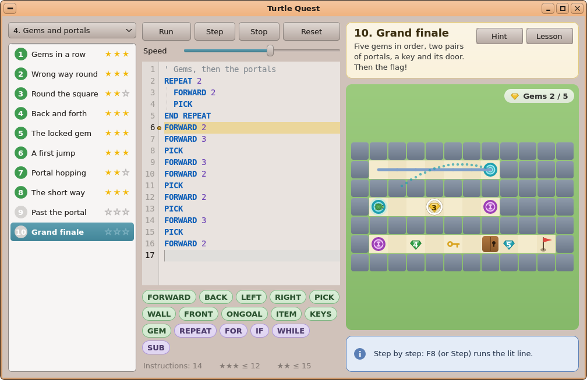
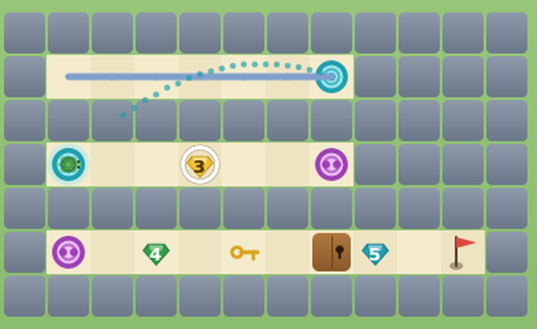
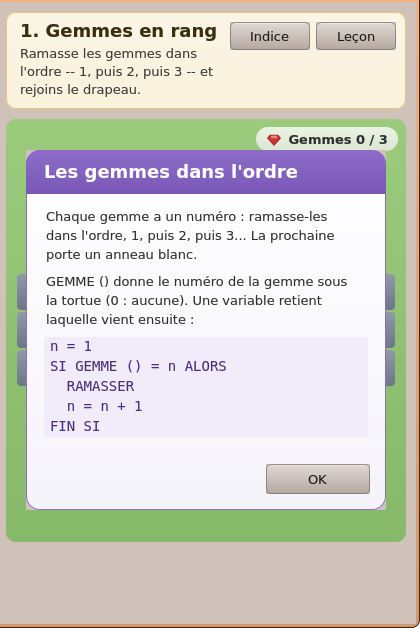
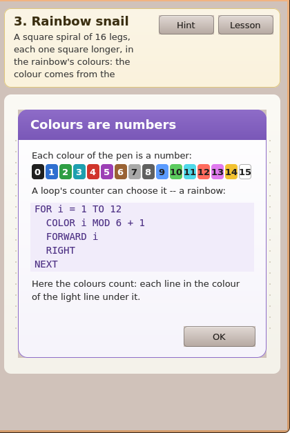
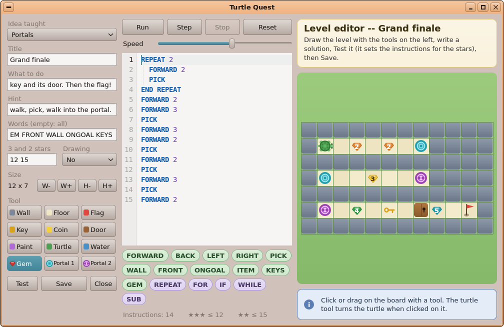

# AutoDev round 3 — UX Designer: Turtle Quest, *Gems, portals and fractals*

Date: 2026-10-06. Inputs: `01-product-manager.md`, `02-product-analysis.md` (features "02 §x", acceptance "AC n"),
`03-technical-analysis.md` (plan "step n", risks R1–R12). Read for consistency: `docs/11-UIKIT.md` (`Dropdown`,
`Label`, `Button`, `VPath`, `uk_rbox` / `uk_rline` / `uk_mix`, `UkFaceScope`), `docs/gui-redesign/README.md` (the
modernised CDE: raised faces, rounded corners, no shadows, the theme's palette), Turtle Quest's code
(`user/Apps/turtle/main.cpp`: `Board::tile`, `onDraw`, the HUD, `WordBar`, `Card`, `MsgBar`, `Lesson`, `ToolPal`,
the editor panel, `layout`) and its three screenshots, round 2's `04-ux-design.md` (how its mock-ups were made).

**Every picture below is rendered by UIKit itself, from the real app.** `mockups/mockups.sh` copies
`user/Apps/turtle/main.cpp` + `world.h`, applies **`mockups/turtle_mock.patch`** (a sketch of this GUI plan, plus a
rough engine for gems / portals / colours so the scenes really *run*: steps, jumps, errors, wins), builds it for the
desktop simulator (host `g++`, `fakekapi.cpp`, FreeType's DejaVu Sans, as `shots.sh` does), writes mock packs 4 and 5
(`mockups/mkpacks.py`: the 21 titles and texts of 02 §6, real maps / solutions only for the levels pictured) and a
player's `progress.ini` per scene, then drives it with key / mouse scripts and dumps the window. To redo them:

```sh
sh autodev/rounds/03-turtle-missions/mockups/mockups.sh      # ~1 min; prints the measured widths / fits to $MOCK_TMP/measures.txt
```

The patch is a **throwaway** (mock hooks `MOCK_*`, no tests, the engine part is a sketch of steps 2–5): the Developer
writes the real code from the plan; the drawing functions `gem ()`, `ring ()`, `pad ()`, the teleport block of
`Board::onDraw`, the HUD, `edit_check ()`, the editor panel and the six cards can be lifted from it as a starting point.
**No app source of the repository is changed by this role.**

---

## 0. The decisions

| # | Question | Decision |
|---|---|---|
| D1 | How a gem looks (02 §A.5) | A **cut stone** (5-point outline, a darker rim, a lighter "table" facet) **0.68 cell wide**, in its number's colour (§2.1), its **digit in bold** on it (white, or dark on the light stones 3, 8, 9) when the cell is ≥ 16 px; below 16 px the colour alone. Picked: it **shrinks away** like a coin (the existing `pickCell` / `pickT`). |
| D2 | The order made visible | The **next gem to pick wears a white ring** (3 px, a 1 px dark rim at 60 % so it shows on every floor), **static — no pulse** (no redraw timer on the Pi; the ring moves at each pick). Not drawn in the editor's map. |
| D3 | The HUD (02 §A.5) | One pill as today, order **Coins · Gems · Keys**: `Coins 2 / 5    ◆ Gems 2 / 5    Keys 1` — the ◆ is a small stone **of the next gem's colour** (a green ✓ `WKG_CHECK` once all are picked). FR `Pièces · ◆ Gemmes · Clés`. Shown when `keys \|\| coinsTotal \|\| gemsTotal`. |
| D4 | Teleporter pads (02 §B.10) | A **round pad** (0.80 cell): a ring in the pair's colour, a pale face, an inner thin ring, and **one dot (pair 1, `T`) or two dots (pair 2, `U`)** — the pair is told by colour **and** by the dots (colour-blind safe). Pair 1 **cyan** (PEN 3), pair 2 **magenta** (PEN 5). Both pads of a pair are identical. Gems 5 (cyan) and 7 (violet) share a hue with the pads: the shapes differ (stone with a digit / flat round pad with dots) — accepted, checked in the pictures. |
| D5 | The jump (02 §B.8) | `EV_TELEPORT` lasts **420 × k ms** (k = the speed's scale; ≈ 1.3 steps; 0 at speed 10). First half: the turtle **shrinks into pad A** while A glows (a halo of the pad's face colour fading out); second half: it **grows out of pad B**, B glowing. Meanwhile a **dotted arc** (2 px dots, the pair's ring colour, 170 alpha) is drawn from A to B, lifted by a third of the distance, progressively with t — it shows *where* the turtle went without being a pen line; it disappears with the event. The pen draws **no line across** (engine, step 3). F8: the jump plays inside the statement that moved. |
| D6 | A colour drawing's target (02 §C.13) | Each target segment in **its own colour tinted on the page**: `uk_mix (0xFBFAF5, PEN[c], 85)` (≈ 33 %), same width as today; shape levels keep the grey `0xD9D6CC`. The player's lines on top in full colour. |
| D7 | Colour failure message | The message bar's **two-line form** (a `\n`: the first line bold — `MsgBar` does it already): **"The right figure, but not the right colours."** / *"Each line takes the colour of the light line under it."* — FR **« La bonne figure, mais pas les bonnes couleurs. »** / *« Chaque trait prend la couleur du trait clair dessous. »*. Kind `M_INFO` like every "not won yet" message (errors are red, losses blue: the app's rule). |
| D8 | The six lesson cards (02 §E) | Texts in §4 — **measured to fit** the `Lesson` box at 1000 × 640 (its text area 58 … 304 px; the fullest, FR *color*, ends at 301). The **colour card shows the 16 pens as swatches** (a `@palette` line in the card text, drawn by `Lesson::onDraw`). Header rule: *"New idea:  <title>"*, and the **title alone** when the two do not fit (measured: most FR titles). Code in block form only (a one-line `IF … : …` is cut at 360 px). |
| D9 | The level picker (pack drop-down, 02 §D) | Unchanged widget (`Dropdown`, 5 rows of 28 fit); the **titles are shortened** so they fit the list's 124 px (and the card's 202 px at 18 px) — §5. Two app-wide safety nets: the **card title falls back to the 13-px bold face, then is cut with "."** when it does not fit beside Hint / Lesson; the **card text wraps to 6 lines** (was 4: a long French text was silently cut, seen in the mock-ups). |
| D10 | **R1** — the *Idea* drop-down's 20 rows | **Moved to the top of the editor panel** (its first field, at panel y 18, `Dropdown (0, 18, 220, 26)`) and **the window's minimum raised to 920 × 600** (was 560; Circuits' is 600). Its open list is 2 + 2·3 + 20 × 26 = **528 px**; the room below it is panel height − 44 = **536 px at 600** (576 at 640) → it opens downward, never clipped (pictures `tq-editor-idea-min*.png` at 920 × 600, EN and FR). No UIKit change. A 21st concept would need a scrolling list (then a UIKit change — noted for later). |
| D11 | **R2** — the editor panel's height | New order (§6.1): Idea, Title, What to do, Hint, Words, **[3 and 2 stars \| Drawing]** on one row (two captions, a `Textbox` 100 px + a `Dropdown` 110 px), Size, Tool (**4 rows × 34**), Test / Save / Close. Content ends at **544 px** (measured) ≤ 580 (the panel at the 600-px minimum). |
| D12 | The Drawing choice (02 §F.22) | A **`Dropdown`** *No / Shape / Colours* (FR *Non / Forme / Couleurs*), `sel` = `draw` 0 / 1 / 2, tooltip *"A drawing level: reproduce the solution's figure -- its shape, or its shape and colours"*. Not a `SegmentedControl` (three French segments do not fit 220 px with a caption) nor two checkboxes (an impossible state "colours without shape"). |
| D13 | The 12 tools | `ToolPal` 3 columns × **4 rows**, the new row last: **Gem · Portal 1 · Portal 2** (FR *Gemme · Portail 1 · Portail 2*). Icons: a small red stone (gem 1), the two pads (cyan one dot, magenta two dots). **A name wider than its button (> 48 px) is drawn in an 11-px face** — *Portal 1/2*, *Gemme*, *Portail 1/2*, and the existing *Drapeau*, *Peinture* which overflowed already (seen in `tq-editor-fr.png`). Existing indices 0–8 unchanged (7 stays the turtle). |
| D14 | Gem / pad tools' behaviour (02 §F.20) | **Gem**: a click on a free cell places the **lowest number not on the map** (nothing when 1–9 are all used); a click **on a gem cycles** its number 1 → … → 9 → 1; a **drag places only** (never cycles, never overwrites a gem). **Portal 1/2**: places `T` / `U`; when the pair already has two pads, **the older one is removed** (the most recently placed stays with the new one). The turtle's cell is never overwritten (as today). |
| D15 | The editor's check (02 §F.21) | **Test** and **Save** run `check_level` first; a refusal: the **message bar in red** (`M_ERR`) and a **red ring on the cell at fault** (the gem after the gap / a duplicate / the lone pad), cleared by the next edit; nothing is run or written. §7 has the texts. |
| D16 | Keyboard | **No new shortcut.** F5 Run, F8 Step, F7 Stop, F9 Reset, F1 Lesson, F2 Hint, Esc, Ctrl+N / Ctrl+P / Ctrl+O / Ctrl+E / Ctrl+Q as today; the editor's drop-downs take Up / Down / Enter / Esc (UIKit's `Dropdown`). |
| D17 | Menus | **Unchanged** (Game, Levels, Player). |

---

## 1. The pictures (all in `mockups/`)

| Picture | What it shows |
|---|---|
| `tq-portals.png` | Pack 4 *Grand finale* stepped (F8 × 6), **frozen two thirds through the first jump**: gems 1–2 picked (HUD *Gems 2 / 5* with the next stone yellow), **the white ring on gem 3**, the shrinking/growing turtle at the twin pad, the dotted arc, both pairs, key, door, flag; line 6 lit |
| `tq-board-zoom.png` | The same board at 2× (the stones' facets and digits, the pads' rings and dots, the ring) |
| `tq-portals-after.png` | Two jumps later: no pen line across the board (each corridor's trail ends at its pad, restarts at the twin) |
| `tq-portals-fr.png`, `tq-min-fr.png` | The same in French (*Gemmes 2 / 5*, `GEMME`, `REPETER`…), and at the minimum window 920 × 600 |
| `tq-gem-order.png`, `-fr` | **A gem out of order**: line 4 marked, red bar *"Line 4: Gem 2 first! This is gem 3."*; the ring stays on gem 2 (what was expected) |
| `lesson-<gems\|teleport\|color\|params\|function\|recursion>-<en\|fr>.png` | **The six cards**, EN and FR, over their first level (the right column cropped) |
| `tq-fr-gems.png` | The whole window in French, pack 4 level 1, the *gems* card the first time |
| `tq-fractal.png` | *The snowflake* run and **won with 3 stars** over its grey target (24 × 18 page) |
| `tq-rainbow-target.png` | A **colour** level before a run: the **tinted target** |
| `tq-rainbow.png`, `-fr` | The right spiral in the wrong colours: **the colour message** (two lines) |
| `tq-recursion.png` | A recursive `Tree` without its stop: **"Line 4: the word calls itself without end -- does it have a test that stops it?"** (part of the tree drawn) |
| `tq-picker.png`, `-fr` | **The level picker**: the packs' drop-down open on 5 packs, pack 5's list (shortened titles) |
| `list4-fr.png` | Pack 4's list in French (the shortened titles fit) |
| `tq-editor.png`, `-fr` | **The editor** (Ctrl+E on *Grand finale*): the new panel order, the 12 tools (*Gem* armed), numbered gems and pads on the map |
| `tq-editor-idea.png`, `tq-editor-idea-min.png`, `tq-editor-idea-min-fr.png` | **R1**: the *Idea* list open — 20 rows, not clipped — at 1000 × 640 and at the new minimum 920 × 600 (EN, FR) |
| `tq-editor-draw.png` | The **Drawing** drop-down open on a colour level (*Colours* chosen) |
| `tq-editor-refused.png` | Save refused: **"Portal 1 has no twin: place its second pad."**, the lone pad ringed red |
| `tq-editor-gemgap-fr.png` | Save refused in French: **« Il manque la gemme 2 : numérote les gemmes 1, 2, 3... sans trou. »**, gem 3 ringed red |





---

## 2. The board (step 9)

### 2.1 Colours (all from the app's `PEN[16]`, plus one orange between its red and yellow)

| Thing | Colour | Digit ink |
|---|---|---|
| gem 1 | `0xD0342C` (PEN 4 red) | white |
| gem 2 | `0xE8822A` (orange: PEN 4 ↔ PEN 14) | white |
| gem 3 | `0xF2C230` (PEN 14 yellow) | `0x4A3500` |
| gem 4 | `0x2E9E44` (PEN 2 green) | white |
| gem 5 | `0x1E9FAF` (PEN 3 cyan) | white |
| gem 6 | `0x2F6FD0` (PEN 1 blue) | white |
| gem 7 | `0x9C3FB5` (PEN 5 violet) | white |
| gem 8 | `0xE07BEF` (PEN 13 pink) | `0x5A1D66` |
| gem 9 | `0xF4F4F4` (white; rim darker) | `0x505050` |
| pad pair 1 (`T`) | ring `0x1E9FAF` (PEN 3), face `0x9FE9F1` | one dot |
| pad pair 2 (`U`) | ring `0x9C3FB5` (PEN 5), face `0xF0C2F7` | two dots |
| next-gem ring | white, 3 px, rim `0x6A5A30` at 150 | — |
| editor's fault ring | `0xD0342C`, rim `0x7A1A14` | — |
| colour target | `uk_mix (0xFBFAF5, PEN[c], 85)` | — |

### 2.2 Geometry (s = the cell, `cs`; centre cx, cy) — `VPath`, fixed point `V ()`

- **Stone** `gem (cv, cx, cy, s, n, k = 1, digit = true)`: r = 0.34 s · k. Outline (5 points): (±0.62 r, −0.62 r),
  (± r, −0.12 r), (0, + r), filled `uk_mix (c, black, 50)` (70 for gem 9); inset by 1 px the same polygon in `c`;
  the table (the upper band: the two top points and (±0.42 r, −0.12 r)) in `uk_mix (c, white, 110)`. Digit:
  `uk_text_c` bold, centred on (cx, cy − 0.5 r … + 0.7 r), when `s ≥ 16 && k > 0.6`. `k` = the pick's shrink.
- **Ring** `ring (cv, cx, cy, s)`: radius 0.46 s, white annulus 3 px, a 1-px rim outside it.
- **Pad** `pad (cv, cx, cy, s, q, glow = 0)`: r = 0.40 s; ring disc in `PAD_RING[q]`; face disc r − s/9 in
  `PAD_FACE[q]`; inner annulus at 0.55 r (≈ s/20 thick, alpha 170); dots of radius s/16 + 1 (one at the centre, or two
  side by side); `glow` (0 … 1): a halo of radius r + 0.25 s · glow in the face colour, alpha 200 · (1 − glow).
- **Turtle** gains a scale `turtle (cv, x, y, hd, k = 1)` (its parts drawn at `cs · k`; positions still at `cs`).
- `Board::tile` keeps its early return for drawing levels (gems / pads there show as page dots — 02 §B.10) and draws
  `'1'…'9'` and `'T'`/`'U'` on the floor tile; the ring is drawn before the stone, only if `!edit` and the digit is
  `w.gems + 1` and the stone is not being picked.

### 2.3 Sizes met

| Level | Board width | Cell | Digit shown |
|---|---|---|---|
| pack 4 corridors (10 × 3) at 1000 × 640 | 400 | 38 | yes |
| *Grand finale* (12 × 7) at 1000 × 640 | 400 | 32 | yes |
| *Grand finale* at 920 × 600 | 320 | 25 | yes (small but legible: `tq-min-fr.png`) |
| a 24 × 18 grid level (allowed) at 1000 × 640 | 400 | 16 | yes (the threshold) |
| pack 5 pages (24 × 18) at 1000 × 640 | 400 | 16 | — (drawing levels) |

Pack 4's maps should stay ≤ 16 columns so stones are ≥ 24 px at the default size (a Developer's guideline, step 6).

### 2.4 The HUD

`if (!g_editing && (w.keys || w.coinsTotal || w.gemsTotal))`: text `Coins a / b` `    ` `◆ Gems a / b` `    ` `Keys n`
(each part only when it applies), bold UI face, in the white pill (`uk_rbox … 0xFFFFFF, 0xF0F0F0, 200`) right-aligned
8 px from the board's corner as today; the ◆ is `gem (canvas, x, 20, 22, w.gems + 1, 1, false)` (no digit) drawn in
the 5 spaces left before the word; all picked → `uk_glyph (WKG_CHECK, …, 0x3E9B4F)`. FR *Pièces / Gemmes / Clés*.
Widest case (FR, coins + gems + keys) ≈ 290 px — fits the 320-px board at the minimum width.

### 2.5 The jump (`EV_TELEPORT`, step 9)

`ev_ms`: `case EV_TELEPORT: return 420 * k;`. In `onDraw`, when the event under way is a teleport (a, b → c, d):
q = the pad's pair; the dotted arc (24 dots on a quadratic Bézier from A to B, control point at the middle lifted by
|AB| / 3, dots drawn for u ≤ t + 0.04); `t < 0.5`: `pad (A, glow = 2t)`, turtle at A scaled 1 − 2t; `t ≥ 0.5`:
`pad (B, glow = 2 − 2t)`, turtle at B scaled 2t − 1. The playback's `apply` moves the turtle to B at the end (step 3).

---

## 3. Colour drawings (steps 4 and 9)

- Target: §2.1's tint per segment when `g_L->draw == 2`; grey otherwise ([`tq-rainbow-target.png`](mockups/tq-rainbow-target.png)).
- Win: the existing green bar with stars. Wrong colours, right shape: §0 D7 ([`tq-rainbow.png`](mockups/tq-rainbow.png)).
  Wrong shape: the existing *"Not quite the same figure: compare with the grey one."* — on a colour level say
  *"…compare with the light one."* / *« …compare avec la figure claire. »* (the target is not grey there).
- The lesson card *Colours are numbers* lists the 16 pens (D8).

---

## 4. The six lesson cards — final texts (step 5; `CONCEPTS[]`, EN then FR)

Measured in the `Lesson` box at 1000 × 640 (360 × 360; text 58 … 304 px). Header: *New idea:* + title when it fits
the 324 px, else the title alone (FR titles mostly). `@palette` = a line of 16 swatches (`PEN[i]`, its number on it,
light pens 7 and 9–15 with a dark number, 7 and 15 with a grey rim), 32 px high.

| key | Title EN / FR | ends at (EN / FR) |
|---|---|---|
| `gems` | *Gems in order* / *Les gemmes dans l'ordre* | 288 / 288 |
| `teleport` | *Portals* / *Les portails* | 243 / 262 |
| `color` | *Colours are numbers* / *Les couleurs sont des nombres* | 282 / 301 |
| `params` | *Words that take values* / *Des mots à paramètres* | 298 / 298 |
| `function` | *Words that give back* / *Des mots qui répondent* | 238 / 257 |
| `recursion` | *A word that calls itself* / *Un mot qui s'appelle* | 270 / 289 |

The texts (`\n` = a line break; two spaces = a code line):

```
gems EN   Each gem has a number: pick them in order, 1, then 2, then 3... The next one to pick wears a white ring.\n\nGEM () gives the number of the gem under the turtle (0: none). A variable remembers which one comes next:\n\n  n = 1\n  IF GEM () = n THEN\n    PICK\n    n = n + 1\n  END IF
gems FR   Chaque gemme a un numéro : ramasse-les dans l'ordre, 1, puis 2, puis 3... La prochaine porte un anneau blanc.\n\nGEMME () donne le numéro de la gemme sous la tortue (0 : aucune). Une variable retient laquelle vient ensuite :\n\n  n = 1\n  SI GEMME () = n ALORS\n    RAMASSER\n    n = n + 1\n  FIN SI
teleport EN   Step on a portal: the turtle comes out of its twin at once, still facing the same way. Two pads of the same colour are a pair.\n\nA FORWARD not finished goes on from the twin:\n\n  FORWARD 3\n\nwith a portal one square ahead: one step, the jump, two steps.\n\nFRONT () is 5 when a portal is just ahead.
teleport FR   Pose-toi sur un portail : la tortue ressort aussitôt par son jumeau, tournée du même côté. Deux portails de la même couleur forment une paire.\n\nUn AVANCER pas fini continue depuis le jumeau :\n\n  AVANCER 3\n\navec un portail juste devant : un pas, le saut, deux pas.\n\nDEVANT () vaut 5 quand un portail est juste devant.
color EN   Each colour of the pen is a number:\n@palette\nA loop's counter can choose it -- a rainbow:\n\n  FOR i = 1 TO 12\n    COLOR i MOD 6 + 1\n    FORWARD i\n    RIGHT\n  NEXT\n\nHere the colours count: each line in the colour of the light line under it.
color FR   Chaque couleur du crayon est un nombre :\n@palette\nLe compteur d'une boucle peut la choisir -- un arc-en-ciel :\n\n  POUR i = 1 JUSQUE 12\n    COULEUR i MOD 6 + 1\n    AVANCER i\n    DROITE\n  SUITE\n\nIci les couleurs comptent : chaque trait de la couleur du trait clair dessous.
params EN   A SUB can take values -- its parameters, in brackets after its name:\n\n  SUB Polygon (sides, size)\n    REPEAT sides\n      FORWARD size\n      RIGHT 360 / sides\n    END REPEAT\n  END SUB\n\n  Polygon 5, 3\n\nOne word for every polygon: give it 6, 2 and it draws a hexagon.
params FR   Un SUB peut recevoir des valeurs -- ses paramètres, entre parenthèses après son nom :\n\n  SUB Polygone (cotes, taille)\n    REPETER cotes\n      AVANCER taille\n      DROITE 360 / cotes\n    FIN REPETER\n  FIN SUB\n\n  Polygone 5, 3\n\nUn seul mot pour tous les polygones : avec 6, 2 il dessine un hexagone.
function EN   A FUNCTION computes a value and gives it back: put the value in its own name.\n\n  FUNCTION Half (x)\n    Half = x / 2\n  END FUNCTION\n\n  FORWARD Half (8)\n\nThe turtle goes 4 squares. A function is used inside an instruction, as WALL () or GEM () are.
function FR   Une FONCTION calcule une valeur et la rend : range la valeur dans son propre nom.\n\n  FONCTION Moitie (x)\n    Moitie = x / 2\n  FIN FONCTION\n\n  AVANCER Moitie (8)\n\nLa tortue avance de 4 cases. Une fonction s'utilise dans une instruction, comme MUR () ou GEMME ().
recursion EN   A snail is one side, then a smaller snail. A SUB can say just that -- it calls itself:\n\n  SUB Snail (size)\n    IF size < 1 THEN EXIT SUB\n    FORWARD size\n    RIGHT\n    Snail size - 1\n  END SUB\n\nThe IF stops it when the size is small. Without it, the word would call itself for ever.
recursion FR   Un escargot, c'est un côté, puis un plus petit escargot. Un SUB peut dire exactement ça -- il s'appelle lui-même :\n\n  SUB Escargot (taille)\n    SI taille < 1 ALORS SORTIR SUB\n    AVANCER taille\n    DROITE\n    Escargot taille - 1\n  FIN SUB\n\nLe SI l'arrête quand la taille est petite. Sans lui, le mot s'appellerait sans fin.
```

The *recursion* card teaches with the snail (5 code lines): a tree needs 9 and does not fit; the tree is the next
level's text. A card made longer later must be re-measured (the mock-ups' `MOCK lesson … fits` line).

 

---

## 5. The level picker and the titles (steps 6, 7, 9)

The pack `Dropdown` lists *1. First steps … 5. Spirals and fractals* (FR *4. Gemmes et portails*, *5. Spirales et
fractales* — both fit its 220 px, [`tq-picker-fr.png`](mockups/tq-picker-fr.png)). The `LevelList` is unchanged (pack
5's 11 rows fit as pack 3's). **Room: the list 124 px (13 px), the card 202 px (18 px bold) at 1000 px wide.**
The titles of 02 §6 measured, and the ones to use where they did not fit (both measured to fit, FR as well):

| id | 02's title EN / FR (cut where marked ✂) | **Use** EN / FR |
|---|---|---|
| gems-line | Gems in a row / Des gemmes en rang ✂ | Gems in a row / **Gemmes en rang** |
| gems-back | The wrong way round ✂ / À l'envers | **Wrong way round** / À l'envers |
| gems-corners | Round the square / Le tour du carré | (same) |
| gems-count | Back and forth / Aller et retour | (same) |
| gem-door | The locked gem / La gemme enfermée ✂ | The locked gem / **Gemme sous clé** |
| portal | A first jump / Un premier saut | (same) |
| portal-chain | Portal hopping / De portail en portail ✂ | Portal hopping / **Saut sur saut** |
| portal-shortcut | The short way / Le raccourci | (same) |
| portal-gems | Gems beyond the portal ✂ / Des gemmes derrière le portail ✂ | **Past the portal** / **Après le portail** |
| grand-finale | Grand finale / Le grand final | (same) |
| polygon-sub | Any polygon / N'importe quel polygone ✂ | Any polygon / **Tout polygone** |
| polygon-row | From triangle to octagon ✂ / Du triangle à l'octogone ✂ | **Three to eight** / **De trois à huit** |
| rainbow-spiral | Rainbow snail / L'escargot arc-en-ciel ✂ | Rainbow snail / **Arc-en-ciel** |
| hex-spiral | A spiral that is not square ✂ / Une spirale pas carrée ✂ | **Hexagon spiral** / **Spirale à six pans** |
| color-flower | The flower in two colours ✂ / La fleur bicolore | **Two-colour flower** / **Fleur bicolore** |
| halves | Half and half again / La moitié de la moitié ✂ | **Half of half** / **Moitié de moitié** |
| snail-rec | The snail that calls itself ✂ / L'escargot qui s'appelle ✂ | **Snail in a snail** / **Escargot gigogne** |
| tree | A tree / Un arbre | (same) |
| koch | The Koch curve / La courbe de Koch | (same) |
| snowflake | The snowflake / Le flocon de neige | (same) |
| sierpinski | The Sierpinski triangle ✂ / Le triangle de Sierpinski ✂ | **Sierpinski** / **Sierpinski** |

Seven of them (*Wrong way round*, *Round the square*, *Two-colour flower*, *Spirale à six pans*, *Escargot gigogne*,
*La courbe de Koch*, *Le flocon de neige*, with their number) are 1–22 px too wide for the **card's** 18-px line:
the card falls back to the **13-px bold face** (D9) — acceptable (`tq-picker-fr.png` shows *4. Spirale à six pans*).
**Level texts** (`text`, `text.fr`): ≤ 6 wrapped lines at 202 px after D9 (≈ 150 characters; 4 lines today cut
*Rainbow snail*'s text, `tq-rainbow.png`).

---

## 6. The level editor (step 10)

### 6.1 The panel (`EdPanel`, 220 px wide, at (10, 10); y in the panel; the window ≥ 920 × 600)

```
 y    widget (UIKit class)                                   notes
 0    Label "Idea taught" / "Idée enseignée" (C_DIS)          g_edLabels[0]
18    Dropdown g_edConcept (0, 18, 220, 26), 20 options       R1: first, opens down (528 px list; room ≥ 536)
50    Label "Title" / "Titre"
68    Textbox g_edTitle (220 x 26)
100   Label "What to do" / "Ce qu'il faut faire"
118   Textbox g_edText
150   Label "Hint" / "Indice"
168   Textbox g_edHint
200   Label "Words (empty: all)" / "Mots (vide : tous)"
218   Textbox g_edWords
250   Label "3 and 2 stars" / "3 et 2 étoiles" (0, w 100)  |  Label "Drawing" / "Dessin" (110, w 110)
268   Textbox g_edPar (0, 268, 100, 26)                     |  Dropdown g_edDrawSel (110, 268, 110, 26): No / Shape / Colours
302   Label "Size" / "Taille"
320   Label g_edSize "12 x 7" (58) + 4 Buttons W- W+ H- H+  (unchanged)
354   Label "Tool" / "Outil"
372   ToolPal g_tools (220 x 4*34 = 136)                    rows: Wall Floor Flag / Key Coin Door / Paint Turtle Water / Gem Portal1 Portal2
514   Button Test (62) | Button Save (92) | Button Close (54) (30 high)
544   end   (panel = window height - 20: 580 at the minimum, 620 by default)
```

The `Checkbox g_edDraw` goes; `g_edLabels` grows to 10 entries and `retitle ()`'s EN / FR arrays follow the new
order (`Idea taught, Title, What to do, Hint, Words (empty: all), 3 and 2 stars, Drawing, Size, Tool` / `Idée
enseignée, Titre, Ce qu'il faut faire, Indice, Mots (vide : tous), 3 et 2 étoiles, Dessin, Taille, Outil`);
`retitle` also sets `g_edDrawSel`'s options (static arrays) and tooltip.



### 6.2 The tools (`ToolPal`)

`TOOL_CH[] = { '#', '.', '*', 'k', 'c', 'D', 'p', '>', ' ', '1', 'T', 'U' }`, `NTOOLS = 12`, `TOOL_GEM = 9`;
`ToolPal (0, y, 220, 4 * 34)`; names EN *Gem, Portal 1, Portal 2* / FR *Gemme, Portail 1, Portail 2*; icon at
(x + 11, y + 15): `gem (…, 18, 1, 1, false)` / `pad (…, 18, q)`; the old 11 × 12 swatches for 0–8. Name width
> `cell − 22` → drawn under `UkFaceScope (g_small)` (`g_small` = DejaVu Sans 11, opened in `main` beside `g_big`).

### 6.3 Editing behaviour

`edit_cell (c, r, drag)` (D14) — the engine's `edit_gem` / `edit_pad` (step 10) do the map change; `Board::onMouse`
passes `drag = true` for the cells after the press, and for the Gem tool skips a cell that already holds a gem. The
map in the editor shows gems **with their digits** (no ring) and pads; a click on a gem shows its new number at
once; the message bar keeps the editor's hint. The red fault ring (D15) is cleared by `edit_cell`.

### 6.4 States

| State | What shows |
|---|---|
| Editor opened (Ctrl+E / New Level) | message bar `M_INFO` *"Click or drag on the board with a tool. The turtle tool turns the turtle when clicked on it."* (unchanged) |
| Idea list open | 20 rows over the panel (`tq-editor-idea*.png`) |
| Drawing list open | 3 rows over Size / Tool (`tq-editor-draw.png`) |
| Test / Save refused | red bar + red ring (§7) — `tq-editor-refused.png`, `tq-editor-gemgap-fr.png` |
| Saved | *"Saved in "My levels"."* (unchanged) |

---

## 7. Messages and error states (EN / FR) — steps 2–5, 10

| When | Bar | EN | FR |
|---|---|---|---|
| `PICK` on a gem out of order | red, line marked | `Line %d: Gem %d first! This is gem %d.` | `Ligne %d : D'abord la gemme %d ! Celle-ci est la %d.` |
| program ended, gems left | blue | `The program ended, but %d gem(s) are still on the floor.` | `Le programme est fini, mais il reste %d gemme(s) par terre.` |
| colour level, right shape, wrong colours | blue, 2 lines | `The right figure, but not the right colours.\nEach line takes the colour of the light line under it.` | `La bonne figure, mais pas les bonnes couleurs.\nChaque trait prend la couleur du trait clair dessous.` |
| colour level, wrong shape | blue | `Not quite the same figure: compare with the light one.` | `Pas tout à fait la même figure : compare avec la figure claire.` |
| runaway recursion | red, line marked | `Line %d: the word calls itself without end -- does it have a test that stops it?` | `Ligne %d : le mot s'appelle lui-même sans fin -- a-t-il un test qui l'arrête ?` |
| `GEM` not in the level's words | red | `This level does not know GEM yet.` (existing form) | `Ce niveau ne connaît pas encore GEMME.` |
| editor: a gem missing | red + ring on the next gem | `Gem %d is missing: number the gems 1, 2, 3... without a gap.` | `Il manque la gemme %d : numérote les gemmes 1, 2, 3... sans trou.` |
| editor: a number twice | red + ring | `Two gems %d: each number once.` | `Deux gemmes %d : chaque numéro une fois.` |
| editor: a lone pad | red + ring on it | `Portal %d has no twin: place its second pad.` | `Le portail %d n'a pas de jumeau : place son deuxième portail.` |
| a pack file refused (open / drop / card) | `uk_messagebox` *"Not a pack of levels:"* + the reason | `level 6 (portal): the teleporter T has no twin` — `level 3 (gems-line): gem 2 is missing` — `… two gems 3` | the same reason (the engine's `parse_pack` text is English, as today's) |
| `HUD` | — | `Gems %d / %d` | `Gemmes %d / %d` |
| `word_help (GEM)` tooltip | — | `GEM () -- the number of the gem under the turtle (0: none)` | `GEMME () -- le numéro de la gemme sous la tortue (0 : aucune)` |
| `word_help (FRONT)` | — | `… 3 the goal, 4 a door, 5 a portal` | `… 3 l'arrivée, 4 une porte, 5 un portail` |

The mock-up checks that each message fits the message bar (3 lines max at 1000 px: the recursion one takes 2).

---

## 8. French — what was checked to fit

`GEMME` chip (the 3rd/4th chip row; pack 4 levels show up to 4 rows of chips — the code area shrinks, fine at
600 px); *Gemmes 2 / 5* in the HUD; *Portail 1 / 2* and *Gemme* (11-px face); *3 et 2 étoiles* | *Dessin*;
*Non / Forme / Couleurs*; the Idea list (the existing *Les boucles qui comptent : POUR* was already 2 px too wide
for 220 px — untouched); the six cards; the level titles of §5; the messages of §7. Pictures: every `*-fr.png`.

---

## 9. What changes for the existing screenshots (R3, AC13)

- `turtle.png`, `turtle-fr.png`: unchanged (no pack 3 level changes; the drop-down closed).
- `turtle-editor.png`: the panel's order changes (Idea first, the Drawing drop-down, a 4th tool row). Its scenario's
  clicks: the **Coin** tool stays at **(123, 431)** (the tools still start at panel y 372); **Test** moves from
  (45, 505) to **(45, 539)**. New click targets for new shots: the Idea drop-down **(120, 41)**, the Drawing drop-down
  **(175, 291)**, the Gem tool **(45, 499)**, Portal 1 **(123, 499)**, Portal 2 **(197, 499)** (client coordinates
  at 1000 × 640).
- `turtle-portals.png` (AC14): the app has no freeze hook — step with F8 until the statement *after* a jump is lit
  (the turtle then stands on the twin pad); the mid-jump picture here is for the design only.
