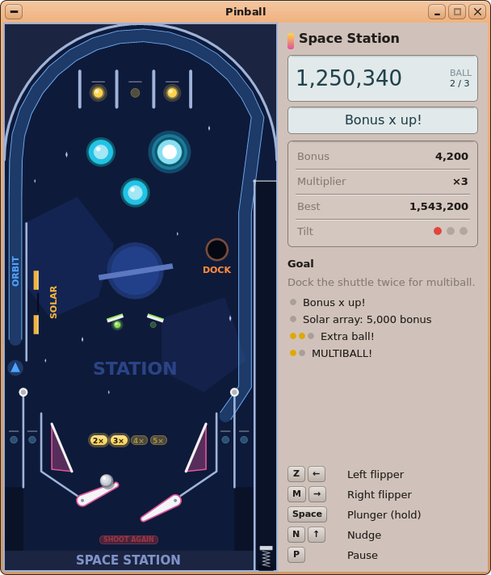
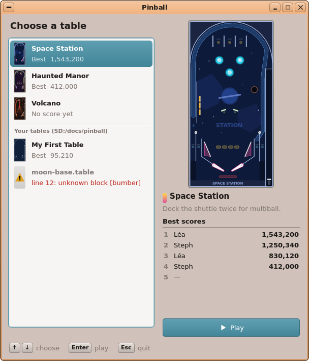
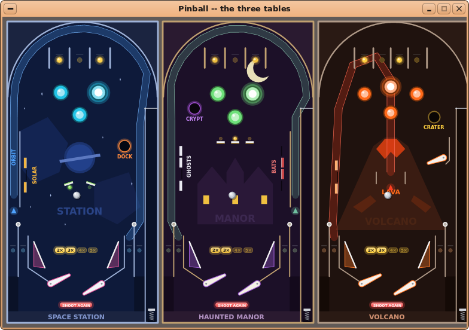

# AutoDev round 4 — UX Designer: Pinball

Date: 2026-10-06. Inputs: `01-product-manager.md`, `02-product-analysis.md` (features "02 §x", acceptance "AC n"),
`03-technical-analysis.md` (plan "step n", risks "R n"). Read for consistency: `docs/11-UIKIT.md` (`LcdDisplay`,
`ToolButton`, `Button`, `Textbox`, `VPath`, `uk_rbox` / `uk_rline` / `uk_raised` / `uk_sunken` / `uk_hilite` /
`uk_title_strip` / `uk_etch_h`, `UkFaceScope`, `uk_text_wrap` / `uk_text_fit`), `docs/gui-redesign/README.md` (the
modernised CDE: raised faces, rounded corners, no shadows, every shade from the theme's colours),
`user/Apps/games/game.h` (`GameView`, `GameRoot`, the *Game* menu), `user/Apps/invaders/main.cpp` (`hud_item`,
`msgbox`, `notice`: the theme-drawn panels over a game), `user/Apps/circuits/main.cpp` (an FT game: `open_face`,
its list, its `ToolButton`s, `LcdDisplay`-like cards) and `user/Apps/turtle/main.cpp`, round 3's `04-ux-design.md`.

**Every picture below is rendered by UIKit itself on the PC** (the desktop simulator: host `g++`, `fakekapi.cpp`,
FreeType's DejaVu Sans, the card's theme — as `shots.sh`). The app does not exist yet, so the pictures come from a
**throwaway program**, `mockups/pinmock.cpp`: it reads the **draft tables** (`mockups/mktables.py` writes them in the
real `.table` format of 02 §7.1, read through FileKit's `fk_kv`), draws them with the drawing rules of §5 below
(`VPath`, `uk_rbox`…), and lays out the windows with UIKit's real widgets (`LcdDisplay`, `ToolButton`, `Button`,
`Textbox`) and the few drawn widgets this design adds. There is no physics in it: each scene's state (balls, lamps,
flippers, messages) is set by hand (`MOCK_SCENE`). To redo the pictures (≈ 15 s once UIKit is built):

```sh
sh autodev/rounds/04-pinball/mockups/mockups.sh       # -> autodev/rounds/04-pinball/mockups/pb-*.png
```

**Where the throwaway lives**: only in `autodev/rounds/04-pinball/mockups/` (`pinmock.cpp`, `mockups.sh`,
`mktables.py`, `sd/` = the overlay: the draft tables, the mock French catalogue, two player tables). Nothing of it is
in `user/`, `user/Makefile`, `tools/tests/desktop_sim/` or `sdcard/`; no app source of the repository is changed by
this role. What the Developer may lift from it as a starting point (not as finished code): the drawing functions
`draw_static`, `draw_dynamic`, `lamp`, `pill`, `ball`, `flipper`, `words` (rotated labels), and the widgets
`TableList`, `Thumb`, `ScoreList`, `Stats`, `RuleList`, `Legend`, `Heading`; and the three draft tables
(`mktables.py` — **positions not yet tuned by the host test**: step 7 moves them until AC 6/7/9 pass).

---

## 0. The decisions

| # | Question | Decision |
|---|---|---|
| D1 | The window | **One window, `Root (600, 680, "Pinball")`** (the frame makes it 608 × 712: fits a 1280 × 800 screen with the menu bar). **Resizable** (`setResizable (true)`, `setMinSize (480, 560)`, `fitWorkArea ()`): the playfield scales with the height; maximised on a TV it fills the height (`pb-max.png`). |
| D2 | The layout | **Playfield at the left, panel at the right**: the playfield = the window's width − 260, full height; the **panel 260 px wide** (its widgets 236 wide at x + 12). Portrait table, landscape screen: a side panel uses the room a portrait table leaves (a top or bottom bar would shrink the table). |
| D3 | Scaling / letterbox | `s = min (fieldW / t.w, fieldH / t.h)`, the table **centred** in the field; the bars (left/right or top/bottom) filled with **the table's background at tone 70** (`uk_tone (bg, 70)`, darker): they read as the cabinet, not as a hole. At the default size the bars are 0 (340 × 680 field, s = 0.654 for 520 × 1040). |
| D4 | What the `GameView` covers | **Only the playfield** (`PinballView : GameView`, a child at (0, 0, W − 260, H)). The panel is **real UIKit widgets** beside it, repainted only when their value changes (`LcdDisplay::setText` repaints only on change): the per-frame cost is the field alone (R4). |
| D5 | The score | A **`LcdDisplay`** (236 × 58, the digits in an `FtTextFace` of 26 px, `smallFace` 11 px): the score at the left, the caption **BALL / BILLE** over **"2 / 3"** at its right. The theme's own studio display: dark well in a dark theme, the accent's pale tint in a light one — the panel looks like the desktop, the table carries the colours. |
| D6 | The message line | A second **`LcdDisplay`** (236 × 34, 16 px face, `centred = true`), empty when no message; the messages of 02 #17 for 2 s (newest wins; `TILT` and *Tilt warning* in red `ink = 0xE0453A`, all others in the display's ink). Between balls it says **"Ball 2: launch it!"** until the launch. |
| D7 | The panel's figures | A drawn widget **`Stats : Widget`** in a sunken box (`uk_sunken`, rows split by `uk_etch_h`): **Bonus**, **Multiplier ×n**, **Best** (the table's top score), **Tilt** = three dots (grey; one red per nudge counted in the last 5 s: 2 = warning, 3 = tilt). Captions in `C_DIS`, values in bold at the right (Invaders' `hud_item` style). |
| D8 | The goal and the progress | Under the figures: **"Goal"** + the table's `goal` wrapped (`Heading`), then **`RuleList`**: one row per `[rule]` that has a `message` — its `count` as **dots** (filled = counted this game; > 6: "3/10"), then the message (cut with "…" if long). A `once` rule already fired: a green check, greyed. **No format change**: it shows `[rule] count` and `message` the file already has. The player sees what to aim for (02's acceptance does not ask for it; it costs one small widget). |
| D9 | The keys reminder | **`Legend : Widget`** at the panel's bottom: keycaps (`uk_raised`, 11 px bold) then the action — `Z ←` Left flipper, `M →` Right flipper, `Space` Plunger (hold), `N ↑` Nudge, `P` Pause. **Once a pad button is seen** (`pad_buttons (-1) != 0`) it shows the pad's: `L`, `R`, `A`, `Y`, `Start` (`pb-tilt.png`). Hidden when the window is shorter than 640 px. |
| D10 | The table picker | **Its own screen in the same window** (the field and the panel hidden; no dialog): a **`TableList : Widget`** at the left (300 px), the chosen table's **preview** (`Thumb : Widget`, its playfield drawn small with the play code, lamps off), its name + goal (`Heading`), its **top 5** (`ScoreList : Widget`), a **Play** `ToolButton` (filled, `WKT_PLAY`), and a key legend in a row at the bottom. Why not UIKit's `ListBox`: its rows are one line of plain text; a row here needs a picture, two lines and a red error (as Circuits' `LevelList`). |
| D11 | A broken table (the error state) | Listed **greyed** with a **yellow warning triangle** in place of its picture, its **file name** (it has no name: it did not load), and the **reason in red** — `line 12: unknown block [bumber]` (cut with "…" if wider than the row). Chosen: the preview becomes a **sunken card** with a big warning triangle, **"This table cannot be played."**, the full reason (wrapped), and *"Correct the file in a text editor (Tinypad): the list is read again when you come back to it."*; Play **disabled**; no goal, no scores. Enter does nothing on it (a short `sfx` blip). `pb-picker-broken*.png`. |
| D12 | Pause | P / Start / Esc / *Game ▸ Pause*: the world frozen, the field **dimmed** (black at alpha 130 over it), a **card** like Invaders' `msgbox` (`uk_rbox` + `uk_title_strip` *Paused*) with **two `Button`s**: **Resume** (focused) and **Back to the tables**, and *"P or Start: resume"* under them. One overlay for P and Esc (02 #18 asked for two; one is simpler and offers the same choices). `pb-pause*.png`. |
| D13 | End of ball | A **translucent strip card** over the lower field (`uk_rbox` alpha 235, the `notice` style): *Bonus* / **"4,200 × 3 = 12,600"** (20 px bold) / *any key: skip*, 1.5 s (02 #19). `pb-bonus.png`. |
| D14 | Game over + name entry | The field dimmed, a **card *Game over*** (title strip): the final score (24 px bold), **"New high score: 2nd place!"** in the accent, **"Your name:"**, a **`Textbox`** (16 characters, holding `[settings] name`; focused, the caret at the end) and an **OK `Button`**. Enter / A / OK (and Esc / B) keep the name shown; an emptied field falls back to the last name (or *Player* / *Joueur*). Then the **top-5 card** (`pb-scores.png`): the five lines, **the new one highlighted** (`uk_hilite`), *"Enter or A: back to the tables"*. A score not in the top 5: no name entry, the *Game over* card shows the score and *"Enter or A: back to the tables"*. |
| D15 | Numbers | Grouped by thousands with **`TRC ("digits", ",")`**: `1,250,340` in English, **`1 250 340` (U+202F, narrow no-break space)** in French. Used everywhere a score shows (panel, picker, cards). |
| D16 | Words on the table | `[label]`s are drawn in DejaVu Sans **bold**, `size` 1…4 → **11 / 15 / 22 / 30 px at s = 0.654**, scaled with `s` (a resized window keeps the proportions); a label smaller than 7 px is skipped (the picker's small pictures). `angle = 90` reads **bottom to top** (drawn once into the static layer: a white-on-black scratch canvas, its coverage blended rotated — `words ()` in the mock). |
| D17 | The table's automatic inserts | Two lamps every table has, **drawn by the game, not the file** (no format change): the **multiplier row** `2× 3× 4× 5×` (pills 32 × 18 units, 38 apart, centred between the two lower flippers' pivots, 115 units above them — lit up to the current multiplier), and **SHOOT AGAIN** (a pill 112 × 17 units, 74 units below the pivots, red `#F04848`: lit while an extra ball is pending, **blinking 2 Hz while the ball save runs**). The multiplier pills take the colour of the table's `top` lanes. |
| D18 | Nudge | The **field shakes**: the whole drawing offset by (+3, −2) px for 3 frames then back (the panel does not move). |
| D19 | Menus | One *Game* menu as Invaders' (game.h's games) plus what Pinball needs — §6. |
| D20 | Language | Every word in `TR` (§8); the tables' `.fr` keys; the French pictures checked: everything fits at 600 × 680. |

---

## 1. The pictures (all in `mockups/`)

| Picture | What it shows |
|---|---|
| `pb-picker.png` | **The table picker** (EN): the three shipped tables, the player's two (*My First Table* = the 02 §7.1.3 example, *moon-base.table* broken), *Space Station* chosen: its preview, goal, top 5, **Play** |
| `pb-picker-fr.png`, `pb-picker-volcano-fr.png` | The picker in French — *Manoir hanté* (the longest goal: 3 lines) and *Volcan* (no score yet: the empty top 5) |
| `pb-picker-broken.png`, `pb-picker-broken-fr.png` | **The error state**: the broken table chosen — the warning card, the reason in red, Play disabled |
| `pb-play.png` | **Playing *Space Station*** (score 1,250,340, ball 2/3): the left flipper up with the ball on it, top lanes 1 and 3 lit, a drop target down, a standup lit, bumper 2 flashing, the orbit's arrow lit, multiplier ×3 lit, *"Bonus x up!"*, the goals' progress |
| `pb-zoom.png` | The flippers, slingshots, inserts and ball at 2× |
| `pb-launch.png` | A new ball on the pulled plunger (the spring compressed), *"Ball 2: launch it!"*, SHOOT AGAIN lit (the ball save) |
| `pb-multiball.png`, `pb-play-fr.png` | **Multiball** (EN, FR): a ball on the orbit (drawn along its path), the second ball leaving the shooter lane, the dock's ring lit, *MULTIBALL!*, the extra-ball goal checked |
| `pb-pause.png`, `pb-pause-fr.png` | **The pause card** over the dimmed field (*Space Station* EN, *Manoir hanté* FR) |
| `pb-bonus.png` | The end-of-ball bonus count |
| `pb-tilt.png` | **TILT**: flippers and lamps dead (greyed), *TILT* in red, the three tilt dots red; the legend showing the **gamepad's** buttons |
| `pb-name.png`, `pb-name-fr.png` | **Game over with a high score**: the name entry (`Textbox` + OK) |
| `pb-scores.png` | The top-5 card after the name: the new line highlighted |
| `pb-max.png` | The window maximised on a 1280 × 800 screen: the table scaled up, letterboxed in its cabinet colour |
| `pb-tables.png` | **The three tables side by side** (the style sheet): Space Station, Haunted Manor, Volcano, lamps partly lit |







---

## 2. The window and its screens

### 2.1 Sizes and places (client 600 × 680; `W`, `H` the client's size after a resize)

| Screen | Widget (class) | Place (x, y, w, h) | Notes |
|---|---|---|---|
| play | `PinballView : GameView` (games/game.h) | 0, 0, W − 260, H | the playfield, letterboxed (D3); the overlays of §4 drawn in it |
| play | `Heading : Widget` (drawn) | W − 248, 10, 236, 26 | the table's name, 16 px bold, a 8 × 20 swatch of the table's lamp → sling colours at its left |
| play | `LcdDisplay` *score* | W − 248, 40, 236, 58 | D5 |
| play | `LcdDisplay` *message* | W − 248, 104, 236, 34 | D6 |
| play | `Stats : Widget` (drawn) | W − 248, 146, 236, 132 | D7, 4 rows of 31 |
| play | `Heading` *Goal* | W − 248, 290, 236, 26 + 16 × lines | D8; the goal ≤ 160 characters: ≤ 4 lines at 236 px (measured: *Manoir hanté* FR, 4 lines) |
| play | `RuleList : Widget` (drawn) | below the goal, to the legend | D8; 21 px a row; rows that do not fit are not drawn |
| play | `Legend : Widget` (drawn) | W − 248, H − 131, 236, 125 | D9, 5 rows of 25 |
| picker | `Heading` *Choose a table* | 16, 12, 284, 30 | 18 px bold |
| picker | `TableList : Widget` (drawn, `canFocus`) | 12, 46, 288, 572 | rows 52 px: the picture 22 × 44, the name (bold), *Best 1,543,200* / *No score yet* / the error (red); the player's tables after an etched line and the caption *Your tables (SD:/docs/pinball)*; scrolls when longer (wheel, keys, a `uk_scroll_bar` at the right) |
| picker | `Thumb : Widget` (drawn) | 314, 12, 274, 330 (broken: 274 × 576) | the preview, in a rounded frame of `uk_tone (C_BG, 90…70)` |
| picker | `Heading` *name + goal* | 316, 350, 270, 26 + 16 × lines | the name 15 px bold with the colour swatch |
| picker | `ScoreList : Widget` (drawn) | 316, below the goal, 270, 136 | *Best scores*, an etched rule, 5 rows: rank (`C_DIS` bold), name, score (bold, right); an empty rank shows "—" |
| picker | `ToolButton` *Play* | 316, 600, 270, 36 | `setGlyph (WKT_PLAY)->setText (TR ("Play"))`, `filled`, `raised`, tooltip *Play this table (Enter)*; disabled for a broken table |
| picker | `Legend` (in a row) | 14, H − 32, W − 28, 22 | `↑ ↓` choose · `Enter` play · `Esc` quit |
| overlays | `Button` ×2 (*Resume*, *Back to the tables*) | over the pause card, 192 × 30 | children of the root, shown with the card, hidden otherwise |
| overlays | `Textbox` + `Button` *OK* | over the name card: 260 × 26, 90 × 28 | idem |

On a resize (`Root::onResized`): the field and the panel are placed again (the panel's x = W − 248), the static
layer is rebuilt at the new scale (≈ 10 ms, once). Below **H = 640** the `Legend` is hidden; below **600** the
`RuleList` too. The picker's list grows with H (the preview, goal and scores keep their places; Play stays above the
legend).

### 2.2 The screens and how one goes to the other

```
start ──► PICKER ──Enter/A/double-click/Play──► PLAY (ball on the plunger) ◄──────────────┐
  │         ▲  ▲                                  │  P / Start / Esc        ▲ Resume       │
  │         │  │                                  ▼                         │              │
  │         │  └──────── Back to the tables ── PAUSED ──────────────────────┘              │
  │         │                                     │ last ball lost                         │
  │         │                                  BONUS (1.5 s, any key skips) ── next ball ──┘
  │         │                                     │ no ball left
  │         │                                  GAME OVER ── top 5? ──yes──► NAME ──Enter/A/OK──► TOP 5
  │         └──────────── Enter / A ──────────────┴───────────── no ───────────────────────┘ (Enter/A)
  └── `pinball <file.table>` → PLAY at once (refused → PICKER, that table chosen, its error shown)
```

---

## 3. The picker

- **Order**: the shipped tables in their files' order (`1-…`, `2-…`, `3-…`), then — if `SD:/docs/pinball/` has
  `.table` files — the caption and the player's tables by name (a broken one by its file name), then a table given as
  argument (if it is in neither folder).
- **The chosen row** at start: the last table played (`scores.ini [settings] table = <section>`, a new key, written
  when a game starts); else the first.
- **Keys**: ↑ / ↓ (and the pad's d-pad) move, Home / End, Enter / Space / A **play**, a click chooses, a double click
  plays, Esc / Select **quits** the app (the picker is the home screen; the menu's *Quit* too).
- **The preview** is the static layer + the lamps-off dynamic layer at the preview's scale, cached per table
  (03 §4.4); the list's 22 × 44 pictures likewise (the static layer only; labels skipped below 7 px).
- **The top 5**: from `scores.ini` (02 §7.2); fewer than 5 → "—" rows; none → five "—".
- **States**:
  - *Empty* — no shipped table found (`SD:/apps/pinball.app/tables/` missing or empty, and no argument): a
    `ft_messagebox ("Pinball", TR ("No table found in SD:/apps/pinball.app/tables."), MB_OK)` and the app ends
    (Circuits' rule). No player folder: no caption, nothing else changes.
  - *Loading* — none visible: every table (≤ 64 KB) is read and checked at start (a few ms each); the pictures are
    drawn when first shown.
  - *Error* — a table refused (D11); the shipped tables cannot be broken in practice, but the same row applies.
  - *Argument refused* — `pinball moon-base.table`: the picker opens with that row chosen, its error shown (AC 30).

## 4. Playing

### 4.1 The playfield (`PinballView`)

- **Ball on the plunger** (a new ball, a ball saved): the message *"Ball n: launch it!"*; holding the plunger key
  pulls the knob down (`pull` 0 → 1 in 1 s: the knob 36 units lower, the spring compressed, the ball riding it).
- **Events → what is seen** (all from `World` / `Game` events, 03 §3.2/3.4):

| Event | On the table | Panel | Sound (03 step 10) |
|---|---|---|---|
| bumper hit | the bumper **flashes** 0.15 s (cap whitened, a halo) | score | bumper |
| sling kick | its body lit 0.1 s (its colour mixed toward white) | score | sling |
| drop target down | its bar becomes a dark slot; the bank's last → all three rise after 1 s | score | target |
| standup hit | its lamp lit (stays) | score | target |
| lane crossed | its lamp lit; the group complete → all blink 3 × (0.5 s) then go dark | score, *Bonus x up!* (rule) | lane |
| flipper press | the lit top-lane lamps shift one place | — | flipper |
| ramp entered | the ball drawn along the path (its track's rails), the arrow lit 0.5 s | score | ramp |
| saucer catch | the ball in the hole, the saucer's ring lit while held | score, the rule's dot | saucer |
| a rule fires | — | its message in the message LCD 2 s, its dots refilled / checked | jingle for multiball / extra ball |
| ball saved | SHOOT AGAIN blinks, the ball back on the plunger | *Ball saved* | — |
| extra ball | SHOOT AGAIN lit | *Extra ball!* | `sfx_win` |
| nudge | the field shakes (D18) | a red tilt dot | — |
| tilt warning / tilt | tilt: flippers, bumpers and every lamp **greyed** (`uk_mix (c, bg, 140…150)`) until the drain | *Tilt warning* / **TILT** in red | low buzz |
| drain | — | the bonus card (D13) | drain |

### 4.2 Overlays (drawn by the view; their `Button`s / `Textbox` are root children shown with them)

Pause (D12), bonus (D13), game over / name / top 5 (D14). While an overlay with buttons shows, the keys go to the
focused widget (Tab moves between them; the pad's d-pad ↑ ↓ too, A = Enter, B = Esc = *Resume* / keep the name).

## 5. The drawing style (the tables)

### 5.1 The look

A **dark playfield, bright toys**: each table's `background` is a dark tint of its theme colour; artwork (`[shape]`)
in a few close, darker / lighter tints; walls a light neutral of the theme; the toys in **one saturated colour per
kind**; text on the table in the toys' colours or a faint tint. Lamps are the only things that change brightness, so
what is lit reads at a glance. The window around (frame, panel, cards, buttons) stays the desktop's theme — Pinball
looks like an Onyx app with a pinball inside.

| Table | `background` | artwork | walls | bumpers | slings | lanes' lamps | targets | saucer | ramp |
|---|---|---|---|---|---|---|---|---|---|
| Space Station | `#0E1A3A` navy | nebulae `#132452`, a planet `#22408A` + ring, stars `#AFC4F0`, side `#1B2440` | `#9FB3D9` steel | cyan `#22C3E6` | magenta `#E0559A` | yellow `#FFD34D`; in/out `#7FD8FF` | drop amber `#F2B33D`, standup lime `#8CE05A` | *Dock* orange `#FF8A3D` | *Orbit* blue `#4FA3FF` |
| Haunted Manor | `#1C1028` plum | the manor `#2A1838` with lit windows `#F0C040`, a moon `#E8E0B8` | `#C0A070` brass | ecto green `#6EE07A` | violet `#9C5BD0` | gold `#F0C040`; in/out `#B0E0A0` | ghosts `#E8E8F0`, bats `#D04848`, standups gold | *Crypt* `#A050D0` | *Orbit* teal `#70C0A0` |
| Volcano | `#1F120E` basalt | the cone `#3A1C12`, its crater lava `#C83A10`, cracks `#5A2410` | `#B09A88` warm grey | lava `#FF6A1A` | orange `#FF7A2A` | `#FFD040`; in/out `#FFB070` | drop `#FFB070` | *Crater* `#FFD040` | *Lava* red `#FF4020` |

Flippers: an **ivory body** (`#F2F4F8`) with a **rubber rim in the table's sling colour** (2.6 units); posts and
sling faces: white rubber `#F4F4F4`. The ball: steel (§5.2).

### 5.2 The elements (geometry in table units, `s` = px per unit; `VPath`, 1/16 px; all anti-aliased)

| Element | Static layer (drawn once per table and scale) | Dynamic layer (each frame) |
|---|---|---|
| background | `fillRect` of `background`; the letterbox bars `uk_tone (bg, 70)` | — |
| `[shape]` | `VPath::poly` filled, file order | — |
| `[label]` | D16 | — |
| `[ramp]` | its track: `polyline (path, width)` in its colour at **alpha 60**, plus two **rails** (the path offset ± width/2, 1.6 units, the colour mixed 60/256 toward white, alpha 230) | its **arrow** before the entry (a triangle 19 × 18, 34 units before the entry's middle, pointing `pass`): unlit `uk_mix (bg, c, 80)`, lit = the colour + a halo (r 15, alpha 60); a ball on it drawn along the path at r 14 (over everything: it is "above" the table) |
| `[wall]` open | `polyline`, `width` (default 4), its colour | — |
| `[wall]` closed (a sling's body…) | filled `uk_mix (bg, c, 90)`, outlined 2.5 units in `c` | sling kick: the body's fill mixed toward white for 0.1 s |
| the `outline` wall | drawn as the side rails (6 units) | — |
| `[arc]` | `VPath::arc` (table degrees `from`→`to` clockwise ⇒ VPath `a0 = 360 − to`, `a1 = a0 + (to − from)`), `width` 5 | — |
| `[post]` | a white rubber disc r + 2.5, its centre `c` darkened | — |
| `[sling]` face | white rubber line, 5 units | — |
| `[gate]` | a light line 2 units, a hinge dot r 3 at `a` | — |
| `[saucer]` | a hole: a disc r + 4 `uk_mix (bg, c, 110)`, inside r near-black `uk_mix (bg, 0, 170)` | its ring: unlit 2 units `uk_mix (bg, c, 120)`; lit 3 units + a halo 5 units at alpha 90 |
| plunger housing | a dark slot 28 × 12 at the lane's foot | the knob 24 × 8 (`#C8CCD4`, a white stripe) at `at.y + 15 + pull × 36`, a zigzag spring (1.8 units, `#9AA0A8`) below it |
| `[lane]` | — | a **lamp** (r = 0.3 × min (w, h)) at the rect's centre + its rollover wire (1.4 units across its top) |
| `[target]` drop | — | up: a bar 9 units thick on the face's back side, its colour, a white 2-unit line on the face; down: a dark slot 3 units |
| `[target]` standup | — | a white bar 7 units with a 2.5-unit line of its colour; its **lamp** (r 6) 16 units behind it |
| `[bumper]` | — | skirt r (colour darkened 140/256), cap 0.84 r (the colour), a rim, a top 0.5 r (mixed toward white), a highlight; **flash**: halo 1.45 r / 1.2 r (alpha 70 / 110), cap and top whitened |
| `[flipper]` | — | a capsule (r0 at the pivot, r1 at the tip) filled with the rubber colour, the same shrunk by 2.6 filled with the body, a grey pivot screw r 3.2; at its true angle |
| automatic inserts | — | D17 |
| ball | — | a shadow (+2.5, +3.5) black alpha 80; body `#7C838E` → `#C4CAD2` → `#DDE1E6` (three offset discs: a sphere), a white highlight r × 0.26 at (−0.38 r, −0.4 r) |

**The lamp rule** (`lamp ()` in the mock): unlit = a disc of `uk_mix (bg, c, 72)` with a rim `uk_mix (bg, c, 130)`;
lit = halos at 1.9 r (alpha 50) and 1.35 r (alpha 90), the disc in `c`, a white highlight 0.42 r (alpha 170). The same
two states for pills (D17) with `uk_rbox`. **Tilt** greys every lamp, bumper and flipper (`dead`).

### 5.3 What the picker's preview draws

The same two layers at the preview's scale with **every lamp off and no ball** (the table's look at rest);
SHOULD 3 (attract mode) may later cycle the lamps there.

## 6. Menus

The global menu bar (UIKit's `Menu`), one menu, as Invaders' *Game* menu (game.h's games) with Pinball's additions:

| Menu | Item | Shortcut | Notes |
|---|---|---|---|
| **Game** / *Partie* | **New Game** / *Nouvelle partie* | **Ctrl+N** | the same table from ball 1 (asks nothing: a game in progress is lost — as Invaders) |
| | **Pause** / *Pause* | **P** | toggles; disabled on the picker |
| | **Choose a Table…** / *Choisir une table…* | **Esc** | the picker (during a game: the pause card first, D12) |
| | **Open a Table File…** / *Ouvrir un fichier de table…* | **Ctrl+O** | `ft_file_open` with the filter *Pinball tables (\*.table)*: plays it (added to the list for this run), or shows the picker with its error |
| | — | | |
| | **Sound On / Off** / *Son activé / désactivé* | **S** | `sfx_set_mute`, kept in `scores.ini [settings] sound` |
| | — | | |
| | **Quit** / *Quitter* | **Ctrl+Q** | |

No toolbar (a game: the panel holds what matters; the menu holds the rest). SHOULD 1 (the checker) adds
*Check a Table…* under *Open a Table File…*.

## 7. Keyboard and gamepad (complete, per screen)

| Screen | Keyboard | Gamepad (`gamepad.h`) |
|---|---|---|
| picker | ↑ ↓ Home End: choose · **Enter / Space**: play · **Esc**: quit · Ctrl+O, Ctrl+Q, S | d-pad ↑ ↓: choose · **A / Start**: play · **Select**: quit |
| play | **← / Z** left flipper (held) · **→ / M** right flipper (held) · **Space / ↓ / Enter** plunger (held; a tap launches at `auto`) · **↑ / N** nudge · **P** pause · **Esc** the pause card · **S** sound · Ctrl+N new game | **L / L2 / d-pad ←** left · **R / R2 / B** right · **A** plunger · **Y** nudge · **Start** pause · **Select** the pause card |
| paused | **P / Esc**: resume · Tab / ↑ ↓: the buttons · Enter / Space: the focused one | **Start / B**: resume · d-pad ↑ ↓: the buttons · **A**: the focused one |
| bonus count | any key: skip | any button: skip |
| name entry | type the name · **Enter**: OK | **A**: OK (keeps the name shown) |
| top 5 / game over | **Enter / Space / Esc**: back to the picker | **A / Start**: back to the picker |

Mouse: a click on a picker row chooses it, a double click plays; the overlays' buttons are clicked; a click on the
playfield does nothing (no mouse flipper: two hands on the keys).

## 8. Words, French, fit

All on-screen words in `TR` (`uikit/lang.h`) — the list below is the mock's catalogue (`mockups/sd/apps/pinball.app/
lang/fr.txt`), the app's `fr.txt` starts from it and adds the menu, the messages of 02 §11 and the loader's reasons
(02 §7.1.4):

| English | French |
|---|---|
| Choose a table · Your tables (SD:/docs/pinball) · Best · No score yet · Best scores · Play · Play this table (Enter) · choose · play · quit | Choisissez une table · Vos tables (SD:/docs/pinball) · Record · Pas encore de score · Meilleurs scores · Jouer · Jouer sur cette table (Entrée) · choisir · jouer · quitter |
| Enter · Esc · Space · Start (keycaps) | Entrée · Échap · Espace · Start |
| This table cannot be played. · Correct the file in a text editor (Tinypad): the list is read again when you come back to it. | Cette table ne peut pas être jouée. · Corrigez le fichier dans un éditeur de texte (Tinypad) : la liste est relue quand vous y revenez. |
| line %d: · unknown block [%s] · cannot read the file | ligne %d : · bloc inconnu [%s] · impossible de lire le fichier |
| BALL · Goal · Bonus · Multiplier · Best · Tilt | BILLE · Objectif · Bonus · Multiplicateur · Record · Tilt |
| Left flipper · Right flipper · Plunger (hold) · Nudge · Pause | Batteur gauche · Batteur droit · Lanceur (maintenir) · Secouer · Pause |
| SHOOT AGAIN · Ball %d: launch it! · Ball lost · Bonus x up! | REJOUEZ · Bille %d : lancez-la ! · Bille perdue · Bonus x augmenté ! |
| Paused · P or Start: resume · Resume · Back to the tables | Pause · P ou Start : reprendre · Reprendre · Retour aux tables |
| Game over · New high score: %s place! · 1st…5th · Your name: · OK · Enter or A: back to the tables · any key: skip | Partie terminée · Nouveau record : %s place ! · 1re, 2e…5e · Votre nom : · OK · Entrée ou A : retour aux tables · une touche : passer |
| `digits|,` (the thousands' separator, TRC) | U+202F (narrow no-break space) |

**Fit (checked by eye in the French pictures at 600 × 680)**: the picker's rows (*Pas encore de score*, *ligne 12 :
bloc inconnu [bumber]*), the longest goal (*Manoir hanté*: 3 lines in the picker at 270 px, 4 in the panel at 236 px),
the panel's captions (*Multiplicateur* + *×3*), the legend (*Lanceur (maintenir)*), the pause card's *Retour aux
tables* (in a 192-px button), the name card (*Nouveau record : 2e place !*) — **all fit, none cut**. Rules: a list row's error is cut with "…" (`uk_text_fit`), the full reason wraps in the preview; a rule's
message in `RuleList` is cut with "…" (its full text shows in the message LCD when it fires); a table's `name` ≤ 40
characters is cut with "…" in the list and the panel heading. The message LCD holds ≤ 32 characters (02's limit for
`message`) at 16 px: *ÉRUPTION ! MULTIBALL !* (22) fits; a longer one is drawn in the 13-px face.

## 9. What changes for the Developer (summary; the plan's amendment is appended to `03-technical-analysis.md`)

- The window: resizable 600 × 680 (min 480 × 560), the `GameView` = the playfield only, the panel = UIKit widgets
  (`LcdDisplay` × 2) + five small drawn widgets (`Heading`, `Stats`, `RuleList`, `Legend`, and on the picker
  `TableList`, `Thumb`, `ScoreList`) — all beside the app in `user/Apps/pinball/` (`panel.h`, `picker.h`), **no UIKit
  change**.
- `draw.h` follows §5 (the mock's functions are the reference); the static layer includes ramps' tracks and labels.
- The automatic inserts (D17) and the rules' progress (D8) — read from what the `Game` already holds
  (`mult`, `extraBalls`, `ballSaveUntil`, `ruleCount`, `ruleDone`): no core change beyond exposing them.
- New strings in `fr.txt` (§8), a new `[settings] table` key in `scores.ini`, the *Open a Table File…* menu item.
- The draft tables (`mockups/mktables.py`) as step 7's starting point; the shots of `shots.sh pinball` should match
  the mock's scenes `pb-picker`, `pb-play`, `pb-multiball`, `pb-picker-fr` (AC 29).
