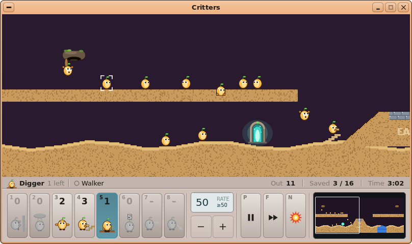
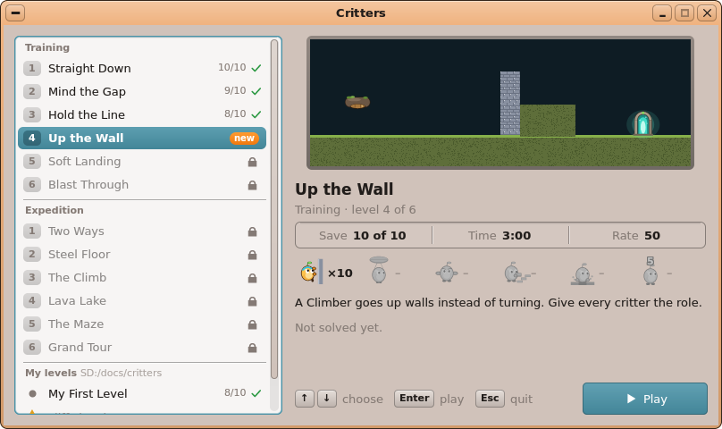
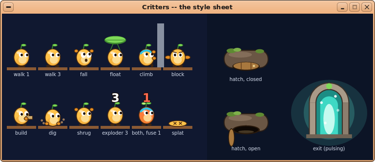

# AutoDev round 5 — UX Designer: Critters

Date: 2026-10-07. Inputs: `01-product-manager.md`, `02-product-analysis.md` (features "02 #n", sections "02 §x",
acceptance "AC-n"), `03-technical-analysis.md` (plan "step n", facts "fact n", risks "R n"). Read for consistency:
`docs/11-UIKIT.md` (`LcdDisplay`, `ToolButton` + `WKT_*`, `Button`, `uk_raised` / `uk_sunken` / `uk_rbox` / `uk_rline`
/ `uk_hilite` / `uk_title_strip` / `uk_etch_h|v` / `uk_scroll_bar` / `uk_glyph` (`WKG_LOCK`, `WKG_CHECK`, `WKG_HISTORY`),
`VPath`, `UkFaceScope`, `uk_text_wrap` / `uk_text_fit`), `docs/gui-redesign/README.md` (the modernised CDE: raised
faces, rounded corners, no shadows, every shade from the theme's colours), the polished games and apps:
`user/Apps/pinball/` (its picker with the player's folder and a refused file, its key legend, its title-strip cards),
`user/Apps/circuits/main.cpp` (the *Game* / *Help* menus, the result cards with Enter / Esc), `user/Apps/turtle/`, and
round 4's `04-ux-design.md` (the shape of this document and its mock-up pipeline).

**Every picture below is rendered by UIKit itself on the PC** (the desktop simulator: host `g++`, `fakekapi.cpp`,
FreeType's DejaVu Sans, the card's theme — as `shots.sh`). The app does not exist yet, so the pictures come from a
**throwaway program**, `mockups/crmock.cpp`: it reads **draft levels** (`mockups/mklevels.py` writes the twelve levels
of 02 §6 and the two player's fixtures in the real `.level` format of 02 §7.1, read through FileKit's `fk_kv`), builds
their terrain by 02 §7.1.3's rules (shapes in order, even-odd polygons at pixel centres, the four textures), draws it
×2 with the creatures, hatches and exits of §5 below, and lays out the windows with UIKit's real widgets
(`LcdDisplay`, `ToolButton`, `Button`) and the few drawn widgets this design adds. There is no simulation in it: each
scene's creatures and terrain edits (a shaft, a stair, a burst) are set by hand (`MOCK_SCENE`). To redo the pictures
(≈ 20 s once UIKit is built, ≈ 35 s the first time):

```sh
sh autodev/rounds/05-critters/mockups/mockups.sh     # -> autodev/rounds/05-critters/mockups/cr-*.png
```

**Where the throwaway lives**: only in `autodev/rounds/05-critters/mockups/` (`crmock.cpp`, `mockups.sh`, `mklevels.py`,
`sd/` = the overlay: the draft levels, the mock French catalogue `sd/apps/critters.app/lang/fr.txt`, the two player's
levels). Nothing of it is in `user/`, `user/Makefile`, `tools/` or `sdcard/`; no source of the repository is changed by
this role. What the Developer may lift from it (a starting point, not finished code): the drawing functions
`critter`, `hatch`, `portal`, `burst`, `brackets`, `role_icon`, `nuke_icon`, `digit`; the widgets `SkillSlot`,
`StatusLine`, `MiniMap`, `LevelList`, `Preview`, `LevelInfo`, `Legend`; the cards' layout in `Field::onDraw`; the
palettes and the rough geometry of `mklevels.py` (**not solved**: step 9's `crsim` loop decides every number).

---

## 0. The decisions

| # | Question | Decision |
|---|---|---|
| D1 | The window | **One window, `Root (800, 448, TR ("Critters"))`**, **fixed size** (not resizable: the play area is an exact ×2 of the terrain). With its frame ≈ 808 × 480: fits a 1024 × 768 screen as well as 1280 × 800. The title is *Critters* / ***Bestioles*** (02 §1). The picker and the play screen are **two screens of the same window** (widgets shown / hidden), as Pinball. |
| D2 | The scale | **×2, integer, always**: the play area is **800 × 320 screen px = 400 × 160 logical px**. Every level is 160 px high or less (02: no vertical scroll), so the whole height is always seen; a level of 400 px or less (T1, T5) is seen whole with no scroll. A level narrower than 400 (the format allows 320) is **centred**, the bars filled with `uk_tone (background, 70)` (Pinball's D3). A level lower than 160 is drawn from the top, the rest of the area the bars' colour. |
| D3 | The layout, top to bottom | **The play area** (`CrittersView : GameView`, 800 × 320) — **the status line** (`StatusLine : Widget`, 800 × 24) — **the skill bar** (104 px: 8 role slots · release rate · pause, fast-forward, all explode · the minimap). A bottom bar keeps the play area the window's full width: the levels are landscape (up to 10 : 1), so every pixel of width is worth more than height. |
| D4 | The role slots | **`SkillSlot : Widget`** × 8, 44 × 92, in the order of 02 #19 (Climber, Floater, Blocker, Builder, Digger, Exploder, Basher, Miner): the **key** (1…8, 10 px bold, top left), the **count** (17 px bold, centred), the **role's picture** (the creature in its role, 34 px, §5.4). **No word in the slot** (the French names are up to 10 letters: *Artificier*); the name is in the status line (D7) and the *How to play* card. The chosen slot: **pressed and filled with the accent's tint, a 2-px accent outline** (`uk_raised (… UK_PRESSED)` + `uk_rline`). A count of 0: the slot's face a shade darker, the count and the picture **greyed** (the picture's colours mapped to greys). Basher / Miner while SHOULD 1 is not built: greyed with an en dash **"–"** in place of the count, and never choosable. |
| D5 | The release rate | A **`LcdDisplay`** (84 × 40, digits 20 px, caption **RATE / DÉBIT**, second line **"≥50"** = the level's minimum) over two **`ToolButton`s** `WKT_MINUS` / `WKT_PLUS` (41 × 44, `raised`, tooltips *Slower release (−)* / *Faster release (+)*). One click or key = **±5**, clamped to [level's `rate`, 99] (so 99 is reached exactly); `−` disabled at the minimum, `+` at 99. |
| D6 | Pause, fast-forward, all explode | Three more **`SkillSlot`s** (the same look, so the bar reads as one row of keys): **P** `WKT_PAUSE`, **F** `WKT_FORWARD` — both **toggles, lit (accent-filled) while on** —, **N** the burst picture (§5.4). Pause on also shows a banner over the play area (D10); fast-forward on shows a small **"▶▶ ×3"** pill at the play area's top right (`cr-fast.png`). |
| D7 | The status line (the HUD of 02 #20) | **`StatusLine : Widget`**, a strip `uk_tone (C_BG, 120)` with an etched line under it. **Left**: the chosen role's small picture, its **name** (bold) and **"n left"** (*encore n*); then after an etched separator **what is under the pointer**: a ring glyph and its state in words — *Walker*, *Builder*, *Falling — cannot dig now* (the refusal said **before** the click) — and *(3 here)* when several overlap. Pointing at a slot shows that slot's name and key there instead. **Right**, right-aligned, caption in `C_DIS` then the value in bold: **Out** *n* · **Saved** *s / needed* (**green** once enough are saved) · **Time** *m:ss* (counting down, **red** under 0:30). |
| D8 | The minimap | **`MiniMap : Widget`**, 182 × 92, a sunken dark box: the whole level scaled **sx = 174 / width, sy = min (84 / height, 2 · sx)** (a wide level is shown at most twice taller than true, so a 1600-px level is a readable 174 × 34 strip; a 400-px one fills the box), centred; each sample = the colour of the first non-empty pixel of its block (the sky a darker tone); the **creatures as 2 × 2 yellow dots** `#FFD24A`, the **exits as cyan dots** `#60F0D8`, the **hatches as small brown pills**; the **visible frame** as a white rounded 1-px rectangle. Click = centre the view there; drag = follow. |
| D9 | The creature under the pointer | **Corner brackets** (four L-shapes 6 px long, 1.6 px, round its body box ±1 px, at ×2: 22 × 29 screen px): **white** when it would take the chosen role, **red `#FF5A4A`** when it would refuse (the status line says why). With no role chosen: white. The **keyboard focus** (Tab, 02 #21) adds a small **accent triangle** above the brackets (`cr-build.png`). The system's pointer is kept (no custom cursor: the brackets are the aim). |
| D10 | Pause | **P / Space / the P slot**: the world frozen, the play area **dimmed** (black at alpha 70), a **pill banner** at its top centre: ⏸ **Paused** · *P or Space: resume*. **Not modal**: the view still scrolls (keys, edges, minimap), roles can be chosen (not given — a click on a creature blips), the menus work (02 #23). `cr-pause.png`. |
| D11 | Esc in play | A **modal card** *Paused* (`uk_rbox` + `uk_title_strip`, Invaders' / Pinball's look) with three **`Button`s**: **Resume** (focused), **Restart Level**, **Back to the levels**; *Esc: resume* under them. The world is paused while it shows. `cr-menu.png`. |
| D12 | All explode (the nuke) | **N / the N slot / *Game ▸ All Explode***: a **modal card *All explode?*** with the burst picture, *"Every critter still out bursts after a 5-second countdown, and no more come out. The level then ends."*, **`Button`s *All explode*** (focused) and ***Cancel***, and *N or Enter: all explode · Esc: cancel*. **The world is paused while the card shows** — so the confirmation needs no 2-second window: **N again or Enter confirms, Esc / Cancel / a click outside cancels**. *(Changes 02 §10's "N then N within 2 s": the same keys, no timer, no hurry.)* Disabled (a blip) when nothing is out and nothing more will come. `cr-nuke.png`. |
| D13 | "Only blockers are left" (fact 7) | When every creature has come out (or `nuking`) and **every creature still in play is a blocker**, the status line's left part becomes, in amber bold `#B06A00` with the burst picture: ***Only blockers are left: N (All explode) ends the level.*** / ***Plus que des bloqueurs : N pour tout faire sauter.***, the *Out* count turns amber, and the **N slot pulses** (an orange `#FF9A30` rounded glow behind it, 1 Hz). Nothing else changes (the rule stays the genre's). `cr-blockers.png`. |
| D14 | The start card (02 #22) | A card over the play area (not dimmed: the level is seen behind it) with the **level's name** in its title strip, ***Save 8 of 10*** (16 px bold) and the time with a clock glyph, the **roles the level gives** (pictures in small sunken tiles, ×count under each, only those > 0), the **hint** wrapped (≤ 3 lines), and *Click or press a key to start*. The world is paused (the P slot lit) and the hatch closed until a key or a click. Shown for every level (no hint → no hint lines, the card shorter). `cr-card.png`. |
| D15 | The end of a level (02 #24) | The play area dimmed, a **card** titled ***Level complete!*** or ***Not enough critters saved***: the saved count **"9 / 10"** (30 px bold; red when lost), *saved (90 %)*, a sunken strip **Needed 8 · Time 1:14** (the time taken), then **"New best!"** in an accent pill (won and better than `progress.ini`) — or, lost, *Try another role, or give it sooner.* — and **`Button`s Retry · Next · Levels**: won → **Next focused** (absent at the last level, Expedition 6, and for a player's level); lost → **Retry focused**, no Next. Enter = the focused button, Esc = *Levels*. `cr-won.png`, `cr-lost.png`. |
| D16 | The level picker (02 #27) | Its own screen: at the left a **`LevelList : Widget`** (300 × 424, `canFocus`): the three groups with small bold headings *Training* · *Expedition* · *My levels* `SD:/docs/critters` (the folder in `C_DIS`), rows of 25 px: a **number badge** (1…6 per pack; a dot for a player's level), the **name** (bold when chosen), at the right the state: **✓ green + "9/10"** solved (the best saved / count), an orange **"new"** pill (open, not solved), a **lock** (closed). It scrolls (`uk_scroll_bar`, the wheel, the keys keep the chosen row in view). At the right: **`Preview : Widget`** (464 × 150: the terrain scaled to fit, in a rounded frame, hatches and exits drawn small), **`LevelInfo : Widget`** (the name 17 px bold; *Training · level 4 of 6*; a sunken strip **Save 10 of 10 · Time 3:00 · Rate 50**; the six roles' pictures with *×n* or a greyed "–"; the hint; the best result ✓ *Best: 9 saved · 1:40* or *Not solved yet.*), a **key `Legend`** (↑ ↓ *choose* · Enter *play* · Esc *quit*) and the **Play `ToolButton`** (140 × 36, `WKT_PLAY`, `filled`, `raised`, tooltip *Play this level (Enter)*). `cr-picker.png`. |
| D17 | A locked level | Listed greyed with a **lock**; when chosen the preview is shown **dimmed with a lock badge** (the level is a teaser, not a secret), the info says ***Solve "Hold the Line" to open this level.*** (the level before it in the chain), **Play disabled**, Enter blips. `cr-picker-locked.png`. |
| D18 | A broken level (the error state) | Listed with a **yellow warning triangle**, its **file name** (it has no name: it did not load) and, on a second line (the row is 40 px), **the reason in red** — *line 24: unknown block [shap]* — cut with "…" if wider. Chosen: the preview becomes a **sunken card** (464 × 200) with a big warning triangle, ***This level cannot be played.***, the full reason (red, wrapped) and *Correct the file in a text editor (Tinypad): the list is read again when you come back to it.*; the info hidden; **Play disabled**. (Pinball's D11, the same words.) `cr-picker-broken.png`. |
| D19 | The look of the creatures | **Our own**: a **round, pebble-shaped body** (≈ 16 × 18 screen px), warm yellow `#FFC24A` with a pale belly, a dark-brown outline, two big eyes looking where it goes, tiny dark feet, and **a green sprout on its head** (a seedling: the critters are little sprouts). No hair, no robe, no human figure (AC-37). The **climber** wears a **cyan headband**; the **floater** has a **second leaf** on its sprout, which **opens as a leaf parachute** when it falls. §5.1, `cr-sheet.png`. |
| D20 | The hatch and the exit | The **hatch is a burrow hatch**: a mossy stone lump hanging over the release point with a **round wooden door** on its underside, which **swings open** (the hatch-opening sound) at the start. The **exit is a glowing doorway**: a stone arch with a leaf keystone, filled with a **cyan light that pulses** (1 s) and a few sparkles. §5.2. |
| D21 | Sprites: drawn by code | The creatures, hatch, exit, role pictures are **vector drawings** (`VPath`, anti-aliased), **pre-rendered once at start** into small ARGB frames (the colour + an opacity per pixel) and blended each frame — no bitmap file (AC-37 is obvious), no per-frame path filling (R1). §5.5. |
| D22 | Words on the terrain (`[label]`) | Painted **into the colour layer** once after `build_terrain`, **only over earth / steel pixels** (DejaVu Sans Bold 9 px at ×1, so ×2 on screen: a deliberately blocky "painted" look), mixed 150/256 with the label's colour — **they erode with the earth** (03 §5.3's first option). |
| D23 | Menus | *Game* and *Help*, as Circuits' — §6. No toolbar: the skill bar is the toolbar. |
| D24 | Language | Every word in `TR` (§8); the levels' `.fr` keys; **the French pictures checked: everything fits** in 800 × 448 (§8.1). |

---

## 1. The pictures (all in `mockups/`)

| Picture | What it shows |
|---|---|
| `cr-picker.png`, `cr-picker-fr.png` | **The level picker**: Training 1–3 solved (✓ and the best), *Up the Wall* open and new (EN, chosen), the rest locked, *My levels* below; FR: *Tenir la ligne* chosen, its best result |
| `cr-picker-locked.png` | A **locked** level chosen (*Steel Floor*): the dimmed preview with the lock, *Solve "Two Ways" to open this level.*, Play disabled |
| `cr-picker-broken.png`, `cr-picker-broken-fr.png` | **The error state**: `cliffs.level` (a `[shap]` typo) chosen — the list scrolled to it, the warning card, the reason in red, Play disabled |
| `cr-card.png`, `cr-card-fr.png` | **The start card** of *Mind the Gap*: Save 8 of 10, 3:00, the Builder ×4, the hint; the hatch closed, the P slot lit |
| `cr-play.png`, `cr-play-fr.png` | **Playing *Two Ways***: the hatch open, a creature falling from it, walkers on the upper floor, a digger at work, a builder on its stair, a creature falling off the ledge, the exit glowing; *Digger* chosen (slot 5), the pointer's brackets on a walker; the minimap with its dots and frame |
| `cr-zoom.png` | The creatures, the hatch and the brackets of `cr-play.png` at ×2 |
| `cr-refuse.png` | The brackets **red** on a falling creature with *Digger* chosen: *Falling — cannot dig now* |
| `cr-build.png`, `cr-build-fr.png` | ***Steel Floor***: a digger's shaft stopped on the steel, another digger at work, a builder high on its stair, an exploder's **3** over its head, a burst's particles and crater; *Builder* chosen, the **keyboard focus** (accent triangle) on a walker |
| `cr-pause.png` | **Pause** (P): the area dimmed, the banner, the P slot lit |
| `cr-fast.png` | **Fast-forward** on: the "▶▶ ×3" pill, the F slot lit |
| `cr-menu.png` | **Esc in play**: the *Paused* card — Resume / Restart Level / Back to the levels |
| `cr-nuke.png`, `cr-nuke-fr.png` | **The *All explode?* confirmation** |
| `cr-blockers.png`, `cr-blockers-fr.png` | **Only blockers are left**: the amber status message, *Out* amber, the N slot pulsing |
| `cr-won.png`, `cr-won-fr.png` | **Level complete!** 9 / 10, Needed 8, Time 1:14, *New best!*, Retry · **Next** · Levels |
| `cr-lost.png` | **Not enough critters saved** 5 / 10 (red), Time 3:00 (the clock ran out), Retry · Levels |
| `cr-help.png`, `cr-help-fr.png` | ***How to play*** (F1): the goal in three lines, the six roles with their key, picture, name and what they do |
| `cr-sheet.png` | **The style sheet**: every creature state at ×3.7 (walk ×2, fall, float, climb, block, build, dig, shrug, exploder, climber + floater at its last second, splat), the hatch closed and open, the exit |







---

## 2. The window and its screens

### 2.1 Sizes and places (client 800 × 448, fixed)

| Screen | Widget (class) | Place (x, y, w, h) | Notes |
|---|---|---|---|
| play | `CrittersView : GameView` (games/game.h) | 0, 0, 800, 320 | the terrain ×2 from the view's left edge `vx` (logical px), the hatches, exits, creatures, particles, countdowns, brackets; the banner, the pill and the cards of §4 drawn in it |
| play | `StatusLine : Widget` (drawn) | 0, 320, 800, 24 | D7 / D13; repainted only when a value changes (the pointer's creature, a count, the second of the clock) |
| play | `SkillBar : Widget` (drawn; the face only) | 0, 344, 800, 104 | `C_BG`, etched separators (`uk_etch_v`) at x 362, 460, 602; its slots and buttons below are root children placed over it (or its children — the Developer's choice) |
| play | `SkillSlot` × 8 (roles) | 8 + 44·i, 350, 44, 92 | D4; i = 0…7 |
| play | `LcdDisplay` *rate* | 370, 350, 84, 40 | D5: `face` 20 px, `smallFace` 10 px, caption `TR ("RATE")`, `setSub ("≥50")` |
| play | `ToolButton` − / + | 370, 396, 41, 44 · 413, 396, 41, 44 | D5: `WKT_MINUS` / `WKT_PLUS`, `raised` |
| play | `SkillSlot` × 3 (P, F, N) | 466 + 44·j, 350, 44, 92 | D6; j = 0…2 |
| play | `MiniMap : Widget` (drawn) | 610, 350, 182, 92 | D8 |
| picker | `LevelList : Widget` (drawn, `canFocus`) | 12, 12, 300, 424 | D16; rows 25 px (a broken one 40), headings 20 px, a group separated by `uk_etch_h`; the focus outline (`uk_sunken (…, true)`) |
| picker | `Preview : Widget` (drawn) | 324, 12, 464, 150 (broken: 464 × 200) | D16 / D17 / D18 |
| picker | `LevelInfo : Widget` (drawn) | 326, 174, 460, 216 | D16; hidden for a broken level |
| picker | `Legend : Widget` (drawn, a row) | 326, 407, 302, 22 | keycaps `uk_raised` 11 px bold, then the action in `C_DIS` (Pinball's) |
| picker | `ToolButton` *Play* | 648, 400, 140, 36 | `setGlyph (WKT_PLAY)->setText (TR ("Play"))`, `filled`, `raised`; disabled for a locked or broken level |
| overlays | `Button` × 3 (*Resume*, *Restart Level*, *Back to the levels*) | on the Esc card, 200 × 30, 36 apart | root children shown with the card, hidden otherwise (round 4's R11 focus rule) |
| overlays | `Button` × 2 (*All explode*, *Cancel*) | on the nuke card: 150 × 30 and 110 × 30, right-aligned | |
| overlays | `Button` × 3 (*Retry*, *Next*, *Levels*) | on the end card, 104 × 30, 12 apart, centred | *Next* absent when there is no next |

Cards (all centred in the play area, `uk_rbox` radius 8 in `C_FACE`, `uk_title_strip` of `uk_fh () + 10`, a 1-px outline
`uk_tone (C_FRAME_ACTIVE, 44)` as Pinball's): start card 440 × 214 (shorter without a hint), Esc card 260 × 176, nuke
card 400 × 172, end card 380 × 232, *How to play* 620 × 296. Under every modal card the play area is dimmed (black,
alpha 120); the start card is not dimmed.

### 2.2 The screens and how one goes to the other

```
start ──► PICKER ──Enter / double click / Play──► START CARD (paused, hatch closed)
  ▲  ▲       ▲                                        │ any key / click
  │  │       │                                        ▼
  │  │       │        ┌─────────── P / Space ──── PLAYING ◄──── Resume / Esc ────┐
  │  │       │        ▼             (banner)      │  │  │                        │
  │  │       │     PAUSED ── P / Space ──────────►┘  │  └── Esc ──► PAUSED CARD ─┤── Restart Level ─► START CARD
  │  │       │                                       │  N ──► NUKE CARD ── Enter/N ──► PLAYING (nuking)
  │  │       └──────── Back to the levels ───────────┼────────────────────────── Esc / Cancel ──► PLAYING
  │  │                                               │ all saved or dead · the clock · the last burst
  │  │                                               ▼
  │  └──────────── Levels / Esc ───────────────── END CARD ── Retry ──► START CARD
  │                                                  └─── Next ──► START CARD (the next level)
  └── `critters <file.level>` → START CARD at once (refused → PICKER, that row chosen, its error shown)
      `critters <file.level> --replay <sol> --until <n|end>` → PLAYING paused at step n / END CARD (no start card)
```

## 3. The picker

- **Order**: *Training* 1…6, *Expedition* 1…6 (the files' `<nn>`), then — if `SD:/docs/critters/` holds `.level` files —
  the *My levels* heading and the player's levels by name (a broken one by its file name), then a level given as
  argument if it is in neither folder.
- **The chosen row at start**: `progress.ini [settings] last` (02 §7.2); else the first open, unsolved level; else
  *Training 1*.
- **Keys**: ↑ / ↓, Home / End, Page Up / Down (the pad's d-pad ↑ ↓) choose; **Enter / Space** (A) play; a click chooses,
  a double click plays; **Esc** (Select) quits the app (the picker is the home screen); Ctrl+O, Ctrl+Q, M, F1 as the
  menus. Enter on a locked or broken level: a short blip, nothing else.
- **The preview** is built on selection (`build_terrain` into the scratch terrain, then sampled nearest-neighbour
  into a cached `Canvas`, ≤ 30 ms, 03 §5.3); the hatches and exits drawn at its scale.
- **States**:
  - *Empty* — no shipped level found (`SD:/apps/critters.app/levels/` missing or empty, no argument):
    `ft_messagebox (TR ("Critters"), TR ("No level found in SD:/apps/critters.app/levels."), MB_OK)`, then the app ends
    (Pinball's rule). No player's folder: no *My levels* heading.
  - *Loading* — none visible: every level (≤ 64 KB) is read and checked at start (`load_level` + `material_at`, a few ms
    each, 03 §3.2); the previews are made when first chosen.
  - *Error* — a refused level (D18). *Argument refused* — `critters cliffs.level`: the picker opens on that row, its
    error shown (AC-26).
  - *Locked* (D17), *new* (open, never solved: the orange pill), *solved* (✓ and the best).

## 4. Playing

### 4.1 The play area (`CrittersView`)

- **Scrolling** (02 #18): ← / → held **4 logical px a frame** (≈ 200 px a second at 50 Hz), **Shift** held: 12; the pointer
  within **8 screen px** of the area's left / right edge: the same speed (only while the window is active and no card
  shows); **Home / End**: the level's left / right end; the **wheel**: 24 logical px a notch; a **right-button drag**
  in the area grabs the terrain; the minimap (D8). The view's left edge is clamped to [0, width − 400].
- **The start of a level**: the view at `start` (else centred on the first hatch), the start card (D14); after it the
  door swings open (frame 0 → 1 over 0.3 s, the hatch-opening sound) and the first creature drops 2 s later (02 #5).
- **Events → what is seen** (from `World` events, 03 §3.3; the sounds are 03 step 10's):

| Event | In the play area | Status line / bar |
|---|---|---|
| `E_HATCH_OPEN` | the hatch's door swings open | — |
| `E_OUT` | a creature drops from the hatch | *Out* + 1 |
| `E_ROLE` | the creature changes pose at once (§5.1) | the slot's count − 1 (a brief flash of the slot's face, 0.2 s) |
| `E_REFUSE` | the brackets flash red twice | the reason stays in the status line |
| `E_BRICK_WARN` | the builder's brick flashes white | — |
| `E_SPLAT` / `E_DROWN` / `E_BURN` | the splat pose (a flat puddle with ✕ eyes) / bubbles rising / a puff of orange sparks, ≤ 16 steps | *Out* − 1 when it ends |
| `E_TICK` | the countdown digit above the head: **5 4 3 2 1** (13 px bold, white with a dark outline; **red `#FF6A50` at 1**, the body reddening) | — |
| `E_BURST` | ≈ 20 particles (earth-coloured squares and yellow / orange sparks, drawing only), a pale flash; the crater appears | — |
| `E_SAVED` | the creature shrinks into the light (8 steps), the exit flares | *Saved* + 1 (green once ≥ needed) |
| `E_END` | the end card (D15) after 0.5 s | — |

### 4.2 Giving a role

- **Mouse** (02 #21): choose a slot (click, or 1…8), then **click the creature**: the brackets show beforehand which
  one the click will reach (`World::pick` with the chosen role, refreshed each frame and on each move) and in which
  colour (D9). A click where no creature is: nothing. Paused (D10): the click blips (roles are given only while the
  world runs — 02 #23).
- **Keyboard**: **Tab / Shift+Tab** highlight the next / previous creature **in view**, from left to right (by x, then
  release order; it wraps); the focused creature keeps the focus while it lives and is in view (scrolling away clears
  it); a mouse move over the area hands the highlight back to the pointer. **Enter** gives the chosen role to the
  focused creature. The focus is the same brackets + the accent triangle (D9).
- A slot whose count is 0 (or Basher / Miner unbuilt) cannot be chosen: its key or click **blips** and the choice stays.
- **Hover a slot**: the status line's left part shows the slot's name and key (*Builder · key 4*).

### 4.3 Overlays

The pause banner (D10), the fast pill (D6), the Esc card (D11), the nuke card (D12), the start card (D14), the end card
(D15), *How to play* (F1, a card of the same look — the goal in three lines, then the six roles: picture, key, name,
what it does; Esc or F1 closes; the world paused while it shows). While a card with buttons shows, the keys go to the
focused button (Tab between them), `CrittersView::key` returns **false** for Tab (fact 4, R9).

## 5. The drawing (the creatures, the hatch, the exit, the terrain)

### 5.1 The creatures (screen px at ×2; the feet point = 02 #4's `(x, y)`, the body box `x−4…x+4, y−11…y` = 22 × 24 on screen)

| Part | Drawing |
|---|---|
| body | an ellipse rx 8.8 ry 9.8 in the outline `#4A2A10`, inside rx 7.9 ry 8.9 in `#FFC24A`; a shade at its bottom (`#E58E22` at alpha 70), a pale belly `#FFE7A6` (alpha 210) toward the facing side, a white highlight top left (alpha 140) |
| eyes | two whites (r 2.4) toward the facing side, pupils `#1A0E06` (r 1.3) looking ahead — up when climbing or falling, down when building or digging, **straight ahead (front-facing) for a blocker** with frowning brows |
| feet | two dark ellipses `#3A2412`; walking: 4 frames, the feet swinging ±1.6 px and the body bobbing 0.6 px on frames 1 and 3 |
| sprout | a stem `#3E8A2E` and a leaf `#7ED957` on top (it leans back a little when walking) |
| climber (permanent) | a **cyan headband** `#2EC4E8` (an arc across the top of the body) |
| floater (permanent) | **a second, paler leaf** `#B8F07A` on the sprout; falling, the leaf **opens as a parachute** (an ellipse 22 × 8 over it, two strings) |
| walk / fall / float / climb | 4 / 2 / 2 / 4 frames: fall = feet together, eyes wide, a small round mouth, arms up; climb = the body against the wall, feet and hands on it |
| block | arms out to both sides (two stubs `#E58E22`), facing front; 1 frame (2 with a blink) |
| build | holding a brick (the level's `brick` colour, a light top) in front; 4 frames (the brick lowered and laid every 8 steps) |
| dig | squatting 2 px lower, hands down, dust specks `#B08860` on both sides; 4 frames |
| shrug | both arms up, 10 steps |
| exploder | the countdown digit 19 px above the body centre (D: `E_TICK` row); at 1 the body mixes toward `#FF4A30` |
| splat / drown / burn / saved | a flat puddle with ✕ eyes / the body sinking with bubbles / sparks / shrinking into the light — ≤ 16 steps |

### 5.2 The hatch and the exit

- **The hatch** (drawn over the release point, its door's centre 6 px above it): a stone lump 46 × 19 screen px, radius 9,
  outline `#2A1E16`, face `#6A5644` with a lighter patch, three tufts of moss `#5E8A32` / `#7EB04A` on top; **closed**: a
  round wooden door on its underside (an ellipse 26 × 8, `#A8783E`, two plank lines `#6A4420`, a brass knob); **open**: a
  dark hole `#0E0804`, the door hanging from its left hinge, a faint warm glow in the hole.
- **The exit** (the threshold at the exit's point): a stone arch — two posts 6 × 26 and a half-ring r 13, `#A89A88` with
  a dark rim `#3A3028`, a leaf keystone — filled with the **light**: a dark teal `#1C8C84`, a bright `#3ED8C4`, a white
  core `#D8FFF6`, and two halos `#60F0D8` (alphas 18–40 + the pulse); **the pulse**: a triangle wave over 1 s on the
  halos' and the core's opacity; four sparkles twinkling. A threshold step `#6E6254` 36 × 3.
- Neither is terrain (creatures pass through them — 02 §7.1.3 point 4).

### 5.3 The terrain's palettes (for `tools/critters/mklevels.py`)

| Palette | earth / speckle (`colour` / `colour2`) | the cap (grass, moss, crust: a 3-px band on top) | sky (`background`) | used by |
|---|---|---|---|---|
| **soil** | `#8A5A34` / `#6E4428` | grass `#6E8A3C` | night blue `#101830` | T1–T3 |
| **moss** | `#5E6E3A` / `#4A5A2C` | moss `#86B04A` | deep teal `#0E1C24` | T4–T6, E6 |
| **sand** | `#C89A5C` / `#A87C44` | crust `#E0BC78` | dusk plum `#2A1A30` | E1, E2 |
| **ice** | `#7FA2C2` / `#5F82A2` | snow `#D8ECF8` | cold blue `#0C1A30` | E3 |
| **cave** | `#7A5E4A` / `#5E4636` | `#9A7A5E` | near black `#141012` | E4, E5 |
| steel | `#8890A0`, `texture = bricks`, `colour2 = #6A7282` — **riveted plates**: the bricks' mortar lines as plate seams, plus a light rivet (`uk_tone (colour, 200)`) at each plate's top-left corner (the drawing's rule for steel + `bricks`; materials unchanged) | | | all |
| water | `#3070D0`, `stripes`, `#4A8AE8` | | | T3, E1, E6 |
| lava | `#E05020`, `stripes`, `#FF8A30` | | | T2, E2, E4 |
| bricks (builders') | the level's `brick` (default `#C8A060`), the top row `uk_tone (brick, 170)` | | | |

The polygons stay within 02's 64 points (the mock's ground waves use ≤ 31 points a side, so a ground and its cap fit).

### 5.4 The pictures of the roles (slots, start card, picker, help)

**The creature in its role**, 34 px in the slots (30 in the picker, 38 in the help card, 22 in the status line): Climber
= climbing a steel post (with its band), Floater = under its open leaf, Blocker = arms out, Builder = carrying a brick by
a three-brick stair, Digger = squatting in a dark notch of earth, Exploder = with a **5** over its head, Basher /
Miner = with a horizontal / diagonal arrow. **All explode** = a 12-pointed red-orange burst `#E84A2A` with a yellow core.
Greyed (a count of 0): every colour mapped to a grey of the same brightness (`110 + bright / 3`). Pause / fast-forward:
`uk_tool_glyph (WKT_PAUSE / WKT_FORWARD)` in the text colour.

### 5.5 How the sprites are made (D21)

At start, `draw.h` renders each frame once with `VPath` into an ARGB buffer (colour + opacity, a frame ≈ 26 × 40 px at
×2 including the leaf parachute and the countdown's room): the states × frames of §5.1 for **both directions** (a
mirrored copy), the two permanent marks (band, second leaf) as **separate overlay frames** drawn after the body (so 4
combinations cost no more frames), the hatch (closed, open), the exit's arch and its light (the pulse = the light frame
blended at a varying opacity), the role pictures at their four sizes. ≈ 90 frames, ≈ 400 KB, ≈ 20 ms once. Each frame
of the game then blends ≤ 80 creature frames (≈ 1 000 pixels each) — ≈ 80 k blends, < 1 ms on the A72. The countdown
digit is drawn live with an `FtTextFace` of 13 px (outline = the digit drawn 8 times offset in `#1A0E06`). The exact
pixels of the mock (`crmock.cpp` `critter ()`) are the reference.

## 6. Menus

The global menu bar (UIKit's `Menu`), as Circuits' / Pinball's:

| Menu | Item | Shortcut | Notes |
|---|---|---|---|
| **Game** / *Partie* | **Restart Level** / *Recommencer le niveau* | **Ctrl+R** | the start card again; disabled on the picker |
| | **Pause** / *Pause* | **P** | toggles (D10); disabled on the picker |
| | **Fast Forward** / *Accéléré* | **F** | toggles (D6) |
| | **All Explode** / *Tout faire sauter* | **N** | the card (D12) |
| | — | | |
| | **Levels…** / *Niveaux…* | **Esc** | in play: the Esc card first (D11); on the picker: disabled |
| | **Open a Level File…** / *Ouvrir un fichier de niveau…* | **Ctrl+O** | `ft_file_open`, filter *Critters levels (\*.level)*: plays it (its start card; listed for this run), or the picker with its error |
| | — | | |
| | **Sound On / Off** / *Son activé / désactivé* | **M** | `sfx_set_mute`, kept in `progress.ini [settings] sound` |
| | — | | |
| | **Quit** / *Quitter* | **Ctrl+Q** | |
| **Help** / *Aide* | **How to Play** / *Comment jouer* | **F1** | the card (§4.3) |
| | — | | |
| | **About Critters** / *À propos de Bestioles* | | `ft_messagebox`: *Critters 1.0 — lead the little creatures to the exit.\nMIT License.* |

SHOULD 2 adds *Check a Level…* under *Open a Level File…*.

## 7. Keyboard, mouse and gamepad (complete, per screen)

| Screen | Keyboard | Mouse | Gamepad (`gamepad.h`, SHOULD 3) |
|---|---|---|---|
| picker | ↑ ↓ Home End PgUp PgDn: choose · **Enter / Space**: play · **Esc**: quit · Ctrl+O, Ctrl+Q, M, F1 | click: choose · double click / *Play*: play · wheel: scroll the list | d-pad ↑ ↓: choose · **A / Start**: play · **Select**: quit |
| start card | any key (Enter, Space…): start · Esc: back to the levels | click: start | any button: start |
| play | **1…8**: choose a role · **Tab / Shift+Tab**: highlight a creature · **Enter**: give the role · **P / Space**: pause · **F**: fast-forward · **N**: all explode (card) · **− / +** (also `=`, the keypad's): rate ±5 · **← / →** held: scroll (**Shift**: faster) · **Home / End**: the ends · **Esc**: the *Paused* card · **M**: sound · Ctrl+R restart · Ctrl+O · F1 | **left click** a slot / a creature / the bar's buttons · **right drag**: grab the terrain · **wheel** over the area: scroll; over the bar: the previous / next role · the pointer at the area's edge: scroll · click / drag the minimap | **d-pad**: moves a crosshair cursor (drawn: a white ring with a dot, 3 logical px a frame, faster when held 0.5 s; the view follows near the edges) · **A**: give the role to the creature under it · **L / R**: previous / next role · **B**: fast-forward · **X**: all explode (card) · **Start**: pause · **Select**: the *Paused* card |
| paused (banner) | as play, but Enter / a click do not give roles; **P / Space**: resume | as play (scroll, choose) | **Start**: resume |
| a card with buttons | Tab / ← →: the buttons · **Enter / Space**: the focused one · **Esc**: Resume / Cancel / Levels | click a button | d-pad: the buttons · **A**: the focused one · **B**: Esc |
| nuke card | **N** or **Enter**: all explode · Esc: cancel | *All explode* / *Cancel*; a click outside the card: cancel | **A**: all explode · **B**: cancel |

Held keys used: ← / → only (fact 3); Shift read with `kapi_get_modifiers () & MOD_SHIFT`.

## 8. Words, French, fit

All on-screen words in `TR` (`uikit/lang.h`) — the mock's catalogue (`mockups/sd/apps/critters.app/lang/fr.txt`) is
the start of the app's `fr.txt`; it adds the menus (§6), the load errors (02 §7.1.5) and the messages below. The role
names come from a `TRN` table (`ROLE_NAME[]`).

| English | French |
|---|---|
| Critters (title) · Training · Expedition · My levels · new | Bestioles · Entraînement · Expédition · Mes niveaux · nouveau |
| Climber · Floater · Blocker · Builder · Digger · Exploder · Basher · Miner | Grimpeur · Planeur · Bloqueur · Bâtisseur · Creuseur · Artificier · Perceur · Mineur |
| Walker · Falling — cannot dig now · %d left · (%d here) | Marcheuse · En chute — ne peut pas creuser · encore %d · (%d ici) |
| Out · Saved · Time · RATE · Slower release (−) · Faster release (+) | Dehors · Sauvées · Temps · DÉBIT · Débit plus lent (−) · Débit plus rapide (+) |
| %s · level %d of 6 · Save · %d of %d · Rate · Best: %d saved · %s · Not solved yet. · Solve "%s" to open this level. | %s · niveau %d sur 6 · À sauver · %d sur %d · Débit · Record : %d sauvées · %s · Pas encore réussi. · Réussissez « %s » pour ouvrir ce niveau. |
| Play · Play this level (Enter) · choose · play · quit · Enter · Esc | Jouer · Jouer ce niveau (Entrée) · choisir · jouer · quitter · Entrée · Échap |
| This level cannot be played. · Correct the file in a text editor (Tinypad): the list is read again when you come back to it. · line %d: · unknown block [%s] | Ce niveau ne peut pas être joué. · Corrigez le fichier dans un éditeur de texte (Tinypad) : la liste est relue quand vous y revenez. · ligne %d : · bloc inconnu [%s] |
| Save %d of %d · Click or press a key to start | Sauvez-en %d sur %d · Cliquez ou appuyez sur une touche pour commencer |
| Paused · P or Space: resume · Esc: resume · Resume · Restart Level · Back to the levels | Pause · P ou Espace : reprendre · Échap : reprendre · Reprendre · Recommencer le niveau · Retour aux niveaux |
| All explode? · Every critter still out bursts after a 5-second countdown, and no more come out. The level then ends. · All explode · Cancel · N or Enter: all explode · Esc: cancel | Tout faire sauter ? · Chaque bestiole encore dehors éclate après un compte à rebours de 5 secondes, et plus aucune ne sort. Le niveau se termine alors. · Tout faire sauter · Annuler · N ou Entrée : tout faire sauter · Échap : annuler |
| Only blockers are left: N (All explode) ends the level. | Plus que des bloqueurs : N pour tout faire sauter. |
| Level complete! · Not enough critters saved · saved (%d %%) · Needed · New best! · Try another role, or give it sooner. · Retry · Next · Levels | Niveau réussi ! · Pas assez de bestioles sauvées · sauvées (%d %%) · Requises · Nouveau record ! · Essayez un autre rôle, ou donnez-le plus tôt. · Rejouer · Suivant · Niveaux |
| How to play · (the goal text) · climbs walls instead of turning · survives any fall under its leaf · stands still: the others turn back · lays a stair of 12 bricks · digs straight down through earth · bursts after 5 seconds, with the earth · Esc or F1: close | Comment jouer · (its translation, in `fr.txt`) · monte aux murs au lieu de tourner · survit à toute chute sous sa feuille · reste sur place : les autres font demi-tour · pose un escalier de 12 briques · creuse tout droit dans la terre · éclate après 5 secondes, avec la terre · Échap ou F1 : fermer |
| No level found in SD:/apps/critters.app/levels. | Aucun niveau trouvé dans SD:/apps/critters.app/levels. |

### 8.1 Fit (checked by eye in the French pictures at 800 × 448)

The level list's longest names (*Atterrissage en douceur*, *Attention à la marche*) and the broken row (*ligne 24 :
bloc inconnu [shap]*); the info strip (*À sauver 6 sur 10 · Temps 3:00 · Débit 50*); the legend (*Entrée jouer · Échap
quitter*, which set the Play button at 140 px); the start card's hint (2 lines at 392 px); the status line (*Bâtisseur
encore 2 | Marcheuse … Dehors 14 | Sauvées 0 / 15 | Temps 2:47*); the rate display's **DÉBIT** (which set its width at
84 px — at 74 it pushed the digits off); the nuke card (3 lines); the end card's buttons (*Rejouer · Suivant · Niveaux*
at 104 px) and title (*Pas assez de bestioles sauvées*); the help card (each role's line wraps to 2 lines at 222 px) —
**all fit, none cut**. Rules for longer words (a player's level name, a long reason): a list row is cut with "…"
(`uk_text_fit`), the full text wraps in the preview card; the status line's message is cut with "…" before it reaches
the *Out* segment (the amber message of D13 was shortened in French for that).

## 9. What changes for the Developer (summary; the plan's amendment is the *GUI plan* section of `03-technical-analysis.md`)

- The window: fixed **800 × 448**; the `GameView` = the play area only (800 × 320, ×2); the status line and the skill bar
  are separate widgets repainted on change — UIKit's `LcdDisplay` and `ToolButton` × 2 + the app's drawn widgets
  `SkillSlot` × 11, `StatusLine`, `MiniMap`, and on the picker `LevelList`, `Preview`, `LevelInfo`, `Legend` — all
  beside the app (`bar.h`, `picker.h`), **no UIKit change**.
- `draw.h`: the terrain ×2 blit with the letterbox, the sprites pre-rendered from `VPath` (§5.5; the mock's `critter`,
  `hatch`, `portal`, `burst`, `brackets`, `role_icon`, `nuke_icon` as the reference), the particles, the labels painted
  into the colour layer (D22), the minimap's scale rule (D8).
- The rules for the windows: the nuke card pauses and needs no timer (D12); "only blockers are left" (D13) needs
  `World` to tell it (a cheap scan of the creatures in play — no core change beyond an accessor); the rate steps by 5.
- New strings in `fr.txt` (§8); no new file, no new key in `progress.ini`.
- The shots of `shots.sh critters` should look like the mock's scenes: `critters.png` ≈ `cr-picker.png`,
  `critters-play.png` ≈ `cr-play.png`, `critters-build.png` ≈ `cr-build.png`, `critters-end.png` ≈ `cr-won.png`,
  `critters-fr.png` ≈ `cr-picker-fr.png`, `critters-play-fr.png` ≈ `cr-card-fr.png` (AC-25).
