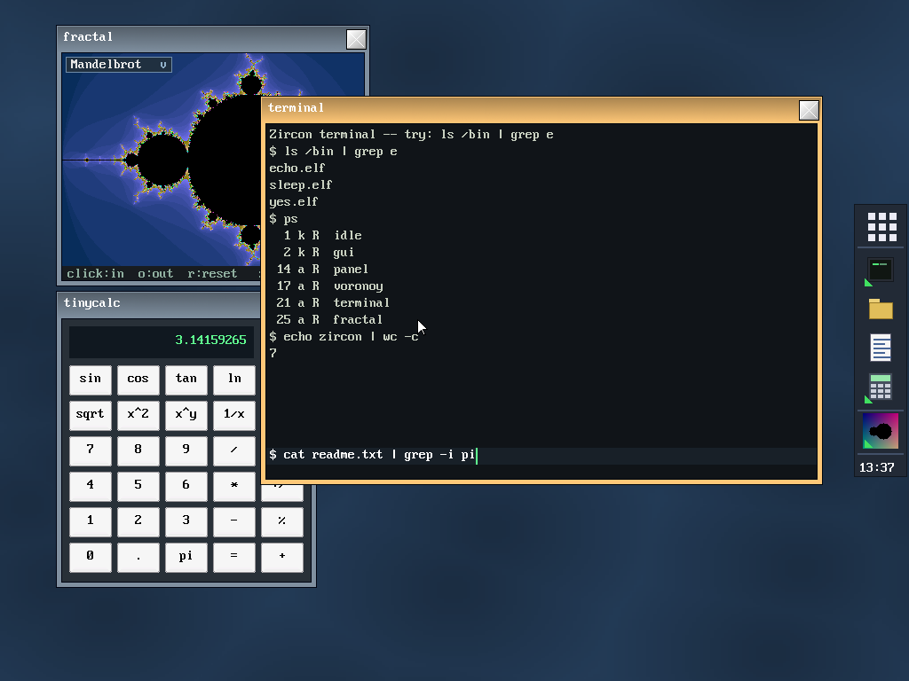

# Onyx — Project Overview

> **A note on the name.** **Onyx** is the name of the OS, its kernel, and its GUI.
> The repository folder is historically named `Zircon/` (a legacy name; unrelated to
> Google/Fuchsia's *Zircon* microkernel or to *LK*). Onyx is a homemade operating system,
> written from scratch, that builds on the **Circle** bare-metal framework as its
> hardware abstraction layer.

## 1. In one sentence

Onyx is a **small multi-process operating system** for the **Raspberry Pi 4**
(AArch64), built **on top of Circle** ([rsta2/circle](https://github.com/rsta2/circle)),
which serves as its HAL and driver stack. It loads **ELF programs from the SD
card** and runs them as **applications isolated from one another**, each in
its own page table. The whole thing is driven by the **Onyx desktop**
made up of a software compositor, a taskbar, a launcher, a terminal,
a file manager, and about thirty applications.

It **runs on real Raspberry Pi 4 hardware** (not just in emulation).


*The Onyx desktop: panel/launcher on the edge, composited windows (fractal
browser, active terminal, calculator), Voronoi wallpaper. (Simulated screenshot, rendered
from the real skins/font/icons.)*

## 2. Philosophy: "own the top, reuse the bottom"

Circle is a *single-process, single-address-space, cooperative* bare-metal framework
("your application **is** the system"). Onyx **keeps the bottom half** of Circle
(which is excellent) and **replaces its "operating system" half**:

| Layer | Decision | Detail |
|---|---|---|
| Reset → EL1, MMU activation, GIC, C++ constructors | **Keep Circle** | Our entry point is `main()`; everything below it is already done. |
| 64 KB page allocator (`palloc`/`pfree`) | **Keep** — it's our frame allocator | `CMemorySystem::Get()`. |
| GIC-400, timer, mailbox, EMMC+FatFs, USB, Ethernet, framebuffer | **Reuse** | This is the whole point of building on Circle. |
| `CScheduler`/`CTask` scheduler | **Rewrite the implementation, keep the API** | See [kernel internals](02-KERNEL-INTERNALS.md). |
| Per-process page tables, context switching, exception vectors, address spaces | **Write from scratch** | Doesn't exist in Circle. |

Practical consequence: we **link** the kernel against Circle's already-compiled
static libraries (`libcircle.a`, `libfs`, `libusb`, …) rather than copying its
sources.

## 3. Main features

- **Per-process isolation via the MMU.** Each application has its own L2/L3 page
  table (64 KB granule), tagged by **ASID**. One application cannot see another's
  memory.
- **"Option C" execution model.** Applications run in **EL1** (privileged)
  and call the kernel's functions directly (no `SVC` trap in the common
  path). The trade-off: apps are isolated **from one another**, but **not from the kernel**.
  See §5.
- **Stable fixed-address ABI (`kapi`).** The kernel publishes a **table of function
  pointers** at a fixed virtual address, mapped read-only into each
  application. Applications call the kernel through this table → **an application
  binary keeps working without recompilation** when the kernel changes
  (*append-only* contract, current ABI version: **17**).
- **Full graphical desktop.** 32-bit software compositor, window manager,
  toolkit of kernel-drawn widgets (buttons, checkboxes, sliders,
  text fields, scroll bars, icons…), windows with themeable decoration,
  wallpaper, mouse cursor.
- **Onyx shell.** Panel/launcher (panel), app list, interactive terminal
  with **pipes and redirection** (`|`, `>`, `>>`, `<`), file manager, and a
  collection of command-line tools in `/bin`.
- **Application catalog.** Text editor, spreadsheet, scientific calculator,
  drawing program, fractal browser, calendar, task manager,
  theme editor, and many games (Tetris, Snake, 2048, Minesweeper, Sokoban, Pong,
  Game of Life, SameGame).
- **USB input devices.** Keyboard and mouse (HID), with hot-swappable keyboard
  layout switching (US, UK, DE, FR, ES, IT, Dvorak).

## 4. The architecture at a glance

```
┌──────────────────────────────────────────────────────────────────┐
│  Applications (ELF EL1, isolated by ASID)                        │
│  panel · applist · terminal · filer · tinypad · games · /bin/*   │
│       │  call the kernel through kapi.h (inline wrappers)        │
├───────┼──────────────────────────────────────────────────────────┤
│       ▼   kapi ABI table  (at 14 GB, read-only in every app)     │   ← stable contract
├──────────────────────────────────────────────────────────────────┤
│  ONYX KERNEL (EL1)                                             │
│   • mm/      per-process address spaces, MMU, ASID               │
│   • sched/   cooperative scheduler (replaces Circle's)           │
│   • arch/    VBAR_EL1 exception vectors, trap frame              │
│   • proc/    ELF64 loader                                        │
│   • sys/     kapi impl., stream/stdio, debug console             │
│   • gui/     GImage (software renderer), compositor+WM, skins,   │
│              modal dialogs                                       │
├──────────────────────────────────────────────────────────────────┤
│  CIRCLE  (HAL + drivers, reused as-is)                           │
│   palloc · GIC · timer · EMMC+FatFs · USB HID · framebuffer 2D     │
├──────────────────────────────────────────────────────────────────┤
│  Raspberry Pi 4  (BCM2711, 4× Cortex-A72, ARMv8-A)                 │
└──────────────────────────────────────────────────────────────────┘
```

## 5. The "Option C" execution model

This is the most structurally defining architectural decision. After prototyping
EL0 processes + system calls (`SVC`), the project switched to **Option C**:

- Applications run in **EL1** (the same privilege level as the kernel), **each
  in its own page table** tagged by ASID.
- They **call the kernel's functions directly** via the `kapi` ABI table — no
  system trap in the normal path.
- **Isolation:** applications are isolated **from one another** (a distinct
  ASID/TTBR0 per app; an app cannot address another's pages). The **kernel is not
  protected**: an EL1 app can technically touch the kernel's memory. This is the
  accepted trade-off in exchange for the ergonomics of direct calls.
- The EL0/`SVC` machinery (vectors, system-call dispatch) **still exists but is
  inert**; it could be reused if one wanted true EL0 applications isolated from the
  kernel.

## 6. Scheduling: cooperative (on hardware)

Although the kernel was initially designed to be **preemptive** (100 Hz tick), the
port to hardware showed that **preemption from the IRQ does not work** in
Circle's model: threads run in **EL1t** (with `SP_EL0`), while the
IRQ handler runs in **EL1h** (with `SP_EL1`). A context switch from
the IRQ would swap `SP_EL1`, not the thread's stack.

→ **Scheduling is therefore cooperative.** Tasks switch when they call
`yield`, `msleep`, `present`, `wait`, etc. — exactly like Circle's original
scheduler. Graphical applications naturally yield on each frame (via
`present`/`msleep`), which gives the illusion of parallelism. Details in
[Kernel internals](02-KERNEL-INTERNALS.md).

## 7. Target hardware

- **Raspberry Pi 4** (BCM2711, 4× Cortex-A72, ARMv8-A) — primary target.
- **HDMI** output (32 bpp framebuffer, 1024×768 by default, configurable).
- **USB keyboard + mouse**.
- Optional **serial console** (GPIO14/15, 115200 8N1) for the boot log and
  exception dumps.
- The RPi 5 is deferred (I/O behind the proprietary RP1 chip via PCIe — heavier
  bring-up). Multi-core (SMP) is also deferred.

## 8. Repository structure

```
ARCHITECTURE.md   original design + build manifest (historical, partly dated)
README.md         summary (partly dated: describes the "2 demos" state)
docs/             THIS documentation (overview, internals, dev/user guides)
kernel/           the Onyx kernel (see docs/02-KERNEL-INTERNALS.md)
user/             the userland: apps (*.c), runtime (crt0.S, user.ld), /bin tools
sdcard/           ready-to-flash files for an RPi 4 (firmware, config, apps, /bin)
tools/            host scripts (BMP icon generation)
circle/           upstream Circle clone (not committed; cloned separately)
```

> **Beware of legacy docs.** `ARCHITECTURE.md`, `README.md`, `kernel/README.md`, and
> `sdcard/README.md` describe **older states** of the project (EL0 processes,
> preemptive scheduling, 640×480, "two demos"). Where they contradict this
> documentation, **these documents here (`docs/`) are authoritative** for the current state.
> `ARCHITECTURE.md` §11–§12 nevertheless remains the best reference for *why* Option C
> and cooperative scheduling were chosen.

## 9. Further reading

| Document | For whom | Contents |
|---|---|---|
| **[02 — Kernel Internals](02-KERNEL-INTERNALS.md)** | anyone who wants to understand the kernel | boot, memory/MMU, scheduling, exceptions, ABI, GUI, streams |
| **[03 — Developer Guide](03-DEVELOPER-GUIDE.md)** | anyone who wants to build/compile/extend | toolchain, build, app model, extending the ABI, conventions, debugging |
| **[04 — User Guide](04-USER-GUIDE.md)** | anyone who wants to use it | SD card, desktop, terminal, files, applications, customization |

## 10. Quick genesis (milestones)

1. Taking control of `main()` on top of Circle's `sysinit`; serial console.
2. Replacement scheduler ("shadow" header for `CScheduler`).
3. `VBAR_EL1` vectors, trap frame, system-call path.
4. Per-process page tables (`CAddressSpace`), TTBR0/ASID switching.
5. ELF64 loader → process.
6. Framebuffer (`C2DGraphics`) + `GImage` rendering core (ported from the author's
   FreeBASIC `SimpleOS`).
7. Compositor + window manager; two animated demos running simultaneously.
8. **Switch to Option C** (EL1 apps + direct call) then **fixed-table ABI**.
9. Onyx desktop (panel + applist), stream/stdio subsystem, terminal + `/bin`,
   file manager.
10. Modal dialogs, themes, app-drawn wallpaper, PID management, keyboard layouts,
    theme editor (ABI v16).
