# Onyx — User Guide

This guide explains how to **prepare**, **boot** and **use** Onyx: the desktop,
the terminal, the file manager, the command-line tools, customization, and the
application catalog.

## Contents

1. [What you need](#1-what-you-need)
2. [Preparing the SD card](#2-preparing-the-sd-card)
3. [Boot configuration](#3-boot-configuration)
4. [First boot](#4-first-boot)
5. [The Onyx desktop](#5-the-onyx-desktop)
6. [Working with windows](#6-working-with-windows)
7. [The terminal and the shell](#7-the-terminal-and-the-shell)
8. [The `/bin` tools](#8-the-bin-tools)
9. [The file manager](#9-the-file-manager)
10. [Keyboard and layouts](#10-keyboard-and-layouts)
11. [Customizing the appearance](#11-customizing-the-appearance)
12. [Application catalog](#12-application-catalog)
13. [Troubleshooting](#13-troubleshooting)

---

## 1. What you need

- A **Raspberry Pi 4**.
- A **microSD card** formatted as **FAT32**.
- An **HDMI display** (micro-HDMI on the Pi 4 side).
- A **USB keyboard** and a **USB mouse** (standard HID).
- *(Optional)* a **serial adapter** on GPIO14 (TXD) / GPIO15 (RXD), **115200 8N1**,
  3.3 V, to view the boot log and error messages.

## 2. Preparing the SD card

Copy **all the contents** of the [`sdcard/`](../sdcard/) folder to the **root** of a
FAT32 card, then insert it into the Pi 4 and power on.

Card contents:

| Item | Role |
|---|---|
| `start4.elf`, `fixup4.dat`, `bcm2711-rpi-4-b.dtb`, `armstub8-rpi4.bin` | GPU firmware + device tree + Pi 4 ARM stub |
| `config.txt`, `cmdline.txt` | boot configuration (see §3) |
| `kernel8-rpi4.img` | **the Onyx kernel** |
| `apps/<name>.app/main.elf` | the **applications** (one per `.app` folder) |
| `apps/autostart.txt` | apps launched automatically at boot |
| `apps/quicklaunch.txt` | apps pinned to the panel |
| `bin/<tool>.elf` | the terminal **command-line tools** |
| `skins/theme.txt` | window theme colors |
| `skins/` (wings.bmp, cursor…) | graphic skin |

To regenerate the contents from sources: `cd kernel && make stage` (see the
[developer guide](03-DEVELOPER-GUIDE.md)).

## 3. Boot configuration

### `config.txt`

Selects 64-bit mode and the kernel image for the Pi 4:

```
arm_64bit=1
kernel_address=0x80000
initial_turbo=0
enable_uart=1          # reliable serial console + removes the rainbow splash
disable_splash=1
[pi4]
armstub=armstub8-rpi4.bin
kernel=kernel8-rpi4.img
max_framebuffers=2
```

### `cmdline.txt`

Parameters read at boot:

```
width=1024 height=768 keymap=FR
```

- **`width` / `height`**: framebuffer resolution (default 1024×768).
- **`keymap`**: keyboard layout at boot — `US`, `UK`, `DE`, `FR`, `ES`, `IT`, `DV`
  (Dvorak). Can be changed later on the fly (see §10).

### `system.ini`

General settings read at boot (`SD:system.ini`):

```
verbose=0          # 1 = log app start/stop/kill to the kernel log (see kmsg)
timezone=120       # minutes offset from UTC (60 = CET, 120 = CEST summer time)
ntp=pool.ntp.org   # time server to sync against once the WLAN link is up
```

### Wi-Fi (WLAN)

Onyx connects over the Pi's on-board Wi-Fi. Two files must be on the SD card:

- **`SD:/firmware/`** — the BCM/Cypress WLAN firmware. For the Pi 4 (CYW43455):
  `brcmfmac43455-sdio.bin`, `.txt` and `.clm_blob` (fetch them with
  `circle/addon/wlan/firmware/Makefile`, or copy them from a Raspberry Pi OS install).
- **`SD:/wpa_supplicant.conf`** — your network credentials (⚠️ stored in **clear
  text** — keep it on the card, do not publish it):

  ```
  #country=BE
  network={
      ssid="YourNetwork"
      psk="YourPassword"
      proto=WPA2
      key_mgmt=WPA-PSK
  }
  ```

The link comes up a few seconds after boot (watch the log, or run `net`). It is fully
optional: if the firmware/credentials are missing, the desktop still works — only the
networked apps stay offline.

## 4. First boot

On power-on:

1. The firmware loads `kernel8-rpi4.img`.
2. The kernel initializes the display, the SD card and USB, then briefly shows a boot
   log.
3. The apps in `apps/autostart.txt` launch. By default:
   - **`voronoy`** paints the **wallpaper** (Voronoi pattern) and then exits;
   - **`panel`** starts the **desktop** (the bar/launcher).

You then get a desktop with a wallpaper and a **panel** (on the right edge with the
shipped configuration).


*The desktop at startup: Voronoi wallpaper, panel on the right edge, and a few windows
(fractal explorer, terminal, calculator).*

## 5. The Onyx desktop

The "Onyx" desktop is made of **two cooperating apps**: the **panel** (`panel`)
and the **app list** (`applist`).

### The panel (`panel`)

A **borderless** bar, pinned to an edge of the screen (**right** with the shipped
configuration; configurable via `SD:apps/panel.app/config.ini`, key `position`: 1=left,
2=top, 3=right, 4=bottom). It re-centers itself on its edge. It contains, in order:

- **The "apps" button** (9-square glyph): opens/closes the app list.
- **The quicklaunch**: the pinned icons listed in `SD:apps/quicklaunch.txt`
  (by default: `terminal`, `filer`, `tinypad`, `tinycalc`). A click **launches** the app (or
  **brings it to the foreground** if it is already open).
- **The taskbar**: the icons of the open apps (not pinned). A click **brings** the
  window to the foreground. An open app carries a small **badge** (triangle).
- **The clock**: updated every minute.

### The app list (`applist`)

Clicking the "apps" button opens a **scrolling grid** of **all** the installed
applications (any `SD:apps/<name>.app/` folder). Click an icon to **launch** the app;
the list then closes. Use the scrollbar if the grid overflows.

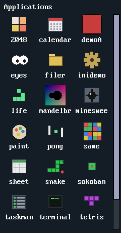
*The app list (scrolling grid, opened from the panel's "apps" button).*

### Launching, closing, switching

- **Launch**: via the quicklaunch, the applist, the terminal (`run <name>`) or the file
  manager.
- **Close**: the **×** box on the title bar (normal windows), or via the task manager
  (`taskman`) / `kill`.
- **Toggle**: the "apps" button and certain icons use a toggle mechanism (a second
  click closes the launched app).

## 6. Working with windows

- **Move**: drag the **title bar**.
- **Close**: click the **×** box at the top right.
- **Foreground / focus**: click inside a window — it comes to the top and becomes
  *active* (chrome tinted differently). Inactive ones have a more muted tint.
- **Borderless** windows (panel, app list, certain gadgets) cannot be moved or closed
  with the mouse: they are managed by the desktop or close themselves.
- **Mouse**: left-click, right-click (depending on the app — e.g. flag in Minesweeper,
  eraser in Paint) and **drag** (paint, move, drag a slider).

## 7. The terminal and the shell

Launch **`terminal`** (pinned to the panel by default). It is a console where you type
commands, executed by **programs in `SD:/bin/`**.

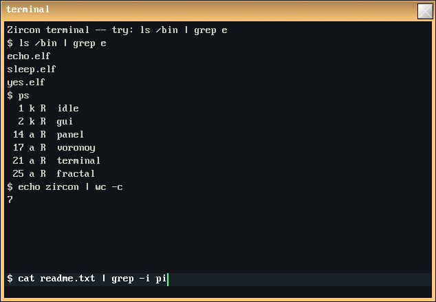
*The terminal: a pipe (`ls /bin | grep e`), `ps`, and `echo zircon | wc -c`.*

### The prompt and the current working directory

- The prompt shows the **current working directory** followed by `$` (e.g. `SD:/ $`). The
  terminal has a **current working directory (cwd)**; **relative** paths given to commands
  are resolved against it.
- Type a command then press **Enter**. **Backspace** deletes the last character;
  **Page Up/Down** scroll through the output history (scrollback, 100 lines).

### Built-in commands (builtins)

Three commands are executed by the terminal **itself** (they change its own state),
not by a program in `/bin`:

| Command | Effect |
|---|---|
| `cd [path]` | changes the current working directory (no argument: `SD:/`). The cwd is **inherited** by commands launched afterwards. |
| `pwd` | prints the current working directory. |
| `clear` | clears the screen (empties the scrollback). |

### Launching a program

Any other command `xxx` is resolved to **`SD:/bin/xxx.elf`** and executed as a
process; its **arguments**, if any, follow the name (`grep pattern`, `cp a b`). A command
that cannot be found prints `xxx: command not found`. To launch a **graphical application**
from the terminal, use `run <name>` (see §8).

### Pipes and redirections

The terminal composes commands in the Unix style:

| Syntax | Effect |
|---|---|
| `a \| b \| c` | **pipe**: the `stdout` of each stage feeds the `stdin` of the next (up to 6 stages). |
| `cmd > file` | redirects the `stdout` of the **last** stage to `file` (created / **overwritten**). |
| `cmd >> file` | same, but **appends** to the end of `file`. |
| `cmd < file` | the input (`stdin`) of the **first** stage comes from `file`. |

**Path resolution.** Redirection files are resolved by the kernel **against the
current working directory**: a relative path (`notes.txt`) targets `<cwd>/notes.txt`, an
absolute path (`SD:/notes.txt`) is taken as-is.

**Default input and output.** Without `<`, the **first** stage reads what you **type**:
each line confirmed with Enter is sent to its `stdin`, and **`Ctrl-D`** signals end of
input (EOF). Without `>`, the **last** stage displays its output in the scrollback.

Examples (with the cwd being `SD:/` here):

```sh
pwd                     # prints: SD:/
cd apps                 # changes the current working directory (-> SD:/apps)
ls                      # list the current working directory
ls /bin | grep e        # keep only the tools whose name contains "e"
cat SD:/notes.txt       # display a file
echo bonjour > a.txt    # write "bonjour" to <cwd>/a.txt
echo encore  >> a.txt   # append a line to a.txt
cat a.txt | wc          # count lines / words / bytes
grep pi < a.txt         # read a.txt, print only the lines containing "pi"
ps                      # list the processes
run mandelbrot          # launch a graphical application
```

**Under the hood.** The terminal splits the line on `|`, creates a memory pipe (`pipe`)
between each stage — and a file stream for `<`/`>` —, then launches (`spawn`) each
`SD:/bin/<cmd>.elf` with its (`stdin`, `stdout`) pair. The stages run **concurrently**
(cooperatively); the terminal continuously drains the final output pipe (non-blocking
read) and displays it, then waits for each process to finish. The details of streams and
the process model are in
[Kernel internals §9](02-KERNEL-INTERNALS.md#9-stream--stdio-subsystem).

## 8. The `/bin` tools

Command-line programs shipped in `SD:/bin/`, executed by the terminal and
**composable** via pipes (§7). The **relative** paths they receive are resolved against
the terminal's **current working directory**.

**Files and directories**

| Tool | Usage | Description |
|---|---|---|
| `ls` | `ls [path]` | Lists a directory (default: the **current working directory**). One entry per line; folders get a trailing `/`. |
| `cat` | `cat [file…]` | Prints the file(s) to `stdout`; **with no argument**, copies `stdin`→`stdout` (useful at the end of a pipe). |
| `cp` | `cp <src> <dst>` | Copies a file (by stream: any size). |
| `mv` | `mv <src> <dst>` | Renames / moves a file or folder (same volume). |
| `rm` | `rm <path…>` | Deletes files (or **empty** folders); accepts multiple paths. |
| `mkdir` | `mkdir <path…>` | Creates one or more directories. |
| `touch` | `touch <path…>` | Creates **empty** files if they do not exist (no timestamp). |

**Text and streams**

| Tool | Usage | Description |
|---|---|---|
| `echo` | `echo <text>` | Writes its arguments followed by a newline. |
| `grep` | `grep <pattern>` | Reads `stdin`, prints only the lines containing `<pattern>` (substring, **case-sensitive**; only the first word is used as the pattern). |
| `wc` | `wc` | Counts and prints "lines words bytes" of `stdin`. |
| `page` | `page` | Copies `stdin`→`stdout` (the actual paging is the terminal's scrollback via Page Up/Down); handy as the end of a pipe. |

**Processes, launching, keyboard**

| Tool | Usage | Description |
|---|---|---|
| `ps` | `ps` | Lists the processes in columns `PID  K  S  NAME` — `K`: `a` (app) / `k` (kernel); `S`: `R` (ready), `S` (sleeping), `B` (blocked), `N` (new). |
| `kill` | `kill <pid> [--force\|-f]` | Terminates a process by **PID** (seen with `ps`). By default: **clean** shutdown (the app terminates itself); `--force`/`-f`: **immediate** stop. Kernel tasks and the terminal itself are protected. |
| `run` | `run <app\|path> [args]` | Launches an **application**: `run mandelbrot` = `SD:apps/mandelbrot.app/main.elf`; a name containing `/` is taken as an explicit **ELF path**; the following arguments are passed as `argv` (e.g. `run tinypad SD:/notes.txt`). |
| `keyb` | `keyb [XX]` | With no argument: shows the current layout + the list. `keyb FR`: switches to the layout (US, UK, DE, FR, ES, IT, DV). |

**Networking and logs**

| Tool | Usage | Description |
|---|---|---|
| `net` | `net` | Shows the WLAN link status and the IPv4 address (or "link down" if Wi-Fi has not associated — check the firmware and `wpa_supplicant.conf`). |
| `kmsg` | `kmsg` | Streams the kernel log live (boot messages, app lifecycle when `verbose` is on, network events). **Ctrl-C** to quit. |
| `verbose` | `verbose [on\|off]` | Shows or toggles the kernel's verbose logging (app start/stop/kill); persists the choice to `SD:system.ini`. |

## 9. The file manager

Launch **`filer`** (pinned by default). It browses the SD card.

- **Navigate**: **up/down** arrow keys to select, **Enter** or **Space** to enter a
  folder, **`..`** or **Backspace** to go up. **Page Up/Down** scroll.
- **Open**: **double-click** (or **Enter**) on an entry.
  - Text files (`.txt`, `.ini`, `.md`, `.log`, `.cfg`, `.conf`, `.csv`, `.c`, `.h`,
    `.sh`) → opened in **`tinypad`**.
  - `.elf` files → **executed**.
- **Operations** (shortcuts shown at the top):
  - **`d`**: delete the selection (with confirmation).
  - **`r`**: rename (pre-filled with the current name).
  - **`n`**: new folder (type the name then Enter).

Folders are shown in brackets and in blue; files show their size on the right.

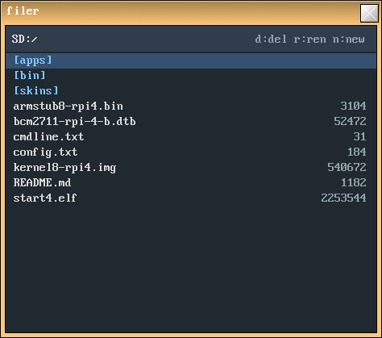
*The file manager: folders in blue, files with their size, `d`/`r`/`n` shortcuts at the
top.*

## 10. Keyboard and layouts

The layout at boot comes from `keymap=` in `cmdline.txt`. To change it **on the fly**:

- **At the command line**: `keyb FR` (or `US`, `UK`, `DE`, `ES`, `IT`, `DV`). `keyb` alone
  shows the current layout and the list.
- **Graphically**: the **theme editor** (`theme`) offers a dropdown of layouts, applied
  live.

## 11. Customizing the appearance

### The theme editor (`theme`)

The **`theme`** app lets you change **live**:

- the **active chrome tint** (foreground window),
- the **inactive chrome tint** (background windows),
- the **title text color**,
- the **wallpaper color**,
- the **keyboard layout**.

Click a color swatch to open the picker, choose the layout from the dropdown, then
**Apply** (applies and **persists** by writing `SD:skins/theme.txt` + the `voronoy` config,
and repaints the wallpaper) or **Discard** (cancels).

### Manual theme editing

`SD:skins/theme.txt` (`0xRRGGBB` colors, re-read at boot):

```
active   = 0xFFC878    # active window chrome (border + title)
inactive = 0x8090A0    # background windows
text     = 0xFFFFFF    # title text color
```

The window skin (`wings.bmp`) is grayscale; these tints are **multiplied** into it.

### Startup and pinned apps

- **`SD:apps/autostart.txt`**: one app per line, launched at boot (folder name without
  `.app`). By default `voronoy` then `panel`.
- **`SD:apps/quicklaunch.txt`**: the apps pinned to the panel (top→bottom).

### Wallpaper

At boot, **`voronoy`** draws a Voronoi pattern in the shared background buffer. Its
color/density are set in `SD:apps/voronoy.app/config.ini` (and via the theme editor).
The wallpaper persists after `voronoy` exits.

## 12. Application catalog

> Tip: most games restart with **`r`**.

### Gallery

A few applications (simulated screenshots, rendered from the real skins/font/icons by
`tools/screenshot/render.py`):

| | | |
|:---:|:---:|:---:|
| 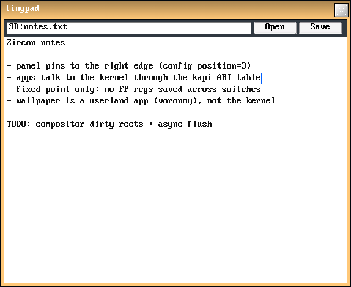 | 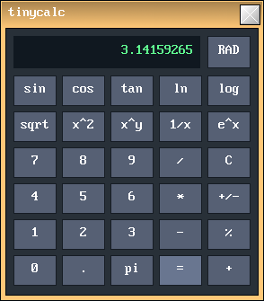 | 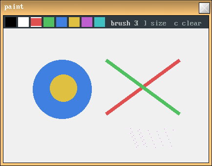 |
| *tinypad — text editor* | *tinycalc — calculator* | *paint — drawing* |
| 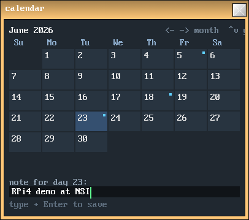 | 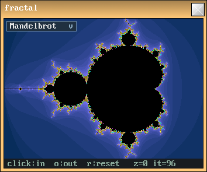 | 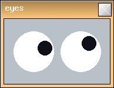 |
| *calendar — calendar + notes* | *mandelbrot — fractal explorer* | *eyes — gadget* |
| 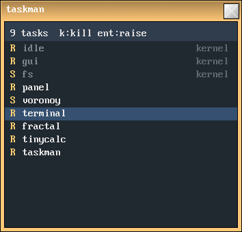 | 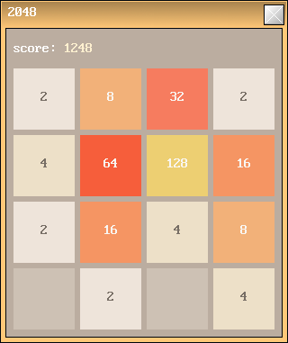 | 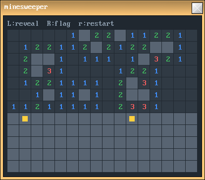 |
| *taskman — task manager* | *2048 — tile game* | *minesweeper — minesweeper* |
| | 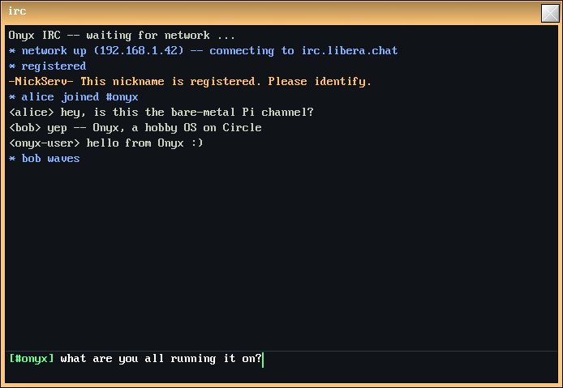 | |
| | *irc — IRC client* | |

### Productivity and tools

| App | Description and controls |
|---|---|
| **tinypad** | Text editor. Click the area to edit; arrows/Home/End/Page to navigate; **Open**/**Save** open file dialogs (loads/saves the whole file). |
| **tinycalc** | Scientific calculator (fixed-point). Buttons + keyboard (`+ - * / ( ) ^ =`), square root, trigonometric/exp/log functions. |
| **sheet** | Mini spreadsheet 8×16. Click a cell, type a value or a **formula** (`=A1+B2*2`, refs `A1`…`H16`, `+ - * / ( )`); Enter/arrows confirm and move. |
| **paint** | Drawing. Palette of 8 colors at the top; **drag** to paint, **right-click-drag** to erase; `[`/`]` brush size; `c` clears; `s` saves `SD:/paint.bmp`. |
| **calendar** | Calendar + notes. Left/right arrows = month, up/down = year; click a day, type a note, Enter to save (`agenda.txt` in the app's folder). |
| **filer** | File manager (see §9). |
| **terminal** | Terminal/shell (see §7). |
| **taskman** | Task manager. Arrows to select; Enter brings the window to the foreground; `k`/Delete kills the app (except kernel tasks); `r` refreshes. |
| **theme** | Theme editor (see §11). |
| **eyes** | Gadget: two eyes whose pupils follow the mouse. |
| **mandelbrot** | Fractal explorer (Mandelbrot, Julia, Burning Ship, Tricorn via the dropdown). **Click** = zoom in (re-centers); `o` = zoom out; `r` = reset. |
| **inidemo** | Demonstration of the `.ini` reader (displays values from `config.ini`). |
| **irc** | IRC client over Wi-Fi. Connects to the server/channel from `config.ini`, shows the conversation, type to chat. Commands: `/join #chan`, `/msg nick text`, `/nick name`, `/me action`, `/raw …`, `/quit`. Needs the network up (see §3). |
| **voronoy** | Wallpaper generator (launched at boot; no window). |

### Games

| Game | Goal and controls |
|---|---|
| **tetris** | Stack the pieces. Arrows: left/right/rotate/drop; **Space**: instant drop; `r`: restart. |
| **snake** | Eat to grow. Arrows: steer (no U-turn); `r`: restart. |
| **2048** | Merge the tiles. Arrows: slide the whole board; `r`: restart. |
| **minesweeper** | Minesweeper. **Left-click**: reveal; **right-click**: flag; `r`: restart. |
| **sokoban** | Push each box onto a target. Arrows: move/push; `r`: restart the level; `n`: next level. (levels in `levels.txt`) |
| **pong** | Two players. Left: `W`/`S`; right: up/down arrows; first to 9; `r`: reset. |
| **life** | Game of Life. **Click/drag**: (de)populate cells; **Space**: run/pause; `s`: one step; `c`: clear; `r`: random. |
| **same** | SameGame. **Click** a group of ≥2 same colors to destroy it (collapse); `r`: new board. |

### Demos (technical examples)

| Demo | Shows |
|---|---|
| **demoA** | Bouncing box (direct framebuffer access + file reading). |
| **demoB** | Animated color field (multitasking). |
| **demoC** | Fire effect; "Color" button to cycle the palette. |
| **demoD** | Widget gallery (label, textbox, checkbox, button, slider, progress bar). |
| **demoE** | Multi-line textarea + scrolling view with scrollbars. |
| **demoF** | Small borderless launcher (buttons A–E that launch the other demos). |

## 13. Troubleshooting

- **Nothing on screen / it freezes at boot.** Check that **all** the files from `sdcard/`
  are at the root of a **FAT32** card, that `config.txt` correctly targets `[pi4]` and that
  `kernel8-rpi4.img` is present. Connect the **serial** (115200) to read the log.
- **Black screen after launching an app, with green text.** The app exited (or
  faulted): the **debug console** took over and shows the log. Note the message; in case of
  a fault, the `ELR` address helps locate the problem
  (cf. [developer guide](03-DEVELOPER-GUIDE.md#12-débogage-sur-matériel)).
- **Keyboard in the wrong layout.** Set `keymap=` in `cmdline.txt`, or use `keyb XX` /
  the theme editor on the fly.
- **Wrong resolution.** Adjust `width=`/`height=` in `cmdline.txt`.
- **An app stops responding.** Since scheduling is **cooperative**, an app that never
  yields can freeze the system. If possible, kill it via `taskman` or `kill`; otherwise,
  restart.
- **No mouse/keyboard.** Check that they are standard **USB HID** devices and that they
  are plugged in at startup (hot-plug is handled, but the initial connection is the most
  reliable).
