# Onyx — User Guide

This guide explains how to **prepare**, **boot** and **use** Onyx: the desktop,
the terminal, the file manager, the command-line tools, customization, and the
application catalog.

## Contents

1. [What you need](#1-what-you-need)
2. [Preparing the SD card](#2-preparing-the-sd-card)
3. [Boot configuration](#3-boot-configuration)
4. [First boot](#4-first-boot)
5. [The Onyx desktop](#5-the-onyx-desktop)
6. [Working with windows](#6-working-with-windows)
7. [The terminal and the shell](#7-the-terminal-and-the-shell)
8. [The `/bin` tools](#8-the-bin-tools)
9. [The file manager](#9-the-file-manager)
10. [Keyboard and layouts](#10-keyboard-and-layouts)
11. [Customizing the appearance](#11-customizing-the-appearance)
12. [Application catalog](#12-application-catalog)
13. [Programming in BASIC](#13-programming-in-basic)
14. [Troubleshooting](#14-troubleshooting)

---

## 1. What you need

- A **Raspberry Pi 4**.
- A **microSD card** formatted as **FAT32**.
- An **HDMI display** (micro-HDMI on the Pi 4 side).
- A **USB keyboard** and a **USB mouse** (standard HID).
- *(Optional)* a **serial adapter** on GPIO14 (TXD) / GPIO15 (RXD), **115200 8N1**,
  3.3 V, to view the boot log and error messages.

## 2. Preparing the SD card

Copy **all the contents** of the [`sdcard/`](../sdcard/) folder to the **root** of a
FAT32 card, then insert it into the Pi 4 and power on.

Card contents:

| Item | Role |
|---|---|
| `start4.elf`, `fixup4.dat`, `bcm2711-rpi-4-b.dtb`, `bcm2711-rpi-400.dtb`, `armstub8-rpi4.bin` | GPU firmware + device trees (Pi 4 B, Pi 400) + Pi 4 ARM stub |
| `firmware/brcmfmac4345{5,6}-sdio.*` | Wi-Fi chip firmware: `43455` = Pi 4 B, `43456` = **Pi 400** (the Pi 400 has a different Wi-Fi chip, CYW43456) |
| `config.txt`, `cmdline.txt` | boot configuration (see §3) |
| `kernel8-rpi4.img` | **the Onyx kernel** |
| `apps/<name>.app/main` | the **applications** (one per `.app` folder) |
| `etc/autostart` | commands run automatically at boot (read by `init`) |
| `etc/quicklaunch.txt` | apps pinned to the panel |
| `bin/<tool>` | the terminal **command-line tools** |
| `skins/theme.txt` | window theme colors |
| `skins/` (wings.bmp, button.bmp, menubar.bmp, cursor…) | graphic skin (`menubar.bmp`: the system menu bar, 2 states of 16×32 — bar / open title, 9-slice; a 3-colour bevel is drawn if absent) |

To regenerate the contents from sources: `cd kernel && make stage` (see the
[developer guide](03-DEVELOPER-GUIDE.md)).

## 3. Boot configuration

### `config.txt`

Selects 64-bit mode and the kernel image for the Pi 4:

```
arm_64bit=1
kernel_address=0x80000
initial_turbo=0
enable_uart=1          # reliable serial console + removes the rainbow splash
disable_splash=1
[pi4]
armstub=armstub8-rpi4.bin
kernel=kernel8-rpi4.img
max_framebuffers=2
```

### `cmdline.txt`

Parameters read at boot:

```
width=1024 height=768 init=SD:/bin/init heartbeat=5
```

- **`width` / `height`**: framebuffer resolution (default 1024×768).
- **`init`**: absolute path of the init program the kernel launches at boot
  (default `SD:bin/init`). init reads `SD:/etc/autostart` and starts the rest
  of the userland, so pointing `init=` at another ELF (e.g. a recovery shell)
  swaps the whole launcher without rebuilding the kernel.
- **`heartbeat`**: period in seconds of the kernel's GUI **heartbeat** line in the
  kernel log (default `5`; `0` = off). Read it with `kmsg` — e.g. remotely over `telnetd`.
  It shows uptime, frames per second, mouse/key events, tasks by state and every window
  with its queued (`q`) / dropped (`d`) events. The same GUI watchdog always warns when the
  compositor stops producing frames (and lists every task's state) and when an app stops
  pumping its window's events (a frozen app).
- **`watchdog`**: `watchdog=0` does not start the GUI watchdog at all (A/B testing).
- **`slice`**: the app time slice, in 10 ms ticks (default `2` = 20 ms).
- **`hogsched`**: `hogsched=0` turns off the CPU-hog detection (apps preempted twice in a
  row lose priority — see `docs/02`); the scheduler is then plain round-robin
  (A/B testing).

**Without a screen**, the green **ACT LED** shows the state: slow blink (1 s) = kernel
running, network not up yet; fast blink (0.2 s) = network up (`telnetd` reachable);
**SOS** (· · · — — — · · ·) = kernel panic (an exception; with a screen, the red panic page
shows EC/ELR/FAR); LED frozen on or off = the kernel hangs. `config.txt` sets `hdmi_force_hotplug=1` so a
headless Pi still gets a framebuffer (without it, Onyx would start neither the GUI nor
the userland, `telnetd` included).

### `system.ini`

General settings read at boot (`SD:system.ini`):

```
verbose=0          # 1 = log app start/stop/kill to the kernel log (see kmsg)
timezone=120       # minutes offset from UTC (60 = CET, 120 = CEST summer time)
ntp=pool.ntp.org   # time server to sync against once the WLAN link is up
```

### Wi-Fi (WLAN)

Onyx connects over the Pi's on-board Wi-Fi. Two files must be on the SD card:

- **`SD:/firmware/`** — the BCM/Cypress WLAN firmware. For the Pi 4 (CYW43455):
  `brcmfmac43455-sdio.bin`, `.txt` and `.clm_blob` (fetch them with
  `circle/addon/wlan/firmware/Makefile`, or copy them from a Raspberry Pi OS install).
- **`SD:/etc/wpa_supplicant.conf`** — your network credentials (⚠️ stored in **clear
  text** — keep it on the card, do not publish it):

  ```
  #country=BE
  network={
      ssid="YourNetwork"
      psk="YourPassword"
      proto=WPA2
      key_mgmt=WPA-PSK
  }
  ```

The link comes up a few seconds after boot (watch the log, or run `net`). It is fully
optional: if the firmware/credentials are missing, the desktop still works — only the
networked apps stay offline.

You don't have to edit the file by hand: the **Wi-Fi Settings** app (`wpaconf`, see §12)
edits SSID / password / country / proto / key&nbsp;mgmt in a small form and rewrites
`wpa_supplicant.conf` for you. The kernel only reads it at boot, so use its **Save &
Reboot** button to apply the new credentials.

## 4. First boot

On power-on:

1. The firmware loads `kernel8-rpi4.img`.
2. The kernel initializes the display, the SD card and USB, then briefly shows a boot
   log.
3. The kernel launches the **init program** (`SD:bin/init` by default, or whatever
   `init=` in `cmdline.txt` points at), which runs each line of `SD:/etc/autostart` as
   a shell command. By default:
   - **`run voronoy`** paints the **wallpaper** (Voronoi pattern) and then exits;
   - **`run panel`** starts the **desktop** (the bar/launcher);
   - **`keyb FR`** sets the keyboard layout.

You then get a desktop with a wallpaper and a **panel** (on the right edge with the
shipped configuration).

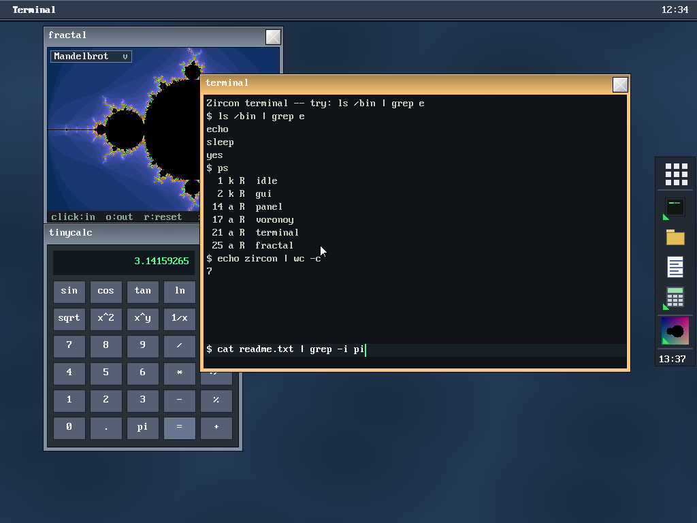
*The desktop at startup: Voronoi wallpaper, panel on the right edge, and a few windows
(fractal explorer, terminal, calculator).*

## 5. The Onyx desktop

The "Onyx" desktop is made of **two cooperating apps**: the **panel** (`panel`)
and the **app list** (`applist`).

### The menu bar (`menubar`)

A system **menu bar** runs across the top of the screen (started by `autostart`), in the
style of macOS: it shows the **active application's name** (in bold) and **its menus**,
and the clock on the right, with the **Wi-Fi state** just left of it: the usual arcs when
the Pi is connected, a grey barred circle when it is not (checked about once a second, so
a lost or restored connection shows up by itself). The active application is the frontmost decorated window;
clicking the panel or the desktop does not change it.

- **Click a menu title** to open its drop-down; slide to another title to switch; click an
  item to run it (or press on a title and release on an item). Click the title again or
  anywhere else to close the menu.
- The first menu, **Onyx**, is always there: Terminal, File Viewer, Files, Task Manager,
  All Apps…, and **Shut Down…** (a dialog: **Restart**, **Shut Down** — the SD card is
  unmounted, then "It is now safe to turn off the Raspberry Pi" — or **Cancel**).
- The next menu (the app's name) always has **Quit** (**Ctrl-Q**), like the close box.
- Items show their **keyboard shortcut** on the right (e.g. `^O` = Ctrl-O); the shortcuts
  work whether the menu is open or not.
- **Clipboard**: one system clipboard shared by all apps — Edit ▸ Cut/Copy/Paste in Writer
  (on the selection), tinypad (Copy All / Paste) and the File Viewer (files and folders).
- **Notifications**: apps (and the system, e.g. "Network — Connected. IP address …") show
  a bubble in the top-right corner, below the bar; it fades in, stays about 4 s and fades
  out; a click dismisses it; several notifications are shown one after the other
  (`notifyd`, started by `autostart`).
- Windows open and are dragged **below** the bar, never under it.

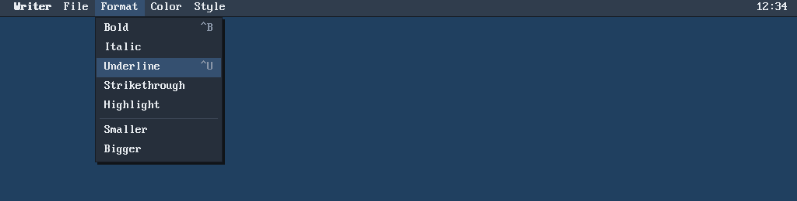
*The menu bar with Writer active and its Format menu open.*

Applications with menus: **tinypad** (File), **Writer** (File, Format, Color, Style),
**paint** (File, Brush, Color) and the **File Viewer** (File, Edit) — see §12.

### The panel (`panel`)

A **borderless** bar, pinned to an edge of the screen (**right** with the shipped
configuration; configurable via `SD:apps/panel.app/config.ini`, key `position`: 1=left,
2=top, 3=right, 4=bottom). It re-centers itself on its edge. It contains, in order:

- **The "apps" button** (9-square glyph): opens/closes the app list.
- **The quicklaunch**: the pinned icons listed in `SD:/etc/quicklaunch.txt`
  (by default: `terminal`, `fileviewer`, `tinypad`, `tinycalc`). A click **launches** the app (or
  **brings it to the foreground** if it is already open).
- **The taskbar**: the icons of the open apps (not pinned). A click **brings** the
  window to the foreground. System components (the panel itself, the app list, the menu
  bar, the notifications) are never listed: their window is created with `WIN_FLAG_SYSTEM`. An open app carries a small **badge** (triangle).
- **The clock**: updated every minute.

### The app list (`applist`)

Clicking the "apps" button opens a **square grid** (6 columns, alphabetical) of **all**
the installed applications (any `SD:apps/<name>.app/` folder, except the shell components — those whose `app.txt`
says `category = Shell`: `panel`, `applist`, `shell`, `menubar`, `notifyd`, `shelf`, `ask`, `agenda`). It opens **right next to the panel**, beside
the "apps" button, on whichever edge the panel sits (its `config.ini` `position`), and
below the menu bar. Click an icon to **launch** the app; the list then closes. Use the
scrollbar (or the wheel) if the grid overflows.

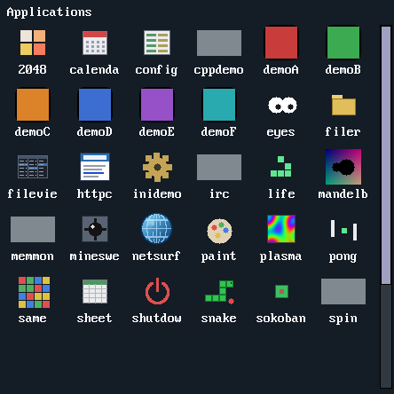
*The app list (square, 6-column grid, opened beside the panel's "apps" button).*

### The Shelf (`shelf`)

A strip along the **whole bottom of the screen** (started by `autostart`; above the panel
if the panel is at the bottom) that keeps **references** to files, folders and apps,
organised in **tabs** — the files themselves stay where they are. Other windows can cover
it; click it to bring it forward.

- **Add**: drag files, folders or apps (e.g. from the File Viewer) and drop them on the
  shelf — on the items area (current tab) or on a tab.
- **Open**: click an item — it opens in a **new instance** of its app (see *File
  associations* below; folders open in the File Viewer, apps run).
- **Drag an item** onto a File Viewer folder to **move** the file there (hold **Ctrl** to
  **copy**) — the item **stays on the shelf and follows the file** (the File Viewer reports
  every move and rename to the Shelf, so references stay up to date), onto an app window to **open it in that app** (tinypad, Writer, paint ask to
  save their current document first), or onto the **desktop** to **remove** it from the
  shelf. **Esc** cancels a drag.
- **The Trash** (right end): drop items on it to move them to the Trash (`SD:/.Trash`);
  click it to open the Trash in the File Viewer. A sheet of paper sticks out when it holds
  something.
- The shelf does **not** check its items — not at start-up (so FTP items survive a boot
  where the network or the server is not ready yet), not when they are added, not while it
  runs: an item is checked only when you use it (click or drag). If its file is gone (deleted, renamed elsewhere, server folder changed),
  a notification says so and the item leaves the shelf.
- **Tabs**: click to switch; **+** adds a tab; **double-click** a tab to rename it (type,
  **Enter** / **Esc**); the **−** button (right end of the tab strip, before the Trash)
  removes the current tab — with a confirmation window if it holds items (the files
  themselves are kept); the last tab cannot be removed. The **wheel** scrolls a long tab.
- Saved in `SD:/etc/shelf.ini` (`tab = Name`, then `item = path` lines; a remote folder ends
  with `/`).

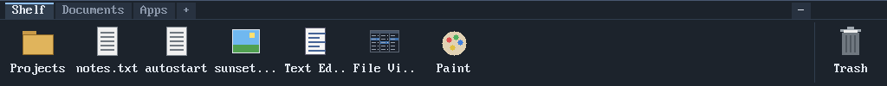
*The Shelf: tabs, a folder, a document, an image and an app, and the Trash at the right.*

### The agenda widget (`agenda`)

A small card on the desktop (started by `autostart`, under every window) listing the
**next appointments** — the notes typed in the **calendar** app (`agenda.txt`), today first
(in green), then by date. It re-reads them every few seconds, so a new note appears by
itself. **Click** an appointment to open the calendar on that day; **drag the title** to
move the card (its place is kept in `SD:/apps/agenda.app/config.ini`).

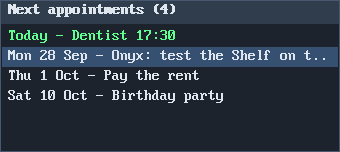
*The agenda widget: today's appointment in green, the next ones below.*

### Drag & drop and file associations

Files are dragged with the **left button**: press on an item, move a few pixels — a label
follows the cursor. Hold **Ctrl** while dropping to **copy** instead of move (the label
shows a **+**); **Esc** cancels. Drop targets: File Viewer columns and folders, the Shelf,
the Trash, and document apps (tinypad, Writer, paint open the dropped file; dropped text
goes in at the caret).

**`SD:/etc/fileassoc.ini`** says which app opens which file type — one `extension = app`
per line (`txt = tinypad`, `png = imageview`, `doc = writer`, …): opening the file runs
`SD:apps/<app>.app/main <path>`. Used by the File Viewer (double-click) and the Shelf
(click). Folders open in the File Viewer, `.app` bundles and programs run.

### Launching, closing, switching

- **Launch**: via the quicklaunch, the applist, the terminal (`run <name>`) or the file
  manager.
- **Close**: the **×** box on the title bar (normal windows), or via the task manager
  (`taskman`) / `kill`.
- **Toggle**: the "apps" button and certain icons use a toggle mechanism (a second
  click closes the launched app).

## 6. Working with windows

- **Move**: drag the **title bar**.
- **Close**: click the **×** box at the top right.
- **Foreground / focus**: click inside a window — it comes to the top and becomes
  *active* (chrome tinted differently). Inactive ones have a more muted tint.
- **Borderless** windows (panel, app list, certain gadgets) cannot be moved or closed
  with the mouse: they are managed by the desktop or close themselves.
- **Mouse**: left-click, right-click (depending on the app — e.g. flag in Minesweeper,
  eraser in Paint) and **drag** (paint, move, drag a slider).

## 7. The terminal and the shell

Launch **`terminal`** (pinned to the panel by default). It is a console where you type
commands, executed by **programs in `SD:/bin/`**.

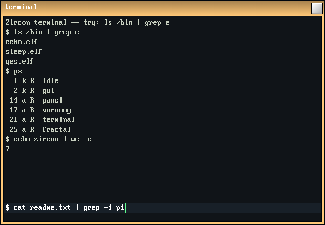
*The terminal: a pipe (`ls /bin | grep e`), `ps`, and `echo zircon | wc -c`.*

### The prompt and the current working directory

- The prompt shows the **current working directory** followed by `$` (e.g. `SD:/ $`). The
  terminal has a **current working directory (cwd)**; **relative** paths given to commands
  are resolved against it.
- Type a command then press **Enter**. **Backspace** deletes the last character;
  **Page Up/Down** scroll through the output history (scrollback, 100 lines).

### Built-in commands (builtins)

Three commands are executed by the terminal **itself** (they change its own state),
not by a program in `/bin`:

| Command | Effect |
|---|---|
| `cd [path]` | changes the current working directory (no argument: `SD:/`). The cwd is **inherited** by commands launched afterwards. |
| `pwd` | prints the current working directory. |
| `clear` | clears the screen (empties the scrollback). |

### Launching a program

Any other command `xxx` is resolved to **`SD:/bin/xxx`** and executed as a
process; its **arguments**, if any, follow the name (`grep pattern`, `cp a b`). A command
that cannot be found prints `xxx: command not found`. To launch a **graphical application**
from the terminal, use `run <name>` (see §8).

### Pipes and redirections

The terminal composes commands in the Unix style:

| Syntax | Effect |
|---|---|
| `a \| b \| c` | **pipe**: the `stdout` of each stage feeds the `stdin` of the next (up to 6 stages). |
| `cmd > file` | redirects the `stdout` of the **last** stage to `file` (created / **overwritten**). |
| `cmd >> file` | same, but **appends** to the end of `file`. |
| `cmd < file` | the input (`stdin`) of the **first** stage comes from `file`. |

**Path resolution.** Redirection files are resolved by the kernel **against the
current working directory**: a relative path (`notes.txt`) targets `<cwd>/notes.txt`, an
absolute path (`SD:/notes.txt`) is taken as-is.

**Default input and output.** Without `<`, the **first** stage reads what you **type**:
each line confirmed with Enter is sent to its `stdin`, and **`Ctrl-D`** signals end of
input (EOF). Without `>`, the **last** stage displays its output in the scrollback.

Examples (with the cwd being `SD:/` here):

```sh
pwd                     # prints: SD:/
cd apps                 # changes the current working directory (-> SD:/apps)
ls                      # list the current working directory
ls /bin | grep e        # keep only the tools whose name contains "e"
cat SD:/notes.txt       # display a file
echo bonjour > a.txt    # write "bonjour" to <cwd>/a.txt
echo encore  >> a.txt   # append a line to a.txt
cat a.txt | wc          # count lines / words / bytes
grep pi < a.txt         # read a.txt, print only the lines containing "pi"
ps                      # list the processes
run mandelbrot          # launch a graphical application
```

**Under the hood.** The terminal splits the line on `|`, creates a memory pipe (`pipe`)
between each stage — and a file stream for `<`/`>` —, then launches (`spawn`) each
`SD:/bin/<cmd>` with its (`stdin`, `stdout`) pair. The stages run **concurrently**
(cooperatively); the terminal continuously drains the final output pipe (non-blocking
read) and displays it, then waits for each process to finish. The details of streams and
the process model are in
[Kernel internals §9](02-KERNEL-INTERNALS.md#9-stream--stdio-subsystem).

## 8. The `/bin` tools

Command-line programs shipped in `SD:/bin/`, executed by the terminal and
**composable** via pipes (§7). The **relative** paths they receive are resolved against
the terminal's **current working directory**.

**Files and directories**

| Tool | Usage | Description |
|---|---|---|
| `ls` | `ls [path]` | Lists a directory (default: the **current working directory**). One entry per line; folders get a trailing `/`. |
| `cat` | `cat [file…]` | Prints the file(s) to `stdout`; **with no argument**, copies `stdin`→`stdout` (useful at the end of a pipe). |
| `cp` | `cp <src> <dst>` | Copies a file (by stream: any size). |
| `mv` | `mv <src> <dst>` | Renames / moves a file or folder (same volume). |
| `rm` | `rm <path…>` | Deletes files (or **empty** folders); accepts multiple paths. |
| `mkdir` | `mkdir <path…>` | Creates one or more directories. |
| `touch` | `touch <path…>` | Creates **empty** files if they do not exist (no timestamp). |

**Text and streams**

| Tool | Usage | Description |
|---|---|---|
| `echo` | `echo <text>` | Writes its arguments followed by a newline. |
| `grep` | `grep <pattern>` | Reads `stdin`, prints only the lines containing `<pattern>` (substring, **case-sensitive**; only the first word is used as the pattern). |
| `wc` | `wc` | Counts and prints "lines words bytes" of `stdin`. |
| `page` | `page` | Copies `stdin`→`stdout` (the actual paging is the terminal's scrollback via Page Up/Down); handy as the end of a pipe. |

**Processes, launching, keyboard**

| Tool | Usage | Description |
|---|---|---|
| `ps` | `ps` | Lists the processes in columns `PID  K  S  PAGES  MEM  NAME` — `K`: `a` (app) / `k` (kernel); `S`: `R` (ready), `S` (sleeping), `B` (blocked), `N` (new); `PAGES` = 64 KB frames owned by the app, `MEM` = that in KB. |
| `kill` | `kill <pid> [--force\|-f]` | Terminates a process by **PID** (seen with `ps`). By default: **clean** shutdown (the app terminates itself); `--force`/`-f`: **immediate** stop. Kernel tasks and the terminal itself are protected. |
| `run` | `run <app\|path> [args]` | Launches an **application**: `run mandelbrot` = `SD:apps/mandelbrot.app/main`; a name containing `/` is taken as an explicit **ELF path**; the following arguments are passed as `argv` (e.g. `run tinypad SD:/notes.txt`). |
| `keyb` | `keyb [XX]` | With no argument: shows the current layout + the list. `keyb FR`: switches to the layout (US, UK, DE, FR, BE, ES, IT, DV). |

**Networking and logs**

| Tool | Usage | Description |
|---|---|---|
| `net` | `net` | Shows the WLAN link status and the IPv4 address (or "link down" if Wi-Fi has not associated — check the firmware and `wpa_supplicant.conf`). |
| `ping` | `ping <host> [count]` | Sends ICMP echo requests (default 4, one per second, 2 s timeout) to a name or an IP and prints each round-trip time, then the loss and min / avg / max statistics. (Onyx itself also answers pings.) |
| `basic` | `basic [-d dir] <prog.bas> [args]` | The Onyx BASIC runtime (see §13): runs a program in the console or in its window; `-d` sets the current folder (default: the program's). A `.bas` path given to `run` or the shell runs through it. |
| `tone` | `tone [Hz [ms [wave]]]`, `tone scale` | Plays a note on the audio output (the 3.5 mm jack) — default 440 Hz, 500 ms, sine; wave `square`, `sine`, `triangle`, `saw`, `noise`; `scale` plays a C major scale. Tests the sound system. |
| `wifiscan` | `wifiscan` | Lists the Wi-Fi access points around (about 3 s), strongest first: signal (dBm + bars), channel, security (open / WEP / WPA / WPA2), SSID; `*` marks the network the Pi is on. |
| `nslookup` | `nslookup <name>` | Resolves a host name through the DNS server (shown on the first line) and prints its IPv4 address. |
| `netstat` | `netstat` | The network configuration (hostname, IP, mask, gateway, DNS, DHCP) and the open TCP sockets: state (LISTEN / ESTAB), local port, remote address, owning PID. |
| `ftpd` | `ftpd [homedir] [user] [password]` | The FTP server (see *File server* below); again while it runs = add a user. |
| `ftp` | `ftp [host [port]]` | Interactive FTP / FTPS client (`ftp>` prompt): `open [-s] host [port]` (asks user + password; `-s` = FTPS), `user`, `ls` / `dir`, `cd`, `cdup`, `pwd`, `get remote [local]`, `put local [remote]`, `mget` / `mput`, `delete`, `mkdir`, `rmdir`, `rename`, `size`, `lcd` / `lpwd` (the local folder), `close`, `bye`. Works through `ftpfs` (shares its connections and logins with the File Viewer). The password is echoed by the terminal. |
| `ftpfs` | `ftpfs login <host> <user> <password> [save]`, `ftpfs forget <host>` | The FTP / FTPS client behind `FTP:` / `FTPS:` paths (see *FTP / FTPS servers as folders*); starts by itself; `login` registers credentials for a host (`save` = remember them in `SD:/etc/ftpfs.ini`); `forget` removes a remembered login. |
| `whois` | `whois <domain> [server]` | Queries the WHOIS database (TCP port 43): asks `whois.iana.org`, then follows its `refer:` to the registry holding the domain — or asks the given server directly. |
| `wget` | `wget <url>` | Fetches an HTTP URL (`http://host[:port]/path`) and writes the response body to `stdout` — pipe or redirect it (e.g. `wget http://example.com/ > page.html`). Plain HTTP only (no HTTPS). |
| `httpget` | `httpget <url>` | HTTP/1.1 client demo built on the reusable `HttpClient` class (`user/http.hpp`): prints the status line, `Content-Type`, and body. Handles chunked responses. Plain HTTP only (`https://` → "not supported"). |
| `httpsget` | `httpsget <url>` | Same as `httpget` but with **TLS** (`https://`), via mbedTLS (`user/tls/`) — downloads real HTTPS pages. Opt-in build (needs the cross-built mbedTLS — see `user/tls/README.md`). **Not yet secure**: no certificate verification, software (non-HW) RNG. |
| `groq` | `groq <question…>`, `groq -j < messages.json`, `-c <config>` | Asks a large language model through the **Groq** chat API (HTTPS) and prints the answer — the engine behind **Lisa**. Reads `SD:/apps/lisa.app/config.ini` (`key` = your Groq API key, `model`, `role` = the system prompt, `temperature`, `max_tokens`). `-j`: stdin is a JSON array of `{"role","content"}` messages (a whole conversation). Non-ASCII text is converted between Latin-1 and UTF-8. |
| `telnetd` | `telnetd [port]` | **Remote text shell** (default port **23**): waits for Wi-Fi, then serves one client at a time with its own `cmd` (see §7). Started at boot by `SD:/etc/autostart`. **No password, no encryption** — trusted LAN only. See *Remote shell* below. |
| `vncd` | `vncd [port]` | **Remote desktop** (VNC, default port **5900**): see and drive the Onyx screen from any VNC viewer. Started at boot by `SD:/etc/autostart`. **No password, no encryption** — trusted LAN only. See *Remote desktop* below. |
| `notifytest` | `notifytest [-t <title>] <message>` | Sends a **notification** (bubble under the menu bar) — handy to test `notifyd` from the terminal or telnet, e.g. `notifytest -t Build "Kernel staged"`. The title defaults to "Test". |
| `kmsg` | `kmsg` | Streams the kernel log live (boot messages, app lifecycle when `verbose` is on, network events). **Ctrl-C** to quit. |
| `verbose` | `verbose [on\|off]` | Shows or toggles the kernel's verbose logging (app start/stop/kill); persists the choice to `SD:system.ini`. |
| `heaptest` | `heaptest` | Self-test of the user-space allocator (`umm.h` over `kapi_sbrk`): alloc/verify/free across size classes + realloc. Prints PASS/FAIL and how much heap it mapped. |
| `fptest` | `fptest` | Self-test of hardware floating point under the scheduler (Leibniz π in `double`, yielding mid-computation). Prints PASS/FAIL. |
| `libctest` | `libctest` | Self-test of the newlib C library on Onyx (`printf`/`malloc`/`qsort`/`fopen`+`fseek`/`sin`/`sqrt`). Prints PASS/FAIL. |
| `imgtest` | `imgtest` | Self-test of the image codecs (zlib + libpng): decodes an embedded PNG and prints its size and top-left pixel. Prints PASS/FAIL. Opt-in build (needs the cross-built codecs — see `user/img/README.md`). |
| `nsfbdemo` | `nsfbdemo` | Demo of the NetSurf framebuffer library (libnsfb) on Onyx: opens a window and draws shapes with libnsfb's plotters, then follows the cursor (a trail of dots) and drops a marker on left-click. `q` / Esc or the close box to quit. Opt-in build (needs the cross-built libnsfb — see `user/nsfb/README.md`). |

### Remote shell (`telnetd`)

`telnetd` (started by `SD:/etc/autostart`) lets you use the Onyx shell from another
computer, in a text terminal. Get the Pi's address with `net`, then connect with:

- **the dedicated client** (only needs Python, Windows or Linux/macOS):
  `python tools/onyx-telnet.py <pi-ip> [port]`;
- or any **telnet client**: `telnet <pi-ip>`, or PuTTY with *Connection type: Telnet*.

Each connection gets its own `cmd`, exactly like the terminal app: same commands,
pipes and redirections, `clear` clears the remote screen. Echo and line editing are done
by the Pi (Backspace works; no history/arrows). **Ctrl-C** is passed to the running
command, **`exit`** or **Ctrl-D** on an empty line ends the session (in
`onyx-telnet.py`, **Ctrl-]** disconnects locally). One client at a time: a second
connection waits until the first ends.

> ⚠️ Not secure: no authentication and no encryption — anyone who can reach port 23
> gets a shell. Remove the `telnetd` line from `SD:/etc/autostart` on an untrusted
> network, or run it by hand (`telnetd 2323`) when needed.

### Remote desktop (`vncd`)

`vncd` (started by `SD:/etc/autostart`) serves the Onyx screen over **VNC**, so you can
see and use the desktop from another computer — handy without a monitor. Use any VNC
viewer (TigerVNC, RealVNC, UltraVNC, TightVNC, Remmina…) and connect to `<pi-ip>`
(port 5900 / display `:0`); choose "no authentication" if the viewer asks.

- The mouse and keyboard act exactly like USB ones (clicks, drag, wheel). Keys are typed
  with **your computer's layout** (the viewer sends characters); Ctrl+letter, arrows,
  Home/End, Page Up/Down, Delete, Esc and Enter work.
- Only the parts of the screen that change are sent (64×64 tiles, zlib-compressed when the
  viewer supports it), up to ~20 updates per second.
- One viewer at a time. The picture is what the compositor shows, cursor included.

> ⚠️ Not secure: no password and no encryption. Remove the `vncd` line from
> `SD:/etc/autostart` on an untrusted network.

### File server (`ftpd`)

`ftpd [homedir] [user] [password]` starts the **FTP server** (port 21) — handy to copy
files to the card from a PC (FileZilla, WinSCP, `ftp`, a file manager's `ftp://<pi-ip>`).
Defaults: `SD:/`, user `onyx`, password `onyx`. There is **no configuration file**:

- The first `ftpd` becomes the server. Running `ftpd` **again** while it is up does not
  start a second one — it tells the running server "this user, this password, this root
  folder" and exits, so you add users on the fly (e.g. `ftpd SD:/apps dev secret`).
- A user sees only its root folder (`/` = `homedir`; `..` cannot climb above it).
- Several clients can be connected at once (each connection is served by its own process).
- Passive (PASV / EPSV) and active (PORT) modes; listing, download, upload (≤ 32 MB per
  file), resume-less append (APPE), delete, rename, create / remove folders.
- Add `ftpd SD:/ me mypassword` to `SD:/etc/autostart` to have it at every boot.

> ⚠️ Plain FTP: the password and the files travel unencrypted — keep it on a trusted network.

### FTP / FTPS servers as folders (`ftpfs`)

Remote FTP servers can be used **like folders of the card**, from every app: paths

```
FTP:[user[:password]@]host[:port]/path      plain FTP
FTPS:[user[:password]@]host[:port]/path     FTP over TLS (explicit AUTH TLS on 21, implicit on 990)
```

- In the **File Viewer**: **Go ▸ Connect to Server…** opens a form — **FTP** or **FTPS
  (TLS)**, **server** (name or IP) and **port**, **user** (empty = anonymous), **password**
  (masked), start **folder**, **Remember password** (checked by default); **Tab** moves
  between fields, **Enter** (in the password or folder field) connects. The **server** field
  is a combo box: type a new server, or click its arrow (or press **Down** / **Up**) to pick a
  remembered one — protocol, port, user, password and folder are then filled in. **Forget**
  removes the selected server's remembered login (so does connecting to it with *Remember
  password* unchecked). The login is handed to `ftpfs` (never put into the path, so the
  Shelf and the path bar never show it). Or `run fileviewer FTP:host/dir`. Then browse, preview (files ≤ 1 MB), open (double-click —
  tinypad, Image Viewer…), drag files between the card and the server (a move across them
  = copy + delete), new folder, rename, delete.
- **tinypad / Writer / paint** open and **save** `FTP:` files directly; the **Shelf** keeps them.
- **Logins**: in the path (`FTP:me:secret@host/…`), or once per host with
  `ftpfs login <host> <user> <password> [save]`; otherwise `anonymous`. A login is kept in
  memory by the running ftpfs (one per server); with **Remember password** (or `save`) it is
  also written to **`SD:/etc/ftpfs.ini`** (one line per server: host, user, password, port,
  FTPS, folder) and reloaded at every start, so FTP and FTPS folders (and the
  Shelf's remote items) work again after a reboot. `ftpfs forget <host>` removes it.
  The file can also be written by hand, one section per server:
  `[ftp.example.com]` then `user = me`, `password = secret` (plain), `port = 21`,
  `tls = 1`, `folder = /www` (ftpfs rewrites it in its own format when a login changes).
  The password in that file is only **obfuscated, not encrypted**: anyone with the card can
  recover it (the file is excluded from git).
- `ftpfs` starts by itself the first time an `FTP:` path is used. A file is downloaded
  whole when it is opened (≤ 64 MB) and uploaded whole when saved.
- FTPS encrypts the connection, but the server certificate is **not verified** yet (no CA
  bundle on the card — like `httpsget`).

## 9. The file manager

### File Viewer (column browser)

**`fileviewer`** (the File Viewer, pinned on the panel by default and in the **Onyx** menu)
is a NeXTSTEP-style **column browser**: each column lists one folder, and
selecting a folder opens its content in the next column — the whole path stays visible, so
going back is one click on an earlier column. Launch it from the app list (category
*System*), or `run fileviewer SD:/some/folder` to open a given folder.

- **Columns**: plain folders first (blue, with a ▸ arrow), then app bundles (`.app`, green,
  shown by their **friendly name** — the `name =` line of their `app.txt`, e.g. `demoB.app`
  shows as *Colour Field*; the folder name without `.app` if there is none) and files,
  sorted alphabetically by what is shown. When there are more columns than fit (4), the
  view follows the deepest one; the scrollbar below the columns scrolls back.
- **Path bar** (above the columns): click a segment (`SD:` ▸ `etc` ▸ …) to jump straight
  back to that folder.
- **Preview column**: selecting a file shows its size and type, the first lines of a text
  file, a scaled-down **image** (BMP, GIF, PNG, JPEG, PCX, WebP — with its format and
  dimensions), or — for an app bundle — its icon, its friendly name and its folder name (`demoB.app`).
- **Mouse**: click = select; **double-click** = open (a file in the app `SD:/etc/fileassoc.ini`
  associates with its extension, programs run, `.app` bundles launch); **wheel** scrolls the column under the cursor. A column longer than the window gets
  its own **vertical scrollbar** at its right edge: drag the thumb, or click the track to jump.
- **Keyboard**: **↑/↓**, Page Up/Down, Home/End move in the active column; **→** enters the
  selected folder, **←** or **Backspace** goes back; **Enter** opens; typing a **letter**
  jumps to the next name (as shown) starting with it.
- **Trash**: **Del** (File ▸ Move to Trash) moves the selection to the Trash
  (`SD:/.Trash`, hidden) — nothing is lost. **Go ▸ Trash** shows it (the path bar reads
  "Trash"): select an item, **Go ▸ Restore from Trash** puts it back where it was (its
  folder is recreated if needed; a clash gets a "(restored)" name), **Del** there deletes it
  for good; **Go ▸ Empty Trash…** deletes everything; **Go ▸ SD Card** returns to the card.
  **File ▸ Delete Permanently…** skips the Trash (with confirmation). Names starting with
  `.` are hidden. (`rm` in the terminal still deletes for real.)
- **Operations** (menu bar: **File** and **Edit** menus, on the active column's selection): **New Folder** (Ctrl-N),
  **Rename** (Ctrl-R), **Copy** (Ctrl-C), **Cut** (Ctrl-X), **Paste** (Ctrl-V — into the active
  column's folder; copies of folders are recursive, a clash gets a "copy" name), **Refresh**
  (Ctrl-L). The status bar shows the item count and the selection.
- **Drag & drop**: drag an item (press, move a few pixels) onto a folder — a folder row, or
  anywhere in a column for that column's folder (the target is outlined) — to **move** it
  there; hold **Ctrl** to **copy**. Works between File Viewer windows, from/to the Shelf,
  and in the Trash view (a drop there moves to the Trash). Dropping a file on an app window
  (tinypad, Writer, paint) opens it there.

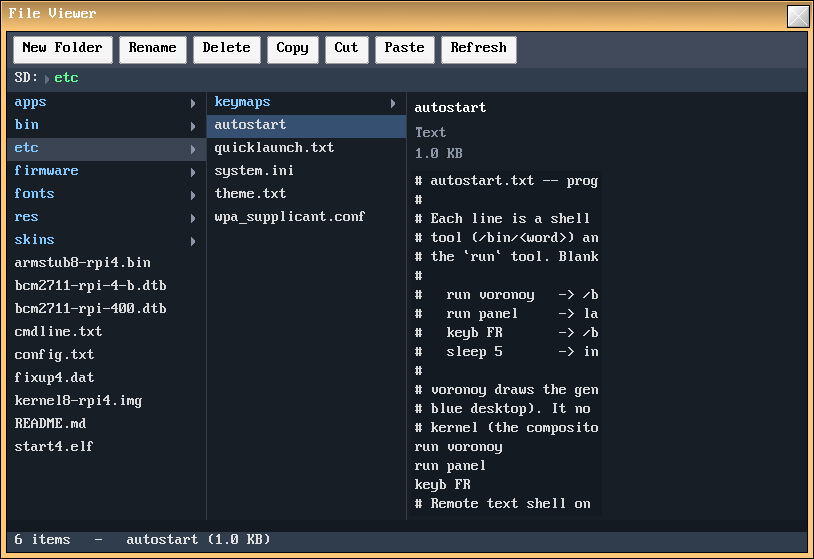
*The File Viewer: `SD:` ▸ `etc` in the path bar, one folder per column, and the preview of
the selected `autostart` file.*

## 10. Keyboard and layouts

The layout at boot is set by the autostart line **`keyb FR`** (in `SD:/etc/autostart`) —
the kernel no longer reads `keymap=` from `cmdline.txt`. `keyb` records the layout in a
persistent kernel snapshot and the kernel installs it on the keyboard the moment it
enumerates, so `keyb` needs **not** wait for USB — the layout is applied however late the
keyboard appears. (This removed a boot race where `keyb` could time out before the keyboard
enumerated and leave it with **no** map at all — a dead keyboard while the mouse worked.) To
change it **on the fly**:

- **At the command line**: `keyb FR` (or `US`, `UK`, `DE`, `BE`, `ES`, `IT`, `DV`). `keyb` alone
  shows the current layout and the list.
- **Graphically**: the **theme editor** (`theme`) offers a dropdown — populated from the
  `.kmap` files actually present in `SD:/etc/keymaps/` — applied live.
- **Permanently**: edit the `keyb` line in `SD:/etc/autostart`.

The layouts themselves live as files in **`SD:/etc/keymaps/`** — `BE.kmap`, `DE.kmap`,
`DV.kmap`, `ES.kmap`, `FR.kmap`, `IT.kmap`, `UK.kmap`, `US.kmap` (small binary tables). The
Belgian (`BE`) map is an azerty layout close to French, with the Belgian standard for the
digit row and several AltGr symbols (`!` on **8**, `=` `+` on the bottom-right key, `-` `_`
right of `)`, and `| @ #` on **1 2 3**, `{ }` on **9 0**, `[ ]` on the `^`/`$` keys). `keyb XX`
loads `XX.kmap` and hands it to the kernel, which copies it onto the live keyboard. **The
kernel itself ships no keyboard map** — layouts are *only* these files, so the keyboard has
no mapping until `keyb` has run (a second or two into boot), and deleting the `keymaps`
folder would leave it unmapped. **Adding a layout never needs a kernel rebuild**: drop a new
`<NAME>.kmap` in that folder (regenerate them, or seed a custom one, with
`tools/keymaps/genkeymaps.py`) and use `keyb <NAME>` — it also shows up in the theme dropdown.

Accented letters (`é è à ç ù`…, the Latin-1 characters of the layout) can be typed in every
text field and editor.

## 11. Customizing the appearance

### The theme editor (`theme`)

The **`theme`** app lets you change **live**:

- the **active chrome tint** (foreground window),
- the **inactive chrome tint** (background windows),
- the **title text color**,
- the **wallpaper color**,
- the **keyboard layout**.

Click a color swatch to open the picker, choose the layout from the dropdown, then
**Apply** (applies and **persists** by writing `SD:skins/theme.txt` + the `voronoy` config,
and repaints the wallpaper) or **Discard** (cancels).

### Manual theme editing

`SD:skins/theme.txt` (`0xRRGGBB` colors, re-read at boot):

```
active   = 0xFFC878    # active window chrome (border + title)
inactive = 0x8090A0    # background windows
text     = 0xFFFFFF    # title text color
```

The window skin (`wings.bmp`) is grayscale; these tints are **multiplied** into it.

### Startup and pinned apps

- **`SD:/etc/autostart`**: one **shell command** per line, run at boot by `init`
  exactly as if typed in the terminal — the first word is a `/bin` tool
  (`/bin/<word>`) and the rest are its arguments; blank lines and `#` comments are
  ignored; the **`sleep <seconds>`** line (an init builtin) waits before the next line,
  to stagger the startup. Launch a **desktop app** with the `run` tool (`run <name>` →
  `/apps/<name>.app/main`). Defaults: `run voronoy`, `run menubar`, `run notifyd`, `run panel`, `keyb FR` (sets the
  keyboard layout at boot) `telnetd` (remote shell) and `vncd` (remote desktop) — see §8. Which program plays the `init` role is itself set
  by `init=` in `cmdline.txt` (see §3).
- **`SD:/etc/quicklaunch.txt`**: the apps pinned to the panel (top→bottom).

### Wallpaper

At boot, **`voronoy`** draws a Voronoi pattern in the shared background buffer. Its
color/density are set in `SD:apps/voronoy.app/config.ini` (and via the theme editor).
The wallpaper persists after `voronoy` exits.

## 12. Application catalog

> Tip: most games restart with **`r`**.

### Gallery

A few applications (simulated screenshots, rendered from the real skins/font/icons by
`tools/screenshot/render.py`):

| | | |
|:---:|:---:|:---:|
| 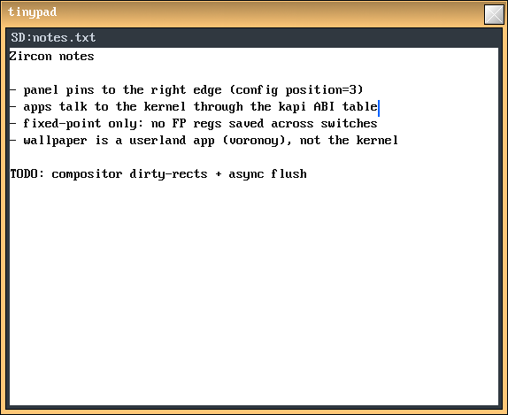 | 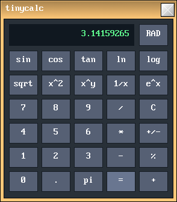 | 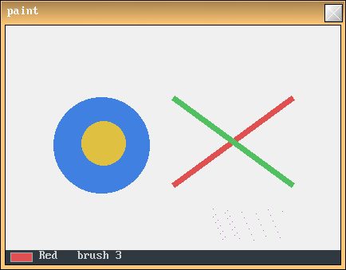 |
| *tinypad — text editor* | *tinycalc — calculator* | *paint — drawing* |
| 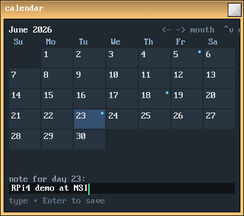 | 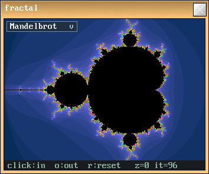 | 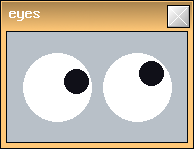 |
| *calendar — calendar + notes* | *mandelbrot — fractal explorer* | *eyes — gadget* |
| 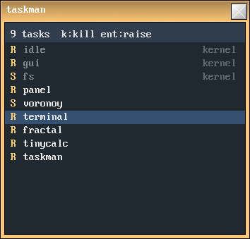 | 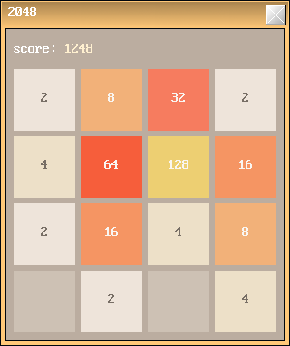 | 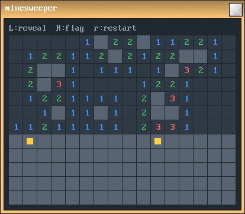 |
| *taskman — task manager* | *2048 — tile game* | *minesweeper — minesweeper* |
| | 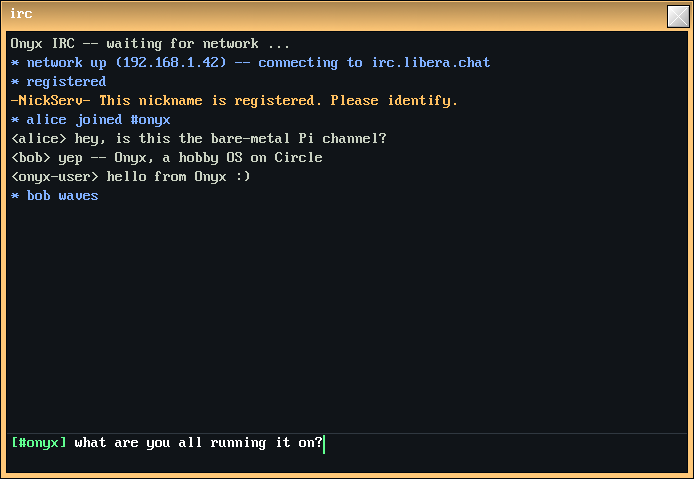 | |
| | *irc — IRC client* | |

### Productivity and tools

| App | Description and controls |
|---|---|
| **tinypad** | Text editor. The file's path is shown above the text; click the area to edit; arrows/Home/End/Page to navigate. **Select** text with **Shift** + those keys, a mouse drag, Shift+click or ^A (Select All); typing replaces the selection. Menu **Edit**: Cut (^X), Copy (^C), Paste (^V), Select All (^A), Copy All. Menu **File**: New (^N), Open... (^O, file dialog), Save (^S), Save As... (loads/saves the whole file). **Drop** a file on the window to open it, or text to insert it; New / Open / a drop first ask to **save unsaved changes** (Yes / No / Cancel). |
| **Writer** | Rich-text editor (bold/italic/underline/strike/highlight, colours, sizes, heading levels) on a word-wrapping document. Select text with the mouse (or **Shift** + arrows / Home / End / Page Up / Down), then use the menus: **File** (New ^N, Open... ^O, Save ^S, Save As...), **Format** (Bold ^B, Italic, Underline ^U, Strikethrough, Highlight, Smaller, Bigger), **Color** (Black/Red/Green/Blue), **Style** (Normal, Title 1-3). **`.rtf` files keep their styles** (read and written as Rich Text Format); other files load and save as plain text (`.doc` files open in Writer). **Drop** a file to open it (asks to save unsaved changes first), or text to insert it. |
| **Graphing Calculator** (`graphcalc`) | Plots up to four functions of x, in colour, live as you type them (left: `y1=` … `y4=`, a check box shows / hides each; a red frame = syntax error). Syntax: `+ - * / ^`, parentheses, `x`, `pi`, `e`, `sin cos tan asin acos atan sqrt abs ln log exp floor ceil round sign`, implicit multiplication (`2x`, `3sin(x)`, `(x+1)(x-1)`). **Drag** the graph to move, the **wheel** (or **+ / −**) zooms around the pointer, the arrows pan; the pointer **traces** the curves (x and each y shown on the left). **Standard** (−10…10), **Trig** (−2π…2π), **Square** (same scale on both axes); View menu: Zoom In / Out, Grid; Edit ▸ Clear Functions. The functions are kept in `SD:/apps/graphcalc.app/functions.txt`. |
| **Icon Editor** (`iconedit`) | Draws icons: 24-bit BMP where **magenta** (#FF00FF) is transparent — the desktop's convention (app icons are 40×40, `SD:/apps/<name>.app/icon.bmp`). The enlarged pixel grid in the middle (transparency as a checkerboard); **left button** = 1st colour, **right button** = 2nd colour (**X** swaps them). Tools: **P**en, **L**ine, **R**ect, **B**ox (filled), Ellipse (**O**), **F**ill, Pic**k**er (takes a pixel's colour), **E**raser. Palette (32 colours + transparency) and **More...** (the colour dialog); live previews at 1× on light and dark and 2×. **^Z** undo / **^Y** redo, **G** grid. File: New 40×40 (^N) / 16 / 24 / 32 / 48 / 64, Open... (^O, up to 64×64), Save (^S), Save As...; Image: Flip, Rotate 90, Shift, Clear. Drop a BMP on the window to open it. |
| **RTF Reader** (`rtfview`) | Shows **Rich Text Format** documents (`.rtf`, e.g. saved by WordPad or Word) with their bold / italic / underline / strikethrough, colours, highlights and sizes, word-wrapped; accents and typographic quotes / dashes are converted. Double-click a `.rtf` in the File Viewer (`fileassoc.ini`), File ▸ Open... (^O) or drop it on the window; Edit ▸ Copy (^C) / Select All (^A); File ▸ **Edit in Writer**. Paragraph layout (alignment, indents, tables), pictures and fonts are not kept. Sample: `SD:/docs/onyx-rtf-sample.rtf`. |
| **tinycalc** | Scientific calculator (fixed-point). Buttons + keyboard (`+ - * / ( ) ^ =`), square root, trigonometric/exp/log functions. |
| **sheet** | Mini spreadsheet 8×16. Click a cell, type a value or a **formula** (`=A1+B2*2`, refs `A1`…`H16`, `+ - * / ( )`); Enter/arrows confirm and move. |
| **qbasic** (QBasic) | The BASIC editor (see §13): main module and SUBs / FUNCTIONs edited separately (View ▸ SUBs... ^L, Edit ▸ New SUB...), Run ▸ Start (^R) with errors shown at their line, File ▸ Make App... Opens `.bas` files. Reads/writes `.bas` files, `SD:/tmp/<name>.bas` (the copy it runs). |
| **fmtracker** (FM Tracker) | A music tracker with 8 channels of **FM instruments** (the sound system's FM synthesizer, like the AdLib). A column per channel, a row per time slice; a cell holds a note that starts there (`C#4`), `---` (the note goes on) or nothing (silence) — a note lasts until the next note or silence of its channel. **Keys**: **C D E F G A B** a note (Shift = sharp; the cursor then goes to the next slice, and you hear it), **0–7** the octave, **Space** a silence, **Delete** `---`, **Backspace** clears the slice above, **#** toggles the sharp, **Ctrl+↑ / Ctrl+↓** move the note a semitone up / down, arrows / Page Up / Down / Home / End move (←/→ = channel), Tab the next channel; a **click** selects a cell; wheel / scrollbar scroll. The **column header** is a button: it opens the **instrument dialog** (presets from `SD:/apps/fmtracker.app/ins`, Load / Save `.FMI`, the two operators' multiplier, level, attack, decay, sustain, release, wave, sustain / tremolo / vibrato flags, feedback, FM or additive, **Test**); right-click it to mute the channel in this pattern. **Play** (^P) plays from the cursor, follows the position and highlights it; **Stop** / **Esc**. A song is a list of **patterns** (toolbar: ◀ ▶ +, **Rows**, **Speed** = a slice lasts speed / 20 s; Pattern menu: New, Duplicate, Delete). Opens and saves **FM Song `.FMS` files** (QBasic's FM Song, 2001 — `SD:/music/fms` has 59 songs) and `.FMI` instruments; double-clicking a `.fms` file opens it. Standard tuning (A4 = 440 Hz; FM Song's AdLib table played a semitone higher). Edit ▸ Insert / Delete slice (^E / ^D), File ▸ Song Info. |
| **imageview** (Image Viewer) | Views **BMP, GIF (animated), PNG, JPEG, PCX and WebP** images — double-click one in the File Viewer (`fileassoc.ini`), click it on the Shelf, drop it on the window or File ▸ Open... (^O). Fits the window by default (never enlarged); **1** = actual size, **+ / −** or the **wheel** zoom, **0** = fit; **drag** to pan a large image. **← / →** (or Page Up / Down, Backspace / Space) = previous / next image of the folder, Home / End = first / last. Transparency is shown over a checkerboard. The status bar shows the name, size, format, zoom and position in the folder. File ▸ **Edit in Paint** hands the file to paint. |
| **paint** | Drawing. **Drag** to paint, **right-click-drag** to erase; the strip at the bottom shows the colour and brush size. Menus: **File** (New ^N clears, Open... ^O loads a 24-bit BMP, Save ^S saves to the open file, Save As... to a new BMP), **Brush** (Smaller `[`, Larger `]`, Fine/Normal/Thick/Huge), **Color** (8 colours). Opens `.bmp` files (double-click in the File Viewer, `fileassoc.ini`); **drop** a BMP on the window to open it — New / Open / a drop ask to save unsaved changes first. |
| **calendar** | Calendar + notes. Left/right arrows = month, up/down = year; click a day, type a note, Enter to save (`agenda.txt` in the app's folder). An argument `YYYYMMDD` opens that day (used by the agenda widget). |
| **agenda** (Agenda) | Desktop widget: the next calendar appointments (see §5, *The agenda widget*). |
| **shelf** (Shelf) | The bottom strip of file / folder / app references in tabs, with the Trash (see §5, *The Shelf*). Reads/writes `SD:/etc/shelf.ini`. |
| **ask** (Confirm) | A small system Yes / No window used by apps too small to host a dialog (the Shelf's "remove tab?"): `run ask "Title|Message|Yes|No"`, exits with 1 (Yes / Enter) or 0 (No / Esc / close box). |
| **fileviewer** (File Viewer) | NeXTSTEP-style column browser with a clickable path bar, file previews and copy/cut/paste (see §9). |
| **terminal** | Terminal/shell (see §7). |
| **taskman** | Task manager. Arrows to select; Enter brings the window to the foreground; `k`/Delete kills the app (except kernel tasks); `r` refreshes. |
| **memmon** | Memory monitor. Shows total / used / free RAM, the memory owned by apps, a usage bar, and the processes ranked by 64 KB pages owned. Refreshes ~1×/s. |
| **theme** | Theme editor (see §11). |
| **eyes** | Gadget: two eyes whose pupils follow the mouse. |
| **mandelbrot** | Fractal explorer (Mandelbrot, Julia, Burning Ship, Tricorn via the dropdown). **Click** = zoom in (re-centers); `o` = zoom out; `r` = reset. |
| **inidemo** | Demonstration of the `.ini` reader (displays values from `config.ini`). |
| **irc** | IRC client over Wi-Fi. Connects to the server/channel from `config.ini`, shows the conversation, type to chat. Commands: `/join #chan`, `/msg nick text`, `/nick name`, `/me action`, `/raw …`, `/quit`. Needs the network up (see §3). |
| **httpc** | A mouse-driven **text web browser** (`http://` and `https://`). Renders the page text with **hyperlinks in blue** (click to follow), and handles simple **forms** (text fields, checkboxes, dropdowns, buttons → GET/POST). Navbar: **<** back, **>** forward, an **address bar** (click to type, Enter or **Go** to load); the right-hand scrollbar (or PgUp/PgDn/arrows) scrolls. Needs the network up (see §3). |
| **NetSurf** | The **NetSurf** web browser — a full graphical HTML/CSS rendering engine ported to Onyx (no JavaScript). Opens a window and lays out real pages with images. Plain `http://` for now (currently slow). A heavyweight alternative to `httpc`; opt-in build, see `user/netsurf/README.md`. Needs the network up (see §3). |
| **wpaconf** (Wi-Fi Settings) | Editor for the WLAN credentials in `SD:/etc/wpa_supplicant.conf`. Fields: SSID — a combo box: **Scan** lists the networks around (about 3 s), pick one with its arrow (or Down / Up) and the proto / key mgmt follow its security (an open network gets `key_mgmt=NONE`, no password) — password (masked — **Show password** reveals it), country, proto, key&nbsp;mgmt; `Tab` moves between fields. **Save** rewrites the file; **Save & Reboot** writes it then restarts so the kernel re-reads it at boot (the only way new credentials take effect); **Reload** re-reads the file. The password is stored in clear text on the card (the radio needs it) — keep the card private. |
| **Lisa** | A chat with an AI assistant (a modern *Eliza*), through the **Groq** API over HTTPS. Type in the box at the bottom: **Enter** sends, **Shift+Enter** starts a new line; Lisa's answer appears in the conversation above (word-wrapped; "Lisa is thinking..." meanwhile). Every request sends Lisa's **role** and the **whole conversation**, so she keeps the context. Menus: **Chat** ▸ New Conversation (^N), Save Transcript... (^S); **Edit** ▸ Copy (the selected text), Paste, Copy Last Answer; **Settings** ▸ Edit Configuration... (opens `config.ini` in tinypad). **Setup**: get a free API key at console.groq.com and put it in `SD:/apps/lisa.app/config.ini` as `key = gsk_...` (see `config.ini.example` in the same folder: `model`, `role`, `temperature`, `max_tokens`). That file holds your key: keep it private — it is never committed. Needs the network up (see §3). |
| **voronoy** | Wallpaper generator (launched at boot; no window). |

**On a PC**: `tools/fmsplayer/fmsplayer.exe` is an **FM Song player for Windows** built
from the same code (the `.FMS` reader and the FM synthesizer of the Onyx kernel): Open... or
drop `.fms` files on it; the folder's songs make the playlist (double-click one); Play /
Pause, Stop, Previous / Next, Loop song; it shows the title, author, comment, position and
each channel's note. Rebuild it with `tools/fmsplayer/build.sh` (MinGW-w64).

### Games

| Game | Goal and controls |
|---|---|
| **tetris** | Stack the pieces. Arrows: left/right/rotate/drop; **Space**: instant drop; `r`: restart. |
| **snake** | Eat to grow. Arrows: steer (no U-turn); `r`: restart. |
| **2048** | Merge the tiles. Arrows: slide the whole board; `r`: restart. |
| **minesweeper** | Minesweeper. **Left-click**: reveal; **right-click**: flag; `r`: restart. |
| **sokoban** | Push each box onto a target. Arrows: move/push; `r`: restart the level; `n`: next level. (levels in `levels.txt`) |
| **pong** | Two players. Left: `W`/`S`; right: up/down arrows; first to 9; `r`: reset. |
| **life** | Game of Life. **Click/drag**: (de)populate cells; **Space**: run/pause; `s`: one step; `c`: clear; `r`: random. |
| **same** | SameGame. **Click** a group of ≥2 same colors to destroy it (collapse); `r`: new board. |
| **Solitaire** | Klondike. **Drag** cards: the seven columns build down in alternating colours (a king on an empty column), the four foundations up by suit from the ace. **Click the stock** to turn one card (or three: Game ▸ Draw Three); an empty stock turns the waste over again. **Double-click** sends a card to its foundation, **right-click** sends every card that can go. Hidden cards turn over by themselves. **^Z** undo, **^N** deal. Windows scoring + timer; the cards bounce when you win. |
| **FreeCell** | All the cards face up in eight columns, four **free cells** (top left, one card each), four foundations (top right). **Drag** cards: a column takes a card one lower in the other colour (anything on an empty column); a **run** moves at once when free cells and empty columns allow it. **Double-click**: to the foundation, else to a free cell. Cards no longer needed go home by themselves. **^Z** undo; Game ▸ **Select Game...** plays deal 1–32000 — the same deals as Microsoft FreeCell; Restart Game. |
| **Pipes** | After *Pipe Dream*: lay pipe pieces before the water comes. The next pieces wait in the queue on the left (the bottom one goes next); **click** a square (or arrows + **Space**) to put it there — on an unfilled piece it replaces it (−50). When the countdown (the blue bar) runs out the water leaves the red valve: 50 points per piece it crosses, 500 more for a cross used both ways. If it went through the **required number of pieces** (top right) when it spills, the round is won. **F**: let the water run now, fast (double points). Walls from round 3, faster water every round. **P** pause. |
| **Arkanoid** | Break the bricks. The paddle follows the **mouse** or the **←/→** arrows (held); **Space** or a click launches the ball. Silver bricks take several hits, gold ones never break. Catch the falling capsules: **E** longer paddle, **S** slower ball, **D** three balls, **C** catch the ball (Space releases), **L** extra life. 8 rounds, 3 lives. **P** pause, Game ▸ Sound On / Off. |
| **Invaders** | Space Invaders. **←/→** (held) or the mouse move the cannon; **Space** or a click fires (one shot at a time). The fleet marches faster as it thins out (the four-note march on the synth); the shields crumble; the red saucer is worth 50–300. An invader reaching the ground ends the game. **P** pause. |

The new games, rendered by their real drawing code on a PC (`tools/tests/run_games_test.sh`):

| | | |
|:---:|:---:|:---:|
| 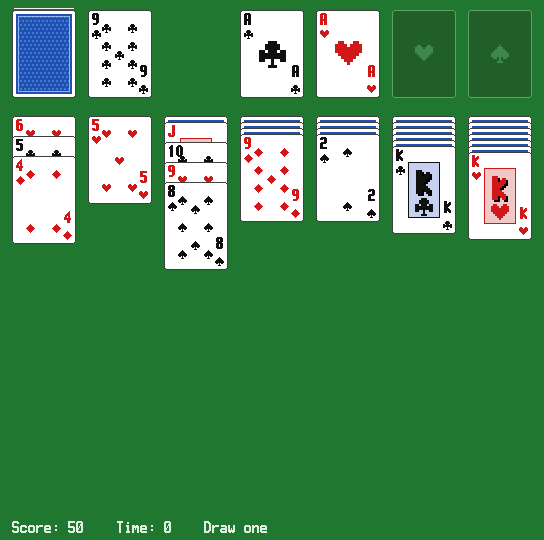 | 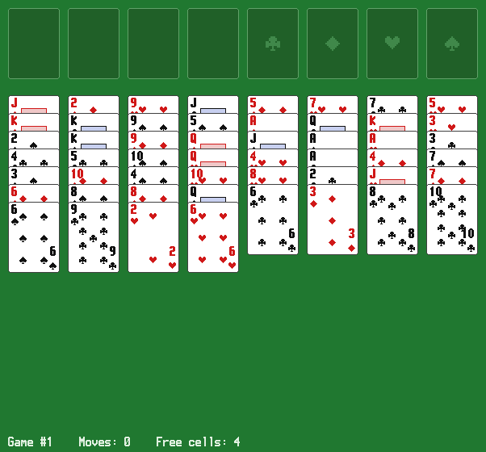 | 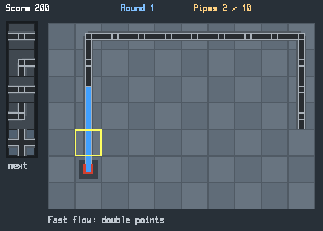 |
| *Solitaire (Klondike)* | *FreeCell — deal #1* | *Pipes* |
| 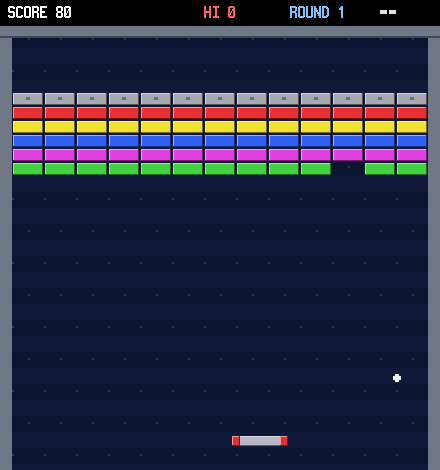 | 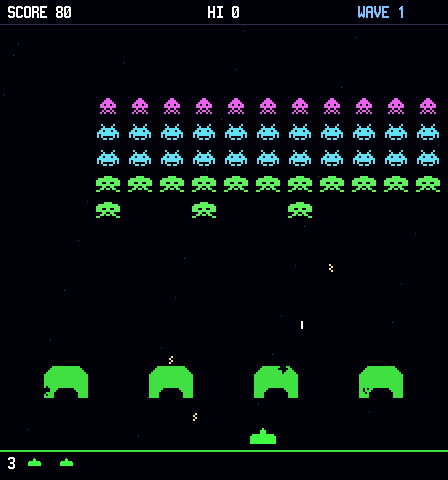 | |
| *Arkanoid* | *Invaders* | |

And the new tools (their graph / canvas / document areas, rendered the same way):

| | | |
|:---:|:---:|:---:|
| 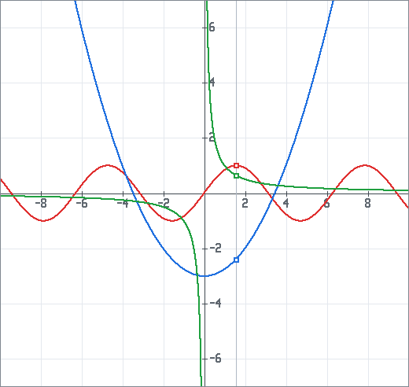 | 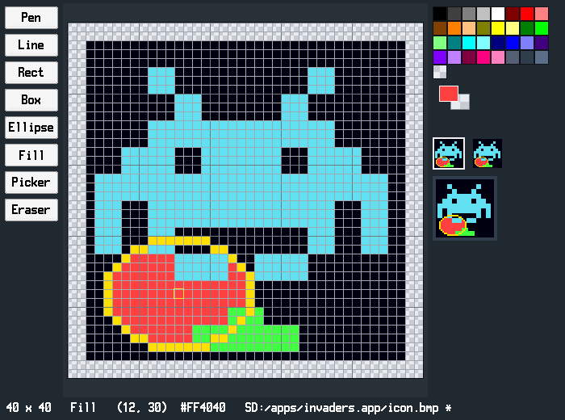 | 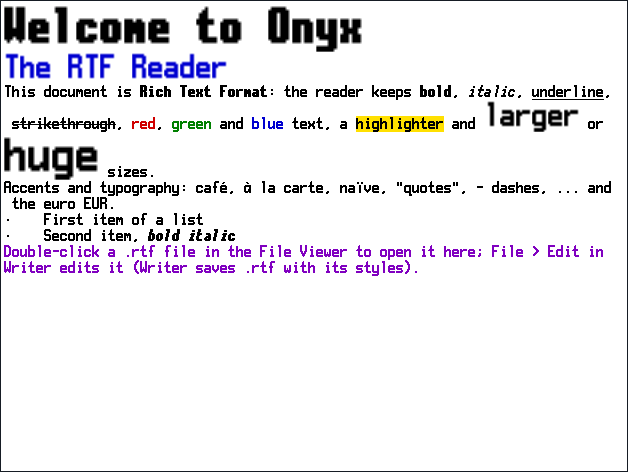 |
| *Graphing Calculator — trace* | *Icon Editor* | *RTF Reader* |

### Demos (technical examples)

**plasma** — a full-screen plasma animation (the demo of full-screen apps): the desktop
disappears while it runs; **Esc**, **Enter**, **q** or a click quits and brings it back.


| Demo | Shows |
|---|---|
| **demoA** | Bouncing box (direct framebuffer access + file reading). |
| **demoB** | Animated color field (multitasking). |
| **demoC** | Fire effect; "Color" button to cycle the palette. |
| **demoD** | Widget gallery (label, textbox, checkbox, button, slider, progress bar). |
| **demoE** | Multi-line textarea + scrolling view with scrollbars. |
| **demoF** | Small borderless launcher (buttons A–E that launch the other demos). |
| **widgets** (Widget Showcase) | The WPF-style wtk controls: radio buttons in a group box, toggle switches, a numeric up/down, a list box, a tree view, a calendar and a date picker, an image box, the colour dialog (**Colour...**), and **tooltips** (rest the pointer on a control). The bottom line reports each event. |
| **basicdemo** (BASIC Demo) | An app written in BASIC (`main.bas`, run by `/bin/basic`): a text box and **Say hello** (a notification), a click counter and a progress bar, and concentric circles whose colour (drop-down), size (slider) and fill (check box) follow the controls. Open it in QBasic to read it. |
| **cppdemo** | C++/OO example: a class hierarchy with virtual draw, objects created with `new` (user allocator), global constructor — proves the C++ app toolchain. |
| **spin** | Preemption test: a CPU hog that **never yields**. On a purely cooperative kernel it freezes the whole machine; with preemptive scheduling the rest of the UI (cursor, panel, other apps) stays responsive while it spins. It cannot be closed by its window (it never checks for the close) — **stop it from `taskman`**. |

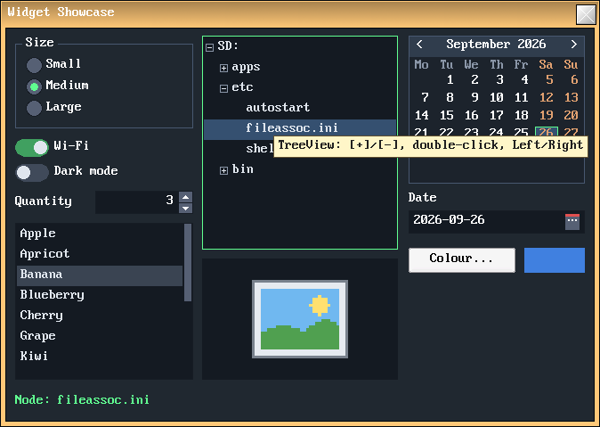
*The Widget Showcase: group box + radio buttons, toggles, numeric up/down, list box, tree
view (with a tooltip), image box, calendar, date picker and the colour button.*

## 13. Programming in BASIC

Onyx has a **BASIC in the style of QBasic**: the **QBasic** editor (`qbasic`, category
*Productivity*), the runtime **`/bin/basic`**, and apps written in BASIC. Programs are
compiled to bytecode and run by a small virtual machine. The full list of keywords is in
**Help ▸ Keywords** (`SD:/apps/qbasic.app/help.txt`). **Compiled programs**: **Run ▸ Make .bax**
writes `<program>.bax`, the bytecode, which starts without parsing and runs like a `.bas`
(File Viewer, `CHAIN`); **File ▸ Make App** can make a compiled app (`main.bax`); in a terminal
`basic -c prog.bas` writes `prog.bax`. The editor shows the code in light grey on blue, as
QBasic did. Examples are in `SD:/basic/examples`
(**File ▸ Examples...**): `hello`, `guess`, `subs`, `files`, `graphics`, `gui` and
**`arkanoid.bas`**, a full brick breaker in `SCREEN 13` shown with `FULLSCREEN` (arrows or
the mouse move the paddle, Space / click launches and fires, P pause, F full screen on /
off, Esc title / quit; capsules E expand, S slow, C catch, L laser, D three balls, P a life;
it reads and writes no file).

### Onyx BASIC on a Windows PC

`pc/dist/` holds **Onyx BASIC for Windows** (Windows 10 / 11, nothing to install): the same
compiler and virtual machine, to write and try programs on a PC. Copy the folder (keep
`OnyxBasic.exe`, `OnyxBasic.exe.config` and `obcore.dll` together) and start `OnyxBasic.exe`:

- **The editor** works like `qbasic`: one module at a time (the main module, each SUB /
  FUNCTION); **View ▸ SUBs...** (F2), **Edit ▸ New SUB...** (or type `SUB Name` + Enter, as in
  QBasic); **Run ▸ Start** (F5) checks the syntax and runs the program, an error jumps to its
  line; the language's words are capitalised when you leave a line. Every command is in the
  menus (**File**, **Edit**, **View**, **Run**, **Options**, **Help**); files are saved in
  Latin-1 with Onyx line ends, ready for the SD card. **File ▸ Make App...** writes
  `apps/<name>.app` into the SD folder (as source or compiled); **Run ▸ Make .bax** compiles
  the program, and the runtime runs `.bax` files as well.
- **SD:/** is a folder of the PC: **Options ▸ SD Folder...** (by default the repository's
  `sdcard/` when `pc/dist` is used in place), so programs that read files run unchanged.
- **The program's window** shows the screen scaled (320-wide modes doubled, proportions kept),
  with BASIC's controls as Windows controls; its menu: **Program ▸ Stop / Restart**,
  **View ▸ Full screen / Zoom**. `FULLSCREEN` does nothing on the PC; `LAUNCH` / `EXEC` (Onyx
  apps) are not available; `SHELL` runs a Windows command.

### The editor (`qbasic`)

- As in QBasic, the program is split into **modules** edited one at a time: the **main
  module** and each **SUB** / **FUNCTION**. The line above the text says which one is shown.
  **View ▸ SUBs...** (**Ctrl-L**) lists them (**Edit** opens one, **Delete** removes it);
  **Edit ▸ New SUB...** / **New FUNCTION...** asks for a name and creates it. On disk the
  program is one ordinary `.bas` text file (the main module, then every SUB / FUNCTION).
- **Run ▸ Start** (**Ctrl-R**) checks the syntax — an error opens the right module on the
  right line, with the message in the status bar — then runs the program in its own window.
  A runtime error comes back the same way. **Run ▸ Check Syntax** (**Ctrl-K**) only checks.
- **File**: New (Ctrl-N), Open... (Ctrl-O), Examples..., Save (Ctrl-S), Save As...,
  **Make App...** (below). **Edit ▸ Go to Line...** (Ctrl-G) takes a line number of the
  whole program. **Enter** keeps the indentation of the line above; Page Up / Down scroll.
- **F5** runs, **F2** lists the SUBs, **F1** opens the help (as in QBasic).
- Double-clicking a `.bas` file in the File Viewer opens it in the editor (`fileassoc.ini`);
  dropping one on the editor opens it too.

### Running programs

- From the **terminal**: `basic prog.bas [arguments]` (or just `prog.bas`). The program
  then works like any console tool: `PRINT` writes to the console, `INPUT` / `LINE INPUT`
  read the keyboard, **pipes and redirections** work (`basic sort.bas < list.txt`). It opens
  a window only if it uses one (graphics, `SCREEN`, `WINDOW`, controls).
- As an **app**: a program opens a window of 80 × 25 text cells (640 × 400) at its first
  `PRINT`; text and graphics share it (`SCREEN 12` = 640 × 480, `SCREEN 13` = 320 × 200).
  When a text-only program ends, "Press any key to continue" keeps the window open.
- `COMMAND$` holds the arguments. Relative file names are in the program's folder.

### The language

QBasic's: numbers and strings (`$`), arrays (`DIM`, up to 4 dimensions), `IF` / `ELSEIF`,
`FOR`, `WHILE`, `DO ... LOOP`, `SELECT CASE`, `GOTO` / `GOSUB`, line numbers and labels,
`SUB` / `FUNCTION` with arguments **by reference** (plain variables; an expression or a
parenthesised variable goes by value), `DIM SHARED`, `STATIC`, `CONST`, `DATA` / `READ`,
files (`OPEN ... FOR INPUT / OUTPUT / APPEND`), the string and math functions, `CLS`,
`LOCATE`, `COLOR` (16 colours, or `RGB(r, g, b)`), `PSET`, `LINE` (`B` / `BF`), `CIRCLE`
(`F` fills), `INKEY$`, `TIMER`, `RND`, **sound**: `PLAY "T140 O3 L8 CDEFG>C"` (QBasic's music
language), `SOUND freq, ticks`, `BEEP`, and Onyx's `NOTEON voice, freq[, wave, volume]` /
`NOTEOFF [voice]` (a note that plays until stopped, 16 voices).

And the rest of QBasic 1.1 (the editor's Help ▸ Keywords lists everything):

- **Types**: `%` INTEGER, `&` LONG, `!` SINGLE, `#` DOUBLE (or `AS INTEGER` …, `DEFINT A-Z` …,
  `DEFSTR`); INTEGER / LONG round when stored and raise *Overflow*; DOUBLEs print 15 digits;
  fixed strings `STRING * n`. **User types**: `TYPE … END TYPE` records (nested, in arrays,
  passed to SUBs, copied by `=`), `LEN (var)` their size, with **methods** (Onyx, in the way
  of FreeBASIC): `test AS SUB (a AS INTEGER)` declared in the `TYPE`, defined by
  `SUB Point.Test (a)` where `this` is the object (`this.x = a`, `RETURN this.x + a` in a
  FUNCTION), called as `p.Test 3`, `y = p.F (2)`, `t(i).Test 1`; a **constructor**
  `SUB Point.new (…)`: `DIM p AS Point (1, 2)` calls it (`DIM p AS Point` does not), and
  `p = NEW Point (1, 2)` makes a new object. `DEF FN`, `RETURN value` in a
  FUNCTION, `MID$ (…) = …`, `LSET` / `RSET`, `PRINT USING` (all the `#` `,` `.` `+` `-` `**`
  `$$` `^^^^` `!` `\ \` `&` `_` fields).
- **Errors**: `ON ERROR GOTO` handlers with `RESUME` / `RESUME NEXT` / `RESUME label`, `ERR`,
  `ERL`, `ERROR n` — an error inside a SUB comes back to the module-level handler.
- **Files**: `RANDOM` (records of `LEN = n`, `GET` / `PUT #` of numbers, strings and records,
  or `FIELD` + `LSET` / `RSET`) and `BINARY` files, `SEEK`, `LOC`, `MKx$` / `CVx`,
  `INPUT$`, `RESET`, `FILES`, `CHDIR`, `ENVIRON`, `SHELL` (a `/bin` tool, its output on the
  screen).
- **Graphics**: the screen modes 1, 2, 7–13 (320-wide modes shown doubled) with pages
  (`SCREEN m, , apage, vpage`, `PCOPY`), `PAINT`, `DRAW`, `GET` / `PUT` sprites (`PSET`,
  `PRESET`, `AND`, `OR`, `XOR`), `VIEW`, `WINDOW` logical coordinates and `PMAP`, `PALETTE`
  (existing pixels change colour, as on a VGA), `CIRCLE` arcs / ellipses, `STEP`, line
  styles, `VIEW PRINT`, `SCREEN (row, col)`. Onyx adds **`FULLSCREEN`**: the screen scaled to
  the whole display, proportions kept (a whole-number zoom when it fills nearly as much: at
  1024 × 768, `SCREEN 13` is shown 3×); `MOUSEX` / `MOUSEY` stay in the program's pixels.
- **Text** uses QBasic's character set (code page 437: frames `CHR$(201)` ╔, blocks
  `CHR$(219)` █, card suits…) in the VGA fonts, drawn by the runtime: 8 × 8 in `SCREEN 13`
  and the other 320/640 × 200 modes, 8 × 14 in `SCREEN 9` / `10`, 8 × 16 otherwise;
  `DRAWTEXT` is always 8 × 16. Accents typed in the editor or on the keyboard are translated
  (é is `CHR$(130)`, as in QBasic); text sent to Onyx (controls, file names, clipboard) is
  translated back. File contents are kept byte for byte, so an Onyx text file with accents
  shows other characters.
- **Keys and sound for games** (Onyx): `KEYDOWN(k$)` is -1 while a key is held (`k$` as
  `INKEY$` gives it, e.g. `CHR$(0) + "K"`, or a name: `"LEFT"`, `"RIGHT"`, `"UP"`, `"DOWN"`,
  `"SPACE"`, `"ENTER"`, `"ESC"`, a letter). `PLAY "MB…"` plays in the background while the
  program goes on (`MF` back to the foreground); `PLAY(0)` = notes still queued.
- **Events**: `ON TIMER (n) GOSUB`, `ON KEY (n) GOSUB` (F1–F12, arrows, user keys) with
  `TIMER` / `KEY (n)` `ON` / `OFF` / `STOP`. `INKEY$` returns F1–F10 as `CHR$(0) + CHR$(59…68)`.
- **Programs**: `CHAIN` (with `COMMON` variables and the open files), `RUN`, `CLEAR`,
  `TRON` / `TROFF`, `FRE`. **Ctrl+C** stops a running program (QBasic's Ctrl+Break).
- Not supported (DOS hardware): `PEEK` / `POKE`, `DEF SEG`, `VARPTR`, `CALL ABSOLUTE`,
  `INP` / `OUT`, `ON COM` / `PEN` / `STRIG` / `PLAY`.

Onyx additions — a program can be a real **windowed app**:

```basic
WINDOW "Converter", 320, 150
c = TEXTBOX(100, 14, 120, 24, "20")
go = BUTTON(230, 12, 78, 28, "Convert")
res = LABEL(12, 60, 296, 22, "")
DO
  e = WAITEVENT                 ' the control used; -1 = the window was closed
  IF e = -1 THEN END
  IF e = go THEN SETTEXT res, STR$(VAL(GETTEXT$(c)) * 9 / 5 + 32) + " F"
LOOP
```

Controls: `BUTTON`, `LABEL`, `TEXTBOX`, `CHECKBOX`, `LISTBOX`, `DROPDOWN` (items `"a|b|c"`),
`PROGRESS`, `SLIDER`; `SETTEXT` / `GETTEXT$`, `SETVALUE` / `VALUE`, `WAITEVENT` / `EVENT`.
System: `NOTIFY`, `MSGBOX`, `CLIPBOARD$` / `SETCLIPBOARD`, `OPENFILE$` / `SAVEFILE$` (the file
dialogs), `EXEC`, `LAUNCH`, `DRAWTEXT`, `MOUSEX` / `MOUSEY` / `MOUSEB`, `PAUSE ms`.

### Apps written in BASIC

An app bundle may contain **`main.bas` instead of `main`**: `SD:/apps/<name>.app/main.bas`
(+ `app.txt`, `icon.bmp`). It is listed and launched like any app — the kernel runs it with
`SD:/bin/basic`. **File ▸ Make App...** in the editor creates one from the current program
(it asks for the folder name and the title). Example: **BASIC Demo** (`basicdemo`).

## 14. Troubleshooting

- **Nothing on screen / it freezes at boot.** Check that **all** the files from `sdcard/`
  are at the root of a **FAT32** card, that `config.txt` correctly targets `[pi4]` and that
  `kernel8-rpi4.img` is present. Connect the **serial** (115200) to read the log.
- **Black screen after launching an app, with green text.** The app exited (or
  faulted): the **debug console** took over and shows the log. Note the message; in case of
  a fault, the `ELR` address helps locate the problem
  (cf. [developer guide](03-DEVELOPER-GUIDE.md#12-débogage-sur-matériel)).
- **Keyboard in the wrong layout.** Set `keymap=` in `cmdline.txt`, or use `keyb XX` /
  the theme editor on the fly.
- **Wrong resolution.** Adjust `width=`/`height=` in `cmdline.txt`.
- **An app stops responding / the desktop freezes.** Connect with the remote shell
  (`python tools/onyx-telnet.py <pi-ip>`) and run `kmsg`: the GUI watchdog logs
  `compositor STALLED` (with every task's state) or `app '<title>' NOT PUMPING events`,
  and the `heartbeat` line shows whether frames and input still flow. Kill a frozen app
  with `ps` + `kill <pid>` (or `taskman`); otherwise, restart.
- **No mouse/keyboard.** Check that they are standard **USB HID** devices and that they
  are plugged in at startup (hot-plug is handled, but the initial connection is the most
  reliable).
