# Onyx — User Guide

This guide explains how to **prepare**, **boot** and **use** Onyx: the desktop,
the terminal, the file manager, the command-line tools, customization, and the
application catalog.

## Contents

1. [What you need](#1-what-you-need)
2. [Preparing the SD card](#2-preparing-the-sd-card)
3. [Boot configuration](#3-boot-configuration)
4. [First boot](#4-first-boot)
5. [The Onyx desktop](#5-the-onyx-desktop)
6. [Working with windows](#6-working-with-windows)
7. [The terminal and the shell](#7-the-terminal-and-the-shell)
8. [The `/bin` tools](#8-the-bin-tools)
9. [The file manager](#9-the-file-manager)
10. [Keyboard and layouts](#10-keyboard-and-layouts)
11. [The Control Panel and the appearance](#11-the-control-panel-and-the-appearance)
12. [Application catalog](#12-application-catalog)
13. [Programming in BASIC](#13-programming-in-basic)
14. [Troubleshooting](#14-troubleshooting)

---

## 1. What you need

- A **Raspberry Pi 4**.
- A **microSD card** formatted as **FAT32**.
- An **HDMI display** (micro-HDMI on the Pi 4 side).
- A **USB keyboard** and a **USB mouse** (standard HID).
- *(Optional)* a **serial adapter** on GPIO14 (TXD) / GPIO15 (RXD), **115200 8N1**,
  3.3 V, to view the boot log and error messages.

## 2. Preparing the SD card

Copy **all the contents** of the [`sdcard/`](../sdcard/) folder to the **root** of a
FAT32 card, then insert it into the Pi 4 and power on.

**The file dialog** (Open, Save, Choose folder — every program's; redone on 2026-10-05):

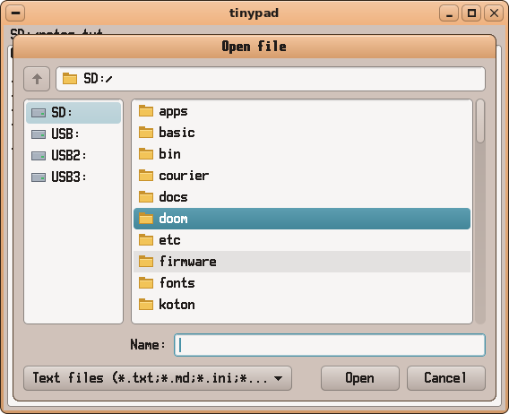

At the top an **Up** button and the folder's path; at the left the **volumes** that are mounted (`SD:`,
`SD1:`…, `USB:`…: a click goes to its root); the folder's content with the **folders first**, sorted by
name, each file's size at the right. **A click selects** (a file's name goes into the *Name* box); **a
double click**, **Enter** or the button opens a folder or takes the file. The **arrows** move the
selection, **Backspace** goes up, **Esc** cancels, the wheel scrolls. It opens in the folder of the
program's last file.

**More partitions (optional).** The Pi 4 starts only from the card's **first partition**, which
must stay **FAT32**: in Onyx it is **`SD:`** (also `SD0:`). Partitions **2, 3, 4** of the card
(MBR), when formatted **FAT32** or **exFAT**, appear as **`SD1:`**, **`SD2:`**, **`SD3:`** — e.g.
a small FAT32 boot partition and a big **exFAT** one for your ROMs and disc images (exFAT has no
4 GB file limit). A FAT32 volume can be up to 2 TB (Windows' own formatter stops at 32 GB, other
tools do not); a file on FAT32 is at most 4 GB − 1. They show in the file dialogs (the volumes'
column at the left), in the File Viewer (**Go** menu) and in any path
(`cd SD1:/roms`); a path starting with `/` stays on the current volume.

**`RAM:` — a volume in memory.** Besides the card, Onyx has **`RAM:`**: folders and files kept in
the Pi's memory (128 MB at most by default, less on a 1 GB Pi; `system.ini`'s `ramfs=`, §3). It is
fast, never wears or slows the card, and **everything on it is lost when the Pi restarts** (or is
switched off) — it is for what can be lost. Use it like any volume in the terminal (`ls RAM:`, `cd RAM:/tmp`, `cp`, `rm`, `mkdir`,
`cat`, `> RAM:/notes.txt`) and in any path; `df` shows how full it is. A file moved between `RAM:`
and the card is copied (`cp`), not renamed (`mv` stays within one volume).

Card contents:

| Item | Role |
|---|---|
| `start4.elf`, `fixup4.dat`, `bcm2711-rpi-4-b.dtb`, `bcm2711-rpi-400.dtb`, `armstub8-rpi4.bin` | GPU firmware + device trees (Pi 4 B, Pi 400) + Pi 4 ARM stub |
| `firmware/brcmfmac4345{5,6}-sdio.*` | Wi-Fi chip firmware: `43455` = Pi 4 B, `43456` = **Pi 400** (the Pi 400 has a different Wi-Fi chip, CYW43456) |
| `config.txt`, `cmdline.txt` | boot configuration (see §3) |
| `kernel8-rpi4.img` | **the Onyx kernel** |
| `apps/<name>.app/` | the **applications** (one per `.app` folder): `main` (the ELF, no extension; `main.bax` / `main.bas` for a BASIC app), `app.txt` (title, category, icon, stack), icons, resources |
| `bin/<tool>` | the terminal **command-line tools** (§8), `init` included |
| `etc/autostart` | commands run automatically at boot (read by `init`) |
| `etc/system.ini` | general settings (§3) |
| `etc/theme.txt`, `etc/wallpaper.ini`, `etc/dock.ini` | the desktop's colours and style, the wallpaper, the dock (the Control Panel writes them) |
| `etc/keymaps/*.kmap` | the keyboard layouts (§10) |
| `etc/fileassoc.ini`, `etc/runners.ini` | which app opens which file; which runner runs a `.bas` / `.bax` |
| `var/pkg/db` | the installed packages (§11, *The Package Manager*) |
| `res/` | shared resources: the fonts (`res/fonts`: DejaVu, the web stand-ins), icons, the SoundFonts, the certificates (`ca-bundle`) |
| `fonts/`, `wallpapers/` | the bitmap font; the shipped wallpaper pictures |
| `koton/` | Koton's plugins (`koton/plugins/<name>/main`) and its demo songs |
| `basic/examples/` | BASIC samples (§13) |
| `docs/`, `music/`, `courier/`, `manuals/` | sample documents (Letters, the Spreadsheet, Cardfile, Ledger), FM songs, Courier's collections, the Koton and Ledger manuals |
| `doom/` | Freedoom (`freedoom1.wad`, BSD-licensed) for Doom |
| `roms/` | the place for your own Game Boy / GBA ROMs (none shipped) |

To regenerate the contents from sources: `cd kernel && make stage` (see the
[developer guide](03-DEVELOPER-GUIDE.md)).

## 3. Boot configuration

### `config.txt`

Selects 64-bit mode and the kernel image for the Pi 4:

```
arm_64bit=1
kernel_address=0x80000
initial_turbo=0
enable_uart=1          # reliable serial console + removes the rainbow splash
disable_splash=1
[pi4]
armstub=armstub8-rpi4.bin
kernel=kernel8-rpi4.img
max_framebuffers=2
```

### `cmdline.txt`

Parameters read at boot:

```
width=1920 height=1080 init=SD:/bin/init heartbeat=0 sdhs=1 netcore=1
```

- **`width` / `height`**: framebuffer resolution (default 1024×768; the card ships 1920×1080). Any
  size works (the firmware scales it to the monitor's mode); the monitor's native one is sharpest.
  An app's window can be as big as the screen. The Control Panel's **Display** applet changes it
  at once, and writes these two options for the next start.
- **`init`**: absolute path of the init program the kernel launches at boot
  (default `SD:bin/init`). init reads `SD:/etc/autostart` and starts the rest
  of the userland, so pointing `init=` at another ELF (e.g. a recovery shell)
  swaps the whole launcher without rebuilding the kernel.
- **`heartbeat`**: period in seconds of the kernel's GUI **heartbeat** line in the
  kernel log (default `5`; `0` = off). Read it with `kmsg` — e.g. remotely over `telnetd`.
  It shows uptime, frames per second, mouse/key events, tasks by state and every window
  with its queued (`q`) / dropped (`d`) events. The same GUI watchdog always warns when the
  compositor stops producing frames (and lists every task's state) and when an app stops
  pumping its window's events (a frozen app).
- **`watchdog`**: `watchdog=0` does not start the GUI watchdog at all (A/B testing).
- **`sdhs`**: the SD card runs in **High Speed** (50 MHz instead of 25: about 16 MB/s read
  with `fsbench` instead of ~10) — the default (`sdhs=1`). If a card misbehaves with it (boot
  errors, files that do not read back), set `sdhs=0`. `kmsg` says what is in use (`SD card
  mounted`).
- **`sdcache`**: `sdcache=0` turns off the **sector cache** (on by default: the FAT and the
  folders stay in memory, so opening files and listing folders no longer asks the card for
  every sector; writes still go to the card at once). For comparisons with `fsbench`.
- **`dispdma`**: `dispdma=0` makes the compositor's copies to the screen synchronous again (the
  2D DMA started then polled, docs/05 §12, off) — to tell a display problem from another one.
- **The date of the files**: the Pi has no clock of its own; Onyx keeps the last time it knew in
  `SD:/etc/clock` (every 10 minutes and at shutdown) and starts from it at boot, until the
  network time (NTP) corrects it — so the files written early at boot get a date too.
- **`hangreboot`**: the **hang watchdog**, in seconds (default `15`, `0` = off): if Onyx freezes
  (the green LED stops blinking), core 1 notices it after 10 s, writes a report into the
  sectors of `SD:/etc/crashdump.txt` (prepared at boot) and restarts the Pi (the hardware watchdog
  does it after that time if even that fails — the green LED then blinks fast for 3 s, then stays
  lit 3 s if the report was written, or blinks slowly 3 times if not); the next boot keeps what it was doing (the last kernel log lines, where the processor was stuck, what the
  GPU and the display were doing, the free memory, a panic's registers and the addresses on its
  stack) to **`SD:/etc/lastcrash.txt`**. A kernel panic (an "Out of memory", a failed assertion)
  now writes that report at once too. An **app that stops answering** (its window no longer takes
  the mouse and the keys for 2 s) gets its own report, rewritten every 2 s into
  `SD:/etc/apphang.txt` (where the app is stuck, the memory, the last log lines); it becomes
  `SD:/etc/lasthang.txt` when the app answers again or is closed, and joins
  `SD:/etc/lastcrash.txt` if the Pi restarts meanwhile. Send those files along with a freeze
  report.
- **`gpudirect`**: `gpudirect=0`: the GPU renders into its own buffer, then copied, instead of
  writing the window's (or the full screen's) pixels itself — the same kind of test.
- **`slice`**: the app time slice, in 10 ms ticks (default `2` = 20 ms).
- **`hogsched`**: `hogsched=0` turns off the CPU-hog detection (apps preempted twice in a
  row lose priority — see `docs/02`); the scheduler is then plain round-robin
  (A/B testing).
- **`netlog`**: `netlog=1` writes the network's start to **`SD:/netlog.txt`** — for a Pi without a
  screen whose Wi-Fi does not come up. The kernel starts `/bin/netlog` before anything else; it checks
  `etc/wpa_supplicant.conf` (a UTF-8 BOM, the `country=` line, the `ssid` / `psk` lines — the
  passphrase is never written, only its length) and the Wi-Fi firmware, then keeps the kernel log
  (the `net:` lines, wpa_supplicant's, DHCP), the file rewritten every 2 s. It stops 30 s after the
  link is up (the programs running then listed: are `telnetd`, `vncd`, `rdpd` there, did they say
  *listening*?), or after 5 minutes, listing then the access points around. Put the card in the PC
  and read the file. Meanwhile `kmsg` shows nothing (netlog takes the log's events). Remove it
  (or `netlog=0`) once the network works.
- **`netstat`**: `netstat=1` writes the network's pace into the kernel log every 5 s (the network
  core's rounds, the Wi-Fi driver's frames a second and read times, the link's rate and channel):
  read it with `kmsg` while `tcpbench` or a download runs. Off by default.
- **`netcore`**: `netcore=1` runs the whole **network** (Wi-Fi, wpa_supplicant, TCP/IP, DNS,
  NTP) on **core 3**: the desktop and the network no longer slow each other down, and core 0
  can rest when nothing happens. Core 3 is then no longer an app core: one emulator (or Doom)
  at a time gets a core of its own (core 2), the next one runs on core 0 as before. `kmsg`
  says `cores 1-3 started (core 1: sound, core 3: network)`. `netcore=0` (or no `netcore=`)
  keeps the network on core 0, as before — the way back if the Wi-Fi misbehaves with it.
- **`el0pmu`** — and **apps at EL0**: every app runs **protected** — isolated from the kernel, the hardware and the
  other apps ([EL0-PROTECTED-MODE.md](EL0-PROTECTED-MODE.md), docs/02 §6). An app that does
  something wrong (a bad pointer, a privileged instruction) is **killed**, with a notice on the
  desktop and an `el0:` line in `kmsg`; the system goes on. **`el0pmu=1`** lets apps read the
  CPU's performance counters (gcemu's `--pmu`; off by default). (The options `appmode`,
  `protected`, `appfault`, `nullguard` of the first version are gone: an old card's are ignored.)
- `keymap=` is ignored: the keyboard layout is the card's `SD:/etc/keymaps/*.kmap`, loaded by `keyb`
  from `SD:/etc/autostart` (§10).

**Without a screen**, the green **ACT LED** shows the state: slow blink (1 s) = kernel
running, network not up yet; fast blink (0.2 s) = network up (`telnetd` reachable);
**SOS** (· · · — — — · · ·) = kernel panic (an exception; with a screen, the red panic page
shows EC/ELR/FAR); LED frozen on or off = the kernel hangs. `config.txt` sets `hdmi_force_hotplug=1` so a
headless Pi still gets a framebuffer (without it, Onyx would start neither the GUI nor
the userland, `telnetd` included).

### `system.ini`

General settings read at boot (`SD:system.ini`):

```
verbose=0          # 1 = log app start/stop/kill to the kernel log (see kmsg)
timezone=120       # minutes offset from UTC (60 = CET, 120 = CEST summer time)
ntp=pool.ntp.org   # time server to sync against once the WLAN link is up ("off": none)
hostname=onyx      # the name the Pi gives the network (DHCP); default "raspberrypi"
ramfs=128          # the size of RAM:, the volume in memory (§2): MB, or "10%" of the free
                   # memory; "0" = no RAM:. No line: 128 MB, at most a quarter of the free memory
```

`ramfs=` is read at boot (restart to apply it). The memory is taken only as files are written to
`RAM:`, and given back when they are removed; some memory is always left to the applications (a
write to `RAM:` fails rather than take it).

Setup, the first-run wizard (§4), writes `timezone`, `ntp` and `hostname`; `verbose on|off`
changes only its own line.

### Wi-Fi (WLAN)

Onyx connects over the Pi's on-board Wi-Fi. Two files must be on the SD card:

- **`SD:/firmware/`** — the BCM/Cypress WLAN firmware. For the Pi 4 (CYW43455):
  `brcmfmac43455-sdio.bin`, `.txt` and `.clm_blob` (fetch them with
  `circle/addon/wlan/firmware/Makefile`, or copy them from a Raspberry Pi OS install).
- **`SD:/etc/wpa_supplicant.conf`** — your network credentials (⚠️ stored in **clear
  text** — keep it on the card, do not publish it; Onyx ships none, the Wi-Fi settings or the
  menu bar's Wi-Fi menu write it):

  ```
  #country=BE
  network={
      ssid="YourNetwork"
      psk="YourPassword"
      proto=WPA2
      key_mgmt=WPA-PSK
  }
  ```

The link comes up a few seconds after boot (watch the log, or run `net`). **2.4 GHz or 5 GHz**: both work; `wifiscan` shows each network's channel (1–13: 2.4 GHz, 36 and up: 5 GHz). The `country=` line must be set (no `#`): without it the driver does not join, and it decides the channels allowed (12 and 13 in Europe). A router with one name for both bands: **5 GHz is taken** unless it is much weaker than 2.4 GHz (25 dB) or under −78 dBm (it is faster and less crowded; before 2026-10-04 the Pi only looked at the 2.4 GHz channels) — `freq_list=2412 2417 2422 2427 2432 2437 2442 2447 2452 2457 2462 2467 2472` in the `network={…}` block keeps the Pi on 2.4 GHz (or `bssid=` the 2.4 GHz radio's address). A router in WPA/WPA2 mixed mode (TKIP for the group key) works since 2026-10-01 (before: connected, but no address — the link stayed down); a WPA3-only network does not (set the router to WPA2/WPA3 mixed). It is fully
optional: if the firmware/credentials are missing, the desktop still works — only the
networked apps stay offline.

You don't have to edit the file by hand: the **Wi-Fi Settings** app (`wpaconf`, see §12)
edits SSID / password / country / proto / key&nbsp;mgmt in a small form and rewrites
`wpa_supplicant.conf` for you. The kernel only reads it at boot, so use its **Save &
Reboot** button to apply the new credentials.

## 4. First boot

On power-on:

1. The firmware loads `kernel8-rpi4.img`.
2. The kernel initializes the display, the SD card and USB, then briefly shows a boot
   log.
3. The kernel launches the **init program** (`SD:bin/init` by default, or whatever
   `init=` in `cmdline.txt` points at), which runs each line of `SD:/etc/autostart` as
   a shell command. By default:
   - **`wait pkg commit`** moves in a system update staged for this boot (and restarts once
     when the kernel or the firmware changed: §8 *Packages*);
   - **`run voronoy`** paints the **wallpaper** (Voronoi pattern) and then exits;
   - **`run pkgd`** starts the **update daemon** (§11 *The Package Manager*);
   - **`run setup`** — on a new card only — starts **Setup**, the first-run wizard (below);
   - **`run menubar`** starts the **menu bar**, **`run dock`** the **dock**, **`run agenda`**
     the **agenda widget**, **`run notifyd`** the notifications;
   - **`keyb FR`** sets the keyboard layout.

   Optional: a line **`preload <program>`** loads a large program ahead and keeps it in memory, so
   that it starts without reading the card (§8, `preload`); the file ends with a commented
   example. Put such lines last: the load runs in the background, after the desktop is up.

### Setup, the first-run wizard

On a new card Onyx starts with **Setup** alone over the wallpaper: the menu bar, the dock and the
agenda are held back until it is done (their autostart lines read `#setup: run menubar`...). Its
window stays in the middle of the screen — it cannot be moved, and it is centred again when the
resolution changes. The steps are on the left (a green tick once done); **Back** and **Continue**
at the bottom; everything can be changed later in the Control Panel.

1. **Welcome.**
2. **Region & keyboard.** The **country** (type its first letter, or the arrows) proposes the
   keyboard layout and the time zone and gives the Wi-Fi its country code (the radio's channels:
   `country=` of `SD:/etc/wpa_supplicant.conf`). The **layout** is taken at once (type in *Try it*;
   the small keyboard shows its keys); the **time zone** too — its summer time from the date
   (the European and the North American rules) —; **Set the clock from the Internet** (NTP).
3. **Wi-Fi.** The networks around, the strongest first, with their signal, security and a lock;
   the one you are on marked *Connected*, one saved before *Saved*. Click one: its password
   (8 to 63 characters; empty for a saved one), **Connect** (Enter) — a spinner while it joins,
   then *You are online* and the address; *Could not connect: check the password* after 30 s.
   **Rescan**; **Other network (hidden name)...**: its name and password typed. **Skip for now**:
   the Wi-Fi icon of the menu bar joins one later. Written as the Wi-Fi menu does.
4. **Display.** The sizes; **Best** marks the monitor's own (asked of it: its EDID), *now* the
   screen's. **Try it** changes the resolution at once and asks **Keep this resolution?** —
   **Keep** writes it to `SD:/cmdline.txt` (Onyx starts at that size from then on), **Revert** or
   15 seconds without an answer goes back (a picture that does not come back fixes itself).
5. **Appearance.** The colour of the window in front (Peach, Steel, Sage, Brick, Slate — or Milk,
   soft greys and coloured beads for the title buttons, §11), the
   wallpaper (generated Voronoi cells or one of the patterns of `SD:/wallpapers`) and its **tint**
   (32: sixteen colours and the same lighter); the preview shows the desktop you will get, and the
   real one — the wallpaper, Setup's own frame — follows a moment after each click
   (`SD:/etc/theme.txt`, `SD:/etc/wallpaper.ini`, as the Theme applet writes them).
6. **Name & privacy.** The **computer's name** on the network (letters, digits, `-`; from the
   next start: `system.ini`'s `hostname=`) and the **remote services** — the remote shell
   (telnet, port 23), the remote desktop (VNC, 5900), the remote windows (Onyx Remote, 3390),
   file sharing (FTP, 21, user `onyx` password `onyx`): only FTP asks for a password, so turn on
   only what you use, on a network you trust.
7. **Ready.** A summary, a **Change** link on each line. **Start Onyx** writes `system.ini`
   (`timezone`, `ntp`, `hostname`) and the autostart — its own `run setup` line and its comments
   removed, the held-back lines given back, the `keyb` line set, each service's line on or
   commented out (`#telnetd`) — starts the menu bar, the dock and the agenda and the services
   turned on (stops those turned off), and ends: it does not come back. To see it again, put
   `run setup` back in the autostart (`run setup` in a terminal works too).

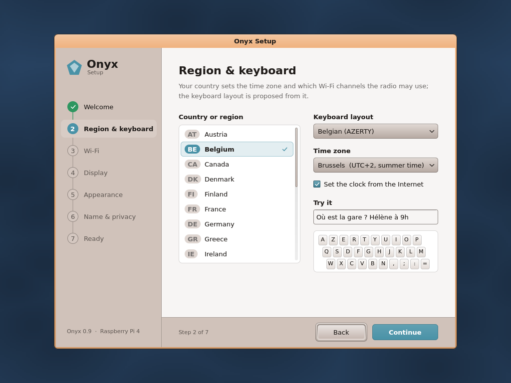
*Setup: the country proposes the layout and the time zone; the layout is taken at once.*

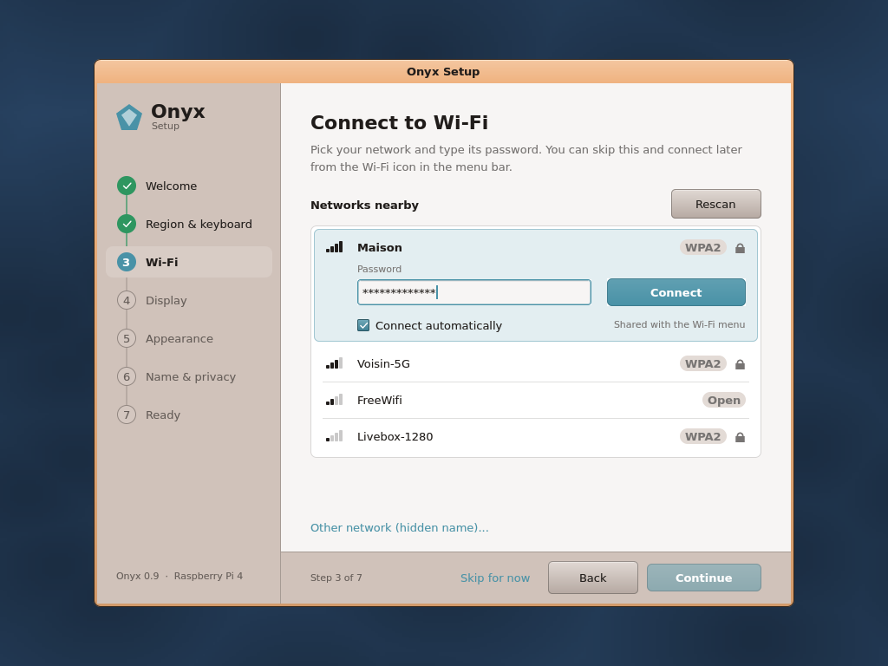
*A network picked: its password, Connect.*

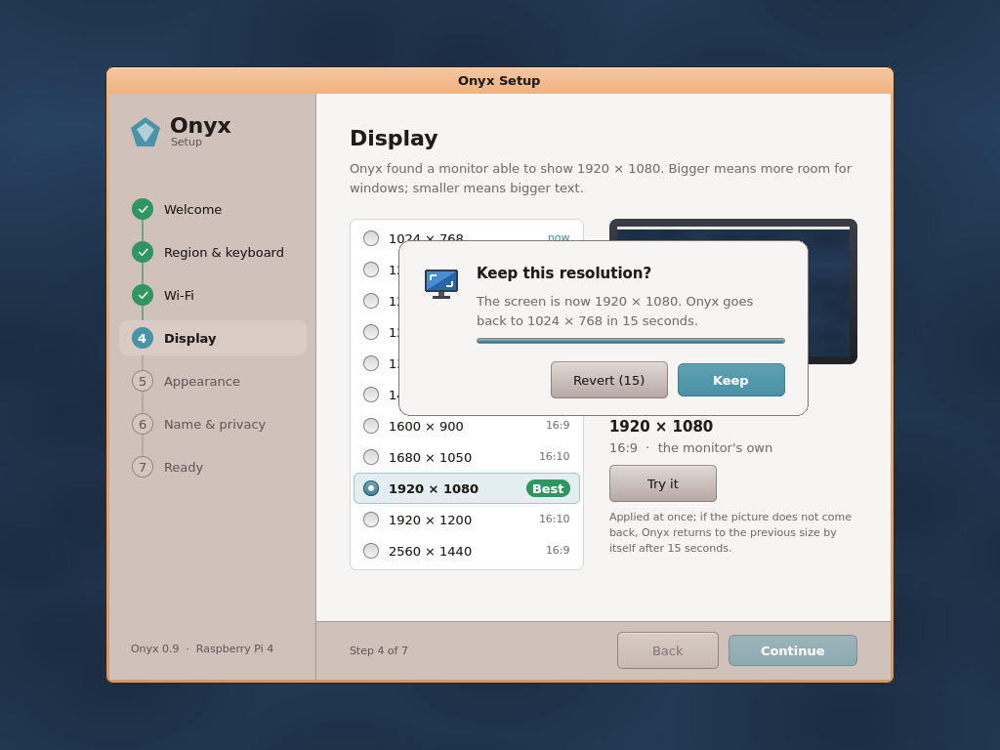
*The monitor's own size marked Best; tried: back by itself after 15 seconds.*

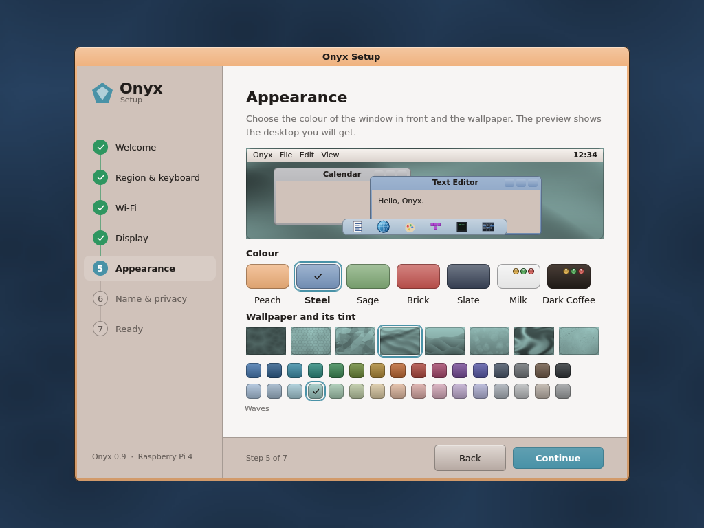
*The colour of the window in front, the wallpaper and its tint, a preview of the desktop.*

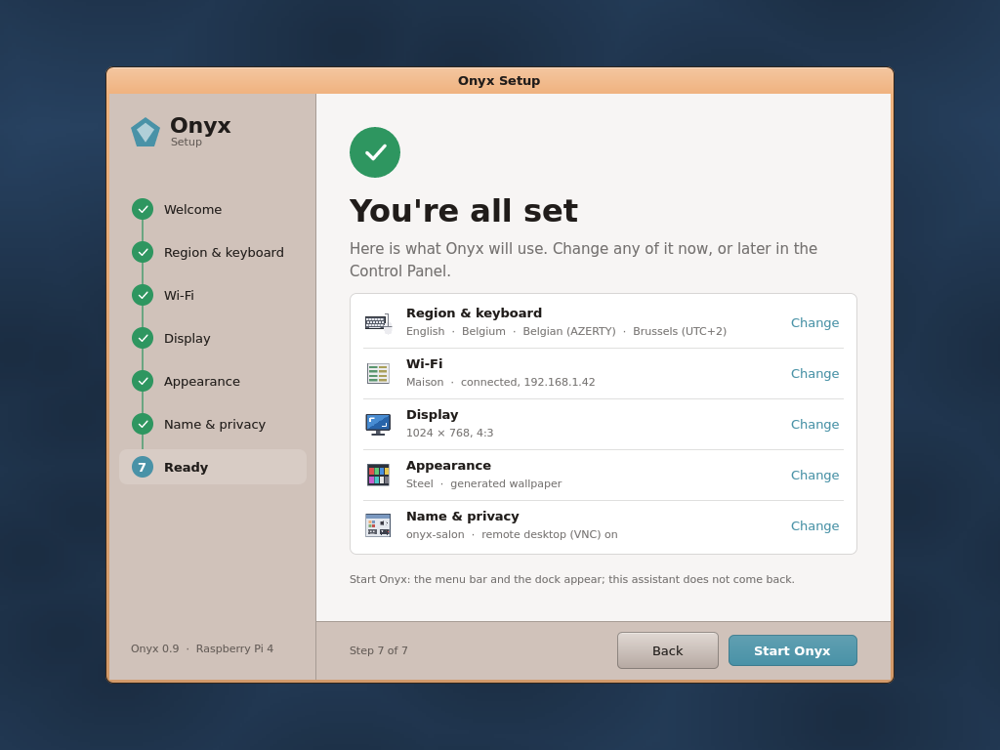
*The summary; Start Onyx.*

You then get the desktop — a **modernised CDE** (the look of the classic Unix desktop, redrawn
with rounded corners, soft gradients, the push buttons raised faces as the drop-downs'): the wallpaper, the menu
bar at the top, the **dock** at the bottom, the agenda widget at the top left. (The former
left panel, its app list and the Shelf strip, which the dock replaced, were removed on 2026-10-05.)

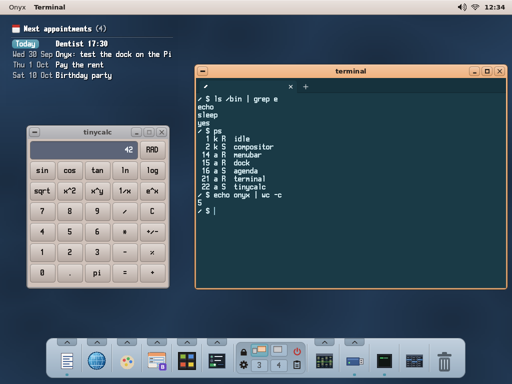
*The desktop: the agenda on the wallpaper, a calculator, a terminal in front (its frame in the
theme's colour, the others grey), the dock with the Internet drawer open, the menu bar.*

## 5. The Onyx desktop

The "Onyx" desktop is made of the **menu bar** (`menubar`: the active app's menus, the Onyx
menu, the time, the sound, the Wi-Fi), the **dock** (`dock`: the apps' drawers, the
**workspaces**, lock / Control Panel / power, the Terminal, the File Viewer, the Trash) and the
**agenda widget** (`agenda`). Everything is drawn in the theme's colours; the settings are in
the **Control Panel** (§11).

### The menu bar (`menubar`)

A system **menu bar** runs across the top of the screen (started by `autostart`), light, in
the theme's face, its text drawn with FreeType (DejaVu Sans, anti-aliased): it shows the **active application's name** (in bold) and **its menus**,
and the time on the right — **click the time** for a **calendar** of the month (the arrows or
the wheel change the month; **Open Calendar** starts the Calendar app) — with the **Wi-Fi
state** just left of it: the usual arcs when
the Pi is connected, a grey barred circle when it is not (checked about once a second, so
a lost or restored connection shows up by itself), and the **volume** left of that (a
speaker: 1–3 waves by the volume, a cross when muted).

- **Click the speaker**: a box with a **slider 0–10** (drag
  it or click it; moving it unmutes) and **Mute**. Kept in `SD:/etc/sound.ini`, applied again at
  boot. The terminal command `volume` does the same. Click elsewhere to close it.
- **Click the Wi-Fi icon**: the **Wi-Fi menu** — the networks around, strongest first (the
  scan takes ~3 s), signal bars, a padlock for the secured ones, *Connected* / *Known*. Click a
  network to join it: a secured one not known yet asks its **password** (Show password; Enter
  or **Connect**). It is joined **without a reboot**: the network is added to
  `SD:/etc/wpa_supplicant.conf` (the known ones are kept; the last one chosen goes first),
  wpa_supplicant reads it again and a new address is asked (DHCP). The menu says *Connected to …*
  and closes, or *Could not connect: check the password* after ~30 s. **Refresh** scans again,
  **Wi-Fi Settings…** opens `wpaconf`; Esc or a click elsewhere closes the menu.

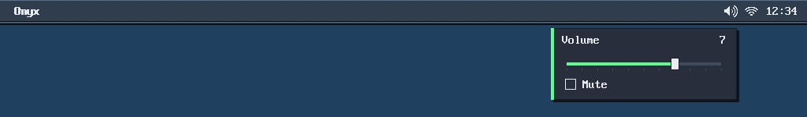
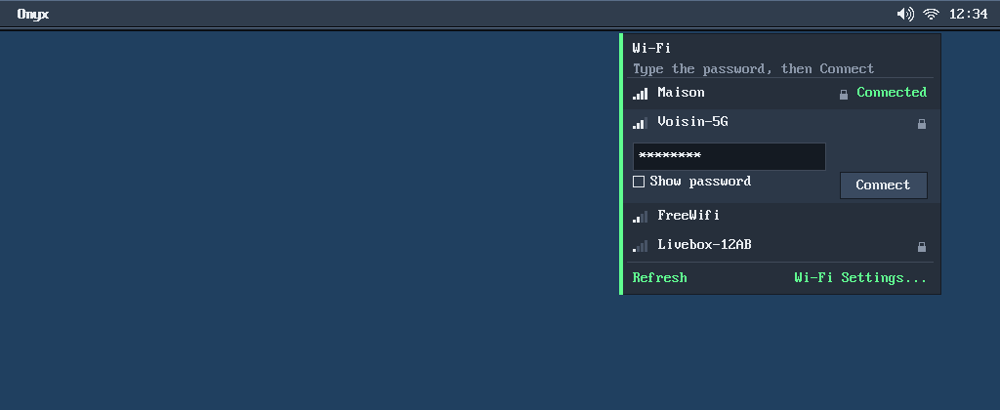
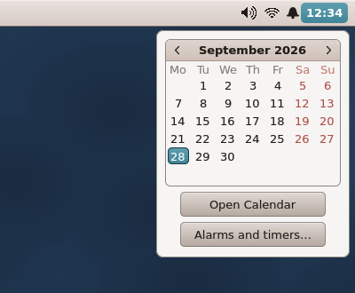
*The volume box, the Wi-Fi menu, the calendar of the month under the time.*

The active application is the frontmost decorated window; clicking the dock or the desktop
does not change it.

- **Click a menu title** to open its drop-down (the open title in the accent colour, the
  drop-down a light rounded panel); slide to another title to switch; click an item to run it
  (or press on a title and release on an item). Click the title again or anywhere else to close
  the menu.
- The first menu, **Onyx**, is always there: Terminal, **Control Panel**, File Viewer, Task
  Manager; then **the apps by category** — Productivity, Internet, Graphics, Games, Demos,
  **System** (the File Viewer, the Task Manager, the Terminal)
  (and any other category an app declares; the `category` of its `app.txt`, "Other"
  without one) — each opening a sub-menu of its apps, by their friendly name (the `name`
  of `app.txt`), where a click launches the app, or brings it to the front if it is already
  running; then **Open Windows** (a sub-menu of the open apps of this workspace: a click brings
  one to the front — minimised ones too); then **Shut Down…** (a dialog:
  **Restart**, **Shut Down** — the SD card is unmounted, then "It is now safe to turn off the
  Raspberry Pi" — or **Cancel**). The list follows the card: an app added meanwhile (QBasic's
  **Make App**) is there the next time the menu opens. Not listed: the desktop's own parts
  (`category = Shell`), the settings (`Settings`: they are the Control Panel's applets) and the
  emulators (`Emulators`: reached through the **Game Library**, which starts the right one for
  a game).
- The next menu (the app's name) always has **Quit** (**Ctrl-Q**), like the close box.
- Items show their **keyboard shortcut** on the right (e.g. `^O` = Ctrl-O); the shortcuts
  work whether the menu is open or not.
- **Clipboard**: one system clipboard shared by all apps — Edit ▸ Cut/Copy/Paste in Letters
  (on the selection), tinypad (Copy All / Paste) and the File Viewer (files and folders).
- **Notifications**: apps (and the system, e.g. "Network — Connected. IP address …") show
  a bubble in the top-right corner, below the bar; it fades in, stays about 4 s and fades
  out; a click dismisses it; several notifications are shown one after the other
  (`notifyd`, started by `autostart`).
- Windows open and are dragged **below** the bar, never under it; they open above the dock.

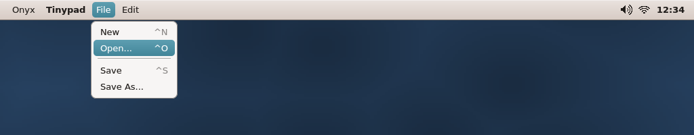
*The menu bar with tinypad active and its File menu open.*

Applications with menus: **tinypad** (File), **Letters** (File, Edit, View, Insert, Format, Table, Tools),
**Paint** (File, Edit, Image, Layers, Colours, Filters, View) and the **File Viewer** (File, Edit) — see §12.

### The dock (`dock`)

The **dock** — CDE's Front Panel, modernised — stands at the bottom of the screen, centred
(started by `autostart`); it stays above the windows, on every workspace, and a maximised window
ends above it. In its middle, the workspaces between the lock / gear (left) and power / clipboard (right) buttons; its other
buttons — the drawers, the launchers, the Trash, in this order — are shared **evenly on the two
sides** (the odd one out at the left): with the five drawers, the Terminal, the File Viewer and
the Trash, four on each side.

- **The drawers** — by default **Productivity**, **Internet**, **Graphics**, **Games** and
  **Demos**: each shows the icon of its group's **main app** (the Text Editor, Jet Browser, Paint,
  the Game Library, the Widget Showcase). **Click the icon** to start that app — or, if it runs,
  to bring it back to the front (a **minimised** one too). **Click the strip** on the dock's top
  edge above it to open the group's **drawer**: its apps with their icons, by name (in columns
  when there are many); click one to start it, or bring it back. Click the strip again, or
  anywhere else, to close the drawer. A **dot** under a launcher says one of its apps has a
  window on this workspace; in the drawer, a dot beside each running app. Files dropped on a
  launcher are opened by its app. (As Xfce's launchers.)
- **Terminal** and **File Viewer** (the launchers after the drawers): a click starts it, or
  brings it back if it runs (dot).
- **The Trash** (right end): drop items on it (from the File Viewer) to move them to the Trash
  (`SD:/.Trash`); **click it to open the Trash in the File Viewer**. A sheet of paper sticks out
  when it holds something.
- **The workspaces** (in the middle): a small square each (4 by default), the current one lit,
  its windows drawn small in it. Click one to show that workspace (see *Workspaces* below).
  Beside them: at the left the **lock** (the screen is locked: `lock` below) over the **gear** (the
  **Control Panel**, §11); at the right the red **power** button (**Shut Down…**) over the
  **clipboard** (its history, a widget at the bottom right of the screen: *The clipboard* below).

Rest the pointer on a launcher to see its name. **Right-click the dock**: **Panel Settings…** —
the Control Panel's **Panel** applet, where the drawers (their group and main app: add, remove,
reorder), the launchers after them and the workspaces (how many, their names) are set; kept in
`SD:/etc/dock.ini`. The dock's colour is the theme's.

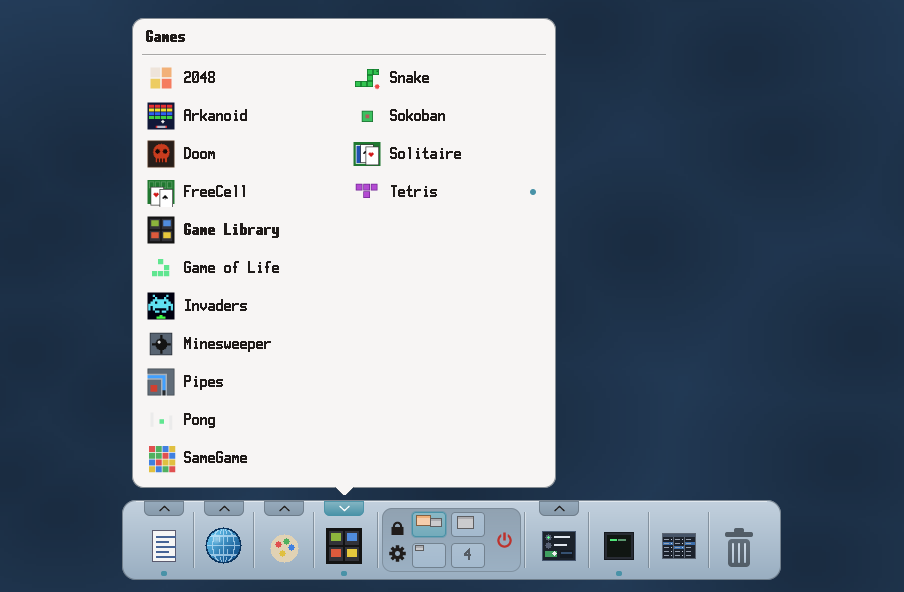
*The dock: four drawers, the middle (the four workspaces with their windows drawn small, the lock and
the gear at the left, the power button and the clipboard at the right), the Demos drawer, the Terminal, the File Viewer, the Trash — and the
Games drawer open (a dot: an app of it runs).*

### Workspaces (virtual desktops)

The desktop has **workspaces** (4 by default, 1 to 6: the Panel applet): each window belongs to
one, and only the current workspace's windows are shown and handled — listed in **Open
Windows**, brought back by the dock (an app whose window is on another workspace, started from
the dock, opens a new window here). A window opens on the current workspace.

- **Switch**: click a workspace's square in the dock, or **Ctrl+Alt+←** / **Ctrl+Alt+→** (the
  previous / next one). **Ctrl+Alt+Shift+←/→** takes the window in front along.
- **Move a window**: its **window menu** (the title bar's left button) ▸ **Move to** *workspace*,
  or **On All Workspaces** (then shown on every one; **On This Workspace Only** undoes it).
- The menu bar, the dock, the notifications and the desktop's widgets are on every workspace.

**The lock screen** (`lock`, the dock's padlock): the whole screen shows the time, the date and
the darkened wallpaper; a **click or a key** unlocks it — or, if `SD:/etc/lock.ini` sets a PIN
(`pin = 1234`), typing the PIN then **Enter** (Backspace erases; a wrong PIN is said so).

### The agenda widget (`agenda`)

The **next appointments**, straight on the wallpaper at the top left (started by `autostart`,
under every window) — no card: its text and an etched line are part of the desktop, the ink
chosen from the wallpaper under it (dark and engraved on a light wallpaper, white with a soft
shadow on a dark one). The appointments come from the **calendar** app (`agenda.txt`): today first (a
**Today** mark in the accent colour), then by date. It re-reads them every few seconds, so a
new appointment appears by itself. It also sends the calendar's **reminders** as notifications
when their time comes (`reminders.txt`), the calendar open or not. **Click** an appointment to open the calendar on that day; **drag
the title** to move it (its place is kept in `SD:/apps/agenda.app/config.ini`).

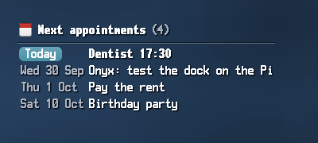
*The agenda widget on a dark wallpaper.*

### The clipboard (`clipd`, `clipboard`)

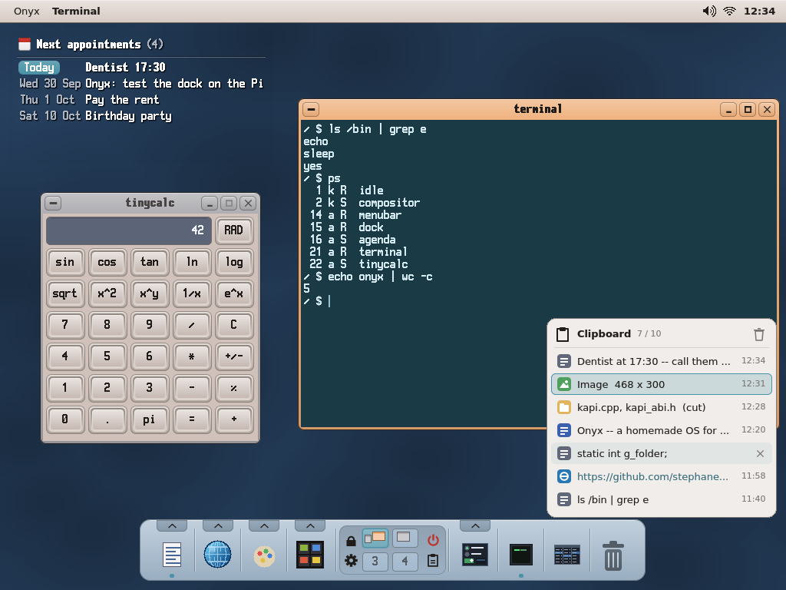
*The clipboard's widget, opened by the dock's clipboard button: the last copies, the image under the
cursor (Ctrl+V pastes it), the pointer over a row shows its × (delete).*

Every **Ctrl+C / Ctrl+X** (in any text field, the File Viewer, the BASIC programs...) goes to the
**shared clipboard**, which keeps the **last 10 copies** — text, images, files (copied or cut), links —
and shows a notification (*Text copied*, *Image copied*, *2 items cut*). **Ctrl+V** pastes the item under
its **cursor**: the newest copy, unless you moved the cursor; if that item does not suit the app (an
image under the cursor, Ctrl+V in a text field), the newest item that suits is pasted. The cursor stays
where it is after a paste (Ctrl+V again pastes the same).

The **clipboard button** of the dock (at the right of its middle, under the power button) opens the
**widget** at the bottom right of the screen, always above the dock: the items newest first — an icon of
their kind, a line of them (an image: its size), the time. **Click** an item: the cursor goes there.
Its **×** (the row under the pointer) or **Delete** deletes it; **Up / Down** move the cursor; the **bin**
empties the list; **Esc**, **Enter** or a click elsewhere closes the widget. The history is in memory
only: it is gone when the Pi restarts. (The service is `clipd`, started by `autostart`; the files
`RAM:/clip/*` are the copies on their way.)

### Drag & drop and file associations

Files are dragged with the **left button**: press on an item, move a few pixels — a label
follows the cursor. Hold **Ctrl** while dropping to **copy** instead of move (the label
shows a **+**); **Esc** cancels. Drop targets: File Viewer columns and folders (and its
sidebar's places), the dock's launchers (their app opens the files), the Trash, and document
apps (tinypad, Letters, paint, Cardfile open the dropped file; dropped text goes in at the caret).

**`SD:/etc/fileassoc.ini`** says which app opens which file type — one `extension = app`
per line (`txt = tinypad`, `png = imageview`, `docx = letters`, `card = cardfile`, `mp3` / `ogg` / `flac` / `wav` / `mid` / `m3u = media`, …): opening the file runs
`SD:apps/<app>.app/main <path>`. Used by the File Viewer (double-click) and the dock (files
dropped on a launcher). Folders open in the File Viewer, `.app` bundles and programs run. Files that need
a program to run are in **`SD:/etc/runners.ini`** (`extension = program`): `.bas` / `.bax`
run in the BASIC runtime — or an app says itself what it opens, in its `app.txt`: an emulator's
`games = Game Boy Color: gbc; Game Boy: gb` (`.gb` / `.gbc` in the Game Boy emulator), Doom's
`opens = wad`. Installing an emulator's package is then enough for its files to open.

**The packages keep it in step** (since 2026-10-05): each package says which files its apps open (and
which program runs which files: `SD:/etc/runners.ini`). Installing a package adds its lines to the two files;
removing it takes them away. **A line that is there already is never changed** — yours wins: change one
freely, or write `ext =` with nothing after it for "opened by nothing". `pkg assoc` makes the two files
follow the packages installed at once (the update service also does it when it starts).

### Launching, closing, switching

- **Launch**: from the dock (a drawer's main app or one of its apps, the Terminal, the File
  Viewer), the menu bar's **Onyx** menu, the terminal (`run <name>`) or the file manager.
- **Switch**: click a window; or the dock (a running app's launcher brings it back) or the
  menu bar's **Onyx ▸ Open Windows**; another workspace: the dock's squares, Ctrl+Alt+←/→.
- **Close**: the **×** button of the title bar, **Ctrl-Q**, the window menu's **Close**, or
  the task manager (`taskman`) / `kill`.

### The pointer's shapes

The pointer tells what a click or a drag would do where it is:

| Shape | Where |
|---|---|
| the **arrow** | everywhere else |
| a **hand** | a link: in a page of Jet, in a message of Mail |
| the **I bar** | text that can be typed or selected: a text field, Letters' page, a page's text in Jet |
| **four arrows** | a window dragged by its title bar; a chart in Sheet; a picture panned in Paint |
| **two arrows**, left and right or up and down | an edge that drags: a window's edge, a column's edge in a list or in Sheet, a row's edge, the bar between two panes |
| two arrows on a slant | a corner that sizes: a window's corner, an image in Letters, a chart in Sheet |
| a **thick cross** | Sheet's cells |
| a **thin cross** | Paint's picture; Sheet's fill handle |
| an hourglass, a barred circle | a page of Jet that asks for them (busy, not allowed) |

## 6. Working with windows

Each window has a **frame** in the theme's colour when it is in front (Peach by default), grey
behind; rounded corners, a light gradient, a thin dark outline (the theme can make it black or
remove it); no shadow. Its **title bar** holds:

- at the left, the **window menu** button (a bar): **Restore** / **Maximise**, **Minimise**,
  **Move to** *another workspace* / **On All Workspaces**, **Close** (Ctrl-Q) — greyed in the
  few apps that draw their whole window themselves (most games, the
  emulators: their other buttons work);
- at the right, **minimise** (a short line): the window disappears — bring it back from the dock
  (its app's launcher or drawer), the menu bar's **Onyx ▸ Open Windows**, or by starting the app
  again;
- **maximise** (a square): the window fills the screen between the menu bar and the dock; the
  button then shows two squares (**restore**: back to its size and place). A **double click**
  on the title bar does the same. For the apps whose content flows to any size — **tinypad**,
  **Letters**, the **RTF Reader**, **QBasic**, the **terminal** and the **Game Library**;
  greyed for the others, whose layout has a fixed size (a game's board, the calculator);
- **close** (×).

- **Move**: drag the **title bar**.
- **Resize**: drag an **edge** or a **corner** of the frame — the pointer shows two arrows there.
  An outline shows the size to be while you drag; the window takes it when you let go. Never
  smaller than a size the app sets, never under the menu bar. For the windows that can be
  maximised (the others keep their size: the pointer stays an arrow on their edges).
- **Foreground / focus**: click inside a window — it comes to the top and becomes
  *active* (its frame in the theme's colour; the others grey).
- **Borderless** windows (the menu bar, the dock, the agenda, notifications, popups) cannot be
  moved or closed with the mouse: they are managed by the desktop or close themselves.
- **Mouse**: left-click, right-click (depending on the app — e.g. flag in Minesweeper,
  eraser in Paint) and **drag** (paint, move, drag a slider).
## 7. The terminal and the shell

Launch **`terminal`** (the dock's Terminal button, or the menu bar's **Onyx ▸ Terminal**). It is a console where you type
commands, executed by **programs in `SD:/bin/`**.

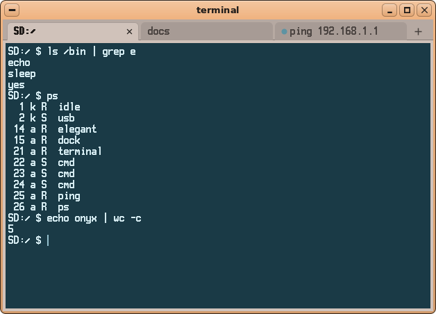
*The terminal: a pipe (`ls /bin | grep e`), `ps`, and `echo zircon | wc -c`.*

### The prompt and the current working directory

- The prompt shows the **current working directory** followed by `$` (e.g. `SD:/ $`). The
  terminal has a **current working directory (cwd)**; **relative** paths given to commands
  are resolved against it.
- Type a command then press **Enter**. **Page Up/Down** (and the wheel) scroll through the
  output (scrollback, 200 lines).

### Editing the line, and the history

The line can be corrected **before it is sent**, and the lines sent before come back:

| Key | Effect |
|---|---|
| **Left** / **Right** | move the cursor in the line; a character typed is **inserted** at the cursor. |
| **Home** / **End** (or `Ctrl-A` / `Ctrl-E`) | the cursor to the start / the end of the line. |
| **Backspace** / **Delete** | delete the character before the cursor / under it. |
| `Ctrl-U` / `Ctrl-K` | empty the line / cut it from the cursor to its end. |
| **Up** / **Down** | the **history**: the previous / the next line sent. A recalled line can be edited and sent again; **Down** past the newest one gives back the line that was being typed. |
| **Enter** | sends the line (wherever the cursor is). |
| `Ctrl-C` | **stops the running command** (and the script it belongs to); the line being typed is dropped. |
| `Ctrl-D` | ends the input of a program that reads the keyboard (`cat`, `ed`, `sort`…). |

The history holds the last lines sent (about a hundred: 4 KB of text; an empty line or the same
line twice in a row is not added). Each terminal window — and each remote session (`telnetd`) —
has its own; it is not kept when the window closes. What is typed to a program (`ed`, `ftp`…) is
in it too. A line longer than the window wraps onto the next rows and is edited the same way.

### Built-in commands (builtins)

A few commands are executed by the shell **itself** (they change its own state),
not by a program in `/bin`:

| Command | Effect |
|---|---|
| `cd [path]` | changes the current working directory (no argument: `SD:/`). The cwd is **inherited** by commands launched afterwards. |
| `pwd` | prints the current working directory. |
| `clear` | clears the screen (empties the scrollback). |
| `exit [code]` | ends the shell (the terminal closes; a script stops there), with that exit code. |
| `source <script> [args]` (or `. <script>`) | runs a script's lines **in this shell**: its `cd` and its variables stay (see *Scripts*). |
| `echo [-n] <text…>` | writes its arguments (`-n`: without the final newline). |
| `test <expression>` (or `[ <expression> ]`) | a condition: exit code 0 when it is true (see *Scripts*). |
| `read [name]` | waits for a line typed and puts it in the variable (without a name: a pause until Enter). |
| `set` · `unset <name>…` | lists the variables · removes some. |
| `shift [n]` | drops the script's first argument(s): `$2` becomes `$1`… |
| `true` · `false` | exit code 0 · 1. |

### Launching a program

Any other command `xxx` is resolved to **`SD:/bin/xxx`** and executed as a
process; its **arguments**, if any, follow the name (`grep pattern`, `cp a b`). A command
that cannot be found prints `xxx: command not found`. To launch a **graphical application**
from the terminal, use `run <name>` (see §8).

### Pipes and redirections

The terminal composes commands in the Unix style:

| Syntax | Effect |
|---|---|
| `a \| b \| c` | **pipe**: the `stdout` of each stage feeds the `stdin` of the next (up to 6 stages). |
| `cmd > file` | redirects the `stdout` of the **last** stage to `file` (created / **overwritten**). |
| `cmd >> file` | same, but **appends** to the end of `file`. |
| `cmd < file` | the input (`stdin`) of the **first** stage comes from `file`. |

### Several commands on a line, exit codes

| Syntax | Effect |
|---|---|
| `a ; b` | runs `a`, then `b`. |
| `a && b` | runs `b` **only if `a` succeeded** (its exit code is 0). |
| `a \|\| b` | runs `b` **only if `a` failed** (its exit code is not 0). |
| `# text` | a **comment**: from a `#` at the start of a word to the end of the line. |

Every program ends with an **exit code**: 0 when all went well, another number otherwise (`grep`:
1 when no line matched; a command not found: 127; a command stopped by Ctrl-C: 130). `$?` is the
exit code of the last command (`grep -q todo notes.txt ; echo $?`). A pipeline's code is its last
stage's.

```sh
mkdir RAM:/tmp ; cd RAM:/tmp                 # two commands
grep -q error log.txt && echo "errors found" # only when grep found a line
cp a.txt b.txt || echo "the copy failed"
```

### Quotes and escapes

Blanks separate the arguments, `|`, `<`, `>` are the pipe and the redirections, `;`, `&&`, `||`
separate commands, `#` starts a comment, `$` is replaced (see *Scripts*) and a word with `*` or
`?` is a **file pattern** (below) — unless they are **quoted**:

| Syntax | Effect |
|---|---|
| `"text"` | one argument, exactly `text`: blanks, `\|`, `<`, `>`, `>>` and `'` are ordinary characters inside. `\"` is a literal `"`, `\\` a literal `\`; any other backslash stays as it is (`"a\nb"` reaches the program as `a\nb`). |
| `'text'` | one argument, exactly `text`, with **no** escape at all (a `'` cannot appear inside: use double quotes for it). |
| `\x` (outside quotes) | a literal `x`, for `x` one of `"` `'` `\` `<` `>` `\|` `;` `&` `#` `*` `?` or a blank (`my\ file.txt`). A backslash before any other character stays (`SD:\dir` is unchanged). `\$` is a literal `$` (see *Scripts*). |

Quoted parts join the unquoted text next to them into one word (`ab"c d"'e'` is the single
argument `abc de`); quotes can also hold a redirection's file name (`> "my notes.txt"`). An
empty argument (`""`) is dropped. A quote left open prints `cmd: unterminated " quote` and runs
nothing; so do the other syntax errors (`ls |`, `> ` with no file name, more than 6 stages).

```sh
jsc -e "print(1 + 2)"                                   # jsc gets two arguments: -e and print(1 + 2)
jsc -e "let a = []; for (let i = 0; i < 3e5; i++) a.push({i}); print(a.length)"
jsc -e "print([1, 2].map(x => x * 2))"                  # => inside quotes: not a redirection
jsc -e 'print("hello" + " | " + "world")'
cd "SD:/My Documents"
cat "my file.txt" > "a copy.txt"
grep "two words" < notes.txt
```

A command line holds up to **2047 characters** (the terminal and `telnetd` accept that much).
Each program receives its arguments **exactly as split by the shell** (its argv, `get_argv`).
Programs that read the older single-string form (`get_args`, most `/bin` tools) get the words
joined by blanks, a word containing a blank in double quotes, up to 1023 characters.

**Path resolution.** Redirection files are resolved by the kernel **against the
current working directory**: a relative path (`notes.txt`) targets `<cwd>/notes.txt`, an
absolute path (`SD:/notes.txt`) is taken as-is.

**Default input and output.** Without `<`, the **first** stage reads what you **type**:
each line confirmed with Enter is sent to its `stdin`, and **`Ctrl-D`** signals end of
input (EOF); **`Ctrl-C`** stops the whole pipeline. Without `>`, the **last** stage displays its
output in the scrollback.

Examples (with the cwd being `SD:/` here):

```sh
pwd                     # prints: SD:/
cd apps                 # changes the current working directory (-> SD:/apps)
ls                      # list the current working directory
ls /bin | grep e        # keep only the tools whose name contains "e"
cat SD:/notes.txt       # display a file
echo bonjour > a.txt    # write "bonjour" to <cwd>/a.txt
echo encore  >> a.txt   # append a line to a.txt
cat a.txt | wc          # count lines / words / bytes
grep pi < a.txt         # read a.txt, print only the lines containing "pi"
ps                      # list the processes
run mandelbrot          # launch a graphical application
```

### File patterns

A word holding `*` (any characters) or `?` (one character) outside quotes is replaced by the
**names that match** in the folder, sorted — upper and lower case alike, as the card's names:

```sh
ls *.txt                  # the text files of the current folder
cat SD:/docs/chap?.md > book.md
wc -l *.c | tail -n 1
grep -n TODO SD:/notes/*.txt
```

Only the last part of a path may hold a pattern (`SD:/docs/*.md`, not `SD:/*/a.md`). When no name
matches, the word stays as written (`find . -name *.zip` still works when the folder has no
`.zip`; quote the pattern — `"*.zip"` — to be sure the tool gets it).

### Scripts

A **script** is a text file of command lines, run one after the other — exactly what you would
type (pipes, redirections, `;` `&&` `||`, comments). Write it with `ed` (§8), the text editor
(`run tinypad`) or on the PC. Three ways to run it:

| Command | Effect |
|---|---|
| `report.sh [args]` | a command word ending with **`.sh`** is a script: looked for in the **current folder**, then in **`SD:/bin`** (a path works too: `SD:/scripts/report.sh`). It runs in a shell of its own: its `cd` does not change yours. Usable in a pipe (`report.sh \| grep total > out.txt`). |
| `cmd <file> [args]` | the same for a file of any name. `cmd -c "line"` runs one command line. |
| `source <file> [args]` | runs it **inside the current shell**: its `cd` stays when it ends. |

The programs a script starts read the **keyboard** as usual; **Ctrl-C** stops the running
program **and the rest of the script** (a loop too). `exit [code]` ends the script there, with
that exit code (without it: the last command's). A line is at most 2047 characters.

**Variables and what replaces a `$`** (in a script and on any command line):

| Syntax | Meaning |
|---|---|
| `name=value` | sets a **variable** (no blank around `=`; the value is the rest of the line: `msg=hello world`, `n=5`, `dir="SD:/My Files"`). The programs and scripts started afterwards receive the variables (their environment). |
| `$name` or `${name}` | its value (nothing when it is not set). `set` lists them: `HOME`, `PATH`… are there from the start. |
| `$1` … `$9` | the script's arguments (nothing when there are fewer); `$0` is the script's name; `shift` drops the first. |
| `$#` · `$*` | how many arguments · all of them, separated by a blank. |
| `$?` | the exit code of the last command. |
| `$(command)` | **what the command prints** (its final line feeds removed): `today=$(date +%F)`, `n=$(wc -l < notes.txt)`. |
| `$((expression))` | **arithmetic** on whole numbers: `+ - * / %`, parentheses, the comparisons `== != < <= > >=` (1 or 0), `&& \|\| !`, the bit operators `& \| ^ ~ << >>`; a name in it is a variable (`i=$((i + 1))`). |

Nothing is replaced inside `'…'`. Inside `"…"` it is, and the result stays **one word**: write
`"$1"`, `"$name"` when the value may hold blanks. Outside quotes a value's blanks separate words
(`for w in $list`). `\$` is a plain `$`; a `$` followed by anything else is left alone
(`grep "end$"`).

**Conditions.** `if`, `while` and `until` run a command and look at its **exit code**: any
command will do (`if grep -q todo notes.txt`), and `test` — also written `[ … ]`, with blanks
around the brackets — compares:

| Test | True when |
|---|---|
| `[ -e path ]` · `[ -f path ]` · `[ -d path ]` | it exists · it is a file · it is a folder. |
| `[ -z "$a" ]` · `[ -n "$a" ]` | the text is empty · it is not. |
| `[ "$a" = "$b" ]` · `[ "$a" != "$b" ]` | the same text · not the same. |
| `[ $a -eq $b ]` · `-ne` · `-lt` · `-le` · `-gt` · `-ge` | numbers: equal · not equal · less · less or equal · greater · greater or equal. |
| `[ ! … ]` · `[ … -a … ]` · `[ … -o … ]` | not · and · or. `! command` inverts any command's exit code. |

**Blocks.** Each keyword starts its own line (`; then` and `; do` may end an `if` / `while` /
`for` line, as in a Unix shell; they are optional):

| Block | Effect |
|---|---|
| `if <command>` … `elif <command>` … `else` … `fi` | runs the lines after the first command that succeeds, or those after `else`. |
| `while <command>` … `done` | runs the lines **as long as** the command succeeds. `until`: as long as it fails. |
| `for name in words` … `done` | runs the lines **once per word**, the variable holding it — the words after `$` and file patterns: `for f in *.txt`, `for a in $*`, `for x in $(cat list.txt)`. |
| `break` · `continue` | leave the loop · go to its next turn. |

Blocks nest, and work at the prompt too: the shell shows `> ` until the block's `fi` / `done`,
then runs it.

```sh
# SD:/bin/report.sh -- report.sh <folder>: its text files, their sizes in lines, the longest
if [ $# -lt 1 ]
  echo "usage: report.sh <folder>"
  exit 2
fi
if [ ! -d "$1" ]
  echo "$1: no such folder" ; exit 1
fi

total=0 ; longest=0 ; name=none ; count=0
for f in $1/*.txt
  if [ ! -f $f ]            # (no .txt there: the pattern stayed as written)
    continue
  fi
  lines=$(wc -l < $f)
  total=$((total + lines))
  count=$((count + 1))
  if [ $lines -gt $longest ]
    longest=$lines
    name=$f
  fi
done
echo "$count text files, $total lines; the longest: $name ($longest lines)"

i=3                         # a counted loop
while [ $i -gt 0 ]
  echo "again in $i..." ; sleep 1
  i=$((i - 1))
done

echo -n "keep the report? (y/n) "
read answer
if [ "$answer" = y ]
  echo "$count files, $total lines" > RAM:/report.txt
  echo "saved in RAM:/report.txt, $(date +%H:%M)"
fi
```

**Coming from DOS `.bat` files:**

| `.bat` | Here |
|---|---|
| `rem text` · `echo off` | `# text` · not needed (commands are not echoed). |
| `set name=value` · `%name%` · `%1` · `shift` | `name=value` · `$name` · `$1` · `shift`. |
| `set /a n=n+1` | `n=$((n + 1))`. |
| `set /p name=Question` · `pause` | `echo -n "Question "` then `read name` · `read`. |
| `if exist file …` · `if not exist` | `if [ -e file ]` · `if [ ! -e file ]`. |
| `if "%a%"=="x" … else …` | `if [ "$a" = x ]` … `else` … `fi`. |
| `if errorlevel 1 …` · `%errorlevel%` | `if [ $? -ge 1 ]` (or `command \|\| …`) · `$?`. |
| `for %%f in (*.txt) do …` | `for f in *.txt` … `done`. |
| `for /l %%i in (1,1,10) do …` | `i=1` · `while [ $i -le 10 ]` … `i=$((i + 1))` · `done`. |
| `goto label` loops | `while` / `until`, `break`, `continue`. |
| `call other.bat` | `other.sh args` (a shell of its own) or `source other.sh` (this one). |
| `exit /b 2` | `exit 2`. |

Not there: functions, `case`, arrays, `<<` here-documents, a block's output piped or redirected
as a whole (`done > file`), running a command in the background.

`SD:/etc/autostart` is **not** such a script: `init` runs its lines itself, without waiting
for each (to run a script at boot, put `cmd SD:/bin/mine.sh` there).

**Under the hood.** The shell (`/bin/cmd`, which the terminal runs) splits the line into
commands (`;` `&&` `||`), replaces what starts with `$`, then splits each command into
words and stages (quotes and escapes applied, file patterns replaced, `|` outside quotes), creates a memory pipe
(`pipe`) between each stage — and a file stream for `<`/`>` —, then launches (`spawn_ex`) each
`SD:/bin/<cmd>` with its argument list and its (`stdin`, `stdout`) pair. The stages run **concurrently**
(cooperatively); the terminal continuously drains the final output pipe (non-blocking
read) and displays it, then waits for each process to finish. The details of streams and
the process model are in
[Kernel internals §9](02-KERNEL-INTERNALS.md#9-stream--stdio-subsystem).

## 8. The `/bin` tools

Command-line programs shipped in `SD:/bin/`, executed by the terminal and
**composable** via pipes (§7). The **relative** paths they receive are resolved against
the terminal's **current working directory**.

**Files and directories**

| Tool | Usage | Description |
|---|---|---|
| `ls` | `ls [-l] [path…]` | Lists a folder (default: the **current working directory**): one entry per line, folders with a trailing `/`. A **file** is listed by its name, so a pattern works (`ls *.txt`); `-l` puts each entry's size in bytes before it. Several paths: the files, then each folder under a `name:` line. |
| `cat` | `cat [-n] [file…]` | Prints the file(s) to `stdout` (`cat *.txt > all.txt`); **with no argument**, copies `stdin`→`stdout` (useful at the end of a pipe). `-n` numbers the lines. |
| `cp` | `cp <src> <dst>` | Copies a file (by stream: any size). |
| `mv` | `mv <src> <dst>` | Renames / moves a file or folder (same volume). |
| `rm` | `rm <path…>` | Deletes files (or **empty** folders); accepts multiple paths. |
| `mkdir` | `mkdir <path…>` | Creates one or more directories. |
| `touch` | `touch <path…>` | Creates **empty** files if they do not exist (no timestamp). |
| `uname` | `uname [-a] [-s] [-n] [-r] [-v] [-m] [-p]` | **What system this is**: `-s` its name (Onyx, the default), `-n` the host name, `-r` the kernel's release (its kapi version: `kapi 79`), `-v` the kernel's build (the git revision — `+` when built from changed sources — and the date of the image), `-m` the machine (`aarch64`), `-p` the system package installed (`onyx 2026.10.36`), `-a` all of them and the board with its memory. A kernel copied onto the card by hand shows in `-v` (its date) while `-p` still says the package's version. |
| `find` | `find [folder…] [-name PATTERN] [-type f\|d] [-maxdepth N]` | **Walks a folder and its sub-folders** (default: the current one) and prints each entry's path. `-name "*.txt"`: only the entries whose name matches (`*` any characters, `?` one; upper / lower case alike — quote the pattern); `-type f` files only, `-type d` folders only; `-maxdepth N` no deeper than N levels. `find SD:/docs -name "*.md"`, `find . -type d`. |
| `df` | `df [volume…]` | The volumes' room: for each (default: `SD:`, `SD1:`…`SD3:` when present, `RAM:`) its type (`FAT32`, `exFAT`, `RAM`), size, used and free space; for `RAM:` (the volume in memory, §2) its files and folders too. The first `df` of a big card can take a moment (its free space is counted once). |

**Archives** (ZIP; the Archiver's engine, §9)

| Tool | Usage | Description |
|---|---|---|
| `zip` | `zip [-r] [-0..-9] [-j] [-k] [-q] [-p FOLDER] <archive> <path…>` | Makes a `.zip`, or adds to one (a name it has is **replaced**; `-k` keeps the old one). `-r` takes the folders with what they hold (without it, only the folder's own entry); `-0` stores, `-1` fastest .. `-9` best (default `-6`; png, jpg, zip... are always stored); `-j` the files alone, no folders; `-p docs/images` puts them in that folder of the archive. A **relative** path is stored as given (`zip -r app.zip myapp/res` → `myapp/res/...`), a path with its **volume** from its last part (`zip -r foo.zip SD:/apps/foo.app` → `foo.app/...`). The archive is written as a new copy, then swapped in. |
| `zip -d` | `zip -d <archive> <name…>` | Deletes entries: a name, a pattern (`*` `?`, quote it: `"*.bak"`) or a folder (everything under it). |
| `unzip` | `unzip [-o\|-n] [-j] [-q] [-d DIR] [-P PASSWORD] <archive> [name…] [-x name…]` | Extracts (default: into the current folder; `-d` another, made if needed), **keeping the archive's folders** (`-j`: all the files side by side). Names: a name, a pattern or a folder; `-x` leaves those out. A file that exists is asked about — `[y]es`, `[n]o`, `[A]ll`, `[N]one`, `[r]ename` (keeps both: `name (2).txt`) —, unless `-o` (replace) or `-n` (never). `-P`: the password of a ZipCrypto archive. |
| `unzip -l / -v / -t / -p` | `unzip -l <archive> [name…]` | `-l` lists (length, date, name), `-v` with the method, the packed size, the ratio and the CRC; `-t` tests (every file decompressed, its CRC checked); `-p` writes the files to the output (`unzip -p a.zip notes.txt \| grep todo`). |

Exit codes (for scripts and packages): `0` all right, `1` a warning (files skipped, nothing to do),
`2` an error (a damaged archive, a file that cannot be written), `3` a bad command line.

**Packages** (the system and the apps installed, updated and removed from the repository: docs/pkg/README.md)

| Tool | Usage | Description |
|---|---|---|
| `pkg list` | `pkg list [-a] [filter]` | The packages installed: version, updates mode (`manual`, `auto`, `never`), an update available, *staged: restart to finish*. `-a`: every package of the repository (`-` not installed, `installed`, `update`). |
| `pkg info` | `pkg info <name>` | A package: its summary, category, versions (the repository's, the installed one), size, needs, mode. |
| `pkg add` | `pkg add <name…>` / `pkg add <file.opk>` | Installs (the packages it needs first). Already installed: says so, does nothing. A `.opk` file installs a package that is not in the repository. |
| `pkg delete` | `pkg delete [-p] <name…>` | Removes its files and its empty folders; a setting you changed is kept (`-p`: removed too). Not installed: says so. Refused for the system (`onyx`, `pi-firmware`), for a package another one needs, for an app that is running. |
| `pkg update` | `pkg update <name…>` / `pkg update -a` | Updates those packages; `-a` every package with an update (not those set `never`). |
| `pkg upgrade` | `pkg upgrade` | One round of the update daemon: the packages set `auto` updated, the others listed. |
| `pkg check` | `pkg check` | Reads the index again: the updates available. |
| `pkg mode` | `pkg mode <name> manual\|auto\|never` | How the package is updated: asked (`manual`, the default), in the background (`auto`), never. |
| `pkg commit` | `pkg commit` | Moves in the packages staged for the next boot (run by `etc/autostart`, before the desktop); restarts when the kernel or the firmware changed. |

`-r <repository>` before the command uses another repository for once (a URL or a folder: `pkg -r
SD:/myrepo add tetris`). The repository and its key: `SD:/etc/pkg/pkg.ini` (`repo =`, `key =`). Each
package's **SHA-256** is checked against the repository's **signed index** before anything is written;
the system and the firmware are **staged** and moved in at the next boot. A setting file you changed
(`etc/*`, an app's `config.ini`) is never overwritten: the new one is written beside it as `<name>.new`.
Exit codes: `0` done, `1` nothing to do, `2` an error, `3` a bad command line.

All of these work on **`RAM:`** (the volume in memory, §2) as on the card: `ls RAM:`, `cd RAM:/tmp`,
`cp SD:/doc.txt RAM:/doc.txt`, `rm RAM:/doc.txt`, `cat RAM:/log`, `echo hi > RAM:/log`.

**Text and streams** — filters: they read the files named, or `stdin` when there is none (so they
chain with `|`), and write to `stdout`.

| Tool | Usage | Description |
|---|---|---|
| `echo` | `echo [-n] <text…>` | Writes its arguments, separated by a blank, followed by a newline (`-n`: none). The shell does it itself (a builtin, §7); `/bin/echo` is the same, for the other programs. |
| `cat` | `cat [file…]` | (above) prints files; with no argument copies `stdin`. |
| `head` | `head [-n N \| -N] [-c N] [file…]` | The **first 10 lines** (or N: `head -n 3`, `head -3`); `-c N` the first N bytes. Several files: a `==> name <==` line before each. |
| `tail` | `tail [-n N \| -N \| -n +N] [-c N] [-f] [file]` | The **last 10 lines** (or N); `-n +N` from line N to the end; `-c N` the last N bytes. **`-f`** then keeps printing what is **added to the file** (a log being written) until **Ctrl-C**. |
| `grep` | `grep [-i] [-v] [-n] [-c] [-q] [-F] <pattern> [file…]` | Prints the **lines that match** the pattern, a *regular expression* (below); `-F`: a plain text. `-i` ignores case, `-v` keeps the lines that do **not** match, `-n` numbers them, `-c` only counts them, `-q` prints nothing (the exit code says it). Several files: each line preceded by its file's name. Exit code 0 a line matched, 1 none, 2 an error. |
| `sed` | `sed [-n] [-i] [-e script]… [script] [file…]` | The **stream editor**: applies a script to each line. Commands, separated by `;`: `s/re/new/flags` substitutes (flags `g` every match, a number N the Nth, `p` print if changed, `i` ignore case; `&` = the match, `\1`…`\9` = the groups, `\n` a line feed; another delimiter than `/` may be used: `s,/bin,/usr,`), `d` deletes the line, `p` prints it, `q` quits, `=` prints its number, `y/abc/xyz/` replaces characters, `a text` / `i text` / `c text` add a line after / insert one before / replace. Before a command, the lines it applies to: `N` (line N), `$` (the last), `/re/` (the lines matching), `first,last` (a range), then `!` for all the others. `-n`: print only what `p` asks; `-i`: **rewrite the files in place**. `sed 's/colour/color/g' a.txt`, `sed -n '10,20p' log`, `sed -i '/^#/d' conf`, `sed '$!d'`. Not there: the hold space, `{ }` blocks, branches. |
| `ed` | `ed [-p prompt] [file]` | The **line editor**: edits a text file from the console (below). |
| `sort` | `sort [-r] [-n] [-f] [-u] [file…]` | Sorts the lines: `-r` in reverse, `-n` by the number at the start of each line, `-f` ignoring case, `-u` equal lines once. Several files are sorted together. |
| `uniq` | `uniq [-c] [-d] [-u] [-i] [file]` | Drops the **repeated lines that follow each other** (`sort` first to drop them all): `-c` each preceded by its count, `-d` only the repeated ones, `-u` only those not repeated, `-i` ignoring case. `sort names \| uniq -c \| sort -n -r`. |
| `cut` | `cut -f LIST [-d C] [-s] [file…]`, `cut -c LIST [file…]` | Keeps some **columns**: `-f` fields separated by a tab (`-d C`: by the character C; a line without it is printed whole, or dropped with `-s`), `-c` characters. LIST: `2`, `1,3`, `2-4`, `3-`, `-2`. `cut -d : -f 1`, `cut -c 1-20`. |
| `tr` | `tr <set1> <set2>`, `tr -d <set1>`, `tr -s <set1>` | Translates the **characters** of `stdin`: each of set1 replaced by its match in set2; `-d` deletes them; `-s` squeezes runs of the same one. Sets hold characters, ranges (`a-z`) and `\n` `\t` `\r` `\\`. `tr a-z A-Z`, `tr -d '\r'`, `tr -s ' '`. |
| `wc` | `wc [-l] [-w] [-c] [file…]` | Counts **lines, words and bytes** (`-l`, `-w`, `-c`: only those). Several files: one line each and a `total`. |
| `nl` | `nl [-b a] [file…]` | **Numbers the lines** (the empty ones too with `-b a`). |
| `tee` | `tee [-a] <file…>` | Copies `stdin` to `stdout` **and** into the files (`-a`: added at their end): keeps what a pipeline shows. `ls \| tee list.txt \| wc -l`. |
| `diff` | `diff [-q] <file1> <file2>` | **Compares two text files** line by line: `3c3` (line 3 changed), `5a6,7` (lines added after 5), `8,9d7` (lines deleted), the lines of file1 after `<`, those of file2 after `>`. Nothing printed: the same. `-q` only says whether they differ. Exit code 0 the same, 1 different, 2 an error. |
| `hexdump` | `hexdump [-s OFFSET] [-n COUNT] [file]` | The **bytes** of a file: the offset, 16 bytes in hexadecimal, the same as text. `-s` skips bytes first, `-n` stops after COUNT. |
| `page` | `page` | Copies `stdin`→`stdout` (the actual paging is the terminal's scrollback via Page Up/Down); handy as the end of a pipe. |
| `date` | `date [+FORMAT]` | The **date and time** (`2026-10-04 21:47:03`). In FORMAT: `%Y` `%m` `%d` `%H` `%M` `%S`, `%y`, `%F` (= `%Y-%m-%d`), `%T` (= `%H:%M:%S`), `%n`, `%%`. `date +%H:%M`. |
| `sleep` | `sleep <seconds>` | Waits (`sleep 0.5` works): a pause in a script. |

**Regular expressions** (`grep`, `sed`, `ed`): `c` that character · `.` any character · `[abc]`
`[a-z]` `[^0-9]` one of / a range / none of · `x*` x zero or more times, `x\+` one or more, `x\?`
zero or one (x: a character, `.` or a `[set]`) · `^` the start of the line, `$` its end ·
`\(…\)` a group, reused as `\1`…`\9` · `\.` `\*` `\[` `\\` `\/` those characters themselves, `\t` a
tab. No alternation (`|`), no repeated group. Quote a pattern in `'…'` so that the shell leaves
it alone: `grep '^[A-Z].*\.$' notes.txt`.

**`ed`, the line editor.** `ed notes.txt` reads the file (it prints its size) and waits for
commands, one a line; nothing is written until `w`. The text is a list of numbered lines, one of
them the *current line*. A command is `[lines]letter`: lines are `N`, `.` (the current one), `$`
(the last), `+N` / `-N`, `/re/` (the next line matching) or `?re?` (the previous one), and a pair
`first,last` — `,` alone is the whole text.

| Command | Effect |
|---|---|
| `,p` · `3,8n` · `5` | print the whole text · lines 3 to 8 with their numbers · go to line 5 and print it (an empty line: the next one). |
| `a` · `i` · `c` | **add** lines after the current one · **insert** before it · **change** it (or a range): type the lines, then a line holding only **`.`** ends the input. `0a` adds at the top, `$a` at the end. |
| `d` · `j` | delete the line(s) · join them into one. |
| `s/re/new/` | substitute on the line(s) (`g` every match, `p` print the result): `,s/teh/the/g`. `&` and `\1` as in `sed`. |
| `m N` · `t N` | move · copy the line(s) after line N. |
| `g/re/command` · `v/re/command` | run the command on every line matching · not matching: `g/TODO/p`, `g/^#/d`. |
| `u` | **undo** the last change (again: redo). |
| `w [file]` · `r file` · `e file` · `f` | write · read a file in after the current line · edit another file · the file's name. |
| `q` · `Q` · `wq` | quit (after a change `q` answers `?` once: `q` again quits without saving) · quit at once · write and quit. |
| `h` · `H` | explain the last `?` · explain every error from now on. |

An error prints `?`. `ed -p '*' file` shows a `*` when it waits for a command. A script can drive
it: `ed notes.txt < edits.txt`.

**Processes, launching, keyboard**

| Tool | Usage | Description |
|---|---|---|
| `ps` | `ps` | Lists the processes in columns `PID  K  S  PAGES  MEM  SYSC/s  NAME` (SYSC/s: the app's system calls per second) — `K`: `a` (app) / `k` (kernel); `S`: `R` (ready), `S` (sleeping), `B` (blocked), `N` (new); `PAGES` = 64 KB frames owned by the app, `MEM` = that in KB. A program's code and constants are not in it: they are in memory once, shared by all its processes (`preload` lists them). |
| `preload` | `preload <program>…`, `preload /boot`, `preload` | **Loads programs ahead and keeps them in memory**: a preloaded program starts **without reading the card** (its code is mapped, shared by all its processes) and stays in memory when none runs. `<program>` is a path (`SD:/bin/jsc`; relative to the current folder), or a bare name: the app of that name (`apps/<name>.app/main`) if there is one, else the `/bin` tool. It returns at once — the load runs in the background (a start meanwhile waits for it); the memory is taken until `unload` or the next restart. With no argument: **lists the program images in memory** — every running program (shared by its processes) and the kept ones: size in KB, `uses` (processes running it), `state` (`loading` / `ready`), `kept` (`yes`: preloaded; `no`: freed when its last process ends; `gone`: unloaded or its file replaced — only its running processes still use it), and its path (lower case: the image's key; a **shared library** — `SD:/lib/<name>.so`, which `preload` keeps as it keeps a program — is marked `(library)`). **At every boot: `preload /boot`**, the last line of `SD:/etc/autostart`, loads the programs listed in **`SD:/etc/preload.ini`** (one a line — a path, an app's name or a tool's; `#` or `;` starts a comment) — the list the Control Panel's **Preload** applet edits (§11); an empty or missing file: nothing. (A card set up before this option: add that line at the end of its `autostart`; `preload <program>` lines there still work.) A program whose file is replaced, renamed or removed loses its image by itself; `pkg` preloads the new one again. |
| `unload` | `unload <program>…` | **Releases a program's image** (see `preload`; the same names): its next start reads the file again; the processes running it go on, and its memory is freed when the last of them ends (at once if none runs). |
| `kill` | `kill <pid> [--force\|-f]` | Terminates a process by **PID** (seen with `ps`). By default: **clean** shutdown (the app terminates itself); `--force`/`-f`: **immediate** stop. Kernel tasks and the terminal itself are protected. |
| `run` | `run <app\|path> [args]` | Launches an **application**: `run mandelbrot` = `SD:apps/mandelbrot.app/main`; a name containing `/` is taken as an explicit **ELF path**; the following arguments are passed as `argv` (e.g. `run tinypad SD:/notes.txt`). |
| `keyb` | `keyb [XX]` | With no argument: shows the current layout + the list. `keyb FR`: switches to the layout (US, UK, DE, FR, BE, ES, IT, DV). |
| `cmd` | `cmd`, `cmd <script> [args]`, `cmd -c "line"` | **The shell itself**, an ordinary `/bin` program: reads command lines from `stdin` (up to 2047 characters), runs their commands (`;`, `&&`, `\|\|`; variables, `if` / `while` / `for`: the script language of §7), builds the pipelines (`\|`, `<`, `>`, `>>`; `"…"`, `'…'` and `\` quote), spawns `/bin/<cmd>` for each stage with its exact argument list; builtins `cd`, `pwd`, `clear`, `exit`, `source`, `test`, `echo`, `read`, `set`, `unset`, `shift` (§7). With a file: **runs that script** and ends with its exit code (§7 *Scripts*); `-c`: one line. The terminal runs it; `telnetd` serves it over the network. |
| `init` | (started by the kernel) | The **first program** at boot (`cmdline.txt` `init=`, §3): runs each line of `SD:/etc/autostart` as a shell command (`run <app>`, a `/bin` tool; `sleep <s>`; `wait <command>`: waits for its end — `wait pkg commit`, the packages staged for this boot), then exits. Not meant to be run by hand. |
| `pkg` | `pkg list [-a] [filter]`, `pkg info <name>`, `pkg add <name\|file.opk>…`, `pkg delete [-p] <name>…`, `pkg update <name>…\|-a`, `pkg upgrade`, `pkg check`, `pkg assoc`, `pkg mode <name> manual\|auto\|never`, `pkg commit`; `-r <repo>` | **The packages from the shell** — the Package Manager's engine (§11, `docs/pkg/README.md`): lists, installs (with what a package needs), removes, updates from the signed repository; `commit` moves the staged packages in (at boot, from `SD:/etc/autostart`) and reboots when the kernel or the firmware changed. Exit code 0 done, 1 nothing to do, 2 an error, 3 a bad command line. **`pkg assoc`**: `SD:/etc/fileassoc.ini` and `runners.ini` made to follow what the installed packages say they open and run (the lines you changed are left alone). |

**Networking and logs**

| Tool | Usage | Description |
|---|---|---|
| `net` | `net` | Shows the WLAN link status and the IPv4 address (or "link down" if Wi-Fi has not associated — check the firmware and `wpa_supplicant.conf`). |
| `ping` | `ping <host> [count]` | Sends ICMP echo requests (default 4, one per second, 2 s timeout) to a name or an IP and prints each round-trip time, then the loss and min / avg / max statistics. (Onyx itself also answers pings.) |
| `basic` | `basic [-m] [-p] [-d dir] <prog.bas \| prog.bax> [args]`, `basic -c <prog.bas>` | The Onyx BASIC runtime (see §13): runs a program in the console or in its window, **in machine code** (the program is translated when it starts); `-m` (*managed*) runs it on the VM instead; `-d` sets the current folder (default: the program's); `-c` only compiles (`prog.bax`); `-p` measures where the time goes (the program's instructions, the runtime's own work, the waits: printed at the end, and in `SD:/basprof.txt` every 5 s). A `.bas` path given to `run` or the shell runs through it. |
| `shutdown` | `shutdown`, `shutdown -r` | Ends the session like the Onyx menu's **Shut Down…**: unmounts the SD card (every pending write flushed), then halts — safe to switch the Raspberry Pi off once the green LED is dark; `-r` restarts instead. Works over telnet (the connection drops). |
| `reboot` | `reboot` | Restarts Onyx (= `shutdown -r`): unmounts the SD card, then restarts the Raspberry Pi. |
| `fsbench` | `fsbench [big-file]` | Measures the SD card: reading a big file (default `SD:/doom/freedoom1.wad`, MB/s), opening every app's `app.txt` twice (the second time from the sector cache), listing `SD:/apps` twice, writing + reading back a 4 MB file (`SD:/fsbench.tmp`, removed after; its content is checked). Compare with `sdhs=1` / `sdcache=0` in `cmdline.txt`. |
| `ramtest` | `ramtest`, `ramtest full` | Self-test of **`RAM:`**, the volume in memory (§2): folders (nested, names in any case), files saved whole and read back (whole, in pieces, after a seek), streams written and appended, a listing, a rename, the current folder there, a file removed while open, a 16 MB file (its write and read times), and at the end the memory given back (`df`'s numbers as before; run it while Jet Browser is closed for that last check). `ramtest full` also fills the volume: the file that does not fit must not be left half-written. Works in `RAM:/ramtest` (removed after). One line per check, then `ALL PASS`. |
| `coretest` | `coretest`, `coretest exit` | Tests the **app cores** (cores 2 and 3, which an app can take for itself): the same computation on an app core and on the main core (their times), a job stopped cleanly, an endless job stopped by releasing the core, a job that crashes (reported in `kmsg`, the system stays up), both app cores at once. `coretest exit` leaves a job running and quits: Onyx must stop it by itself. |
| `tone` | `tone [Hz [ms [wave]]]`, `tone scale` | Plays a note on the sound output (AudioKit's voices) — default 440 Hz, 500 ms, sine; wave `square`, `sine`, `triangle`, `saw`, `noise`; `scale` plays a C major scale. Tests the sound system. |
| `fktest` | `fktest` | **FileKit's self-test** (`SD:/lib/filekit.so`, docs/03 §5.8): compression, a ZIP archive made and read on the card and in memory, a tree copied, moved and removed, the paths — 47 checks (the archive formats the library tells, a tar, a tar.gz and a gzip read, an archive changed), everything written under `SD:/tmp/fktest` and removed. |
| `iktest` | `iktest [picture]` | **ImageKit's self-test** (`SD:/lib/imagekit.so`, docs/03 §5.9): a picture written as PNG, JPEG, BMP and GIF and read back, the resize, the turns, the crop, the adjustments — 28 checks; with a picture of the card, it is probed, read, and a thumbnail of it written. Everything under `SD:/tmp/iktest`, removed. |
| `play` | `play <file> [volume 0..100]`, `play --info <file>`, `play --notes`, `play --fm` | **Plays a sound file**: MP3, FLAC, WAV, Ogg Vorbis, an FM Song (`.fms`, FM Tracker's), or a MIDI file (through the SoundFont of `SD:/res/soundfonts`: the first MIDI file takes a few seconds, the time to load it). It plays to its end; a key stops it. `--info`: what the file is (its kind, rate, channels, length) and whether it decodes. `--notes`: a scale and a chord on the General MIDI synthesizer — the self-test of the sound library **AudioKit** (`SD:/lib/audiokit.so`, the package `audiokit`), which Koton, the Media Player and BASIC use too. |
| `v3dprog` | `v3dprog` | Checks the **programmable GPU** (kapi v61): draws small frames with shaders generated at run time — a colour from the uniforms, varyings (two halves, a gradient, 12-float vertices), a texture, the scissor, blending, the colour write mask, the depth test, the near-plane clipping, 64 batches — then the GameCube's **TEV** as generated shaders (a MODULATE material and 8 random configurations of 1 to 16 stages and up to 8 texture lookups, checked against the CPU's reference) — and compares the pixels with the expected ones. One `PASS` / `FAIL` line a test (a failure shows the first wrong pixel and its expected colour), then `ALL PASS: n/n` and the time. Reads and writes no file. |
| `gpcdemo` | `gpcdemo [cpu]`, `gpcdemo bench [w h [frames]]`, `gpcdemo test [w h]` | The **GPU compositing service** (`user/Libs/gpucomp`, kapi v70) shown, timed and checked. Without arguments: a 960 × 540 window where a web page (1920 × 2600) scrolls smoothly under a rotating picture, a translucent card that sways and fades, a banner and a clipped zoom — the layers assembled by the GPU straight into the window (`cpu`: by the processor); a line a second on the terminal (`GPU  3.10 ms a composite, 60 frames/s`); close the window to stop. `bench`: the same scene at 1920 × 1080 (60 frames): the uploads (the four textures, a 256 × 256 rectangle, a 1920 × 64 band), then milliseconds a frame for the page alone and for the five layers, GPU then CPU. `test`: the GPU's pictures against the processor's (640 × 360; several moments of the scene, each layer alone, over the target's pixels, an ARGB target, a rectangle updated across two textures, a composite on a thread): one `PASS` / `FAIL` line each (the largest difference, the pixels off by more than 4), then `ALL PASS: n/n`. Without a GPU it says so and compares the processor with itself. Reads and writes no file. |
| `volume` | `volume`, `volume 0..10`, `volume mute` / `unmute` / `toggle`, `volume output [auto\|jack\|usb\|hdmi]`, `volume apps`, `volume app <name> <0..100\|mute\|unmute>` | The master volume of all the sound (0 silent … 10 full) and mute; without an argument, shows it. Kept in `SD:/etc/sound.ini` (applied at boot); the menu bar's speaker follows. **`volume output`**: which output plays, what is asked and which ones are there (`output: asked auto, playing on jack; there: jack hdmi`); with a word, chooses it — applied at once, kept in `sound.ini` (see the Sound applet, §11). **`volume apps`**: the mixer — the programs that play now, each one's volume and level; **`volume app <name \| pid> <0..100 \| mute \| unmute>`**: one program's own volume (kept in `SD:/etc/mixer.ini`). |
| `wifiscan` | `wifiscan` | Lists the Wi-Fi access points around, on both bands (about 5 s), strongest first: signal (dBm + bars), channel, security (open / WEP / WPA / WPA2), SSID; `*` marks the network the Pi is on. |
| `nslookup` | `nslookup <name>` | Resolves a host name through the DNS server (shown on the first line) and prints its IPv4 address. |
| `netstat` | `netstat` | The network configuration (hostname, IP, mask, gateway, DNS, DHCP) and the open sockets: TCP (LISTEN / ESTAB) and, since kernel v75, UDP (BOUND); local port, remote address (a UDP socket's default peer), owning PID. |
| `ftpd` | `ftpd [homedir] [user] [password]` | The FTP server (see *File server* below); again while it runs = add a user. |
| `ftp` | `ftp [host [port]]` | Interactive FTP / FTPS client (`ftp>` prompt): `open [-s] host [port]` (asks user + password; `-s` = FTPS), `user`, `ls` / `dir`, `cd`, `cdup`, `pwd`, `get remote [local]`, `put local [remote]`, `mget` / `mput`, `delete`, `mkdir`, `rmdir`, `rename`, `size`, `lcd` / `lpwd` (the local folder), `close`, `bye`. Works through `ftpfs` (shares its connections and logins with the File Viewer). The password is echoed by the terminal. |
| `ftpfs` | `ftpfs login <host> <user> <password> [save]`, `ftpfs forget <host>` | The FTP / FTPS client behind `FTP:` / `FTPS:` paths (see *FTP / FTPS servers as folders*); starts by itself; `login` registers credentials for a host (`save` = remember them in `SD:/etc/ftpfs.ini`); `forget` removes a remembered login. |
| `whois` | `whois <domain> [server]` | Queries the WHOIS database (TCP port 43): asks `whois.iana.org`, then follows its `refer:` to the registry holding the domain — or asks the given server directly. |
| `wget` | `wget <url>` | Fetches an HTTP URL (`http://host[:port]/path`) and writes the response body to `stdout` — pipe or redirect it (e.g. `wget http://example.com/ > page.html`). Plain HTTP only (no HTTPS). |
| `httpget` | `httpget <url>` | HTTP/1.1 client demo built on the reusable `HttpClient` class (`user/Include/http.hpp`): prints the status line, `Content-Type`, and body. Handles chunked responses. Plain HTTP only (`https://` → "not supported"). |
| `httpsget` | `httpsget <url>` | Same as `httpget` but with **TLS** (`https://`), via mbedTLS (`user/Libs/tls/`) — downloads real HTTPS pages. Opt-in build (needs the cross-built mbedTLS — see `user/Libs/tls/README.md`). **Not yet secure**: no certificate verification, software (non-HW) RNG. |
| `groq` | `groq <question…>`, `groq -j < messages.json`, `-c <config>` | Asks a large language model through the **Groq** chat API (HTTPS) and prints the answer — the engine behind **Lisa**. Reads `SD:/apps/lisa.app/config.ini` (`key` = your Groq API key, `model`, `role` = the system prompt, `temperature`, `max_tokens`). `-j`: stdin is a JSON array of `{"role","content"}` messages (a whole conversation). Non-ASCII text is converted between Latin-1 and UTF-8. |
| `llm` | `llm [request.json] [-o result.json]` (the request on stdin when no file) | Asks a large language model for ONE answer over HTTPS — the engine behind **Koton**'s "compose with AI". The request is a JSON document: `provider` (`gemini`, `groq`, `mistral`, `claude`, `deepseek`, `grok`, `openai` or `openai-compatible` + `url`), `model`, `key` (your API key), `system`, `user`, `json` (ask for JSON), `temperature`, `thinking` (Gemini's thinking budget, -1 = default); the answer is one line `{"ok":true,"text":"..."}` or `{"ok":false,"error":"..."}`, after progress lines (`llm: connecting…`, `llm: receiving N bytes`). A busy model (503 "high demand", 429…) is asked again up to 4 times, after 5, 10, 20 and 40 s. Also downloads a file: `{"fetch":"https://…","out":"SD:/…"}` → `{"ok":true,"bytes":N}` (Koton fetches its SoundFont this way; redirects followed). Answers of 100+ KB and downloads of tens of MB are fine. **Not secure**: the server's certificate is not verified, and the request (with the key) is plain text if you keep it in a file. |
| `telnetd` | `telnetd [port]` | **Remote text shell** (default port **23**): waits for Wi-Fi, then serves up to **8 clients at once**, each in a thread of its own with its own `cmd` (see §7) — a session stuck on a command does not hold the others up (one at a time on a kernel older than v67). A connection that drops ends its shell and the command it runs. Started at boot by `SD:/etc/autostart`. **No password, no encryption** — trusted LAN only. See *Remote shell* below. |
| `rdpd` | `rdpd [port]` | **Remote windows** (port **3390**): the Onyx windows shown one by one on a Windows PC by `OnyxRemote.exe` (pc/dist). Started at boot by `SD:/etc/autostart`. **No password, no encryption.** See *Remote windows on a PC* below. |
| `vncd` | `vncd [port]` | **Remote desktop** (VNC, default port **5900**): see and drive the Onyx screen from any VNC viewer. Started at boot by `SD:/etc/autostart`. **No password, no encryption** — trusted LAN only. See *Remote desktop* below. |
| `notifytest` | `notifytest [-t <title>] <message>` | Sends a **notification** (bubble under the menu bar) — handy to test `notifyd` from the terminal or telnet, e.g. `notifytest -t Build "Kernel staged"`. The title defaults to "Test". |
| `tcpbench` | `tcpbench [port]`, `tcpbench udp [port]` | The **network's speed** without a disk and without the internet: a server on the Pi (port **5001**) that `python tools/tests/net/tcpbench.py <pi's address> [MB]` on the PC talks to — an echo's round trip, then the Pi sending and receiving that many megabytes; each connection's line says the bytes, the time, the rate and the sizes of the reads / writes. `tcpbench udp` counts the datagrams received (`tools/tests/net/udpflood.py`). Runs until killed. |
| `netlog` | `netlog` | The network's start into `SD:/netlog.txt` (the Wi-Fi settings checked, the kernel log, the link's result, the access points if it failed): started at boot by `netlog=1` in `cmdline.txt` (§3), for a Pi without a screen. |
| `ipp` | `ipp <address> [validate]` | Asks a **network printer** what it can do (IPP, port 631): its model, the formats it takes, whether Onyx prints on it (it takes PWG Raster — IPP Everywhere, AirPrint — or PDF), colour, quality, copies, its papers, its margins, its state and ink levels. `<address>`: an IP address or `ipp://host:631/ipp/print`. `validate`: also asks whether it would take a job from Onyx (nothing is printed). Exit status 0: Onyx can print on it. |
| `kmsg` | `kmsg` | Streams the kernel log live (boot messages, app lifecycle when `verbose` is on, network events, `stall:` lines when a task kept the CPU more than 100 ms). **Ctrl-C** to quit. |
| `verbose` | `verbose [on\|off]` | Shows or toggles the kernel's verbose logging (app start/stop/kill); persists the choice to `SD:system.ini`. |
| `heaptest` | `heaptest` | Self-test of the user-space allocator (`umm.h` over `kapi_sbrk`): alloc/verify/free across size classes + realloc. Prints PASS/FAIL and how much heap it mapped. |
| `faulttest` | `faulttest <write\|read\|ro\|kernel\|mmio\|null\|jump\|wild\|pcalign\|udf\|brk\|irqoff\|sysreg\|thread\|post\|memcpy\|kapi>` | **Faults on purpose** to check that a crashing app is killed and the system goes on: a load or store at an unmapped address, into read-only memory, into the kernel's memory (`kernel`), a device register (`mmio`), address 0 (`null`), a jump to garbage, a misaligned PC, an undefined instruction, `brk`, masking the interrupts (`irqoff`), a privileged register (`sysreg`), a fault in a thread (the whole process ends), in a posted call, in `memcpy`. After each one: an `el0: faulttest (pid N) killed: …` line in `kmsg`, an "Application error" notice, the prompt back. `kapi`: hands bad, kernel and read-only pointers to about fifteen kapis — every line PASS, the process ends normally. |
| `el0test` | `el0test`, `el0test fault\|exec\|sysreg\|corefault` | Self-test of **the apps at EL0**: that it runs at EL0, the user-side `memcpy`/`memmove`/`memset`, the counters at EL0, the core number, `getcwd` and `win_list` into stack buffers, three threads with a mutex, a post run by `pump_wait`, a job on an app core at EL0 → `ok` lines then PASS. `fault` (a write into the kernel's memory), `exec` (a jump into it), `sysreg` (a privileged register read) must get it killed (a notice, an `el0:` line in `kmsg`, the prompt back); `corefault`: a job that faults on an app core, the app goes on (PASS). |
| `libtest` | `libtest [starts]` | Self-test of **the shared libraries** (kernel kapi v83; docs/02 §7 *Shared libraries*) against the test library `SD:/lib/demo.so` and its second build `SD:/lib/demo2.so`: one process's use of a library (its table, `init` twice, its static constructors, the pointers relocated in its data, a class with virtuals called both ways, `new` on one side and `delete` on the other, its own data), a bare name, the errors (a library too old, missing, a program given as a library, a library run as a program), two processes sharing one image, a fault inside the library (only that process dies), the file replaced while a process runs it (that one keeps the old build, a new process gets the new one), preload / unload, `starts` (default 200) starts in a loop without a leak → a `PASS` / `FAIL` line each, `libtest: all passed`, exit status 0. Writes and removes `SD:/lib/libtest-scratch.so`. |
| `sysstat` | `sysstat`, `sysstat <pid\|name>` | The **system calls** of the apps (every call to the kernel costs a little at EL0): each app's calls per second, its calls in all, the CPU-identity reads the kernel emulated; with an app, also its 8 most called kernel functions by name with their share. An app making tens of thousands a second is worth a look. |
| `threadtest` | `threadtest` | Self-test of the **threads** (kernel v67): threads created and joined with their exit codes, a counter shared under a mutex, the allocator used by four threads at once, a manual- and an auto-reset event, a barrier, timeouts, the limit of 32 threads per process, and a worker whose results are posted to the main thread while it waits for events. One line per check, then PASS/FAIL. It quits with a thread still running: the prompt must come back anyway (the threads end with the process). Takes a few seconds. |
| `memtest` | `memtest [oom\|net]` | Self-test of the **demand paging** and the memory calls (kernel v75: `vm_map` / `vm_unmap` / `vm_protect` / `vm_advise` / `vm_query` / `vm_stats`, `thread_create_ex` / `thread_info`): memory filled on first touch (zero-filled), a 1 GB reservation committed 64 KB at a time, a region split by an unmap, `MADV_DONTNEED`, fixed addresses and the error values, frames returned by an unmap and by `sbrk`, kernel reads and copies into untouched memory, threads faulting the same pages, a futex on a lazy page, an unmap while another thread is blocked reading into that memory, per-thread TLS (`TPIDR_EL0`), stack bounds, an app-core job touching unfilled memory (timed), the overcommit refusal; and children it starts that must be killed — a write to read-only memory, a `PROT_NONE` read, an unmapped page, a thread's and the main thread's stack overflow (kmsg: `(stack overflow)`). A child that touches 256 MB (a quarter of the free memory at most) and exits normally must give it all back (`meminfo`'s free memory within 8 MB). One line per check, then `memtest: PASS` / `FAIL (n)`; a few seconds. `oom`: also a child that touches memory until the kernel kills it (`vm: … killed: out of memory`), twice — each time the free memory must come back to where it was (and the normal-exit child touches 512 MB) — it takes the whole app pool for a moment, so run it alone. `net`: also a socket read into untouched memory (the network up). Writes and deletes `RAM:/memtest.bin` (or `SD:/memtest.bin`). |
| `futextest` | `futextest` | Self-test of the **word waits** (kernel v68: `kapi_wait_word` / `kapi_wake_word`, futex-like) and of the real-time thread priority: immediate returns, a timeout, a thread woken, the same word through two mappings of a shared surface, a word changed by an app core without a wake (seen within ~10 ms), bad addresses. One line per check, then PASS/FAIL. |
| `filetest` | `filetest [sd\|ram\|all] [ops N] [big MB]` (default all, 4000 ops, 64 MB on SD: / 32 MB on RAM:) | Self-test of the **POSIX open files** (kernel v75: `file_open` / `file_read` / `file_write`…, `path_stat`, `path_unlink`, `path_rename`, `dir_read`, `stream_write_nb`) on `SD:` (in `SD:/tmp/filetest`) and on `RAM:` (`RAM:/filetest`): the open-flag matrix, random pread / pwrite / append / truncate through three handles of one file checked against a model, O_APPEND from two handles, truncate (zeros when it grows), stat (size, mode, time, ino), a file unlinked or renamed while open, rmdir of a full folder, 200-character names, utime, a big file streamed (MB/s printed), pipes (a full pipe: EAGAIN; a blocking write; the end). One PASS/FAIL line per check, a summary; the exit code is the number of failures. Writes and removes its test folders. |
| `proctest` | `proctest` | Self-test of the **POSIX process calls** (kernel v75: `spawn_ex`, `proc_wait`, `get_argv`, `get_env`, `getpid`, `clock_info`, `sleep_us`): spawns itself with an argv, an environment and a working folder (the child checks them, exits 42), the environment inherited, a child's output on a pipe, how a child ended (an exit code, a crash, a kill), `clock_info` against the date, `sleep_us` (1, 5, 20 ms, 300 µs: min / mean / max printed). One PASS/FAIL line per check, a summary; the exit code is the number of failures. |
| `nettest` | `nettest`, `nettest local`, `nettest peer <pc-ip> [port]`, `nettest serve [port]`, `nettest timeout` | Self-test of the **BSD sockets and `poll`** (kernel v75): bad arguments and their errors, bind / listen / a non-blocking accept, `poll` timeouts (100 ms ± 15) over mixed handles (a socket, a pipe, a bad handle), 200 sockets opened and closed, UDP basics; then (the network needed) `example.com`: a blocking and a non-blocking connect (`poll` + `SO_ERROR`), the same page read in big and in 10-byte reads, `MSG_PEEK`, the legacy `tcp_*` calls on the same table, a DNS query over UDP, a connect closed while in progress. `peer`: against `tools/tests/nettest_peer.py` on a PC (a 100 KB stream read 10 bytes at a time, `MSG_WAITALL`, echo, `shutdown`, a 300 KB send to a slow reader, UDP echo, a closed port → `ECONNREFUSED`). `serve`: a non-blocking server driven by `poll` for `nettest_peer.py --client <pi-ip> [port]`. `timeout`: a connect nobody answers → `ETIMEDOUT` (about a minute). One line per check, then PASS/FAIL; run it with `netcore=0` and `netcore=1`. Reads/writes no file. |
| `ipctest` | `ipctest`, `ipctest net` | Self-test of the **IPC between processes** (kernel v76: what WebKit2's processes use; docs/02 §8 "v76: IPC"): local sockets (`sock_pair` STREAM / SEQPACKET / DGRAM: message boundaries, a cut packet, a 1 MB packet, a full queue and `poll`, the end and `EPIPE`, a blocked receive woken by another thread, timeouts), children it starts with a socket at a given descriptor (`spawn_ex2`) that use what it sends them through it — a file (its offset shared), a pipe end, a shared memory object, a local socket, and with `net` an IP socket —, shared memory written by a child read after the child has exited, a futex across two processes, 8 MB through a stream (the speed shown), 253 handles in one message, `MSG_CTRUNC`, seals, named objects (`shm_open`), a child killed for touching beyond its object, and the free memory back after 64 MB of shared pages and after a queued message is dropped. One line per check, then `ipctest: PASS` / `FAIL (n)`; a few seconds. Writes and removes `RAM:/ipctest.txt`. |
| `malloctest` | `malloctest [sizes\|align\|realloc\|top\|sbrk\|mix\|threads…] [-s seed] [-n rounds] [-t threads]` (default: all, seed 1, 200000 rounds, 4 threads) | Self-test of the **C library's allocator** (newlib's `malloc` on libonyxposix and the kernel's `sbrk`): every block — from `malloc`, `calloc`, `memalign`, `posix_memalign`, `aligned_alloc`, `realloc` — is filled up to `malloc_usable_size` and re-read later, next to the top of the heap while it grows and shrinks, across the program's own `sbrk` calls, at random and in several threads at once. One line per phase (PASS/FAIL; a finding shows the block, the byte changed and the last operations), then the number of findings (the exit status). About three minutes; reads and writes no file. |
| `ringtest` | `ringtest [chunk [ahead]]` (default 256 2) | Self-test of the **low-latency sound** (kernel v68): becomes the sound owner, asks for small chunks, maps the PCM ring and plays 3 s of a 440 Hz triangle written by an app core straight into the ring. Prints the latency, the underruns and PASS/FAIL (`ringtest 128 2`, `ringtest 1024 4` try others). Headphones on. |
| `miditest` | `miditest [seconds]` (default 60) | Prints the **USB MIDI** input (kernel v68): the devices attached, then every event (its time, device, cable, bytes, the note's name). Plug a keyboard in while it runs: it is found within ~0.1 s. Ctrl+C ends it. |
| `fptest` | `fptest` | Self-test of hardware floating point under the scheduler (Leibniz π in `double`, yielding mid-computation). Prints PASS/FAIL. |
| `libctest` | `libctest` | Self-test of the newlib C library on Onyx (`printf`/`malloc`/`qsort`/`fopen`+`fseek`/`sin`/`sqrt`). Prints PASS/FAIL. |
| `posixtest` | `posixtest [mem\|thread\|file\|io\|time\|proc\|ipc\|net\|misc\|cxx…] [folder]` | Conformance test of the **POSIX layer** (libonyxposix, kernel v75: docs/03 §5.4). It first prints which v75 pieces the kernel has, then one line per check — `PASS`, `FAIL (what it saw)`, or `SKIP (kernel ENOSYS)` for a piece the kernel does not have yet — and a summary; the exit code is the number of failures. Groups: memory mappings, threads and their locks / condition variables / semaphores / TLS, files (in `RAM:/posixtest` and `/tmp`, or the folder given, e.g. `posixtest file SD:/tmp`), pipes and `poll`/`select`, clocks and sleeps, processes (it starts itself: keep it in `SD:/bin`), IPC (v76: `socketpair`, descriptors passed with `sendmsg` / `recvmsg`, `memfd_create` / `shm_open` and `mmap MAP_SHARED`, a child given a socket by `posix_spawn`), network (needs the Wi-Fi: DNS, a TCP connection to example.com, a DNS query over UDP), the rest (`sysconf`, `uname`, signals…). Writes and removes its own files only. Takes about half a minute. `cxx` runs `posixtest-cxx` (below) from the same folder. |
| `posixtest-cxx` | `posixtest-cxx [thread\|mutex\|cond\|tls\|static\|fs\|time\|future\|except\|errno\|atomic\|sync…] [folder]` | The **C++ part** of the POSIX layer's test (built with the Onyx toolchain `aarch64-onyx-elf`: docs/03 §1.1, §5.4): `std::thread`, mutexes and condition variables with timeouts, `thread_local` (with destructors), thread-safe statics, `std::filesystem` (in `RAM:` and `SD:/tmp`, or the folder given), clocks and sleeps, `std::async` / futures, exceptions across threads, `errno` per thread, atomics, latches / barriers / semaphores / `jthread`. Same output as `posixtest` (`PASS` / `FAIL` / `SKIP`, a summary, the exit code = the failures). Writes and removes `pxcxx` folders only. A few seconds. |
| `sqlite3` | `sqlite3 [database] [SQL]` | The **SQLite** 3.50.4 shell (a port on the POSIX layer; built with `make -C user/BinUtils ports`, not on the card yet): `sqlite3 RAM:/x.db`, then SQL statements ending with `;`, `.tables`, `.schema`, `.mode`, `.import`, `.quit`. Databases on `SD:` or `RAM:`; `-cmd`, `-csv`, `-json` as upstream. On a kernel without the v75 open files (WP-FILE) a database is held in memory and written back at each sync: fine for small ones. |
| `xmllint` | `xmllint [--noout] [--format] [--xpath EXPR] [--valid] <file…>` | **libxml2**'s checker (a port on the POSIX layer; `make -C user/BinUtils ports`, not on the card yet): parses XML / HTML (`--html`), reports errors, pretty-prints (`--format`), evaluates XPath, validates (`--valid`, `--schema`, `--relaxng`). |
| `curl` | `curl [-o file] [-I] [-L] [-v] <url>` | **curl** 8.16 (a port on the POSIX layer, with mbedTLS, HTTP/2, gzip / brotli; `make -C user/BinUtils ports`, not on the card yet): fetches `http://` and `https://` (certificates checked against `SD:/res/ca-bundle`), FTP, and the other protocols of upstream curl. `curl -o RAM:/page.html https://www.wikipedia.org`, `curl -I https://example.com`. Best on the kernel's v75 sockets (WP-NET); on an older kernel it falls back to the old blocking TCP calls. |
| `icutest` | `icutest [-v]` | Smoke test of **ICU** 78.3 (a WebKit library ported to the POSIX layer with the `aarch64-onyx-elf` toolchain; `make -C user/BinUtils ports`, not on the card yet): what WebKit asks of ICU — collation (English, Swedish, Chinese pinyin; a case- and accent-blind search), word / line / sentence / grapheme breaking (English, Thai and Japanese by their dictionaries, the Japanese phrase mode), the legacy encodings (Shift_JIS, GBK, GB18030, EUC-KR, Big5, EUC-JP, ISO-2022-JP, windows-1251… and every one WebKit's ICU codec registers), charset detection, number / currency / percent / unit / compact formatting, dates and time zones (en-US, fr-FR, de-DE, ja-JP, ar-EG), list and relative-time formats, plural rules, display names, IDNA (`Bücher.Straße.de`), normalization, case mapping. One `PASS` / `FAIL` line per check (`-v`: with what it produced), a summary; the exit code is the number of failures. Reads and writes nothing; its ICU data (15 MB) is inside it. A second or two. |
| `hbtest` | `hbtest [font folder]` | Smoke test of **HarfBuzz** 14.5.1 (with FreeType; `make -C user/BinUtils ports`, not on the card yet): shapes text with the card's fonts (`SD:/res/fonts`, or the folder given) and prints each run's glyph names, ids, clusters and advances — Latin ligatures (`office fluffy` in DejaVu Sans: ffi, fl, ff) and kerning (`AVAWAY Tokyo` in Liberation Sans, with and without `kern`), Arabic (`سلام`: right to left, the joining forms, the lam-alef ligature), Devanagari (a conjunct and the reordered i-matra) when the folder has a font with Devanagari — none of the card's fonts has it: that check is then `SKIP`. `PASS` / `FAIL` / `SKIP` lines, a summary, the exit code = the failures. |
| `skiatest` | `skiatest [out.png [font folder [width height]]]` | Smoke test of **Skia** (milestone 154, WebKit's copy; the CPU raster back end; `make -C user/BinUtils ports`, not on the card yet): draws a scene — gradients (linear, radial, sweep), a star path, a dashed curve, a card with a drop shadow, a blur, text shaped by HarfBuzz (Latin, Cyrillic, Greek, Arabic) in the card's fonts, PNG / JPEG / WebP pictures encoded and decoded by Skia — into an 800 × 600 buffer, checks its pixels, the codecs' round trips and the font manager (CSS names such as `sans-serif` or `Arial` mapped to the card's fonts, a fallback font for a character), writes it as a PNG (default `RAM:/skiatest.png`: open it in the Image Viewer) and reads it back. `PASS` / `FAIL` lines, the render time, a summary; the exit code = the failures. |
| `skiademo` | `skiademo [font folder]` | The same Skia scene in an 800 × 600 **window**, rendered straight into the window's canvas, with the render time at the bottom (`make -C user/BinUtils ports`, not on the card yet): the visual check of the Skia port. **Space** draws it again (a warm render), **Esc** or the close box quits. |
| `jsc` | `jsc [options] [file.js…]`, `jsc -e "<script>"`, `jsc` alone (a prompt) | **Optional — not on the card by default: install the package `jsc`** (the Package Manager, or `pkg install jsc`; Jet does not need it). The shell of **JavaScriptCore**, WebKit's JavaScript engine (step 1 of the WebKit port, `docs/08-WEBKIT-PORT.md`; built by `make -C user/BinUtils jsc`): runs the scripts given, in order, in one global object — ECMAScript 2026 with `Intl` (ICU's data, 15 MB, is inside the program) — and exits with 0, or 3 on an uncaught exception (printed with its stack). The code starts in the LLInt (the interpreter assembled at build time), then the hot functions are compiled by the **JIT** (the Baseline JIT, then the DFG: 5 to 30 times faster on loops and calls; needs the system 2026.10.30 or later — kernel v78), and **WebAssembly** runs in its own interpreter (`WebAssembly.instantiate`, `new WebAssembly.Module(bytes)`…; no SIMD, no shared memories). `--useJIT=false` runs everything in the interpreter, `--useDFGJIT=false` stops at the Baseline JIT. The shell's own functions: `print(…)`, `readline()`, `read(file)` / `readFile(file)`, `load(file)`, `gc()`, `setTimeout(f, ms)`, `quit()`; `-m` runs the files as modules, `--help` and `--options` list the rest. `jsc SD:/docs/jsc/smoke.js` is its self-test (the language, ICU, the collector, WebAssembly, promises and timers: the last line is `smoke: ok (34 checks)`), `jsc SD:/docs/jsc/bench.js` a few timings. Reads the scripts; writes nothing. |

### Shared libraries (`SD:/lib`)

The apps do not each carry a copy of the toolkit and of the text renderer: they share
**`SD:/lib/uikit.so`** (the widgets, the windows' frames, the theme) and **`SD:/lib/fontkit.so`**
(FreeType: the TrueType text); **`SD:/lib/printerkit.so`** (package **print**) is the Print dialog and the
apps' print jobs. Each is loaded **once** — the first app that needs it reads it from
the card, the others map the copy already in memory — and stays while an app uses it; `preload`
(no argument) lists them, marked `(library)`. They come with the packages **uikit** and **ft**
(required; the Package Manager updates them like any other): a fix in a library reaches every app
at once, without the apps being updated.

- **An app says *this program needs the shared library "uikit" (version N or later)*** (in `kmsg` for a
  windowed app; its window does not open): the library is missing from `SD:/lib`, or older than the
  app — update the packages (`pkg update`, or the Package Manager), the library first.
- *this kernel has no shared libraries*: the system is older than the app (kernel kapi 83 is
  needed) — update the **onyx** package and restart.
- After a library's file is replaced, the apps already running keep the old one until they are
  closed; the ones started after use the new one. A restart renews the desktop itself.
- `SD:/lib/demo.so` and `demo2.so` are the test libraries of `libtest` (§8).

### Remote shell (`telnetd`)

`telnetd` (started by `SD:/etc/autostart`) lets you use the Onyx shell from another
computer, in a text terminal. Get the Pi's address with `net`, then connect with:

- **the dedicated client** (only needs Python, Windows or Linux/macOS):
  `python tools/onyx-telnet.py <pi-ip> [port]`;
- or any **telnet client**: `telnet <pi-ip>`, or PuTTY with *Connection type: Telnet*.

Each connection gets its own `cmd`, exactly like the terminal app: same commands,
pipes and redirections, scripts, `clear` clears the remote screen. Echo and line editing are done
by the Pi, as in the terminal (§7): the **arrows** move the cursor in the line and recall the
**history**, Home / End / Delete, `Ctrl-A` `Ctrl-E` `Ctrl-U` `Ctrl-K` (a line longer than the
client's window is not redrawn well: keep the window wide). **Ctrl-C** stops the running
command, **`exit`** or **Ctrl-D** on an empty line ends the session (in
`onyx-telnet.py`, **Ctrl-]** disconnects locally). Up to eight clients at once.

**A connection that drops ends its session**: closing the client's window (or losing the
network) without `exit` stops the shell *and the command it was running*, as Ctrl-C then `exit`
would have — nothing is left behind on the Pi. A client that vanishes without a word (its
computer switched off) is found out within a few minutes: `telnetd` sends a telnet *NOP*, which
clients ignore, every 5 minutes of silence; and a session from which nothing at all was received
in its first 5 minutes (no key, no answer to the telnet negotiation) is closed. To leave a
program running after you disconnect, start it detached with `run` instead of in the
foreground: `run SD:/bin/ftpd SD:/`.

> ⚠️ Not secure: no authentication and no encryption — anyone who can reach port 23
> gets a shell. Remove the `telnetd` line from `SD:/etc/autostart` on an untrusted
> network, or run it by hand (`telnetd 2323`) when needed.

### Remote windows on a PC (`rdpd` + Onyx Remote)

*The pointer's shape* (2026-10-05): over the Onyx windows the PC's pointer takes the shape the Pi's has
— the hand over a link, the I bar over text, the arrows of a frame's edge, the hourglass... (`rdpd`'s
message 11, when it changes). Known only when **Elegant**, the graphics server, has the display (kapi
v89, `kapi_cursor_shown`); under the kernel's own window manager the pointer stays an arrow, as before.

`rdpd` (started by `SD:/etc/autostart`, port **3390**) serves the Onyx windows one by one to
**Onyx Remote** (`OnyxRemote.exe` in `pc/dist/`, .NET Framework 4.8 — already on Windows 10 /
11): **one window** on the PC holding the Onyx session. Type the Pi's address in its tool bar,
**Connect**. Below the tool bar, the **Pi's screen at its size**, pixel for pixel (the Onyx
windows, the dock at the bottom, where they are on the Pi), in a scrolling area: connected, the
window takes that size as far as the PC's screen allows; smaller (or made smaller), **scroll
bars** show the rest; bigger, the Pi's screen sits in its middle, black around it. **Full screen** (the tool
bar's button, or **F11** at any time) takes the whole PC screen without a frame nor the tool bar:
the Onyx menu bar at the top, the Onyx windows pixel for pixel where they are on the Pi — a Pi
screen the size of the PC's (e.g. both 1920 × 1080) fills it exactly (a smaller one sits in the
middle, black around it; a bigger one scrolls). The pointer on the screen's **top edge** shows a
bar there, as Windows' Remote Desktop: the Pi's name, **Pin** (the bar stays), **Screenshot**, **Minimise**,
**Leave full screen**, **Disconnect**. F11 again (or **Disconnect**) gives the window back;
the choice is kept and applied at the next connection. While the connection is being made
again (see below) the bar stays shown, the Pi's name followed by *(reconnecting...)*.

- At the top of the Pi's screen, the **Onyx menu bar**.
- Each Onyx window is a **child window** of the Pi's screen in Onyx Remote, where it is on the Pi: a
  normal window (its title, its close button) showing the Onyx window's content — or, with
  **Onyx frames**, with the frame drawn by Onyx (its rounded corners; its title buttons: close
  closes the app, the window menu, minimise and maximise are pressed on the Pi). Move it by its
  title bar inside Onyx Remote (the Pi's window stays where it is; moved or maximised on the Pi,
  it follows); its close button (or Alt+F4) closes the Onyx app; clicking a window brings it to
  the front on the Pi too, so it gets the keyboard. The keys are typed with the PC's layout.
  A minimised window, or one on another workspace, is not shown (as on the Pi).
- **Over the windows, see-through as on the Pi**: the menu bar's menus (and its volume box and
  calendar), the **dock** and its drawers, the **notifications**, the Wi-Fi menu — the parts
  of them that are clear on the Pi are clear here too (the windows below show), and a click on a
  clear part goes to what is below.
- **Desktop** shows the Onyx desktop (the wallpaper, the widgets under the windows) behind the
  windows; a click there goes to the desktop. Without it, the pointer's moves still reach the
  Pi (the **eyes** follow it).
- Faster than VNC: only the windows that change are sent, only their changed parts,
  compressed with LZ4; moving or overlapping windows costs nothing. **16-bit colours**
  halves the data (a game in a big window; the see-through windows and the frames stay in 32
  bits). The tool bar's **status** shows, every second: the windows, the **updates a second**
  (the rounds of changes shown), **how the rounds flow** — *3 rounds in flight* (the current
  rdpd) or *lock-step (an older rdpd)* —, the **pings** answered (the Pi's probes after a lost
  packet, and its "still there?" every 2 s when nothing changes), the **damaged messages
  skipped** (if any) and how many times it **reconnected**. It says when the Pi's kernel is too
  old for rdpd (copy the new `kernel8-rpi4.img`). Nothing changing on the Pi, nothing is sent
  (0 updates a second is normal then).
- **Over Wi-Fi (lost packets)**: TCP resends a lost packet, but everything behind it waits until
  it is resent — after up to a second or more when nothing else follows it. Onyx Remote and rdpd
  are built to keep the screen moving anyway: up to **3 rounds of changes in flight** (one lost
  answer no longer freezes the screen); the **pointer's moves** sent at most every 16 ms (the
  latest position; a click, a release, the wheel and every key at once, never dropped) — far
  fewer packets to lose; and when a round goes unanswered for 250 ms, rdpd sends a few small
  **probes** that Onyx Remote answers at once, so that a lost packet on either side is resent
  within a fraction of a second instead of after a timeout. A slow or lossy link still costs
  updates, but no longer stops the screen for seconds. The Pi's TCP itself resends a lost
  packet sooner now (after 200 ms at least, not a second), and the pointer's moves no longer
  make it slow down its sending (they were taken for signs of a lost packet). A send that waits
  more than 5 s for the network no longer ends the session: rdpd sends the rest when it can.
- **The connection lost** (the Wi-Fi dropped, the Pi restarted, nothing heard from it for 12 s,
  a damaged stream), Onyx Remote **reconnects by itself** with the same options (16-bit colours,
  Desktop, Onyx frames): the status (and the window's title) says *Connection lost (why):
  reconnecting in 2 s (attempt 3)...*, waiting 0.5 s, 1 s, 2 s, 4 s, then 8 s between attempts,
  for as long as it takes; the windows stay on the PC meanwhile and are brought up to date as
  soon as the Pi answers. **Disconnect** stops trying. Input made while disconnected is not
  replayed later; keys and buttons left held on the Pi are released when the old session ends.
  An older rdpd (the SD card not updated) still works, lock-step; an older Onyx Remote with the
  new rdpd too.
- **Screenshot** saves what Onyx Remote shows as a **PNG** on the PC, made from the pixels it
  already has (nothing is asked of the Pi): **the screen** — the whole Pi screen as the Pi
  composites it (the menu bar, the windows with their Onyx frames, the dock, the see-through
  parts; the wallpaper and the widgets when **Desktop** is on, else a dark background), whatever
  the window's size, scrolling or full screen — or **the window**: the Onyx window that has the
  keyboard (else the front one), with its Onyx frame, its rounded corners see-through. The tool
  bar's **Screenshot** button opens a **Save As** dialog for the screen; its arrow offers **Save
  screen as...**, **Save window as...**, **Quick save screen**, **Quick save window** and **Open
  the screenshots folder**. **Ctrl+Shift+S** (the screen) and **Ctrl+Shift+W** (the window) save
  at once, also in full screen (these two keys stay with Onyx Remote: they are not sent to the
  Pi); so does the full screen bar's **Screenshot** button (the screen). A quick save goes to
  **`Pictures\Onyx`** (made when needed), named **`Onyx-YYYYMMDD-HHMMSS.png`** (`-2`, `-3`... in
  the same second); a small box at the top of the screen confirms it for a moment (a click on it
  shows the file in Explorer), and the status says it. The Save As dialog starts in
  `Pictures\Onyx` with that name, then in the last folder used.
- **Console** opens a **telnet console** on the Pi in a window of its own (the Onyx shell served
  by `telnetd`, port 23 — type `address:port` in the address box for another port; it works
  without Connect): the output in a text box you can **scroll, select and copy** (right click:
  Copy, Select All, Clear, Save As...), the command typed in the line below — **Enter** sends
  it, **Up / Down** recall the previous ones, **Esc** clears the line, **Ctrl+C** (nothing
  selected) or the **Ctrl+C** button interrupts the running command; `clear` clears the text.
  **Reconnect** after the Pi restarted.
- **Why is it slow?** During a session `rdpd` writes to the kernel log (`kmsg`, `app: rdpd`
  lines) every 5 s: the rounds sent and their bytes (KB/s), the time spent sending (the network
  queue full blocks a send) and the longest send, the time reading / comparing the windows and
  compressing (LZ4), the rectangles and pixels sent, the **client's answer** time (from a round's
  end to the PC asking for the next: the network's round trip + the PC's drawing) and the input
  events; then the **credit** (the rounds the client lets it send ahead: 3 for Onyx Remote now,
  1 for an older one), the most **in flight** at once, the time spent with **no credit**
  (waiting on the PC), the looks that found **nothing changed** (no round sent), the
  **probes** sent after a quiet round and the **ping** round trip (retransmissions included).
  At once: a send over 0.5 s, a round over 1 s, a client answer over 2 s, a send that stopped
  part-way (the session ends: the client reconnects), a client silent 12 s (the session ends:
  a PC gone without a word). Slow sends point to the network (Wi-Fi), a slow read / compress
  to the Pi's CPU (another app using core 0), a slow answer with quick sends to the PC or the
  network's latency, long pings to lost packets being resent.
- **A new connection takes over**: when a PC connects while a session runs (Onyx Remote
  reconnecting after a drop the Pi did not see, or Disconnect then Connect), the new one is
  served at once and the old session ends (`rdpd: a new client (...): this session ends` in
  kmsg). Disconnect during a reconnection abandons it (no connection left open).
- One PC at a time. **No password and no encryption**: trusted LAN only (remove the `rdpd`
  line from `SD:/etc/autostart` otherwise).

### Remote desktop (`vncd`)

`vncd` (started by `SD:/etc/autostart`) serves the Onyx screen over **VNC**, so you can
see and use the desktop from another computer — handy without a monitor. Use any VNC
viewer (TigerVNC, RealVNC, UltraVNC, TightVNC, Remmina…) and connect to `<pi-ip>`
(port 5900 / display `:0`); choose "no authentication" if the viewer asks.

- The mouse and keyboard act exactly like USB ones (clicks, drag, wheel). Keys are typed
  with **your computer's layout** (the viewer sends characters); Ctrl+letter, arrows,
  Home/End, Page Up/Down, Delete, Esc and Enter work.
- Only the parts of the screen that change are sent (64×64 tiles, zlib-compressed when the
  viewer supports it), up to ~20 updates per second — fewer when the whole screen keeps
  changing (a game): the next update waits twice as long as the last one took, so VNC never
  takes more than about a third of the core the apps share.
- One viewer at a time. The picture is what the compositor shows, cursor included.

> ⚠️ Not secure: no password and no encryption. Remove the `vncd` line from
> `SD:/etc/autostart` on an untrusted network.

### File server (`ftpd`)

`ftpd [homedir] [user] [password]` starts the **FTP server** (port 21) — handy to copy
files to the card from a PC (FileZilla, WinSCP, `ftp`, a file manager's `ftp://<pi-ip>`).
Defaults: `SD:/`, user `onyx`, password `onyx`. There is **no configuration file**:

- The first `ftpd` becomes the server. Running `ftpd` **again** while it is up does not
  start a second one — it tells the running server "this user, this password, this root
  folder" and exits, so you add users on the fly (e.g. `ftpd SD:/apps dev secret`).
- A user sees only its root folder (`/` = `homedir`; `..` cannot climb above it).
- Several clients can be connected at once (each connection is served by its own process).
- Passive (PASV / EPSV) and active (PORT) modes; listing, download, upload (any size: written to
  the card as it arrives, into `<name>.part` renamed at the end — a broken upload leaves the old
  file), append (APPE), delete, rename, create / remove folders.
- Add `ftpd SD:/ me mypassword` to `SD:/etc/autostart` to have it at every boot.

> ⚠️ Plain FTP: the password and the files travel unencrypted — keep it on a trusted network.

### FTP / FTPS servers as folders (`ftpfs`)

Remote FTP servers can be used **like folders of the card**, from every app: paths

```
FTP:[user[:password]@]host[:port]/path      plain FTP
FTPS:[user[:password]@]host[:port]/path     FTP over TLS (explicit AUTH TLS on 21, implicit on 990)
```

- In the **File Viewer**: **Go ▸ Connect to Server…** opens a form — **FTP** or **FTPS
  (TLS)**, **server** (name or IP) and **port**, **user** (empty = anonymous), **password**
  (masked), start **folder**, **Remember password** (checked by default); **Tab** moves
  between fields, **Enter** (in the password or folder field) connects. The **server** field
  is a combo box: type a new server, or click its arrow (or press **Down** / **Up**) to pick a
  remembered one — protocol, port, user, password and folder are then filled in. **Forget**
  removes the selected server's remembered login (so does connecting to it with *Remember
  password* unchecked). The login is handed to `ftpfs` (never put into the path, so the
  path bar never shows it). Or `run fileviewer FTP:host/dir`. Then browse, preview (files ≤ 1 MB), open (double-click —
  tinypad, Image Viewer…), drag files between the card and the server (a move across them
  = copy + delete), new folder, rename, delete.
- **tinypad / Letters / paint** open and **save** `FTP:` files directly.
- **Logins**: in the path (`FTP:me:secret@host/…`), or once per host with
  `ftpfs login <host> <user> <password> [save]`; otherwise `anonymous`. A login is kept in
  memory by the running ftpfs (one per server); with **Remember password** (or `save`) it is
  also written to **`SD:/etc/ftpfs.ini`** (one line per server: host, user, password, port,
  FTPS, folder) and reloaded at every start, so FTP and FTPS folders (and the File Viewer's
  Network places) work again after a reboot. `ftpfs forget <host>` removes it.
  The file can also be written by hand, one section per server:
  `[ftp.example.com]` then `user = me`, `password = secret` (plain), `port = 21`,
  `tls = 1`, `folder = /www` (ftpfs rewrites it in its own format when a login changes).
  The password in that file is only **obfuscated, not encrypted**: anyone with the card can
  recover it (the file is excluded from git).
- `ftpfs` starts by itself the first time an `FTP:` path is used. A file is downloaded
  whole when it is opened (≤ 64 MB) and uploaded whole when saved.
- FTPS encrypts the connection, but the server certificate is **not verified** yet (no CA
  bundle on the card — like `httpsget`).

## 9. The file manager

### File Viewer (column browser)

**`fileviewer`** (the File Viewer: the dock's launcher, the **Onyx** menu) is a
NeXTSTEP-style **column browser**: each column lists one folder, and selecting a folder opens
its content in the next column — the whole path stays visible, so going back is one click on an
earlier column. `run fileviewer SD:/some/folder` opens a given folder (`run fileviewer trash`:
the Trash — the dock's Trash does so).

- **The sidebar** (the places, on the left, in the window's colour), in three groups — click a
  group's title to fold or unfold it (kept):
  - **Personal**: the folders **pinned** there, each under a **name of its own** — a folder's
    right-click menu ▸ **Pin to Sidebar…**, or **Go ▸ Pin This Folder…** (**Ctrl-D**), asks the
    name —, and the **Trash**;
  - **Computer**: the SD card's partitions (`SD:`, and `SD1:` … `SD3:` when present; the disk
    images `VD0:` … to come) and **`RAM:`**, the volume in memory (§2), when there is one;
  - **Network**: the servers connected once (**Go ▸ Connect to Server…**, under the name given
    in its **Name** field — the address when empty): a click **connects again** (the login kept
    by `ftpfs`, "Remember password") and opens its folder; and **Add a Server…**.
  Right-click a place: **Open** / **Connect**, **Rename…**, **Unpin** / **Forget** (the Trash:
  **Empty Trash…**). Files dropped on a pinned folder, the Trash or a volume go there (the
  place outlined). Kept in `SD:/etc/places.ini`
  (`pin = name|path`, `net = name|FTP:host/folder`, `folded = …`).
- **Columns**: plain folders first (blue, with a ▸ arrow), then app bundles (`.app`, green,
  shown by their **friendly name** — the `name =` line of their `app.txt`, e.g. `demoB.app`
  shows as *Colour Field*; the folder name without `.app` if there is none) and files,
  sorted alphabetically by what is shown, with room round the names. When there are more
  columns than fit (3), the view follows the deepest one; the scrollbar below the columns
  scrolls back.
- **Path bar** (above the columns, as elementary OS's): the folders of the path as links —
  underlined under the pointer, the current one in the accent colour; click one to jump
  straight back to that folder.
- **Preview column**: selecting a file shows its size and type, the first lines of a text
  file, a scaled-down **image** (BMP, GIF, PNG, JPEG, PCX, WebP — with its format and
  dimensions), or — for an app bundle — its icon, its friendly name and its folder name (`demoB.app`).
- **Mouse**: click = select; **double-click** = open (a file in the app `SD:/etc/fileassoc.ini`
  associates with its extension, programs run, `.app` bundles launch); **wheel** scrolls the column under the cursor. A column longer than the window gets
  its own **vertical scrollbar** at its right edge: drag the thumb, or click the track to jump.
- **Keyboard**: **↑/↓**, Page Up/Down, Home/End move in the active column; **→** enters the
  selected folder, **←** or **Backspace** goes back; **Enter** opens; typing a **letter**
  jumps to the next name (as shown) starting with it.
- **Trash**: **Del** (File ▸ Move to Trash) moves the selection to the Trash
  (`SD:/.Trash`, hidden) — nothing is lost. **Go ▸ Trash** shows it (the path bar reads
  "Trash"): select an item, **Go ▸ Restore from Trash** puts it back where it was (its
  folder is recreated if needed; a clash gets a "(restored)" name), **Del** there deletes it
  for good; **Go ▸ Empty Trash…** deletes everything; **Go ▸ SD Card** (or the sidebar)
  returns to the card, **Go ▸ SD1: (partition 2)** … to the card's other FAT / exFAT partitions and
  **Go ▸ RAM: (memory)** to the volume in memory (§2) (listed when present;
  a move between two volumes is a copy then a delete; the Trash is on `SD:`, so an item of
  another volume is deleted with File ▸ Delete Permanently…).
  **File ▸ Delete Permanently…** skips the Trash (with confirmation). Names starting with
  `.` are hidden. (`rm` in the terminal still deletes for real.)
- **Operations** (menu bar: **File** and **Edit** menus, on the active column's selection): **New Folder** (Ctrl-N),
  **Rename** (Ctrl-R), **Copy** (Ctrl-C), **Cut** (Ctrl-X), **Paste** (Ctrl-V — into the active
  column's folder; copies of folders are recursive, a clash gets a "copy" name), **Refresh**
  (Ctrl-L). The status bar shows the item count and the selection.
- **Drag & drop**: drag an item (press, move a few pixels) onto a folder — a folder row, or
  anywhere in a column for that column's folder (the target is outlined) — to **move** it
  there; hold **Ctrl** to **copy**. Works between File Viewer windows, onto the sidebar's
  places, onto the dock's Trash, and in the Trash view (a drop there moves to the Trash).
  Dropping a file on an app window (tinypad, Letters, paint) opens it there, on a dock launcher
  its app opens it.

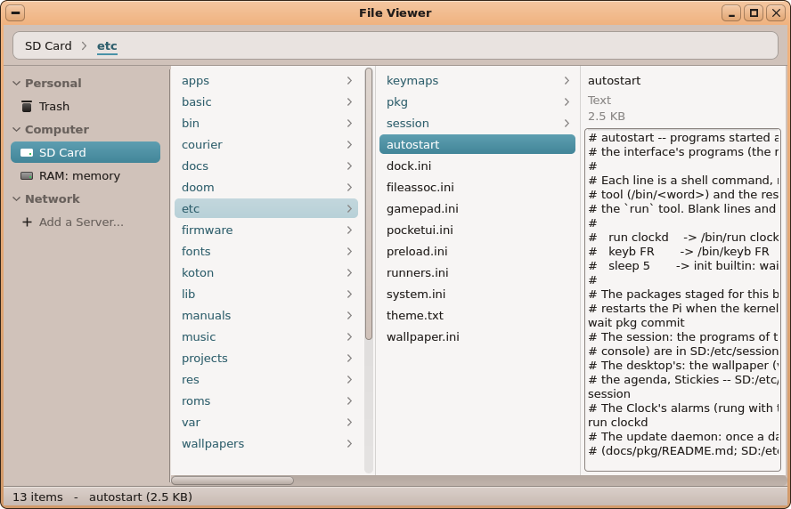
*The File Viewer: the sidebar (Personal, Computer, Network), `SD:` ▸ `etc` in the path bar, one
folder per column, and the preview of the selected `autostart` file.*

### Archiver, the archive manager (`archiver`)

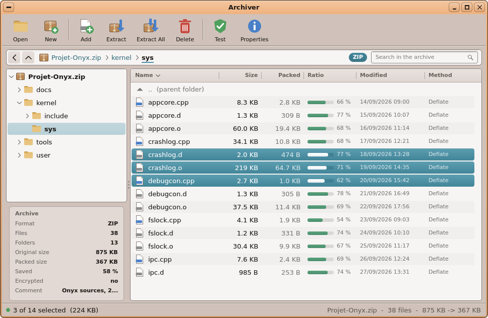
*An archive of Onyx's sources open in `kernel/sys`, three files selected (Ctrl + click): their
sizes, what they take packed, how much was saved.*

The Archiver opens **ZIP archives** (`.zip`, `.jar`; also a self-extracting ZIP), shows what they
hold as folders, **extracts** some files or all of them — **keeping the archive's folders** — and
**changes** them: files and folders added (dropped from the File Viewer, or *Add Files...*), deleted,
renamed, new folders. It is in the **Productivity** drawer; a `.zip` opened in the File Viewer opens
in it (`fileassoc.ini`), as `run archiver SD:/path/file.zip` does. **tar, .tar.gz (.tgz) and .gz** archives
are opened and extracted too (read only). The formats are **FileKit's** (`SD:/lib/filekit.so`): the
welcome page lists the ones the library says it reads and writes; 7z, RAR, xz and bzip2 come later, there.

- **The window**: the toolbar (**Open**, **New** · **Add**, **Extract**, **Extract All**, **Delete** ·
  **Test**, **Properties**), the path bar (Back, Up, the archive and its folders — click one to go
  there —, the format's badge, **Search in the archive**: every name holding the text, with its
  path), the archive's folders at the left (the archive at their root; a click opens a folder, the
  arrow opens or closes it) above its summary (format, files, folders, sizes, how much is saved,
  encrypted, the comment), and the list: the folder's subfolders, then its files — **Name**, **Size**,
  **Packed**, **Ratio** (a bar), **Modified**, **Method**. A click on a column's title sorts by it (again:
  the other way). The window can be maximised; the divider between the folders and the list drags.
- **Selecting**: a click, **Ctrl** + click adds or removes a row, **Shift** + click a range; the keys
  Up / Down / Page Up / Page Down / Home / End (with Shift: the range; Space adds the row the cursor
  is on); ^A all, *Invert Selection*. A folder selected is everything under it.
- **Opening**: a double click (or Enter) on a folder goes in, on `..` or **Backspace** up. On a file:
  it is extracted to `RAM:/archiver/open/` and opened with its app (`fileassoc.ini`: a text in
  tinypad, a picture in the image viewer...). **Change it and save it** there: the Archiver sees it and
  asks *"... was changed. Put it back in the archive?"* — Yes replaces it in the archive.
- **Extract...** (^E, the toolbar, the right-click menu) — *What*: the selection, or everything.
  *Where*: a folder (Browse...), and **into a new folder** named after the archive (on by default).
  *Folders*: **keep the archive's folders** (`kernel/sys/kapi.cpp` is extracted as
  `kernel/sys/kapi.cpp`), **from the current folder down** (as `kapi.cpp` when you are in
  `kernel/sys`), or **all in one folder** (flat). *If a file exists*: ask for each one (Replace,
  Replace All, Skip, Skip All, Keep Both — a new name, `kapi (2).cpp` —, Cancel), replace them, skip
  them, keep both. **Show the folder after** opens it in the File Viewer. *Password*: for encrypted
  files. **Extract All...** is the same with *everything* chosen; **Extract Here** (the right-click
  menu) extracts the selection next to the archive, from the current folder down. A name that
  climbs out of the folder (`../`) or that FAT refuses (`:` `*` `?`...) is made safe; a file whose
  checksum is wrong is not left half written.

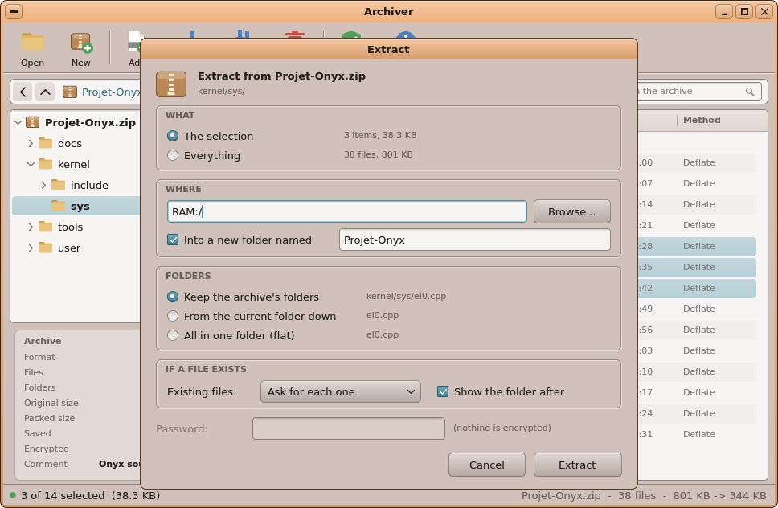
*The Extract dialog: the selection or everything, where, which folders, what to do when a file
exists; the hints show where the first file selected would go.*

- **Adding — drag & drop**: drag files or folders from the File Viewer onto the list: they go
  **straight into the folder shown**, or into the **folder row** under the pointer (outlined), or into
  a folder of the tree at the left. A banner says where (*Drop to add to Projet-Onyx.zip > kernel/
  include/*). A folder added keeps its name and its tree. When names exist in that folder already,
  the Archiver asks once: Yes replaces them, No keeps the old ones, Cancel adds nothing.
- **Add Files...** (^D, the toolbar): a list to fill with **Add Files...** / **Add Folder...**
  (**Remove** takes one out), **into the folder** (the one shown; type another: `docs/images`), *keep
  the folders I add* or *only the files*, the **compression** (Store, Fast, Normal, Best — files that do
  not shrink, png, jpg, zip, mp3..., are stored; a small file that deflate would make bigger is
  stored too), and what to do with a name that exists (replace it, keep the old one).

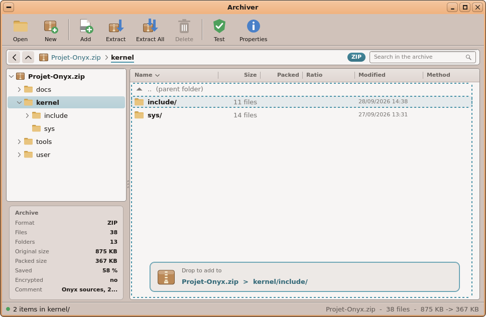
*Files dragged from the File Viewer over the `include` folder: they will go into
`kernel/include/`.*

- **Dragging out**: drag rows of the list to the File Viewer, the desktop or an app: they are
  extracted to `RAM:/archiver/drag/` and handed over as files (folders with their tree; up to 96 MB).
- **Delete** (Del, the toolbar), **Rename...** (F2), **New Folder...** (^K): in the archive. Each change
  writes a **new copy** of the archive next to it (`name.zip.part`), then replaces the old one — if
  anything fails, the old archive is still whole.
- **Test** (^T): every file decompressed and its checksum checked → *No errors: N files checked*, or
  the first one damaged. **Properties** (^P): the archive's folder, format, sizes, encryption, comment.
- **New...** (^N, the toolbar, the welcome page): a new, empty `.zip` (the file dialog asks where).
  **Dropping files on the welcome page** makes a new archive of them (it asks its name); dropping an
  archive there opens it.
- **Jobs**: extracting, adding, deleting, testing run while the window stays alive: a box shows the
  file being done and a bar (**Background** hides it — the bar goes on in the status bar —, **Cancel**
  stops). One job at a time.
- **Encrypted ZIPs**: the classic ZIP encryption (ZipCrypto, `zip -P`) is read — the password is asked
  once (or typed in the Extract dialog); AES-encrypted files and the methods other than Store and
  Deflate (Deflate64, BZip2, LZMA, Zstd...) are listed but not extracted yet.
- **The welcome page** (no archive open): a drop zone, *Open an Archive...*, *New Archive...*, the
  formats, the **recent archives** (a click opens one).

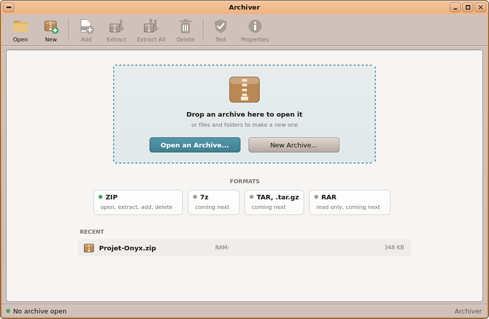

Files: `recent.txt` in `SD:/apps/archiver.app` (the archives opened lately); `RAM:/archiver/open/`
and `RAM:/archiver/drag/` (what was opened or dragged out; gone at the next start of the Pi).

## 10. Keyboard and layouts

The layout at boot is set by the autostart line **`keyb FR`** (in `SD:/etc/autostart`) —
the kernel no longer reads `keymap=` from `cmdline.txt`. `keyb` records the layout in a
persistent kernel snapshot and the kernel installs it on the keyboard the moment it
enumerates, so `keyb` needs **not** wait for USB — the layout is applied however late the
keyboard appears. (This removed a boot race where `keyb` could time out before the keyboard
enumerated and leave it with **no** map at all — a dead keyboard while the mouse worked.) To
change it **on the fly**:

- **At the command line**: `keyb FR` (or `US`, `UK`, `DE`, `BE`, `ES`, `IT`, `DV`). `keyb` alone
  shows the current layout and the list.
- **Graphically**: the Control Panel's **Keyboard & Mouse** applet (`keyconf`) lists the
  `.kmap` files actually present in `SD:/etc/keymaps/`; a click takes one at once **and keeps
  it** (it rewrites the `keyb` line of `SD:/etc/autostart`); a field to try it.
- **Permanently**: edit the `keyb` line in `SD:/etc/autostart` (or use the applet).

The layouts themselves live as files in **`SD:/etc/keymaps/`** — `BE.kmap`, `DE.kmap`,
`DV.kmap`, `ES.kmap`, `FR.kmap`, `IT.kmap`, `UK.kmap`, `US.kmap` (small binary tables). The
Belgian (`BE`) map is an azerty layout close to French, with the Belgian standard for the
digit row and several AltGr symbols (`!` on **8**, `=` `+` on the bottom-right key, `-` `_`
right of `)`, and `| @ #` on **1 2 3**, `{ }` on **9 0**, `[ ]` on the `^`/`$` keys). `keyb XX`
loads `XX.kmap` and hands it to the kernel, which copies it onto the live keyboard. **The
kernel itself ships no keyboard map** — layouts are *only* these files, so the keyboard has
no mapping until `keyb` has run (a second or two into boot), and deleting the `keymaps`
folder would leave it unmapped. **Adding a layout never needs a kernel rebuild**: drop a new
`<NAME>.kmap` in that folder (regenerate them, or seed a custom one, with
`tools/keymaps/genkeymaps.py`) and use `keyb <NAME>` — it also shows up in the Keyboard & Mouse
applet.

**Print Screen** is the system's: it starts a capture with **Screenshot** (its last mode and delay);
**Alt+Print Screen** takes the window in front at once (§12, *Screenshot*).

Accented letters (`é è à ç ù`…, the Latin-1 characters of the layout) can be typed in every
text field and editor (from a PC's keyboard -- VNC, Onyx Remote -- AltGr arrives as Ctrl + Alt: it types its
character there too, `#`, `@`, `{`, in the code editors as elsewhere). The **euro sign** is **AltGr+E** (`FR`, `BE`, `DE`, `ES`, `IT`), AltGr+4
(`UK`), AltGr+5 (`US`); it is a key of its own (Windows' code 0x80, not Latin-1): the Spreadsheet
takes it (`12,50 €`), the other apps' text fields do not yet.

## 11. The Control Panel and the appearance

### The Control Panel (`control`)

The system's settings are gathered in one window, as Windows' Control Panel: the **Control
Panel** (the menu bar's **Onyx ▸ Control Panel**, just below Terminal, or the dock's **gear**).
Its home lists the **applets**, an icon, a name and a line of help each; **click one** to open it
**inside the Control Panel's window**. The path bar at the top reads *Control Panel ▸ Theme*…:
click **Control Panel** (or the menu's **All Settings**) to go back to the list. One Control
Panel at a time (started again, it brings the open one to the front). When the applets do not all fit,
the list **scrolls** (the wheel, the bar at its right, the arrow keys).

| Applet | What it sets |
|---|---|
| **Theme** (`theme`) | The desktop's colours and wallpaper, with a preview (below). |
| **Display** (`displayconf`) | The screen's **resolution**: pick a size in the list (1024 × 768 … 2560 × 1440, 4:3, 16:9, 16:10…), **Apply** (or a double click): the screen changes **at once** — the menu bar, the dock and the notifications follow it, a maximised window fills the new screen, a window too big for it is shrunk into it, the wallpaper is painted again — and it is kept in `SD:/cmdline.txt` (`width=` / `height=`) for the next start. Not while an app has the full screen. The monitor shows any size (the Pi scales the picture to it); its own resolution is the sharpest. |
| **Panel** (`dockconf`) | The dock: its **drawers** (left to right: each a **group** of apps — the `category` of their `app.txt` — and its **main app**, whose icon the drawer shows; **Add** / **Remove** / move them, pick the group and the main app in the lists beside), the **launchers** after them (the Terminal, the File Viewer…: add any app, remove, move), the **workspaces** (how many, 1 to 6, and their names). **Apply** writes `SD:/etc/dock.ini` and starts the dock again: it takes it at once (a new group, a new launcher). |
| **Sound** (`soundconf`) | **Play on**: where the sound goes — **Automatic** (a USB headset or DAC if one is plugged in, else the headphone jack, else HDMI on a Pi without a jack: the Pi 400), **Headphone jack (3.5 mm)**, **USB headset / DAC**, **HDMI (the screen)**; only the outputs that are there are listed, the line under the list says where it plays now. The choice is applied at once (the music goes on) and kept in `SD:/etc/sound.ini` (`output = auto \| jack \| usb \| hdmi`). A USB headset unplugged: the sound is off — nothing else takes over — and comes back by itself when it (or another one) is plugged in again. The master **volume** (0–10) and **Mute**, applied at once to everything played and kept in the same file (the menu bar's speaker changes the same volume; a USB headset with a volume of its own is driven through it); **Play a test sound**. **Programs playing** — the mixer: several programs can play at the same time, and each one that does has a row here (the first four): its name, **its own volume** (0–100 %), **Mute** and its level now. A program's volume is applied at once and remembered by its name (`SD:/etc/mixer.ini`): it finds it again the next time it plays. |
| **Preload** (`preloadconf`) | The programs **loaded ahead at boot and kept in memory**: they start without reading the card (worth it for the large ones, as Jet: 100 MB, 5 s of card each start otherwise). At the left the list (each program, its size, *loading* / *in memory*), at the right what can be added — the apps, then the `/bin` tools: **< Add** (or a double click), **Remove**. A change is done **at once** (the program added is loaded now, the one removed is released: its memory is freed when its last window closes) and kept in `SD:/etc/preload.ini`, which the last line of `SD:/etc/autostart`, `preload /boot`, reads at every boot. The line under the lists gives the memory the list takes. |
| **Printers** (`printconf`) | The printers Onyx prints on (the **PDF** printer, network printers added by their address), the default one, a test page, and the **print queue** (below: *Printing*). |
| **Keyboard & Mouse** (`keyconf`) | The keyboard **layout** (the maps of `SD:/etc/keymaps`: a click takes one at once and keeps it in `SD:/etc/autostart`'s `keyb` line; a field to try it) and the **wheel**'s speed (lines a notch: at once, kept in `SD:/etc/theme.txt`). |
| **Gamepad** (`padconf`) | The USB gamepads (§12). |
| **Wi-Fi** (`wpaconf`) | The known networks and their passwords (§12). |
| **App Settings** (`config`) | An app's own settings, its `SD:/apps/<name>.app/config.ini`: the apps (those with settings first, marked `*`), then the chosen one's `key = value` lines — pick one, change its key or its value, **Set** (Enter; a new key adds a line), **Delete**; **Save** writes the file (the app reads it when it starts again), **Reload**. |
| **Packages** (`pkgman`) | The **Onyx Package Manager**: the updates, the packages installed, more to install (below). |

Each applet also runs **alone**, in a window of its own (`run theme`, `run keyconf`…). The list
is made of **link files** in `SD:/apps/control.app/applets/` (sorted by their names:
`10-theme.lnk`, `20-dockconf.lnk`…), four lines each — add one to add an applet:

```
name   = Theme                          # the title shown
icon   = SD:/apps/theme.app/icon.bmp    # a 40 x 40 BMP (magenta: see-through)
target = theme                          # the applet: an app (SD:/apps/<name>.app)
text   = Colours of the windows, the menu bar, the dock; the wallpaper
```

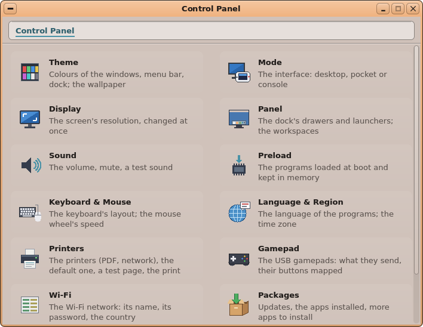
*The Control Panel's home: the applets.*

The Control Panel and its applets draw their text with FreeType (DejaVu Sans, anti-aliased), as
the Game Library and Setup do.

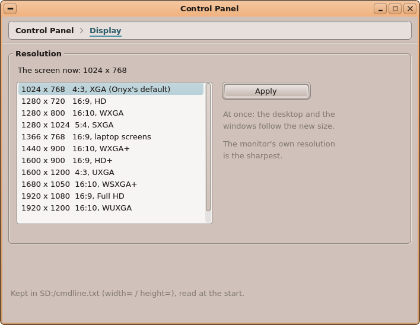
*Display: the sizes, applied at once.*

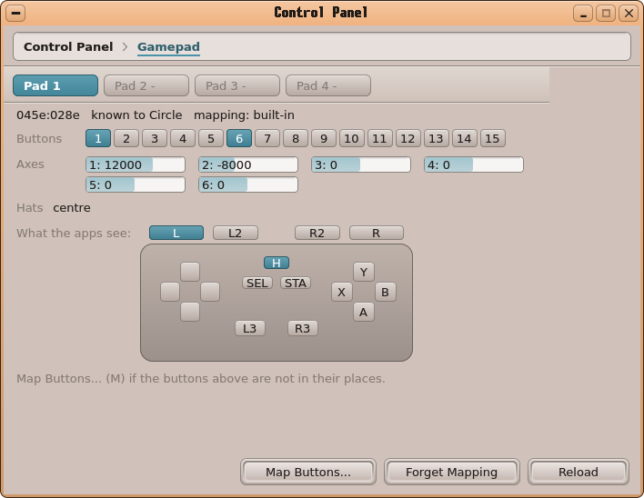
*Gamepad: an Xbox 360 pad plugged in — its buttons (two held), its axes, what the apps see.*

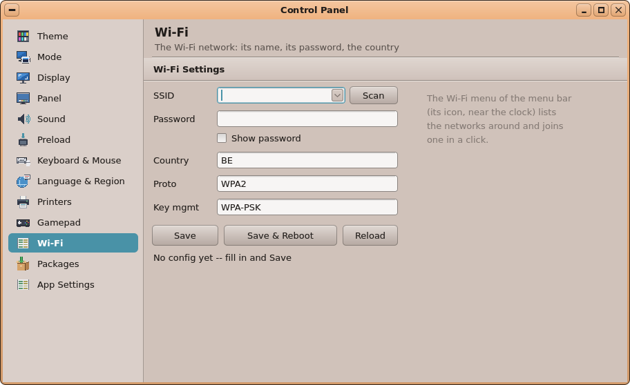
*Wi-Fi: the network's name (scanned), its password, the country.*

### Printing (`printconf`, `printd`)

Onyx prints on **network printers** (Wi-Fi or cable) that speak **IPP Everywhere / AirPrint** — most
printers since 2012, no driver to install — and into **PDF files** (the **PDF** printer, always there).

**Add a printer**: Control Panel ▸ **Printers**. **Find** searches the network (a few seconds: the printers
answer by themselves, as for AirPrint) and lists those found — click one: its address and name fill the
fields. Or type the **address** yourself (its IP address, as `192.168.0.14`: the printer's network page or
screen shows it; or `ipp://host:631/ipp/print`) and a **name** if you want another than its own. **Add**: the printer is asked what it can do (its papers, colour, quality, margins)
and joins the list; the first one added becomes the **default**. **Default** makes the selected printer
the one the Print dialog proposes, **Check** asks it again (its state, its ink levels), **Test page**
prints a page of text, colours, greys and fine lines with the edge of what it prints, **Remove** forgets
it. Kept in `SD:/etc/printers.ini`. In a terminal, `ipp <address>` shows a printer's answer (§8).

**Print** — **File ▸ Print…** (**Ctrl+P**) in Letters, the Spreadsheet, Slides, Paint, Photos and the PDF
Viewer opens the same **Print dialog**:

| | |
|---|---|
| **Printer** | The printers of the list; the rest of the dialog follows the one chosen. |
| **Pages** | **All**, the **Current page** (where the app has one), or **From … to …**. |
| **Copies** | 1 to what the printer allows. |
| **Colour** | **Colour** or **Black and white** (a colour printer). |
| **Quality** | **Draft**, **Normal**, **High** — those the printer has. |
| **Paper**, **Orientation** | The printer's papers (A4, Letter, envelopes, photo sizes…), **Portrait** or **Landscape** — for the Spreadsheet, Paint and Photos. Letters, Slides and the PDF Viewer print the document's own pages, fitted on the printer's default paper (a lying page is turned). |

The **PDF** printer shows only the pages, then asks for the file to write. What each app prints: Letters
its pages as laid out (File ▸ Page Setup); the Spreadsheet the current sheet's used cells, in pages, with
its charts and a footer; Slides one slide a page; Paint the picture, centred (made smaller if it does not
fit); Photos the selected photos (or the one shown), one a page, as large as the paper takes; the PDF
Viewer the document's pages (a document that forbids printing is refused; to the PDF printer with all
the pages, the file is copied).

**The queue.** **Print** returns at once: the job goes to the **print service** (`printd`), which prints
the jobs one after the other and shows a **notification** when one is printed — or says why it was not
(the printer does not answer, no paper…). The Printers applet's **Print queue** lists them (waiting,
preparing and sending with the page reached, printing, done, failed); **Cancel job** stops one, **Clear
done** empties the finished ones. A job waiting when the Pi is turned off is printed at the next start
(`SD:/var/spool/print`).

### The Package Manager (`pkgman`)

The **Packages** applet installs, updates and removes the system and the apps from the **package
repository** (`stephaneweg/onyx-packages`; the same as the `pkg` command, §8 *Packages*). When it
opens it shows what it knew, then reads the repository again (**Check Now** does it again): the
repository's index is **signed**, and checked before it is used. Three tabs — a segmented control, each segment with
its number of packages —, an **All / None** button, and a **search** field
on the right that filters them (a name, a category, a word of the summary). In each tab a package has a
**box**: tick those you want (**All** ticks every package shown, **None** unticks them), then the button at
the bottom right does it for all of them at once — **Install N Updates**, **Remove N Packages**, **Install N
Packages**. With the keyboard, once the list is clicked: **Up / Down** (Page Up / Down, Home, End) choose the
row, **Space** ticks its box. The list's scroll bar is dragged by its thumb; a click above or below it turns
a page.

- **Updates** — the packages with a newer version: a box each, ticked (untick those to keep),
  **Install N Updates**. Each shows its versions (installed → new), its size; the system's update
  is marked **restart**. While it works, each row says *Waiting*, its progress, *Installed*, or
  *Ready: at the restart*. An app that is **running** is not updated (*close it, then try again*).
- **Installed** — every package: its version, its category, its **updates mode** — **Manual** (the
  default: you are asked), **Auto** (the update daemon installs its updates by itself), **Never**
  (this version kept) — and **Remove** (not for the system; asked first; a setting you changed is
  kept); several at once: tick them, **Remove N Packages**. A package another one needs is not removed (said in the footer).
- **Available** — the repository's packages not installed (and those with an update): **Install**
  (with what it needs: an emulator brings the Game Library, Letters brings Cardfile); several at once: tick
  them, **Install N Packages**.

A **system update** (`onyx`, `pi-firmware`) is **staged**: a banner offers to **Restart**; at the next
boot it is moved in before the desktop starts (the previous kernel kept as `kernel8-rpi4.img.old`),
and the Pi restarts once more when the kernel or the firmware changed. Alone: `run pkgman`.
The package manager itself (`pkg`, this applet, `pkgd`) is a package of its own, **`pkgman`**: part of
the system (it cannot be removed), but updated at once, without a restart (the new version runs the next
time it starts).
Once an app is installed, updated or removed (by the applet, `pkg` or `pkgd`), the **dock starts again**: its
launchers and drawers know the new app at once (a click on it starts it). Each click on the dock is noted
in the kernel log (`kmsg`: `dock: <app>: started`, `…: its window raised`, `…: NOT started`).

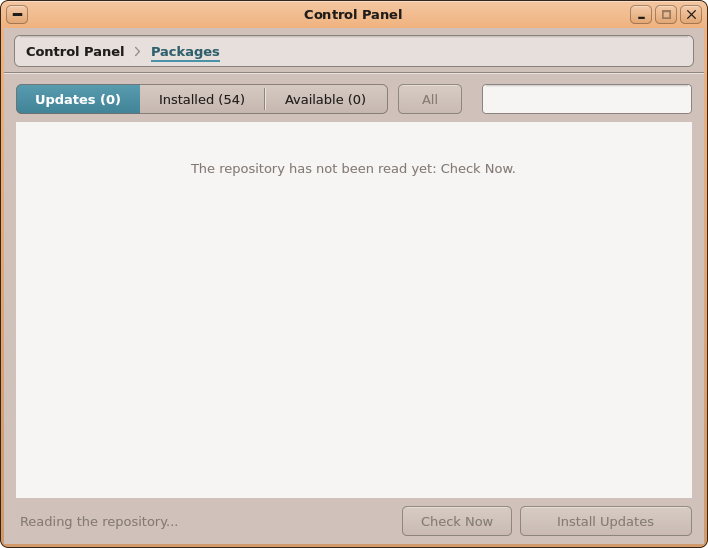
*Updates: the system, Archiver, Jet Browser and Koton have a newer version.*

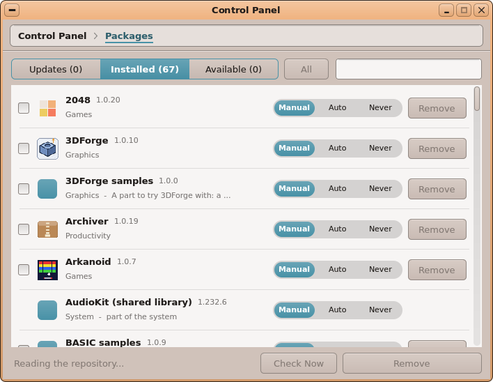
*Installed: each package's updates mode, Remove.*

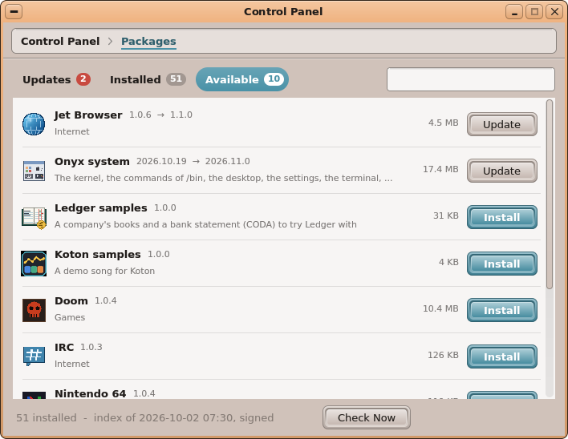
*Available: the updates, and the packages to install.*

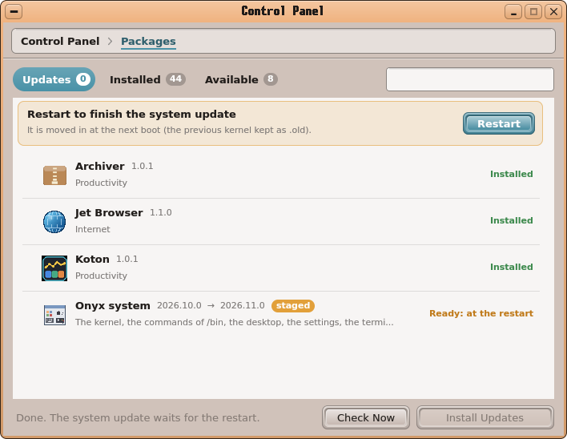
*After Install 4 Updates: the apps installed, the system waiting for the restart.*

**The update daemon** (`pkgd`, started by `etc/autostart`): once the network and the time are
there, then **once a day**, it reads the repository's index, installs the updates of the packages
set **Auto** (an app running waits for the next day), and shows a **notification** — *3 updates
available* (the Manual ones), *Updated: …* — a **click on it opens the Package Manager**. `check =
never` in `SD:/etc/pkg/pkg.ini` stops it; `run pkgd --once` (or `pkg upgrade`) does a round at once.

### The Theme applet (`theme`)

The desktop's look is a **modernised CDE**; the **Theme** applet sets its colours, as Windows
98's Display Properties. On the left a **preview** of a desktop (320 × 240): the wallpaper, the
menu bar, a window behind, a window in front with a button, a text field, a selection and a
check, the dock — drawn in the colours being edited.

- **Click a part of the preview** (or pick it in **Item**) and give it a colour: one of the
  **palette**'s, or any colour (**Custom…**: red, green, blue sliders and the colour). The parts:
  the **frame of the window in front** and of the **windows behind**, the **windows' content**
  (the apps' face, their background), the **buttons**, the **text fields and lists**, the
  **selection** (focus, checks, the open menu), the **menu bar**, the **dock**, the **desktop**.
  The buttons, the fields and the menu bar may follow the window's colour (**Automatic**).
- **Theme** and **Scheme**: the theme is the frames' kind — **Classic** (CDE's framed title buttons)
  or **Modern** (the beads, below) —, and each has its schemes: Classic's are the named colours of
  the window in front, **Peach** (the default), **Steel**, **Sage**, **Brick**, **Slate**; Modern's
  are **Milk** and **Dark Coffee**. Every shade of a frame (its gradient, its buttons,
  its edge) is computed from its one colour, and the title's ink (dark or white) from its
  brightness. **Milk** (after Xfce's Milk theme, itself in the spirit of Mac OS X) is a style of
  its own: soft greys, a frame that **melts into the window** (the title bar's gradient ends on
  the colour of the window's content, its edges are that colour: no line between the frame and
  what the window shows), and the title buttons as **glossy coloured beads** — **red** close,
  **amber** minimise, **green** maximise (grey on the windows behind, and the green one grey on a
  window that cannot be maximised; the window menu's bead, at the left, keeps its bar). Choosing
  Milk also takes its colours for the windows (light grey), the selection (Aqua blue), the
  frames behind and the dock (silver) — and choosing a Classic scheme again, theirs. **Dark
  Coffee** is Milk's dark sister: black coffee's browns (the windows nearly black, the fields
  darker still), a **caramel** selection, the title bar a lighter brown at the top down to the
  window's colour, **black** window borders and outline, the group boxes' grooves darker than
  the face.
- **Outline**: the frames' 1-px outline — **None**, **Dark** (the default) or **Black**.
- **Desktop**: the **wallpaper** — **Voronoi cells** (their colour and number), a **Gradient**
  (two colours, top to bottom or left to right), **Bubbles** (a gradient with soft bubbles),
  a **Solid colour**, a **Picture** (a BMP, GIF, PNG, JPEG, PCX or WebP file: **Browse…**;
  **cover** the screen or **tile** it; **Tinted**: its grey multiplies the **Tint** colour —
  checked by itself for a picture of `SD:/wallpapers`), or a **Pattern**: one of the abstract grey pictures of
  `SD:/wallpapers` (Bokeh, Contours, Dunes, Facets, Hexagons, Low Poly, Silk, Waves) **coloured
  by the two colours** — its grey multiplies the gradient from colour 1 to colour 2 (white is
  the colour itself), so any pattern takes any colours; the preview shows it at once.

**Apply** writes `SD:/etc/theme.txt` and `SD:/etc/wallpaper.ini`, paints the wallpaper again and
gives the menu bar, the dock and the agenda the new colours at once; the apps opened from then on
take them (the ones already open keep theirs until they are opened again). **Discard** reloads
what is saved.

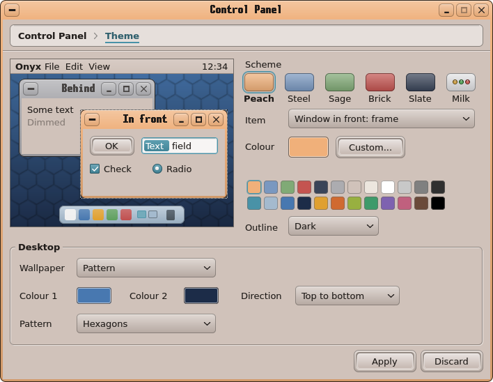
*The Theme applet: the preview (click a part to pick it), its colour from the palette, the scheme
and the outline, the wallpaper (here the Hexagons pattern in two blues).*

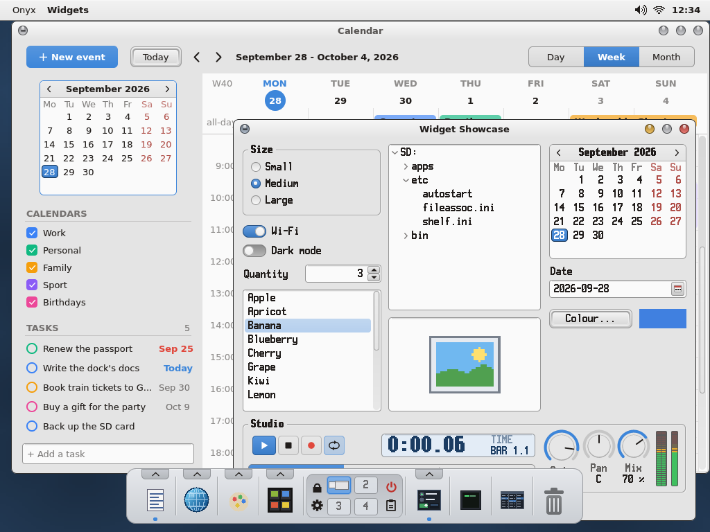
*The Milk scheme: soft greys, each frame melting into its window, the title buttons as coloured
beads (the window behind: grey), the Aqua blue selection, the silver dock.*

### Manual theme editing

`SD:/etc/theme.txt`, read by every app when it starts (`0xRRGGBB` colours):

```
theme    = Peach       # the frame in front: Peach, Steel, Sage, Brick, Slate, Milk, Dark Coffee
active   = 0xF0B07A    # ... or any colour instead (overrides theme)
style    = cde         # the frames' look, if not the theme's: cde, or milk (the beads)
inactive = 0xACACB0    # the frames behind
window   = 0xD0C2BA    # the windows' content: the apps' face ("face" is still read)
button   = 0xD0C2BA    # the buttons (default: the window's)
field    = 0xF6F3F1    # the text fields and lists (default: from the window's)
accent   = 0x4992A7    # focus, selection, checks
outline  = dark        # the frames' outline: none, dark, black
menubar  = 0xD0C2BA    # the menu bar (default: the window's)
dock     = 0xA4BACE    # the dock's face
wheelspeed=2           # lines a wheel notch (read when the desktop starts)
```

Nothing is a bitmap: the frames, buttons and controls are drawn by code from these colours. A
colour left out takes the style's own (CDE's beige, teal, grey and blue; Milk's greys, blue and
silver).

### Startup and pinned apps

- **`SD:/etc/autostart`**: one **shell command** per line, run at boot by `init`
  exactly as if typed in the terminal — the first word is a `/bin` tool
  (`/bin/<word>`) and the rest are its arguments; blank lines and `#` comments are
  ignored; the **`sleep <seconds>`** line (an init builtin) waits before the next line,
  to stagger the startup, and **`wait <command>`** runs the command and waits for its end
  (`wait pkg commit`, the first line: the packages staged for this boot moved in). Launch a **desktop app** with the `run` tool (`run <name>` →
  `/apps/<name>.app/main`). Defaults: `run voronoy`, `run menubar`, `run notifyd`, `run dock`, `run agenda`, `keyb FR` (sets the
  keyboard layout at boot) `telnetd` (remote shell) and `vncd` (remote desktop) — see §8. Which program plays the `init` role is itself set
  by `init=` in `cmdline.txt` (see §3).

### Wallpaper

At boot, **`voronoy`** paints the wallpaper in the shared background buffer, as
**`SD:/etc/wallpaper.ini`** says (the Theme applet writes it):

```
mode      = voronoi      # voronoi, gradient, bubbles, solid, image or pattern
color     = 0x4878B0     # voronoi's colour, the solid one, the gradient's first
color2    = 0x1C2C48     # the gradient's second (gradient, bubbles)
direction = vertical     # the gradient: vertical or horizontal
points    = 28           # voronoi's cells (1..64)
image     = SD:/x.jpg    # image: the picture (painted by imageview --background)
style     = cover        # cover (the screen filled) or tile
tint      = no           # image: yes -- its grey multiplies `color` (a tinted picture)
pattern   = SD:/wallpapers/waves.png   # pattern: the grey picture the colours multiply
```

Without the file, `SD:apps/voronoy.app/config.ini`'s colour and cells. The wallpaper persists
after `voronoy` exits.

**The patterns** (`mode = pattern`, `pattern = SD:/wallpapers/<name>.png`): grey pictures of
1024 × 768, light for the most part, that `voronoy` colours — each pixel's grey multiplies the
gradient of `color` and `color2` (in `direction`); a screen of another size gets the picture
scaled to cover it. Eight ship with Onyx, made by code (`tools/gen_wallpapers.py`); **any grey
picture put in `SD:/wallpapers`** (PNG, JPEG, BMP…) appears in the Theme applet's list.

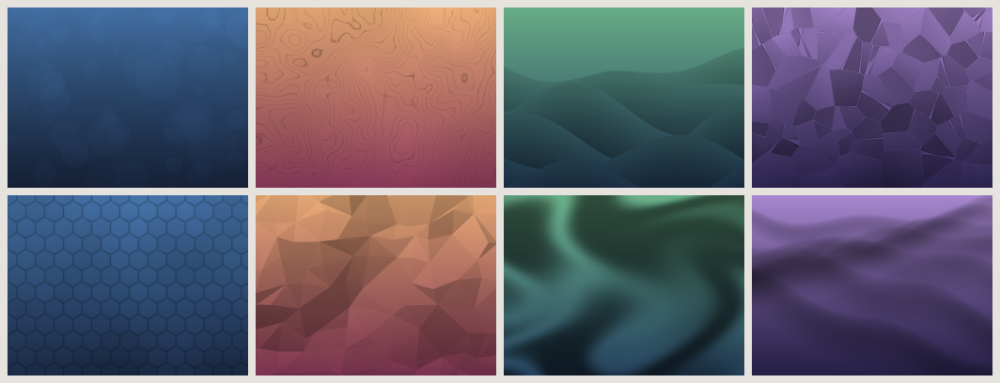
*The eight patterns, each in a pair of the theme's colours: Bokeh, Contours, Dunes, Facets
(top), Hexagons, Low Poly, Silk, Waves (bottom).*

## 12. Application catalog

> Tip: most games restart with **`r`**.

### Gallery

A few applications (the real apps, run on a PC by `tools/tests/desktop_sim/shots.sh`):

| | | |
|:---:|:---:|:---:|
| 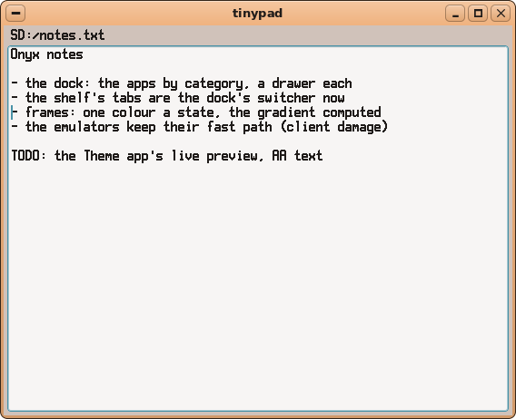 | 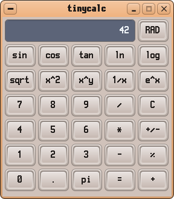 | 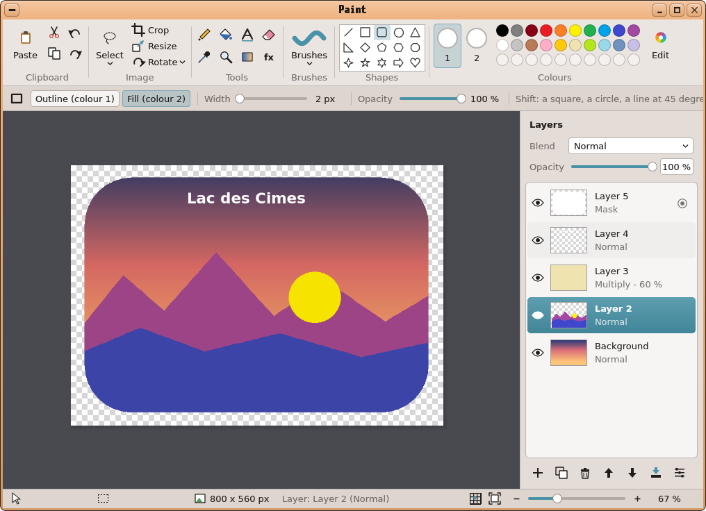 |
| *tinypad — text editor* | *tinycalc — calculator* | *paint — drawing* |
| 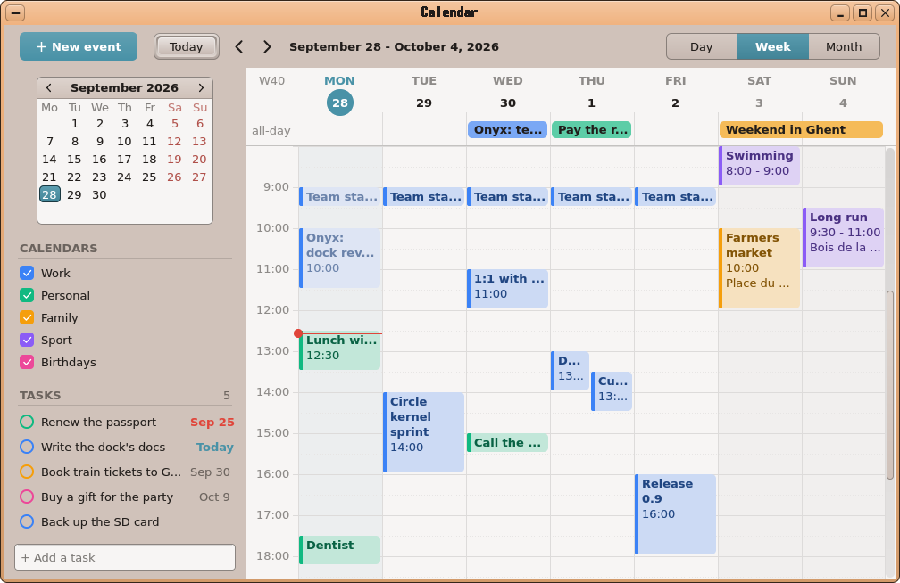 | 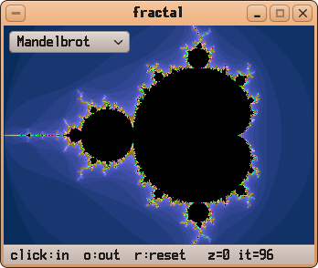 | 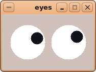 |
| *calendar — the planner* | *mandelbrot — fractal explorer* | *eyes — gadget* |
| 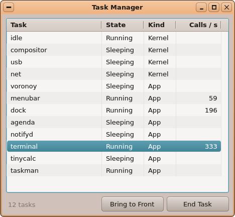 | 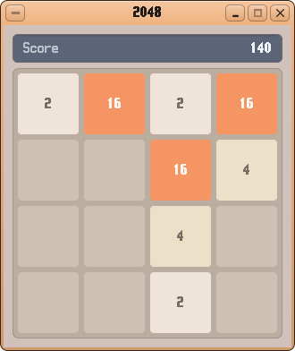 | 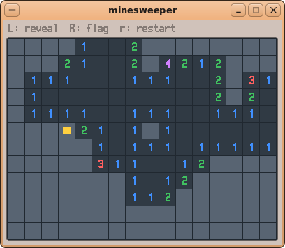 |
| *taskman — task manager* | *2048 — tile game* | *minesweeper — minesweeper* |
| 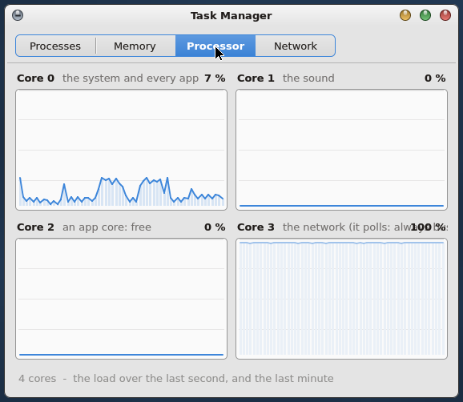 | 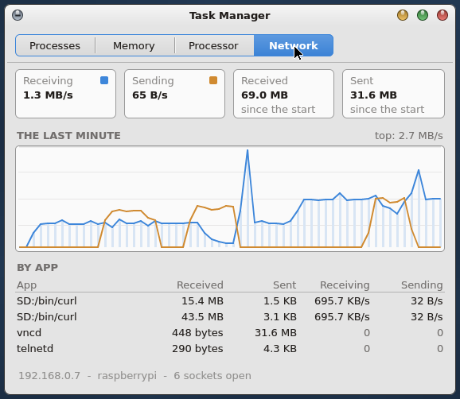 | |
| *taskman — the cores (on the Pi)* | *taskman — the network (on the Pi)* | |
| 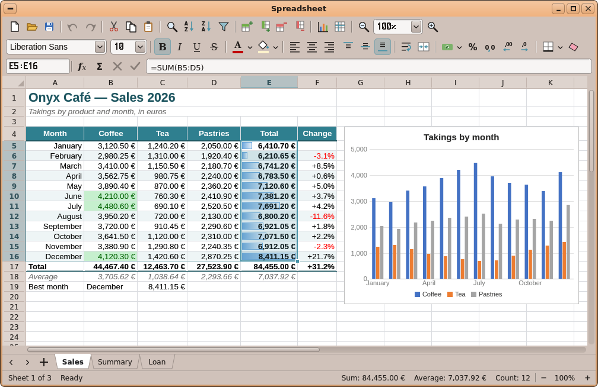 | 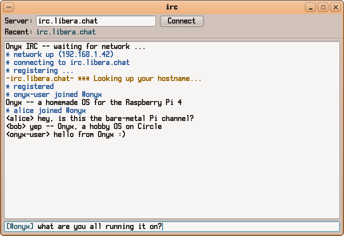 | 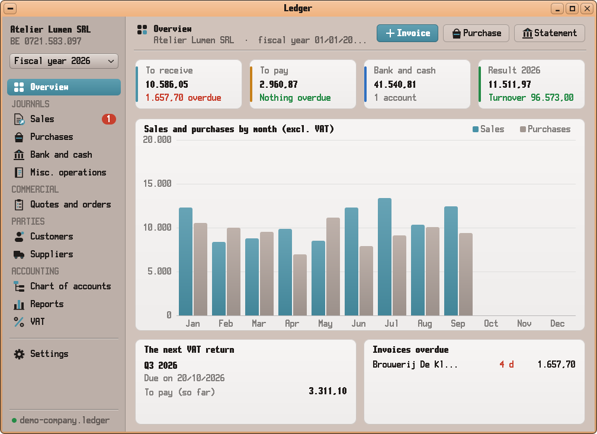 |
| *sheet — spreadsheet* | *irc — IRC client* | *ledger — accounting* |
|  | 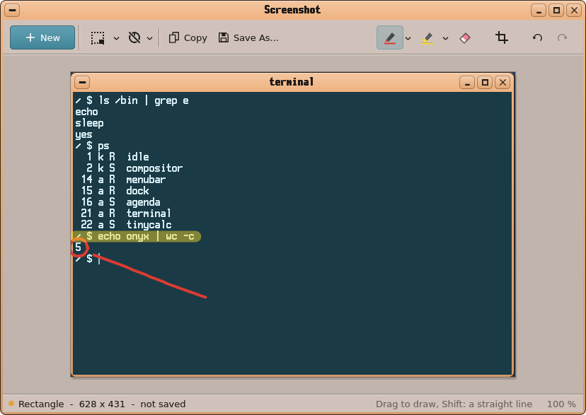 | 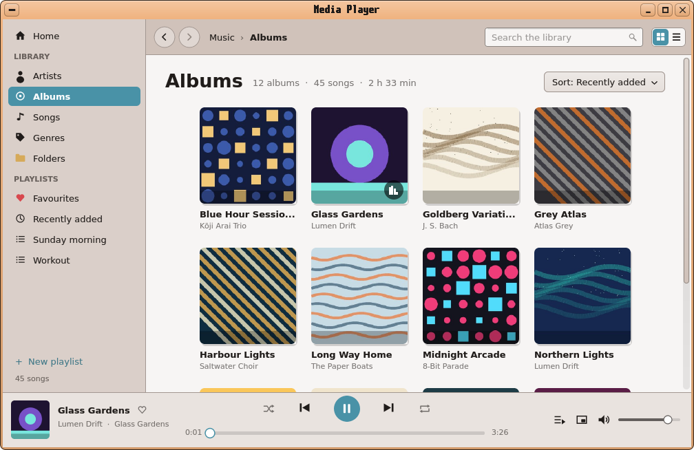 |
| *archiver — archive manager* | *screenshot — screen capture* | *media — the music and video library* |

### PDF Viewer, the reader of PDF documents (`pdf`)

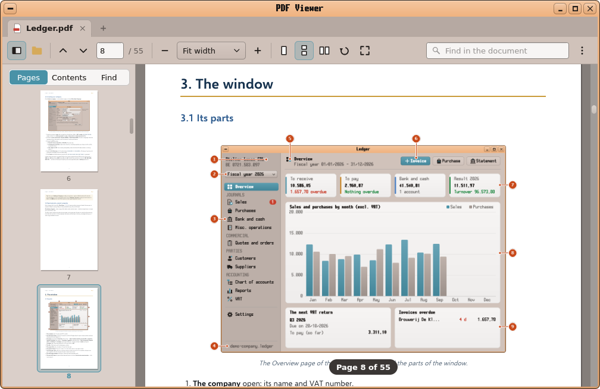
*A manual open in the PDF Viewer: its pages' thumbnails at the left, the page fitted to the window's width.*

The PDF Viewer shows **PDF documents** in the way of Acrobat Reader or Edge: Onyx's own manuals
(`SD:/manuals`), what you download, what Letters and the Spreadsheet export. Start it from the dock or the
app list (*Productivity*), double click a `.pdf` in the File Viewer, or drop PDF files on its window.
**Each document opens in its own tab** (the `+` tab: the home; a middle click or × closes a tab;
Ctrl+Tab goes to the next one).

**The window**: the **tabs** on top, the **toolbar** — the side panel (F9), Open, the previous / next
page, **the page's number** (type one and Enter to go there) and the count, the **zoom** (− / the
drop-down / +), the **layout** (one page at a time, continuous — the default —, two pages side by
side), **rotate**, **full screen** —, at its right the **search** and ⋯ (Properties, Save a Copy..., Show
in the File Viewer, close the tab). A pill tells the page while you scroll.

| | |
|:---:|:---:|
| 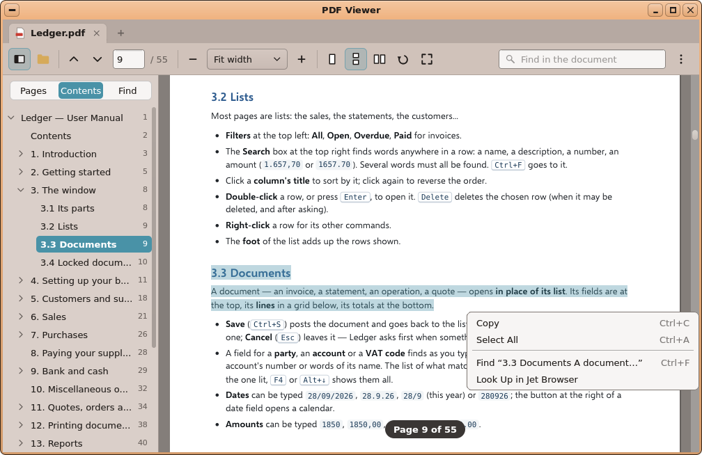 | 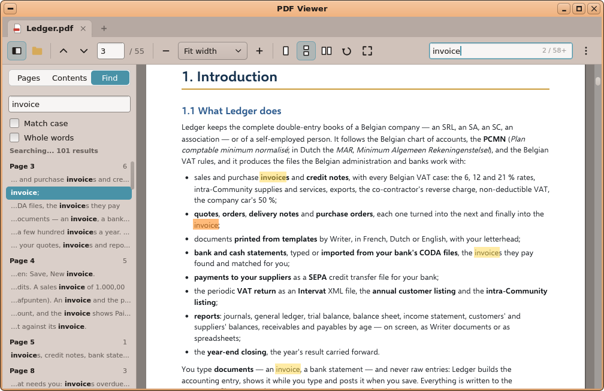 |
| *The contents; text selected, its menu* | *A search: the hits on the page, by page in the side panel* |

**The side panel** (its button or F9): **Pages** (the thumbnails, the current one framed; a click goes
to it), **Contents** (the document's outline, folded / unfolded with its arrows, the section being read
lit; a click goes there), **Find** (the search's field, *Match case*, *Whole words*, the count, the hits
**by page with their line**, the word in bold; a click goes to one).

**Reading**: the wheel, the arrows, Page Up / Down, Space (Shift+Space back), Home / End (the first /
last page); Shift+wheel or the arrows sideways when the page is wider than the window; the middle
button drags the page. **Zoom**: *Fit page* (Ctrl+0), *Fit width*, *Actual size*, 50 to 400 %; Ctrl+wheel
and Ctrl + / − zoom around the pointer. The zoom and the layout chosen are kept for the next
documents.

**Text**: drag over it to **select** (a double click: a word; a triple: a line; Shift+click extends),
**Ctrl+C** copies it (unless the document forbids it), Ctrl+A selects the page's. A **right click**:
Copy, Select All, *Find "..."* (the selection searched), *Look Up in Jet Browser*. **Links** work: one
inside the document goes to its page, one to the web opens **Jet Browser**.

**Find** (Ctrl+F, or type in the toolbar's field): the hits are lit on the pages as you type, the
current one in orange; Enter or F3 the next, Shift+Enter or Shift+F3 the previous; *n / total* in the
field; Esc clears it.

| | |
|:---:|:---:|
| 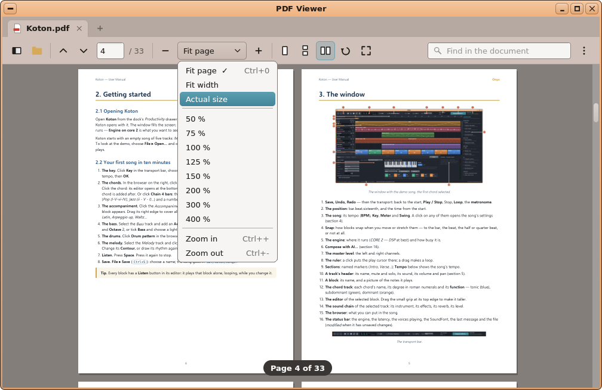 | 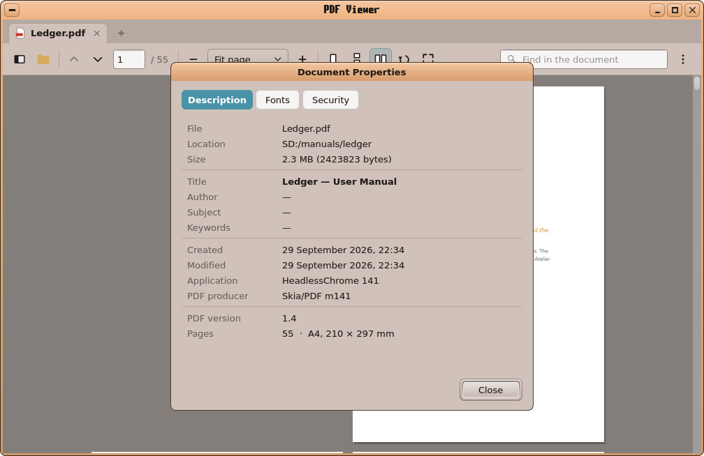 |
| *Two pages side by side, the zoom's menu* | *The document's Properties* |

**Properties** (⋯ or Ctrl+D): **Description** (the file, its place and size, the title, author,
subject, keywords, when it was made and changed, the application and the PDF producer, the PDF
version, the pages and their size), **Fonts** (the fonts used, embedded or not), **Security**
(encrypted or not, what is allowed: printing, copying, changing, comments). A document protected by a
**password** asks for it when it is opened.

**Full screen** (F11 or its button): the pages alone on black, as a presentation — the arrows, Page
Up / Down, Space, a click (the right button: back) turn them; Esc comes back.

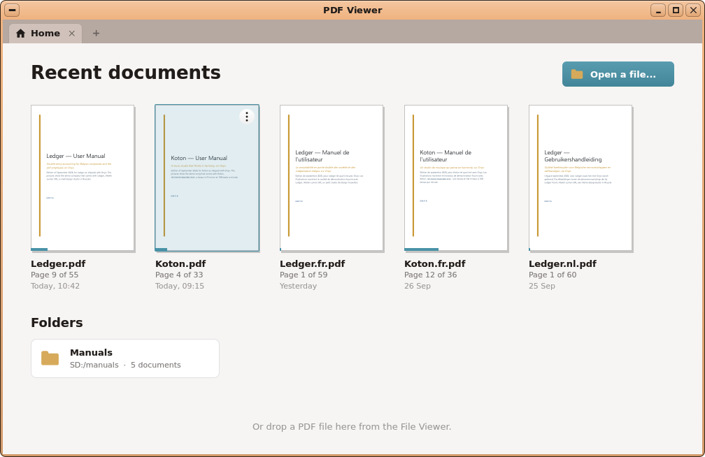

**The home** (when no document is open, or the `+` tab): the **recent documents** — their first page,
where you were (a bar under it), when —; a click reopens one **at the page you left** (⋯ or a right
click: open in a new tab, remove from the list); *Open a file...*; the **folders** holding PDFs
(Manuals, Documents, Downloads, the card's second partition) with their count.

**Files**: `SD:/etc/pdf/settings.ini` (the side panel shown, the layout, the zoom), `SD:/etc/pdf/recent.tsv`
(the recent documents: their place, the page read, when). PDF 1.0 to 2.0 is read (encrypted ones too:
RC4, AES), with their fonts (Type 1, TrueType, CFF, Type 3; the 14 standard ones built in), images
(JPEG, JPEG 2000, JBIG2, CCITT); the colours are not managed (no ICC profiles), forms are shown but not
filled, annotations are shown but not made. Keys: ^O open, ^W close the tab, ^D Properties, ^C copy,
^A select all, ^F find, F3 / Shift+F3, F9 the side panel, Ctrl+0 / + / − the zoom, ^R rotate, F11 full
screen, ^G the page's field, Ctrl+Tab the next tab.

### Productivity and tools

| App | Description and controls |
|---|---|
| **tinypad** | Text editor. The file's path is shown above the text; click the area to edit; arrows/Home/End/Page to navigate. **Select** text with **Shift** + those keys, a mouse drag, Shift+click or ^A (Select All); typing replaces the selection. Menu **Edit**: Cut (^X), Copy (^C), Paste (^V), Select All (^A), Copy All. Menu **File**: New (^N), Open... (^O, file dialog), Save (^S), Save As... (loads/saves the whole file). **Drop** a file on the window to open it, or text to insert it; New / Open / a drop first ask to **save unsaved changes** (Yes / No / Cancel). |
| **PDF Viewer** (`pdf`) | The **reader of PDF documents** (MuPDF): a tab a document, the pages' thumbnails, the contents, a search with its hits by page, the zoom (fit the page / the width, 50 to 400 %), one page / continuous / two pages, rotation, full screen; text selected and copied, links followed, passwords, Properties; the home's recent documents reopened at their page. See *PDF Viewer* above. |
| **Letters** | The **word processor**, in the way of AbiWord and Word: pages laid out and drawn with FreeType from the card's TrueType fonts, two toolbars (styles, fonts, sizes, bold / italic / underline / strike-through, superscript / subscript, colours, highlights, alignments, lists, indents, a table), a ruler (the indents, margins and a table's columns dragged), **tables** (merged cells, lines, shading, a heading row), **headers and footers** (the first page's own), **page numbers** and **fields** (date, time, pages), **tab stops** with leaders, a **table of contents**, images, Find and Replace, Special Character, Page Setup, Word Count, a **mail merge** (a Cardfile form's records into letters); **Word (.docx)**, **OpenDocument (.odt)** and **RTF** read and written with everything, text, HTML export. See *Letters, the word processor* below. |
| **Koton** (`koton`) | The **music studio** (Koton Studio for Onyx): a song thought in harmony — a chord track of degree-locked chords with a next-chord co-pilot and cadences drives accompaniments (28 styles or a drawn grid of the chord's voices), melodic lines (the pitches from the harmony), riffs on a harmony-aware piano roll, drums (a catalog or drawn, euclidean), polyrhythmic rings; a SoundFont synthesizer on the third core, plugins as processes (instruments, effects, generators), **Compose with AI**, WAV export, a USB MIDI keyboard. Opens Koton's `.sq`, saves `.kson`. See *Koton, the studio* below. |
| **Cardfile** (`cardfile`) | A small **database** in the way of Access, without SQL: one `.card` file holds a **form** (its fields — text, multi-line text, integer, decimal number, date, colour, yes / no, choice list) and its **records**. Three views: **Form** (a record at a time, on an index card; Page Up / Down between records), **List** (a grid: a click on a column's name sorts), **Design** (the fields added, moved, named, typed — the values converted). Search, Undo / Redo, CSV export and import. Reads / writes `.card` files, `.csv`. See *Cardfile, a small database* below. |
| **Ledger** (`ledger`) | **Accounting** for a Belgian company or self-employed person, in the way of BOB 50 and GnuCash: the **PCMN** (French or Dutch), customers and suppliers, sales and purchase **invoices** and credit notes, **bank and cash** statements (a bank's **CODA** file imported: parties and invoices found), miscellaneous operations, **quotes, orders, delivery notes, purchase orders** (each becomes the next, then the invoice), documents **printed by Letters** from templates (French, Dutch, English), the suppliers **paid** by a SEPA file, the **VAT returns** as Intervat XML with the customer and intra-Community listings, **reports** (journals, general ledger, trial balance, balance sheet, income statement, ages) to Letters or the Spreadsheet, the fiscal years closed. Reads / writes `.ledger` files. See *Ledger, the accounts* below. |
| **Courier** (`courier`) | An **HTTP client** in the way of **Postman**: requests (GET, POST, PUT, PATCH, DELETE, HEAD, OPTIONS) with their query params, headers, authorization (Bearer, Basic, API key, inherited from the folder or the collection) and body (raw JSON / XML / HTML / text / JavaScript, x-www-form-urlencoded, multipart form-data with files, a binary file); `{{variables}}` from **environments**, the collection and the globals; **collections** with folders; the **history**; the cookie jar; the response pretty-printed, previewed, its headers, cookies, tests; **tests and captures**; the request as **code** (cURL, HTTP, Python, JavaScript); Postman's collections and environments **imported and exported**, a cURL command imported. `http://` and `https://`. Reads / writes `SD:/courier/`. See *Courier, the HTTP client* below. |
| **Graphing Calculator** (`graphcalc`) | Plots up to four functions of x, in colour, live as you type them (left: `y1=` … `y4=`, a check box shows / hides each; a red frame = syntax error). Syntax: `+ - * / ^`, parentheses, `x`, `pi`, `e`, `sin cos tan asin acos atan sqrt abs ln log exp floor ceil round sign`, implicit multiplication (`2x`, `3sin(x)`, `(x+1)(x-1)`). **Drag** the graph to move, the **wheel** (or **+ / −**) zooms around the pointer, the arrows pan; the pointer **traces** the curves (x and each y shown on the left). **Standard** (−10…10), **Trig** (−2π…2π), **Square** (same scale on both axes); View menu: Zoom In / Out, Grid; Edit ▸ Clear Functions. The functions are kept in `SD:/apps/graphcalc.app/functions.txt`. |
| **Icon Editor** (`iconedit`) | Draws icons: 24-bit BMP where **magenta** (#FF00FF) is transparent — the desktop's convention (app icons are 40×40, `SD:/apps/<name>.app/icon.bmp`). The enlarged pixel grid in the middle (transparency as a checkerboard); **left button** = 1st colour, **right button** = 2nd colour (**X** swaps them). Tools: **P**en, **L**ine, **R**ect, **B**ox (filled), Ellipse (**O**), **F**ill, Pic**k**er (takes a pixel's colour), **E**raser. Palette (32 colours + transparency) and **More...** (the colour dialog); live previews at 1× on light and dark and 2×. **^Z** undo / **^Y** redo, **G** grid. File: New 40×40 (^N) / 16 / 24 / 32 / 48 / 64, Open... (^O, up to 64×64), Save (^S), Save As...; Image: Flip, Rotate 90, Shift, Clear. Drop a BMP on the window to open it. |
| **RTF Reader** (`rtfview`) | Shows **Rich Text Format** documents (`.rtf`, e.g. saved by WordPad or Word) with their bold / italic / underline / strikethrough, colours, highlights and sizes, word-wrapped; accents and typographic quotes / dashes are converted. File ▸ Open... (^O) or drop a `.rtf` on the window (a double click on a `.rtf` in the File Viewer opens it in **Letters**: `fileassoc.ini`); Edit ▸ Copy (^C) / Select All (^A); File ▸ **Edit in Letters**. Paragraph layout (alignment, indents, tables), pictures and fonts are not kept (Letters keeps them). Sample: `SD:/docs/onyx-rtf-sample.rtf`. |
| **tinycalc** | Scientific calculator (fixed-point). Buttons + keyboard (`+ - * / ( ) ^ =`), square root, trigonometric/exp/log functions. |
| **Spreadsheet** (`sheet`) | A **spreadsheet** in the way of LibreOffice Calc and Gnumeric: workbooks of several sheets (1 048 576 rows × 16 384 columns), **formulas** as Excel writes them (237 functions: mathematics, statistics, logic, text, lookups, dates, finance; references to other sheets, ranges, whole columns; arrays), number formats, fonts, colours, borders, merged cells, frozen panes, the fill handle's series, sort, Find and Replace, **charts** (column, bar, line, area, pie, scatter), **conditional formatting** (rules, colour scales, data bars), the **AutoFilter**, **defined names**, Undo / Redo. Reads and writes Excel's **`.xlsx`** and **CSV**, reads LibreOffice's **`.ods`**. See *The Spreadsheet* below. |
| **Slides** (`slides`) | A **presentation program** in the way of PowerPoint and LibreOffice Impress: slides on a **theme** (six: Café, Peach, Steel, Sage, Brick, Slate — their colours and fonts) and **layouts** (title, title and content, two contents, comparison, section, title only, picture and text, blank), **text boxes** (fonts, sizes, colours, bullets and numbering on five levels, autofit), **shapes** (28, with gradients, lines, shadows, rotation), pictures, **tables**, **charts** (column, bar, line, pie, area), **sections**, the speaker's **notes**, the slide sorter, the **master and layouts** edited, find and replace, **transitions** and **animation effects** (by paragraph too) played full screen by the GPU, a **presenter view**. Reads / writes OpenDocument **`.odp`** and PowerPoint's **`.pptx`** (PowerPoint and LibreOffice open them; theirs are read); exports **PDF** (the slides, notes pages, handouts) and a slide as **PNG**. See *Slides, the presentation program* below. |
| **qbasic** (QBasic) | The BASIC editor (see §13): main module and SUBs / FUNCTIONs edited separately (View ▸ SUBs... ^L, Edit ▸ New SUB...), Run ▸ Start (^R) with errors shown at their line, File ▸ Make App... Opens `.bas` files. Reads/writes `.bas` files, `SD:/tmp/<name>.bas` (the copy it runs). |
| **QBStudio** (`qbstudio`) | The **IDE for desktop apps in BASIC**, in the way of Visual Studio's designers: a project's window **drawn** (the controls dragged from the toolbox into its layout — columns, rows, grids, groups —, moved, sized; their **properties** and **events** at the right) and kept in step with its text, **`Main.form`** (a control a line, the parent by the indentation); its code, **`Main.bas`**, an event a SUB (`convert_Click`), the controls as objects (`celsius.Text`), with BASIC's colours, **completion** and the **problems as you type**; the window's code generated (`Main.form.bas`, read-only). **Run** (F5) starts it; **Make App** writes it as an app. Reads / writes `SD:/projects/<name>/` (`project.ini`, `*.form`, `*.bas`, `Main.form.bas`), `SD:/tmp/qbstudio/<name>.bas` (the program run), `SD:/apps/<name>.app/` (Make App), `SD:/apps/qbstudio.app/last.txt` (the last project), `settings.ini` (the grid). Opens `.form` files. See *QBStudio* in §13. |
| **fmtracker** (FM Tracker) | A music tracker with 8 channels of **FM instruments** (the sound system's FM synthesizer, like the AdLib), in the desktop's theme. **The window**: a transport bar — **Play** from the cursor (^P), **from the start**, **Stop** (Esc), **Loop** (the pattern again and again, ^L), a display of the position (pattern : row) and the time, **Undo / Redo**, **Cut / Copy / Paste**, **Follow** (the view goes with the position while it plays) —; on the left the song's **patterns** (a click shows one; **+** new, duplicate, move earlier / later, delete), **this pattern**'s **Rows** and **Speed** (a slice lasts speed / 20 s), the **typing**'s **Octave** and **Step** (the rows the cursor goes down after a note), the song's title and author; the **grid**; a **piano** under it. **The grid**: a column per channel, a row per time slice; a cell holds a note that starts there (`C#4`), `---` (the note goes on) or nothing (silence) — a note lasts until the next note or silence of its channel; every 4th and 16th row is shaded. A channel's **header**: its colour, its instrument — **click it for the instrument dialog** —, **M** (mute the channel in this pattern; a right click too), **S** (solo: heard alone, while the app runs), a level meter. **Keys**: **C D E F G A B** a note (Shift = sharp; you hear it), **0–7** the octave, **Space** a silence, **Delete** `---` (a block chosen: cleared), **Backspace** clears the slice above, **#** toggles the sharp, arrows / Page Up / Down / Home / End move (←/→ = channel), Tab the next channel; **Shift + those** or a **drag** choose a **block**: **^X ^C ^V** cut, copy, paste it (at the cursor), **^A** the whole pattern, **Ctrl+↑ / Ctrl+↓** move its notes a semitone (with Shift: an octave); **^Z / ^Y** undo and redo (the pattern's notes, 48 steps). A **click on the piano** enters that note; its keys light in the channels' colours as they sound. **The instrument dialog**: the name, a **preset** (`SD:/apps/fmtracker.app/ins`), **Load / Save** `.FMI`; the **algorithm** — **FM** (operator 1 bends operator 2's sound: the timbre) or **Additive** (both are heard), drawn — and the **feedback**; then each of the two operators: its **wave** (four drawn: sine, half sine, absolute sine, pulses — click one), its **envelope drawn** as the sliders move (**Attack, Decay, Sustain, Release**), its **Volume**, its frequency's **Multiplier**, its **Key scale**, its switches (held, tremolo, vibrato, key scale rate); below, **the sound's wave** (what the two operators make together); **Test** plays the instrument and the wave moves with the note; every change is heard at once. A song is a list of **patterns** played in order (Pattern menu: New, Duplicate, Move Earlier / Later, Delete). Opens and saves **FM Song `.FMS` files** (QBasic's FM Song, 2001 — `SD:/music/fms` has 59 songs) and `.FMI` instruments; double-clicking a `.fms` file opens it. Standard tuning (A4 = 440 Hz; FM Song's AdLib table played a semitone higher). Edit ▸ Insert / Delete slice (^E / ^D), File ▸ Song Info. **File ▸ Export WAV…** writes the song as a 16-bit stereo WAV file (44.1 kHz), as AudioKit plays it. |
| **imageview** (Image Viewer) | Views **BMP, GIF (animated), PNG, JPEG, PCX and WebP** images — double-click one in the File Viewer (`fileassoc.ini`), drop it on the window or File ▸ Open... (^O). Fits the window by default (never enlarged); **1** = actual size, **+ / −** or the **wheel** zoom, **0** = fit; **drag** to pan a large image. **← / →** (or Page Up / Down, Backspace / Space) = previous / next image of the folder, Home / End = first / last. Transparency is shown over a checkerboard. The status bar shows the name, size, format, zoom and position in the folder. File ▸ **Edit in Paint** hands the file to paint. **Wallpaper**: `imageview --background <image>` (no window) makes the image the desktop background, scaled to cover the screen (proportions kept, the overflow cut), or with **`-tile`** repeated from the top-left corner, then exits — e.g. the line `run imageview --background SD:/pictures/sky.jpg` in `SD:/etc/autostart` instead of `run voronoy`. The pictures are read by **ImageKit**: a photo is shown **the way the camera was held** (its EXIF orientation), and a picture made the wallpaper is brought to the screen's size by a true average. |
| **paint** (Paint) | Drawing on **layers** with **blend modes** (normal, multiply, screen, add, subtract, lighten, mask, cut out; a mask on the layer below only), assembled by the GPU: brushes (pencil, brush, soft, calligraphy, airbrush, marker, crayon, patterns), eraser, fill (a colour, a pattern or a **gradient along a line**), gradients (GIMP's `.ggr`, an editor), text (TrueType fonts), shapes, selections (rectangle, lasso, magic wand), colours (brightness, contrast, hue, desaturate, colorize, the channels remapped, invert, sepia, posterize, threshold — on the selection, the layer or every layer), filters (blur, sharpen, pixelate), colour picker, zoom to 3200 %. Opens PNG, JPEG, BMP, GIF (WebP, PCX), a picture as a layer; saves OpenRaster (`.ora`); exports PNG, JPEG, BMP or GIF. See *Paint* below. |
| **calendar** | The **planner**: appointments by the **day, the week or the month** (blocks in their calendar's colour, now as a red line; double-click or drag to make one, drag to move it, its edge to resize it), all-day ones, **repetitions** (days, weekdays, weeks on chosen days, months, years; until a date), **reminders** (notifications), **calendars** (Work, Personal... shown or hidden), **tasks** (due dates, ticked off). Kept as **iCalendar** in `calendar.ics`; **import / export `.ics`** (Google Calendar, Outlook). An argument `YYYYMMDD` opens that day. See *Calendar, the planner* below. |
| **setup** (Onyx Setup) | The **first-run wizard** (§4, *Setup*): country, keyboard, time zone, Wi-Fi, resolution, colours and wallpaper, the computer's name and the remote services; started by `run setup` in `SD:/etc/autostart` on a new card, it removes that line when done. Writes `SD:/etc/system.ini` (`timezone`, `ntp`, `hostname`), `SD:/etc/wpa_supplicant.conf`, `SD:/cmdline.txt` (the size kept), `SD:/etc/theme.txt`, `SD:/etc/wallpaper.ini` and `SD:/etc/autostart`. The Wi-Fi page's **Connect** writes the network into `wpa_supplicant.conf` first, then joins it, waiting up to 60 s (a 2.4 GHz network's association and address can take a while); past that it says *Not connected yet (saved: joined at the next start)* — the network is kept either way. |
| **wifimenu** (Wi-Fi Menu) | The box the menu bar's Wi-Fi icon opens (§5, *The menu bar*): the networks around, strongest first, the current one marked; a click joins one (a password field for a new secured network) without a reboot (`SD:/etc/wpa_supplicant.conf`, then the reconnect); **Wi-Fi Settings...** opens `wpaconf`. Esc closes it. |
| **agenda** (Agenda) | Desktop widget: the next calendar appointments (see §5, *The agenda widget*). |
| **dock** (Dock) | The desktop's dock at the bottom: the drawers (a group's main app, the strip above opens the group's apps), the workspaces, lock / Control Panel / power, the Terminal, the File Viewer, the Trash (see §5, *The dock*). Reads `SD:/etc/dock.ini` (the Panel applet writes it). |
| **lock** (Lock Screen) | The locked screen (the dock's padlock): the time and the date full screen; a click or a key unlocks it, or a PIN from `SD:/etc/lock.ini` (`pin = 1234`) then Enter (see §5). |
| **fileviewer** (File Viewer) | NeXTSTEP-style column browser with a clickable path bar, file previews and copy/cut/paste (see §9). |
| **terminal** | Terminal/shell (see §7). |
| **Gamepad** (`padconf`) | A Control Panel applet (alone: a window of its own). The USB gamepads (Xbox 360 / One, PlayStation 3 / 4, Switch Pro and any USB HID gamepad; up to 4). Tabs **Pad 1–4** (or keys 1–4): the pad's USB ids and which mapping it uses, its buttons (numbered, lit while held), axes and hats live, and on a drawn pad **what the apps see**. **Pad ▸ Map Buttons...** (**M**): press each button when asked (the d-pad, then the bottom / right / left / top face buttons, the shoulders L1 / R1, the triggers L2 / R2 — buttons or analog triggers, both are recognised — Select, Start, the sticks' clicks, Home); **Esc** = the pad has none, **Backspace** = cancel. It writes the pad model's section of **`SD:/etc/gamepad.ini`** — every app uses it at once. **Forget Mapping** removes it. Pads Circle knows need no mapping; other pads start from `[default]` (the usual generic layout). An axis the d-pad / left stick (or a trigger) uses is never read as the right stick too: a pad whose d-pad is on axes 3 / 4, once mapped, no longer presses the Nintendo 64's C buttons when it moves. |
| **taskman** (Task Manager) | The system's monitor, in **tabs** (as Windows' Task Manager). **Processes**: every task in a **grid that scrolls** — its name, an app or a kernel task, its state (Running, Sleeping, Waiting), the **memory** it owns, an app's **system calls per second**; **click a title to sort** (again: the other way round; by memory, the largest first, at the start); refreshed twice a second, the selection kept. Arrows (Page Up / Down, Home, End) or a click select; **Enter**, a double click or **Bring to Front** brings the app's window to the foreground; **`k`** / **Delete** or **End Task** stops the app (not a kernel task); `r` refreshes now. **Memory** (what the Memory Monitor showed, which it replaces): the memory **in use** (and its share of the total), **free**, the **apps'**, the **system's** (the kernel, the GPU); the use **over the last minute**, drawn; **what uses it** — a bar and its legend: the system, the four largest apps, the others —; below, the RAM detected, the apps' pool and the page size. **Processor**: a panel a core — what it does (core 0: the system and every app; core 1: the sound; an app core and the app that holds it, or *free*; the network's: busy while the network works, a few per cent when it is quiet), its **load** over the last second and, drawn, over the last minute. **Network**: the rates now (**receiving**, **sending**) and the bytes received and sent since the start; the two rates over the last minute, drawn (their scale's top written beside); then **by app** — the apps that used the network, the busiest first: the bytes received and sent, the two rates; at the foot, the address, the host name and the sockets open. These are the bytes the apps exchange through their sockets (no header, nothing of the system's own traffic). On a kernel older than kapi v80 these two tabs stay grey. The window resizes (and maximises): the views follow. |
| **theme** (Theme) | The Control Panel's Theme applet: the colours of the frames, the windows' content, the buttons, the fields, the selection, the menu bar, the dock (a palette or any colour), the theme (Classic, Modern) and its scheme (Classic: Peach … Slate; Modern: Milk — soft greys and coloured beads for the title buttons — and Dark Coffee, its dark sister), the outline, the wallpaper (Voronoi, gradient, bubbles, a colour, a picture, a coloured pattern), on a desktop preview (see §11). Writes `SD:/etc/theme.txt` and `SD:/etc/wallpaper.ini`. |
| **control** (Control Panel) | The settings in one window: its applets drawn inside it (see §11). Its list: the link files of `SD:/apps/control.app/applets/`. |
| **dockconf** (Panel) | The Control Panel's Panel applet: the dock's drawers (group + main app), launchers and workspaces (see §11). Writes `SD:/etc/dock.ini`. |
| **soundconf** (Sound) | The Control Panel's Sound applet: the output, the master volume, mute, a test sound, and the mixer — each playing program's own volume (see §11). Writes `SD:/etc/sound.ini` and `SD:/etc/mixer.ini`. |
| **printconf** (Printers) | The Control Panel's Printers applet: the printers, the default one, a test page, the print queue (see §11 *Printing*). Talks to `printd`; `SD:/etc/printers.ini`. |
| **printd** (Print Service) | The print queue's service, no window (started at boot by `SD:/etc/autostart` and when an app prints): prints the jobs of `SD:/var/spool/print` — PDF files, network printers (IPP) — and notifies. Reads and writes `SD:/etc/printers.ini`. |
| **preloadconf** (Preload) | The Control Panel's Preload applet: the programs loaded at boot and kept in memory (see §11). Reads the apps' `app.txt` and `SD:/bin`; writes `SD:/etc/preload.ini`. |
| **keyconf** (Keyboard & Mouse) | The Control Panel's Keyboard & Mouse applet: the layout (kept in `SD:/etc/autostart`), the wheel's speed (kept in `SD:/etc/theme.txt`) (see §11). |
| **config** (App Settings) | The Control Panel's App Settings applet: an app's `config.ini`, key by key (see §11). |
| **eyes** | Gadget: two eyes whose pupils follow the mouse. |
| **mandelbrot** | Fractal explorer (Mandelbrot, Julia, Burning Ship, Tricorn via the dropdown). **Click** = zoom in (re-centers); `o` = zoom out; `r` = reset. |
| **inidemo** | Demonstration of the `.ini` reader (displays values from `config.ini`). |
| **archiver** | The **archive manager** (on the command line: `zip` / `unzip`, §8): ZIP archives opened, browsed as folders, extracted (the selection or all; the archive's folders kept, from the current folder down, or flat), changed — files and folders **dropped from the File Viewer go into the folder under the pointer**, Add Files, Delete, Rename, New Folder; a file opened from the archive and saved is put back. 7z, tar and RAR next. See *Archiver, the archive manager* (§9). Files: `recent.txt` in `SD:/apps/archiver.app`. |
| **irc** | The **IRC client**, a messaging app's look: the server (a combo box of the servers used) and your **nickname** on top — sent at once on connecting, `nickname_` tried when it is taken —, your conversations on the left (unread counts), a channel's messages grouped by author under coloured avatars, its users on the right; **Rooms** lists the server's channels (search, minimum of users, sort; double-click to join). A private conversation opens in a **window of its own**, with bubbles, as a messenger's. Files: `config.ini`, `servers.txt`, `nick.txt` in `SD:/apps/irc.app`. See *IRC, the chat client* below. Needs the network up (see §3). |
| **jet** (Jet Browser) | **Jet Browser**, the Onyx web browser, on **WebKit** (the dock's Internet drawer, or `run jet [address]`): `http://` and `https://`, JavaScript, video and sound, one page per window — its own section below, *Jet Browser (`jet`)*. (Until 2026-10-04 Jet was a NetSurf port, and this browser was the package **web**: `pkg update jet` brings the new one; `pkg delete web` then removes the old copy.) |
| **wpaconf** (Wi-Fi Settings) | A Control Panel applet (alone: a window of its own). Editor for the WLAN credentials in `SD:/etc/wpa_supplicant.conf`. Fields: SSID — a combo box: **Scan** lists the networks around (about 3 s), pick one with its arrow (or Down / Up) and the proto / key mgmt follow its security (an open network gets `key_mgmt=NONE`, no password) — password (masked — **Show password** reveals it), country, proto, key&nbsp;mgmt; `Tab` moves between fields. **Save** rewrites the file; **Save & Reboot** writes it then restarts so the kernel re-reads it at boot (the only way new credentials take effect); **Reload** re-reads the file. The password is stored in clear text on the card (the radio needs it) — keep the card private. |
| **Lisa** | A chat with an AI assistant (a modern *Eliza*), through the **Groq** API over HTTPS. Type in the box at the bottom: **Enter** sends, **Shift+Enter** starts a new line; Lisa's answer appears in the conversation above (word-wrapped; "Lisa is thinking..." meanwhile). Every request sends Lisa's **role** and the **whole conversation**, so she keeps the context. Menus: **Chat** ▸ New Conversation (^N), Save Transcript... (^S); **Edit** ▸ Copy (the selected text), Paste, Copy Last Answer; **Settings** ▸ Edit Configuration... (opens `config.ini` in tinypad). **Setup**: get a free API key at console.groq.com and put it in `SD:/apps/lisa.app/config.ini` as `key = gsk_...` (see `config.ini.example` in the same folder: `model`, `role`, `temperature`, `max_tokens`). That file holds your key: keep it private — it is never committed. Needs the network up (see §3). |
| **voronoy** | The wallpaper's painter (launched at boot, and by the Theme applet's Apply; no window): Voronoi cells, a gradient, bubbles, a colour, a picture, or a grey pattern of `SD:/wallpapers` coloured by the gradient, as `SD:/etc/wallpaper.ini` says (§11). |

**On a PC**: `tools/fmsplayer/fmsplayer.exe` is an **FM Song player for Windows** built
from the same code (the `.FMS` reader and the FM synthesizer of the Onyx kernel): Open... or
drop `.fms` files on it; the folder's songs make the playlist (double-click one); Play /
Pause, Stop, Previous / Next, Loop song; it shows the title, author, comment, position and
each channel's note. Rebuild it with `tools/fmsplayer/build.sh` (MinGW-w64).

### Letters, the word processor (`letters`)

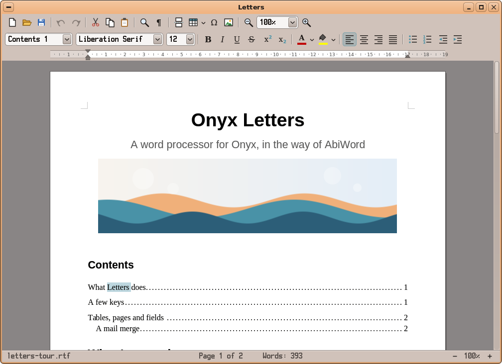
*Letters with its sample document (`SD:/docs/letters-tour.rtf`): its table of contents, a word selected, the toolbar showing its style, font and size.*

Letters is Onyx's word processor, in the way of AbiWord and Word (it was called *Writer* until
2026-10-04: a card that had Writer gets Letters as its update). The document is laid out on
**pages** — A4 by default, 2 cm margins — shown one under the other on a grey desk, each with its
**header** and **footer**, and every letter is drawn by **FreeType** from the TrueType fonts of the
card (`SD:/res/fonts`; a `.ttf` added to `SD:/fonts` shows up too): **Liberation Serif** and
**Liberation Sans** (the metrics of Times New Roman and Arial), **DejaVu Sans / Serif / Sans
Mono**, **Gelasio** (Georgia's), **Selawik** (Segoe UI's). A font a document names but the card
lacks is shown with its twin (Arial → Liberation Sans, Times New Roman → Liberation Serif, Courier
New → DejaVu Sans Mono, Georgia → Gelasio, Segoe UI → Selawik, others by kind) and keeps its name
when the document is saved. It reads and writes **Word (`.docx`)**, **OpenDocument (`.odt`)** and
**RTF** documents with their tables, headers, fields and lists; it fills letters from **Cardfile**
forms (the **mail merge**). No printing yet.

**The window**, from the top:

- **The standard toolbar**: New, Open, Save · Undo, Redo · Cut, Copy, Paste · Find and Replace,
  Formatting marks (¶: the spaces, tabs, line breaks and paragraphs' ends shown) · Page break,
  **Table** (the button: Insert Table...; its arrow: a grid — the cells under the pointer lit, a
  click inserts that many columns and rows), Special character (Ω), Insert image · the **zoom**
  (−, the list: Page Width, Whole Page, 25 %–400 %, +).
- **The format toolbar**: the paragraph's **style** (Normal, Heading 1–3, Title, Subtitle, Quote,
  Plain Text, Contents 1–3, Contents Heading, Header, Footer — the list shows each in its look),
  the **font** (the list shows each font in itself), the **size** (type a number then Enter, or
  pick one), **B I U S**, superscript and subscript, the **text colour** and the **highlight** (a
  click applies the colour shown under the letter; the arrow opens the palette: Automatic / No
  Colour, sixty colours, More Colours...), the four **alignments**, **bullets** and **numbering**,
  **decrease / increase indent**. The buttons show the text at the caret: bold lit on bold text,
  its font, its size, its alignment.
- **The ruler**: the page's width at the zoom, the margins grey, in centimetres (View ▸ Ruler in
  Inches / Centimetres). Its markers are the paragraph's indents — the first line's (the triangle
  on top), the hanging indent (the triangle below), the left indent (the little box: both
  together), the right indent: **drag them** (the selected paragraphs change, one undoable edit).
  Drag the edge between the grey and the white to move the page's left or right margin. In a
  **table**, the ruler is the cell's (its numbers from the cell's left edge) and shows the table's
  **column borders**: drag one to resize the columns on both sides of it.
- **The pages**: a click places the caret, a **drag** selects (past the edge, the page scrolls),
  a **double click** selects a word, a **triple click** the paragraph, **Shift+click** extends the
  selection; the **wheel** and the scroll bars scroll; a **right click** opens a menu (Cut, Copy,
  Paste, Font..., Paragraph..., then — in a table — Insert Row Below, Insert Column Right, Delete
  Rows, Delete Columns, Merge Cells, Split Cell, Table Properties...; in a table of contents,
  Update Table of Contents; in a header or a footer, Close Header and Footer; else Bullets,
  Numbering —, Select All). A **double click in the top or bottom margin** edits that page's
  header or footer; a table's **column border** is dragged on the page too.
- **The status bar**: the file's name ("modified" when it is), the caret's page and the number of
  pages (in a header: "Header - Page 2 of 3"), the number of words, the zoom (− / +).

**Keys**: typing replaces the selection; the arrows (**Ctrl**: by word, by paragraph; in a table,
Up / Down go from cell to cell), **Home / End** (the line's; Ctrl: the document's), **Page Up /
Down**, with **Shift** to select; **Backspace / Delete** (Ctrl: a word); **Enter** a new paragraph
(after a heading: a Normal one; in an empty list item: the end of the list; in a table: a new
paragraph in the cell), **Shift+Enter** a new line in the paragraph; **Tab** the next tab stop (the
paragraph's own, else every 1.25 cm) — at the start of a list item, a level down (**Shift+Tab**:
up); in a table, the **next cell** (in the last one: a new row; **Shift+Tab** the previous cell);
**Esc** drops the selection, or leaves a header or a footer. Shortcuts: **Ctrl+N / O / S** New,
Open, Save · **Ctrl+Z / Y** Undo, Redo · **Ctrl+X / C / V** Cut, Copy, Paste · **Ctrl+A** Select
All · **Ctrl+F** Find and Replace · **Ctrl+B / I / U** bold, italic, underline · **Ctrl+L / E / R
/ J** left, centred, right, justified · **Ctrl+D** Font....

**The menus**: **File** (New, Open..., Save, Save As..., Export as HTML..., Export as Text...,
**Export as PDF...**, Page Setup...), **Edit** (Undo, Redo, Cut, Copy, Paste, Paste Unformatted, Select All, Find and
Replace...), **View** (Actual Size, Page Width, Whole Page, **Header and Footer**, Formatting
Marks, the ruler's unit), **Insert** (Page Break, **Table...**, Image..., Special Character...,
**Page Numbers...**, Date and Time..., **Field...**, **Table of Contents**), **Format** (Font...,
Paragraph..., **Tabs...**, Bold, Italic, Underline, Strikethrough, Superscript, Subscript, Clear
Formatting, the four alignments, Bullets, Numbering), **Table** (Insert Rows Above / Below,
Insert Columns Left / Right, Delete Rows, Delete Columns, Delete Table, Merge Cells, Split Cell,
Distribute Columns Evenly, Select Table, Table Properties...), **Tools** (Word Count..., Update
Table of Contents, **Mail Merge...**).

**Tables**

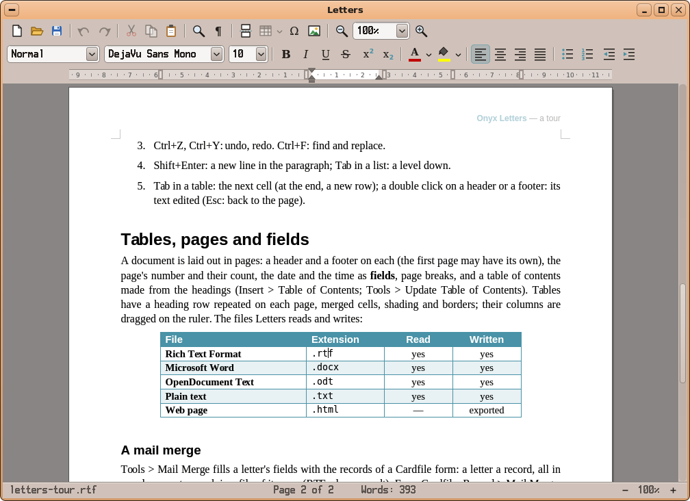
*The sample's second page: its header, a table with a heading row and shaded rows, the caret in a cell — the ruler shows its columns.*

**Insert ▸ Table...** asks the number of columns and rows (and whether the heading row is repeated
on each page); the toolbar's grid inserts one at once. The table spans the text's width, its columns
even; each **cell** holds paragraphs of its own (styles, lists, images, fields...). **Tab** goes
from cell to cell and, in the last one, adds a row. A **drag** across cells selects them, as does
**Table ▸ Select Table**. The **Table** menu acts on the selected cells: it inserts **rows** above
or below them (as many as selected) and **columns** left or right, **deletes** the rows, the columns
or the whole table, **merges** the selected cells into one (their text kept, one paragraph under the
other) and **splits** a merged cell back, **distributes** the columns evenly. **Table
Properties...**: the lines (all, none, the outline only, the rows only), their width and colour, the
table's alignment on the page and its indent, the heading row repeated on each page; for the
selected cells, the columns' width, the rows' least height and the **shading**. A table breaks
across pages between its rows — a row, and the rows its merged cells span, kept whole —; its
**heading row** is drawn again at the top of each page. Each change undoes in one step.

**Pages: headers, footers, page numbers, fields**

- **View ▸ Header and Footer** (or a **double click** in a page's top or bottom margin) edits the
  header or the footer — the body greyed, the header's frame labelled "Header", "First Page
  Header"...; a double click on the body, **Esc** or the menu again goes back. A header or a footer
  holds what a page does (styles, tab stops, images, fields), and the page's body starts below
  it when it grows.
- **Insert ▸ Page Numbers...**: at the top (the header) or the bottom (the footer), left, centred
  or right, as "1", "Page 1", "Page 1 of 3" or "1 / 3", and whether the first page shows it (else
  the first page gets a header and footer of its own).
- **File ▸ Export as PDF...**: the document as a **PDF**, as its pages are laid out — all of them,
  the current one or a range (`2-5`) —; the fonts **embedded** (only the letters used: the PDF looks the
  same everywhere, its text can still be selected and searched), the **headings as bookmarks**, the
  photos kept as they are or as JPEG (a smaller file), its title and author; the PDF opens in the PDF
  Viewer afterwards. What is only for the screen (the fields' shading, the crop marks, a table's grid
  without lines, the formatting marks) is left out.

  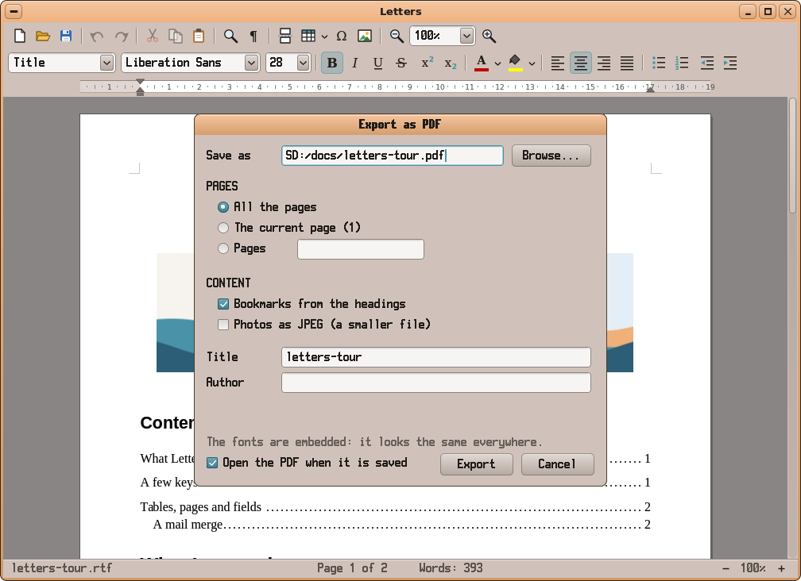
- **File ▸ Page Setup...**: the paper (A4, A5, A3, Letter, Legal), portrait or landscape, the four
  margins, the header's distance from the page's top and the footer's from its foot, **Different
  first page** (a title page with its own header and footer), the **first page's number**; a
  preview of the page.
- **Insert ▸ Field...**: the **page number**, the **number of pages**, the **date** or the
  **time** (in the form chosen), text kept up to date (shaded grey on the screen, not in the
  files); **Insert ▸ Date and Time...** types today's date or the time — as a field with **Update
  automatically**.
- **Format ▸ Paragraph...** says how the pages break: **Page break before**, **Keep with next**
  (the headings are), **Keep lines together**, **Widow / orphan control** (no paragraph's first or
  last line alone at a page's foot or top: on by default).

**Tab stops**: **Format ▸ Tabs...** (or the Paragraph dialog's **Tabs...** button) lists the
paragraph's tab stops: a **position**, an **alignment** (left, centred, right, **decimal** — the
numbers' points lined up) and a **leader** (none, dots, dashes, a line), **Set** / **Clear** /
**Clear All**; past the last one, the default stops every 1.25 cm.

**The table of contents**: **Insert ▸ Table of Contents** puts one at the caret — a "Contents"
heading, then a line for each **Heading 1, 2 and 3** of the document, indented by level, its page
number at the right after a line of dots. **Tools ▸ Update Table of Contents** (or its right-click
menu) makes it again after the document changed — its titles and its pages.

**The mail merge**


*Tools ▸ Mail Merge over the sample letter (`SD:/docs/new-year-letter.rtf`): the Contacts form's fields, the first record's values shown in the letter.*

A **letter** (any Letters document) gets **merge fields** — the columns of a **Cardfile** form —
that the mail merge fills with the form's **records**: one letter per record. **Tools ▸ Mail
Merge...** opens the dialog: **Records** — the Cardfile form (`.card`) the letter's fields come
from (**Choose...**; the letter remembers it); **Its fields** — a double click (or **Insert the
Field**) puts one at the caret, shown «name» in the letter; **Preview the values** shows a
record's values instead, **‹ ›** go through the records; **Merge**: **All the records** or **The
record previewed**; **Merge to a New Document** opens the letters, each on a new page, as a new
document in another Letters; **Merge to Files...** writes each letter in a file of its own — the
name and the folder chosen give the folder and the format (`.rtf`, `.docx`, `.odt`), the files
named after a field (**Files**: "Named after: Name" → `Alice Martin.odt`) or numbered
(`letter-1.odt`...). Cardfile does the same from a form: **Record ▸ Mail Merge...** (see
*Cardfile*); so does **Ledger**, printing its quotes, orders and invoices from templates — a table's
row holding a document's lines' fields («LineText», «LineQty», «LineTotal»...) is repeated for each
line (see *Ledger*); one document written opens at once. A multi-line value (an address) keeps its lines; a date shows as in Cardfile
(29/09/2026), yes / no as Yes / No. Files written: the documents chosen; `SD:/apps/letters.app/
merge-letter.rtf` and `merge.job` (the request to the other Letters).

**Files**: **`.rtf`** (Rich Text Format), **`.docx`** (Word 2007 and later) and **`.odt`**
(OpenDocument Text: LibreOffice, OpenOffice), read and written with **everything** — the fonts,
sizes, colours, highlights, styles, alignments, indents, spacing, tab stops, lists, page breaks,
images, tables (merged cells, lines, shading, the heading row), the headers and footers (the first
page's own), the fields (page, pages, date, time, the merge fields), the table of contents, the
page's size and margins; documents from Word, WordPad, LibreOffice or AbiWord open with theirs (a
feature Letters lacks is left out: text boxes and shapes, comments; tracked changes are read
accepted). **`.txt`**: plain text (UTF-8 when a character needs it, else Latin-1 like
the rest of Onyx). **Save** writes the format of the file's name (a new document: Save As...,
`.rtf` by default — type `.docx` or `.odt` for those; saving formats as `.txt` asks first);
**File ▸ Export** writes an **HTML** page (its images inside it) or a text file, the document
staying where it was. A `.rtf`, `.doc`, `.docx` or `.odt` double-clicked in the File Viewer opens
in Letters (`fileassoc.ini`; so does the RTF Reader's File ▸ Edit in Letters), as does `letters
<file>`; **drop** a file on the window to open it, or text to insert it at the caret. New, Open
and a drop first ask to **save unsaved changes**; **closed with unsaved changes** (the close box,
Quit), the document is kept in `SD:/apps/letters.app/recovered.rtf` and offered back when Letters
starts again. **Undo** keeps the last 200 edits (a word typed is one). Copy and paste within Letters
keep the formats (and the images); the other apps get the text. Documents
usually start in `SD:/docs`; the samples: `SD:/docs/letters-tour.rtf`, `SD:/docs/new-year-letter.rtf`
(the letter of the Contacts form: `SD:/docs/contacts.card`).

### Paint (`paint`)


*Paint: a picture of five layers — a sky (the Fill tool's Sunset gradient), mountains and a sun, a warm tint
(Multiply, 60 %), a title (the Text tool), a vignette (a white rounded rectangle as a Mask).*

Paint draws on **layers**: transparent sheets stacked over the background, each shown or hidden, more or
less opaque, and mixed with what is under it by its **blend mode**. The window: the **ribbon** at the top,
the **options bar** of the current tool under it, the **canvas** (the picture on a dark neutral desk, its
transparent parts over a checkerboard), the **Layers** panel on the right, the **status bar** at the bottom.
The picture is assembled by the **graphics processor** (the GPU: each layer a texture, the blend modes done
by its blender — kernel kapi v72; with an older kernel the processor does it, the same pixels).

**The ribbon**, from the left:

- **Clipboard**: **Paste** (the copied pixels — or a picture file copied in the File Viewer — floating,
  ready to be moved; a **right click**: *Paste as New Layer*, *Open as Layer…*), **Cut**, **Copy**,
  **Undo**, **Redo**.
- **Image**: **Select** (its menu: **Rectangle**, **Free-form** — the lasso: draw around —, **Magic wand**
  — the pixels of about the colour clicked —, Select All, Invert Selection, Deselect, Delete, Crop to
  Selection), **Crop**, **Resize**, **Rotate** (right or left 90°, 180°, flip; the selection if there is
  one, else the whole picture — every layer).
- **Tools**: **Pencil** (hard square pixels), **Fill**, **Text**, **Eraser**, **Colour picker** (from what
  you see: left colour 1, right colour 2), **Magnifier** (left in, right out), **Gradient**, and **fx**
  (the colours and filters).
- **Brushes**: the brushes' gallery — **Pencil**, **Brush** (round, a smooth edge), **Soft round** (its
  hardness), **Calligraphy** (a flat nib at 45°), **Airbrush** (sprayed dots that build up), **Marker**
  (translucent: half opacity), **Crayon** (grain), and the **patterns** — Dots, Lines, Checks, Bricks,
  Hatching, Grid: colour 1 where the pattern is set, on the picture's grid (two strokes join seamlessly).
  A stroke never darkens where it crosses itself (but the airbrush's).
- **Shapes**: line, rectangle, rounded rectangle, ellipse, triangles, diamond, polygons, stars, arrow,
  heart — inscribed in the box you drag; **Shift**: a square box (a circle, a regular polygon), a line at
  0°, 45° or 90°.
- **Colours**: **colour 1** and **colour 2** (click one to choose which one the palette sets), the palette
  (left: colour 1, right: colour 2), **ten colours of your own** filled by **Edit**. **X** swaps them.

**The options bar** shows what the current tool takes: the **size** and **opacity** of the pencil, the
brushes, the eraser (and the **hardness** of the soft brush and the eraser); the selection's kind and mode
(**New**, **Add** — or hold **Shift** —, **Subtract** — or hold **Alt**); the wand's and the fill's
**tolerance** (how far a colour may be from the one clicked: 0 the same only), **Contiguous** (only what
touches it) and **All layers** (look at the picture as seen, not only the current layer); the fill's
**Colour / Gradient / Pattern**; the gradient (below); the text (below); the shapes' **Outline** (colour 1),
**Fill** (colour 2), width and opacity.

**Drawing**: the left button uses colour 1, the right one colour 2 (a shape: its outline colour 1 and its
inside colour 2 — the right button swaps them). Whatever you draw stays **inside the selection** when there
is one. The **wheel** scrolls (Shift: sideways), **Ctrl + wheel** zooms around the pointer, the **middle
button** drags the view; **+ / −** zoom; the status bar's **grid**, **fit**, **− slider +** and percentage
(a list) too. Keys: **S** rectangle selection, **L** lasso, **W** magic wand, **P** pencil, **B** brush,
**E** eraser, **F** fill, **G** gradient, **T** text, **K** colour picker, **Z** magnifier, **U** shapes;
**Delete** clears the selection, **Esc** puts a floating selection down (or forgets the selection), the
arrows move a selection (Shift: ten pixels), **Ctrl+I** inverts it.

**Gradients** — the **Fill** tool in **Gradient** mode (as you asked for it): **press** in the zone to fill
(its colour, within the tolerance) and **drag a line**: the zone is filled with the gradient **along that
line** (its direction and length; **Shift**: 15° steps). The line stays with its two ends: drag them to
adjust, **Enter** applies, **Esc** cancels (a click elsewhere applies too). A click without dragging fills
the zone from its left to its right. The **Gradient** tool does the same over the selection (or the whole
layer); its **Erase** option fades the layer instead (opaque at the line's start, gone at its end). The
options: the **gradient** (the list: Colour 1 to 2, Colour 1 to transparent — they follow your colours —,
Dusk hills, Sunset, Ocean, Rainbow, Metal, Fire, and yours), its **shape** (linear, bi-linear, radial,
square, conical), **repeat** (none, sawtooth, triangular), **Reverse**, the opacity.
**Edit gradients…** (at the list's foot, or Colours ▸ Gradients…) opens the **gradient editor**, as GIMP's:
the gradients on the left (a preset is copied — **Copy** — to be changed; **New**, **Delete** yours), the
chosen one's **name**, its bar with its **stops** under it (click under the bar: a new stop; drag a stop:
move it, off the bar: remove it) and the **midpoints** above it (drag: where the two colours are half and
half), the stop's **colour** (a click: the colour dialog), **position** and **opacity**, **Reverse**, **Space
evenly**. Yours are kept as GIMP gradient files in `SD:/apps/paint.app/gradients/*.ggr` (GIMP's own `.ggr`
files copied there are read too).

**Text**: click on the picture and type (Enter: a new line, Backspace, Delete, the arrows); the options
bar: the **font** (the card's TrueType families), the **size**, **B** / **I** / **U**, the alignment,
**Smooth edges**, **Background** (colour 2 behind the text). Drag the text's box to move it; a click
outside (or another tool) puts it down; **Esc** forgets it.

**Colours and Filters** (the menus, or the **fx** button): **Brightness / Contrast**, **Hue / Saturation**
(and lightness), **Desaturate** (how much), **Colorize** (the picture's lightness in one hue: its hue,
saturation, lightness), **Remap the Channels** (red, green and blue each taken from another channel — or
black, or white: swap red and blue, make a channel's picture…), **Invert Colours**, **Sepia**, **Posterize**
(levels), **Threshold** (black or white); the filters **Blur**, **Sharpen**, **Pixelate**. Each dialog has
**Apply to**: **the selection** (of the current layer), **the layer** (all of the current layer) or **every
layer**; the picture shows the result as you move the sliders; **OK** keeps it (one Undo), **Cancel** puts
it back. The Colours menu also has Edit Colours, Swap Colours and Gradients.

**The layers**: the panel lists them, the top one first, each with its **eye** (shown or hidden — **a
hidden layer is as if it did not exist**), its thumbnail, its name, its blend mode and opacity. At the top
the current layer's **Blend** mode and **Opacity**. A click on a layer makes it the one you draw on; a
**double click** opens its properties (name, blend, opacity, shown); a **right click** its menu (New Layer,
New Layer from a File…, Paste as New Layer, Duplicate, Delete, Move, Merge Down, Hide, Properties).
The buttons: new, duplicate, delete, up, down, merge down, properties. The Layers menu adds **Flatten**.

**Blend modes** — how a layer mixes with **everything under it** (the layers below, as already assembled):
**Normal**; **Multiply** (darkens, tints: white changes nothing — a coloured layer in Multiply tints the
picture); **Screen** (lightens: black changes nothing); **Add** (a glow); **Subtract**; **Lighten** (the
lighter of the two); **Mask** — what is under it is **kept only where the layer is opaque** (its colour does
not matter: a white disc makes the picture round), half kept where it is half transparent; **Cut out** — the
opposite: what is under it is **removed where the layer is opaque**. A Mask or Cut out layer can act **on
the layer below only** (its Blend list, or its properties: *On the layer below only*; the panel joins the
two with a bracket): that layer is shown through it, the others are not touched — a **layer mask**.

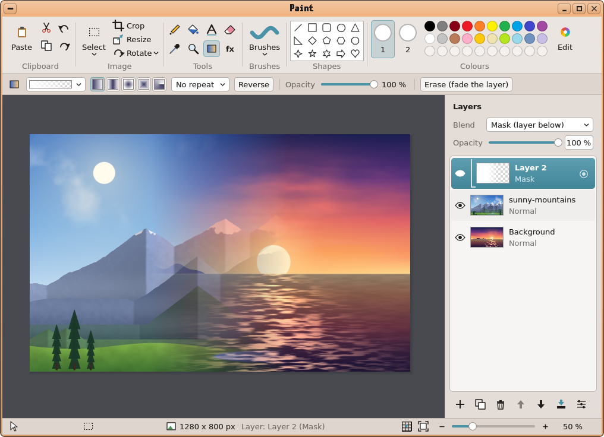
*A fade between two pictures: the sunset (Background), the mountains opened as a layer, and above them a
white-to-transparent gradient as a Mask **on the layer below only** — the mountains fade into the sunset.*

To **fade one picture into another**: open the first one, **File ▸ Open as Layer…** the second one (it
comes floating on a new layer: move it, click outside to put it down), add a layer, draw on it a gradient
**Colour 1 to transparent** in white (the Gradient tool), set it to **Mask** and **On the layer below only**.
The fade can be changed at any time (draw the gradient again). Two pictures to try it with are on the card:
`SD:/docs/pictures/sunset-sea.jpg` and `sunny-mountains.jpg`. (Or, without a mask: the Gradient tool's
**Erase** on the upper picture fades it for good.)

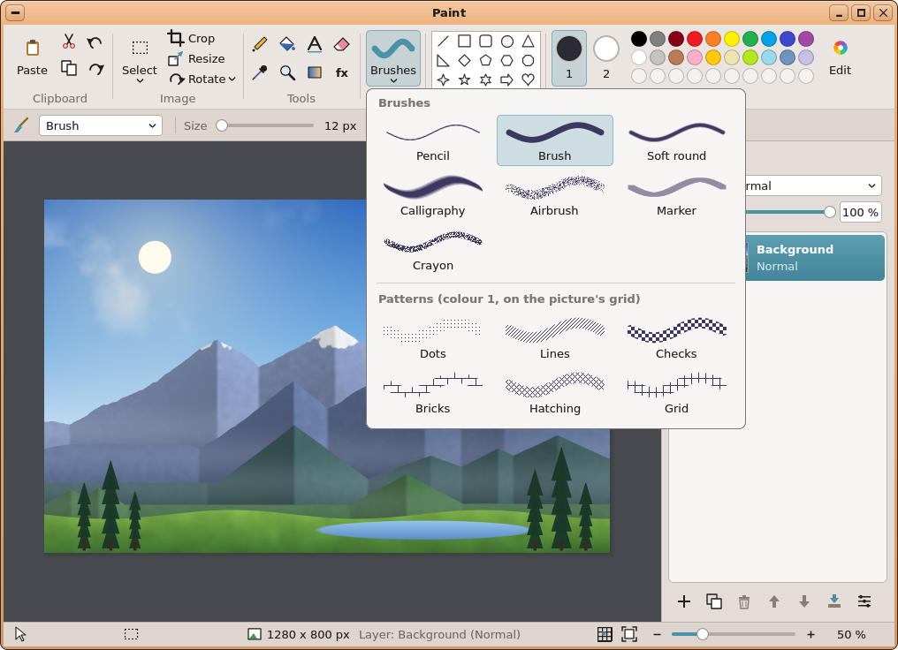
*The Brushes gallery.*

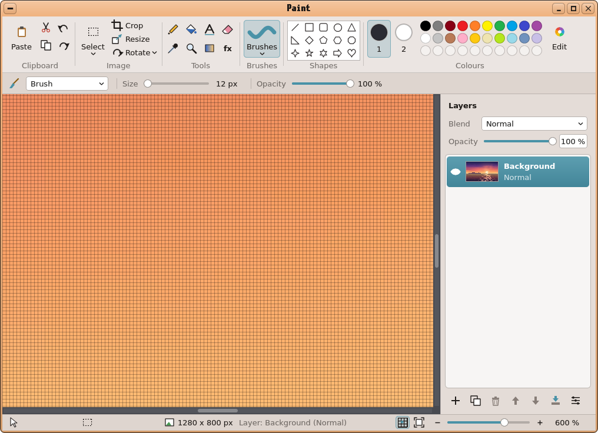
*The pixel grid at 600 % (View ▸ Grid, Ctrl+G; seen from 300 %).*

**Files**: **File ▸ Save** (Ctrl+S) writes the **working format**, OpenRaster (`.ora`: every layer kept with
its name, opacity, visibility and blend mode — GIMP, Krita and MyPaint open it, with the modes); **File ▸
Open** reads it, or a **PNG, JPEG, BMP, GIF** (its first frame), WebP or PCX picture (one layer: the
Background); **File ▸ Open as Layer…** adds a picture as a new layer. **File ▸ Export as PNG / JPEG / BMP /
GIF** writes **what is shown**, flattened (the blend modes applied as on the screen): PNG and GIF keep the
transparency, JPEG (quality 90) and BMP lay the transparent parts on white. **File ▸ New** (Ctrl+N) asks
for the size (800 × 560 by default) and a white or transparent background. A picture named on the command
line (`paint <file>`: the Image Viewer's File ▸ Edit in Paint), dropped on the window or double-clicked (a
`.ora`) opens; New, Open and a drop first ask to save unsaved changes. **Closed with unsaved changes**, the
picture is kept in `SD:/apps/paint.app/recovered.ora` and offered back the next time Paint starts. **Undo**
keeps the last 60 changes (a stroke is one).

**The dialogs** (New, Resize, Layer Properties, the colours and filters, the gradient editor) — as every dialog of
Onyx: **Tab** goes to the next field (**Shift+Tab** the one before), **Enter** is OK, **Esc** Cancel. Resize:
the picture **scaled** (by pixels or a percentage; *Keep the proportions*: the other side follows as you
type; sharp or smooth) or its **canvas** made bigger or smaller (anchored top left, centre or bottom right).

### 3DForge, the small parametric CAD (`3dforge`)

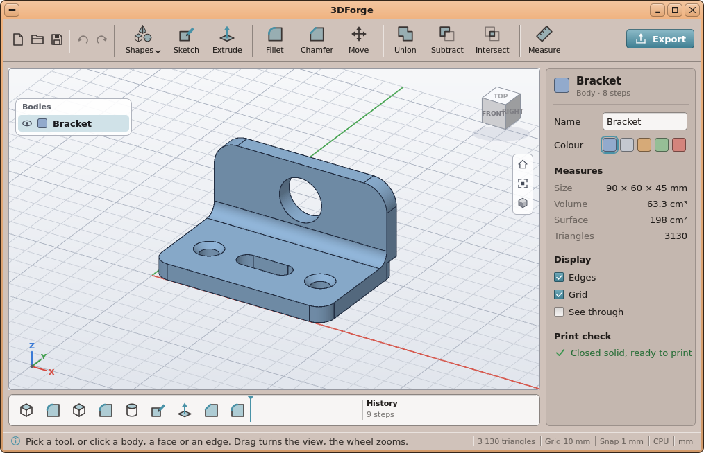
*3DForge: the sample bracket. The tools, the view with the bodies' panel and the orientation cube, the timeline
under it, the selection at the right.*

**3DForge** (Graphics) makes solid parts for 3D printing out of simple steps: a shape drawn by click, move, click;
a sketch on a face and its extrusion; bodies joined, cut or intersected; edges rounded or chamfered. Every step
keeps its values in a **history**: change one, and everything made after it is made again. The geometry is
computed by Manifold; the view is drawn by the GPU (the status bar says `GPU`, or `CPU` when the processor draws).
Its second half, **Manufacture** (the switch at the left of the tools), turns a body into the **G-code** a CNC
router runs — see further down.
Parts are saved as `.3df` (a double click on one in the File Viewer opens it); a sample is in `SD:/docs/3d`.

**The view.** Drag with the left button to **turn** it, with the right button (or Shift + drag) to **pan**; the
**wheel** zooms on the pointer. The **cube** at the top right shows the orientation: click a face to look from
there; under it, *home*, *fit* and *see through*. The **Bodies** panel at the top left lists the bodies: the eye
hides or shows one, a click selects it (its name, colour, measures and whether it is a closed solid ready to print
are then at the right). Under them, the **Sketches**: a click shows one, **Edit** (or a double click) opens it to
change it — what was extruded from it follows. The **timeline** under the view is the history, a picture a step: click a step to see and
change its values at the right, double-click a sketch to open it, right-click for *Roll back to here* (the part as
it was after that step: the blue bar), *Roll to the end*, *Delete*. The **blue bar** can also be **dragged** along
the steps to go back in the history for a while — the steps behind it wait, greyed — and dragged back to the end. Longer than its room, the timeline moves with
its arrows, the wheel, or dragged.

**Shapes.** The **Shapes** button unfolds them: Box, Cylinder, Sphere, Torus, Pyramid, Prism, Taper (a prism whose
top is smaller or larger than its base).

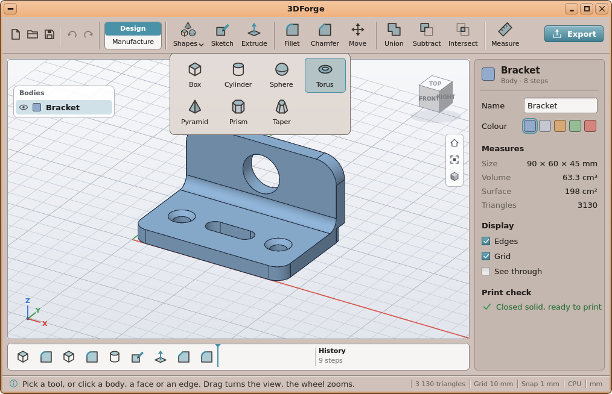

A shape can be made two ways. **With the pointer**, each in a few clicks:

| Shape | The gesture |
|---|---|
| **Box** | Click its centre (on a face, or on the ground), move away for the width and the depth, click, move up for the height, click. |
| **Cylinder** | Click the centre, move away for the radius, click, move for the height, click. |
| **Sphere** | Click the centre, move away for the radius, click. |
| **Pyramid**, **Prism** | Click the centre, type the number of sides of the base (4 at first; 0: round — a pyramid of 0 sides is a cone), move away for its radius — a corner of the base points to the pointer, which **turns** it —, click, move up or down for the height, click. |
| **Taper** | As the prism, with one more move and click after the base: the top's radius (its distance from the centre). |
| **Torus** | Click the centre, move away for the ring's radius, click, move off the ring for the tube's radius, click. |

At every moment the field of the value being set has the keyboard: **type the value** instead of moving, **Tab**
goes to the next field, **Enter** goes on. A value typed is no longer changed by the pointer. **Without the
pointer**: as soon as a shape is chosen, all its values and its place are fields at the right — set them and press
**OK** (nothing is shown in the view before the first click; a ghost appears once a value is typed).

**Where a shape is.** The first click may be on the ground or on any **flat face of a body**: the shape then stands
on that face (a sphere has its centre on it — subtract it to hollow a bowl in the top of a block). At the right,
*Centre X* and *Y* are its place on that plane, and **Z** (*Off the face* on a body) how far off it: up from the
ground, out of the face — less than 0, sunk into it. **Turned** turns a box or a base with sides about its axis,
in degrees.

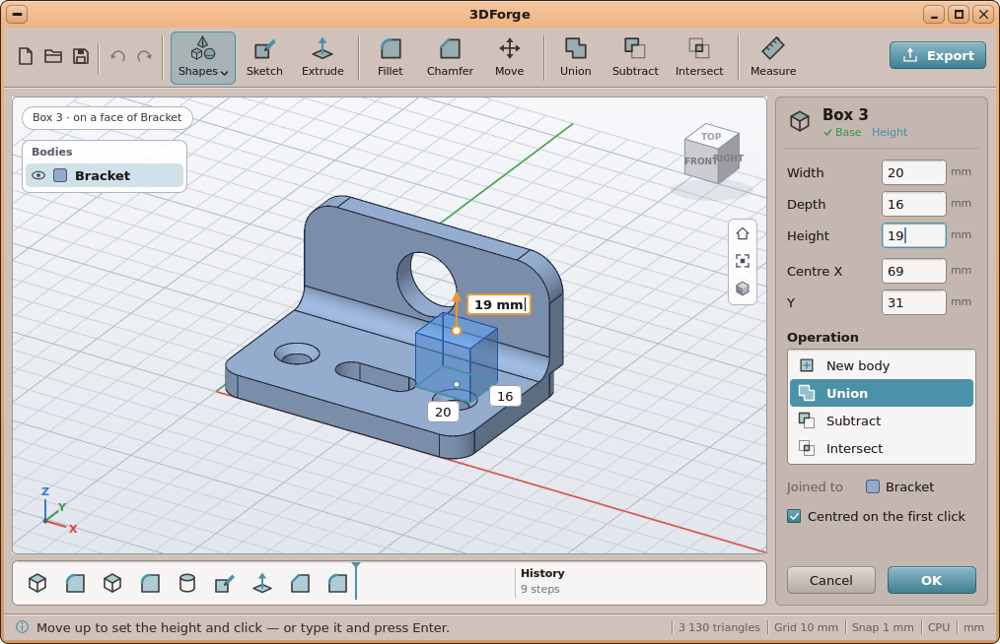
*A box started on a face of the body: Union is chosen, the body named.*

**The operation.** A shape started on the ground is a **new body**. Started on a face of a body it is **joined**
to it (Union) when pulled out, and **cut** from it (Subtract) when pushed in — the preview turns red. The list at
the right changes it: New body, Union, Subtract, Intersect. *Through the whole body* (cylinder, extrusion) cuts
all the way.

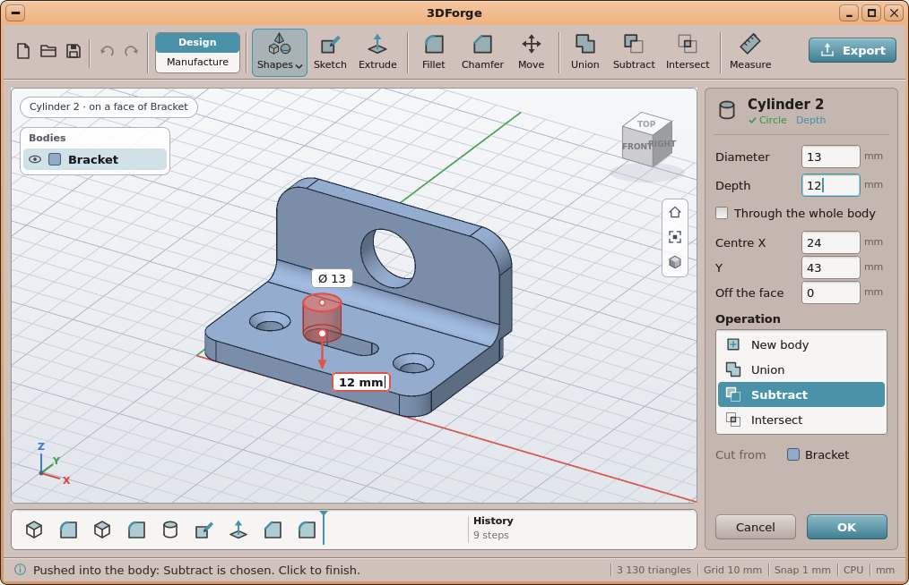

**Sketch and Extrude.** *Sketch*, then a click on a flat face (or the ground) — or, at the right, a **plane of
the axes**: *XY* (the ground, seen from above), *XZ* (upright, seen from the front) or *YZ* (upright, seen from the
right), its **Offset** (how far along the third axis; the plane is shown in the view), then *Start the sketch*.
The view turns to face the plane, the plane's **two axes through its origin** drawn in the colours of the
model's (X red, Y green, Z blue), and the
tools become **Line**, **Rectangle**, **Circle**, **Arc**, **3-pt arc**, **Spline**, **Point** and **Close**. There
are no constraints to solve: each
element is a recipe — where it starts (the end of the one before, or a point), its angle and its length; an arc by
its centre, its radius and its angle — and they are replayed in the order they were drawn.

| Tool | The gesture |
|---|---|
| **Line** | Click where it starts, click where it ends (or type its length and its angle); the next one starts there. |
| **Rectangle** | *From its corner*: click a corner, click the opposite one. *From its centre* (the choice at the right): click the centre, then a corner. Or type the width and the height. |
| **Circle** | Click the centre, click to set the diameter. |
| **Arc** | Click the **centre**, click where it **starts** (which sets the radius), click where it **ends**: the angle — **positive clockwise, negative anticlockwise**; it can be typed. After a line, the arc starts at the line's end: click the centre, then the end. |
| **3-pt arc** | Click its two ends, then move its middle — it slides on the line that cuts the chord in two — and click, or type the radius. |
| **Spline** | Click the points a smooth curve goes through; **Enter**, or the last point clicked again, ends it. |
| **Point** | A mark: part of no outline, nothing is extruded from it — the pointer snaps to it. |
 A run of lines and arcs
goes on from its last point until it comes back to its first (the green ring: *closes the outline*), **Close**
(a line back to the start) or **Esc**. The pointer **snaps**: to the grid (1 mm); to a point when it is near one — an element's ends and centre, the
**middle of a line**, a rectangle's corners, a spline's points, a mark, the **origin** (a green diamond shows the
point that holds it); angles go by steps of **5°**, and stick to the multiples of **45°** when near one (a
perpendicular, a diagonal, a quarter of a turn). The check box *Snap* at the right turns all of it off. A closed outline is filled in blue; the timeline shows the elements — click one to change its
values — and how many outlines are closed or still open. **Finish sketch** keeps it. **Extrude** then pulls the
last sketch (or the one selected) up, or pushes it into the body; an outline inside another is a hole.

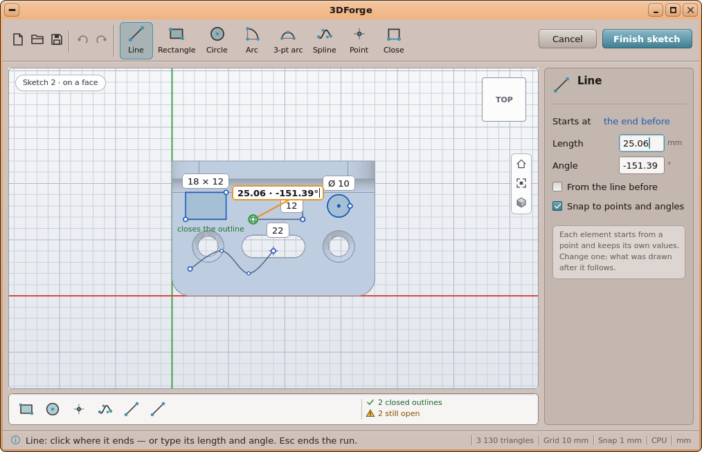

**A canvas** is a picture — a drawing, a photograph, a scan — laid on a plane to **draw over it**: *File > Import
Canvas…* (PNG, JPEG, BMP, GIF, WebP), or a picture **dropped** on the window. It lies on the plane being drawn on —
the sketch's when one is open, the one chosen for a sketch, else the ground —, 100 mm wide, and is seen **through**
(45 % at first), in the 3D view and in a sketch, where its lines can be followed. The **Canvases** are listed
under the bodies and the sketches: the eye hides or shows one, a click on its name selects it. Selected, it is
**dragged** in the view to move it on its plane, and by a **corner** to size it; at the right, at any time: its
*plane* (XY, XZ, YZ) and its place along the **third axis**, its *X* and *Y* on the plane, its *width* (its height
follows), an angle, its *opacity*, *Shown*, and *Remove this canvas*. A canvas is not a step: nothing is made from
it. The part's file keeps the picture's path, not the picture: keep the file where it is.

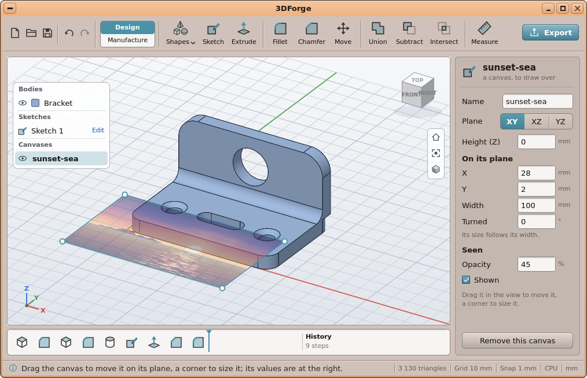

**Fillet and Chamfer.** Click the edges (the one pointed turns orange; an edge that cannot be done, grey), then drag
the arrow or type the size. An inner edge is filled, an outer one cut. 3DForge rounds **straight edges between
two flat faces**, **edges on a circle** (the rim of a hole, the top of a cylinder) and **arcs** (the rim of a
corner already rounded). **At a corner** the rounds meet properly, in one step or several: two edges rounded one
after the other are **mitred** (as skirting boards), and the third edge of the corner — the upright one of a box
whose two top edges are rounded, or the top's edges and the arc of a box whose upright edge is — turns the rounds
around it: a piece of a sphere when the radii are the same, of a torus otherwise. An edge that stops against a
wall is rounded up to the wall, which is left whole.

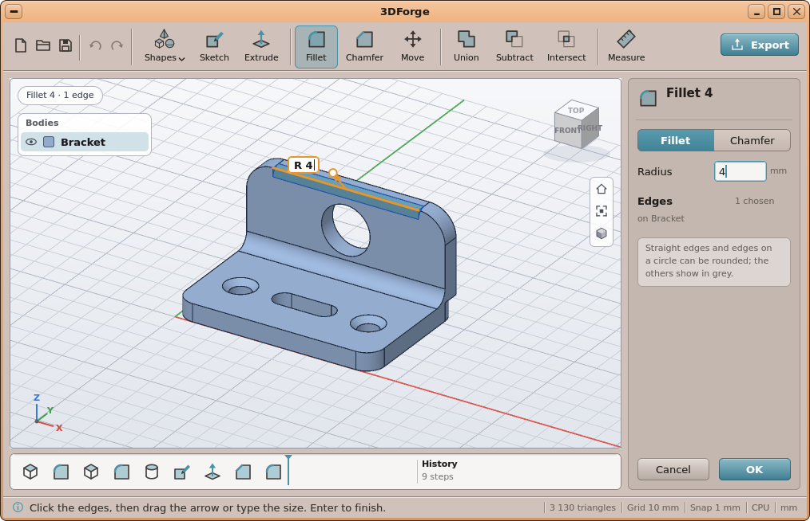

**Move** — click a body, move it over the ground and click (or type the three distances). The same step also
**turns** the body (degrees around X, Y and Z, about its centre) and **scales** it (a factor along each axis: 1
leaves it as it is, 2 doubles it) — type them at the right; a ghost shows the result before OK. With **Clone**
checked the original stays where it is and a copy of it, a new body, is what moves, turns and scales. **Union**,
**Subtract**, **Intersect** — click the body to keep, then the other. **Measure** — click two points.

**Export** writes the whole part or the selected body, the curves cut in 48, 96 or 192 sides to a circle:

| Format | What is written |
|---|---|
| **STL** (binary or text), **OBJ** | The mesh, for a slicer or another 3D program. The number of triangles and the file's size are shown before writing. |
| **DXF**, **SVG**, **PDF** | A **flat drawing** of the part *seen from* a side you choose — Front, Back, Left, Right, Top, Bottom, or as on screen —: its edges and outlines, at the part's own size in millimetres (1:1; the PDF's and the SVG's page is the drawing plus a margin of 10 mm). What is hidden behind a face is left out, or, with *Hidden edges too*, drawn dashed (in the DXF: on the layer `HIDDEN`, the others on `VISIBLE`). Curves are short straight lines. |
| **PNG** | A **picture** of the part seen from that side, shaded as in the view, on white, 1024 pixels along its longer side. |

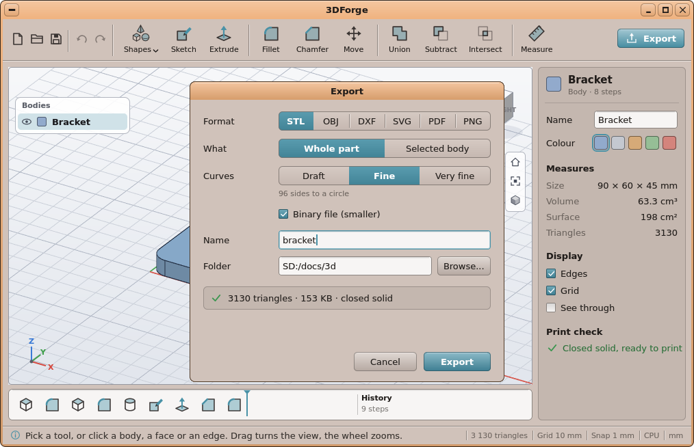

| Menu | Items |
|---|---|
| **File** | New (Ctrl+N), Open (Ctrl+O), Save (Ctrl+S), Save As, Export (Ctrl+E), Import Canvas |
| **Edit** | Undo (Ctrl+Z), Redo (Ctrl+Y), Delete Step (Del), Roll Back to the Step, Roll to the End |
| **View** | Home, Fit, Top, Front, Right, Edges, Grid, See Through, Draw with the Processor |
| **Create** | the seven shapes, Sketch, Extrude |
| **Modify** | Fillet, Chamfer, Move, Union, Subtract, Intersect, Measure |
| **Manufacture** | Design, Manufacture, Setup, Tool and Machine, New Clearing, New Contour, Simulate, G-code / Print File (Ctrl+G), Process: Milling, Process: Resin Printing, Supports, Generate Supports, Layers, Process: Filament Printing, Filament |

Keys: **Enter** the step goes on (as OK), **Esc** leaves the tool (in a sketch: ends the run), **Del** deletes the
selected step (in a sketch: the selected element).

*What it does not do*: everything is a mesh — a circle is a polygon of 96 sides, right for printing, but there is
no STEP export; edges that are neither straight nor on a circle cannot be rounded, and a corner's rounds are
turned around it only where its faces are square to one another; a face or an edge chosen for a
step is kept by its place: after a change up the history a later fillet may have to be given its edge again (it
then shows a warning in the timeline).

#### Manufacture: G-code for a CNC router

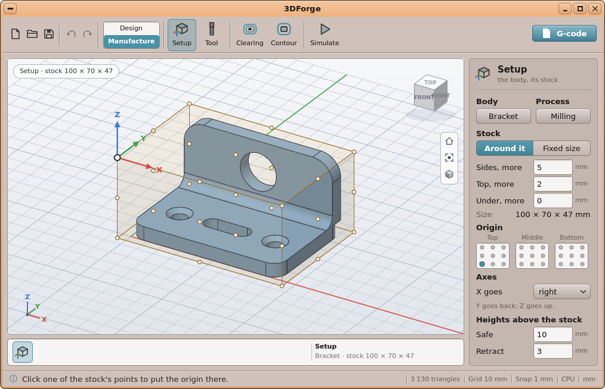
*The setup: the body in its stock, the origin on one of the stock's 27 points, the machine's axes.*

**Manufacture** (the switch at the left of the tools; **Design** comes back to the part) makes **one body**. What it
makes is the **Process**, chosen in the setup beside the body: **Milling** — the G-code of a router, described
here —, **Resin printing** — the layers of a resin printer — or **Filament printing** — the path of a filament
printer's nozzle —, both described after. Milling prepares the cutting of the
body on a 3-axis router driven by **GRBL**, with a **flat end mill**. The view shows that body alone, in
its **stock** (the block it is cut from, see-through); the timeline shows the setup, then the operations in the
order they are run. Everything is kept in the `.3df`.

- **Setup** — the **body** (a click on its name lists the part's bodies); the **stock**: *around it* with a margin
  on the sides, on the top and under, or of a *fixed size* — the body is then in its middle, its underside on the
  stock's, and *Moved, X / Y / Z* moves it in the stock from there (0 at first); the **origin** — where the machine's X0 Y0 Z0 is: one of
  the stock's 27 points (its corners, the middles of its edges and faces, its centre), clicked in the view or in the
  three small grids (top, middle, bottom); **X goes** right, back, left or front (Y follows, a quarter turn to its
  left; Z goes up); the heights above the stock: *safe* (between operations), *retract* (between passes).
- **Tool** — the end mill's diameter and cutting length, the spindle's speed, the cutting and plunge feeds, the
  travel speed; the **machine**'s travel and its spindle's top speed and the seconds to wait for it to spin up. The
  tool and the machine are **remembered** for the next parts.
- **Clearing** — the roughing: the stock removed **level by level** (*step down*) around the body, each level by
  passes a *step over* apart from the outside in, a little *left on the walls* and *on the floors*; *climb* or
  conventional; down to the lowest flat face turned up, or to a height you give. The tool comes down outside the
  stock, or by a ramp along its pass.
- **Contour** — the tool's side follows the body's **outline** (*outside*), or its holes (*inside*), a pass a *step
  down*, from the stock's top (or a height) down to a little **under** the body; **tabs** — how many, their width
  and height — are left in the last passes to hold the part.
- **On: the body / a face** — an operation may be limited to **one flat face turned up**, clicked in the view: a
  clearing then only clears what is above that face, down to it; a contour follows that face's outline. This is
  how a part is cut in several stages.

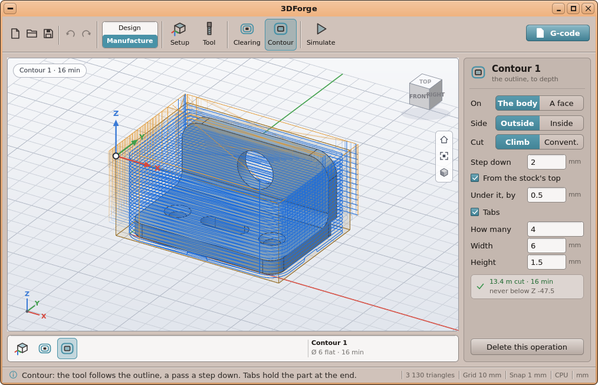
*The moves: cuts in blue, fast moves in orange; the selected operation's are the strong ones.*

**Nothing is computed while you change values**: when one has changed, **Validate** and **Cancel** appear beside
*G-code* — *Validate* (or Enter in a field) computes the moves again with the new values, *Cancel* (or Esc) puts
the values back as they were at the last computation. (The origin and the direction of X need no computation: they
apply at once. Asking for the G-code or the simulation validates first.) Each operation shows the length cut, its
time and its lowest Z. **Simulate** shows what is left of the stock once every operation is done; the bar at the left goes
through the cut — drag it — and its **Play** button runs it, the tool shown where it is; the small button under
Play is its **speed**: a click goes from a quarter (×¼) to eight times (×8) (Esc comes back to the moves) — a hole that only a tool lying on its side could cut stays full: the router has three axes.

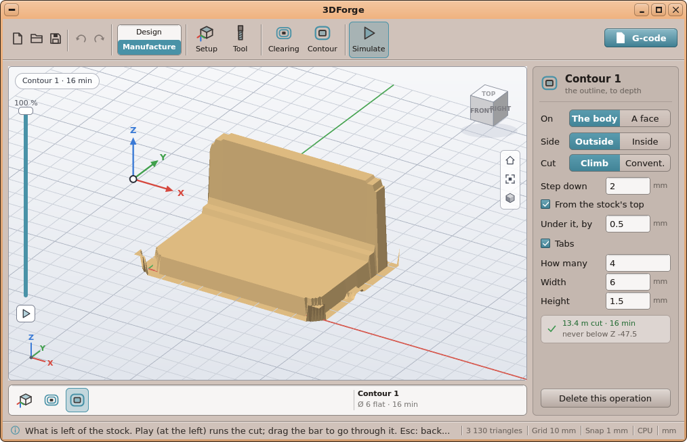

**G-code** (Ctrl+G) checks the whole programme before it is written: **no fast move goes through matter**, **the
body is never cut into** — with either wrong, nothing is written —, the lowest point (under the stock: a spoil
board is needed), the machine's travel, the tool's cutting length. It shows the first lines, the number of lines,
the length cut and the time, and saves a `.nc` file: millimetres, absolute, `G0` / `G1` only (curves are short
lines), `M3 S…` then a wait, `M5` and `M2` at the end. **Run a new programme in the air first**, the spindle well
above the stock.

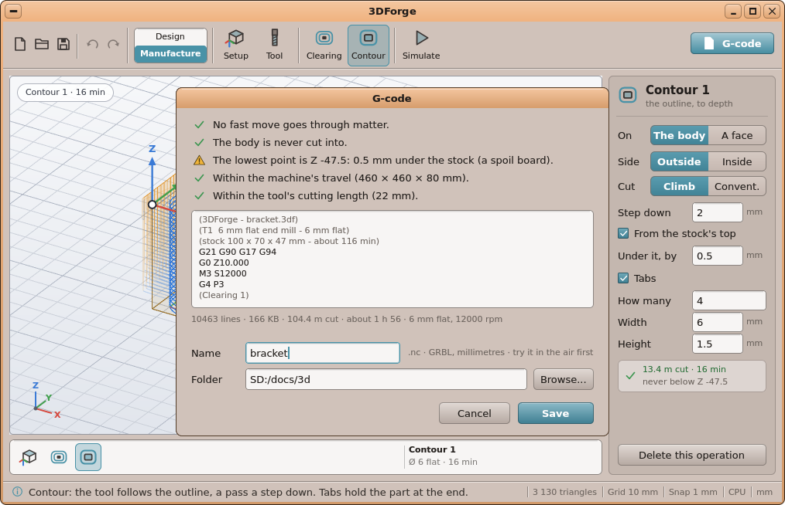

*What Manufacture does not do*: the clearing is made of passes at a constant distance (the tool cuts its full
width on a level's first pass and in the corners: choose the step down and the feed for that) — not a
constant-engagement "adaptive" one; flat end mills only; three axes (no rotary axis yet); one setup a part.

#### Manufacture: the layers for a resin printer

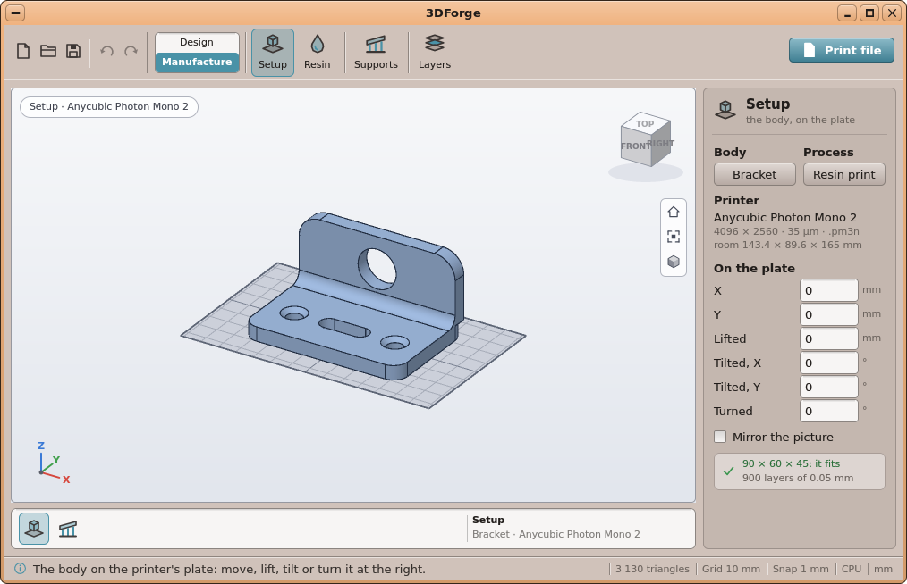
*The body on the printer's plate.*

With the process **Resin printing** (the *Process* button of the setup lists the printers), Manufacture prepares a
body for a printer that hardens resin layer by layer under an LCD screen — an **Anycubic Photon Mono 2** (its
`.pm3n` file; the format was read from a file of that printer and is written back to the byte). The tools become
Setup, Resin, Supports and Layers, and the button at the right **Print file**.

- **Setup** — the body, the printer (its screen, its room); where the body is **on the plate**: moved (*X*, *Y*),
  *Lifted* off it, *Tilted* about X and Y, *Turned*; *Mirror the picture* flips the layers left to right (try a
  first print with a letter on it: a printer shows whether it needs it). Under the fields: whether it fits.
- **Resin** — the values of a print, kept from a part to the next: the layer's *height*, its *exposure*, the time
  the *light* is *off* before it; the *first layers* — how many, their long exposure, the layers over which it comes
  down to the normal one —; the *lift* after each layer, slowly at first then faster, and the speed back down. The
  button at the top takes the maker's values for a **Standard**, an **ABS-like** or a **Plant-based** resin
  (2.5 s, 2.5 s and 3 s a layer of 0.05 mm on this printer; the other values are a starting point: a resin's own
  sheet is the reference).
- **Supports** — what holds the body when it is lifted and tilted: **Generate** puts a **pillar** with a thin tip
  under every place that leans more than the *overhang* angle from upright, one *every* few millimetres, under the
  body's *low points* and along its low edges, and a **raft** under them all (its thickness, how much wider than
  the body). A click on the body adds a pillar there, a click on a pillar's tip removes it. The pillars go down to
  the plate: what hangs above another part of the body is not held by them.
- **Layers** — the layers are cut (a bar shows how far it is; the window stays alive) and shown **as the screen
  will light them**: white is lit. The bar at the right, or the wheel, goes through them; **Play** runs them, at the
  speed of the button under it (×¼ to ×8).
  *Show it in the 3D view* shows instead the body as it is printed up to that layer. At the right: the number of
  layers, the resin (ml), the time, and what was **checked** — it fits the plate and the room; the first layers lie
  on the plate; each layer rests on the last (a part that would start **in mid-air** is counted, with its height:
  it needs a support).

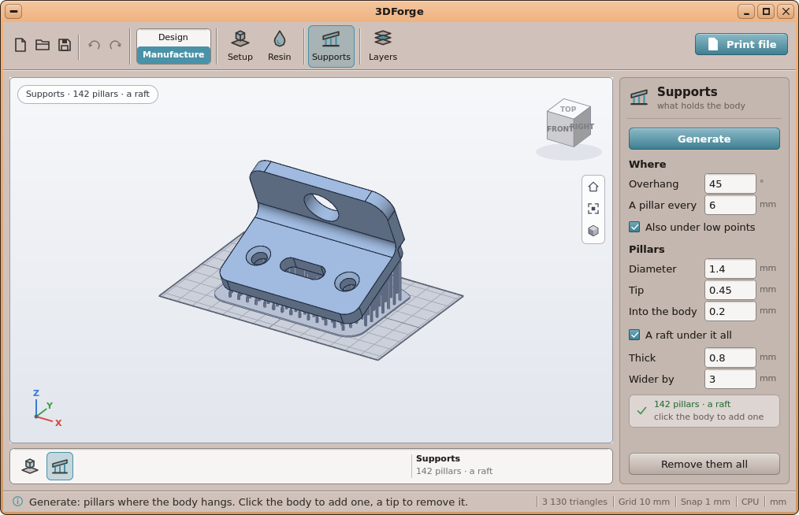

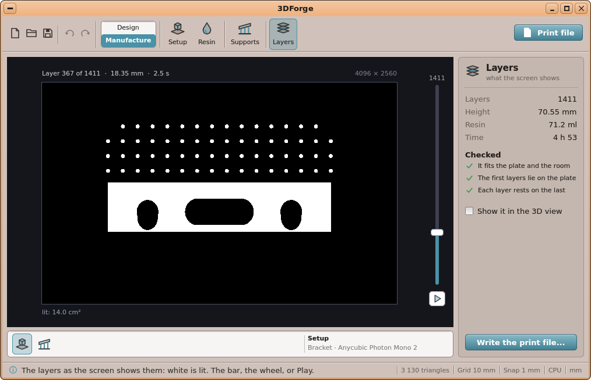

**Print file** (Ctrl+G) cuts the layers if they are not, shows the checks — nothing is written for a body that
does not fit or that nothing holds on the plate — and saves the file to copy to the printer's USB stick.

*What it does not do*: supports that branch or that stand on the body; hollowing; anti-aliased edges; other
makers' files. Another printer of the same family can be added without a new version: a line of
`SD:/apps/3dforge.app/printers.ini`, `name = columns rows pixel(µm) width depth height(mm) ending` (for
instance `My Printer = 4096 2560 35 143.36 89.1 165 pm3n`) — only the Photon Mono 2 has been checked against a real
file.

#### Manufacture: the path for a filament printer

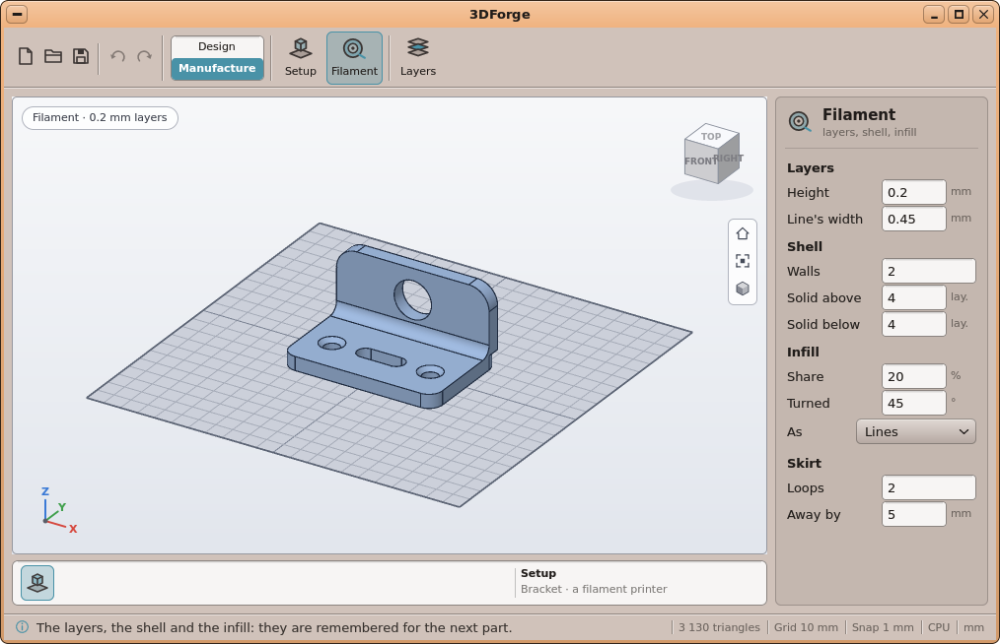

With the process **Filament printing**, Manufacture builds **the path of the nozzle**, layer by layer, for a printer
that lays melted filament — whatever the printer: **no file is written yet** (a printer's own G-code will be made
from this path; the path is what is shown and played).

- **Setup** — the body, the **bed**'s size, where the body is on it (moved, tilted, turned).
- **Filament** — the **layers**' height and the line's width; the **shell**: how many *walls* at the sides, how
  many *solid* layers *above* and *below* (they are put wherever the body stops within that many layers, not only
  at its very top and bottom); the **infill**: its *share* in percent, *turned* by an angle, **as** *Lines* (one way
  a layer, the other way the next), a *Grid* (both ways each layer) or a *Honeycomb*; the **skirt** drawn around
  the first layer (its loops, how far away).
- **Layers** — the path seen from above, a colour a kind of line: outer wall, inner walls, solid, infill, skirt.
  The bar at the right, or the wheel, goes through the layers. **Play** draws the layer as the printer would — the
  bead laid along its path, the nozzle at its end — then the next ones, slower or faster with the button under Play
  (×¼ to ×8). *Show it in the 3D view* shows the body
  printed so far with the layer's lines on it. At the right: the number of layers, the length drawn, the filament
  it takes.

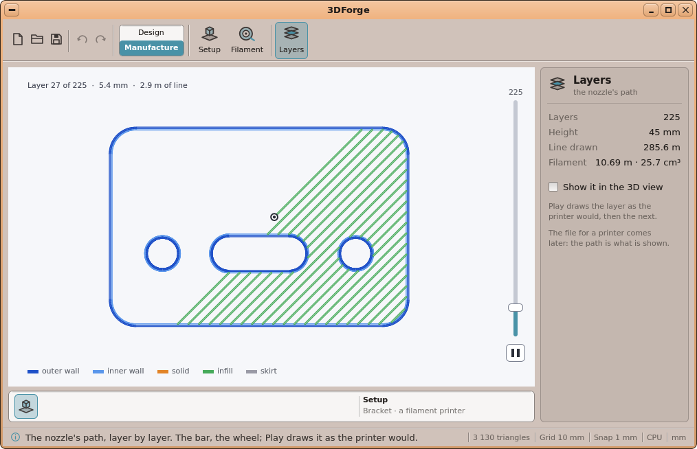

*What it does not do yet*: a printer's file; supports; bridges, thin walls, the seam's place, speeds, a brim,
several filaments.

Files: `SD:/docs/3d/*.3df` (yours), `SD:/docs/3d/bracket.3df` (the sample); exports, G-code (`.nc`) and print files
where you choose; `SD:/apps/3dforge.app/filament.ini` (a filament printer's values, remembered); `SD:/apps/3dforge.app/cam.ini` (the tool and the machine, remembered), `print.ini` (the resin and
the printer, remembered), `printers.ini` (more printers, yours to write).

### Screenshot, the screen capture tool (`screenshot`)

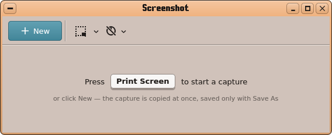
*Screenshot's window: New, the mode, the delay.*

Screenshot takes a picture of the screen, laid out as Windows' Snipping Tool: **one toolbar**, the
capture shown below it. Start it from the dock or the app list (*Graphics*), or press **Print Screen**
anywhere.

**The toolbar**, from the left:

- **New** (^N): starts a capture, in the mode and after the delay chosen.
- **The mode** (its arrow: a menu, the one chosen ticked, kept for the next time): **Rectangle** (the
  default), **Window**, **Full screen**.
- **The delay**: none, **3**, **5** or **10 seconds** (shown on the button: *3 s*). A ring counts the
  seconds down in the window — time to open a menu in another app; **Esc** stops it.
- Once a capture is made: **Copy** (^C) and **Save As...** (^S), then, at the right, the drawing tools
  — **Pen** (P) and **Marker** (M), their arrow opening the colours (8 for the pen, 6 for the marker)
  and the four sizes; **Eraser** (E): a click (or a drag) takes away a whole stroke, the one under it
  lit first; **Crop** (R): drag the part to keep; **Undo** (^Z), **Redo** (^Y).

| | |
|:---:|:---:|
| 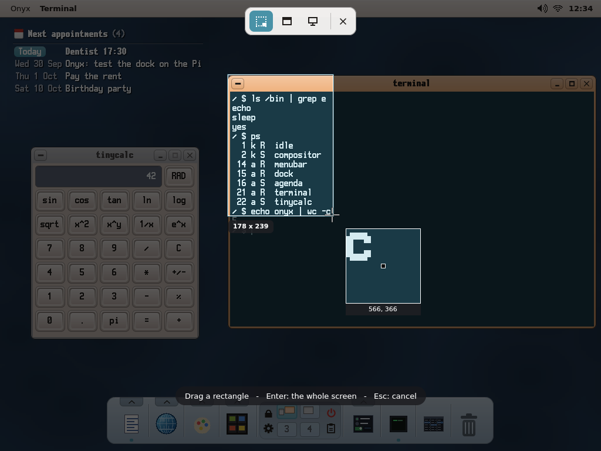 | 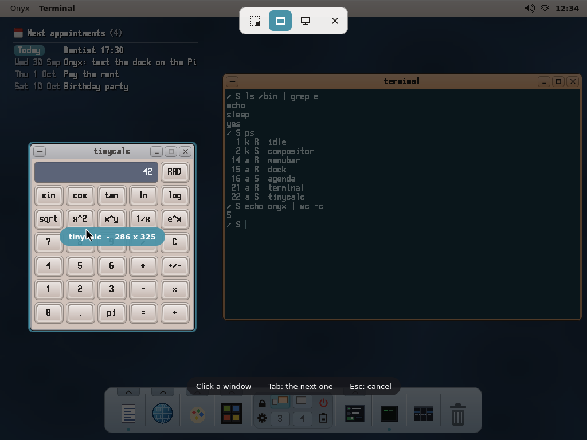 |
| *A rectangle being dragged: its size, the magnifier* | *A window chosen: its name and size* |

**A capture.** The window hides itself and the screen is **frozen** and darkened. The bar at the top
switches the mode (the screen icon takes the whole screen at once) or cancels (×).

- **Rectangle**: drag it — it is bright, its size under it, a **magnifier** shows the pixels around
  the pointer and their coordinates; the capture is made when the button is released. **Enter**: the
  whole screen.
- **Window**: the window under the pointer is lit, with its name and size; a **click** takes it (its
  frame too), **Tab** goes to the next one, **Enter** takes the one lit.
- **Full screen**: taken at once.
- **Esc** (or a right click) cancels.

| | |
|:---:|:---:|
|  | 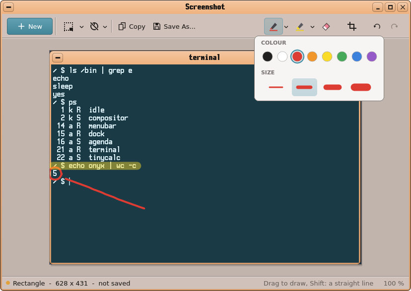 |
| *The capture drawn on: the pen, the marker* | *The pen's colours and sizes* |

**After the capture** the window comes back, as large as the picture wants (the picture is never
enlarged: its zoom is at the right of the status bar). The picture is **copied to the clipboard at
once** (an *image* item of the shared clipboard: Ctrl+V pastes it in Paint, Letters...) and a
notification says so. Draw on it: hold **Shift** for a straight line; the strokes are smoothed. Copy
again to copy it with the drawing. It is **saved only with Save As**: in `SD:/Pictures/Screenshots` at
first (then the folder used last), named `Screenshot <date> <time>.png`; the extension chooses the
format — **.png**, **.jpg** (quality 92) or **.bmp**. The status bar: what was taken (*Rectangle*,
*Window 'terminal'*, *Full screen*), its size, whether it is copied / saved (the dot: green, or amber
when there is something not kept).

**Print Screen**, from any app: a capture with the last mode and delay (Screenshot is started if it is
not running). **Alt+Print Screen**: the window in front, at once.

The menus: **File** (New Capture, New Rectangle / Window / Full Screen, Save As..., Copy), **Edit**
(Undo, Redo, Clear the Drawing), **Tools** (Pen, Marker, Eraser, Crop).

**Files:** writes `SD:/etc/screenshot.ini` (the mode, the delay, the pen's and the marker's colour and
size, the last folder) and the pictures saved with Save As.

### Media Player, the music and video library (`media`)

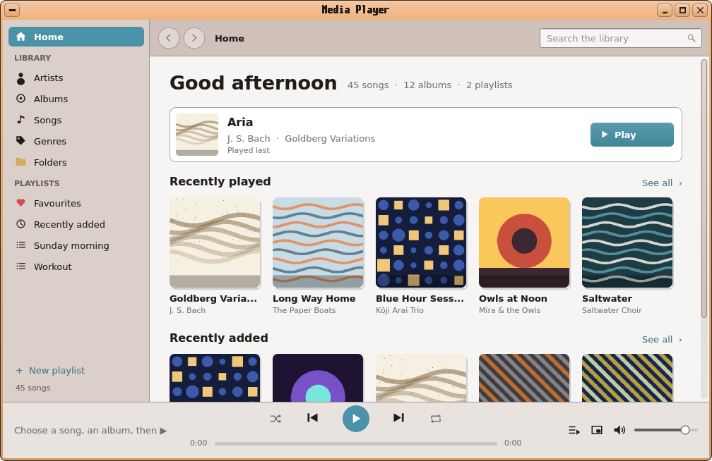
*Media Player's home: the film left half way and what was played last, the albums played lately, the videos.*

Media Player keeps **your music and your videos** in one place, in the way of Windows Media Player or iTunes:
the songs of the folders it watches — **`SD:/Music`** at first —, **MP3, OGG, FLAC, WAV, MIDI and FM Song (`.fms`)** files, by
**artists, albums, songs, genres and folders**, and your **playlists**; and the **films, clips and series'
episodes** of those folders and of **`SD:/Videos`** — **MP4, MKV, WebM, AVI, MPEG, TS, WMV, FLV, OGV, 3GP...** files.
It finds them by itself:
at each start it looks again at the folders (the sidebar says *Looking for songs...*) and shows what it
knew at once. Start it from the dock or the app list (*Multimedia*), or open a music or video file in the
File Viewer.

**The window**: the **bar on top**, across the window (back, forward, where you are — a path bar as the
File Viewer's: the page shown underlined in the accent colour, the level above it a link —, the
**search** — titles, artists and albums at once —, the albums' grid or list); under it the **sidebar**
at the left (Home, the library, the playlists; *+ New playlist*; at its bottom the songs counted — a
click shows the folders watched) and the page,
and at the bottom, always, **the bar of what plays**: the cover (a click: *Now playing*), the song and
its ♥ (a favourite), **shuffle**, **previous**, **play / pause**, **next**, **repeat** (all, one, off),
the position (drag it), the queue, the **mini player**, the volume (drag it, or the wheel; a click on
the speaker mutes).

| | |
|:---:|:---:|
|  | 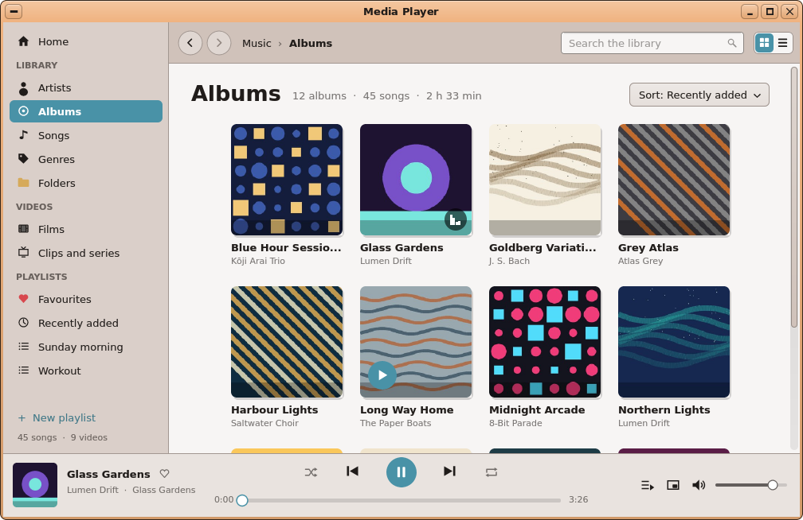 |
| *The albums (sorted by name, artist, year or the latest added)* | *An album: Play, Shuffle, its songs* |

**The pages**:

- **Home**: what to go on with — the video left half way (*Resume*) and the song played last (*Play* /
  *Resume*) —, the albums played lately, the videos, the albums added lately.
- **Artists** (their albums' covers in circles), an **artist**: their albums, their songs.
- **Albums**: a grid of covers (under the pointer: ▶ plays the album) or a list; an **album**: its
  facts on a band of its cover's colours, **Play**, **Shuffle**, **⋯** (play next, add to the queue,
  to a playlist, to the favourites, show in the File Viewer), its songs (the one playing marked).
- **Songs**: every song, by artist; a click on a column's head sorts by it (again: the other way).
- **Genres** (tiles), **Folders** (the folders that hold songs), and their songs.
- **Favourites** (the songs with a ♥), **Recently added** (the last 100), **your playlists**.
- **Films** and **Clips and series** (the sidebar's *Videos*): the videos' frames (below).

| | |
|:---:|:---:|
| 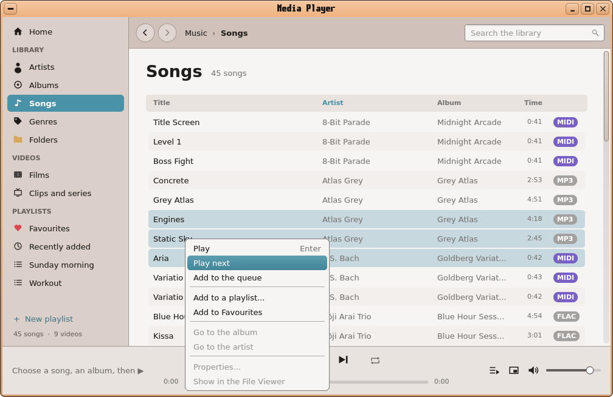 | 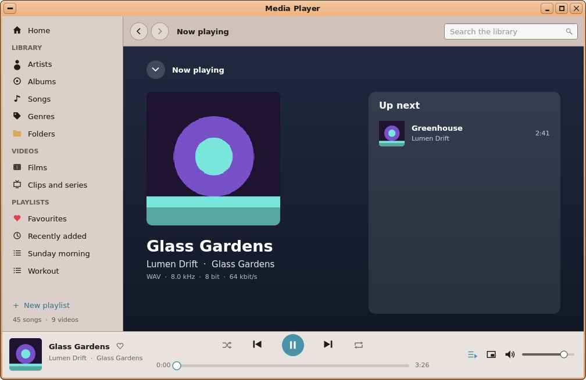 |
| *Songs selected, their menu* | *Now playing, and what comes next* |

**Songs**: a **double click** plays a song (and those after it in the list); **Ctrl** / **Shift** + click
selects several; **Enter** plays the selection; **Ctrl+A** selects all. A **right click**: *Play*, *Play
next*, *Add to the queue*, *Add to a playlist...* (a new one, or one of yours), *Add to / Remove from
Favourites*, *Go to the album / artist*, *Properties...* (the song's tags, its file, how often it was
played — read only: Media Player never changes your files), *Show in the File Viewer*; in a playlist
also *Remove from this playlist*. A playlist's **⋯** renames or deletes it.

**Now playing** (the cover at the bottom left, the queue button, or ^L): the cover large over its own
colours, the song, its format (MP3 at so many kbit/s, FLAC 44.1 kHz 16 bit...), and **Up next** — a
click plays one of them. **A MIDI file** shows **its notes scrolling** instead (in *Now playing* and on
its album's page): the file's facts (its instruments, its tempo, the SoundFont that plays it), then its
notes as coloured lines — a colour an instrument, the keyboard at the left, the bars numbered, the
notes sounding outlined — passing under the playhead, and the instruments' colours under them.

| | |
|:---:|:---:|
| 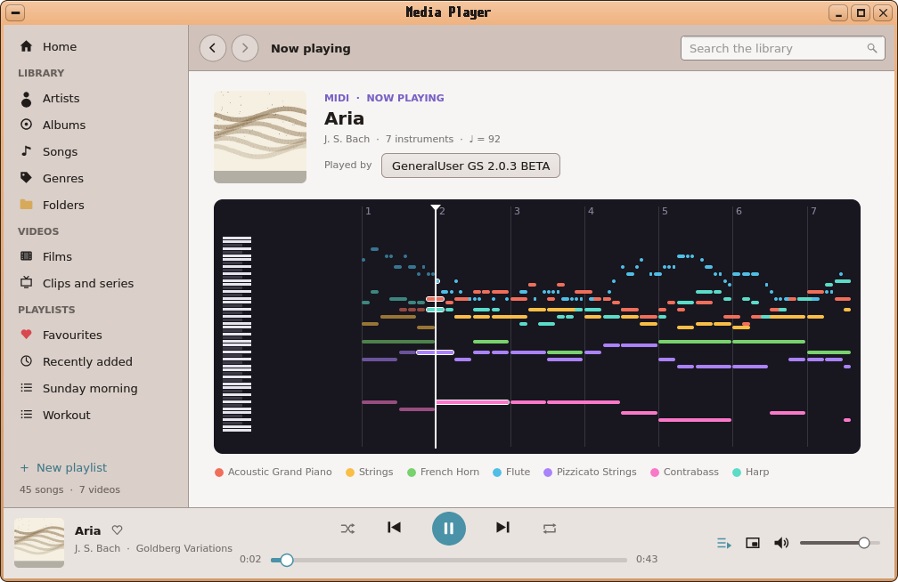 | 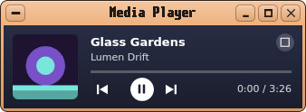 |
| *A MIDI file playing: its notes* | *The mini player, at the bottom right of the screen* |

**The mini player** (its button in the bar, or ^K): the window becomes a small card at the **bottom
right of the screen** — the cover, the song, previous / play / next, the position; its square button
brings the window back. **Closing the window stops the music.**

**The folders** (*File > Folders to Watch...*, or the songs' count at the sidebar's bottom): the
folders Media Player looks in (`SD:/Music` at first; another partition, a USB drive...), how many songs
each has; *Add a folder...*, × to stop watching one. The library is updated at each start, or with
*File > Look for New Songs*. The **Folders** page has its own **Add a folder...** button; while the library is
empty, the library's pages (Albums, Artists, Songs, Genres, Folders) say so and show it too.

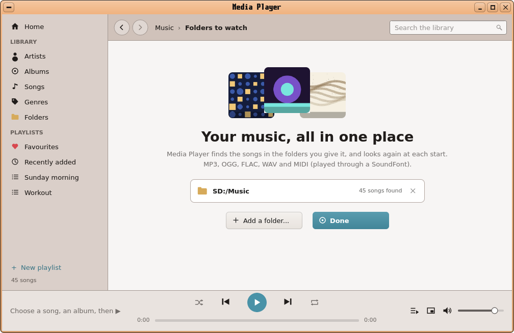

**What it reads**: the tags of the files — ID3 (MP3), Vorbis comments (FLAC, OGG), RIFF INFO (WAV), the
first track's name (MIDI) —; what is missing comes from the path (`<artist>/<album>/<nn> - <title>.mp3`).
The covers: the picture inside the file, else the folder's `cover.jpg` / `folder.jpg` / `front.jpg`
(PNG and BMP too); an album without one gets a picture drawn from its name. **Nothing is downloaded.**
MIDI files are played by **MeltySynth** (Koton's synthesizer) through a **SoundFont**: the first `.sf2`
of `SD:/res/soundfonts` (GeneralUser GS: the package `generaluser-gs`, which Media Player and Koton need, installed
with them), or `soundfont = <path>` in the settings.
**FM Songs** (`.fms`: FM Tracker's, the samples of `SD:/music/fms`) are played by AudioKit's FM synthesizer —
their title and author are the song's own, their genre "FM". (A double click on one in the File Viewer still
opens FM Tracker.)

**Keys**: Space or ^P play / pause, ^F next, ^B previous, ^S shuffle, ^T repeat,
^E search, ^L now playing, ^K the mini player, Esc (now playing: back; the search: cleared), ^O open a file.

**Files**: reads the music folders; writes `SD:/etc/media/settings.ini` (the folders, the volume,
shuffle, repeat, the SoundFont, the albums' order and view), `SD:/etc/media/library.tsv` (what the
scan found: the next start is at once), `SD:/etc/media/stats.tsv` (plays, the last time, favourites),
and the playlists, **`SD:/Music/Playlists/*.m3u`** (other players read them; a `.m3u` opened from the
File Viewer plays), `SD:/etc/media/videos.tsv` (the videos found, where each was left, those seen to the
end) and `SD:/etc/media/thumbs/*.jpg` (the videos' frames shown in the library). Reads `SD:/Videos` and the
folders watched.

#### The videos

| | |
|:---:|:---:|
| 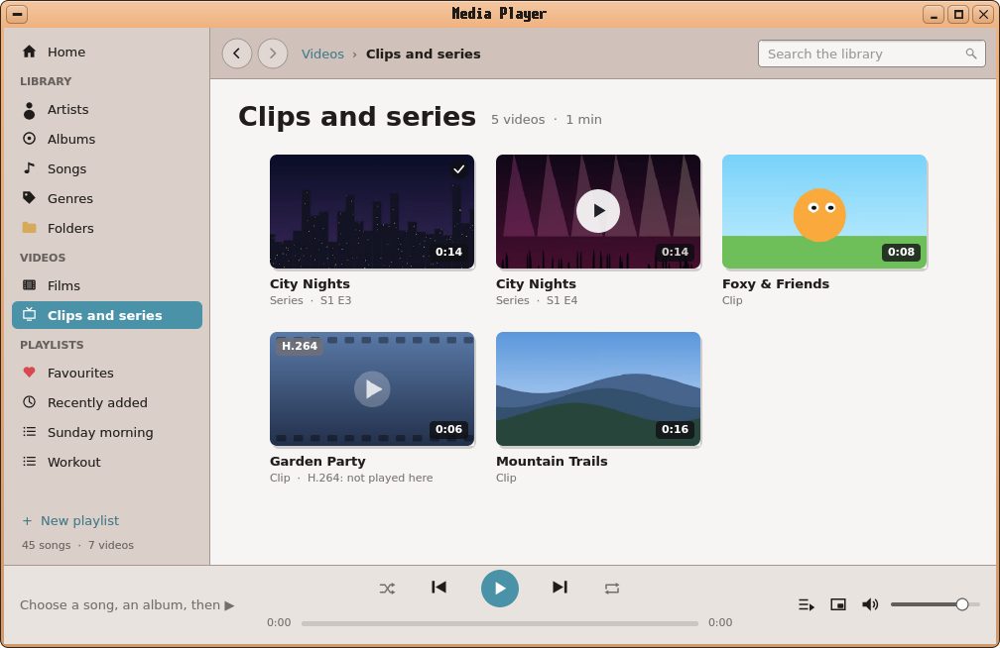 | 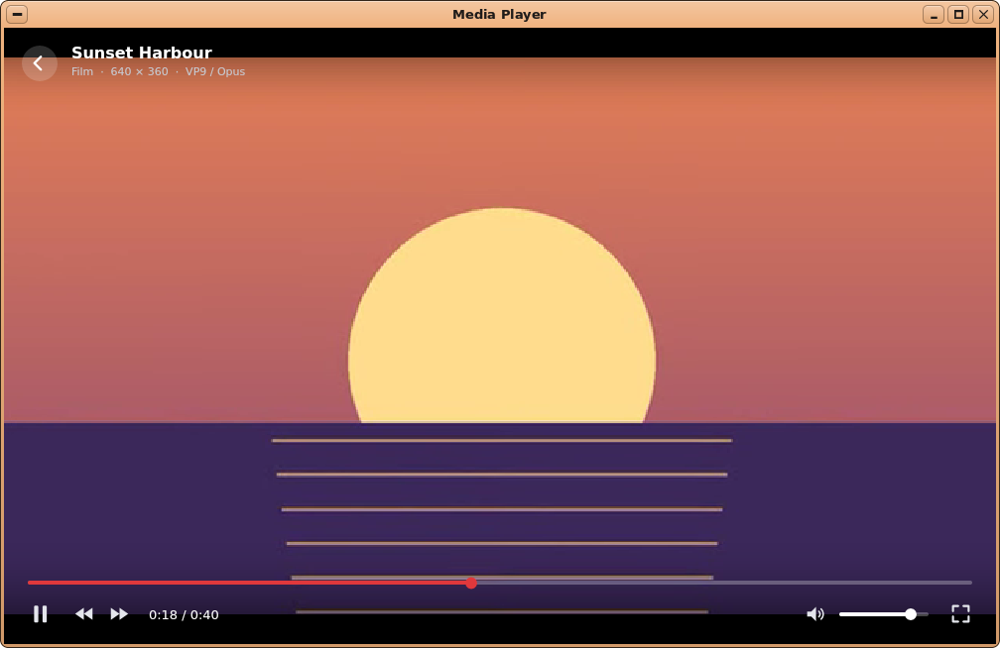 |
| *Clips and series: each video's frame, its length, how much was watched* | *A video playing, its controls over it* |

Put your videos in **`SD:/Videos`** (always looked at) or in a folder watched. **Films** and **Clips and
series** show a frame of each (taken a tenth of the way in, kept on the card so the next start shows them at
once), its length, a red line for the part watched, a ✓ for one seen to the end; under the pointer ▶ plays it.
What is what: a video in a folder named *Films* (or *Movies*) is a film, in *Series* (*TV*, *Shows*) an
episode, in *Clips* a clip; else a name with `S01E03` (or `1x03`) is an episode — its series' name and its
numbers shown, the episodes in order —, and a video of 40 minutes or more a film. The search finds videos
by their title too. A **right click**: *Play* / *Resume*, *Play from the Start*, *Mark as Watched / Not
Watched*, *Properties...* (its length, its picture's size, its codecs, its file), *Show in the File Viewer*.

**Playing**: a video plays in the **whole window** and starts again **where you left it**. Its controls show
while the pointer moves (and when paused): ← back to the library (or Esc), its title and facts, the position
(drag it), play / pause, ◀◀ / ▶▶ (10 s back / on), the time, the volume (drag it, or the wheel; the speaker
mutes), **full screen** (or **F**, or a double click on the picture; Esc or F leaves it). A click on the
picture plays or pauses. At its end: **Watch again**, and for an episode **Next: S1 E4**. Leaving a video
keeps where you were; a song started stops the video (they share the sound), a video started stops the song.

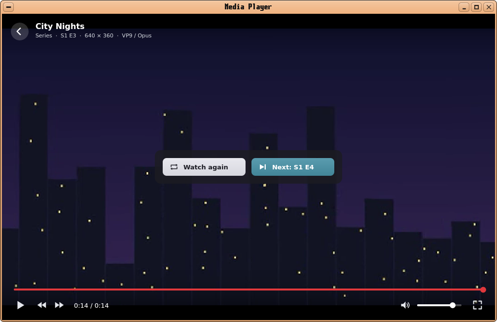

**Keys** while a video plays: Space (or K) play / pause, ← / → 10 s back / on (J / L too), ↑ / ↓ the volume,
M mute, Home the start, 0 … 9 a tenth of the way (5: half way), F full screen, Esc back.

**What plays**: nearly everything — the media library Onyx shares with Jet Browser, with **FFmpeg**'s decoders
and file readers in the Media Player: pictures in **H.264**, **H.265 (HEVC)**, VP9, VP8, AV1, MPEG-4 Part 2
(DivX / Xvid), MPEG-1 / 2, WMV / VC-1, Theora, Sorenson, ProRes...; sound in **AAC**, **AC-3 / E-AC-3**, DTS,
MP3, MP2, Opus, Vorbis, FLAC, WMA, ALAC, PCM...; in MP4 / MOV, MKV / WebM, **AVI**, MPEG-TS / PS, ASF / WMV, FLV,
Ogg, 3GP files. Everything is decoded by the Pi's processor (no graphics chip): smooth, it is expected, up to about
**720p for H.264**, 480p for VP9 and H.265, 360p for AV1 (to be measured on a Pi); larger videos play, with
frames left out. A video whose codec
is not decoded (rare: encrypted, a very unusual codec) is listed with its codec on its frame and *not played
here*. (The test videos in every format: `Samples/Videos` in the repository.) The Media Player links FFmpeg
and is therefore distributed under the **GPL-2.0** (docs/LICENSING.md).

### Cardfile, a small database (`cardfile`)

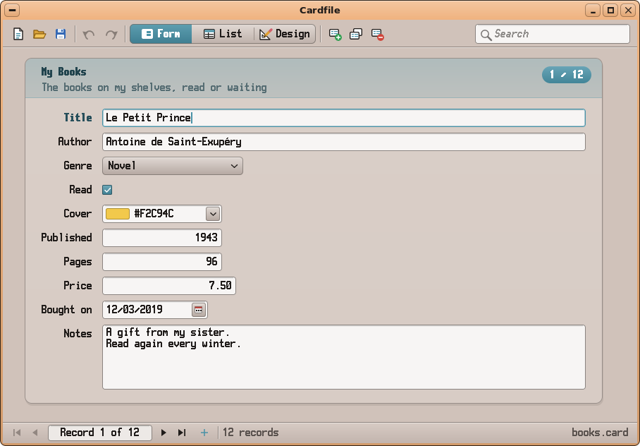
*Cardfile's Form view with its sample (`SD:/docs/books.card`): a record on its index card.*

Cardfile keeps **records** — books, contacts, a collection, recipes... — in the way of Microsoft
Access, without SQL. One file (`.card`) holds one **form** — its title, a description and its
**fields** — and its records. A field has a **display name** (on the form and in the list), a
**column name** (the file's) and a **type**:

| Type | On the form | Kept as |
|---|---|---|
| Text | a line, of any length | as typed |
| Multi-line text | a box of several lines, wrapped at the words | as typed |
| Integer | a line, on the right: 42, -7, 1 000 000 | `42` |
| Decimal number | the same, with its **decimals** (0 to 6): 12,5 → 12.50 (`.` or `,`) | `12.50` |
| Date | typed as DD/MM/YYYY (or 29.9.26, 29/9 — this year —, 29092026, 2026-09-29), or picked on the calendar its button drops (Today, Clear) | `2026-09-29` |
| Colour | a swatch and its code; its button drops a palette (40 colours, No colour, More Colours...: the colour dialog) | `#3366CC` |
| Yes / No | a check box | `yes`, or empty |
| Choice list | a list of the form's **choices**, and "(none)" | the choice |

**The toolbar**: New form, Open, Save · Undo, Redo · the **view switch** — Form, List, Design (F5,
F6, F7) · New record, Duplicate record, Delete record · the **search** box. **At the foot**: the
record navigator — first, previous, *Record 3 of 12* (a click: Go to Record...), next, last, a new
record (+) —, then what is shown (the records, the search's matches, the sort), and the file's
name (a dot before it: unsaved changes; a dot before *Record*: the record shown has changes not kept
yet).

**The Form view**: the record on an index card — the form's title and description, its place
(3 / 12, or *New*), a line a field. **Tab** / Shift+Tab, **Enter**, **Up / Down** move between the
fields (a click on a field's name too — on a check box's name it ticks it); **Page Up / Page
Down** show the previous / next record, **Ctrl+Home / Ctrl+End** the first / last one; **Esc**
puts the record's values back. The values go into the record when it is left (another record,
another view, Save...): a value that is not one of its type (31/02/2026, letters in a number) is
said, outlined in red, and its field keeps the keyboard. A new record left without a value is
dropped. In a line: the selection (Shift + the arrows, a drag, a double click on a word, Ctrl+A),
Ctrl+X / C / V, Ctrl + the arrows by words; in a choice: Up / Down, a letter jumps to the next choice
starting with it, Delete = (none), Enter or a click drops the list; a date or a colour: a click on
its button (or Alt+Down) drops the calendar or the palette, Delete empties a colour.

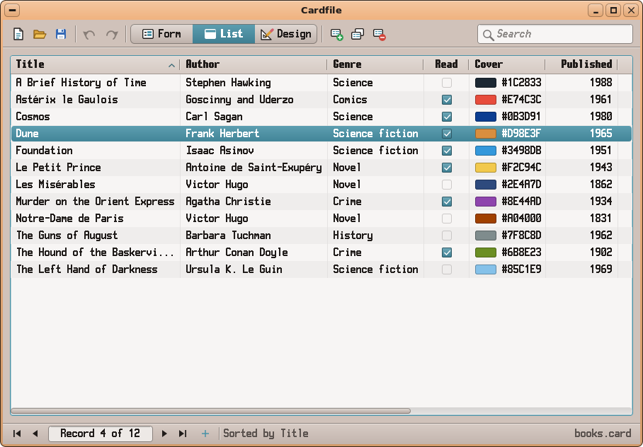
*The List view: sorted by title (the arrow), a record chosen.*

**The List view**: the records in a grid, a column per field — the numbers on the right, a date as
the form shows it, a colour's swatch and code, a check mark, a text of several lines on one line. A
click on a column's name **sorts** by it, again the other way, a third time back to the file's order
(also View ▸ In the File's Order): each type in its order — numbers, dates, a choice list in its
choices' order, text without regard to case or accents and "Item 9" before "Item 10" —, empty values
last; the sort is kept in the file. **Drag** a column's edge to widen it. A **double click** or
Enter opens the record in the form; **Delete** deletes it (asked first); a **right click**: Open in
the Form, New Record, Duplicate Record, Delete Record.... The arrows, Page Up / Down, Home / End
move; a letter jumps to the next record whose sorted column (else the first) starts with it; Left
/ Right and Shift + the wheel scroll sideways.

**The search** (Ctrl+F, or a click in the box): only the records holding **every word** typed, in
any of their fields (case and accents ignored; a date as it is shown) — in the form and in the
list; Esc or its cross empties it. A record made meanwhile stays shown.

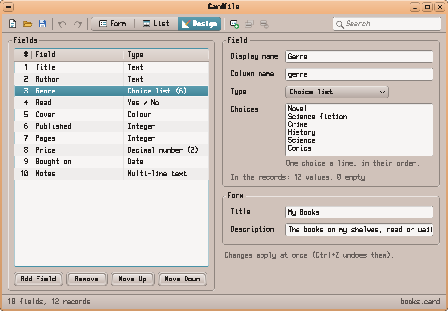
*The Design view: the genre's choices.*

**The Design view**: the form's fields in their order — **Add Field** (after the one chosen),
**Remove** (asked first, with the number of values it holds; Delete in the list too), **Move Up**,
**Move Down** — and the field chosen: its **display name**, its **column name** (letters, digits,
`_` and `-`; made from the display name as long as it was not changed: "Date of birth" →
`date_of_birth`; two fields cannot share one), its **type**, the type's option (a decimal number's
**decimals**; a choice list's **choices**, one a line, in their order), what the records hold in it;
then the form's **title** and **description**. **A change applies at once** (Undo takes it back).
A new **type converts** the values through their text as shown: what reads as the new type stays
(text → integer: "42" stays; a date → text: "29/09/2026"; a yes / no → text: "Yes" / "No"...), the
rest is emptied — Cardfile asks first when some would be (*3 values of "Year" are not a whole number:
they will be emptied. Change the type?*); to a choice list, the values become its choices. Fewer
decimals round the values (said in the status bar). A value that is not among a list's choices
stays (the form shows it at the end of the list).

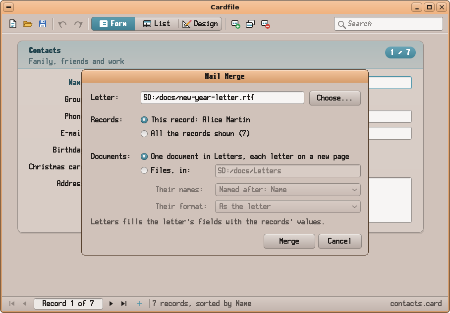
*Record ▸ Mail Merge... on the Contacts form: its letter, this record or all of them, one document or a file each.*

**The mail merge** (**Record ▸ Mail Merge...**): a **Letters** letter whose **merge fields** are the
form's columns (made in Letters: Tools ▸ Mail Merge, see *Letters*) is filled with the records — a
letter per record. The dialog: the **Letter** (`.rtf`, `.docx` or `.odt`; **Choose...**; the form
remembers it), the **Records** — **this record** or **all the records shown** (the search and the
sort applied) —, the **Documents** — **one document in Letters**, each letter on a new page (to read,
change, save as one file), or **files** in a folder (`SD:/docs/Letters` by default; made if needed)
named after a field (**Named after: Name** → `Alice Martin.rtf`; two alike: the second numbered)
or numbered after the letter (`new-year-letter-1.rtf`...), in the letter's format or as RTF, Word
or OpenDocument. **Merge** hands it to Letters, which opens the document (or, for files, says how
many it wrote and opens the first one). Cardfile writes the records to merge in
`SD:/apps/cardfile.app/merge.card` and the request in `merge.job` (Letters' `letters --merge JOB`).
Try it with the Contacts form (`SD:/docs/contacts.card`) and its letter
`SD:/docs/new-year-letter.rtf`.

**The menus**: **File** (New Form ^N, Open... ^O, Save ^S, Save As..., Import CSV..., Export as
CSV...), **Edit** (Undo ^Z, Redo ^Y — record edits, deletions and the form's design, 100 steps —,
Cut, Copy, Paste, Search... ^F, Clear the Search), **Record** (New Record ^R, Duplicate Record ^D,
Delete Record..., First / Previous / Next / Last Record, Go to Record... ^G, Mail Merge..., Undo
the Record's Changes Esc), **View** (Form F5, List F6, Design F7, In the File's Order), **Design** (Add Field,
Remove Field..., Move Field Up, Move Field Down).

**Files**: the `.card` file (below). **File ▸ Export as CSV...** writes the records shown (the search
and the sort applied), their values as shown, the display names on the first line. **Import
CSV...** (or opening a `.csv`) makes a new form of a CSV file (`,` `;` or a tab between the values,
quotes): its first line names the fields, each column's type is guessed from its values (whole
numbers, decimals, dates, yes / no words, `#RRGGBB` colours, several lines, a few values repeated: a
choice list; a code with a 0 before it — 007, a telephone number — stays text); File ▸ Save As...
keeps it as a `.card`. New, Open and a file dropped on the window first ask to **save unsaved
changes**; **closed with unsaved changes** (the close box, Quit), the form is kept in
`SD:/apps/cardfile.app/recovered.card` and offered back at the next start. `cardfile <file>` opens a
file, and a `.card` double-clicked in the File Viewer opens in Cardfile (`fileassoc.ini`). Started
without a file, Cardfile opens the form it had last (kept in `SD:/apps/cardfile.app/last.txt`), else
a new form in the Design view (a Name and a Notes field). Samples: `SD:/docs/books.card` (every type
of field) and `SD:/docs/contacts.card` (with its mail merge's letter, `SD:/docs/new-year-letter.rtf`).

**The `.card` file** is text (Latin-1, as Onyx writes it), easy to read and to edit by hand:

```
# Onyx Cardfile -- a form and its records (open it with Cardfile)
[form]
version = 1
title = My Books
description = The books on my shelves, read or waiting
sort = title

[field]
column = genre
label = Genre
type = choice
choice = Novel
choice = Science fiction

[field]
column = price
label = Price
type = decimal
decimals = 2

[records]
title	author	genre	price
Dune	Frank Herbert	Science fiction	10.90
```

`[form]`: the title, the description, the views' order (`sort` = a column; `order = descending`),
the mail merge's letter (`merge = SD:/docs/letter.rtf`).
A `[field]` section a field, in the form's order: `column`, `label`, `type` (`text`, `multiline`,
`integer`, `decimal`, `date`, `colour`, `yesno`, `choice`), `decimals` (a decimal number: 0 to 6),
`choice` (a choice list: a line a choice, in their order). `[records]`: the columns' names on the
first line, then a record a line, a **tab** between its values; in a value, `\n` is a line break,
`\t` a tab, `\\` a backslash. The values as kept: text as typed, integer `42`, decimal `12.50`, date
`2026-09-29` (shown 29/09/2026), colour `#3366CC`, yes / no `yes` or empty, a choice's text. A line
starting with `#` or `;` is a comment (not in `[records]`). Cardfile reads such a file leniently:
keys in any case, the header's columns in any order (a column missing: empty values; unknown:
ignored), no `[field]` at all (the header's columns become text fields), a value that is not of its
type (kept as it is — the form asks for a valid one when the record is edited).

### Calendar, the planner (`calendar`)


*The week: the appointments in their calendars' colours (the ones before now paler), two at the
same time side by side, a weekend away in the all-day row, now as a red line; on the left the
month, the calendars and the tasks (one late, in red).*

The **Calendar** keeps your **appointments** and your **tasks** (its text drawn with FreeType's
DejaVu Sans: accents and other scripts as typed). On top: **New event**, **Today**,
**<** and **>** (the previous / next day, week or month), the period shown, and **Day / Week /
Month**.

**Day and Week** show the hours down the side (the evening and the night a shade darker), the
week number in the corner, today's date in a circle and **now as a red line**. Each appointment
is a block in its calendar's colour — its title, its times, its place, as much as fits; those
that overlap sit side by side; those already over are paler. The **all-day** ones (and those over
several days) are bars in the row on top. With the mouse:

- **double-click an empty slot** (or **drag down** one) — a new appointment there; double-click
  the all-day row — a new all-day one;
- **click** an appointment to select it, **double-click** it to open it (or Enter; **Event ▸
  Open**, **Event ▸ Delete**);
- **drag** it to another time or day, **drag its bottom edge** to change its end (by quarters of
  an hour);
- a click on a day's name opens that day; the wheel scrolls the hours.

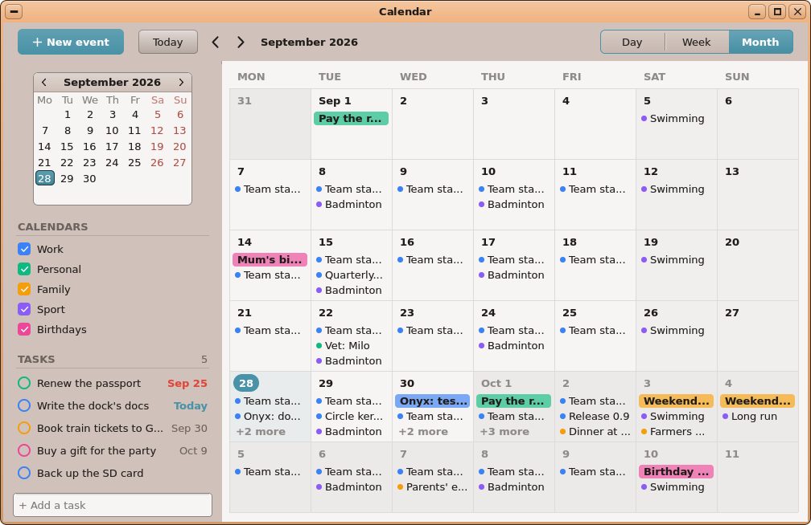
*The month: the all-day appointments as bars, the others after a dot of their colour.*

**Month** shows six weeks: in each day its appointments (the all-day ones as bars, the others a
dot of their colour then the title — the time too when the column is wide), **+N more** when they
do not fit. Click a day to select it, double-click it to open it in the Day view; the wheel goes
from month to month. The **little month** on the left jumps to any day.

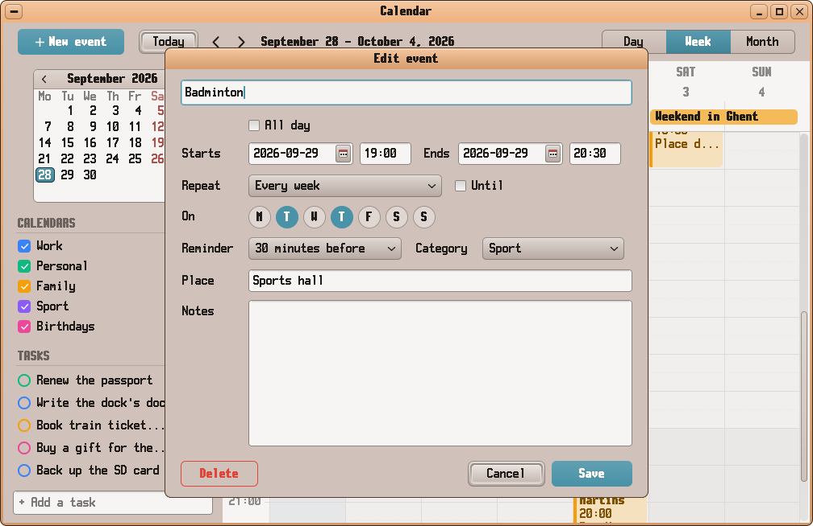
*Editing a weekly appointment: on Tuesdays and Thursdays, a reminder half an hour before.*

**An appointment** (**New event**, or a double click): its **title**; **All day** or its start
and end (a date — its button drops a calendar — and a time: `9:30`, `930`, `9h30`); **Repeat**:
does not repeat, every day, every weekday (Monday to Friday), every week or every two weeks (on
the days you tick: **M T W T F S S**), every month, every year — **Until** a date or for ever;
a **Reminder** (at the start, 5 / 10 / 15 / 30 minutes, 1 / 2 hours, 1 / 2 days before); its
**category**; a **place**; **notes**. **Save**, **Cancel**, **Delete**. A repeating appointment
opens on the occurrence clicked: saving, moving or deleting it asks **Only this one** (it leaves
the series and becomes an appointment of its own) or **All of them**.

**Calendars** (on the left): Work, Personal, Family, Sport, Birthdays — each with its colour;
a click on one **hides or shows** its appointments. **Tasks** (below): the round box ticks one
off (it goes to the end, struck through); the date on the right is when it is due — **Today** in
the accent, in **red** when it is late; a double-click edits it (its title, its due date, done,
its category, Delete); the field at the bottom adds one (Enter). **File ▸ New Task...** asks for
all of it.

**Reminders** are notifications (the bubble at the top right: "Dentist at 17:30, Dr. Peeters"),
sent by the **agenda widget** (always running), the Calendar open or not — or by the Calendar
itself when the widget is not there.

**Files.** Everything is kept in **`SD:/apps/calendar.app/calendar.ics`** — **iCalendar**, the
format of Google Calendar, Outlook, Thunderbird and Apple's Calendar. **File ▸ Import
iCalendar...** adds the events and tasks of an `.ics` file (the ones already there, by their
UID, are skipped; its categories added); **File ▸ Export iCalendar...** writes yours to a file
(`SD:/docs/calendar.ics` by default). Times in UTC (Google's `Z`) are brought to local time by
`config.ini` (`[calendar]`: `utc_offset` = minutes east of UTC, 60 in Belgium; `eu_dst` = 1:
European summer time; `view` = day, week or month at the start). For the desktop the Calendar
also writes `agenda.txt` (the month's appointments, for the agenda widget) and `reminders.txt`
(the month's reminders). The notes of the former calendar (in `agenda.txt`) become appointments
the first time. An argument `YYYYMMDD` opens that day (the agenda widget's clicks).

### Photos, the photo library (`photos`)

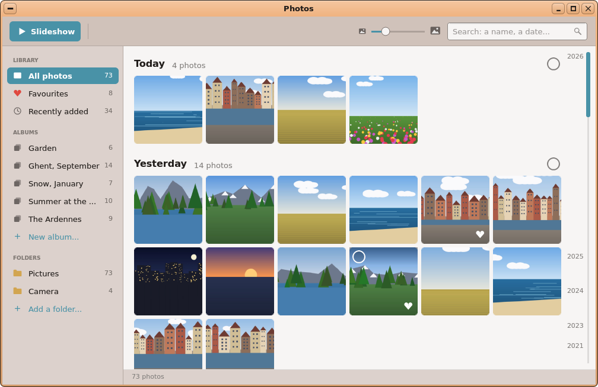
*All the photos by day, the newest first; the albums and the folders at the left, the years at the right.*

Photos shows **every picture of the card in one place**: `SD:/Pictures` (and its `Camera` folder), each
volume's **`DCIM`** folder (a camera's card), and the **folders you add** (*Add a folder...*, or a folder
dropped on the window; a right click on it: *Remove from Photos* — the files stay). JPEG, PNG, GIF, BMP,
WebP and PCX. Start it from the dock or the app list (*Graphics*); `photos <picture>` opens that one. The
first time, Photos looks through the folders (the status line says how many it found), then remembers
them: the next starts are immediate, and new pictures are found by themselves. The **thumbnails** are made in
the background — the photos in sight first, then all the others —, a small bar in the status line telling how
far it is (*Thumbnails 120 / 2814*); the window stays usable meanwhile.

**The library**: the photos **by day** (*Today*, *Yesterday*, then the date) — the day the camera wrote in
the picture (its EXIF), else a date in the file's name (`IMG_20260927_164200.jpg`,
`Screenshot 2026-09-27 at 16.42.00.png`). A photo taken standing is shown standing. At the right the
**years**: click or drag there to jump through thousands of photos. The slider in the toolbar makes the
thumbnails bigger or smaller (Ctrl + / Ctrl −). At the left: **All photos**, **Favourites**, **Recently
added** (the last 30 days), the **albums** (*Albums* shows them all, with their covers), the **folders**.
The **search** finds a name, a date (`september`, `2025`, `saturday`), a camera, an album, a description.

| | |
|:---:|:---:|
| 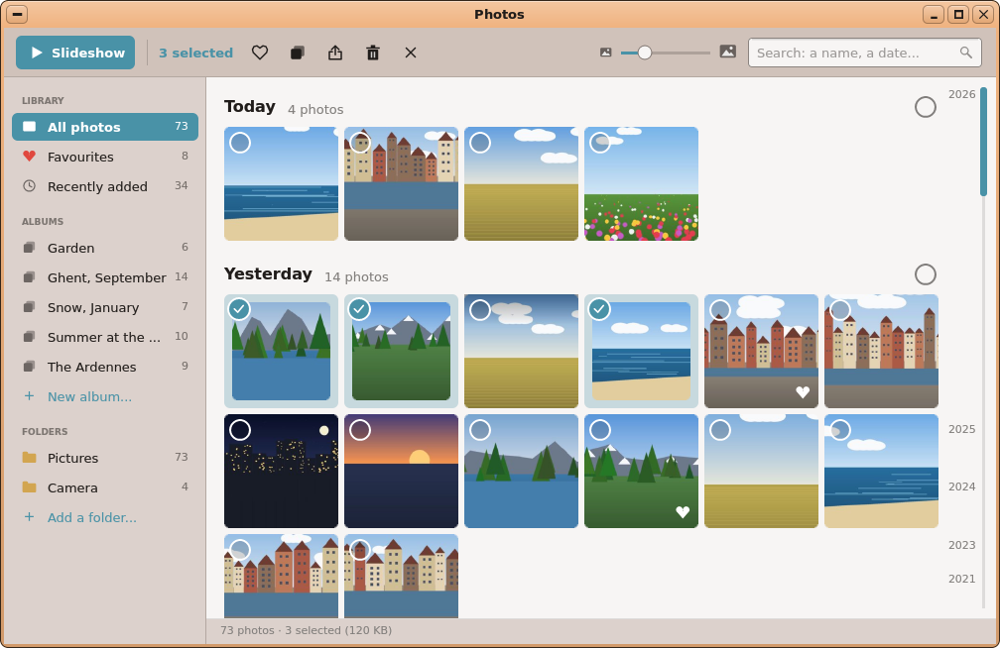 | 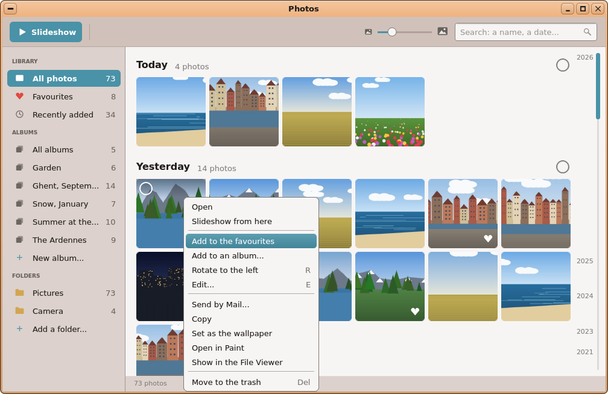 |
| *Three photos selected: the toolbar acts on them* | *A photo's menu* |

**Selecting**: the **ring** at the top left of a photo (or Ctrl + click; Shift + click: a range; the ring
of a day: all its photos; Ctrl+A: all; Esc: none). Once one is selected, a click selects more. The
toolbar then shows **favourite** (the heart), **add to an album** (an album made before, or *New
album...*; again: taken out of it), **share**, **move to the trash** (the File Viewer's trash: they can
come back) and the cross that unselects. A **right click** on a photo: open, slideshow from here,
favourite, add to an album, rotate to the left, edit, *Send by Mail...*, *Copy*, *Set as the wallpaper*,
*Open in Paint*, *Show in the File Viewer*, *Move to the trash*.

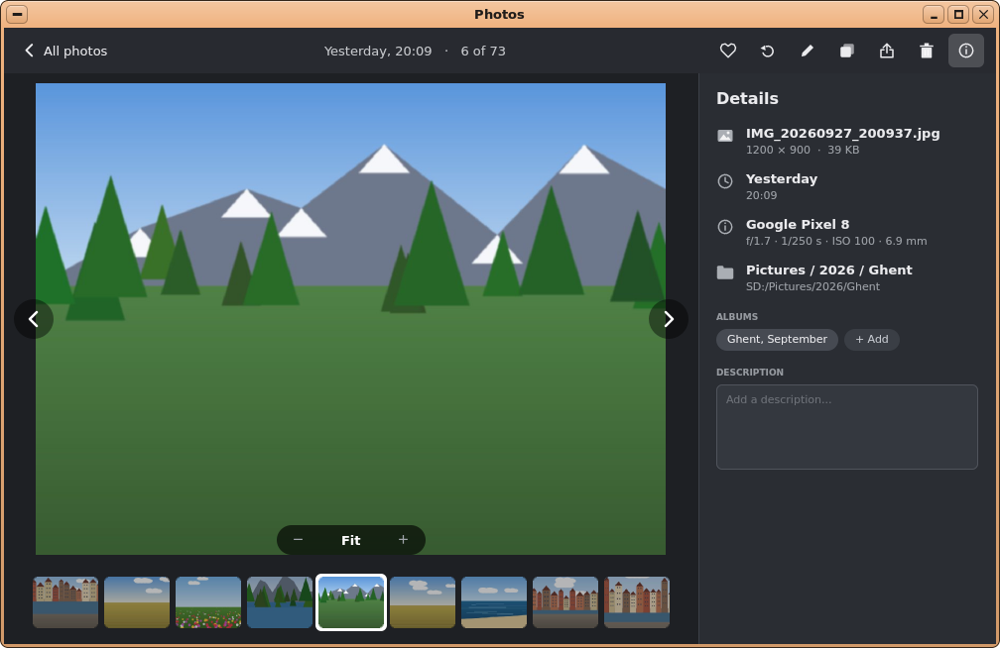

**A photo** (a click): dark around it, as big as the window lets it. ← / → (or the arrows on its sides,
the film strip of its neighbours underneath) the previous / next; the **zoom**: the wheel, + / −, *Fit*
(0), 1 = actual size, a drag when it is larger than the window. At the top: back (Esc), the date,
**favourite** (F), **rotate to the left** (R: for a camera's JPEG only the orientation in its EXIF changes,
no quality lost), **edit** (E), add to an album, share, delete (Del), the **details** (I): the file, its
size, when it was taken, the camera and the exposure (f/, speed, ISO, focal length), the folder, its
albums (a click opens one; *+ Add*), and a **description** you write (the search finds it).

| | |
|:---:|:---:|
| 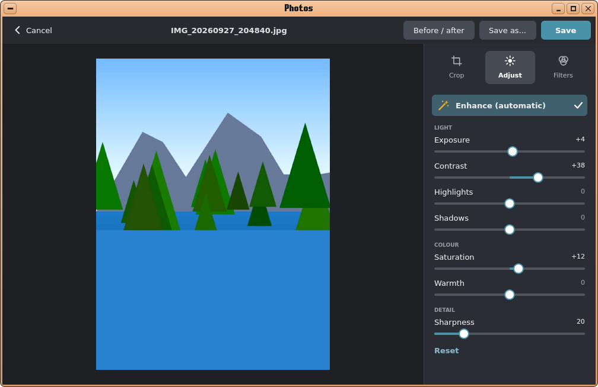 | 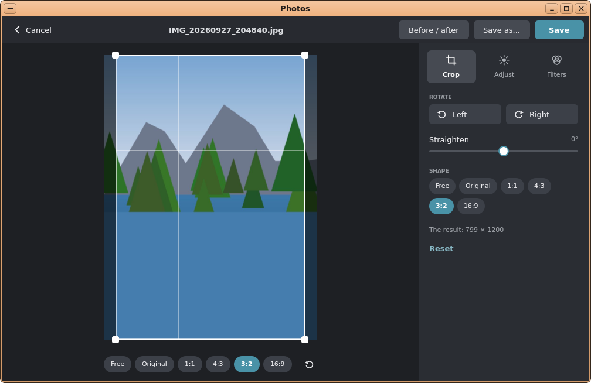 |
| *Adjust: Enhance (automatic) applied* | *Crop: the 3:2 shape, the thirds* |

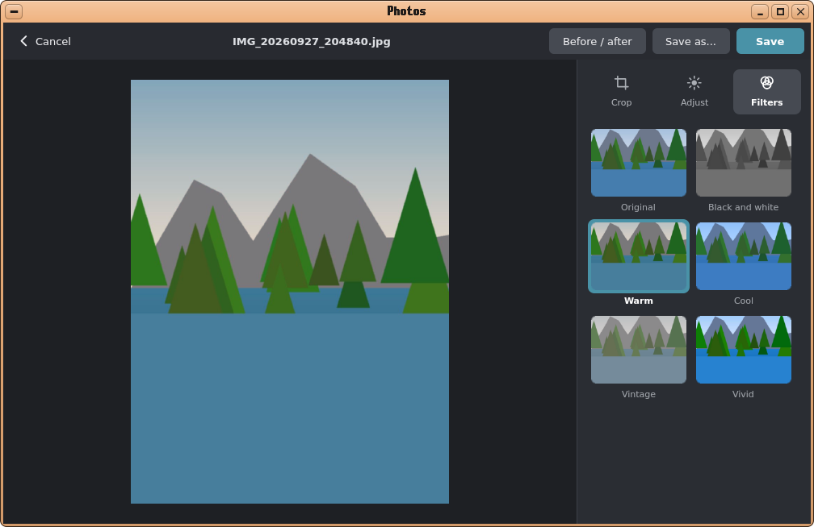

**Editing** (E, or the pencil): **Crop** — drag the corners, the sides or the frame; the shape: *Free*,
*Original*, 1:1, 4:3, 3:2, 16:9 (standing when the frame stands); a quarter turn left or right;
**Straighten** (±15°: the picture is enlarged so no corner is empty). **Adjust** — **Enhance
(automatic)**, then by hand: exposure, contrast, highlights, shadows, saturation, warmth, sharpness.
**Filters** — black and white, warm, cool, vintage, vivid, each shown on the photo. Hold **Before /
after** to see the original. **Save** writes over the photo (a JPEG keeps its camera facts; a PNG stays a
PNG); **Save as...** writes a new file (JPEG, or PNG by its name) and leaves the original as it was.
*Reset* undoes a tab's changes; *Cancel* (Esc) leaves without saving (it asks).

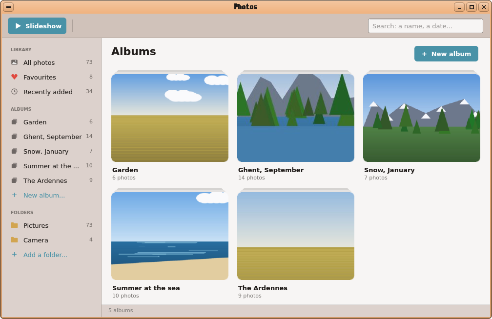

**Albums** hold no copies: a photo can be in several, and deleting an album never deletes its photos. A
right click on an album: open, slideshow, *Send by Mail...*, *Export as a PDF...* (a contact sheet: the
photos three by four on A4 pages, the oldest first, with their dates), rename, delete.

**Sharing**: *Send by Mail...* opens a new message in **Mail** with the photos attached, made smaller
(1920 pixels, 16 photos at most); *Copy* puts the picture on the **Clipboard**; *Set as the wallpaper*
makes it the desktop's (the Theme applet's *image* mode; a photo on another volume than `SD:` — or one the camera
stored turned — is first copied, upright, to `SD:/res/wallpaper.<ext>`); *Open in Paint*; *Export as a PDF...* (the
selection, or the photos shown). **Slideshow** (F5, the toolbar's button): the whole screen, a photo every
4.5 seconds melting into the next (the selection, or the photos shown); ← / → , Space pauses, Esc or a
click ends it.

**Files**: reads the pictures of the folders watched; writes `SD:/etc/photos/library.db` (what is known of
each photo: its date, size, camera, favourite, description), `SD:/etc/photos/thumbs/` (the thumbnails, as
JPEGs), `SD:/etc/photos/albums/<album>.txt` (one path a line), `SD:/etc/photos/folders.txt` (the folders
added), `SD:/res/wallpaper.<ext>` (a wallpaper copied); the photos it edits, rotates or sends (copies in
`RAM:/photos-mail`). Keys: ← → Home End, Page
Up / Down, Enter, Esc, Del, F, E, R, I, + − 0 1, Ctrl+A, Ctrl+F (search), F5 (slideshow).

### Jet Browser (`jet`)

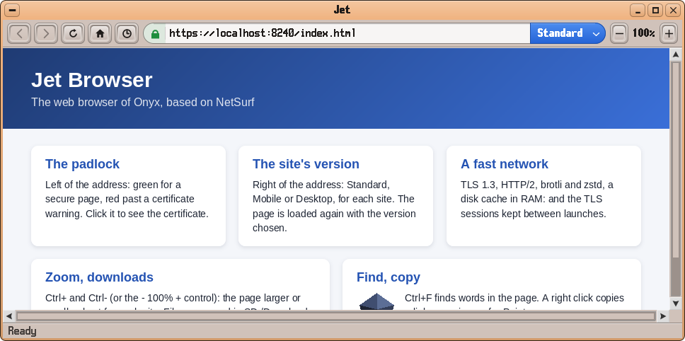

**Jet** is Onyx's browser, on **WebKit** (the engine of Safari; `docs/08-WEBKIT-PORT.md`). Until
2026-10-04 the name was a NetSurf port's; the WebKit browser, then called *Web*, took it over and
the NetSurf one was removed. Its own package (`pkg install jet`; 100 MB): one program that is the
window and, started again by WebKit, its **web process** (the page, JavaScript) and its **network
process** (HTTP / HTTPS through curl and mbedTLS) — three processes, one program file shared in
memory. **One page per window** (no tabs): a link that opens a new window (`target=_blank`,
`window.open`) starts Jet again on it. `jet [url]`, or the dock; no URL: the start page.

- **The toolbar**: Back, Forward, Reload (Stop while a page loads), Home (the start page,
  `SD:/apps/jet.app/start.html`), the **address field**: an address (`https://` added), a path on
  the card (`/docs/x.html`, `SD:/x.html`), or words (a DuckDuckGo search) — Enter goes.
- **The status bar**: the link under the pointer, the load's progress, "Done" or why a page did not
  load, and a download's progress ("Downloading x: 42 %", then "Downloaded x"). The window's title
  is the page's.
- **The menus**: File (New Window ^N, Open File… ^O, Open Location ^L, Save Page As… ^S, Downloads
  ^J, Close Window ^W), Edit (Cut, Copy, Paste, Select All — the address field's when it has the
  keyboard, else the page's; Find… ^F), View (Reload ^R, Zoom In / Out, Actual Size, Console F12),
  Go (Back Alt+←, Forward Alt+→, Home), Help.
- **The JavaScript console** (View ▸ Console, or F12): a window of its own beside the browser, not
  modal, that lists what the page's console takes — `console.log` / `info` / `warn` / `error` /
  `debug` with all their arguments, the **script errors** nobody caught, WebKit's own warnings —,
  each with its place at the right (`file.js:120:14`), warnings on yellow, errors on red, long
  messages wrapped. The messages are kept from the moment the page starts loading, so the window
  can be opened afterwards; **each new navigation empties it**. **Clear** empties it, **Copy** puts
  all of it on the clipboard as text; the wheel, the arrows, Page Up / Down, Home / End or the
  scroll bar move in it (it follows the newest message while it is at the end). The last 1000
  messages are kept. Closing the browser window leaves the console open with what it holds.
- **Drop-down lists** (`<select>`): a click opens the list under the box (above it near the bottom),
  with its groups and the choices that cannot be taken greyed; a click, or the arrows, Page Up / Down,
  Home / End and Enter, chooses; Esc or a click outside closes it. Long lists scroll (the wheel).
- **The clipboard** is the system's: what is copied in a page (^C, Edit ▸ Copy, the menu of the right
  button) can be pasted in the other apps, and the other apps' text in the page's fields (^V).
- **Find in the page** (^F): a bar above the status bar; each letter typed finds again, every match
  is marked and the count shown; Enter (or ▼) the next, Shift+Enter (or ▲) the previous; Esc or ✕
  closes it.
- **The right button**: on a link, *Open Link in New Window*, *Copy Link Address*, *Save Link As…*;
  on a picture, *Open Image in New Window*, *Copy Image Address*, *Save Image As…*; then Back,
  Forward, Reload, Copy, Select All, *Save Page As…*. *Save … As* asks where (in `SD:/Downloads` first).
- **Downloads**: a file the page cannot show (an archive, a program, a file sent as an attachment)
  is downloaded into **`SD:/Downloads`** (a name already there gets ` (1)`, ` (2)`…). The **Downloads**
  window opens beside the browser — a window of its own, not modal (File ▸ Downloads ^J brings it
  back): each file with its progress bar, its size and a **Cancel** button; finished, failed and
  cancelled ones stay listed. The status bar tells it too.
- **Keys**: in the page, what the page does with them (text fields, scrolling: arrows, Page Up /
  Down, Space); Backspace or Alt+← back, Alt+→ forward, F5 reload, F6 the address, Esc stops a load.
  The wheel scrolls. A file or a link dropped on the window is opened.
- **Start it at once**: add **Jet** in the Control Panel's **Preload** applet (§11; it writes
  `SD:/etc/preload.ini`): the 100 MB program is read from the card at boot, and every window then
  opens without reading it again.
- **Jet also serves Mail as its HTML view**: when Jet is installed, Mail's HTML messages are drawn by
  it, inside Mail's window (the same program run as an applet, `jet --applet ...`: no window of its own,
  JavaScript off, nothing from the internet until Mail's *Show the pictures*; a link clicked goes back to
  Mail, which asks, then opens it in a Jet window). Its lines in `kmsg` start `webview:`.
- **JavaScript is compiled** (1.0.3: JavaScriptCore's Baseline JIT and DFG; the system 2026.10.30
  or later): a GitHub repository's page loads in about 5 s, where the interpreter took about 50.
- **The GPU compositor** (the default from 1.0.6; `jet --nogpu`, or an empty file
  `SD:/etc/web-nogpu` — `touch SD:/etc/web-nogpu` — goes back to the page painted and copied by
  the CPU; Mail's HTML view stays on the CPU): the page is assembled by the Pi's GPU (the V3D): the page
  is kept as tiles — a scroll paints only what comes into view —, CSS animations of opacity and
  of transforms move layers without painting anything, and (1.0.5) the tiles are painted on the Pi's
  free cores too (two cores more at most; an emulator running keeps them: one core then, as before).
  Without a GPU the same layers are assembled by the CPU. `kmsg` shows `web: gpu: …` lines
  (frames, tiles painted, the time spent) every two seconds while it works.
- **Video and sound** (1.0.7): `<video>` and `<audio>` play — VP8, VP9, AV1, Opus, FLAC, MP3, PCM,
  as files (WebM, MP4, WAV…) and as streams (Media Source: **YouTube** plays, in VP9 up to 480p
  on a Pi 4, at its full frame rate with the GPU compositor: the pictures are a layer of their
  own). **No H.264, no AAC**: a site that only has those shows its "cannot play" message. One
  page's sound at a time. No full screen yet.
- **YouTube and Google as on a phone** (1.0.8): their desktop pages are heavy for a Pi 4, so Jet asks
  for them as a phone would (Android's Chrome) and gets their lighter pages — YouTube's (`m.youtube.com`)
  loads in about 6 s where the desktop one took 12 to 14. Every other site gets Jet's own user agent.
  (The switch files keep the name `web-`.) An empty file `SD:/etc/web-desktop-ua` (`touch SD:/etc/web-desktop-ua`) turns this off;
  `SD:/etc/web-mobile-ua` asks for every site as a phone.
- **Not there yet** (the WebKit port's roadmap): WebGL, Web Audio.
- **When something goes wrong**: `kmsg` shows its lines (they keep the engine's first name, `web:`) — `web: [time] …` (the loads, the
  addresses, the errors, the web and network processes started and ended), `web: net start / done
  <status> <time> / FAILED <code> <url>` for each request, and, if a process is killed, `el0: …
  killed` with its `backtrace:` line. Keep `kmsg` running in a telnet session while you try a page.
  For a page that misbehaves, the **Console** (F12) says what its scripts report. Two files for a
  developer: `SD:/etc/web-console` (empty) also writes the pages' console to `kmsg`, and
  `SD:/etc/web-probe.js` is a script run in every page before the page's own (a sample that reports
  errors, failed resources and the document's state: `tools/webkit/tests/probe.js`).

**Files**: reads the card's fonts (`SD:/res/fonts/`), the certificates (`SD:/res/ca-bundle`);
writes `SD:/var/webkit/` (cookies, local storage, the caches) and the downloads (`SD:/Downloads/`,
or where *Save … As* was told). Licence: WebKit's LGPL-2.1
(`docs/LICENSING.md`).

### Mail, the mail client (`mail`)

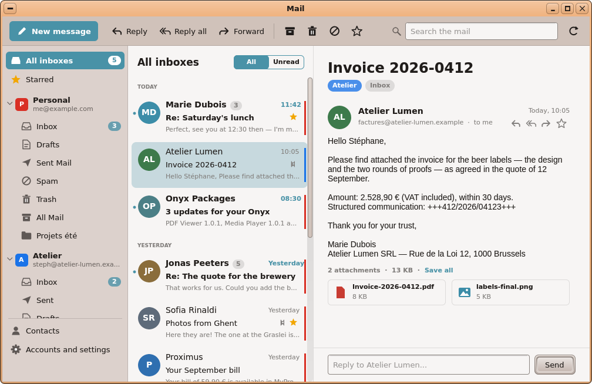
*The unified inbox: the accounts and their folders at the left, the conversations by day, an invoice open with its attachments.*

Mail reads and sends your e-mail: **Gmail**, **Outlook.com / Hotmail / Live**, **iCloud**, **Yahoo**,
and **any IMAP or POP3 account** (with SMTP to send). Start it from the dock or the app list
(*Internet*); a `.eml` file opened from the File Viewer is shown on its own; `mail --attach <list>` opens a
new message with the files the list names attached (Photos' *Send by Mail*).

**Adding an account** (the *Add an account* button the first time, *File > Add an Account...*, or
*Accounts and settings*): your name and your address. Mail recognises the big providers by the address
and fills their servers in:

| | |
|:---:|:---:|
| 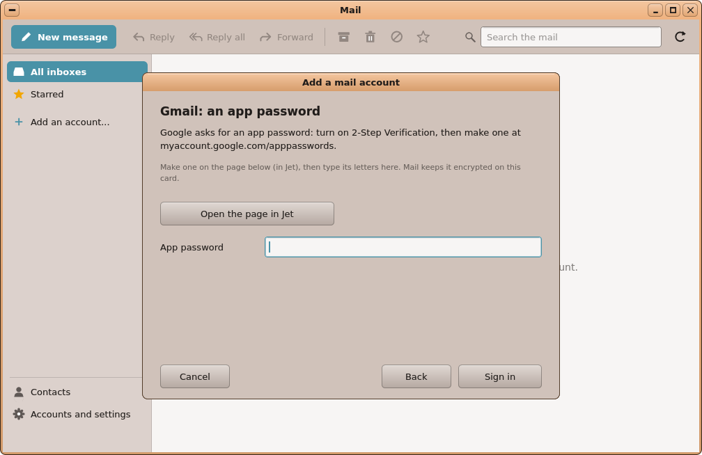 | 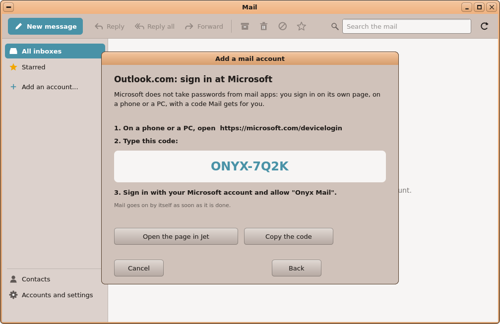 |
| *Gmail: an app password* | *Outlook.com: Microsoft's sign-in by a code* |

* **Gmail, iCloud, Yahoo, Fastmail** ask for an **app password** (not your usual one): turn on 2-step
  verification, make the password on the provider's page (*Open the page in Jet*), type it.
* **Outlook.com / Hotmail / Live** do not take passwords from mail apps: Mail shows a **code**; on a phone
  or a PC open `microsoft.com/devicelogin`, type the code, sign in, allow "Onyx Mail" — Mail goes on by
  itself. (Mail carries the "Onyx Mail" application's id, registered at Microsoft; `SD:/etc/mail/oauth.ini` may give another: `docs/mail/README.md`.)
* **Another provider**: its password; Mail tries `imap.<domain>` and `smtp.<domain>`. **Settings by hand**:
  IMAP or **POP3**, each server, its port and security (SSL/TLS, STARTTLS), the user names and passwords,
  POP3's *Leave the messages on the server*.

Mail then **checks** the settings (it says plainly what is wrong: a server not found, a password refused,
a certificate not trusted) and fetches your mail.

**The window**: at the left the **All inboxes** (every account's Inbox together, the unread counted),
**Starred**, then each account (its colour, its name; a click folds it) and its folders — Inbox, Sent,
Drafts, Archive, Junk, Trash and your own; at the bottom **Contacts**, **Accounts and settings**, and what
Mail is doing. In the middle the **conversations** by day (Today, Yesterday, this week...): who, how many
messages, the subject, the first words, when, a paper clip, a star, the account's stripe; *All* /
*Unread*. At the right the conversation. The **toolbar**: *New message*, Reply, Reply all, Forward,
Archive, Delete, Junk, Star, the **search** (who, subject, text, in every account), *Check now*.

| | |
|:---:|:---:|
| 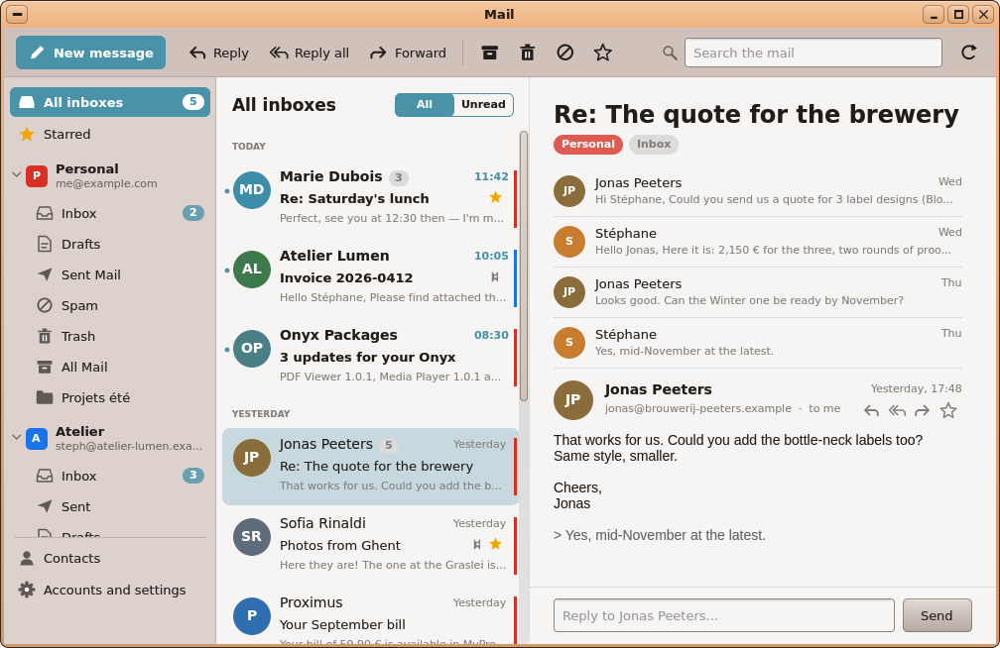 | 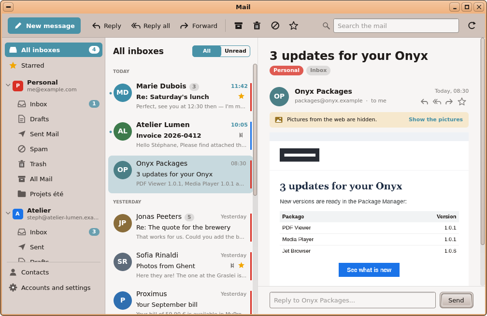 |
| *A conversation: the earlier messages folded* | *An HTML newsletter, its web pictures held back* |

**Reading**: a conversation shows its messages oldest first, the read ones folded (a click opens one);
your own replies (from Sent) are in it, as Gmail shows them. Messages in **HTML** are drawn by
**WebKit** when **Jet** is installed (`pkg install jet`): the browser's program runs inside Mail's
reading pane as its *web view* — the message in a box filling the pane, scrolled with the wheel over it;
a click in it gives it the keys (arrows, Page Up / Down, Space; Ctrl+C copies the selected text, Ctrl+A
selects it all), a click elsewhere gives them back to Mail. Without Jet (or if it cannot start), Mail's own
renderer draws them (HTML 4 and CSS 2: tables, colours, fonts, buttons; a newsletter wider than the pane
is shrunk to fit). Either way nothing runs in them (no JavaScript), and their **pictures — and styles and
fonts — from the web are hidden** until you click *Show the pictures* (they would tell the sender you read
the message); the pictures sent in the message itself (`cid:`) are shown. The first HTML message after Mail
starts takes a moment (*Opening the message...*: the web view starting); the next ones are quick. A **link**
asks before opening it in **Jet** (a `mailto:` link starts a
message); in the web view, the address of the link under the pointer shows at the box's bottom. **Attachments**: a click — *Open* (in the app that opens that kind:
a PDF in the PDF Viewer, a picture in the Image Viewer) or *Save as...*; *Save all* puts them in
`SD:/Downloads`. A click on the sender: write to them, add them to the contacts, copy the address. The
**quick reply** at the bottom sends at once. A right click on a conversation: reply, forward, read /
unread, star, archive, junk, delete, *Move to...*

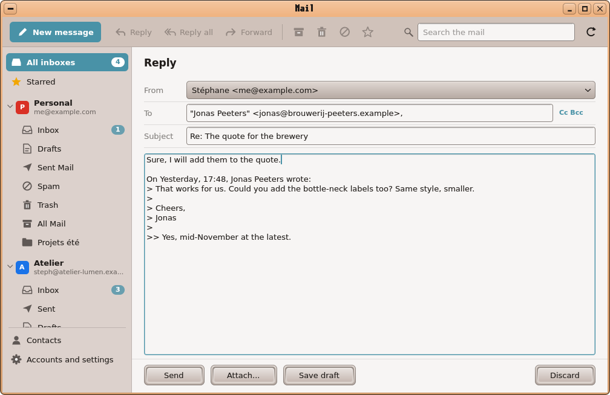

**Writing** (*New message*, Ctrl+N; Reply Ctrl+R, Reply all, Forward Ctrl+L): *From* (which account),
*To*, *Cc* / *Bcc* (*Cc Bcc*), the subject, the text. Addresses **complete as you type** from your
contacts and the people you wrote to (Up / Down, Enter or Tab takes one). A reply quotes the message and
stays in its conversation; a forward carries its attachments. *Attach...* adds files (20 MB at most);
**Send** (or Ctrl+Enter); *Save draft* keeps it in Drafts; *Discard*. The message goes as text and as
simple HTML (its links, the quote with a bar), with your signature.

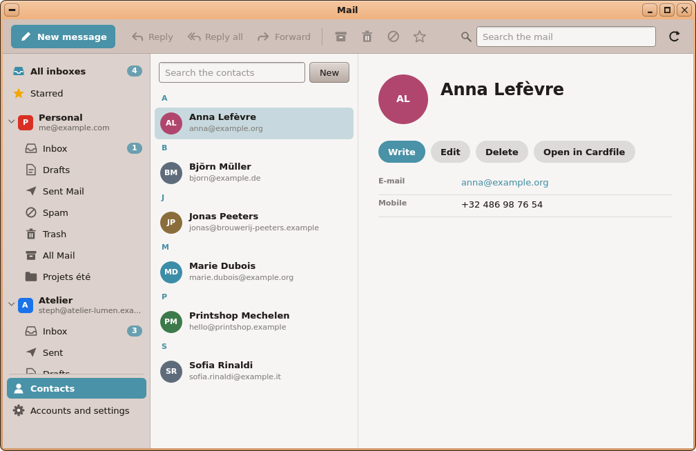

**Contacts**: the people A to Z (a search), the card of the one chosen — e-mails, phones, company,
address, birthday, notes —, *Write*, *Edit*, *Delete*, *New*, *Open in Cardfile*: they are a
**Cardfile** form, `SD:/Documents/Contacts.card`, which Cardfile opens too.

**Accounts and settings**: each account's name (what people see), its label, how often new mail is
looked for (by hand, every minute ... every hour; 5 minutes by default — a **notification** tells new
mail), its **signature**, a new password, its servers; *Add an account...*, *Remove...* (the mail stays on
the server).

**Files**: `SD:/etc/mail/accounts.ini` (the accounts, without their passwords), `SD:/etc/mail/secrets` (the
passwords and Microsoft's tokens, **encrypted** — AES-256 — with a key of this card, `SD:/etc/mail/key`:
not readable as text, but whoever has the card has them), `SD:/etc/mail/oauth.ini` (optional: another
Outlook application id), `SD:/mail/<account>/` (the folders, the messages' list, the messages opened, as `.eml`),
`SD:/mail/recipients.tsv` (the addresses written to), `SD:/Documents/Contacts.card`; with Jet, the HTML
message handed to the web view, `RAM:/mailview-<pid>.html` (removed when Mail ends). Keys: ^N new, F5
check, ^R reply, ^L forward, ^S star, ^U unread, Del delete, ^F search, Up / Down the conversations,
Ctrl+Enter send.

### IRC, the chat client (`irc`)


*IRC connected to Libera.Chat: `#onyx` shown, `#raspberrypi` with 3 unread lines (`@`: one names
you), a private message from alice waiting; dave_'s line names you: it is tinted.*

**Connecting.** On top: **Server** (host, or `host:port`; the arrow lists the servers used before,
kept in `servers.txt`), **Nickname** and **Connect** (then **Disconnect**). The first time, IRC
connects by itself as soon as the network is up, to the server of `config.ini`. On connecting it
sends at once `NICK` (the nickname of the field, kept in `nick.txt`) and `USER`; a nickname already
in use is tried again with a `_` appended. Enter in the Nickname field while connected changes
your nickname (`NICK`). With `password = …` in `config.ini`, IRC identifies you to **NickServ**
after the welcome. `channel = #a,#b` in `config.ini`: joined on connecting.

**The window.** On the left, your **conversations**: the server (its messages: the welcome, the
MOTD, the errors), the channels you are in (`(left)` after you leave or lose the connection), and
**Private messages**. A number in brackets counts the lines you have not read, `@` when one of them
names you. Click one to show it. In the middle, the channel: its **name and topic** on top
(**Leave** on the right), its messages **grouped by author** — a coloured avatar with their
initial, their name in the same colour, the time; the next lines from them (within five minutes)
follow under it —, joins, parts and mode changes in grey, `/me` actions in italics, notices in
amber, a line that names you **tinted**. The wheel (or the bar on the right) scrolls back. At the
bottom, the line you type (up to 400 characters; **Enter** or **Send**). On the right, the
channel's **users** (operators `@`, then voiced `+`, then the others); **double-click** someone
(or select them and **Message**) to talk to them privately. The status bar: connected as whom,
the server, how many channels.

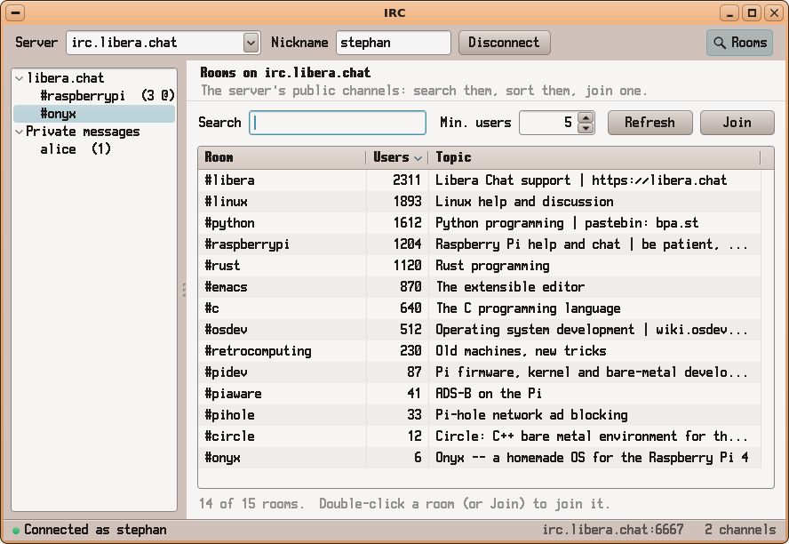
*Rooms: the server's channels, the busiest first.*

**Rooms** (the toolbar, or `/list`) asks the server for its list of channels (`LIST`; Libera.Chat
has thousands: they come in over a few seconds — "Receiving the list..."). **Search** keeps the
rooms whose name or topic has the text; **Min. users** hides the small ones (5 at first). A click
on a column's title sorts by it (again: the other way). **Double-click** a room (or select it and
**Join**) to join it: its conversation opens. **Refresh** asks for the list again. Rooms again
(or joining) goes back to the conversation.

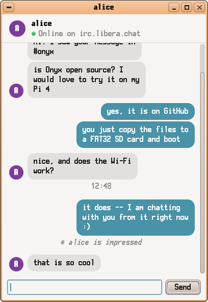
*A private conversation, in its own window.*

**Private conversations** open in a **window of their own**, a messenger's: their avatar, name
and whether they are online on top; their messages in grey bubbles on the left (their avatar
beside the last of a run), yours in the theme's accent on the right; the time centred over the
messages after a pause of a quarter of an hour; `/me` actions and events (a quit, a new nickname)
in grey in the middle. A message someone sends you **opens their window** (and it gets the
conversation so far). Closing it keeps the conversation: it comes back when it opens again (the
main window's list, or their next message). The main window keeps the connection: closing it
closes the conversation windows too.

**Commands** (in the line you type): `/join #chan`, `/part` (or **Leave**; `/close`),
`/nick name`, `/msg nick text` (a person: their window opens), `/query nick`, `/me action`,
`/topic text`, `/list`, `/server host[:port]`, `/clear`, `/raw line`, `/quit`; any other
`/COMMAND args` goes to the server as it is; `//text` sends a line starting with `/`.

Plain-text IRC only (port 6667: there is no TLS in IRC yet). The text is UTF-8 on the network and
Latin-1 on the screen (the font's: a character beyond it shows as `?`); colours and bold of
mIRC are removed.

### Ledger, the accounts (`ledger`)


*Ledger's overview with its demo company (`SD:/docs/demo-company.ledger`): what is to receive and to
pay, the bank, the year's result, the sales and purchases by month, the next VAT return, the invoices
overdue.*

> **The manual.** Ledger has a complete user manual, with pictures, in English, French and Dutch:
> `SD:/manuals/ledger/Ledger.pdf`, `Ledger.fr.pdf`, `Ledger.nl.pdf` (and their `.md`) — getting started, every page and document step by step, the VAT codes, the
> printing's fields, questions and answers. What follows is its summary.

> **Ledger for macOS.** The same Ledger runs on a Mac with Apple silicon (macOS 11 Big Sur to 26
> Tahoe): `Ledger.app`, built on a Mac by `sh pc/macOS/build.sh` (`pc/dist/macOS/`), Letters inside it
> for the printed documents. Your books and what Ledger makes (quotes, invoices, reports, VAT files) are
> in **Documents/Onyx Ledger** — the manual's `SD:/docs` —, its settings and templates in
> Library/Application Support/Onyx Ledger; the file dialogs show `SD:`, `HOME:` (your home folder) and
> `MAC:` (the whole Mac). The manual's **Ctrl+key is Cmd+key** (Cmd+S, Cmd+N, Cmd+F, Cmd+C/V), Option is
> Alt; the menus are in the Mac's menu bar; a `.ledger` opens by a double click in the Finder or dropped
> on the window. A printed document (an `.rtf`) is put on paper or made a PDF from Pages, TextEdit or
> Word; a report for the Spreadsheet (`.xlsx`) opens in Numbers or Excel. In French: the side bar's **FR**
> (the Mac's language at the first start). Its `README.txt` says the rest.

> **In French.** Ledger speaks **English or French**: click **EN** or **FR** at the foot of the side
> bar (or **File ▸ English / Français**). Ledger starts again at once in that language, on the same
> books (a document being typed is saved or given up first). Its menus, pages, dialogs, messages and
> reports change; the chart of accounts and the printed documents keep their own language (the
> company's, the customer's). On the Mac, Ledger starts in French the first time when the Mac's
> language is French.

Ledger keeps the **double-entry books** of a Belgian company or self-employed person: its chart of
accounts (the **PCMN**, in French or in Dutch), its customers and suppliers, its **journals** (sales,
purchases, bank, cash, miscellaneous operations) and their documents, its **fiscal years**, its **VAT
returns** (Intervat), its **quotes and orders** — in the way of **BOB 50** for what it does, as simply
as **GnuCash** shows it. You type documents (an invoice, a statement), never entries: Ledger makes
the entry, shows it as you type, posts it when you save. Everything is **written to the file at once**
(the file before kept as `.bak`): there is no Save for the books.

**The books.** One file (`.ledger`) holds one company. **File ▸ New Company...** asks for its name,
VAT number, address, e-mail, phone and bank account, the chart's language (**French** or **Dutch**:
the documents' language too), its VAT situation (**files VAT returns** — quarterly or monthly —,
**the small business franchise**, **not subject to VAT**) and its first fiscal year; the chart, the
journals (VEN / VKP sales, ACH / AKP purchases, BNK bank, CAI / KAS cash, OD / DIV miscellaneous
operations) are made, all can be changed (**Settings**). **File ▸ Open...** (^O) opens a company; so does a `.ledger`
double-clicked in the File Viewer (`fileassoc.ini`), dropped on the window or named on the command
line (`ledger SD:/docs/x.ledger`); started alone, Ledger opens the books it had last
(`SD:/apps/ledger.app/last.txt`), else it welcomes you — **New company**, **Open**, or the **demo
company** (`SD:/docs/demo-company.ledger`: *Atelier Lumen SRL*, a Brussels design studio, from January
2025 to September 2026, 2025 closed). **File ▸ Save a Copy As...** writes a copy elsewhere.

**The window.** At the left, the side bar: the company, the **fiscal year shown** (the lists, reports
and the VAT follow it), the pages — **Overview**; the journals **Sales**, **Purchases**, **Bank and
cash**, **Misc. operations**; **Quotes and orders**; **Customers**, **Suppliers**; **Chart of
accounts**, **Reports**, **VAT**; **Settings** — with red badges: invoices overdue, a VAT return late.
At the right, the page: its title, a word on it, its buttons (the accent one: its main action). A
document opens **in place of its list**; **Save** posts it and goes back, **Cancel** (Esc) leaves it
(asking when something was typed). Keys: **^N** a new document of the page, **^S** save the
document, **^F** search, **Esc** leave; in a document, **Tab** / **Enter** the next field, in its
lines' grid the next cell (the last one: a new line), **F4** or **Alt+↓** the list of what can be
typed there (accounts, parties, VAT codes), **Ctrl+Del** removes a line; **Delete** in a list deletes
the document chosen. A field for a party, an account or a VAT code finds as you type — a name, a code,
a VAT number, an account's number or words of its name.

#### Sales and purchases

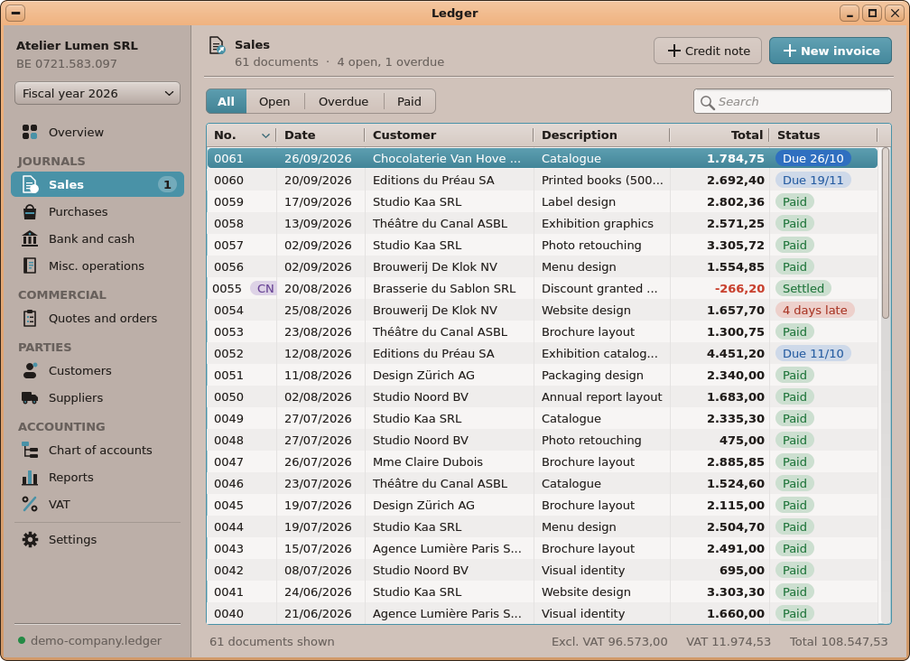
*The sales: numbers, customers, totals and their state — paid, due, late, a credit note settled.*

**Sales** and **Purchases** list the journal's invoices and credit notes of the year shown: number,
date, party, description (a purchase: the supplier's number), total, **state** (**Paid**, **Due**
15/10, **4 days late**, **Credit open**, **Settled**, **Transfer sent**). **All / Open / Overdue / Paid**
filter them, the search box finds words of a party, a description, a number or an amount; the foot
adds them up. A right click: **Open**, **Print** (a sale), **Make a credit note for it**, **Delete...**
(a sale only when it is its journal's last: make a credit note instead).

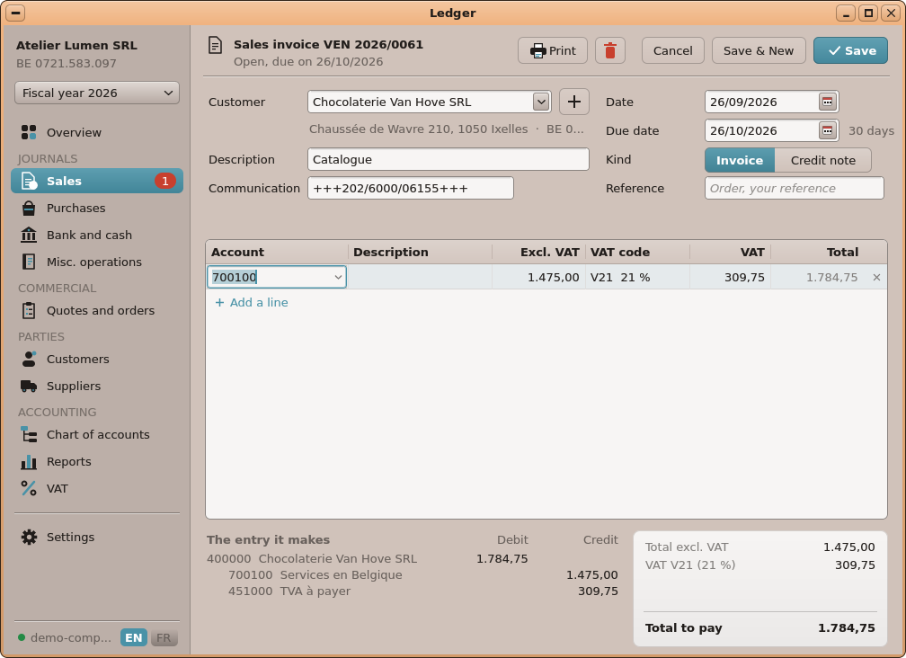
*A sales invoice: the customer (its address, its VAT number), the dates, the structured communication,
its lines, the entry it makes and its totals.*

**New invoice** (or **New purchase**, **Credit note**): the **customer** (or supplier) typed and picked
— **+** makes a new card —, its address shown; the **date**; the **due date** (the party's payment
terms: 30 days by default; its number of days shown); a **description**; the kind (**Invoice** /
**Credit note**); a sale's **structured communication** (+++123/4567/89002+++, made from its number
when saved) or the supplier's one; a **reference** (a purchase: the supplier's invoice number — the
same one twice is asked about); the journal when there are several. The **lines**: the **account**
(a sale: 70..., the party's usual one first; a purchase: 6..., 2... for investments), a
**description**, the amount **excluding VAT**, the **VAT code** — the party's situation chooses it
(a Belgian company, a private person, an EU company — its services then reverse-charged —, outside the
EU, a Belgian co-contractor): **V21**, **V12**, **V6**, **V0**, **VEUS** / **VEUG** / **VEUT**
(intra-EU services, goods, triangular), **VCC** (co-contractor), **VEX** (export), **VX** (exempt,
art. 44); purchases **A21** / **A12** / **A6** / **A0**, **A21D50** (a car: half deductible),
**A21ND**, **AEU21**... (intra-EU acquisitions), **AEUS21** (EU services), **ACC21**... (co-contractor),
**AWS21**, **AIM21**, and the regularisations **R61** / **R62** —, the **VAT** (computed; typed when the
invoice says otherwise: shown in blue), the total. Below: **the entry it makes** (the party's account,
the accounts, the VAT due or deductible — with the reverse charges' both sides —, debit and credit)
and the totals by VAT code. **Save** posts it (**Save & New**: and the next one); a document whose
VAT return is filed (or whose year is closed) is **locked**. **Print** makes the invoice in Letters
(*Printing* below).

#### Bank and cash


*The bank's CODA file imported: a movement a line, its party found (by its structured communication,
its account, its name) and the invoice it pays ticked; the bank's charges on 657200; one left to
complete.*

**Bank and cash** lists the statements (number, date, description, journal, in, out, the new balance).
**New statement**: the journal, the date, a description (*Statement 43* after *Statement 42*: the
bank's numbering), the **new balance** the bank
says (optional: checked against the old balance and the movements); the **old balance** is the
journal's. A **movement**: a **party** or an **account** (typed: a name, an account's number), a
description, the **amount** (+ in, − out). A party's **open items** show below — tick those the
movement pays (its amount follows them); an amount typed ticks the one item as much; a **structured
communication** typed in the description finds its invoice (party, item, amount). Saved: the items
ticked are **matched** with the payment (paid).

**Import CODA** (or **Tools ▸ Import CODA...**) reads the **CODA** file your bank gives (Febelfin's
coded statements, version 2: `.cod`, one statement or several): each statement's journal is found by
its **IBAN** (a bank journal's, **Settings ▸ Journals** — Ledger says so when none has it), those
already in the books are skipped, then each statement is shown to be completed: every movement's
party found by its **structured communication** (the invoice it pays ticked — sales and purchases
alike), else by the counterparty's **IBAN** (a card's) or its **name**, the item as much ticked (or
all the party's items when they add up to it); the bank's charges (CODA families 35 and 80) on
**657200**; a movement not found shows **To complete** in red — type its party or account. The header
says what is left (*CODA 1 of 3: 2 movements to complete*); **Save** posts it and shows the next one.
The demo has one: `SD:/docs/demo-bank-statement.cod` (Import CODA ▸ its name ▸ Open).

**Misc. operations**: an entry's lines — account (a party's account asks for its party), description,
**debit**, **credit** —, saved when it balances; one can be flagged **the opening balances**; the VAT
settlements are listed there too.

#### Quotes and orders

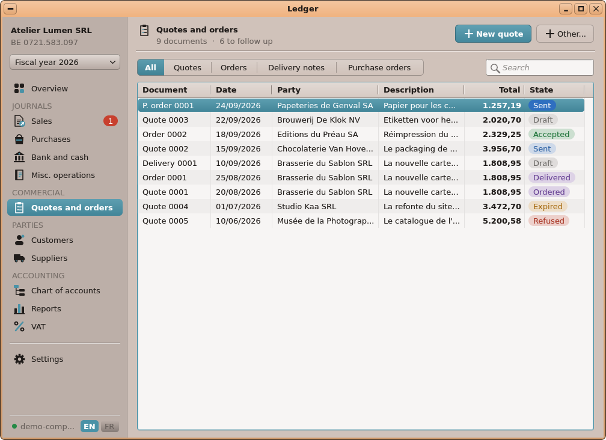
*The quotes, orders, delivery notes and purchase orders of the year, their state: draft, sent,
accepted, ordered, delivered, invoiced, expired, refused.*

**Quotes and orders** keeps the **commercial documents** — not posted: a **quote** (its validity), a
customer's **order** (its delivery date), a **delivery note**, a **purchase order** (to a supplier) —
each numbered in its kind and year (*Quote 2026/0003*). The list filters them (**All**, **Quotes**,
**Orders**, **Delivery notes**, **Purchase orders**), finds words, shows their **state**: **Draft**,
**Sent**, **Accepted**, **Refused**, **Expired** (a quote past its date), then what followed —
**Ordered**, **Delivered**, **Invoiced**. **New quote**, or **Other...** for an order, a delivery note,
a purchase order (also **Documents ▸ Quote / Order / Delivery Note / Purchase Order**).

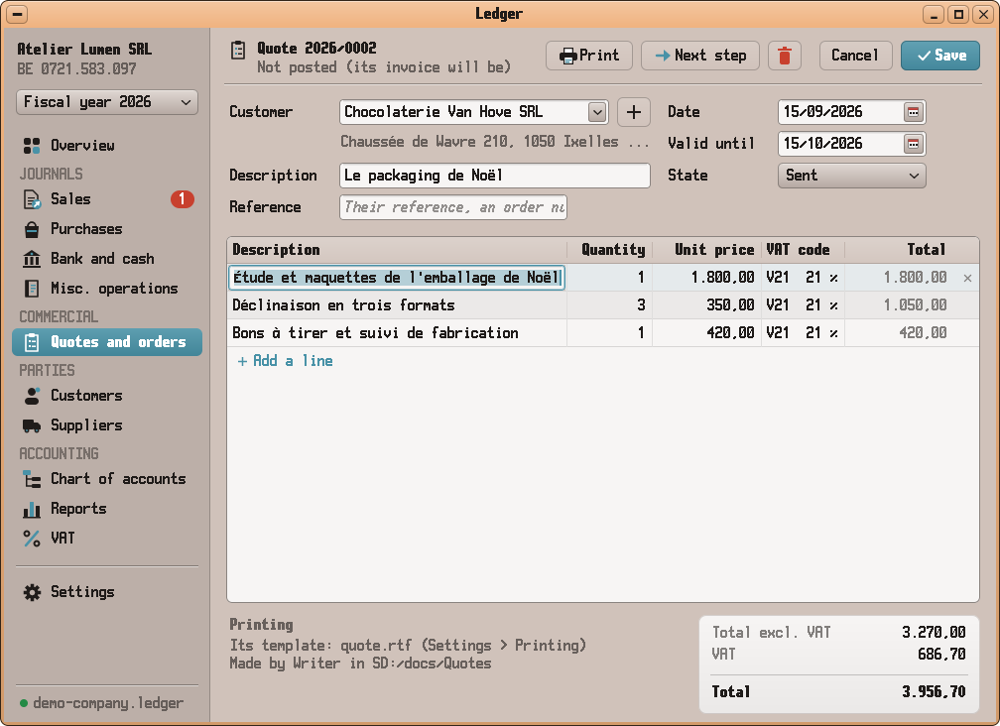
*A quote: its customer, dates, description and lines — quantity × unit price —, its totals; Print,
Next step.*

A document: the party, the **date**, **Valid until** (a quote; 30 days by default) or **Delivery**, a
**description**, the **state**, the party's **reference**; its **lines**: a description, a
**quantity** (2,5 hours), a **unit price** excluding VAT, the VAT code (the party's), the total; the
totals below. **Next step**: a quote becomes the **order** (the quote marked accepted), an order (or a
quote) a **delivery note**, any of them **the invoice** — the invoice's page opens filled (each line
"2,5 x Design...", the quantity times the price, on the party's usual account), **Save** posts it and
marks the document **Invoiced**; a quote can be marked **Accepted** or **Refused**. A document made
from another says so (*From Quote 2026/0001*) and marks it done when saved. **Print** makes it in
Letters.

#### Printing: documents from templates

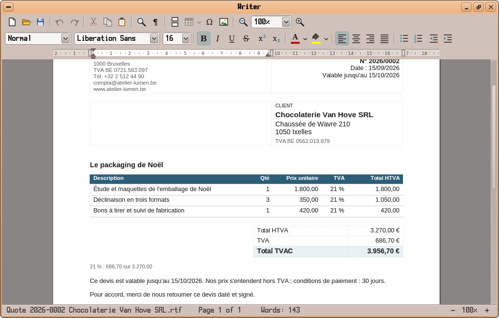
*A quote printed: Letters fills the template's fields — the company, the customer, the lines (a table
row repeated for each), the totals, the VAT's detail, the conditions.*

**Print** (a quote, an order, a delivery note, a purchase order, a sales invoice or credit note)
writes the document's data and asks **Letters** to make it from its **template** — a Letters document
(`.rtf`, `.docx` or `.odt`) in `SD:/apps/ledger.app/templates/`: `quote`, `order`, `delivery`,
`porder`, `invoice`, `creditnote`. The templates come in **French** (in that folder), **Dutch**
(`templates/nl/`) and **English** (`templates/en/`): a party's documents take **its language** (its
card: **Language**), else the company's (its chart's). The document made is written in
`SD:/docs/Quotes`, `Orders`, `Delivery notes`, `Purchase orders`, `Invoices` or `Credit notes`
(named after its number and party: `Quote 2026-0003 Brouwerij De Klok NV.rtf`) and shown in Letters —
save it again as `.docx` or `.odt` there.

A template is an ordinary Letters document whose **merge fields** Ledger fills: the document's —
«Kind», «Number», «Date», «Until», «DueDate», «Reference», «Text», «Communication», «Terms», «TotalNet»,
«TotalVAT», «Total», «VATDetail» (the VAT by rate, with the legal mentions of reverse charges and
exemptions) —, the company's — «CompanyName», «CompanyAddress», «CompanyVAT», «CompanyIBAN»,
«CompanyBIC», «CompanyEmail», «CompanyPhone», «CompanyWeb», «CompanyRegister»... —, the party's —
«PartyName», «PartyAddress», «PartyVAT», «PartyCode»... —, and the ones made to be printed as they are
(a label and its value, empty without a value): «UntilLine» (*Valable jusqu'au 28/10/2026*),
«ReferenceLine», «FromLine», «TermsText», «CompanyVATLine», «CompanyContact», «CompanyBankLine»,
«CompanyLegalLine», «PartyVATLine». A **table row** holding the lines' fields — «LineNo»,
«LineText», «LineQty», «LinePrice», «LineVAT», «LineTotal», «LineTax», «LineGross» — is **repeated
for each line**. **Settings ▸ Printing** lists the templates of a language, **Edit in Letters** opens
one (a language without its own: made from the French one), **Open the folder** shows them; in
Letters, **Tools ▸ Mail Merge** lists every field with a sample's values
(`templates/fields.card`) — change the look, the words, add a logo. The files Ledger writes for
Letters: `SD:/apps/ledger.app/merge.card`, `merge-lines.card`, `merge.job`.

#### Customers, suppliers, the chart

**Customers** and **Suppliers**: the cards (code, name, VAT number, city, balance, overdue) — **All**,
**With a balance**, **Overdue**, a search —; below, the chosen party's **account**: its documents and
payments with the running balance (**Open items only**); tick lines and **Match** them (they add up to
zero: an invoice and its payment), **Unmatch** undoes it. **New customer** / **Card**: its name, code
(made from the name), **payment terms** (days), **VAT number** (checked: a Belgian one's check digits,
an EU one's form), **VAT situation** (Belgian company, private person, EU, outside the EU,
co-contractor: its VAT codes by default), **language** (its documents'), address and country,
e-mail, phone, **IBAN** / BIC (checked), its usual **account** and **VAT code**, notes. A party with
documents cannot be deleted.

**Chart of accounts**: the PCMN's tree (classes, groups, accounts) and the chosen account's
**register** (its lines, debit, credit, balance); **New account**, **Edit** (its name, its nature for
the VAT return — goods, services, investments —, hidden: no longer offered).

#### Paying the suppliers (SEPA)

**Purchases ▸ Pay...** (or **Tools ▸ Pay Suppliers (SEPA)...**) lists the suppliers' open invoices —
those due within a week of the day chosen are ticked, a supplier without an IBAN cannot be (its card);
choose the **account** paid from (a bank journal's IBAN) and the **day** the bank pays; **Make the
file** writes a **SEPA credit transfer** file (ISO 20022 `pain.001.001.09`, as Belgian banks take it:
the supplier's name, address, IBAN and BIC, its structured communication when the invoice has one,
else its number) in `SD:/docs/Payments/` — upload it on your bank's site. Those invoices show
**Transfer sent** until the bank's statement pays them (a CODA import finds them by the supplier's
IBAN).

#### Reports


*The general ledger: each account's lines of the period, the balance brought forward and the running
balance (D debit, C credit).*

**Reports**: the **journals**, the **general ledger** (each account's lines with their running
balance and the balance brought forward), the **trial balance**, the **balance sheet**, the **income
statement** (the PCMN's headings, the year's result), the **customers' and suppliers' balances**,
**receivables and payables by age**, **a party's account**, the **VAT detail** — for a period (**Year**,
**Q1**–**Q4**, **Month**, or dates typed), a range of accounts, with the **zero balances** or not.
**Letters** opens the report as a document to print (A4, landscape when it is wide, its header and page
numbers), **Spreadsheet** as a workbook, **Save as...** writes it (`.rtf`, `.xlsx`, `.csv`) — in
`SD:/docs/Reports` by default.

#### VAT

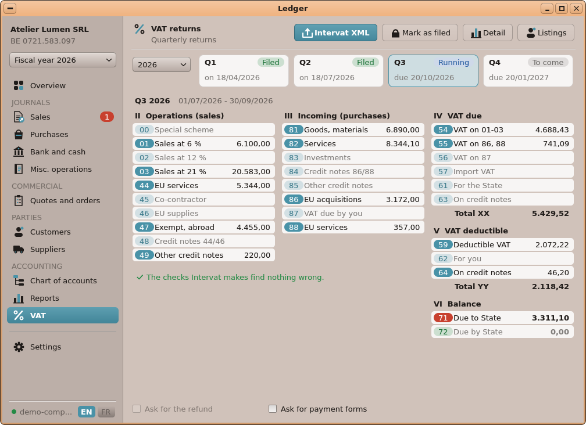
*The VAT return of the quarter: its grids as Intervat has them, the checks, the periods' state and due
dates.*

**VAT**: the year's periods (quarters or months: **Filed**, **Running**, **To come**, their due dates —
the 20th of the next month), the chosen period's **grids** (00–49 operations, 54–64 VAT due and
deductible, 71 / 72 the balance), the **checks** Intervat makes, **Ask for the refund**, **Ask for
payment forms**. **Intervat XML** writes the return's file (to upload on Intervat, the SPF Finances'
site), **Detail** lists the lines behind each grid, **Mark as filed** locks the period's VAT entries
and posts its **settlement** (the VAT due and deductible moved to 451200 / 411200: the payment to the
State then goes on 451200), **Listings** writes the **annual customer listing** and the
**intra-Community listing** (XML). A late return shows a red badge on **VAT**.

#### Settings, the fiscal years

**Settings**: **Company** (name, legal form, address, country, VAT number, e-mail, phone, IBAN / BIC,
**register** — *RPM Bruxelles* — and web site: the documents' letterhead; the VAT situation and the
returns' period); **Fiscal years** (**Add the next year**; **Close the year...**: its result carried
forward — a profit 693000 / 140000, a loss 141000 / 793000 — by an entry on its last day, its entries
locked; **Reopen the year**; the balance sheet's accounts go on from year to year: no opening entry is
needed); **Journals** (code, name, kind, its account — a bank's 55..., cash 57... —, the bank's
**IBAN**: the CODA import and the payments need it, hidden); **Accounts** (the accounts by role:
customers, suppliers, VAT due, VAT deductible, profit and loss carried forward, suspense);
**Printing** (the templates).

**Files**: `.ledger` — text in Latin-1 (easy to read and to mend by hand): a `[company]` head
(`key = value`), then `[years]`, `[journals]`, `[accounts]`, `[parties]`, `[entries]` (a document,
then its lines), `[returns]` (the VAT returns filed), `[documents]` (the quotes and orders, then their
lines), a tab between the cells (`\t`, `\n`, `\\` in a cell); the format is described at the top of
`user/Apps/ledger/fileio.h`. Reports in `SD:/docs/Reports`, printed documents in `SD:/docs/Quotes`...,
payments in `SD:/docs/Payments`.

### Courier, the HTTP client (`courier`)

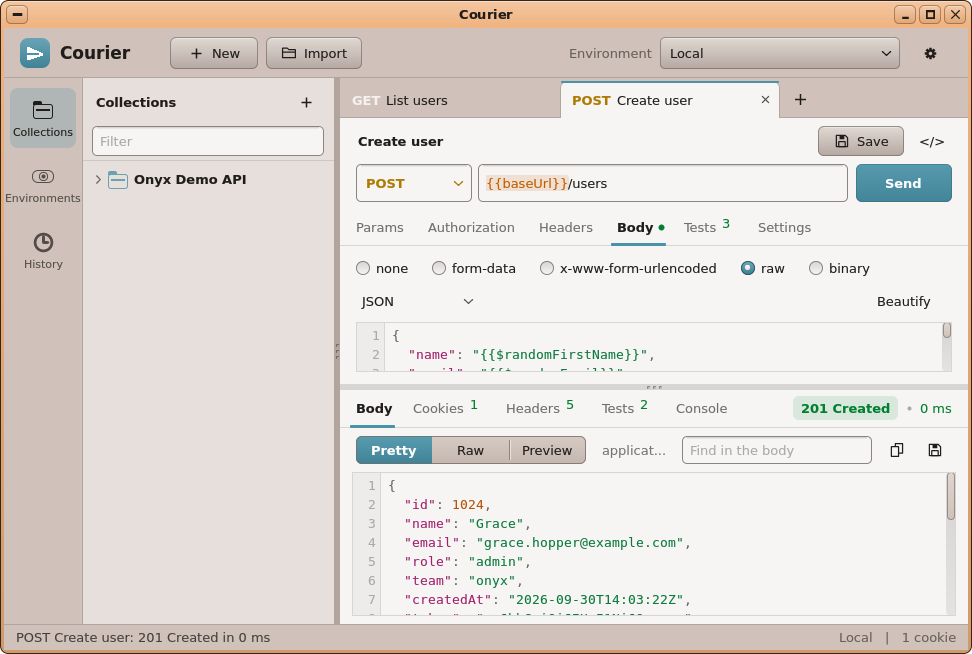
*Courier with its demo collection: a POST sent, its JSON answer pretty-printed; `{{baseUrl}}` comes
from the environment chosen, top right.*

Courier builds, sends and tests **HTTP requests**, the way **Postman** does — to try a web API, a
server of your own on the network, a device's REST interface. It is in the **Internet** drawer.
The window: the **top bar** (New, Import, the **environment** chosen, the gear: the cookies, the
history), the **sidebar** on the left (its rail: *Collections*, *Environments*, *History*; a filter
above each list), the **open tabs** (a browser's: a request, an environment or a collection each;
a dot: changes not saved; a middle click or × closes one; a right click: close the others, duplicate),
and the tab's editor. The window can be maximised; the sidebar's and the response's dividers drag.

**A request.** Its **name** (click it to rename it), **Save** (Ctrl+S) and **`</>`** (the code),
then the **URL bar**: the **method** (its colour: GET green, POST amber, PUT blue, PATCH purple,
DELETE red...), the **URL**, **Send** (or Enter in the URL, or Ctrl+Enter anywhere; while it is on
its way the button is *Cancel*, Esc too). Below, its sections:

- **Params** — the URL's query as a table, kept in step with the URL both ways; a row's check box
  leaves it out (kept, not sent); **Bulk Edit** shows the rows as `key:value` lines (`//` before a
  disabled one).
- **Authorization** — *Inherit auth from parent* (the folder's, else the collection's: the panel
  says which), *No Auth*, *Bearer Token*, *Basic Auth* (username, password), *API Key* (a header,
  or a query parameter).
- **Headers** — the table (and its Bulk Edit). Courier also sends *User-Agent*, *Accept*,
  *Accept-Encoding: gzip, deflate*, *Host*, *Connection: close* and the jar's cookies, unless the
  request sets them.
- **Body** — *none*, *form-data* (a row is *Text* or *File*: its chip picks a file on the card; sent
  as multipart), *x-www-form-urlencoded*, *raw* (a code editor: line numbers, colours for JSON / XML
  / HTML / JavaScript, auto-indent, undo Ctrl+Z / redo Ctrl+Y; the language sets the Content-Type;
  **Beautify** indents JSON and XML), *binary* (a file's bytes).
- **Tests** — checks run on each response: a row = what (`status`, `time` in ms, `size`, `body`,
  `header.Content-Type`, `cookie.session`, `json` / `json.data.items[0].id` / `$.token`) and what is
  expected (`200`, `= x`, `!= x`, `< 800`, `>= 1`, `contains ok`, `exists`, `not exists`; empty:
  exists). Below them, the **Captures**: a variable set from the response (`token` ← `json.token`),
  in the environment chosen (else the globals) — a login's token then used by the other requests.
- **Settings** — follow the redirects (on: 301 / 302 / 303 go on as GET, 307 / 308 keep the method
  and the body; the cookies they set are kept), the request's timeout in ms (empty: 30 000).

**Variables.** `{{name}}` anywhere — the URL, the params, the headers, the body, the auth — is
replaced when the request is sent: from the **environment chosen** (top right), else the
request's **collection**, else the **globals**; a value may hold other variables. In the fields they
show as pills: orange = known, red = unknown (then sent as written); the pointer resting on one shows
its value and where it comes from. Made on the spot: `{{$guid}}` / `{{$randomUUID}}`,
`{{$timestamp}}`, `{{$isoTimestamp}}`, `{{$randomInt}}`, `{{$randomBoolean}}`,
`{{$randomAlphaNumeric}}`, `{{$randomFirstName}}`, `{{$randomLastName}}`, `{{$randomEmail}}`,
`{{$randomCity}}`, `{{$randomWord}}`, `{{$randomColor}}`.

**The response**, below the divider: its **status** (a coloured pill), its **time** and its
**size** (the pointer on them: connect, first byte, total, the bytes received), and its tabs:
**Body** — *Pretty* (JSON and XML indented and coloured), *Raw* (as received; a binary body as
hexadecimal), *Preview* (an image shown — PNG, JPEG, GIF, BMP, WebP —, an HTML page as its text);
*Find in the body* (Enter: the next one), copy, save to a file; gzip and deflate answers are
decompressed. **Cookies** (the ones it set), **Headers**, **Tests** (PASS / FAIL, what was found; the
variables set), **Console** (the exchange as text: each request sent, each response's head, the
redirects). An error (no network, an unknown host, a refused connection, the timeout) is written in
full there.

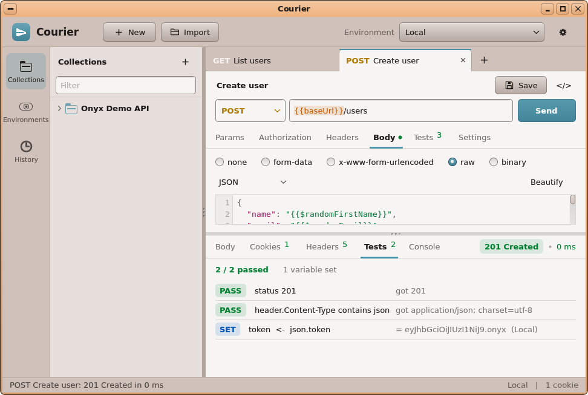
*The response's Tests: the checks passed, the token captured into the Local environment.*

**Collections** (sidebar): a tree of folders and requests (their method in colour). **+** makes a
collection; a request is saved into one with **Save** (the dialog: its name, the collection or
folder). A row's menu (a right click, or its **⋯**): add a request or a folder, rename, duplicate,
move up / down, export, delete. A double click on a collection opens its tab: its **Overview** (a
description), its **Authorization** (inherited by its requests) and its **Variables**.
**Environments**: the **Globals** first, then each environment (a tick: the one in use; its menu:
use it, rename, duplicate, export, delete); its tab edits its variables (a check box disables one)
and **Set Active**. **History**: the requests sent, by day, the most recent first (their status);
a click opens one again in a new tab.

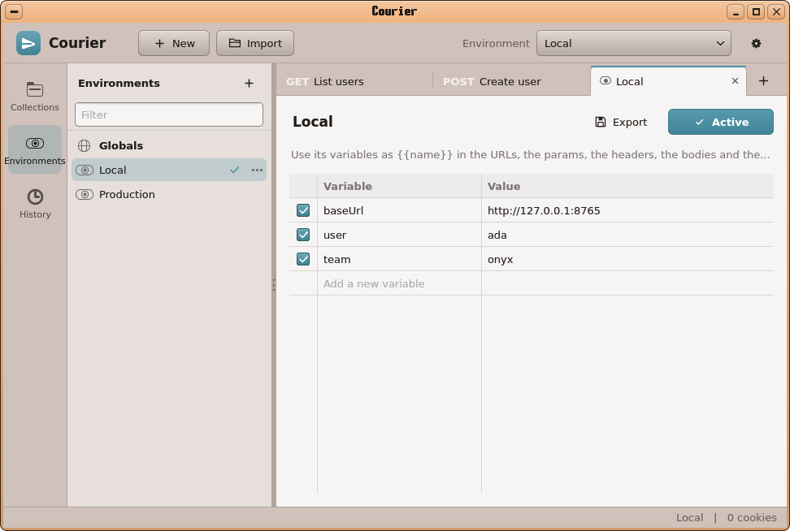
*An environment's variables; the tick in the sidebar: the environment in use.*

**Import / export** (Ctrl+O, or drop a file on the window): a **Postman collection** (v2.0 / v2.1),
a **Postman environment** or globals (`.json`), or a **cURL command** (a `.txt`, or pasted in the
Import box — or straight into the URL field: the request is filled from it). A collection's
**Export** writes a Postman v2.1 file; Courier's tests and captures go with it both as its own rows
and as the equivalent `pm.test (...)` / `pm.environment.set (...)` JavaScript, so Postman runs them
too; Postman's own scripts are kept (Courier does not run JavaScript). **Code** (`</>`) shows the
request, its variables resolved, as **cURL**, raw **HTTP**, **Python** (requests) or **JavaScript**
(fetch), with a Copy button.

**Keys**: Ctrl+N a new request, Ctrl+S save, Ctrl+O import, Ctrl+W close the tab, Ctrl+Enter send,
Esc cancel, Ctrl+B beautify the body, Ctrl+H the history; in the tables Tab / Shift+Tab, Enter and
the arrows move between the cells.

**Files**: `SD:/courier/collections/*.postman_collection.json`,
`SD:/courier/environments/*.postman_environment.json`, `SD:/courier/globals.json`, `history.json`
(the last 100), `cookies.json` (the ones that expire; a session's end with it) and `state.json` (the
tabs open — a request not saved keeps its changes —, the environment chosen, the sidebar). A request
runs on a thread of its own (kapi v67): the window keeps answering. `https://` uses mbedTLS; the
server's certificate is **not verified** yet (Onyx has no certificate authorities' bundle): the
connection is encrypted, not authenticated. A response is read up to 16 MB.

### The Spreadsheet (`sheet`)


*The sample workbook `SD:/docs/cafe-2026.xlsx`: a café's takings by month — formats, a merged
title, data bars on the totals, the three best months of coffee in green, a column chart; the Total
column chosen, its sum in the status bar.*

The Spreadsheet works in the way of **LibreOffice Calc** and **Gnumeric** (and of Excel, whose files
it writes): a **workbook** of several **sheets** of up to 1 048 576 rows × 16 384 columns (A … XFD),
**formulas** recomputed at each change, **number formats**, fonts, colours, borders, merged cells,
**charts**, **conditional formatting**, the **AutoFilter**, **defined names**.

**The window**, from the top:

- **Two toolbars**. The first: New, Open, Save; Undo, Redo; Cut, Copy, Paste; Find and Replace;
  **Sort** ascending / descending (the table around the cursor, by the cursor's column), the
  **AutoFilter**; insert rows above / columns before, delete rows / columns; insert a **chart**;
  **freeze panes**; the zoom (−, the percentage — a list —, +). The second: the **font** (each name
  drawn in its font) and its **size**; bold, italic, underline, strike-through; the **text colour**
  and the **fill colour** (the button applies the colour on its bar, its arrow drops the palette);
  left, centre, right; top, middle, bottom; wrap text; **merge and centre**; the **currency** format
  (its arrow: € $ £ ¥ CHF), percent, the thousands' separator, a decimal more / less; the
  **borders** (the button applies the last ones, its arrow lists them: all, outside, thick outside,
  bottom, top, left, right, double bottom, thick bottom, inside, none); clear the formatting.
- **The formula bar**: the **Name Box** — the cell or the range chosen (or its name); type `B7`,
  `C2:F9`, `Loan!B6` or a name and Enter to go there; a new name typed there **names the
  selection** —, **fx** (Insert Function: the functions by category, each with its arguments and
  what it does), **Σ** (AutoSum: `=SUM(` of the numbers above the cell, else at its left; a range
  chosen: a total under each of its columns), **✗ / ✓** while a cell is typed, and the **input
  line**: the cell's content — its formula — shown and edited there too.
- **The grid**: a click chooses a cell, a drag a range (Shift+click extends it); a click on a
  column's letter or a row's number chooses it whole, the corner the whole sheet. Drag a letter's or
  a number's **edge** to size it, **double-click** it to fit its content. The **fill handle** — the
  small square at the selection's corner — dragged down or across continues a **series** (`1, 2` →
  `3, 4`…; `Monday` → `Tuesday`…; `Item 9` → `Item 10`; dates by day or by month) or copies the
  cells, their formulas' references moved. The **right button**: cut, copy, paste, Paste Special,
  insert / delete rows or columns, clear, sort, a chart, Format Cells (on a letter / a number:
  the width / height, optimal width, hide, show; on a chart: its properties, delete, bring to front).
- **The sheet tabs**: a click shows a sheet, **+** adds one, a double click renames it, the right
  button: insert, delete, rename, duplicate, move left / right, the tab's colour. The arrows scroll
  the tabs; Ctrl+Page Up / Down go to the previous / next sheet.
- **The status bar**: the sheet, the mode (Ready, Enter, Edit, Point) and, for a range chosen,
  the **Sum**, **Average** and **Count** of its values (in their format when they share one); the
  zoom (− / +; Ctrl+wheel over the grid).

**Typing.** Choose a cell and type: **Enter** goes down, **Tab** right (after a row typed with Tab,
Enter goes back to the column it started in), Shift+Enter / Shift+Tab back, an **arrow** finishes
the cell and moves; **Esc** cancels. **F2** or a double click edits the cell in place (the arrows
then move the caret; F2 again: they choose cells), **Alt+Enter** starts a new line in the cell.
**Delete** clears the selection, Backspace empties the cell and edits it. What is typed is read as
the spreadsheets read it: a number (`1234.5`, `1,234.50`, `1 234`, `3,5`, `-2e3`, `(42)` =
−42), a **percentage** (`12.5%`), an **amount** (`$1,200`, `12,50 €`), a **date** (`29/09/2026`,
`29/9` — this year —, `2026-09-29`, `29 Sep 2026`, `Sep 29, 2026`: day first), a **time** (`14:30`,
`2:30 PM`), both, `TRUE` / `FALSE`, an error value — each keeps the format it was typed in —; anything
else is **text** (a `'` first: text whatever follows, `'123`). A long text flows over the empty cells
beside it; a number too wide for its column shows `####`.

**Formulas** start with `=`: `=B5*1.2`, `=SUM(B5:B16)`, `=AVERAGE(Sales!E5:E16)`, `=IF(B5>4000,
"good","low")`, `=VLOOKUP("Tea",A4:D16,3,FALSE)`. While a formula is typed, the functions whose name
starts with what you type are offered (Tab or Enter takes one; ↑ / ↓ choose), then the function's
**arguments** are shown, the current one in bold; each reference is **coloured**, with its cells
framed in the grid in the same colour. **Pointing**: after `=`, `(`, `,` or an operator, the
**arrows** (Shift+arrows: a range) or a **click / drag** in the grid write the reference — on another
sheet too: click its tab —; **F4** turns the reference at the caret `A1` → `$A$1` → `A$1` → `$A1`.
The operators: `+ - * / ^`, `&` (text joined), `= <> < > <= >=`, `%`, `:` (a range); references
`B5`, `$B$5` (absolute: kept when copied), `B5:D16`, `B:B` (a column), `3:3` (a row), `Loan!B6`,
`'My sheet'!A1`; constants `{1,2;3,4}` (arrays), `"text"`, `TRUE`. **237 functions**:
mathematics (SUM, SUMIF(S), SUMPRODUCT, ROUND, ROUNDUP / DOWN, INT, MOD, ABS, POWER, SQRT, EXP, LN,
LOG, the trigonometry, RAND, RANDBETWEEN, SUBTOTAL…), statistics (AVERAGE(IF(S)), COUNT, COUNTA,
COUNTBLANK, COUNTIF(S), MIN, MAX, MINIFS, MAXIFS, MEDIAN, MODE, LARGE, SMALL, RANK, PERCENTILE,
QUARTILE, STDEV, VAR, CORREL, SLOPE, INTERCEPT, FORECAST…), logic (IF, IFS, IFERROR, IFNA, AND, OR,
NOT, XOR, SWITCH, CHOOSE), text (LEFT, RIGHT, MID, LEN, FIND, SEARCH, SUBSTITUTE, REPLACE, UPPER,
LOWER, PROPER, TRIM, CONCAT, TEXTJOIN, TEXT, VALUE, REPT…), lookups (VLOOKUP, HLOOKUP, XLOOKUP,
INDEX, MATCH, OFFSET, INDIRECT, ROW(S), COLUMN(S)…), dates (TODAY, NOW, DATE, TIME, YEAR, MONTH,
DAY, WEEKDAY, WEEKNUM, EDATE, EOMONTH, DATEDIF, NETWORKDAYS, WORKDAY…), information (ISNUMBER,
ISTEXT, ISBLANK, ISERROR, NA…) and finance (PMT, IPMT, PPMT, FV, PV, NPER, RATE, NPV, IRR…) — Insert
Function lists them all. An array is computed element by element inside a function
(`=SUMPRODUCT((C5:C16>1000)*B5:B16)`); a cell shows one value (no spilled arrays). A formula that
cannot be read is refused with the reason, the caret at the fault; errors show as `#DIV/0!`,
`#VALUE!`, `#REF!`, `#NAME?`, `#N/A`, `#NUM!`, `#CIRC!` (a formula that needs its own value).
**View ▸ Formulas** (Ctrl+\`) shows the formulas instead of their values; **F9** recomputes (with
`NOW`, `RAND`).

**Copy, cut, paste.** Copy (Ctrl+C) frames the cells with dashes; Paste (Ctrl+V) writes them at the
cursor — their formulas' relative references moved, their formats, merges and (whole columns) their
widths —, over a larger selection in repeats; a **Cut** moves them and the formulas that point at
them follow. **Paste Special**: all, the values only, the formats only, the formulas only; transposed.
Text from another app is pasted as a table (tab-separated columns, one row a line). **Fill Down /
Right** (Ctrl+D / Ctrl+R) copy the selection's first row / column over the rest.

**Formatting.** **Format ▸ Cells...** (Ctrl+1) has five tabs: **Numbers** (General, Number,
Currency, Percent, Scientific, Fraction, Date, Time, Text, Custom — decimals, thousands' separator,
negative numbers in red, the currency; a list of formats; the **format code** itself, Excel's:
`#,##0.00 "€"`, `0.0%`, `dd/mm/yyyy`, `[Red]-0.00`, `0;-0;"zero"`…, with a preview of the cell's
value), **Font** (family, style, size, underline, strike-through, colour), **Alignment**
(horizontal, vertical, indent, wrap, merge), **Borders** (the lines of each side and inside, their
style and colour, presets) and **Fill**. Row heights follow their tallest font and wrapped text
unless set by hand (**Format ▸ Row Height**; Column Width, Optimal Column Width; Hide / Show Rows and
Columns). **Merge and Centre** makes a range one cell (only the top left cell's content is kept).
**View ▸ Freeze Panes** keeps the rows above and the columns left of the cursor in place while the
rest scrolls; View ▸ Gridlines hides or shows the grid.

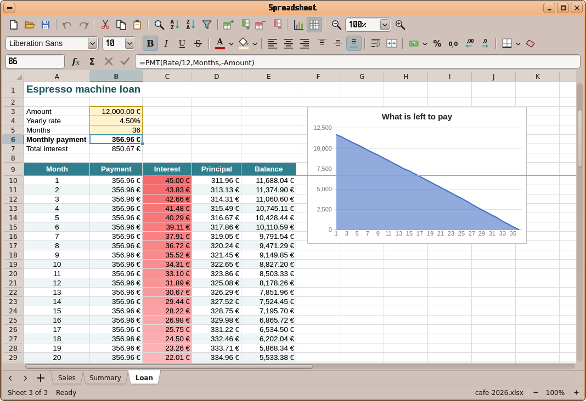
*The loan sheet: its inputs named (`Rate`, `Months`, `Amount` — the payment is
`=PMT(Rate/12,Months,-Amount)`), the interest coloured by a scale, the first nine rows frozen.*

**Conditional formatting** (Format ▸ Conditional Formatting...) gives cells a look by their value:
the sheet's rules are listed (the first that sets a fill, a colour or bold wins; **Up / Down** order
them); for each, the **cells** it covers and its kind — **Cell value is** (greater than, less than,
equal to, between… a number, a text or a formula: `=$B$1`, `=AVERAGE($B$5:$B$16)`), **Text**
(contains, does not contain, begins with, ends with), **Top / bottom** (the N highest or lowest, or
N %), **Above / below the average**, **Duplicate / unique values**, **Formula is true** (written for
the range's top left cell, it moves with each cell: `=$F5<0` colours the whole row of a negative
change, `=MOD(ROW(),2)=0` every other row) — and its **look** (light red fill with dark red text,
yellow, green, red text, bold…); or a **colour scale** (two or three colours from the lowest value
to the highest) or **data bars** (a bar the length of the value). **New** adds the rule, **Change**
updates the one chosen, **Delete** removes it. Rows and columns inserted or deleted move the rules'
cells and their formulas.

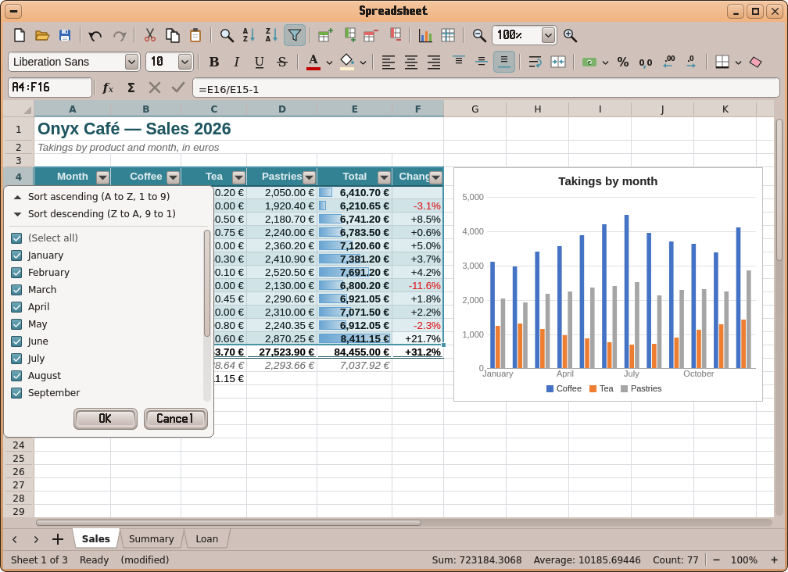
*Data ▸ AutoFilter on the table: a button on each header; the months' list dropped.*

**The AutoFilter** (Data ▸ AutoFilter, or the funnel of the toolbar) puts a **button** on each header
of a table — the selection, else the block of cells around the cursor, its first row the headers.
A button drops the column's **values** (as they are shown; "(Empty)" for the empty cells): uncheck
those to hide, OK; the rows whose value is unchecked are **hidden**, their row numbers turn blue and
the button shows a funnel; several columns filter together (each list only shows the values the
other filters leave). The same list **sorts** the table by the column (ascending / descending, the
headers kept). AutoFilter again takes the buttons off and shows every row.

**Names** (Insert ▸ Names...) name a range or a value for the formulas (`=SUM(Coffee)`,
`=PMT(Rate/12,Months,-Amount)`): a name, what it refers to (`=Sales!$B$5:$B$16`, `=0.2`), its scope
(the whole workbook or one sheet); **Add** (or change), **Delete**. Typing a new name in the Name
Box names the selection at once; choosing a named range shows its name there; typing a name goes
to its range. Rows and columns inserted or deleted move the names' ranges as they move formulas.

**Charts.** Choose the data (the first row and column as names: the series, the categories — or a
single cell: the table around it) and **Insert ▸ Chart...**: **column**, **bar**, **line**, **area**,
**pie** or **scatter**, a title, the legend (right, bottom, top, none), the series in columns or in
rows, the first row / column holding names, stacked, gridlines — with a preview. The chart lies over
the sheet, anchored to the cell under its top left corner (it moves when rows or columns are
inserted or sized); drag it to move it, its corners to size it; double-click it (or the right
button ▸ Chart Properties) to change it; Delete removes it. It follows its cells' values.

**Sort and find.** **Data ▸ Sort...**: up to three keys (a column each, ascending or descending),
the first row kept as the headers or not; the toolbar's buttons sort the table around the cursor by
the cursor's column. Numbers come before texts, empty cells last; the formulas of the rows moved
keep pointing at their own row. **Find and Replace** (Ctrl+F): in the values shown or in the formulas,
case, entire cells, this sheet or all; Find Next, Replace, Replace All. **Go To** (Ctrl+G) is the
Name Box.

**Rows, columns, sheets.** Insert / delete rows and columns (Insert ▸ Rows Above, Columns Before;
Sheet ▸ Delete Rows / Columns; Ctrl++ / Ctrl+−; the right button): the formulas everywhere follow
(a reference to a deleted cell becomes `#REF!`). Sheets are inserted, renamed, duplicated, moved,
deleted and coloured from the Sheet menu or the tabs; a formula names another sheet by its name
(`Loan!B6`) and follows it when it is renamed or moved.

**Keys**: the arrows move (Shift: extend the selection; Ctrl: to the edge of the data), Home (column
A), Ctrl+Home (A1), Ctrl+End (the last used cell), Page Up / Down (a screen; Alt: across),
Ctrl+Page Up / Down (the sheets), Ctrl+Space / Shift+Space (the whole column / row), Ctrl+A (all);
Ctrl+Z / Ctrl+Y (undo / redo, 100 steps), Ctrl+X / C / V, Ctrl+D / R, Ctrl+B / I / U, Ctrl+1 (Format
Cells), Ctrl+; (today's date), Ctrl+: (the time), Ctrl+F, Ctrl+G, Ctrl+N / O / S, F2, F4, F9.

**Files.** **File ▸ Save** (Ctrl+S) writes Excel's **`.xlsx`** — the cells, formulas (with their
last values), styles, number formats, merges, column widths and row heights, hidden rows and
columns, frozen panes, tab colours, charts, conditional formats, the AutoFilter and the names:
Excel, LibreOffice and Gnumeric open it. **File ▸ Open** (Ctrl+O) reads **`.xlsx`** (from Excel,
LibreOffice, Google Sheets…), LibreOffice's **`.ods`** (with its styles, number formats, merges,
charts, conditional formats, AutoFilter and names; saved again as `.xlsx`) and **CSV** / `.tsv` /
`.txt` (the separator — comma, semicolon or tab — guessed; UTF-8 or Latin-1; each field read as if
typed). **File ▸ Export as CSV** (or Save As `name.csv`) writes the sheet shown, its values as
shown. **File ▸ Export as PDF...** writes the sheet shown (or all the sheets, each a bookmark) as a PDF:
its used cells cut into A4 pages — portrait or landscape (proposed from the sheet's shape), **fitted to
the page's width** or at their size, the grid's lines printed or not —, their fills, borders and
conditional colours, the **charts** with them, the sheet's name and the page's number at each page's
foot; the PDF opens in the PDF Viewer afterwards.

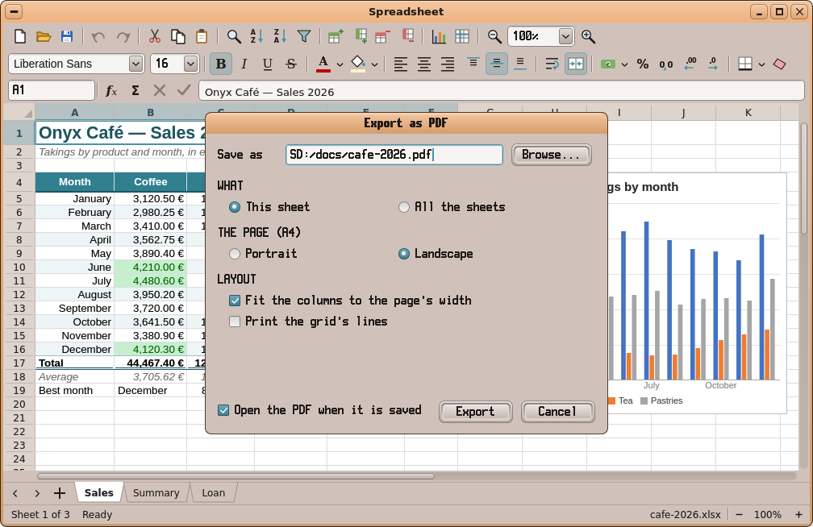

A double click on an `.xlsx`, `.ods` or `.csv` file in the File Viewer opens it here
(`fileassoc.ini`); a file dropped on the window too. New, Open and a drop first ask to save unsaved
changes; **closed with unsaved changes**, the workbook is kept in
`SD:/apps/sheet.app/recovered.xlsx` and offered back the next time the Spreadsheet starts. Not
kept: fonts' exotic effects, pictures, pivot tables, macros, comments, validation lists (the rest
of an Excel file is read). Sample: **`SD:/docs/cafe-2026.xlsx`** (its three sheets: the sales, a
summary with lookups and a pie chart, the espresso machine's loan).

### Slides, the presentation program (`slides`)

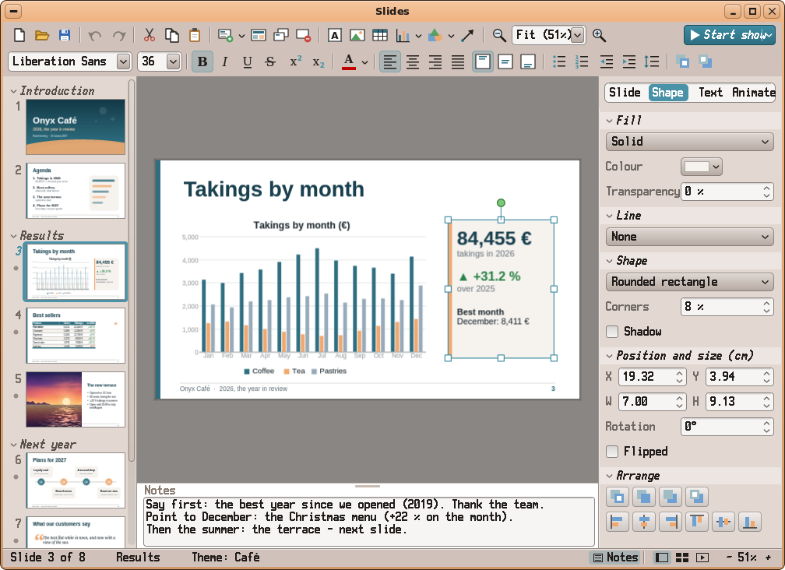

The third app of the office suite, with **Letters** and the **Spreadsheet** (their toolbars, their icons): a
presentation program in the way of PowerPoint. **The window**: two toolbars (New slide, Layout, Duplicate, Delete;
Text box, Picture, Table, Chart, Shapes, Line, Arrow; the zoom; **Show** — and below, Letters' text bar: font, size,
B I U S, colours, alignment, the box's vertical alignment, bullets, numbering, indents, line spacing, the order of
the objects); at the left the **slides** as thumbnails, grouped in **sections** (a section's arrow folds it; a
thumbnail dragged reorders, a right click: new, duplicate, delete, hide, a section); in the middle the slide; under
it the **speaker's notes**; at the right the **sidebar** and its four tabs; the status bar (slide n of m, the
section, the theme, the zoom).

**Objects.** Insert ▸ **Text Box** (then a drag on the slide), **Picture...** (BMP, PNG, JPEG, GIF, WebP),
**Table...** (rows × columns: a heading row, banded rows in the theme's colours), **Chart...** (column, bar, line,
pie, area; its data typed in a small grid: up to eight categories and four series), **Arrow**, **Line**; the **Shapes**
button lists 28 shapes (rectangles, ellipse, triangles, polygons, stars, heart, arrows, chevrons, callout, cloud,
flowchart). A click selects (Shift+click: several; a drag on the empty slide: a rubber band), the handles resize
(Shift keeps the ratio), the round handle above **rotates** (Shift: 15° steps), a drag moves (snapped to the slide's
centre and edges and to the other objects, a guide drawn; Shift: along one axis), the arrows nudge (Ctrl: finely),
Tab selects the next object. A **double click** or
**Enter** / **F2** edits the text of a box, a shape, a table's cell (Tab: the next cell; in a list, Tab /
Shift+Tab change the level); **Esc** ends it. The placeholders of a layout show their prompt ("Click to add a
title") until typed in.

**The sidebar.** **Slide**: its layout, its **background** (the theme's, a colour, a gradient, a picture; apply to
every slide), the master's objects shown or not, hidden in the show; the deck: the theme (colours and fonts), the
slide size (16:9, 4:3), the footer, the slide numbers. **Shape**: the fill (none, colour, gradient and its angle,
transparency), the line (colour, width, solid / dashes / dots, the arrow heads), corners, shadow, the position and
size in cm, the rotation, flipped; a table's heading row and banded rows; a chart's type, legend and values. **Text**:
the character (font, size, colour, bold, italic, underline, strikethrough), the paragraph (alignment, level, bullets
or numbers, line spacing, before / after), the box (vertical alignment, wrap, **autofit**: shrink the text or grow
the box). **Animate**: the slide's **transition** (fade, push, wipe, cover, uncover, split, zoom, dissolve; its
direction, duration, an automatic advance after a time) and the selected object's **effects** — entrance, emphasis,
exit (appear, fade, fly in, wipe, zoom, float, grow, pulse, spin, colour), started on click, with or after the
previous one, their delay and duration; a text **by paragraph**: its paragraphs one after the other, each on a click
or after the one before —, the slide's list of effects (reordered, removed).

**The master and the layouts.** **View ▸ Master and Layouts** (or the Slide tab's *Edit the master and layouts...*)
shows, instead of the slides, the **master** then the **eight layouts**, edited with every tool of the normal view.
On the master: its **objects** — shapes, pictures, lines, a logo — are on every slide (the slides' *The master's
objects* shows or hides them); its **background**; and two samples, the title and the text's five levels: the
**formats given to them are the text styles** (a size, a colour, a font, bold, the alignment, the spacing, the
bullets) that every slide's text follows at once. Moving the master's title or text box moves the layouts' that
sat at the same place. On a layout: its **placeholders** (moved, resized, their box's anchor and autofit), its
name; *Add a title / text / picture placeholder*; a text box drawn on a layout becomes a text placeholder, a picture
a picture placeholder (shapes for every slide go on the master). **Close master** (the button at the top right, or
the menu again) shows the slides again: a slide's placeholder that sat where its layout's did follows it, one you
moved yourself stays; one **Undo** undoes the whole visit. Saving, the show and the exports work from the view too.

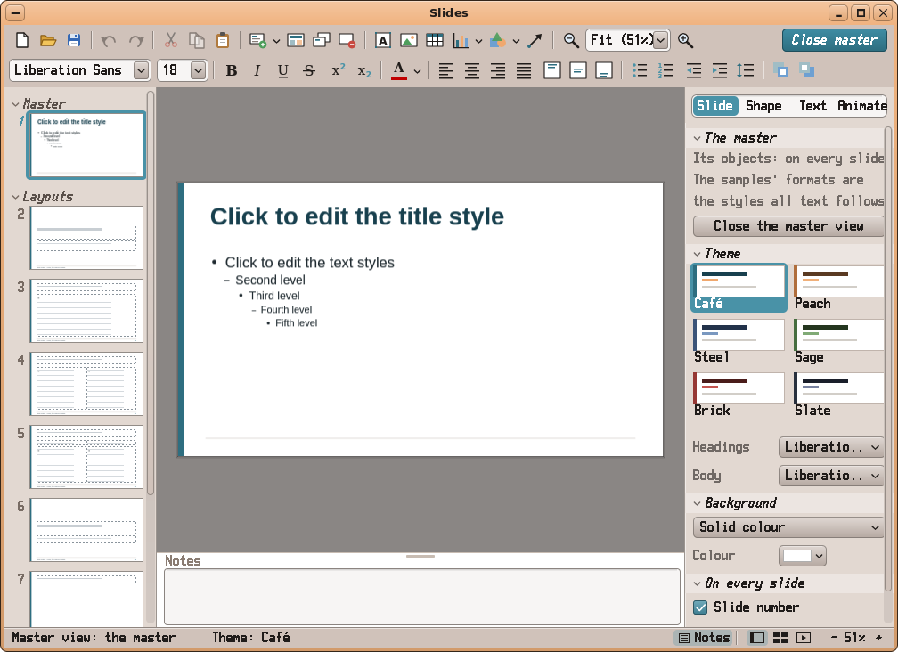

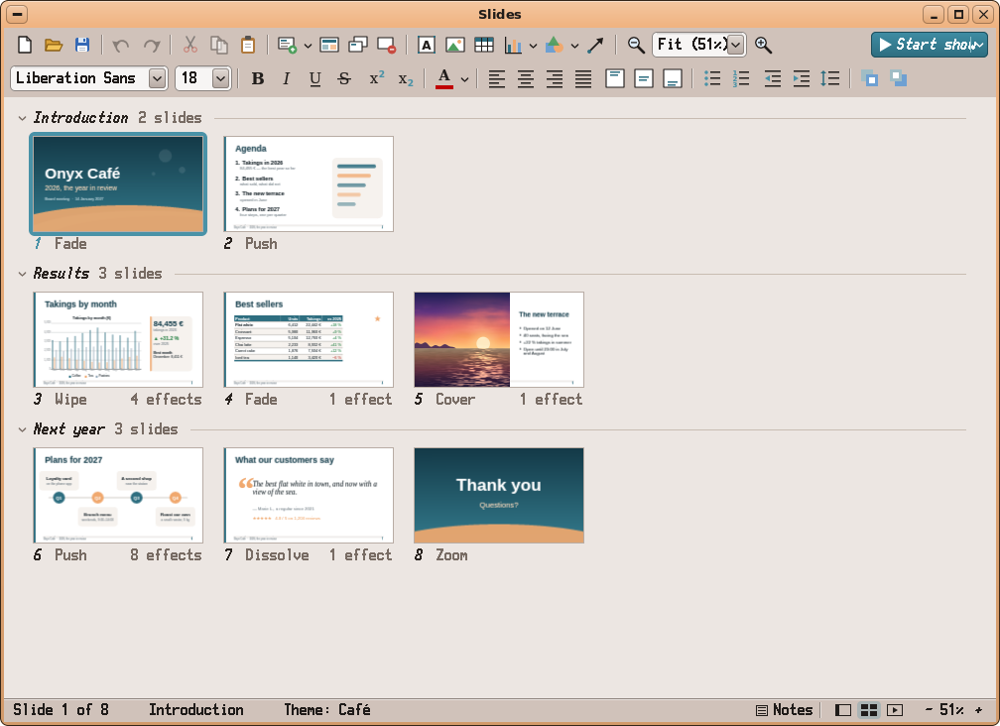

**Views.** View ▸ **Normal**, **Slide Sorter** (the whole deck, section by section; drag to reorder, double click to
edit a slide), **Notes** (the notes' pane larger); Fit the Window, Zoom In / Out (also the status bar's zoom).

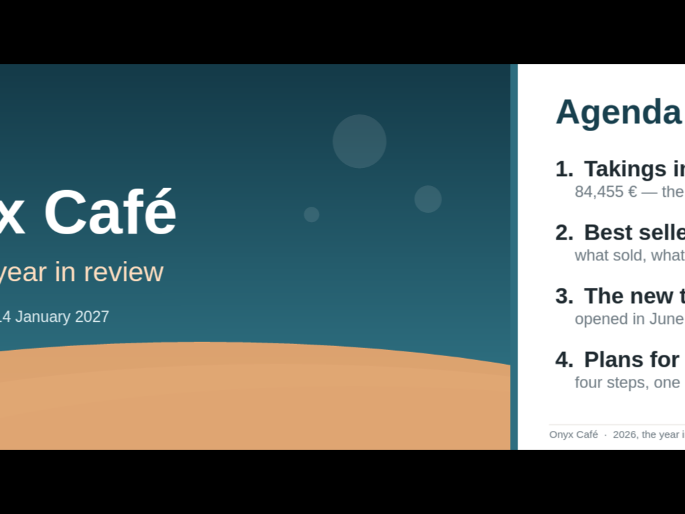

**The show.** **F5** (Show ▸ From the Beginning) or **Shift+F5** (From This Slide) plays the deck **full screen**:
each slide rendered once, its layers composited by the **GPU** with its transition and its effects. A click, Space,
Enter, → / ↓ / Page Down or N: the next effect or slide; ← / ↑ / Page Up / Backspace or P: back; Home / End; a
number then Enter: that slide; **B** / **.** black screen, **W** / **,** white screen; **Esc** ends the show. Hidden
slides are skipped. Show ▸ **Presenter View**: on the one screen, the slide shown, the next one, the notes, the
clock and the time elapsed.

**Files.** **File ▸ Save** (Ctrl+S) writes OpenDocument's **`.odp`**: the slides, the master and its text styles,
the theme, the objects (text, shapes, gradients, pictures, tables, charts — with a picture of the chart for other
programs), the notes, the sections, transitions and effects; LibreOffice Impress opens it, and Slides reads it back
the same. A name ending in **`.pptx`** (File ▸ Save As, or a file opened as one) writes **PowerPoint's format**
instead: the theme, the master and its layouts, the placeholders, shapes, pictures, tables (in PowerPoint's own
style), **charts as real charts** (their data kept), the notes, the sections, the hidden slides, the footers, the
transitions and the **effects** as PowerPoint's own (Appear, Fade, Fly In, Wipe, Zoom, Float In...); PowerPoint and
LibreOffice open it, and Slides reads it back the same. **File ▸ Open** (Ctrl+O) reads `.odp` and `.pptx` written by
Slides, by LibreOffice or by **PowerPoint** — the text and its formats (those a placeholder takes from its layout
too), the theme's colours and fonts, shapes coloured by the theme, groups (taken apart), pictures, lines, tables,
charts, backgrounds, notes, transitions, effects, sections. A slide's layout is the nearest of Slides' eight; what
Slides does not have is left out (SmartArt, videos, the layouts' own decorations, merged table cells).

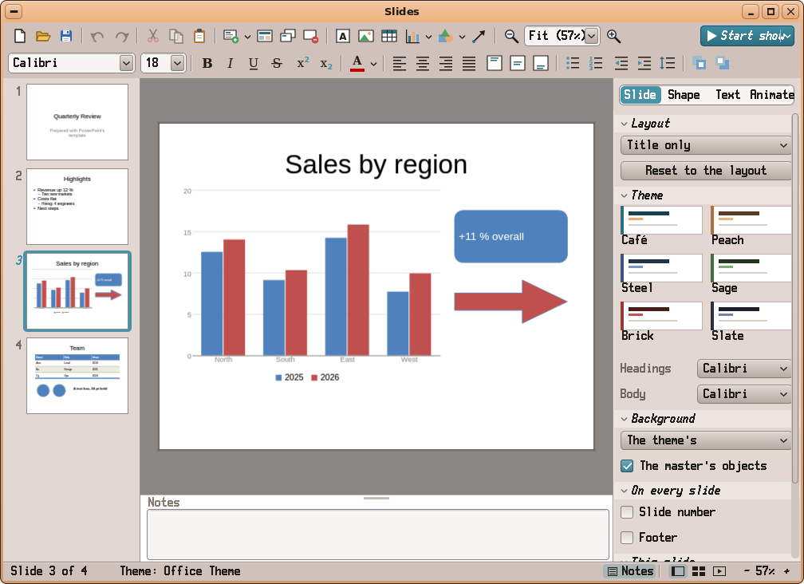

**Export as PDF...** asks what the pages hold: **the slides** (a page each, the slide's picture at 1600 pixels wide),
**notes pages** (A4: the slide, its notes under it, to speak from) or **handouts** (A4: 2 slides a page, 3 with lines
for notes beside them, or 6), the file's name and the page's number at each page's foot; the PDF opens in the PDF
Viewer. **Export Slide as PNG...** the current slide. A double click on an `.odp` or a `.pptx` in the File Viewer opens it here
(`fileassoc.ini`); closed with unsaved changes, the deck is kept in `SD:/apps/slides.app/recovered.odp` and offered
back the next time. **Edit ▸ Find and Replace...** (Ctrl+F): a word found in every slide's text (its tables too), from
the current slide on, with or without the case; Replace, or Replace All (one Undo). Not yet: groups.

**Keys.** Ctrl+N / O / S, Ctrl+Z / Y (undo / redo), Ctrl+X / C / V, Ctrl+D (duplicate), Ctrl+A, Ctrl+F (find), Delete, Ctrl+M (new
slide), Ctrl+B / I / U, F5 / Shift+F5, Page Up / Down (the previous / next slide).

Sample: **`SD:/docs/cafe-2026.odp`** (*Onyx Café — 2026, the year in review*: eight slides in three sections, the
Spreadsheet sample's figures as a chart and a table, a picture, notes, transitions and effects), and the same deck
as PowerPoint's **`SD:/docs/cafe-2026.pptx`**.

### Koton, the studio (`koton`)

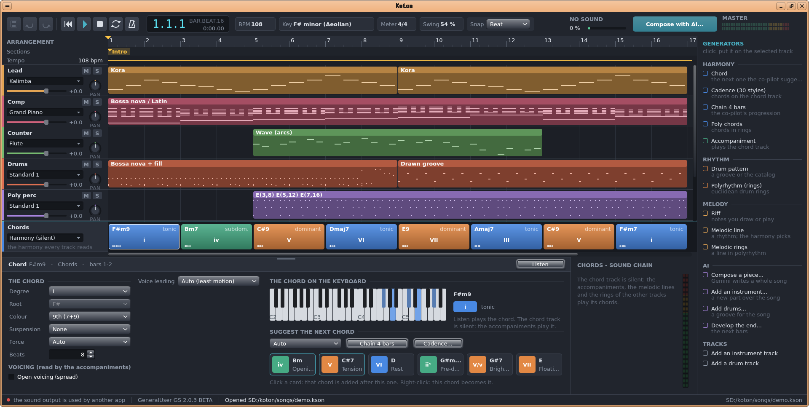
*Koton with its demo song (`SD:/koton/songs/demo.kson`): the arrangement, the chord track at the
bottom (each chord's degree, coloured by its function), a chord selected — its editor below, the
next-chord co-pilot's cards, the track's sound chain at the right.*

> **The manual.** Koton has a complete user manual, with pictures, in English and French:
> `SD:/manuals/koton/Koton.pdf`, `Koton.fr.pdf` (and their `.md`) — a first song in ten minutes, the
> window, every kind of block and its editor, the sound chain and plugins, composing with AI, the files,
> questions and answers, the keys, the chord colours, the styles, every plugin's parameters. What
> follows is its summary.

> **Koton for Windows.** The same Koton runs on a PC: the folder `pc/dist/Koton` of the repository
> (copy it whole; run `Koton.exe`, Windows 10 or 11, nothing to install). It is built from the same
> sources, its plugins and its AI helper included; the folder is its "SD card" (`SD:/` in the manual),
> its menus are the window's menu bar, the sound goes to Windows' default output, every MIDI input of
> Windows plays. Its `README.txt` says the rest.

Koton is Onyx's music studio: **Koton Studio** (a DAW for Windows) made again for Onyx. It draws in the
desktop's theme (its side panels — the tracks' headers, the generators — in the panels' colour, as the
Media Player's); only the arrangement's lanes stay dark, where the coloured blocks read best. A song is
thought **in harmony**: a silent **chord track**, pinned at the bottom, holds the chords — by their
**degree** in the key, so they follow a change of key — and every other part reads it:
accompaniments that play its chords in a style or a grid you draw, melodic lines whose pitches the
engine picks from it, riffs drawn over its shaded tones, drums, euclidean rings in polyrhythm.
Koton for Windows' songs (**`.sq`**) open (what Onyx lacks is dropped); Koton saves **`.kson`** (the
same JSON: a `.kson` opens in Koton for Windows too). The sound is a **SoundFont** synthesizer
(MeltySynth, one per track) mixed on the Pi's **third core**, to the headphone jack; a song can be
exported as a WAV file. The AI (Gemini and others) composes a whole piece, a new part, drums.

**The window**, from the top:

- **The transport bar**: Save, Undo, Redo · back to the start, **Play / Stop** (Space), Stop,
  **Loop**, the **metronome** · the **position** (bar.beat.sixteenth and the time) · the song's
  **BPM**, **key**, **meter** and **swing** (a click opens *The song*: the key and its mode — major,
  minor, harmonic / melodic minor, the church modes —, what a new key does — **transpose the song**
  or **let the chords follow their degrees** —, the meter, the tempo, the swing, the humanisation,
  the length) · the **snap** of the arrangement (bar, beat, ½, ¼, off) · where the engine runs
  (*CORE 2 — DSP*) and its load · **Compose with AI…** · the **master level**.
- **The arrangement**: the ruler (a click puts the play cursor there; a drag makes the **loop**; a
  right-click turns it on / off), the **sections** (a double-click on their row names one or adds
  one), the tempo. Each **track** has a header — its name (a double-click renames it), **M**ute and
  **S**olo, its sound (a click chooses it), its volume and pan (dragged) — and a lane of **blocks**,
  each a generator with its name and a thumbnail of the notes it plays. The **chord track** is at the
  bottom: each chord's name, its roman numeral, its function's colour (tonic blue, subdominant green,
  dominant orange). The mouse: a click selects a block (its editor opens below); drag it (snapped);
  drag its right edge (its length); a **double-click** on an empty place puts a block of the track's
  kind there; a **right-click** on a lane: what to put there (riff, accompaniment, melodic line,
  melodic rings, poly chords; drums, polyrhythm; a chord, a cadence), *Freeze into a riff*,
  Duplicate, Delete; a right-click on a header: rename, instrument, collapse, move, duplicate or
  delete the track, add tracks. The wheel scrolls, **Shift**+wheel scrolls in time, **Ctrl**+wheel
  zooms. **Del** deletes the block, **^D** duplicates it, ← / → select the neighbours.
- **The browser** (right): what can be put in the song — on the selected track, at the cursor (or
  after its last block): **Harmony** (a chord — the one the co-pilot suggests after the last —, a
  cadence, *Chain 4 bars*, poly chords, an accompaniment), **Rhythm** (a drum pattern, a
  polyrhythm), **Melody** (a riff, a melodic line, melodic rings), **AI** (compose a piece, add an
  instrument, add drums, develop the end), the tracks, and the **plugins** (an instrument for the
  track, an effect on it, a generator block).
- **The editor** (bottom; drag its top edge to make it taller): the selected block's settings —
  *Listen* plays the block alone, looping, with its track's sound (edit it while it plays).
- **The sound chain** (right of the editor): the selected track's **instrument** (a SoundFont
  instrument or drum kit, or an instrument plugin), its **effects** (plugins: on / off, their knobs,
  their own editor, removed; *+ Add an effect*), its **reverb** send and its level.
- **The status bar**: where the engine runs, the latency, the voices, the SoundFont, the last
  message, the file.

**The editors**:

- **Chord** (a block of the chord track): its **degree** in the key (I … VII, the **secondary
  dominants** V/ii … V/vi, or *Manual*: a fixed root), its **colour** (triad, sixth, 7th, 9th, add9),
  its **suspension**, a **forced** quality (major, minor, augmented, diminished, dominant), its length
  in beats, and the voicing it asks of the accompaniments (open, the voice leading, an inversion). The
  chord is shown on a keyboard with its roman numeral and function. **Suggest the next chord**: the
  co-pilot's cards (the chords that follow well, ranked by where the phrase is and a mood — joyful,
  serene, melancholic, nostalgic, epic, bright, jazzy); **a click adds that chord after this one, a
  right-click replaces this one**; *Chain 4 bars* appends its best four; *Cadence…* writes a cadence
  (30 styles: authentic, plagal, ii–V–I, pop, Andalusian, circle of fifths…, from a degree, for some
  bars) on the chord track.
- **Accompaniment** (an instrument track's block that plays the chord track's chords, whatever they
  are — stretch it over as many chords as you want): the **cell** it repeats (beats), its length,
  the **style** (28 built in: block chords, arpeggios, Alberti, jazz comping, bossa nova, reggae,
  waltz, tango, funk, harp…, or your own saved styles), the octave, the bass (on every beat), the
  open voicing, the **voice leading** (auto, close at the top / to the bass, as the chord says) or a
  fixed inversion. Its **Accompaniment** tab: *Customise this style* turns the style into a **grid of
  the chord's voices** (bass, 1, 3, 5, 7, 1′, 9, 3′, 5′, 7′, 9′ — a voice the chord lacks takes its
  nearest tone) that you draw: a click draws a note, a drag its length, a right-click erases;
  *Resolution*, *Start from* a style, *Save style…* (in the song's style list), *Apply to all* (every
  accompaniment with that style). Its **Melodic cell** tab: a second voice over the chords, drawn on
  the key's degrees (1 … 7″), its octave and where degree 1 is.
- **Riff**: the piano roll, drawn as Koton Studio's (a square pad per slice, 26 px, every row named,
  teal notes; it opens on the first note) — the chords over it, their tones shaded in the rows (the root stronger),
  the key's scale lighter than the notes outside it. Tools **Draw** / **Select** / **Erase**, the
  **snap** and the drawn **length** (bar … 1/32, triplets), the riff's length and name; **±1 / ±12**
  transpose (the selection, else all); **Fit to the chords** moves every note to the nearest tone of
  the chord under it; **Quantise**; **Step record**: notes played on a **USB MIDI keyboard** are
  written one after the other (a chord when played together). A click on the keyboard plays the note;
  Del deletes the selection, arrows move it.
- **Drums**: a **category** and a **motif** of the catalog (the built-in grooves — rock, pop, funk,
  disco, swing, shuffle, bossa, hip-hop, reggae, trap… — and the shipped ones, `drums.json`), the
  density, a fill on the last bar, beats a bar, repeats; **Customise** makes it a grid of the 47
  General MIDI percussion lanes you draw (a click puts / removes a hit; Koton Studio's square pads in
  each lane's family colour, 4 steps a beat when the groove allows), *Save motif…*. **Euclid**:
  E(hits, steps) with a rotation on one lane (its pattern and name shown: tresillo, cinquillo…),
  **<** / **>** shift a lane a step.
- **Melodic line**: you draw only its **rhythm** (up to three voices); the engine chooses the pitches
  from the harmony — chord tones on the strong beats, passing tones between — with a **contour**
  (wave, rising, falling, static, zigzag, random, Thue-Morse, L-system, 1/f), an **anchor**, a
  variation, the continuity, the tension (the register's slope), the amplitude, the ornaments, the
  wave's length; the euclidean tool as the drums'; saved motifs, applied to the lines that use them.
- **Polyrhythm**, **Melodic rings**, **Poly chords**: the rings on a wheel — **click a ring to pick
  it; on the picked ring, click a step to set or clear a hit** —, the list of rings (M: muted), the
  picked ring's hits, steps, rotation and its lane (and accent) / voice / chord tone, octave, legato.
  Poly chords carry their own chords (degree, colour… as the chord editor) and an *emergent melody*
  (one ring at a time: highest, lowest, auto, random).
- **Generator** (a generator plugin's block): its length, *Open the plugin's editor*.

**Compose with AI** (the button, the AI menu, the browser): **what** (a whole piece, a development of the theme after the end, an instrument over
the song, drums, a polyrhythmic piece), the **style** and the **intention** in words, about how many
bars, the melody as notes (riffs) or as melodic lines, drums, the AI voicing the chords, poly chords
/ drums; the **provider** (Gemini — free keys at aistudio.google.com —, Groq, Mistral, Claude,
DeepSeek, Grok, an OpenAI-compatible server), the model, the **API key**. *Generate* asks it through
`SD:/bin/llm` with the dialog left open (its progress at the bottom; Cancel stops the request; a busy
model is asked again by itself). The answer is checked and summed up in the dialog; **Apply as a new
song** places it on a **new, untitled song** (the current one is left alone — saved first if you say so;
an addition is a copy of it with the new music): the chords on the chord track (by degree),
accompaniments, melodic lines or riffs, drums, the sections as markers, the key, meter and tempo. Or
change the request and Generate again. Without a key: *Copy the prompt* (paste it into any chat), then
copy the chat's whole answer and *Paste a reply* — checked and applied the same way.

**Sound**: the SoundFont is the first `.sf2` of `SD:/res/soundfonts` (GeneralUser GS: its own package,
`generaluser-gs`, installed with Koton and shared with Media Player; then the older `SD:/koton/soundfonts`;
File ▸ *SoundFont…* chooses another, from the next start). The engine runs on the third core (else a
real-time thread): about 40 ms from a key to the ear. A **USB MIDI keyboard** plays the selected track (or
writes into the riff editor with *Step record*). **File ▸ Export as WAV…** renders the song off line
(44.1 kHz, 16-bit stereo).

**Keys**: Space play / stop, Home back to the start, Esc stop, Del delete the block, ^N new song,
^O open, ^S save, ^Z / ^Y undo / redo (40 steps), ^D duplicate, ^K the song's key / meter / tempo,
^L loop.

**Files**: songs in `SD:/koton/songs` (`.kson`; Koton's `.sq` open — *Save* then writes a `.kson`);
`SD:/res/soundfonts/*.sf2`; `SD:/koton/settings.json` (the SoundFont chosen, the last folder, the
AI provider, model and **API key — in plain text on the card**, and *Compose with AI*'s last request:
what, style, intention, bars and options, offered again the next time); `SD:/apps/koton.app/drums.json`
(the drum catalog); the plugins in `SD:/koton/plugins/<name>/` (`main` + `plugin.json`). A double
click on a `.kson` / `.sq` opens it (`fileassoc.ini`).

| | |
|---|---|
| 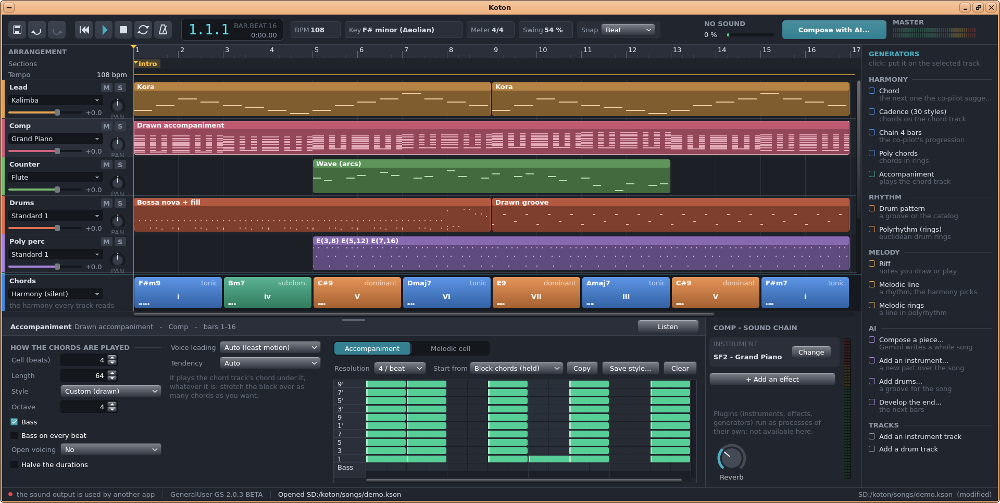 | 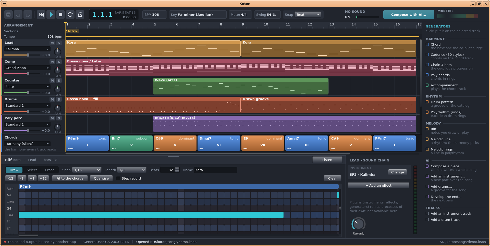 |
| *An accompaniment customised: the grid of the chord's voices.* | *A riff over its chords: their tones shaded.* |
| 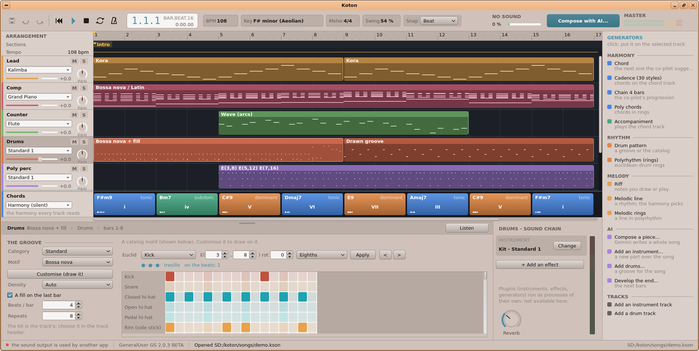 | 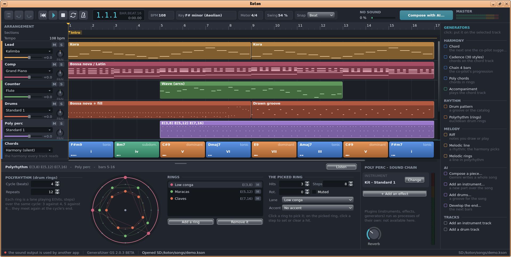 |
| *Drums from the catalog, the euclidean tool.* | *A polyrhythm: three rings, E(3,8), E(5,12), E(7,16).* |

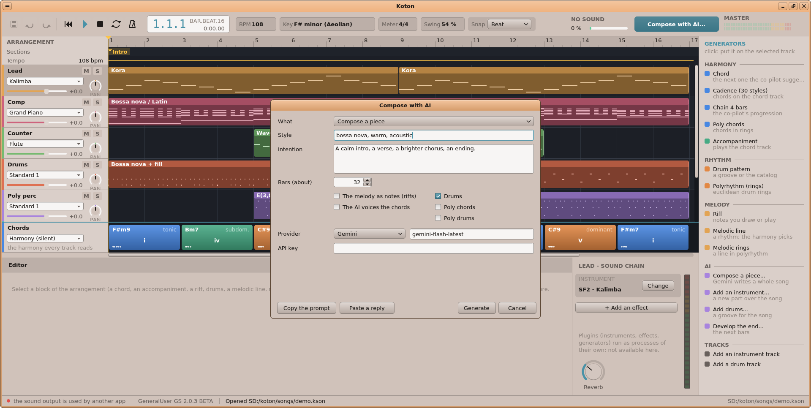
*Compose with AI.*

#### Koton's plugins (`SD:/koton/plugins`)

Koton's **instruments**, **effects** and **generators** beyond the SoundFont are **plugins**: each a
small program of its own that Koton starts when a song uses it (the task manager shows them as
`kp.<name>.<n>`) and ends when it is no longer used or Koton quits. They live in
`SD:/koton/plugins/<name>/` (`main` + `plugin.json`), not in `SD:/apps`: the dock does not list them.
A plugin that stops (it crashed, or was ended from the task manager) does not take Koton down: the
status bar says so and the song plays on — an instrument's track silent, an effect left out of its
track.

- **An instrument plugin** plays a track instead of the SoundFont: the browser's plugins, or the
  sound chain's *Change*; *Edit* opens its editor.
- **An effect plugin** (four a track at most): *+ Add an effect* in the sound chain (or the
  browser); each effect is **on / off**, shows its first knobs, opens its **editor** (*Edit*), is
  removed (**x**).
- **A generator plugin** is a **block** of a track (the browser's plugins put one at the cursor):
  its notes are made from the chord track under it, like Koton's own generators; its editor (the
  block's *Open the plugin's editor*) changes that block only.
- **The editor** of a plugin opens in a panel over the window — the plugin draws it itself (as a
  Control Panel applet), in Koton's colours: a **knob** per setting (drag up / down — Shift for fine
  steps —, the wheel, a double click back to its default), a list for a choice, a box for on / off.
  What you change is saved with the song.
- **Timing**: an instrument plugin plays the song **in time** — it prepares its notes about 0.1 s
  ahead, so *Play* and a jump of the cursor start about 0.1 s later than without it; a note played
  on a **USB MIDI keyboard** into a plugin track is heard about 0.1 s late (the SoundFont tracks stay
  immediate). While an **effect plugin** is on, the whole song comes out about 0.1 s later (every
  track is held back as much, so all stays together; the play cursor follows what you hear).

| | |
|---|---|
| 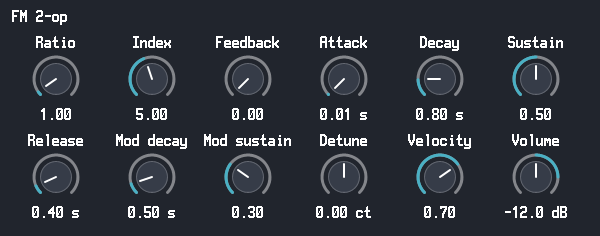 |  |
| *FM 2-op's editor: a knob per setting.* | *The arpeggiator's editor: lists, knobs, a check box.* |

| Plugin | Kind | What it does, its settings |
|---|---|---|
| **FM 2-op** (`fm2`) | instrument | Two-operator FM (16 voices): a modulator bends a sine carrier. **Ratio** (the modulator's pitch to the note's), **Index** (the brightness), **Feedback**, the amplitude envelope (**Attack, Decay, Sustain, Release**), the index's own (**Mod decay, Mod sustain**), **Detune**, **Velocity** (how much it changes the tone), **Volume**. |
| **Subtractive** (`subsynth`) | instrument | Two oscillators (**Osc 1 / Osc 2**: saw, square, triangle, sine; osc 2's **pitch** in semitones and **fine** tune), their **mix**, **Noise**, the square's **Pulse width**, a **Filter** (low-, band-, high-pass: **Cutoff, Resonance**, the envelope's **amount** in octaves, **Key track**), the amplitude envelope and the filter's (**F attack … F release**), **Volume**. 8 voices. |
| **Plucked strings** (`pluck`) | instrument | Karplus-Strong strings (a kora, a harp, a guitar): **Decay** (how long a string rings), **Damping** (darker as it rings), **Brightness** (of the pluck), **Pick point**, **Release** (when the key is let go), **Width** (low strings left, high right), **Velocity**, **Volume**. 12 voices. |
| **Delay** (`delay`) | effect | An echo: **Time** (ms), **Feedback**, **Tone** (each repeat darker), **Ping-pong** (the repeats bounce left / right), **Width**, **Mix**. |
| **Reverb** (`reverb`) | effect | Freeverb: **Room size**, **Damping**, **Width**, **Pre-delay**, **Wet**, **Dry**. |
| **Chorus** (`chorus`) | effect | 1 to 3 **Voices**: **Rate**, **Depth**, **Delay**, **Feedback** (a flanger), **Spread** (stereo), **Mix**. |
| **EQ 3-band** (`eq3`) | effect | **Low** (a shelf at **Low freq**), **Mid** (at **Mid freq**, its **width**), **High** (a shelf at **High freq**), **Output** (dB). |
| **Drive** (`drive`) | effect | Koton's Drive: the **Character** (soft, overdrive, tube, distortion, fuzz, wavefolder), **Drive** (dB), **Low cut** (before the drive), **Tone**, **Asymmetry**, **Mix**, **Level**. |
| **Arpeggiator** (`arp`) | generator | Koton's arpeggiator: the chord under each step played **Up, Down, Up-Down, Down-Up, Random** or as a **Chord**, **Notes/beat**, **Extend** (octaves), **Articulation** (legato … staccato), **Velocity**, **Octave**, **Voice leading**, **Spread** (close, drop-2, wide, one per octave), a regular or custom **Rhythm**. |
| **Euclidean melody** (`euclid`) | generator | E(**Hits**, **Steps**) — the hits spread evenly, **Rotation** —, **Steps/beat**; each hit plays the next tone of the chord (or the key's **scale**, or both) along a **Contour** (up, down, up-down, a random walk, random) over a **Range** of octaves from **Octave**; an **Accent** on each cycle's first hit, the **Articulation**, a **Seed**. |
| **Cellular automaton** (`automaton`) | generator | A row of **Width** cells evolves by a Wolfram **Rule** (30, 90, 110…) from its **First row** (one cell, at random with a **Density** and a **Seed**, all); each live cell plays a note of the **Scale** (Koton's, or the song's key) or, **Chord-aware**, of the chord under it, over a **Range** of octaves; **Notes/beat**, **Velocity**, **Articulation**. |

**Koton for Windows**: a `.sq`'s blocks of Koton's **arpeggiator** (`koton.arpeggiator`) and
**cellular automata** (`koton.cellular`) are played by `arp` and `automaton`, with their settings —
the same notes. **Files**: the plugins' settings are saved in the song (`.kson`: each track's
`OnyxInstrument` / `OnyxInserts`, a generator block's `GeneratorState`).

### Games

| Game | Goal and controls |
|---|---|
| **tetris** | Stack the pieces. Arrows: left/right/rotate/drop; **Space**: instant drop; `r`: restart. |
| **snake** | Eat to grow. Arrows: steer (no U-turn); `r`: restart. |
| **2048** | Merge the tiles. Arrows: slide the whole board; `r`: restart. |
| **minesweeper** | Minesweeper. **Left-click**: reveal; **right-click**: flag; `r`: restart. |
| **sokoban** | Push each box onto a target. Arrows: move/push; `r`: restart the level; `n`: next level. (levels in `levels.txt`) |
| **pong** | Two players. Left: `W`/`S`; right: up/down arrows; first to 9; `r`: reset. |
| **life** | Game of Life. **Click/drag**: (de)populate cells; **Space**: run/pause; `s`: one step; `c`: clear; `r`: random. |
| **same** | SameGame. **Click** a group of ≥2 same colors to destroy it (collapse); `r`: new board. |
| **Solitaire** | Klondike. **Drag** cards: the seven columns build down in alternating colours (a king on an empty column), the four foundations up by suit from the ace. **Click the stock** to turn one card (or three: Game ▸ Draw Three); an empty stock turns the waste over again. **Double-click** sends a card to its foundation, **right-click** sends every card that can go. Hidden cards turn over by themselves. **^Z** undo, **^N** deal. Windows scoring + timer; the cards bounce when you win. |
| **FreeCell** | All the cards face up in eight columns, four **free cells** (top left, one card each), four foundations (top right). **Drag** cards: a column takes a card one lower in the other colour (anything on an empty column); a **run** moves at once when free cells and empty columns allow it. **Double-click**: to the foundation, else to a free cell. Cards no longer needed go home by themselves. **^Z** undo; Game ▸ **Select Game...** plays deal 1–32000 — the same deals as Microsoft FreeCell; Restart Game. |
| **Pipes** | After *Pipe Dream*: lay pipe pieces before the water comes. The next pieces wait in the queue on the left (the bottom one goes next); **click** a square (or arrows + **Space**) to put it there — on an unfilled piece it replaces it (−50). When the countdown (the blue bar) runs out the water leaves the red valve: 50 points per piece it crosses, 500 more for a cross used both ways. If it went through the **required number of pieces** (top right) when it spills, the round is won. **F**: let the water run now, fast (double points). Walls from round 3, faster water every round. **P** pause. |
| **Turtle Quest** (`turtle`) | Learn to program: write a little program in **BASIC** that brings a turtle to its flag, picks the coins, opens the doors, paints the tiles and draws figures — 27 levels in three packs, from moves to loops, conditions, variables, procedures and Logo's figures, in English or **French** (AVANCE, REPETE, SI...). **F5** run, **F8** step by step (the line being run lit), **F7** stop, **F9** reset, **F1** the lesson, **F2** the hint, **Ctrl+N** next level; a level editor (**Ctrl+E**); several players, each with their stars. See §13, *Turtle Quest*. |
| **Arkanoid** | Written in BASIC (`main.bax`, from `SD:/basic/examples/arkanoid.bas`), in `SCREEN 13` shown full screen (**F**: a window, and back). Break the bricks. The paddle follows the **mouse** or the **←/→** arrows (held); **Space** or a click launches the ball (and fires, with the laser). Silver bricks take several hits, gold ones never break. Catch the falling capsules: **E** longer paddle, **S** slower ball, **C** catch the ball, **L** laser, **D** three balls, **P** extra life. 5 rounds (then again, faster), 3 lives. **P** pause, **Esc** title / quit. No file read or written. |
| **Planets 3D** | Written in BASIC (`main.bax`, from `SD:/basic/examples/planets3d.bas`): a little solar system in 3D, drawn by the **GPU** — the sun, four planets turning on their orbits, a moon, a ringed gas giant, stars; the planets' textures are drawn by the program itself. **Arrows** turn the camera, **+ / −** nearer / farther, **Space** pause, **F** full screen, **Esc** quit. The top line says GPU or software and the frames a second. No file read or written. |
| **Invaders** | Space Invaders. **←/→** (held) or the mouse move the cannon; **Space** or a click fires (one shot at a time). The fleet marches faster as it thins out (the four-note march on the synth); the shields crumble; the red saucer is worth 50–300. An invader reaching the ground ends the game. **P** pause. |
| **Teapot (GPU)** (`teapot`) | The demo of the Raspberry Pi 4's **GPU** (V3D): the Utah teapot turning, lit (6400 triangles), drawn by the GPU with a depth buffer. The top line shows the renderer (`V3D 4.2 (1 core)`), the triangles, the frames a second and the time of one frame. **Space** pause, **G** GPU / software (the same picture drawn by the CPU, to compare), **Up / Down** tilt. Without a usable GPU it draws in software and the top line says why (the details are in `kmsg`). Reads and writes no file. |
| **GPU demo** (`gpudemo`) | The GPU's full pipeline: six **textured cubes** turning (each moved by the GPU with its own matrix), a **glass pane** in front (transparency) and **glowing sparks** (additive light). Each cube's texture has a size that the GPU stores differently (its label: `4x4 LT`, `8x8 UB1`, `16x16 UB2`, `64x64 UIF`, `256 UIF/XOR`, `100x60 UIF`); every face should show a white border, a yellow dot in a corner and a dark arrow — a scrambled face means that layout is wrong. **F** nearest / linear filtering, **C** culling (back / none / front: with *back* only the outer faces show), **B** blending on / off, **T** textures on / off, **Space** pause. The top line: the GPU, the settings, frames a second, time of a frame (and the error, if the GPU refused a frame). Reads and writes no file. |
| **Doom** (`doom`) | id Software's Doom (the GPL source, through doomgeneric). Onyx ships **Freedoom Phase 1** (`SD:/doom/freedoom1.wad`, free content); copy your own `doom.wad`, `doom2.wad`, `doom1.wad` (shareware), `plutonia.wad` or `tnt.wad` into **`SD:/doom`** to play the original — the first found is used. Opening a `.wad` in the File Viewer starts Doom with it (a mod — a PWAD — is loaded over the game). **Arrows** move, **Ctrl** fires, **Space** opens / uses, **Alt** + arrows or **,** / **.** strafe, **Shift** runs, **1–7** weapons, **Tab** the map, **Esc** the menu, **F1–F10** as in DOS Doom (F2 save, F3 load…). **USB gamepad**: d-pad, **A** fire, **B** use, **X** run, **L / R** strafe, **Start** menu, **Select** map. The picture is Doom's 320 × 200 doubled in a 640 × 400 window; **F11** / Game ▸ **Full Screen** stretches it to the display at 4:3. Sound effects and **music** (MUS or MIDI) on the Onyx synthesizer's FM voices with the WAD's own OPL instruments (GENMIDI), like the DOS version on an AdLib / Sound Blaster. Settings in `SD:/doom/default.cfg`, saved games in `SD:/doom/savegame/<iwad>/`. Loading a 28 MB WAD takes a couple of seconds. The game runs on an **app core** (core 2 or 3) when one is free: steadier, and the rest of Onyx stays fluid. |
| **Game Library** (`gamelib`) | A "Netflix for ROMs", laid out as the File Viewer: every GameCube (`.iso` / `.gcm`), Nintendo 64 (`.z64` / `.n64` / `.v64`), Super Nintendo (`.sfc` / `.smc`), Game Boy Advance (`.gba`), Game Boy Color (`.gbc`), Game Boy (`.gb`) and NES (`.nes`) game of the **watched folders** (**`SD:/roms`** by default) and their sub-folders, one card each — a picture of its title screen and its name (a Nintendo 64 game: a label with the name from its header; a GameCube disc: its banner). **On the left, the sidebar** (click a group's title to fold it): **Library ▸ All Games**, **Systems** — the emulators, each with its icon and its number of games: **click one to see its games only** — and **Folders** (the watched folders and their games; **Add Folder…**; right-click one: Show, Show in File Viewer, **Remove Folder**). Above, the path bar (*Game Library ▸ Super Nintendo*, the number of games; click *Game Library* for all of them); below, the status bar (the game chosen, the picture being made). The cards: one section per system; **click** one to select it, **double-click** it (or **Enter**) to play; right-click: **Play**, **Play Full Screen**, **Show in File Viewer**. Keys: arrows, Enter, Page Up / Down, **Tab** = the next system. With a **gamepad**: the d-pad moves, **Start** (or A) plays, **L / R** the previous / next system, **L2 / R2** turn a page. The pictures are made in the background the first time (each game runs a few seconds unseen; the games shown first) and cached in `SD:/apps/gamelib.app/thumbs/`. Library ▸ **Refresh** (^R) finds new ROMs. **Several folders** are watched, on any volume (e.g. `SD1:/roms` on an exFAT partition): the sidebar's Add Folder… / Folders ▸ **Add Folder...** (the folder dialog), Folders ▸ **Remove <folder>** — kept in `SD:/apps/gamelib.app/config.ini`, one `folder = <path>` line each (63 characters at most); View ▸ All Games / a system, **Play Full Screen On / Off**. The **emulators** are in no menu of the desktop (their `category` is `Emulators`): the Game Library starts the right one for a game (and an emulator started without a ROM opens the Game Library). **The systems are those of the installed emulators**: each says in its `app.txt` the systems it plays and their files' extensions (`games = Game Boy Color: gbc; Game Boy: gb`) and the place of their sections (`order = 50`) — install an emulator's package (Control Panel ▸ Packages) and its games show; remove it and they go. A game whose emulator has no picture maker here shows its emulator's icon. |
| **Super Nintendo** (`snesemu`) | The Super Nintendo / Super Famicom emulator. Opening a `.sfc` / `.smc` file starts it (its `app.txt`: `games = Super Nintendo: sfc smc`); without a ROM it opens the Game Library. **Arrows** D-pad, **X** = A, **Z** = B, **S** = X, **A** = Y, **Q** = L, **W** = R, **Enter** = Start, **Backspace** = Select (held), **P** pause; or a **USB gamepad** (the buttons by place, as on a Super Nintendo pad: right = A, bottom = B, top = X, left = Y, the shoulders L / R). View ▸ **Full Screen** (**F11**; **Esc** back), **Zoom 1x/2x/3x**, **Region: NTSC (60 Hz) / PAL (50 Hz)** (read from the ROM's header: a European game runs at 50 Hz), **Show Speed** (**F12**); Sound ▸ On / Off; Game ▸ Reset. The cartridge's battery RAM (e.g. Zelda: A Link to the Past's three files) is **`<rom>.sav`** beside the ROM (written every 5 s after a change and on exit). Games with an **enhancement chip** in the cartridge (Super FX: Star Fox, Yoshi's Island; SA-1: Super Mario RPG; DSP-1: Super Mario Kart, Pilotwings…) are not supported: a message says so. Runs on an **app core** when one is free, like the other emulators. |
| **GameCube** (`gcemu`) | The Nintendo GameCube emulator — **just started**: the console's CPU (checked instruction by instruction against a reference) and chips, the graphics by the GPU, the start of a disc through its own loader; the **sound** (the game's audio stream and the Zelda games' music; Sound ▸ **Sound On / Off** — AX games are still silent) and a **memory card** in slot A, kept as **`<game>.sav`** beside the disc image (the same file as NintendoEMU's on the PC: a save moves between them), and its CPU is **recompiled** to the Pi's own code as it runs (a JIT: the integer, floating point and paired-single code; the rarer instructions still go through the interpreter — the speed on real games is being worked on: The Wind Waker, a PAL disc, runs at ~46-49 fields a second of its 50 on Outset (~23-24 frames a second of its 25: smooth on a TV), 50 in the lighter scenes; a sound that stutters is the game running below real time; a Pi 4 without a fan slows down above ~80 °C). Opening a `.iso` / `.gcm` disc image or a `.dol` program starts it (the disc is read from the file as the game asks, not loaded); the Game Library shows the discs with their banner. **Arrows** the stick, **X** = A, **C** = B, **S** = X, **A** = Y, **Z** = Z, **Enter** = Start, **Q / W** = L / R, **I J K L** the C stick, **T F G H** the D-pad, **P** pause; or a **USB gamepad**. The pictures are drawn by the GPU with the console's **TEV** turned into GPU shaders (every stage of its colour combiner computed as the console does, the textures, the alpha test — the fog, the indirect textures and the render-to-texture effects not yet); View ▸ **TEV Shaders On / Off** goes back to the older, simpler drawing (one texture, the colours computed per vertex). View ▸ **Full Screen** (**F11**), **Size 640 × 480 / 960 × 720**, **Show FPS** (**F10**: the game's frames a second and its speed against real time, in a corner), **Show Speed** (**F12**: fields/s, JIT or interpreter, `TEV` and the number of shaders made, or `GPU`; with the TEV shaders a third line tells what the graphics card did with the frame — useful in a problem report — and a fourth where the time goes: the graphics commands, the textures, the vertices, the second core's share, and the frame's drawing), **Dump the Frame (TEV)** (**F9**: the frame shown saved into `SD:/gcdump/frame_<n>.gxf`, for the developers; `gcemu <disc> --diag` does it by itself: the speed lines every second into `SD:/gcdump/diag.txt`, a frame every 60 s, and it quits after 200 s). Game ▸ **Interpreter (no JIT)** (or `--interp`) runs the plain interpreter, to compare. Runs on an **app core** when one is free, its graphics commands on a **second** one when there is one (`netcore=0` in `SD:/cmdline.txt` leaves both cores to the apps; `--gxone` keeps them on one); `--pmu`, `--jitprof` (with `--diag`), `--statlog` (the speed lines every second into `SD:/gcdump/statlog.txt`, for as long as it runs) and `--nodraw` are measures for the developers. |
| **Nintendo 64** (`n64emu`) | The Nintendo 64 emulator — **in progress**: the CPU and the console's chips are emulated, the graphics are drawn by the **GPU** (at the window's size, sharper than the console), the **sound** of Zelda Ocarina of Time / Majora's Mask is played (other games run silent for now; Sound ▸ **Sound On / Off**) and some effects are still approximate (the title screen of Ocarina of Time shows; the rest is being worked on). Opening a `.z64` / `.n64` / `.v64` file starts it; without a ROM it opens the Game Library. **Arrows** the stick, **X** = A, **C** = B, **Z** = Z, **Enter** = Start, **Q / W** = L / R, **I J K L** the C buttons, **T F G H** the D-pad, **P** pause; or a **USB gamepad** (left stick, A = A, X = B, L2 / R2 = Z, L / R, Start, the right stick = the C buttons, the D-pad). View ▸ **Full Screen** (**F11**; **Esc** back, 4:3 centred, drawn by the GPU straight on the screen at its resolution), **Zoom 1x/2x/3x** (the window's frame follows), **Show Speed** (**F12**: frames a second, the time of a frame, GPU, software or framebuffer, the sound queued, the core), **Draw with the GPU On / Off** (off: the 3D is drawn by the processor, slowly — to tell a graphics-card problem from another one); Game ▸ Reset. The cartridge's save (SRAM / EEPROM) is **`<rom>.sav`** beside the ROM. Runs on an **app core** when one is free. |
| **NES** (`nesemu`) | The NES / Famicom emulator. Opening a `.nes` file starts it (its `app.txt`: `games = NES: nes`); without a ROM it opens the Game Library. **Arrows** D-pad, **X** = A, **Z** = B, **Enter** = Start, **Backspace** = Select (held), **P** pause; or a **USB gamepad** (right / top face button = A, bottom / left = B, Start, Select). View ▸ **Full Screen** (**F11**; **Esc** back), **Zoom 1x/2x/3x**, **Region: NTSC (60 Hz) / PAL (50 Hz)** — guessed from the ROM's header, or its name (`(Europe)`, `(E)`, `(PAL)`, `(France)`…): a European game runs at its real speed; **Show Speed** (**F12**); Sound ▸ On / Off; Game ▸ Reset. The cartridge's battery save (e.g. Zelda's three files) is **`<rom>.sav`** beside the ROM (8 KB, written every 5 s after a change and on exit). Cartridges supported: mappers 0 (NROM), 1 (MMC1), 2 (UxROM), 3 (CNROM), 4 (MMC3), 7 (AxROM), 66 (GxROM) — most of the library (Super Mario Bros. 1-3, Zelda, Metroid, Mega Man, Castlevania, Punch-Out!!…); another one says which mapper it needs. Runs on an **app core** when one is free, like the other emulators. |
| **Game Boy Advance** (`gbaemu`) | The Game Boy Advance emulator. Opening a `.gba` file starts it (its `app.txt`: `games = Game Boy Advance: gba`); without a ROM it opens the Game Library. **Arrows** D-pad, **X** = A, **Z** = B, **A** = L, **S** = R, **Enter** = Start, **Backspace** = Select, **P** pause; or a **USB gamepad** (right / top face button = A, bottom / left = B, the shoulders L / R). View ▸ **Full Screen** (**F11**), **Zoom 1x/2x/3x/4x**, **Show Speed** (**F12**); Sound ▸ On / Off; Game ▸ Reset. The cartridge's save (SRAM, Flash or EEPROM, recognised from the ROM) is **`<rom>.sav`** beside the ROM. No BIOS file is needed (its functions are built in). A 16 MB ROM takes a few seconds to load: the window opens at once with a loading screen (the ROM's name and a progress bar). The console runs on an **app core** (core 2 or 3) when one is free, so the rest of Onyx stays fluid and a slow picture does not slow the game; Show Speed then ends with `core N`. |
| **Game Boy** (`gbemu`) | The Game Boy / Game Boy Color emulator. Opening a `.gb` / `.gbc` file (the Game Library, the File Viewer, `run SD:/roms/x.gbc`) starts it (its `app.txt`: `games = Game Boy Color: gbc; Game Boy: gb`); without a ROM it opens the Game Library. **Arrows** D-pad, **X** = A, **Z** = B, **Enter** = Start, **Backspace** = Select (held), **P** pause; or a **USB gamepad** (right / top face button = A, bottom / left = B, Start, Select). View ▸ **Show Speed** (**F12**): frames emulated and shown per second, the time of one emulated / shown frame, the sound queued, and `core N` when the console runs on an **app core** (core 2 or 3, when one is free: the game is then never slowed by the picture or the rest of Onyx). View ▸ **Full Screen** (**F11**; **Esc** back): stretched to the whole display with the proportions kept, centred; **Zoom 1x/2x/3x/4x** in a window; **Palette** Green / Grey / Pocket (Game Boy games); Sound ▸ On / Off; Game ▸ Reset. The cartridge's battery save is **`<rom>.sav`** beside the ROM (read at start, written every 5 s after a change and on exit). `gbemu <rom> --fullscreen` starts full screen. The window opens at once with a loading screen (the ROM's name and a progress bar) while the ROM is read. No ROM ships with Onyx: copy your own dumps to `SD:/roms`. |

The new games, rendered by their real drawing code on a PC (`tools/tests/run_games_test.sh`):

| | | |
|:---:|:---:|:---:|
| 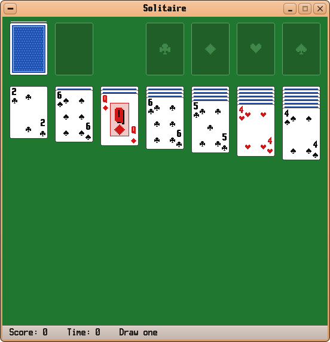 | 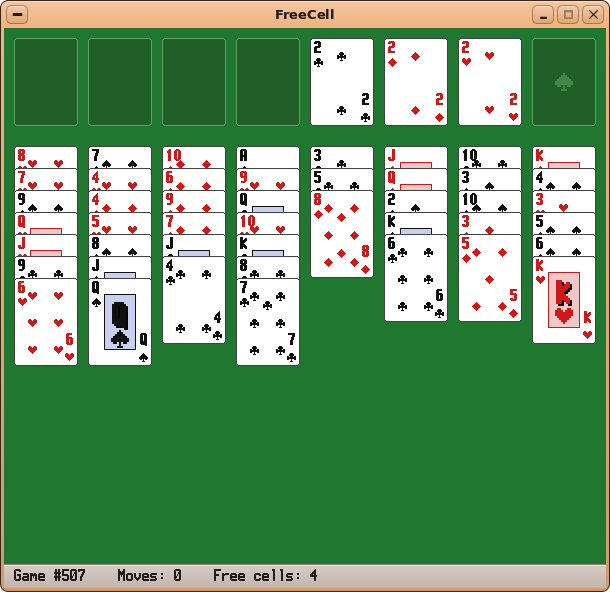 | 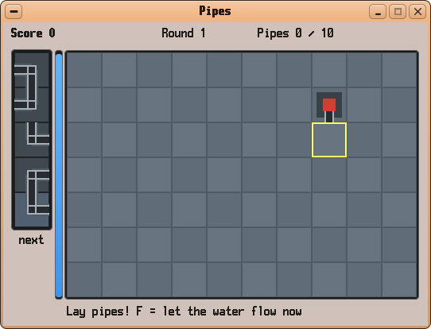 |
| *Solitaire (Klondike)* | *FreeCell — deal #1* | *Pipes* |
| 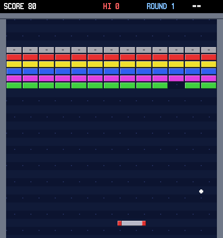 | 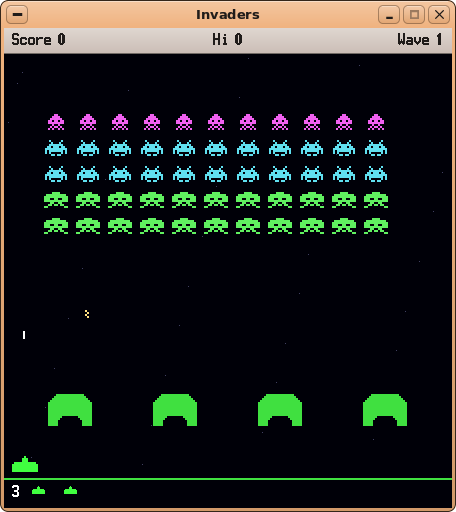 | |
| *Arkanoid* | *Invaders* | |

And the new tools (their graph / canvas / document areas, rendered the same way):

| | | |
|:---:|:---:|:---:|
| 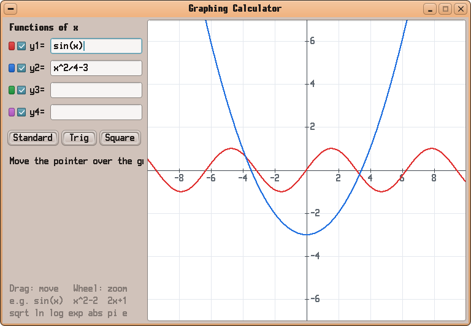 | 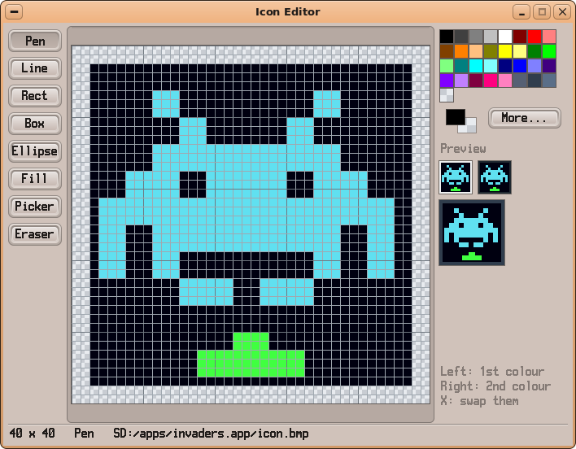 | 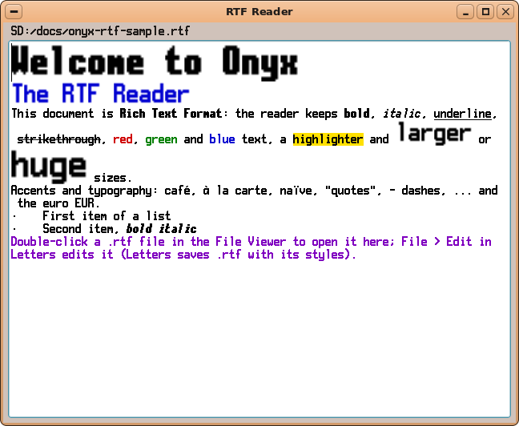 |
| *Graphing Calculator — trace* | *Icon Editor* | *RTF Reader* |

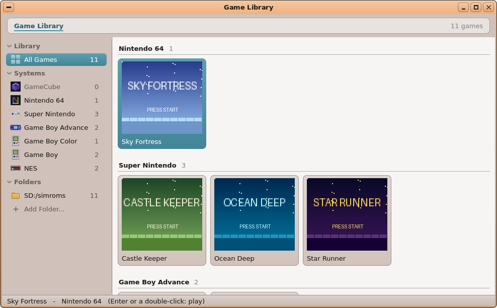
*The Game Library: the systems in the sidebar (their number of games), All Games shown by system
(sample games, made up for the picture).*

### The emulators on a Windows PC (NintendoEMU)

`pc/dist/` also holds **NintendoEMU** (Windows 10 / 11, .NET Framework 4.8 — already there):
the Onyx emulators — Game Boy / Color, Game Boy Advance, NES, Super Nintendo, Nintendo 64 and
GameCube, **the same cores** as on the Pi — in one program with a library of your games. Keep
`NintendoEMU.exe`, `NintendoEMU.exe.config` and `nemucore.dll` together and start `NintendoEMU.exe`.

- **The library**: Library ▸ **Add Games…** (Ctrl+O, several files at once), **Add Folder…**
  (Ctrl+Shift+O: every game of a folder and its sub-folders), or drop files / folders on the
  window. Only the **paths** are kept — in `library.txt` beside the program (or in
  `%APPDATA%\NintendoEMU` if that folder cannot be written), one a line; the games stay where
  they are. A tile per game, one section per system, with a picture: a 2D game is run ~7 s
  unseen and its screen kept, a Nintendo 64 game gets a label with its name, a GameCube disc its
  banner (cached in `thumbs\`; View ▸ **Refresh Pictures** makes them again). **Del** removes a
  game from the library (not from the disk); View ▸ Tiles / Details.
- **Playing**: double-click, **Enter**, or a gamepad's **Start** / **A** (the d-pad moves in the
  library). Keys as on Onyx (Help ▸ Controls…): arrows, **X** / **Z** (A / B), **Enter** Start,
  **Backspace** Select, **A S Q W** for Y, X, L, R… (N64 / GameCube: **C** = B, **Z** = Z, **I J K L**
  the C buttons / stick, **T F G H** the D-pad). **Xbox-style pads** (XInput) work, the buttons by
  their place as on Onyx; **other USB pads** (DirectInput / HID ones) too, with Options ▸
  **Gamepad…**: each button of the Onyx pad (Up… Start, named after its place) gets a button, an
  axis end or a hat direction of the pad ("Set", then press it; a lamp shows what is held), and the
  sticks an axis each (kept in `settings.ini`). **P** pause, **F11** or **Alt+Enter** full screen (**Esc** back), **F12**
  the speed, **Ctrl+R** reset, Ctrl+W close; View ▸ Size 1x–5x, Smooth Picture; Sound ▸ On / Off.
- **Saves**: `<game>.sav` beside the game — the **same files as on Onyx**, so a save can go
  from the Pi to the PC and back. A GameCube disc's `<game>.sav` is its **memory card** (slot A,
  251 blocks, made and formatted the first time; a card image from Dolphin — a `.raw` of 59 to
  2043 blocks — can be copied over it).
- **3D** (Nintendo 64, GameCube): drawn by the PC's graphics card with **OpenGL** (Nintendo 64:
  2.0 or later, at the window's size); View ▸ **3D Renderer** ▸ Software uses the BASIC 3D's
  renderer on every core of the processor instead — also the fallback when OpenGL is missing. With OpenGL, F12's speed shows in the title bar.
  A **GameCube** game (OpenGL 3.3) is drawn by the graphics card the way the console draws: its
  lighting, its colour combiner (the TEV: the cel shading of The Wind Waker), fog, transparency,
  the effects made by copying the picture into textures (blur, glow), at **1–4 × the console's
  resolution** (View ▸ 3D Resolution: 2 × by default). The first time a new effect shows, the
  picture may pause a moment while the graphics card prepares it (only once: the card keeps it).
  A laptop with two graphics cards: View ▸ 3D Renderer ▸ **Use the High-Performance Graphics
  Card** (Windows' own setting for NintendoEMU; it applies the next time NintendoEMU starts).
- **GameCube**: its CPU is **recompiled** to the PC's own code as it runs (a JIT), so games run at
  full speed on a recent PC; **sound** for the games on the "Zelda" sound microcode (The Wind
  Waker…) — the games on Nintendo's usual one (AX) are silent for now; the memory card above.
  A key pressed briefly moves a menu's cursor by one (the game repeats it when held).

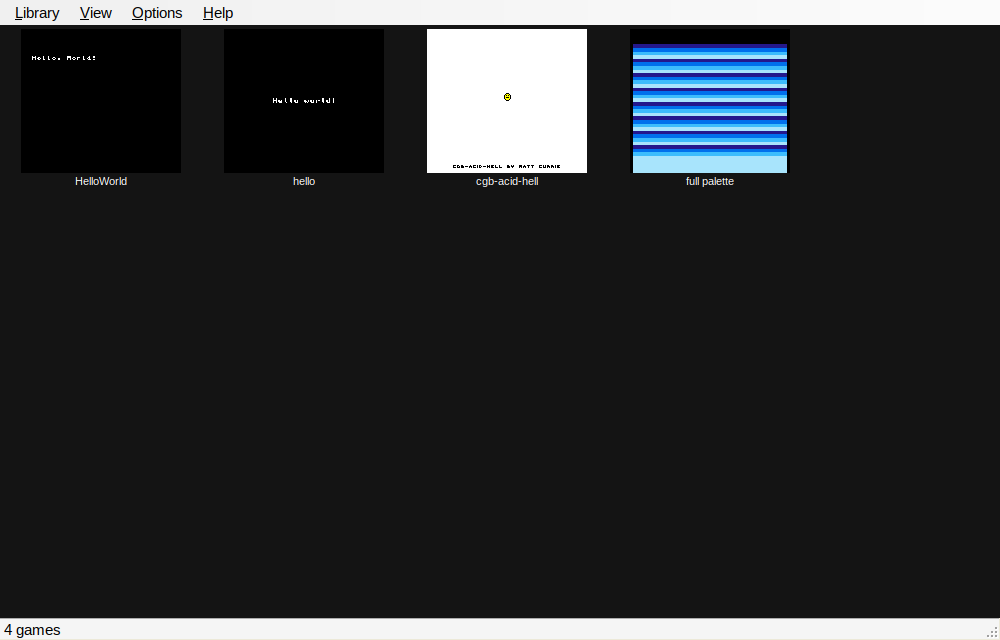
*NintendoEMU's library (test ROMs): a picture per game, taken from the game itself.*

### Demos (technical examples)

**plasma** — a full-screen plasma animation (the demo of full-screen apps): the desktop
disappears while it runs; **Esc**, **Enter**, **q** or a click quits and brings it back.


| Demo | Shows |
|---|---|
| **demoA** | Bouncing box (direct framebuffer access + file reading). |
| **demoB** | Animated color field (multitasking). |
| **demoC** | Fire effect; "Color" button to cycle the palette. |
| **demoD** | Widget gallery (label, textbox, checkbox, button, slider, progress bar). |
| **demoE** | Multi-line textarea + scrolling view with scrollbars. |
| **demoF** | Small borderless launcher (buttons A–E that launch the other demos). |
| **widgets** (Widget Showcase) | The WPF-style uikit controls: radio buttons in a group box, toggle switches, a numeric up/down, a list box, a tree view, a calendar and a date picker, an image box, the colour dialog (**Colour...**), and **tooltips** (rest the pointer on a control). The **Studio** group shows the studio controls: a toolbar of transport buttons (**Play** / pause — a toggle —, **Stop**, **Record**, **Loop**), a time display that runs while playing, a segmented choice (Chords / Melody / Drums), three knobs (**Gain**, **Pan**, **Mix**: drag up or down — Shift for fine steps —, the wheel, a double click resets Gain and Pan) and level meters fed by a made-up signal while playing (the Gain and Pan knobs act on it; a click on a meter clears its red clip light). The bottom line reports each event. Reads the icon `SD:/apps/imageview.app/icon.bmp`; writes nothing. |
| **basicdemo** (BASIC Demo) | An app written in BASIC (`main.bas`, run by `/bin/basic`): a text box and **Say hello** (a notification), a click counter and a progress bar, and concentric circles whose colour (drop-down), size (slider) and fill (check box) follow the controls. Open it in QBasic to read it. |
| **cppdemo** | C++/OO example: a class hierarchy with virtual draw, objects created with `new` (user allocator), global constructor — proves the C++ app toolchain. |
| **wtkdemo** (Widget Toolkit Demo) | The first uikit test window: labels, buttons, a checkbox, a slider driving a progress bar, a text box and a nested panel with its own button (recursive repaint, mouse routing, focus, clipping). |
| **spin** | Preemption test: a CPU hog that **never yields**. On a purely cooperative kernel it freezes the whole machine; with preemptive scheduling the rest of the UI (cursor, panel, other apps) stays responsive while it spins. It cannot be closed by its window (it never checks for the close) — **stop it from `taskman`**. |

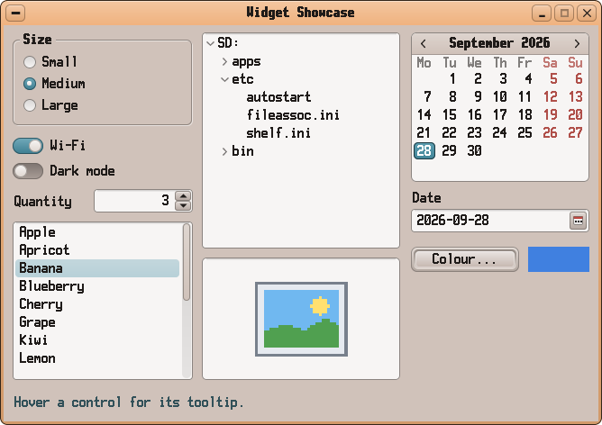
*The Widget Showcase: group box + radio buttons, toggles, numeric up/down, list box, tree
view (with a tooltip), image box, calendar, date picker and the colour button; below, the Studio
group: transport buttons, a time display, a segmented choice, knobs and level meters.*

## 13. Programming in BASIC

Onyx has a **BASIC in the style of QBasic**: the **QBasic** editor (`qbasic`, category
*Productivity*), the runtime **`/bin/basic`**, and apps written in BASIC. Programs are
compiled to bytecode and run by a small virtual machine. The full list of keywords is in
**Help ▸ Keywords** (`SD:/apps/qbasic.app/help.txt`).

**Machine code or managed.** On the Pi a BASIC program runs **in machine code**: when it starts,
`/bin/basic` translates its bytecode to AArch64 once (a few milliseconds) and runs that — nothing to
do, nothing changes in the files, and a `.bas`, a `.bax` and an app behave the same. What computes
(numbers, loops, arrays, comparisons, the numeric functions, SUB and FUNCTION calls) is **ten to twenty
times faster** than on the VM (on a Pi 4 -- a Mandelbrot set + a sieve + strings + recursion: 1.47 s on
the VM, 0.07 s in machine code; a recursive `Fib&(27)`, 832 000 calls: 0.40 s, then 0.05 s); what draws, prints, waits
or reads files takes the same time as before, since that was machine code already — a game like
Arkanoid, which spends its time drawing and pausing, does not change. The results are the same,
errors and `ON ERROR` / `RESUME`, `ON TIMER` / `ON KEY` and Ctrl-Break included: every instruction
the translator does not handle is done by the VM itself. **Managed** means *run on the VM, as
before*: `basic -m prog.bas` for one run; the statement **`OPTION MANAGED`** in a program for that
program, always; the **Managed** box of the compile dialogs (QBasic's **Run ▸ Make .bax** and
**File ▸ Make App**, QBStudio's project settings, the Windows editor) for a compiled program or an
app. Use it if a program ever behaves differently in machine code (and tell us). On Windows
programs always run on the VM.

**Compiled programs**: **Run ▸ Make .bax**
writes `<program>.bax`, the bytecode, which starts without parsing and runs like a `.bas`
(File Viewer, `CHAIN`); **File ▸ Make App** can make a compiled app (`main.bax`); in a terminal
`basic -c prog.bas` writes `prog.bax`. The editor shows the code in light grey on blue, as
QBasic did. Examples are in `SD:/basic/examples`
(**File ▸ Examples...**): `hello`, `guess`, `subs`, `files`, `graphics`, `gui`, `classes` (objects:
inheritance, virtual methods, an interface) and
**`arkanoid.bas`**, a full brick breaker in `SCREEN 13` shown with `FULLSCREEN` (arrows or
the mouse move the paddle, Space / click launches and fires, P pause, F full screen on /
off, Esc title / quit; capsules E expand, S slow, C catch, L laser, D three balls, P a life;
it reads and writes no file).

### Onyx BASIC on a Windows PC

`pc/dist/` holds **Onyx BASIC for Windows** (Windows 10 / 11, nothing to install): the same
compiler and virtual machine, to write and try programs on a PC. Copy the folder (keep
`OnyxBasic.exe`, `OnyxBasic.exe.config` and `obcore.dll` together) and start `OnyxBasic.exe`:

- **The editor** works like `qbasic`: one module at a time (the main module, each SUB /
  FUNCTION); **View ▸ SUBs...** (F2), **Edit ▸ New SUB...** (or type `SUB Name` + Enter, as in
  QBasic); **Run ▸ Start** (F5) checks the syntax and runs the program, an error jumps to its
  line; the language's words are capitalised when you leave a line. Every command is in the
  menus (**File**, **Edit**, **View**, **Run**, **Options**, **Help**); files are saved in
  Latin-1 with Onyx line ends, ready for the SD card. **File ▸ Make App...** writes
  `apps/<name>.app` into the SD folder (as source or compiled); **Run ▸ Make .bax** compiles
  the program, and the runtime runs `.bax` files as well.
- **SD:/** is a folder of the PC: **Options ▸ SD Folder...** (by default the repository's
  `sdcard/` when `pc/dist` is used in place), so programs that read files run unchanged.
- **The program's window** shows the screen scaled (320-wide modes doubled, proportions kept),
  with BASIC's controls as Windows controls; its menu: **Program ▸ Stop / Restart**,
  **View ▸ Full screen / Zoom**. `FULLSCREEN` does nothing on the PC; `LAUNCH` / `EXEC` (Onyx
  apps) are not available; `SHELL` runs a Windows command.

### The editor (`qbasic`)

- As in QBasic, the program is split into **modules** edited one at a time: the **main
  module** and each **SUB** / **FUNCTION**. The line above the text says which one is shown.
  **View ▸ SUBs...** (**Ctrl-L**) lists them (**Edit** opens one, **Delete** removes it);
  **Edit ▸ New SUB...** / **New FUNCTION...** asks for a name and creates it. On disk the
  program is one ordinary `.bas` text file (the main module, then every SUB / FUNCTION).
- **Run ▸ Start** (**Ctrl-R**) checks the syntax — an error opens the right module on the
  right line, with the message in the status bar — then runs the program in its own window.
  A runtime error comes back the same way. **Run ▸ Check Syntax** (**Ctrl-K**) only checks.
- **File**: New (Ctrl-N), Open... (Ctrl-O), Examples..., Save (Ctrl-S), Save As...,
  **Make App...** (below). **Edit ▸ Go to Line...** (Ctrl-G) takes a line number of the
  whole program. **Enter** keeps the indentation of the line above; Page Up / Down scroll.
- **F5** runs, **F2** lists the SUBs, **F1** opens the help (as in QBasic).
- Double-clicking a `.bas` file in the File Viewer opens it in the editor (`fileassoc.ini`);
  dropping one on the editor opens it too.

### Running programs

- From the **terminal**: `basic prog.bas [arguments]` (or just `prog.bas`). The program
  then works like any console tool: `PRINT` writes to the console, `INPUT` / `LINE INPUT`
  read the keyboard, **pipes and redirections** work (`basic sort.bas < list.txt`). It opens
  a window only if it uses one (graphics, `SCREEN`, `WINDOW`, controls).
- As an **app**: a program opens a window of 80 × 25 text cells (640 × 400) at its first
  `PRINT`; text and graphics share it (`SCREEN 12` = 640 × 480, `SCREEN 13` = 320 × 200).
  When a text-only program ends, "Press any key to continue" keeps the window open.
- `COMMAND$` holds the arguments. Relative file names are in the program's folder.

### The language

QBasic's: numbers and strings (`$`), arrays (`DIM`, up to 4 dimensions), `IF` / `ELSEIF`,
`FOR`, `WHILE`, `DO ... LOOP`, `SELECT CASE`, `GOTO` / `GOSUB`, line numbers and labels,
`SUB` / `FUNCTION` with arguments **by reference** (plain variables; an expression or a
parenthesised variable goes by value), `DIM SHARED`, `STATIC`, `CONST`, `DATA` / `READ`,
files (`OPEN ... FOR INPUT / OUTPUT / APPEND`), the string and math functions, `CLS`,
`LOCATE`, `COLOR` (16 colours, or `RGB(r, g, b)`), `PSET`, `LINE` (`B` / `BF`), `CIRCLE`
(`F` fills), `INKEY$`, `TIMER`, `RND`, **sound**: `PLAY "T140 O3 L8 CDEFG>C"` (QBasic's music
language), `SOUND freq, ticks`, `BEEP`, and Onyx's `NOTEON voice, freq[, wave, volume]` /
`NOTEOFF [voice]` (a note that plays until stopped, 16 voices).

**The system's kits (`#import`).** A BASIC program can call the functions of the system's **kits** — the
shared libraries of `SD:/lib` every app is built on: AppKit (the system's calls), FileKit (files, ZIP
archives), SystemKit (notifications, the clipboard, the trash), ImageKit (pictures), AudioKit (sound),
NetKit (the network), PrinterKit (printing) — and any kit installed later. At the top of the program:

```basic
#import FileKit
#import SystemKit

size# = FileKit.file_size("SD:/config.txt")
IF FileKit.copy("SD:/config.txt", "SD:/tmp/copy.txt", 0, 0) = 0 THEN SystemKit.notify "BASIC", "Copied"
```

`#import` is not sensitive to case. A function is called **`Kit.name (arguments)`** — as a function when its
result is used, as a statement otherwise. Its name is the kit's C name less the kit's prefix (`fk_copy` is
`FileKit.copy`; `FileKit.fk_copy` works too); what each function does is in the kit's reference (the
documents 10 to 18), and `SD:/lib/<kit>.bi` lists what BASIC can call. The rules:

- a **string** argument takes a BASIC string; a text result is a BASIC string;
- a **number** is a number; a **handle** or a **pointer** is a number too — keep it in a plain or a `#`
  variable (a `%` or `&` variable is too small: *Overflow*); `0` is "none";
- where a function **fills a number** (`int *`, `unsigned *`, a pointer's address ...), write
  **`BYREF variable`**: `FileKit.load (name$, BYREF buffer#, BYREF length)`;
- where a function **calls the program back**, give **`ADDRESSOF (Name)`**, a SUB or FUNCTION of the program
  (not a method) whose parameters are numbers and strings — what the kit passes; a FUNCTION's value is what
  the kit gets back;
- **memory**: `p# = ALLOC (bytes)` (zeroed) and `DEALLOC p#` for a buffer a function writes into;
  `CSTR$ (p#)` is the text at an address (`CSTR$ (p#, n)`: n characters); `PEEKB` / `PEEKW` / `PEEKL` /
  `PEEKQ` / `PEEKF` / `PEEKD (address)` read a byte, 16, 32 or 64 bits, a float, a double, and
  `POKEB` ... `POKED address, value`, `POKES address, text$` write them (a structure's field is at
  `p# + its offset`);
- a kit's **structures** are TYPEs of the program, under the kit's name: `DIM e AS FileKit.zip_entry` (the C
  `struct fk_zip_entry`; its fields by their C names: `e.name`, `e.size` ...). Give the variable where the
  function takes the structure's address — it is filled when the function returns:
  `IF FileKit.zip_entry (zip#, i, e) THEN PRINT e.name; e.size`. A **whole array** goes as `name ()`:
  `DIM f(15) AS ImageKit.format : n = ImageKit.formats (f(), 16)`. `PEEKT address, variable` reads a
  structure from an address (one the kit keeps, or one a callback receives), `POKET address, variable`
  writes it there; `LEN (variable)` is its size in bytes. A field that is an array of numbers has no
  name in BASIC;
- what a kit **allocates and returns** is yours to free, with the kit's own function (`FileKit.free p#`).

Nothing is checked: a wrong address ends the program. These words (`ALLOC`, `CSTR$`, `PEEKB` ..., `PEEKT`,
`BYREF`, `ADDRESSOF`) only exist in a program that has an `#import`. A compiled program (`.bax`, a standalone app)
keeps what it needs of the kits; if a kit is missing or too old when it runs, the call fails with *Kit not
available* (error 73). The example: `SD:/basic/examples/kits.bas`.

**A desktop app with UIKit (`#import UIKit`).** UIKit, the toolkit of every Onyx app, has functions made
for BASIC: a window and its widgets as handles. `win = UIKit.window (title$, w, h, 1)` makes the program's
window (1: it can be resized); `UIKit.label`, `UIKit.button`, `UIKit.textbox`, `UIKit.checkbox`,
`UIKit.listbox`, `UIKit.dropdown`, `UIKit.slider`, `UIKit.progress` `(win, x, y, w, h, ...)` put a widget in
it and give its handle; `UIKit.get_text` / `set_text`, `get_value` / `set_value`, `add_item`, `clear_items`,
`move`, `show`, `enable`, `focus` work on a handle; `UIKit.menu_item win, "File", "Quit", "Ctrl+Q",
ADDRESSOF (Quit)` adds to the menu bar; `UIKit.message`, `UIKit.ask_open`, `UIKit.ask_save` are the dialogs.
What happens to a widget **calls a SUB of the program**, given with `ADDRESSOF` when the widget is made
(`SUB Clicked (widget)`), and the program runs the events with

```basic
DO WHILE UIKit.window_wait (win)
LOOP
```

until the window is closed (its box, or `UIKit.window_close win`). The whole list, with what each function
does: the document 11 (UIKit), `uikit/flat.h`; the example: `SD:/basic/examples/uikit.bas`. A program has
**one** window: either this one, or BASIC's own screen (`PRINT`, `SCREEN`, `WINDOW`, `BUTTON` ...) — once
`UIKit.window` is made, `PRINT` shows nothing (`MSGBOX`, `OPENFILE$`, `SAVEFILE$` still work, over the
window). QBStudio writes this code from a window you draw.

**Sound files and MIDI notes (AudioKit).** `PLAYFILE file$ [, loop]` plays an MP3, FLAC, WAV, FM Song (`.fms`), Ogg
or MIDI file **while the program goes on** (`loop` 1: again and again); `STOPFILE`, `PAUSEFILE 1` /
`PAUSEFILE 0`, `FILEVOLUME 0..100`. `FILEPLAYING` is 1 while it plays (0 stopped, 2 paused, 3
waiting: another program holds the sound), `FILEPOS` and `FILELENGTH` its place and length in
seconds. `MIDINOTE channel, key [, velocity]` plays a note on the **General MIDI synthesizer** (16
channels, 0–15; channel 9 is the drums; key 60 is middle C; velocity 1–127, **0 stops the note**),
`MIDIPROGRAM channel, instrument` chooses the instrument (0–127: 0 a piano, 24 a guitar, 40 a
violin, 56 a trumpet, 73 a flute …), `MIDICONTROL channel, controller, value` (7 the volume, 10 the
pan, 64 the pedal), `MIDIOFF` silences everything. `NOTEFREQ (key)` is a key's frequency in Hz,
`NOTENUMBER ("C4")` a note name's key. They mix with `PLAY` / `SOUND`, and with each other:

```basic
MIDIPROGRAM 0, 0                 ' a piano
PLAYFILE "SD:/music/theme.mid", 1
FOR k = 60 TO 72 STEP 4
  MIDINOTE 0, k, 100: PAUSE 250: MIDINOTE 0, k, 0
NEXT k
```

And the rest of QBasic 1.1 (the editor's Help ▸ Keywords lists everything):

- **Types**: `%` INTEGER, `&` LONG, `!` SINGLE, `#` DOUBLE (or `AS INTEGER` …, `DEFINT A-Z` …,
  `DEFSTR`); INTEGER / LONG round when stored and raise *Overflow*; DOUBLEs print 15 digits;
  fixed strings `STRING * n`. **User types**: `TYPE … END TYPE` records (nested, in arrays,
  passed to SUBs, copied by `=`), `LEN (var)` their size; a TYPE **only holds data** — methods
  are for a `CLASS` (below; since 2026-10-05 `SUB Point.Test` on a TYPE is an error: write
  `CLASS Point … END CLASS` and make the objects with `NEW Point` or `DIM p AS Point ()`).
  `DEF FN`, `RETURN value` in a
  FUNCTION, `MID$ (…) = …`, `LSET` / `RSET`, `PRINT USING` (all the `#` `,` `.` `+` `-` `**`
  `$$` `^^^^` `!` `\ \` `&` `_` fields).
- **Classes** (Onyx; the example `classes.bas`): a `TYPE` is a **value** (`b = a` copies it); a
  **`CLASS`** is a **reference**, as in C#: a variable `AS` a class holds `NOTHING` or an object made
  by `NEW`, `b = a` makes both name the **same object**, and an object lives as long as something
  refers to it.

  ```basic
  INTERFACE Drawable                  ' what a class promises: methods without a body
    SUB Draw ()
    FUNCTION Area () AS SINGLE
  END INTERFACE

  CLASS Sprite                        ' the fields, as in a TYPE
    x AS SINGLE
    y AS SINGLE
  END CLASS
  SUB Sprite.new (x, y)               ' the constructor
    this.x = x: this.y = y
  END SUB
  VIRTUAL SUB Sprite.Show ()          ' a child class may redefine it
    PRINT "sprite at"; this.x; this.y
  END SUB
  ABSTRACT FUNCTION Sprite.Name$ ()   ' no body: every child must define it

  CLASS Ball EXTENDS Sprite IMPLEMENTS Drawable
    r AS SINGLE
  END CLASS
  SUB Ball.new (x, y, r)
    BASE.new x, y                     ' the parent's constructor
    this.r = r
  END SUB
  OVERRIDE SUB Ball.Show ()
    PRINT "ball, "; : BASE.Show       ' the parent's method
  END SUB
  OVERRIDE FUNCTION Ball.Name$ ()
    RETURN "ball"
  END FUNCTION
  SUB Ball.Draw ()
    CIRCLE (this.x, this.y), this.r
  END SUB
  FUNCTION Ball.Area () AS SINGLE
    RETURN 3.14159 * this.r * this.r
  END FUNCTION

  DIM s AS Sprite                     ' NOTHING for now
  s = NEW Ball (10, 20, 3)            ' a parent's variable holds any child
  s.Show                              ' the object's own Show: "ball, sprite at 10 20"
  IF s IS Ball THEN PRINT s.Name$
  DIM d AS Drawable: d = s: d.Draw    ' through the interface
  ```

  - **Inheritance**: `CLASS Child EXTENDS Parent` (one parent, defined above its children): the
    child has the parent's fields and methods and adds its own. **Interfaces**:
    `IMPLEMENTS A, B` (up to 8): the class must have every method of the interface, with the same
    parameters; a variable or a parameter `AS` an interface accepts any object whose class
    implements it.
  - **Methods** are written outside the block: `SUB Class.Name (…)` / `FUNCTION Class.Name (…)`,
    where `this` is the object (`this.x = a`, `RETURN this.x + a`); they are called as
    `p.Test 3`, `CALL p.Test (3)`, `y = p.F (2)`, `list(i).Test 1`. **Properties**:
    `PROPERTY Class.Name AS type … END PROPERTY` (the getter) and `PROPERTY Class.Name (v AS
    type) … END PROPERTY` (the setter): `p.Name = v`, `a = p.Name`. A plain method is called as written for the variable's class; a **`VIRTUAL`** one is
    looked up in the **object's own class** when the program runs, and a child redefines it with
    **`OVERRIDE`** (same parameters and result; forgetting the word is an error). **`ABSTRACT`**
    declares a virtual method without a body (one line, no `END SUB`): the class cannot be
    created with `NEW` until a child has defined them all. **`BASE.Name`** calls the parent's
    version.
  - **Constructor** `SUB Class.new (…)`: called by `NEW Class (args)` and `DIM v AS Class (args)`
    (`DIM v AS Class` alone leaves `NOTHING`; `DIM v AS Class ()` makes an object, with or without
    a constructor). A child without a constructor uses its parent's;
    a child's constructor calls **`BASE.new args`** — if it does not, the parent's constructor is
    called first by itself when it has no parameters (with parameters, `BASE.new` is required).
    **Destructor** `SUB Class.delete ()`: called when the last reference to the object goes (a
    variable set to `NOTHING` or to another object, the end of the SUB that held it); the child's
    runs first, then its parents'. Objects still alive when the program ends are freed without it,
    and two objects that refer to each other are only freed at the end (break the circle with
    `NOTHING`).
  - **Tests**: `x IS Class` / `x IS Interface` (-1 when the object is of that class, of a child
    of it, or implements it), `x IS NOTHING`, `a IS b` (the same object); `=` does not compare
    objects. **Assignments**: a child's object goes into a parent's or an interface's variable as
    it is; the other way (`ball = sprite`) is allowed and **checked when it runs** (*Type
    mismatch* if the object is not a `Ball`); two classes without a link do not compile.
  - Objects go in arrays (`DIM list(9) AS Sprite`, all `NOTHING` at first), in the fields of a
    class or of a TYPE (`nxt AS Node`: linked lists, trees — a class may name itself or a class
    defined further down), in parameters and FUNCTION results (`FUNCTION Pick () AS Sprite`;
    `Pick ().Name$` calls a method on the result). A parameter receives the reference: the SUB
    works on the caller's object, but assigning the parameter itself changes nothing outside.
    Using `NOTHING` (`x.field`, a virtual call) is the error *Object is NOTHING* (`ERR` 91).
    Objects cannot be written by `PUT` / `GET` nor printed.
  - The words `CLASS`, `INTERFACE`, `EXTENDS`, `IMPLEMENTS`, `VIRTUAL`, `OVERRIDE`, `ABSTRACT`,
    `BASE`, `NOTHING`, `NEW` are **not reserved**: an older program with a variable named
    `class` or `base` still runs.
- **Errors**: `ON ERROR GOTO` handlers with `RESUME` / `RESUME NEXT` / `RESUME label`, `ERR`,
  `ERL`, `ERROR n` — an error inside a SUB comes back to the module-level handler.
- **Files**: `RANDOM` (records of `LEN = n`, `GET` / `PUT #` of numbers, strings and records,
  or `FIELD` + `LSET` / `RSET`) and `BINARY` files, `SEEK`, `LOC`, `MKx$` / `CVx`,
  `INPUT$`, `RESET`, `FILES`, `CHDIR`, `ENVIRON`, `SHELL` (a `/bin` tool, its output on the
  screen).
- **Graphics**: the screen modes 1, 2, 7–13 (320-wide modes shown doubled) with pages
  (`SCREEN m, , apage, vpage`, `PCOPY`), `PAINT`, `DRAW`, `GET` / `PUT` sprites (`PSET`,
  `PRESET`, `AND`, `OR`, `XOR`), `VIEW`, `WINDOW` logical coordinates and `PMAP`, `PALETTE`
  (existing pixels change colour, as on a VGA), `CIRCLE` arcs / ellipses, `STEP`, line
  styles, `VIEW PRINT`, `SCREEN (row, col)`. Onyx adds **`FULLSCREEN`**: the screen scaled to
  the whole display, proportions kept (a whole-number zoom when it fills nearly as much: at
  1024 × 768, `SCREEN 13` is shown 3×); `MOUSEX` / `MOUSEY` stay in the program's pixels.
- **Text** uses QBasic's character set (code page 437: frames `CHR$(201)` ╔, blocks
  `CHR$(219)` █, card suits…) in the VGA fonts, drawn by the runtime: 8 × 8 in `SCREEN 13`
  and the other 320/640 × 200 modes, 8 × 14 in `SCREEN 9` / `10`, 8 × 16 otherwise;
  `DRAWTEXT` is always 8 × 16. Accents typed in the editor or on the keyboard are translated
  (é is `CHR$(130)`, as in QBasic); text sent to Onyx (controls, file names, clipboard) is
  translated back. File contents are kept byte for byte, so an Onyx text file with accents
  shows other characters.
- **Keys and sound for games** (Onyx): `KEYDOWN(k$)` is -1 while a key is held (`k$` as
  `INKEY$` gives it, e.g. `CHR$(0) + "K"`, or a name: `"LEFT"`, `"RIGHT"`, `"UP"`, `"DOWN"`,
  `"SPACE"`, `"ENTER"`, `"ESC"`, a letter). `PLAY "MB…"` plays in the background while the
  program goes on (`MF` back to the foreground); `PLAY(0)` = notes still queued.
- **USB gamepads**: `PAD(n)` = the buttons held on pad `n` (0–3; `PAD` alone: every pad) —
  1 up, 2 down, 4 left, 8 right, 16 A (bottom), 32 B (right), 64 X (left), 128 Y (top),
  256 L, 512 R, 1024 L2, 2048 R2, 4096 Select, 8192 Start (`IF PAD AND 16 THEN …`); QBasic's
  `STICK(n)` (0/1 = x/y of pad 0, 2/3 of pad 1, 1–199, 100 centred) and `STRIG(n)` (0–3
  button A of pad 0/1, 4–7 button B; even `n` = pressed since the last call, odd = held).
  Nothing is pressed while the program's window is in the background. Also in the Windows
  runtime (Windows game controllers).
- **3D** (Onyx: drawn by the GPU; software when there is none, and in the Windows runtime):
  a frame is built between **`SCENE3D [colour]`** (clears to `colour`, black by default; `-1`
  draws over the screen as it is) and **`RENDER3D`** (draws it on the screen; `PRINT` / `LINE`
  after it go on top). The camera: **`CAMERA3D ex, ey, ez, tx, ty, tz [, fov]`** (the eye, the
  point looked at, the field of view in degrees, 60), y is up. The light: **`LIGHT3D dx, dy, dz
  [, ambient%]`** (the direction it comes from; `0, 0, 0` = no lighting). Placing things: the
  statements act on the shapes drawn after them — **`TRANSLATE3D x, y, z`**, **`ROTATE3D ax, ay,
  az`** (degrees, around X then Y then Z), **`SCALE3D s [, sy, sz]`**, **`IDENTITY3D`**, and
  **`PUSH3D`** / **`POP3D`** to save and restore the placement (32 levels: a moon around its
  planet). The look: **`COLOR3D c [, alpha]`** (a colour or `RGB ()`, alpha 0–255),
  **`TEXTURE3D t [, smooth [, wrap]]`** (`0` none; smooth 1 = filtered; wrap 0 repeat, 1 clamp,
  2 mirror), **`BLEND3D m`** (0 opaque, 1 transparent, 2 added light, 3 multiply),
  **`DEPTH3D test [, write]`**, **`CULL3D m`** (0 both faces, 1 the front only — the default —,
  2 the back only). The shapes (lit): **`CUBE3D [size]`**, **`SPHERE3D [radius [, detail]]`**,
  **`CYLINDER3D [radius [, height [, detail]]]`** (standing on y = 0), **`PLANE3D [w [, d]]`**
  (flat on y = 0, facing up); and any triangles: **`VERTEX3D x, y, z [, s, t]`**, three by
  three (counter-clockwise = the front; `s, t` = texture coordinates 0–1). **`t = GRAB3D (x, y,
  w, h)`** makes a texture of a rectangle of the screen (draw it with `LINE`, `CIRCLE`,
  `PSET`…; magenta `RGB (255, 0, 255)` = transparent); **`GPU3D`** is -1 when the GPU draws.
  Example: `SD:/basic/examples/planets3d.bas` (the **Planets 3D** app).
- **Events**: `ON TIMER (n) GOSUB`, `ON KEY (n) GOSUB` (F1–F12, arrows, user keys) with
  `TIMER` / `KEY (n)` `ON` / `OFF` / `STOP`. `INKEY$` returns F1–F10 as `CHR$(0) + CHR$(59…68)`.
- **Programs**: `CHAIN` (with `COMMON` variables and the open files), `RUN`, `CLEAR`,
  `TRON` / `TROFF`, `FRE`. **Ctrl+C** stops a running program (QBasic's Ctrl+Break).
- Not supported (DOS hardware): `PEEK` / `POKE`, `DEF SEG`, `VARPTR`, `CALL ABSOLUTE`,
  `INP` / `OUT`, `ON COM` / `PEN` / `STRIG` / `PLAY`.

Onyx additions — a program can be a real **windowed app**:

```basic
WINDOW "Converter", 320, 150
c = TEXTBOX(100, 14, 120, 24, "20")
go = BUTTON(230, 12, 78, 28, "Convert")
res = LABEL(12, 60, 296, 22, "")
DO
  e = WAITEVENT                 ' the control used; -1 = the window was closed
  IF e = -1 THEN END
  IF e = go THEN SETTEXT res, STR$(VAL(GETTEXT$(c)) * 9 / 5 + 32) + " F"
LOOP
```

Controls: `BUTTON`, `LABEL`, `TEXTBOX`, `CHECKBOX`, `LISTBOX`, `DROPDOWN` (items `"a|b|c"`),
`PROGRESS`, `SLIDER`; `SETTEXT` / `GETTEXT$`, `SETVALUE` / `VALUE`, `WAITEVENT` / `EVENT`.
Layout: `MOVECONTROL id, x, y, w, h`, `SHOWCONTROL id, shown`, `ENABLECONTROL id, enabled`,
`FOCUSCONTROL id`; `WINDOW title$, w, h, 1` makes the window **resizable** (`WAITEVENT` then
gives **-2** after a resize, `WINDOWWIDTH` / `WINDOWHEIGHT` its new client size); menus:
`id = MENUITEM("&File", "&Quit", "Ctrl+Q")` (an item `"-"` is a separator; `WAITEVENT` gives
`id` when it is chosen). A CLASS may have **properties**: `PROPERTY T.Name AS STRING ... END
PROPERTY` (the getter, `RETURN` its value) and `PROPERTY T.Name (v AS STRING) ... END PROPERTY`
(the setter), then `x.Name = "a"` and `a$ = x.Name` — what QBStudio's generated code uses.
System: `NOTIFY`, `MSGBOX`, `CLIPBOARD$` / `SETCLIPBOARD`, `OPENFILE$` / `SAVEFILE$` (the file
dialogs), `EXEC`, `LAUNCH`, `DRAWTEXT`, `MOUSEX` / `MOUSEY` / `MOUSEB`, `PAUSE ms`.

A windowed app is **in the theme's colours**, as the other Onyx apps: its background is the
windows' colour, its text (`PRINT`, `DRAWTEXT`) and its default drawing colour the theme's ink,
the controls drawn as everywhere else — unless the program chose its colours with `COLOR`
before `WINDOW` (a `COLOR` after it changes them as usual; labels and check boxes then pick a
readable ink on them). The QBasic screens — text programs, `SCREEN` modes, the games — keep
their classic colours.

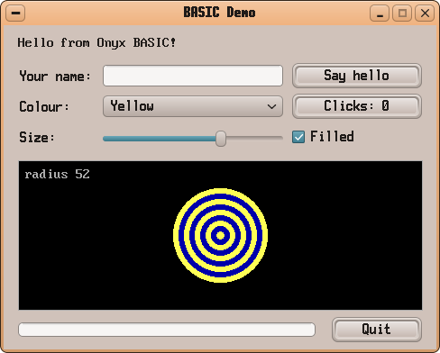
*The BASIC Demo, a windowed app written in BASIC, in the theme's colours (its picture keeps its
own).*

### Apps written in BASIC

An app bundle may contain **`main.bas` or `main.bax` instead of `main`**:
`SD:/apps/<name>.app/main.bas` (+ `app.txt`, `icon.bmp`). It is listed and launched like any
app — the launchers see the file and run it with `SD:/bin/basic` (the programs for such
formats are listed in `SD:/etc/runners.ini`). **File ▸ Make App...** in the editor creates
one from the current program: it asks for the folder name and the title, then shows the
**compile dialog** — **Compiled** (`main.bax`: it starts faster, the source is not in the app; else
`main.bas`), **Standalone**, **Managed** (the app runs on the VM instead of machine code, above).
A **standalone** app is a real program: `SD:/apps/<name>.app/main` is **an executable** — the BASIC
runtime of the card with the compiled program inside it (about 650 KB) — started by the system
like any native app, without `SD:/bin/basic` nor `runners.ini`; it runs in machine code like the
others. It keeps the runtime it was made with: after a system update, **`basic -u`** (in a Terminal)
gives every standalone app of the card the card's runtime, its program untouched (making the app
again does the same); it still uses the card's shared libraries. QBStudio asks the same things in
**Project ▸ Settings** (`project.ini`: `compiled`, `managed`, `standalone`), the Windows editor in
its **Make App** (standalone when the SD folder has `bin/basic`). Examples: **BASIC Demo** (`basicdemo`, `main.bas`), **Planets 3D** and **Arkanoid**
(`arkanoid`: `main.bax`, compiled at build time from `SD:/basic/examples/arkanoid.bas` — the
game is written in BASIC).

### QBStudio, desktop apps in BASIC (`qbstudio`)

**QBStudio** makes **windowed apps** in Onyx BASIC the way Visual Studio's designers do: the window is **drawn**,
the IDE **writes its code**, you write only what the app does — a SUB per event. The `qbasic` editor stays as it
is, for programs.

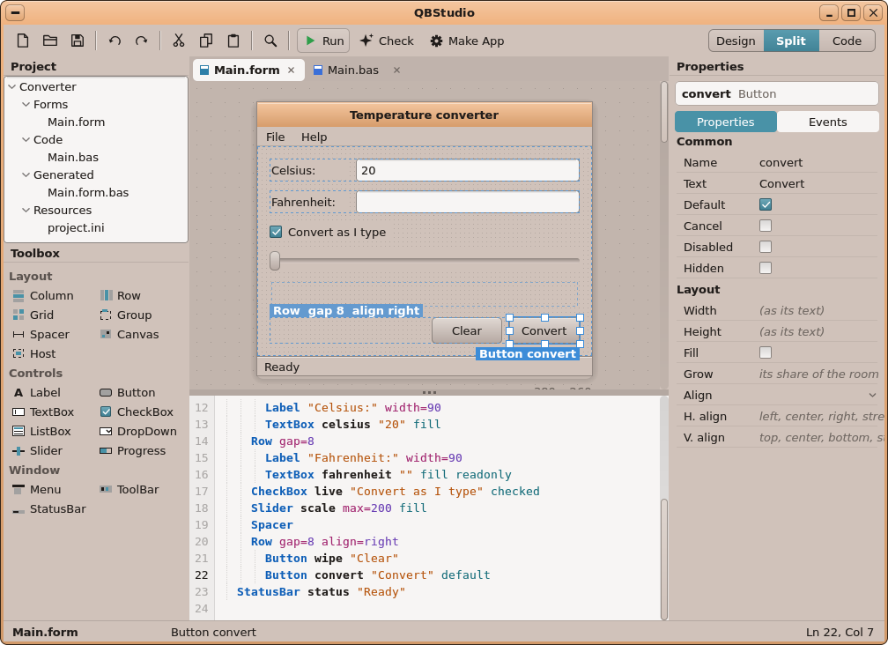
*The example project (`SD:/projects/converter`): the window drawn as Onyx draws it, its layout's boxes dashed, the
Convert button chosen (its Row named above it), its properties at the right; under it the form's text, the
Button's line under the caret.*

**A project** is a folder, `SD:/projects/<name>/`: its `project.ini` (its name, its title, its files, its category,
compiled or not), its window **`Main.form`**, its code **`Main.bas`** (and other modules: Project ▸ Add Module...).
**File ▸ New Project...** makes one from a template — a window of controls in a column, a document app (a menu, a
list, a status bar: New / Open / Save written), an empty window —; **File ▸ Open Project...** opens one (choose any
of its files); **File ▸ Open the Example** opens *Converter*. QBStudio opens the last project at its start.

**In the designer**: the window (or the user control) is sized with the mouse — click its title bar to choose
it, then drag any of its eight handles (the corner at the bottom right works without choosing it). A control
and a **container** (a Column, a Row, a Grid, a Host ...) are sized the same way: chosen, their handles and
their right and bottom edges set `width=` and `height=`; a handle is taken from a few pixels around it, and a
press on one never chooses what lies under it. In the
**Split** view a **bar** lies between the drawing and the form's text: dragged up or down, it shares the room
between them (kept from one session to the next). A window larger than the drawing's room is
scrolled: its bars at the right and at the bottom, the wheel (Shift: sideways).

**The window.** The toolbar: New, Open, Save all, Undo / Redo, Cut / Copy / Paste, Find, **Run** (F5), **Check**
(compiled, not run), **Make App**, and the form's views — **Design**, **Split** (the designer over the form's text),
**Code** (the text alone). At the left the project's files and the **toolbox** (in the code: the **outline**, its
SUBs); in the middle the open files' tabs; at the right the **properties**; at the bottom the **problems** (a click
shows the place) and the status bar.

**The designer.** A click chooses an element (Esc: its container; Delete removes it); a **drag** moves it — a pink
line shows where it will go, in a Column above or under the others, in a Row before or after them, into another
container —; a control is **dragged from the toolbox** the same way (no x, no y to give), or double-clicked there
(added after the element chosen). The window's bottom-right corner sizes the window; a control's right and bottom
edges give it a width and a height. A **grid** of dots every **5 pixels** is drawn in the window: the sizes dragged
are multiples of it and a **Canvas**'s controls are placed on it (dragged, or moved with the arrow keys: 5 pixels a
press, Shift: one); **Alt** held while dragging does not snap; **View ▸ Grid** and **View ▸ Snap to Grid** turn them
off (kept in `SD:/apps/qbstudio.app/settings.ini`). In a Column or a Row the places come from the layout, not the grid. A double click on a control opens its event's SUB (written if it is not).
Ctrl+C / Ctrl+V copy and paste elements. The **properties**: its name (the object in the code), its text, its
look (default, cancel, checked, read-only, disabled, hidden, its items, its maximum...), its layout (width, height,
fill, grow, align; a container's padding and gap); the **Events** tab: each event's SUB — a click writes it.

**The form** (`Main.form`): a control a line, the **indentation giving its parent**, then its name, its `"text"`,
its `key=value` properties and its flags:

```
Window Main "Temperature converter" size=380x260 min=320x220 resizable
  Menu
    "&File"
      "&Quit" name=mnuQuit key=Ctrl+Q
  Column padding=14 gap=10
    Row gap=8
      Label "Celsius:" width=90
      TextBox celsius "20" fill
    Spacer
    Row gap=8 align=right
      Button convert "Convert" default
  StatusBar status "Ready"
```

Containers: **Column** (its children down), **Row** (across), **Grid** (`cols=`, a child's `cell=c,r`), **Group**
(a frame and its title), **Canvas** (`at=x,y`), **Spacer** (the free room), **Host** (the place of a user
control: below), **ToolBar**. Controls: Label, Button,
TextBox, CheckBox, ListBox and DropDown (`items="a|b|c"`), Slider (`max=`), Progress (`value=`), StatusBar; a Menu
(its titles, their items indented, `-` a separator, `key=` the shortcut). A child's size: its text's, `width=` /
`height=`, or **`fill`** (the room left, shared by `grow=n`); `align=` left, center, right. The window can be
resized: the layout follows. What is typed is drawn; an error is marked in the text (the designer keeps the last
good form).

**Alignments and sizes.** Any element says where it stands across its container: **`halign=`** `left`,
`center`, `right`, `stretch` (in a Column, in a Grid's cell) and **`valign=`** `top`, `center`, `bottom`,
`stretch` (in a Row, in a Grid's cell); nothing said, a control keeps its own size at the left (a Column) or
centred (a Row), a container or a Host takes the room. Along a Row or a Column the room is shared as before: a
size given (`width=200`) is kept, **`fill`** takes what is left — `grow=2` twice the share of `grow=1`. So "the
first 200 pixels wide, the second the rest" is `width=200` then `fill` — on controls as on **containers**: a
Row of three Columns, the first `width=200`, the second `fill`, the third `width=100`, each with its own
controls, is a window in three columns of which the middle one follows the window's width. The same can be
said once, on the container: a Row's **`widths=200,*,100`** and a Column's **`heights=40,*,auto`** give its
children's sizes in order — pixels, `*` a share of what is left (`2*`: two shares), `auto` the child's own. A
**Grid** names its columns and rows the same way, `widths=` and `heights=` (`cols=` is then not needed).

```
Window Main "Three columns" size=600x300 resizable
  Row gap=0 widths=200,*,100
    Column padding=8
      Button first "Left"
    Column padding=8
      ListBox middle fill grow=1
    Column padding=8
      Label "Right"
```

**User controls.** A project has its window and, if you wish, **user controls**: panels of controls drawn in
the designer like a window (**Project ▸ Add User Control...**: `<Name>.form`, whose first line is
`UserControl <Name> size=320x200`, and `<Name>.bas` for its events), shown **inside the window** — as pages
that replace one another, or side by side. The window (or another user control) has **Hosts** for them — the
toolbox's **Host**, an area of the layout like any other (`width=170`, `fill` ...):

```
Window Main "Pages" size=540x300 min=440x240 resizable
  Row gap=0
    Host side width=170 content=Sidebar
    Host page content=Home fill
  StatusBar status "Home"
```

`content=` is what a Host shows at the start; by code, **`page.Content = Settings`** puts the user control
`Settings` in the Host `page`, **in place of the one it showed** (`page.Load Settings` is the same;
`page.Unload` empties it). A user control keeps its controls and what they hold while another is shown; it is
made the first time it is shown; shown in another Host, it leaves the first. Its controls are objects like
the window's (`volume.Value`, `SUB volume_Change`), under names of their own in the project; itself is an
object too (`Settings.Width`, `Settings.Height`, `Settings.Visible`). Its events: **`<Name>_Load`** once, when
it is made, **`<Name>_Show`** each time a Host shows it, **`<Name>_Resize`** when its Host changes size — its
layout follows by itself. A user control has no menu bar. The example: `SD:/projects/pages` (a sidebar of 170
pixels and a page that takes the rest, two pages one in place of the other).

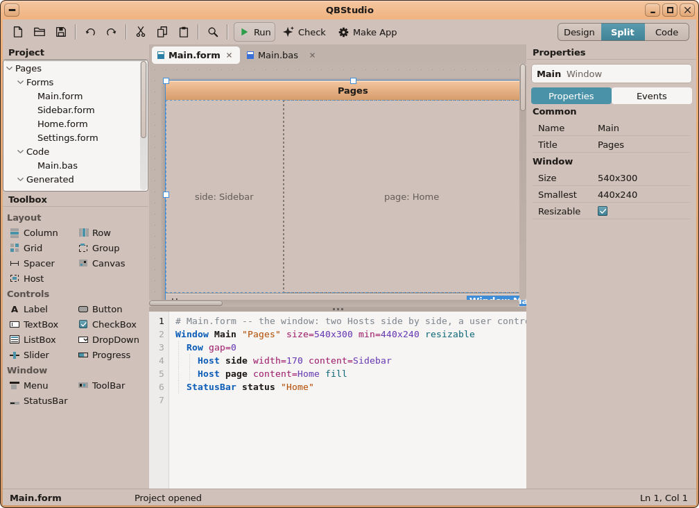
*The project Pages: the window's two Hosts, `side` (170 pixels: the user control Sidebar) and `page` (the rest:
Home, then Settings by code); each user control is a form of the project.*

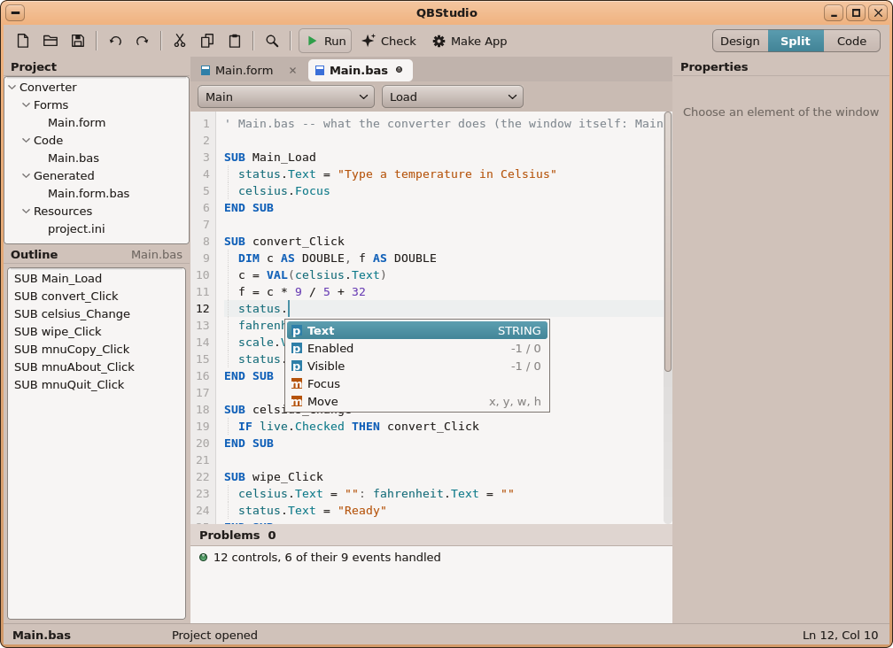
*The code: the controls as objects, the completion after `status.` (its properties and methods), the outline at the
left, the object and event lists above.*

**The code** (`Main.bas`): the controls are objects — `celsius.Text`, `live.Checked`, `scale.Value`, `Enabled`,
`Visible`, `Count`, and `Focus`, `Move x, y, w, h`, `AddItem s$`, `Clear` —, the window `Main.Width`, `Main.Height`,
`Main.Close`.
An event is a SUB named **`<control>_Click`** (buttons, check boxes, menu items) or **`<control>_Change`** (text
boxes, lists, sliders), and **`Main_Load`**, **`Main_Resize`**, **`Main_Close`**; the **object and event lists**
above the code write them. After a control's name and a dot, **completion** offers its properties and methods
(Enter or Tab takes one); Ctrl+Space offers the names. **The kits too**: after the name of a kit the project imports
(`#import FileKit` in one of its files; UIKit always) and a dot, the list is the kit's functions, each with its
arguments by their names — `text$` a string, `BYREF n` a number the function fills, `ADDRESSOF fn` a SUB it calls —
and what it gives back, and the kit's structures (`DIM e AS FileKit.` ...).

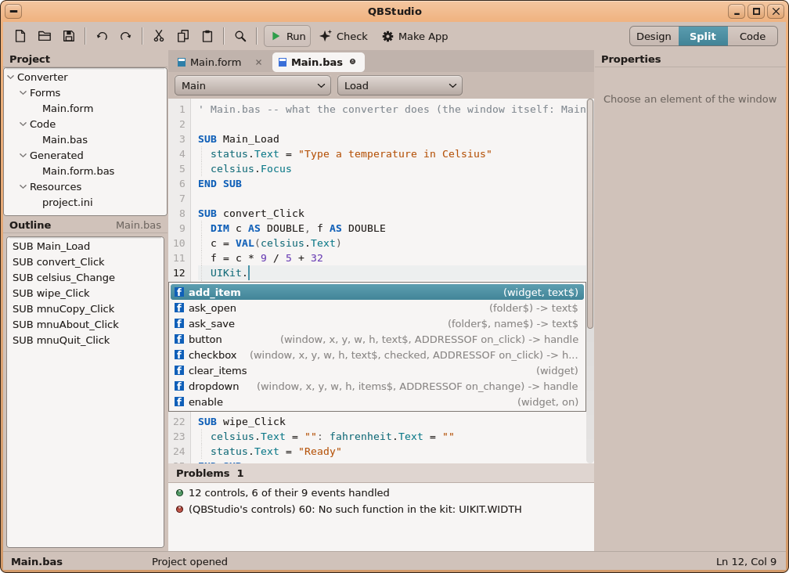
*After `UIKit.`: the kit's functions, their arguments and results.*
 BASIC's words are written in capitals as you type; the
**problems** are found as you type (a red dot in the margin, the line underlined, the list under the code).

**The generated code** (`Main.form.bas`, read-only, under *Generated*): made again at each change of the form —
`DIM SHARED` the controls, `Main_Create` (the window and its controls made with **UIKit**, `#import UIKit`: each
control is one of the system's widgets and calls your SUB), `Main_Layout (w, h)` (each control's place for a
size: the layout's rules made arithmetic), `Main_Sized` (what the window calls when it is resized) and
`Main_Run`, which runs the events until the window is closed; a user control has its `<Name>_Create` and
`<Name>_Layout`, called by the Host that shows it. Plain BASIC: the app runs without QBStudio.
A control's object holds its widget (`convert.handle`): any function of UIKit can be called on it
(`UIKit.set_range scale.handle, 0, 500`). Apps made before (their `.bax`, their standalone program) run as
they did; opened and run again in QBStudio, a project is made with UIKit.

**Run** (F5) saves, puts the program together — the controls' library, the window's code, your files, then
`Main_Run` — and starts it with `SD:/bin/basic`; an error, when it is compiled or while it runs, is shown in its
file at its line. **Make App** writes `SD:/apps/<name>.app/`: `main.bax` (compiled; Project ▸ Settings...: or
`main.bas`), `app.txt` (its title, its category) and `icon.bmp` (the project's `icon.bmp`, else BASIC's) — the
app is listed, launched and packaged like any other. Help: `SD:/apps/qbstudio.app/help.txt` (Help ▸ QBStudio Help).
Not yet: the debugger (breakpoints, stepping, the variables), several windows in a project, a Timer.

### Turtle Quest, learning to program with a turtle (`turtle`)

**Turtle Quest** (category *Games*) teaches programming the way Logo did, as a game: in each level the player
writes a short program that guides a **turtle** across a board — to its **flag**, picking up the **coins**,
fetching a **key** for a **door**, painting the marked **tiles**, or drawing a **figure**. The language is Onyx
BASIC itself (the same as QBasic's, `/bin/basic`'s and QBStudio's), with the turtle's words added; `FOR`, `IF`,
`WHILE`, `SUB`, variables, `PRINT` work as everywhere else.

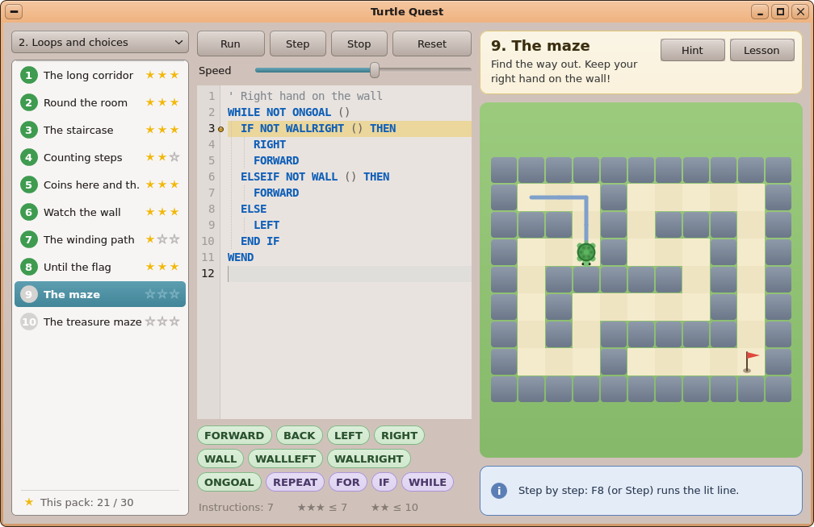
*The maze (pack 2), run step by step: the line being run is lit, the turtle on its way — the program follows the
wall on its right.*

**The window.** On the left, the **pack** of levels (a drop-down) and its levels, with the stars won. In the
middle, the program: **Run** (F5), **Step** (F8: one statement at a time — the line about to run is lit in
yellow, the turtle does what it says; Run then goes on at full speed), **Stop** (F7, or Esc), **Reset** (F9: the
turtle back at its start), the **speed** (the slider: from slow to instant); under the program, the **words
the level knows** — a click writes one at the caret (the purple ones, `REPEAT`, `FOR`, `IF`, `WHILE`, `SUB`,
write a whole block) and pointing at one says what it does; and the **instruction count** with what three and
two stars ask. On the right: the level's card (its title, what to do; **Hint** — F2 — shows a clue, **Lesson**
— F1 — the card of the level's idea, shown by itself the first time a new idea comes), the board, and the
message bar.

**The turtle's words** (the French names in brackets, when Language ▸ Français is chosen — the English words
keep working):

| Word | What it does |
|---|---|
| `FORWARD [n]` (`AVANCE`, `AV`) / `BACK [n]` (`RECULE`, `RE`) | moves n squares ahead / back (1 without n; any number in a drawing). |
| `LEFT [degrees]` (`GAUCHE`, `TG`) / `RIGHT [degrees]` (`DROITE`, `TD`) | turns on the spot (90 without a number). |
| `PENUP` (`LEVECRAYON`, `LC`) / `PENDOWN` (`BAISSECRAYON`, `BC`), `COLOR n` (`COULEUR`) | the pen: the turtle draws where it walks while it is down (at the start); its colour, 0 to 15. |
| `PICK` (`RAMASSE`) | picks the coin or the key under the turtle. |
| `WALL ()` (`MUR`), `WALLLEFT ()` (`MURGAUCHE`), `WALLRIGHT ()` (`MURDROITE`) | true when a wall (or a locked door) is ahead / on the left / on the right. |
| `FRONT ()` (`DEVANT`) | what is ahead: 0 free, 1 a wall, 2 something to pick, 3 the goal, 4 a door. |
| `ONGOAL ()` (`SURBUT`), `ITEM ()` (`OBJET`), `KEYS ()` (`CLES`), `HEADING ()` (`CAP`) | on the flag? something to pick here? the keys carried; the heading in degrees (0 north, 90 east). |
| `REPEAT n` ... `END REPEAT` (`REPETE` ... `FIN REPETE`) | the lines between, n times. |

In French, BASIC's own words have their names too: `SI` / `ALORS` / `SINON` / `SINONSI` / `FIN SI`, `POUR` /
`JUSQUA` / `SUIVANT`, `TANTQUE` / `FINTANTQUE`, `FAIRE` / `BOUCLE` / `JUSQUE`, `PROCEDURE` / `FIN PROCEDURE`,
`APPELLE`, `ET`, `OU`, `NON`, `AFFICHE`, `SORTIR`. (The parentheses of a sensor may be left out: `WALL`.)

**Winning and the stars.** A level is won when the program **ends** with the turtle on the flag (if the level
has one), every coin picked and every marked tile painted — and, in a drawing level, the grey figure drawn (in
any order, any colour; nothing more). The stars count the **instructions** (each statement; the ends of the
blocks — `END REPEAT`, `NEXT`, `END IF`, `WEND`... — and the comments do not count): one star for a win, two and
three when the program is as short as the level asks — a loop beats lines copied again and again. The best stars
of each level are kept, per player. **Errors** are said simply, at their line, which is marked in the program:
*"Line 4: Bump! The turtle hit a wall."*, *"The door is locked: the turtle needs a key."*, *"There is nothing to
pick up here."*, *"This level does not know LEFT yet."*, a syntax error (*"I do not understand line 3."*), and a
program that never ends is stopped (*"The turtle is tired..."*). `PRINT` shows its text in the message bar.

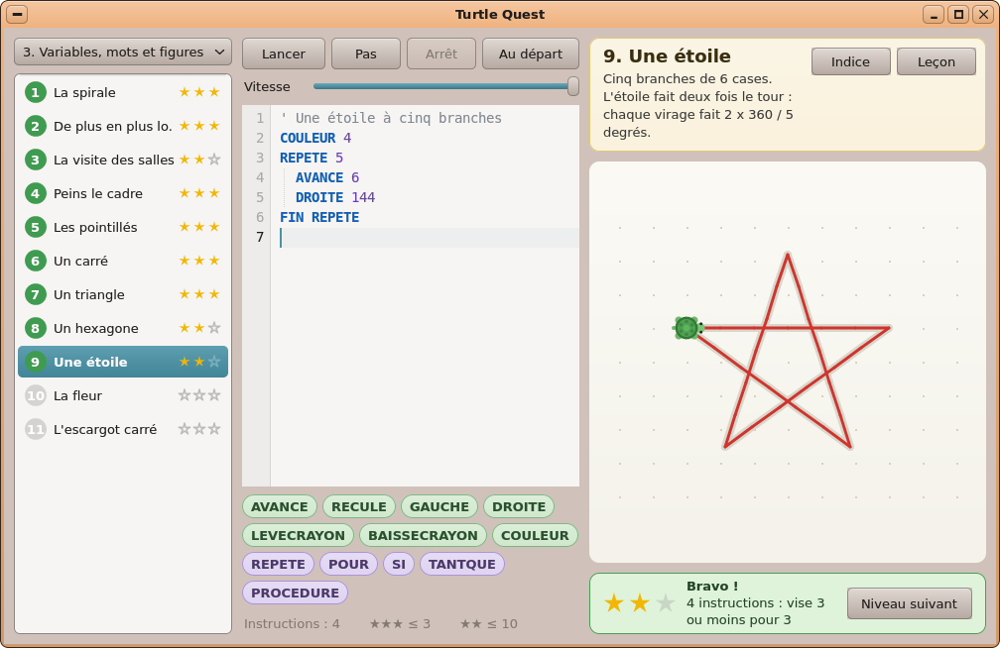
*In French: a star drawn — two stars only, the program has one instruction too many for the level.*

**The levels.** Three packs come with the game (27 levels): **1. First steps** (moving, turning, picking up,
keys and doors), **2. Loops and choices** (`REPEAT`, `FOR`, `IF`, the sensors, `WHILE`, mazes), **3. Variables,
words and figures** (variables, `SUB`, the pen, the figures: square, triangle, hexagon, star, flower, spirals). All
levels are open; a level's lesson card comes the first time its idea appears.

**The level editor** (Levels ▸ Edit This Level, **Ctrl+E**, or Levels ▸ New Level): the left column becomes the
level's fields — title, what to do, hint (in the language chosen), the words it knows (empty: all), the idea it
teaches, the instructions for three and two stars, **Drawing** (the solution's figure is the one to draw) and the
size (W− W+ H− H+) — and a palette of **tools**: wall, floor, flag, key, coin, door, tile to paint, turtle (a
click on the turtle turns it), water (outside the board). Click or drag on the board to draw; the program pane
holds the level's **solution**: **Test** runs it (a win sets the stars' counts from it), **Save** writes the level
into **`SD:/docs/turtle/my-levels.turtle`** (the pack *My levels*; a level of the built-in packs is saved there
as a copy), **Close** goes back to playing.

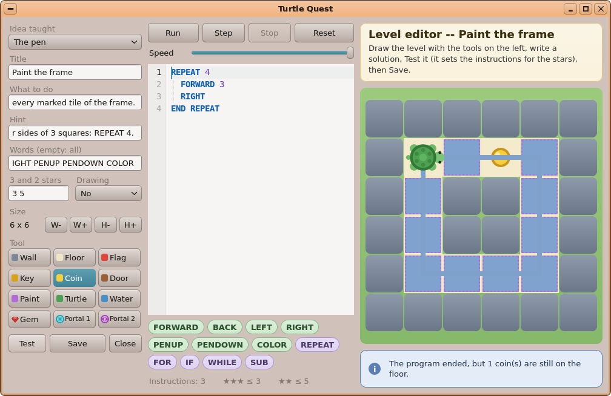
*The level editor: a coin added to "Paint the frame", the solution tested — it no longer wins.*

**Menus.** *Game*: Run, Step, Stop, Reset, Next / Previous Level (**Ctrl+N** / **Ctrl+P**), Lesson, Hint, Quit
(**Ctrl+Q**). *Levels*: Open Level Pack... (**Ctrl+O**), Edit This Level, New Level. *Language*: English,
Français (the words, the texts, the lessons). *Player*: the players (up to eight; each has its stars, its programs
and the lessons seen), New Player..., About.

**Files.** Reads the packs `SD:/apps/turtle.app/levels/*.turtle`, `SD:/docs/turtle/my-levels.turtle` and any
`.turtle` file opened (Levels ▸ Open, dropped on the window, or a double click in the File Viewer: the package
associates `.turtle` with the game). Writes **`SD:/apps/turtle.app/progress.ini`** (the players, their stars,
their last program of each level, the lessons seen, the language, the pack and level last played, the speed) and,
from the editor, `SD:/docs/turtle/my-levels.turtle`. A pack is a text file: `[pack]` (`title`, `title.fr`) and
one `[level]` section a level — `id`, `title`, `text`, `hint` (and their `.fr`), `concept`, `words`, `par` (the
counts for three and two stars), `draw`, `map`, `start` (the program given), `solution`; a value on several lines
is given by the lines after it, each starting with `|`. The map's characters: `#` wall, `.` floor, `*` flag, `k`
key, `c` coin, `D` door, `p` tile to paint, `^ > v <` the turtle and its heading, a space: water.

## 14. Troubleshooting

- **Nothing on screen / it freezes at boot.** Check that **all** the files from `sdcard/`
  are at the root of a **FAT32** card, that `config.txt` correctly targets `[pi4]` and that
  `kernel8-rpi4.img` is present. Connect the **serial** (115200) to read the log.
- **Black screen after launching an app, with green text.** The app exited (or
  faulted): the **debug console** took over and shows the log. Note the message; in case of
  a fault, the `ELR` address helps locate the problem
  (cf. [developer guide](03-DEVELOPER-GUIDE.md#12-debugging-on-hardware)).
- **Keyboard in the wrong layout.** Use `keyb XX`, or the Control Panel's **Keyboard & Mouse**
  applet (it also keeps it in `SD:/etc/autostart`).
- **Wrong resolution.** Adjust `width=`/`height=` in `cmdline.txt`.
- **An app stops responding / the desktop freezes.** Connect with the remote shell
  (`python tools/onyx-telnet.py <pi-ip>`) and run `kmsg`: the GUI watchdog logs
  `compositor STALLED` (with every task's state) or `app '<title>' NOT PUMPING events`,
  and the `heartbeat` line shows whether frames and input still flow. Kill a frozen app
  with `ps` + `kill <pid>` (or `taskman`); otherwise, restart.
- **No mouse/keyboard.** Check that they are standard **USB HID** devices and that they
  are plugged in at startup (hot-plug is handled, but the initial connection is the most
  reliable).
