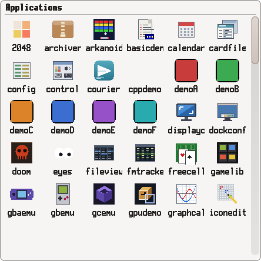
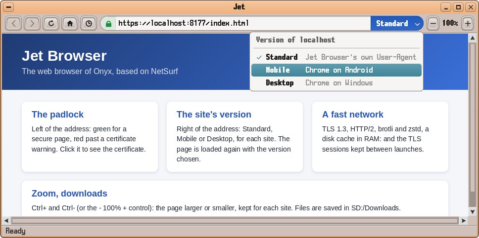
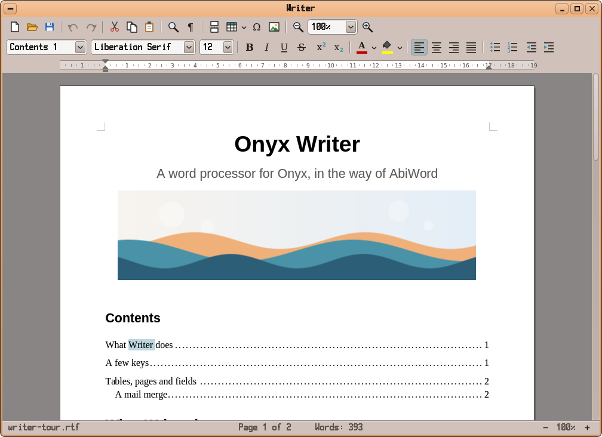
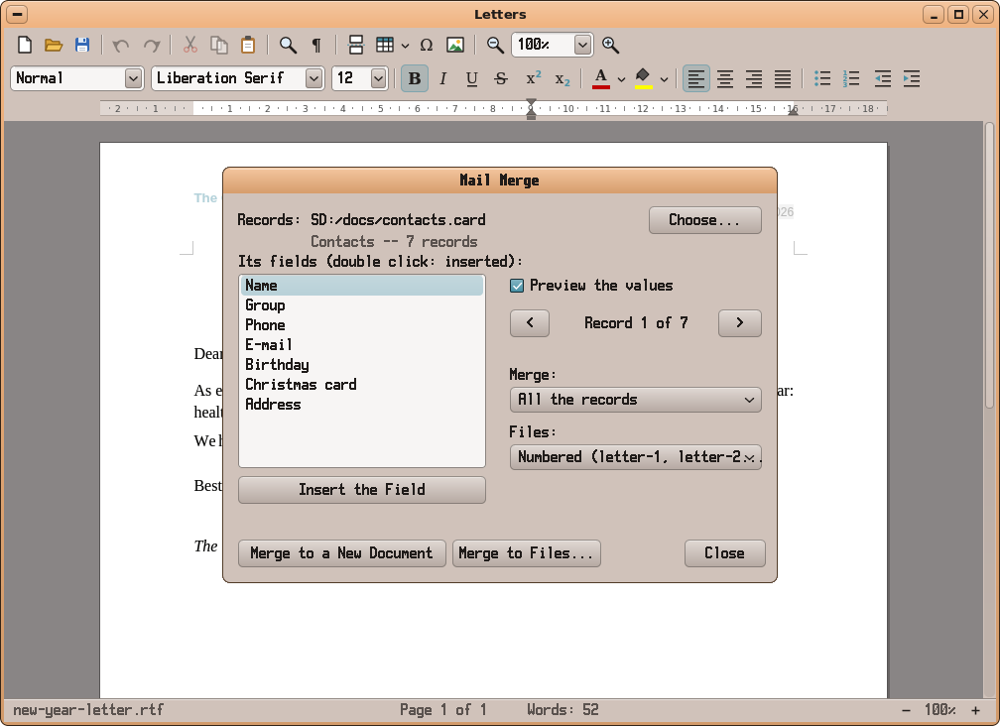

# Onyx — User Guide

This guide explains how to **prepare**, **boot** and **use** Onyx: the desktop,
the terminal, the file manager, the command-line tools, customization, and the
application catalog.

## Contents

1. [What you need](#1-what-you-need)
2. [Preparing the SD card](#2-preparing-the-sd-card)
3. [Boot configuration](#3-boot-configuration)
4. [First boot](#4-first-boot)
5. [The Onyx desktop](#5-the-onyx-desktop)
6. [Working with windows](#6-working-with-windows)
7. [The terminal and the shell](#7-the-terminal-and-the-shell)
8. [The `/bin` tools](#8-the-bin-tools)
9. [The file manager](#9-the-file-manager)
10. [Keyboard and layouts](#10-keyboard-and-layouts)
11. [The Control Panel and the appearance](#11-the-control-panel-and-the-appearance)
12. [Application catalog](#12-application-catalog)
13. [Programming in BASIC](#13-programming-in-basic)
14. [Troubleshooting](#14-troubleshooting)

---

## 1. What you need

- A **Raspberry Pi 4**.
- A **microSD card** formatted as **FAT32**.
- An **HDMI display** (micro-HDMI on the Pi 4 side).
- A **USB keyboard** and a **USB mouse** (standard HID).
- *(Optional)* a **serial adapter** on GPIO14 (TXD) / GPIO15 (RXD), **115200 8N1**,
  3.3 V, to view the boot log and error messages.

## 2. Preparing the SD card

Copy **all the contents** of the [`sdcard/`](../sdcard/) folder to the **root** of a
FAT32 card, then insert it into the Pi 4 and power on.

**More partitions (optional).** The Pi 4 starts only from the card's **first partition**, which
must stay **FAT32**: in Onyx it is **`SD:`** (also `SD0:`). Partitions **2, 3, 4** of the card
(MBR), when formatted **FAT32** or **exFAT**, appear as **`SD1:`**, **`SD2:`**, **`SD3:`** — e.g.
a small FAT32 boot partition and a big **exFAT** one for your ROMs and disc images (exFAT has no
4 GB file limit). A FAT32 volume can be up to 2 TB (Windows' own formatter stops at 32 GB, other
tools do not); a file on FAT32 is at most 4 GB − 1. They show in the file dialogs (**..** at a
volume's root lists the volumes), in the File Viewer (**Go** menu) and in any path
(`cd SD1:/roms`); a path starting with `/` stays on the current volume.

**`RAM:` — a volume in memory.** Besides the card, Onyx has **`RAM:`**: folders and files kept in
the Pi's memory (128 MB at most by default, less on a 1 GB Pi; `system.ini`'s `ramfs=`, §3). It is
fast, never wears or slows the card, and **everything on it is lost when the Pi restarts** (or is
switched off) — it is for what can be lost: Jet Browser keeps its caches there (§12, *Jet
Browser*). Use it like any volume in the terminal (`ls RAM:`, `cd RAM:/jet`, `cp`, `rm`, `mkdir`,
`cat`, `> RAM:/notes.txt`) and in any path; `df` shows how full it is. A file moved between `RAM:`
and the card is copied (`cp`), not renamed (`mv` stays within one volume).

Card contents:

| Item | Role |
|---|---|
| `start4.elf`, `fixup4.dat`, `bcm2711-rpi-4-b.dtb`, `bcm2711-rpi-400.dtb`, `armstub8-rpi4.bin` | GPU firmware + device trees (Pi 4 B, Pi 400) + Pi 4 ARM stub |
| `firmware/brcmfmac4345{5,6}-sdio.*` | Wi-Fi chip firmware: `43455` = Pi 4 B, `43456` = **Pi 400** (the Pi 400 has a different Wi-Fi chip, CYW43456) |
| `config.txt`, `cmdline.txt` | boot configuration (see §3) |
| `kernel8-rpi4.img` | **the Onyx kernel** |
| `apps/<name>.app/main` | the **applications** (one per `.app` folder) |
| `etc/autostart` | commands run automatically at boot (read by `init`) |
| `etc/quicklaunch.txt` | apps pinned to the panel |
| `bin/<tool>` | the terminal **command-line tools** |
| `etc/theme.txt` | the desktop's colours (the Theme app) |

To regenerate the contents from sources: `cd kernel && make stage` (see the
[developer guide](03-DEVELOPER-GUIDE.md)).

## 3. Boot configuration

### `config.txt`

Selects 64-bit mode and the kernel image for the Pi 4:

```
arm_64bit=1
kernel_address=0x80000
initial_turbo=0
enable_uart=1          # reliable serial console + removes the rainbow splash
disable_splash=1
[pi4]
armstub=armstub8-rpi4.bin
kernel=kernel8-rpi4.img
max_framebuffers=2
```

### `cmdline.txt`

Parameters read at boot:

```
width=1920 height=1080 init=SD:/bin/init heartbeat=0 sdhs=1 netcore=1
```

- **`width` / `height`**: framebuffer resolution (default 1024×768; the card ships 1920×1080). Any
  size works (the firmware scales it to the monitor's mode); the monitor's native one is sharpest.
  An app's window can be as big as the screen. The Control Panel's **Display** applet changes it
  at once, and writes these two options for the next start.
- **`init`**: absolute path of the init program the kernel launches at boot
  (default `SD:bin/init`). init reads `SD:/etc/autostart` and starts the rest
  of the userland, so pointing `init=` at another ELF (e.g. a recovery shell)
  swaps the whole launcher without rebuilding the kernel.
- **`heartbeat`**: period in seconds of the kernel's GUI **heartbeat** line in the
  kernel log (default `5`; `0` = off). Read it with `kmsg` — e.g. remotely over `telnetd`.
  It shows uptime, frames per second, mouse/key events, tasks by state and every window
  with its queued (`q`) / dropped (`d`) events. The same GUI watchdog always warns when the
  compositor stops producing frames (and lists every task's state) and when an app stops
  pumping its window's events (a frozen app).
- **`watchdog`**: `watchdog=0` does not start the GUI watchdog at all (A/B testing).
- **`sdhs`**: the SD card runs in **High Speed** (50 MHz instead of 25: about 16 MB/s read
  with `fsbench` instead of ~10) — the default (`sdhs=1`). If a card misbehaves with it (boot
  errors, files that do not read back), set `sdhs=0`. `kmsg` says what is in use (`SD card
  mounted`).
- **`sdcache`**: `sdcache=0` turns off the **sector cache** (on by default: the FAT and the
  folders stay in memory, so opening files and listing folders no longer asks the card for
  every sector; writes still go to the card at once). For comparisons with `fsbench`.
- **`dispdma`**: `dispdma=0` makes the compositor's copies to the screen synchronous again (the
  2D DMA started then polled, docs/05 §12, off) — to tell a display problem from another one.
- **The date of the files**: the Pi has no clock of its own; Onyx keeps the last time it knew in
  `SD:/etc/clock` (every 10 minutes and at shutdown) and starts from it at boot, until the
  network time (NTP) corrects it — so the files written early at boot get a date too.
- **`hangreboot`**: the **hang watchdog**, in seconds (default `15`, `0` = off): if Onyx freezes
  (the green LED stops blinking), core 1 notices it after 10 s, writes a report into the
  sectors of `SD:/etc/crashdump.txt` (prepared at boot) and restarts the Pi (the hardware watchdog
  does it after that time if even that fails — the green LED then blinks fast for 3 s, then stays
  lit 3 s if the report was written, or blinks slowly 3 times if not); the next boot keeps what it was doing (the last kernel log lines, where the processor was stuck, what the
  GPU and the display were doing, the free memory, a panic's registers and the addresses on its
  stack) to **`SD:/etc/lastcrash.txt`**. A kernel panic (an "Out of memory", a failed assertion)
  now writes that report at once too. An **app that stops answering** (its window no longer takes
  the mouse and the keys for 2 s) gets its own report, rewritten every 2 s into
  `SD:/etc/apphang.txt` (where the app is stuck, the memory, the last log lines); it becomes
  `SD:/etc/lasthang.txt` when the app answers again or is closed, and joins
  `SD:/etc/lastcrash.txt` if the Pi restarts meanwhile. Send those files along with a freeze
  report.
- **`gpudirect`**: `gpudirect=0`: the GPU renders into its own buffer, then copied, instead of
  writing the window's (or the full screen's) pixels itself — the same kind of test.
- **`slice`**: the app time slice, in 10 ms ticks (default `2` = 20 ms).
- **`hogsched`**: `hogsched=0` turns off the CPU-hog detection (apps preempted twice in a
  row lose priority — see `docs/02`); the scheduler is then plain round-robin
  (A/B testing).
- **`netcore`**: `netcore=1` runs the whole **network** (Wi-Fi, wpa_supplicant, TCP/IP, DNS,
  NTP) on **core 3**: the desktop and the network no longer slow each other down, and core 0
  can rest when nothing happens. Core 3 is then no longer an app core: one emulator (or Doom)
  at a time gets a core of its own (core 2), the next one runs on core 0 as before. `kmsg`
  says `cores 1-3 started (core 1: sound, core 3: network)`. `netcore=0` (or no `netcore=`)
  keeps the network on core 0, as before — the way back if the Wi-Fi misbehaves with it.

**Without a screen**, the green **ACT LED** shows the state: slow blink (1 s) = kernel
running, network not up yet; fast blink (0.2 s) = network up (`telnetd` reachable);
**SOS** (· · · — — — · · ·) = kernel panic (an exception; with a screen, the red panic page
shows EC/ELR/FAR); LED frozen on or off = the kernel hangs. `config.txt` sets `hdmi_force_hotplug=1` so a
headless Pi still gets a framebuffer (without it, Onyx would start neither the GUI nor
the userland, `telnetd` included).

### `system.ini`

General settings read at boot (`SD:system.ini`):

```
verbose=0          # 1 = log app start/stop/kill to the kernel log (see kmsg)
timezone=120       # minutes offset from UTC (60 = CET, 120 = CEST summer time)
ntp=pool.ntp.org   # time server to sync against once the WLAN link is up ("off": none)
hostname=onyx      # the name the Pi gives the network (DHCP); default "raspberrypi"
ramfs=128          # the size of RAM:, the volume in memory (§2): MB, or "10%" of the free
                   # memory; "0" = no RAM:. No line: 128 MB, at most a quarter of the free memory
```

`ramfs=` is read at boot (restart to apply it). The memory is taken only as files are written to
`RAM:`, and given back when they are removed; some memory is always left to the applications (a
write to `RAM:` fails rather than take it).

Setup, the first-run wizard (§4), writes `timezone`, `ntp` and `hostname`; `verbose on|off`
changes only its own line.

### Wi-Fi (WLAN)

Onyx connects over the Pi's on-board Wi-Fi. Two files must be on the SD card:

- **`SD:/firmware/`** — the BCM/Cypress WLAN firmware. For the Pi 4 (CYW43455):
  `brcmfmac43455-sdio.bin`, `.txt` and `.clm_blob` (fetch them with
  `circle/addon/wlan/firmware/Makefile`, or copy them from a Raspberry Pi OS install).
- **`SD:/etc/wpa_supplicant.conf`** — your network credentials (⚠️ stored in **clear
  text** — keep it on the card, do not publish it):

  ```
  #country=BE
  network={
      ssid="YourNetwork"
      psk="YourPassword"
      proto=WPA2
      key_mgmt=WPA-PSK
  }
  ```

The link comes up a few seconds after boot (watch the log, or run `net`). It is fully
optional: if the firmware/credentials are missing, the desktop still works — only the
networked apps stay offline.

You don't have to edit the file by hand: the **Wi-Fi Settings** app (`wpaconf`, see §12)
edits SSID / password / country / proto / key&nbsp;mgmt in a small form and rewrites
`wpa_supplicant.conf` for you. The kernel only reads it at boot, so use its **Save &
Reboot** button to apply the new credentials.

## 4. First boot

On power-on:

1. The firmware loads `kernel8-rpi4.img`.
2. The kernel initializes the display, the SD card and USB, then briefly shows a boot
   log.
3. The kernel launches the **init program** (`SD:bin/init` by default, or whatever
   `init=` in `cmdline.txt` points at), which runs each line of `SD:/etc/autostart` as
   a shell command. By default:
   - **`run voronoy`** paints the **wallpaper** (Voronoi pattern) and then exits;
   - **`run setup`** — on a new card only — starts **Setup**, the first-run wizard (below);
   - **`run menubar`** starts the **menu bar**, **`run dock`** the **dock**, **`run agenda`**
     the **agenda widget**, **`run notifyd`** the notifications;
   - **`keyb FR`** sets the keyboard layout.

### Setup, the first-run wizard

On a new card Onyx starts with **Setup** alone over the wallpaper: the menu bar, the dock and the
agenda are held back until it is done (their autostart lines read `#setup: run menubar`...). Its
window stays in the middle of the screen — it cannot be moved, and it is centred again when the
resolution changes. The steps are on the left (a green tick once done); **Back** and **Continue**
at the bottom; everything can be changed later in the Control Panel.

1. **Welcome.**
2. **Region & keyboard.** The **country** (type its first letter, or the arrows) proposes the
   keyboard layout and the time zone and gives the Wi-Fi its country code (the radio's channels:
   `country=` of `SD:/etc/wpa_supplicant.conf`). The **layout** is taken at once (type in *Try it*;
   the small keyboard shows its keys); the **time zone** too — its summer time from the date
   (the European and the North American rules) —; **Set the clock from the Internet** (NTP).
3. **Wi-Fi.** The networks around, the strongest first, with their signal, security and a lock;
   the one you are on marked *Connected*, one saved before *Saved*. Click one: its password
   (8 to 63 characters; empty for a saved one), **Connect** (Enter) — a spinner while it joins,
   then *You are online* and the address; *Could not connect: check the password* after 30 s.
   **Rescan**; **Other network (hidden name)...**: its name and password typed. **Skip for now**:
   the Wi-Fi icon of the menu bar joins one later. Written as the Wi-Fi menu does.
4. **Display.** The sizes; **Best** marks the monitor's own (asked of it: its EDID), *now* the
   screen's. **Try it** changes the resolution at once and asks **Keep this resolution?** —
   **Keep** writes it to `SD:/cmdline.txt` (Onyx starts at that size from then on), **Revert** or
   15 seconds without an answer goes back (a picture that does not come back fixes itself).
5. **Appearance.** The colour of the window in front (Peach, Steel, Sage, Brick, Slate), the
   wallpaper (generated Voronoi cells or one of the patterns of `SD:/wallpapers`) and its **tint**
   (32: sixteen colours and the same lighter); the preview shows the desktop you will get, and the
   real one — the wallpaper, Setup's own frame — follows a moment after each click
   (`SD:/etc/theme.txt`, `SD:/etc/wallpaper.ini`, as the Theme applet writes them).
6. **Name & privacy.** The **computer's name** on the network (letters, digits, `-`; from the
   next start: `system.ini`'s `hostname=`) and the **remote services** — the remote shell
   (telnet, port 23), the remote desktop (VNC, 5900), the remote windows (Onyx Remote, 3390),
   file sharing (FTP, 21, user `onyx` password `onyx`): only FTP asks for a password, so turn on
   only what you use, on a network you trust.
7. **Ready.** A summary, a **Change** link on each line. **Start Onyx** writes `system.ini`
   (`timezone`, `ntp`, `hostname`) and the autostart — its own `run setup` line and its comments
   removed, the held-back lines given back, the `keyb` line set, each service's line on or
   commented out (`#telnetd`) — starts the menu bar, the dock and the agenda and the services
   turned on (stops those turned off), and ends: it does not come back. To see it again, put
   `run setup` back in the autostart (`run setup` in a terminal works too).


*Setup: the country proposes the layout and the time zone; the layout is taken at once.*


*A network picked: its password, Connect.*


*The monitor's own size marked Best; tried: back by itself after 15 seconds.*


*The colour of the window in front, the wallpaper and its tint, a preview of the desktop.*


*The summary; Start Onyx.*

You then get the desktop — a **modernised CDE** (the look of the classic Unix desktop, redrawn
with rounded corners, soft gradients and the user's framed buttons): the wallpaper, the menu
bar at the top, the **dock** at the bottom, the agenda widget at the top left. (The former
Shelf strip and left panel are no longer started: the dock replaces them; `run shelf` /
`run panel` still bring them back.)


*The desktop: the agenda on the wallpaper, a calculator, a terminal in front (its frame in the
theme's colour, the others grey), the dock with the Internet drawer open, the menu bar.*

## 5. The Onyx desktop

The "Onyx" desktop is made of the **menu bar** (`menubar`: the active app's menus, the Onyx
menu, the time, the sound, the Wi-Fi), the **dock** (`dock`: the apps' drawers, the
**workspaces**, lock / Control Panel / power, the Terminal, the File Viewer, the Trash) and the
**agenda widget** (`agenda`). Everything is drawn in the theme's colours; the settings are in
the **Control Panel** (§11).

### The menu bar (`menubar`)

A system **menu bar** runs across the top of the screen (started by `autostart`), light, in
the theme's face: it shows the **active application's name** (in bold) and **its menus**,
and the time on the right — **click the time** for a **calendar** of the month (the arrows or
the wheel change the month; **Open Calendar** starts the Calendar app) — with the **Wi-Fi
state** just left of it: the usual arcs when
the Pi is connected, a grey barred circle when it is not (checked about once a second, so
a lost or restored connection shows up by itself), and the **volume** left of that (a
speaker: 1–3 waves by the volume, a cross when muted).

- **Click the speaker**: a box with a **slider 0–10** (drag
  it or click it; moving it unmutes) and **Mute**. Kept in `SD:/etc/sound.ini`, applied again at
  boot. The terminal command `volume` does the same. Click elsewhere to close it.
- **Click the Wi-Fi icon**: the **Wi-Fi menu** — the networks around, strongest first (the
  scan takes ~3 s), signal bars, a padlock for the secured ones, *Connected* / *Known*. Click a
  network to join it: a secured one not known yet asks its **password** (Show password; Enter
  or **Connect**). It is joined **without a reboot**: the network is added to
  `SD:/etc/wpa_supplicant.conf` (the known ones are kept; the last one chosen goes first),
  wpa_supplicant reads it again and a new address is asked (DHCP). The menu says *Connected to …*
  and closes, or *Could not connect: check the password* after ~30 s. **Refresh** scans again,
  **Wi-Fi Settings…** opens `wpaconf`; Esc or a click elsewhere closes the menu.


*The volume box, the Wi-Fi menu, the calendar of the month under the time.*

The active application is the frontmost decorated window; clicking the dock or the desktop
does not change it.

- **Click a menu title** to open its drop-down (the open title in the accent colour, the
  drop-down a light rounded panel); slide to another title to switch; click an item to run it
  (or press on a title and release on an item). Click the title again or anywhere else to close
  the menu.
- The first menu, **Onyx**, is always there: Terminal, **Control Panel**, File Viewer, Task
  Manager; then **the apps by category** — Productivity, Internet, Graphics, Games, Demos
  (and any other category an app declares; the `category` of its `app.txt`, "Other"
  without one) — each opening a sub-menu of its apps, by their friendly name (the `name`
  of `app.txt`), where a click launches the app, or brings it to the front if it is already
  running; then **Open Windows** (a sub-menu of the open apps of this workspace: a click brings
  one to the front — minimised ones too); then **Shut Down…** (a dialog:
  **Restart**, **Shut Down** — the SD card is unmounted, then "It is now safe to turn off the
  Raspberry Pi" — or **Cancel**). The list follows the card: an app added meanwhile (QBasic's
  **Make App**) is there the next time the menu opens. Not listed: the desktop's own parts
  (`category = Shell`), the settings (`Settings`: they are the Control Panel's applets) and the
  emulators (`Emulators`: reached through the **Game Library**, which starts the right one for
  a game).
- The next menu (the app's name) always has **Quit** (**Ctrl-Q**), like the close box.
- Items show their **keyboard shortcut** on the right (e.g. `^O` = Ctrl-O); the shortcuts
  work whether the menu is open or not.
- **Clipboard**: one system clipboard shared by all apps — Edit ▸ Cut/Copy/Paste in Writer
  (on the selection), tinypad (Copy All / Paste) and the File Viewer (files and folders).
- **Notifications**: apps (and the system, e.g. "Network — Connected. IP address …") show
  a bubble in the top-right corner, below the bar; it fades in, stays about 4 s and fades
  out; a click dismisses it; several notifications are shown one after the other
  (`notifyd`, started by `autostart`).
- Windows open and are dragged **below** the bar, never under it; they open above the dock.


*The menu bar with tinypad active and its File menu open.*

Applications with menus: **tinypad** (File), **Writer** (File, Edit, View, Insert, Format, Table, Tools),
**Paint** (File, Edit, Image, Layers, View, Colours) and the **File Viewer** (File, Edit) — see §12.

### The dock (`dock`)

The **dock** — CDE's Front Panel, modernised — stands at the bottom of the screen, centred
(started by `autostart`); it stays above the windows, on every workspace, and a maximised window
ends above it. In its middle, the workspaces between the lock / gear (left) and power / clipboard (right) buttons; its other
buttons — the drawers, the launchers, the Trash, in this order — are shared **evenly on the two
sides** (the odd one out at the left): with the five drawers, the Terminal, the File Viewer and
the Trash, four on each side.

- **The drawers** — by default **Productivity**, **Internet**, **Graphics**, **Games** and
  **Demos**: each shows the icon of its group's **main app** (the Text Editor, Jet Browser, Paint,
  the Game Library, the Widget Showcase). **Click the icon** to start that app — or, if it runs,
  to bring it back to the front (a **minimised** one too). **Click the strip** on the dock's top
  edge above it to open the group's **drawer**: its apps with their icons, by name (in columns
  when there are many); click one to start it, or bring it back. Click the strip again, or
  anywhere else, to close the drawer. A **dot** under a launcher says one of its apps has a
  window on this workspace; in the drawer, a dot beside each running app. Files dropped on a
  launcher are opened by its app. (As Xfce's launchers.)
- **Terminal** and **File Viewer** (the launchers after the drawers): a click starts it, or
  brings it back if it runs (dot).
- **The Trash** (right end): drop items on it (from the File Viewer) to move them to the Trash
  (`SD:/.Trash`); **click it to open the Trash in the File Viewer**. A sheet of paper sticks out
  when it holds something.
- **The workspaces** (in the middle): a small square each (4 by default), the current one lit,
  its windows drawn small in it. Click one to show that workspace (see *Workspaces* below).
  Beside them: at the left the **lock** (the screen is locked: `lock` below) over the **gear** (the
  **Control Panel**, §11); at the right the red **power** button (**Shut Down…**) over the
  **clipboard** (its history, a widget at the bottom right of the screen — coming: `docs/clipboard/README.md`).

Rest the pointer on a launcher to see its name. **Right-click the dock**: **Panel Settings…** —
the Control Panel's **Panel** applet, where the drawers (their group and main app: add, remove,
reorder), the launchers after them and the workspaces (how many, their names) are set; kept in
`SD:/etc/dock.ini`. The dock's colour is the theme's.


*The dock: four drawers, the middle (the four workspaces with their windows drawn small, the lock and
the gear at the left, the power button and the clipboard at the right), the Demos drawer, the Terminal, the File Viewer, the Trash — and the
Games drawer open (a dot: an app of it runs).*

### Workspaces (virtual desktops)

The desktop has **workspaces** (4 by default, 1 to 6: the Panel applet): each window belongs to
one, and only the current workspace's windows are shown and handled — listed in **Open
Windows**, brought back by the dock (an app whose window is on another workspace, started from
the dock, opens a new window here). A window opens on the current workspace.

- **Switch**: click a workspace's square in the dock, or **Ctrl+Alt+←** / **Ctrl+Alt+→** (the
  previous / next one). **Ctrl+Alt+Shift+←/→** takes the window in front along.
- **Move a window**: its **window menu** (the title bar's left button) ▸ **Move to** *workspace*,
  or **On All Workspaces** (then shown on every one; **On This Workspace Only** undoes it).
- The menu bar, the dock, the notifications and the desktop's widgets are on every workspace.

**The lock screen** (`lock`, the dock's padlock): the whole screen shows the time, the date and
the darkened wallpaper; a **click or a key** unlocks it — or, if `SD:/etc/lock.ini` sets a PIN
(`pin = 1234`), typing the PIN then **Enter** (Backspace erases; a wrong PIN is said so).

### The panel (`panel`, no longer started)

A **borderless** bar, pinned to an edge of the screen (**right** with the shipped
configuration; configurable via `SD:apps/panel.app/config.ini`, key `position`: 1=left,
2=top, 3=right, 4=bottom). It re-centers itself on its edge. It contains, in order:

- **The "apps" button** (9-square glyph): opens/closes the app list.
- **The quicklaunch**: the pinned icons listed in `SD:/etc/quicklaunch.txt`
  (by default: `terminal`, `fileviewer`, `tinypad`, `tinycalc`). A click **launches** the app (or
  **brings it to the foreground** if it is already open).
- **The taskbar**: the icons of the open apps (not pinned). A click **brings** the
  window to the foreground. System components (the panel itself, the app list, the menu
  bar, the notifications) are never listed: their window is created with `WIN_FLAG_SYSTEM`. An open app carries a small **badge** (triangle).
- **The clock**: updated every minute.

### The app list (`applist`, no longer used)

Clicking the "apps" button opens a **square grid** (6 columns, alphabetical) of **all**
the installed applications (any `SD:apps/<name>.app/` folder, except the shell components — those whose `app.txt`
says `category = Shell`: `panel`, `applist`, `shell`, `menubar`, `notifyd`, `shelf`, `ask`, `agenda`). It opens **right next to the panel**, beside
the "apps" button, on whichever edge the panel sits (its `config.ini` `position`), and
below the menu bar. Click an icon to **launch** the app; the list then closes. Use the
scrollbar (or the wheel) if the grid overflows.


*The app list (square, 6-column grid, opened beside the panel's "apps" button).*

### The Shelf (`shelf`, no longer started)

The former strip along the bottom of the screen: tabs of references to files, folders and apps
(`SD:/etc/shelf.ini`). The dock no longer shows them (its middle holds the workspaces);
`run shelf` brings the strip back.

### The agenda widget (`agenda`)

The **next appointments**, straight on the wallpaper at the top left (started by `autostart`,
under every window) — no card: its text and an etched line are part of the desktop, the ink
chosen from the wallpaper under it (dark and engraved on a light wallpaper, white with a soft
shadow on a dark one). The appointments come from the **calendar** app (`agenda.txt`): today first (a
**Today** mark in the accent colour), then by date. It re-reads them every few seconds, so a
new appointment appears by itself. It also sends the calendar's **reminders** as notifications
when their time comes (`reminders.txt`), the calendar open or not. **Click** an appointment to open the calendar on that day; **drag
the title** to move it (its place is kept in `SD:/apps/agenda.app/config.ini`).


*The agenda widget on a dark wallpaper.*

### Drag & drop and file associations

Files are dragged with the **left button**: press on an item, move a few pixels — a label
follows the cursor. Hold **Ctrl** while dropping to **copy** instead of move (the label
shows a **+**); **Esc** cancels. Drop targets: File Viewer columns and folders (and its
sidebar's places), the dock's launchers (their app opens the files), the Trash, and document
apps (tinypad, Writer, paint, Cardfile open the dropped file; dropped text goes in at the caret).

**`SD:/etc/fileassoc.ini`** says which app opens which file type — one `extension = app`
per line (`txt = tinypad`, `png = imageview`, `docx = writer`, `card = cardfile`, …): opening the file runs
`SD:apps/<app>.app/main <path>`. Used by the File Viewer (double-click) and the dock (files
dropped on a launcher). Folders open in the File Viewer, `.app` bundles and programs run. Files that need
a program to run are in **`SD:/etc/runners.ini`** (`extension = program`): `.bas` / `.bax`
run in the BASIC runtime, `.gb` / `.gbc` in the Game Boy emulator.

### Launching, closing, switching

- **Launch**: from the dock (a drawer's main app or one of its apps, the Terminal, the File
  Viewer), the menu bar's **Onyx** menu, the terminal (`run <name>`) or the file manager.
- **Switch**: click a window; or the dock (a running app's launcher brings it back) or the
  menu bar's **Onyx ▸ Open Windows**; another workspace: the dock's squares, Ctrl+Alt+←/→.
- **Close**: the **×** button of the title bar, **Ctrl-Q**, the window menu's **Close**, or
  the task manager (`taskman`) / `kill`.

## 6. Working with windows

Each window has a **frame** in the theme's colour when it is in front (Peach by default), grey
behind; rounded corners, a light gradient, a thin dark outline (the theme can make it black or
remove it); no shadow. Its **title bar** holds:

- at the left, the **window menu** button (a bar): **Restore** / **Maximise**, **Minimise**,
  **Move to** *another workspace* / **On All Workspaces**, **Close** (Ctrl-Q) — greyed in the
  few apps that draw their whole window themselves (most games, the
  emulators: their other buttons work);
- at the right, **minimise** (a short line): the window disappears — bring it back from the dock
  (its app's launcher or drawer), the menu bar's **Onyx ▸ Open Windows**, or by starting the app
  again;
- **maximise** (a square): the window fills the screen between the menu bar and the dock; the
  button then shows two squares (**restore**: back to its size and place). A **double click**
  on the title bar does the same. For the apps whose content flows to any size — **tinypad**,
  **Writer**, the **RTF Reader**, **QBasic**, the **terminal** and the **Game Library**;
  greyed for the others, whose layout has a fixed size (a game's board, the calculator);
- **close** (×).

- **Move**: drag the **title bar**.
- **Foreground / focus**: click inside a window — it comes to the top and becomes
  *active* (its frame in the theme's colour; the others grey).
- **Borderless** windows (the menu bar, the dock, the agenda, notifications, popups) cannot be
  moved or closed with the mouse: they are managed by the desktop or close themselves.
- **Mouse**: left-click, right-click (depending on the app — e.g. flag in Minesweeper,
  eraser in Paint) and **drag** (paint, move, drag a slider).
## 7. The terminal and the shell

Launch **`terminal`** (pinned to the panel by default). It is a console where you type
commands, executed by **programs in `SD:/bin/`**.


*The terminal: a pipe (`ls /bin | grep e`), `ps`, and `echo zircon | wc -c`.*

### The prompt and the current working directory

- The prompt shows the **current working directory** followed by `$` (e.g. `SD:/ $`). The
  terminal has a **current working directory (cwd)**; **relative** paths given to commands
  are resolved against it.
- Type a command then press **Enter**. **Backspace** deletes the last character;
  **Page Up/Down** scroll through the output history (scrollback, 100 lines).

### Built-in commands (builtins)

Three commands are executed by the terminal **itself** (they change its own state),
not by a program in `/bin`:

| Command | Effect |
|---|---|
| `cd [path]` | changes the current working directory (no argument: `SD:/`). The cwd is **inherited** by commands launched afterwards. |
| `pwd` | prints the current working directory. |
| `clear` | clears the screen (empties the scrollback). |

### Launching a program

Any other command `xxx` is resolved to **`SD:/bin/xxx`** and executed as a
process; its **arguments**, if any, follow the name (`grep pattern`, `cp a b`). A command
that cannot be found prints `xxx: command not found`. To launch a **graphical application**
from the terminal, use `run <name>` (see §8).

### Pipes and redirections

The terminal composes commands in the Unix style:

| Syntax | Effect |
|---|---|
| `a \| b \| c` | **pipe**: the `stdout` of each stage feeds the `stdin` of the next (up to 6 stages). |
| `cmd > file` | redirects the `stdout` of the **last** stage to `file` (created / **overwritten**). |
| `cmd >> file` | same, but **appends** to the end of `file`. |
| `cmd < file` | the input (`stdin`) of the **first** stage comes from `file`. |

**Path resolution.** Redirection files are resolved by the kernel **against the
current working directory**: a relative path (`notes.txt`) targets `<cwd>/notes.txt`, an
absolute path (`SD:/notes.txt`) is taken as-is.

**Default input and output.** Without `<`, the **first** stage reads what you **type**:
each line confirmed with Enter is sent to its `stdin`, and **`Ctrl-D`** signals end of
input (EOF). Without `>`, the **last** stage displays its output in the scrollback.

Examples (with the cwd being `SD:/` here):

```sh
pwd                     # prints: SD:/
cd apps                 # changes the current working directory (-> SD:/apps)
ls                      # list the current working directory
ls /bin | grep e        # keep only the tools whose name contains "e"
cat SD:/notes.txt       # display a file
echo bonjour > a.txt    # write "bonjour" to <cwd>/a.txt
echo encore  >> a.txt   # append a line to a.txt
cat a.txt | wc          # count lines / words / bytes
grep pi < a.txt         # read a.txt, print only the lines containing "pi"
ps                      # list the processes
run mandelbrot          # launch a graphical application
```

**Under the hood.** The terminal splits the line on `|`, creates a memory pipe (`pipe`)
between each stage — and a file stream for `<`/`>` —, then launches (`spawn`) each
`SD:/bin/<cmd>` with its (`stdin`, `stdout`) pair. The stages run **concurrently**
(cooperatively); the terminal continuously drains the final output pipe (non-blocking
read) and displays it, then waits for each process to finish. The details of streams and
the process model are in
[Kernel internals §9](02-KERNEL-INTERNALS.md#9-stream--stdio-subsystem).

## 8. The `/bin` tools

Command-line programs shipped in `SD:/bin/`, executed by the terminal and
**composable** via pipes (§7). The **relative** paths they receive are resolved against
the terminal's **current working directory**.

**Files and directories**

| Tool | Usage | Description |
|---|---|---|
| `ls` | `ls [path]` | Lists a directory (default: the **current working directory**). One entry per line; folders get a trailing `/`. |
| `cat` | `cat [file…]` | Prints the file(s) to `stdout`; **with no argument**, copies `stdin`→`stdout` (useful at the end of a pipe). |
| `cp` | `cp <src> <dst>` | Copies a file (by stream: any size). |
| `mv` | `mv <src> <dst>` | Renames / moves a file or folder (same volume). |
| `rm` | `rm <path…>` | Deletes files (or **empty** folders); accepts multiple paths. |
| `mkdir` | `mkdir <path…>` | Creates one or more directories. |
| `touch` | `touch <path…>` | Creates **empty** files if they do not exist (no timestamp). |
| `df` | `df [volume…]` | The volumes' room: for each (default: `SD:`, `SD1:`…`SD3:` when present, `RAM:`) its type (`FAT32`, `exFAT`, `RAM`), size, used and free space; for `RAM:` (the volume in memory, §2) its files and folders too. The first `df` of a big card can take a moment (its free space is counted once). |

**Archives** (ZIP; the Archiver's engine, §9)

| Tool | Usage | Description |
|---|---|---|
| `zip` | `zip [-r] [-0..-9] [-j] [-k] [-q] [-p FOLDER] <archive> <path…>` | Makes a `.zip`, or adds to one (a name it has is **replaced**; `-k` keeps the old one). `-r` takes the folders with what they hold (without it, only the folder's own entry); `-0` stores, `-1` fastest .. `-9` best (default `-6`; png, jpg, zip... are always stored); `-j` the files alone, no folders; `-p docs/images` puts them in that folder of the archive. A **relative** path is stored as given (`zip -r app.zip myapp/res` → `myapp/res/...`), a path with its **volume** from its last part (`zip -r foo.zip SD:/apps/foo.app` → `foo.app/...`). The archive is written as a new copy, then swapped in. |
| `zip -d` | `zip -d <archive> <name…>` | Deletes entries: a name, a pattern (`*` `?`, quote it: `"*.bak"`) or a folder (everything under it). |
| `unzip` | `unzip [-o\|-n] [-j] [-q] [-d DIR] [-P PASSWORD] <archive> [name…] [-x name…]` | Extracts (default: into the current folder; `-d` another, made if needed), **keeping the archive's folders** (`-j`: all the files side by side). Names: a name, a pattern or a folder; `-x` leaves those out. A file that exists is asked about — `[y]es`, `[n]o`, `[A]ll`, `[N]one`, `[r]ename` (keeps both: `name (2).txt`) —, unless `-o` (replace) or `-n` (never). `-P`: the password of a ZipCrypto archive. |
| `unzip -l / -v / -t / -p` | `unzip -l <archive> [name…]` | `-l` lists (length, date, name), `-v` with the method, the packed size, the ratio and the CRC; `-t` tests (every file decompressed, its CRC checked); `-p` writes the files to the output (`unzip -p a.zip notes.txt \| grep todo`). |

Exit codes (for scripts and packages): `0` all right, `1` a warning (files skipped, nothing to do),
`2` an error (a damaged archive, a file that cannot be written), `3` a bad command line.

All of these work on **`RAM:`** (the volume in memory, §2) as on the card: `ls RAM:`, `cd RAM:/jet`,
`cp SD:/doc.txt RAM:/doc.txt`, `rm RAM:/doc.txt`, `cat RAM:/log`, `echo hi > RAM:/log`.

**Text and streams**

| Tool | Usage | Description |
|---|---|---|
| `echo` | `echo <text>` | Writes its arguments followed by a newline. |
| `grep` | `grep <pattern>` | Reads `stdin`, prints only the lines containing `<pattern>` (substring, **case-sensitive**; only the first word is used as the pattern). |
| `wc` | `wc` | Counts and prints "lines words bytes" of `stdin`. |
| `page` | `page` | Copies `stdin`→`stdout` (the actual paging is the terminal's scrollback via Page Up/Down); handy as the end of a pipe. |

**Processes, launching, keyboard**

| Tool | Usage | Description |
|---|---|---|
| `ps` | `ps` | Lists the processes in columns `PID  K  S  PAGES  MEM  NAME` — `K`: `a` (app) / `k` (kernel); `S`: `R` (ready), `S` (sleeping), `B` (blocked), `N` (new); `PAGES` = 64 KB frames owned by the app, `MEM` = that in KB. |
| `kill` | `kill <pid> [--force\|-f]` | Terminates a process by **PID** (seen with `ps`). By default: **clean** shutdown (the app terminates itself); `--force`/`-f`: **immediate** stop. Kernel tasks and the terminal itself are protected. |
| `run` | `run <app\|path> [args]` | Launches an **application**: `run mandelbrot` = `SD:apps/mandelbrot.app/main`; a name containing `/` is taken as an explicit **ELF path**; the following arguments are passed as `argv` (e.g. `run tinypad SD:/notes.txt`). |
| `keyb` | `keyb [XX]` | With no argument: shows the current layout + the list. `keyb FR`: switches to the layout (US, UK, DE, FR, BE, ES, IT, DV). |

**Networking and logs**

| Tool | Usage | Description |
|---|---|---|
| `net` | `net` | Shows the WLAN link status and the IPv4 address (or "link down" if Wi-Fi has not associated — check the firmware and `wpa_supplicant.conf`). |
| `ping` | `ping <host> [count]` | Sends ICMP echo requests (default 4, one per second, 2 s timeout) to a name or an IP and prints each round-trip time, then the loss and min / avg / max statistics. (Onyx itself also answers pings.) |
| `basic` | `basic [-d dir] <prog.bas> [args]` | The Onyx BASIC runtime (see §13): runs a program in the console or in its window; `-d` sets the current folder (default: the program's). A `.bas` path given to `run` or the shell runs through it. |
| `shutdown` | `shutdown`, `shutdown -r` | Ends the session like the Onyx menu's **Shut Down…**: unmounts the SD card (every pending write flushed), then halts — safe to switch the Raspberry Pi off once the green LED is dark; `-r` restarts instead. Works over telnet (the connection drops). |
| `reboot` | `reboot` | Restarts Onyx (= `shutdown -r`): unmounts the SD card, then restarts the Raspberry Pi. |
| `fsbench` | `fsbench [big-file]` | Measures the SD card: reading a big file (default `SD:/doom/freedoom1.wad`, MB/s), opening every app's `app.txt` twice (the second time from the sector cache), listing `SD:/apps` twice, writing + reading back a 4 MB file (`SD:/fsbench.tmp`, removed after; its content is checked). Compare with `sdhs=1` / `sdcache=0` in `cmdline.txt`. |
| `ramtest` | `ramtest`, `ramtest full` | Self-test of **`RAM:`**, the volume in memory (§2): folders (nested, names in any case), files saved whole and read back (whole, in pieces, after a seek), streams written and appended, a listing, a rename, the current folder there, a file removed while open, a 16 MB file (its write and read times), and at the end the memory given back (`df`'s numbers as before; run it while Jet Browser is closed for that last check). `ramtest full` also fills the volume: the file that does not fit must not be left half-written. Works in `RAM:/ramtest` (removed after). One line per check, then `ALL PASS`. |
| `coretest` | `coretest`, `coretest exit` | Tests the **app cores** (cores 2 and 3, which an app can take for itself): the same computation on an app core and on the main core (their times), a job stopped cleanly, an endless job stopped by releasing the core, a job that crashes (reported in `kmsg`, the system stays up), both app cores at once. `coretest exit` leaves a job running and quits: Onyx must stop it by itself. |
| `tone` | `tone [Hz [ms [wave]]]`, `tone scale` | Plays a note on the audio output (the 3.5 mm jack) — default 440 Hz, 500 ms, sine; wave `square`, `sine`, `triangle`, `saw`, `noise`; `scale` plays a C major scale. Tests the sound system. |
| `v3dprog` | `v3dprog` | Checks the **programmable GPU** (kapi v61): draws small frames with shaders generated at run time — a colour from the uniforms, varyings (two halves, a gradient, 12-float vertices), a texture, the scissor, blending, the colour write mask, the depth test, the near-plane clipping, 64 batches — then the GameCube's **TEV** as generated shaders (a MODULATE material and 8 random configurations of 1 to 16 stages and up to 8 texture lookups, checked against the CPU's reference) — and compares the pixels with the expected ones. One `PASS` / `FAIL` line a test (a failure shows the first wrong pixel and its expected colour), then `ALL PASS: n/n` and the time. Reads and writes no file. |
| `gpcdemo` | `gpcdemo [cpu]`, `gpcdemo bench [w h [frames]]`, `gpcdemo test [w h]` | The **GPU compositing service** (`user/gpucomp`, kapi v70) shown, timed and checked. Without arguments: a 960 × 540 window where a web page (1920 × 2600) scrolls smoothly under a rotating picture, a translucent card that sways and fades, a banner and a clipped zoom — the layers assembled by the GPU straight into the window (`cpu`: by the processor); a line a second on the terminal (`GPU  3.10 ms a composite, 60 frames/s`); close the window to stop. `bench`: the same scene at 1920 × 1080 (60 frames): the uploads (the four textures, a 256 × 256 rectangle, a 1920 × 64 band), then milliseconds a frame for the page alone and for the five layers, GPU then CPU. `test`: the GPU's pictures against the processor's (640 × 360; several moments of the scene, each layer alone, over the target's pixels, an ARGB target, a rectangle updated across two textures, a composite on a thread): one `PASS` / `FAIL` line each (the largest difference, the pixels off by more than 4), then `ALL PASS: n/n`. Without a GPU it says so and compares the processor with itself. Reads and writes no file. |
| `hangtest` | `hangtest`, `hangtest irq` | **Freezes the Pi on purpose** (core 0 stopped, IRQs masked; `irq`: a loop with them on), to check the crash report: about 10 s later the Pi restarts by itself and `SD:/etc/lastcrash.txt` tells what it was doing. |
| `volume` | `volume`, `volume 0..10`, `volume mute` / `unmute` / `toggle` | The master volume of all the sound (0 silent … 10 full) and mute; without an argument, shows it. Kept in `SD:/etc/sound.ini` (applied at boot); the menu bar's speaker follows. |
| `wifiscan` | `wifiscan` | Lists the Wi-Fi access points around (about 3 s), strongest first: signal (dBm + bars), channel, security (open / WEP / WPA / WPA2), SSID; `*` marks the network the Pi is on. |
| `nslookup` | `nslookup <name>` | Resolves a host name through the DNS server (shown on the first line) and prints its IPv4 address. |
| `netstat` | `netstat` | The network configuration (hostname, IP, mask, gateway, DNS, DHCP) and the open TCP sockets: state (LISTEN / ESTAB), local port, remote address, owning PID. |
| `ftpd` | `ftpd [homedir] [user] [password]` | The FTP server (see *File server* below); again while it runs = add a user. |
| `ftp` | `ftp [host [port]]` | Interactive FTP / FTPS client (`ftp>` prompt): `open [-s] host [port]` (asks user + password; `-s` = FTPS), `user`, `ls` / `dir`, `cd`, `cdup`, `pwd`, `get remote [local]`, `put local [remote]`, `mget` / `mput`, `delete`, `mkdir`, `rmdir`, `rename`, `size`, `lcd` / `lpwd` (the local folder), `close`, `bye`. Works through `ftpfs` (shares its connections and logins with the File Viewer). The password is echoed by the terminal. |
| `ftpfs` | `ftpfs login <host> <user> <password> [save]`, `ftpfs forget <host>` | The FTP / FTPS client behind `FTP:` / `FTPS:` paths (see *FTP / FTPS servers as folders*); starts by itself; `login` registers credentials for a host (`save` = remember them in `SD:/etc/ftpfs.ini`); `forget` removes a remembered login. |
| `whois` | `whois <domain> [server]` | Queries the WHOIS database (TCP port 43): asks `whois.iana.org`, then follows its `refer:` to the registry holding the domain — or asks the given server directly. |
| `wget` | `wget <url>` | Fetches an HTTP URL (`http://host[:port]/path`) and writes the response body to `stdout` — pipe or redirect it (e.g. `wget http://example.com/ > page.html`). Plain HTTP only (no HTTPS). |
| `httpget` | `httpget <url>` | HTTP/1.1 client demo built on the reusable `HttpClient` class (`user/http.hpp`): prints the status line, `Content-Type`, and body. Handles chunked responses. Plain HTTP only (`https://` → "not supported"). |
| `httpsget` | `httpsget <url>` | Same as `httpget` but with **TLS** (`https://`), via mbedTLS (`user/tls/`) — downloads real HTTPS pages. Opt-in build (needs the cross-built mbedTLS — see `user/tls/README.md`). **Not yet secure**: no certificate verification, software (non-HW) RNG. |
| `groq` | `groq <question…>`, `groq -j < messages.json`, `-c <config>` | Asks a large language model through the **Groq** chat API (HTTPS) and prints the answer — the engine behind **Lisa**. Reads `SD:/apps/lisa.app/config.ini` (`key` = your Groq API key, `model`, `role` = the system prompt, `temperature`, `max_tokens`). `-j`: stdin is a JSON array of `{"role","content"}` messages (a whole conversation). Non-ASCII text is converted between Latin-1 and UTF-8. |
| `llm` | `llm [request.json] [-o result.json]` (the request on stdin when no file) | Asks a large language model for ONE answer over HTTPS — the engine behind **Koton**'s "compose with AI". The request is a JSON document: `provider` (`gemini`, `groq`, `mistral`, `claude`, `deepseek`, `grok`, `openai` or `openai-compatible` + `url`), `model`, `key` (your API key), `system`, `user`, `json` (ask for JSON), `temperature`, `thinking` (Gemini's thinking budget, -1 = default); the answer is one line `{"ok":true,"text":"..."}` or `{"ok":false,"error":"..."}`, after progress lines (`llm: connecting…`, `llm: receiving N bytes`). A busy model (503 "high demand", 429…) is asked again up to 4 times, after 5, 10, 20 and 40 s. Also downloads a file: `{"fetch":"https://…","out":"SD:/…"}` → `{"ok":true,"bytes":N}` (Koton fetches its SoundFont this way; redirects followed). Answers of 100+ KB and downloads of tens of MB are fine. **Not secure**: the server's certificate is not verified, and the request (with the key) is plain text if you keep it in a file. |
| `telnetd` | `telnetd [port]` | **Remote text shell** (default port **23**): waits for Wi-Fi, then serves up to **8 clients at once**, each in a thread of its own with its own `cmd` (see §7) — a session stuck on a command does not hold the others up (one at a time on a kernel older than v67). Started at boot by `SD:/etc/autostart`. **No password, no encryption** — trusted LAN only. See *Remote shell* below. |
| `rdpd` | `rdpd [port]` | **Remote windows** (port **3390**): the Onyx windows shown one by one on a Windows PC by `OnyxRemote.exe` (pc/dist). Started at boot by `SD:/etc/autostart`. **No password, no encryption.** See *Remote windows on a PC* below. |
| `vncd` | `vncd [port]` | **Remote desktop** (VNC, default port **5900**): see and drive the Onyx screen from any VNC viewer. Started at boot by `SD:/etc/autostart`. **No password, no encryption** — trusted LAN only. See *Remote desktop* below. |
| `notifytest` | `notifytest [-t <title>] <message>` | Sends a **notification** (bubble under the menu bar) — handy to test `notifyd` from the terminal or telnet, e.g. `notifytest -t Build "Kernel staged"`. The title defaults to "Test". |
| `kmsg` | `kmsg` | Streams the kernel log live (boot messages, app lifecycle when `verbose` is on, network events, `stall:` lines when a task kept the CPU more than 100 ms). **Ctrl-C** to quit. |
| `verbose` | `verbose [on\|off]` | Shows or toggles the kernel's verbose logging (app start/stop/kill); persists the choice to `SD:system.ini`. |
| `heaptest` | `heaptest` | Self-test of the user-space allocator (`umm.h` over `kapi_sbrk`): alloc/verify/free across size classes + realloc. Prints PASS/FAIL and how much heap it mapped. |
| `threadtest` | `threadtest` | Self-test of the **threads** (kernel v67): threads created and joined with their exit codes, a counter shared under a mutex, the allocator used by four threads at once, a manual- and an auto-reset event, a barrier, timeouts, the limit of 32 threads per process, and a worker whose results are posted to the main thread while it waits for events. One line per check, then PASS/FAIL. It quits with a thread still running: the prompt must come back anyway (the threads end with the process). Takes a few seconds. |
| `futextest` | `futextest` | Self-test of the **word waits** (kernel v68: `kapi_wait_word` / `kapi_wake_word`, futex-like) and of the real-time thread priority: immediate returns, a timeout, a thread woken, the same word through two mappings of a shared surface, a word changed by an app core without a wake (seen within ~10 ms), bad addresses. One line per check, then PASS/FAIL. |
| `ringtest` | `ringtest [chunk [ahead]]` (default 256 2) | Self-test of the **low-latency sound** (kernel v68): becomes the sound owner, asks for small chunks, maps the PCM ring and plays 3 s of a 440 Hz triangle written by an app core straight into the ring. Prints the latency, the underruns and PASS/FAIL (`ringtest 128 2`, `ringtest 1024 4` try others). Headphones on. |
| `miditest` | `miditest [seconds]` (default 60) | Prints the **USB MIDI** input (kernel v68): the devices attached, then every event (its time, device, cable, bytes, the note's name). Plug a keyboard in while it runs: it is found within ~0.1 s. Ctrl+C ends it. |
| `fptest` | `fptest` | Self-test of hardware floating point under the scheduler (Leibniz π in `double`, yielding mid-computation). Prints PASS/FAIL. |
| `libctest` | `libctest` | Self-test of the newlib C library on Onyx (`printf`/`malloc`/`qsort`/`fopen`+`fseek`/`sin`/`sqrt`). Prints PASS/FAIL. |
| `imgtest` | `imgtest` | Self-test of the image codecs (zlib + libpng): decodes an embedded PNG and prints its size and top-left pixel. Prints PASS/FAIL. Opt-in build (needs the cross-built codecs — see `user/img/README.md`). |
| `nsfbdemo` | `nsfbdemo` | Demo of the NetSurf framebuffer library (libnsfb) on Onyx: opens a window and draws shapes with libnsfb's plotters, then follows the cursor (a trail of dots) and drops a marker on left-click. `q` / Esc or the close box to quit. Opt-in build (needs the cross-built libnsfb — see `user/nsfb/README.md`). |

### Remote shell (`telnetd`)

`telnetd` (started by `SD:/etc/autostart`) lets you use the Onyx shell from another
computer, in a text terminal. Get the Pi's address with `net`, then connect with:

- **the dedicated client** (only needs Python, Windows or Linux/macOS):
  `python tools/onyx-telnet.py <pi-ip> [port]`;
- or any **telnet client**: `telnet <pi-ip>`, or PuTTY with *Connection type: Telnet*.

Each connection gets its own `cmd`, exactly like the terminal app: same commands,
pipes and redirections, `clear` clears the remote screen. Echo and line editing are done
by the Pi (Backspace works; no history/arrows). **Ctrl-C** is passed to the running
command, **`exit`** or **Ctrl-D** on an empty line ends the session (in
`onyx-telnet.py`, **Ctrl-]** disconnects locally). One client at a time: a second
connection waits until the first ends.

> ⚠️ Not secure: no authentication and no encryption — anyone who can reach port 23
> gets a shell. Remove the `telnetd` line from `SD:/etc/autostart` on an untrusted
> network, or run it by hand (`telnetd 2323`) when needed.

### Remote windows on a PC (`rdpd` + Onyx Remote)

`rdpd` (started by `SD:/etc/autostart`, port **3390**) serves the Onyx windows one by one to
**Onyx Remote** (`OnyxRemote.exe` in `pc/dist/`, .NET Framework 4.8 — already on Windows 10 /
11): **one window** on the PC holding the Onyx session. Type the Pi's address in its tool bar,
**Connect**. Below the tool bar, the **Pi's screen at its size**, pixel for pixel (the Onyx
windows, the dock at the bottom, where they are on the Pi), in a scrolling area: connected, the
window takes that size as far as the PC's screen allows; smaller (or made smaller), **scroll
bars** show the rest; bigger, the Pi's screen sits in its middle, black around it. **Full screen** (the tool
bar's button, or **F11** at any time) takes the whole PC screen without a frame nor the tool bar:
the Onyx menu bar at the top, the Onyx windows pixel for pixel where they are on the Pi — a Pi
screen the size of the PC's (e.g. both 1920 × 1080) fills it exactly (a smaller one sits in the
middle, black around it; a bigger one scrolls). The pointer on the screen's **top edge** shows a
bar there, as Windows' Remote Desktop: the Pi's name, **Pin** (the bar stays), **Minimise**,
**Leave full screen**, **Disconnect**. F11 again (or **Disconnect**) gives the window back;
the choice is kept and applied at the next connection. While the connection is being made
again (see below) the bar stays shown, the Pi's name followed by *(reconnecting...)*.

- At the top of the Pi's screen, the **Onyx menu bar**.
- Each Onyx window is a **child window** of the Pi's screen in Onyx Remote, where it is on the Pi: a
  normal window (its title, its close button) showing the Onyx window's content — or, with
  **Onyx frames**, with the frame drawn by Onyx (its rounded corners; its title buttons: close
  closes the app, the window menu, minimise and maximise are pressed on the Pi). Move it by its
  title bar inside Onyx Remote (the Pi's window stays where it is; moved or maximised on the Pi,
  it follows); its close button (or Alt+F4) closes the Onyx app; clicking a window brings it to
  the front on the Pi too, so it gets the keyboard. The keys are typed with the PC's layout.
  A minimised window, or one on another workspace, is not shown (as on the Pi).
- **Over the windows, see-through as on the Pi**: the menu bar's menus (and its volume box and
  calendar), the **dock** and its drawers, the **notifications**, the Wi-Fi menu — the parts
  of them that are clear on the Pi are clear here too (the windows below show), and a click on a
  clear part goes to what is below.
- **Desktop** shows the Onyx desktop (the wallpaper, the widgets under the windows) behind the
  windows; a click there goes to the desktop. Without it, the pointer's moves still reach the
  Pi (the **eyes** follow it).
- Faster than VNC: only the windows that change are sent, only their changed parts,
  compressed with LZ4; moving or overlapping windows costs nothing. **16-bit colours**
  halves the data (a game in a big window; the see-through windows and the frames stay in 32
  bits). The tool bar's **status** shows, every second: the windows, the **updates a second**
  (the rounds of changes shown), **how the rounds flow** — *3 rounds in flight* (the current
  rdpd) or *lock-step (an older rdpd)* —, the **pings** answered (the Pi's probes after a lost
  packet, and its "still there?" every 2 s when nothing changes), the **damaged messages
  skipped** (if any) and how many times it **reconnected**. It says when the Pi's kernel is too
  old for rdpd (copy the new `kernel8-rpi4.img`). Nothing changing on the Pi, nothing is sent
  (0 updates a second is normal then).
- **Over Wi-Fi (lost packets)**: TCP resends a lost packet, but everything behind it waits until
  it is resent — after up to a second or more when nothing else follows it. Onyx Remote and rdpd
  are built to keep the screen moving anyway: up to **3 rounds of changes in flight** (one lost
  answer no longer freezes the screen); the **pointer's moves** sent at most every 16 ms (the
  latest position; a click, a release, the wheel and every key at once, never dropped) — far
  fewer packets to lose; and when a round goes unanswered for 250 ms, rdpd sends a few small
  **probes** that Onyx Remote answers at once, so that a lost packet on either side is resent
  within a fraction of a second instead of after a timeout. A slow or lossy link still costs
  updates, but no longer stops the screen for seconds. The Pi's TCP itself resends a lost
  packet sooner now (after 200 ms at least, not a second), and the pointer's moves no longer
  make it slow down its sending (they were taken for signs of a lost packet). A send that waits
  more than 5 s for the network no longer ends the session: rdpd sends the rest when it can.
- **The connection lost** (the Wi-Fi dropped, the Pi restarted, nothing heard from it for 12 s,
  a damaged stream), Onyx Remote **reconnects by itself** with the same options (16-bit colours,
  Desktop, Onyx frames): the status (and the window's title) says *Connection lost (why):
  reconnecting in 2 s (attempt 3)...*, waiting 0.5 s, 1 s, 2 s, 4 s, then 8 s between attempts,
  for as long as it takes; the windows stay on the PC meanwhile and are brought up to date as
  soon as the Pi answers. **Disconnect** stops trying. Input made while disconnected is not
  replayed later; keys and buttons left held on the Pi are released when the old session ends.
  An older rdpd (the SD card not updated) still works, lock-step; an older Onyx Remote with the
  new rdpd too.
- **Console** opens a **telnet console** on the Pi in a window of its own (the Onyx shell served
  by `telnetd`, port 23 — type `address:port` in the address box for another port; it works
  without Connect): the output in a text box you can **scroll, select and copy** (right click:
  Copy, Select All, Clear, Save As...), the command typed in the line below — **Enter** sends
  it, **Up / Down** recall the previous ones, **Esc** clears the line, **Ctrl+C** (nothing
  selected) or the **Ctrl+C** button interrupts the running command; `clear` clears the text.
  **Reconnect** after the Pi restarted.
- **Why is it slow?** During a session `rdpd` writes to the kernel log (`kmsg`, `app: rdpd`
  lines) every 5 s: the rounds sent and their bytes (KB/s), the time spent sending (the network
  queue full blocks a send) and the longest send, the time reading / comparing the windows and
  compressing (LZ4), the rectangles and pixels sent, the **client's answer** time (from a round's
  end to the PC asking for the next: the network's round trip + the PC's drawing) and the input
  events; then the **credit** (the rounds the client lets it send ahead: 3 for Onyx Remote now,
  1 for an older one), the most **in flight** at once, the time spent with **no credit**
  (waiting on the PC), the looks that found **nothing changed** (no round sent), the
  **probes** sent after a quiet round and the **ping** round trip (retransmissions included).
  At once: a send over 0.5 s, a round over 1 s, a client answer over 2 s, a send that stopped
  part-way (the session ends: the client reconnects), a client silent 12 s (the session ends:
  a PC gone without a word). Slow sends point to the network (Wi-Fi), a slow read / compress
  to the Pi's CPU (another app using core 0), a slow answer with quick sends to the PC or the
  network's latency, long pings to lost packets being resent.
- **A new connection takes over**: when a PC connects while a session runs (Onyx Remote
  reconnecting after a drop the Pi did not see, or Disconnect then Connect), the new one is
  served at once and the old session ends (`rdpd: a new client (...): this session ends` in
  kmsg). Disconnect during a reconnection abandons it (no connection left open).
- One PC at a time. **No password and no encryption**: trusted LAN only (remove the `rdpd`
  line from `SD:/etc/autostart` otherwise).

### Remote desktop (`vncd`)

`vncd` (started by `SD:/etc/autostart`) serves the Onyx screen over **VNC**, so you can
see and use the desktop from another computer — handy without a monitor. Use any VNC
viewer (TigerVNC, RealVNC, UltraVNC, TightVNC, Remmina…) and connect to `<pi-ip>`
(port 5900 / display `:0`); choose "no authentication" if the viewer asks.

- The mouse and keyboard act exactly like USB ones (clicks, drag, wheel). Keys are typed
  with **your computer's layout** (the viewer sends characters); Ctrl+letter, arrows,
  Home/End, Page Up/Down, Delete, Esc and Enter work.
- Only the parts of the screen that change are sent (64×64 tiles, zlib-compressed when the
  viewer supports it), up to ~20 updates per second — fewer when the whole screen keeps
  changing (a game): the next update waits twice as long as the last one took, so VNC never
  takes more than about a third of the core the apps share.
- One viewer at a time. The picture is what the compositor shows, cursor included.

> ⚠️ Not secure: no password and no encryption. Remove the `vncd` line from
> `SD:/etc/autostart` on an untrusted network.

### File server (`ftpd`)

`ftpd [homedir] [user] [password]` starts the **FTP server** (port 21) — handy to copy
files to the card from a PC (FileZilla, WinSCP, `ftp`, a file manager's `ftp://<pi-ip>`).
Defaults: `SD:/`, user `onyx`, password `onyx`. There is **no configuration file**:

- The first `ftpd` becomes the server. Running `ftpd` **again** while it is up does not
  start a second one — it tells the running server "this user, this password, this root
  folder" and exits, so you add users on the fly (e.g. `ftpd SD:/apps dev secret`).
- A user sees only its root folder (`/` = `homedir`; `..` cannot climb above it).
- Several clients can be connected at once (each connection is served by its own process).
- Passive (PASV / EPSV) and active (PORT) modes; listing, download, upload (≤ 32 MB per
  file), resume-less append (APPE), delete, rename, create / remove folders.
- Add `ftpd SD:/ me mypassword` to `SD:/etc/autostart` to have it at every boot.

> ⚠️ Plain FTP: the password and the files travel unencrypted — keep it on a trusted network.

### FTP / FTPS servers as folders (`ftpfs`)

Remote FTP servers can be used **like folders of the card**, from every app: paths

```
FTP:[user[:password]@]host[:port]/path      plain FTP
FTPS:[user[:password]@]host[:port]/path     FTP over TLS (explicit AUTH TLS on 21, implicit on 990)
```

- In the **File Viewer**: **Go ▸ Connect to Server…** opens a form — **FTP** or **FTPS
  (TLS)**, **server** (name or IP) and **port**, **user** (empty = anonymous), **password**
  (masked), start **folder**, **Remember password** (checked by default); **Tab** moves
  between fields, **Enter** (in the password or folder field) connects. The **server** field
  is a combo box: type a new server, or click its arrow (or press **Down** / **Up**) to pick a
  remembered one — protocol, port, user, password and folder are then filled in. **Forget**
  removes the selected server's remembered login (so does connecting to it with *Remember
  password* unchecked). The login is handed to `ftpfs` (never put into the path, so the
  shelf and the path bar never show it). Or `run fileviewer FTP:host/dir`. Then browse, preview (files ≤ 1 MB), open (double-click —
  tinypad, Image Viewer…), drag files between the card and the server (a move across them
  = copy + delete), new folder, rename, delete.
- **tinypad / Writer / paint** open and **save** `FTP:` files directly; the dock's **shelf** keeps them.
- **Logins**: in the path (`FTP:me:secret@host/…`), or once per host with
  `ftpfs login <host> <user> <password> [save]`; otherwise `anonymous`. A login is kept in
  memory by the running ftpfs (one per server); with **Remember password** (or `save`) it is
  also written to **`SD:/etc/ftpfs.ini`** (one line per server: host, user, password, port,
  FTPS, folder) and reloaded at every start, so FTP and FTPS folders (and the File Viewer's
  Network places) work again after a reboot. `ftpfs forget <host>` removes it.
  The file can also be written by hand, one section per server:
  `[ftp.example.com]` then `user = me`, `password = secret` (plain), `port = 21`,
  `tls = 1`, `folder = /www` (ftpfs rewrites it in its own format when a login changes).
  The password in that file is only **obfuscated, not encrypted**: anyone with the card can
  recover it (the file is excluded from git).
- `ftpfs` starts by itself the first time an `FTP:` path is used. A file is downloaded
  whole when it is opened (≤ 64 MB) and uploaded whole when saved.
- FTPS encrypts the connection, but the server certificate is **not verified** yet (no CA
  bundle on the card — like `httpsget`).

## 9. The file manager

### File Viewer (column browser)

**`fileviewer`** (the File Viewer: the dock's launcher, the **Onyx** menu) is a
NeXTSTEP-style **column browser**: each column lists one folder, and selecting a folder opens
its content in the next column — the whole path stays visible, so going back is one click on an
earlier column. `run fileviewer SD:/some/folder` opens a given folder (`run fileviewer trash`:
the Trash — the dock's Trash does so).

- **The sidebar** (the places, on the left, in the window's colour), in three groups — click a
  group's title to fold or unfold it (kept):
  - **Personal**: the folders **pinned** there, each under a **name of its own** — a folder's
    right-click menu ▸ **Pin to Sidebar…**, or **Go ▸ Pin This Folder…** (**Ctrl-D**), asks the
    name —, and the **Trash**;
  - **Computer**: the SD card's partitions (`SD:`, and `SD1:` … `SD3:` when present; the disk
    images `VD0:` … to come);
  - **Network**: the servers connected once (**Go ▸ Connect to Server…**, under the name given
    in its **Name** field — the address when empty): a click **connects again** (the login kept
    by `ftpfs`, "Remember password") and opens its folder; and **Add a Server…**.
  Right-click a place: **Open** / **Connect**, **Rename…**, **Unpin** / **Forget** (the Trash:
  **Empty Trash…**). Files dropped on a pinned folder, the Trash or a volume go there (the
  place outlined). Kept in `SD:/etc/places.ini`
  (`pin = name|path`, `net = name|FTP:host/folder`, `folded = …`).
- **Columns**: plain folders first (blue, with a ▸ arrow), then app bundles (`.app`, green,
  shown by their **friendly name** — the `name =` line of their `app.txt`, e.g. `demoB.app`
  shows as *Colour Field*; the folder name without `.app` if there is none) and files,
  sorted alphabetically by what is shown, with room round the names. When there are more
  columns than fit (3), the view follows the deepest one; the scrollbar below the columns
  scrolls back.
- **Path bar** (above the columns, as elementary OS's): the folders of the path as links —
  underlined under the pointer, the current one in the accent colour; click one to jump
  straight back to that folder.
- **Preview column**: selecting a file shows its size and type, the first lines of a text
  file, a scaled-down **image** (BMP, GIF, PNG, JPEG, PCX, WebP — with its format and
  dimensions), or — for an app bundle — its icon, its friendly name and its folder name (`demoB.app`).
- **Mouse**: click = select; **double-click** = open (a file in the app `SD:/etc/fileassoc.ini`
  associates with its extension, programs run, `.app` bundles launch); **wheel** scrolls the column under the cursor. A column longer than the window gets
  its own **vertical scrollbar** at its right edge: drag the thumb, or click the track to jump.
- **Keyboard**: **↑/↓**, Page Up/Down, Home/End move in the active column; **→** enters the
  selected folder, **←** or **Backspace** goes back; **Enter** opens; typing a **letter**
  jumps to the next name (as shown) starting with it.
- **Trash**: **Del** (File ▸ Move to Trash) moves the selection to the Trash
  (`SD:/.Trash`, hidden) — nothing is lost. **Go ▸ Trash** shows it (the path bar reads
  "Trash"): select an item, **Go ▸ Restore from Trash** puts it back where it was (its
  folder is recreated if needed; a clash gets a "(restored)" name), **Del** there deletes it
  for good; **Go ▸ Empty Trash…** deletes everything; **Go ▸ SD Card** (or the sidebar)
  returns to the card, **Go ▸ SD1: (partition 2)** … to the card's other FAT / exFAT partitions (listed when present;
  a move between two volumes is a copy then a delete; the Trash is on `SD:`, so an item of
  another volume is deleted with File ▸ Delete Permanently…).
  **File ▸ Delete Permanently…** skips the Trash (with confirmation). Names starting with
  `.` are hidden. (`rm` in the terminal still deletes for real.)
- **Operations** (menu bar: **File** and **Edit** menus, on the active column's selection): **New Folder** (Ctrl-N),
  **Rename** (Ctrl-R), **Copy** (Ctrl-C), **Cut** (Ctrl-X), **Paste** (Ctrl-V — into the active
  column's folder; copies of folders are recursive, a clash gets a "copy" name), **Refresh**
  (Ctrl-L). The status bar shows the item count and the selection.
- **Drag & drop**: drag an item (press, move a few pixels) onto a folder — a folder row, or
  anywhere in a column for that column's folder (the target is outlined) — to **move** it
  there; hold **Ctrl** to **copy**. Works between File Viewer windows, onto the sidebar's
  places, onto the dock's Trash, and in the Trash view (a drop there moves to the Trash).
  Dropping a file on an app window (tinypad, Writer, paint) opens it there, on a dock launcher
  its app opens it.


*The File Viewer: the sidebar (Personal, Computer, Network), `SD:` ▸ `etc` in the path bar, one
folder per column, and the preview of the selected `autostart` file.*

### Archiver, the archive manager (`archiver`)


*An archive of Onyx's sources open in `kernel/sys`, three files selected (Ctrl + click): their
sizes, what they take packed, how much was saved.*

The Archiver opens **ZIP archives** (`.zip`, `.jar`; also a self-extracting ZIP), shows what they
hold as folders, **extracts** some files or all of them — **keeping the archive's folders** — and
**changes** them: files and folders added (dropped from the File Viewer, or *Add Files...*), deleted,
renamed, new folders. It is in the **Productivity** drawer; a `.zip` opened in the File Viewer opens
in it (`fileassoc.ini`), as `run archiver SD:/path/file.zip` does. 7z, tar (.tar.gz) and RAR (read
only) come next (`docs/archiver/README.md`).

- **The window**: the toolbar (**Open**, **New** · **Add**, **Extract**, **Extract All**, **Delete** ·
  **Test**, **Properties**), the path bar (Back, Up, the archive and its folders — click one to go
  there —, the format's badge, **Search in the archive**: every name holding the text, with its
  path), the archive's folders at the left (the archive at their root; a click opens a folder, the
  arrow opens or closes it) above its summary (format, files, folders, sizes, how much is saved,
  encrypted, the comment), and the list: the folder's subfolders, then its files — **Name**, **Size**,
  **Packed**, **Ratio** (a bar), **Modified**, **Method**. A click on a column's title sorts by it (again:
  the other way). The window can be maximised; the divider between the folders and the list drags.
- **Selecting**: a click, **Ctrl** + click adds or removes a row, **Shift** + click a range; the keys
  Up / Down / Page Up / Page Down / Home / End (with Shift: the range; Space adds the row the cursor
  is on); ^A all, *Invert Selection*. A folder selected is everything under it.
- **Opening**: a double click (or Enter) on a folder goes in, on `..` or **Backspace** up. On a file:
  it is extracted to `RAM:/archiver/open/` and opened with its app (`fileassoc.ini`: a text in
  tinypad, a picture in the image viewer...). **Change it and save it** there: the Archiver sees it and
  asks *"... was changed. Put it back in the archive?"* — Yes replaces it in the archive.
- **Extract...** (^E, the toolbar, the right-click menu) — *What*: the selection, or everything.
  *Where*: a folder (Browse...), and **into a new folder** named after the archive (on by default).
  *Folders*: **keep the archive's folders** (`kernel/sys/kapi.cpp` is extracted as
  `kernel/sys/kapi.cpp`), **from the current folder down** (as `kapi.cpp` when you are in
  `kernel/sys`), or **all in one folder** (flat). *If a file exists*: ask for each one (Replace,
  Replace All, Skip, Skip All, Keep Both — a new name, `kapi (2).cpp` —, Cancel), replace them, skip
  them, keep both. **Show the folder after** opens it in the File Viewer. *Password*: for encrypted
  files. **Extract All...** is the same with *everything* chosen; **Extract Here** (the right-click
  menu) extracts the selection next to the archive, from the current folder down. A name that
  climbs out of the folder (`../`) or that FAT refuses (`:` `*` `?`...) is made safe; a file whose
  checksum is wrong is not left half written.


*The Extract dialog: the selection or everything, where, which folders, what to do when a file
exists; the hints show where the first file selected would go.*

- **Adding — drag & drop**: drag files or folders from the File Viewer onto the list: they go
  **straight into the folder shown**, or into the **folder row** under the pointer (outlined), or into
  a folder of the tree at the left. A banner says where (*Drop to add to Projet-Onyx.zip > kernel/
  include/*). A folder added keeps its name and its tree. When names exist in that folder already,
  the Archiver asks once: Yes replaces them, No keeps the old ones, Cancel adds nothing.
- **Add Files...** (^D, the toolbar): a list to fill with **Add Files...** / **Add Folder...**
  (**Remove** takes one out), **into the folder** (the one shown; type another: `docs/images`), *keep
  the folders I add* or *only the files*, the **compression** (Store, Fast, Normal, Best — files that do
  not shrink, png, jpg, zip, mp3..., are stored; a small file that deflate would make bigger is
  stored too), and what to do with a name that exists (replace it, keep the old one).


*Files dragged from the File Viewer over the `include` folder: they will go into
`kernel/include/`.*

- **Dragging out**: drag rows of the list to the File Viewer, the desktop or an app: they are
  extracted to `RAM:/archiver/drag/` and handed over as files (folders with their tree; up to 96 MB).
- **Delete** (Del, the toolbar), **Rename...** (F2), **New Folder...** (^K): in the archive. Each change
  writes a **new copy** of the archive next to it (`name.zip.part`), then replaces the old one — if
  anything fails, the old archive is still whole.
- **Test** (^T): every file decompressed and its checksum checked → *No errors: N files checked*, or
  the first one damaged. **Properties** (^P): the archive's folder, format, sizes, encryption, comment.
- **New...** (^N, the toolbar, the welcome page): a new, empty `.zip` (the file dialog asks where).
  **Dropping files on the welcome page** makes a new archive of them (it asks its name); dropping an
  archive there opens it.
- **Jobs**: extracting, adding, deleting, testing run while the window stays alive: a box shows the
  file being done and a bar (**Background** hides it — the bar goes on in the status bar —, **Cancel**
  stops). One job at a time.
- **Encrypted ZIPs**: the classic ZIP encryption (ZipCrypto, `zip -P`) is read — the password is asked
  once (or typed in the Extract dialog); AES-encrypted files and the methods other than Store and
  Deflate (Deflate64, BZip2, LZMA, Zstd...) are listed but not extracted yet.
- **The welcome page** (no archive open): a drop zone, *Open an Archive...*, *New Archive...*, the
  formats, the **recent archives** (a click opens one).


Files: `recent.txt` in `SD:/apps/archiver.app` (the archives opened lately); `RAM:/archiver/open/`
and `RAM:/archiver/drag/` (what was opened or dragged out; gone at the next start of the Pi).

## 10. Keyboard and layouts

The layout at boot is set by the autostart line **`keyb FR`** (in `SD:/etc/autostart`) —
the kernel no longer reads `keymap=` from `cmdline.txt`. `keyb` records the layout in a
persistent kernel snapshot and the kernel installs it on the keyboard the moment it
enumerates, so `keyb` needs **not** wait for USB — the layout is applied however late the
keyboard appears. (This removed a boot race where `keyb` could time out before the keyboard
enumerated and leave it with **no** map at all — a dead keyboard while the mouse worked.) To
change it **on the fly**:

- **At the command line**: `keyb FR` (or `US`, `UK`, `DE`, `BE`, `ES`, `IT`, `DV`). `keyb` alone
  shows the current layout and the list.
- **Graphically**: the Control Panel's **Keyboard & Mouse** applet (`keyconf`) lists the
  `.kmap` files actually present in `SD:/etc/keymaps/`; a click takes one at once **and keeps
  it** (it rewrites the `keyb` line of `SD:/etc/autostart`); a field to try it.
- **Permanently**: edit the `keyb` line in `SD:/etc/autostart` (or use the applet).

The layouts themselves live as files in **`SD:/etc/keymaps/`** — `BE.kmap`, `DE.kmap`,
`DV.kmap`, `ES.kmap`, `FR.kmap`, `IT.kmap`, `UK.kmap`, `US.kmap` (small binary tables). The
Belgian (`BE`) map is an azerty layout close to French, with the Belgian standard for the
digit row and several AltGr symbols (`!` on **8**, `=` `+` on the bottom-right key, `-` `_`
right of `)`, and `| @ #` on **1 2 3**, `{ }` on **9 0**, `[ ]` on the `^`/`$` keys). `keyb XX`
loads `XX.kmap` and hands it to the kernel, which copies it onto the live keyboard. **The
kernel itself ships no keyboard map** — layouts are *only* these files, so the keyboard has
no mapping until `keyb` has run (a second or two into boot), and deleting the `keymaps`
folder would leave it unmapped. **Adding a layout never needs a kernel rebuild**: drop a new
`<NAME>.kmap` in that folder (regenerate them, or seed a custom one, with
`tools/keymaps/genkeymaps.py`) and use `keyb <NAME>` — it also shows up in the Keyboard & Mouse
applet.

Accented letters (`é è à ç ù`…, the Latin-1 characters of the layout) can be typed in every
text field and editor. The **euro sign** is **AltGr+E** (`FR`, `BE`, `DE`, `ES`, `IT`), AltGr+4
(`UK`), AltGr+5 (`US`); it is a key of its own (Windows' code 0x80, not Latin-1): the Spreadsheet
takes it (`12,50 €`), the other apps' text fields do not yet.

## 11. The Control Panel and the appearance

### The Control Panel (`control`)

The system's settings are gathered in one window, as Windows' Control Panel: the **Control
Panel** (the menu bar's **Onyx ▸ Control Panel**, just below Terminal, or the dock's **gear**).
Its home lists the **applets**, an icon, a name and a line of help each; **click one** to open it
**inside the Control Panel's window**. The path bar at the top reads *Control Panel ▸ Theme*…:
click **Control Panel** (or the menu's **All Settings**) to go back to the list. One Control
Panel at a time (started again, it brings the open one to the front).

| Applet | What it sets |
|---|---|
| **Theme** (`theme`) | The desktop's colours and wallpaper, with a preview (below). |
| **Display** (`displayconf`) | The screen's **resolution**: pick a size in the list (1024 × 768 … 2560 × 1440, 4:3, 16:9, 16:10…), **Apply** (or a double click): the screen changes **at once** — the menu bar, the dock and the notifications follow it, a maximised window fills the new screen, a window too big for it is shrunk into it, the wallpaper is painted again — and it is kept in `SD:/cmdline.txt` (`width=` / `height=`) for the next start. Not while an app has the full screen. The monitor shows any size (the Pi scales the picture to it); its own resolution is the sharpest. |
| **Panel** (`dockconf`) | The dock: its **drawers** (left to right: each a **group** of apps — the `category` of their `app.txt` — and its **main app**, whose icon the drawer shows; **Add** / **Remove** / move them, pick the group and the main app in the lists beside), the **launchers** after them (the Terminal, the File Viewer…: add any app, remove, move), the **workspaces** (how many, 1 to 6, and their names). **Apply** writes `SD:/etc/dock.ini`; the dock takes it at once. |
| **Sound** (`soundconf`) | The master **volume** (0–10) and **Mute**, applied at once to everything played and kept in `SD:/etc/sound.ini` (the menu bar's speaker changes the same volume); **Play a test sound**. |
| **Keyboard & Mouse** (`keyconf`) | The keyboard **layout** (the maps of `SD:/etc/keymaps`: a click takes one at once and keeps it in `SD:/etc/autostart`'s `keyb` line; a field to try it) and the **wheel**'s speed (lines a notch: at once, kept in `SD:/etc/theme.txt`). |
| **Gamepad** (`padconf`) | The USB gamepads (§12). |
| **Wi-Fi** (`wpaconf`) | The known networks and their passwords (§12). |
| **App Settings** (`config`) | An app's own settings, its `SD:/apps/<name>.app/config.ini`: the apps (those with settings first, marked `*`), then the chosen one's `key = value` lines — pick one, change its key or its value, **Set** (Enter; a new key adds a line), **Delete**; **Save** writes the file (the app reads it when it starts again), **Reload**. |

Each applet also runs **alone**, in a window of its own (`run theme`, `run keyconf`…). The list
is made of **link files** in `SD:/apps/control.app/applets/` (sorted by their names:
`10-theme.lnk`, `20-dockconf.lnk`…), four lines each — add one to add an applet:

```
name   = Theme                          # the title shown
icon   = SD:/apps/theme.app/icon.bmp    # a 40 x 40 BMP (magenta: see-through)
target = theme                          # the applet: an app (SD:/apps/<name>.app)
text   = Colours of the windows, the menu bar, the dock; the wallpaper
```


*The Control Panel's home: the applets.*

The Control Panel and its applets draw their text with FreeType (DejaVu Sans, anti-aliased), as
the Game Library and Setup do.


*Display: the sizes, applied at once.*


*Gamepad: an Xbox 360 pad plugged in — its buttons (two held), its axes, what the apps see.*


*Wi-Fi: the network's name (scanned), its password, the country.*

### The Theme applet (`theme`)

The desktop's look is a **modernised CDE**; the **Theme** applet sets its colours, as Windows
98's Display Properties. On the left a **preview** of a desktop (320 × 240): the wallpaper, the
menu bar, a window behind, a window in front with a button, a text field, a selection and a
check, the dock — drawn in the colours being edited.

- **Click a part of the preview** (or pick it in **Item**) and give it a colour: one of the
  **palette**'s, or any colour (**Custom…**: red, green, blue sliders and the colour). The parts:
  the **frame of the window in front** and of the **windows behind**, the **windows' content**
  (the apps' face, their background), the **buttons**, the **text fields and lists**, the
  **selection** (focus, checks, the open menu), the **menu bar**, the **dock**, the **desktop**.
  The buttons, the fields and the menu bar may follow the window's colour (**Automatic**).
- **Scheme**: the named colours of the window in front — **Peach** (the default), **Steel**,
  **Sage**, **Brick**, **Slate**; every shade of a frame (its gradient, its buttons, its edge)
  is computed from its one colour, and the title's ink (dark or white) from its brightness.
- **Outline**: the frames' 1-px outline — **None**, **Dark** (the default) or **Black**.
- **Desktop**: the **wallpaper** — **Voronoi cells** (their colour and number), a **Gradient**
  (two colours, top to bottom or left to right), **Bubbles** (a gradient with soft bubbles),
  a **Solid colour**, a **Picture** (a BMP, GIF, PNG, JPEG, PCX or WebP file: **Browse…**;
  **cover** the screen or **tile** it; **Tinted**: its grey multiplies the **Tint** colour —
  checked by itself for a picture of `SD:/wallpapers`), or a **Pattern**: one of the abstract grey pictures of
  `SD:/wallpapers` (Bokeh, Contours, Dunes, Facets, Hexagons, Low Poly, Silk, Waves) **coloured
  by the two colours** — its grey multiplies the gradient from colour 1 to colour 2 (white is
  the colour itself), so any pattern takes any colours; the preview shows it at once.

**Apply** writes `SD:/etc/theme.txt` and `SD:/etc/wallpaper.ini`, paints the wallpaper again and
gives the menu bar, the dock and the agenda the new colours at once; the apps opened from then on
take them (the ones already open keep theirs until they are opened again). **Discard** reloads
what is saved.


*The Theme applet: the preview (click a part to pick it), its colour from the palette, the scheme
and the outline, the wallpaper (here the Hexagons pattern in two blues).*

### Manual theme editing

`SD:/etc/theme.txt`, read by every app when it starts (`0xRRGGBB` colours):

```
theme    = Peach       # the frame in front: Peach, Steel, Sage, Brick, Slate
active   = 0xF0B07A    # ... or any colour instead (overrides theme)
inactive = 0xACACB0    # the frames behind
window   = 0xD0C2BA    # the windows' content: the apps' face ("face" is still read)
button   = 0xD0C2BA    # the buttons (default: the window's)
field    = 0xF6F3F1    # the text fields and lists (default: from the window's)
accent   = 0x4992A7    # focus, selection, checks
outline  = dark        # the frames' outline: none, dark, black
menubar  = 0xD0C2BA    # the menu bar (default: the window's)
dock     = 0xA4BACE    # the dock's face
wheelspeed=2           # lines a wheel notch (read by the kernel at boot)
```

Nothing is a bitmap: the frames, buttons and controls are drawn by code from these colours.

### Startup and pinned apps

- **`SD:/etc/autostart`**: one **shell command** per line, run at boot by `init`
  exactly as if typed in the terminal — the first word is a `/bin` tool
  (`/bin/<word>`) and the rest are its arguments; blank lines and `#` comments are
  ignored; the **`sleep <seconds>`** line (an init builtin) waits before the next line,
  to stagger the startup. Launch a **desktop app** with the `run` tool (`run <name>` →
  `/apps/<name>.app/main`). Defaults: `run voronoy`, `run menubar`, `run notifyd`, `run dock`, `run agenda`, `keyb FR` (sets the
  keyboard layout at boot) `telnetd` (remote shell) and `vncd` (remote desktop) — see §8. Which program plays the `init` role is itself set
  by `init=` in `cmdline.txt` (see §3).
- **`SD:/etc/quicklaunch.txt`**: the apps pinned to the (former) panel (top→bottom).

### Wallpaper

At boot, **`voronoy`** paints the wallpaper in the shared background buffer, as
**`SD:/etc/wallpaper.ini`** says (the Theme applet writes it):

```
mode      = voronoi      # voronoi, gradient, bubbles, solid, image or pattern
color     = 0x4878B0     # voronoi's colour, the solid one, the gradient's first
color2    = 0x1C2C48     # the gradient's second (gradient, bubbles)
direction = vertical     # the gradient: vertical or horizontal
points    = 28           # voronoi's cells (1..64)
image     = SD:/x.jpg    # image: the picture (painted by imageview --background)
style     = cover        # cover (the screen filled) or tile
tint      = no           # image: yes -- its grey multiplies `color` (a tinted picture)
pattern   = SD:/wallpapers/waves.png   # pattern: the grey picture the colours multiply
```

Without the file, `SD:apps/voronoy.app/config.ini`'s colour and cells. The wallpaper persists
after `voronoy` exits.

**The patterns** (`mode = pattern`, `pattern = SD:/wallpapers/<name>.png`): grey pictures of
1024 × 768, light for the most part, that `voronoy` colours — each pixel's grey multiplies the
gradient of `color` and `color2` (in `direction`); a screen of another size gets the picture
scaled to cover it. Eight ship with Onyx, made by code (`tools/gen_wallpapers.py`); **any grey
picture put in `SD:/wallpapers`** (PNG, JPEG, BMP…) appears in the Theme applet's list.


*The eight patterns, each in a pair of the theme's colours: Bokeh, Contours, Dunes, Facets
(top), Hexagons, Low Poly, Silk, Waves (bottom).*

## 12. Application catalog

> Tip: most games restart with **`r`**.

### Gallery

A few applications (the real apps, run on a PC by `tools/tests/desktop_sim/shots.sh`):

| | | |
|:---:|:---:|:---:|
|  |  |  |
| *tinypad — text editor* | *tinycalc — calculator* | *paint — drawing* |
|  |  |  |
| *calendar — the planner* | *mandelbrot — fractal explorer* | *eyes — gadget* |
|  |  |  |
| *taskman — task manager* | *2048 — tile game* | *minesweeper — minesweeper* |
|  |  |  |
| *sheet — spreadsheet* | *irc — IRC client* | *ledger — accounting* |
|  | | |
| *archiver — archive manager* | | |

### Productivity and tools

| App | Description and controls |
|---|---|
| **tinypad** | Text editor. The file's path is shown above the text; click the area to edit; arrows/Home/End/Page to navigate. **Select** text with **Shift** + those keys, a mouse drag, Shift+click or ^A (Select All); typing replaces the selection. Menu **Edit**: Cut (^X), Copy (^C), Paste (^V), Select All (^A), Copy All. Menu **File**: New (^N), Open... (^O, file dialog), Save (^S), Save As... (loads/saves the whole file). **Drop** a file on the window to open it, or text to insert it; New / Open / a drop first ask to **save unsaved changes** (Yes / No / Cancel). |
| **Writer** | The **word processor**, in the way of AbiWord and Word: pages laid out and drawn with FreeType from the card's TrueType fonts, two toolbars (styles, fonts, sizes, bold / italic / underline / strike-through, superscript / subscript, colours, highlights, alignments, lists, indents, a table), a ruler (the indents, margins and a table's columns dragged), **tables** (merged cells, lines, shading, a heading row), **headers and footers** (the first page's own), **page numbers** and **fields** (date, time, pages), **tab stops** with leaders, a **table of contents**, images, Find and Replace, Special Character, Page Setup, Word Count, a **mail merge** (a Cardfile form's records into letters); **Word (.docx)**, **OpenDocument (.odt)** and **RTF** read and written with everything, text, HTML export. See *Writer, the word processor* below. |
| **Koton** (`koton`) | The **music studio** (Koton Studio for Onyx): a song thought in harmony — a chord track of degree-locked chords with a next-chord co-pilot and cadences drives accompaniments (28 styles or a drawn grid of the chord's voices), melodic lines (the pitches from the harmony), riffs on a harmony-aware piano roll, drums (a catalog or drawn, euclidean), polyrhythmic rings; a SoundFont synthesizer on the third core, plugins as processes (instruments, effects, generators), **Compose with AI**, WAV export, a USB MIDI keyboard. Opens Koton's `.sq`, saves `.kson`. See *Koton, the studio* below. |
| **Cardfile** (`cardfile`) | A small **database** in the way of Access, without SQL: one `.card` file holds a **form** (its fields — text, multi-line text, integer, decimal number, date, colour, yes / no, choice list) and its **records**. Three views: **Form** (a record at a time, on an index card; Page Up / Down between records), **List** (a grid: a click on a column's name sorts), **Design** (the fields added, moved, named, typed — the values converted). Search, Undo / Redo, CSV export and import. Reads / writes `.card` files, `.csv`. See *Cardfile, a small database* below. |
| **Ledger** (`ledger`) | **Accounting** for a Belgian company or self-employed person, in the way of BOB 50 and GnuCash: the **PCMN** (French or Dutch), customers and suppliers, sales and purchase **invoices** and credit notes, **bank and cash** statements (a bank's **CODA** file imported: parties and invoices found), miscellaneous operations, **quotes, orders, delivery notes, purchase orders** (each becomes the next, then the invoice), documents **printed by Writer** from templates (French, Dutch, English), the suppliers **paid** by a SEPA file, the **VAT returns** as Intervat XML with the customer and intra-Community listings, **reports** (journals, general ledger, trial balance, balance sheet, income statement, ages) to Writer or the Spreadsheet, the fiscal years closed. Reads / writes `.ledger` files. See *Ledger, the accounts* below. |
| **Courier** (`courier`) | An **HTTP client** in the way of **Postman**: requests (GET, POST, PUT, PATCH, DELETE, HEAD, OPTIONS) with their query params, headers, authorization (Bearer, Basic, API key, inherited from the folder or the collection) and body (raw JSON / XML / HTML / text / JavaScript, x-www-form-urlencoded, multipart form-data with files, a binary file); `{{variables}}` from **environments**, the collection and the globals; **collections** with folders; the **history**; the cookie jar; the response pretty-printed, previewed, its headers, cookies, tests; **tests and captures**; the request as **code** (cURL, HTTP, Python, JavaScript); Postman's collections and environments **imported and exported**, a cURL command imported. `http://` and `https://`. Reads / writes `SD:/courier/`. See *Courier, the HTTP client* below. |
| **Graphing Calculator** (`graphcalc`) | Plots up to four functions of x, in colour, live as you type them (left: `y1=` … `y4=`, a check box shows / hides each; a red frame = syntax error). Syntax: `+ - * / ^`, parentheses, `x`, `pi`, `e`, `sin cos tan asin acos atan sqrt abs ln log exp floor ceil round sign`, implicit multiplication (`2x`, `3sin(x)`, `(x+1)(x-1)`). **Drag** the graph to move, the **wheel** (or **+ / −**) zooms around the pointer, the arrows pan; the pointer **traces** the curves (x and each y shown on the left). **Standard** (−10…10), **Trig** (−2π…2π), **Square** (same scale on both axes); View menu: Zoom In / Out, Grid; Edit ▸ Clear Functions. The functions are kept in `SD:/apps/graphcalc.app/functions.txt`. |
| **Icon Editor** (`iconedit`) | Draws icons: 24-bit BMP where **magenta** (#FF00FF) is transparent — the desktop's convention (app icons are 40×40, `SD:/apps/<name>.app/icon.bmp`). The enlarged pixel grid in the middle (transparency as a checkerboard); **left button** = 1st colour, **right button** = 2nd colour (**X** swaps them). Tools: **P**en, **L**ine, **R**ect, **B**ox (filled), Ellipse (**O**), **F**ill, Pic**k**er (takes a pixel's colour), **E**raser. Palette (32 colours + transparency) and **More...** (the colour dialog); live previews at 1× on light and dark and 2×. **^Z** undo / **^Y** redo, **G** grid. File: New 40×40 (^N) / 16 / 24 / 32 / 48 / 64, Open... (^O, up to 64×64), Save (^S), Save As...; Image: Flip, Rotate 90, Shift, Clear. Drop a BMP on the window to open it. |
| **RTF Reader** (`rtfview`) | Shows **Rich Text Format** documents (`.rtf`, e.g. saved by WordPad or Word) with their bold / italic / underline / strikethrough, colours, highlights and sizes, word-wrapped; accents and typographic quotes / dashes are converted. File ▸ Open... (^O) or drop a `.rtf` on the window (a double click on a `.rtf` in the File Viewer opens it in **Writer**: `fileassoc.ini`); Edit ▸ Copy (^C) / Select All (^A); File ▸ **Edit in Writer**. Paragraph layout (alignment, indents, tables), pictures and fonts are not kept (Writer keeps them). Sample: `SD:/docs/onyx-rtf-sample.rtf`. |
| **tinycalc** | Scientific calculator (fixed-point). Buttons + keyboard (`+ - * / ( ) ^ =`), square root, trigonometric/exp/log functions. |
| **Spreadsheet** (`sheet`) | A **spreadsheet** in the way of LibreOffice Calc and Gnumeric: workbooks of several sheets (1 048 576 rows × 16 384 columns), **formulas** as Excel writes them (237 functions: mathematics, statistics, logic, text, lookups, dates, finance; references to other sheets, ranges, whole columns; arrays), number formats, fonts, colours, borders, merged cells, frozen panes, the fill handle's series, sort, Find and Replace, **charts** (column, bar, line, area, pie, scatter), **conditional formatting** (rules, colour scales, data bars), the **AutoFilter**, **defined names**, Undo / Redo. Reads and writes Excel's **`.xlsx`** and **CSV**, reads LibreOffice's **`.ods`**. See *The Spreadsheet* below. |
| **qbasic** (QBasic) | The BASIC editor (see §13): main module and SUBs / FUNCTIONs edited separately (View ▸ SUBs... ^L, Edit ▸ New SUB...), Run ▸ Start (^R) with errors shown at their line, File ▸ Make App... Opens `.bas` files. Reads/writes `.bas` files, `SD:/tmp/<name>.bas` (the copy it runs). |
| **fmtracker** (FM Tracker) | A music tracker with 8 channels of **FM instruments** (the sound system's FM synthesizer, like the AdLib). A column per channel, a row per time slice; a cell holds a note that starts there (`C#4`), `---` (the note goes on) or nothing (silence) — a note lasts until the next note or silence of its channel. **Keys**: **C D E F G A B** a note (Shift = sharp; the cursor then goes to the next slice, and you hear it), **0–7** the octave, **Space** a silence, **Delete** `---`, **Backspace** clears the slice above, **#** toggles the sharp, **Ctrl+↑ / Ctrl+↓** move the note a semitone up / down, arrows / Page Up / Down / Home / End move (←/→ = channel), Tab the next channel; a **click** selects a cell; wheel / scrollbar scroll. The **column header** is a button: it opens the **instrument dialog** (presets from `SD:/apps/fmtracker.app/ins`, Load / Save `.FMI`, the two operators' multiplier, level, attack, decay, sustain, release, wave, sustain / tremolo / vibrato flags, feedback, FM or additive, **Test**); right-click it to mute the channel in this pattern. **Play** (^P) plays from the cursor, follows the position and highlights it; **Stop** / **Esc**. A song is a list of **patterns** (toolbar: ◀ ▶ +, **Rows**, **Speed** = a slice lasts speed / 20 s; Pattern menu: New, Duplicate, Delete). Opens and saves **FM Song `.FMS` files** (QBasic's FM Song, 2001 — `SD:/music/fms` has 59 songs) and `.FMI` instruments; double-clicking a `.fms` file opens it. Standard tuning (A4 = 440 Hz; FM Song's AdLib table played a semitone higher). Edit ▸ Insert / Delete slice (^E / ^D), File ▸ Song Info. |
| **imageview** (Image Viewer) | Views **BMP, GIF (animated), PNG, JPEG, PCX and WebP** images — double-click one in the File Viewer (`fileassoc.ini`), drop it on the window or File ▸ Open... (^O). Fits the window by default (never enlarged); **1** = actual size, **+ / −** or the **wheel** zoom, **0** = fit; **drag** to pan a large image. **← / →** (or Page Up / Down, Backspace / Space) = previous / next image of the folder, Home / End = first / last. Transparency is shown over a checkerboard. The status bar shows the name, size, format, zoom and position in the folder. File ▸ **Edit in Paint** hands the file to paint. **Wallpaper**: `imageview --background <image>` (no window) makes the image the desktop background, scaled to cover the screen (proportions kept, the overflow cut), or with **`-tile`** repeated from the top-left corner, then exits — e.g. the line `run imageview --background SD:/pictures/sky.jpg` in `SD:/etc/autostart` instead of `run voronoy`. |
| **paint** (Paint) | Drawing, in the way of Windows 11's Paint, on **transparent layers**: pencil, brush, eraser, fill, colour picker, magnifier, fifteen shapes (outline and fill), a rectangular selection moved, rotated, flipped, cut and pasted, colour 1 / colour 2, a palette and your own colours, a pixel grid, zoom to 3200 %. Opens PNG, JPEG, BMP, GIF (WebP, PCX); saves its layers as OpenRaster (`.ora`); exports PNG, JPEG, BMP or GIF. See *Paint* below. |
| **calendar** | The **planner**: appointments by the **day, the week or the month** (blocks in their calendar's colour, now as a red line; double-click or drag to make one, drag to move it, its edge to resize it), all-day ones, **repetitions** (days, weekdays, weeks on chosen days, months, years; until a date), **reminders** (notifications), **calendars** (Work, Personal... shown or hidden), **tasks** (due dates, ticked off). Kept as **iCalendar** in `calendar.ics`; **import / export `.ics`** (Google Calendar, Outlook). An argument `YYYYMMDD` opens that day. See *Calendar, the planner* below. |
| **setup** (Onyx Setup) | The **first-run wizard** (§4, *Setup*): country, keyboard, time zone, Wi-Fi, resolution, colours and wallpaper, the computer's name and the remote services; started by `run setup` in `SD:/etc/autostart` on a new card, it removes that line when done. Writes `SD:/etc/system.ini` (`timezone`, `ntp`, `hostname`), `SD:/etc/wpa_supplicant.conf`, `SD:/cmdline.txt` (the size kept), `SD:/etc/theme.txt`, `SD:/etc/wallpaper.ini` and `SD:/etc/autostart`. |
| **agenda** (Agenda) | Desktop widget: the next calendar appointments (see §5, *The agenda widget*). |
| **dock** (Dock) | The desktop's dock at the bottom: the drawers (a group's main app, the strip above opens the group's apps), the workspaces, lock / Control Panel / power, the Terminal, the File Viewer, the Trash (see §5, *The dock*). Reads `SD:/etc/dock.ini` (the Panel applet writes it). |
| **lock** (Lock Screen) | The locked screen (the dock's padlock): the time and the date full screen; a click or a key unlocks it, or a PIN from `SD:/etc/lock.ini` (`pin = 1234`) then Enter (see §5). |
| **shelf** (Shelf) | The former bottom strip of references in tabs (no longer started). Reads/writes `SD:/etc/shelf.ini`. |
| **ask** (Confirm) | A small system window used by apps that cannot host a dialog (the dock): `run ask "Title|Message|Yes|No"` asks Yes / No and exits with 1 (Yes / Enter) or 0 (No / Esc / close box); a fifth field `=text` asks for a line of text instead (written to its output on OK: the dock's tab names). |
| **fileviewer** (File Viewer) | NeXTSTEP-style column browser with a clickable path bar, file previews and copy/cut/paste (see §9). |
| **terminal** | Terminal/shell (see §7). |
| **Gamepad** (`padconf`) | A Control Panel applet (alone: a window of its own). The USB gamepads (Xbox 360 / One, PlayStation 3 / 4, Switch Pro and any USB HID gamepad; up to 4). Tabs **Pad 1–4** (or keys 1–4): the pad's USB ids and which mapping it uses, its buttons (numbered, lit while held), axes and hats live, and on a drawn pad **what the apps see**. **Pad ▸ Map Buttons...** (**M**): press each button when asked (the d-pad, then the bottom / right / left / top face buttons, the shoulders L1 / R1, the triggers L2 / R2 — buttons or analog triggers, both are recognised — Select, Start, the sticks' clicks, Home); **Esc** = the pad has none, **Backspace** = cancel. It writes the pad model's section of **`SD:/etc/gamepad.ini`** — every app uses it at once. **Forget Mapping** removes it. Pads Circle knows need no mapping; other pads start from `[default]` (the usual generic layout). An axis the d-pad / left stick (or a trigger) uses is never read as the right stick too: a pad whose d-pad is on axes 3 / 4, once mapped, no longer presses the Nintendo 64's C buttons when it moves. |
| **taskman** | Task manager. Arrows to select; Enter brings the window to the foreground; `k`/Delete kills the app (except kernel tasks); `r` refreshes. |
| **memmon** | Memory monitor. Shows total / used / free RAM, the memory owned by apps, a usage bar, and the processes ranked by 64 KB pages owned. Refreshes ~1×/s. |
| **theme** (Theme) | The Control Panel's Theme applet: the colours of the frames, the windows' content, the buttons, the fields, the selection, the menu bar, the dock (a palette or any colour), the scheme, the outline, the wallpaper (Voronoi, gradient, bubbles, a colour, a picture, a coloured pattern), on a desktop preview (see §11). Writes `SD:/etc/theme.txt` and `SD:/etc/wallpaper.ini`. |
| **control** (Control Panel) | The settings in one window: its applets drawn inside it (see §11). Its list: the link files of `SD:/apps/control.app/applets/`. |
| **dockconf** (Panel) | The Control Panel's Panel applet: the dock's drawers (group + main app), launchers and workspaces (see §11). Writes `SD:/etc/dock.ini`. |
| **soundconf** (Sound) | The Control Panel's Sound applet: the master volume, mute, a test sound (see §11). Writes `SD:/etc/sound.ini`. |
| **keyconf** (Keyboard & Mouse) | The Control Panel's Keyboard & Mouse applet: the layout (kept in `SD:/etc/autostart`), the wheel's speed (kept in `SD:/etc/theme.txt`) (see §11). |
| **config** (App Settings) | The Control Panel's App Settings applet: an app's `config.ini`, key by key (see §11). |
| **eyes** | Gadget: two eyes whose pupils follow the mouse. |
| **mandelbrot** | Fractal explorer (Mandelbrot, Julia, Burning Ship, Tricorn via the dropdown). **Click** = zoom in (re-centers); `o` = zoom out; `r` = reset. |
| **inidemo** | Demonstration of the `.ini` reader (displays values from `config.ini`). |
| **archiver** | The **archive manager** (on the command line: `zip` / `unzip`, §8): ZIP archives opened, browsed as folders, extracted (the selection or all; the archive's folders kept, from the current folder down, or flat), changed — files and folders **dropped from the File Viewer go into the folder under the pointer**, Add Files, Delete, Rename, New Folder; a file opened from the archive and saved is put back. 7z, tar and RAR next. See *Archiver, the archive manager* (§9). Files: `recent.txt` in `SD:/apps/archiver.app`. |
| **irc** | The **IRC client**, a messaging app's look: the server (a combo box of the servers used) and your **nickname** on top — sent at once on connecting, `nickname_` tried when it is taken —, your conversations on the left (unread counts), a channel's messages grouped by author under coloured avatars, its users on the right; **Rooms** lists the server's channels (search, minimum of users, sort; double-click to join). A private conversation opens in a **window of its own**, with bubbles, as a messenger's. Files: `config.ini`, `servers.txt`, `nick.txt` in `SD:/apps/irc.app`. See *IRC, the chat client* below. Needs the network up (see §3). |
| **jet** (Jet Browser) | **Jet Browser**, the Onyx web browser, based on **NetSurf** (its window is titled "Jet"; launch it from the dock's Internet drawer or with `run jet [address]`) — a full graphical HTML/CSS rendering engine ported to Onyx: `http://` and `https://`, images, modern CSS (custom properties `var()`, `calc()`, flexbox, grid, rounded corners, gradients, shadows, gradient text, translucent `rgba` colours…), **SVG** (the logos and icons of the sites: SVG images and the SVG drawn in a page, sharp at any size) and **JavaScript** (QuickJS, ES2023: a page's menus, tabs and forms work — a script's changes are laid out again; clicks, keys, typing, scrolling and the pointer's moves (hover) reach the page's scripts; `fetch` and `XMLHttpRequest` load data, `localStorage` is kept between visits; a page's `<canvas>` drawings — charts, games — are drawn). Each download runs in its own thread: the window stays responsive while a page loads; the connections to a site are kept for its next resources (HTTP/1.1 keep-alive) and a page is drawn while it still downloads. **Cookies** are sent and kept (a site's logins and consent choices stay); Jet Browser presents itself honestly as NetSurf (`Mozilla/5.0 (X11; Linux aarch64) NetSurf/3.12`), so the search engines (Google, DuckDuckGo) serve their light pages without taking it for a robot; **The site's version — the blue pill right of the address field** (only for an `http`/`https` page) shows how Jet Browser presents itself to the current site: **Standard** (its own User-Agent — NetSurf's, or `jet.ini`'s `default`), **Mobile** (Chrome on Android: the sites' light mobile pages) or **Desktop** (Chrome on Windows: the full desktop pages); click it (or Navigate ▸ Site Version...) for a small menu — the site's name, the three versions, the current one checked — and pick one: the page is loaded again with it, and the choice is remembered for the whole site (`www.bbc.co.uk` and `news.bbc.co.uk` are `bbc.co.uk`) in **`SD:/apps/jet.app/site-modes`** (one `site standard|mobile|desktop` line per site; the older `desktop-sites` list is still read until the first change). A site with its own line in `jet.ini`'s `[sites]` shows **Custom** (grey): its versions are greyed in the menu — edit `jet.ini`. Each version of a page is kept apart in the disk cache. **The padlock — left of the address field**: **green** for an `https` page whose certificate was verified, **red** for an `https` page loaded past a certificate warning ("Proceed"), **grey and struck** for an `http` page (not encrypted); none for a page on the card or an `about:` page. Click it (or Navigate ▸ Page Security / Certificate...) to see the page's certificates (the viewer: names, validity, fingerprints, each certificate's fault). Keyboard: from the address field (F6) **Tab** goes to the pill, **Shift+Tab** to the padlock; Enter or Space opens them, Esc goes back to the page. **The User-Agent is editable** in `SD:/apps/jet.app/jet.ini` (read at start): `[user_agent]` `default =` (every site: the Standard version), `desktop =` and `mobile =` (the sites switched to Desktop / Mobile), and a `[sites]` section with one line per site (`example.com = <User-Agent>`, also for its subdomains); first match wins: the site's line, the site's version (Desktop / Mobile), `default`, Choices' old `user_agent:`, NetSurf's own. The file lists the common User-Agents (Chrome on Android or Windows, Firefox, NetSurf) to copy. Pointing at a link or a button repaints only what changes. **Fonts** as Chrome's on Windows: a page's web fonts (`@font-face`: TrueType, OpenType, WOFF, WOFF2) are downloaded; Arial, Times New Roman, Segoe UI and Georgia are drawn with metric-compatible free fonts (Liberation, Selawik, Gelasio — in `SD:/res/fonts`, with DejaVu for the other characters). **Toolbar** (the screenshots below the table): **<** back (Alt+Left), **>** forward (Alt+Right), reload — a **×** stop while a page loads — (F5 / Ctrl+R, Esc), home, the **clock** (the history), the **padlock**, the **address field** (click it, F6 or Ctrl+L; an address, a host, a path on the card or words to search the web; Enter — text that does not look like an address (spaces, no dot, `3.14`...) is **searched for** with the engine of `jet.ini`'s `[search] engine =` (default `https://duckduckgo.com/?q=`: `what is my user agent` → `https://duckduckgo.com/?q=what+is+my+user+agent`; the words, escaped, replace a `%s` in it, else are added at its end); `example.com`, `192.168.1.10`, `localhost:8080` or `https://...` are opened; accented letters and `€` can be typed there and in the pages' fields — sent as UTF-8), the site's version (the pill). The mouse wheel scrolls the page; a file dropped on the window is opened. **Navigate ▸ History...** (Ctrl+H, the clock): the pages visited, **the most recent at the top** — their title, their address, when (the time today, the day this week, else the date); type in **Find** to filter them; a double-click or Enter opens one; **Delete** (or Del in the list) forgets it, **Clear all** forgets them all. **GPU compositing** (default): the page is kept in a band taller than the window and its faded or turned parts apart, and the graphics processor assembles them into the window — scrolling repaints nothing already drawn, animated turns and fades cost no painting (`gpu_compositing:0` in Choices: painted into the window as before; the processor does the assembling when the GPU fails its check at start — the kernel log says `netsurf: compositing on: GPU: ...` or why not). Files: the options in `SD:/res/Choices` (`enable_javascript:0` turns the scripts off; `max_fetchers:` the downloads at once; `user_agent:`, `accept_language:`; `js_jit:N` compiles the scripts' functions called N times to machine code — experimental, off by default); an empty file `SD:/apps/jet.app/perf` makes Jet Browser log its timings (layout, redraws, restyles, scripts) to the kernel log, `SD:/apps/jet.app/jsdebug` the scripts' errors and `console.log`; its `app.txt` asks the kernel for an 8 MB stack (`stack = 8M`: the JavaScript engine's); the pages visited in `SD:/apps/jet.app/History` and the cookies in `SD:/apps/jet.app/Cookies` (written a few seconds after a page — once a minute at most — and when Jet Browser closes — private: never committed); the **caches are in memory** — on **`RAM:`** (§2), not on the card: the **disk cache** in `RAM:/jet/cache/` (the images, styles and scripts of the sites visited: a page visited again, even after Jet Browser was closed and opened again, loads from it; 64 MB at most — Choices' `disc_cache_size` —, and at most half of `RAM:`; an object over 2 MB is not kept) and the **code cache** in `RAM:/jet/jscache/` (the scripts of the sites visited, compiled: the next time a script starts without being parsed again — and Jet Browser itself starts faster; 32 MB at most). They are written at once, in the background; **nothing of the pages you visit is written to the card** (faster — a write to the card holds the whole system for a moment — and more private) and **both are emptied when the Pi restarts** (the first visits after a restart load everything from the network again). **`cache_on_card:1`** in `SD:/res/Choices` puts them back on the card, kept across restarts: `SD:/apps/jet.app/cache/` and `SD:/apps/jet.app/jscache/` — an object is then kept the second time Jet Browser sees it (in a later start; at most 512 KB), a script the second time it runs, written in small pieces while you are not clicking or a page is not loading; deleting those folders is safe. (An older kernel without `RAM:`, or `ramfs=0`, also means the card.) **A Jet Browser in the background costs little**: the animations run at 30 frames a second (fewer for tiny ones, half in a window without the keyboard) and stop altogether — with the pages' timers slowed to once a second and nothing drawn — while its window is minimised, on another workspace or covered by other windows. While a long script runs, clicks and keys are kept and handled after it. **Help ▸ About Jet Browser...**: its name, NetSurf's copyright and licence (GPL v2) and the libraries' licences (the full texts: `about:licence`, `about:credits`). The browser was called NetSurf (`netsurf.app`) until 2026-10-01: at its first start, the cookies, the pages visited and `desktop-sites` still in `SD:/apps/netsurf.app/` are copied to `SD:/apps/jet.app/` (once; that old folder can then be deleted). Build: `user/netsurf/README.md`. Needs the network up (see §3). |
| **wpaconf** (Wi-Fi Settings) | A Control Panel applet (alone: a window of its own). Editor for the WLAN credentials in `SD:/etc/wpa_supplicant.conf`. Fields: SSID — a combo box: **Scan** lists the networks around (about 3 s), pick one with its arrow (or Down / Up) and the proto / key mgmt follow its security (an open network gets `key_mgmt=NONE`, no password) — password (masked — **Show password** reveals it), country, proto, key&nbsp;mgmt; `Tab` moves between fields. **Save** rewrites the file; **Save & Reboot** writes it then restarts so the kernel re-reads it at boot (the only way new credentials take effect); **Reload** re-reads the file. The password is stored in clear text on the card (the radio needs it) — keep the card private. |
| **Lisa** | A chat with an AI assistant (a modern *Eliza*), through the **Groq** API over HTTPS. Type in the box at the bottom: **Enter** sends, **Shift+Enter** starts a new line; Lisa's answer appears in the conversation above (word-wrapped; "Lisa is thinking..." meanwhile). Every request sends Lisa's **role** and the **whole conversation**, so she keeps the context. Menus: **Chat** ▸ New Conversation (^N), Save Transcript... (^S); **Edit** ▸ Copy (the selected text), Paste, Copy Last Answer; **Settings** ▸ Edit Configuration... (opens `config.ini` in tinypad). **Setup**: get a free API key at console.groq.com and put it in `SD:/apps/lisa.app/config.ini` as `key = gsk_...` (see `config.ini.example` in the same folder: `model`, `role`, `temperature`, `max_tokens`). That file holds your key: keep it private — it is never committed. Needs the network up (see §3). |
| **voronoy** | The wallpaper's painter (launched at boot, and by the Theme applet's Apply; no window): Voronoi cells, a gradient, bubbles, a colour, a picture, or a grey pattern of `SD:/wallpapers` coloured by the gradient, as `SD:/etc/wallpaper.ini` says (§11). |


*Jet Browser on a secure page: the green padlock left of the address, the site's version (Standard) right of it.*


*The pill's menu: Standard, Mobile or Desktop for this site (kept in `SD:/apps/jet.app/site-modes`).*

**On a PC**: `tools/fmsplayer/fmsplayer.exe` is an **FM Song player for Windows** built
from the same code (the `.FMS` reader and the FM synthesizer of the Onyx kernel): Open... or
drop `.fms` files on it; the folder's songs make the playlist (double-click one); Play /
Pause, Stop, Previous / Next, Loop song; it shows the title, author, comment, position and
each channel's note. Rebuild it with `tools/fmsplayer/build.sh` (MinGW-w64).

### Writer, the word processor (`writer`)


*Writer with its sample document (`SD:/docs/writer-tour.rtf`): its table of contents, a word selected, the toolbar showing its style, font and size.*

Writer is Onyx's word processor, in the way of AbiWord and Word. The document is laid out on
**pages** — A4 by default, 2 cm margins — shown one under the other on a grey desk, each with its
**header** and **footer**, and every letter is drawn by **FreeType** from the TrueType fonts of the
card (`SD:/res/fonts`; a `.ttf` added to `SD:/fonts` shows up too): **Liberation Serif** and
**Liberation Sans** (the metrics of Times New Roman and Arial), **DejaVu Sans / Serif / Sans
Mono**, **Gelasio** (Georgia's), **Selawik** (Segoe UI's). A font a document names but the card
lacks is shown with its twin (Arial → Liberation Sans, Times New Roman → Liberation Serif, Courier
New → DejaVu Sans Mono, Georgia → Gelasio, Segoe UI → Selawik, others by kind) and keeps its name
when the document is saved. It reads and writes **Word (`.docx`)**, **OpenDocument (`.odt`)** and
**RTF** documents with their tables, headers, fields and lists; it fills letters from **Cardfile**
forms (the **mail merge**). No printing yet.

**The window**, from the top:

- **The standard toolbar**: New, Open, Save · Undo, Redo · Cut, Copy, Paste · Find and Replace,
  Formatting marks (¶: the spaces, tabs, line breaks and paragraphs' ends shown) · Page break,
  **Table** (the button: Insert Table...; its arrow: a grid — the cells under the pointer lit, a
  click inserts that many columns and rows), Special character (Ω), Insert image · the **zoom**
  (−, the list: Page Width, Whole Page, 25 %–400 %, +).
- **The format toolbar**: the paragraph's **style** (Normal, Heading 1–3, Title, Subtitle, Quote,
  Plain Text, Contents 1–3, Contents Heading, Header, Footer — the list shows each in its look),
  the **font** (the list shows each font in itself), the **size** (type a number then Enter, or
  pick one), **B I U S**, superscript and subscript, the **text colour** and the **highlight** (a
  click applies the colour shown under the letter; the arrow opens the palette: Automatic / No
  Colour, sixty colours, More Colours...), the four **alignments**, **bullets** and **numbering**,
  **decrease / increase indent**. The buttons show the text at the caret: bold lit on bold text,
  its font, its size, its alignment.
- **The ruler**: the page's width at the zoom, the margins grey, in centimetres (View ▸ Ruler in
  Inches / Centimetres). Its markers are the paragraph's indents — the first line's (the triangle
  on top), the hanging indent (the triangle below), the left indent (the little box: both
  together), the right indent: **drag them** (the selected paragraphs change, one undoable edit).
  Drag the edge between the grey and the white to move the page's left or right margin. In a
  **table**, the ruler is the cell's (its numbers from the cell's left edge) and shows the table's
  **column borders**: drag one to resize the columns on both sides of it.
- **The pages**: a click places the caret, a **drag** selects (past the edge, the page scrolls),
  a **double click** selects a word, a **triple click** the paragraph, **Shift+click** extends the
  selection; the **wheel** and the scroll bars scroll; a **right click** opens a menu (Cut, Copy,
  Paste, Font..., Paragraph..., then — in a table — Insert Row Below, Insert Column Right, Delete
  Rows, Delete Columns, Merge Cells, Split Cell, Table Properties...; in a table of contents,
  Update Table of Contents; in a header or a footer, Close Header and Footer; else Bullets,
  Numbering —, Select All). A **double click in the top or bottom margin** edits that page's
  header or footer; a table's **column border** is dragged on the page too.
- **The status bar**: the file's name ("modified" when it is), the caret's page and the number of
  pages (in a header: "Header - Page 2 of 3"), the number of words, the zoom (− / +).

**Keys**: typing replaces the selection; the arrows (**Ctrl**: by word, by paragraph; in a table,
Up / Down go from cell to cell), **Home / End** (the line's; Ctrl: the document's), **Page Up /
Down**, with **Shift** to select; **Backspace / Delete** (Ctrl: a word); **Enter** a new paragraph
(after a heading: a Normal one; in an empty list item: the end of the list; in a table: a new
paragraph in the cell), **Shift+Enter** a new line in the paragraph; **Tab** the next tab stop (the
paragraph's own, else every 1.25 cm) — at the start of a list item, a level down (**Shift+Tab**:
up); in a table, the **next cell** (in the last one: a new row; **Shift+Tab** the previous cell);
**Esc** drops the selection, or leaves a header or a footer. Shortcuts: **Ctrl+N / O / S** New,
Open, Save · **Ctrl+Z / Y** Undo, Redo · **Ctrl+X / C / V** Cut, Copy, Paste · **Ctrl+A** Select
All · **Ctrl+F** Find and Replace · **Ctrl+B / I / U** bold, italic, underline · **Ctrl+L / E / R
/ J** left, centred, right, justified · **Ctrl+D** Font....

**The menus**: **File** (New, Open..., Save, Save As..., Export as HTML..., Export as Text...,
Page Setup...), **Edit** (Undo, Redo, Cut, Copy, Paste, Paste Unformatted, Select All, Find and
Replace...), **View** (Actual Size, Page Width, Whole Page, **Header and Footer**, Formatting
Marks, the ruler's unit), **Insert** (Page Break, **Table...**, Image..., Special Character...,
**Page Numbers...**, Date and Time..., **Field...**, **Table of Contents**), **Format** (Font...,
Paragraph..., **Tabs...**, Bold, Italic, Underline, Strikethrough, Superscript, Subscript, Clear
Formatting, the four alignments, Bullets, Numbering), **Table** (Insert Rows Above / Below,
Insert Columns Left / Right, Delete Rows, Delete Columns, Delete Table, Merge Cells, Split Cell,
Distribute Columns Evenly, Select Table, Table Properties...), **Tools** (Word Count..., Update
Table of Contents, **Mail Merge...**).

**Tables**


*The sample's second page: its header, a table with a heading row and shaded rows, the caret in a cell — the ruler shows its columns.*

**Insert ▸ Table...** asks the number of columns and rows (and whether the heading row is repeated
on each page); the toolbar's grid inserts one at once. The table spans the text's width, its columns
even; each **cell** holds paragraphs of its own (styles, lists, images, fields...). **Tab** goes
from cell to cell and, in the last one, adds a row. A **drag** across cells selects them, as does
**Table ▸ Select Table**. The **Table** menu acts on the selected cells: it inserts **rows** above
or below them (as many as selected) and **columns** left or right, **deletes** the rows, the columns
or the whole table, **merges** the selected cells into one (their text kept, one paragraph under the
other) and **splits** a merged cell back, **distributes** the columns evenly. **Table
Properties...**: the lines (all, none, the outline only, the rows only), their width and colour, the
table's alignment on the page and its indent, the heading row repeated on each page; for the
selected cells, the columns' width, the rows' least height and the **shading**. A table breaks
across pages between its rows — a row, and the rows its merged cells span, kept whole —; its
**heading row** is drawn again at the top of each page. Each change undoes in one step.

**Pages: headers, footers, page numbers, fields**

- **View ▸ Header and Footer** (or a **double click** in a page's top or bottom margin) edits the
  header or the footer — the body greyed, the header's frame labelled "Header", "First Page
  Header"...; a double click on the body, **Esc** or the menu again goes back. A header or a footer
  holds what a page does (styles, tab stops, images, fields), and the page's body starts below
  it when it grows.
- **Insert ▸ Page Numbers...**: at the top (the header) or the bottom (the footer), left, centred
  or right, as "1", "Page 1", "Page 1 of 3" or "1 / 3", and whether the first page shows it (else
  the first page gets a header and footer of its own).
- **File ▸ Page Setup...**: the paper (A4, A5, A3, Letter, Legal), portrait or landscape, the four
  margins, the header's distance from the page's top and the footer's from its foot, **Different
  first page** (a title page with its own header and footer), the **first page's number**; a
  preview of the page.
- **Insert ▸ Field...**: the **page number**, the **number of pages**, the **date** or the
  **time** (in the form chosen), text kept up to date (shaded grey on the screen, not in the
  files); **Insert ▸ Date and Time...** types today's date or the time — as a field with **Update
  automatically**.
- **Format ▸ Paragraph...** says how the pages break: **Page break before**, **Keep with next**
  (the headings are), **Keep lines together**, **Widow / orphan control** (no paragraph's first or
  last line alone at a page's foot or top: on by default).

**Tab stops**: **Format ▸ Tabs...** (or the Paragraph dialog's **Tabs...** button) lists the
paragraph's tab stops: a **position**, an **alignment** (left, centred, right, **decimal** — the
numbers' points lined up) and a **leader** (none, dots, dashes, a line), **Set** / **Clear** /
**Clear All**; past the last one, the default stops every 1.25 cm.

**The table of contents**: **Insert ▸ Table of Contents** puts one at the caret — a "Contents"
heading, then a line for each **Heading 1, 2 and 3** of the document, indented by level, its page
number at the right after a line of dots. **Tools ▸ Update Table of Contents** (or its right-click
menu) makes it again after the document changed — its titles and its pages.

**The mail merge**


*Tools ▸ Mail Merge over the sample letter (`SD:/docs/new-year-letter.rtf`): the Contacts form's fields, the first record's values shown in the letter.*

A **letter** (any Writer document) gets **merge fields** — the columns of a **Cardfile** form —
that the mail merge fills with the form's **records**: one letter per record. **Tools ▸ Mail
Merge...** opens the dialog: **Records** — the Cardfile form (`.card`) the letter's fields come
from (**Choose...**; the letter remembers it); **Its fields** — a double click (or **Insert the
Field**) puts one at the caret, shown «name» in the letter; **Preview the values** shows a
record's values instead, **‹ ›** go through the records; **Merge**: **All the records** or **The
record previewed**; **Merge to a New Document** opens the letters, each on a new page, as a new
document in another Writer; **Merge to Files...** writes each letter in a file of its own — the
name and the folder chosen give the folder and the format (`.rtf`, `.docx`, `.odt`), the files
named after a field (**Files**: "Named after: Name" → `Alice Martin.odt`) or numbered
(`letter-1.odt`...). Cardfile does the same from a form: **Record ▸ Mail Merge...** (see
*Cardfile*); so does **Ledger**, printing its quotes, orders and invoices from templates — a table's
row holding a document's lines' fields («LineText», «LineQty», «LineTotal»...) is repeated for each
line (see *Ledger*); one document written opens at once. A multi-line value (an address) keeps its lines; a date shows as in Cardfile
(29/09/2026), yes / no as Yes / No. Files written: the documents chosen; `SD:/apps/writer.app/
merge-letter.rtf` and `merge.job` (the request to the other Writer).

**Files**: **`.rtf`** (Rich Text Format), **`.docx`** (Word 2007 and later) and **`.odt`**
(OpenDocument Text: LibreOffice, OpenOffice), read and written with **everything** — the fonts,
sizes, colours, highlights, styles, alignments, indents, spacing, tab stops, lists, page breaks,
images, tables (merged cells, lines, shading, the heading row), the headers and footers (the first
page's own), the fields (page, pages, date, time, the merge fields), the table of contents, the
page's size and margins; documents from Word, WordPad, LibreOffice or AbiWord open with theirs (a
feature Writer lacks is left out: text boxes and shapes, comments; tracked changes are read
accepted). **`.txt`**: plain text (UTF-8 when a character needs it, else Latin-1 like
the rest of Onyx). **Save** writes the format of the file's name (a new document: Save As...,
`.rtf` by default — type `.docx` or `.odt` for those; saving formats as `.txt` asks first);
**File ▸ Export** writes an **HTML** page (its images inside it) or a text file, the document
staying where it was. A `.rtf`, `.doc`, `.docx` or `.odt` double-clicked in the File Viewer opens
in Writer (`fileassoc.ini`; so does the RTF Reader's File ▸ Edit in Writer), as does `writer
<file>`; **drop** a file on the window to open it, or text to insert it at the caret. New, Open
and a drop first ask to **save unsaved changes**; **closed with unsaved changes** (the close box,
Quit), the document is kept in `SD:/apps/writer.app/recovered.rtf` and offered back when Writer
starts again. **Undo** keeps the last 200 edits (a word typed is one). Copy and paste within Writer
keep the formats (and the images); the other apps get the text. Documents
usually start in `SD:/docs`; the samples: `SD:/docs/writer-tour.rtf`, `SD:/docs/new-year-letter.rtf`
(the letter of the Contacts form: `SD:/docs/contacts.card`).

### Paint (`paint`)


*Paint: a picture on three layers — the sky, the hills and the sun, the house — the heart selected.*

Paint draws **to the pixel**, in the way of Windows 11's Paint, on **layers**: transparent sheets
stacked over the background, each shown or hidden, more or less opaque. The window: the **ribbon**
at the top, the **canvas** in the middle (the picture on a grey desk, its transparent parts over a
checkerboard), the **Layers** panel on the right, the **status bar** at the bottom (the pixel under
the pointer, the selection's size, the picture's size, the zoom).

**The ribbon**, from the left:

- **Edit**: **Paste** (the copied pixels — or a picture file copied in the File Viewer — floating,
  ready to be moved), **Cut**, **Copy**, **Undo**, **Redo**.
- **Image**: **Select** (drag a rectangle; drag inside it to move its pixels, the arrows move them
  a pixel — Shift: ten —; a **click outside puts them down**), **Crop** (to the selection),
  **Resize** (the picture scaled — sharp pixels or smooth —, or its canvas made bigger or smaller,
  the picture at the top left or centred; the proportions kept or not), **Rotate** (right or left
  90°, 180°, flip vertical or horizontal): **the selection if there is one, else the whole picture**
  — every layer.
- **Tools**: **Pencil** (square pixels), **Fill** (the area of one colour, 4-connected), **Eraser**
  (to transparent — on an opaque background: colour 2, as the classic Paint), **Colour picker**
  (from what is visible: colour 1 with the left button, colour 2 with the right one; back to the
  tool used before), **Magnifier** (left: zoom in there, right: zoom out), **Brush** (round).
- **Shapes**: line, rectangle, rounded rectangle, ellipse, triangle, right triangle, diamond,
  pentagon, hexagon, octagon, four-, five- and six-point stars, arrow, heart — the polygons
  **inscribed in the ellipse of the box** you drag; **Shift** makes the box a square (a circle, a
  regular polygon) and a line horizontal, vertical or at 45°. **Outline** (colour 1) and **Fill**
  (colour 2) are toggles (one at least).
- **Size**: the width of the pencil, the brush, the eraser, the shapes' outline (1 to 32 px).
- **Colours**: **colour 1** (the left button's) and **colour 2** (the right button's, the shapes'
  inside) — click one of them to choose which one the palette sets; the **palette** (twenty
  colours: left click the chosen colour, right click colour 2); **ten colours of your own** below
  it, filled by **Edit** (any colour: the colour dialog). **X** swaps the two colours.
- **View**: **Grid** — the pixel grid, **on or off** (seen from 300 %: turning it on zooms to
  400 %) —, **Fit** (the whole picture in the window).


*The pixel grid at 1200 %: every pixel of the roof's edge.*

**Drawing**: the left button draws with colour 1, the right one with colour 2 (a shape: its outline
colour 1 and its inside colour 2 — the right button swaps them). The **wheel** scrolls (Shift:
sideways), **Ctrl+wheel** zooms around the pointer; **+ / −** zoom; the status bar's **− / 100 % /
+** too (the percentage: a list, Fit). Keys for the tools: **S** select, **P** pencil, **B** brush,
**E** eraser, **F** fill, **K** colour picker, **Z** magnifier, **U** shapes; **Delete** clears the
selection (on the background: colour 2), **Esc** puts a floating selection down.

**The layers**: the panel lists them, the top one first, each with its thumbnail, its name, its
opacity and its **eye** (a click shows or hides it). A click on a layer makes it the one you draw
on; a **double click** opens its properties (name, opacity, shown); a **right click** its menu. Its
buttons: **new layer** (transparent, above the current one), **duplicate**, **delete**, **move up /
down**, **merge down** (into the one below). The **Opacity** slider under the list sets the current
layer's. The Layers menu adds **Flatten** (one layer of what is visible) and Layer Properties.
Selections, pastes, fills and the eraser work on the current layer; the colour picker takes what
you see.

**Files**: **File ▸ Save** (Ctrl+S) writes the **working format**, OpenRaster (`.ora`: every layer
kept, with its name, opacity and visibility — GIMP, Krita and MyPaint open it too); **File ▸ Open**
reads it, or a **PNG, JPEG, BMP, GIF** (its first frame), WebP or PCX picture (one layer: the
Background). **File ▸ Export as PNG / JPEG / BMP / GIF** writes **what is visible**, flattened: PNG
keeps the transparency, GIF too (a transparent colour; 256 colours: a picture with more is reduced),
JPEG (quality 90) and BMP lay the transparent parts on white. **File ▸ New** (Ctrl+N) asks for the
size (640 × 480 by default) and a white or transparent background. A picture named on the command
line (`paint <file>`: the Image Viewer's File ▸ Edit in Paint), dropped on the window or
double-clicked (a `.ora`: `fileassoc.ini`) opens; New, Open and a drop first ask to save unsaved
changes. **Closed with unsaved changes**, the picture is kept in `SD:/apps/paint.app/recovered.ora`
and offered back the next time Paint starts. **Undo** keeps the last 60 changes (a stroke is one).

### Cardfile, a small database (`cardfile`)


*Cardfile's Form view with its sample (`SD:/docs/books.card`): a record on its index card.*

Cardfile keeps **records** — books, contacts, a collection, recipes... — in the way of Microsoft
Access, without SQL. One file (`.card`) holds one **form** — its title, a description and its
**fields** — and its records. A field has a **display name** (on the form and in the list), a
**column name** (the file's) and a **type**:

| Type | On the form | Kept as |
|---|---|---|
| Text | a line, of any length | as typed |
| Multi-line text | a box of several lines, wrapped at the words | as typed |
| Integer | a line, on the right: 42, -7, 1 000 000 | `42` |
| Decimal number | the same, with its **decimals** (0 to 6): 12,5 → 12.50 (`.` or `,`) | `12.50` |
| Date | typed as DD/MM/YYYY (or 29.9.26, 29/9 — this year —, 29092026, 2026-09-29), or picked on the calendar its button drops (Today, Clear) | `2026-09-29` |
| Colour | a swatch and its code; its button drops a palette (40 colours, No colour, More Colours...: the colour dialog) | `#3366CC` |
| Yes / No | a check box | `yes`, or empty |
| Choice list | a list of the form's **choices**, and "(none)" | the choice |

**The toolbar**: New form, Open, Save · Undo, Redo · the **view switch** — Form, List, Design (F5,
F6, F7) · New record, Duplicate record, Delete record · the **search** box. **At the foot**: the
record navigator — first, previous, *Record 3 of 12* (a click: Go to Record...), next, last, a new
record (+) —, then what is shown (the records, the search's matches, the sort), and the file's
name (a dot before it: unsaved changes; a dot before *Record*: the record shown has changes not kept
yet).

**The Form view**: the record on an index card — the form's title and description, its place
(3 / 12, or *New*), a line a field. **Tab** / Shift+Tab, **Enter**, **Up / Down** move between the
fields (a click on a field's name too — on a check box's name it ticks it); **Page Up / Page
Down** show the previous / next record, **Ctrl+Home / Ctrl+End** the first / last one; **Esc**
puts the record's values back. The values go into the record when it is left (another record,
another view, Save...): a value that is not one of its type (31/02/2026, letters in a number) is
said, outlined in red, and its field keeps the keyboard. A new record left without a value is
dropped. In a line: the selection (Shift + the arrows, a drag, a double click on a word, Ctrl+A),
Ctrl+X / C / V, Ctrl + the arrows by words; in a choice: Up / Down, a letter jumps to the next choice
starting with it, Delete = (none), Enter or a click drops the list; a date or a colour: a click on
its button (or Alt+Down) drops the calendar or the palette, Delete empties a colour.


*The List view: sorted by title (the arrow), a record chosen.*

**The List view**: the records in a grid, a column per field — the numbers on the right, a date as
the form shows it, a colour's swatch and code, a check mark, a text of several lines on one line. A
click on a column's name **sorts** by it, again the other way, a third time back to the file's order
(also View ▸ In the File's Order): each type in its order — numbers, dates, a choice list in its
choices' order, text without regard to case or accents and "Item 9" before "Item 10" —, empty values
last; the sort is kept in the file. **Drag** a column's edge to widen it. A **double click** or
Enter opens the record in the form; **Delete** deletes it (asked first); a **right click**: Open in
the Form, New Record, Duplicate Record, Delete Record.... The arrows, Page Up / Down, Home / End
move; a letter jumps to the next record whose sorted column (else the first) starts with it; Left
/ Right and Shift + the wheel scroll sideways.

**The search** (Ctrl+F, or a click in the box): only the records holding **every word** typed, in
any of their fields (case and accents ignored; a date as it is shown) — in the form and in the
list; Esc or its cross empties it. A record made meanwhile stays shown.


*The Design view: the genre's choices.*

**The Design view**: the form's fields in their order — **Add Field** (after the one chosen),
**Remove** (asked first, with the number of values it holds; Delete in the list too), **Move Up**,
**Move Down** — and the field chosen: its **display name**, its **column name** (letters, digits,
`_` and `-`; made from the display name as long as it was not changed: "Date of birth" →
`date_of_birth`; two fields cannot share one), its **type**, the type's option (a decimal number's
**decimals**; a choice list's **choices**, one a line, in their order), what the records hold in it;
then the form's **title** and **description**. **A change applies at once** (Undo takes it back).
A new **type converts** the values through their text as shown: what reads as the new type stays
(text → integer: "42" stays; a date → text: "29/09/2026"; a yes / no → text: "Yes" / "No"...), the
rest is emptied — Cardfile asks first when some would be (*3 values of "Year" are not a whole number:
they will be emptied. Change the type?*); to a choice list, the values become its choices. Fewer
decimals round the values (said in the status bar). A value that is not among a list's choices
stays (the form shows it at the end of the list).


*Record ▸ Mail Merge... on the Contacts form: its letter, this record or all of them, one document or a file each.*

**The mail merge** (**Record ▸ Mail Merge...**): a **Writer** letter whose **merge fields** are the
form's columns (made in Writer: Tools ▸ Mail Merge, see *Writer*) is filled with the records — a
letter per record. The dialog: the **Letter** (`.rtf`, `.docx` or `.odt`; **Choose...**; the form
remembers it), the **Records** — **this record** or **all the records shown** (the search and the
sort applied) —, the **Documents** — **one document in Writer**, each letter on a new page (to read,
change, save as one file), or **files** in a folder (`SD:/docs/Letters` by default; made if needed)
named after a field (**Named after: Name** → `Alice Martin.rtf`; two alike: the second numbered)
or numbered after the letter (`new-year-letter-1.rtf`...), in the letter's format or as RTF, Word
or OpenDocument. **Merge** hands it to Writer, which opens the document (or, for files, says how
many it wrote and opens the first one). Cardfile writes the records to merge in
`SD:/apps/cardfile.app/merge.card` and the request in `merge.job` (Writer's `writer --merge JOB`).
Try it with the Contacts form (`SD:/docs/contacts.card`) and its letter
`SD:/docs/new-year-letter.rtf`.

**The menus**: **File** (New Form ^N, Open... ^O, Save ^S, Save As..., Import CSV..., Export as
CSV...), **Edit** (Undo ^Z, Redo ^Y — record edits, deletions and the form's design, 100 steps —,
Cut, Copy, Paste, Search... ^F, Clear the Search), **Record** (New Record ^R, Duplicate Record ^D,
Delete Record..., First / Previous / Next / Last Record, Go to Record... ^G, Mail Merge..., Undo
the Record's Changes Esc), **View** (Form F5, List F6, Design F7, In the File's Order), **Design** (Add Field,
Remove Field..., Move Field Up, Move Field Down).

**Files**: the `.card` file (below). **File ▸ Export as CSV...** writes the records shown (the search
and the sort applied), their values as shown, the display names on the first line. **Import
CSV...** (or opening a `.csv`) makes a new form of a CSV file (`,` `;` or a tab between the values,
quotes): its first line names the fields, each column's type is guessed from its values (whole
numbers, decimals, dates, yes / no words, `#RRGGBB` colours, several lines, a few values repeated: a
choice list; a code with a 0 before it — 007, a telephone number — stays text); File ▸ Save As...
keeps it as a `.card`. New, Open and a file dropped on the window first ask to **save unsaved
changes**; **closed with unsaved changes** (the close box, Quit), the form is kept in
`SD:/apps/cardfile.app/recovered.card` and offered back at the next start. `cardfile <file>` opens a
file, and a `.card` double-clicked in the File Viewer opens in Cardfile (`fileassoc.ini`). Started
without a file, Cardfile opens the form it had last (kept in `SD:/apps/cardfile.app/last.txt`), else
a new form in the Design view (a Name and a Notes field). Samples: `SD:/docs/books.card` (every type
of field) and `SD:/docs/contacts.card` (with its mail merge's letter, `SD:/docs/new-year-letter.rtf`).

**The `.card` file** is text (Latin-1, as Onyx writes it), easy to read and to edit by hand:

```
# Onyx Cardfile -- a form and its records (open it with Cardfile)
[form]
version = 1
title = My Books
description = The books on my shelves, read or waiting
sort = title

[field]
column = genre
label = Genre
type = choice
choice = Novel
choice = Science fiction

[field]
column = price
label = Price
type = decimal
decimals = 2

[records]
title	author	genre	price
Dune	Frank Herbert	Science fiction	10.90
```

`[form]`: the title, the description, the views' order (`sort` = a column; `order = descending`),
the mail merge's letter (`merge = SD:/docs/letter.rtf`).
A `[field]` section a field, in the form's order: `column`, `label`, `type` (`text`, `multiline`,
`integer`, `decimal`, `date`, `colour`, `yesno`, `choice`), `decimals` (a decimal number: 0 to 6),
`choice` (a choice list: a line a choice, in their order). `[records]`: the columns' names on the
first line, then a record a line, a **tab** between its values; in a value, `\n` is a line break,
`\t` a tab, `\\` a backslash. The values as kept: text as typed, integer `42`, decimal `12.50`, date
`2026-09-29` (shown 29/09/2026), colour `#3366CC`, yes / no `yes` or empty, a choice's text. A line
starting with `#` or `;` is a comment (not in `[records]`). Cardfile reads such a file leniently:
keys in any case, the header's columns in any order (a column missing: empty values; unknown:
ignored), no `[field]` at all (the header's columns become text fields), a value that is not of its
type (kept as it is — the form asks for a valid one when the record is edited).

### Calendar, the planner (`calendar`)


*The week: the appointments in their calendars' colours (the ones before now paler), two at the
same time side by side, a weekend away in the all-day row, now as a red line; on the left the
month, the calendars and the tasks (one late, in red).*

The **Calendar** keeps your **appointments** and your **tasks** (its text drawn with FreeType's
DejaVu Sans: accents and other scripts as typed). On top: **New event**, **Today**,
**<** and **>** (the previous / next day, week or month), the period shown, and **Day / Week /
Month**.

**Day and Week** show the hours down the side (the evening and the night a shade darker), the
week number in the corner, today's date in a circle and **now as a red line**. Each appointment
is a block in its calendar's colour — its title, its times, its place, as much as fits; those
that overlap sit side by side; those already over are paler. The **all-day** ones (and those over
several days) are bars in the row on top. With the mouse:

- **double-click an empty slot** (or **drag down** one) — a new appointment there; double-click
  the all-day row — a new all-day one;
- **click** an appointment to select it, **double-click** it to open it (or Enter; **Event ▸
  Open**, **Event ▸ Delete**);
- **drag** it to another time or day, **drag its bottom edge** to change its end (by quarters of
  an hour);
- a click on a day's name opens that day; the wheel scrolls the hours.


*The month: the all-day appointments as bars, the others after a dot of their colour.*

**Month** shows six weeks: in each day its appointments (the all-day ones as bars, the others a
dot of their colour then the title — the time too when the column is wide), **+N more** when they
do not fit. Click a day to select it, double-click it to open it in the Day view; the wheel goes
from month to month. The **little month** on the left jumps to any day.


*Editing a weekly appointment: on Tuesdays and Thursdays, a reminder half an hour before.*

**An appointment** (**New event**, or a double click): its **title**; **All day** or its start
and end (a date — its button drops a calendar — and a time: `9:30`, `930`, `9h30`); **Repeat**:
does not repeat, every day, every weekday (Monday to Friday), every week or every two weeks (on
the days you tick: **M T W T F S S**), every month, every year — **Until** a date or for ever;
a **Reminder** (at the start, 5 / 10 / 15 / 30 minutes, 1 / 2 hours, 1 / 2 days before); its
**category**; a **place**; **notes**. **Save**, **Cancel**, **Delete**. A repeating appointment
opens on the occurrence clicked: saving, moving or deleting it asks **Only this one** (it leaves
the series and becomes an appointment of its own) or **All of them**.

**Calendars** (on the left): Work, Personal, Family, Sport, Birthdays — each with its colour;
a click on one **hides or shows** its appointments. **Tasks** (below): the round box ticks one
off (it goes to the end, struck through); the date on the right is when it is due — **Today** in
the accent, in **red** when it is late; a double-click edits it (its title, its due date, done,
its category, Delete); the field at the bottom adds one (Enter). **File ▸ New Task...** asks for
all of it.

**Reminders** are notifications (the bubble at the top right: "Dentist at 17:30, Dr. Peeters"),
sent by the **agenda widget** (always running), the Calendar open or not — or by the Calendar
itself when the widget is not there.

**Files.** Everything is kept in **`SD:/apps/calendar.app/calendar.ics`** — **iCalendar**, the
format of Google Calendar, Outlook, Thunderbird and Apple's Calendar. **File ▸ Import
iCalendar...** adds the events and tasks of an `.ics` file (the ones already there, by their
UID, are skipped; its categories added); **File ▸ Export iCalendar...** writes yours to a file
(`SD:/docs/calendar.ics` by default). Times in UTC (Google's `Z`) are brought to local time by
`config.ini` (`[calendar]`: `utc_offset` = minutes east of UTC, 60 in Belgium; `eu_dst` = 1:
European summer time; `view` = day, week or month at the start). For the desktop the Calendar
also writes `agenda.txt` (the month's appointments, for the agenda widget) and `reminders.txt`
(the month's reminders). The notes of the former calendar (in `agenda.txt`) become appointments
the first time. An argument `YYYYMMDD` opens that day (the agenda widget's clicks).

### IRC, the chat client (`irc`)


*IRC connected to Libera.Chat: `#onyx` shown, `#raspberrypi` with 3 unread lines (`@`: one names
you), a private message from alice waiting; dave_'s line names you: it is tinted.*

**Connecting.** On top: **Server** (host, or `host:port`; the arrow lists the servers used before,
kept in `servers.txt`), **Nickname** and **Connect** (then **Disconnect**). The first time, IRC
connects by itself as soon as the network is up, to the server of `config.ini`. On connecting it
sends at once `NICK` (the nickname of the field, kept in `nick.txt`) and `USER`; a nickname already
in use is tried again with a `_` appended. Enter in the Nickname field while connected changes
your nickname (`NICK`). With `password = …` in `config.ini`, IRC identifies you to **NickServ**
after the welcome. `channel = #a,#b` in `config.ini`: joined on connecting.

**The window.** On the left, your **conversations**: the server (its messages: the welcome, the
MOTD, the errors), the channels you are in (`(left)` after you leave or lose the connection), and
**Private messages**. A number in brackets counts the lines you have not read, `@` when one of them
names you. Click one to show it. In the middle, the channel: its **name and topic** on top
(**Leave** on the right), its messages **grouped by author** — a coloured avatar with their
initial, their name in the same colour, the time; the next lines from them (within five minutes)
follow under it —, joins, parts and mode changes in grey, `/me` actions in italics, notices in
amber, a line that names you **tinted**. The wheel (or the bar on the right) scrolls back. At the
bottom, the line you type (up to 400 characters; **Enter** or **Send**). On the right, the
channel's **users** (operators `@`, then voiced `+`, then the others); **double-click** someone
(or select them and **Message**) to talk to them privately. The status bar: connected as whom,
the server, how many channels.


*Rooms: the server's channels, the busiest first.*

**Rooms** (the toolbar, or `/list`) asks the server for its list of channels (`LIST`; Libera.Chat
has thousands: they come in over a few seconds — "Receiving the list..."). **Search** keeps the
rooms whose name or topic has the text; **Min. users** hides the small ones (5 at first). A click
on a column's title sorts by it (again: the other way). **Double-click** a room (or select it and
**Join**) to join it: its conversation opens. **Refresh** asks for the list again. Rooms again
(or joining) goes back to the conversation.


*A private conversation, in its own window.*

**Private conversations** open in a **window of their own**, a messenger's: their avatar, name
and whether they are online on top; their messages in grey bubbles on the left (their avatar
beside the last of a run), yours in the theme's accent on the right; the time centred over the
messages after a pause of a quarter of an hour; `/me` actions and events (a quit, a new nickname)
in grey in the middle. A message someone sends you **opens their window** (and it gets the
conversation so far). Closing it keeps the conversation: it comes back when it opens again (the
main window's list, or their next message). The main window keeps the connection: closing it
closes the conversation windows too.

**Commands** (in the line you type): `/join #chan`, `/part` (or **Leave**; `/close`),
`/nick name`, `/msg nick text` (a person: their window opens), `/query nick`, `/me action`,
`/topic text`, `/list`, `/server host[:port]`, `/clear`, `/raw line`, `/quit`; any other
`/COMMAND args` goes to the server as it is; `//text` sends a line starting with `/`.

Plain-text IRC only (port 6667: there is no TLS in IRC yet). The text is UTF-8 on the network and
Latin-1 on the screen (the font's: a character beyond it shows as `?`); colours and bold of
mIRC are removed.

### Ledger, the accounts (`ledger`)


*Ledger's overview with its demo company (`SD:/docs/demo-company.ledger`): what is to receive and to
pay, the bank, the year's result, the sales and purchases by month, the next VAT return, the invoices
overdue.*

> **The manual.** Ledger has a complete user manual, with pictures, in English, French and Dutch:
> `SD:/manuals/ledger/Ledger.pdf`, `Ledger.fr.pdf`, `Ledger.nl.pdf` (and their `.md`) — getting started, every page and document step by step, the VAT codes, the
> printing's fields, questions and answers. What follows is its summary.

Ledger keeps the **double-entry books** of a Belgian company or self-employed person: its chart of
accounts (the **PCMN**, in French or in Dutch), its customers and suppliers, its **journals** (sales,
purchases, bank, cash, miscellaneous operations) and their documents, its **fiscal years**, its **VAT
returns** (Intervat), its **quotes and orders** — in the way of **BOB 50** for what it does, as simply
as **GnuCash** shows it. You type documents (an invoice, a statement), never entries: Ledger makes
the entry, shows it as you type, posts it when you save. Everything is **written to the file at once**
(the file before kept as `.bak`): there is no Save for the books.

**The books.** One file (`.ledger`) holds one company. **File ▸ New Company...** asks for its name,
VAT number, address, e-mail, phone and bank account, the chart's language (**French** or **Dutch**:
the documents' language too), its VAT situation (**files VAT returns** — quarterly or monthly —,
**the small business franchise**, **not subject to VAT**) and its first fiscal year; the chart, the
journals (VEN / VKP sales, ACH / AKP purchases, BNK bank, CAI / KAS cash, OD / DIV miscellaneous
operations) are made, all can be changed (**Settings**). **File ▸ Open...** (^O) opens a company; so does a `.ledger`
double-clicked in the File Viewer (`fileassoc.ini`), dropped on the window or named on the command
line (`ledger SD:/docs/x.ledger`); started alone, Ledger opens the books it had last
(`SD:/apps/ledger.app/last.txt`), else it welcomes you — **New company**, **Open**, or the **demo
company** (`SD:/docs/demo-company.ledger`: *Atelier Lumen SRL*, a Brussels design studio, from January
2025 to September 2026, 2025 closed). **File ▸ Save a Copy As...** writes a copy elsewhere.

**The window.** At the left, the side bar: the company, the **fiscal year shown** (the lists, reports
and the VAT follow it), the pages — **Overview**; the journals **Sales**, **Purchases**, **Bank and
cash**, **Misc. operations**; **Quotes and orders**; **Customers**, **Suppliers**; **Chart of
accounts**, **Reports**, **VAT**; **Settings** — with red badges: invoices overdue, a VAT return late.
At the right, the page: its title, a word on it, its buttons (the accent one: its main action). A
document opens **in place of its list**; **Save** posts it and goes back, **Cancel** (Esc) leaves it
(asking when something was typed). Keys: **^N** a new document of the page, **^S** save the
document, **^F** search, **Esc** leave; in a document, **Tab** / **Enter** the next field, in its
lines' grid the next cell (the last one: a new line), **F4** or **Alt+↓** the list of what can be
typed there (accounts, parties, VAT codes), **Ctrl+Del** removes a line; **Delete** in a list deletes
the document chosen. A field for a party, an account or a VAT code finds as you type — a name, a code,
a VAT number, an account's number or words of its name.

#### Sales and purchases


*The sales: numbers, customers, totals and their state — paid, due, late, a credit note settled.*

**Sales** and **Purchases** list the journal's invoices and credit notes of the year shown: number,
date, party, description (a purchase: the supplier's number), total, **state** (**Paid**, **Due**
15/10, **4 days late**, **Credit open**, **Settled**, **Transfer sent**). **All / Open / Overdue / Paid**
filter them, the search box finds words of a party, a description, a number or an amount; the foot
adds them up. A right click: **Open**, **Print** (a sale), **Make a credit note for it**, **Delete...**
(a sale only when it is its journal's last: make a credit note instead).


*A sales invoice: the customer (its address, its VAT number), the dates, the structured communication,
its lines, the entry it makes and its totals.*

**New invoice** (or **New purchase**, **Credit note**): the **customer** (or supplier) typed and picked
— **+** makes a new card —, its address shown; the **date**; the **due date** (the party's payment
terms: 30 days by default; its number of days shown); a **description**; the kind (**Invoice** /
**Credit note**); a sale's **structured communication** (+++123/4567/89002+++, made from its number
when saved) or the supplier's one; a **reference** (a purchase: the supplier's invoice number — the
same one twice is asked about); the journal when there are several. The **lines**: the **account**
(a sale: 70..., the party's usual one first; a purchase: 6..., 2... for investments), a
**description**, the amount **excluding VAT**, the **VAT code** — the party's situation chooses it
(a Belgian company, a private person, an EU company — its services then reverse-charged —, outside the
EU, a Belgian co-contractor): **V21**, **V12**, **V6**, **V0**, **VEUS** / **VEUG** / **VEUT**
(intra-EU services, goods, triangular), **VCC** (co-contractor), **VEX** (export), **VX** (exempt,
art. 44); purchases **A21** / **A12** / **A6** / **A0**, **A21D50** (a car: half deductible),
**A21ND**, **AEU21**... (intra-EU acquisitions), **AEUS21** (EU services), **ACC21**... (co-contractor),
**AWS21**, **AIM21**, and the regularisations **R61** / **R62** —, the **VAT** (computed; typed when the
invoice says otherwise: shown in blue), the total. Below: **the entry it makes** (the party's account,
the accounts, the VAT due or deductible — with the reverse charges' both sides —, debit and credit)
and the totals by VAT code. **Save** posts it (**Save & New**: and the next one); a document whose
VAT return is filed (or whose year is closed) is **locked**. **Print** makes the invoice in Writer
(*Printing* below).

#### Bank and cash


*The bank's CODA file imported: a movement a line, its party found (by its structured communication,
its account, its name) and the invoice it pays ticked; the bank's charges on 657200; one left to
complete.*

**Bank and cash** lists the statements (number, date, description, journal, in, out, the new balance).
**New statement**: the journal, the date, a description (*Statement 43* after *Statement 42*: the
bank's numbering), the **new balance** the bank
says (optional: checked against the old balance and the movements); the **old balance** is the
journal's. A **movement**: a **party** or an **account** (typed: a name, an account's number), a
description, the **amount** (+ in, − out). A party's **open items** show below — tick those the
movement pays (its amount follows them); an amount typed ticks the one item as much; a **structured
communication** typed in the description finds its invoice (party, item, amount). Saved: the items
ticked are **matched** with the payment (paid).

**Import CODA** (or **Tools ▸ Import CODA...**) reads the **CODA** file your bank gives (Febelfin's
coded statements, version 2: `.cod`, one statement or several): each statement's journal is found by
its **IBAN** (a bank journal's, **Settings ▸ Journals** — Ledger says so when none has it), those
already in the books are skipped, then each statement is shown to be completed: every movement's
party found by its **structured communication** (the invoice it pays ticked — sales and purchases
alike), else by the counterparty's **IBAN** (a card's) or its **name**, the item as much ticked (or
all the party's items when they add up to it); the bank's charges (CODA families 35 and 80) on
**657200**; a movement not found shows **To complete** in red — type its party or account. The header
says what is left (*CODA 1 of 3: 2 movements to complete*); **Save** posts it and shows the next one.
The demo has one: `SD:/docs/demo-bank-statement.cod` (Import CODA ▸ its name ▸ Open).

**Misc. operations**: an entry's lines — account (a party's account asks for its party), description,
**debit**, **credit** —, saved when it balances; one can be flagged **the opening balances**; the VAT
settlements are listed there too.

#### Quotes and orders


*The quotes, orders, delivery notes and purchase orders of the year, their state: draft, sent,
accepted, ordered, delivered, invoiced, expired, refused.*

**Quotes and orders** keeps the **commercial documents** — not posted: a **quote** (its validity), a
customer's **order** (its delivery date), a **delivery note**, a **purchase order** (to a supplier) —
each numbered in its kind and year (*Quote 2026/0003*). The list filters them (**All**, **Quotes**,
**Orders**, **Delivery notes**, **Purchase orders**), finds words, shows their **state**: **Draft**,
**Sent**, **Accepted**, **Refused**, **Expired** (a quote past its date), then what followed —
**Ordered**, **Delivered**, **Invoiced**. **New quote**, or **Other...** for an order, a delivery note,
a purchase order (also **Documents ▸ Quote / Order / Delivery Note / Purchase Order**).


*A quote: its customer, dates, description and lines — quantity × unit price —, its totals; Print,
Next step.*

A document: the party, the **date**, **Valid until** (a quote; 30 days by default) or **Delivery**, a
**description**, the **state**, the party's **reference**; its **lines**: a description, a
**quantity** (2,5 hours), a **unit price** excluding VAT, the VAT code (the party's), the total; the
totals below. **Next step**: a quote becomes the **order** (the quote marked accepted), an order (or a
quote) a **delivery note**, any of them **the invoice** — the invoice's page opens filled (each line
"2,5 x Design...", the quantity times the price, on the party's usual account), **Save** posts it and
marks the document **Invoiced**; a quote can be marked **Accepted** or **Refused**. A document made
from another says so (*From Quote 2026/0001*) and marks it done when saved. **Print** makes it in
Writer.

#### Printing: documents from templates


*A quote printed: Writer fills the template's fields — the company, the customer, the lines (a table
row repeated for each), the totals, the VAT's detail, the conditions.*

**Print** (a quote, an order, a delivery note, a purchase order, a sales invoice or credit note)
writes the document's data and asks **Writer** to make it from its **template** — a Writer document
(`.rtf`, `.docx` or `.odt`) in `SD:/apps/ledger.app/templates/`: `quote`, `order`, `delivery`,
`porder`, `invoice`, `creditnote`. The templates come in **French** (in that folder), **Dutch**
(`templates/nl/`) and **English** (`templates/en/`): a party's documents take **its language** (its
card: **Language**), else the company's (its chart's). The document made is written in
`SD:/docs/Quotes`, `Orders`, `Delivery notes`, `Purchase orders`, `Invoices` or `Credit notes`
(named after its number and party: `Quote 2026-0003 Brouwerij De Klok NV.rtf`) and shown in Writer —
save it again as `.docx` or `.odt` there.

A template is an ordinary Writer document whose **merge fields** Ledger fills: the document's —
«Kind», «Number», «Date», «Until», «DueDate», «Reference», «Text», «Communication», «Terms», «TotalNet»,
«TotalVAT», «Total», «VATDetail» (the VAT by rate, with the legal mentions of reverse charges and
exemptions) —, the company's — «CompanyName», «CompanyAddress», «CompanyVAT», «CompanyIBAN»,
«CompanyBIC», «CompanyEmail», «CompanyPhone», «CompanyWeb», «CompanyRegister»... —, the party's —
«PartyName», «PartyAddress», «PartyVAT», «PartyCode»... —, and the ones made to be printed as they are
(a label and its value, empty without a value): «UntilLine» (*Valable jusqu'au 28/10/2026*),
«ReferenceLine», «FromLine», «TermsText», «CompanyVATLine», «CompanyContact», «CompanyBankLine»,
«CompanyLegalLine», «PartyVATLine». A **table row** holding the lines' fields — «LineNo»,
«LineText», «LineQty», «LinePrice», «LineVAT», «LineTotal», «LineTax», «LineGross» — is **repeated
for each line**. **Settings ▸ Printing** lists the templates of a language, **Edit in Writer** opens
one (a language without its own: made from the French one), **Open the folder** shows them; in
Writer, **Tools ▸ Mail Merge** lists every field with a sample's values
(`templates/fields.card`) — change the look, the words, add a logo. The files Ledger writes for
Writer: `SD:/apps/ledger.app/merge.card`, `merge-lines.card`, `merge.job`.

#### Customers, suppliers, the chart

**Customers** and **Suppliers**: the cards (code, name, VAT number, city, balance, overdue) — **All**,
**With a balance**, **Overdue**, a search —; below, the chosen party's **account**: its documents and
payments with the running balance (**Open items only**); tick lines and **Match** them (they add up to
zero: an invoice and its payment), **Unmatch** undoes it. **New customer** / **Card**: its name, code
(made from the name), **payment terms** (days), **VAT number** (checked: a Belgian one's check digits,
an EU one's form), **VAT situation** (Belgian company, private person, EU, outside the EU,
co-contractor: its VAT codes by default), **language** (its documents'), address and country,
e-mail, phone, **IBAN** / BIC (checked), its usual **account** and **VAT code**, notes. A party with
documents cannot be deleted.

**Chart of accounts**: the PCMN's tree (classes, groups, accounts) and the chosen account's
**register** (its lines, debit, credit, balance); **New account**, **Edit** (its name, its nature for
the VAT return — goods, services, investments —, hidden: no longer offered).

#### Paying the suppliers (SEPA)

**Purchases ▸ Pay...** (or **Tools ▸ Pay Suppliers (SEPA)...**) lists the suppliers' open invoices —
those due within a week of the day chosen are ticked, a supplier without an IBAN cannot be (its card);
choose the **account** paid from (a bank journal's IBAN) and the **day** the bank pays; **Make the
file** writes a **SEPA credit transfer** file (ISO 20022 `pain.001.001.09`, as Belgian banks take it:
the supplier's name, address, IBAN and BIC, its structured communication when the invoice has one,
else its number) in `SD:/docs/Payments/` — upload it on your bank's site. Those invoices show
**Transfer sent** until the bank's statement pays them (a CODA import finds them by the supplier's
IBAN).

#### Reports


*The general ledger: each account's lines of the period, the balance brought forward and the running
balance (D debit, C credit).*

**Reports**: the **journals**, the **general ledger** (each account's lines with their running
balance and the balance brought forward), the **trial balance**, the **balance sheet**, the **income
statement** (the PCMN's headings, the year's result), the **customers' and suppliers' balances**,
**receivables and payables by age**, **a party's account**, the **VAT detail** — for a period (**Year**,
**Q1**–**Q4**, **Month**, or dates typed), a range of accounts, with the **zero balances** or not.
**Writer** opens the report as a document to print (A4, landscape when it is wide, its header and page
numbers), **Spreadsheet** as a workbook, **Save as...** writes it (`.rtf`, `.xlsx`, `.csv`) — in
`SD:/docs/Reports` by default.

#### VAT


*The VAT return of the quarter: its grids as Intervat has them, the checks, the periods' state and due
dates.*

**VAT**: the year's periods (quarters or months: **Filed**, **Running**, **To come**, their due dates —
the 20th of the next month), the chosen period's **grids** (00–49 operations, 54–64 VAT due and
deductible, 71 / 72 the balance), the **checks** Intervat makes, **Ask for the refund**, **Ask for
payment forms**. **Intervat XML** writes the return's file (to upload on Intervat, the SPF Finances'
site), **Detail** lists the lines behind each grid, **Mark as filed** locks the period's VAT entries
and posts its **settlement** (the VAT due and deductible moved to 451200 / 411200: the payment to the
State then goes on 451200), **Listings** writes the **annual customer listing** and the
**intra-Community listing** (XML). A late return shows a red badge on **VAT**.

#### Settings, the fiscal years

**Settings**: **Company** (name, legal form, address, country, VAT number, e-mail, phone, IBAN / BIC,
**register** — *RPM Bruxelles* — and web site: the documents' letterhead; the VAT situation and the
returns' period); **Fiscal years** (**Add the next year**; **Close the year...**: its result carried
forward — a profit 693000 / 140000, a loss 141000 / 793000 — by an entry on its last day, its entries
locked; **Reopen the year**; the balance sheet's accounts go on from year to year: no opening entry is
needed); **Journals** (code, name, kind, its account — a bank's 55..., cash 57... —, the bank's
**IBAN**: the CODA import and the payments need it, hidden); **Accounts** (the accounts by role:
customers, suppliers, VAT due, VAT deductible, profit and loss carried forward, suspense);
**Printing** (the templates).

**Files**: `.ledger` — text in Latin-1 (easy to read and to mend by hand): a `[company]` head
(`key = value`), then `[years]`, `[journals]`, `[accounts]`, `[parties]`, `[entries]` (a document,
then its lines), `[returns]` (the VAT returns filed), `[documents]` (the quotes and orders, then their
lines), a tab between the cells (`\t`, `\n`, `\\` in a cell); the format is described at the top of
`user/Apps/ledger/fileio.h`. Reports in `SD:/docs/Reports`, printed documents in `SD:/docs/Quotes`...,
payments in `SD:/docs/Payments`.

### Courier, the HTTP client (`courier`)


*Courier with its demo collection: a POST sent, its JSON answer pretty-printed; `{{baseUrl}}` comes
from the environment chosen, top right.*

Courier builds, sends and tests **HTTP requests**, the way **Postman** does — to try a web API, a
server of your own on the network, a device's REST interface. It is in the **Internet** drawer.
The window: the **top bar** (New, Import, the **environment** chosen, the gear: the cookies, the
history), the **sidebar** on the left (its rail: *Collections*, *Environments*, *History*; a filter
above each list), the **open tabs** (a browser's: a request, an environment or a collection each;
a dot: changes not saved; a middle click or × closes one; a right click: close the others, duplicate),
and the tab's editor. The window can be maximised; the sidebar's and the response's dividers drag.

**A request.** Its **name** (click it to rename it), **Save** (Ctrl+S) and **`</>`** (the code),
then the **URL bar**: the **method** (its colour: GET green, POST amber, PUT blue, PATCH purple,
DELETE red...), the **URL**, **Send** (or Enter in the URL, or Ctrl+Enter anywhere; while it is on
its way the button is *Cancel*, Esc too). Below, its sections:

- **Params** — the URL's query as a table, kept in step with the URL both ways; a row's check box
  leaves it out (kept, not sent); **Bulk Edit** shows the rows as `key:value` lines (`//` before a
  disabled one).
- **Authorization** — *Inherit auth from parent* (the folder's, else the collection's: the panel
  says which), *No Auth*, *Bearer Token*, *Basic Auth* (username, password), *API Key* (a header,
  or a query parameter).
- **Headers** — the table (and its Bulk Edit). Courier also sends *User-Agent*, *Accept*,
  *Accept-Encoding: gzip, deflate*, *Host*, *Connection: close* and the jar's cookies, unless the
  request sets them.
- **Body** — *none*, *form-data* (a row is *Text* or *File*: its chip picks a file on the card; sent
  as multipart), *x-www-form-urlencoded*, *raw* (a code editor: line numbers, colours for JSON / XML
  / HTML / JavaScript, auto-indent, undo Ctrl+Z / redo Ctrl+Y; the language sets the Content-Type;
  **Beautify** indents JSON and XML), *binary* (a file's bytes).
- **Tests** — checks run on each response: a row = what (`status`, `time` in ms, `size`, `body`,
  `header.Content-Type`, `cookie.session`, `json` / `json.data.items[0].id` / `$.token`) and what is
  expected (`200`, `= x`, `!= x`, `< 800`, `>= 1`, `contains ok`, `exists`, `not exists`; empty:
  exists). Below them, the **Captures**: a variable set from the response (`token` ← `json.token`),
  in the environment chosen (else the globals) — a login's token then used by the other requests.
- **Settings** — follow the redirects (on: 301 / 302 / 303 go on as GET, 307 / 308 keep the method
  and the body; the cookies they set are kept), the request's timeout in ms (empty: 30 000).

**Variables.** `{{name}}` anywhere — the URL, the params, the headers, the body, the auth — is
replaced when the request is sent: from the **environment chosen** (top right), else the
request's **collection**, else the **globals**; a value may hold other variables. In the fields they
show as pills: orange = known, red = unknown (then sent as written); the pointer resting on one shows
its value and where it comes from. Made on the spot: `{{$guid}}` / `{{$randomUUID}}`,
`{{$timestamp}}`, `{{$isoTimestamp}}`, `{{$randomInt}}`, `{{$randomBoolean}}`,
`{{$randomAlphaNumeric}}`, `{{$randomFirstName}}`, `{{$randomLastName}}`, `{{$randomEmail}}`,
`{{$randomCity}}`, `{{$randomWord}}`, `{{$randomColor}}`.

**The response**, below the divider: its **status** (a coloured pill), its **time** and its
**size** (the pointer on them: connect, first byte, total, the bytes received), and its tabs:
**Body** — *Pretty* (JSON and XML indented and coloured), *Raw* (as received; a binary body as
hexadecimal), *Preview* (an image shown — PNG, JPEG, GIF, BMP, WebP —, an HTML page as its text);
*Find in the body* (Enter: the next one), copy, save to a file; gzip and deflate answers are
decompressed. **Cookies** (the ones it set), **Headers**, **Tests** (PASS / FAIL, what was found; the
variables set), **Console** (the exchange as text: each request sent, each response's head, the
redirects). An error (no network, an unknown host, a refused connection, the timeout) is written in
full there.


*The response's Tests: the checks passed, the token captured into the Local environment.*

**Collections** (sidebar): a tree of folders and requests (their method in colour). **+** makes a
collection; a request is saved into one with **Save** (the dialog: its name, the collection or
folder). A row's menu (a right click, or its **⋯**): add a request or a folder, rename, duplicate,
move up / down, export, delete. A double click on a collection opens its tab: its **Overview** (a
description), its **Authorization** (inherited by its requests) and its **Variables**.
**Environments**: the **Globals** first, then each environment (a tick: the one in use; its menu:
use it, rename, duplicate, export, delete); its tab edits its variables (a check box disables one)
and **Set Active**. **History**: the requests sent, by day, the most recent first (their status);
a click opens one again in a new tab.


*An environment's variables; the tick in the sidebar: the environment in use.*

**Import / export** (Ctrl+O, or drop a file on the window): a **Postman collection** (v2.0 / v2.1),
a **Postman environment** or globals (`.json`), or a **cURL command** (a `.txt`, or pasted in the
Import box — or straight into the URL field: the request is filled from it). A collection's
**Export** writes a Postman v2.1 file; Courier's tests and captures go with it both as its own rows
and as the equivalent `pm.test (...)` / `pm.environment.set (...)` JavaScript, so Postman runs them
too; Postman's own scripts are kept (Courier does not run JavaScript). **Code** (`</>`) shows the
request, its variables resolved, as **cURL**, raw **HTTP**, **Python** (requests) or **JavaScript**
(fetch), with a Copy button.

**Keys**: Ctrl+N a new request, Ctrl+S save, Ctrl+O import, Ctrl+W close the tab, Ctrl+Enter send,
Esc cancel, Ctrl+B beautify the body, Ctrl+H the history; in the tables Tab / Shift+Tab, Enter and
the arrows move between the cells.

**Files**: `SD:/courier/collections/*.postman_collection.json`,
`SD:/courier/environments/*.postman_environment.json`, `SD:/courier/globals.json`, `history.json`
(the last 100), `cookies.json` (the ones that expire; a session's end with it) and `state.json` (the
tabs open — a request not saved keeps its changes —, the environment chosen, the sidebar). A request
runs on a thread of its own (kapi v67): the window keeps answering. `https://` uses mbedTLS; the
server's certificate is **not verified** yet (Onyx has no certificate authorities' bundle): the
connection is encrypted, not authenticated. A response is read up to 16 MB.

### The Spreadsheet (`sheet`)


*The sample workbook `SD:/docs/cafe-2026.xlsx`: a café's takings by month — formats, a merged
title, data bars on the totals, the three best months of coffee in green, a column chart; the Total
column chosen, its sum in the status bar.*

The Spreadsheet works in the way of **LibreOffice Calc** and **Gnumeric** (and of Excel, whose files
it writes): a **workbook** of several **sheets** of up to 1 048 576 rows × 16 384 columns (A … XFD),
**formulas** recomputed at each change, **number formats**, fonts, colours, borders, merged cells,
**charts**, **conditional formatting**, the **AutoFilter**, **defined names**.

**The window**, from the top:

- **Two toolbars**. The first: New, Open, Save; Undo, Redo; Cut, Copy, Paste; Find and Replace;
  **Sort** ascending / descending (the table around the cursor, by the cursor's column), the
  **AutoFilter**; insert rows above / columns before, delete rows / columns; insert a **chart**;
  **freeze panes**; the zoom (−, the percentage — a list —, +). The second: the **font** (each name
  drawn in its font) and its **size**; bold, italic, underline, strike-through; the **text colour**
  and the **fill colour** (the button applies the colour on its bar, its arrow drops the palette);
  left, centre, right; top, middle, bottom; wrap text; **merge and centre**; the **currency** format
  (its arrow: € $ £ ¥ CHF), percent, the thousands' separator, a decimal more / less; the
  **borders** (the button applies the last ones, its arrow lists them: all, outside, thick outside,
  bottom, top, left, right, double bottom, thick bottom, inside, none); clear the formatting.
- **The formula bar**: the **Name Box** — the cell or the range chosen (or its name); type `B7`,
  `C2:F9`, `Loan!B6` or a name and Enter to go there; a new name typed there **names the
  selection** —, **fx** (Insert Function: the functions by category, each with its arguments and
  what it does), **Σ** (AutoSum: `=SUM(` of the numbers above the cell, else at its left; a range
  chosen: a total under each of its columns), **✗ / ✓** while a cell is typed, and the **input
  line**: the cell's content — its formula — shown and edited there too.
- **The grid**: a click chooses a cell, a drag a range (Shift+click extends it); a click on a
  column's letter or a row's number chooses it whole, the corner the whole sheet. Drag a letter's or
  a number's **edge** to size it, **double-click** it to fit its content. The **fill handle** — the
  small square at the selection's corner — dragged down or across continues a **series** (`1, 2` →
  `3, 4`…; `Monday` → `Tuesday`…; `Item 9` → `Item 10`; dates by day or by month) or copies the
  cells, their formulas' references moved. The **right button**: cut, copy, paste, Paste Special,
  insert / delete rows or columns, clear, sort, a chart, Format Cells (on a letter / a number:
  the width / height, optimal width, hide, show; on a chart: its properties, delete, bring to front).
- **The sheet tabs**: a click shows a sheet, **+** adds one, a double click renames it, the right
  button: insert, delete, rename, duplicate, move left / right, the tab's colour. The arrows scroll
  the tabs; Ctrl+Page Up / Down go to the previous / next sheet.
- **The status bar**: the sheet, the mode (Ready, Enter, Edit, Point) and, for a range chosen,
  the **Sum**, **Average** and **Count** of its values (in their format when they share one); the
  zoom (− / +; Ctrl+wheel over the grid).

**Typing.** Choose a cell and type: **Enter** goes down, **Tab** right (after a row typed with Tab,
Enter goes back to the column it started in), Shift+Enter / Shift+Tab back, an **arrow** finishes
the cell and moves; **Esc** cancels. **F2** or a double click edits the cell in place (the arrows
then move the caret; F2 again: they choose cells), **Alt+Enter** starts a new line in the cell.
**Delete** clears the selection, Backspace empties the cell and edits it. What is typed is read as
the spreadsheets read it: a number (`1234.5`, `1,234.50`, `1 234`, `3,5`, `-2e3`, `(42)` =
−42), a **percentage** (`12.5%`), an **amount** (`$1,200`, `12,50 €`), a **date** (`29/09/2026`,
`29/9` — this year —, `2026-09-29`, `29 Sep 2026`, `Sep 29, 2026`: day first), a **time** (`14:30`,
`2:30 PM`), both, `TRUE` / `FALSE`, an error value — each keeps the format it was typed in —; anything
else is **text** (a `'` first: text whatever follows, `'123`). A long text flows over the empty cells
beside it; a number too wide for its column shows `####`.

**Formulas** start with `=`: `=B5*1.2`, `=SUM(B5:B16)`, `=AVERAGE(Sales!E5:E16)`, `=IF(B5>4000,
"good","low")`, `=VLOOKUP("Tea",A4:D16,3,FALSE)`. While a formula is typed, the functions whose name
starts with what you type are offered (Tab or Enter takes one; ↑ / ↓ choose), then the function's
**arguments** are shown, the current one in bold; each reference is **coloured**, with its cells
framed in the grid in the same colour. **Pointing**: after `=`, `(`, `,` or an operator, the
**arrows** (Shift+arrows: a range) or a **click / drag** in the grid write the reference — on another
sheet too: click its tab —; **F4** turns the reference at the caret `A1` → `$A$1` → `A$1` → `$A1`.
The operators: `+ - * / ^`, `&` (text joined), `= <> < > <= >=`, `%`, `:` (a range); references
`B5`, `$B$5` (absolute: kept when copied), `B5:D16`, `B:B` (a column), `3:3` (a row), `Loan!B6`,
`'My sheet'!A1`; constants `{1,2;3,4}` (arrays), `"text"`, `TRUE`. **237 functions**:
mathematics (SUM, SUMIF(S), SUMPRODUCT, ROUND, ROUNDUP / DOWN, INT, MOD, ABS, POWER, SQRT, EXP, LN,
LOG, the trigonometry, RAND, RANDBETWEEN, SUBTOTAL…), statistics (AVERAGE(IF(S)), COUNT, COUNTA,
COUNTBLANK, COUNTIF(S), MIN, MAX, MINIFS, MAXIFS, MEDIAN, MODE, LARGE, SMALL, RANK, PERCENTILE,
QUARTILE, STDEV, VAR, CORREL, SLOPE, INTERCEPT, FORECAST…), logic (IF, IFS, IFERROR, IFNA, AND, OR,
NOT, XOR, SWITCH, CHOOSE), text (LEFT, RIGHT, MID, LEN, FIND, SEARCH, SUBSTITUTE, REPLACE, UPPER,
LOWER, PROPER, TRIM, CONCAT, TEXTJOIN, TEXT, VALUE, REPT…), lookups (VLOOKUP, HLOOKUP, XLOOKUP,
INDEX, MATCH, OFFSET, INDIRECT, ROW(S), COLUMN(S)…), dates (TODAY, NOW, DATE, TIME, YEAR, MONTH,
DAY, WEEKDAY, WEEKNUM, EDATE, EOMONTH, DATEDIF, NETWORKDAYS, WORKDAY…), information (ISNUMBER,
ISTEXT, ISBLANK, ISERROR, NA…) and finance (PMT, IPMT, PPMT, FV, PV, NPER, RATE, NPV, IRR…) — Insert
Function lists them all. An array is computed element by element inside a function
(`=SUMPRODUCT((C5:C16>1000)*B5:B16)`); a cell shows one value (no spilled arrays). A formula that
cannot be read is refused with the reason, the caret at the fault; errors show as `#DIV/0!`,
`#VALUE!`, `#REF!`, `#NAME?`, `#N/A`, `#NUM!`, `#CIRC!` (a formula that needs its own value).
**View ▸ Formulas** (Ctrl+\`) shows the formulas instead of their values; **F9** recomputes (with
`NOW`, `RAND`).

**Copy, cut, paste.** Copy (Ctrl+C) frames the cells with dashes; Paste (Ctrl+V) writes them at the
cursor — their formulas' relative references moved, their formats, merges and (whole columns) their
widths —, over a larger selection in repeats; a **Cut** moves them and the formulas that point at
them follow. **Paste Special**: all, the values only, the formats only, the formulas only; transposed.
Text from another app is pasted as a table (tab-separated columns, one row a line). **Fill Down /
Right** (Ctrl+D / Ctrl+R) copy the selection's first row / column over the rest.

**Formatting.** **Format ▸ Cells...** (Ctrl+1) has five tabs: **Numbers** (General, Number,
Currency, Percent, Scientific, Fraction, Date, Time, Text, Custom — decimals, thousands' separator,
negative numbers in red, the currency; a list of formats; the **format code** itself, Excel's:
`#,##0.00 "€"`, `0.0%`, `dd/mm/yyyy`, `[Red]-0.00`, `0;-0;"zero"`…, with a preview of the cell's
value), **Font** (family, style, size, underline, strike-through, colour), **Alignment**
(horizontal, vertical, indent, wrap, merge), **Borders** (the lines of each side and inside, their
style and colour, presets) and **Fill**. Row heights follow their tallest font and wrapped text
unless set by hand (**Format ▸ Row Height**; Column Width, Optimal Column Width; Hide / Show Rows and
Columns). **Merge and Centre** makes a range one cell (only the top left cell's content is kept).
**View ▸ Freeze Panes** keeps the rows above and the columns left of the cursor in place while the
rest scrolls; View ▸ Gridlines hides or shows the grid.


*The loan sheet: its inputs named (`Rate`, `Months`, `Amount` — the payment is
`=PMT(Rate/12,Months,-Amount)`), the interest coloured by a scale, the first nine rows frozen.*

**Conditional formatting** (Format ▸ Conditional Formatting...) gives cells a look by their value:
the sheet's rules are listed (the first that sets a fill, a colour or bold wins; **Up / Down** order
them); for each, the **cells** it covers and its kind — **Cell value is** (greater than, less than,
equal to, between… a number, a text or a formula: `=$B$1`, `=AVERAGE($B$5:$B$16)`), **Text**
(contains, does not contain, begins with, ends with), **Top / bottom** (the N highest or lowest, or
N %), **Above / below the average**, **Duplicate / unique values**, **Formula is true** (written for
the range's top left cell, it moves with each cell: `=$F5<0` colours the whole row of a negative
change, `=MOD(ROW(),2)=0` every other row) — and its **look** (light red fill with dark red text,
yellow, green, red text, bold…); or a **colour scale** (two or three colours from the lowest value
to the highest) or **data bars** (a bar the length of the value). **New** adds the rule, **Change**
updates the one chosen, **Delete** removes it. Rows and columns inserted or deleted move the rules'
cells and their formulas.


*Data ▸ AutoFilter on the table: a button on each header; the months' list dropped.*

**The AutoFilter** (Data ▸ AutoFilter, or the funnel of the toolbar) puts a **button** on each header
of a table — the selection, else the block of cells around the cursor, its first row the headers.
A button drops the column's **values** (as they are shown; "(Empty)" for the empty cells): uncheck
those to hide, OK; the rows whose value is unchecked are **hidden**, their row numbers turn blue and
the button shows a funnel; several columns filter together (each list only shows the values the
other filters leave). The same list **sorts** the table by the column (ascending / descending, the
headers kept). AutoFilter again takes the buttons off and shows every row.

**Names** (Insert ▸ Names...) name a range or a value for the formulas (`=SUM(Coffee)`,
`=PMT(Rate/12,Months,-Amount)`): a name, what it refers to (`=Sales!$B$5:$B$16`, `=0.2`), its scope
(the whole workbook or one sheet); **Add** (or change), **Delete**. Typing a new name in the Name
Box names the selection at once; choosing a named range shows its name there; typing a name goes
to its range. Rows and columns inserted or deleted move the names' ranges as they move formulas.

**Charts.** Choose the data (the first row and column as names: the series, the categories — or a
single cell: the table around it) and **Insert ▸ Chart...**: **column**, **bar**, **line**, **area**,
**pie** or **scatter**, a title, the legend (right, bottom, top, none), the series in columns or in
rows, the first row / column holding names, stacked, gridlines — with a preview. The chart lies over
the sheet, anchored to the cell under its top left corner (it moves when rows or columns are
inserted or sized); drag it to move it, its corners to size it; double-click it (or the right
button ▸ Chart Properties) to change it; Delete removes it. It follows its cells' values.

**Sort and find.** **Data ▸ Sort...**: up to three keys (a column each, ascending or descending),
the first row kept as the headers or not; the toolbar's buttons sort the table around the cursor by
the cursor's column. Numbers come before texts, empty cells last; the formulas of the rows moved
keep pointing at their own row. **Find and Replace** (Ctrl+F): in the values shown or in the formulas,
case, entire cells, this sheet or all; Find Next, Replace, Replace All. **Go To** (Ctrl+G) is the
Name Box.

**Rows, columns, sheets.** Insert / delete rows and columns (Insert ▸ Rows Above, Columns Before;
Sheet ▸ Delete Rows / Columns; Ctrl++ / Ctrl+−; the right button): the formulas everywhere follow
(a reference to a deleted cell becomes `#REF!`). Sheets are inserted, renamed, duplicated, moved,
deleted and coloured from the Sheet menu or the tabs; a formula names another sheet by its name
(`Loan!B6`) and follows it when it is renamed or moved.

**Keys**: the arrows move (Shift: extend the selection; Ctrl: to the edge of the data), Home (column
A), Ctrl+Home (A1), Ctrl+End (the last used cell), Page Up / Down (a screen; Alt: across),
Ctrl+Page Up / Down (the sheets), Ctrl+Space / Shift+Space (the whole column / row), Ctrl+A (all);
Ctrl+Z / Ctrl+Y (undo / redo, 100 steps), Ctrl+X / C / V, Ctrl+D / R, Ctrl+B / I / U, Ctrl+1 (Format
Cells), Ctrl+; (today's date), Ctrl+: (the time), Ctrl+F, Ctrl+G, Ctrl+N / O / S, F2, F4, F9.

**Files.** **File ▸ Save** (Ctrl+S) writes Excel's **`.xlsx`** — the cells, formulas (with their
last values), styles, number formats, merges, column widths and row heights, hidden rows and
columns, frozen panes, tab colours, charts, conditional formats, the AutoFilter and the names:
Excel, LibreOffice and Gnumeric open it. **File ▸ Open** (Ctrl+O) reads **`.xlsx`** (from Excel,
LibreOffice, Google Sheets…), LibreOffice's **`.ods`** (with its styles, number formats, merges,
charts, conditional formats, AutoFilter and names; saved again as `.xlsx`) and **CSV** / `.tsv` /
`.txt` (the separator — comma, semicolon or tab — guessed; UTF-8 or Latin-1; each field read as if
typed). **File ▸ Export as CSV** (or Save As `name.csv`) writes the sheet shown, its values as
shown. A double click on an `.xlsx`, `.ods` or `.csv` file in the File Viewer opens it here
(`fileassoc.ini`); a file dropped on the window too. New, Open and a drop first ask to save unsaved
changes; **closed with unsaved changes**, the workbook is kept in
`SD:/apps/sheet.app/recovered.xlsx` and offered back the next time the Spreadsheet starts. Not
kept: fonts' exotic effects, pictures, pivot tables, macros, comments, validation lists (the rest
of an Excel file is read). Sample: **`SD:/docs/cafe-2026.xlsx`** (its three sheets: the sales, a
summary with lookups and a pie chart, the espresso machine's loan).

### Koton, the studio (`koton`)


*Koton with its demo song (`SD:/koton/songs/demo.kson`): the arrangement, the chord track at the
bottom (each chord's degree, coloured by its function), a chord selected — its editor below, the
next-chord co-pilot's cards, the track's sound chain at the right.*

> **The manual.** Koton has a complete user manual, with pictures, in English and French:
> `SD:/manuals/koton/Koton.pdf`, `Koton.fr.pdf` (and their `.md`) — a first song in ten minutes, the
> window, every kind of block and its editor, the sound chain and plugins, composing with AI, the files,
> questions and answers, the keys, the chord colours, the styles, every plugin's parameters. What
> follows is its summary.

> **Koton for Windows.** The same Koton runs on a PC: the folder `pc/dist/Koton` of the repository
> (copy it whole; run `Koton.exe`, Windows 10 or 11, nothing to install). It is built from the same
> sources, its plugins and its AI helper included; the folder is its "SD card" (`SD:/` in the manual),
> its menus are the window's menu bar, the sound goes to Windows' default output, every MIDI input of
> Windows plays. Its `README.txt` says the rest.

Koton is Onyx's music studio: **Koton Studio** (a DAW for Windows) made again for Onyx. A song is
thought **in harmony**: a silent **chord track**, pinned at the bottom, holds the chords — by their
**degree** in the key, so they follow a change of key — and every other part reads it:
accompaniments that play its chords in a style or a grid you draw, melodic lines whose pitches the
engine picks from it, riffs drawn over its shaded tones, drums, euclidean rings in polyrhythm.
Koton for Windows' songs (**`.sq`**) open (what Onyx lacks is dropped); Koton saves **`.kson`** (the
same JSON: a `.kson` opens in Koton for Windows too). The sound is a **SoundFont** synthesizer
(MeltySynth, one per track) mixed on the Pi's **third core**, to the headphone jack; a song can be
exported as a WAV file. The AI (Gemini and others) composes a whole piece, a new part, drums.

**The window**, from the top:

- **The transport bar**: Save, Undo, Redo · back to the start, **Play / Stop** (Space), Stop,
  **Loop**, the **metronome** · the **position** (bar.beat.sixteenth and the time) · the song's
  **BPM**, **key**, **meter** and **swing** (a click opens *The song*: the key and its mode — major,
  minor, harmonic / melodic minor, the church modes —, what a new key does — **transpose the song**
  or **let the chords follow their degrees** —, the meter, the tempo, the swing, the humanisation,
  the length) · the **snap** of the arrangement (bar, beat, ½, ¼, off) · where the engine runs
  (*CORE 2 — DSP*) and its load · **Compose with AI…** · the **master level**.
- **The arrangement**: the ruler (a click puts the play cursor there; a drag makes the **loop**; a
  right-click turns it on / off), the **sections** (a double-click on their row names one or adds
  one), the tempo. Each **track** has a header — its name (a double-click renames it), **M**ute and
  **S**olo, its sound (a click chooses it), its volume and pan (dragged) — and a lane of **blocks**,
  each a generator with its name and a thumbnail of the notes it plays. The **chord track** is at the
  bottom: each chord's name, its roman numeral, its function's colour (tonic blue, subdominant green,
  dominant orange). The mouse: a click selects a block (its editor opens below); drag it (snapped);
  drag its right edge (its length); a **double-click** on an empty place puts a block of the track's
  kind there; a **right-click** on a lane: what to put there (riff, accompaniment, melodic line,
  melodic rings, poly chords; drums, polyrhythm; a chord, a cadence), *Freeze into a riff*,
  Duplicate, Delete; a right-click on a header: rename, instrument, collapse, move, duplicate or
  delete the track, add tracks. The wheel scrolls, **Shift**+wheel scrolls in time, **Ctrl**+wheel
  zooms. **Del** deletes the block, **^D** duplicates it, ← / → select the neighbours.
- **The browser** (right): what can be put in the song — on the selected track, at the cursor (or
  after its last block): **Harmony** (a chord — the one the co-pilot suggests after the last —, a
  cadence, *Chain 4 bars*, poly chords, an accompaniment), **Rhythm** (a drum pattern, a
  polyrhythm), **Melody** (a riff, a melodic line, melodic rings), **AI** (compose a piece, add an
  instrument, add drums, develop the end), the tracks, and the **plugins** (an instrument for the
  track, an effect on it, a generator block).
- **The editor** (bottom; drag its top edge to make it taller): the selected block's settings —
  *Listen* plays the block alone, looping, with its track's sound (edit it while it plays).
- **The sound chain** (right of the editor): the selected track's **instrument** (a SoundFont
  instrument or drum kit, or an instrument plugin), its **effects** (plugins: on / off, their knobs,
  their own editor, removed; *+ Add an effect*), its **reverb** send and its level.
- **The status bar**: where the engine runs, the latency, the voices, the SoundFont, the last
  message, the file.

**The editors**:

- **Chord** (a block of the chord track): its **degree** in the key (I … VII, the **secondary
  dominants** V/ii … V/vi, or *Manual*: a fixed root), its **colour** (triad, sixth, 7th, 9th, add9),
  its **suspension**, a **forced** quality (major, minor, augmented, diminished, dominant), its length
  in beats, and the voicing it asks of the accompaniments (open, the voice leading, an inversion). The
  chord is shown on a keyboard with its roman numeral and function. **Suggest the next chord**: the
  co-pilot's cards (the chords that follow well, ranked by where the phrase is and a mood — joyful,
  serene, melancholic, nostalgic, epic, bright, jazzy); **a click adds that chord after this one, a
  right-click replaces this one**; *Chain 4 bars* appends its best four; *Cadence…* writes a cadence
  (30 styles: authentic, plagal, ii–V–I, pop, Andalusian, circle of fifths…, from a degree, for some
  bars) on the chord track.
- **Accompaniment** (an instrument track's block that plays the chord track's chords, whatever they
  are — stretch it over as many chords as you want): the **cell** it repeats (beats), its length,
  the **style** (28 built in: block chords, arpeggios, Alberti, jazz comping, bossa nova, reggae,
  waltz, tango, funk, harp…, or your own saved styles), the octave, the bass (on every beat), the
  open voicing, the **voice leading** (auto, close at the top / to the bass, as the chord says) or a
  fixed inversion. Its **Accompaniment** tab: *Customise this style* turns the style into a **grid of
  the chord's voices** (bass, 1, 3, 5, 7, 1′, 9, 3′, 5′, 7′, 9′ — a voice the chord lacks takes its
  nearest tone) that you draw: a click draws a note, a drag its length, a right-click erases;
  *Resolution*, *Start from* a style, *Save style…* (in the song's style list), *Apply to all* (every
  accompaniment with that style). Its **Melodic cell** tab: a second voice over the chords, drawn on
  the key's degrees (1 … 7″), its octave and where degree 1 is.
- **Riff**: the piano roll, drawn as Koton Studio's (a square pad per slice, 26 px, every row named,
  teal notes; it opens on the first note) — the chords over it, their tones shaded in the rows (the root stronger),
  the key's scale lighter than the notes outside it. Tools **Draw** / **Select** / **Erase**, the
  **snap** and the drawn **length** (bar … 1/32, triplets), the riff's length and name; **±1 / ±12**
  transpose (the selection, else all); **Fit to the chords** moves every note to the nearest tone of
  the chord under it; **Quantise**; **Step record**: notes played on a **USB MIDI keyboard** are
  written one after the other (a chord when played together). A click on the keyboard plays the note;
  Del deletes the selection, arrows move it.
- **Drums**: a **category** and a **motif** of the catalog (the built-in grooves — rock, pop, funk,
  disco, swing, shuffle, bossa, hip-hop, reggae, trap… — and the shipped ones, `drums.json`), the
  density, a fill on the last bar, beats a bar, repeats; **Customise** makes it a grid of the 47
  General MIDI percussion lanes you draw (a click puts / removes a hit; Koton Studio's square pads in
  each lane's family colour, 4 steps a beat when the groove allows), *Save motif…*. **Euclid**:
  E(hits, steps) with a rotation on one lane (its pattern and name shown: tresillo, cinquillo…),
  **<** / **>** shift a lane a step.
- **Melodic line**: you draw only its **rhythm** (up to three voices); the engine chooses the pitches
  from the harmony — chord tones on the strong beats, passing tones between — with a **contour**
  (wave, rising, falling, static, zigzag, random, Thue-Morse, L-system, 1/f), an **anchor**, a
  variation, the continuity, the tension (the register's slope), the amplitude, the ornaments, the
  wave's length; the euclidean tool as the drums'; saved motifs, applied to the lines that use them.
- **Polyrhythm**, **Melodic rings**, **Poly chords**: the rings on a wheel — **click a ring to pick
  it; on the picked ring, click a step to set or clear a hit** —, the list of rings (M: muted), the
  picked ring's hits, steps, rotation and its lane (and accent) / voice / chord tone, octave, legato.
  Poly chords carry their own chords (degree, colour… as the chord editor) and an *emergent melody*
  (one ring at a time: highest, lowest, auto, random).
- **Generator** (a generator plugin's block): its length, *Open the plugin's editor*.

**Compose with AI** (the button, the AI menu, the browser): **what** (a whole piece, a development of the theme after the end, an instrument over
the song, drums, a polyrhythmic piece), the **style** and the **intention** in words, about how many
bars, the melody as notes (riffs) or as melodic lines, drums, the AI voicing the chords, poly chords
/ drums; the **provider** (Gemini — free keys at aistudio.google.com —, Groq, Mistral, Claude,
DeepSeek, Grok, an OpenAI-compatible server), the model, the **API key**. *Generate* asks it through
`SD:/bin/llm` with the dialog left open (its progress at the bottom; Cancel stops the request; a busy
model is asked again by itself). The answer is checked and summed up in the dialog; **Apply as a new
song** places it on a **new, untitled song** (the current one is left alone — saved first if you say so;
an addition is a copy of it with the new music): the chords on the chord track (by degree),
accompaniments, melodic lines or riffs, drums, the sections as markers, the key, meter and tempo. Or
change the request and Generate again. Without a key: *Copy the prompt* (paste it into any chat), then
copy the chat's whole answer and *Paste a reply* — checked and applied the same way.

**Sound**: the SoundFont is the first `.sf2` of `SD:/koton/soundfonts` (GeneralUser GS is shipped;
File ▸ *SoundFont…* chooses another, from the next start). The engine runs on the third core (else a
real-time thread): about 40 ms from a key to the ear. A **USB MIDI keyboard** plays the selected track (or
writes into the riff editor with *Step record*). **File ▸ Export as WAV…** renders the song off line
(44.1 kHz, 16-bit stereo).

**Keys**: Space play / stop, Home back to the start, Esc stop, Del delete the block, ^N new song,
^O open, ^S save, ^Z / ^Y undo / redo (40 steps), ^D duplicate, ^K the song's key / meter / tempo,
^L loop.

**Files**: songs in `SD:/koton/songs` (`.kson`; Koton's `.sq` open — *Save* then writes a `.kson`);
`SD:/koton/soundfonts/*.sf2`; `SD:/koton/settings.json` (the SoundFont chosen, the last folder, the
AI provider, model and **API key — in plain text on the card**, and *Compose with AI*'s last request:
what, style, intention, bars and options, offered again the next time); `SD:/apps/koton.app/drums.json`
(the drum catalog); the plugins in `SD:/koton/plugins/<name>/` (`main` + `plugin.json`). A double
click on a `.kson` / `.sq` opens it (`fileassoc.ini`).

| | |
|---|---|
|  |  |
| *An accompaniment customised: the grid of the chord's voices.* | *A riff over its chords: their tones shaded.* |
|  |  |
| *Drums from the catalog, the euclidean tool.* | *A polyrhythm: three rings, E(3,8), E(5,12), E(7,16).* |


*Compose with AI.*

#### Koton's plugins (`SD:/koton/plugins`)

Koton's **instruments**, **effects** and **generators** beyond the SoundFont are **plugins**: each a
small program of its own that Koton starts when a song uses it (the task manager shows them as
`kp.<name>.<n>`) and ends when it is no longer used or Koton quits. They live in
`SD:/koton/plugins/<name>/` (`main` + `plugin.json`), not in `SD:/apps`: the dock does not list them.
A plugin that stops (it crashed, or was ended from the task manager) does not take Koton down: the
status bar says so and the song plays on — an instrument's track silent, an effect left out of its
track.

- **An instrument plugin** plays a track instead of the SoundFont: the browser's plugins, or the
  sound chain's *Change*; *Edit* opens its editor.
- **An effect plugin** (four a track at most): *+ Add an effect* in the sound chain (or the
  browser); each effect is **on / off**, shows its first knobs, opens its **editor** (*Edit*), is
  removed (**x**).
- **A generator plugin** is a **block** of a track (the browser's plugins put one at the cursor):
  its notes are made from the chord track under it, like Koton's own generators; its editor (the
  block's *Open the plugin's editor*) changes that block only.
- **The editor** of a plugin opens in a panel over the window — the plugin draws it itself (as a
  Control Panel applet), in Koton's colours: a **knob** per setting (drag up / down — Shift for fine
  steps —, the wheel, a double click back to its default), a list for a choice, a box for on / off.
  What you change is saved with the song.
- **Timing**: an instrument plugin plays the song **in time** — it prepares its notes about 0.1 s
  ahead, so *Play* and a jump of the cursor start about 0.1 s later than without it; a note played
  on a **USB MIDI keyboard** into a plugin track is heard about 0.1 s late (the SoundFont tracks stay
  immediate). While an **effect plugin** is on, the whole song comes out about 0.1 s later (every
  track is held back as much, so all stays together; the play cursor follows what you hear).

| | |
|---|---|
|  |  |
| *FM 2-op's editor: a knob per setting.* | *The arpeggiator's editor: lists, knobs, a check box.* |

| Plugin | Kind | What it does, its settings |
|---|---|---|
| **FM 2-op** (`fm2`) | instrument | Two-operator FM (16 voices): a modulator bends a sine carrier. **Ratio** (the modulator's pitch to the note's), **Index** (the brightness), **Feedback**, the amplitude envelope (**Attack, Decay, Sustain, Release**), the index's own (**Mod decay, Mod sustain**), **Detune**, **Velocity** (how much it changes the tone), **Volume**. |
| **Subtractive** (`subsynth`) | instrument | Two oscillators (**Osc 1 / Osc 2**: saw, square, triangle, sine; osc 2's **pitch** in semitones and **fine** tune), their **mix**, **Noise**, the square's **Pulse width**, a **Filter** (low-, band-, high-pass: **Cutoff, Resonance**, the envelope's **amount** in octaves, **Key track**), the amplitude envelope and the filter's (**F attack … F release**), **Volume**. 8 voices. |
| **Plucked strings** (`pluck`) | instrument | Karplus-Strong strings (a kora, a harp, a guitar): **Decay** (how long a string rings), **Damping** (darker as it rings), **Brightness** (of the pluck), **Pick point**, **Release** (when the key is let go), **Width** (low strings left, high right), **Velocity**, **Volume**. 12 voices. |
| **Delay** (`delay`) | effect | An echo: **Time** (ms), **Feedback**, **Tone** (each repeat darker), **Ping-pong** (the repeats bounce left / right), **Width**, **Mix**. |
| **Reverb** (`reverb`) | effect | Freeverb: **Room size**, **Damping**, **Width**, **Pre-delay**, **Wet**, **Dry**. |
| **Chorus** (`chorus`) | effect | 1 to 3 **Voices**: **Rate**, **Depth**, **Delay**, **Feedback** (a flanger), **Spread** (stereo), **Mix**. |
| **EQ 3-band** (`eq3`) | effect | **Low** (a shelf at **Low freq**), **Mid** (at **Mid freq**, its **width**), **High** (a shelf at **High freq**), **Output** (dB). |
| **Drive** (`drive`) | effect | Koton's Drive: the **Character** (soft, overdrive, tube, distortion, fuzz, wavefolder), **Drive** (dB), **Low cut** (before the drive), **Tone**, **Asymmetry**, **Mix**, **Level**. |
| **Arpeggiator** (`arp`) | generator | Koton's arpeggiator: the chord under each step played **Up, Down, Up-Down, Down-Up, Random** or as a **Chord**, **Notes/beat**, **Extend** (octaves), **Articulation** (legato … staccato), **Velocity**, **Octave**, **Voice leading**, **Spread** (close, drop-2, wide, one per octave), a regular or custom **Rhythm**. |
| **Euclidean melody** (`euclid`) | generator | E(**Hits**, **Steps**) — the hits spread evenly, **Rotation** —, **Steps/beat**; each hit plays the next tone of the chord (or the key's **scale**, or both) along a **Contour** (up, down, up-down, a random walk, random) over a **Range** of octaves from **Octave**; an **Accent** on each cycle's first hit, the **Articulation**, a **Seed**. |
| **Cellular automaton** (`automaton`) | generator | A row of **Width** cells evolves by a Wolfram **Rule** (30, 90, 110…) from its **First row** (one cell, at random with a **Density** and a **Seed**, all); each live cell plays a note of the **Scale** (Koton's, or the song's key) or, **Chord-aware**, of the chord under it, over a **Range** of octaves; **Notes/beat**, **Velocity**, **Articulation**. |

**Koton for Windows**: a `.sq`'s blocks of Koton's **arpeggiator** (`koton.arpeggiator`) and
**cellular automata** (`koton.cellular`) are played by `arp` and `automaton`, with their settings —
the same notes. **Files**: the plugins' settings are saved in the song (`.kson`: each track's
`OnyxInstrument` / `OnyxInserts`, a generator block's `GeneratorState`).

### Games

| Game | Goal and controls |
|---|---|
| **tetris** | Stack the pieces. Arrows: left/right/rotate/drop; **Space**: instant drop; `r`: restart. |
| **snake** | Eat to grow. Arrows: steer (no U-turn); `r`: restart. |
| **2048** | Merge the tiles. Arrows: slide the whole board; `r`: restart. |
| **minesweeper** | Minesweeper. **Left-click**: reveal; **right-click**: flag; `r`: restart. |
| **sokoban** | Push each box onto a target. Arrows: move/push; `r`: restart the level; `n`: next level. (levels in `levels.txt`) |
| **pong** | Two players. Left: `W`/`S`; right: up/down arrows; first to 9; `r`: reset. |
| **life** | Game of Life. **Click/drag**: (de)populate cells; **Space**: run/pause; `s`: one step; `c`: clear; `r`: random. |
| **same** | SameGame. **Click** a group of ≥2 same colors to destroy it (collapse); `r`: new board. |
| **Solitaire** | Klondike. **Drag** cards: the seven columns build down in alternating colours (a king on an empty column), the four foundations up by suit from the ace. **Click the stock** to turn one card (or three: Game ▸ Draw Three); an empty stock turns the waste over again. **Double-click** sends a card to its foundation, **right-click** sends every card that can go. Hidden cards turn over by themselves. **^Z** undo, **^N** deal. Windows scoring + timer; the cards bounce when you win. |
| **FreeCell** | All the cards face up in eight columns, four **free cells** (top left, one card each), four foundations (top right). **Drag** cards: a column takes a card one lower in the other colour (anything on an empty column); a **run** moves at once when free cells and empty columns allow it. **Double-click**: to the foundation, else to a free cell. Cards no longer needed go home by themselves. **^Z** undo; Game ▸ **Select Game...** plays deal 1–32000 — the same deals as Microsoft FreeCell; Restart Game. |
| **Pipes** | After *Pipe Dream*: lay pipe pieces before the water comes. The next pieces wait in the queue on the left (the bottom one goes next); **click** a square (or arrows + **Space**) to put it there — on an unfilled piece it replaces it (−50). When the countdown (the blue bar) runs out the water leaves the red valve: 50 points per piece it crosses, 500 more for a cross used both ways. If it went through the **required number of pieces** (top right) when it spills, the round is won. **F**: let the water run now, fast (double points). Walls from round 3, faster water every round. **P** pause. |
| **Arkanoid** | Written in BASIC (`main.bax`, from `SD:/basic/examples/arkanoid.bas`), in `SCREEN 13` shown full screen (**F**: a window, and back). Break the bricks. The paddle follows the **mouse** or the **←/→** arrows (held); **Space** or a click launches the ball (and fires, with the laser). Silver bricks take several hits, gold ones never break. Catch the falling capsules: **E** longer paddle, **S** slower ball, **C** catch the ball, **L** laser, **D** three balls, **P** extra life. 5 rounds (then again, faster), 3 lives. **P** pause, **Esc** title / quit. No file read or written. |
| **Planets 3D** | Written in BASIC (`main.bax`, from `SD:/basic/examples/planets3d.bas`): a little solar system in 3D, drawn by the **GPU** — the sun, four planets turning on their orbits, a moon, a ringed gas giant, stars; the planets' textures are drawn by the program itself. **Arrows** turn the camera, **+ / −** nearer / farther, **Space** pause, **F** full screen, **Esc** quit. The top line says GPU or software and the frames a second. No file read or written. |
| **Invaders** | Space Invaders. **←/→** (held) or the mouse move the cannon; **Space** or a click fires (one shot at a time). The fleet marches faster as it thins out (the four-note march on the synth); the shields crumble; the red saucer is worth 50–300. An invader reaching the ground ends the game. **P** pause. |
| **Teapot (GPU)** (`teapot`) | The demo of the Raspberry Pi 4's **GPU** (V3D): the Utah teapot turning, lit (6400 triangles), drawn by the GPU with a depth buffer. The top line shows the renderer (`V3D 4.2 (1 core)`), the triangles, the frames a second and the time of one frame. **Space** pause, **G** GPU / software (the same picture drawn by the CPU, to compare), **Up / Down** tilt. Without a usable GPU it draws in software and the top line says why (the details are in `kmsg`). Reads and writes no file. |
| **GPU demo** (`gpudemo`) | The GPU's full pipeline: six **textured cubes** turning (each moved by the GPU with its own matrix), a **glass pane** in front (transparency) and **glowing sparks** (additive light). Each cube's texture has a size that the GPU stores differently (its label: `4x4 LT`, `8x8 UB1`, `16x16 UB2`, `64x64 UIF`, `256 UIF/XOR`, `100x60 UIF`); every face should show a white border, a yellow dot in a corner and a dark arrow — a scrambled face means that layout is wrong. **F** nearest / linear filtering, **C** culling (back / none / front: with *back* only the outer faces show), **B** blending on / off, **T** textures on / off, **Space** pause. The top line: the GPU, the settings, frames a second, time of a frame (and the error, if the GPU refused a frame). Reads and writes no file. |
| **Doom** (`doom`) | id Software's Doom (the GPL source, through doomgeneric). Onyx ships **Freedoom Phase 1** (`SD:/doom/freedoom1.wad`, free content); copy your own `doom.wad`, `doom2.wad`, `doom1.wad` (shareware), `plutonia.wad` or `tnt.wad` into **`SD:/doom`** to play the original — the first found is used. Opening a `.wad` in the File Viewer starts Doom with it (a mod — a PWAD — is loaded over the game). **Arrows** move, **Ctrl** fires, **Space** opens / uses, **Alt** + arrows or **,** / **.** strafe, **Shift** runs, **1–7** weapons, **Tab** the map, **Esc** the menu, **F1–F10** as in DOS Doom (F2 save, F3 load…). **USB gamepad**: d-pad, **A** fire, **B** use, **X** run, **L / R** strafe, **Start** menu, **Select** map. The picture is Doom's 320 × 200 doubled in a 640 × 400 window; **F11** / Game ▸ **Full Screen** stretches it to the display at 4:3. Sound effects and **music** (MUS or MIDI) on the Onyx synthesizer's FM voices with the WAD's own OPL instruments (GENMIDI), like the DOS version on an AdLib / Sound Blaster. Settings in `SD:/doom/default.cfg`, saved games in `SD:/doom/savegame/<iwad>/`. Loading a 28 MB WAD takes a couple of seconds. The game runs on an **app core** (core 2 or 3) when one is free: steadier, and the rest of Onyx stays fluid. |
| **Game Library** (`gamelib`) | A "Netflix for ROMs", laid out as the File Viewer: every GameCube (`.iso` / `.gcm`), Nintendo 64 (`.z64` / `.n64` / `.v64`), Super Nintendo (`.sfc` / `.smc`), Game Boy Advance (`.gba`), Game Boy Color (`.gbc`), Game Boy (`.gb`) and NES (`.nes`) game of the **watched folders** (**`SD:/roms`** by default) and their sub-folders, one card each — a picture of its title screen and its name (a Nintendo 64 game: a label with the name from its header; a GameCube disc: its banner). **On the left, the sidebar** (click a group's title to fold it): **Library ▸ All Games**, **Systems** — the emulators, each with its icon and its number of games: **click one to see its games only** — and **Folders** (the watched folders and their games; **Add Folder…**; right-click one: Show, Show in File Viewer, **Remove Folder**). Above, the path bar (*Game Library ▸ Super Nintendo*, the number of games; click *Game Library* for all of them); below, the status bar (the game chosen, the picture being made). The cards: one section per system; **click** one to select it, **double-click** it (or **Enter**) to play; right-click: **Play**, **Play Full Screen**, **Show in File Viewer**. Keys: arrows, Enter, Page Up / Down, **Tab** = the next system. With a **gamepad**: the d-pad moves, **Start** (or A) plays, **L / R** the previous / next system, **L2 / R2** turn a page. The pictures are made in the background the first time (each game runs a few seconds unseen; the games shown first) and cached in `SD:/apps/gamelib.app/thumbs/`. Library ▸ **Refresh** (^R) finds new ROMs. **Several folders** are watched, on any volume (e.g. `SD1:/roms` on an exFAT partition): the sidebar's Add Folder… / Folders ▸ **Add Folder...** (the folder dialog), Folders ▸ **Remove <folder>** — kept in `SD:/apps/gamelib.app/config.ini`, one `folder = <path>` line each (63 characters at most); View ▸ All Games / a system, **Play Full Screen On / Off**. The **emulators** are in no menu of the desktop (their `category` is `Emulators`): the Game Library starts the right one for a game (and an emulator started without a ROM opens the Game Library). |
| **Super Nintendo** (`snesemu`) | The Super Nintendo / Super Famicom emulator. Opening a `.sfc` / `.smc` file starts it (`SD:/etc/runners.ini`); without a ROM it opens the Game Library. **Arrows** D-pad, **X** = A, **Z** = B, **S** = X, **A** = Y, **Q** = L, **W** = R, **Enter** = Start, **Backspace** = Select (held), **P** pause; or a **USB gamepad** (the buttons by place, as on a Super Nintendo pad: right = A, bottom = B, top = X, left = Y, the shoulders L / R). View ▸ **Full Screen** (**F11**; **Esc** back), **Zoom 1x/2x/3x**, **Region: NTSC (60 Hz) / PAL (50 Hz)** (read from the ROM's header: a European game runs at 50 Hz), **Show Speed** (**F12**); Sound ▸ On / Off; Game ▸ Reset. The cartridge's battery RAM (e.g. Zelda: A Link to the Past's three files) is **`<rom>.sav`** beside the ROM (written every 5 s after a change and on exit). Games with an **enhancement chip** in the cartridge (Super FX: Star Fox, Yoshi's Island; SA-1: Super Mario RPG; DSP-1: Super Mario Kart, Pilotwings…) are not supported: a message says so. Runs on an **app core** when one is free, like the other emulators. |
| **GameCube** (`gcemu`) | The Nintendo GameCube emulator — **just started**: the console's CPU (checked instruction by instruction against a reference) and chips, the graphics by the GPU, the start of a disc through its own loader; the **sound** (the game's audio stream and the Zelda games' music; Sound ▸ **Sound On / Off** — AX games are still silent) and a **memory card** in slot A, kept as **`<game>.sav`** beside the disc image (the same file as NintendoEMU's on the PC: a save moves between them), and its CPU is **recompiled** to the Pi's own code as it runs (a JIT: the integer, floating point and paired-single code; the rarer instructions still go through the interpreter — the speed on real games is being worked on: The Wind Waker, a PAL disc, runs at ~46-49 fields a second of its 50 on Outset (~23-24 frames a second of its 25: smooth on a TV), 50 in the lighter scenes; a sound that stutters is the game running below real time; a Pi 4 without a fan slows down above ~80 °C). Opening a `.iso` / `.gcm` disc image or a `.dol` program starts it (the disc is read from the file as the game asks, not loaded); the Game Library shows the discs with their banner. **Arrows** the stick, **X** = A, **C** = B, **S** = X, **A** = Y, **Z** = Z, **Enter** = Start, **Q / W** = L / R, **I J K L** the C stick, **T F G H** the D-pad, **P** pause; or a **USB gamepad**. The pictures are drawn by the GPU with the console's **TEV** turned into GPU shaders (every stage of its colour combiner computed as the console does, the textures, the alpha test — the fog, the indirect textures and the render-to-texture effects not yet); View ▸ **TEV Shaders On / Off** goes back to the older, simpler drawing (one texture, the colours computed per vertex). View ▸ **Full Screen** (**F11**), **Size 640 × 480 / 960 × 720**, **Show FPS** (**F10**: the game's frames a second and its speed against real time, in a corner), **Show Speed** (**F12**: fields/s, JIT or interpreter, `TEV` and the number of shaders made, or `GPU`; with the TEV shaders a third line tells what the graphics card did with the frame — useful in a problem report — and a fourth where the time goes: the graphics commands, the textures, the vertices, the second core's share, and the frame's drawing), **Dump the Frame (TEV)** (**F9**: the frame shown saved into `SD:/gcdump/frame_<n>.gxf`, for the developers; `gcemu <disc> --diag` does it by itself: the speed lines every second into `SD:/gcdump/diag.txt`, a frame every 60 s, and it quits after 200 s). Game ▸ **Interpreter (no JIT)** (or `--interp`) runs the plain interpreter, to compare. Runs on an **app core** when one is free, its graphics commands on a **second** one when there is one (`netcore=0` in `SD:/cmdline.txt` leaves both cores to the apps; `--gxone` keeps them on one); `--pmu`, `--jitprof` (with `--diag`), `--statlog` (the speed lines every second into `SD:/gcdump/statlog.txt`, for as long as it runs) and `--nodraw` are measures for the developers. |
| **Nintendo 64** (`n64emu`) | The Nintendo 64 emulator — **in progress**: the CPU and the console's chips are emulated, the graphics are drawn by the **GPU** (at the window's size, sharper than the console), the **sound** of Zelda Ocarina of Time / Majora's Mask is played (other games run silent for now; Sound ▸ **Sound On / Off**) and some effects are still approximate (the title screen of Ocarina of Time shows; the rest is being worked on). Opening a `.z64` / `.n64` / `.v64` file starts it; without a ROM it opens the Game Library. **Arrows** the stick, **X** = A, **C** = B, **Z** = Z, **Enter** = Start, **Q / W** = L / R, **I J K L** the C buttons, **T F G H** the D-pad, **P** pause; or a **USB gamepad** (left stick, A = A, X = B, L2 / R2 = Z, L / R, Start, the right stick = the C buttons, the D-pad). View ▸ **Full Screen** (**F11**; **Esc** back, 4:3 centred, drawn by the GPU straight on the screen at its resolution), **Zoom 1x/2x/3x** (the window's frame follows), **Show Speed** (**F12**: frames a second, the time of a frame, GPU, software or framebuffer, the sound queued, the core), **Draw with the GPU On / Off** (off: the 3D is drawn by the processor, slowly — to tell a graphics-card problem from another one); Game ▸ Reset. The cartridge's save (SRAM / EEPROM) is **`<rom>.sav`** beside the ROM. Runs on an **app core** when one is free. |
| **NES** (`nesemu`) | The NES / Famicom emulator. Opening a `.nes` file starts it (`SD:/etc/runners.ini`); without a ROM it opens the Game Library. **Arrows** D-pad, **X** = A, **Z** = B, **Enter** = Start, **Backspace** = Select (held), **P** pause; or a **USB gamepad** (right / top face button = A, bottom / left = B, Start, Select). View ▸ **Full Screen** (**F11**; **Esc** back), **Zoom 1x/2x/3x**, **Region: NTSC (60 Hz) / PAL (50 Hz)** — guessed from the ROM's header, or its name (`(Europe)`, `(E)`, `(PAL)`, `(France)`…): a European game runs at its real speed; **Show Speed** (**F12**); Sound ▸ On / Off; Game ▸ Reset. The cartridge's battery save (e.g. Zelda's three files) is **`<rom>.sav`** beside the ROM (8 KB, written every 5 s after a change and on exit). Cartridges supported: mappers 0 (NROM), 1 (MMC1), 2 (UxROM), 3 (CNROM), 4 (MMC3), 7 (AxROM), 66 (GxROM) — most of the library (Super Mario Bros. 1-3, Zelda, Metroid, Mega Man, Castlevania, Punch-Out!!…); another one says which mapper it needs. Runs on an **app core** when one is free, like the other emulators. |
| **Game Boy Advance** (`gbaemu`) | The Game Boy Advance emulator. Opening a `.gba` file starts it (`SD:/etc/runners.ini`); without a ROM it opens the Game Library. **Arrows** D-pad, **X** = A, **Z** = B, **A** = L, **S** = R, **Enter** = Start, **Backspace** = Select, **P** pause; or a **USB gamepad** (right / top face button = A, bottom / left = B, the shoulders L / R). View ▸ **Full Screen** (**F11**), **Zoom 1x/2x/3x/4x**, **Show Speed** (**F12**); Sound ▸ On / Off; Game ▸ Reset. The cartridge's save (SRAM, Flash or EEPROM, recognised from the ROM) is **`<rom>.sav`** beside the ROM. No BIOS file is needed (its functions are built in). A 16 MB ROM takes a few seconds to load: the window opens at once with a loading screen (the ROM's name and a progress bar). The console runs on an **app core** (core 2 or 3) when one is free, so the rest of Onyx stays fluid and a slow picture does not slow the game; Show Speed then ends with `core N`. |
| **Game Boy** (`gbemu`) | The Game Boy / Game Boy Color emulator. Opening a `.gb` / `.gbc` file (the Game Library, the File Viewer, `run SD:/roms/x.gbc`) starts it (`SD:/etc/runners.ini`); without a ROM it opens the Game Library. **Arrows** D-pad, **X** = A, **Z** = B, **Enter** = Start, **Backspace** = Select (held), **P** pause; or a **USB gamepad** (right / top face button = A, bottom / left = B, Start, Select). View ▸ **Show Speed** (**F12**): frames emulated and shown per second, the time of one emulated / shown frame, the sound queued, and `core N` when the console runs on an **app core** (core 2 or 3, when one is free: the game is then never slowed by the picture or the rest of Onyx). View ▸ **Full Screen** (**F11**; **Esc** back): stretched to the whole display with the proportions kept, centred; **Zoom 1x/2x/3x/4x** in a window; **Palette** Green / Grey / Pocket (Game Boy games); Sound ▸ On / Off; Game ▸ Reset. The cartridge's battery save is **`<rom>.sav`** beside the ROM (read at start, written every 5 s after a change and on exit). `gbemu <rom> --fullscreen` starts full screen. The window opens at once with a loading screen (the ROM's name and a progress bar) while the ROM is read. No ROM ships with Onyx: copy your own dumps to `SD:/roms`. |

The new games, rendered by their real drawing code on a PC (`tools/tests/run_games_test.sh`):

| | | |
|:---:|:---:|:---:|
|  |  |  |
| *Solitaire (Klondike)* | *FreeCell — deal #1* | *Pipes* |
|  |  | |
| *Arkanoid* | *Invaders* | |

And the new tools (their graph / canvas / document areas, rendered the same way):

| | | |
|:---:|:---:|:---:|
|  |  |  |
| *Graphing Calculator — trace* | *Icon Editor* | *RTF Reader* |


*The Game Library: the systems in the sidebar (their number of games), All Games shown by system
(sample games, made up for the picture).*

### The emulators on a Windows PC (NintendoEMU)

`pc/dist/` also holds **NintendoEMU** (Windows 10 / 11, .NET Framework 4.8 — already there):
the Onyx emulators — Game Boy / Color, Game Boy Advance, NES, Super Nintendo, Nintendo 64 and
GameCube, **the same cores** as on the Pi — in one program with a library of your games. Keep
`NintendoEMU.exe`, `NintendoEMU.exe.config` and `nemucore.dll` together and start `NintendoEMU.exe`.

- **The library**: Library ▸ **Add Games…** (Ctrl+O, several files at once), **Add Folder…**
  (Ctrl+Shift+O: every game of a folder and its sub-folders), or drop files / folders on the
  window. Only the **paths** are kept — in `library.txt` beside the program (or in
  `%APPDATA%\NintendoEMU` if that folder cannot be written), one a line; the games stay where
  they are. A tile per game, one section per system, with a picture: a 2D game is run ~7 s
  unseen and its screen kept, a Nintendo 64 game gets a label with its name, a GameCube disc its
  banner (cached in `thumbs\`; View ▸ **Refresh Pictures** makes them again). **Del** removes a
  game from the library (not from the disk); View ▸ Tiles / Details.
- **Playing**: double-click, **Enter**, or a gamepad's **Start** / **A** (the d-pad moves in the
  library). Keys as on Onyx (Help ▸ Controls…): arrows, **X** / **Z** (A / B), **Enter** Start,
  **Backspace** Select, **A S Q W** for Y, X, L, R… (N64 / GameCube: **C** = B, **Z** = Z, **I J K L**
  the C buttons / stick, **T F G H** the D-pad). **Xbox-style pads** (XInput) work, the buttons by
  their place as on Onyx; **other USB pads** (DirectInput / HID ones) too, with Options ▸
  **Gamepad…**: each button of the Onyx pad (Up… Start, named after its place) gets a button, an
  axis end or a hat direction of the pad ("Set", then press it; a lamp shows what is held), and the
  sticks an axis each (kept in `settings.ini`). **P** pause, **F11** or **Alt+Enter** full screen (**Esc** back), **F12**
  the speed, **Ctrl+R** reset, Ctrl+W close; View ▸ Size 1x–5x, Smooth Picture; Sound ▸ On / Off.
- **Saves**: `<game>.sav` beside the game — the **same files as on Onyx**, so a save can go
  from the Pi to the PC and back. A GameCube disc's `<game>.sav` is its **memory card** (slot A,
  251 blocks, made and formatted the first time; a card image from Dolphin — a `.raw` of 59 to
  2043 blocks — can be copied over it).
- **3D** (Nintendo 64, GameCube): drawn by the PC's graphics card with **OpenGL** (Nintendo 64:
  2.0 or later, at the window's size); View ▸ **3D Renderer** ▸ Software uses the BASIC 3D's
  renderer on every core of the processor instead — also the fallback when OpenGL is missing. With OpenGL, F12's speed shows in the title bar.
  A **GameCube** game (OpenGL 3.3) is drawn by the graphics card the way the console draws: its
  lighting, its colour combiner (the TEV: the cel shading of The Wind Waker), fog, transparency,
  the effects made by copying the picture into textures (blur, glow), at **1–4 × the console's
  resolution** (View ▸ 3D Resolution: 2 × by default). The first time a new effect shows, the
  picture may pause a moment while the graphics card prepares it (only once: the card keeps it).
  A laptop with two graphics cards: View ▸ 3D Renderer ▸ **Use the High-Performance Graphics
  Card** (Windows' own setting for NintendoEMU; it applies the next time NintendoEMU starts).
- **GameCube**: its CPU is **recompiled** to the PC's own code as it runs (a JIT), so games run at
  full speed on a recent PC; **sound** for the games on the "Zelda" sound microcode (The Wind
  Waker…) — the games on Nintendo's usual one (AX) are silent for now; the memory card above.
  A key pressed briefly moves a menu's cursor by one (the game repeats it when held).


*NintendoEMU's library (test ROMs): a picture per game, taken from the game itself.*

### Demos (technical examples)

**plasma** — a full-screen plasma animation (the demo of full-screen apps): the desktop
disappears while it runs; **Esc**, **Enter**, **q** or a click quits and brings it back.


| Demo | Shows |
|---|---|
| **demoA** | Bouncing box (direct framebuffer access + file reading). |
| **demoB** | Animated color field (multitasking). |
| **demoC** | Fire effect; "Color" button to cycle the palette. |
| **demoD** | Widget gallery (label, textbox, checkbox, button, slider, progress bar). |
| **demoE** | Multi-line textarea + scrolling view with scrollbars. |
| **demoF** | Small borderless launcher (buttons A–E that launch the other demos). |
| **widgets** (Widget Showcase) | The WPF-style wtk controls: radio buttons in a group box, toggle switches, a numeric up/down, a list box, a tree view, a calendar and a date picker, an image box, the colour dialog (**Colour...**), and **tooltips** (rest the pointer on a control). The **Studio** group shows the studio controls: a toolbar of transport buttons (**Play** / pause — a toggle —, **Stop**, **Record**, **Loop**), a time display that runs while playing, a segmented choice (Chords / Melody / Drums), three knobs (**Gain**, **Pan**, **Mix**: drag up or down — Shift for fine steps —, the wheel, a double click resets Gain and Pan) and level meters fed by a made-up signal while playing (the Gain and Pan knobs act on it; a click on a meter clears its red clip light). The bottom line reports each event. Reads the icon `SD:/apps/imageview.app/icon.bmp`; writes nothing. |
| **basicdemo** (BASIC Demo) | An app written in BASIC (`main.bas`, run by `/bin/basic`): a text box and **Say hello** (a notification), a click counter and a progress bar, and concentric circles whose colour (drop-down), size (slider) and fill (check box) follow the controls. Open it in QBasic to read it. |
| **cppdemo** | C++/OO example: a class hierarchy with virtual draw, objects created with `new` (user allocator), global constructor — proves the C++ app toolchain. |
| **spin** | Preemption test: a CPU hog that **never yields**. On a purely cooperative kernel it freezes the whole machine; with preemptive scheduling the rest of the UI (cursor, panel, other apps) stays responsive while it spins. It cannot be closed by its window (it never checks for the close) — **stop it from `taskman`**. |


*The Widget Showcase: group box + radio buttons, toggles, numeric up/down, list box, tree
view (with a tooltip), image box, calendar, date picker and the colour button; below, the Studio
group: transport buttons, a time display, a segmented choice, knobs and level meters.*

## 13. Programming in BASIC

Onyx has a **BASIC in the style of QBasic**: the **QBasic** editor (`qbasic`, category
*Productivity*), the runtime **`/bin/basic`**, and apps written in BASIC. Programs are
compiled to bytecode and run by a small virtual machine. The full list of keywords is in
**Help ▸ Keywords** (`SD:/apps/qbasic.app/help.txt`). **Compiled programs**: **Run ▸ Make .bax**
writes `<program>.bax`, the bytecode, which starts without parsing and runs like a `.bas`
(File Viewer, `CHAIN`); **File ▸ Make App** can make a compiled app (`main.bax`); in a terminal
`basic -c prog.bas` writes `prog.bax`. The editor shows the code in light grey on blue, as
QBasic did. Examples are in `SD:/basic/examples`
(**File ▸ Examples...**): `hello`, `guess`, `subs`, `files`, `graphics`, `gui` and
**`arkanoid.bas`**, a full brick breaker in `SCREEN 13` shown with `FULLSCREEN` (arrows or
the mouse move the paddle, Space / click launches and fires, P pause, F full screen on /
off, Esc title / quit; capsules E expand, S slow, C catch, L laser, D three balls, P a life;
it reads and writes no file).

### Onyx BASIC on a Windows PC

`pc/dist/` holds **Onyx BASIC for Windows** (Windows 10 / 11, nothing to install): the same
compiler and virtual machine, to write and try programs on a PC. Copy the folder (keep
`OnyxBasic.exe`, `OnyxBasic.exe.config` and `obcore.dll` together) and start `OnyxBasic.exe`:

- **The editor** works like `qbasic`: one module at a time (the main module, each SUB /
  FUNCTION); **View ▸ SUBs...** (F2), **Edit ▸ New SUB...** (or type `SUB Name` + Enter, as in
  QBasic); **Run ▸ Start** (F5) checks the syntax and runs the program, an error jumps to its
  line; the language's words are capitalised when you leave a line. Every command is in the
  menus (**File**, **Edit**, **View**, **Run**, **Options**, **Help**); files are saved in
  Latin-1 with Onyx line ends, ready for the SD card. **File ▸ Make App...** writes
  `apps/<name>.app` into the SD folder (as source or compiled); **Run ▸ Make .bax** compiles
  the program, and the runtime runs `.bax` files as well.
- **SD:/** is a folder of the PC: **Options ▸ SD Folder...** (by default the repository's
  `sdcard/` when `pc/dist` is used in place), so programs that read files run unchanged.
- **The program's window** shows the screen scaled (320-wide modes doubled, proportions kept),
  with BASIC's controls as Windows controls; its menu: **Program ▸ Stop / Restart**,
  **View ▸ Full screen / Zoom**. `FULLSCREEN` does nothing on the PC; `LAUNCH` / `EXEC` (Onyx
  apps) are not available; `SHELL` runs a Windows command.

### The editor (`qbasic`)

- As in QBasic, the program is split into **modules** edited one at a time: the **main
  module** and each **SUB** / **FUNCTION**. The line above the text says which one is shown.
  **View ▸ SUBs...** (**Ctrl-L**) lists them (**Edit** opens one, **Delete** removes it);
  **Edit ▸ New SUB...** / **New FUNCTION...** asks for a name and creates it. On disk the
  program is one ordinary `.bas` text file (the main module, then every SUB / FUNCTION).
- **Run ▸ Start** (**Ctrl-R**) checks the syntax — an error opens the right module on the
  right line, with the message in the status bar — then runs the program in its own window.
  A runtime error comes back the same way. **Run ▸ Check Syntax** (**Ctrl-K**) only checks.
- **File**: New (Ctrl-N), Open... (Ctrl-O), Examples..., Save (Ctrl-S), Save As...,
  **Make App...** (below). **Edit ▸ Go to Line...** (Ctrl-G) takes a line number of the
  whole program. **Enter** keeps the indentation of the line above; Page Up / Down scroll.
- **F5** runs, **F2** lists the SUBs, **F1** opens the help (as in QBasic).
- Double-clicking a `.bas` file in the File Viewer opens it in the editor (`fileassoc.ini`);
  dropping one on the editor opens it too.

### Running programs

- From the **terminal**: `basic prog.bas [arguments]` (or just `prog.bas`). The program
  then works like any console tool: `PRINT` writes to the console, `INPUT` / `LINE INPUT`
  read the keyboard, **pipes and redirections** work (`basic sort.bas < list.txt`). It opens
  a window only if it uses one (graphics, `SCREEN`, `WINDOW`, controls).
- As an **app**: a program opens a window of 80 × 25 text cells (640 × 400) at its first
  `PRINT`; text and graphics share it (`SCREEN 12` = 640 × 480, `SCREEN 13` = 320 × 200).
  When a text-only program ends, "Press any key to continue" keeps the window open.
- `COMMAND$` holds the arguments. Relative file names are in the program's folder.

### The language

QBasic's: numbers and strings (`$`), arrays (`DIM`, up to 4 dimensions), `IF` / `ELSEIF`,
`FOR`, `WHILE`, `DO ... LOOP`, `SELECT CASE`, `GOTO` / `GOSUB`, line numbers and labels,
`SUB` / `FUNCTION` with arguments **by reference** (plain variables; an expression or a
parenthesised variable goes by value), `DIM SHARED`, `STATIC`, `CONST`, `DATA` / `READ`,
files (`OPEN ... FOR INPUT / OUTPUT / APPEND`), the string and math functions, `CLS`,
`LOCATE`, `COLOR` (16 colours, or `RGB(r, g, b)`), `PSET`, `LINE` (`B` / `BF`), `CIRCLE`
(`F` fills), `INKEY$`, `TIMER`, `RND`, **sound**: `PLAY "T140 O3 L8 CDEFG>C"` (QBasic's music
language), `SOUND freq, ticks`, `BEEP`, and Onyx's `NOTEON voice, freq[, wave, volume]` /
`NOTEOFF [voice]` (a note that plays until stopped, 16 voices).

And the rest of QBasic 1.1 (the editor's Help ▸ Keywords lists everything):

- **Types**: `%` INTEGER, `&` LONG, `!` SINGLE, `#` DOUBLE (or `AS INTEGER` …, `DEFINT A-Z` …,
  `DEFSTR`); INTEGER / LONG round when stored and raise *Overflow*; DOUBLEs print 15 digits;
  fixed strings `STRING * n`. **User types**: `TYPE … END TYPE` records (nested, in arrays,
  passed to SUBs, copied by `=`), `LEN (var)` their size, with **methods** (Onyx, in the way
  of FreeBASIC): `test AS SUB (a AS INTEGER)` declared in the `TYPE`, defined by
  `SUB Point.Test (a)` where `this` is the object (`this.x = a`, `RETURN this.x + a` in a
  FUNCTION), called as `p.Test 3`, `y = p.F (2)`, `t(i).Test 1`; a **constructor**
  `SUB Point.new (…)`: `DIM p AS Point (1, 2)` calls it (`DIM p AS Point` does not), and
  `p = NEW Point (1, 2)` makes a new object. `DEF FN`, `RETURN value` in a
  FUNCTION, `MID$ (…) = …`, `LSET` / `RSET`, `PRINT USING` (all the `#` `,` `.` `+` `-` `**`
  `$$` `^^^^` `!` `\ \` `&` `_` fields).
- **Errors**: `ON ERROR GOTO` handlers with `RESUME` / `RESUME NEXT` / `RESUME label`, `ERR`,
  `ERL`, `ERROR n` — an error inside a SUB comes back to the module-level handler.
- **Files**: `RANDOM` (records of `LEN = n`, `GET` / `PUT #` of numbers, strings and records,
  or `FIELD` + `LSET` / `RSET`) and `BINARY` files, `SEEK`, `LOC`, `MKx$` / `CVx`,
  `INPUT$`, `RESET`, `FILES`, `CHDIR`, `ENVIRON`, `SHELL` (a `/bin` tool, its output on the
  screen).
- **Graphics**: the screen modes 1, 2, 7–13 (320-wide modes shown doubled) with pages
  (`SCREEN m, , apage, vpage`, `PCOPY`), `PAINT`, `DRAW`, `GET` / `PUT` sprites (`PSET`,
  `PRESET`, `AND`, `OR`, `XOR`), `VIEW`, `WINDOW` logical coordinates and `PMAP`, `PALETTE`
  (existing pixels change colour, as on a VGA), `CIRCLE` arcs / ellipses, `STEP`, line
  styles, `VIEW PRINT`, `SCREEN (row, col)`. Onyx adds **`FULLSCREEN`**: the screen scaled to
  the whole display, proportions kept (a whole-number zoom when it fills nearly as much: at
  1024 × 768, `SCREEN 13` is shown 3×); `MOUSEX` / `MOUSEY` stay in the program's pixels.
- **Text** uses QBasic's character set (code page 437: frames `CHR$(201)` ╔, blocks
  `CHR$(219)` █, card suits…) in the VGA fonts, drawn by the runtime: 8 × 8 in `SCREEN 13`
  and the other 320/640 × 200 modes, 8 × 14 in `SCREEN 9` / `10`, 8 × 16 otherwise;
  `DRAWTEXT` is always 8 × 16. Accents typed in the editor or on the keyboard are translated
  (é is `CHR$(130)`, as in QBasic); text sent to Onyx (controls, file names, clipboard) is
  translated back. File contents are kept byte for byte, so an Onyx text file with accents
  shows other characters.
- **Keys and sound for games** (Onyx): `KEYDOWN(k$)` is -1 while a key is held (`k$` as
  `INKEY$` gives it, e.g. `CHR$(0) + "K"`, or a name: `"LEFT"`, `"RIGHT"`, `"UP"`, `"DOWN"`,
  `"SPACE"`, `"ENTER"`, `"ESC"`, a letter). `PLAY "MB…"` plays in the background while the
  program goes on (`MF` back to the foreground); `PLAY(0)` = notes still queued.
- **USB gamepads**: `PAD(n)` = the buttons held on pad `n` (0–3; `PAD` alone: every pad) —
  1 up, 2 down, 4 left, 8 right, 16 A (bottom), 32 B (right), 64 X (left), 128 Y (top),
  256 L, 512 R, 1024 L2, 2048 R2, 4096 Select, 8192 Start (`IF PAD AND 16 THEN …`); QBasic's
  `STICK(n)` (0/1 = x/y of pad 0, 2/3 of pad 1, 1–199, 100 centred) and `STRIG(n)` (0–3
  button A of pad 0/1, 4–7 button B; even `n` = pressed since the last call, odd = held).
  Nothing is pressed while the program's window is in the background. Also in the Windows
  runtime (Windows game controllers).
- **3D** (Onyx: drawn by the GPU; software when there is none, and in the Windows runtime):
  a frame is built between **`SCENE3D [colour]`** (clears to `colour`, black by default; `-1`
  draws over the screen as it is) and **`RENDER3D`** (draws it on the screen; `PRINT` / `LINE`
  after it go on top). The camera: **`CAMERA3D ex, ey, ez, tx, ty, tz [, fov]`** (the eye, the
  point looked at, the field of view in degrees, 60), y is up. The light: **`LIGHT3D dx, dy, dz
  [, ambient%]`** (the direction it comes from; `0, 0, 0` = no lighting). Placing things: the
  statements act on the shapes drawn after them — **`TRANSLATE3D x, y, z`**, **`ROTATE3D ax, ay,
  az`** (degrees, around X then Y then Z), **`SCALE3D s [, sy, sz]`**, **`IDENTITY3D`**, and
  **`PUSH3D`** / **`POP3D`** to save and restore the placement (32 levels: a moon around its
  planet). The look: **`COLOR3D c [, alpha]`** (a colour or `RGB ()`, alpha 0–255),
  **`TEXTURE3D t [, smooth [, wrap]]`** (`0` none; smooth 1 = filtered; wrap 0 repeat, 1 clamp,
  2 mirror), **`BLEND3D m`** (0 opaque, 1 transparent, 2 added light, 3 multiply),
  **`DEPTH3D test [, write]`**, **`CULL3D m`** (0 both faces, 1 the front only — the default —,
  2 the back only). The shapes (lit): **`CUBE3D [size]`**, **`SPHERE3D [radius [, detail]]`**,
  **`CYLINDER3D [radius [, height [, detail]]]`** (standing on y = 0), **`PLANE3D [w [, d]]`**
  (flat on y = 0, facing up); and any triangles: **`VERTEX3D x, y, z [, s, t]`**, three by
  three (counter-clockwise = the front; `s, t` = texture coordinates 0–1). **`t = GRAB3D (x, y,
  w, h)`** makes a texture of a rectangle of the screen (draw it with `LINE`, `CIRCLE`,
  `PSET`…; magenta `RGB (255, 0, 255)` = transparent); **`GPU3D`** is -1 when the GPU draws.
  Example: `SD:/basic/examples/planets3d.bas` (the **Planets 3D** app).
- **Events**: `ON TIMER (n) GOSUB`, `ON KEY (n) GOSUB` (F1–F12, arrows, user keys) with
  `TIMER` / `KEY (n)` `ON` / `OFF` / `STOP`. `INKEY$` returns F1–F10 as `CHR$(0) + CHR$(59…68)`.
- **Programs**: `CHAIN` (with `COMMON` variables and the open files), `RUN`, `CLEAR`,
  `TRON` / `TROFF`, `FRE`. **Ctrl+C** stops a running program (QBasic's Ctrl+Break).
- Not supported (DOS hardware): `PEEK` / `POKE`, `DEF SEG`, `VARPTR`, `CALL ABSOLUTE`,
  `INP` / `OUT`, `ON COM` / `PEN` / `STRIG` / `PLAY`.

Onyx additions — a program can be a real **windowed app**:

```basic
WINDOW "Converter", 320, 150
c = TEXTBOX(100, 14, 120, 24, "20")
go = BUTTON(230, 12, 78, 28, "Convert")
res = LABEL(12, 60, 296, 22, "")
DO
  e = WAITEVENT                 ' the control used; -1 = the window was closed
  IF e = -1 THEN END
  IF e = go THEN SETTEXT res, STR$(VAL(GETTEXT$(c)) * 9 / 5 + 32) + " F"
LOOP
```

Controls: `BUTTON`, `LABEL`, `TEXTBOX`, `CHECKBOX`, `LISTBOX`, `DROPDOWN` (items `"a|b|c"`),
`PROGRESS`, `SLIDER`; `SETTEXT` / `GETTEXT$`, `SETVALUE` / `VALUE`, `WAITEVENT` / `EVENT`.
System: `NOTIFY`, `MSGBOX`, `CLIPBOARD$` / `SETCLIPBOARD`, `OPENFILE$` / `SAVEFILE$` (the file
dialogs), `EXEC`, `LAUNCH`, `DRAWTEXT`, `MOUSEX` / `MOUSEY` / `MOUSEB`, `PAUSE ms`.

A windowed app is **in the theme's colours**, as the other Onyx apps: its background is the
windows' colour, its text (`PRINT`, `DRAWTEXT`) and its default drawing colour the theme's ink,
the controls drawn as everywhere else — unless the program chose its colours with `COLOR`
before `WINDOW` (a `COLOR` after it changes them as usual; labels and check boxes then pick a
readable ink on them). The QBasic screens — text programs, `SCREEN` modes, the games — keep
their classic colours.


*The BASIC Demo, a windowed app written in BASIC, in the theme's colours (its picture keeps its
own).*

### Apps written in BASIC

An app bundle may contain **`main.bas` or `main.bax` instead of `main`**:
`SD:/apps/<name>.app/main.bas` (+ `app.txt`, `icon.bmp`). It is listed and launched like any
app — the launchers see the file and run it with `SD:/bin/basic` (the programs for such
formats are listed in `SD:/etc/runners.ini`). **File ▸ Make App...** in the editor creates
one from the current program (it asks for the folder name and the title, and whether to
compile it). Examples: **BASIC Demo** (`basicdemo`, `main.bas`), **Planets 3D** and **Arkanoid**
(`arkanoid`: `main.bax`, compiled at build time from `SD:/basic/examples/arkanoid.bas` — the
game is written in BASIC).

## 14. Troubleshooting

- **Nothing on screen / it freezes at boot.** Check that **all** the files from `sdcard/`
  are at the root of a **FAT32** card, that `config.txt` correctly targets `[pi4]` and that
  `kernel8-rpi4.img` is present. Connect the **serial** (115200) to read the log.
- **Black screen after launching an app, with green text.** The app exited (or
  faulted): the **debug console** took over and shows the log. Note the message; in case of
  a fault, the `ELR` address helps locate the problem
  (cf. [developer guide](03-DEVELOPER-GUIDE.md#12-débogage-sur-matériel)).
- **Keyboard in the wrong layout.** Use `keyb XX`, or the Control Panel's **Keyboard & Mouse**
  applet (it also keeps it in `SD:/etc/autostart`).
- **Wrong resolution.** Adjust `width=`/`height=` in `cmdline.txt`.
- **An app stops responding / the desktop freezes.** Connect with the remote shell
  (`python tools/onyx-telnet.py <pi-ip>`) and run `kmsg`: the GUI watchdog logs
  `compositor STALLED` (with every task's state) or `app '<title>' NOT PUMPING events`,
  and the `heartbeat` line shows whether frames and input still flow. Kill a frozen app
  with `ps` + `kill <pid>` (or `taskman`); otherwise, restart.
- **No mouse/keyboard.** Check that they are standard **USB HID** devices and that they
  are plugged in at startup (hot-plug is handled, but the initial connection is the most
  reliable).
