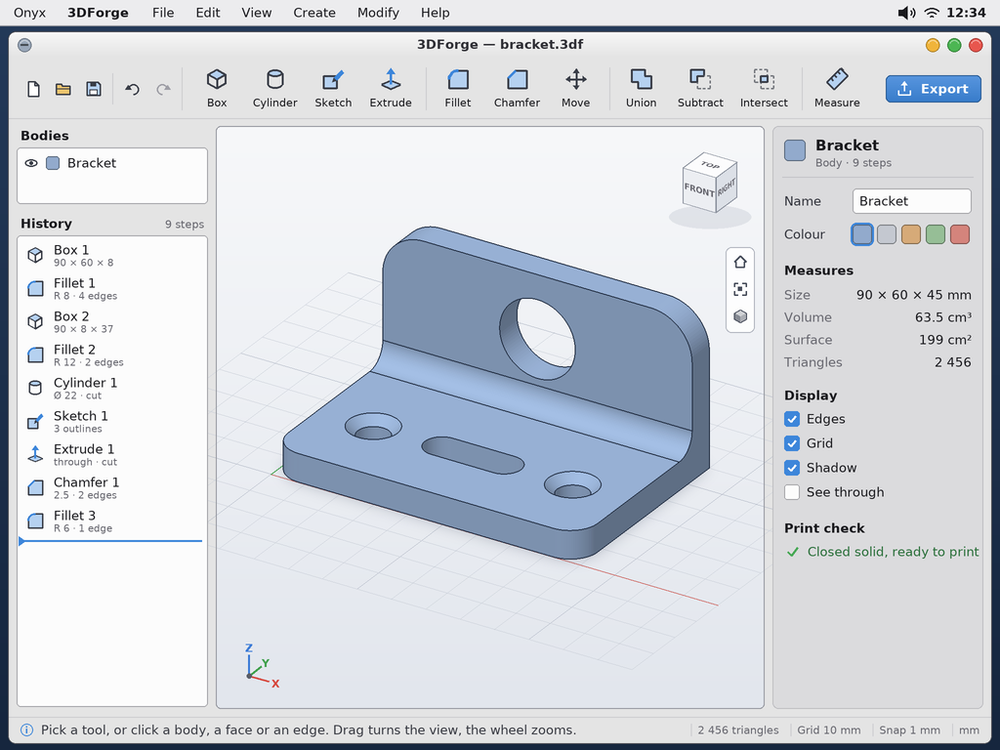
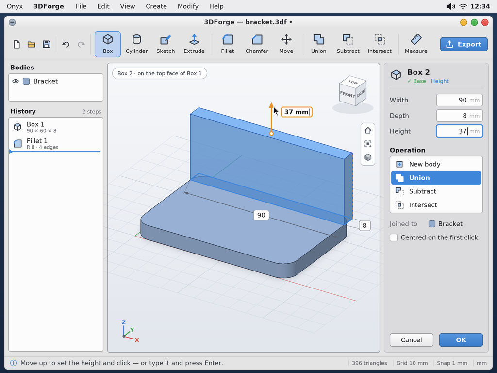
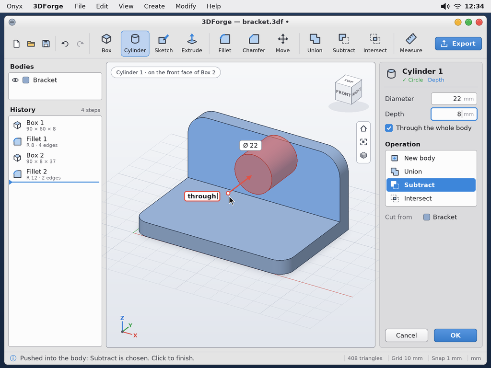
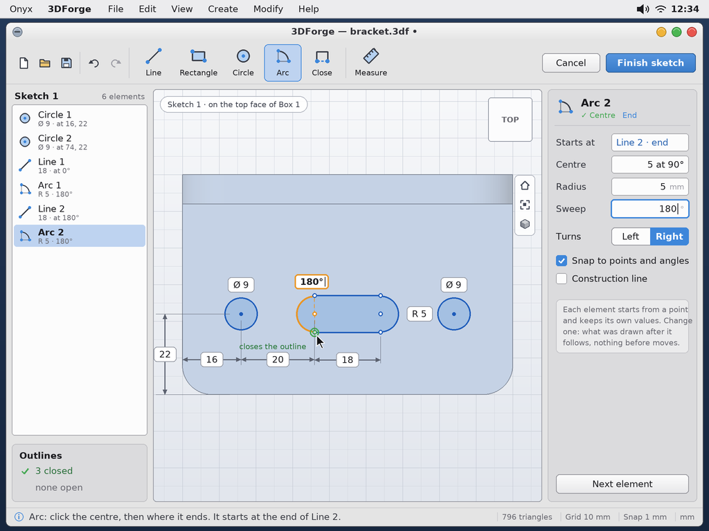
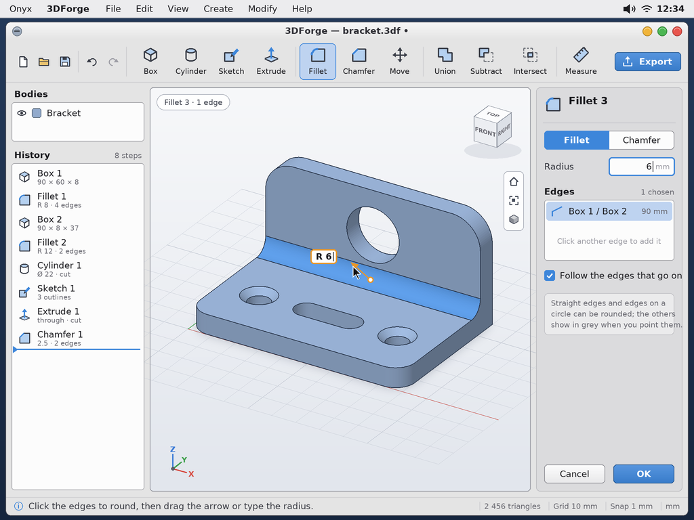
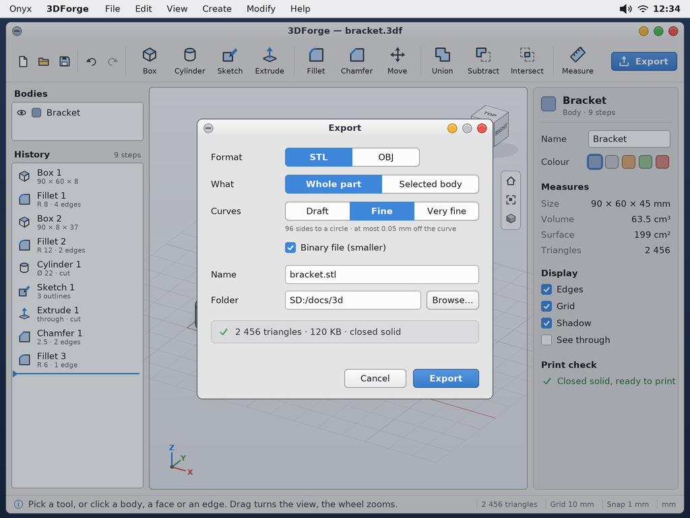

# 3DForge, a small parametric CAD — study, first mock-ups

> **Status (2026-10-05): the design is approved by the user; nothing is built yet.** Asked by the user
> (2026-10-05): a small parametric CAD that is *easy to use*, in the spirit of Fusion or Shapr3D, above all for
> simple shapes — "for a cube: click the centre, move away to give the width and the depth, click, move up to give
> the height, click". Not a port of FreeCAD (too heavy), nor of SolveSpace or OpenCASCADE. The name, **3DForge**, is
> the user's.

The mock-ups are made by `python tools/screenshot/mockup_3dforge.py` → `docs/3dforge/mockups/3dforge-*.png`
(1024 × 768, the **Milk** theme). The script needs `pip install manifold3d`: the part shown, a bracket, is **built by
Manifold itself** with the operations of its history, then drawn by a small z-buffer (flat shading, the faces' edges,
a shadow on the ground) — what the GPU will draw on the Pi. Its measures (63.5 cm³, 2 456 triangles) are the real ones.

| | |
|---|---|
|  | **The window.** At the top the tools, a picture and its name: Box, Cylinder, Sketch, Extrude; Fillet, Chamfer, Move; Union, Subtract, Intersect; Measure; Export at the right. At the left the **bodies** (shown or hidden, their colour) and the **history**: each step with its values, the blue bar marking where the part is rebuilt up to. In the middle the **view** (the orientation cube, home / fit / shading, the axes). At the right the **selection**: here the body — its name, its colour, its measures, what is displayed, and whether it is a closed solid that can be printed. At the bottom, what to do now, then the grid, the snapping and the unit. |
|  | **A box, in two clicks and a move.** The base is drawn on a face (or on the ground), then the height is pulled with the arrow. Every dimension is **on the drawing** and can be clicked and typed; the same values are at the right. Started on a body: *Union* is chosen, the body named. |
|  | **Cutting.** A cylinder started on a face and pushed into the body: the preview is red, *Subtract* is chosen for you, *through the whole body* stops it nowhere. The operation can be changed at the right: new body, union, subtract, intersect. |
|  | **The sketch**, seen from the face it is drawn on (the body behind, faded). The tools become Line, Rectangle, Circle, Arc, Close. **No constraint solver** (the user): each element is a *recipe* — where it starts (a point already there), its angle, its length; an arc by its centre, its radius, its sweep. At the left the elements in the order they were drawn; at the right the one being drawn. A closed outline turns blue; the sketch says how many are closed and how many are still open. |
|  | **Fillet and chamfer.** Click the edges, drag the arrow or type the radius; the result is shown before it is accepted. An inner edge is filled, an outer one cut. |
|  | **Export** to STL or OBJ: the whole part or one body, how finely the curves are cut, binary or text; the number of triangles and the file's size before writing. |

## The choices (the user, 2026-10-05)

- **The scope**: sketch + extrude; union, subtraction, intersection; **bodies only** (no loft, no surfaces);
  chamfers and fillets as far as they go; STL and OBJ export. Direct primitives (box, cylinder) by click, move, click.
- **The kernel: Manifold** (Apache-2.0; with Clipper2 for the 2D outlines) — boolean operations on meshes, robust and
  fast, a small C++17 library. What it costs, accepted: everything is a mesh (a circle is a polygon with N sides —
  right for 3D printing), **no STEP export**, and fillets / chamfers only on **straight edges and edges on a
  circle** (a prism, or a prism less a cylinder, added or cut; a profile turned around the axis for a circle).
- **The sketch has no solver**: the elements are replayed in the order they were drawn. Changing a value moves what
  was drawn after it, never what was before. An outline must be closed to be extruded: *Close* joins the last point
  to the first, whatever its length.
- **The history is one mechanism for 2D and 3D**: a list of steps with their values, replayed from the top.
- **Rendering: the GPU as much as possible** (the bodies, the grid, the selection).
- **The interface first**: these mock-ups were approved before any code.

## What is next

1. Manifold (and Clipper2) built for Onyx as a library; a test program in `/bin`.
2. The view: the GPU drawing a body, orbit / pan / zoom, picking a face.
3. Box, Cylinder, the operations, Export — the app is already useful.
4. The sketch and Extrude; then the history that can be edited; then Fillet and Chamfer.
