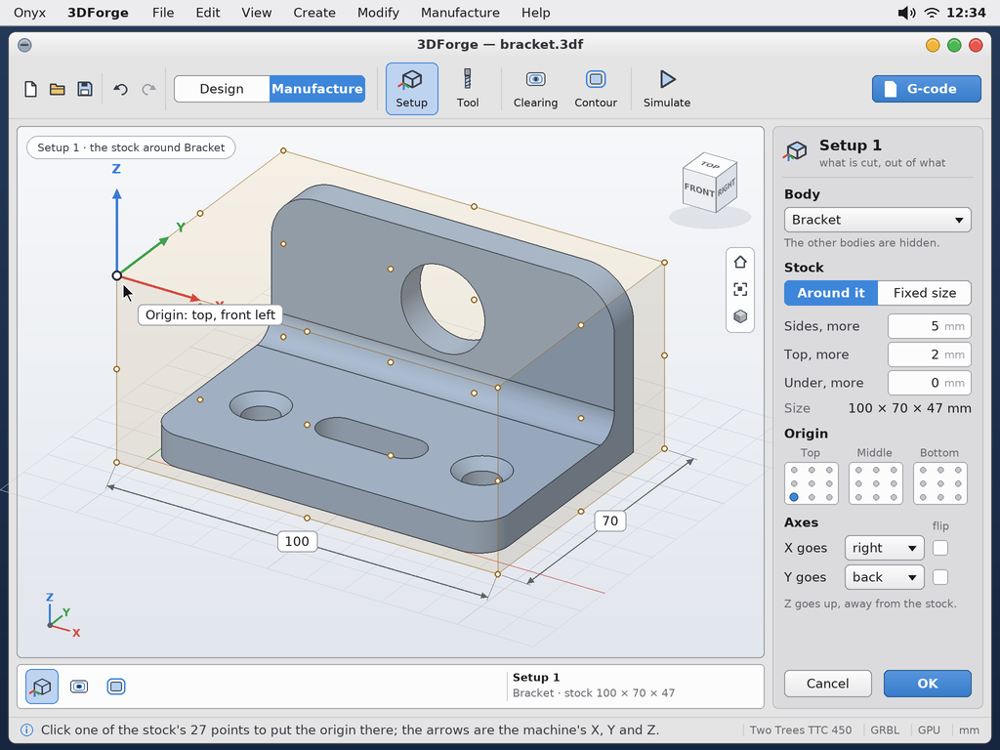
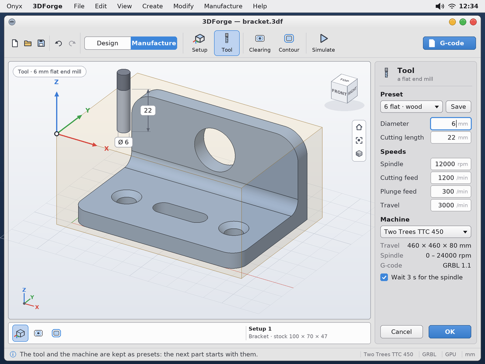
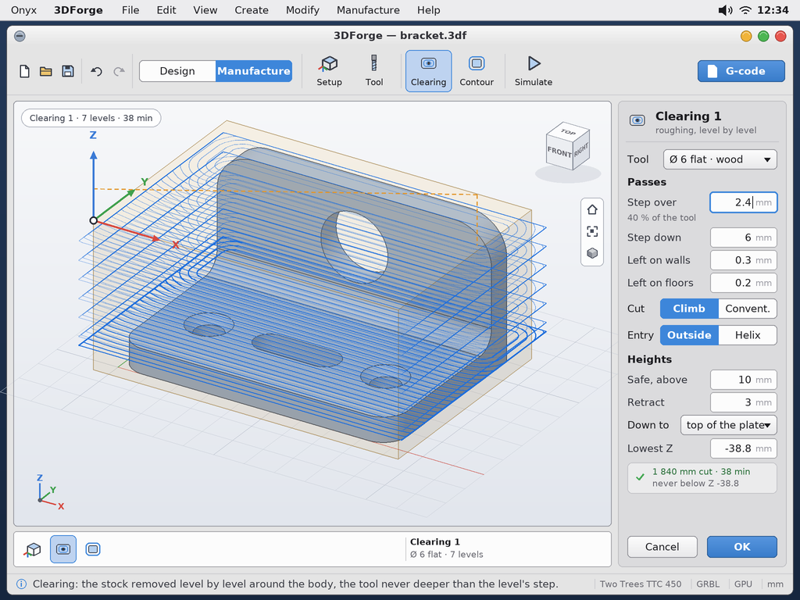
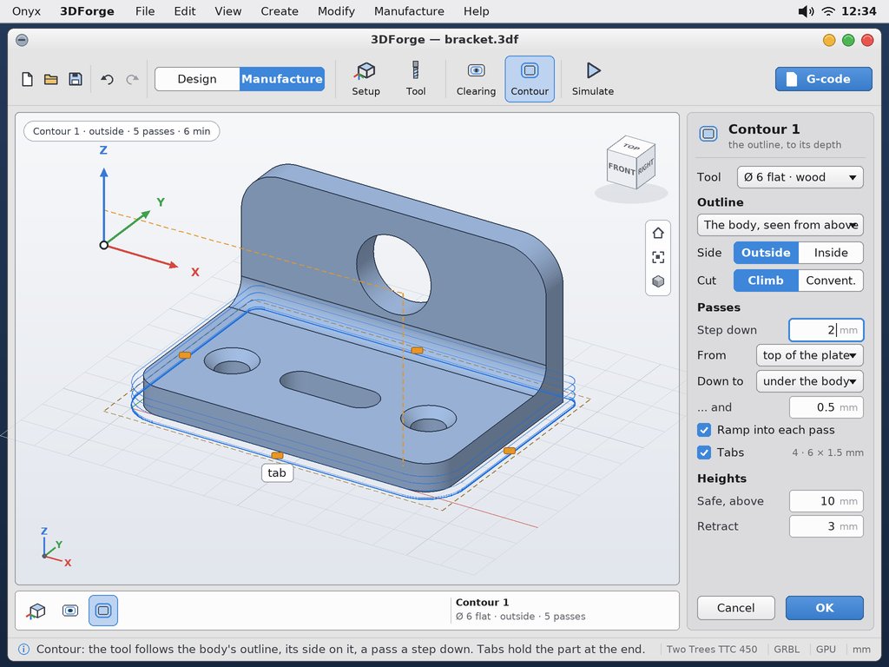
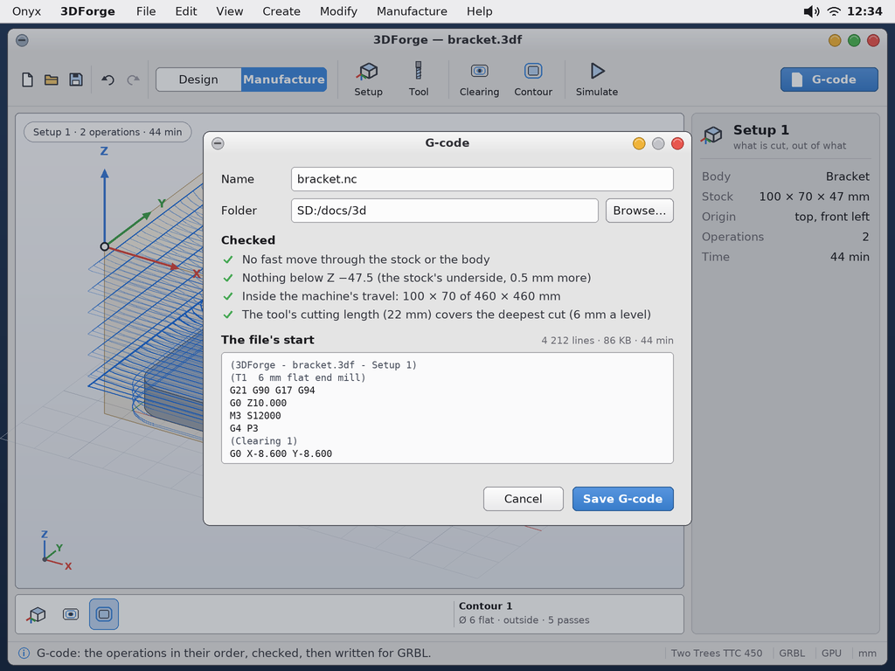

# 3DForge, a small parametric CAD — study, first mock-ups

> **Status (2026-10-05): built** — `user/Apps/3dforge` (the user guide's *3DForge*; docs/03 *3DForge* for the code),
> tested on the PC (the document's test, the app in the desktop simulator), **not yet run on the Pi** (the GPU's
> path). The study below was approved by the user before. Asked by the user (2026-10-05): a small parametric CAD
> that is *easy to use*, in the spirit of Fusion or Shapr3D, above all for simple shapes — "for a cube: click the
> centre, move away to give the width and the depth, click, move up to give the height, click". Not a port of
> FreeCAD (too heavy), nor of SolveSpace or OpenCASCADE. The name, **3DForge**, is the user's.

## What changed while it was built (the user, 2026-10-05)

The app differs from the mock-ups below where the user asked, seeing it take shape:

- **No left panel.** The bodies are a small panel floating over the view's top left corner; the history is a
  **timeline**: a row of pictures under the view, from the left, moved by its arrows, the wheel or dragged.
- **The shapes in one fold-out** (the *Shapes* button: a picture each), and five more of them: **sphere**, **torus**,
  **pyramid**, **prism**, **taper** (a prism whose top differs from its base), each with the gesture the user
  described (the user guide's table) — the field of the value being set has the keyboard at each step.
- **A shape without the pointer**: once chosen, its values and its place are fields at the right, a ghost shows
  it, OK makes it.
- **Move** also turns and scales a body about its centre, or a **clone** of it (a new body).
- **A sketch on a plane of the axes** (XY, XZ, YZ) with an offset, besides a face.
- **More exports**: a flat drawing seen from a side as DXF, SVG or PDF (at the part's size), a PNG picture.

| | |
|---|---|
|  | The app, the sample bracket open (`sh tools/tests/desktop_sim/shots.sh 3dforge`: the real program on the PC, the default theme). |
|  | The shapes unfolded. |
|  | A sketch on the plate's top face: a rectangle, a circle, a run of lines about to close. |

## The mock-ups (approved before the code)

The mock-ups are made by `python tools/screenshot/mockup_3dforge.py` → `docs/3dforge/mockups/3dforge-*.png`
(1024 × 768, the **Milk** theme). The script needs `pip install manifold3d`: the part shown, a bracket, is **built by
Manifold itself** with the operations of its history, then drawn by a small z-buffer (flat shading, the faces' edges,
a shadow on the ground) — what the GPU will draw on the Pi. Its measures (63.5 cm³, 2 456 triangles) are the real ones.

| | |
|---|---|
|  | **The window.** At the top the tools, a picture and its name: Box, Cylinder, Sketch, Extrude; Fillet, Chamfer, Move; Union, Subtract, Intersect; Measure; Export at the right. At the left the **bodies** (shown or hidden, their colour) and the **history**: each step with its values, the blue bar marking where the part is rebuilt up to. In the middle the **view** (the orientation cube, home / fit / shading, the axes). At the right the **selection**: here the body — its name, its colour, its measures, what is displayed, and whether it is a closed solid that can be printed. At the bottom, what to do now, then the grid, the snapping and the unit. |
|  | **A box, in two clicks and a move.** The base is drawn on a face (or on the ground), then the height is pulled with the arrow. Every dimension is **on the drawing** and can be clicked and typed; the same values are at the right. Started on a body: *Union* is chosen, the body named. |
|  | **Cutting.** A cylinder started on a face and pushed into the body: the preview is red, *Subtract* is chosen for you, *through the whole body* stops it nowhere. The operation can be changed at the right: new body, union, subtract, intersect. |
|  | **The sketch**, seen from the face it is drawn on (the body behind, faded). The tools become Line, Rectangle, Circle, Arc, Close. **No constraint solver** (the user): each element is a *recipe* — where it starts (a point already there), its angle, its length; an arc by its centre, its radius, its sweep. At the left the elements in the order they were drawn; at the right the one being drawn. A closed outline turns blue; the sketch says how many are closed and how many are still open. |
|  | **Fillet and chamfer.** Click the edges, drag the arrow or type the radius; the result is shown before it is accepted. An inner edge is filled, an outer one cut. |
|  | **Export** to STL or OBJ: the whole part or one body, how finely the curves are cut, binary or text; the number of triangles and the file's size before writing. |

## The choices (the user, 2026-10-05)

- **The scope**: sketch + extrude; union, subtraction, intersection; **bodies only** (no loft, no surfaces);
  chamfers and fillets as far as they go; STL and OBJ export. Direct primitives (box, cylinder) by click, move, click.
- **The kernel: Manifold** (Apache-2.0; with Clipper2 for the 2D outlines) — boolean operations on meshes, robust and
  fast, a small C++17 library. What it costs, accepted: everything is a mesh (a circle is a polygon with N sides —
  right for 3D printing), **no STEP export**, and fillets / chamfers only on **straight edges and edges on a
  circle** (a prism, or a prism less a cylinder, added or cut; a profile turned around the axis for a circle).
- **The sketch has no solver**: the elements are replayed in the order they were drawn. Changing a value moves what
  was drawn after it, never what was before. An outline must be closed to be extruded: *Close* joins the last point
  to the first, whatever its length.
- **The history is one mechanism for 2D and 3D**: a list of steps with their values, replayed from the top.
- **Rendering: the GPU as much as possible** (the bodies, the grid, the selection).
- **The interface first**: these mock-ups were approved before any code.

## Manufacture: G-code for a CNC router — the study and the mock-ups (2026-10-06; built the same day)

*Built as drawn below (the user: "ça me convient bien"), with what he added: the contour's step down and its
tabs can be set, and an operation works on the body or on **one face** (to cut in several stages). What differs
from the mock-ups: the Design / Manufacture switch is two rows high (the bar is short), the way in is always a ramp
or from outside the stock (no helix), the presets are one tool and one machine remembered (no list yet). The code:
`fcam.h` (docs/03), the user guide's *Manufacture*.*

Asked by the user for a "version 2": from a body, the **G-code (GRBL)** for his router (a Two Trees), with the two
operations he uses in Fusion — *adaptive clearing* and *2D contour* —, flat end mills only. He described the setup as
Fusion's: the **stock** (its size, where the model sits in it), the **body** to cut (the others hidden), the
**origin** among the stock's 27 points (corners, middles, centres), the direction of X and Y and their inversion;
then the tool's diameter, the spindle speed, the feeds and the travel speed (a **preset** for the tool and the
machine), the safe distances from the stock, the lowest depth.

The mock-ups: `python tools/screenshot/mockup_3dforge_cam.py` → `mockups/3dforge-cam-*.png` (the app's window as
built; the tool paths drawn are real ones for the sample bracket, computed with Manifold's slices and Clipper2's
offsets, as the app would).

| | |
|---|---|
|  | **Design / Manufacture** at the bar's left: the app's two halves. In Manufacture the tools are Setup, Tool, Clearing, Contour, Simulate, and **G-code** at the right; the timeline shows the setup and its operations. **Setup**: the body, the stock (around the body with margins, or a fixed size) drawn see-through, the **origin** picked among the 27 points — on the drawing, or in the three small grids —, X and Y's directions and their flip; the arrows show the machine's axes. |
|  | **Tool**: a flat end mill — its diameter, its cutting length —, the spindle speed, the cutting and plunge feeds, the travel speed, kept as a **preset**; the **machine** (its travel, its spindle's range, GRBL), a preset too. |
|  | **Clearing**: the stock removed level by level around the body (step down), each level by passes a step over apart, a little left on the walls and the floors for the contour; climb or conventional; the way in from outside the stock or by a helix; the heights (safe, retract, down to); the length cut, the time, the lowest Z. |
|  | **Contour**: the tool's side on the body's outline (outside or inside), a pass a step down, from a height down to under the body; a ramp into each pass; **tabs** that hold the part. |
|  | **G-code**: the operations in their order, **checked** before writing — no fast move through the stock or the body, nothing below the lowest depth, inside the machine's travel, the tool long enough —, the file's first lines, its size, the time. |

What I told the user (2026-10-05), to keep in mind when building:

- **Simple**: the setup, the tool and the presets, the heights, GRBL's output (G0 / G1, M3 S, G21 G90; curves as
  short lines), the paths shown in the view. **Moderate**: the 2D contour (Manifold slices the body, Clipper2
  offsets by the tool's radius; passes, side, direction, ramps, tabs).
- **The clearing in two levels of ambition**: first **passes by offsets** in Z levels (what the mock-up shows; the
  tool cuts its full width in the corners and on the first pass) — then, if it does not do, a true **adaptive**
  clearing at constant engagement (a large piece of work; FreeCAD has one that could be ported: its licence to be
  checked and the user asked first).
- **I cannot test a real cut**: everything is checked by computation and in the preview; the user tries it in the
  air first. The checks of the G-code dialog are part of the first version, not an extra.

## What is next

Manufacture is built (above); on the user's list for later: the rotary 4th axis.

All four stages of the plan are done (Manifold for Onyx; the view; the shapes, the operations, Export; the sketch,
Extrude, the editable history, Fillet and Chamfer). What is left: **run it on the Pi** (the GPU's path has only its
code read against the kernel's), then the limits listed in docs/HANDOFF.md (references that follow a change up the
history, the ground's shadow, more sketch tools).
