# Onyx on small screens: a compact shell — a design study

*Status (2026-10-08): **a design analysis only, nothing built.** No change to Elegant, to the kernel, to
UIKit or to any app. The user asked whether the windowed desktop (the modernised CDE,
`docs/gui-redesign/README.md`), now that Elegant is a user process, could be swapped for an interface
made for **netbooks** and **handhelds in the manner of the Sharp Zaurus**. This page is that design: the
devices, the people, the input, the concepts compared, and the result — **three selectable modes**:
**desktop** (today's), **pocket** (one resolution- and orientation-independent layout for small screens,
landscape or portrait) and **console** (a gamepad-first mode in the mood of the PlayStation 2's system
browser); a **netbook** mode and a **pad** (touch tablet) mode are left for later. Then what UIKit and
Elegant would have to offer (as requirements), the risks and the open questions. It stops before
implementation. At the user's request the mock-ups use the **Milk** theme (light greys, Aqua's blue, OS X's
beads), the default look of the new modes.*

The mock-ups are made by **`python3 tools/screenshot/mockup_compact.py`** (PIL + numpy; it draws with the
helpers of `mockup_cde_modern.py`, the card's DejaVu and Selawik fonts, the apps' real icons and
categories, and real screenshots recoloured to Milk for the thumbnails). They land in
`docs/compact-shell/mockups/`.

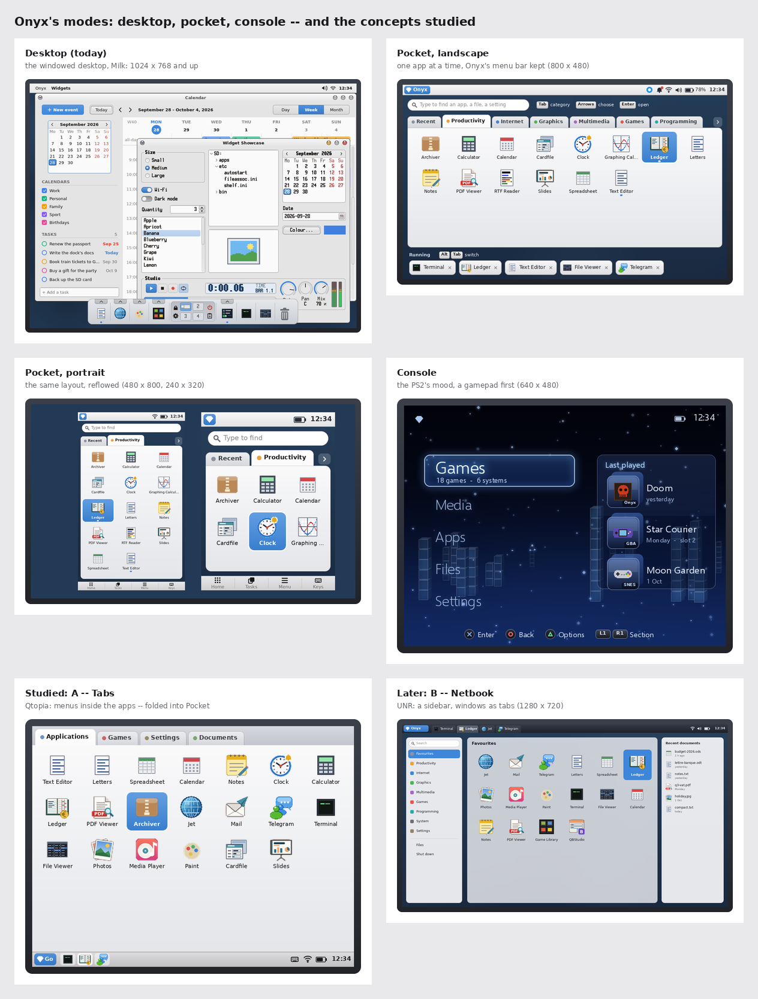

*The three modes — desktop (today), pocket (landscape and portrait: one layout), console — and the two
concepts studied: A "Tabs" (folded into pocket) and B "Netbook" (a mode for later).*

## 1. Why now, and what "swapping the shell" means

Until 2026-10-05 the window manager was in the kernel. It is now **Elegant** (`user/Servers/elegant/`,
docs/02 §10, docs/HANDOFF.md): a user process holding all the policy — the window list, z-order, focus,
desks, input routing, drag and drop, the menus' specifications, composition, cursor, wallpaper. The visible
desktop is Elegant **plus a few ordinary programs** started by `SD:/etc/autostart`: the menu bar
(`apps/menubar`), the dock (`apps/dock`), the agenda widget, `notifyd`, the Wi-Fi menu. So "another kind
of GUI" is two things:

1. **another policy in Elegant** — how windows are placed, framed, raised and switched; which keys are the
   system's; and
2. **other shell programs** in place of the menu bar and the dock — a launcher, a status bar, a switcher.

The apps do not change for that. What does change is that they are given a smaller screen than they were
designed for: §9 is about that, and it is the larger part of the work.

**The result: modes, chosen by the user** (`shell=` in `SD:/etc/system.ini`, §11.1), all on the same
Elegant and the same apps:

| Mode | For | What it is |
|---|---|---|
| **desktop** | a big screen, a mouse | today's windowed desktop (the dock, the menu bar, overlapping windows) |
| **pocket** | any small screen, landscape or portrait: netbook-like kits, the 7" display, a uConsole, a slate | one app at a time, Onyx's menu bar kept as the status bar, a tabbed launcher, a switcher, split view when wide — **one layout that reflows** (§6) |
| **console** | a handheld with a gamepad, a TV | the games, the emulators and the media first, the PlayStation 2's mood, the pad alone (§7) |
| *netbook* (later) | 1024 × 600 – 1280 × 720 with a keyboard | concept B (§8.2): a sidebar, the windows as tabs |
| *pad* (later) | a touch tablet, no keyboard | pocket's layout with touch-first sizes and gestures |

## 2. The target devices

Pi-4-based devices that exist today, sorted by what they mean for the layout. The study takes **three
targets** and leaves the tiny screens as a degraded case.

| Target | Real devices | Physical | Scale | Logical size | Input |
|---|---|---|---|---|---|
| **T1 — compact landscape** (primary) | the official 7" DSI Touch Display (800 × 480); Pi netbook / "cyberdeck" kits; Pi handhelds with a 640 × 480 panel; a Zaurus SL-C-like clamshell | 640 × 480 – 1024 × 600 | 1× | 640–1024 × 480–600 | keyboard, touchpad or trackball, often touch |
| **T2 — dense landscape** | the ClockworkPi uConsole (5", 1280 × 720, keyboard + trackball); 7" 1024 × 600 HDMI panels | 1280 × 720 | 1.5× | 853 × 480 | keyboard + trackball / trackpad |
| **T3 — portrait** (Pocket in portrait) | Touch Display 2 (720 × 1280, portrait native); HyperPixel 4 rotated (480 × 800); a 480 × 640 VGA panel — the SL-5500 idea at 2× | 480 × 640 – 720 × 1280 | 2× | 240 × 320 – 360 × 640 | touch or stylus, a d-pad, a few keys, an on-screen keyboard |
| *out of scope* | 3.5" SPI screens (320 × 240, 480 × 320) | — | 1× | 320 × 240 | d-pad |

The point of the logical sizes: Pocket is designed **once, in logical units**, and drawn at the device's
scale (1×, 1.5×, 2×); its rules reflow by the logical width, height and aspect (§6.1). T1 and T2 give the
same picture (about 800 × 480 logical); T3 is the same Pocket in portrait — not another interface.

Notes:

- `kapi_screen_set` accepts 640 × 480 to 2560 × 1600 today: portrait modes and anything under 640 × 480 are
  outside it (a requirement, §11).
- The DevTerm's 1280 × 480 strip would be T1 with a wide work area: split view (§6.7) fits it naturally.
- The 320 × 240 SPI screens are monitors for a project (GPIO Lab, a status panel), not a general desktop:
  the launcher and the switcher would work there in the portrait layout's density, the apps mostly would not.

## 3. Who, and where

| Persona | Device | Uses | What matters |
|---|---|---|---|
| **The hacker on the go** (the user himself) | uConsole, a Pi netbook | Terminal, QBasic / QBStudio, the File Viewer, Ledger, Jet, Mail, Telegram | keyboard for everything; two apps side by side; the terminal one key away |
| **The retro player** (console mode) | a Pi handheld (d-pad, face buttons, L1/R1, Start/Select), or a Pi under the TV | the emulators (GB, GBA, NES, SNES, N64, GameCube), Doom, SuperTuxKart, the Media Player | the gamepad alone; big words; full screen at once; save states; back home with one button |
| **The learner** | a 7" touchscreen on a desk or a kiosk | Turtle Quest, Circuits, Paint, the Media Player | touch; big targets; nothing to lose (no hidden window) |
| **The pocket organiser** | a portrait slate in the hand | Notes, the Calendar, the Clock, Telegram, the Image Viewer | one hand; the on-screen keyboard; quick glances (the time, a notification) |

Contexts: on a train with a trackball and no mouse; on a sofa with one hand; standing, with a stylus;
plugged into a big screen at home (where the classic desktop is still the right one — §11.1).

## 4. The input model

Every action must be reachable in **four ways**, none of which is the only one:

| | Keyboard | D-pad / gamepad | Touch / stylus | Trackpad / trackball |
|---|---|---|---|---|
| Point | — | focus moves (arrows) | tap | pointer |
| Activate | Enter | A / OK | tap | click |
| Back / cancel | Esc | B / Back | the status bar's back, a tap outside | — |
| Secondary (context menu) | Menu key, Shift+F10 | Y / Options | long press (500 ms) | right click |
| Home | Super | Home key / Select | the Onyx button | the Onyx button |
| Switch apps | Alt+Tab | Tasks key / L-R shoulders | the status bar's title, the Running strip | idem |
| App menus | F10, Alt+letter | Menu key / Start | tap a menu title (portrait: ☰) | click |
| Scroll | PgUp/PgDn, arrows | the d-pad on a list | drag (with inertia) | wheel, two-finger drag |

Principles that follow:

- **Keyboard first, then the d-pad, then touch.** Onyx is a keyboard-rich system (the terminal, QBasic, the
  shortcuts of every app's menus); a d-pad is a keyboard of six keys; touch is a pointer without hover and
  with a fat tip. Design for the keyboard and the other two come almost free — the reverse is not true.
- **A visible focus, always.** In the compact profile the focus ring is drawn on every focusable widget,
  not only after Tab — a d-pad user has no pointer to find where he is.
- **No hover-only information.** Tooltips also show on keyboard focus; a rail's labels (Ledger, §9) show on
  focus or long press.
- **No gesture is the only way.** Swipes are shortcuts (from the top edge: quick settings; from the left:
  back) never the sole path.

## 5. Design principles

0. **Resolution- and orientation-independent.** Every size in logical units, times the device's scale;
   layout rules that reflow by the logical size and the aspect (§6.1) — not a layout per device.
1. **One app, the whole screen.** On 800 × 480 an overlapping window is a hidden window. Apps fill the work
   area, without a frame; the app's name is in the status bar.
2. **Keep Onyx's global menu bar.** The top bar of today's desktop — the Onyx button, the app's name, its
   menus, the tray, the time — is already the right status bar for a small screen: every app's commands
   stay where Onyx users know them, and no app needs a toolbar of its own. It is also what makes it
   recognisably Onyx.
3. **The categories are the launcher.** The apps' `category` in `app.txt` (Productivity, Internet,
   Graphics, Multimedia, Games, Programming, System, Settings) already drives the dock's drawers: they
   become the launcher's tabs, as Qtopia's were on the Zaurus.
4. **Type to find.** On the launcher, typing searches apps, files, settings and `/bin` commands at once;
   Enter opens the first.
5. **Two apps when there is room.** At 800 px and wider, two apps side by side is the one tiling worth
   having (a file and its editor, a terminal and a manual).
6. **Cheap effects only.** As in the desktop redesign (§4 there): no blur, no drop shadows; a flat dim
   behind an overlay, drawn once.
7. **The same apps, the same kits.** No "mobile edition" of an app: UIKit adapts the density (§9); an app
   may give a compact layout of its own where it matters.
8. **Milk, at the compact size.** The look is the Milk theme's (§12).

## 6. Pocket, the compact mode (recommended)

Pocket takes the **launcher of concept A** (Qtopia's tabs), keeps **Onyx's menu bar** as the one status
bar, borrows **split view from concept B** and **the d-pad rules of the carousel** that became console
mode (§8 compares them). It is **one layout for every small screen**, landscape or portrait.

### 6.1 One layout for every screen: the adaptive rules

Everything is specified in **logical pixels** (lp); the device's **scale** (1, 1.5, 2: `theme.txt`
`scale=`, §11.1) turns them into pixels, and UIKit draws the text and the shapes at that scale (U2, §9.2).
The rules below read only the **logical width (lw)**, **height (lh)** and the **aspect** — so a 1280 × 720
uConsole at 1.5× and an 800 × 480 display at 1× give the same picture, and a slate in portrait is the same
Pocket reflowed.

| Rule | Condition | Effect |
|---|---|---|
| Orientation | lh > 1.05 × lw | *portrait*; else *landscape* |
| Menus in the bar | lw ≥ 560 | the app's menus inline (File Edit View...), drop-downs |
| | lw < 560 | one ☰ button; in portrait the menus open as a **bottom sheet** (the top-level menus as tabs, big rows) |
| Status bar contents | lw ≥ 420 | the tray, the bell, Wi-Fi, volume, battery and %, the time |
| | lw < 420 | Wi-Fi, battery, time (the rest in quick settings); lw < 300: battery and time |
| Search hints | lw ≥ 700 | the key hints beside the search field; else the field takes the width |
| Launcher tiles | lw ≥ 600 | 94 × 84 lp, 48 lp icons; columns = ⌊(lw − 24) / 94⌋ (8 at 800, 6 at 640) |
| | lw < 600 | 80 × 76 lp, 40 lp icons; columns = max (3, ⌊(lw − 24) / 80⌋) (3 at 240–320) |
| Category tabs | always | one strip under the search field, scrolling (the chevron); 32 lp high, 28 if lh < 420 |
| Running strip | landscape and lh ≥ 440 | the open apps as chips under the launcher (Qtopia's taskbar) |
| | otherwise | none: the switcher only |
| Soft keys | portrait (on a device without Home / Tasks / Menu keys: `compact.ini`) | a 26 lp bar at the bottom: Home, Tasks, Menu, Keyboard |
| Switcher | landscape | a row of cards, the chosen one bigger; as many as fit (5 at 800, 4 at 640) |
| | portrait | a column of rows: a thumbnail, the name, a line about it |
| Split view | lw ≥ 640 (two halves ≥ 320 lp) | Super+← / → allowed; the divider at 40/50/60 % |
| Fixed windows | the window larger than the work area | a scrolling root (U6); smaller: a centred card over a dim |
| Dialogs | lw < 560 or the touch profile | full-screen sheets; else centred cards |
| Density | `theme.txt metrics=` | compact or touch sizes (§9.3), whatever the size |

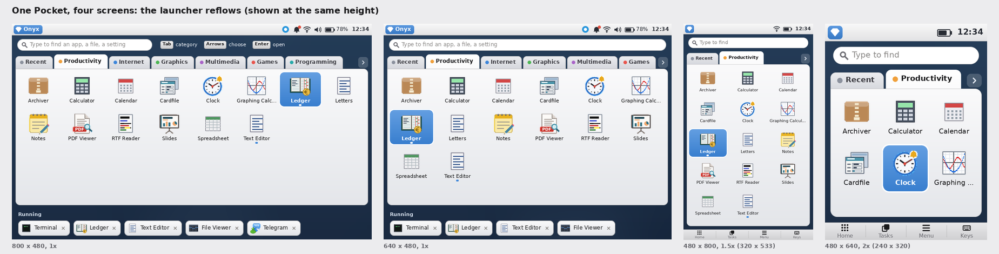

*One Pocket, four screens: the launcher at 800 × 480 and 640 × 480 (1×), 480 × 800 (1.5×: 320 × 533 lp)
and 480 × 640 (2×: 240 × 320 lp). The columns, the hints, the Running strip, the soft keys follow the rules
above; nothing else changes.*

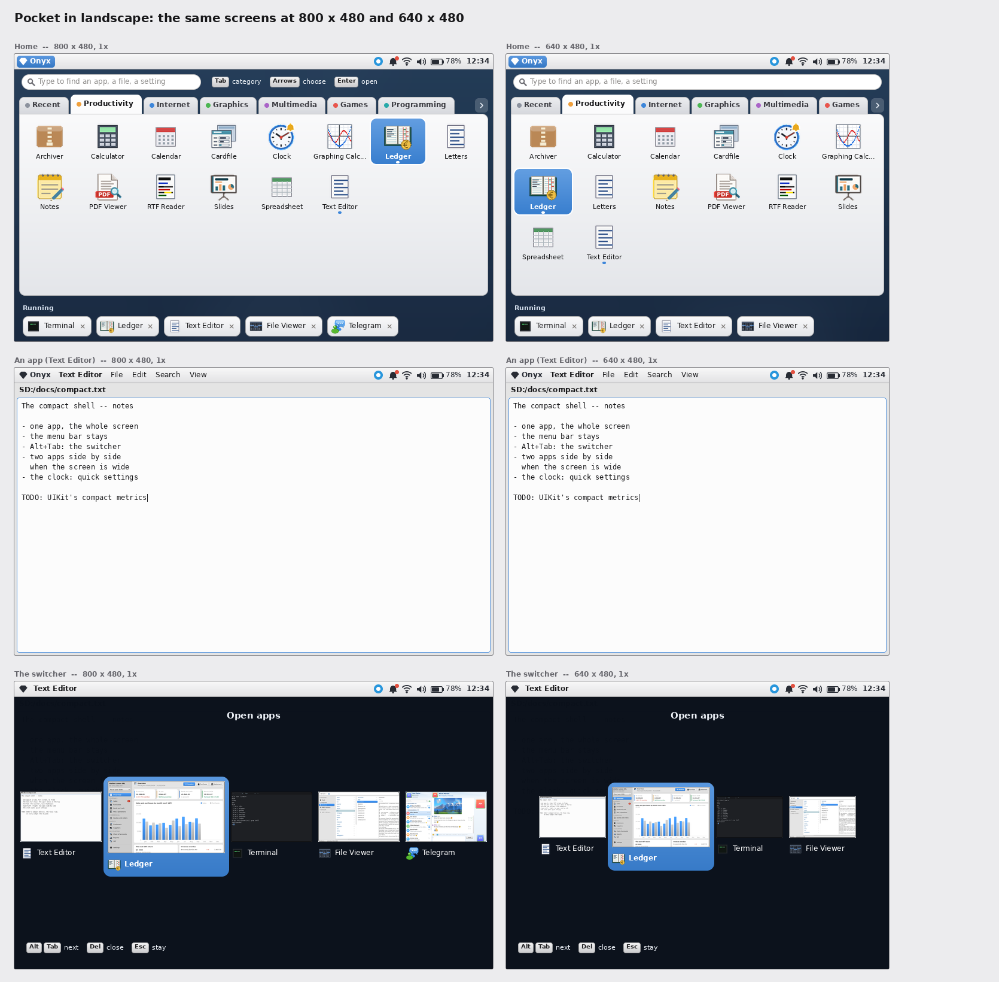

*Landscape: the launcher, an app (the Text Editor) and the switcher at 800 × 480 and at 640 × 480 — the
same screens; at 640 the grid has 6 columns and the switcher shows 4 cards.*

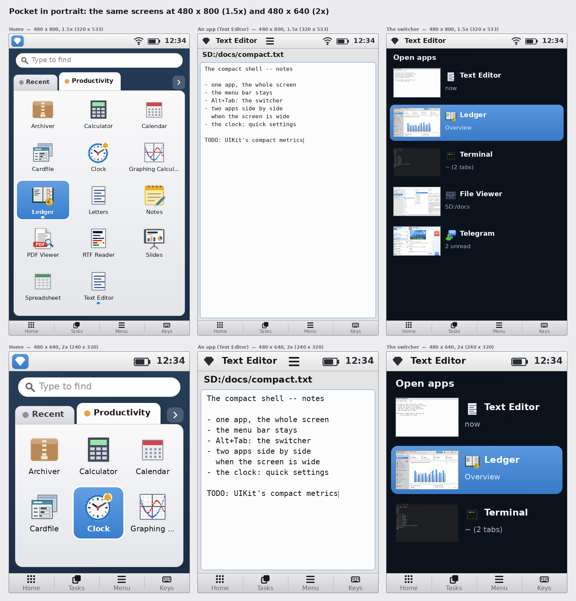

*Portrait: the same three screens at 480 × 800 (1.5×) and at 480 × 640 (2×): the status bar keeps the
essentials and ☰, the grid has 3 columns, the soft keys appear, the switcher becomes a column.*

### 6.2 The launcher (Home)

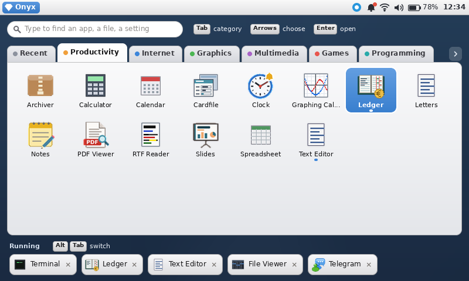

*The launcher at 800 × 480: the status bar (the Onyx button lit: Home), the search field and its key hints,
the category tabs (silver, a dot of the category's colour), the apps of the chosen tab (Ledger has the
focus ring; a dot under a running app), and the **Running** strip — Qtopia's taskbar, shown on the launcher
only.*

- **Tabs**: Recent first (the last opened apps and the pinned ones), then the categories of `app.txt` in
  the dock's order (`SD:/etc/dock.ini`), then Settings — the Control Panel's applets as apps (the same
  `.lnk` files: `apps/control.app/applets/`). Tab / Shift+Tab or the shoulders change tab; more tabs than
  fit scroll (the chevron).
- **Grid**: 94 × 84 px tiles (48 px icons) in the compact profile, 7 × 3 on 800 × 480; arrows move the
  focus, Enter opens. A dot marks a running app (as the dock does today); opening a running app raises it.
- **Running strip**: the open apps, the most recent first, each with a close button; the same list as the
  switcher.
- The launcher is **the desktop**: it is what is behind every app (Elegant's backmost band); the wallpaper
  and the agenda widget's information move here (an "Agenda" line could join the Recent tab — open question).

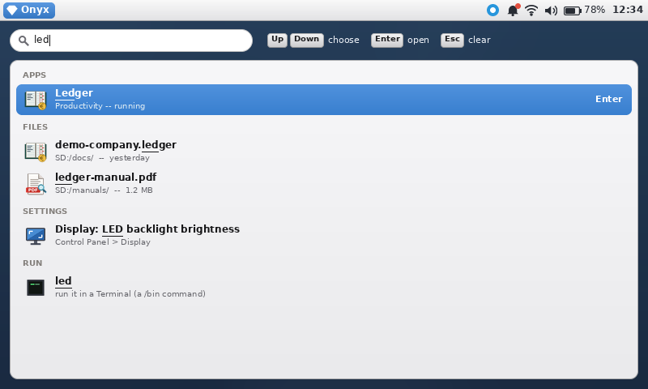

*Typing on the launcher: the tabs give way to grouped results — apps, files (the File Viewer's index),
settings (the applets' descriptions), and the text as a `/bin` command to run in a Terminal.*

**v2: a more finished launcher (a design proposal, 2026-10-08).** The picture above and the real
`pocketshell` (`docs/compact-shell/real/pocketshell-*.png`) work but look rough: folder tabs, 40 px icons
floating on a flat panel, the key hints competing with the search field, the open apps as chips of names,
and at 1920 × 1080 a mostly empty panel. v2 keeps everything the user decided — Milk, **the desktop's menu
bar as the top band** (the Onyx button lit on Home), the categories of `app.txt`, the Running strip — and
gives it a hierarchy:

- **A real search field** (34 lp, round, a soft shadow; Aqua ring and a clear button while typing) and,
  beside it, **Today**: the agenda's next event on one line ("Thu 8 Oct | 14:00 Team call — in 1 h 26",
  from the Calendar, as the desktop's Agenda widget; a click opens the Calendar). It earns its place because
  it is the one thing a glance at Home should tell besides the apps. At **lw ≥ 1100** it grows into a
  **Today column** at the right — the agenda and the notifications (`notifyd`): what the desktop's Agenda
  widget and the bell show — instead of leaving the panel empty.
- **Category chips** on the wallpaper instead of folder tabs: pills with the category's dot, the chosen one
  white with a shadow; more than fit scroll (the chevron). Tab / Shift+Tab still go from one to the next.
- **One raised card** for the apps (a 16 lp radius, a soft shadow) with a **header**: the category's dot,
  its name, how many apps ("Productivity 14 apps").
- **Larger icons on plates**: a 60 lp rounded plate (white to light grey, a hairline, a small shadow) holds
  every icon at 44 lp — one shape for icons of every shape; cells of 94 × 100 lp, 8 columns at 800, two rows
  hold Productivity's 14 apps. A running app has an Aqua dot under its plate.
- **A clear focus for the keyboard**: an Aqua ring 4 lp outside the plate with a soft Aqua glow, and the
  label in an Aqua pill — visible at three metres, unambiguous with a dot or a hover.
- **Running as thumbnails**: the open apps as small pictures of their windows (Elegant's copies,
  `EL_OP_SHOT`, as the switcher), the icon and the name on a dark foot; close with Del or the switcher.
  The **key hints** move to this line's right end (Tab, the arrows, Enter, Alt+Tab), out of the way of the
  search.
- **Recent** (shown at 1920 × 1080) holds two sections: the apps opened last, and **Documents** — the files
  opened last as cards with the icon of the app that opens them (`SD:/etc/fileassoc.ini`), the folder and when
  (a recent-documents list SystemKit would keep: a key to add).
- **Search** takes the width; the chips become the kinds of results with their counts (All 9, Apps 3,
  Settings 3, Files 3); the **best match** is a card at the left with an Open button (Enter); the others are
  grouped — apps as a row, settings (the applets' help lines, `control.app/applets/*.lnk`) and files side by
  side — the matched letters in Aqua, a long line cut to keep the match in view; the bottom line offers to
  run the text as a `/bin` command and shows the keys (↑ ↓, Tab next group, Enter, Esc).

| | |
|---|---|
| 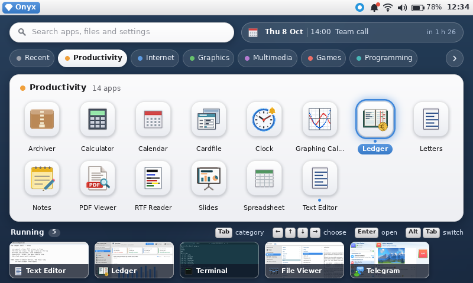 | **v2 at 800 × 480**: the search field and Today, the chips (Productivity chosen), the card with its header, Ledger focused (ring, glow, pill), the running apps as thumbnails, the hints on their line. |
| 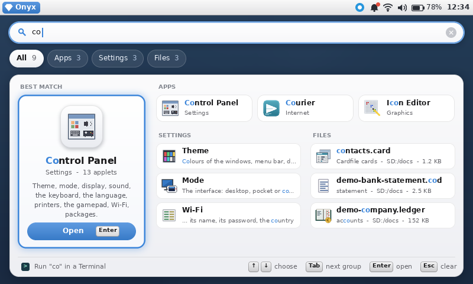 | **v2, typing "co"**: the field across the width, All / Apps / Settings / Files with their counts, Control Panel as the best match, Courier and Icon Editor, the applets Theme, Mode and Wi-Fi by their help lines, three files of `SD:/docs`; run "co" in a Terminal. |

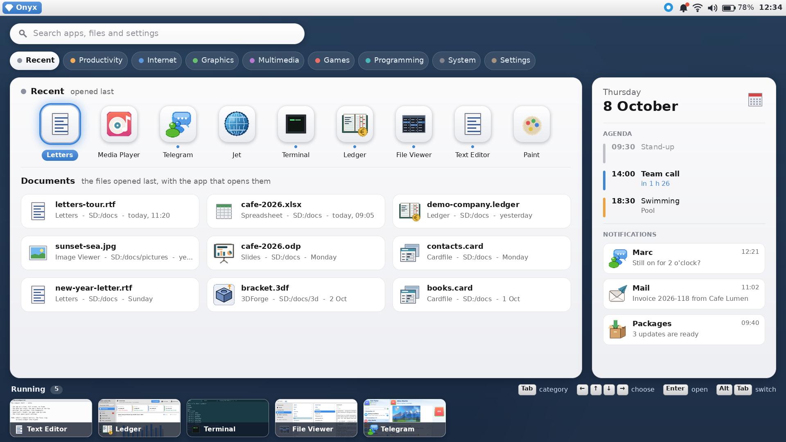

*v2 at 1920 × 1080 — the user's screen — drawn at its real size with the scale 1.5 (1280 × 720 lp): the same
layout; Recent with the apps opened last and the Documents; the Today column at the right (Thursday 8
October, the agenda, the notifications of Telegram, Mail and Packages).*

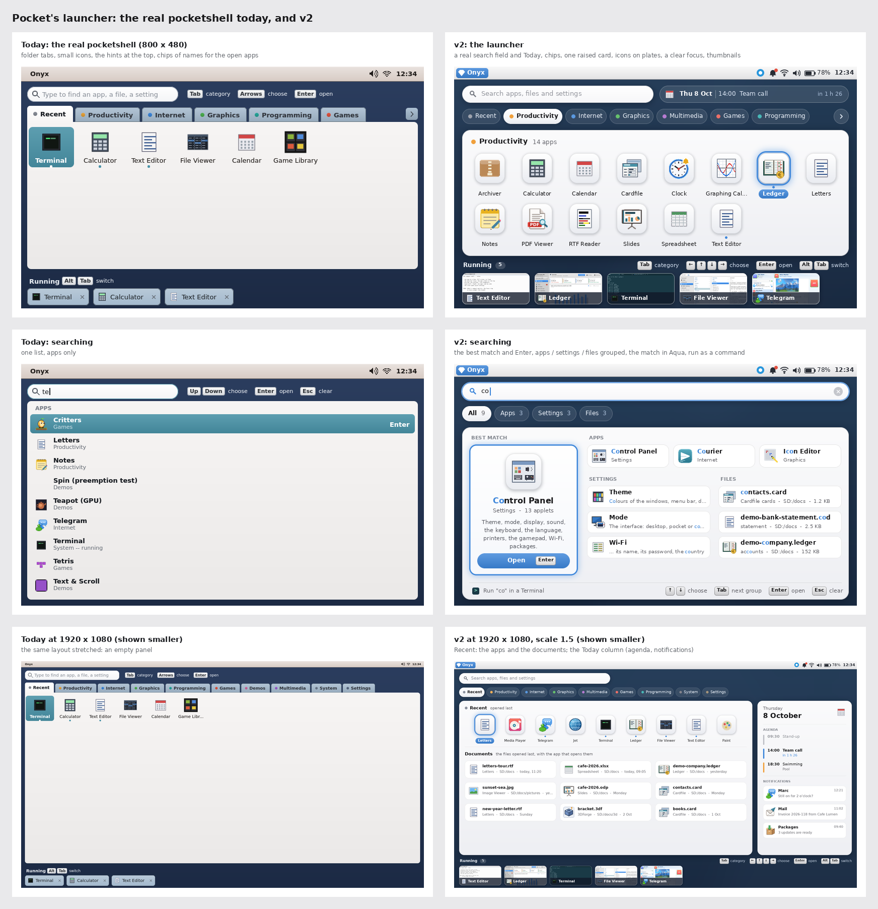

*The real pocketshell today beside v2: the launcher, the search, and 1920 × 1080.*

**Built** (2026-10-08, `pocketshell`: docs/HANDOFF.md; the real pictures `docs/compact-shell/real/pocketshell-*.png`):
the menu bar's Onyx is the Home button in pocket; the documents are SystemKit's `recent.h`.

What v2 asks of the code is small: the shell's drawing (plates, chips, shadows: UIKit's existing rounded
boxes and gradients, a blurred shadow drawn once per layout), `EL_OP_SHOT` thumbnails (already used by the
switcher), the Agenda's next event and the notifications (SystemKit), and a recent-documents list.

### 6.3 An app in use

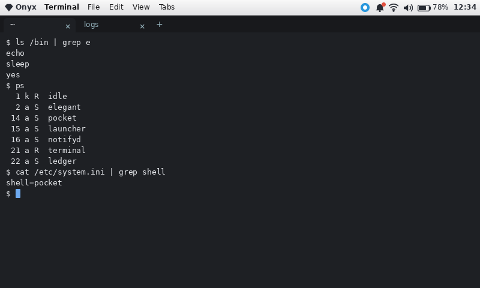

*The Terminal, full screen, no frame. The status bar is today's menu bar: the Onyx button, the app's name
in bold, its menus (File, Edit, View, Tabs — published by the app through `set_menu`, unchanged).*

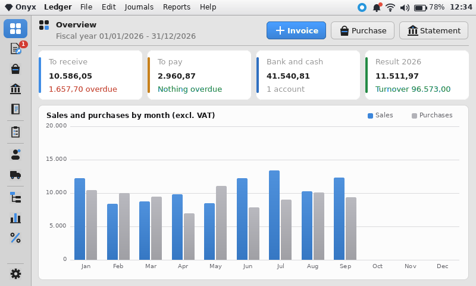

*Ledger (designed for 1000 × 700) in compact mode: its sidebar folds into an **icon rail** (the labels on
focus or long press; the badge stays), the four cards narrow, the chart shortens, the bottom panels go into
a scroll. The icons, cards and buttons are the real app's, recoloured to Milk.*

Ledger is the case to design for: most productivity apps are built for about 1000 × 700 (§9.1). The rail is
UIKit's job (a `Sidebar` that folds below a width), not Ledger's alone.

### 6.4 The app's menus

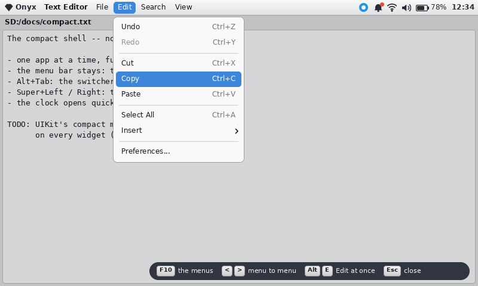

*The menus stay in the status bar. F10 (or the Menu key, Start on a gamepad) opens the first; ← → go from
menu to menu, Alt+letter opens one at once, Esc closes. Rows are 26 px in the compact profile; a submenu
cascades (Insert ›).*

In portrait (§6.9) the menus fold into one ☰ button and open as a **sheet** from the bottom. When the app's
menus do not fit the bar in landscape (a long app name, many menus), the last ones fold into "»".

### 6.5 The task switcher

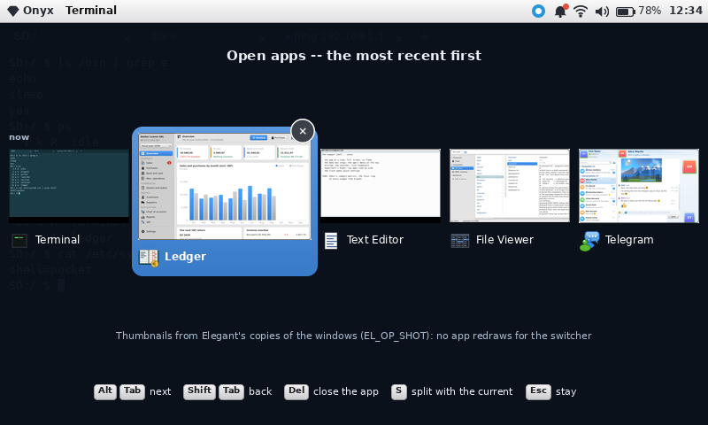

*Alt+Tab: the open apps, the most recent first, the next one chosen (the current one, "now", on the left).
Thumbnails come from Elegant's copies of the windows (`EL_OP_SHOT`): no app redraws for the switcher.
Del closes the chosen app; S puts it beside the current one (split view).*

Release Alt (or Enter, A, a tap) to switch; Esc stays. The Tasks key of a d-pad device opens it held open:
arrows choose, OK switches.

### 6.6 Status, notifications and quick settings

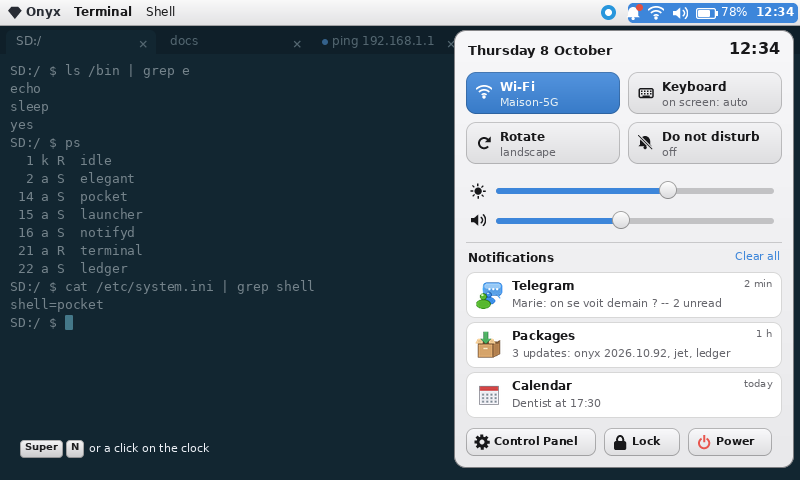

*Super+N, or a click on the clock: the quick settings — Wi-Fi, the on-screen keyboard, rotation, do not
disturb; brightness and volume; the notifications (`notifyd`, SystemKit's `notify.h`); the Control Panel,
Lock and Power.*

- The **status bar** keeps today's right side: the tray icons (`EL_OP_TRAY_*`), the notifications bell (a
  dot when unread), Wi-Fi, the volume, **the battery** (new: a handheld runs on one), the time. One click
  on any of them opens this panel scrolled to that part.
- A notification arriving shows as today's toast under the status bar for a few seconds, then waits in
  the panel. A full-screen game keeps them silent (do not disturb is automatic while an app holds the
  full screen).
- The Wi-Fi menu (`wifimenu`) and the Sound applet become tiles here; long press on a tile opens its
  applet.

### 6.7 Two apps side by side

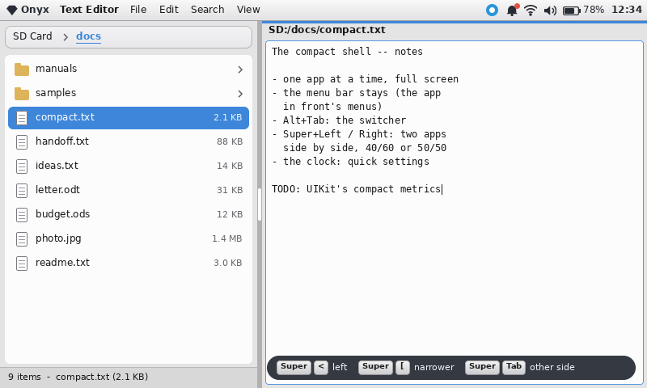

*Super+← / → puts the current app on that half; the other half takes the previous app (or the switcher's
choice). Super+[ / ] moves the divider (40/60, 50/50, 60/40), Super+Tab moves the focus across; the
focused side has the accent line, and the menu bar shows its menus.*

The File Viewer, at 318 px, folds its sidebar (a chevron on its path bar opens it) and keeps one column.
Split view needs 2 × 320 logical px at least: on in landscape, off in portrait.

### 6.8 Fixed-size windows and dialogs

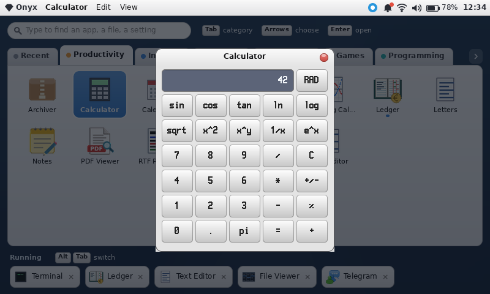

*A window of a fixed size (the Calculator, `UK_WIN_FIXED`) keeps its size: a card in the middle with a Milk
title and its close bead, the rest dimmed. Esc or a tap outside goes back.*

The same rule serves the apps that are smaller than the screen and do not want to grow (the Calculator,
the Clock's mini mode, the demos) and the dialogs (a message box, a file dialog): those would rather become
**full-screen sheets** in the touch profile — a UIKit choice (§9).

### 6.9 Pocket in portrait, in detail

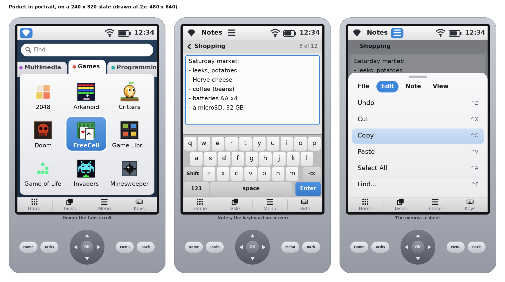

*Pocket in portrait at 240 × 320 lp, drawn at 2× in an SL-5500-like slate — the same Pocket as §6.1, its
portrait details: the launcher (the tabs scroll, 3 columns), Notes with the on-screen keyboard, and the
menus as a bottom sheet. Four soft keys at the
bottom — Home, Tasks, Menu, Keyboard — mirror the device's keys.*

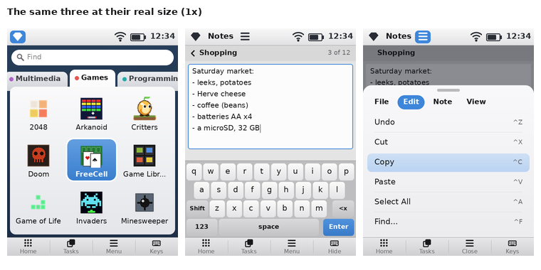

*The same screens at their real size (1×): the text is still readable — at a true 1× panel the fonts would
be FreeType's, hinted at 10–11 px.*

The portrait status bar keeps the Onyx button, the app's name, ☰ and the essentials (Wi-Fi, battery,
time); the tray and the bell move into the quick settings. The soft-key bar only appears on devices
without those keys (`compact.ini`, §11).

### 6.10 The navigation map

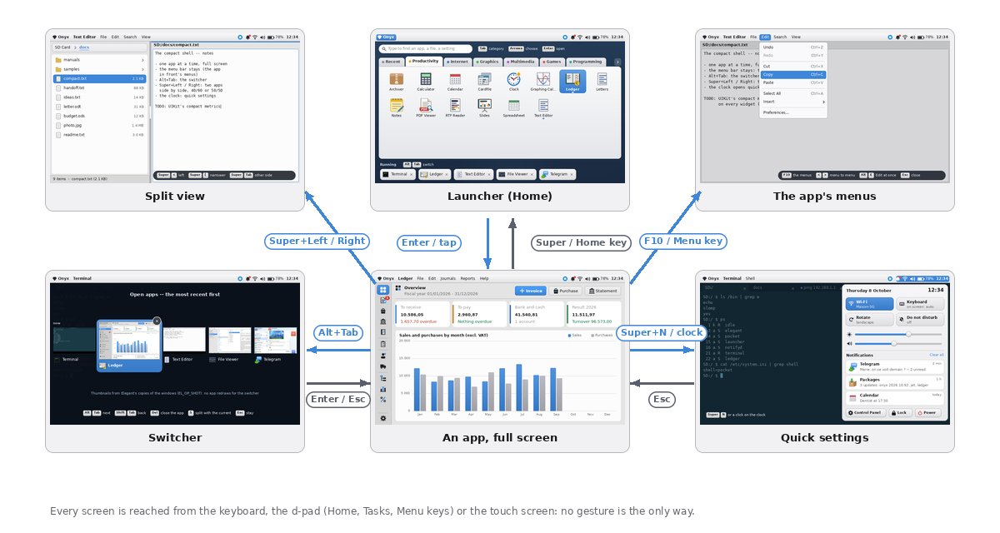

*Every screen and the keys between them. Home ↔ an app (Enter / Super); an app → the switcher (Alt+Tab),
quick settings (Super+N), its menus (F10), split view (Super+← / →).*

### 6.11 The Control Panel in pocket mode

The Control Panel (`user/Apps/control`, PocketUI's phase P6) opens full screen from Home's **Settings** tab or
quick settings. Its applets are the same programs and the same `.lnk` files
(`SD:/apps/control.app/applets/*.lnk`, in their order: Theme, Mode, Display, Panel, Sound, Preload, Keyboard &
Mouse, Language & Region, Printers, Gamepad, Wi-Fi, Packages, App Settings); only the host's layout changes:

- **Landscape**: the applets as **links in a left column** (a SidePanel: the icon and the name; at
  1280 × 720 and wider, the `.lnk`'s help line under the name), the chosen one in Aqua; **the applet fills
  the rest** and lays itself out in the room it is given — Theme puts its preview at the left and its controls
  at the right, the Desktop group across the bottom, Apply / Discard at the bottom right. ↑ ↓ choose an
  applet, → or Tab enters it.
- **Portrait**: the **list** as on the desktop, one column of big rows (the icon, the name, the help line,
  a chevron); an applet opened takes the screen under a **back bar** (‹ Control Panel and the applet's
  title); the applet stacks its controls (Theme: the preview on top, the rows under it, Apply / Discard pinned
  at the bottom over the scrolling content).
- **Decided by the user (2026-10-08): the landscape layout also replaces the desktop's dashboard** — the
  Control Panel on the desktop becomes the same links-and-applet window (no grid of icons to go back to); the
  portrait list stays for narrow windows and pocket in portrait.

| | |
|---|---|
| 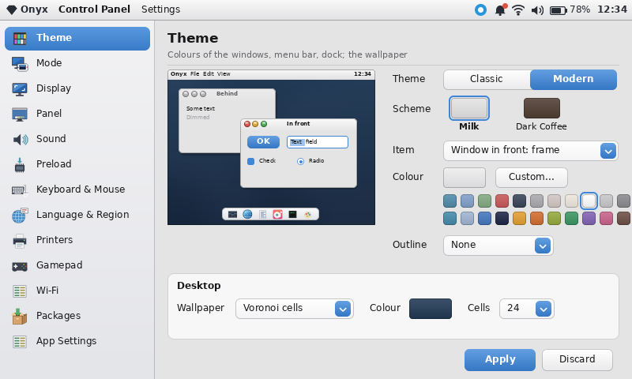 | **Landscape, 800 × 480**: the thirteen applets as links, Theme open and filling the rest. |
| 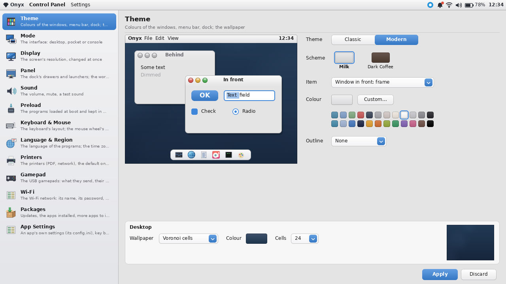 | **Landscape, 1280 × 720**: the links with their help lines, Theme spread out (the wallpaper's preview in the Desktop group). |
| 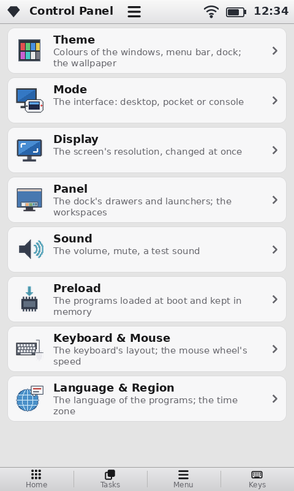 | **Portrait, 480 × 800 (1.5×)**: the list, one column. |
| 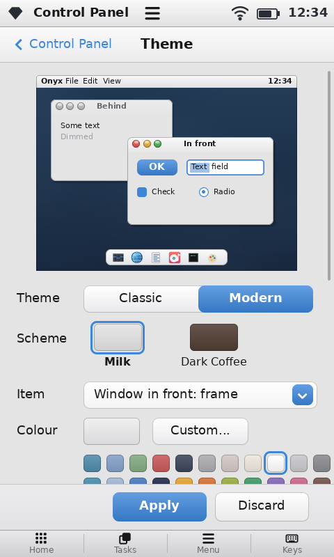 | **Portrait, an applet open**: the back bar, Theme stacked, Apply / Discard pinned. |

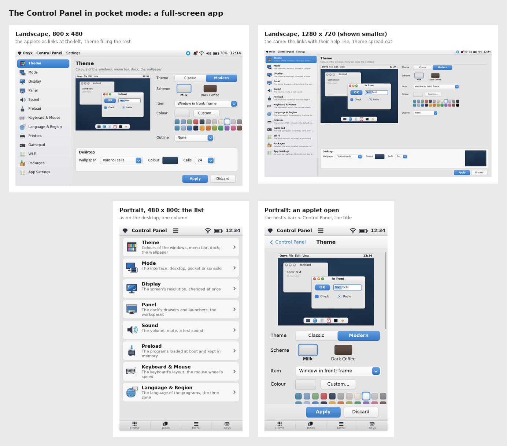

*The Control Panel in pocket mode, landscape and portrait.*

## 7. Console mode

The third mode, for a Pi handheld with a gamepad or a Pi under the TV: the games, the emulators and the
media first, **made for the pad** (the mouse and the keyboard work as well, §7.2), and the mood of the **PlayStation 2's system browser** — the user's wish: a
deep blue-black space with soft floating motes, glowing translucent towers of cubes receding into the
dark, big thin words ("Browser", "System Configuration" in the PS2), a glowing highlight on the chosen
item, memory-card-like tiles. It stays Onyx: Milk's Aqua blue is the glow, the Onyx gem is in the corner,
the apps and the kits are the same.

> **A second look, 2026-10-09**: §16 proposes a console home in the manner of a modern TV console (the PS4)
> and of Lakka, the games classified by console — mock-ups only.

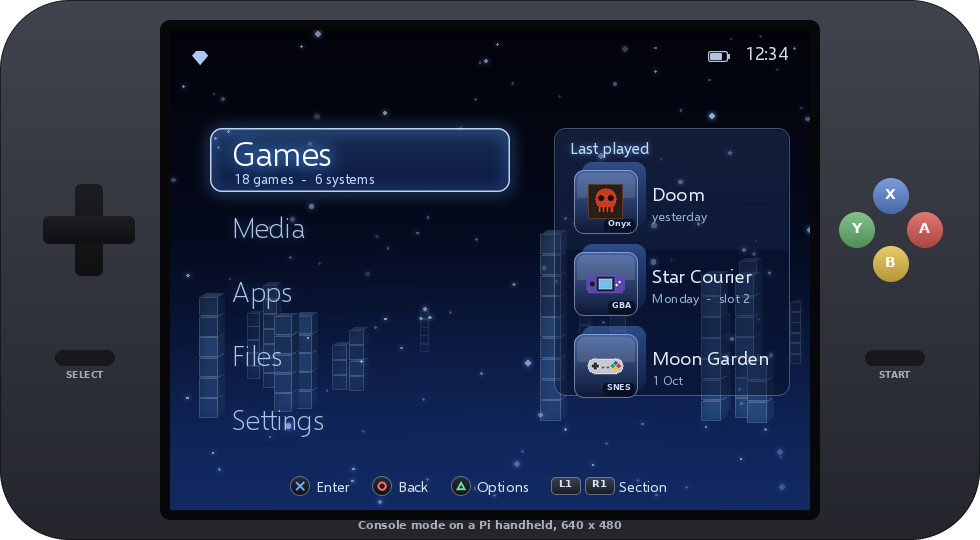

*Console mode on a Pi handheld (640 × 480).*

### 7.1 The screens

| | |
|---|---|
| 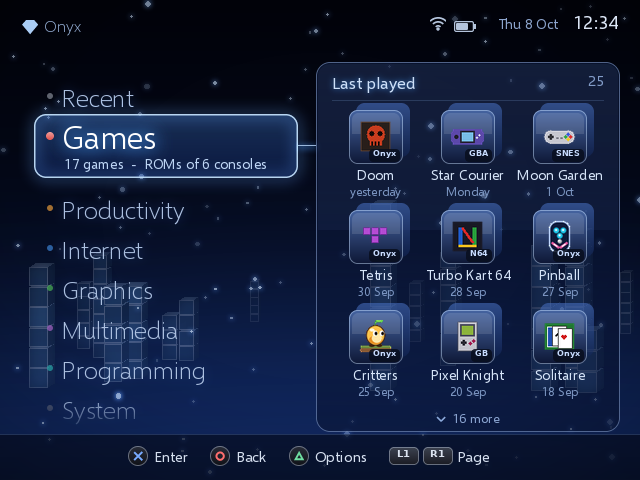 | **Home**: the browser itself — at the left the **categories** of the apps (Recent, Games, Productivity, Internet, Graphics, Multimedia, Programming, System, then Files and Settings), the chosen one glowing with a line about it; at the right, **the apps of that category** as memory-card tiles (for Games: the games and ROMs last played). The towers and the motes are the background. §7.4 has the details. |
| 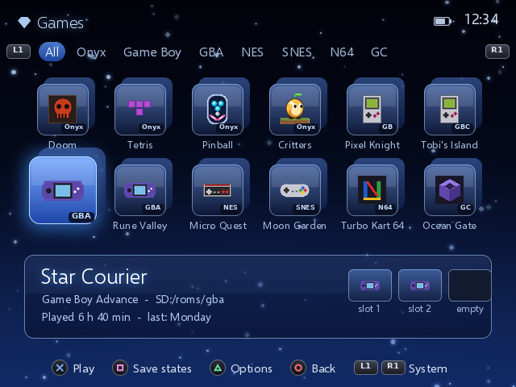 | **Games**: the library — Onyx's own games (Doom, Tetris, Pinball, Critters; SuperTuxKart when its port lands) and the ROMs of the six emulators (Game Boy / Color, GBA, NES, SNES, N64, GameCube: `games =` in their `app.txt`, `SD:/roms`), as glossy tiles with depth and the system's badge; L1 / R1 change the section (All, Onyx, Game Boy...); the chosen game's panel: its system and file, the time played, its **save states as memory-card slots**. |
| 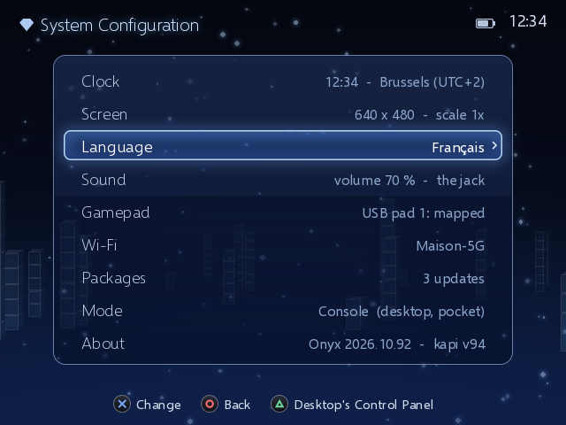 | **Settings** ("System Configuration"): clock, screen, language, sound, gamepad, Wi-Fi, packages, the **mode** (console, pocket, desktop), about; each row opens a pad-friendly page; △ opens the desktop's Control Panel applet itself. *Grown into §7.6: the applets at the left, their pages at the right.* |
| 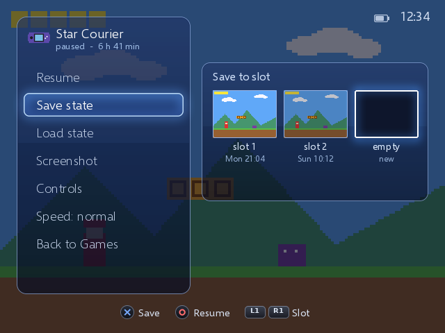 | **In a game, Home pressed**: the game pauses under a dim; a glass column — Resume, **Save state** (three slots with their pictures), Load state, Screenshot, Controls, Speed, Back to Games. |
| 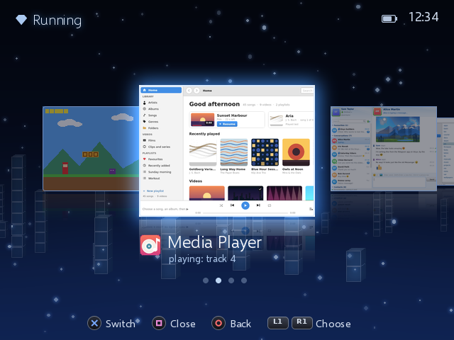 | **Running**: the open games and apps as cards in depth, the chosen one in front with its glow and a reflection; ✕ switches, □ closes. Thumbnails from `EL_OP_SHOT`. |

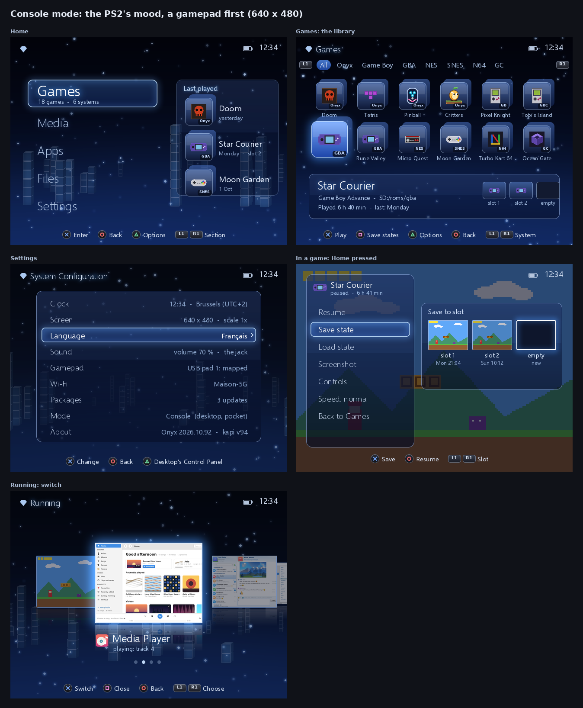

*The five console screens on one page.*

### 7.2 How it works

- **The pad first**: d-pad to move, **✕ confirm, ○ back**, △ options, □ a second action (save states,
  close), **L1 / R1 the sections**, Select or the Home button = the menu (an app's menus, a game's quick
  menu: one gesture to learn, §7.3). On a pad without these symbols: A = ✕, B = ○, Y = △,
  X = □ (the Gamepad applet maps them, `SD:/etc/gamepad.ini`). The bottom line always shows the buttons
  that work on the screen.
- **Mouse and keyboard, full alternatives to the pad** (the user, 2026-10-08): nothing in console mode needs
  the pad. **Mouse**: hovering moves the focus glow, **left click = ✕** (open, enter), **right click = △**
  (actions), the wheel scrolls the lists (and the home's category column). **Keyboard**: the arrows = the
  d-pad (left / right between the columns, up / down in a list), **Enter = ✕**, **Esc or Backspace = ○**,
  **Page Up / Page Down = L1 / R1**, **Alt, F10 or the Menu key = Home** (the menus). The hints at the bottom
  keep the pad's symbols; a keyboard-only user reads them through this mapping.
- **What it reuses**: the Game Library's index of the ROMs and its covers (`apps/gamelib`), the emulators'
  save states, the Media Player's library (Media), the File Viewer's volumes (Files), the Control Panel's
  applets (Settings), Pocket's switcher and overlays drawn in the console style.
- **Apps** opens any desktop app **full screen, with no chrome**; its menus appear on demand (§7.3):
  console mode is Pocket with another home and another style, not a separate world.
- **No on-screen keyboard**: console mode assumes a gamepad and, when text is needed, a **physical
  keyboard** (USB or Bluetooth); an app that needs one says so once, at its start, if none is plugged in.
- **Its cost**: the towers, the motes and the glows are **drawn once** into the background (the wallpaper
  buffer, `wallpaper_buffer`), not animated every frame — or animated slowly at a few frames a second when
  nothing else runs (an option); a game always runs on the emulators' fast path, untouched.
- **Words**: big and thin (Selawik Light, on the card), 28–34 lp for the choices, 14–16 lp for the details:
  readable on a TV at three metres and on a 3.5" handheld.

### 7.3 Apps in console mode: full screen, the menus on demand

An app runs **full screen with no visible chrome** — no status bar, no frame. Its menu bar (the app's own
UIKit menus, published as on the desktop) appears at the top **on demand**:

- **the pad's Select / Home button** — the same button that opens a game's quick menu: one gesture to learn;
- **the keyboard's Alt or F10**;
- **the mouse at the very top edge**, after a short dwell (about 300 ms) or a push against the edge, so that
  it is not revealed by accident.

The revealed bar is **console-styled**: big items, a glowing focus, the d-pad to move, ✕ to choose, ○ to
close; it hides again after a command. For an ordinary app it merges **the app's menus (top)** with **the
system's items below** (Home, Switch app, Quit). For **games and emulators**, Home opens the game's quick
menu instead (§7.1) and the top-edge reveal is off. At an app's start a small hint, **"Home or Alt: menu"**,
shows for about 3 s.

| | |
|---|---|
| 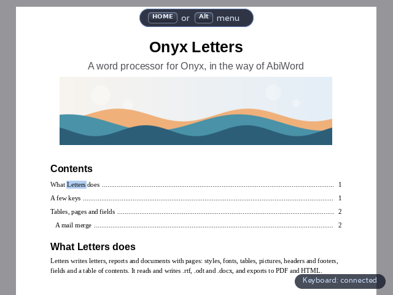 | **Letters, full screen**: the page only (its toolbars hidden: everything they do is also in its menus); the start hint at the top; a keyboard is connected. |
| 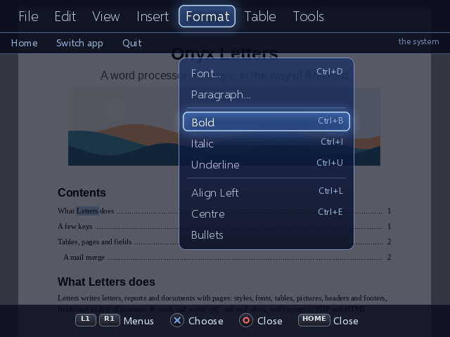 | **Letters, Home pressed**: its own seven menus in console style, Format open (the real items), Bold focused; the system's row below (Home, Switch app, Quit); the pad's hints. |
| 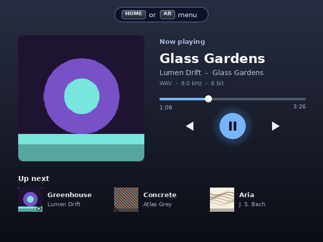 | **The Media Player, full screen**: its own Now playing view at 640 × 480, the pad's focus on Play / Pause; Home shows its File / Play / View menus. |

### 7.4 The home: the categories and their apps

The home is the browser (the user's choice, 2026-10-08): **no separate Apps screen** — the left column lists
the categories, the right panel shows what the chosen one holds. The composition stays the first mock-up's
(the big thin words at the left, a glass panel at the right, the towers and the motes behind).

- **The left column** comes from the apps' own `app.txt` (`category =`): **Recent** first, then **Games**
  (Onyx's games and, merged in, the Emulators' ROMs from their `games =`), **Productivity, Internet, Graphics,
  Multimedia, Programming, System**, and last **Files** (the File Viewer's volumes) and **Settings** (the
  Control Panel's applets, `category = Settings`). *Demos* and *Shell* (the desktop's own parts) are not shown.
  A category's colour (Milk's, §12) is its dot. Ten entries do not fit at the big size: the list scrolls, the
  chosen entry stays near the top, the ends fade.
- **Why Recent first**: the console wakes on what was used last — the game paused, the document open — so one
  press of ✕ resumes it, and a running app is never more than one step away. It also replaces a separate
  "Running" list for everyday use (the switcher, §7.1, stays for closing things).
- **The right panel**: the category's apps as glossy tiles with their real icons, three a row, the name and a
  line under each — for Games the date last played and the system's badge, for Recent when it was used, for
  the others what the app is. A glowing Aqua dot in a tile's corner = the app is running. The panel says how
  many there are and scrolls ("5 more").
- **The pad**: up / down choose the category (the panel follows at once); **right or ✕** enters the panel: the
  column shrinks to small words with the category marked, the chosen tile lifts and glows, and a **card** at
  the bottom left describes it — its name, its category and kind, a line about it, **"keyboard recommended"**
  for an app made for typing (from its `app.txt`, a key to add), **running**. ✕ opens the app full screen
  (§7.3), **△** opens its options, **○** returns to the categories, L1 / R1 move a page.
- **Mouse and keyboard** (§7.2): hover moves the glow, the wheel scrolls the category column and the panel, a
  left click enters or opens, a right click shows the options; the arrows move between the column and the panel.
- **The options (△)**: a small glass menu beside the tile, the rest dimmed — **Open**, **Pin to Recent** (it
  stays at the head of Recent), **Close app** (only when it runs), **Info** (its package, version, files).

| | |
|---|---|
|  | **Games focused**: the last played, the systems' badges, 16 more below. |
| 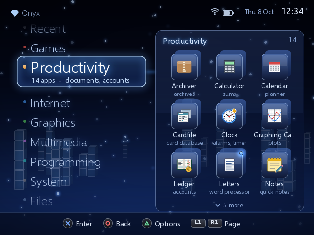 | **Down: Productivity**: its 14 apps (Archiver to Text Editor), Letters running (its dot). |
| 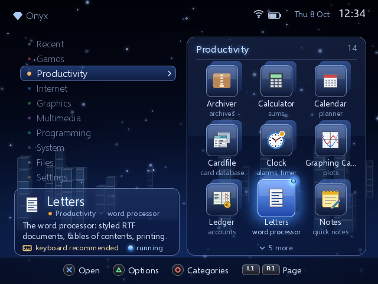 | **Right or ✕: in the list**: Letters glowing, the categories small at the left, its card below them: word processor, keyboard recommended, running. |
| 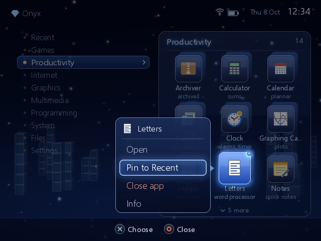 | **△ on Letters**: Open, Pin to Recent, Close app, Info. |

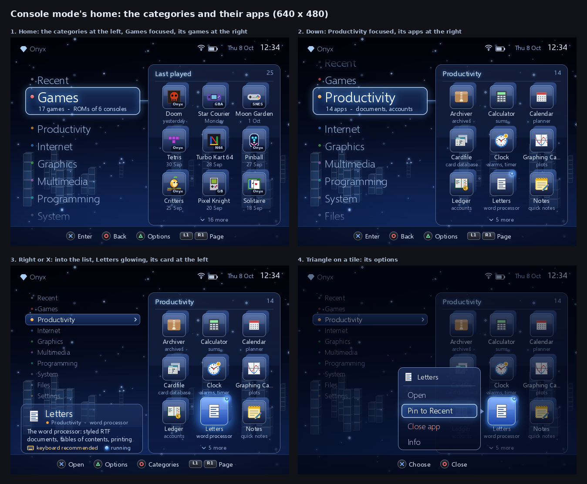

*The console home's four states on one page.*

### 7.5 The File Viewer in console mode

> **Decided by the user (2026-10-08): console mode gets its own file browser, in `consolehome`** -- the home's
> **Files** entry opens it (phase P9), written for the console (the pad first, FileKit for the files, the actions
> below: open with the associated app, copy, move, rename, trash). The pictures below are its reference. The File
> Viewer stays one app: migrated to the adaptive widgets (P7) for pocket; started by hand in console mode it works
> with the generic console rendering, but it is not console's way to the files. ("One binary per app" holds: the
> console browser is another program, not a console build of the File Viewer.)

The File Viewer (`user/Apps/fileviewer`: on the desktop a NeXTSTEP column browser, its places at the left, a
path bar, a preview column, its menus File / Go / Edit and a right-click menu) shows how a UIKit app with a
navigation panel becomes a console app, through the adaptive widgets of `docs/POCKETUI-TECH-STUDY.md` §6 — no
special code in the app beyond those widgets:

- **The places** (`SD:/etc/places.ini`: Personal — the pinned folders and the Trash; Computer — SD Card, the
  USB stick; Network — the servers and Connect to Server...) are the **SidePanel's console column**: big rows,
  the place shown marked, **L1 / R1** step through them from anywhere; left from the list enters the column.
  When a preview needs the width, the column **folds to a rail of icons** (still L1 / R1).
- **The columns become one big list** — one folder at a time, the folders first, rows of 34 px, the focused
  one glowing; **right or ✕** enters a folder, **○ goes up**; the path bar is a **breadcrumb** of chips at the
  top (the current folder lit). A file's icon is **the icon of the app that opens it** (`SD:/etc/fileassoc.ini`,
  as the desktop reads it): Letters for `.rtf`, Slides for `.odp` / `.pptx`, the Spreadsheet for `.xlsx`,
  Cardfile for `.card`, Ledger for `.ledger`; a plain page when nothing opens it.
- **The preview column becomes a panel** at the right: the picture (with the console's glow and a faint
  reflection), its type, size and dimensions, the app that opens it.
- **△ (or a right click) = the row's menu**, the desktop's own items in console style: Open (with the app's
  name), **Open with...**, Copy, **Move...** (Cut then Paste become one step: choose the destination folder),
  **Rename...** (marked with a keyboard: there is no keyboard on screen in console), Move to Trash, Info.
- **Home** reveals the app's real menus at the top (§7.3): File, **Go** (SD Card, USB Stick, Eject USB Stick,
  Disks, Trash, Connect to Server..., Pin This Folder..., Restore from Trash, Empty Trash...), Edit; the system's
  row below (Home, Switch app, Quit); the shortcuts hidden.
- **Mouse and keyboard** work as everywhere in console (§7.2): hover moves the glow, a left click opens, a
  right click shows the actions (the pointer in the third picture), the wheel scrolls; the arrows, Enter,
  Backspace (up), Page Up / Down (the places) and Alt / F10 (the menus) do the pad's work.

| | |
|---|---|
| 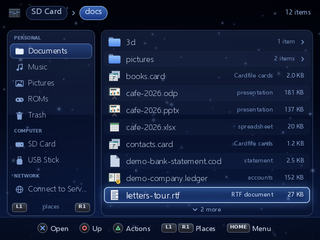 | **SD:/docs** (its real content): the places at the left (Documents marked), the folder as big rows with the opening apps' icons, `letters-tour.rtf` focused; ✕ Open, ○ Up, △ Actions, L1 / R1 Places, Home Menu. |
| 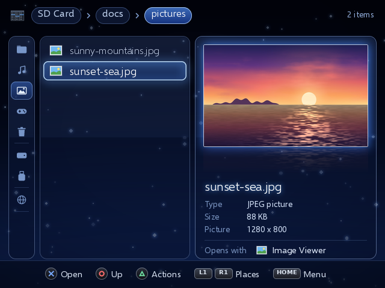 | **A picture focused** (`SD:/docs/pictures/sunset-sea.jpg`): the places folded to a rail, the preview panel — the picture, JPEG, 88 KB, 1280 × 800, opens with the Image Viewer. |
| 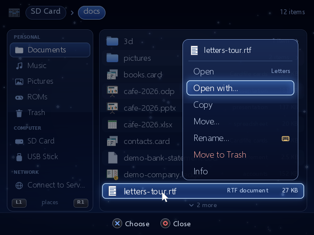 | **△ or a right click on a file**: Open (Letters), Open with..., Copy, Move..., Rename... (keyboard), Move to Trash, Info; the mouse's pointer on the row. |
| 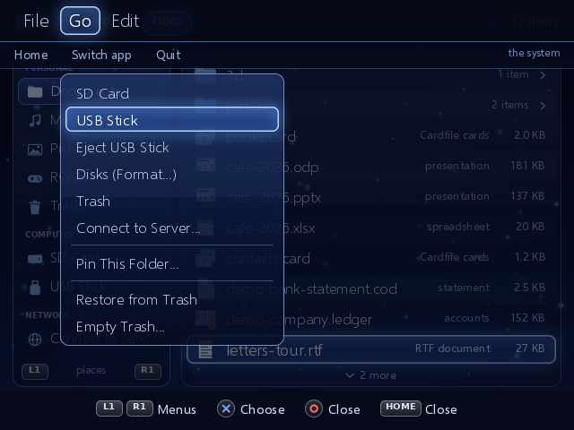 | **Home**: the File Viewer's menus File / Go / Edit, Go open with its real items, the system's row below. |

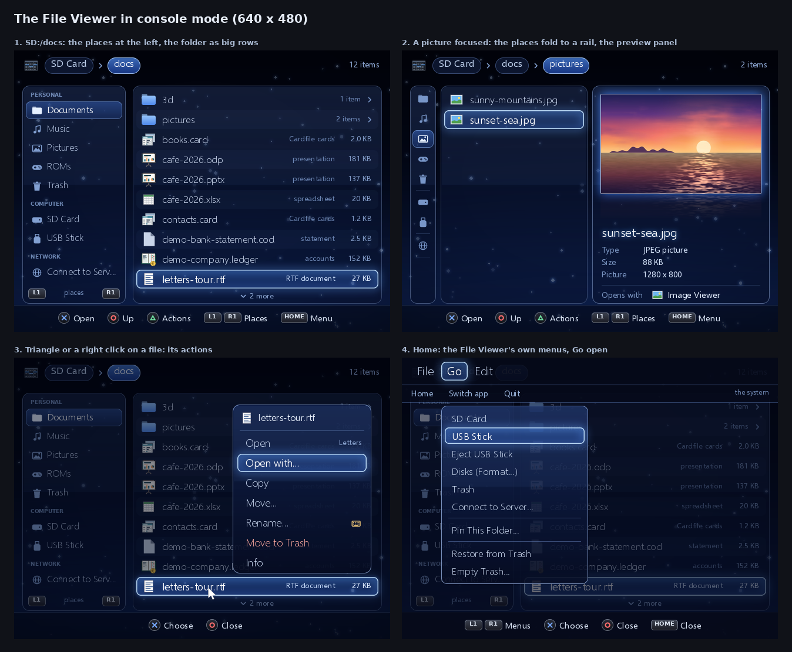

*The File Viewer in console mode, four states.*

### 7.6 The Control Panel in console mode

The home's **Settings** entry opens the Control Panel **full screen, in the console's own style** (in
`consolehome`, like the file browser, phase P9) — the first mock-up's "System Configuration" list
(`console-settings.png`, §7.1) grown into the same two-part composition as the home: **the applets in a
column at the left, the chosen applet's page in a glass panel at the right**. The applets are the Control
Panel's `.lnk` files (`SD:/apps/control.app/applets/`), in their order, with their real icons, names and help
lines; each page is drawn by the console host from what the applet declares (its settings as rows), not by
the desktop applet's window.

**Which applets, and why.** Console mode keeps what a person under a TV or with a handheld needs, and leaves
the rest to the desktop and pocket (a `.lnk` key, `modes = desktop pocket console`, would say where an applet
shows; the default is every mode):

| Applet | In console | Why |
|---|---|---|
| Mode | **yes** | the way back to pocket or the desktop must be reachable with the pad alone |
| Display | **yes** | the TV's resolution and the scale; plus the console's own **Background** (still, or slowly animated: §7.2) |
| Sound | **yes** | volume, mute, the output (HDMI, the jack, USB) — the first thing changed on a TV |
| Keyboard & Mouse | **yes** | the physical keyboard's layout matters as soon as one is plugged in (console has no on-screen keyboard) |
| Language & Region | **yes** | the language and the time zone: two lists, pad-friendly |
| Gamepad | **yes** | the mode is made for the pad: see what it sends, map its buttons |
| Wi-Fi | **yes** | join a network; the password needs a keyboard (below) |
| Packages | **yes** | updates and new games / apps, as a list with Install / Update |
| About | **yes (new)** | the console host's own page: Onyx's version, the kernel, the card, the memory |
| Theme | no | console has its own look (the PS2's mood, Milk's Aqua as the glow); the windows' colours and the wallpaper do not show there |
| Panel | no | the dock and the workspaces do not exist in console |
| Preload | no | a technical list of programs, rarely changed: the desktop's job |
| Printers | no | adding a network printer means typing an address; printing from the TV is rare |
| App Settings | no | an app's `config.ini` key by key needs a keyboard and the desktop's care |

△ on a hidden applet's place is not offered; the desktop's Control Panel stays one mode switch away.

**The screen.**

- **The column** (focus at the left): the applets as big thin words with their icons, the chosen one glowing,
  a thin light from it to its panel; the panel already shows the applet's page (dimmer) so up / down is a
  preview. **Right or ✕** enters the page: the column shrinks to small words with the applet marked (as the
  home's), and a **card at the bottom left** explains the focused row — what it does, where it is kept, and,
  in amber, when a keyboard is needed.
- **The page**: the applet's icon, name and help line (the `.lnk`'s), then **big rows (38 px)** — the label
  at the left, **the value at the right**: a value between ‹ › that **← / →** change (Play on: Headphone
  jack; Resolution: 1280 × 720 HD), a **bar** of ten segments (Volume 7 / 10), a **switch** (Mute), an
  **action** with its ✕ (Test sound: Play; Scan again), a **sub-page** with its chevron (Programs playing ›,
  Map buttons ›). The focused row glows. The file it is kept in is written small at the bottom.
- **The keys**: **◀ ▶ Value, ✕ Change** (or open the sub-page), **○ Back** (to the column, then Home),
  **△ Reset** (the row's default), **L1 / R1 Page** — the previous / next applet from anywhere. The mouse and
  the keyboard as everywhere in console (§7.2): hover moves the glow, a click changes or opens, the wheel
  scrolls; the arrows, Enter, Esc / Backspace, Page Up / Down.
- **Changes apply at once** and are kept in the applet's own file (`sound.ini`, `cmdline.txt`,
  `gamepad.ini`, `wpa_supplicant.conf`...); a change that could leave the screen black (a resolution) is
  tried and asks **"Keep it?"** — with no answer in 15 s the old one comes back.
- **Gamepad > Map buttons** needs the width: the column **folds to a rail of icons** (L1 / R1 still work).
  The page asks for one button at a time in padconf's own words ("Press the RIGHT face button — Xbox B,
  PlayStation Circle, Nintendo A"), with **a pad drawn by place** (what the apps see, `gamepad.ini`): the
  buttons learnt filled, the one asked glowing, the rest outlined; at the right the 17 functions and what each
  took (hat, button 3...), a progress (6 / 17). While a pad is being learnt its buttons cannot steer: **Esc**
  skips and **Backspace** cancels on a keyboard, **holding Home** cancels on the pad, and a step with no answer
  for 8 s is skipped (the pad has no such button). The section `[vvvv:pppp]` is written at the last step.
- **Wi-Fi**: the networks around (`wifiscan`, as the menu bar's Wi-Fi menu) with their **signal bars**, a
  lock when protected, **Connected** on the current one; then Country (‹ BE Belgium ›) and Scan again.
  **✕ connects** an open network at once; a **protected network needs its password typed on a physical
  keyboard** (USB or Bluetooth) — console mode has no keyboard on screen (§7.2): the card says so, and the
  password field opens only when a keyboard is connected. △ forgets a known network.

| | |
|---|---|
| 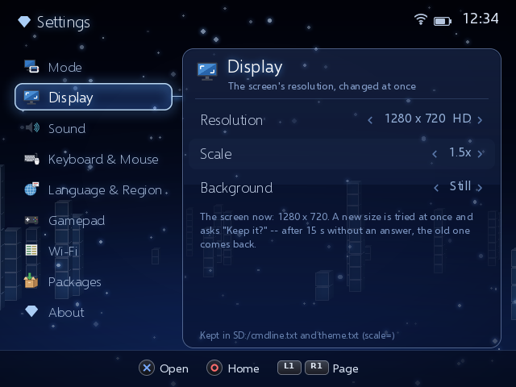 | **Settings, the column focused**: Display glowing, its page at the right — Resolution, Scale, Background, the "Keep it?" note. |
| 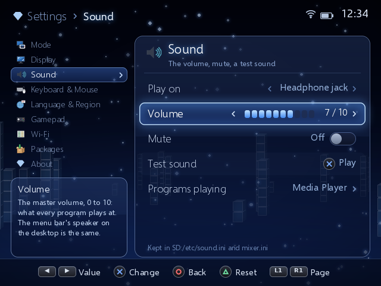 | **In Sound's page**: Play on, **Volume** (glowing, 7 / 10), Mute, Test sound, Programs playing ›; the column small, Volume's card at the bottom left. |
| 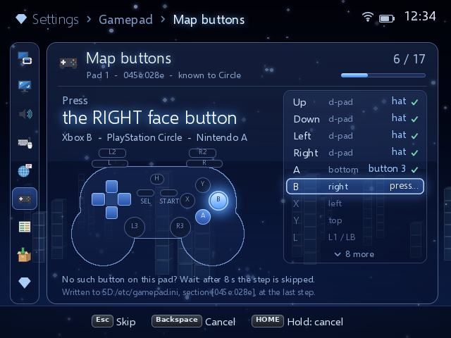 | **Gamepad > Map buttons**: the rail, the request, the pad drawn by place (B glowing), the functions learnt; Esc Skip, Backspace Cancel, hold Home to cancel. |
| 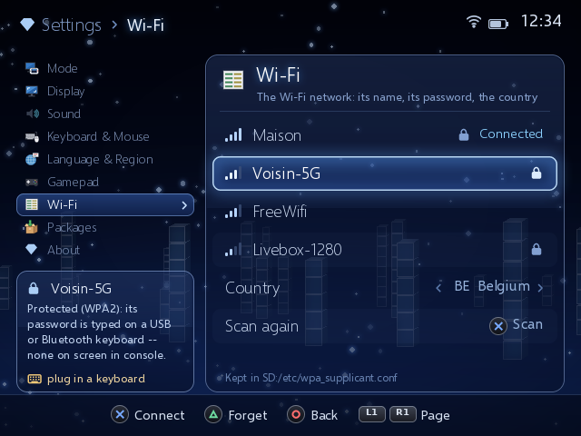 | **Wi-Fi**: Maison connected, Voisin-5G focused (protected: "plug in a keyboard"), FreeWifi open, Livebox-1280; Country, Scan again. |

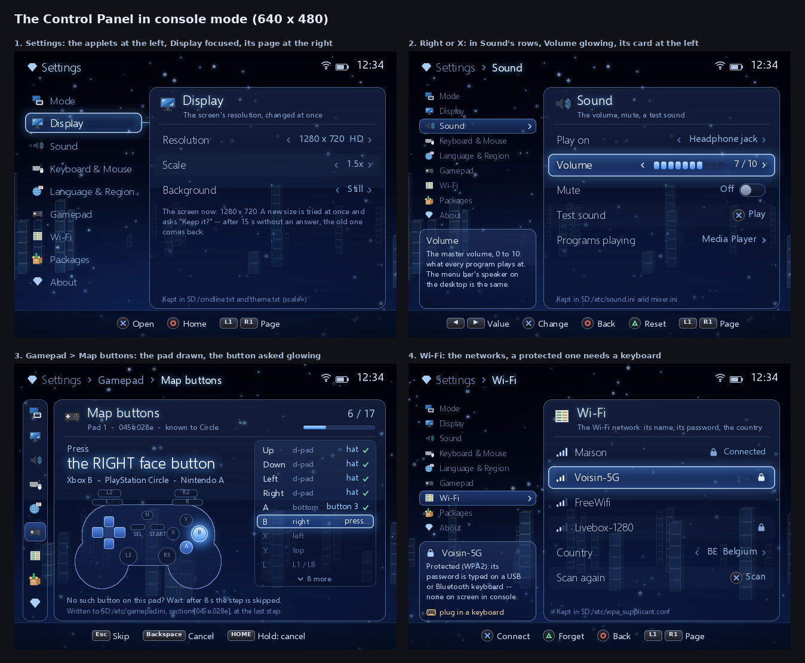

*The Control Panel in console mode, four states.*

## 8. The concepts studied

### 8.1 A — "Tabs" (Qtopia on the Zaurus)

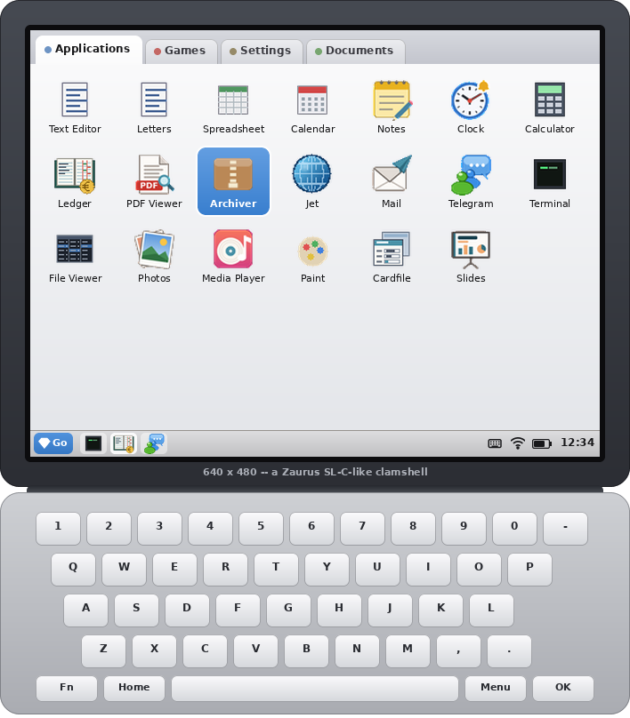

*640 × 480 in a Zaurus SL-C-like clamshell: the launcher's tabs at the top, a taskbar at the bottom (the
Onyx "Go" button, the running apps, the input method, the time); each app full screen with its own menu
inside its window.*

### 8.2 B — "Netbook" (Ubuntu Netbook Remix / Moblin)

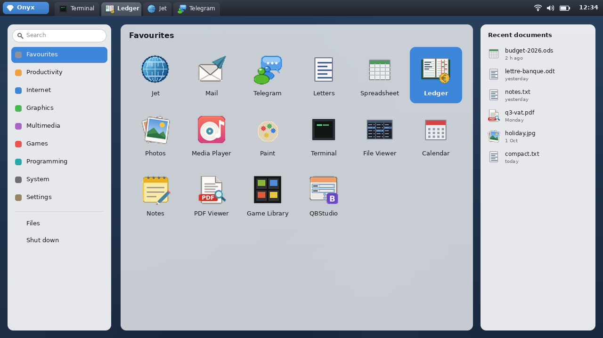

*1280 × 720 (uConsole): a top panel where the open windows are tabs (UNR's "Maximus": no title bars), a
sidebar of categories, a big grid of favourites, recent documents on the right.*

### 8.3 C — "Carousel" (the PSP's XMB) — became console mode

A first handheld concept, categories across and apps down in the manner of the PSP's XMB, was replaced
at the user's request by **console mode** (§7): the PlayStation 2's mood, the same gamepad-first rules.

### 8.4 The comparison

| | A — Tabs | B — Netbook | Console | **Pocket** |
|---|---|---|---|---|
| Fits what Onyx is (menus, terminal, productivity) | good, but the menus move into each app | good | games and media only | **best: the menu bar kept** |
| Keyboard | good | good | fair (built for a pad) | **good, every screen** |
| D-pad / gamepad | good (a grid) | fair (sidebar + grid + tabs) | **best** | good (the same rules) |
| Touch | good | fair (small window tabs) | fair | good (touch profile) |
| Multitasking | taskbar | **tabs + split** | the Running screen | switcher + split |
| Portrait / 640 × 480 | good | poor (needs width) | landscape | **good: one layout reflows** |
| Work in the apps | **every app** puts its menus in a toolbar | little | little | little (the menus are already published) |
| Recognisably Onyx | fair | fair | the PS2's mood, Onyx's blue | **good** |

**A** is the closest to the Zaurus the user cited, but Qtopia's apps carried their menus in their own
toolbar: on Onyx that means changing every app and losing the global menu bar — its tabbed launcher goes
into Pocket instead. **B** is the most capable on a 1280 × 720 netbook, but its window tabs and three
columns need width: it does not go down to 640 × 480 or portrait — a **netbook mode for later**. The
gamepad case is **console mode**.

**Recommendation: three modes — desktop, pocket, console.** Pocket for every small screen with a keyboard
or touch, landscape or portrait (A's tabbed launcher, Onyx's menu bar as the status bar, B's split view
where wide enough, the d-pad rules everywhere); console for the gamepad; desktop as today. Netbook and pad
later.

## 9. How the apps adapt: what UIKit would need

### 9.1 Where the apps stand

The default window sizes in the code (a quick survey of `user/Apps`): Ledger, Letters, the Spreadsheet,
Slides 1000 × 700; Archiver 960 wide; Cardfile 900 × 600; the File Viewer about 880 × 540; Telegram,
Mail, the Media Player about 950–1000 × 650; Jet 760 wide; the games and the demos 240–640 wide; the
Calculator fixed (288 × 300). **On the 800 × 454 work area of T1, nearly every productivity app is too
big** — they are resizable (`setResizable`, the anchors `ANCHOR_FILL`, the layout panels of
`uikit/layout.h`), but their sidebars, toolbars and minimum sizes were never designed for it.

### 9.2 The requirements (stated as needs, not code)

| # | Requirement | Why |
|---|---|---|
| U1 | **A metrics profile** — *regular* (today), *compact*, *touch* — chosen by the system (`theme.txt`, §11): text size, row and button heights, paddings, scroll-bar width (overlay in compact/touch), menu rows, tile sizes; every widget reads the profile instead of constants. | one app, three densities |
| U2 | **A scale factor** (1, 1.5, 2) applied by UIKit's painter and the text face (FreeType sizes, `uk_*` paint helpers, the frame metrics), not by Elegant stretching a canvas. | T2 and T3; sharp text |
| U3 | **Icons at 2×**: `icon.bmp` is 40 × 40; a 80 × 80 (or 64 × 64) `icon@2x.bmp` per app, ImageKit choosing the best. | the launcher at 2×, B's 64 px grid |
| U4 | **Frameless windows**: when the shell says so, `Root` draws no title bar; the window menu's actions (close, split) go to the status bar's Onyx menu. | full-screen apps |
| U5 | **Size classes**: an app is told its class — *regular*, *compact*, *narrow* (< 360 px, portrait or a split half) — and may give a layout for it; UIKit's own composite widgets do it themselves: a `Sidebar` that folds into a rail, a `TabHost` that becomes a drop-down, a `Toolbar` that overflows into "»". | Ledger, the File Viewer, Mail, Telegram |
| U6 | **A scrolling root** as the fallback: an app whose minimum size is larger than the work area is shown in a scroll view (not cut, not shrunk). | every app usable from day one |
| U7 | **Focus everywhere**: every interactive widget focusable, Tab / arrows traversal in a sane order, the focus ring always visible in compact/touch, Enter/Space/Esc/Menu handled; a d-pad is arrows + Enter + Esc + Menu. | the d-pad, the keyboard |
| U8 | **Touch**: tap = click, long press = right click, drag = scroll in lists, text areas and grids (with inertia), a larger hit slop in the touch profile; text selection by long press. | T1 touch, T3 |
| U9 | **Dialogs as sheets** in compact/touch (message boxes, file dialogs, the colour picker), sized to the screen. | no dialog larger than the screen |
| U10 | **The text-input hint**: a text field that takes the focus says so to the shell (to show the on-screen keyboard), with its kind (text, number, URL). | T3 |
| U11 | **Nothing new in the menus**: the menus stay published through `set_menu` (`EL_OP_MENU_SET`); the shell draws them. Context menus are UIKit's, at the profile's density. | the menu bar kept |

### 9.3 The compact metrics

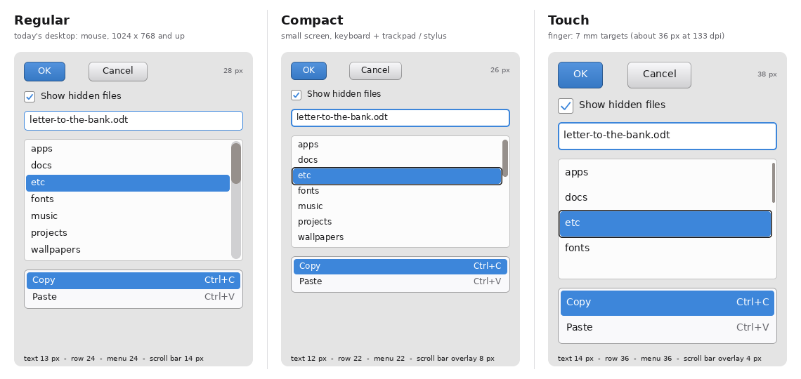

*The same widgets in the three profiles: buttons, a check box, a field, a list with the focus row and its
scroll bar, a menu. Touch targets are about 7 mm — 36 px at the 7" display's 133 dpi.*

Proposed values (to be tried on the real displays): regular — text 13, row 24, menu 24, scroll bar 14;
compact — text 12, row 22, menu 22, overlay scroll bar 8; touch — text 14, row 36, menu 36, buttons 38,
overlay scroll bar 4 that widens when dragged.

### 9.4 Three apps in every mode

Three real apps, read from their sources and screenshots, mocked in each mode: what their **existing
layout** already gives, what **UIKit** would do by itself (U1–U11; since the user's decision of §11, the
UIKit that PocketUI ships), and what the app itself would have to add. Each variant also exists alone in
`docs/compact-shell/mockups/` (`app-terminal-*.png`, `app-media-*.png`, `app-letters-*.png`).

**The Terminal** (`user/Apps/terminal`: a UIKit `TabStrip`, its own `TermView`, one menu, *Shell*).

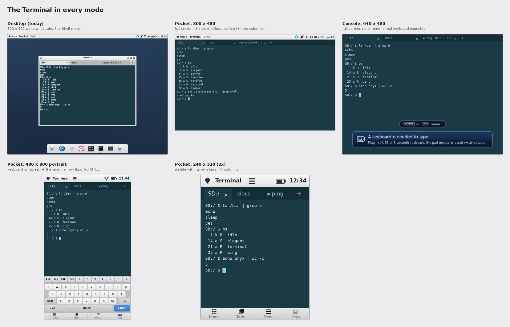

*Desktop (a 620 × 420 window); Pocket at 800 × 480; console; Pocket portrait 480 × 800 with the keyboard on
screen; Pocket on a 240 × 320 slate (2×).*

- **Its layout gives it all**: the view already reflows to any size (`setResizable`, more columns and rows
  at full screen); the tabs are UIKit's `TabStrip`, which narrows its tabs by itself (the close button on
  the current one only when narrow).
- **UIKit / the shell**: the *Shell* menu goes to the status bar (pocket) or the revealed bar (console); in
  pocket portrait the input method adds **a terminal row** (Esc, Tab, Ctrl, Alt, the arrows, `|`, `~`,
  `/`) when the text-input hint (U10) says "terminal".
- **The app adds**: nothing but that hint. At 240 × 320 (9 lp mono) it gives 44 columns: usable with a
  slate's own keys.
- **Console**: full screen; **a keyboard is needed** to type, which it says once (no keyboard on screen in
  console mode); the pad switches tabs and scrolls. A fair fit with a keyboard, a poor one without.

**The Media Player** (`user/Apps/media`: its own `Sidebar` 208 px, `TopBar` 52, `Content`, `NowBar` 80;
menus *File, Play, View*).

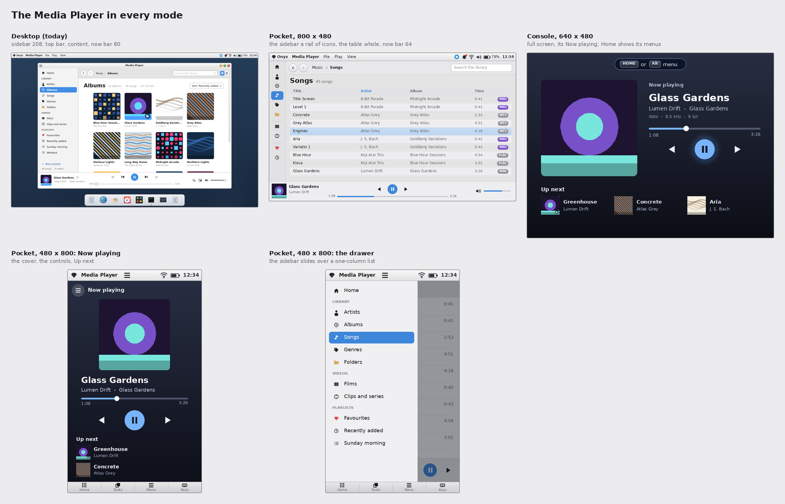

*Desktop; Pocket 800 × 480 (Songs); console (Now playing, full screen); Pocket portrait: Now playing, and the
sidebar as a drawer over a one-column list.*

- **Its layout gives**: the parts are placed by its own resize code (`main.cpp` ~2279), so they already
  follow the window; at 800 × 480 the table keeps all its columns.
- **The app adds** (its widgets are its own, not UIKit's, so UIKit cannot fold them): the sidebar as **a
  rail of icons** when the width is compact, as **a drawer** (☰ in its top bar) when narrow; the now bar at
  64 px; in portrait, Now playing as the main screen and the songs as one column (title, then artist and
  album). A few dozen lines in its resize code, driven by UIKit's size class (U5).
- **UIKit / the shell**: the menus, the density (rows, scroll bar), the focus ring for the pad.
- **Console**: a good fit — its Now playing view full screen, the pad on its controls (✕ play / pause,
  L1 / R1 previous / next), Home for its menus.

**Letters** (`user/Apps/letters`: its own `ToolBar` of two rows, a `Ruler`, the `PageView`, a `StatusBar`;
seven menus — File, Edit, View, Insert, Format, Table, Tools).

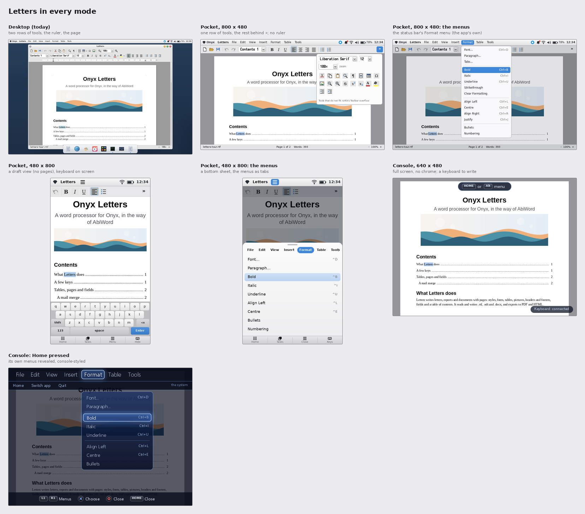

*Desktop; Pocket 800 × 480 with the tools' overflow open; Pocket 800 × 480 with the Format menu; Pocket
portrait 480 × 800 (a draft view, the keyboard on screen); the menus as a bottom sheet; console full screen;
console with its menus revealed.*

- **Its layout gives**: the page view zooms to the width (View ▸ Page Width already exists); every tool is
  also in its menus, so hiding tools loses nothing.
- **UIKit would do** (if Letters' tool rows were UIKit's `Toolbar`): **one row and an overflow** (»)
  holding what does not fit, in order — today they are Letters' own `ToolBar`, so either it moves to UIKit's
  or it learns the overflow; the menus in the status bar (landscape), as a bottom sheet (portrait), in the
  revealed bar (console).
- **The app adds**: the ruler hidden when compact (View has it); in portrait **a draft view** — the text
  reflowed to the width with no pages (its layout engine already wraps; the pages come back in landscape
  and for printing).
- **Console**: a poor fit for writing, a fair one for reading: full screen, the pad pages and zooms,
  **a keyboard to write** (no keyboard on screen); its menus revealed by Home.

## 10. Keyboard shortcuts

| Keys | Action |
|---|---|
| **Super** (alone), Home key | the launcher; again: back to the app |
| **Alt+Tab** / Alt+Shift+Tab | the switcher, next / previous; Del closes, S splits |
| **Super+← / →** | the current app to the left / right half (split view) |
| Super+↑ | leave split view (the current app full screen) |
| Super+[ / ] | the divider narrower / wider |
| Super+Tab | the focus to the other half |
| **F10**, Menu key | the app's menus; ← → between menus; Alt+letter opens one |
| **Super+N** | quick settings and notifications |
| Super+Space | the launcher with the search field focused |
| Super+K | show / hide the on-screen keyboard |
| Super+L | lock (`apps/lock`) |
| Ctrl+Q | close the app (the menus' Quit) |
| Print Screen | a screenshot (Elegant's, unchanged) |
| Ctrl+Alt+← / → | (the workspaces of the desktop: not in Pocket — the switcher replaces them) |

A gamepad (`SD:/etc/gamepad.ini`, the padconf applet) maps in Pocket: d-pad = arrows, A (✕) = Enter,
B (○) = Esc, Y (△) = Menu (context), X (□) = search, Start = F10, Select = Home, L1/R1 = Alt+Shift+Tab /
Alt+Tab. Console mode uses the same buttons with its own meanings (§7.2: L1/R1 the sections).

## 11. What swapping the shell implies (requirements and open questions)

> **Superseded by the user's decisions (2026-10-08), after this study:** pocket and console are **a
> graphics server of their own (PocketUI)** beside Elegant, not a policy inside Elegant; **each server
> ships its own UIKit** with the same exports (UIKit is to its server what AppKit is to the kernel), which
> the server loads under the **alias `SD:/lib/uikit.so`** (a new kernel call, `kapi_lib_open_as`) and keeps
> referenced while it runs, so the apps get it without knowing; **switching mode closes the graphical
> session and starts it again**. Elegant and the apps stay unchanged. The technical analysis,
> `docs/POCKETUI-TECH-STUDY.md`, works this out — it finds that PocketUI must also serve Elegant's whole
> base protocol (it is AppKit's, used by programs without UIKit), and that the kernel needs two more small
> changes beside `lib_open_as` (the server chosen from `shell=`, a "switch the server" operation: its
> §3.8 and question 1); the E1–E10 needs below become PocketUI's private operations (its §4.4).
> §11.1–11.2 below are the design's first proposal, kept for the record.

### 11.1 Choosing the shell

- **`SD:/etc/system.ini` `shell=desktop|pocket|console`** (no line: `desktop`; `netbook` and `pad`
  later), written by Setup (a new question when the screen is small or a gamepad is the only input) and by
  the Control Panel (a "Mode" applet, or Display's) — console mode's Settings has it too. Today's
  `autostart` starts the menu bar and the dock (`#setup: run menubar`, `run dock`); those two lines would
  become one, `run shell`, a small program that reads the setting and starts the right programs.
- **Elegant reads the same key** at its start and takes the matching policy. Since the programs survive an
  Elegant restart (they come back after it, `docs/MULTI-WINDOW-STUDY.md` §1.1), switching the shell while
  running could be "restart Elegant with the other policy": the apps keep their state.
- The density and scale: **`SD:/etc/theme.txt` `metrics = regular|compact|touch`, `scale = 1|1.5|2`**,
  read by every app at start (`uikit/theme.h`) — the theme's file, since they are about the look; Setup
  proposes them from the screen's size. A per-device file `SD:/etc/compact.ini` would say which keys the
  device has (soft keys or not), the rotation, the battery's source.

### 11.2 One server, a policy per mode (recommended) — or several servers

**Recommended: the same Elegant, with a policy module** — the compositor, the input, the protocol, the
damage, the full-screen path, `rdpd`'s capture are shared; the policy decides placement (fill the work
area, centre a fixed window), decoration (frames or none), z-order rules (one app in front, the launcher
behind), the system keys (Alt+Tab, Super...), the work area (under the status bar). Pocket and console
share one policy (one app at a time, the overlays); they differ by their shell programs (the launcher and
status bar, or the console home) and their style. The alternative, a second server binary ("Elegant
Pocket"), would duplicate the compositor and the protocol for little gain.

### 11.3 What Elegant's protocol must offer (`user/Kits/appkit/elegant.h`)

Already there, and used by Pocket as they are: the menus (`MENU_SET/GET/COMMAND` — the status bar draws the
app in front's menus as the menu bar does today), the window and app lists (`WIN_LIST`, `APP_LIST`,
`APP_RAISE`, `APP_CLOSE`), the thumbnails (`SHOT`), the tray (`TRAY_*`), the wallpaper, the minimise and
geometry operations, several windows per program (v94).

Needed (requirements, to be specified):

| # | Need | Notes |
|---|---|---|
| E1 | **A shell role**: one client (the launcher / status bar) is *the shell*; it receives events when windows open, close, change title or menus, instead of polling. | today the dock polls |
| E2 | **System keys**: the shell registers global shortcuts (Super, Alt+Tab, Super+arrows, F10 when no app takes it), delivered to it before the apps. | the desktop's Ctrl+Alt+arrows are hard-wired in `OnKey` |
| E3 | **Placement policy**: every normal window fills the work area, framed or not by the policy; a fixed one is centred over a dim; two windows can share the work area (split). | the policy module |
| E4 | **The frame decision told to the app** (no frame: `KAPI_FRAME_*` insets 0) and its **size class / scale** (an event like `GUI_EVENT_DISPLAY_RESIZE`). | U4, U5 |
| E5 | **An input method window**: a topmost window that is never the keys' target (the menu bar's and the dock's flag today) and injects keys into the focused app; the text-input hint (U10) forwarded to it. | the on-screen keyboard |
| E6 | **Touch input**: absolute pointer with a "touch" flag (no hover, no cursor drawn), long press, two-finger scroll; from Circle's touch-screen driver for the official display (to be checked in our fork), or USB HID touch screens. | kernel's raw input ring |
| E7 | **Rotation** (0/90/180/270), the touch coordinates rotated with it. | T3; `screen_set` today refuses portrait sizes |
| E8 | **Smaller and portrait resolutions** in `kapi_screen_set` (480 × 640, 480 × 800, 720 × 1280, maybe 320 × 240). | T3 |
| E10 | **The pad as a system input**: the shell receives the Home / Select button before the game (to open the overlay) and pauses the app (a "pause" event, or the emulators' own pause through their menus). | console mode |
| E9 | **Power and backlight**: the battery level (a fuel gauge or a UPS HAT over I²C: a small daemon publishing it), the display's backlight (the official display through the firmware). | the status bar, quick settings |

### 11.4 What does not change

The kernel's mechanisms (event queues, the full screen, the shared buffers), AppKit's names, the apps'
binaries (they get the new behaviour through UIKit, rebuilt with the kits), `rdpd` / `vncd`, the
clipboard, drag and drop (split view makes it useful again: a file from the File Viewer into the editor).

## 12. The visual identity: Milk at the compact size, the PS2's mood for console

Pocket is drawn with the **Milk** theme (`user/Kits/uikit/theme.cpp`: window `0xE4E4E4`, accent Aqua's blue
`0x3D86DA`, frames `0xE2E2E4`, silver dock `0xD9DDE3`; `skin.cpp`: the title gradient that ends on the
window's colour, OS X's beads), the user's preferred look. What carries over and what adapts:

- **The status bar is the menu bar**: the same light gradient, the Onyx gem, the app's name in bold, the
  menus in the regular weight, the tray and the time on the right. The Onyx button turns Aqua when it is
  Home.
- **Silver surfaces** for the launcher's panel, the tabs and the Running chips — the dock's silver; the
  chosen tab is white and joins the panel (no line between them, Milk's "melting" frame).
- **The category colours survive as dots** on the tabs (Productivity amber, Internet blue, Graphics green,
  Multimedia violet, Games red, Programming teal...): the identity of the dock's drawers without painting
  whole tabs.
- **Aqua's blue for focus and selection** — the focus ring of a tile, the chosen card of the switcher, the
  menus' selection, the toggles that are on.
- **The beads** stay on what still has a frame (a fixed window's card, §6.8): red to close. Full-screen apps
  have none.
- **The navy wallpaper** of today's desktop behind the launcher, so a glance says "Onyx".
- **No new effects**: rounded corners, light gradients and the 1-px outline as in the desktop; a flat dim
  behind overlays.
- The other themes of `theme.txt` (Peach, Steel, Sage, Brick, Slate, Dark Coffee) would apply the same way:
  the shell reads the palette like any UIKit program.
- **Console mode** has its own style over the same palette's accent: the PS2 browser's deep space (blue to
  black), the translucent glowing towers and motes, thin big words (Selawik Light), glass panels with a
  bright edge, Aqua's blue as the glow, memory-card tiles — drawn once into the background, never a
  per-frame cost.

## 13. Risks

| Risk | Weight | Mitigation |
|---|---|---|
| **The apps at 800 × 480**: most are designed for 1000 × 700; a shell without U5/U6 shows cut apps. | high | U6 (scrolling root) first, then U5 for the UIKit composites, then the most used apps one by one |
| The scale factor touches every drawing path of UIKit (and the apps' own canvases: Paint, the games). | high | 1.5× limited to UIKit's widgets and text at first; app canvases keep 1× pixels scaled by the app |
| Touch on Circle: the official display's driver, its accuracy, USB touch screens. | medium | try it early on the Pi (E6) before designing more for touch |
| Three modes to maintain (desktop, pocket, console). | medium | one Elegant, one policy for pocket and console; the shell programs small; UIKit's profile shared |
| Console mode's glows and towers too slow if animated on the CPU. | low | drawn once into the wallpaper buffer; animation optional, slow, only on the home |
| The on-screen keyboard and text input across the apps (the terminal, QBasic's editor, Jet). | medium | key injection (E5) works for every app; the hint (U10) only improves when it appears |
| Performance at 1280 × 720 × 1.5 on the Pi 4's CPU compositor. | low | the same damage model; no blur, no shadows |
| Scope creep (gestures, animations, a phone UI — what was dropped on 2026-09-28). | medium | this study's limits: one app, the menu bar, the switcher, split |

## 14. Open questions for the user

1. **Which device first?** The 7" official display (800 × 480, touch), a uConsole-like 1280 × 720, a
   portrait slate, or a gamepad handheld (console mode)? It decides whether touch, the scale or the pad
   comes first.
2. **The three modes** — desktop, pocket, console — as proposed, with netbook and pad later? *(Yes, the
   user, 2026-10-08: switched from the Control Panel and Setup's welcome; netbook and pad later.)*
3. **Keep the global menu bar** in Pocket (the recommendation), or menus inside each app as on the Zaurus?
4. **Where the settings live**: `shell=` in `system.ini` and `metrics=` / `scale=` in `theme.txt`, as
   proposed?
5. **Switching while running** (restart Elegant with the other policy, the apps kept), or only at boot?
   *(The user, 2026-10-08: switching closes the graphical session and starts it again.)*
6. **Split view** in Pocket: wanted, or one app at a time strictly?
7. **Console mode's scope**: games, media, apps, files, settings as proposed; its towers still or slowly
   animated; SuperTuxKart's port in its library?
8. **The agenda widget** in Pocket: a line in the launcher's Recent tab, or a tile of its own?
9. **Workspaces** in Pocket: dropped (the switcher replaces them), as proposed?
10. **The 320 × 240 SPI screens**: out of scope, as proposed?

## 15. Next steps (stopping before implementation)

1. **Decisions** — the user answers §14; this study is revised.
2. **Try the hardware** — the target device on the Pi with today's desktop at its resolution: what touch
   gives (E6), how the apps look at 800 × 480 (screenshots of each app at that size with
   `tools/tests/desktop_sim/shots.sh`), the list of the apps that do not fit.
3. **Specify** — the policy module's interface in Elegant (E1–E4), the input method (E5), the protocol
   additions (append-only numbers in `elegant.h`), the UIKit profile (U1–U3) and size classes (U5): a
   design page each, reviewed with the user.
4. **A clickable prototype on the PC** — the launcher, the status bar and the switcher as ordinary UIKit
   programs on today's Elegant (maximised windows), in the desktop simulator, to try the navigation map
   before any change to Elegant.
5. Only then the implementation phases: UIKit's profile, scale and scrolling root → Elegant's policy and
   the shell role → Pocket's shell programs (landscape and portrait from the start: the rules of §6.1) →
   console mode's home on top of them → split view → touch and the on-screen keyboard → rotation.

## 16. Console mode v2: the PS4-like shell (2026-10-09, mock-ups)

*A design proposal with mock-ups only — nothing built, `consolehome` unchanged.* The user asked for the console
shell to move from the PlayStation 2 browser's mood (§7, §12) to **the manner of a modern TV console home (the
PS4's) and of Lakka (RetroArch)**, with **the games (ROMs) classified by console**. The pictures are made by
**`python3 tools/screenshot/mockup_console_ps4.py`** (PIL + numpy, self-contained: the helpers of
`mockup_compact.py`, the card's DejaVu Sans, the apps' real icons and categories, the consoles from the
emulators' `app.txt`, the Onyx games' real screenshots); they land in `docs/compact-shell/mockups/console-v2-*.png`.
The ROMs are made up (invented names, title screens drawn at the Game Library's 160 × 144 thumbnail size, as
`tools/tests/desktop_sim/gamelib_samples.py` does; an N64 game's picture is its cartridge label with its name, a
GameCube game's its banner). No console maker's logo or button symbol is drawn: the pad's buttons are named
A / B / X / Y / L1 / R1 / Home, as the current shell names them.

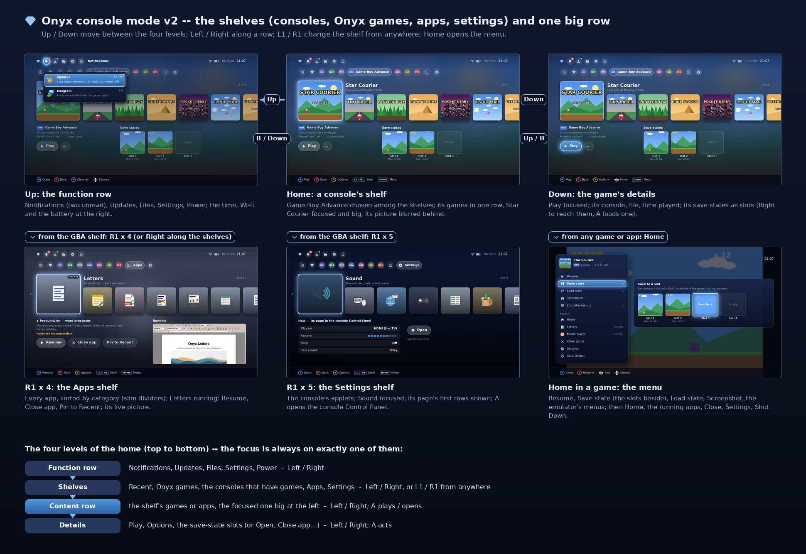

*The six main screens and how the pad moves between them; at the bottom, the home's four levels.*

### 16.1 The structure: four levels stacked, one row each

The home is **four horizontal levels, top to bottom**, and the focus is always on exactly one of them. Up / Down
move between levels, Left / Right move along the level; nothing moves diagonally, nothing wraps.

| Level | What it holds | What it shows when the focus is elsewhere |
|---|---|---|
| **1. Function row** (the top) | the Onyx gem (the home's mark), then five round buttons: **Notifications** (a red count), **Updates** (a green dot when packages wait: `pkgd`), **Files** (the console file browser, §7.5), **Settings** (the console Control Panel, §7.6), **Power** (Shut down, Restart, Switch mode); at the right Wi-Fi, the battery, the date and the time | dim icons; the focused one's name appears after the row |
| **2. Shelves** | **Recent**, **Onyx games**, then **one shelf per console that has games**, then **Apps** and **Settings** — small round chips; the chosen shelf opens into a pill with its name | the chosen shelf stays a lit pill (no ring) |
| **3. Content row** | the chosen shelf's items as **big tiles in one row**: the focused one **larger, at the left**, its **title and a line beside it** (over the smaller tiles); a count "3 of 9" at the right; a chevron at the left when items scrolled off | the focused tile keeps its size and a thin ring |
| **4. Details** | under the row, what the focused item offers: for a ROM its console, file, time played, **Play**, an options button (…), its **save-state slots**; for an app Resume / Open, Close app, Pin to Recent and its live picture when it runs; for an applet its page's first rows and Open | the same, unfocused |

**The backdrop** is the focused item's picture (a ROM's title screen, an Onyx game's screenshot, an app's icon
plate) **blurred to a soft wash**, darkened toward navy and much darker at the bottom, so the words stay
readable; it follows the focus. The Settings shelf has the plain navy gradient. A few faint motes remain from v1.

**What each shelf holds:**

- **Recent** — the last games and apps used, mixed (the paused game first: one press of A resumes it); a ROM
  tile carries its console's badge (GBA, SNES...), a running app a green **running** pill, a paused game an amber
  **paused** pill. It replaces v1's Recent category and the switcher for everyday use.
- **Onyx games** — `category = Games` of `app.txt` (Tetris, Pinball, Critters, Invaders, Solitaire, Doom,
  Arkanoid, 2048...; the Game Library itself is not listed: the shelves replace it in console mode); each tile is
  the game's screenshot (its icon on a plate when it has none).
- **One shelf per console** — see §16.4.
- **Apps** — every other app (Productivity, Internet, Graphics, Multimedia, Programming, System; not Demos, Shell,
  Settings, Emulators), **sorted by category in one row**, each category opened by a **slim upright divider** (its
  colour dot and its name turned); **L2 / R2 jump to the previous / next category**. Tiles are the app's icon on
  a plate of the icon's own colour.
- **Settings** — the console's applets (§7.6: Mode, Display, Sound, Keyboard & Mouse, Language & Region, Gamepad,
  Wi-Fi, Packages, About), their icons on plates, their `.lnk` help line beside; the details show the applet's
  first rows (Sound: Play on, Volume as a bar, Mute, Test sound) and **A opens the page** in the console Control
  Panel.

### 16.2 The navigation, button by button

On every screen the bottom band lists **only the buttons that work there** (as today's shell does).

| Where | d-pad | A | B | Y | X | L1 / R1 | L2 / R2 | Home |
|---|---|---|---|---|---|---|---|---|
| **Function row** | ←/→ the buttons; ↓ to the shelves | open (Notifications drop under the row) | back to the content row | — | — | shelf | — | the menu |
| **Notifications open** | ↑/↓ the notes | open the note's app | close the list | — | clear all | — | — | — |
| **Shelves** | ←/→ the shelf (the row follows at once); ↑ function row; ↓ content | enter the row | to the content row | — | — | shelf | — | the menu |
| **Content row** | ←/→ the items (the focused tile stays at the left, the row scrolls); ↑ shelves; ↓ details | **Play** / Open / Resume | up to the shelves | options (Pin to Recent, Info, Delete ROM, Close app) | — | previous / next shelf | Apps: previous / next category | the menu |
| **Details** | ←/→ Play, …, slot 1, slot 2...; ↑ content row | Play / **Load** the focused slot / the button | up to the content row | on a slot: **Delete** | — | shelf | — | the menu |
| **In a game or an app** | — | — | — | — | — | — | — | **the menu** (§16.5) |

L1 / R1 change the shelf **from any level** and bring the focus to the content row, so the consoles are one
shoulder press apart. The keyboard and the mouse keep v1's mapping (§7.2): the arrows, Enter = A, Esc / Backspace
= B, Page Up / Down = L1 / R1, F10 / Alt = Home; hover moves the focus, a click is A, a right click Y, the wheel
scrolls the row.

| | |
|---|---|
| 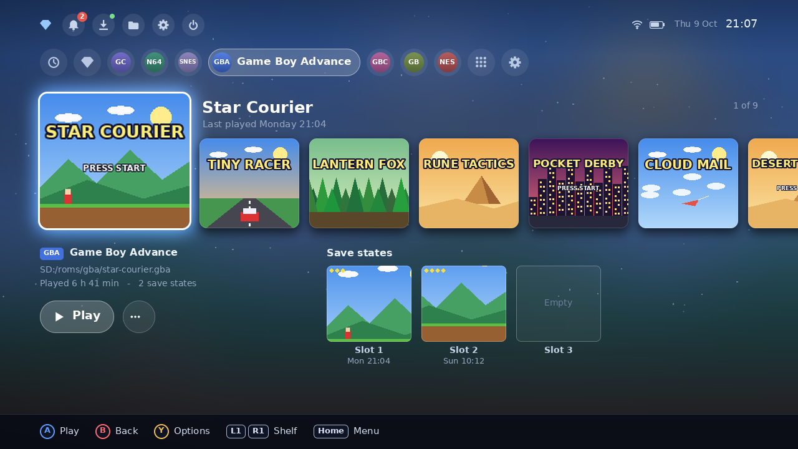 | **(a) Home, 1280 × 720**: the Game Boy Advance shelf, Star Courier focused (its title screen big, blurred behind), its 8 neighbours in the row; the details (unfocused): GBA, `SD:/roms/gba/star-courier.gba`, played 6 h 41 min, Play, two save states and an empty slot. |
|  | **(c) ↓: the details focused** — Play glowing; → reaches the slots. |
| 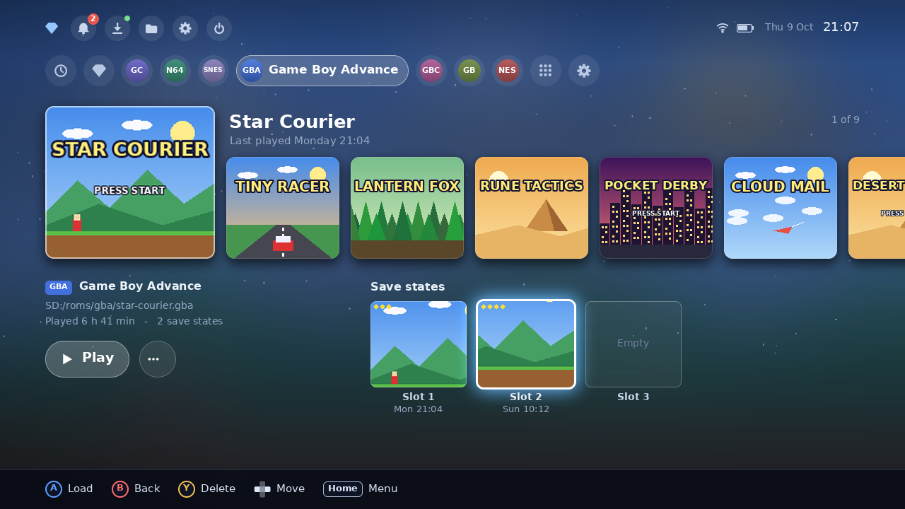 | **→ →: slot 2 focused** — A loads it, Y deletes it. |
| 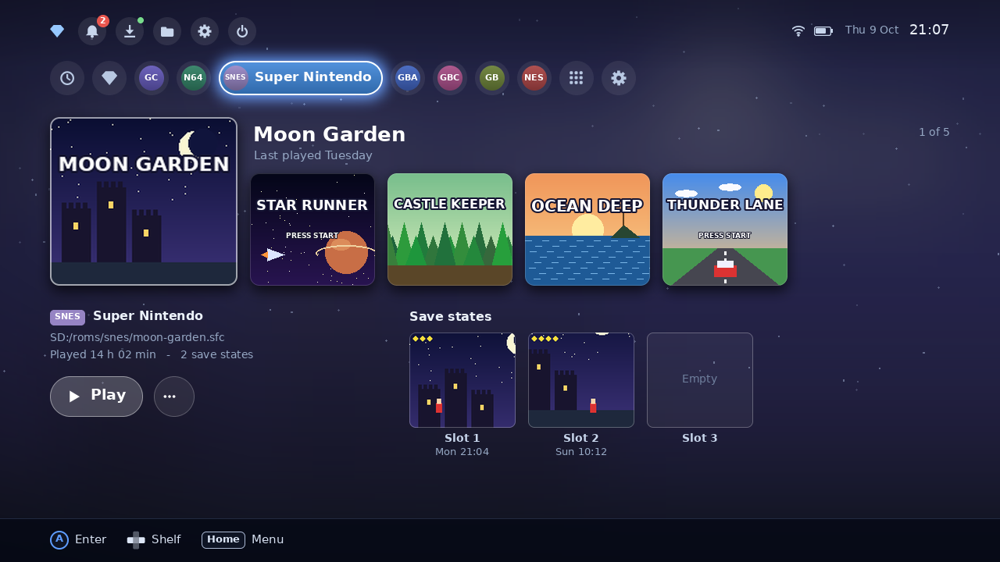 | **↑: the shelves focused** — Super Nintendo's pill with its ring; ←/→ walks the shelves, the row (Moon Garden...) follows. |
| 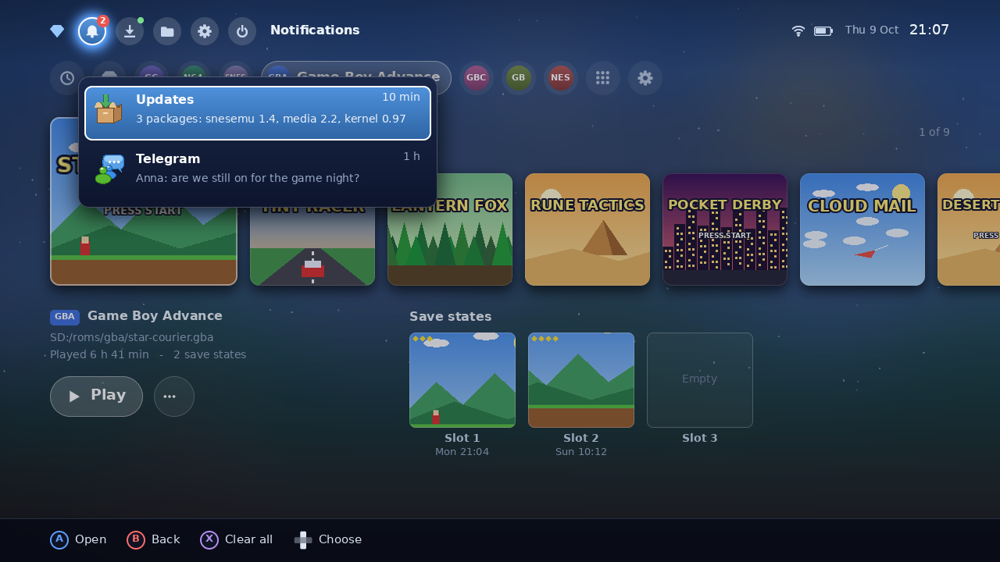 | **↑ again: the function row**, A on Notifications: Updates (3 packages) and a Telegram message; X clears them. |
| 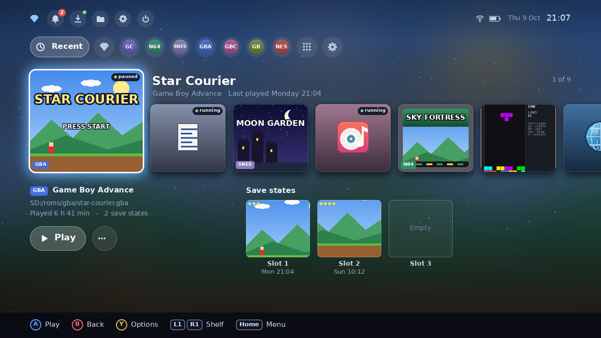 | **Recent**: Star Courier paused, Letters and the Media Player running, Moon Garden, Sky Fortress, Tetris... with their consoles' badges. |
| 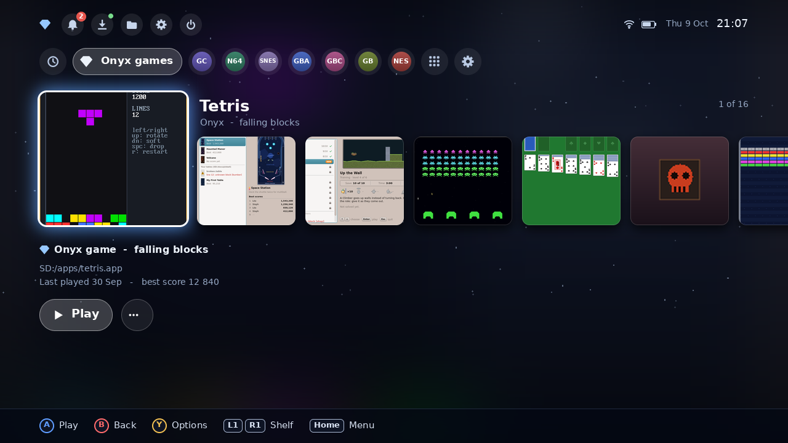 | **Onyx games**: their real screenshots as pictures (Doom: its icon); Tetris: path, last played, best score, Play. |
| 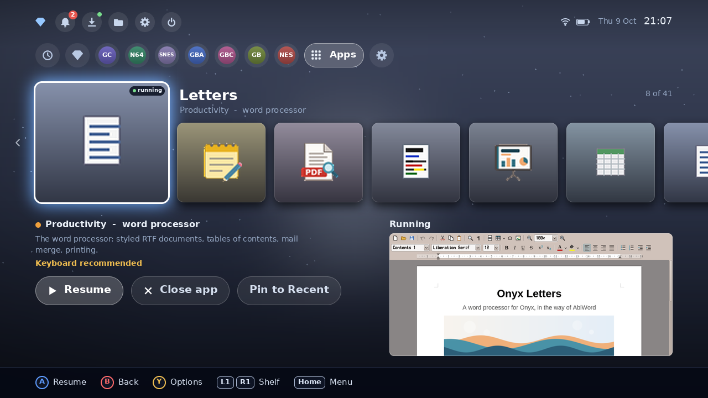 | **(d) Apps**: Letters (running) focused; the Internet divider in the row; Resume, Close app, Pin to Recent, "keyboard recommended", its live picture. |
| 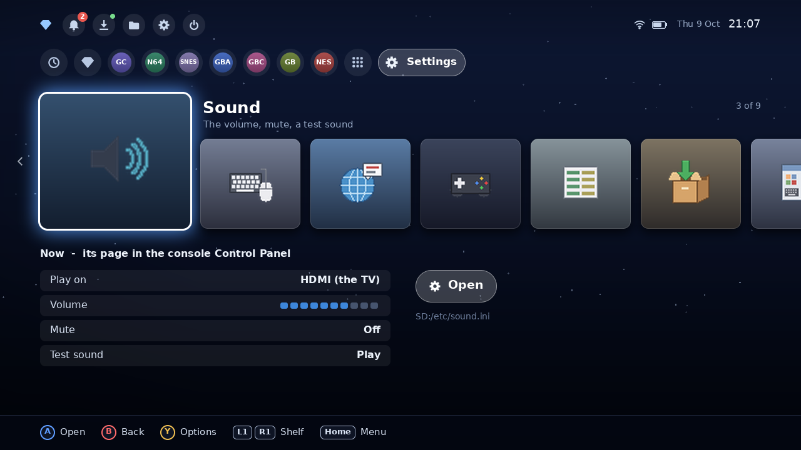 | **(d) Settings**: Sound focused, its page's first rows; A opens it. |

### 16.3 Resolution independence

Every size is in **logical units (lp) × a scale** (today's rule: `scale =` in `SD:/etc/theme.txt`, else 1 below
1080 lines, 1.5 from 1080, 2 from 1800). The layout reads the logical size; below **560 logical lines** it takes a
**compact** set of metrics (a 640 × 480 handheld). The row keeps its shape: it shows fewer tiles, it never wraps.

| Metric (lp) | regular (1280 × 720 at 1, 1920 × 1080 at 1.5) | compact (640 × 480 at 1) |
|---|---|---|
| side margin | 64 | 24 |
| function row: top / button | 22 / 36 | 10 / 28 |
| shelves: top / chip / gap | 78 / 44 / 10 | 46 / 30 / 6 |
| content row top | 150 | 92 |
| focused tile (10:9, the pictures' shape) | 240 × 216 | 150 × 135 |
| other tiles / gap | 160 × 144 / 16 | 100 × 90 / 10 |
| row → details | 30 | 18 |
| save-state card | 136 × 122 | 84 × 76 |
| Play button height | 52 | 34 |
| hints band | 56 | 40 |
| words: title / line / details / small / buttons / hints | 26 b / 15 / 16 / 14 / 19 b / 15 | 17 b / 12 / 12 / 11 / 14 b / 12 |
| corner radius: tile / chip, button | 12 / round | 8 / round |

| | |
|---|---|
| 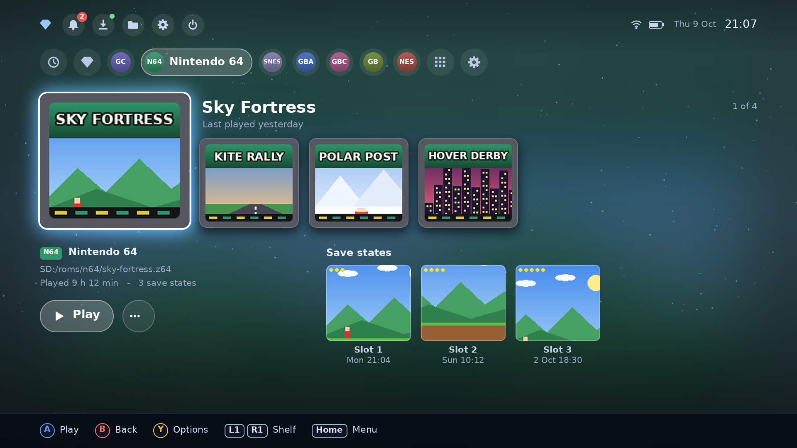 | **(b) 1920 × 1080 at 1.5**: the same layout, every size × 1.5 — the Nintendo 64 shelf, its games as cartridge labels. |
| 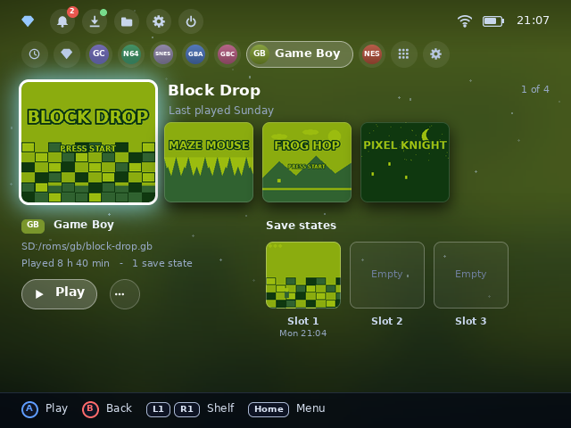 | **(b) 640 × 480 at 1, compact**: the Game Boy shelf in its four greens; four tiles in the row, three slots, the hints without Y. |

### 16.4 The ROMs, classified by console

- **The consoles are the emulators' `games =` lines** (`SD:/apps/<emu>.app/app.txt`, as the Game Library's
  sections): `gcemu` GameCube (`iso gcm`), `n64emu` Nintendo 64 (`z64 n64 v64`), `snesemu` Super Nintendo
  (`sfc smc`), `gbaemu` Game Boy Advance (`gba`), `gbemu` **two** shelves, Game Boy Color (`gbc`) and Game Boy
  (`gb`), `nesemu` NES (`nes`). A new emulator with a `games =` line gets its shelf with no change to the shell.
- **The order is `order =`** (small first: GameCube 10, N64 20, SNES 30, GBA 40, GB / GBC 50, NES 60), the same
  as the Game Library's sections; within an emulator, the order of its `games =` line.
- **A ROM belongs to the console of its extension**, wherever it is in the Game Library's folders (`SD:/roms` by
  default, Folders > Add Folder...): the index and the thumbnails are the Game Library's
  (`SD:/apps/gamelib.app/thumbs/<key>.thm`, 160 × 144), shared, not rebuilt.
- **A console with no game is hidden** (no empty shelf to walk through); an option in the Settings shelf could
  show them dimmed (an open question).
- **The chip** is the console's short name (GC, N64, SNES, GBA, GBC, GB, NES) on its own colour — words, not
  logos — and the pill spells its `games =` name. The colours: GC indigo `#7062D6`, N64 green `#2E9668`, SNES
  lavender `#9684C4`, GBA blue `#4270DE`, GBC rose `#CC5496`, GB olive `#7A962C`, NES red `#CE483E`.
- **The pictures**: a title screen for the cartridge systems, the cartridge's label (with the name) for the N64,
  the disc's banner for the GameCube — what the Game Library captures today.

### 16.5 The menu over a running game (Home)

| | |
|---|---|
| 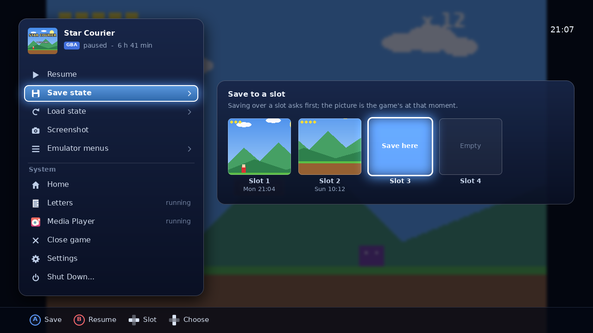 | **(e) Home in a game**: the game paused, blurred and dimmed behind; at the left a panel — the game (its picture, GBA, paused, time played), then **Resume, Save state ›, Load state ›, Screenshot, Emulator menus ›** (the app's own menus, as v1 does), then **System: Home, the other running apps (Letters, Media Player) to switch to, Close game, Settings, Shut Down...** At the right, Save state's **slots** (two used with their pictures and dates, slot 3 focused "Save here", slot 4 empty); A saves, B resumes, ←/→ the slot. |
| 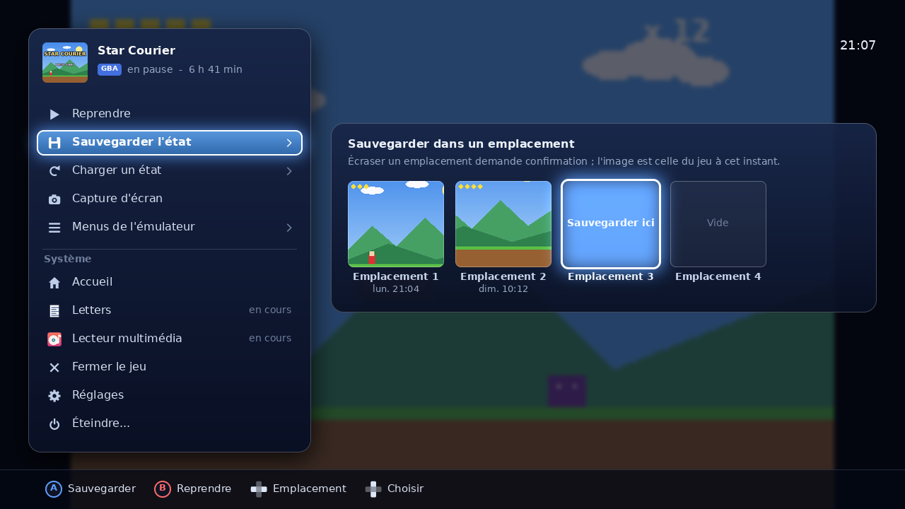 | **The same in French**: Reprendre, Sauvegarder l'état, Charger un état, Capture d'écran, Menus de l'émulateur; Accueil, Fermer le jeu, Réglages, Éteindre... |

For an ordinary app the panel is v1's menu (Resume, Home, the running apps, Close, Settings, Shut Down, the app's
menus) in this style; the game's part (save states, screenshot) appears only for an emulator.

### 16.6 In French

| | |
|---|---|
| 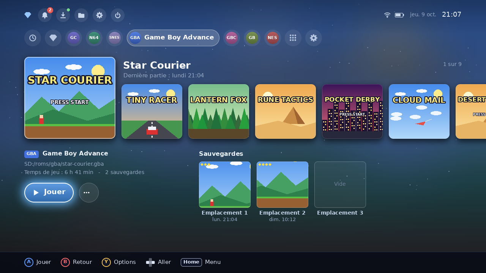 | **(f) The details in French**: Jouer, Dernière partie : lundi 21:04, Temps de jeu, Sauvegardes, Emplacement 1-3, Vide; the hints Jouer, Retour, Options, Aller, Menu; the date "jeu. 9 oct.". The existing `consolehome` words are kept (Récentes → *Récents* for the shelf, **Réglages** for Settings as in `lang/fr.txt`, Reprendre, Accueil, Éteindre...). |

### 16.7 The colours and the look

- **Navy, calm**: the backdrop is the picture washed into navy `#080E22` (58 %), darker at the top (−25 %) and
  much darker at the bottom (−55 %); the hints band `#040814` at 72 %.
- **Words**: white for titles, `#ECF2FA` for words, `#96A8C4` for lines, `#6E7E9C` faint; **DejaVu Sans**,
  bold for titles and buttons.
- **Focus = Milk's Aqua** `#3D86DA`: a white ring 3 lp outside the tile, a soft blue glow (`#60AAFF`) around it,
  the tile larger; a focused button or chip is filled Aqua with a white ring. **Chosen but not focused** = a thin
  white ring (tiles) or a translucent white pill (chips). Plain items: glass at 8-20 % white.
- **Pad buttons** as today's shell draws them: A blue `#5E9CFF`, B red `#FF6A6A`, Y amber, X violet, in rings;
  L1 / R1 / Home as outlined key pills; the d-pad as a small cross with the used arms lit.
- **The Onyx gem** opens the function row; no other brand.

### 16.8 What is reused from today's `consolehome`

- The process and its role: PocketUI's shell (`uk_shell_register`, `uk_shell_keys`, `uk_shell_grab`), the home as
  the backmost window, the menu as a topmost overlay, asked with Home / Select / F10 / the Super key.
- The catalogue (`Apps/pocketshell/catalog.h`: the apps, the categories, the recent and the running ones), the
  Control Panel's applets, the scale rule and the faces (`F (lp)`, `D (lp)`), the look helpers (`look.h`: rounded
  boxes, rings, shadows), the hint pills, the menu's items and their words (`lang/fr.txt`).
- The pad's mapping (`gamepad.h`) and the keyboard's: unchanged; L2 / R2 get the Apps shelf's categories.
- **New**: the shelves from the emulators' `games =`, reading the Game Library's index and thumbnails, the
  blurred backdrop (one small blur of a 160 × 144 picture per focus change, then a scaled copy: cheap), the
  details level, the function row and its notifications (`notifyd`), the save-state slots.

### 16.9 Open questions for the user

1. **Save states do not exist yet**: the emulators keep only the cartridge's battery save (`<rom>.sav`). The slots
   (and their pictures) need an emulator-side "save / load state to slot N" and a way for the shell to ask it
   (a message to the front app, as the menus are). Build them, or show the slots only once an emulator offers them?
2. **The shelves' order**: `order =` puts GameCube first and NES last. Keep it (as the Game Library), or the other
   way (oldest first, as Lakka does), or by the most played?
3. **Game Boy and Game Boy Color**: two shelves (as `games =` says, chosen here) or one "Game Boy" shelf?
4. **Empty consoles**: hidden (proposed) or dimmed?
5. **The Game Library in console mode**: hidden (the shelves replace it, proposed), or a tile of its own for its
   folders and its refresh?
6. **Apps**: one shelf with category dividers (proposed), or one shelf per category (more shelves to walk)?
7. **The function row**: Notifications, Updates, Files, Settings, Power — is Files right there, or a shelf? Should a
   Search (with a physical keyboard) join it?
8. **The backdrop**: the blurred picture (proposed), or v1's space and towers behind everything, the picture only
   in the tile?
9. **The font**: DejaVu Sans as asked here, or v1's Selawik Light for the big words?
10. **Does v2 replace v1**, or is it a choice in the Settings (Display > Home style)?

## Résumé (FR)

L'utilisateur demandait si, maintenant qu'Elegant est en espace utilisateur, on pouvait remplacer le bureau
fenêtré par une interface pour **netbooks** et **portables façon Sharp Zaurus**. Cette étude (analyse de
design uniquement, rien n'est construit) aboutit à **trois modes au choix** (`shell=` dans
`SD:/etc/system.ini`) : **desktop** (le bureau d'aujourd'hui), **pocket** et **console** ; un mode
**netbook** (le concept B, Ubuntu Netbook Remix) et un mode **pad** (tablette tactile) viendront plus tard.
**Pocket** est une **seule mise en page indépendante de la résolution et de l'orientation** : tout en
unités logiques multipliées par l'échelle de l'appareil (1×, 1,5×, 2×), avec des règles qui se
réorganisent selon la largeur, la hauteur et le rapport d'aspect logiques (§6.1) — le nombre de colonnes
du lanceur, le contenu de la barre d'état, les menus en listes déroulantes en paysage ou en feuille du bas
en portrait, les touches logicielles, le sélecteur en rangée ou en colonne. Les mêmes écrans sont montrés à
800 × 480, 640 × 480, 480 × 800 et 240 × 320. Pocket reprend le lanceur à onglets de Qtopia (les catégories
d'`app.txt`), **garde la barre de menus globale d'Onyx** comme barre d'état, une app à la fois en plein
écran, un sélecteur Alt+Tab à vignettes (`EL_OP_SHOT`), les réglages rapides et les notifications, et deux
apps côte à côte quand l'écran est assez large. Le **mode console**, pour une console portable ou une TV,
reprend l'ambiance du **navigateur système de la PlayStation 2** : espace bleu nuit, particules et tours
translucides lumineuses, grands mots fins, surbrillance lumineuse, tuiles façon carte mémoire pour les jeux
et les six émulateurs, états de sauvegarde, menu en jeu, navigation à la manette seule (✕ valider,
○ retour, L1/R1 les sections). Le tout dans le thème **Milk** (gris clairs, bleu Aqua, perles d'OS X),
choisi par l'utilisateur ; le bleu Aqua sert de lueur au mode console. En mode console, une app s'ouvre en
plein écran sans aucun habillage ; sa barre de menus apparaît à la demande (bouton Home/Select de la
manette, Alt ou F10 au clavier, souris poussée contre le bord haut), en style console ; pas de clavier à
l'écran : une manette, et un vrai clavier quand il faut écrire. Trois vraies apps — le Terminal, le Lecteur
multimédia et Letters — sont montrées dans chaque mode (§9.4) : ce que leur mise en page donne déjà, ce que
UIKit ferait seul (barre d'outils repliée dans un menu de débordement, barre latérale en rail ou en tiroir), et ce que
l'app devrait ajouter. Le gros du travail n'est pas le
shell mais **l'adaptation des apps** (la plupart sont conçues pour 1000 × 700) : UIKit devrait offrir un
profil de densité (normal, compact, tactile), un facteur d'échelle, des fenêtres sans cadre, des classes de
taille (une barre latérale repliée en rail, comme pour Ledger), une racine défilante en secours, le focus
visible partout et le tactile. Côté Elegant : un même serveur avec une politique par mode, un rôle de
shell, des raccourcis système, un clavier à l'écran, le tactile, la rotation, la manette comme entrée
système et la batterie. Les questions ouvertes sont au §14 ; les étapes suivantes (§15) s'arrêtent avant
toute implémentation. Ajouts du 2026-10-08 : le Panneau de configuration en mode pocket (§6.11 : en paysage, les applets en liens à gauche et l'applet qui remplit le reste — cette mise en page remplace aussi le tableau de bord du bureau ; en portrait, la liste puis une barre de retour) et en mode console (§7.6 : les applets utiles à la manette à gauche, leur page en grandes lignes à droite, ←/→ pour changer une valeur ; le mot de passe Wi-Fi demande un vrai clavier), et une proposition de lanceur pocket plus abouti, la v2 (§6.2 : vrai champ de recherche, « Aujourd'hui », puces de catégories, icônes sur plaques, focus net, vignettes des apps ouvertes ; une colonne Aujourd'hui à 1920 × 1080). Ajout du 2026-10-09 (§16, maquettes seulement) : une **v2 du mode console** façon accueil de console de salon (PS4) et Lakka — une rangée de fonctions en haut, des **étagères** (Récents, Jeux Onyx, **une par console** d'après les lignes `games =` des émulateurs, Apps, Réglages), une grande rangée de tuiles dont la tuile choisie est agrandie, son image floutée en fond, et sous la rangée les détails (Jouer, les emplacements de sauvegarde) ; le menu par-dessus un jeu avec ses emplacements.
