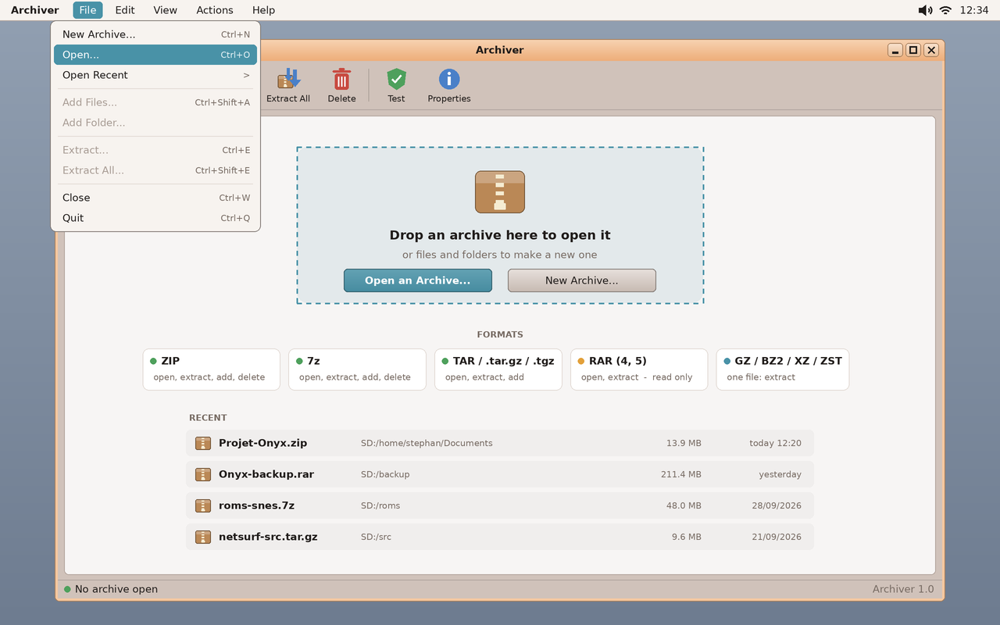
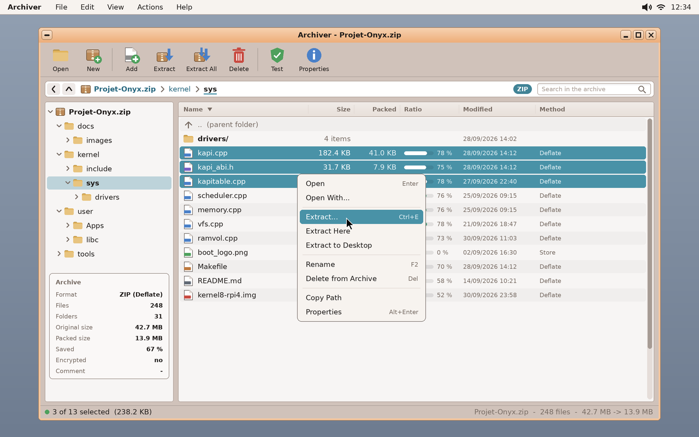
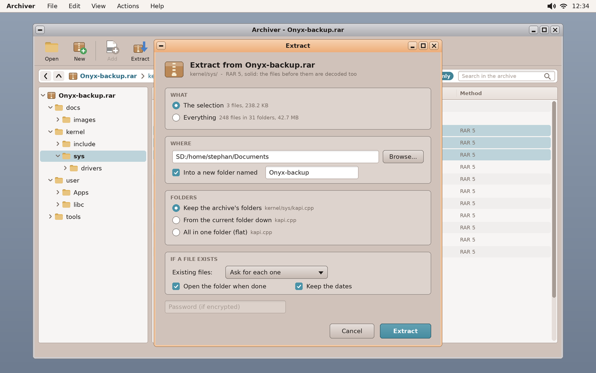
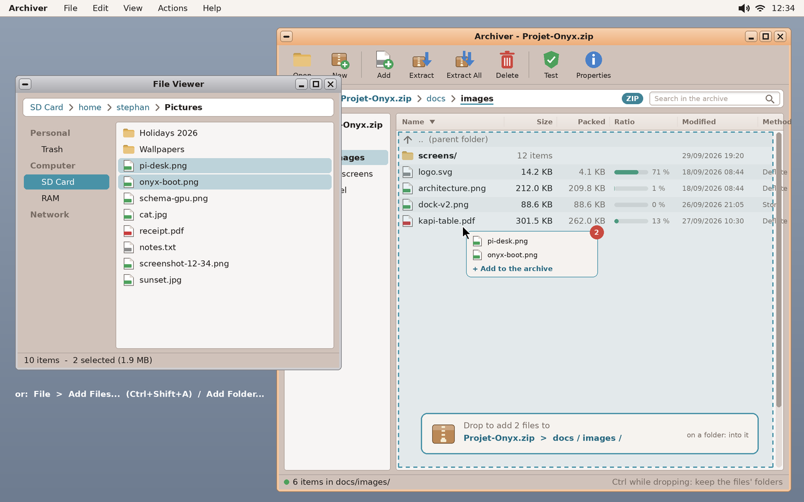
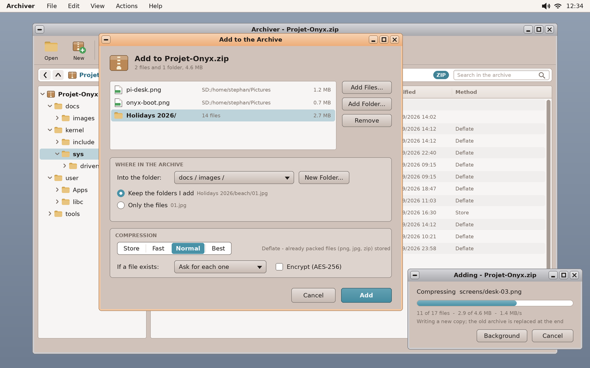

# Archiver for Onyx — an archive manager (study, first mock-ups)

> **Status (2026-10-01): mock-ups, to be validated by the user.** Asked by the user: an archive
> manager — zip, 7-zip if possible, rar if possible — with a careful interface: open an archive,
> browse its folders, extract the selection or everything **keeping the folder hierarchy**, and add
> files into the archive's current folder by **drag & drop from the File Viewer** or by an **Add**
> menu. Working name: **Archiver** (app folder `archiver`).

The mock-ups are made by `python3 tools/screenshot/mockup_archiver.py` → `docs/archiver/mockups/*.png`
(1280 × 800; the look of today's apps — `screenshots/irc.png`, `fileviewer.png`: the Peach frame,
the beige faces, the white lists, the teal selection, the global menu bar at the top).

| | |
|---|---|
|  | **Nothing open.** A drop zone (an archive dropped opens it; files dropped start a new archive), *Open an Archive…* / *New Archive…*, the formats and what each allows, the recent archives. The **File** menu of the global menu bar (Add / Extract greyed until an archive is open). |
|  | **An archive open.** The toolbar (Open, New · Add, Extract, Extract All, Delete · Test, Properties); a breadcrumb *inside* the archive (back, up, `Projet-Onyx.zip › kernel › sys`), the format's badge, a search field; the archive's folder tree at the left, its summary under it (format, files, folders, original / packed size, saved %, encrypted, comment); the list (name, size, packed, a ratio bar, modified, method) — folders first, `..` to go up, double-click a folder to enter it, a file to open it (extracted to `RAM:`). A multiple selection (Ctrl / Shift) and its right-click menu. The status bar: the selection, the archive's totals. |
|  | **Extract…** (here a RAR: read only — Add and Delete greyed, the badge says so). *What*: the selection or everything. *Where*: a folder (Browse… = the shared file dialog), optionally into a new folder named after the archive. *Folders*: keep the archive's folders (`kernel/sys/kapi.cpp`), from the current folder down (`kapi.cpp`), or flat. *If a file exists*: ask / replace / skip / keep both / replace if older. Open the folder when done (the File Viewer), keep the dates; the password when the archive is encrypted. |
|  | **Drag & drop from the File Viewer.** Files dragged over the list: the list glows, a banner names the target (`Projet-Onyx.zip › docs / images /` — the current folder, or the folder row under the cursor); Ctrl keeps the dragged files' own folders. The other way in: *File › Add Files… / Add Folder…*. |
|  | **Add to the Archive** (after a drop, or from the menu): the files and folders to add (Add Files… / Add Folder… / Remove), the folder inside the archive (and *New Folder…*), keep the folders added or only the files, the compression (Store / Fast / Normal / Best — already-packed files stored), if a file exists, AES encryption. The job's progress in a window of its own (*Background* lets you keep browsing). |

## Formats — what is realistic

| Format | Read / extract | Write (add, delete) | How |
|---|---|---|---|
| **ZIP** (+ zip64) | yes | yes | Our own reader / writer of the central directory; Deflate through **zlib** (`third_party/zlib-1.3.1`, already there); Store. AES-256 (WinZip AE-2) through mbedTLS (already there); ZipCrypto read only. |
| **7z** | yes | yes (LZMA2) | **LZMA SDK** (Igor Pavlov, public domain — `C/7zDec`, `Lzma2Dec`, `Lzma2Enc`): plain C, small. Writing 7z means rewriting the archive (solid blocks). |
| **TAR**, `.tar.gz`, `.tgz`, `.tar.zst` | yes | yes | tar is trivial; gzip = zlib, zstd = `third_party/zstd-1.5.7` (there). `.tar.xz` with the LZMA SDK's XZ decoder; bz2 would need bzip2 (small, BSD-like). |
| **RAR 4 / 5** | yes | **no** | Writing RAR is not allowed by its licence (and no free encoder exists). Reading: **libarchive**'s `rar` / `rar5` readers (BSD) — or the *unrar* source (freeware, extraction only). RAR5 solid archives decode from the start of the block (the dialog says it). |
| GZ / BZ2 / XZ / ZST alone | yes | — | One file inside: shown as a one-file archive. |

## How it would be built (to settle after the mock-ups)

- **The app**: `user/Apps/archiver`, wtk widgets (toolbar, tree, list view with columns, dialogs);
  the global menu bar's menus (`set_menu`). A format layer behind one interface (`list`, `extract
  (entries, dest, options)`, `add (files, folder, options)`, `remove (entries)`), one class per
  format — ZIP first, then 7z / tar, then RAR read only.
- **Jobs in a thread** (the app stays responsive; progress, Cancel, Background). Writing never edits
  in place: a new copy next to the archive, renamed over it at the end (a crash or Cancel leaves the
  old archive intact).
- **Drag & drop**: kapi v42 already has it — the File Viewer is a `DND_FILES` source; the Archiver
  takes `onDragOver` (highlights the target: the list or the folder row under the cursor, draws the
  banner) and `onDrop` (reads the paths with `drag_data`, opens *Add to the Archive*, or adds at once
  with the last options — to decide). The Archiver can also be a **source**: rows dragged out to the
  File Viewer are extracted there (into `RAM:` first, then the paths handed over).
- **Associations**: `.zip .7z .rar .tar .tgz .gz …` → the Archiver in `fileassoc.ini`; *Compress…*
  and *Extract Here* in the File Viewer's right-click menu (later).

## Questions for the user

1. The name: **Archiver**? (or another: *Crate*, *Coffer*…)
2. A drop on the list: open *Add to the Archive* every time, or add at once into the folder under
   the cursor (and the dialog only from the menu)?
3. Opening a file inside the archive (double-click): extract it to `RAM:` and open it with its app —
   and, when it is saved, offer to update the archive (as 7-Zip / Ark do)?
4. RAR: read only through libarchive's readers (BSD) — agreed?
5. Formats to start with: ZIP, then 7z + tar.gz, then RAR?
