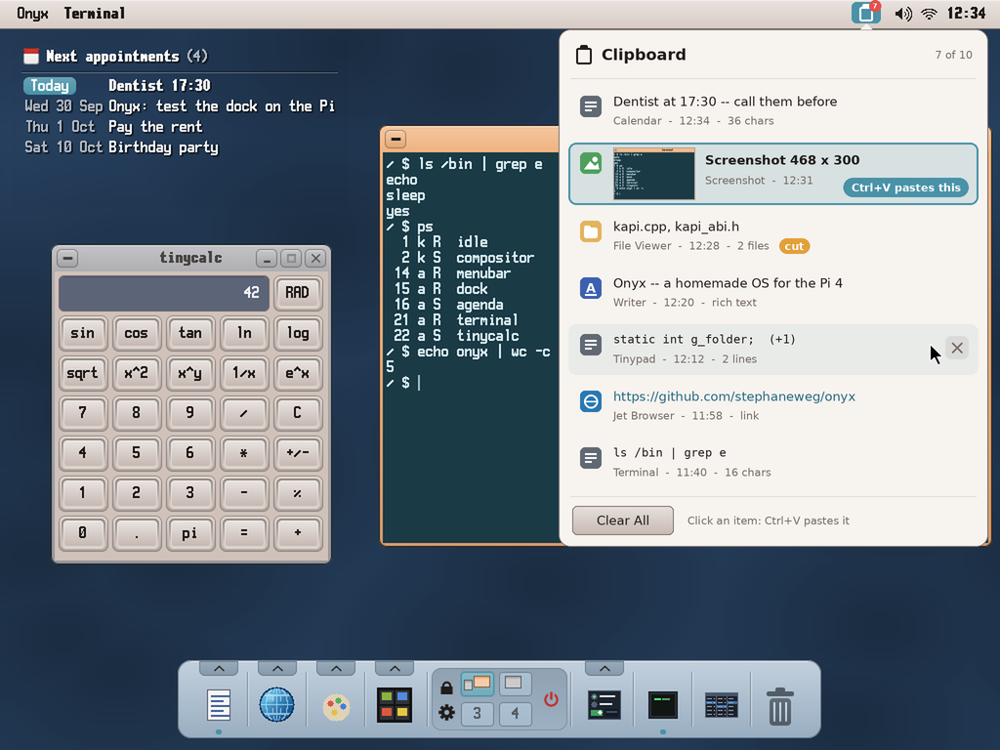
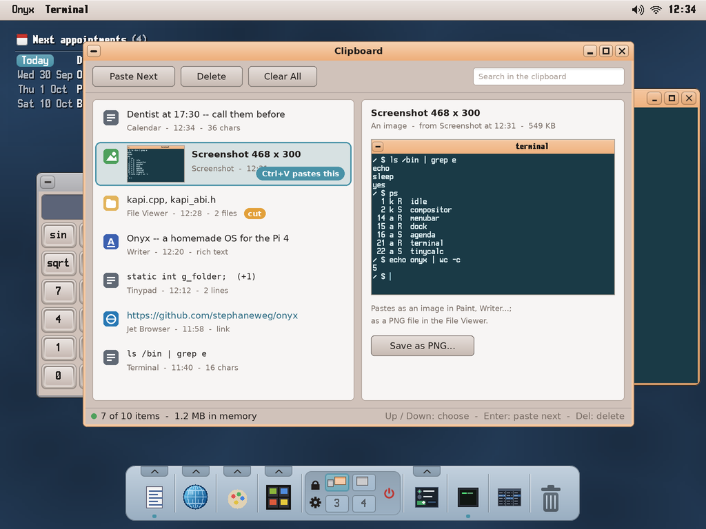

# The shared clipboard — a service with a history (study, first mock-ups)

> **Status (2026-10-01): design and mock-ups, to be validated by the user.** Asked by the user (with
> Screenshot, `docs/screenshot/README.md`): a clipboard **shared by every app through IPC**, not the
> kernel's — a **ring of 10 slots**; Ctrl+C / Ctrl+X send the data **with its type** (text, image, a
> path...) to the clipboard, which **keeps it in its own memory** (nothing left to maintain in the
> kernel); Ctrl+V asks the clipboard, by IPC, for the item **under its cursor**; a **front end** shows
> the list, moves the cursor (the item Ctrl+V will paste) and clears the list.

The mock-ups: `python3 tools/screenshot/mockup_clipboard.py` → `docs/clipboard/mockups/*.png` (on the
real desktop, 1024 × 768).

| | |
|---|---|
|  | **The panel, from the menu bar** (its icon, the number of items). The 10 slots newest first: each its kind (text, image with a thumbnail, files — *cut* marked —, rich text, a link), a preview, the app it came from, the time, the size. **A click puts the cursor there**: *Ctrl+V pastes this*. The × of the row under the pointer deletes it; **Clear All** empties the ring. |
|  | **The same as a window** (`clipboard` app): the list, the item at the cursor shown whole (the image, all the text), *Paste Next*, *Delete*, *Clear All*, a search, *Save as PNG...* for an image; keys Up / Down, Enter, Del. |

## The service: `clipd`

A shell component like `notifyd`: started by `autostart` (or on demand by the first copy), registered
as the IPC service **`clipboard`** (`kapi_ipc_register`). It holds:

- **A ring of 10 items.** A new copy goes in front; past 10, the oldest goes. Each item: its id (a
  counter), the **source app**, the **time**, and **one or several representations** — a format and
  its bytes:

  | Format | Bytes | Who copies it |
  |---|---|---|
  | `text` | UTF-8 | every text field, tinypad, the terminal |
  | `rich` | RTF | Writer (with `text` beside it) |
  | `image` | w, h, then ARGB pixels | Screenshot, Paint, the image viewer |
  | `files` / `files-cut` | `\n`-separated paths | the File Viewer, the Archiver |
  | `url` | a URL (with `text`) | Jet Browser |
  | `x-<app>` | the app's own | Sheet's cells, Koton's notes, Cardfile's records... (with `text` too) |

  An item copied from Writer is `rich` + `text`: Writer pastes the RTF, tinypad the text. An image
  could also be given as a PNG file the File Viewer can paste.
- **The cursor**: the item Ctrl+V pastes. A new copy puts it on the new item (what one expects); the
  front end moves it.
- **Limits**: the ring's memory bounded (say 64 MB, images first to go); an item too large refused.

### The protocol (mailboxes for the messages, shared surfaces for the bytes)

Messages go through `kapi_mailbox_send / _recv` (≤ 512 bytes); the data, which can be megabytes (an
image), through a **shared surface** (`kapi_surface_create / _map`, v35 — the way Koton's plugins
share their buffers): the sender writes into one, the receiver maps it by its id, copies, and says so.

- **Copy** — the app: a surface with the representations, then `CLIP_PUT {surface, formats, sizes,
  source}` → clipd copies them into its own memory, answers `CLIP_OK {item id}`; the app frees the
  surface. Small texts (< 400 bytes) go in the message itself, no surface.
- **Paste** — the app: `CLIP_GET {the formats it takes, best first}` → clipd answers `CLIP_DATA
  {format, size, surface}` with the cursor item's best representation the app takes (a surface it made,
  freed when the app answers `CLIP_DONE`), or `CLIP_NONE`.
- **The front end** — `CLIP_LIST` (the items' kinds, previews, sources, times, sizes — thumbnails as a
  small surface), `CLIP_CURSOR {id}`, `CLIP_DELETE {id}`, `CLIP_CLEAR`; and `CLIP_SUBSCRIBE`: clipd
  tells the subscribers when the ring changes (the menu bar's count, an open panel).
- **Cut and paste of files**: the File Viewer pastes a `files-cut` item by moving the files, then sends
  `CLIP_DELETE` for it.

### What changes in the apps: nothing at first

`user/clipboard.h` keeps its functions (`clip_set_text`, `clip_get_text`, `clip_set_files`,
`clip_get_file`, `clip_clear`) and adds `clip_set_image`, `clip_get_image`, `clip_set (formats...)`,
`clip_get (formats...)` — now over IPC to clipd. wtk's text fields (`textbox.cpp`, `textarea.cpp`) and
the apps that use the header get the history without a change; an app then adds its own formats
(Writer's RTF, Paint's image, Sheet's cells).

**The kernel**: `kapi_clipboard_set / _get` (v40) stay in the ABI (it only grows) but are no longer
used — or answer for clipd when it is not running (a fallback, one text). Nothing else is kept there.

### The front end

- **In the menu bar**: an icon with the number of items; a click opens the panel (the first mock-up).
  A shortcut opens it from anywhere (the menu bar routes it, as Print Screen for Screenshot).
- **The `clipboard` app** (the second mock-up): the same list, the item whole, search, save an image.
- Both are clipd's clients (`CLIP_LIST`, `CLIP_SUBSCRIBE`), not clipd itself: clipd has no window.

## Questions for the user

1. **The front end**: the menu bar's panel, the window, or both? And a shortcut to open it (**Ctrl+Shift+V**,
   as Windows' Win+V)?
2. **Ctrl+V when the cursor's item does not suit the app** (an image under the cursor, Ctrl+V in tinypad):
   paste nothing, or the newest item that suits (here the text)? (Proposed: the newest that suits, the
   panel showing which one was pasted.)
3. **After a paste**, the cursor stays on that item (Ctrl+V again pastes it again — proposed), or moves
   to the next one (pasting the history in turn)?
4. **Kept across a restart?** The ring in memory only (lost at a reboot, as on Windows unless synced), or
   saved to the card at shutdown?
5. **Pinned items** (kept past the 10, never pushed out), as Windows' clipboard history has?
