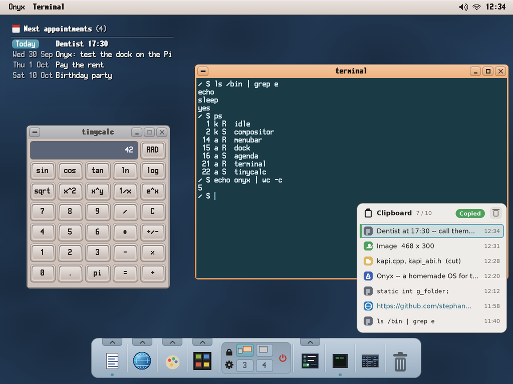
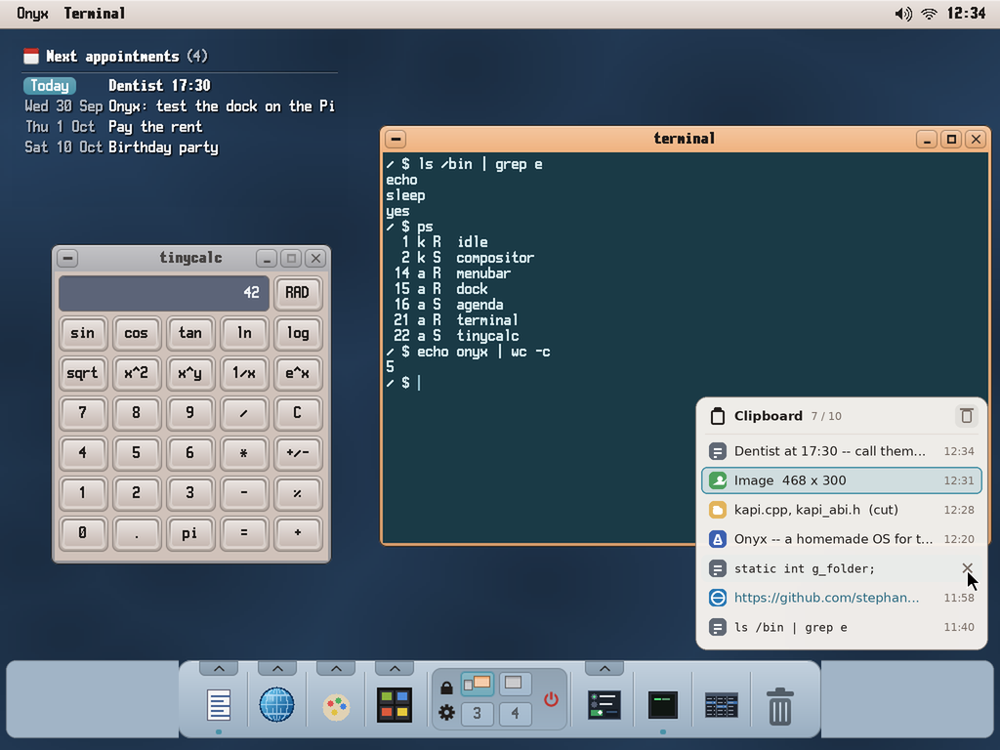

# The shared clipboard — a service with a history (study, first mock-ups)

> **Status (2026-10-01): implemented** (`user/Apps/clipd`, `user/clipboard.h`, `user/clipproto.h`, the widget
> `user/Apps/clipboard`; tested on the PC: `tools/tests/run_clipboard_test.sh`; not yet tried on the Pi).
> The transfers go through files of `RAM:/clip` rather than shared surfaces (a surface mapped stays
> mapped in clipd until it ends: memory kept for nothing). Its use: docs/04 §5 *The clipboard*. Asked by the user (with
> Screenshot, `docs/screenshot/README.md`): a clipboard **shared by every app through IPC**, not the
> kernel's — a **ring of 10 slots**; Ctrl+C / Ctrl+X send the data **with its type** (text, image, a
> path...) to the clipboard, which **keeps it in its own memory** (nothing left to maintain in the
> kernel); Ctrl+V asks the clipboard, by IPC, for the item **under its cursor**; a **front end** shows
> the list, moves the cursor (the item Ctrl+V will paste) and clears the list.

The mock-ups: `python3 tools/screenshot/mockup_clipboard.py` → `docs/clipboard/mockups/*.png` (on the
real desktop, 1024 × 768).

| | |
|---|---|
|  | **The widget, bottom right** (the user's choice): a small card listing the ring, newest first — each item its kind (an icon: text, image, files, rich text, link), one line of it (an image: its size only, **no preview**), the time. **Ctrl+C in the Calendar**: the widget comes to the front, the new item on top with the cursor on it (*Copied*). The bin at the top right clears the list. |
|  | **Above the dock, always**: its bottom is a little above the dock's top edge, so a dock as wide as the screen never hides it and it never covers the dock. **A click on an item puts the cursor there** (here the image: Ctrl+V pastes it); the row under the pointer shows its × (delete). |

## The service: `clipd`

A shell component like `notifyd`: started by `autostart` (or on demand by the first copy), registered
as the IPC service **`clipboard`** (`kapi_ipc_register`). It holds:

- **A ring of 10 items.** A new copy goes in front; past 10, the oldest goes. Each item: its id (a
  counter), the **source app**, the **time**, and **one or several representations** — a format and
  its bytes:

  | Format | Bytes | Who copies it |
  |---|---|---|
  | `text` | UTF-8 | every text field, tinypad, the terminal |
  | `rich` | RTF | Writer (with `text` beside it) |
  | `image` | w, h, then ARGB pixels | Screenshot, Paint, the image viewer |
  | `files` / `files-cut` | `\n`-separated paths | the File Viewer, the Archiver |
  | `url` | a URL (with `text`) | Jet Browser |
  | `x-<app>` | the app's own | Sheet's cells, Koton's notes, Cardfile's records... (with `text` too) |

  An item copied from Writer is `rich` + `text`: Writer pastes the RTF, tinypad the text. An image
  could also be given as a PNG file the File Viewer can paste.
- **The cursor**: the item Ctrl+V pastes. A new copy puts it on the new item (what one expects); the
  front end moves it.
- **Limits**: the ring's memory bounded (say 64 MB, images first to go); an item too large refused.

### The protocol (mailboxes for the messages, shared surfaces for the bytes)

Messages go through `kapi_mailbox_send / _recv` (≤ 512 bytes); the data, which can be megabytes (an
image), through a **shared surface** (`kapi_surface_create / _map`, v35 — the way Koton's plugins
share their buffers): the sender writes into one, the receiver maps it by its id, copies, and says so.

- **Copy** — the app: a surface with the representations, then `CLIP_PUT {surface, formats, sizes,
  source}` → clipd copies them into its own memory, answers `CLIP_OK {item id}`; the app frees the
  surface. Small texts (< 400 bytes) go in the message itself, no surface.
- **Paste** — the app: `CLIP_GET {the formats it takes, best first}` → clipd answers `CLIP_DATA
  {format, size, surface}` with the cursor item's best representation the app takes (a surface it made,
  freed when the app answers `CLIP_DONE`), or `CLIP_NONE`.
- **The front end** — `CLIP_LIST` (the items' kinds, a line of text each — an image: its size —,
  sources, times), `CLIP_CURSOR {id}`, `CLIP_DELETE {id}`, `CLIP_CLEAR`; and `CLIP_SUBSCRIBE`: clipd
  tells the subscribers when the ring changes (the widget).
- **Cut and paste of files**: the File Viewer pastes a `files-cut` item by moving the files, then sends
  `CLIP_DELETE` for it.

### What changes in the apps: nothing at first

`user/clipboard.h` keeps its functions (`clip_set_text`, `clip_get_text`, `clip_set_files`,
`clip_get_file`, `clip_clear`) and adds `clip_set_image`, `clip_get_image`, `clip_set (formats...)`,
`clip_get (formats...)` — now over IPC to clipd. wtk's text fields (`textbox.cpp`, `textarea.cpp`) and
the apps that use the header get the history without a change; an app then adds its own formats
(Writer's RTF, Paint's image, Sheet's cells).

**The kernel**: `kapi_clipboard_set / _get` (v40) stay in the ABI (it only grows) but are no longer
used — or answer for clipd when it is not running (a fallback, one text). Nothing else is kept there.

### The front end: a widget, bottom right

- A small card (300 px wide, a row of 30 px an item) at the **bottom right of the screen**, its bottom
  **above the dock's top edge** (the dock's place read from the window list, followed when the dock
  moves or the screen changes): a dock as wide as the screen never hides it, it never covers the dock.
- **No preview of the images**: an icon and their size.
- A click on an item: the **cursor** goes there (Ctrl+V pastes it); its ×: deleted; the bin: all cleared.
- **Shown by the dock's clipboard button** (at the right of its middle, under the power button — the
  user's choice; done: it launches `clipboard`), a click elsewhere hides it.
- It is a client of clipd (`CLIP_LIST`, `CLIP_SUBSCRIBE`), not clipd itself: clipd has no window.

## Decided with the user (2026-10-01)

1. The widget opens from the **dock's button** only; a copy shows a **notification** (*Text copied*,
   *Image copied*, *2 items cut*), not the widget.
2. Ctrl+V with an item that does not suit the app under the cursor: the **newest item that suits**.
3. After a paste the **cursor stays** (Ctrl+V again pastes the same).
4. The history is **lost at a restart** (memory only).
5. No pinned items for now.

## Still to do

- **Jet Browser** writes and reads the kernel's clipboard itself (`user/netsurf/onyx_chrome.cpp`
  `clip_copy` and its ^V): switch it to `clipboard.h` (`clip_set_text_n`, `clip_get_text`) in a Jet
  session — until then its copies are not in the history, and its paste gets the last text copied.
- The apps' own formats: Paint and Screenshot `clip_set_image`, Writer `rtf` + `text`, the Spreadsheet's
  cells (`x-sheet` + `text`).
