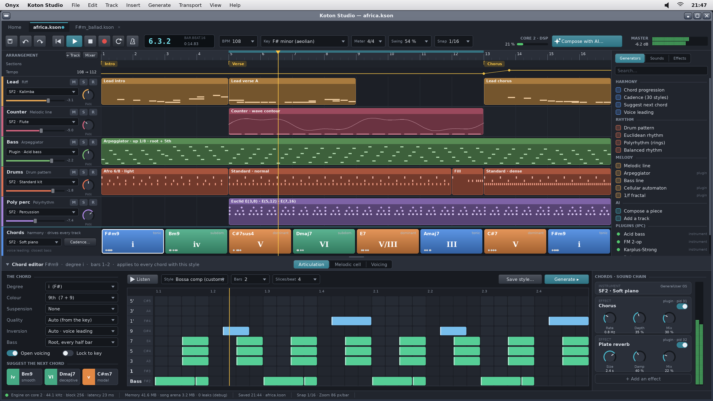
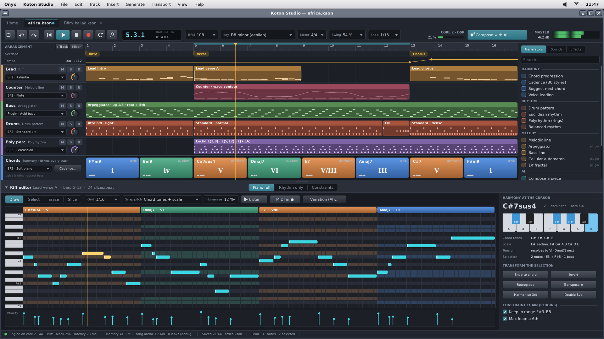
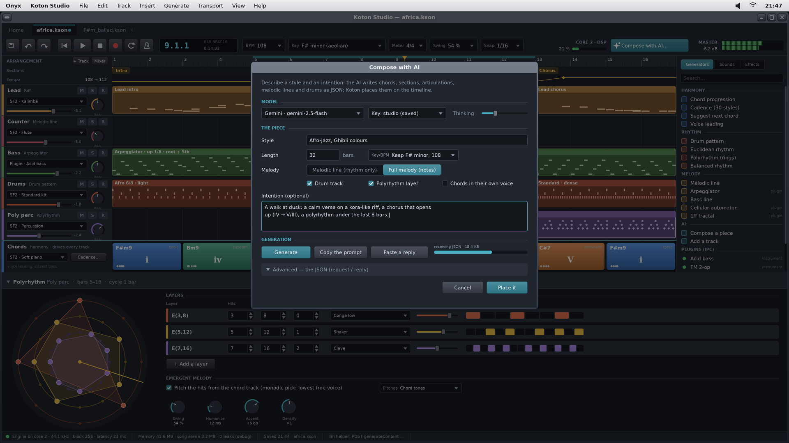

# Koton Studio for Onyx — a DAW that thinks in harmony (study, plan, first mock-ups)

> **Status: a study and a plan (2026-09-29), no code yet.** Asked by the user: a music app for Onyx
> "in the manner of Koton Studio" (the user's own C#/WPF DAW, `github.com/stephaneweg/MusicTracker`),
> **without the score view** at first; the same philosophy (one thinks in harmony, then adds chord,
> rhythm and polyrhythm generators); sound and effect plugins as **separate processes over IPC**, the
> way the Control Panel hosts its applets; a careful, "pro" interface made of wtk widgets, with the
> big areas (the lanes, the grids) **drawn by hand in a canvas the size of the view**; JSON
> everywhere (the save format, the settings, the exchange with Gemini); the extra core used; and
> **no memory leaks**. Working name: **Koton Studio** (app folder `koton`, documents `.kson`).

The mock-ups are made by `python3 tools/screenshot/mockup_daw.py` → `docs/daw/mockups/*.png`
(1920 × 1080, the Pi's screen; the app maximised in an Onyx frame, Slate theme).

| | |
|---|---|
|  | **The arrangement + the chord editor.** The toolbar (transport, the position LCD, BPM, key, meter, swing, snap, "Compose with AI…", the DSP core's load, the master meter); the lanes (sections, tempo, five tracks, each block a *generator*: a riff, a melodic line, an arpeggiator, drum patterns, a euclidean polyrhythm); the **chord track pinned at the bottom**, each chord its degree in roman numerals and coloured by function (tonic / subdominant / dominant); the browser of generators at the right. Below, the chord editor: the chord's degree, colour, suspension, inversion (voice leading), the next-chord suggestions; the articulation grid (rows = the chord's voices: bass, 1, 3, 5, 7, 9, 1′…, columns = slices); the track's sound chain (an SF2 instrument, two effect plugins, each a process, their knobs). |
|  | **The piano roll, harmony-aware.** The chords above the roll; the rows of the scale lighter, the current chord's tones tinted in its function's colour, under each chord; "snap pitch: chord tones + scale"; the velocity lane; at the right the harmony at the cursor (the chord on a keyboard, the scale, where it resolves), transformations of the selection, the constraint chain (note filters, plugins). |
|  | **The polyrhythm editor and the AI dialog.** Three euclidean rings E(3,8), E(5,12), E(7,16), their table (hits, steps, rotation, sound, velocity), the "emergent melody" (the hits pitched from the chord track); over it the Compose-with-AI modal (the model, the piece, the intention, Generate / Copy the prompt / Paste a reply, the JSON behind). |

The mock-ups are drawn with anti-aliased DejaVu (the `.aaf` fonts of `elegant.h`, see §5.3); wtk
today draws its text with bitmap fonts.

---

## 1. Koton Studio, studied

Sources: the repository `stephaneweg/MusicTracker` (read-only here), its README and screenshots,
`KANBAN.md`, `NOTES-compo-llm-handoff.md`. C#/WPF, .NET; ~60 k lines in the app, ~36 k in the
plugins, 6 k in MeltySynth (the vendored SF2 synth), 1.4 k in the plugin SDK, 8 k of XAML.

### 1.1 The philosophy — what makes it Koton

1. **The chord track drives everything.** It is a track like the others (`TimelineTrack`, `Type =
   Chord`, always last, "Accords"); `Harmony.ChordAt (beat)` answers "which chord is sounding at this
   beat" to every other part.
2. **Modules, not notes.** A track is a list of `TimelineItem { SilenceBefore, FlowModule }` — the
   position is relative (the sum of the silences and lengths before it). A module is a generator:
   `PlayRiff` (a riff, absolute notes), `Pattern` (one chord: degree, colour, suspension, inversion,
   style), `ChordArticulation` (articulates the chord of the chord track), `Cadence`, `MelodicLine`
   (rhythm only: the engine chooses the pitches from the harmony), `DrumKit`, `PolyDrum` /
   `MelodicPoly` / `PolyChord` (euclidean rings), `KotonGenerator` (a plugin).
3. **Degrees, not chord names.** A chord locked to a degree follows key changes and transposition;
   35 qualities (append-only indices), 30 cadence styles (a functional random walk), next-chord
   suggestions ranked by mood and phrase position, voice leading (closest bass / top).
4. **Articulation grids.** 28 accompaniment styles (block, arpeggios, Alberti, bossa, reggae…) and
   a custom grid: rows = chord voices (bass, 1, 3, 5, 7, 1′, 9, 3′, 5′, 7′, 9′), columns = slices;
   a missing voice snaps to the nearest real tone. The same grid is the AI's `motif` format.
5. **Melodic lines from the harmony.** `MelodicLineEngine`: strong beats on chord tones, weak beats
   on chord or passing tones, 9 contours (wave, Thue-Morse, L-system, 1/f…), a leap cap, register
   bands, continuity across modules.
6. **Rhythm generators**: a drum catalog (JSON: categories → motifs of `[lane, start, len]`),
   densities, fills; euclidean and balanced (Milne) rhythms, rings stacked into polyrhythms, an
   "emergent monody" that pitches them from the chords.
7. **Procedural composers** (serial, cellular automaton, L-system, genetic, 1/f, Thue-Morse) and
   style composers (Bach, Vivaldi, Ghibli/Hisaishi) — pitch engines on a shared meter-aware rhythm.
8. **AI as a collaborator, bounded by a deterministic engine**: a French system prompt, a strict
   JSON reply (`meter, key, bpm, sections, chords [[measure, degree, quality]], articulation
   [{motif, melodicCell}], melodicLines | riffs, drums, polyChords/polyDrums`), placed on the
   timeline by `AiArrangementPlacer` (fresh piece, develop after the end, add a track). Seven
   providers; a no-key mode through the clipboard.

### 1.2 What we port, what we leave

| Area | C# lines | For Onyx |
|---|---|---|
| Data model (project, tracks, modules, riffs, harmony lookup) | ~1.5 k | **port** (C++) |
| Harmony & accompaniment (`PatternGenerator`, `MusicTheory`, `ChordDegrees`, `HarmonySuggest`, articulation) | ~2.3 k | **port** — the heart |
| Melodic line engine | 0.55 k | **port** |
| Drums, catalog | 0.5 k | **port** (the catalog JSON as is) |
| Euclid / balanced / poly | ~1.7 k | **port** (M3) |
| Player (flatten to slices, swing, humanize, per-track synths, mixing) | ~1.8 k | **rewrite** for the DSP core (§3) |
| MeltySynth (SF2) | 6 k | port, or TinySoundFont first (§3.3) |
| AI (prompts, parser, placer, clients) | 2.8 k | **port** prompts + placer; one Gemini client first |
| Procedural + style composers | ~11 k | later, as generator plugins |
| MIDI import/export | part of 1.8 k | MIDI export/import (M6) |
| VST2/3 hosting | ~6 k | **no** (Windows only) — our IPC plugins instead |
| Plugins (23 physical models, synths, effects, generators) | 36 k | a few easy ones first (§7.1), others over time |
| Score view (Bravura), MuseScore/MusicXML, PDF | ~4 k | **no** (asked: no score at first) |
| UI (WPF) | ~31 k | **rewrite** with wtk + hand-drawn canvases |
| Live rack, updater, bug report, 8 languages | ~3 k | no |

A minimum that plays and thinks in harmony: ~8 k C# of engine → ~7 k C++, plus ~9 k of UI.

---

## 2. What Onyx already gives (and what is missing)

| Need | In Onyx today | Gap |
|---|---|---|
| Windows, widgets | wtk: Button, Dropdown, Combobox, Textbox, Slider, NumericUpDown, ListBox, TreeView, DataGrid, TabHost, splitters, stack/grid layouts, Checkbox, ToggleSwitch, dialogs (Modal, FileDialog, MessageBox), the global menu bar (`Menu`), tooltips, drag and drop | a **Knob**, a **VU meter**, a **segmented control**, a **toolbar** (exists only inside Writer / the spreadsheet), an LCD label; a zoomable time view helper |
| Hand-drawn areas | `Widget::onDraw` into its `Canvas` (0x00RRGGBB), `paint.h` (blend, rounded boxes, gradients), `vpaint.h` (anti-aliased paths, arcs — a knob's base) | nothing blocking; the lane / grid canvases are ours to write |
| Text | bitmap `.fnt` fonts (8 × 16 kernel font, 4 styles); FreeType only in Writer / the spreadsheet | anti-aliased UI text for the "pro" look (§5.3) |
| Sound out | `kapi_sound_acquire / write / status`, 44.1 kHz s16 stereo, a 0.5 s ring, **core 1** renders the kernel side, 1024-frame chunks, 4 ahead (≈ 90–115 ms) | low latency; one owner at a time; the 3.5 mm PWM jack only (≈ 11-bit, hiss) |
| Sound in, MIDI | — | **USB MIDI** (keyboards); audio input later |
| Threads, cores | `kapi_thread_*` (v67; all threads on core 0, preemptive), mutex / event / barrier, `kapi_post`; **app cores** (`kapi_core_acquire / run`, v51): code with no kapi call and no malloc, `emucore.h` as the pattern; **core 2 is free** (core 3 = the network, `netcore=1`) | a futex-like wait on a word in shared memory (§4.3), thread priorities; threads not yet tried on the Pi |
| Floating point | apps build with `-mgeneral-regs-only`; an app can opt out (n64, gc do) and use the FPU / NEON | just the Makefile |
| IPC | mailboxes (512 B, 32 slots), named services (`kapi_ipc_register / lookup`), **shared surfaces** (`kapi_surface_create / map`, live while any process maps them), pipes, `kapi_exec_as`; the **applet protocol** (`applet_proto.h`: a wtk app drawn into the host's surface, pointer / keys forwarded) | a plain byte-sized shared memory would be nicer (a surface of w × 1 does it) |
| JSON | hand-written helpers in `bin/groq.cpp` and Lisa | **a real JSON library** (§3.5) |
| HTTPS | `http.hpp` (+ `ONYX_HTTP_TLS`, mbedTLS 3.6.3), chunked bodies; the pattern of Lisa → `bin/groq` (a helper process does the TLS) | a Gemini client; **certificates are not verified** |
| Memory | `umm` (size classes + first fit, thread-safe, never gives memory back), `memmon`, `taskman`, `kapi_meminfo` | leak counters in debug builds; the PC build under ASan/LSan (§6) |
| Files, packaging | `kapi_open / read / save_file`, `FileDialog`, `app.txt` + `icon.bmp`, `fileassoc.ini`, the dock's drawers, the **desktop simulator** (`tools/tests/desktop_sim`, real apps built for the PC) | — |

---

## 3. The architecture

### 3.1 Processes, threads, cores

```
 core 0 (scheduled)                                   core 2 (app core, kapi_core_run)
 ┌────────────────────────────────────────┐          ┌──────────────────────────────────┐
 │ koton (the app)                        │          │ DSP engine — no kapi, no malloc  │
 │  UI thread: wtk Root, 60 Hz, editors   │ commands │  plays the compiled song:        │
 │  compile thread: project → event list ─┼─────────▶│   events → voices (SF2, built-in)│
 │  audio pump thread: PCM ring → kernel ◀┼──────────┤   built-in effects, sends, mix   │
 │  (meters, playhead ◀───────────────────┼──────────┤   meters, playhead, underruns    │
 └───────┬────────────────────────────────┘  SPSC    └──────────────▲───────────────────┘
         │ mailboxes + shared memory       rings                    │ shared audio rings
 ┌───────▼─────────┐ ┌────────────────┐ ┌──────────────┐           │ (plugins render ahead)
 │ plugin processes│ │ plugin editors │ │ llm helper   │───────────┘
 │ (instrument,    │ │ (applets in the│ │ HTTPS + JSON │── core 3: network (netcore)
 │  effect, gen.)  │ │  chain panel)  │ │ Gemini, Groq │
 └─────────────────┘ └────────────────┘ └──────────────┘
 core 1: the kernel's sound (PWM)
```

- **The UI thread** owns the project (the model). Edits happen there; each edit bumps a revision.
- **The compile thread** turns the project into an immutable **compiled song** (like Koton's
  `TimelinePlayer.Start` flattening, but out of the audio path): every module is resolved against
  the chord track into timed note events (sample-accurate at 44.1 kHz, swing / humanize / metric
  velocity applied), per track, plus the automation curves. It is built in its own **arena**; the
  engine is handed the pointer through a one-slot mailbox (an atomic swap); the old one is freed
  when the engine acknowledges it (no lock, no leak, no half-read song). Only the bars around an
  edit are recompiled (a dirty range), so editing while playing is instant.
- **The DSP engine on core 2** (the `emucore.h` pattern): it reads the compiled song, allocates
  voices from a fixed pool, renders blocks of 256 frames in `float` (NEON), mixes, soft-clips, writes
  s16 into a ring. It never waits on anything: a missing plugin block is silence plus a counter.
  With no free core (core 2 taken), the same code runs on the audio pump thread instead.
- **The audio pump thread** (core 0) moves the ring into `kapi_sound_write`, and carries the
  meters and the playhead back to the UI (`kapi_post`). With the OS addition A1 (§4) the engine
  writes straight into the kernel's ring and this thread disappears.
- **Plugins** are processes (§3.4); **the AI** is a helper process (§3.6): a crash in either never
  takes the app down.

### 3.2 The model (C++), close to Koton's

`Project { tempo map, key, meter, pickup, swing, humanize, markers, tracks, riffs, user chord /
drum / melodic styles }`, `Track { name, type (instrument | drum | chord), sound, volume, pan,
mute, solo, chain (plugins), automation lanes, items }`, `Item { silenceBefore, Module* }`, the
modules of §1.1 as a small class hierarchy with a `kind` tag. Same field names as Koton's `.sq`
where possible, so that **Koton's `.sq` files open in Onyx** (an importer; the JSON is the same
family). Undo / redo: snapshots of the edited track (serialised to JSON in a ring of arenas —
simple, bounded, leak-free).

### 3.3 The synthesiser

- **M1: TinySoundFont** (`tsf.h`, MIT, one C header, ~2 k lines): SF2 loading, voices,
  envelopes, the low-pass filter — sound within days. Its sample loading (malloc) happens on the
  UI side, before playing; its render loop on core 2 allocates nothing once the voice pool is
  sized (to be checked and patched: `tsf_set_max_voices`).
- **Later: port MeltySynth** (6 k C#, MIT) if we want Koton's exact sound (its modulators, chorus,
  reverb): mechanical work.
- **The SoundFont**: GeneralUser GS (~30 MB, free to redistribute) on the card, rather than
  MuseScore_General (200+ MB: long to load from the SD card, and memory ×2 once in float).
- Budget: 64 SF2 voices at 44.1 kHz ≈ 5–10 % of a Cortex-A72 core; a reverb a few %. Core 2 has
  room for a whole song plus built-in effects.

### 3.4 Plugins over IPC (the applets' way)

A plugin is an app in `SD:/apps/koton.app/plugins/<name>.kpl/` (`main` + `plugin.json`: kind,
name, parameters). Three kinds, in the order we build them:

1. **Generators** (arpeggiator, euclid, cellular automaton, 1/f…) — *not real time*: the compile
   thread asks "notes for beats a..b, with this context (key, chords, meter, the module's state)"
   and gets notes back. Request / reply in JSON through a shared buffer + a mailbox. Simple, safe,
   and it covers Koton's `IKotonGenerator` exactly.
2. **Instruments and effects** — *real time, rendered ahead*: a song is known in advance, so each
   plugin instance gets a shared memory region (header, an event ring of timed notes / parameter
   changes, and an audio ring of float blocks). The engine writes the events 8 blocks (~46 ms)
   ahead; the plugin process renders them into its ring; the engine mixes the blocks when due.
   Effects work the same on a track's dry stem (engine → ring → plugin → ring → engine). The plugin
   process sleeps on a word of the shared region (OS addition B2) instead of polling. Live playing
   through a plugin instrument has this window's latency; the built-in sounds stay the low-latency
   path.
3. **Editors** — the plugin started with `--editor <surface> <hostpid>` is a plain wtk applet
   (`applet_proto.h`, unchanged): the host shows it in the chain panel or a floating window.

The protocol (`user/kplug_proto.h`, append-only like the kapi ABI): `KP_HELLO {kind, name,
nparams}`, `KP_PARAMS` (JSON), `KP_PREPARE {rate, block, shm}`, `KP_SET {param, value}`,
`KP_STATE_GET / SET` (a JSON blob, saved in the project), `KP_GENERATE {from, to}` → notes,
`KP_RESET`, `KP_BYE`. The host kills a plugin that stops answering and marks it "crashed" in the
chain (the song keeps playing without it).

### 3.5 JSON — `user/json.hpp`

Nothing in `third_party` fits (quickjs is too big for this; the helpers in `groq` are not a
parser). Proposal: **our own, small, arena-based** (~700 lines), rather than cJSON (MIT, fine, but
one malloc per node — a leak waiting to happen):

- `JsonDoc` owns one bump arena: every node and string of a document lives in it; freeing the
  document is one call — **no per-node free, no leak possible**.
- A strict parser with line / column errors (for the AI's replies: a tolerant mode that strips
  ```` ``` ```` fences and trailing commas, as Koton's `StripFences`), UTF-8 kept as is, a helper to
  convert to the fonts' Latin-1 for display.
- `JsonWriter`: streaming, to a buffer or a file (`kapi_file_out`), pretty or minified; compact
  arrays for notes (`[[48,0,24],…]` as Koton's prompts ask).
- Typed accessors (`get ("bpm", 120)`, `each ("tracks", fn)`) so that model loading is short and
  tolerant of missing fields (Koton's compatibility rule).
- Used for: `.kson` projects, `SD:/etc/koton/settings.json`, the drum catalog, chord styles,
  plugin manifests and states, the AI's requests and replies.
- Unit tests on the PC (`tools/tests/json/`), under ASan.

### 3.6 The AI

- A helper **`SD:/bin/llm`** (generalises `bin/groq`: the TLS stays out of the app, as Lisa does):
  reads a request JSON on stdin (`provider, model, system, user, json: true, thinking`), writes the
  reply JSON on stdout, progress on stderr. Providers: **Gemini** first (`POST
  …/v1beta/models/{model}:generateContent`, `x-goog-api-key`, `responseMimeType:
  application/json`, the text in `candidates[0].content.parts[*].text`, `MAX_TOKENS` → an error),
  then Groq (already done), Mistral, Claude.
- In the app: the prompt builders and `AiArrangementPlacer` ported (fresh piece, develop, add a
  track, a drum groove, a riff), the reply parsed with `json.hpp`, placed as modules. "Copy the
  prompt / Paste a reply" works with no key (the clipboard: `clipboard.h`).
- Keys in `SD:/etc/koton/keys.json` (plain text on the card — say so in the UI).

---

## 4. What to add to the OS

| # | Addition | Why | Size | When |
|---|---|---|---|---|
| **A1** | **Low-latency sound**: `kapi_sound_config (frames_per_chunk, ahead)` (256 × 2 → ≈ 12 ms) and a **mapped PCM ring** the owner can write from an app core (`kapi_sound_map` → the ring + its indices) | playing live; no core-0 pump thread in the audio path | kernel `sound.cpp`, small | M1–M2 |
| **A2** | **HDMI audio and I2S DAC HATs** (upstream Circle provides `CHDMISoundBaseDevice`, `CI2SSoundBaseDevice`: to check against our fork) chosen in `cmdline.txt` / config | the PWM jack is ≈ 11 bits with hiss — not "pro" | medium | M2 |
| **A3** | **USB MIDI in** (upstream Circle's `CUSBMIDIDevice`, unused by Onyx today): `kapi_midi_read (events with timestamps)`, hot-plug | playing / recording from a keyboard | medium | M3 |
| A4 | A system mixer: several sound owners mixed (notifications while the DAW plays) | comfort | medium | later |
| A5 | Audio input (USB audio class) | Koton's mic → notes | large | later |
| **B1** | Threads tried on the Pi (v67 is untested) | the compile and pump threads | tests | M0 |
| **B2** | **A futex-like wait**: `kapi_wait_word (addr, value, ms)` / `kapi_wake_word (addr)`, also across processes on a shared region; the kernel re-checks sleeping words at each tick (an app core cannot call `wake`) | plugins sleep until their block is due; the pump sleeps until the engine wrote | small | M5 |
| B3 | Thread priorities (a "real time" class for the pump / plugin render) | no dropout while the UI redraws | small | M5 |
| B4 | `kapi_shm_create (bytes)` (a surface of w × 1 does it today) | clearer plugin code | tiny | M5 |
| B5 | Threads on other cores with kapi calls (SMP scheduling) | long term | large | — |
| **C1** | **TLS certificate verification** (a CA bundle on the card) | an API key goes over it | medium | M4 |
| **W1** | wtk: **Knob**, **VuMeter**, **SegmentedControl**, **ToolBar / ToolButton** promoted from Writer, an LCD label, a `TimeView` helper (horizontal zoom / scroll in beats, shared by the lanes and the grids) | the "pro" look, reused by other apps | medium | M0–M1 |
| W2 | wtk: **anti-aliased text** (`.aaf` fonts of `elegant.h`, on `archive/elegant-ui-2026-09-28`) as an opt-in per widget / app | the look of the mock-ups | medium | M1–M2 |
| L1 | `user/json.hpp` (§3.5) | everything | small | M0 |
| L2 | `umm` debug statistics: live blocks / bytes, a high-water mark; `umm_check ()` | leak hunting on the Pi | small | M0 |

Everything else (files, dialogs, the dock, file associations, the menu bar, HTTP) is there.

---

## 5. The interface

### 5.1 The layout (the mock-ups)

The global menu bar (File, Edit, Track, Insert, Generate, Transport, View, Help); in the window:
the document tabs (Home + open songs), the toolbar, the arrangement (track headers | the lanes
canvas | the browser), a splitter, the **context editor** of the selected module (chord,
riff / piano roll, melodic line, drums, polyrhythm, generator plugin), the status bar (the engine,
memory, the last save). A Home tab (recent songs, templates, "Compose with AI") as Koton's.

### 5.2 wtk widgets vs hand-drawn canvases

- **wtk widgets** (as many as possible): the toolbar, the dropdowns, fields, NumericUpDowns,
  toggles, checkboxes, the tabs, the browser (a TreeView / ListBox), the track headers (a Panel of
  widgets per track), the chord properties, the sound chain (panels + knobs), the dialogs, the
  menus.
- **Hand-drawn, one canvas the size of the view** (not the size of the song: a 64-bar song zoomed
  in would be a 20 000-pixel bitmap): the ruler + markers + tempo lane + track lanes + chord track
  (one `ArrangeView`), the articulation / drum / rhythm grids (one `GridView`), the piano roll + the
  velocity lane (one `RollView`), the rings (`RingView`). Each draws only what is visible, from the
  model, into its own canvas; scrolling redraws (fast: rectangles and short text) — no off-screen
  bitmap of the whole song, so memory does not grow with the song's length. Module thumbnails are
  cached per module in small bitmaps, dropped when the module changes.
- The playhead: drawn in a thin overlay so that it moves at 60 Hz without redrawing the lanes.

### 5.3 The look

A dark studio inside Onyx's frame (the Slate theme), the colours of the mock-ups as `theme`
tokens of the app (`BG, PANEL, FACE, LINE, TEXT, DIM, ACC`, track colours, function colours:
tonic blue, subdominant green, dominant orange). The chords always show their **roman numeral and
function** — the app's signature ("one thinks in harmony"). Anti-aliased text (W2) makes most of
the difference with the mock-ups; without it, the same layout with the bitmap fonts.

---

## 6. Memory: no leaks, by construction

1. **Arenas for everything with a lifetime**: a JSON document, a compiled song, an AI reply, an
   undo snapshot — freed in one call, never node by node.
2. **Ownership in the model**: the project owns tracks, tracks own items, items own modules
   (`std::unique_ptr`-like owners from `onyxpp.hpp`; no raw `new` outside constructors); riffs are
   referenced by id, not by pointer.
3. **Nothing allocated on core 2**: the voice pool, the rings, the block buffers are made before
   playing; the engine's code is compiled in its own file with `-fno-exceptions`, and a debug build
   checks `umm`'s counters do not move while playing.
4. **Processes clean up after themselves**: plugins and the `llm` helper die with the app (killed
   on exit, their shared regions freed when unmapped — kernel v65).
5. **Measured**: `umm` debug counters (L2) in the status bar of a debug build; a soak test
   (open / play / close a song 100 times: the live blocks come back to the baseline); **the engine,
   the model, `json.hpp`, the compiler and the placer built for the PC in the desktop simulator
   under AddressSanitizer / LeakSanitizer** — the real leak detector we do not have on the Pi.
6. `umm` never gives memory back to the kernel: big buffers (the SoundFont's samples) are
   allocated once, at the start, and kept.

---

## 7. The road

| Milestone | Content | Done when |
|---|---|---|
| **M0 — foundations** | `json.hpp` + tests; wtk Knob / VuMeter / Segmented / ToolBar; umm debug counters; the app skeleton (`user/Apps/koton`, FPU build flags, the window, the tabs, the toolbar); the engine on core 2 playing a sine through the ring; threads tried on the Pi | a tone plays from core 2, the UI stays at 60 Hz |
| **M1 — it sounds** | the model + `.kson` load / save; TinySoundFont + GeneralUser GS; the compile thread; the arrangement view (lanes, ruler, playhead, drag / resize / copy of modules); transport, loop, metronome; the riff editor (piano roll); the chord track with degree chords and the 28 accompaniment styles; WAV export; A1 | a song of riffs over a chord progression plays and saves |
| **M2 — thinking in harmony** | the chord editor (the voice grid, user styles), cadences (30 styles), next-chord suggestions, voice leading, the melodic line engine, melodic cells, the harmony-aware piano roll, drum patterns + the catalog, fills; import of Koton `.sq`; A2 | Koton's `africa.sq` opens and plays alike |
| **M3 — rhythm and generators** | euclidean / balanced rhythms, the poly rings and the emergent melody; the generator plugin protocol; the first generator plugins (arpeggiator, cellular automaton, 1/f, random walk); USB MIDI in (A3) and recording into a riff | a polyrhythm under a song; a keyboard records a riff |
| **M4 — the AI** | `bin/llm` (Gemini, Groq); the Compose dialog, "add a track", "develop", a drum groove, a riff; copy / paste mode; C1 | a 32-bar piece composed by Gemini plays |
| **M5 — sound plugins** | the real-time plugin protocol (shared rings, B2, B3); the first plugins (§7.1); editors as applets in the chain panel; the mixer view; automation lanes (volume, pan, a plugin parameter) | a song with a plugin synth and two plugin effects plays without dropouts |
| **M6 — polish** | MIDI import / export, the Home tab (templates, recent songs), the docs (`docs/04` catalogue, `docs/03`), the screenshots (`shots.sh koton`) | — |

### 7.1 The first plugins (the easy ones)

- Instruments: **FM 2-op** (the kernel's FM voices' algorithm, in float), **subtractive** (saw /
  square / noise, a state-variable filter, two ADSRs), **Karplus-Strong** (plucked strings — Koton's
  kora sounds), a **drum synth** (808-style kick / snare / hat).
- Effects: **delay** (ping-pong, tempo-synced), **Freeverb** (public domain), **chorus**, a
  **3-band EQ / filter**, **drive** (tanh), a simple **compressor**.
- Generators: **arpeggiator** (Koton's reference plugin), **euclid**, **random walk**, **cellular
  automaton**, **1/f**.

---

## 8. Open questions for the user

1. **The name**: "Koton Studio" (the same product on Onyx), or an Onyx name?
2. **The synthesiser**: TinySoundFont first (sound quickly) then MeltySynth, or port MeltySynth
   straight away (Koton's exact sound)?
3. **The audio output**: the jack (today), HDMI, or an I2S DAC HAT (which one do you have)?
4. **`.sq` compatibility**: open Koton's Windows projects (recommended), and even write them back?
5. **Anti-aliased text** (W2) for this app — worth bringing into wtk now?
6. **The AI's language**: keep Koton's French prompts as they are (they are tuned), UI in English
   as the rest of Onyx?
