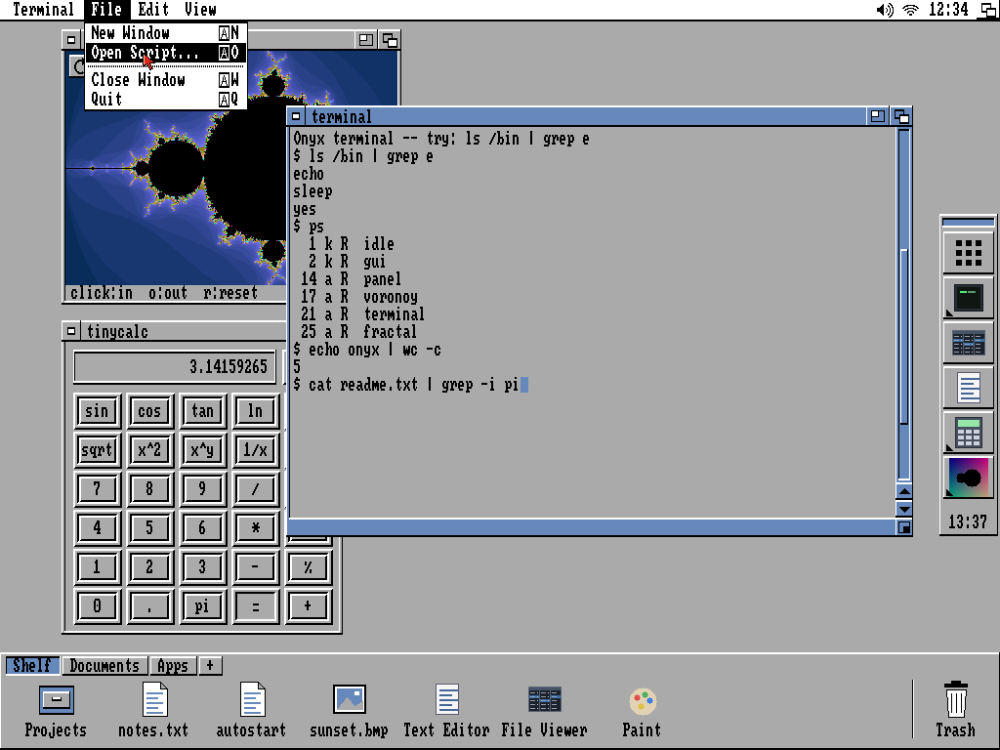
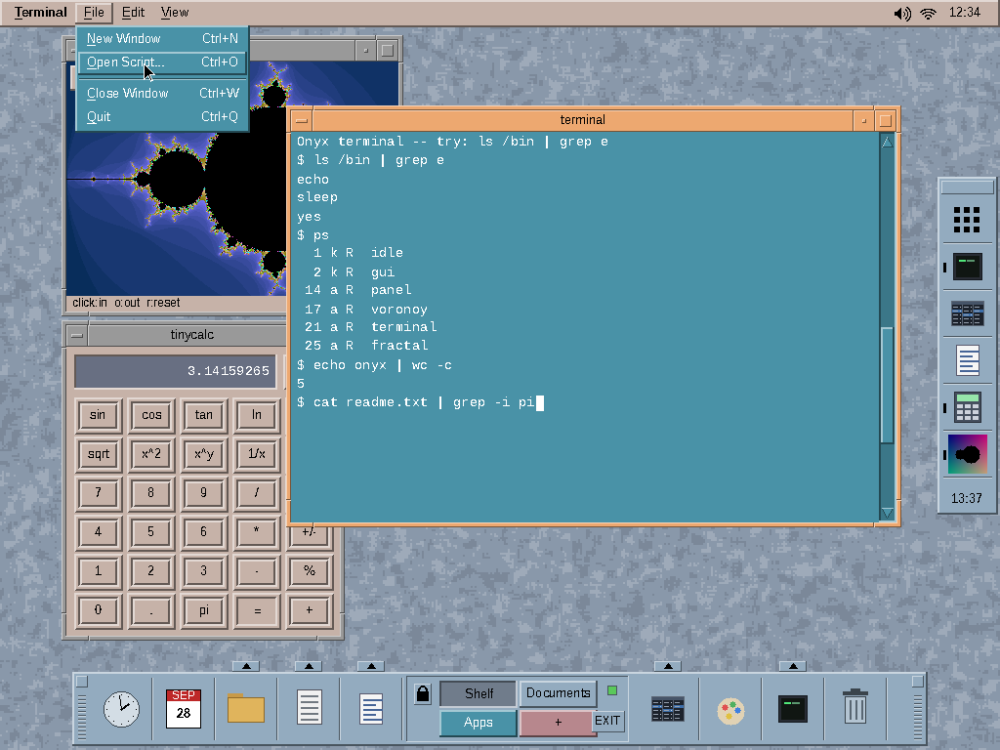
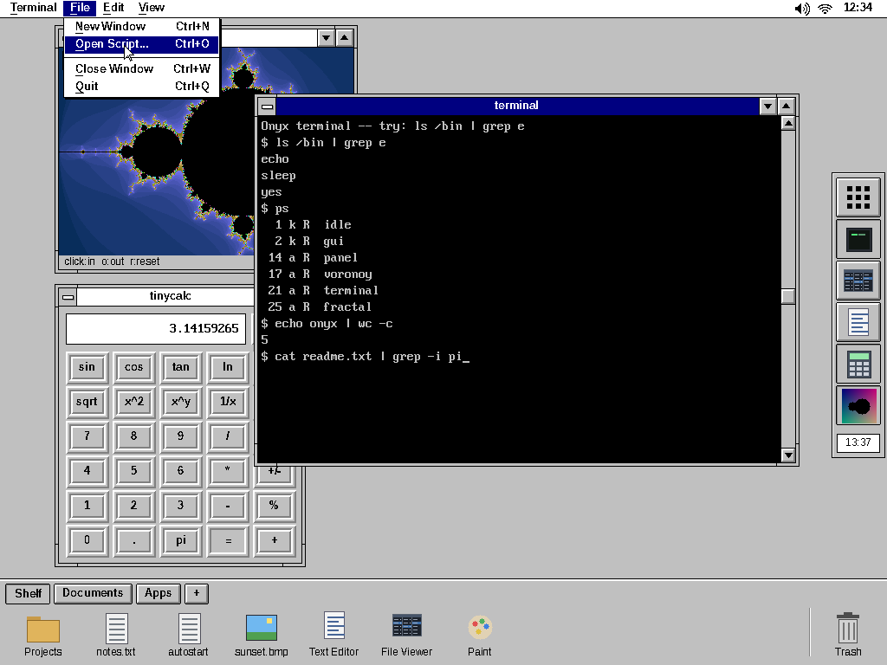
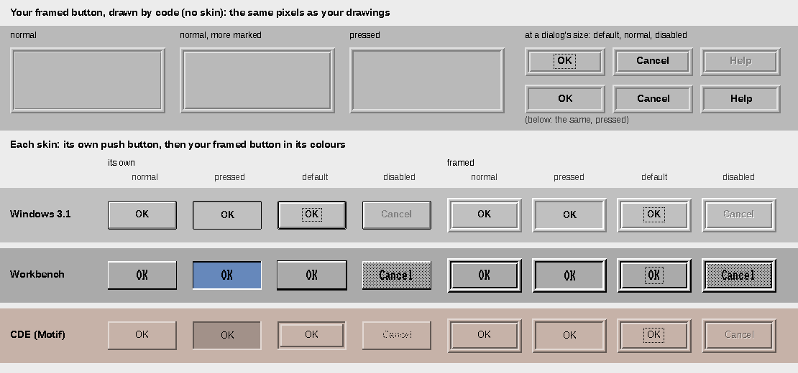
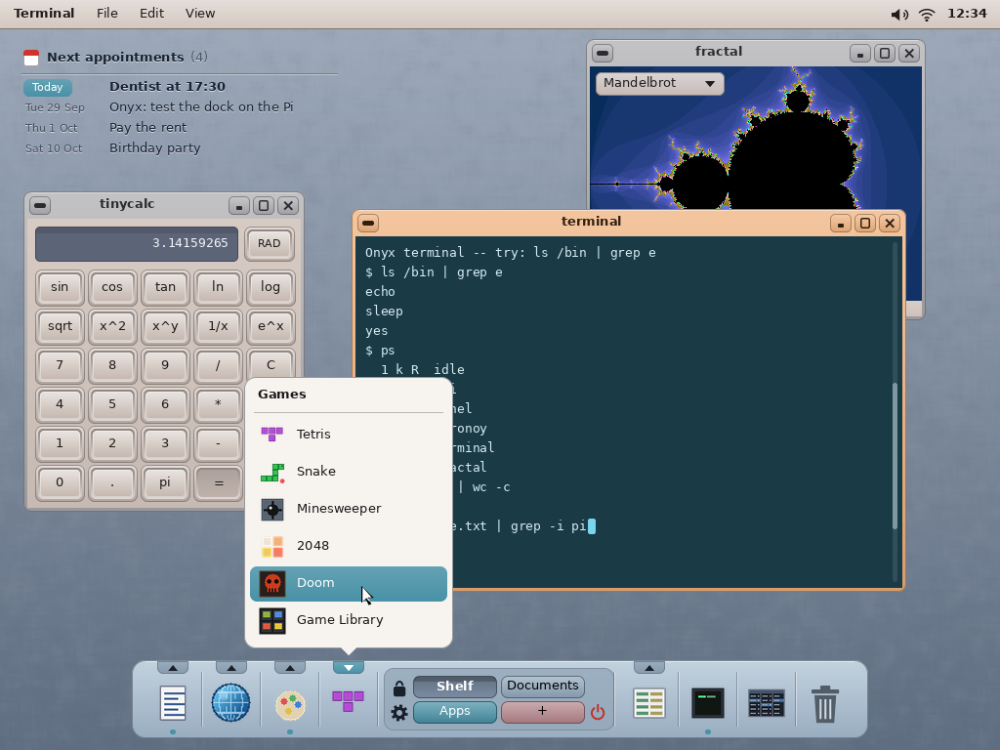
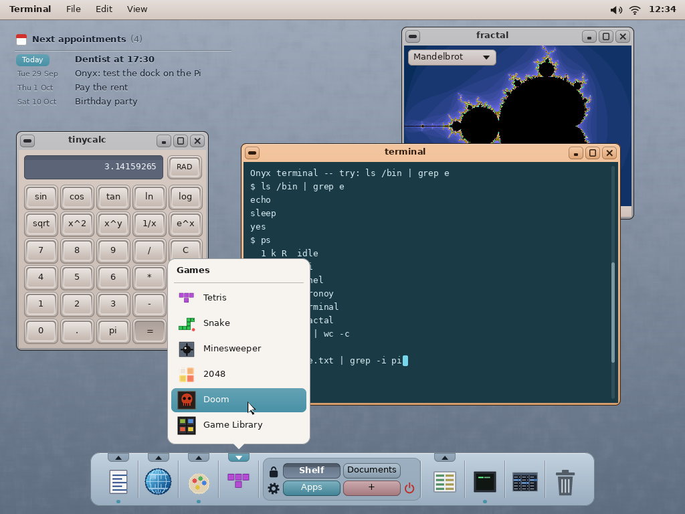
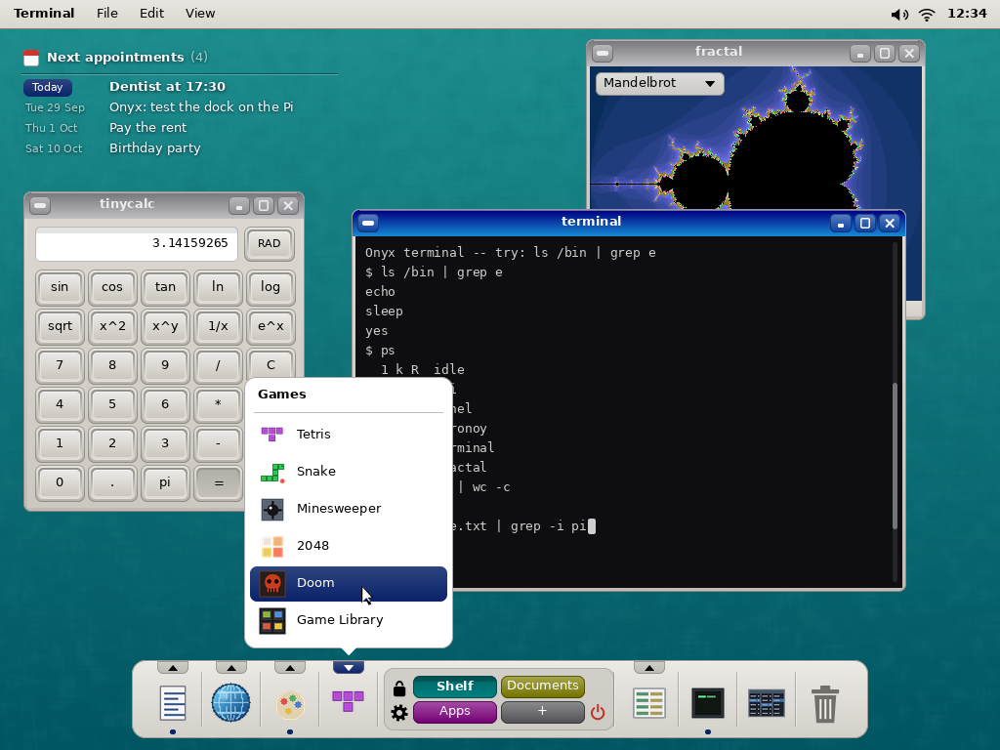
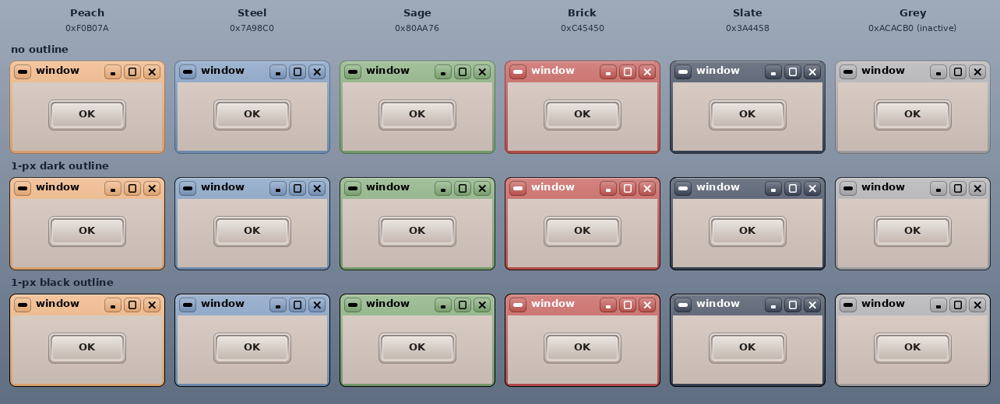
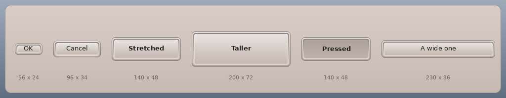

# The desktop redesign — a modernised CDE

> **Status: designed with the user (2026-09-28), implemented on `Elegant-UI` the same day**
> (§5: what landed where; the user guide `docs/04` §5, §6, §11 describes it; the screenshots
> in `screenshots/` are the real apps). The branch `Elegant-UI` restarted from `main` for it.
> It replaces an earlier direction — a phone-like "elegant layout" (a top bar, a navigation bar,
> a home screen, one app at a time) that was built on that branch, then dropped by the user in
> favour of this one, which keeps and reuses today's windowed desktop. That work stays on the
> branch **`archive/elegant-ui-2026-09-28`**, to take pieces back from when they are needed:
> the per-pixel transparency (`WIN_FLAG_ALPHA`, `kernel/gui/window.cpp`'s `BlendAlphaRect` —
> taken back), the drawing kit `user/elegant.h` (anti-aliased `.aaf` fonts, rounded boxes,
> glows), `tools/fonts/gen_aafont.py` and `sdcard/fonts/`, the PC simulator
> `tools/tests/elegant_sim/`; its analysis is that branch's `docs/gui-redesign/README.md`.

The mock-ups are made by `python3 tools/screenshot/mockup_cde_modern.py` (the chosen look) and
`python3 tools/screenshot/mockup_retro.py` (the retro skins it came from), both reusing
`render.py`'s desktop (the old windows); the real desktop is in `screenshots/desktop.png`
(`sh tools/tests/desktop_sim/shots.sh`).

## 1. How the choice was made

The user asked for an opinion: a retro interface (Windows 3.1, CDE, the Amiga) or a mobile one?
The advice: the windowed desktop as Onyx's interface, with a retro identity of its own — it is
what Onyx already is (a global menu bar, overlapping windows, drag and drop, the terminal,
QBasic, the file viewer), several windows side by side are worth more than one app at a time at
a desk, and a coherent look is what makes a hobby OS memorable.

The same desktop in three retro skins, and their push buttons:

| | |
|---|---|
|  | **Workbench 2.x / 3.x**: Workbench 2.0's palette (grey #AAA, black, white, blue #68B), Topaz-like text (circle's 8 × 8 font, its rows doubled), the close gadget on the left, zoom and depth on the right |
|  | **CDE (Motif)**: the eight colours of CDE's `Default.dp`, Motif's 2-px bevels, the window menu / minimise / maximise buttons, the Front Panel in the Shelf's place — its switcher holds the Shelf's tabs, each its own colour |
|  | **Windows 3.1**: "Windows Default" (grey #C0C0C0, navy titles), the black-outlined 3D buttons, the control-menu box, the minimise / maximise arrows |
|  | **The push buttons**: the user's framed button (below) as drawn, then each skin's own button and the framed one in its colours — normal, pressed, default, disabled |

The user found the CDE one the best (its Front Panel is the ancestor of Xfce's dock), liked the
Windows one too, and asked how a modernised CDE would look: that is the chosen direction.

## 2. The chosen look

| | |
|---|---|
|  | **The desktop** (the user's favourite): CDE's palette (`Default.dp`, softened); the dock at the bottom, the Games drawer open; the agenda widget top left, part of the wallpaper |
|  | The same with a **1-px dark outline** round the windows (the theme's `outline`: none, dark — the default — or black) |
|  | A variant **with a Windows touch**: grey faces, navy-to-blue title bars, a teal desktop, white fields, a black console |
|  | **One colour per frame**: the same window from the six colour themes — without an outline, with a dark one, with a black one |
|  | **Stretched buttons**: the framed button from 56 × 24 to 200 × 72, one pressed — the gradients computed at its size |

The user's decisions:

1. **The dock** (CDE's Front Panel, modernised) replaces both the Shelf and the panel at the
   right. Its launchers are the apps' categories (Productivity, Internet, Graphics, Games,
   System — `app.txt`); each opens a **drawer** listing its apps, the drawers' **tabs inside
   the dock, hanging from its top edge** (not above it, as in CDE). A **dot** under a launcher
   when one of its apps runs, and in the drawer beside the app. In the middle, the
   **switcher**: the Shelf's tabs (Shelf, Documents, Apps, +), each its own colour; beside it
   the **lock**, under it a **gear** (the settings: the config app), the **power** button; then
   the Terminal, the File Viewer, the Trash. **No clock and no date** in the dock: the menu bar
   has the time, and a click on it will show a calendar or start the Calendar app.
2. **The agenda widget** (the next appointments) stays on the desktop, **top left as today**,
   and becomes part of the wallpaper: no card and no shadow, its text and an etched line
   straight on the desktop — a see-through window — its ink chosen from the wallpaper's
   brightness under it (`wallpaper_buffer`, v13): engraved (dark, a light line below) on a light
   wallpaper, white with a soft shadow on a dark one.
3. **The windows**: CDE's buttons (the window menu, minimise, maximise) and a close button;
   rounded corners; a light gradient; **no drop shadows** (they would cost the compositor: see
   §4) — a crisp outline instead: a 1-px outline round them, the theme's choice (none, dark —
   the default — or black).
4. **The user's framed button**, for every push button (the windows' and the apps'): the user
   drew it (216 × 92, three greys #E1E1E1, #B9B9B9, #7F7F7F) — a raised 2-px frame, 2 px of
   face, a sunken 2-px well, the button in it raised by 1 px (or 2, "more marked"), flush with
   the well when pressed; in the modern look, rounded (a keycap in its bezel). `framed ()` in
   `mockup_retro.py` draws it by code: the same pixels as the drawings.
5. **The colours**: a theme gives **one colour per kind of frame** (active, inactive), as
   `theme.txt` does today; every shade comes from it (§3). The six colours of
   `cde-modern-colours.png` are **kept as the colour themes**: Peach `0xF0B07A` (CDE's), Steel
   `0x7A98C0`, Sage `0x80AA76`, Brick `0xC45450`, Slate `0x3A4458`; the inactive frames Grey
   `0xACACB0`.

## 3. How it is drawn: by code, no bitmap

The user's wish: no skin bitmap (today's `SD:/skins/*.bmp`, 9-slice, tinted by `theme.txt`) —
everything drawn by code, precomputed so that drawing is only straight lines:

- **A shade from a colour**: a grey profile, level 128 = the colour itself, above toward white,
  below toward black — so it lightens as well as darkens, any hue. The frame's top 164, its
  bottom 115, its edge 70; the title buttons 172 / 118 / 64; the title's text black or white by
  the colour's brightness. (`tone ()` and `FRAME` in `mockup_cde_modern.py`.)
- **The frames** (the title bar, the borders, the corners, the outline) are drawn once into the
  two chrome copies the compositor blits (active, inactive — kapi v28 `get_chrome`, drawn by
  wtk today in `user/wtk/skin.cpp`): a table of one colour per row, made once per height and
  state; redrawn only at a resize or a theme change, never per frame.
- **The buttons** (the windows' and the apps') compute their gradient **at each redraw, from
  their height**: the grey profile spread over the button's rows (a colour a row: a few
  multiplications), the edges and the corners' radius fixed — they stretch at will, which a
  9-slice bitmap cannot do with a gradient.
- **The rounded corners without a formula** (they are only a few pixels high): per radius, a
  table made once of, for each of the corner's rows, the x offset of its first pixel and the
  opacity of each partly covered pixel from there (the anti-aliasing); a row is then that
  straight span plus its few edge pixels, mirrored for the other side and the bottom. Radius 8:
  23 bytes — (4: 47 151 218 250) (2: 9 153 254) (1: 9 192) (1: 153) (0: 47 254) (0: 151)
  (0: 218) (0: 250) — within 13 / 255 of a supersampled drawing.
- **The glyphs** (minimise, maximise, close, the chevrons, the lock, the gear, the power): small
  coverage masks computed at start from their geometry.
- Only the fonts and the apps' own icons stay data.

## 4. What it costs, against today's desktop: about the same

The frames, gradients and buttons are drawn by the apps into their own canvases when they redraw
(as the skins are today); one dock replaces the Shelf and the panel; no shadows (a blurred shadow
is a see-through band round every window, which the CPU compositor would blend again at every
change under it and at every move). If the text becomes anti-aliased, it costs the apps a
little more than the 8 × 16 bitmap font, only when the text changes.

**The one thing to get right: the rounded corners.** Today's frames are opaque rectangles, so
the compositor draws nothing under a window, and a window refreshing alone — an emulator —
costs only its own pixels (`CoversOpaque`). The rounded corners must keep that: a window is
opaque but for its four corner squares (a small change to `CoversOpaque`); otherwise every
redraw would repaint what lies under the window. Square corners cost nothing. The see-through
agenda widget and the dock's corners are blended only where the screen is recomposed under
them. (And the emulators' own paths — the V3D, `gpudirect`, `dispdma`, `fullscreen_direct`, the
app cores — are not touched.)

## 5. Where the work landed

1. **wtk's painter** (`user/wtk/paint.h`, `paint.cpp`): `wk_tone` (a shade of the theme's colour,
   128 = itself), gradients computed at each size (`wk_rbox`, `wk_rline`: rows of spans, the
   corners from a table of x offsets), the framed button (`wk_framed`), bevels, sunken fields,
   etched lines, the check / radio / switch / slider / scroll-bar / progress marks, pop-ups,
   selection rows, the glyphs; an alpha mode for see-through windows (`wk_paint_alpha`). The
   theme's colours are variables read from `SD:/etc/theme.txt` (`user/wtk/theme.h`: `theme` or
   `active`, `inactive`, `face`, `accent`, `outline`, `dock`). Every wtk widget draws with it.
2. **The window frames**: drawn by wtk into the two chrome copies (`user/wtk/skin.cpp`
   `draw_frame`), to the new metrics (title 28, border 4, corner radius 8: `KAPI_FRAME_*`,
   `kapi_abi.h`); the title buttons — the window menu (Restore / Maximise, Minimise, Close),
   minimise, maximise (greyed for a fixed-size window), close — reported to the app as
   `GUI_EVENT_WINCTL`; a double-click on the title maximises. Kernel side (`kernel/gui/
   window.cpp`): minimise (`KAPI_WIN_MINIMISED`, raised again by `raise_app` — the dock, the
   Onyx menu's Open Windows), the work area (under the menu bar, above the dock), kapi v64
   `win_minimise`, `win_geometry`, `resize_window2` (a window grows in place).
3. **The compositor**: `CoversOpaque` less the corners' see-through pixels (`CornerSpan`); the
   corners blended; an app's present damages its client area only unless its frame changed —
   the emulators' fast path is intact (checked by `tools/tests/desktop_sim/wmtest.cpp`).
4. **The dock** (`user/Apps/dock`), replacing the Shelf and the panel in `autostart`: the
   categories and their drawers, the switcher (the Shelf's tabs and items, `shelf.ini`, its
   IPC service), the running dots, the lock (`user/Apps/lock`), the gear, the power button, the
   Terminal, the File Viewer, the Trash.
5. **The agenda widget** see-through (`WIN_FLAG_ALPHA`, brought back from the archive branch),
   its ink from `wallpaper_buffer`.
6. **The menu bar** restyled (light, the theme's face); its time opens a calendar of the month
   with *Open Calendar*.
7. **The apps**: their hard-coded dark colours replaced by the theme's (the content — a
   terminal's screen, a game's board, a document — keeps its own); the **Theme** app rewritten
   (the five themes, a colour per part, the outline, a live preview).
8. **The fonts**: the bitmap fonts kept for now (`SD:/fonts/*.fnt`).

## 6. The open questions, as answered

- The windows' outline: the theme's choice — none, dark (the default) or black.
- Minimise: the window leaves the screen; the dock brings it back (its launcher, or its app in
  a drawer: `raise_app`), as does the Onyx menu's *Open Windows*.
- The switcher's tabs (Shelf, Documents, Apps, +): each opens a drawer with the tab's items (the
  Shelf's content); right-click a tab to rename or remove it.
- Anti-aliased text: not yet — the bitmap fonts first (the next step: the `.aaf` fonts and their
  renderer from the archive branch, `user/elegant.h`).
