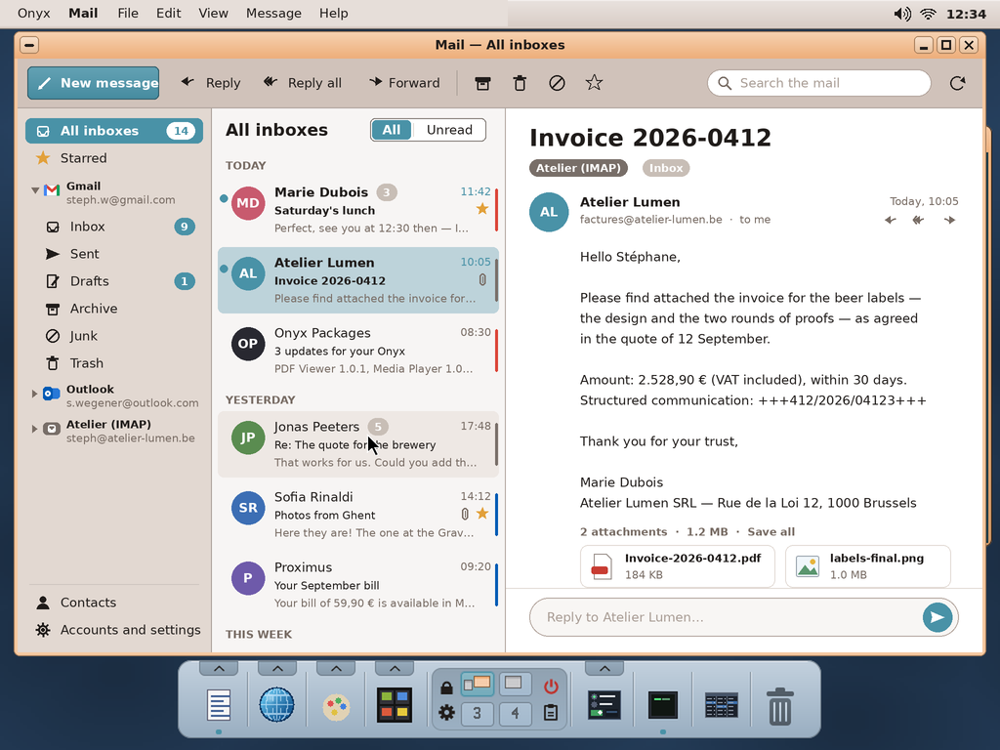
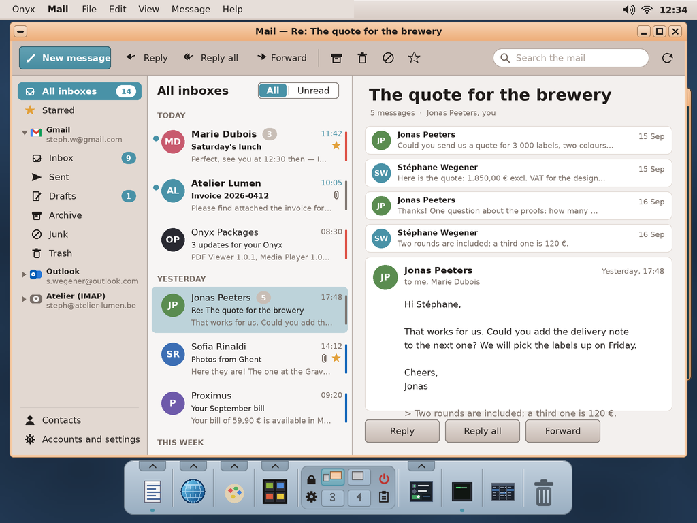
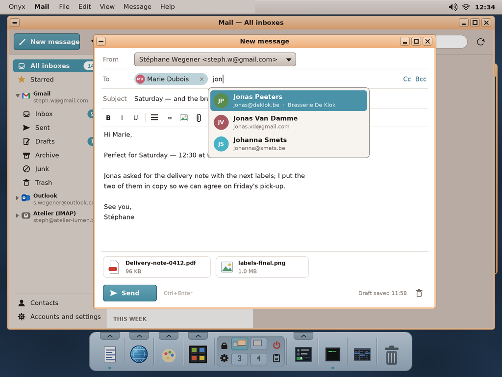
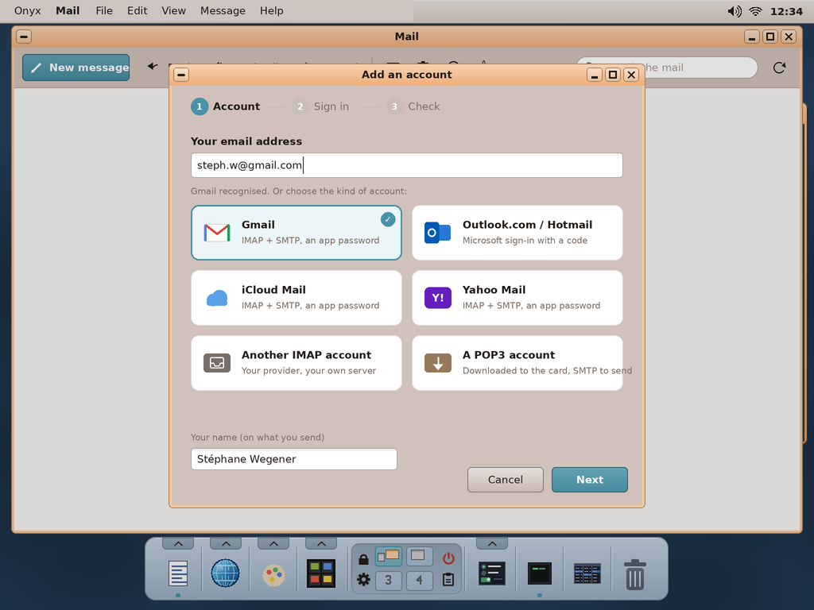
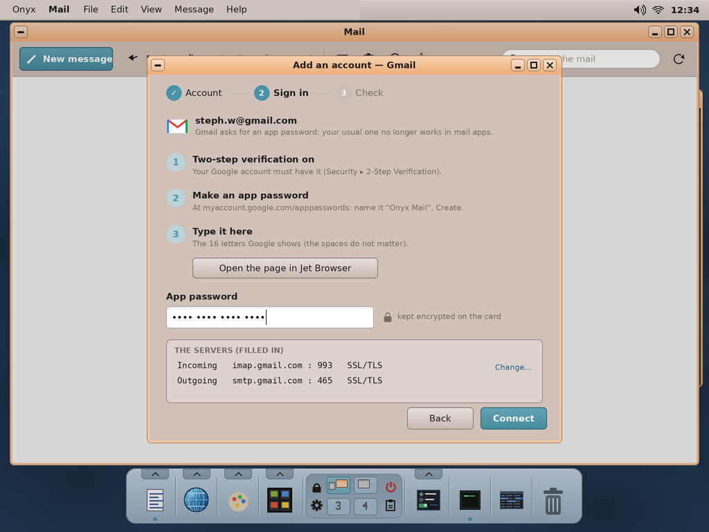
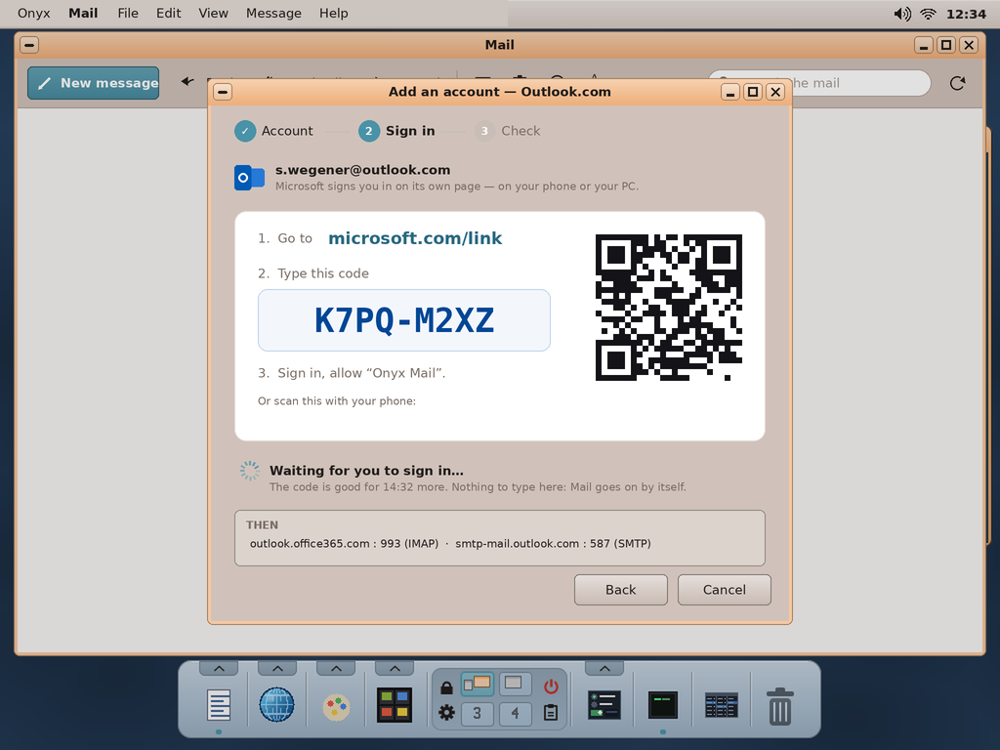
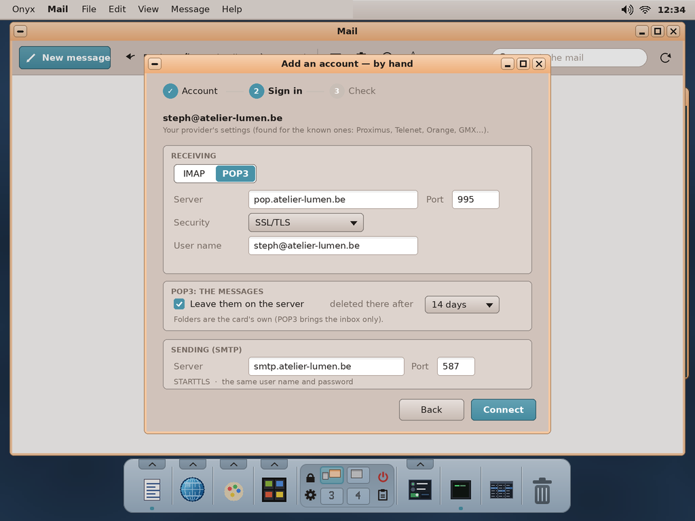
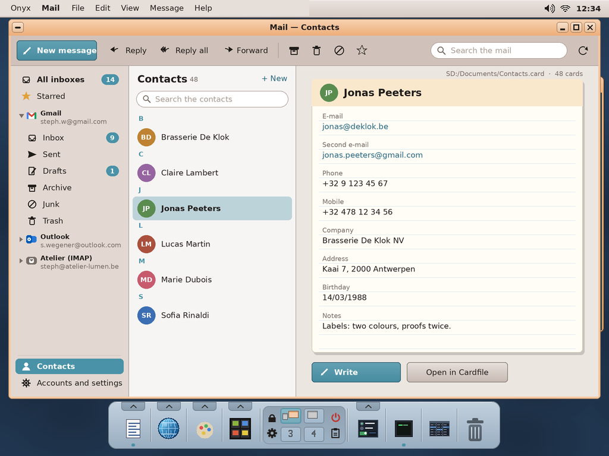

# Mail for Onyx — study, first mock-ups

> **Status (2026-10-02): done** -- the app `user/Apps/mail` (docs/04 §12 *Mail*, docs/03 *Mail*), the protocols and the HTML renderer in `user/mail/`; tested on the PC (`sh tools/tests/run_mail_test.sh`, `shots.sh mail`) and **on the Pi with Gmail: works well** (2026-10-02; Outlook still to try there). Priority 1 of the end-user apps roadmap (docs/HANDOFF.md): a mail
> client "as user-friendly as possible". The user (2026-10-02): it must connect to **Gmail, Outlook, IMAP and
> POP3 / SMTP**; Gmail with an **app password**, Outlook with Microsoft's sign-in **by a code** (an "Onyx Mail"
> application registered by the user at Microsoft: below). **Contacts** = a Cardfile form (`.card`), opened in
> Cardfile too. Proposed name: **Mail** (app folder `mail`).

The mock-ups are made by `python3 tools/screenshot/mockup_mail.py` → `docs/mail/mockups/*.png` (1024 × 768, the real
desktop behind; the drawing helpers are `mockup_archiver.py`'s; the people and their messages are made up; the
providers' marks are drawn in their colours, not their logos).

| | |
|---|---|
|  | **The inbox.** At the left the **unified inbox** (all the accounts), Starred, then **each account** with its folders (Inbox, Sent, Drafts, Archive, Junk, Trash and its own), the unread counted; at the bottom **Contacts** and the settings. In the middle the **conversations**, by day (Today, Yesterday, This week): who, the subject, the start of the text, the time, how many messages, a paper clip, a star; a coloured stripe tells the account; All / Unread. At the right the **message**: who, to whom, when, Reply / Reply all / Forward, the text, the **attachments** (open in the right app — a PDF in the PDF Viewer, a picture in the Image Viewer — or save), a **quick reply** at the bottom. The toolbar: **New message**, Reply, Reply all, Forward, Archive, Delete, Junk, Star, the **search** (all the accounts: who, subject, text), check now. |
|  | **A conversation**: its messages folded (who, the first line, the date), the last one open; its quoted part dimmed. |
|  | **Writing**: From (the account), To / Cc / Bcc with the people as chips, **completed from the contacts** as one types (and from the addresses already written to); the subject; bold, italic, underline, a list, a link, a picture, an attachment (or files dropped from the File Viewer); the draft kept every few seconds (IMAP: in the account's Drafts); **Send** (Ctrl+Enter). A message is sent as text **and** HTML (simple). |
|  | **Adding an account**: the address typed, the provider **recognised** (Gmail, Outlook.com / Hotmail / Live, iCloud, Yahoo, GMX, Proximus, Telenet, Orange, Free…: the servers filled in), or the kind chosen: Gmail, Outlook, iCloud, Yahoo, another IMAP account, a POP3 account. |
|  | **Gmail**: the **app password** (Google refuses the usual password in mail apps since 2025): two-step verification on, the password made at `myaccount.google.com/apppasswords` (opened in Web, the WebKit browser; in Jet Browser when Web is not on the card), its 16 letters typed. The servers filled in (`imap.gmail.com:993`, `smtp.gmail.com:465`). |
|  | **Outlook.com / Hotmail**: Microsoft refuses passwords (since September 2024) — **OAuth 2**, by the **device code**: Mail shows a code; on a phone or a PC, `microsoft.com/link` (or the QR code), the code typed, the Microsoft account's sign-in, "Onyx Mail" allowed; Mail waits and goes on by itself. Then IMAP `outlook.office365.com:993` and SMTP `smtp-mail.outlook.com:587` with **XOAUTH2**; the token renewed by itself (the refresh token). |
|  | **By hand**: IMAP or **POP3** (server, port, security SSL/TLS or STARTTLS, user name), POP3's options (leave the messages on the server, delete them there after n days; the folders are then the card's own), SMTP (server, port, security; the same name and password or others). The **Check** step tries both and says what is wrong in words (server not found, certificate, password refused…). |
|  | **Contacts**: a **Cardfile form** — `SD:/Documents/Contacts.card` (name, e-mails, phones, company, address, birthday, notes) —, listed A to Z with their initials, the card shown as Cardfile shows it; **Write**, **Open in Cardfile**; "Add the sender to the contacts" from a message. Cardfile opens the same file. |

## How it would be built

| Need | Onyx today | To add |
|---|---|---|
| TLS | mbedTLS 3.6.3 (`third_party`, Courier's `tls/onyx_tls.hpp`, Jet, `pkg`) over the kapi sockets; `SD:/res/ca-bundle` | — |
| IMAP4rev1 / IMAP4rev2 | — | our own client (`user/mail/imap.h`, MIT): LOGIN, **AUTHENTICATE XOAUTH2**, LIST, SELECT / EXAMINE, UID FETCH (ENVELOPE, FLAGS, BODYSTRUCTURE, BODY.PEEK[parts]), UID SEARCH, UID STORE (\Seen \Flagged \Deleted), UID MOVE / COPY + EXPUNGE, APPEND (Sent, Drafts), IDLE (new mail at once), CONDSTORE when there; Gmail's labels as folders. |
| POP3 | — | `pop3.h`: USER / PASS (or XOAUTH2), STAT, UIDL, RETR, DELE; the messages kept on the card (their UIDL remembered). |
| SMTP | — | `smtp.h`: EHLO, STARTTLS or SSL, AUTH PLAIN / LOGIN / **XOAUTH2**, MAIL / RCPT / DATA; the message also put in Sent (IMAP: APPEND). |
| MIME | — | `mime.h`: reading (multipart, quoted-printable, base64, RFC 2047 headers, charsets — UTF-8, Latin-1, Windows-1252), writing (multipart/alternative text + HTML, attachments base64, UTF-8 headers). |
| HTML mail | NetSurf (Jet Browser) | **our own** small renderer (`user/mail/html.h`, MIT; the user, 2026-10-02: "simple, not Jet, HTML 4 at least with CSS 2"): HTML 4's elements, tables, CSS 2 (`<style>`, `style=`, the selectors, the box model, floats as blocks), the card's fonts; shown **safely**: no remote pictures unless asked ("Show the pictures"), no scripts, no forms; `cid:` pictures from the message. |
| OAuth 2 (Outlook) | Courier's HTTPS (`http.hpp`) | the device code flow (`login.microsoftonline.com/consumers/oauth2/v2.0/devicecode`, then `/token` polled), the scopes `https://outlook.office.com/IMAP.AccessAsUser.All https://outlook.office.com/SMTP.Send offline_access`; the refresh token kept encrypted. Needs the **client id** of an application registered at Microsoft (below). |
| The cache | — | `SD:/mail/<account>/`: the folders' lists, the messages' headers (an index), the bodies fetched once, the attachments on demand; a worker thread syncs while the window stays live (kapi threads, as Media Player). |
| Secrets | — | the passwords and tokens **encrypted** on the card (a key of the card; the future key vault, HANDOFF's priority 5, takes them over). |
| Notifications | notifyd | "3 new messages" (who, the subject); the dock's badge. |
| Contacts | Cardfile's `model.h` (Writer's mail merge reads it) | the form made at first use, read / written; completion. |
| File associations | `fileassoc.ini` | `.eml` = mail (a message file opened); `mailto:` from Jet. |

## Outlook: registering "Onyx Mail" at Microsoft (once, by the user)

Microsoft's sign-in needs an **application id** (public, not a secret: it tells Microsoft which app asks). Free, with
a Microsoft account:

1. **portal.azure.com** (or **entra.microsoft.com**) → *Microsoft Entra ID* → **App registrations** → **New
   registration**. (A personal account may be asked to create its free "directory" first.)
2. Name **Onyx Mail**; *Supported account types*: **Accounts in any organizational directory and personal Microsoft
   accounts**; *Redirect URI*: none. **Register**.
3. **Authentication** → *Advanced settings* → **Allow public client flows: Yes** → Save (the device code needs it).
4. **API permissions** → *Add a permission* → *Microsoft Graph* → *Delegated*: `offline_access`,
   `IMAP.AccessAsUser.All`, `POP.AccessAsUser.All`, `SMTP.Send` (and `email`, `openid`) → Add.
5. Copy the **Application (client) ID** (a GUID) from *Overview*: it goes into Mail (`SD:/etc/mail/oauth.ini`, or
   built in). **Done (2026-10-02)**: the user registered "Onyx Mail"; its id `85ccaf6e-81ff-4a62-9194-930fc36429ad` is
   built in (`oauth_defaults`, `user/mail/oauth.h`) -- a public client's id, not a secret.

## Decided (the user, 2026-10-02)

1. The name **Mail** (folder `mail`); the **three columns** of the mock-ups; **conversations** grouped by default.
2. HTML messages: **our own HTML 4 + CSS 2 renderer**, not Jet.
3. Contacts: `SD:/Documents/Contacts.card`, the fields of the mock-up.
4. Gmail by an **app password**; Outlook by the **device code** (the "Onyx Mail" id in `SD:/etc/mail/oauth.ini`).

## The code

| File | What |
|---|---|
| `user/mail/util.h` | the buffer, base64, quoted-printable, charsets → UTF-8, RFC 2047 words, RFC 5322 dates, addresses |
| `user/mail/conn.h` | a connection: TCP, TLS (at once or STARTTLS; the certificate checked), lines, literals, time-out, cancel |
| `user/mail/imap.h` | IMAP4rev1: login (LOGIN, PLAIN, XOAUTH2), LIST + special use, SELECT, UID FETCH (envelope, structure, sections), STORE, MOVE / COPY, EXPUNGE, APPEND, IDLE |
| `user/mail/pop3.h` | POP3: CAPA, STLS, USER / PASS, AUTH PLAIN / XOAUTH2, STAT, LIST, UIDL, TOP, RETR, DELE, QUIT |
| `user/mail/smtp.h` | SMTP: EHLO, STARTTLS, AUTH PLAIN / LOGIN / XOAUTH2, MAIL / RCPT / DATA |
| `user/mail/mime.h` | a message read (the parts' tree, RFC 2231 names, the text to show, the attachments, `cid:`) and written (text + HTML, inline pictures, attachments) |
| `user/mail/oauth.h` | Microsoft's device code flow, the refresh; HTTPS POST over `conn.h` |
| `user/mail/html_dom.h` | HTML read into a tree: tags, attributes, character references, HTML 4's forgiving rules (`
`, `<li>`, cells without rows...), `<style>` kept |
| `user/mail/html_css.h` | CSS 2: the sheets (`@media` by the view's width), the selectors, the cascade (a UA sheet, the presentational attributes, `!important`), the computed styles |
| `user/mail/html_layout.h` | the layout: blocks, margins, inline lines, `white-space`, inline boxes (buttons), inline-blocks, floats, lists, tables (automatic widths, colspan / rowspan, `align=center`), pictures (blocked ones as boxes) -> a display list |
| `user/mail/html.h`, `html_ft.h` | the renderer's face: parse, layout, paint, the link under a point, the text; drawn with the card's fonts (Liberation, Gelasio, Selawik, DejaVu Mono) |
| `tools/tests/mail/fakemail.py` | a fake IMAP / POP3 / SMTP / OAuth server (the tests, the screenshots) |
| `tools/tests/mail/mailtest.cpp` | 98 checks against it (`sh tools/tests/run_mail_test.sh`) |
| `tools/tests/mail/htmltest.cpp` | the renderer on a newsletter, styles, plain text, broken HTML: 22 checks, PNGs to look at |
| `user/Apps/mail/*` | the app: accounts (encrypted secrets), the cache, the worker thread, contacts (Cardfile's model), the model, the window |
| `user/Apps/mail/webview.h` | (2026-10-03) the HTML messages drawn by **WebKit**: Web's web view (`user/Apps/web/webview.cpp`, the browser's program run as an applet in the reading pane: `webview_proto.h`, docs/03 *Web's web view*) when `SD:/apps/web.app/main` is on the card; the HTML given to it after a **Content-Security-Policy** meta (`default-src 'none'; img-src data: cid:; style-src 'unsafe-inline'; font-src data:` — with *Show the pictures*: `https:` / `http:` pictures, styles and fonts too), the `cid:` pictures put in as `data:` URLs, written to `RAM:/mailview-<pid>.html`; a link clicked comes back to Mail (asked, then opened in Web; `mailto:` writes). The renderer above stays: when Web is absent, Mail cannot be an IPC service (the desktop simulator: the screenshots), or the view does not start / its engine ends. |
| `tools/tests/mail/modeltest.cpp` | the model and the worker against `fakemail.py`: 42 checks |
| `tools/tests/mail/demo_mail.py`, `mkaccounts.cpp` | the screenshots' made-up mailboxes and accounts (`shots.sh mail`) |

The screenshots of the app: `screenshots/mail*.png`.
