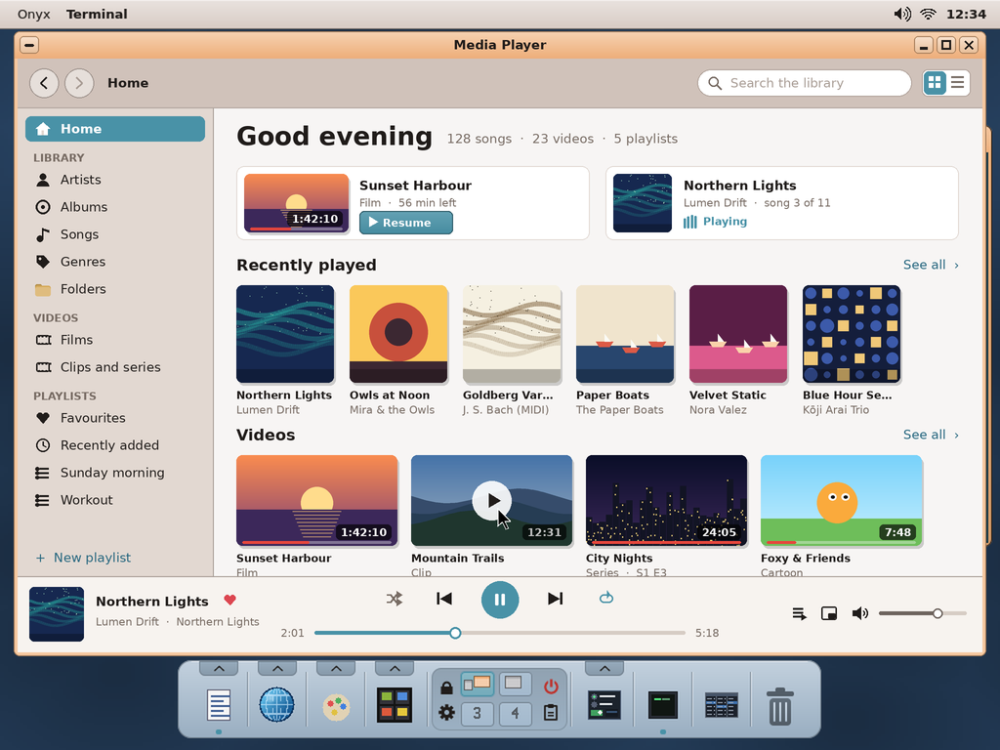
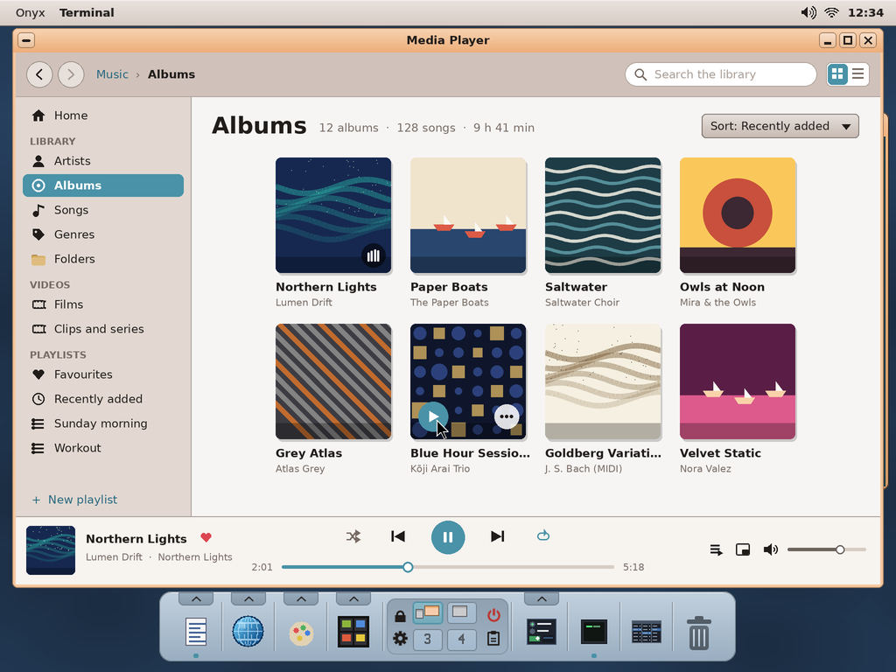
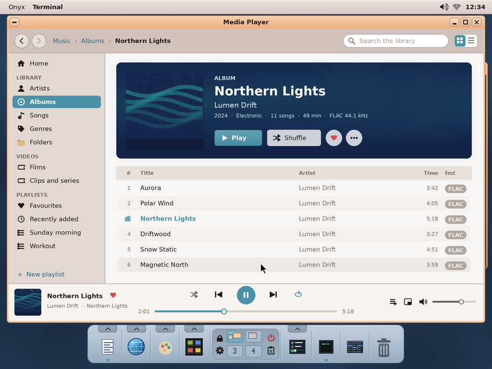
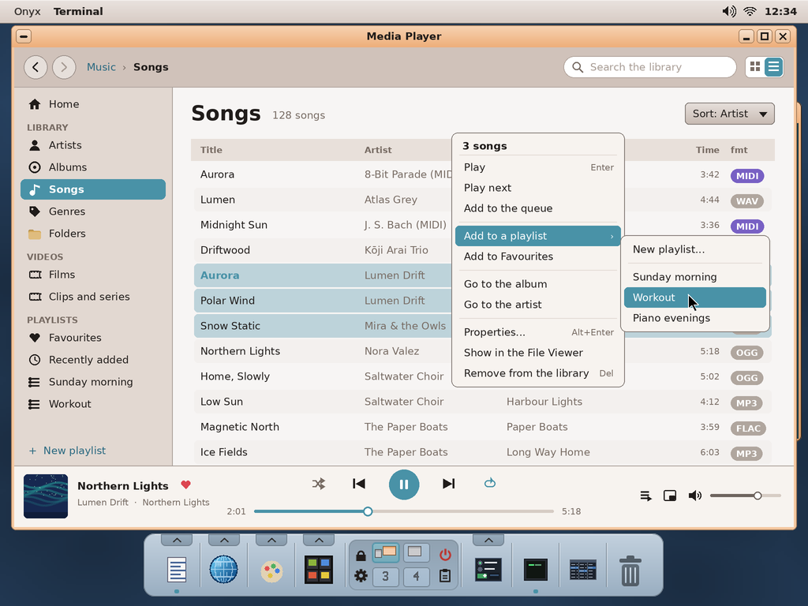
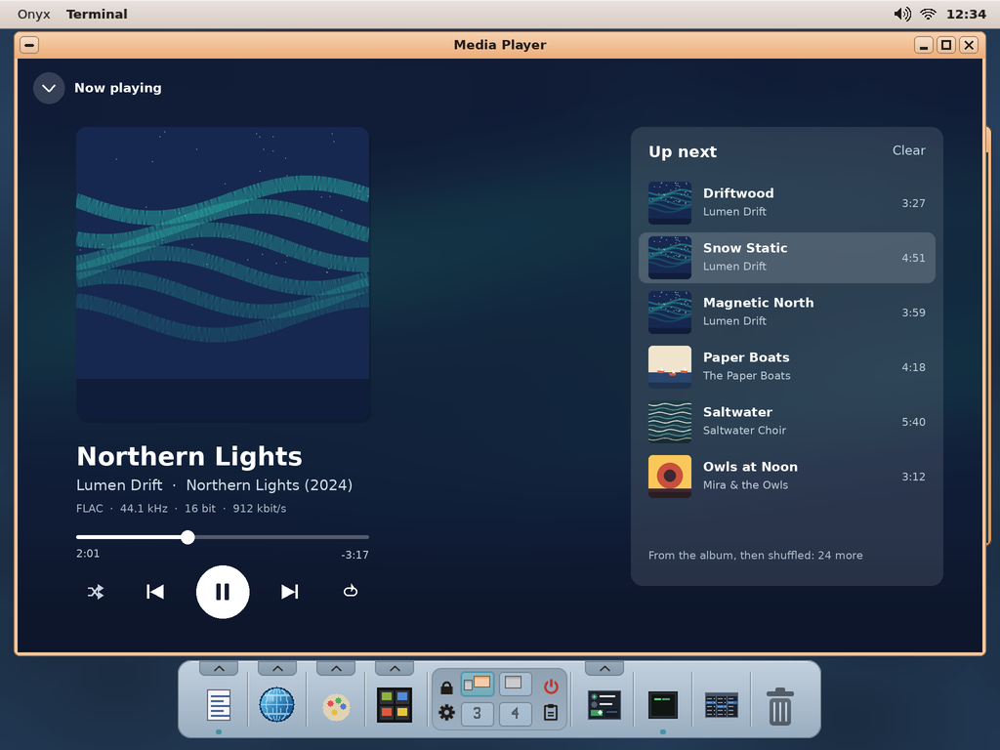
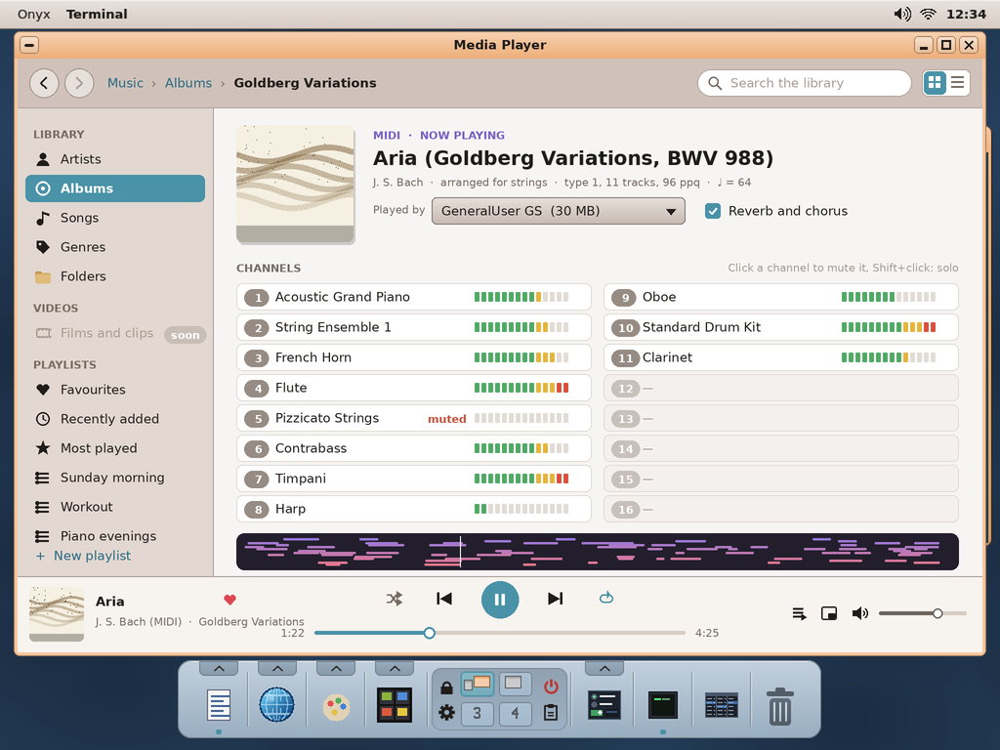
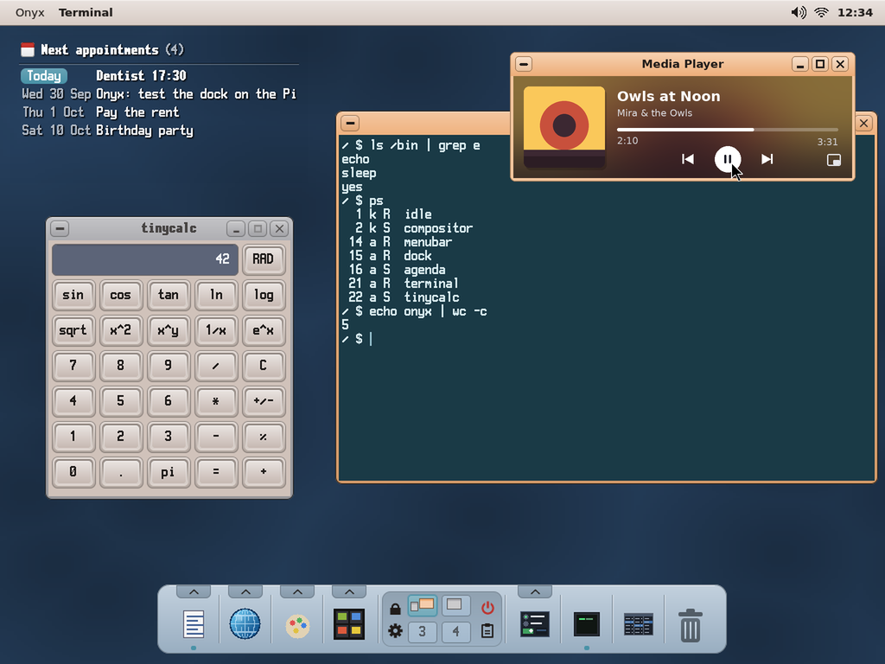
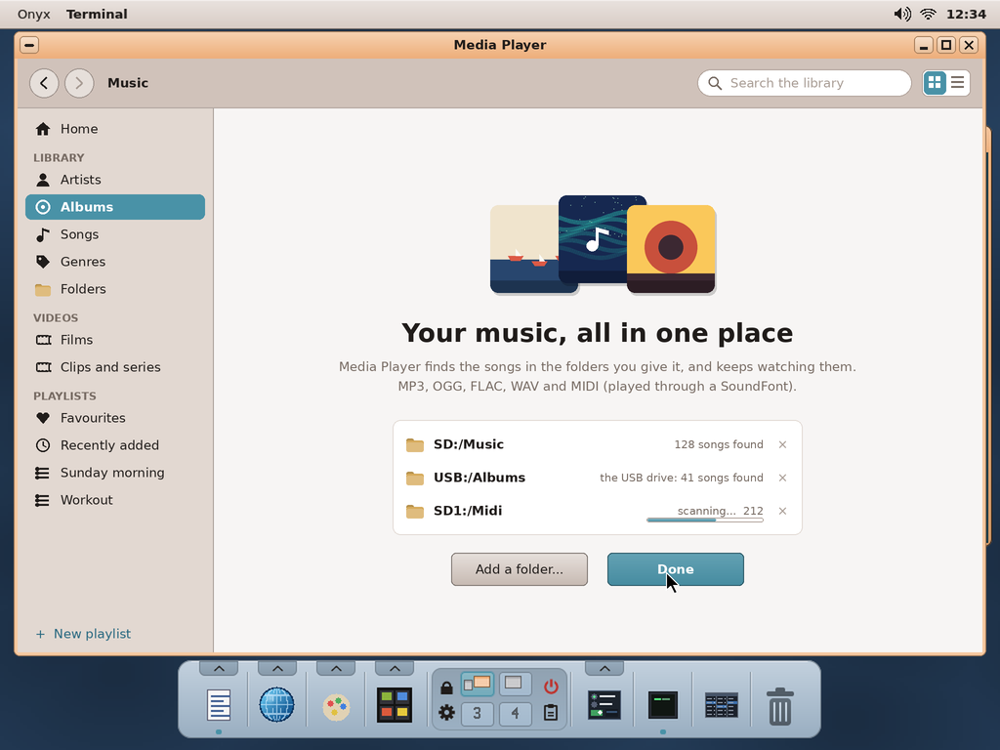

# Media Player for Onyx — the music library (study, first mock-ups)

> **Status (2026-10-01): the music is implemented** (`user/Apps/media`, docs/03 *Media Player*; its use: docs/04
> §12; the real app: `screenshots/media-*.png`), **not yet tried on the Pi**; the videos: to do (below). The
> mock-ups (validated): Priority 1 of the end-user apps roadmap
> (docs/HANDOFF.md): a **music library** as a polished app, in the way of Windows Media Player / iTunes /
> Rhythmbox (the user: "a library, as in Media Player"); **MP3, OGG, FLAC, WAV and MIDI**; artists,
> albums, songs, genres, folders, playlists; tags and cover art; a now-playing view; file associations.
> The **videos** are part of the same app (its home shows both; they are built after the music).
> Name: **Media Player** (app folder `media`).

The mock-ups are made by `python3 tools/screenshot/mockup_music.py` → `docs/media/mockups/*.png`
(1024 × 768, the real desktop behind; the drawing helpers are `mockup_archiver.py`'s; the albums, their
artists and their covers are made up).

| | |
|---|---|
|  | **The home**, where the app opens: what to go on with (the film left half way — *Resume* —, the album playing), the music **played lately**, the **videos** (their frame, their length, how much was watched; under the pointer: play). *See all* goes to the library's page. |
|  | **The albums.** At the left **Home**, the **library** (Artists, Albums, Songs, Genres, Folders), the **videos** (Films, Clips and series) and the **playlists** (Favourites, Recently added, Most played — made by the app — and the user's; *+ New playlist*). At the top: back / forward, where we are, the **search** (titles, artists, albums at once), grid or list. The covers in a grid; under the pointer: **play** and **⋯** (the album's menu); the one playing shows bars. At the bottom, always: **the now-playing bar** — the cover, the song, ♥, shuffle, previous, play / pause, next, repeat (all / one), the position, the queue, the mini player, the volume. |
|  | **An album.** A band in the cover's colours: the cover, its facts (year, genre, songs, length, format), **Play**, **Shuffle**, ♥, ⋯; its songs, the one playing in the accent. A double click plays a song (and the album after it). |
|  | **The songs, as a list** (columns: title, artist, album, time, the format — MIDI in its own colour —, sortable). Several selected (Ctrl / Shift), **their menu**: Play, Play next, Add to the queue, **Add to a playlist ›**, Favourites, go to the album / artist, Properties (the tags, editable), show in the File Viewer, remove from the library (the file is kept). Songs can also be dragged onto a playlist. |
|  | **Now playing**, the full view (a click on the bar's cover): the cover large over its own colours, the song, its format, the position, the transport; **Up next** (the queue: reordered by dragging, Clear). |
|  | **A MIDI file playing**: played by **MeltySynth** through a **SoundFont** (`SD:/koton/soundfonts`, Koton's synth, shared); **its notes as coloured lines** (a colour an instrument, the keyboard at the left, the bars numbered), scrolling under the playhead, the notes sounding outlined; the instruments' colours under it. |
|  | **The mini player** (an option): the window reduced to a card at the **bottom right of the screen**, above the others — the cover, the song, previous / play / next, the position; its buttons: the window back, close (the music stops). |
|  | **The first start**: the library is empty — the folders to watch (`SD:/Music` proposed, a USB drive, another partition), their songs counted while they are scanned; *Add a folder...*, *Done*. Folders can be added / removed later (Settings). |

## How it would be built — what Onyx has, what it lacks

| Need | Onyx today | To add |
|---|---|---|
| Sound out | `kapi_sound_acquire` / `kapi_sound_write` (s16 stereo PCM stream), v68's low-latency ring (`kapi_sound_map`) — Koton uses them | — |
| MIDI | MeltySynth (`user/Apps/koton/synth`), `SD:/koton/soundfonts/GeneralUser-GS.sf2`; Koton reads `.mid` | a MIDI file player on MeltySynth's sequencer, the synth as a shared library (not copied) |
| MP3 / OGG / FLAC / WAV | none (fmtracker / Koton: their own formats) | `minimp3`, `stb_vorbis`, `dr_flac`, `dr_wav` (single headers, public domain / CC0: `third_party/`, docs/LICENSING.md); resampled to the output rate |
| Tags and covers | — | ID3v2 (MP3), Vorbis comments (OGG / FLAC: `METADATA_BLOCK_PICTURE`), RIFF INFO (WAV); a cover from the tags, else `cover.jpg` / `folder.jpg` in the folder (`img/imgload.hpp`: JPEG / PNG) |
| The library | — | an index in `SD:/etc/media/library.db` (a compact file of its own: songs, their tags, play counts, ratings), scanned in a **thread** (kapi v67), kept up to date at each start (sizes / dates compared); playlists as `.m3u` in `SD:/Music/Playlists` (other players read them) |
| Playing while the window is closed? | an app's sound stops with it | **to decide** (below) |
| File associations | `SD:/etc/fileassoc.ini` | `.mp3 .ogg .flac .wav .mid .m3u = media` |
| Media keys | — | a keyboard's Play / Next / Previous keys (HID consumer page) — later |

## Decided with the user (2026-10-01)

1. The name: **Media Player**.
2. **Closing the window stops the music.** An option reduces the player to a card at the bottom right
   of the screen (the mini player) instead.
3. **Tags: read only.**
4. **MIDI**: no channels' view — the **notes as coloured lines** (the track), as above.
5. **Covers**: only those in the files and their folders, **nothing downloaded**.
6. The **home** shows the music and the videos.

## Still open

- The SoundFont: one for all the MIDI files (Settings), proposed.
- **The videos** (the user, 2026-10-01): the playback library is there -- **`user/av`** (docs/03 "The media
  library", docs/06 §44): `av_player_open_file (player, path)` plays a file (WebM / MKV, MP4 / MOV, WAV,
  FLAC, MP3) -- a reader thread ~30 s ahead, decoding threads, the sound (the kapi's, master clock), the
  frames handed over by `av_player_poll` at their time in the window's pixel layout, seeking, rate,
  volume. The Media Player's videos are built on it.
- **The videos' formats**: the library's containers are WebM / Matroska and MP4 (the formats of the videos
  people have); its video codecs are **VP9 / VP8** (libvpx), **AV1** (dav1d) and **Opus** audio (libopus), vendored
  and built for the Pi with their NEON / assembly (docs/06 §44 *The codecs*: link `libvpx.a`,
  `libdav1d.a`, `libopus.a` and compile `user/av` with `user/av/codecs.mk`'s `AV_CODECS_CF`); H.264 has
  none yet (openh264, BSD, would be the one). In software on the Pi 4: VP9 up to 480p at 30 fps, AV1 up to
  360p (480p likely: to measure on a Pi), 720p is too much for one core. MPEG-1 (`pl_mpeg`, MIT) would be the lightest, if
  wanted for older files. H.264 through the Pi's hardware decoder: a kernel driver, not in Circle.
