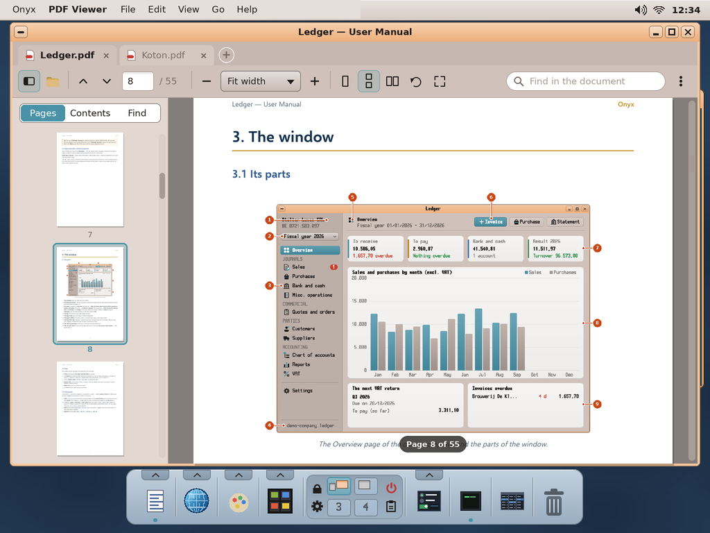
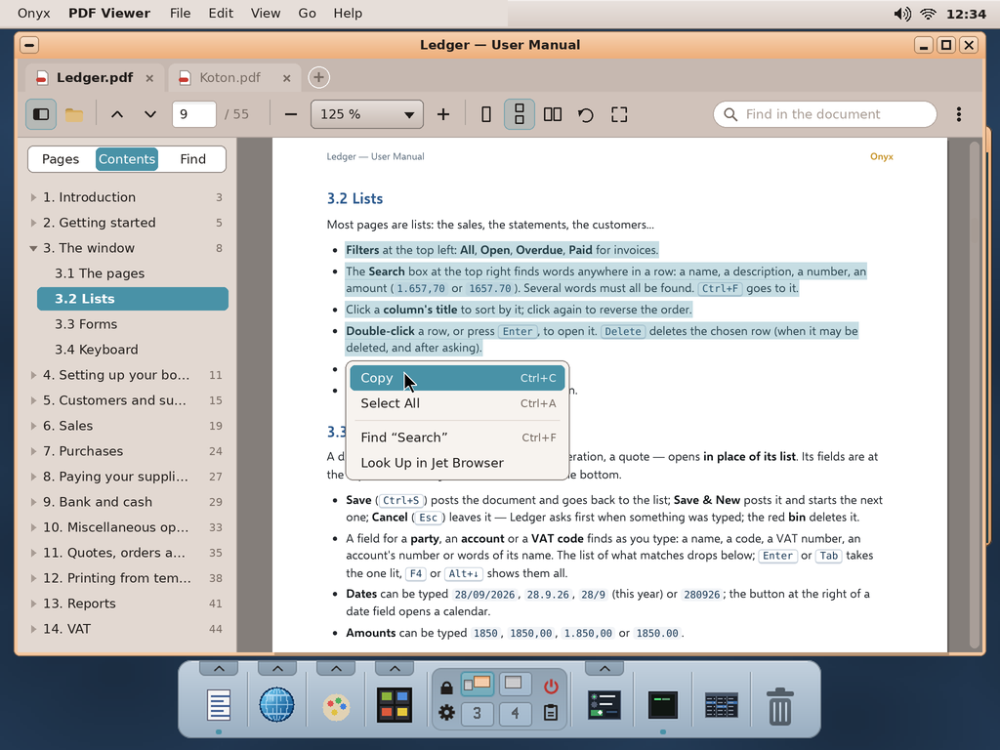
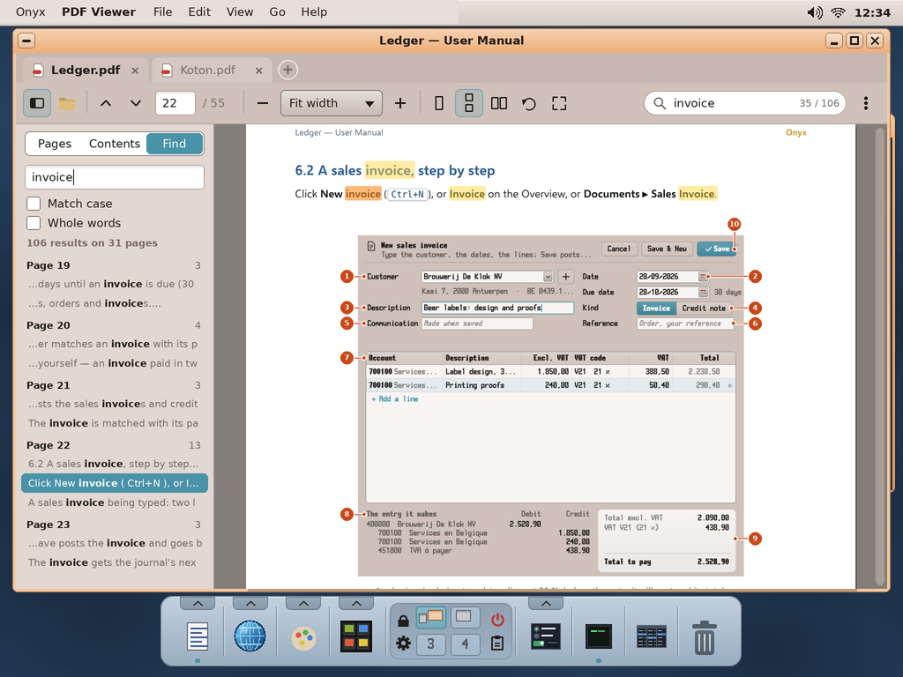
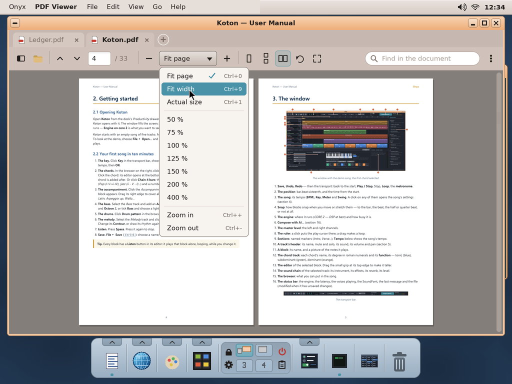
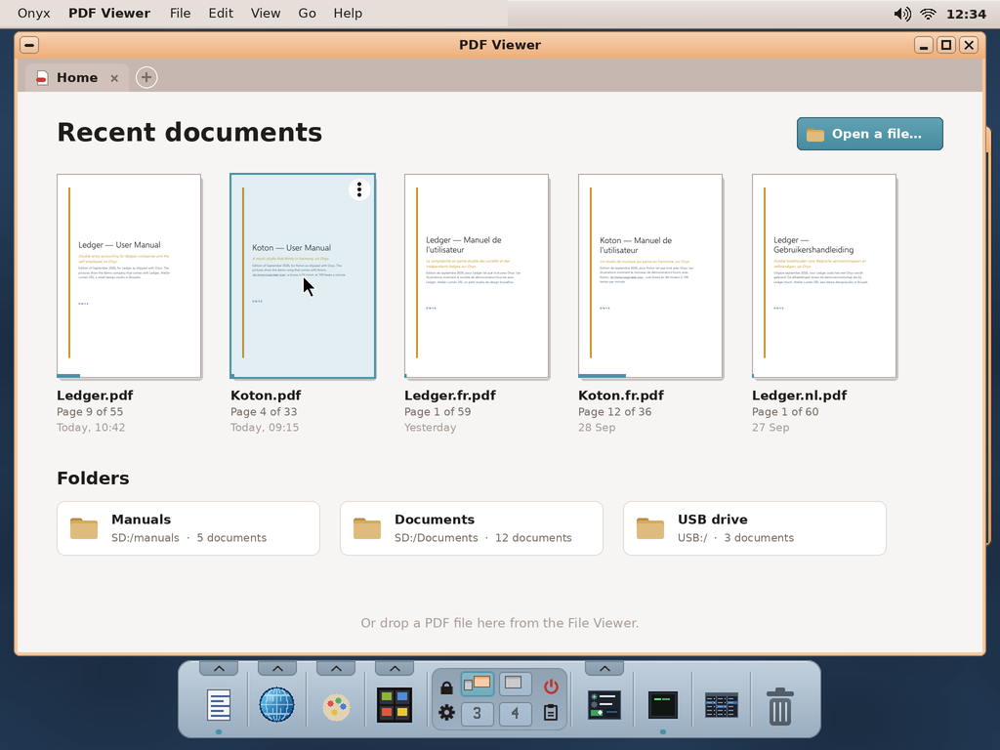
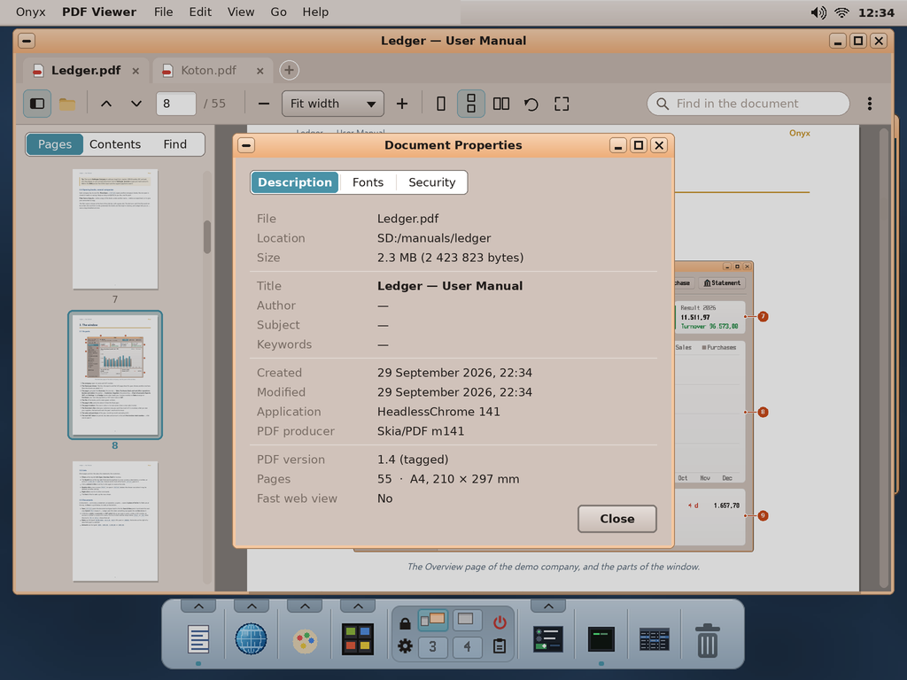
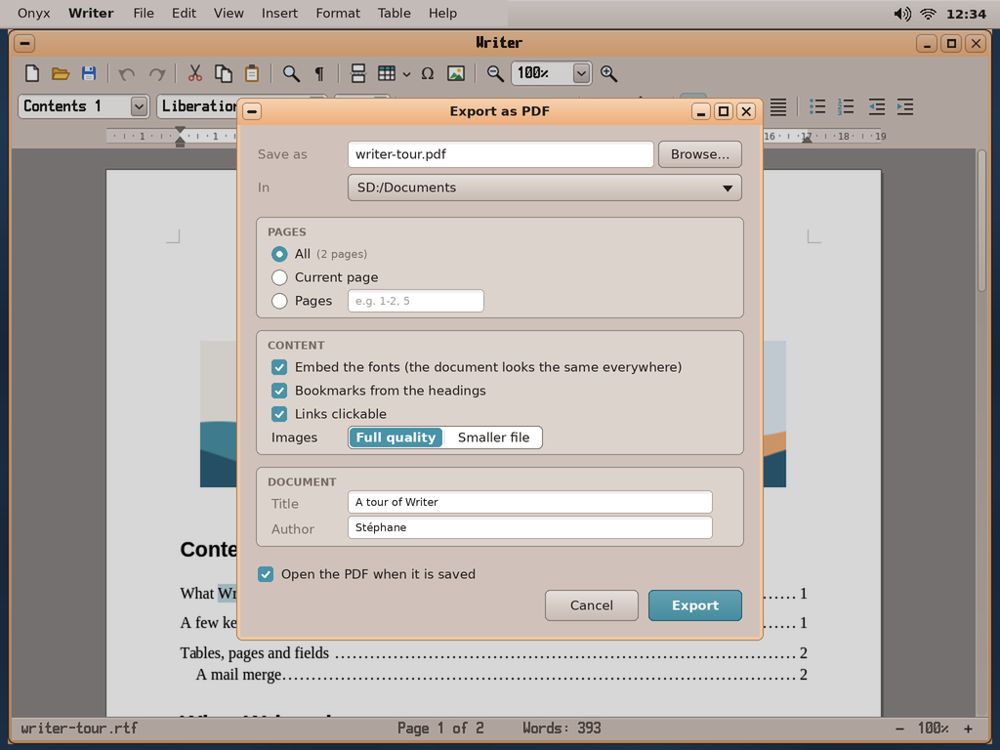

# PDF Viewer for Onyx — study, first mock-ups

> **Status (2026-10-01): done** — the PDF Viewer (`user/Apps/pdf`, on MuPDF; docs/03 *PDF Viewer*, its use: docs/04
> §12, the real app: `screenshots/pdf*.png`) and *File ▸ Export as PDF* in Writer and the Spreadsheet
> (`user/pdf/pdfwrite.h`, MIT; `screenshots/writer-pdf.png`, `sheet-pdf.png`); **not yet tried on the Pi**.
> The mock-ups below were validated. Priority 1 of the end-user apps roadmap
> (docs/HANDOFF.md): a **PDF viewer** as a polished app, in the way of Acrobat Reader / Edge / Evince /
> Preview, and the **PDF export** in Writer and the Spreadsheet. Proposed name: **PDF Viewer** (app folder
> `pdf`).

The mock-ups are made by `python3 tools/screenshot/mockup_pdf.py` → `docs/pdf/mockups/*.png` (1024 × 768,
the real desktop behind; the drawing helpers are `mockup_archiver.py`'s). The pages shown are real: Onyx's
own manuals (`sdcard/manuals/*/*.pdf`, made by `tools/manuals/build_manuals.py`), rendered by `pdftoppm`; the
search hits are placed from the words' real positions (`pdftotext -bbox-layout`).

| | |
|---|---|
|  | **Reading.** One **tab** a document (`+` opens another; Ctrl+Tab between them). The toolbar: the side panel, Open, previous / next page, the **page** (typed to go to it) / the count, the **zoom** (− / the drop-down / +), the **layout** (single page, continuous — the default —, two pages), rotate, full screen; at the right the **search** and ⋯ (Properties, Save a copy, Show in the File Viewer). The side panel: **Pages** (thumbnails, the current one framed; a click goes to it), **Contents**, **Find**. While scrolling, a pill tells the page. |
|  | **Contents and a selection.** The document's **outline** (its bookmarks), folded / unfolded, the section being read lit. The **text can be selected** (drag; double click a word, triple a line) and **copied** (clipd); its menu: Copy, Select All, Find the selection, look it up in Jet Browser. **Links** work: inside the document (the contents' entries) and to the web (opened in Jet). |
|  | **Find** (Ctrl+F): the hits highlighted on the pages, the current one in orange; Enter / Shift+Enter (or F3) the next / previous; *n / total* in the box. The side panel lists them **by page with their context**, the word in bold; Match case, Whole words. |
|  | **Two pages, the zoom.** Fit page (Ctrl+0), Fit width (Ctrl+9), actual size (Ctrl+1), 50 to 400 %; Ctrl+wheel and Ctrl +/− zoom around the pointer. The side panel hidden (its button / F9). Keys: arrows, Page Up / Down, Space, Home / End; full screen (F11) shows the pages alone on black, the arrows turning them (a presentation). |
|  | **The home**, when no document is open: the **recent documents** (their first page, where they were left — reopened at that page —, when), Open a file…, folders holding PDFs (the manuals, Documents, a USB drive); a PDF can be dropped there from the File Viewer. |
|  | **Properties**: the file, the title / author / subject / keywords, the dates, the application and producer, the PDF version, the pages and their size; *Fonts* (embedded or not); *Security* (encrypted, what is allowed). A **password-protected** PDF asks for its password when opened. |
|  | **Writer: File ▸ Export as PDF** (the Spreadsheet the same; Ledger's printed documents can then be PDFs too): the file and its folder, the pages (all, current, a range), the **fonts embedded** (subsets: the PDF looks the same everywhere), bookmarks from the headings, links, the images' quality, the title / author; open the PDF in the viewer afterwards. |

## How it would be built — what Onyx has, what it lacks

| Need | Onyx today | Proposed |
|---|---|---|
| Reading PDF (the parser, the fonts, the drawing) | FreeType 2.14 (`third_party/freetype`, the NetSurf work), zlib, libjpeg, libpng — no PDF engine | **MuPDF** (Artifex; C, made to be embedded, small and fast; reads PDF 1.0–2.0, encryption, Type 1 / TrueType / CFF / Type 3 fonts, CJK; draws with its own anti-aliased rasteriser into a pixmap: exactly what wtk shows). Its dependencies are the ones Onyx has (FreeType, zlib, libjpeg) plus jbig2dec, openjpeg (JPEG 2000) and lcms2, all C. Built for newlib like NetSurf's libraries, without its JavaScript / HTML / threads parts. |
| The licence | Onyx: GPL-3.0-or-later for the whole (docs/LICENSING.md) | MuPDF is **AGPL-3.0** (or a paid licence). AGPL-3.0 and GPL-3.0 combine (GPLv3 §13), so the **PDF Viewer app is AGPL-3.0**, the rest of Onyx unchanged (the aggregate, docs/LICENSING.md §1). Alternatives: **pdfium** (Google, BSD — a large C++17 code base with abseil / partition_alloc, heavy to port to newlib) or **our own renderer** (months of work to read real-world PDFs well). |
| Rendering speed | the Pi 4's 4 cores; threads (kapi v67) | the page drawn in a **thread**, the visible pages first, then the neighbours; a cache of pages and thumbnails; the low-resolution page shown at once while the sharp one comes (zoom, scroll). |
| Text, search, links, outline | — | MuPDF's structured text (selection, copy, find with positions), its links and outline. |
| PDF export (Writer, Spreadsheet) | Writer / Sheet draw their pages with FreeType | **Our own small PDF writer** (`user/lib/pdfwrite`, permissive, ours): pages as text runs and paths, the TrueType fonts **embedded as subsets** (FreeType gives the glyphs and metrics; ToUnicode maps so the text can be selected / found), images as JPEG / Flate, bookmarks, links. Not MuPDF here: Writer and the Spreadsheet stay under the licence of their choice. |
| File association | `SD:/etc/fileassoc.ini` | `pdf = pdf` |
| Printing | Onyx does not print | — (no Print button) |

## Decided with the user (2026-10-01)

1. The name: **PDF Viewer** (folder `pdf`).
2. The engine: **MuPDF** (the app AGPL-3.0).
3. **Tabs**: several documents in one window.
4. The first version **reads** (selection, copy, find, links, outline, passwords); annotations and filling forms
   later.
5. The export: **our own PDF writer, under MIT** (and every piece of Onyx's own software that can be: MIT —
   docs/LICENSING.md).

## What differs from the mock-ups

- No *Links clickable* in Writer's export: Writer has no hyperlinks yet (`pdfwrite.h` writes links: the
  Spreadsheet and Writer can use them when they have some). The fonts are always embedded (as subsets).
- The Spreadsheet's export: this sheet or all, portrait / landscape, fitted to the width, the grid's lines.

## Next

- Try it on the Pi (the speed of a page drawn on the A72; the memory of large documents).
- Annotations (highlight, notes) and forms filled — MuPDF has both (`pdf-annot`, `pdf-form`), saved with
  `pdf_save_document` (incremental).
- Colour management (lcms2, left out), the CJK fonts (`TOFU_CJK` left out: an embedded font still shows).
- A *Document Viewer* for the Markdown manuals? (they have their PDF.)
