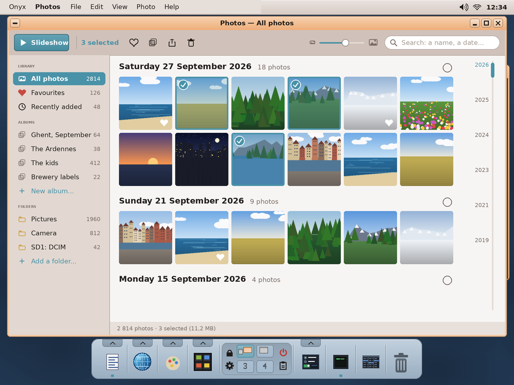
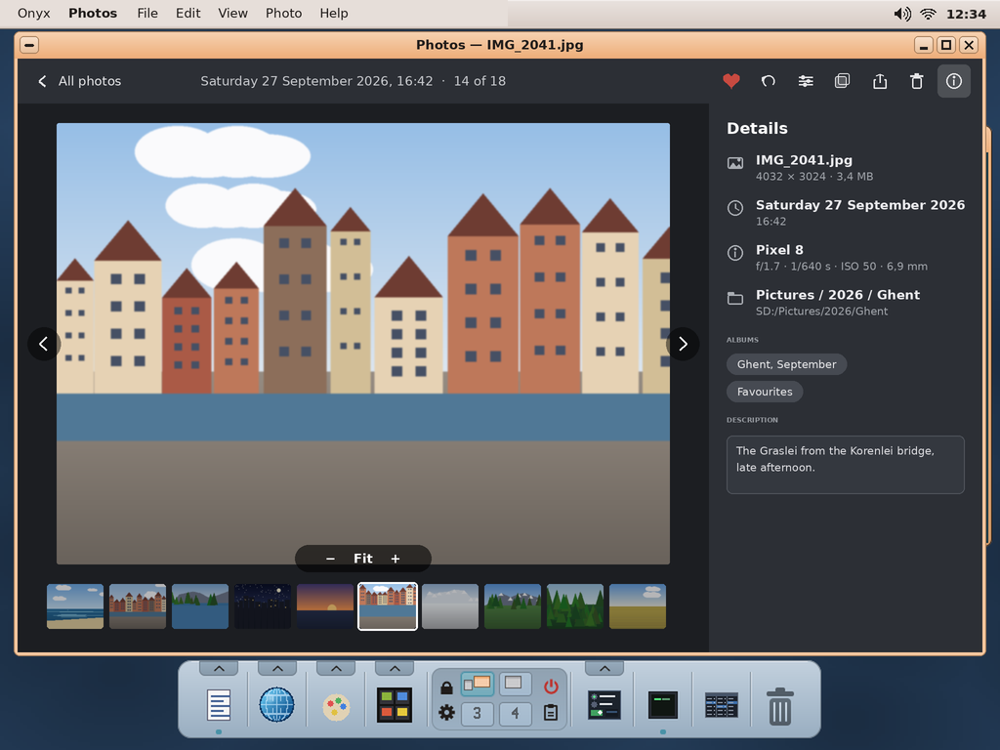
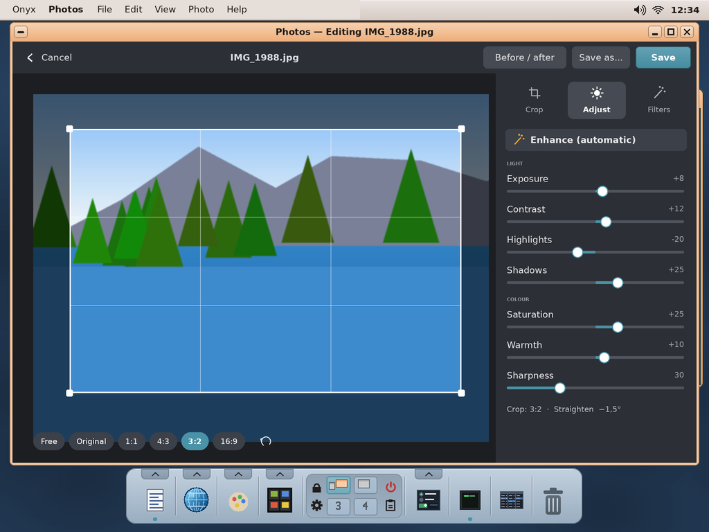
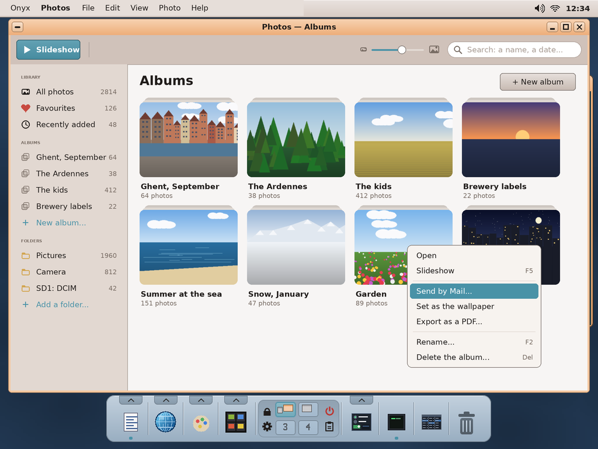

# Photos for Onyx — study, first mock-ups

> **Status (2026-10-02): mock-ups validated by the user** (the decisions below). A photo library "as in a phone or a modern
> desktop": all the pictures of the card in one place, by day, favourites, albums, a slideshow, simple
> editing. Proposed name: **Photos** (app folder `photos`). The Image Viewer stays the quick viewer of one file.

The mock-ups are made by `python3 tools/screenshot/mockup_photos.py` → `docs/photos/mockups/*.png` (1024 × 768, the
real desktop behind; the drawing helpers are `mockup_archiver.py`'s; the photos are drawn, the
camera are made up).

| | |
|---|---|
|  | **The library.** At the left: **All photos**, **Favourites**, **Recently added**; the **albums** (+ New album); the **folders** watched (Pictures, Camera — where Import puts them —, a volume such as `SD1:`). In the middle the photos **by day**, with their count, a circle to select a whole day; a selected photo has a tick, a favourite a heart. At the right a **timeline** of the years to jump through thousands of photos. The toolbar: **Slideshow**, the actions on the selection (favourite, add to an album, share: Mail, the Clipboard…, delete), the size of the thumbnails, the **search** (a name, a date, an album, a description). |
|  | **A photo.** Dark around it, full size, the previous / next (arrows, wheel, the keys), the zoom (Fit, +, −, the wheel, a drag when zoomed), the **film strip** of the day underneath. At the top: favourite, rotate, edit, add to an album, share, delete, the **details**: the file (size, weight), the date and time, the camera (f/, speed, ISO, focal length), the folder, its albums, a **description** one can write. |
|  | **Editing.** **Crop** (free, original, 1:1, 4:3, 3:2, 16:9, the thirds grid, straighten), **Adjust** (Enhance automatic, exposure, contrast, highlights, shadows, saturation, warmth, sharpness), **Filters** (a few: black and white, warm, cold, vintage, vivid). Before / after; **Save** (over the original) or **Save as...** (a new file). |
|  | **The albums**: their cover, their name and count; right-click: open, slideshow, **send by Mail** (the Mail app, the photos made smaller), set as the wallpaper, **export as a PDF** (a contact sheet / a small photo book, with the MIT PDF writer), rename, delete (the album only, never the photos). |

## How it would be built

| Need | Onyx today | To add |
|---|---|---|
| Decoding | `user/img/imgload.hpp` (`img_load`: JPEG, PNG, GIF, BMP, WebP, PCX) in libwtk | JPEG's **downscaled decode** for the thumbnails (a 12 MP JPEG is 48 MB as pixels): decode then shrink in strips, or the EXIF thumbnail when there is one |
| EXIF | — | our own reader (MIT): date, camera, exposure, orientation (the photo turned the right way), the embedded thumbnail |
| The library | the File Viewer's walking of folders | `SD:/var/photos/library.db` (one line per photo: path, size, date, w×h, favourite, description) + `thumbs/` (256 px JPEG or raw cache), built by a **worker thread** in the background, refreshed when a folder changes |
| Albums | — | `SD:/var/photos/albums/<name>.txt` (the paths): an album never copies a photo |
| Editing | Paint's filters | crop / rotate / the adjustments on the full picture in a worker thread, saved as JPEG (stb_image_write, public domain) |
| Sharing | Mail (`mailto` with attachments), Clipboard, wallpaper setting | — |

## Decided with the user (2026-10-02)

1. The name: **Photos**.
2. The folders watched: `SD:/Pictures`, `SD:/Pictures/Camera`, every mounted volume's `DCIM`, **plus the folders added by hand** ("Add a folder...", removed by a right-click).
3. Editing: **Save** (over the original) **or Save as...** (a new file) — the user chooses each time.
4. **No Import**: the photos are where they are; a stick's `DCIM` is shown while it is mounted.
5. **No videos**: photos only.
6. **No places** from the GPS (no list of towns on the card).
