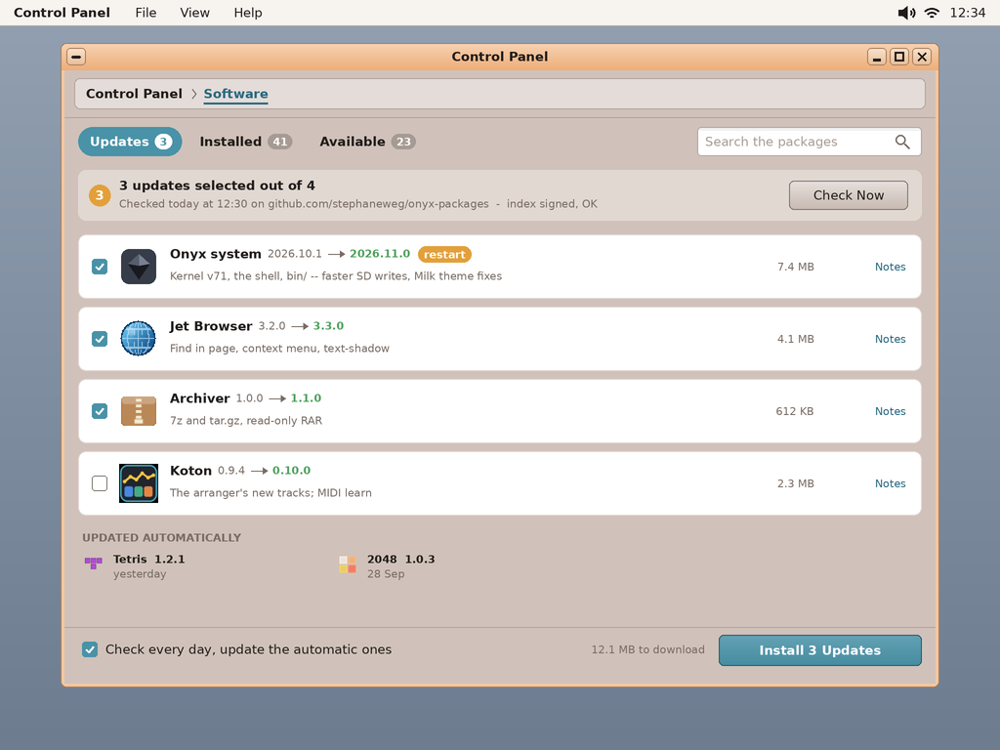
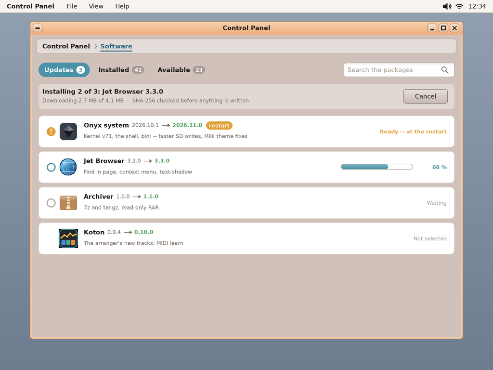
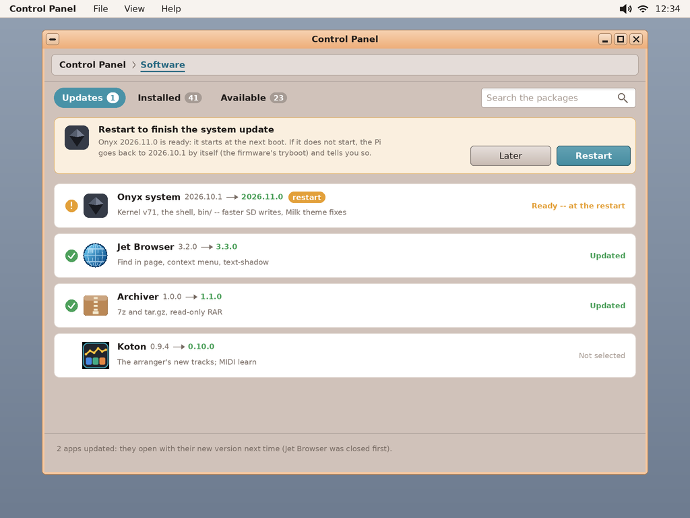
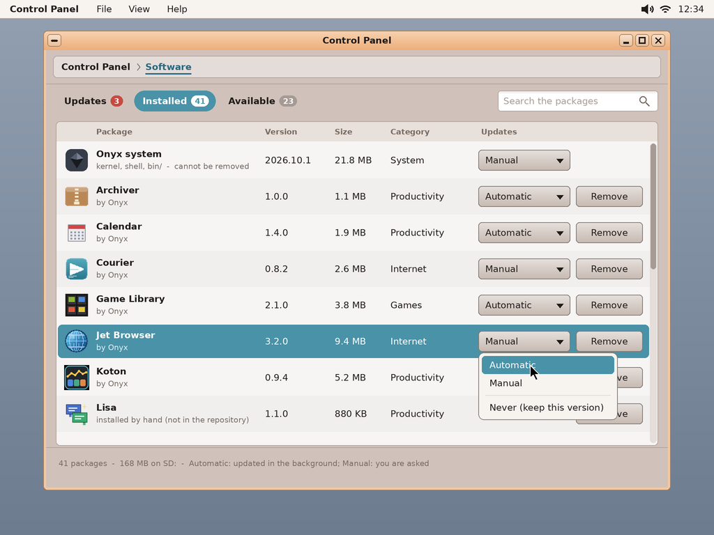
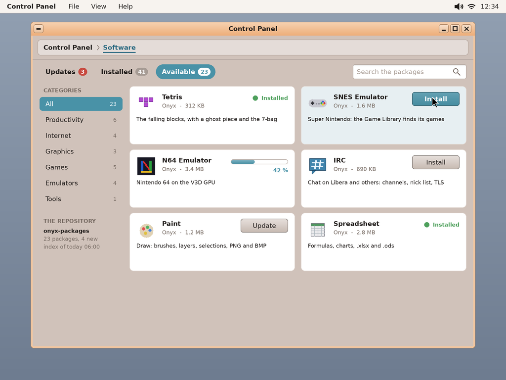
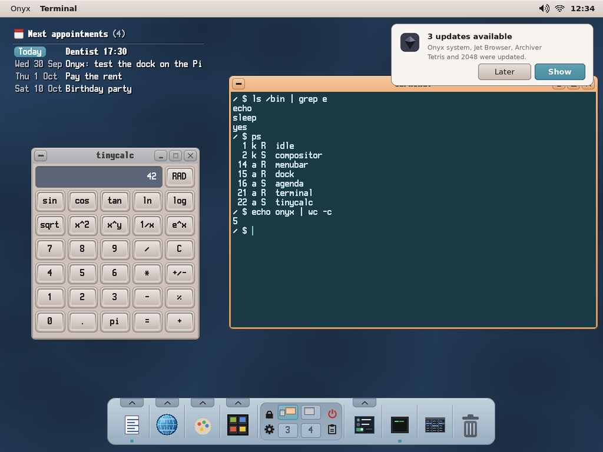
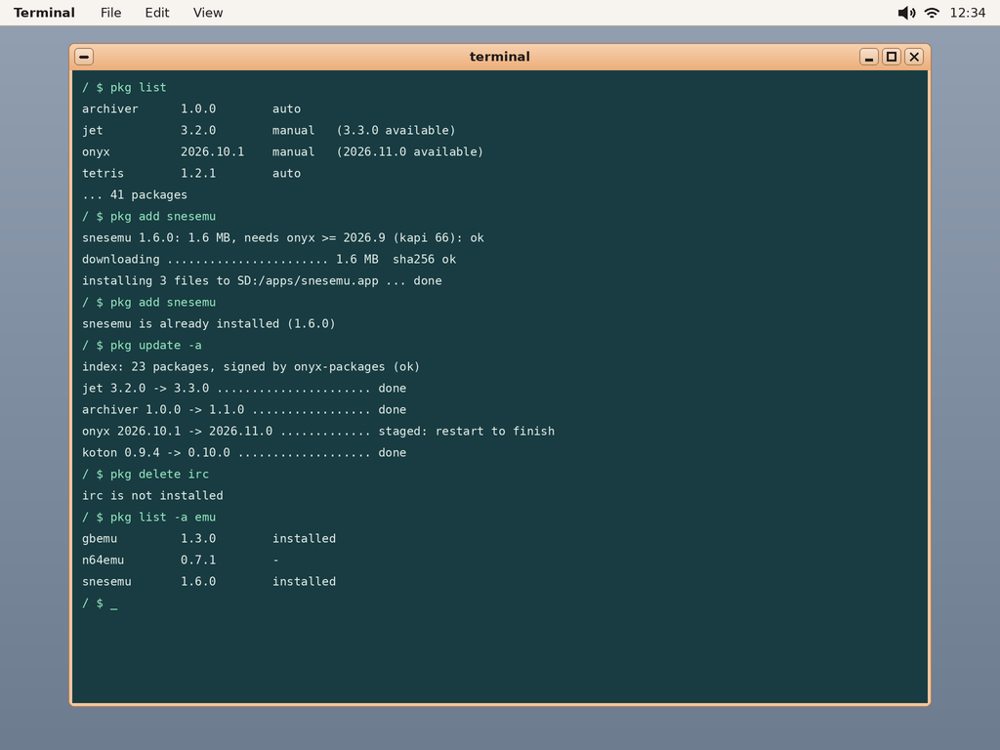

# Packages and updates — the package manager (study, first mock-ups)

> **Status (2026-10-01): study and mock-ups**, nothing built yet. What was decided with the user earlier
> (IDEAS.md, *Paquets d'apps + gestionnaire de paquets + mises à jour*): **one package format** for
> the apps *and* the system (the kernel included): an archive that **mirrors the card's root**,
> installed by extracting it there, with a **manifest**; a **public repository** with an **index**;
> the package manager is an **applet of the Control Panel** (new apps, the updates, a **manual /
> automatic** choice for each installed app); a **`pkg` command** (`add`, `delete`, `update [-a]`,
> `upgrade`, `list [-a]`), the same library as the applet; an **update daemon** (the automatic ones
> updated in the background, the others a notification; run once from the applet, a checklist);
> the kernel written beside the old one and **switched at the restart**, the old one kept to come back
> to. The open questions are at the end.

The mock-ups: `python3 tools/screenshot/mockup_pkg.py` → `docs/pkg/mockups/*.png` (1024 × 768, the
apps' real icons).

| | |
|---|---|
|  | **Updates** (the applet's first tab): the updates found, each with its versions (old → new), a line of what changed, its size, its notes; a box each, **Install 3 Updates**. A system update is marked **restart**. Under the list, what was **updated automatically** lately. At the foot: *Check every day, update the automatic ones* (the daemon). The head says when the index was read and that **its signature is good**. |
|  | **Installing**: one package after the other, the current one's progress; each archive's **SHA-256 checked before anything is written** to the card. The system update is **staged** (it waits for the restart). Cancel stops between two packages (a package is never half-installed). |
|  | **Restart to finish**: the new system starts at the next boot; if it does not start, the Pi **goes back to the previous one by itself** (the firmware's *tryboot*, below) and says so. The apps updated open with their new version the next time (an app running is closed first — asked). |
|  | **Installed**: every package, its version, size, category, its **updates mode** — **Automatic** (updated in the background), **Manual** (you are asked), **Never** (keep this version) — and **Remove**. The system cannot be removed; a package installed by hand (not in the repository) says so. |
|  | **Available** (the store): the repository's packages by category, searchable; a card each (icon, name, author, size, description): **Install**, a progress, **Installed**, or **Update**. |
|  | **The daemon's notification** (notifyd): *3 updates available* — the manual ones; the automatic ones were done (*Tetris and 2048 were updated*). **Show** opens the applet on Updates. |
|  | **`pkg`** in the terminal: `list`, `add` (already installed: says so, does nothing), `update -a`, `delete` (not installed: says so), `list -a <filter>`. |

## The package

**A `.opk` file is a ZIP** (deflate — the Archiver's engine and `zip` / `unzip` read and write it on the
Pi; any PC tool too) whose tree **is the card's**: the Archiver's package holds
`apps/archiver.app/main`, `app.txt`, `icon.bmp`; a tool `bin/<name>`; the system
`kernel8-rpi4.img`, `bin/…`, `apps/menubar.app/…`, `etc/…`. Plus one entry outside the card's tree,
**`PKG/manifest.ini`**:

```ini
name     = archiver              ; the package's id: [a-z0-9-]
title    = Archiver
version  = 1.1.0                 ; numbers and dots (the system: the date, 2026.11.0)
category = Productivity
author   = Onyx
summary  = Open, explore and make ZIP archives
needs    = onyx >= 2026.10, kapi >= 71   ; other packages, the kernel's ABI
restart  = 0                     ; 1: installed at the next boot (the system)
config   = apps/archiver.app/config.ini  ; the user's files: never overwritten once changed
```

Installing = check, then extract to `SD:/` (the files listed `config`: written only if absent, or
unchanged since the last install — else beside as `<file>.new`); the installed packages' database:
**`SD:/var/pkg/<name>.ini`** (the manifest + the list of the files written, each with its SHA-256 — so
a removal removes exactly them, and a file the user changed is seen).

Removing = deleting the files listed (not the changed `config` files, unless asked), then the empty
folders. The packages `needs`-ing it: refused (said).

## The repository

A GitHub repository **`stephaneweg/onyx-packages`** served by GitHub Pages (HTTPS; our client follows
the redirects):

```
index.txt          the packages: a section each (name, title, version, category, size, sha256,
                   summary, needs, file, icon) -- read by the applet, the daemon, pkg
index.sig          index.txt's signature (ECDSA P-256 / SHA-256, mbedTLS on the Pi)
pkgs/<name>-<version>.opk
icons/<name>.bmp   the store's icons (the app's own icon.bmp)
notes/<name>-<version>.txt
```

**The trust**: the index is **signed** with a key kept off the repository (the user's PC, or a GitHub
secret); its public half is on the card, `SD:/etc/pkg/keys/onyx.pub` (the system package carries it).
Each archive's **SHA-256** is in the signed index: an archive changed on the server (or on the way —
TLS certificate checks are optional today in `tls/onyx_tls.hpp`) is refused before a byte is
written. A local repository (a folder, `file:` / `SD:/…`) works the same: for tests, or a card with no
network.

**Made on the PC** by `tools/pkg/mkrepo.py`: `tools/pkg/packages.ini` says which of `sdcard/`'s files
make each package and its version; the script zips them (`PKG/manifest.ini` added), hashes, writes the
index, signs it, and copies everything into a checkout of `onyx-packages` (pushed by hand or by a
GitHub Action). `tools/pkg/keygen.py` makes the key pair once.

## The system package and the kernel

- **`onyx`**: the kernel, `bin/`, the shell's parts (menubar, dock, notifyd, lock, desktop, Setup, the
  Control Panel and its applets, the File Viewer, the terminal), `etc/` (as `config`), the fonts and
  `res/`; the Pi's firmware (`start4.elf`, `fixup4.dat`, the `.dtb`) as **`pi-firmware`**, rarely
  updated. Every other app its own package (88 today).
- **The kernel is never replaced in place.** The new one is written as `kernel8-rpi4.img.new`; the
  Pi 4 firmware's **tryboot**: a reboot with the *tryboot* flag (the mailbox's `SET_REBOOT_FLAGS`
  property — kapi to add) boots once with **`tryboot.txt`** (`kernel=kernel8-rpi4.img.new`); Onyx, once
  started (the desktop up), **commits** (renames the new over the old, the old kept as
  `kernel8-rpi4.img.old`). If the new one does not come up, the next boot is the normal one: the old
  kernel, and a notification *The system update did not start: kept 2026.10.1*. The rest of the system
  package (`bin/`, the shell's apps) is staged in `SD:/var/pkg/stage/` and moved in by the same commit.
- **An app running** when updated: the GUI asks to close it (*Close and update* / *Skip*); the daemon
  skips it until its next round.

## The pieces to write

| Piece | Where | What |
|---|---|---|
| The library | `user/pkg/pkglib.h` | the index (read, signature, compare), the database, the download to a file (`http.hpp` to stream the body to a file: today it keeps it whole in a buffer), SHA-256 (mbedTLS), install / remove / stage / commit with the Archiver's ZIP engine (`Apps/archiver/zip.h`) |
| The command | `user/bin/pkg.cpp` | `pkg add / delete / update [-a] / upgrade / list [-a] [filter] / info` (newlib + mbedTLS, as `httpsget`) |
| The applet | `user/Apps/software` | the Control Panel's **Software** applet (`applet_proto.h`), FreeType; the three tabs of the mock-ups; the work in a thread |
| The daemon | `user/Apps/pkgd` | no window; started by `autostart`; once the network and the time (NTP) are there, then every day: the index, the **automatic** ones updated, a notification for the others; `pkg upgrade` and the applet's *Check Now* run one round |
| The commit | the kernel / `init` | at boot: a staged system → moved in, `kernel8-rpi4.img.new` committed or dropped; the tryboot flag (a kapi: `reboot (flags)`) |
| The PC side | `tools/pkg/` | `packages.ini`, `mkrepo.py`, `keygen.py`; a test that installs, updates and removes on the desktop simulator |
| The versions | `app.txt` | a `version =` key in each app's `app.txt` (none has one today), read by the File Viewer's properties too |

**First run on an existing card**: no database yet → `pkg` / the applet **adopt** what is on the card:
each package of the index whose files are all there is recorded as installed (its version: the app's
`app.txt` `version`, else `0` — so the first check offers its update).

## Order of work (proposed)

1. `tools/pkg` (manifest, `mkrepo.py`, the key, a local repository from `sdcard/`) + `pkglib.h` +
   `pkg` — tested on the PC simulator, then on the Pi against a local folder, then GitHub Pages.
2. The **Software** applet (the mock-ups), the notification.
3. `pkgd` (daily) — later a task of the **task scheduler** (IDEAS.md) when it exists.
4. The system package: the stage, the commit at boot, tryboot.

## Open questions (for the user)

1. **The repository**: a separate GitHub repository `stephaneweg/onyx-packages` on GitHub Pages (the
   proposal), or the packages as *Releases* of `onyx` (larger files), or a server of yours?
2. **The applet's name**: *Software* (the mock-ups), *Updates*, *Store*…?
3. **The daemon without a scheduler**: `pkgd` checks once a day itself for now (the proposal), or the
   task scheduler first?
4. **The default mode** of an app just installed: Automatic or Manual? And the system: always Manual
   (the proposal: it needs a restart)?
5. **The split**: the system as one package `onyx` (+ `pi-firmware`), every app its own package (the
   proposal) — or the demos / the BASIC samples / the emulators grouped?
