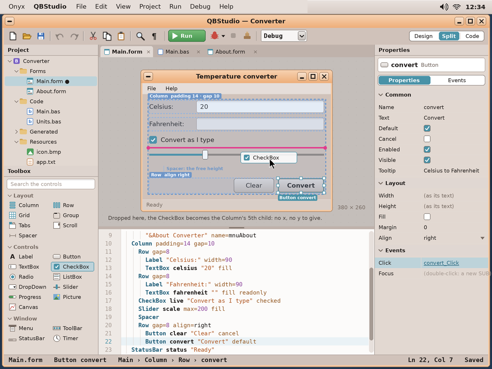
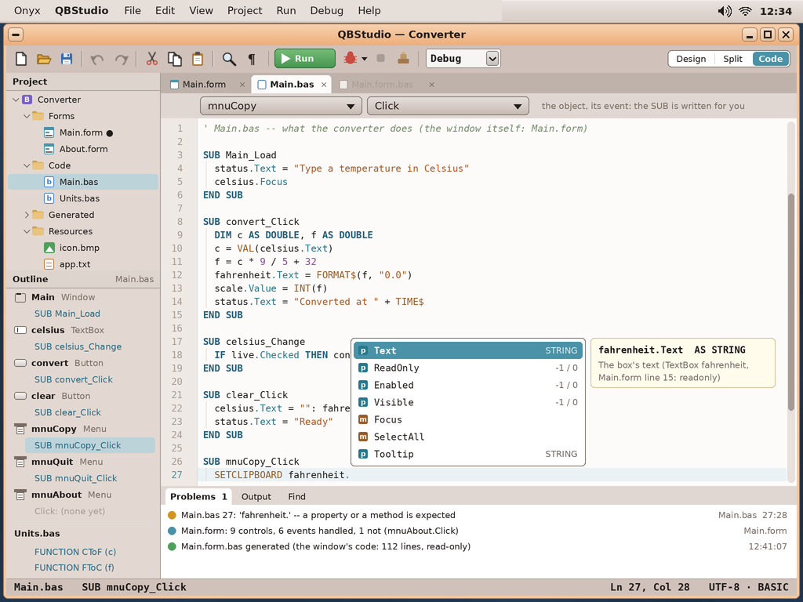
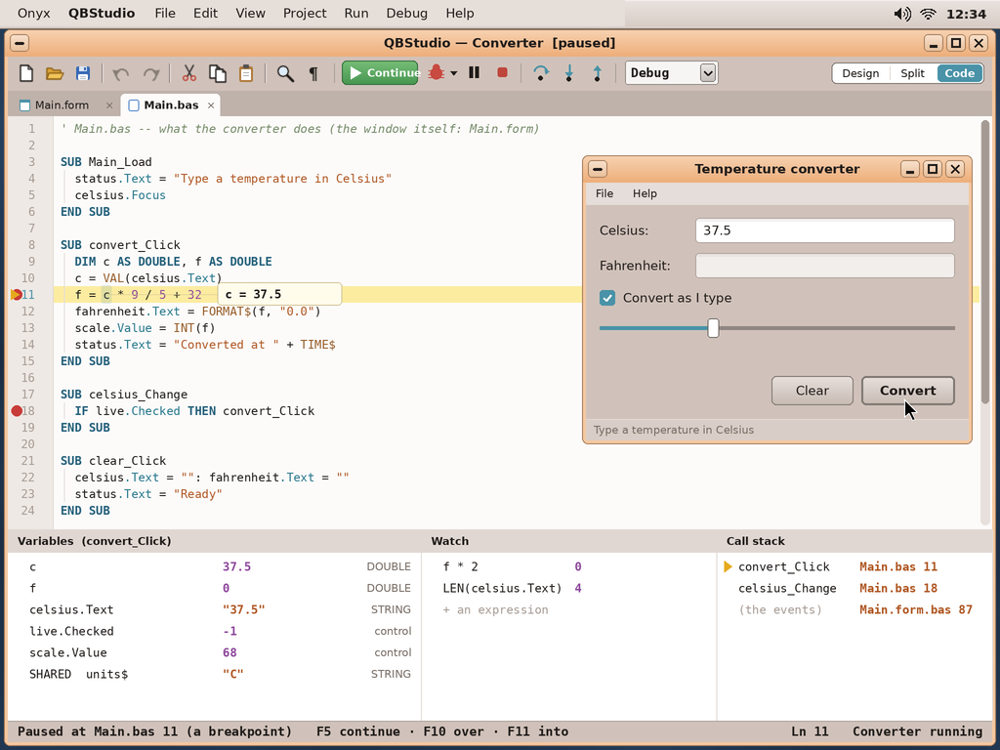
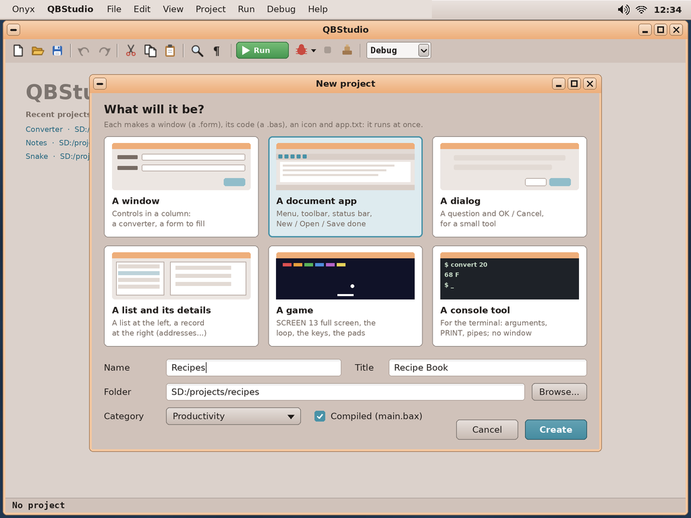
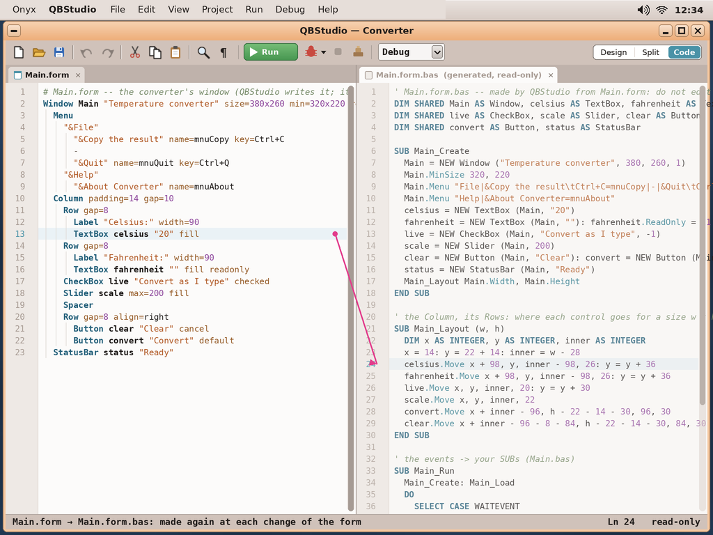

# QBStudio, the IDE for desktop apps in BASIC — study, first mock-ups

> **Status (2026-10-04): built -- the first version** (the designer, the code, Run, Make App; the user guide's §13
> *QBStudio*); the debugger is next. The study below was approved by the user before. Asked by the user (2026-10-04): an IDE to write
> programs in Onyx's QBasic-style BASIC, aimed at **desktop apps**, *without touching what exists* (the `qbasic`
> editor stays as it is). It has a **GUI designer** in the way of Visual Studio's WPF designer: the designer mostly
> defines the **layout** of the window, and the IDE **generates the window's code**. The user's idea for the format:
> "like XAML but lighter, not necessarily XML: **a control a line, the indentation giving the parent**" (or, failing
> that, WinForms-style absolute positions). The name: **QBStudio** (app folder `qbstudio`), chosen by the user, who
> approved the mock-ups and the choices below (2026-10-04).

The mock-ups are made by `python3 tools/screenshot/mockup_qbstudio.py` → `docs/qbstudio/mockups/qbstudio-*.png` (1024 × 768,
the real desktop behind; the drawing helpers are `mockup_archiver.py`'s, the toolbar icons Letters', as for Slides).
The project shown, *Converter*, is the example `SD:/basic/examples/gui.bas` grown into a real app.

| | |
|---|---|
|  | **The designer** (the Split view). At the left the **project** (its forms, its code, the generated files, the resources: the icon, `app.txt`) and the **toolbox**: the layout containers (Column, Row, Grid, Group, Tabs, Scroll, Spacer), the controls (the runtime's, and Picture / Canvas), the window's parts (Menu, ToolBar, StatusBar, Timer). In the middle the **window as Onyx draws it**, its layout's boxes over it (the Column, its Rows: dashed, named), the selected Button with its handles; a CheckBox dragged from the toolbox shows **where it will go in the Column** (the pink line) — no x, no y to give. Under it, **the form's text**, kept in step with the drawing (each can be edited; the other follows). At the right the **properties** of the selection (common, layout, its events: a click on *Click* opens its SUB). |
|  | **The code** (`Main.bas`): only what the app does, one SUB per event — `convert_Click`, `celsius_Change` — and the controls as objects (`celsius.Text`, `live.Checked`, `scale.Value`). Above the text, the **object and its event** (as Visual Basic's two lists): choosing them writes the SUB. **Completion** after a control's name (its properties and methods, their types, a tip from the form), the language's colours, the indentation's guides. At the left the **outline**: each control and its event SUBs (an event not handled yet is shown). Under the text, **problems** found as you type, the output of the build. |
|  | **Running, debugging.** Run (F5) builds and starts the app in its own window; **Debug** stops at **breakpoints** (a click in the margin), the line about to run in yellow, the value of a variable under the pointer; **Continue, Step over, Step into, Step out, Stop**; the **variables** of the SUB (the controls' properties too), a **watch** list of expressions, the **call stack** (back to the event that started it). |
|  | **A new project**: a window (controls in a column), a **document app** (menu, toolbar, status bar, New / Open / Save already done), a dialog, a list and its details, a game (`SCREEN 13`, the loop, the keys and pads), a console tool. The name, the title, the folder, the category; compiled or not. Each runs at once. |
|  | **What QBStudio makes of the form**: `Main.form.bas`, the window's code, **generated and read-only** (made again at each change of the form, as Visual Studio's `.designer.cs`): the controls as `DIM SHARED` objects, `Main_Create`, `Main_Layout (w, h)` — where each control goes for a size, computed from the Column and its Rows (so the window can be resized) — and `Main_Run`, the event loop that calls your SUBs. Plain BASIC: it can be read, stepped into, and the app runs without QBStudio. |

## The format: `.form`

A control a line; **the indentation gives the parent** (two spaces, or a tab); then its **name** (optional), its
**text** (in quotes), its **properties** (`key=value`) and its **flags** (a word alone). `#` begins a comment.

```
# Main.form -- the converter's window
Window Main "Temperature converter" size=380x260 min=320x220 resizable
  Menu
    "&File"
      "&Copy the result" name=mnuCopy key=Ctrl+C
      -
      "&Quit" name=mnuQuit key=Ctrl+Q
    "&Help"
      "&About Converter" name=mnuAbout
  Column padding=14 gap=10
    Row gap=8
      Label "Celsius:" width=90
      TextBox celsius "20" fill
    Row gap=8
      Label "Fahrenheit:" width=90
      TextBox fahrenheit "" fill readonly
    CheckBox live "Convert as I type" checked
    Slider scale max=200 fill
    Spacer
    Row gap=8 align=right
      Button clear "Clear" cancel
      Button convert "Convert" default
  StatusBar status "Ready"
```

- **Layout, not coordinates** (as WPF): a **Column** stacks its children down, a **Row** across, a **Grid** in
  cells (`cols=2 rows=3`, a child's `cell=1,0` and `span=`), **Group** draws a frame with a title, **Tabs** has
  **Tab** pages, **Scroll** scrolls what is too big, a **Spacer** takes the free room. A child's size: its own
  (the text's), or `width=` / `height=`, or **`fill`** (the room left, shared by `grow=n`); `align=` left, centre,
  right, stretch; `margin=`, a container's `padding=` and `gap=`. The window can be **resized**: the layout is
  recomputed.
- **Absolute too** (as WinForms), where it is wanted: a **Canvas** container places its children at `at=x,y` with
  `size=w x h` (a drawing app's palette, a game's screen).
- **The window's parts**: `Menu` (its items indented under their titles; `-` a separator; `key=` the shortcut),
  `ToolBar` (buttons with an `icon=`), `StatusBar`, `Timer interval=500` (its `Tick` event).
- **Names** are the objects of the code (`celsius.Text`) and the start of the event SUBs (`celsius_Change`); a
  control without a name has no events (a label).
- The designer and the text are **one form**: what is drawn is written, what is typed is drawn (errors underlined,
  as in the code). The file stays readable and diff-able — a reason not to use XML.

## The code generated, the code written

| File | Who writes it | What it holds |
|---|---|---|
| `Main.form` | QBStudio's designer, or you | the window: its controls, their layout, their properties |
| `Main.form.bas` | **QBStudio** (read-only, made again) | `DIM SHARED` the controls; `Main_Create`; `Main_Layout (w, h)`; `Main_Run` (the event loop → your SUBs) |
| `Main.bas` | **you** | the event SUBs (`convert_Click`...), `Main_Load`, your own SUBs and FUNCTIONs |
| `main.bas` (the app's) | QBStudio, once | `'$INCLUDE` the files, then `Main_Run` |

**File ▸ Make App** (as `qbasic`'s) writes `SD:/apps/<name>.app/` — `main.bas` or the compiled `main.bax`,
`app.txt`, `icon.bmp` — so the app is listed, launched, packaged like any other. A project is a folder
(`SD:/projects/<name>/`, with `project.ini`).

## What the BASIC needs (additions; existing programs unchanged)

The runtime already has the controls (`BUTTON(x, y, w, h, text$)`...), `WINDOW`, `WAITEVENT`, `MSGBOX`, the file
dialogs, `TYPE` with methods and `NEW`. QBStudio's generated code needs, in the compiler and in the runtime (both of
Onyx's: `/bin/basic` and the Windows runtime, `pc/`):

1. **Controls as objects**: `DIM x AS TextBox`, `x = NEW TextBox (window, text$)`, and **properties** —
   `x.Text = "..."`, `IF x.Checked THEN` — a `PROPERTY` in a `TYPE` (get / set, in the way of FreeBASIC), the
   controls' types built in (`Text`, `Value`, `Checked`, `Enabled`, `Visible`, `ReadOnly`, `Tooltip`, `Focus`,
   `Move x, y, w, h`...). The old `SETTEXT id, s$` / `GETTEXT$ (id)` stay.
2. **Moving a control** (`Move`) and its **visibility / enabled** state; the window's **size** (`Width`, `Height`,
   `MinSize`), **resizable** windows and a **`RESIZED`** event from `WAITEVENT`.
3. **Menus** (`Main.Menu "File|&Open...\tCtrl+O=mnuOpen|-|..."`) and their events (`MENUITEM ("mnuOpen")`);
   a **toolbar**, a **status bar**, a **timer** event in the loop.
4. **`'$INCLUDE: 'file.bas'`** (QBasic's metacommand) to join the files of a project.
5. For the debugger: the bytecode's **line table**, **breakpoints**, **stepping**, reading the variables — a
   debug channel between QBStudio and the running program (`/bin/basic --debug`).

## How it would be built (a first plan)

| Need | Onyx today | To add |
|---|---|---|
| The window, its panes, dialogs | wtk, Letters' toolbars, Slides' sidebar | the project tree, the toolbox, the property grid |
| The designer | wtk's widgets (drawn as they will look), Slides' handles and guides | the layout engine (Column / Row / Grid...), drag from the toolbox, the blueprint |
| The `.form` text | — | its reader / writer, kept in step with the designer (undo shared) |
| The code editor | `qbasic`'s editor, Letters' text view | colours, completion, the object / event lists, problems as you type |
| Building, running | the compiler (`basic -c`), `/bin/basic` | the generator (`.form` → `.form.bas`), the additions above |
| Debugging | — | the debug channel in `/bin/basic`, the panes |

**Licence**: MIT (ours, nothing copyleft linked).

## Open questions for the user

1. The name: **QBStudio** — decided by the user (2026-10-04).
2. The format as above — **layout containers first** (WPF), **Canvas** for absolute positions (WinForms) when
   wanted — and the generated code apart, read-only (`Main.form.bas`)?
3. The BASIC additions (objects and properties, `Move`, menus, resize, `$INCLUDE`, the debug channel): in the
   compiler and both runtimes, keeping every existing program working — agreed?
4. The first version: the designer, the code editor, Run and Make App first; the **debugger** second?
5. QBStudio for Windows too (`pc/`, as Onyx BASIC for Windows), or Onyx only?
