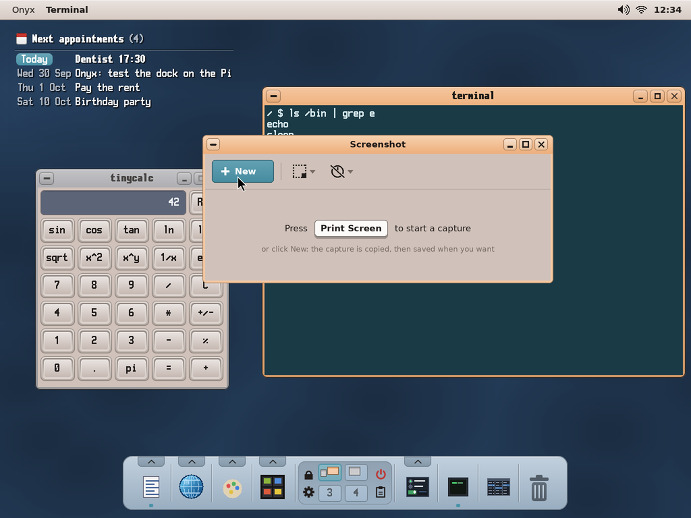
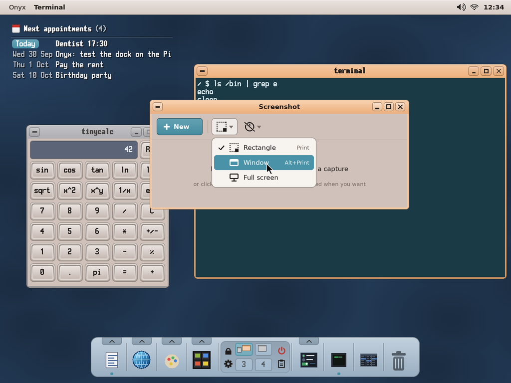
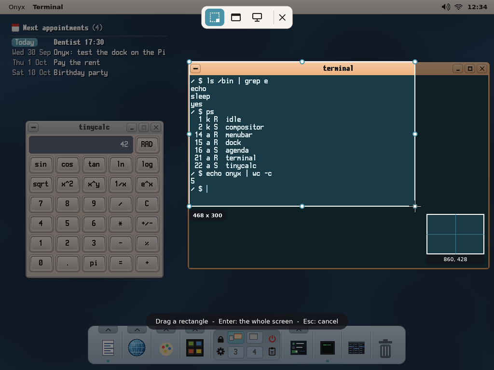
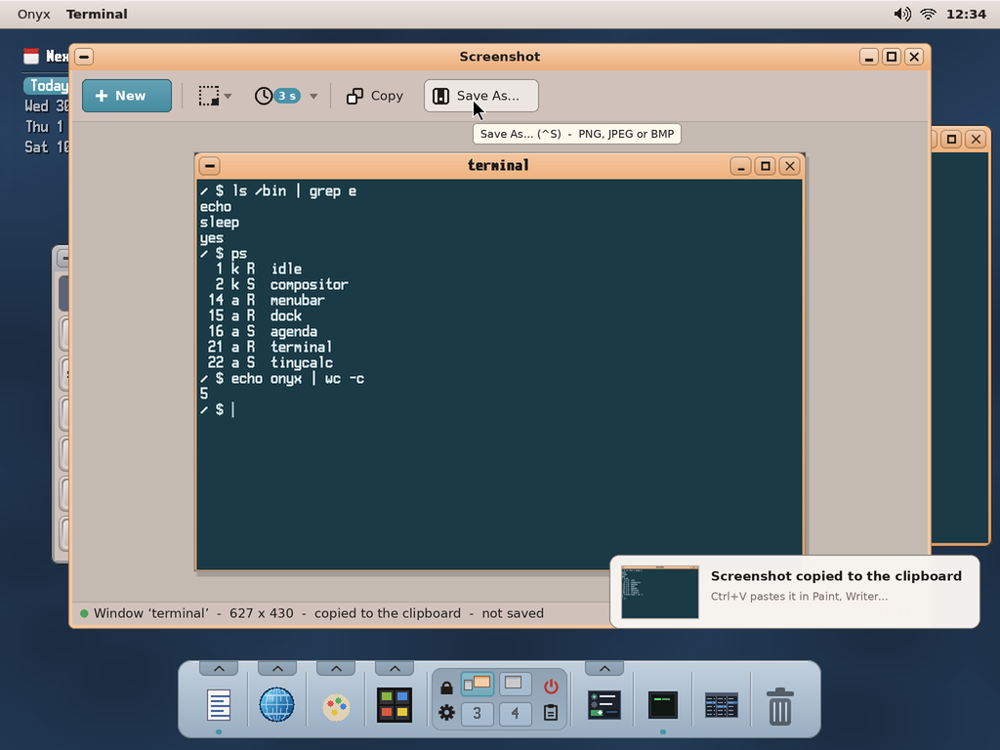

# Screenshot for Onyx — a screen capture tool (study, first mock-ups)

> **Status (2026-10-01): second mock-ups, to be validated by the user.** The first ones (an options
> window, then an editor with a pen and a marker) were not kept: the user wants the layout of Windows'
> **Snipping Tool** (*Outil Capture d'écran*): **one toolbar** -- **New** (starts a capture), the **mode**
> as a drop-down button (**Rectangle** by default, **Window**, **Full screen**), the **delay** as a
> drop-down button, then, once a capture is made, **Copy** and **Save As...** at the left, next to them;
> the capture shown below. Name: **Screenshot** (app folder `screenshot`).

The mock-ups are made by `python3 tools/screenshot/mockup_screenshot.py` → `docs/screenshot/mockups/*.png`
(1024 × 768, the Pi's default screen; what is captured is the real desktop, `screenshots/desktop.png`;
the drawing helpers and the look are `mockup_archiver.py`'s).

| | |
|---|---|
|  | **The window, nothing captured yet.** The toolbar: **New** (the main action), the **mode** (its icon and an arrow) and the **delay** (a struck clock: none). Below: *Press **Print Screen** to start a capture*. |
|  | **The mode's menu**: **Rectangle** (Print Screen), **Window** (Alt+Print Screen), **Full screen**; a tick at the one chosen, kept for the next time. |
|  | **The delay's menu**: none, 3, 5, 10 seconds. Chosen, the button shows it (**3 s** in a pill). |
|  | **A rectangle.** The window hides itself, the screen is **frozen** (grabbed first) and darkened, the rectangle dragged is bright, its size under it, a **magnifier** at the pointer (the pixels enlarged, their coordinates). The small bar on top switches the mode or cancels. Enter: the whole screen; Esc: cancel. |
|  | **A window.** The window under the pointer lit, its name and size; a click takes it (its frame included), Tab goes to the next one. |
|  | **The delay.** A countdown (a ring, the seconds), so a menu can be opened before; Esc stops it. The countdown is gone from the screen before the grab. |
|  | **The capture made.** The window comes back with the picture, fitted (its zoom in the status bar); it is **copied to the clipboard at once** (a notification says so). **Copy** and **Save As...** (^S: PNG, JPEG or BMP, in `SD:/Pictures/Screenshots` by default, named `Screenshot <date> <time>.png`) appear at the left, after the mode and the delay. |

## How it would be built — what Onyx has, what it lacks

| Need | Onyx today | To add |
|---|---|---|
| The screen's pixels | `kapi_screen_grab` (v38: the whole composite, as `vncd` uses it) | — |
| A window's pixels, where the windows are | `kapi_win_list` / `kapi_win_read` (v56, `rdpd`'s), `win_geometry` (v64) | — |
| The overlay over everything | a full-screen borderless window, `WIN_FLAG_TOPMOST` (or `fullscreen_begin`) showing the frozen grab | — |
| Drawing (pen, marker, crop) | wtk + `wtk/vpaint.h` (anti-aliased strokes), the canvas | — |
| Save PNG / JPEG / BMP | `img/pngsave.hpp` (`png_encode`, `jpeg_encode`, `bmp_encode`) | — |
| The notification | `notify.h` (`notifyd`) | a thumbnail in the bubble (optional) |
| **An image in the clipboard** | the kernel's clipboard holds one text or one path | the shared clipboard service (`docs/clipboard/README.md`): an image item |
| **The Print Screen key** | the keys go to the window in front | a global key: Print → Screenshot with the last options (the kernel hands the key to the menu bar, which starts the app) |

## Decided with the user (2026-10-01)

0. **The layout**: Windows' Snipping Tool's (above) -- no options window, no drawing editor for now.

1. The name: **Screenshot**.
2. **Print Screen** starts the app and captures at once **with the last options** (the screen, a window
   or a region; the delay) — a global key: the kernel routes it to the menu bar, which launches
   `screenshot --now` (or tells the running one).
3. **The clipboard**: not the kernel's any more but a **shared clipboard service** reached by IPC,
   with a history of 10 items of any type (text, image, paths...) — its own study:
   [`docs/clipboard/README.md`](../clipboard/README.md). Screenshot copies its picture there as an
   **image** item.

## Still open

4. Every capture **saved automatically** in `SD:/Pictures/Screenshots`, or only on *Save As*? (The
   mock-ups: only on *Save As*; copied to the clipboard at once.)
5. Drawing on the capture (a pen, a marker, a crop: Snipping Tool's middle tools) -- later, or now?
