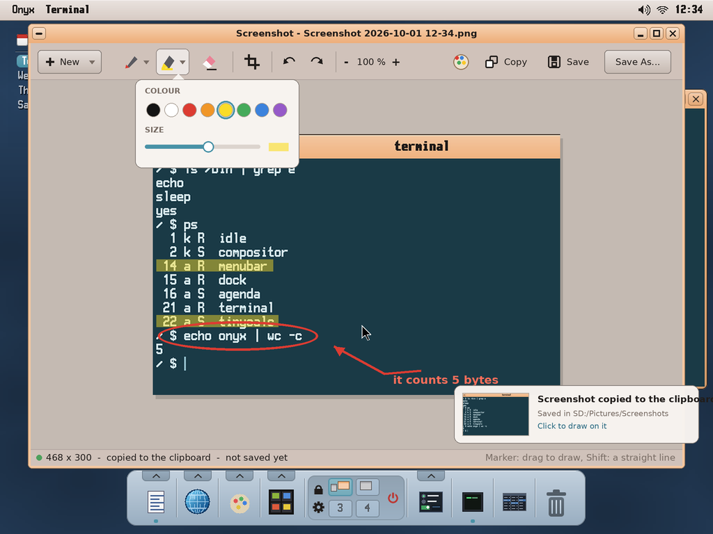

# Screenshot for Onyx — a screen capture tool (study, first mock-ups)

> **Status (2026-10-01): mock-ups, to be validated by the user.** Asked by the user: a screenshot tool
> "as Windows 10's" (Snip & Sketch): capture **the screen, a window or a region**, **with or without a
> delay**; then **draw on the capture with a marker**, **save** it and **copy it to the clipboard**.
> Name: **Screenshot** (app folder `screenshot`; the user's choice).

The mock-ups are made by `python3 tools/screenshot/mockup_screenshot.py` → `docs/screenshot/mockups/*.png`
(1024 × 768, the Pi's default screen; what is captured is the real desktop, `screenshots/desktop.png`;
the drawing helpers and the look are `mockup_archiver.py`'s).

| | |
|---|---|
|  | **The app's window.** *What*: **Region**, **Window** or **Screen**; *Delay*: none, 3, 5, 10 s; *Show the pointer*. **New capture** (its arrow: now, in 3 / 5 / 10 seconds, *Open a picture...* to draw on an existing image). The window hides itself during the capture. |
|  | **A region.** The screen **frozen** (grabbed first) and darkened, the region chosen bright, with its handles (it can be moved, resized, before Enter), its size, a **magnifier** at the pointer (the pixels enlarged, their coordinates). The bar on top switches the mode, the delay, closes. Enter: the whole screen; Esc: cancel. |
|  | **A window.** The window under the pointer lit, its name and size; a click takes it (its frame included, its rounded corners see-through), Tab goes to the next one. |
|  | **The delay.** A countdown (a ring, the seconds), so a menu or a tooltip can be opened before; Esc stops it. The countdown is gone from the screen before the grab. |
|  | **The editor**, once the capture is made: it is **copied to the clipboard at once** and a notification says so (a click on it opens the editor). Tools: **Pen** (opaque) and **Marker** (see-through, a highlighter) — each its colour (8) and size, **Shift** a straight line —, **Eraser** (a stroke at a time), **Crop**, **Undo / Redo**, the zoom. At the right: open it in **Paint**, **Copy** (again, with the drawings), **Save** (PNG, in `SD:/Pictures/Screenshots/Screenshot <date> <time>.png`), **Save As...** (PNG, JPEG, BMP). **New** starts another capture (its arrow: with a delay). |

## How it would be built — what Onyx has, what it lacks

| Need | Onyx today | To add |
|---|---|---|
| The screen's pixels | `kapi_screen_grab` (v38: the whole composite, as `vncd` uses it) | — |
| A window's pixels, where the windows are | `kapi_win_list` / `kapi_win_read` (v56, `rdpd`'s), `win_geometry` (v64) | — |
| The overlay over everything | a full-screen borderless window, `WIN_FLAG_TOPMOST` (or `fullscreen_begin`) showing the frozen grab | — |
| Drawing (pen, marker, crop) | wtk + `wtk/vpaint.h` (anti-aliased strokes), the canvas | — |
| Save PNG / JPEG / BMP | `img/pngsave.hpp` (`png_encode`, `jpeg_encode`, `bmp_encode`) | — |
| The notification | `notify.h` (`notifyd`) | a thumbnail in the bubble (optional) |
| **An image in the clipboard** | the kernel's clipboard holds one text or one path | the shared clipboard service (`docs/clipboard/README.md`): an image item |
| **The Print Screen key** | the keys go to the window in front | a global key: Print → Screenshot with the last options (the kernel hands the key to the menu bar, which starts the app) |

## Decided with the user (2026-10-01)

1. The name: **Screenshot**.
2. **Print Screen** starts the app and captures at once **with the last options** (the screen, a window
   or a region; the delay) — a global key: the kernel routes it to the menu bar, which launches
   `screenshot --now` (or tells the running one).
3. **The clipboard**: not the kernel's any more but a **shared clipboard service** reached by IPC,
   with a history of 10 items of any type (text, image, paths...) — its own study:
   [`docs/clipboard/README.md`](../clipboard/README.md). Screenshot copies its picture there as an
   **image** item.

## Still open

4. Every capture **saved automatically** in `SD:/Pictures/Screenshots`, or only on *Save*?
5. More tools in the editor: text, arrows, rectangles, a blur (to hide a password)?
