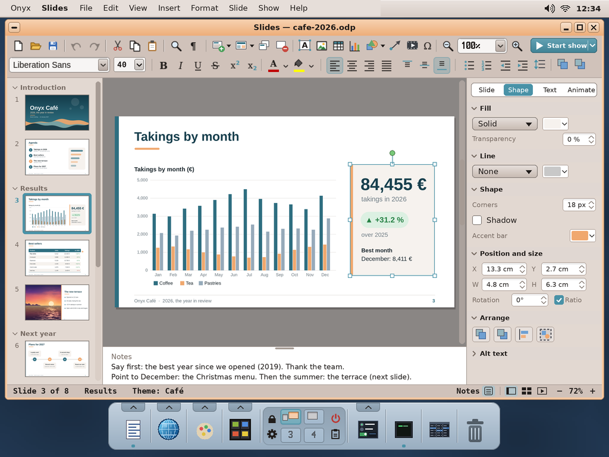
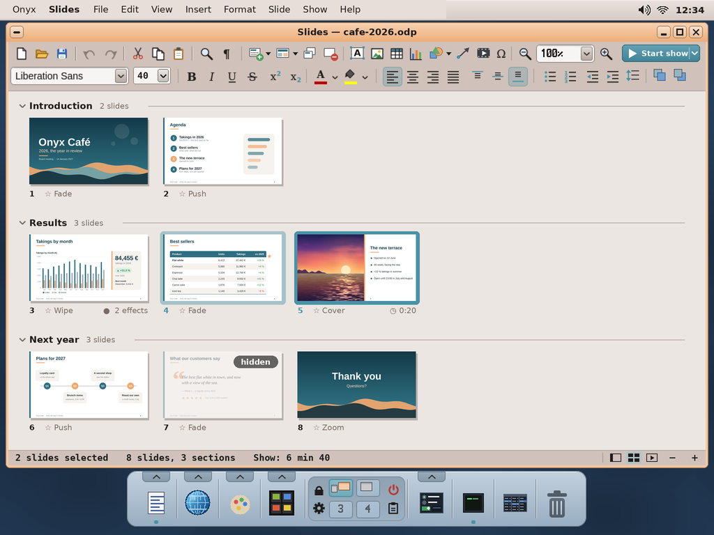
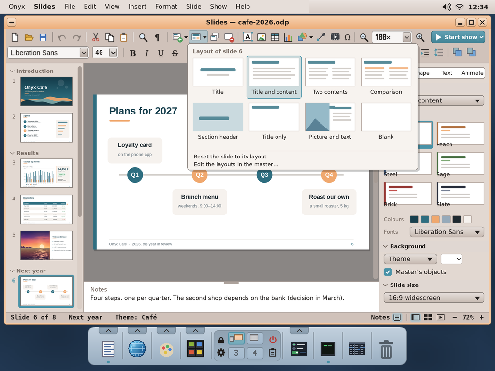
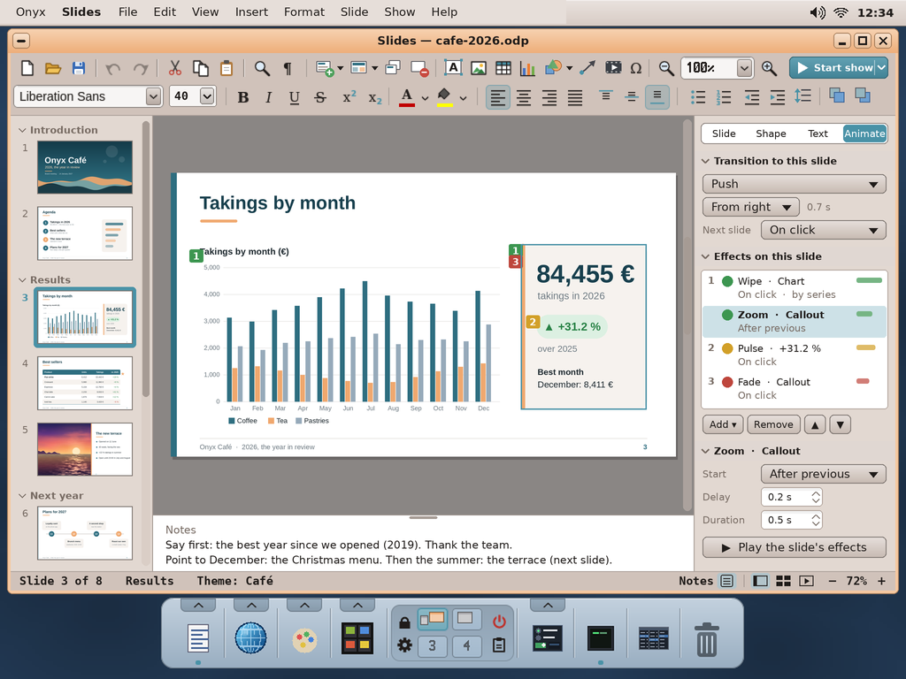
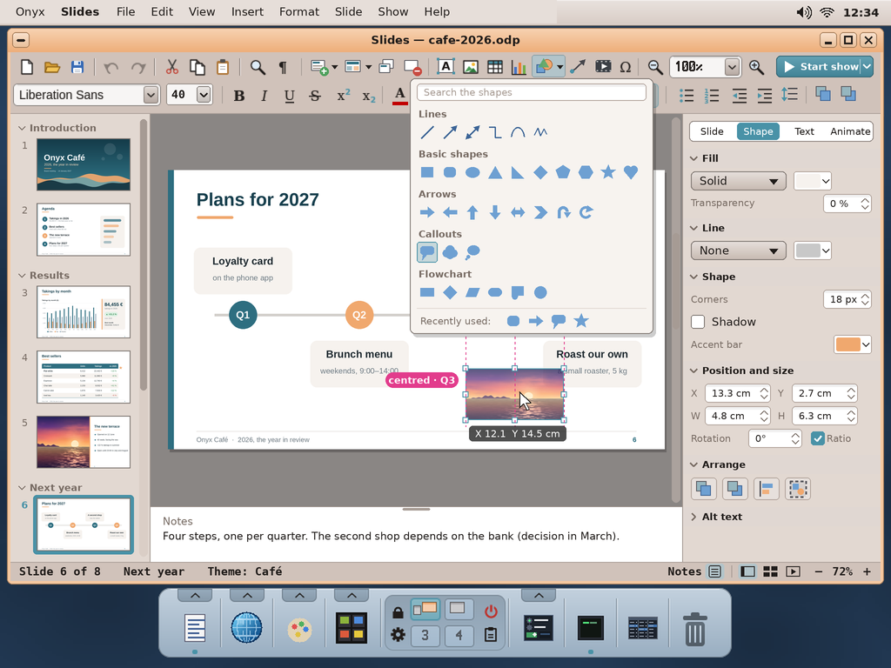
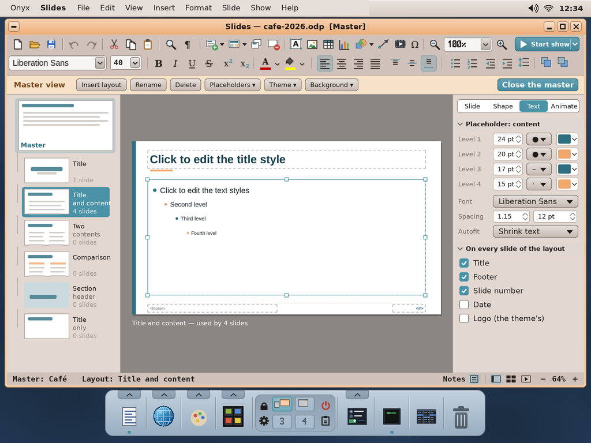
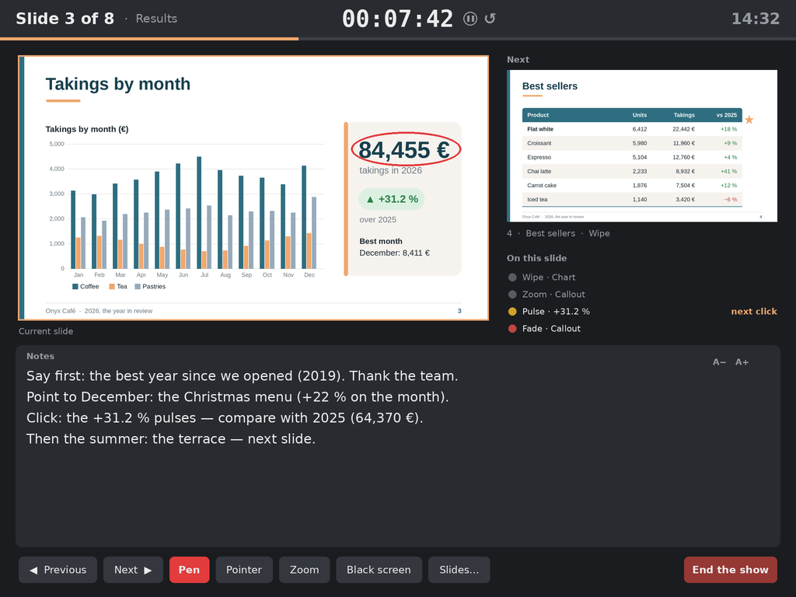

# Slides, the presentation program — study, first mock-ups

> **Status (2026-10-04): mock-ups, to be validated by the user.** Asked by the user (2026-10-04): a presentation
> program, "pro and fairly complete", in the same vein as Writer and Sheet (the third app of the office suite). Proposed
> name: **Slides** (app folder `slides`). Nothing is built yet.

The mock-ups are made by `python3 tools/screenshot/mockup_slides.py` → `docs/slides/mockups/slides-*.png` (1024 × 768,
the real desktop behind; the drawing helpers are `mockup_archiver.py`'s). **The toolbar icons Writer and Sheet already
have are cut from their real screenshots** (`screenshots/writer.png`, `sheet.png`), so the three apps read as one
suite; the new icons (a slide, a layout, a text box, the shapes, the show) are drawn in the same style. The deck shown,
*Onyx Café — 2026, the year in review*, uses Sheet's sample figures (`sdcard/docs/cafe-2026.xlsx`) and a picture of
`sdcard/docs/pictures`.

| | |
|---|---|
|  | **The normal view.** Writer's two toolbars, with the slide's own tools in them: New slide ▾ (with a layout), Layout ▾, Duplicate, Delete; Text box, Picture, Table, Chart, Shapes ▾, Connector, Media, Symbol; the zoom; **Start show** ▾ (from the beginning / from this slide / presenter view). The second row is Writer's text bar (font, size, B I U S, x² x₂, colours, alignment, Sheet's vertical alignment, lists, indents, line spacing) and Bring forward / Send backward. At the left the **slides** as thumbnails, grouped in **sections** (folded with the arrow); in the middle the slide on Writer's grey; under it the **speaker's notes** (the bar drags); at the right the **sidebar**: Slide · Shape · Text · Animate — here the callout selected: its fill, line, corners, the accent bar, position and size (cm), rotation, keep the ratio, arrange. The status bar: slide n of m, the section, the theme; Notes, the views (Normal, Sorter, Reading), the zoom. |
|  | **The slide sorter**: the whole deck by section (each folded or open, its count), each slide's transition and timing, its effects; slides dragged to reorder (between sections too), Ctrl / Shift to select several; a **hidden** slide (skipped by the show, kept in the file); the show's total time in the status bar. |
|  | **Layouts and themes.** Layout ▾ gives the master's eight layouts (Title, Title and content, Two contents, Comparison, Section header, Title only, Picture and text, Blank); a slide follows its layout's placeholders and can be **reset** to it. The sidebar's *Slide* tab: the layout, the **theme** (Café, and the desktop's five colour themes: Peach, Steel, Sage, Brick, Slate — a theme = 6 colours + 2 fonts + a master), the colours and fonts, the background (theme, colour, gradient, picture), the master's objects shown or not, the slide size (16:9, 4:3, A4). |
|  | **Animations and transitions** (the *Animate* tab). The transition *to* this slide (Fade, Push, Wipe, Cover, Zoom, Split, Dissolve…; its direction, its duration; next slide on click or after n s). The slide's **effects** in their order: entrance (green), emphasis (yellow), exit (red); each with its start (On click, With previous, After previous), delay, duration; the click numbers on the slide beside their objects (as PowerPoint); a chart wiped in **by series**, a list **by paragraph**; ▲ ▼ reorder; **Play** shows them in place. |
|  | **Shapes and smart guides.** Shapes ▾: a gallery with search — lines and arrows, basic shapes, block arrows, callouts, flowchart; the recently used ones. Any shape takes text. Dragging an object, **smart guides** snap it to the slide's centre and edges and to the other objects' edges and centres (magenta), with equal spacing shown; a tooltip gives its position; Alt moves it freely, the arrows nudge it (Ctrl: 1 px). |
|  | **The master** (View ▸ Master): the master slide and its layouts at the left (how many slides use each), the placeholders edited on the slide (title, content, footer, number, date), the text levels (size, bullet, colour), the font, spacing and **autofit** (shrink the text when it overflows), what every slide of a layout shows. Insert / rename / delete a layout; Close the master. |
|  | **The presenter's console**, on the screen when the slides go to a second display (the Pi 4 has two HDMI outputs; with one, it is View ▸ Rehearse): the current slide, the next one, the effects still to come on this slide, the notes in large type (A− A+), the timer (pause, restart), the clock, the show's progress; Previous / Next (arrows, Space, the wheel, a click), the **pen** (here a red ring drawn on the slide), the laser pointer, zoom into a part, a black screen (B), go to a slide (a number + Enter, or the thumbnails); End (Esc). |

## What makes it "pro" — the features

- **Slides**: layouts with placeholders, a master (several masters per deck allowed), sections, hidden slides,
  duplicate, reuse slides from another deck (Insert ▸ Slides from file…), headers and footers, slide numbers, date.
- **Objects**: text boxes (autofit, columns, vertical anchoring, margins), pictures (crop, rounded mask, borders,
  brightness / contrast — Paint's filters), **tables** (Writer's table engine: merge, borders, the theme's styles),
  **charts** (Sheet's chart engine, its data in a small sheet inside the deck, or pasted from Sheet), shapes with text,
  connectors that follow the shapes, symbols, media (a sound or a video, played by the media player's engine), links
  (to a slide, a file, a web page).
- **Arranging**: smart guides, the grid, rulers, align and distribute, group / ungroup, the stacking order, lock,
  rotate, flip; copy the formatting (the brush); the selection pane (every object of the slide by name, shown / hidden).
- **Text**: everything of Writer's character and paragraph formatting, lists (bullets, numbers, levels by Tab /
  Shift+Tab), the spelling (when Writer has it), find and replace across the deck.
- **The show**: transitions and effects, rehearse the timings, loop (a kiosk), the presenter's console, the pen and
  the pointer, a black / white screen, go to a slide; a custom show (a subset of the slides in another order).
- **Files**: `.odp` (OpenDocument, as Writer has `.odt` and Sheet `.ods`) and **`.pptx`** read and written; **PDF**
  export (Writer's PDF writer: a page per slide, or handouts with 2 / 3 / 6 slides, or notes pages); export a slide as
  PNG; print (when Onyx prints). A theme saved and loaded as an `.otp` template; `SD:/apps/slides.app/templates`.

## How it would be built (a first plan)

| Need | Onyx today | To add |
|---|---|---|
| The window, the toolbars, dialogs | wtk, Writer's toolbars and icons (`user/Apps/writer/icons.h`, shared by Sheet) | the new icons; the sidebar (shared later with Writer / Sheet) |
| Text in boxes | Writer's layout engine (`layout.h`: paragraphs, runs, lists), FreeType | text in a rectangle (no pages), autofit, vertical anchoring |
| Tables, charts | Writer's tables; Sheet's charts (`chart.h`) and its formulas | an embedded small sheet for a chart's data |
| Drawing | wtk's `vpaint.h` (anti-aliased paths) | shapes' geometry (OOXML's preset shapes, as needed), gradients, rounded picture masks |
| Files | Writer's `odt.h` / `docx.h`, Sheet's `ods.h` / `xlsx.h`, their XML and ZIP readers | `odp.h` (draw:page, presentation:*), `pptx.h` (p:sld, p:sldLayout, p:sldMaster, a:theme) |
| PDF | Writer's PDF export | a page per slide, handouts, notes pages |
| The show | full screen windows, the GPU compositor (`user/gpucomp`) | slides rendered to textures, transitions and effects composited by the GPU (cross-fade, push, wipe, zoom are a few quads and an alpha) |
| Two screens | — (the kernel drives one HDMI output) | a second display: a kernel task of its own; until then the console is View ▸ Rehearse on the one screen |

**Licence**: MIT, like Writer and Sheet (nothing copyleft linked).

## Open questions for the user

1. The name: **Slides**? (other ideas: *Show*, *Stage*, *Impress* is LibreOffice's.)
2. The native format: `.odp` (proposed: an open standard, and LibreOffice reads it) with `.pptx` read and written —
   or our own simpler format?

Decided by the user (2026-10-04): **a presentation program in the way of PowerPoint**, not desktop publishing (Publisher).
