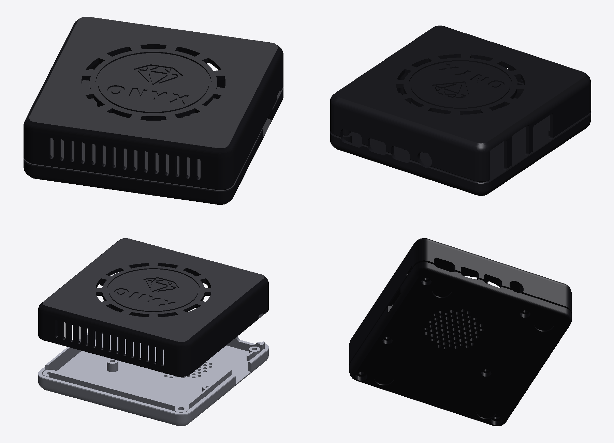

# The Onyx case — a Raspberry Pi 4 case

A two-part case for the **Raspberry Pi 4 Model B** (a **base** and a **cover**), its look borrowed from the
Mac mini (a soft rounded slab, the cables at the back and the sides, a round vented foot) and the GameCube
(the disc on the top, here a circular groove with the **Onyx mark** engraved inside — a cut gem and the
word ONYX — ringed with vents).

## Files

| File | What |
|---|---|
| `onyx_case_base.stl` | The base, in its printing position (its bottom on the bed). |
| `onyx_case_cover.stl` | The cover, in its printing position (upside down, its top on the bed). |
| `onyx_case_logo_inlay.stl` | The logo alone, placed to fill the engraving of the cover as printed: load it with the cover as one multi-part object for a two-colour print (gold, white...). |
| `onyx_case_assembled.stl` | The two parts closed, to look at (not to print). |
| `make_case.py` | The parametric generator (everything above): `pip install manifold3d trimesh numpy matplotlib`, then `python3 hardware/case/make_case.py`. |
| `render_preview.py` | The renderer of `preview.png`. |

Outside: **92 × 92 × 28.2 mm** — square: the board sits against three walls (its ports), the room behind it
takes the cover's own screws. Walls 2 mm, the top 2.2 mm.

## What it has

- **Ports** (the Pi's own sides): USB-C and the two micro-HDMI and the audio jack on one long side (openings
  wide enough for the plugs' overmoulds), the two USB stacks and Ethernet on the short side, the micro-SD
  card under the board on the other short side (a notch for the finger), a little window for the PWR/ACT LEDs.
- **Fixing, every screw from below** (counterbored heads, nothing shows on the top or the sides):
  - **the board**: four standoffs (5 mm, the board's M2.5 holes, 58 × 49 mm) in the base, four posts in the
    cover coming down onto the board at the same holes; **four M2.5 × 16 mm screws** (up to 20 mm) go through
    the base and the board into the posts (2.2 mm pilot holes: self-tapping, or tap them M2.5);
  - **the cover**: two 8 mm columns in the corners behind the board; **two M3 × 16 mm screws** go through the
    base into the cover (2.6 mm pilot holes: self-tapping M3, or tap them; for heat-set inserts, widen the
    pilot to 4.0 mm in `make_case.py`).
- **Vents**: twelve arc slots around the disc on the top (the SoC lies beneath), a round grille in the
  bottom, vertical slots in the front.
- **Registration**: a lip on the base (the back and the SD side) slides into the cover; a shadow line
  where the halves meet. Four 10 mm recesses under the base for rubber feet.
- `GPIO_SLOT = True` in `make_case.py` opens a slot over the GPIO header (for a ribbon cable).

## Printing

PLA or PETG, 0.2 mm layers, 0.4 mm nozzle, 3 walls, 15–20 % infill, **no supports** (the edges that face
the bed are rounded down to a 45° chamfer; the cover prints top down). The logo and the groove are engraved
0.6 mm deep in the top: printed plain, they show by the light, or fill them with paint; with a
multi-material printer, add the inlay to the cover.

## Licence

MIT (the Onyx project's). The word ONYX is drawn from DejaVu Sans Bold (Bitstream Vera licence), turned into
geometry.
