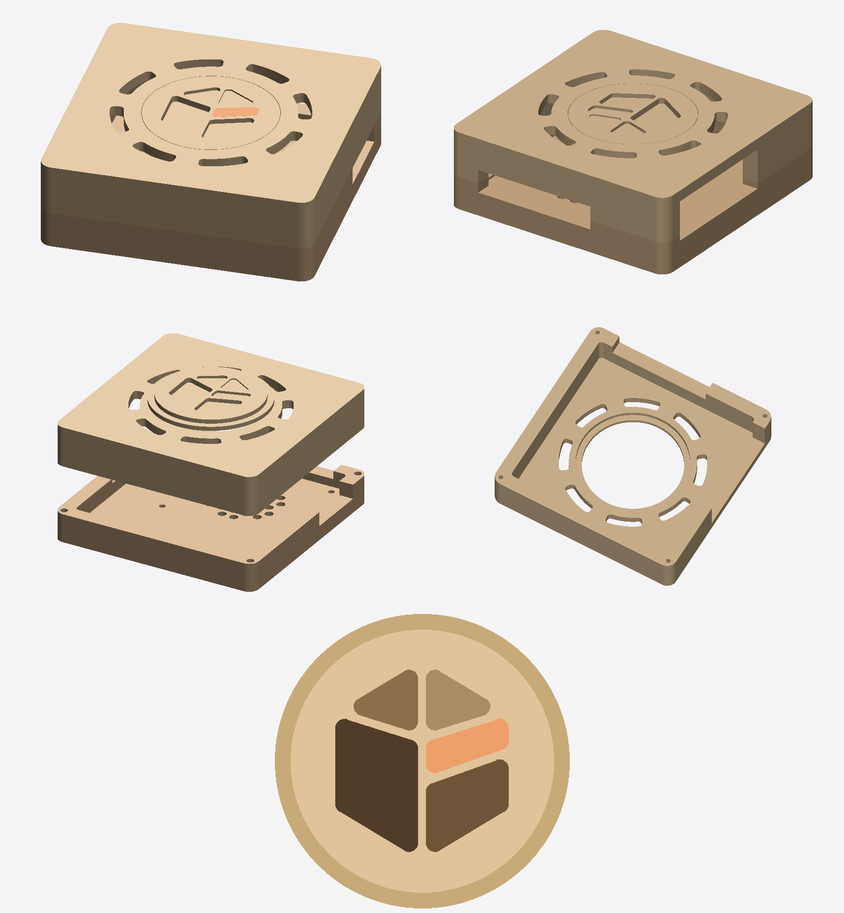

# The Onyx case in maple — for a CNC router

The square case of `../` redrawn for **solid maple** and a **3-axis CNC router**: a 1/8" (3.175 mm) flat end
mill with **20 mm of cutting length**, every part machined from **one face only**.

## The parts

| File | What | Stock | Machined from |
|---|---|---|---|
| `wood_cover.stl` | The cover: 102 × 102 × 19.5 mm, walls 7 mm, top 4 mm; the pocket 15.5 mm deep. | maple, 20 mm | its open side (the STL lies so): the top face stays on the spoilboard |
| `wood_tray.stl` | The base, a tray: 102 × 102 × 14 mm, floor 6 mm; the pocket 8 mm deep. | maple, 15–20 mm | its open side |
| `wood_disc.stl` | The Onyx gem on a disc Ø50 mm with a Ø56 × 2 mm shoulder, 4 mm thick: glued from inside into the cover's top, flush. | maple (or a darker wood), 4–6 mm | its visible face |
| `wood_assembled.stl` | The case closed, to look at. | | |

`make_case_wood.py` builds them (`pip install manifold3d trimesh numpy`, it uses `../make_case.py`); every
measure is a parameter at its top.

## Why it looks the way it does

- **One face**: nothing is undercut. The ports are **notches open at the rims**; the vents and the disc's hole
  are cut through from inside; the disc's shoulder is a counterbore from inside, the disc's step is cut from
  its face. The cover's top face is the board's own face (sand it, round its edges by hand or with a
  round-over bit, 3 mm).
- **The 1/8" bit**: no inside corner under 2 mm of radius; every pocket is reachable by the bit (the gem's
  facets have rounded corners).
- **20 mm of cutting length**: the case is split at 14 mm, so that neither part is taller than 20 mm.
- **Maple splits along its grain where it is thin**: no ribs between ports — **one bay per side** (USB-C, HDMI
  and audio; USB and Ethernet) under a lintel; walls 7 mm, the top 4 mm; 8 vents around the disc, 5 mm wide,
  wide bridges between them. **Take the grain along the side with the HDMI ports** (x).
- **The gem**: its four facets pocketed at four depths (0.6 / 1.2 / 1.8 / 2.4 mm — the darker on the web
  site, the deeper), 1.6 mm of wood left between them; the **peach facet** 1.2 mm deep, to fill with
  orange-tinted epoxy (or paint) and sand flush. Glue the disc with its gem's tip towards the plain face of
  the case (its front).

## Assembly

- **The board**: four **M2.5 × 5 mm brass standoffs, female–female**, on the tray's floor, held by **M2.5 ×
  10 mm** screws from below; the board on top, **M2.5 × 5 mm** screws.
- **The cover**: four **3.0 × 25 mm wood screws** (Spax-like) from below, up the corners of the tray's walls
  into the cover's (2.2 mm pilot holes: drill them, the bit cannot).
- The screws' heads stay under the tray (a counterbore cannot be cut from its open side): stick four
  **rubber feet at least 4 mm high** under it.
- The holes under 3.3 mm (the screws, the pilots) are to drill — the 1/8" bit cannot cut them.

## Finish

Sand to 240, a hard-wax oil (it also brings out the facets); a heatsink on the SoC is a good idea in a
wooden case — the air enters by the grille under the board and leaves by the ring around the disc.

MIT (the Onyx project's).
