# Koton — User Manual

*A music studio that thinks in harmony, on Onyx*

Edition of September 2026, for Koton as shipped with Onyx. The pictures show the demo song that comes with
Koton, `SD:/koton/songs/demo.kson`: a bossa in F♯ minor at 108 beats a minute.

## Contents

- [1. Introduction](#1-introduction)
- [2. Getting started](#2-getting-started)
- [3. The window](#3-the-window)
- [4. The song: key, meter, tempo](#4-the-song-key-meter-tempo)
- [5. Tracks](#5-tracks)
- [6. Blocks on the arrangement](#6-blocks-on-the-arrangement)
- [7. The chord track](#7-the-chord-track)
- [8. Accompaniments](#8-accompaniments)
- [9. Riffs: the piano roll](#9-riffs-the-piano-roll)
- [10. Drums](#10-drums)
- [11. Melodic lines](#11-melodic-lines)
- [12. Polyrhythms: the rings](#12-polyrhythms-the-rings)
- [13. Drawing in a grid](#13-drawing-in-a-grid)
- [14. Listening and playing](#14-listening-and-playing)
- [15. The sound: SoundFont, sound chain, plugins](#15-the-sound-soundfont-sound-chain-plugins)
- [16. Compose with AI](#16-compose-with-ai)
- [17. Files and export](#17-files-and-export)
- [18. Questions and answers](#18-questions-and-answers)
- [19. Glossary](#19-glossary)
- [Appendix A. Keyboard reference](#appendix-a-keyboard-reference)
- [Appendix B. The chord qualities and colours](#appendix-b-the-chord-qualities-and-colours)
- [Appendix C. The accompaniment styles](#appendix-c-the-accompaniment-styles)
- [Appendix D. The plugins](#appendix-d-the-plugins)

## 1. Introduction

### 1.1 What Koton does

Koton is a music studio — a *DAW* — for Onyx. It is **Koton Studio**, a DAW for Windows, made again for
Onyx, and it works in the same way: **you think in harmony first**.

A song is a set of **tracks**, and a track is a row of **blocks**. A block is not a list of notes typed one
by one: it is a small **generator** that makes its notes — a chord, an accompaniment that plays the
chords, a melodic line, a drum groove, euclidean rings. At the bottom of every song is the **chord
track**: it is silent, it only holds the harmony, and every other part reads it. Change a chord there and
the accompaniment, the bass and the melody follow.

With Koton you can:

- write a **chord progression** by **degrees** (I, IV, V, vi…) that follow the key when you change it,
  with a **co-pilot** that suggests the next chord, 30 kinds of **cadences**, secondary dominants, and
  voice leading;
- have it **accompanied** in one of 28 styles — block chords, arpeggios, Alberti, jazz comping, bossa,
  reggae, waltz, funk, harp… — or in a pattern you draw on the chord's voices;
- add **melodic lines** whose rhythm you draw while Koton picks the pitches from the harmony, or
  **riffs** you write on a piano roll that shows the chord under every note;
- add **drums** from a catalog or drawn on the 47 General MIDI percussion sounds, and **polyrhythms**
  as euclidean rings;
- play it all with a **SoundFont** synthesizer, one per track, computed on the Pi's third core, and add
  **plugins**: instruments, effects and generators that run as programs of their own;
- ask an **AI** (Gemini and others) to compose a whole piece, a new part or drums over your song;
- open the songs of **Koton Studio for Windows** (`.sq`), save yours as **`.kson`**, export a **WAV** file,
  and play or write with a **USB MIDI keyboard**.

There is no score (staff notation) view in this edition.

### 1.2 What you need

- An Onyx Pi with **headphones or speakers** on the 3.5 mm jack.
- The **SoundFont** shipped on the card (`SD:/koton/soundfonts/GeneralUser-GS.sf2`, 32 MB). Koton loads it
  when it starts: it takes a few seconds.
- For the AI: the **network** up (see the Onyx User Guide) and an **API key** from a provider — Gemini's
  are free at `aistudio.google.com`.
- Optional: a **USB MIDI keyboard** (any class-compliant one), plugged in before or while Koton runs.
- **On Windows** (10 or 11): the same Koton, in the folder `Koton` (`pc/dist/Koton` of the Onyx
  repository) — run `Koton.exe`. The folder is its card: `SD:/` in this manual is that folder. Its menus
  are the window's menu bar; the sound goes to Windows' default output; every MIDI input plays.

## 2. Getting started

### 2.1 Opening Koton

Open **Koton** from the dock's *Productivity* drawer, or double-click a `.kson` or `.sq` file in the File
Viewer: Koton opens with it. The window fills the screen; the status bar at the bottom says where the
sound engine runs — **Engine on core 2** is what you want to see.

Koton starts with an empty song of five tracks: *Melody*, *Accompaniment*, *Bass*, *Drums* and the
*Chords* track. To look at the demo, choose **File ▸ Open…** and open `SD:/koton/songs/demo.kson`, then
press **Space**: it plays.

### 2.2 Your first song in ten minutes

1. **The key.** Click **Key** in the transport bar, choose a key (for example *A*, *Natural minor
   (Aeolian)*) and a tempo, then **OK**.
2. **The chords.** In the browser on the right, click **Chord**: a first chord appears on the chord
   track (the tonic). Click the chord: its editor opens at the bottom. In **Suggest the next chord**,
   click one of the cards: that chord is added after. Or click **Chain 4 bars**: the co-pilot writes four
   more. Or **Cadence…**: pick a style (*Pop (I-V-vi-IV)*, *Jazz (ii - V - I)*…) and a number of bars.
3. **The accompaniment.** Click the *Accompaniment* track's header, then **Accompaniment** in the
   browser: a block appears. Drag its right edge to cover all your chords. In its editor, choose a
   **Style** — *Bossa nova / Latin*, *Arpeggio up*, *Waltz*…
4. **The bass.** Select the *Bass* track and add an **Accompaniment** there too, with the style
   *Pop (bass + chord)* and **Octave** 2, or tick **Bass** and choose a light style.
5. **The drums.** Click **Drum pattern** in the browser; in its editor choose a **Category** and a
   **Motif**.
6. **The melody.** Select the *Melody* track and click **Melodic line**: Koton plays a line over your
   chords. Change its **Contour**, or draw its rhythm again in the grid.
7. **Listen.** Press **Space**. Press it again to stop.
8. **Save.** **File ▸ Save** (`Ctrl+S`): choose a name; the song goes in `SD:/koton/songs`.

> **Tip.** Every block has a **Listen** button in its editor: it plays that block alone, looping, while
> you change it.

## 3. The window

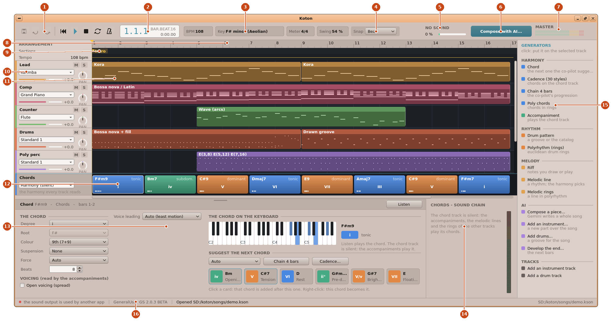
*The window with the demo song, the first chord selected.*

1. **Save, Undo, Redo** — then the transport: back to the start, **Play / Stop**, Stop, **Loop**, the
   **metronome**.
2. **The position**: bar.beat.sixteenth, and the time from the start.
3. **The song**: its tempo (**BPM**), **Key**, **Meter** and **Swing**. A click on any of them opens the
   song's settings (section 4).
4. **Snap**: how blocks snap when you move or stretch them — to the bar, the beat, the half or quarter
   beat, or not at all.
5. **The engine**: where it runs (*CORE 2 — DSP* at best) and how busy it is.
6. **Compose with AI…** (section 16).
7. **The master level**: the left and right channels.
8. **The ruler**: a click puts the play cursor there; a drag makes a loop.
9. **Sections**: named markers (*Intro*, *Verse*…); **Tempo** below shows the song's tempo.
10. **A track's header**: its name, mute and solo, its sound, its volume and pan (section 5).
11. **A block**: its name, and a picture of the notes it plays.
12. **The chord track**: each chord's name, its degree in roman numerals and its **function** — tonic
    (blue), subdominant (green), dominant (orange).
13. **The editor** of the selected block. Drag the small grip at its top edge to make it taller.
14. **The sound chain** of the selected track: its instrument, its effects, its reverb, its level.
15. **The browser**: what you can put in the song.
16. **The status bar**: the engine, the latency, the voices playing, the SoundFont, the last message and
    the file (*modified* when it has unsaved changes).

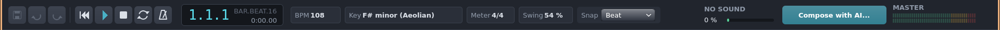
*The transport bar.*

The **menus** are in Onyx's menu bar at the top of the screen: **File**, **Edit**, **Song**, **Track**,
**Transport**, **View** and **AI**.

## 4. The song: key, meter, tempo

Click **BPM**, **Key**, **Meter** or **Swing** in the transport bar, or choose **Song ▸ Key, meter,
tempo…** (`Ctrl+K`).

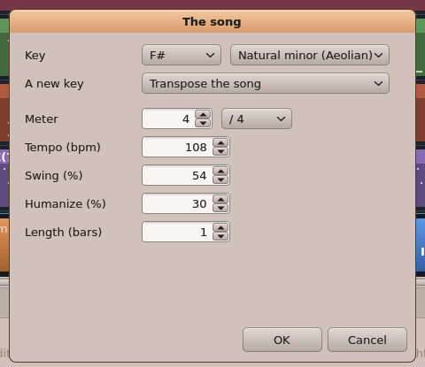
*The song's settings.*

- **Key**: the tonic (C, C♯, D♭ … B) and the **mode**: *Major (Ionian)*, *Natural minor (Aeolian)*,
  *Harmonic minor*, *Melodic minor*, *Dorian*, *Phrygian*, *Lydian*, *Mixolydian*, *Locrian*.
- **A new key**: what happens to the song when you change the key:
  - **Transpose the song** — everything moves: the riffs' notes, the chords. A song in C major becomes
    the same song in D major; a change of mode (major → minor) also turns the scale's third, sixth and
    seventh.
  - **Chords follow their degrees** — only the chords change: a chord written as *IV* stays the fourth
    degree of the new key. Use it to try your progression in another mode.
- **Meter**: beats a bar and the note value (`4/4`, `3/4`, `6/8`…). In `6/8` and other compound meters, the
  arpeggios divide the beat in three.
- **Tempo (bpm)**: from 20 to 400.
- **Swing (%)**: 50 is straight; 66 is a triplet swing; up to 75.
- **Humanize (%)**: small random shifts of timing and loudness, as a player would make.
- **Length (bars)**: the song's minimum length (it is longer when its blocks go further).

## 5. Tracks

### 5.1 The header

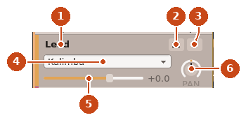
*A track's header.*

1. **The name**. Double-click the header's empty part to rename the track.
2. **M**: mute the track.
3. **S**: solo — only the soloed tracks are heard.
4. **The sound**: a click opens the instrument (or drum kit) chooser.
5. **The volume**: drag the bar; the number is in decibels.
6. **The pan**: drag the knob up or down — left, centre, right.

The chord track's header has no sound (it is silent): a click on it opens **Cadence…**.

### 5.2 Choosing a sound

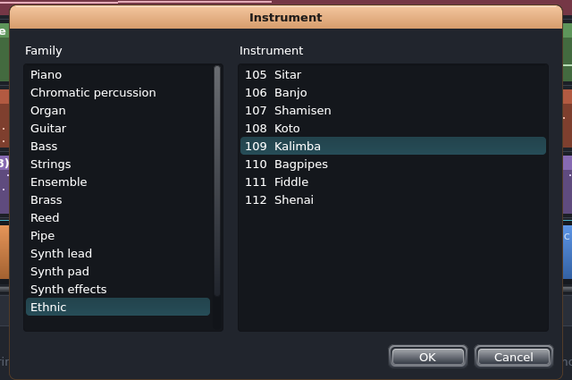
*Choosing an instrument: the families of General MIDI on the left.*

For an instrument track, pick a **family** (piano, organ, guitar, bass, strings, brass, synth…) on the
left, then an **instrument** on the right: Koton plays a short phrase with it each time you pick one.
**OK** keeps it. A drum track lists the SoundFont's **drum kits**, as the SoundFont names them. When plugins are installed, the family **Plugin instruments** lists them (section 15.4).

### 5.3 The track menu

Right-click a track's header:

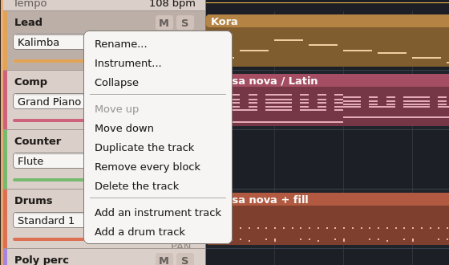
*The track menu.*

- **Rename…**, **Instrument…** (or **Drum kit…**), **Collapse** / **Expand** (a thin track).
- **Move up**, **Move down** — the chord track always stays at the bottom.
- **Duplicate the track** — with copies of its riffs.
- **Remove every block**, **Delete the track**.
- **Add an instrument track**, **Add a drum track** — also in the **Track** menu and the browser.

## 6. Blocks on the arrangement

### 6.1 Putting a block

There are three ways:

- **The browser**: click a generator (**Chord**, **Accompaniment**, **Drum pattern**, **Riff**,
  **Melodic line**…). It goes on the selected track — or on the first track of the right kind: chords on
  the chord track, drums on a drum track —, at the play cursor if that place is free, else after the
  track's last block.
- **A double-click** on an empty place of a lane: a block of the track's usual kind (the same as its last
  block; a riff on a new instrument track, drums on a drum track, a chord on the chord track).
- **A right-click** on a lane: a menu of what can go there.

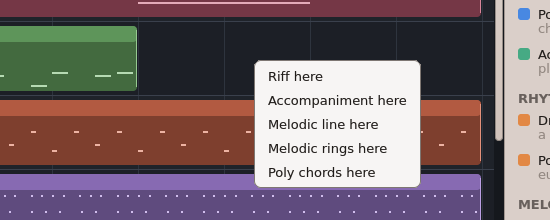
*The menu of an instrument track's lane.*

On an instrument track: *Riff*, *Accompaniment*, *Melodic line*, *Melodic rings*, *Poly chords*. On a drum
track: *Drums*, *Polyrhythm*. On the chord track: *A chord*, *Cadence…*, *Chain 4 bars after it*, *Poly
chords*. Right-clicking a block also offers **Freeze into a riff**, **Duplicate** and **Delete**.

### 6.2 Moving, stretching, deleting

- **Click** a block to select it: its editor opens at the bottom.
- **Drag** it to move it. It stays between its neighbours, snapped as **Snap** says.
- **Drag its right edge** to make it longer or shorter. What the length means depends on the block: a
  chord lasts longer, an accompaniment covers more chords, a drum block repeats its bar more times, a
  riff gets more room.
- `Del` deletes the selected block, `Ctrl+D` duplicates it right after, `←` / `→` select its neighbours.
- **Undo** (`Ctrl+Z`) and **Redo** (`Ctrl+Y`) remember the last 40 changes.

> **Note.** Blocks keep their place relative to each other: the gap before a block is part of it. When
> you delete a block, the next ones do not move.

### 6.3 Freezing a block into a riff

**Freeze into a riff** (right-click the block) turns any generator into an ordinary riff with the notes it
plays now. Do it when you want to change notes by hand. The riff no longer follows the chords.

### 6.4 Sections, loop, zoom

- **Sections**: double-click the *Sections* row to add a named marker (*Chorus*…); double-click a marker
  to rename it, or empty its name to remove it.
- **Loop**: drag across the ruler, or press the **Loop** button (`Ctrl+L`): without a loop yet, it loops
  the selected block, or the first four bars. Right-click the ruler to turn the loop on or off.
- **Scroll and zoom**: the mouse wheel scrolls the tracks, `Shift`+wheel scrolls in time, `Ctrl`+wheel
  zooms (also **View ▸ Zoom in / out**).

## 7. The chord track

### 7.1 Chords by degree

Every chord of the chord track has a **degree** in the key: *i* is the tonic of a minor key, *V* its
dominant… Koton writes major-third degrees in capitals (I, IV, V) and minor ones in small letters (ii,
iii, vi). A chord locked to its degree follows the key: in C major, *IV* is F; if the song moves to D, it
becomes G.

Each chord block is coloured by its **function**: **tonic** (blue — rest), **subdominant** (green — moving
away), **dominant** (orange — tension that wants to resolve).

### 7.2 The chord editor

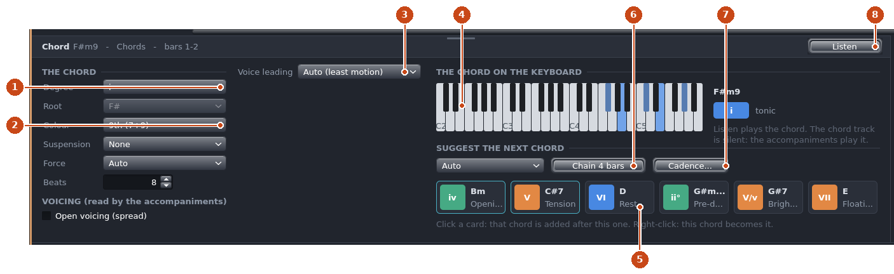
*The chord editor.*

1. **Degree**: *I* … *VII*, the **secondary dominants** *V/ii* … *V/vi* (the dominant of another degree,
   with its seventh), or **Manual (fixed chord)** — then choose its **Root** freely.
2. **Colour**: *Triad*, *Sixth*, *7th*, *9th (7+9)*, *9th (add9)*; **Suspension**: *Sus2*, *Sus4*;
   **Force**: a quality forced — *Major*, *Minor*, *Augmented*, *Diminished*, *Dominant*. **Beats**: how
   long it lasts.
3. **Voicing**: what the chord asks of the accompaniments that play it — **Open voicing** (the notes
   spread), and the **Voice leading**: *Auto (least motion)* moves the voices as little as possible from
   the previous chord; *Close at the top* keeps the top note near; *Close to the bass* keeps the bass
   near; *None* plays it in root position; *Fixed inversion* lets you choose it.
4. **The chord on a keyboard**, its name, its degree and its function.
5. **Suggest the next chord**: the co-pilot's cards — the chords that follow this one well, knowing the
   last two or three and where the phrase is (a phrase ending wants a cadence). A card shows the degree,
   the chord and its effect (*Rest*, *Tension*, *Opening*…); the best ones are outlined. **Click a card:
   that chord is added after this one. Right-click: this chord becomes it.** The list above the cards
   chooses a **mood**: *Joyful*, *Serene*, *Melancholic*, *Nostalgic*, *Epic*, *Bright*, *Jazzy*.
6. **Chain 4 bars**: the co-pilot's best choice, four times.
7. **Cadence…** (next section).
8. **Listen**: the chord, held.

### 7.3 Cadences

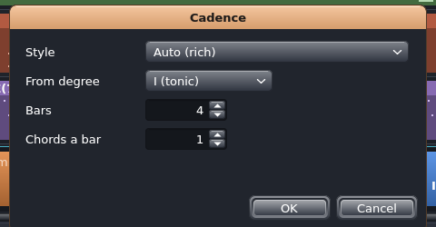
*A cadence.*

**Cadence…** (the chord editor, the **Song** menu, the browser, the chord track's header) writes a whole
progression at the end of the chord track:

- **Style**: 30 of them — *Auto (rich)*, *Authentic (V - I)*, *Plagal (IV - I)*, *Jazz (ii - V - I)*,
  *Turnaround (I-vi-ii-V)*, *Pop (I-V-vi-IV)*, *Doo-wop*, *EDM*, *Royal road*, *Pachelbel (canon)*, *Circle of
  fifths*, *Blues*, *Minor blues*, *Andalusian*, *Phrygian / Spanish*…
- **From degree**: where it starts (by default, the degree of the chord track's last chord).
- **Bars** and **Chords a bar**.

Each time is a new variant: run it again if you do not like it (and **Undo** the one before).

### 7.4 Polyrhythmic chords on the chord track

A **Poly chords** block can also sit on the chord track: it then gives the harmony for its length. See
section 12.3.

## 8. Accompaniments

An **accompaniment** block plays **the chord track's chords, whatever they are**, in a style. It holds no
chord itself: stretch it over as many chords as you like, and when a chord changes, it follows.

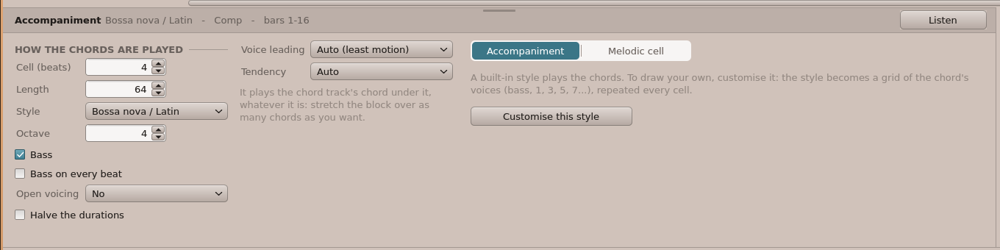
*An accompaniment in the Bossa nova / Latin style.*

On the left:

- **Cell (beats)**: the pattern's length, repeated all along (4 in 4/4: one bar).
- **Length**: the whole block, in beats.
- **Style**: one of the 28 styles (appendix C), **Custom (drawn)**, or one of the styles you saved in this
  song.
- **Octave**: where the chord sits (4: around middle C).
- **Bass**, **Bass on every beat**: the chord's root added below.
- **Open voicing**: *No*, *Yes*, or *As the chord says* (its *Open voicing*).
- **Halve the durations**: arpeggios twice as fast.
- **Voice leading**: *Auto (least motion)*, *Close at the top*, *Close to the bass*, *As the chord says*, or
  *None (fixed inversion)* — then an **Inversion**. With voice leading, **Tendency** breaks ties: *Rising*
  or *Falling*.

### 8.1 Drawing your own accompaniment

Click **Customise this style**: the style becomes a **grid of the chord's voices** you can change.

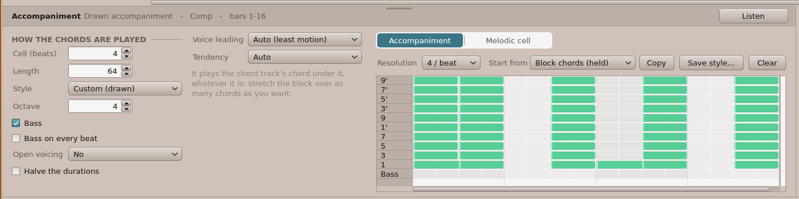
*The grid of the chord's voices.*

The rows are the voices of the chord, from low to high: **Bass**, **1** (the root), **3**, **5**, **7**,
**1'** (the root an octave up), **9**, **3'**, **5'**, **7'**, **9'**. A voice the chord lacks (a 7 on a
triad) plays the chord's nearest tone. The grid is the **cell**, repeated. Draw it as in section 13.

Above the grid:

- **Resolution**: how many columns a beat has (4: sixteenths; 3 or 6: triplets).
- **Start from** a style, **Copy**: the grid made from that style — then change it.
- **Save style…**: keep it under a name; it appears at the end of the **Style** list of every
  accompaniment of the song. **Apply to all**: every accompaniment using that style gets this grid.
- **Clear**.

### 8.2 The melodic cell

The **Melodic cell** tab adds a second voice over the chords, drawn on the **degrees of the key**: rows
*1* to *7''* (three octaves). Its **Octave** and where **degree 1** is (*Chord's root* or *Inversion's
bass*). As the chords change, the cell moves with them.

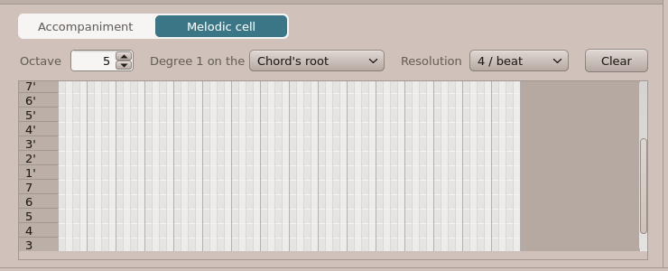
*The melodic cell tab.*

## 9. Riffs: the piano roll

A **riff** holds real notes. Its editor is a piano roll that knows the harmony.

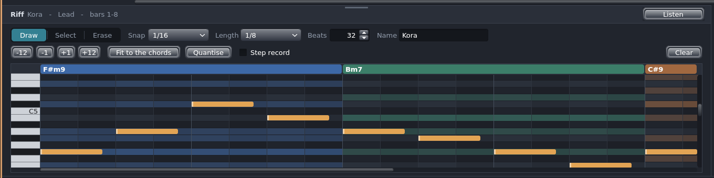
*A riff over F♯m9: its first note, F♯4; the chord's tones tinted.*

- Above the notes, **the chords** under the riff. In the rows, **the chord's tones are shaded** in its
  function's colour (the root stronger), the **key's scale** is lighter than the notes outside it: you see
  at once which notes "belong".
- The grid looks as in Koton Studio for Windows: a **square pad per slice** (26 pixels), the first slice
  of each beat lighter, the **C** rows lighter and the black keys' darker, every row named on the left, the
  notes in teal. The editor opens on the riff's **first note**; `Shift`+wheel or the bar at the bottom
  moves in time, `Ctrl`+wheel makes the pads narrower or wider.
- **Draw**, **Select**, **Erase**: the tool. (A right-click always erases.)
- **Snap**: where notes start — *Bar* … *1/32*, the triplets, *Off*. **Length**: the length of a new note.
- **Beats**: the riff's length. **Name**: type it and press `Enter`.
- **−12**, **−1**, **+1**, **+12**: transpose the selected notes, or all of them, by an octave or a
  semitone.
- **Fit to the chords**: every note moves to the nearest tone of the chord under it.
- **Quantise**: the notes' starts put on the snap.
- **Step record**: see section 14.4.
- **Clear**.

Click a key of the keyboard on the left to hear the note. See section 13 for drawing.

> **Note.** A riff can be played by several blocks (after a **Duplicate** of the block, the copy has its
> own riff; a riff opened from a Koton `.sq` may be shared). Changing its notes changes every block that
> plays it.

## 10. Drums

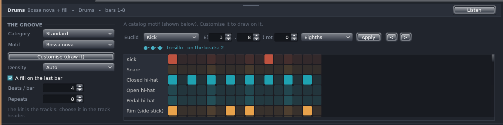
*A drum block with a motif from the catalog.*

- **Category** and **Motif**: the **catalog** — *Standard* (rock, pop, funk, disco, jazz swing, shuffle,
  bossa nova, half-time, hip-hop, march, reggae, waltz, punk, ballad, trap…), *Africa*, *Australia* — and
  **Custom (drawn)** with the motifs you saved.
- **Customise (draw it)**: the motif copied into a grid you can change (below).
- **Density** (*Light*, *Normal*, *Dense*) and **A fill on the last bar**: for a new block's built-in
  groove, before a motif is chosen.
- **Beats / bar** and **Repeats**: the bar's length and how many times it plays.

The drum kit is the **track's**: choose it in the track's header.

### 10.1 A drawn groove

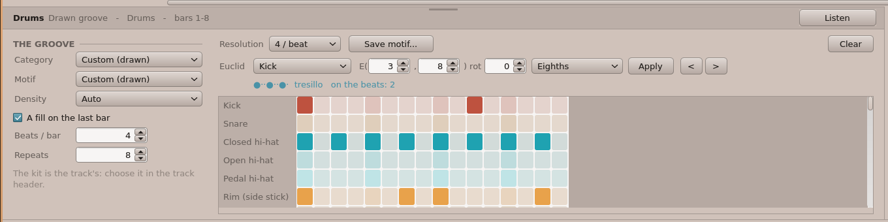
*A customised groove: one row per percussion sound.*

The rows are the 47 General MIDI percussion sounds — kick, snare, hi-hats, toms, cymbals, then the Latin
percussion —, coloured by family. The grid looks as in Koton Studio for Windows: **a square pad per step**,
in its row's colour (dark when empty, the beat's first step lighter; bright when it plays). **A click puts
a hit, a click on a hit removes it.** **Customise** draws the groove on the coarsest grid that keeps every
hit in its place — 4 steps a beat for a groove of sixteenths; **Resolution** changes it (24 / beat for the
finest placing). **Save motif…** (it then appears under *Custom (drawn)*), **Clear**.

### 10.2 Euclidean rhythms

The **Euclid** row writes a **euclidean rhythm** on one sound: *k* hits spread as evenly as possible over
*n* steps — E(3,8) is the *tresillo*, E(5,8) the *cinquillo*. Choose the sound, **E(** hits **,** steps
**)**, a **rot**ation and the step (*Eighths*, *Sixteenths*, *Eighth triplets*), then **Apply**. The line
under it shows the pattern (● a hit, · a rest), its name when it has one, and how many hits fall **on the
beats**. **<** and **>** shift that sound's hits a step earlier or later.

## 11. Melodic lines

A **melodic line** is a melody of which **you draw only the rhythm**: Koton chooses the pitches from the
harmony — a chord tone on the strong beats, passing tones between, a shape you choose.

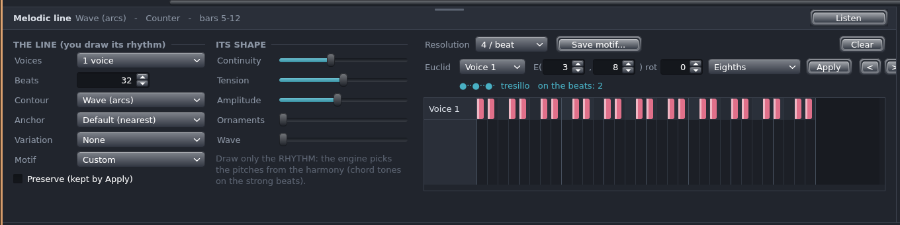
*A melodic line.*

- **Voices**: one to three voices, each a row of the grid.
- **Beats**: the line's length.
- **Contour**: the shape — *Wave (arcs)*, *Rising*, *Falling*, *Static (pivot)*, *Zigzag*, *Random*,
  *Thue-Morse*, *L-system*, *Fractal (1/f)*.
- **Anchor**: the first note — the nearest, or the chord's root, third, fifth, seventh, ninth.
- **Variation**: *Split (cut the long notes)*, *Gate (aerate)*, *Retrograde*, *Mirror (inversion)*.
- **Motif**: a rhythm you saved (**Save motif…**) or *Custom*. **Apply to the lines with this motif**
  gives this rhythm to every line of the song that uses it, except those marked **Preserve**.
- **Its shape**: **Continuity** (smooth voice leading from one block to the next), **Tension** (the
  register rising or falling, in semitones), **Amplitude** (the range, in semitones), **Ornaments**
  (appoggiaturas, delays), **Wave** (notes per arc; 0: automatic).
- The **Euclid** row, as for drums (section 10.2), for one voice.

## 12. Polyrhythms: the rings

Three kinds of blocks stack **rings**: each ring is a euclidean rhythm E(hits, steps) turning over the
same **cycle**. Rings of different lengths — 3 against 4, 5 against 8 — make a polyrhythm that meets again
at the end of the cycle.

### 12.1 Drum rings (Polyrhythm)

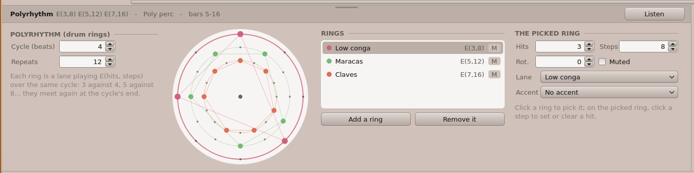
*Three rings: E(3,8), E(5,12), E(7,16).*

- **Cycle (beats)** and **Repeats**.
- **The wheel**: the rings, the outer one first. **Click a ring to pick it; on the picked ring, click a
  step to set or clear a hit** — the ring is then *drawn*; changing its hits, steps or rotation makes it
  euclidean again. While the song plays, a hand turns with it.
- **Rings**: the list, each with its pattern; **M** mutes it. **Add a ring**, **Remove it**.
- **The picked ring**: **Hits**, **Steps**, **Rot.**ation, **Muted**, its **Lane** (the percussion
  sound), and an **Accent** sound for its first hit.

### 12.2 Melodic rings

The same, for a melody: each ring gives the rhythm of a **Voice** (1 to 3), with an **Octave** and
**Legato** (a note held until the next). The pitches come from the harmony, as for a melodic line.

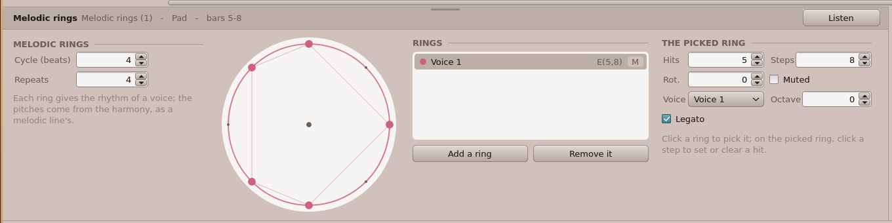
*Melodic rings.*

### 12.3 Poly chords

A **Poly chords** block carries **its own chords** and plays their tones in rings.

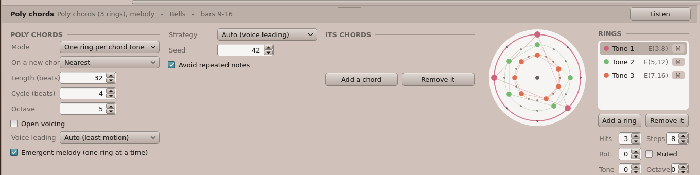
*Poly chords.*

- **Mode**: *One ring per chord tone* (each ring plays one **Tone** of the chord) or *One ring sweeping the
  tones* (each ring walks the tones along a **Contour**, with a **Seed**).
- **On a new chord**: where a ring restarts — *Nearest*, *Lowest*, *Highest*, *Root*, *Third*, *Fifth*.
- **Length**, **Cycle**, **Octave**, **Open voicing**, **Voice leading**.
- **Emergent melody**: when several rings hit together, only one is heard — the *Highest note*, the
  *Lowest*, *Auto (voice leading)* or *Random* (with a **Seed**, **Avoid repeated notes**): the rings
  become a single melody.
- **Its chords**: click a chord to edit it — **Degree**, **Root**, **Colour**, **Suspension**,
  **Force**, **Beats** as in the chord editor. **Add a chord**, **Remove it**.

## 13. Drawing in a grid

The accompaniment's grid, the melodic cell, the drawn grooves, the melodic lines' rhythm and the piano
roll work the same way:

- **Click** an empty cell: a note (for drums: a hit). **Drag** while pressing: its length.
- **Drag a note** to move it; **drag its right end** to lengthen or shorten it.
- **Right-click** a note: it is erased (or the **Erase** tool).
- `Del` deletes the selected note(s); `←` `→` `↑` `↓` move them.
- The **wheel** scrolls the rows, `Shift`+wheel scrolls in time, `Ctrl`+wheel zooms.
- Columns are grouped by beats and bars (the bar lines stronger).

Every stroke is one step of **Undo**.

## 14. Listening and playing

### 14.1 The transport

- **Play / Stop** (`Space`): plays from the play cursor (the yellow triangle on the ruler; click the
  ruler to move it). During playback, a click on the ruler jumps there.
- **Stop** (`Esc`): stops; pressed again, the cursor goes back to the start.
- **Back to the start** (`Home`).
- **Loop** (`Ctrl+L`) — see section 6.4.
- **Metronome**: a click on every beat while the song plays.

### 14.2 Listen

Each editor has **Listen** at the top right: the block alone, looping, with its track's sound. Change the
block while it plays: you hear the change at once. **Stop** ends it (so does playing the song).

### 14.3 A MIDI keyboard

Plug a USB MIDI keyboard in (before or while Koton runs): it plays the **selected track's** sound.

### 14.4 Step recording

In a riff's editor, tick **Step record**: each note you play on the MIDI keyboard is written at the cursor
(the red mark over the grid), with the **Length** chosen, and the cursor moves after it. Notes played
together make a chord. At the riff's end, the cursor starts again at its beginning.

### 14.5 Latency

The engine runs on the Pi's third core, about 40 ms ahead of your ears. A track played by an **instrument
plugin** starts about 0.1 s later, and a note played live on it is heard 0.1 s late; an **effect plugin**
delays the whole mix by 0.1 s so that everything stays together (section 15.4).

## 15. The sound: SoundFont, sound chain, plugins

### 15.1 The SoundFont

Koton's instruments come from a **SoundFont** (`.sf2`): recorded samples of the 128 General MIDI
instruments and drum kits. The card carries **GeneralUser GS**. Koton loads the first `.sf2` of
`SD:/koton/soundfonts`; **File ▸ SoundFont…** chooses another one (used from the next start), and **File ▸
Get a SoundFont…** downloads GeneralUser GS again if it is missing (the network must be up).

### 15.2 The sound chain

The panel at the right of the editor shows the **selected track's** chain:

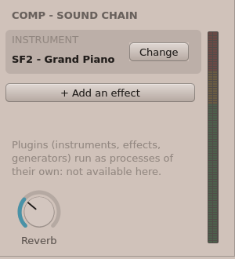
*The sound chain of a track.*

- **Instrument**: its sound — *SF2* (a SoundFont instrument), *Kit* (a drum kit) or *Plugin*. **Change**
  opens the chooser (section 5.2); **Edit** opens an instrument plugin's own window.
- **Effects** (up to four, in order): each with an on/off box, **Edit** — a first click shows its main
  knobs in the panel, a second one opens its own window —, and **x** to remove it. **+ Add an effect**
  lists the effect plugins.
- **Reverb**: how much of the track goes to the song's reverb (double-click: the default).
- **The level meter** of the track.

### 15.3 Plugins

**Plugins** are programs of their own that Koton starts when a song uses them: **instruments** (play a
track instead of the SoundFont), **effects** (process a track's sound) and **generators** (write a block's
notes). They live in `SD:/koton/plugins`; the eleven shipped with Koton are described in appendix D. The
browser's **Plugins** section lists them: a click puts an instrument on the selected track, an effect in
its chain, or a generator block on it.

*The FM 2-op instrument's window.*

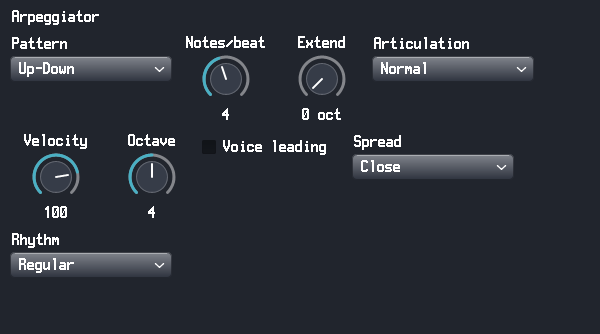
*The Arpeggiator's window.*

A plugin's window opens over Koton; drag it by its title bar, close it with its **x**. Its settings are
saved in the song.

### 15.4 When a plugin stops

If a plugin program stops (a bug, or ended from the task manager), the status bar says so: the track goes
on without it — an instrument's track is silent, an effect is bypassed. In the sound chain, its **Edit**
button becomes **Restart**.

## 16. Compose with AI

**Compose with AI…** (the transport bar, the **AI** menu, or the browser's **AI** section) asks a large
language model to write music, then places what it answers on the song as Koton blocks — chords by
degree, accompaniments, melodic lines or riffs, drums —, which you can then edit like any others.

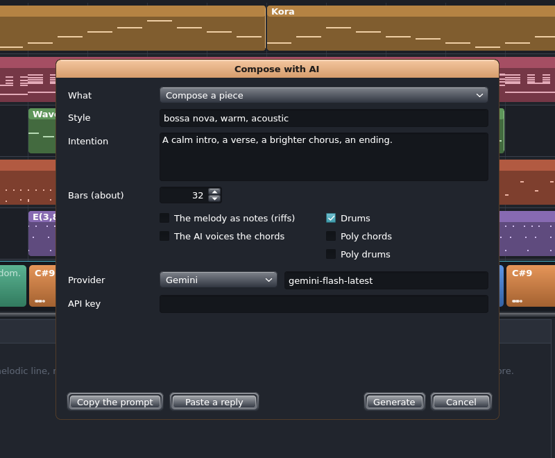
*The Compose with AI dialog.*

- **What**:
  - **Compose a piece** — a whole new song.
  - **Develop the theme (after the end)** — the next bars, from the song's last riff.
  - **Add an instrument over the song** — a new track playing along.
  - **Add drums over the song**.
  - **A polyrhythmic piece**.

  Whatever you ask, the result becomes a **new song** (untitled, not saved yet): the current one is left
  as it is — Koton offers to save it first if it has unsaved changes. An addition (a development, an
  instrument, drums) is a copy of the current song with the new music.
- **Style** and **Intention**: in your own words (*"a melancholic bossa, a brighter chorus, an ending that
  slows down"*).
- **Bars (about)**.
- Options: **The melody as notes (riffs)** (else melodic lines), **Drums**, **The AI voices the chords**,
  **Poly chords**, **Poly drums**.
- **Provider**: *Gemini*, *Groq*, *Mistral*, *Claude*, *DeepSeek*, *Grok*, or an OpenAI-compatible server;
  its **model** (the usual one is filled in); your **API key**.

**Generate** sends the request (through `SD:/bin/llm`). The dialog **stays open**: its progress shows at the
bottom, **Cancel** stops the request. It takes from a few seconds to a minute (a busy model — *503, high
demand* — is asked again by itself, up to four times). When the answer is in, the dialog sums it up (*4
sections, 32 chords, …*) and shows **Apply as a new song**; or change the request and **Generate** again. An
error (no key, a reply that cannot be used, the network) is written in the same place, and the dialog
stays open to try again.

**Without a key**: **Copy the prompt** puts the whole request on the clipboard — paste it into any AI chat
(on another computer, say), copy its **whole answer**, and come back to **Paste a reply**: the dialog checks
it and offers **Apply as a new song** just the same. Both leave the dialog open.

The dialog **remembers your last request**: it opens again with the same style, intention, number of bars
and options (from the transport bar or the **AI** menu, with the same kind of request too), even after Koton was closed.

> **Privacy.** The provider, the model and the **API key** are kept in `SD:/koton/settings.json`, in plain
> text on the card. Your song (its chords and parts) is sent to the provider when you ask.

## 17. Files and export

- **File ▸ New song** (`Ctrl+N`), **Open…** (`Ctrl+O`), **Save** (`Ctrl+S`), **Save As…**. Before a new
  song or opening another, Koton asks to save your changes.
- **`.kson`** is Koton's file (JSON). It opens in Koton Studio for Windows too.
- **`.sq`** files from **Koton Studio for Windows** open: what Onyx does not have (the score, VST plugins,
  some automations) is dropped. **Save** then writes a `.kson` — the `.sq` is never overwritten.
- **File ▸ Export as WAV…**: the whole song rendered to a WAV file (44.1 kHz, 16-bit stereo), with two
  seconds of tail for the reverb.
- A file dropped on the window is opened.

| Where | What |
|---|---|
| `SD:/koton/songs` | your songs; `demo.kson` is the demo |
| `SD:/koton/soundfonts` | the SoundFonts (`.sf2`) |
| `SD:/koton/plugins` | the plugins, a folder each |
| `SD:/koton/settings.json` | the SoundFont chosen, the last folder, the AI's provider, model and key, your last AI request |
| `SD:/apps/koton.app/drums.json` | the drum catalog |

## 18. Questions and answers

**I hear nothing.**
Check the status bar. *No SoundFont* — put a `.sf2` in `SD:/koton/soundfonts` or use **File ▸ Get a
SoundFont…**. *The sound output is used by another app* — close the other app that plays sound (an
emulator, a player) and restart Koton. Check also the tracks' **M** / **S**, their volume, and the Onyx
volume (the menu bar's speaker).

**The sound crackles.**
The status bar counts the *underruns* (moments the engine was late). The engine should run on *core 2*:
if it says *a real-time thread* or *the UI thread*, another app uses the spare core — close it. Many
plugins at once also cost.

**My accompaniment plays nothing.**
It plays the chord track's chords: there must be chords under it. Add chords (section 7) or stretch the
chords under the block.

**I changed a chord and the melody did not follow.**
Riffs hold fixed notes: use **Fit to the chords** in the riff's editor. Melodic lines, accompaniments and
rings follow by themselves.

**The AI answered but nothing happened.**
The status bar or a message says why: the reply was not valid (try again), the key is wrong, or the
network is down. **Copy the prompt** / **Paste a reply** always works without a network on the Pi.

**How do I get my Koton Studio songs?**
Copy the `.sq` files to the card (the File Viewer, FTP) and open them.

## 19. Glossary

| Term | Meaning |
|---|---|
| **Block** | A generator placed on a track: a chord, an accompaniment, a riff, drums, a line, rings. |
| **Cadence** | A chord progression that ends a phrase (V → I: *authentic*; IV → I: *plagal*). |
| **Chord track** | The silent track at the bottom that holds the harmony every part reads. |
| **Degree** | A chord's place in the key: I (tonic), ii, iii, IV (subdominant), V (dominant), vi, vii. |
| **Euclidean rhythm** | E(k, n): k hits spread as evenly as possible over n steps. |
| **Function** | What a chord does: tonic (rest), subdominant (moving away), dominant (tension). |
| **Inversion** | A chord with another note than its root in the bass. |
| **Mode** | The scale of the key: major, minor and the church modes. |
| **Riff** | A block of fixed notes. |
| **Secondary dominant** | The dominant of another degree (V/V: the dominant of the dominant). |
| **SoundFont** | A file of recorded instrument sounds (`.sf2`). |
| **Voice leading** | Moving each note of a chord as little as possible to the next chord. |

## Appendix A. Keyboard reference

| Keys | What |
|---|---|
| `Space` | Play / stop |
| `Home` | Back to the start |
| `Esc` | Stop (again: the cursor to the start) |
| `Del` | Delete the selected block (in a grid: the selected notes) |
| `Ctrl+D` | Duplicate the selected block |
| `←` `→` | The previous / next block (in a grid: move the selected notes) |
| `Ctrl+N` / `Ctrl+O` / `Ctrl+S` | New song / open / save |
| `Ctrl+Z` / `Ctrl+Y` | Undo / redo |
| `Ctrl+K` | The song's key, meter, tempo |
| `Ctrl+L` | Loop on / off |
| wheel, `Shift`+wheel, `Ctrl`+wheel | Scroll the tracks, scroll in time, zoom |

## Appendix B. The chord qualities and colours

The **Colour** of a degree-locked chord adds notes to the key's triad on that degree:

| Colour | Adds | On I in C major | On ii in C major |
|---|---|---|---|
| Triad | — | C | Dm |
| Sixth | the 6th | C6 | Dm6 |
| 7th | the 7th of the scale | Cmaj7 | Dm7 |
| 9th (7+9) | the 7th and the 9th | Cmaj9 | Dm9 |
| 9th (add9) | the 9th only | Cadd9 | Dm(add9) |

**Suspension** replaces the third by the second (*Sus2*) or the fourth (*Sus4*). **Force** makes the
chord *Major*, *Minor*, *Augmented*, *Diminished* or *Dominant* whatever the scale says (a major IV in a
minor key, a dominant V in natural minor). Koton knows 35 qualities: major, minor, diminished,
augmented, sus2, sus4, maj7, m7, 7, m7♭5, dim7, 6, m6, add9, m(add9), 9, maj9, m9, 7♭9, 7♯9, 11, 13,
maj7♯11, 7sus4, 7sus2, 9sus4, 9sus2, 6sus4, 6sus2, maj7sus4, maj7sus2, maj9sus4, maj9sus2, add9sus4,
7♯5.

## Appendix C. The accompaniment styles

| Style | Style |
|---|---|
| Block chords (held) | Tango (staccato) |
| Block chords (quarters) | Bossa nova / Latin |
| Block chords (eighths) | Funk (16th stabs) |
| Arpeggio up | Habanera (bass) |
| Arpeggio up-down | Ballad (held arpeggio) |
| Alberti (C-G-E-G) | Country (alternating bass) |
| Jazz comping (Charleston) | Slow rock (12/8 triplets) |
| Rock (eighths) | Arpeggio: 2 eighths + quarter |
| Pop (bass + chord) | Arpeggio: 3 eighths + dotted quarter |
| Blues shuffle (triplets) | Arpeggio: 4 eighths + half |
| Arpeggio down | Arpeggio: triplet + quarter |
| Arpeggio (eighths) | Arpeggio: 4 eighths + quarter |
| Waltz (bass-chord-chord) | Harp (rolled arpeggio) |
| Reggae skank (off-beats) | Custom (drawn) |
| March (bass-chord) | |

## Appendix D. The plugins

| Plugin | Kind | What it does | Its settings |
|---|---|---|---|
| **FM 2-op** | instrument | Two-operator FM: a modulator bends a sine carrier — electric pianos, bells, basses. | Ratio, Index, Feedback, Attack, Decay, Sustain, Release, Mod decay, Mod sustain, Detune, Velocity, Volume |
| **Subtractive** | instrument | Two oscillators and noise into a resonant filter — the classic synthesizer. | Osc 1, Osc 2, pitch and fine, Osc mix, Noise, Pulse width, Filter, Cutoff, Resonance, Env amount, Key track, the two envelopes, Volume |
| **Plucked strings** | instrument | Karplus-Strong: a kora, a harp, a guitar. | Decay, Damping, Brightness, Pick point, Release, Width, Velocity, Volume |
| **Delay** | effect | An echo in milliseconds, ping-pong. | Time, Feedback, Tone, Ping-pong, Width, Mix |
| **Reverb** | effect | A room (Freeverb). | Room size, Damping, Width, Pre-delay, Wet, Dry |
| **Chorus** | effect | A chorus of up to three voices; with feedback, a flanger. | Rate, Depth, Delay, Feedback, Voices, Spread, Mix |
| **EQ 3-band** | effect | Low, middle and high bands. | Low, Low freq, Mid, Mid freq, Mid width, High, High freq, Output |
| **Drive** | effect | Saturation to fuzz. | Character, Drive, Low cut, Tone, Asymmetry, Mix, Level |
| **Arpeggiator** | generator | Arpeggiates the chord track's chords. | Pattern, Notes/beat, Extend, Articulation, Velocity, Octave, Voice leading, Spread, Rhythm |
| **Euclidean melody** | generator | A euclidean rhythm playing the chords' tones along a contour. | Hits, Steps, Rotation, Steps/beat, Contour, Tones, Octave, Range, Velocity, Accent, Articulation, Seed |
| **Cellular automaton** | generator | A one-dimensional cellular automaton (Wolfram's rules) on the scale or the chords. | Notes/beat, Rule, Width, Scale, Octave, Range, Seed, First row, Density, Velocity, Articulation, Chord-aware |

The Arpeggiator and the Cellular automaton read the blocks of Koton Studio for Windows' own generators.
