# Ledger — Manuel de l'utilisateur

*La comptabilité en partie double des sociétés et des indépendants belges, sur Onyx*

Édition de septembre 2026, pour Ledger tel que livré avec Onyx. Les illustrations montrent la société
de démonstration fournie avec Ledger, *Atelier Lumen SRL*, un petit studio de design bruxellois.

## Sommaire

- [1. Introduction](#1-introduction)
- [2. Premiers pas](#2-premiers-pas)
- [3. La fenêtre](#3-la-fenêtre)
- [4. Paramétrer sa comptabilité](#4-paramétrer-sa-comptabilité)
- [5. Clients et fournisseurs](#5-clients-et-fournisseurs)
- [6. Les ventes](#6-les-ventes)
- [7. Les achats](#7-les-achats)
- [8. Payer ses fournisseurs (SEPA)](#8-payer-ses-fournisseurs-sepa)
- [9. Banque et caisse](#9-banque-et-caisse)
- [10. Les opérations diverses](#10-les-opérations-diverses)
- [11. Devis, commandes et bons de livraison](#11-devis-commandes-et-bons-de-livraison)
- [12. Imprimer des documents à partir de modèles](#12-imprimer-des-documents-à-partir-de-modèles)
- [13. Les rapports](#13-les-rapports)
- [14. La TVA](#14-la-tva)
- [15. Clôturer l'exercice](#15-clôturer-lexercice)
- [16. Fichiers et sauvegardes](#16-fichiers-et-sauvegardes)
- [17. Questions et réponses](#17-questions-et-réponses)
- [18. Lexique](#18-lexique)
- [Annexe A. Les codes TVA](#annexe-a-les-codes-tva)
- [Annexe B. Les champs de fusion](#annexe-b-les-champs-de-fusion)
- [Annexe C. Le clavier](#annexe-c-le-clavier)

## 1. Introduction

### 1.1 Ce que fait Ledger

Ledger tient la comptabilité complète, en partie double, d'une société belge — SRL, SA, SC,
association — ou d'un indépendant. Il suit le plan comptable belge, le **PCMN** (*Plan comptable
minimum normalisé* ; en néerlandais le *MAR*, *Minimum Algemeen Rekeningenstelsel*), et les règles
belges de la TVA, et il produit les fichiers avec lesquels travaillent l'administration et les banques
belges :

- les **factures** et **notes de crédit** de vente et d'achat, avec tous les cas de TVA belges : les
  taux de 6, 12 et 21 %, les livraisons et services intracommunautaires, les exportations,
  l'autoliquidation du cocontractant, la TVA non déductible, les 50 % de la voiture de société ;
- les **devis**, **commandes**, **bons de livraison** et **bons de commande fournisseur**, chacun
  transformé en suivant, puis en facture ;
- des documents **imprimés à partir de modèles** par Letters, en français, en néerlandais ou en anglais,
  avec votre en-tête ;
- les **extraits de banque et de caisse**, encodés ou **importés des fichiers CODA de votre banque**,
  les factures qu'ils paient retrouvées et lettrées pour vous ;
- le **paiement de vos fournisseurs** par un fichier de virements **SEPA** pour votre banque ;
- la **déclaration TVA** périodique en fichier XML **Intervat**, le **listing clients annuel** et le
  **relevé intracommunautaire** ;
- les **rapports** : journaux, grand livre, balance des comptes, bilan, compte de résultats, soldes
  clients et fournisseurs, créances et dettes par ancienneté — à l'écran, en documents Letters ou en
  classeurs ;
- la **clôture de l'exercice**, son résultat reporté.

Vous encodez des **documents** — une facture, un extrait de compte —, jamais des écritures brutes :
Ledger construit l'écriture comptable, la montre pendant la saisie et la comptabilise à
l'enregistrement. Tout est écrit aussitôt dans le fichier de la société : il n'y a pas d'étape
« enregistrer » séparée pour la comptabilité.

### 1.2 Pour qui

Ledger s'adresse à ceux qui tiennent leur propre comptabilité ou celle d'une petite entreprise : un
graphiste indépendant, un consultant, un petit commerce, une petite société de quelques centaines de
factures par an. Ses fonctions suivent celles de **BOB 50**, le logiciel comptable belge, avec la
simplicité de **GnuCash**. Nul besoin d'être comptable pour l'utiliser, mais il faut connaître les bases
de la comptabilité en partie double : la section 1.5 les rappelle.

> **Important.** Ledger vous aide à tenir une comptabilité correcte et à préparer vos fichiers TVA. Il
> ne remplace pas les conseils de votre expert-comptable : faites vérifier vos chiffres de fin
> d'exercice par un professionnel avant de déposer vos comptes annuels.

### 1.3 Ce qu'il faut

- Onyx, sur un Raspberry Pi 4 (ou le simulateur de bureau Onyx sur un PC).
- **Letters**, installé avec Onyx : il imprime vos devis, vos factures et vos rapports.
- Le **tableur** (facultatif) : il ouvre les rapports en classeurs.
- Pour importer vos extraits : les fichiers **CODA** fournis par votre banque (depuis votre banque en
  ligne, en général des fichiers `.cod` ou `.txt`), copiés sur la carte SD.
- Pour déposer vos déclarations TVA : un accès à **Intervat**, le site du SPF Finances, où vous
  chargez les fichiers XML que Ledger écrit.

### 1.4 À propos de ce manuel

- Les écrans de Ledger sont en **anglais**. Les boutons, menus et champs sont donc écrits en **gras**,
  tels qu'à l'écran, suivis au besoin de leur traduction : **Save** (enregistrer), **New invoice**
  (nouvelle facture).
- Une commande de menu s'écrit **File ▸ Open...** : le menu **File**, puis son article **Open...**.
- Les touches s'écrivent `Ctrl+N`, `Tab`, `Enter`, `Esc`, `F4`.
- Les montants s'écrivent à la belge : `1.234,56` — un point groupe les milliers, une virgule sépare les
  cents. Les dates s'écrivent `28/09/2026`.
- Les exemples utilisent la **société de démonstration**, *Atelier Lumen SRL* (section 2.2). Vous
  pouvez tout y essayer : c'est un fichier à part, distinct de votre comptabilité.

### 1.5 La comptabilité en bref

- **Les comptes.** Chaque montant est inscrit sur les comptes du plan. Le PCMN les numérote par
  classe : **1** fonds propres et dettes à long terme, **2** immobilisations, **3** stocks, **4**
  créances et dettes (400000 clients, 440000 fournisseurs, 451000 TVA à payer, 411000 TVA à
  récupérer...), **5** banque et caisse (550000, 570000), **6** charges, **7** produits. Les classes 1
  à 5 forment le **bilan**, les classes 6 et 7 le **compte de résultats**.
- **La partie double.** Chaque opération est une **écriture** dont les **débits** égalent les
  **crédits**. Une facture de vente de 1.000,00 plus 210,00 de TVA débite le client de 1.210,00 (il
  vous les doit) et crédite les ventes de 1.000,00 (un produit) et la TVA à payer de 210,00 (vous la
  devez à l'État). Ledger écrit ces lignes pour vous.
- **Les journaux.** Les écritures sont rangées dans des **journaux** selon leur nature — ventes,
  achats, banque, caisse, opérations diverses —, chacun numérotant ses documents à partir de 1 chaque
  exercice.
- **Soldes débiteurs et créditeurs.** Un compte est **débiteur** (D) quand ses débits dépassent ses
  crédits — un actif, une charge, un client qui vous doit — et **créditeur** (C) dans le cas contraire —
  les fonds propres, une dette, un produit.
- **Le lettrage.** Une facture et le paiement qui la solde sont **lettrés** : ensemble, ils font zéro
  sur le compte du tiers, et la facture apparaît payée (**Paid**). Ledger les lettre quand vous
  enregistrez un paiement contre sa facture.
- **L'exercice.** La période pour laquelle les comptes sont clôturés, en général l'année civile. À sa
  fin, son **résultat** — les produits moins les charges — est reporté aux fonds propres.

## 2. Premiers pas

### 2.1 Démarrer Ledger

Lancez **Ledger** depuis la liste des applications (groupe **Productivity**) ou depuis le dock. Ledger
s'ouvre aussi d'un double-clic sur un fichier `.ledger` dans le File Viewer, ou quand on en dépose un
sur sa fenêtre.

Au démarrage, Ledger rouvre la comptabilité ouverte la dernière fois. La toute première fois, il
affiche sa page d'accueil.

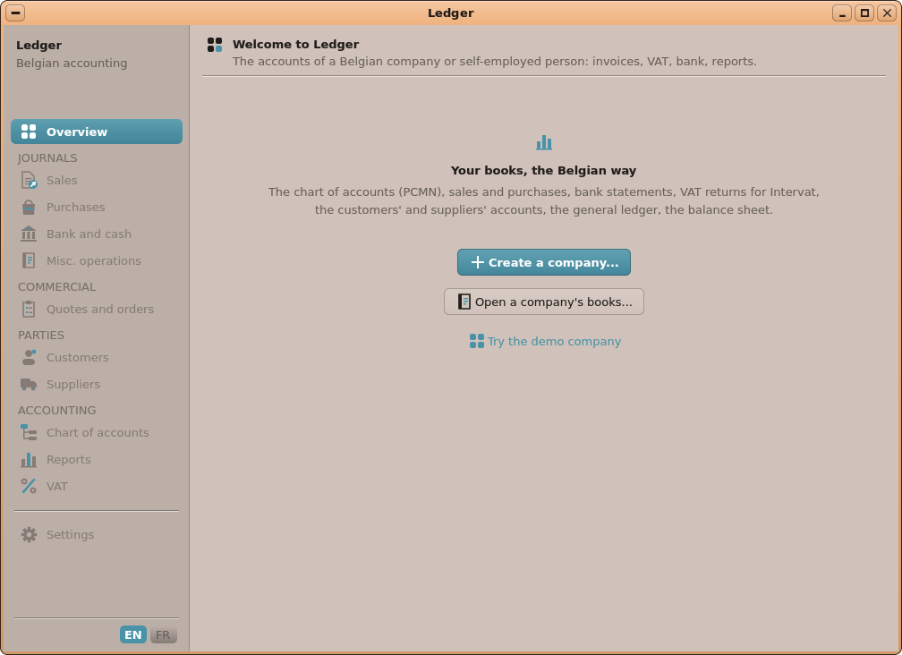
*La page d'accueil : créer votre société, ouvrir une comptabilité existante ou essayer la société de démonstration.*

### 2.2 Essayer la société de démonstration

Cliquez sur **Try the demo company** pour ouvrir `SD:/docs/demo-company.ledger` : *Atelier Lumen SRL*,
un studio de design avec 23 clients et fournisseurs et quelque 330 documents de janvier 2025 à
septembre 2026 — factures, notes de crédit, extraits bancaires, déclarations TVA déposées, devis et
commandes. L'exercice 2025 est clôturé ; 2026 est en cours. La démo est la meilleure façon d'apprendre
Ledger : toutes les illustrations de ce manuel en viennent.

La démo est accompagnée d'un fichier bancaire, `SD:/docs/demo-bank-statement.cod`, pour essayer
l'import CODA (section 9.3).

### 2.3 Créer votre société

Cliquez sur **Create a company...** dans la page d'accueil, ou choisissez **File ▸ New Company...**.

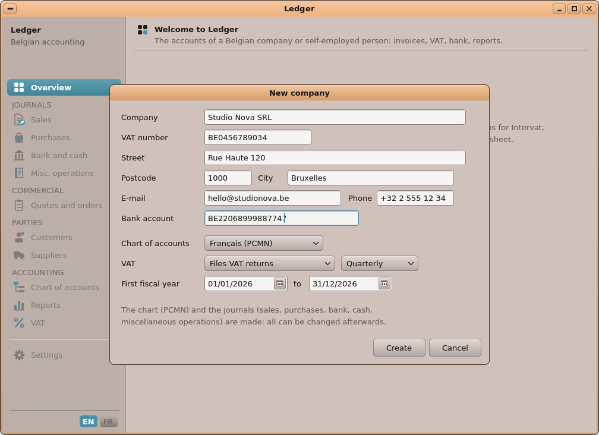
*Une nouvelle société : son nom, son numéro de TVA, son adresse, son compte bancaire, son plan, son régime TVA et son premier exercice.*

1. Tapez le **nom** de la société avec sa forme juridique (*Studio Nova SRL*), son **numéro de TVA**
   (`BE 0456.789.034` : Ledger le vérifie), sa **rue**, son **code postal** et sa **localité**, son
   **e-mail**, son **téléphone** et son **compte bancaire** (IBAN).
2. Choisissez le **plan comptable** (**Chart of accounts**) : **Français (PCMN)** ou **Nederlands
   (MAR)**. La langue du plan est aussi celle de vos documents, sauf si la fiche d'un client en décide
   autrement.
3. Choisissez le **régime TVA** (**VAT**) :
   - **Files VAT returns** (dépose des déclarations TVA), **Quarterly** (trimestrielles) ou **Monthly**
     (mensuelles) : le cas habituel ;
   - **Small business franchise** : le régime de la franchise des petites entreprises — vous ne
     facturez pas de TVA et ne déposez pas de déclaration périodique ;
   - **Not subject to VAT** : pour une activité exemptée par l'article 44 du Code TVA (un médecin, un
     centre de formation...).
4. Tapez le **premier exercice** (**First fiscal year**), son premier et son dernier jour (`01/01/2026`
   au `31/12/2026`). Un exercice peut durer jusqu'à 24 mois (le premier d'une société dure souvent plus
   d'un an).
5. Cliquez sur **Create** et choisissez où enregistrer le fichier : `SD:/docs/Studio Nova SRL.ledger`
   est proposé.

Ledger crée la comptabilité : tout le PCMN dans la langue choisie (près de 500 comptes), les journaux —
**VEN** ventes, **ACH** achats, **BNK** banque, **CAI** caisse, **OD** opérations diverses (en
néerlandais : **VKP**, **AKP**, **BNK**, **KAS**, **DIV**) — et le premier exercice. Tout peut être
modifié ensuite dans **Settings** (section 4).

> **Conseil.** Allez ensuite dans **Settings ▸ Company** pour ajouter votre forme juridique, votre
> registre (*RPM Bruxelles*), votre BIC et votre site web : ils figurent sur vos documents imprimés. Et
> dans **Settings ▸ Journals** pour taper l'IBAN de votre compte bancaire dans le journal **BNK** :
> l'import CODA et le paiement des fournisseurs en ont besoin.

### 2.4 Ouvrir une comptabilité, plusieurs sociétés

Chaque société a son propre fichier. **File ▸ Open...** (`Ctrl+O`) ouvre la comptabilité d'une autre
société ; celle qui était ouverte est fermée (elle n'a pas besoin d'être enregistrée). Tenez autant de
sociétés que vous voulez, un fichier chacune.

**File ▸ Save a Copy As...** écrit une copie de la comptabilité sous un autre nom — avant un essai, ou
pour en donner une copie à votre comptable.

Le nom du fichier s'affiche au pied de la barre latérale, avec un point vert. Le point devient rouge si
le fichier n'a pas pu être écrit (carte pleine ou protégée en écriture) : la comptabilité reste alors
en mémoire, et Ledger vous le dit — enregistrez-en aussitôt une copie ailleurs.

## 3. La fenêtre

### 3.1 Ses parties

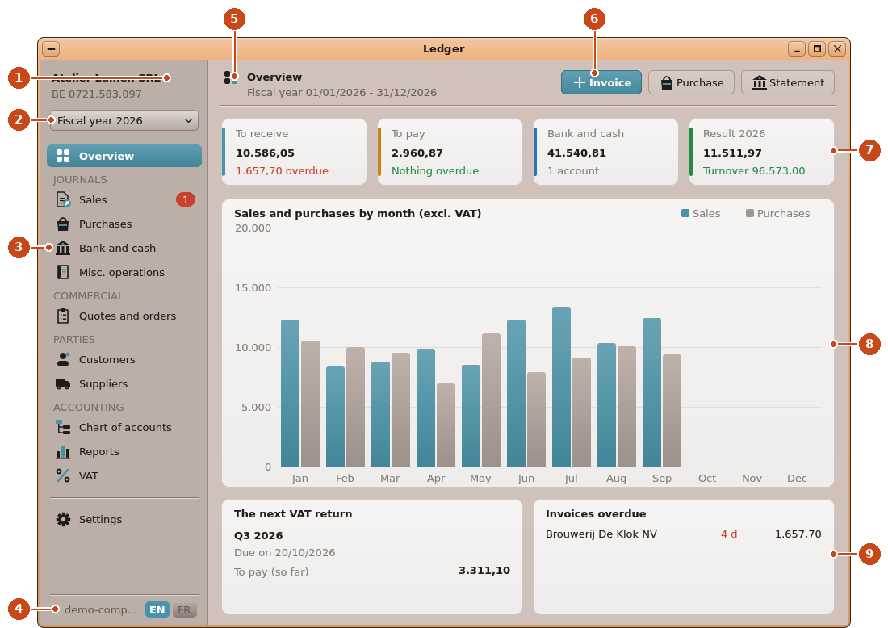
*La page Overview (vue d'ensemble) de la société de démonstration, et les parties de la fenêtre.*

1. **La société** ouverte : son nom et son numéro de TVA.
2. **L'exercice affiché.** Les listes, les rapports et la page TVA montrent cet exercice ; choisissez-en
   un autre ici. Les nouveaux documents y sont datés.
3. **Les pages**, par groupes : **Overview** (vue d'ensemble) ; les journaux — **Sales** (ventes),
   **Purchases** (achats), **Bank and cash** (banque et caisse), **Misc. operations** (opérations
   diverses) ; **Quotes and orders** (devis et commandes) ; les tiers — **Customers** (clients),
   **Suppliers** (fournisseurs) ; la comptabilité — **Chart of accounts** (plan comptable), **Reports**
   (rapports), **VAT** (TVA) ; et **Settings** (réglages). Une **pastille** rouge compte ce qui vous
   attend : les factures en retard sur **Sales** (orange sur **Purchases** : vos propres retards de
   paiement), une déclaration TVA en retard sur **VAT**.
4. **Le fichier** de la comptabilité et son état (vert : écrit).
5. **Le titre de la page**, et une ligne à son sujet (ici l'exercice).
6. **Les boutons de la page.** Celui en couleur est son action principale (ici : une nouvelle facture
   de vente).
7. **Les tuiles de la vue d'ensemble** : ce que vos clients vous doivent (et ce qui est en retard), ce
   que vous devez à vos fournisseurs, la banque et la caisse, le résultat et le chiffre d'affaires de
   l'exercice.
8. **Les ventes et les achats** de l'exercice, mois par mois (hors TVA).
9. **La prochaine déclaration TVA** (sa période, son échéance, son montant à ce jour) et **les factures
   les plus en retard** — cliquez-en une pour l'ouvrir.

### 3.2 Les listes

La plupart des pages sont des listes : les ventes, les extraits, les clients...

- Les **filtres** en haut à gauche : **All** (toutes), **Open** (ouvertes), **Overdue** (en retard),
  **Paid** (payées) pour les factures.
- La zone **Search** en haut à droite trouve des mots n'importe où dans une ligne : un nom, un libellé,
  un numéro, un montant (`1.657,70` ou `1657.70`). Tous les mots tapés doivent être trouvés. `Ctrl+F` y
  mène.
- Cliquez sur le **titre d'une colonne** pour trier par elle ; cliquez à nouveau pour inverser l'ordre.
- **Double-cliquez** une ligne, ou appuyez sur `Enter`, pour l'ouvrir. `Delete` supprime la ligne
  choisie (quand elle peut l'être, et après confirmation).
- **Cliquez du bouton droit** sur une ligne pour ses autres commandes.
- Le **pied** de la liste totalise les lignes affichées.

### 3.3 Les documents

Un document — une facture, un extrait, une opération, un devis — s'ouvre **à la place de sa liste**.
Ses champs sont en haut, ses **lignes** dans une grille en dessous, ses totaux en bas.

- **Save** (`Ctrl+S`) comptabilise le document et revient à la liste ; **Save & New** le comptabilise
  et commence le suivant ; **Cancel** (`Esc`) le quitte — Ledger demande d'abord si quelque chose a été
  tapé ; la **corbeille** rouge le supprime.
- Un champ de **tiers**, de **compte** ou de **code TVA** cherche pendant la frappe : un nom, un code,
  un numéro de TVA, le numéro d'un compte ou des mots de son intitulé. La liste des correspondances
  s'ouvre en dessous ; `Enter` ou `Tab` prend celle qui est éclairée, `F4` ou `Alt+↓` les montre toutes.
- Les **dates** peuvent se taper `28/09/2026`, `28.9.26`, `28/9` (cette année) ou `280926` ; le bouton
  à droite d'un champ de date ouvre un calendrier.
- Les **montants** peuvent se taper `1850`, `1850,00`, `1.850,00` ou `1850.00`.

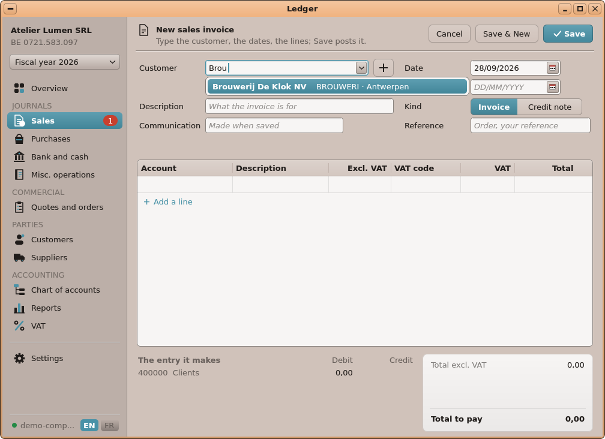
*Un tiers trouvé pendant la frappe : « Brou » trouve Brouwerij De Klok NV (son code, sa localité).*

Dans la **grille des lignes**, on tape comme dans un tableur :

| Touche | Effet |
|---|---|
| `Tab`, `Enter` | Prend ce qui a été tapé et passe à la cellule suivante ; après la dernière, une nouvelle ligne |
| `Shift+Tab` | La cellule précédente |
| `↑`, `↓` | La ligne du dessus, du dessous |
| `Esc` | Rend ce que la cellule contenait (une seconde fois : quitte la grille) |
| `F4`, `Alt+↓` | La liste de ce que la cellule peut recevoir |
| `Ctrl+Delete` | Supprime la ligne (la croix en fin de ligne aussi) |

Une cellule qui ne peut pas accepter ce qui a été tapé s'entoure de rouge, et la raison s'affiche au
pied de la fenêtre.

### 3.4 Les documents verrouillés

Un document ne peut plus être modifié ni supprimé :

- quand son **exercice est clôturé** (section 15), ou
- quand il contient de la TVA et que la **déclaration TVA de sa période est marquée déposée** (section
  14.3).

Sa page indique alors **Locked** (verrouillé) et pourquoi. Pour le corriger, rouvrez la période ou
l'exercice — ou, mieux, passez un document correctif (une note de crédit, une opération diverse) dans
la période en cours.

Les factures de vente sont numérotées sans trou, comme la loi l'exige : seul le **dernier** document de
vente d'un journal peut être supprimé. Pour en annuler un autre, faites-lui une **note de crédit**
(section 6.5).

## 4. Paramétrer sa comptabilité

### 4.1 La société

**Settings ▸ Company** contient ce que vos documents impriment en en-tête et ce que vos fichiers TVA
déclarent.

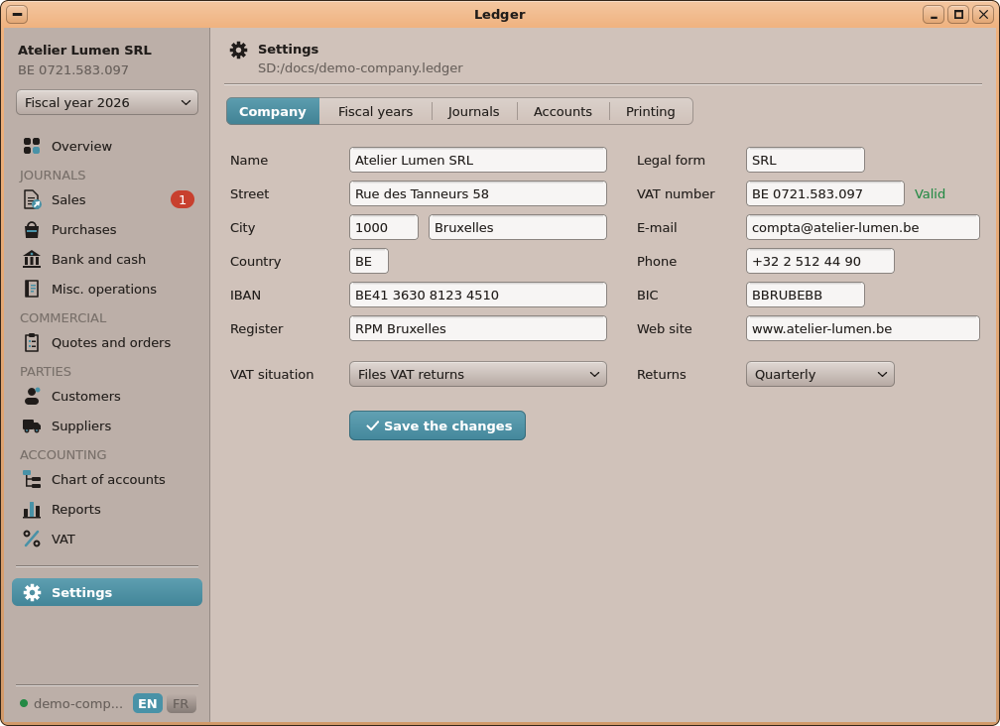
*Les données de la société : nom, forme juridique, adresse, numéro de TVA, contacts, banque, registre, site web, régime TVA.*

- **Name** et **Legal form** : le nom et la forme juridique (*SRL*, *SA*, *SC*, *ASBL*...).
- **Street**, **City** (code postal et localité), **Country** (`BE`).
- **VAT number** : vérifié pendant la frappe (**Valid**, **Wrong check digits** — chiffres de contrôle
  faux —, **Not a VAT number**).
- **E-mail**, **Phone**, **Web site**.
- **IBAN** et **BIC** : imprimés sur vos factures.
- **Register** : le registre des personnes morales et son tribunal, *RPM Bruxelles*, *RPR Gent*.
- **VAT situation** et **Returns** : comme à la création (section 2.3) ; changez-les si votre situation
  change.

Cliquez sur **Save the changes**.

### 4.2 Les exercices

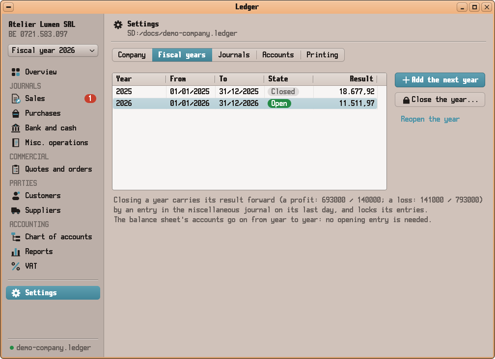
*Les exercices : leurs dates, leur état et leur résultat.*

La liste montre chaque exercice, ses dates, son état (**Open**, ouvert, ou **Closed**, clôturé) et son
**résultat** (bénéfice ou perte à ce jour).

- **Add the next year** ajoute un exercice après le dernier, de même durée.
- **Close the year...** et **Reopen the year** : voir la section 15.

Les comptes de bilan se poursuivent d'eux-mêmes d'un exercice à l'autre : on ne tape jamais d'écriture
d'ouverture entre deux exercices d'une même comptabilité.

### 4.3 Les journaux

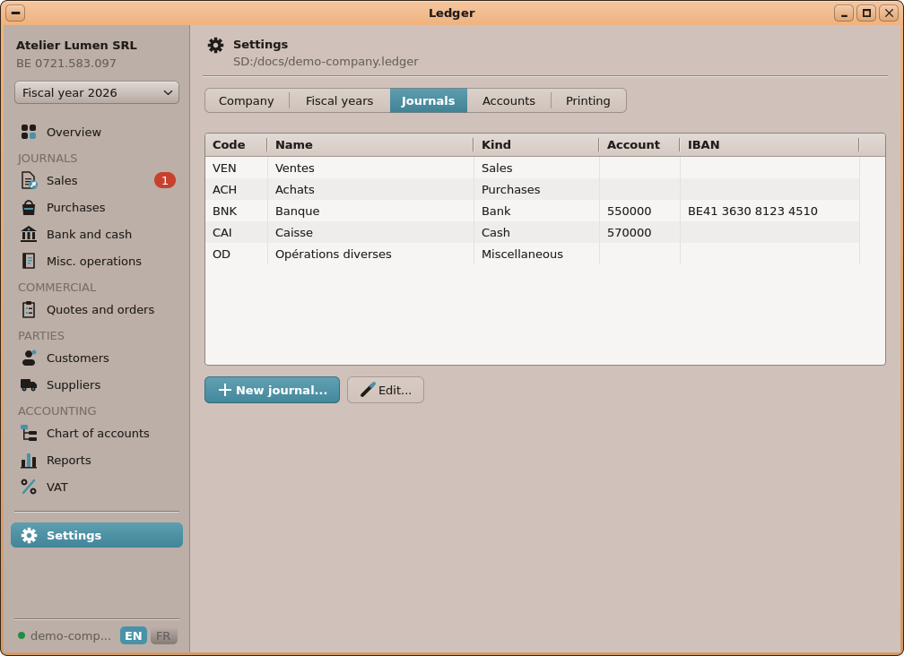
*Les journaux : leur code, leur nom, leur type, leur compte et leur IBAN.*

Une société a besoin d'un journal de chaque type ; ajoutez-en d'autres pour séparer des documents — un
second compte bancaire, une seconde série de ventes (**VEN2** pour un magasin).

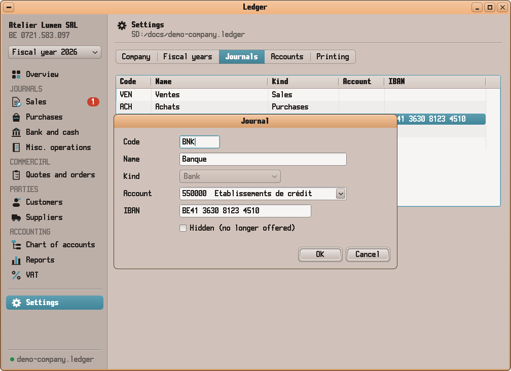
*Un journal de banque : son code, son nom, son type, son compte (55xxxx) et son IBAN.*

Double-cliquez un journal (ou choisissez-le et cliquez sur **Edit...**), ou cliquez sur **New
journal...** :

- **Code** : 1 à 5 lettres ou chiffres, imprimés dans les numéros des documents (*VEN 2026/0054*).
- **Name** et **Kind** : le nom et le type — ventes, achats, banque, caisse ou divers (le type d'un
  journal ne peut plus changer dès qu'il contient des documents).
- **Account** : le compte d'un journal de banque (550000, 550100 pour une seconde banque...), d'un
  journal de caisse (570000).
- **IBAN** : le numéro du compte bancaire. **L'import CODA retrouve le journal d'un extrait par lui**,
  et les paiements des fournisseurs partent de ce compte.
- **Hidden** : un journal masqué, qui n'est plus proposé pour de nouveaux documents (ses documents
  restent).

### 4.4 Les comptes par rôle

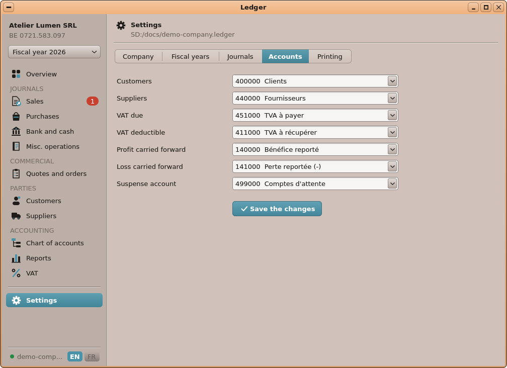
*Les comptes que Ledger utilise pour ses propres écritures.*

Ledger passe lui-même certaines lignes — le côté client et fournisseur d'une facture, la TVA, le
résultat de l'exercice. **Settings ▸ Accounts** dit sur quels comptes : **Customers** (400000),
**Suppliers** (440000), **VAT due** (TVA à payer, 451000), **VAT deductible** (TVA à récupérer,
411000), **Profit carried forward** (bénéfice reporté, 140000), **Loss carried forward** (perte
reportée, 141000) et le **Suspense account** (compte d'attente, 499000). Gardez les comptes du PCMN
sauf si votre comptable vous demande autre chose.

### 4.5 Le plan comptable

**Chart of accounts** montre le PCMN en arbre — classes, groupes, comptes — avec le solde de chaque
compte à la fin de l'exercice affiché. En dessous, l'**historique** du compte choisi : ses lignes de
l'exercice, le solde reporté et le solde progressif.

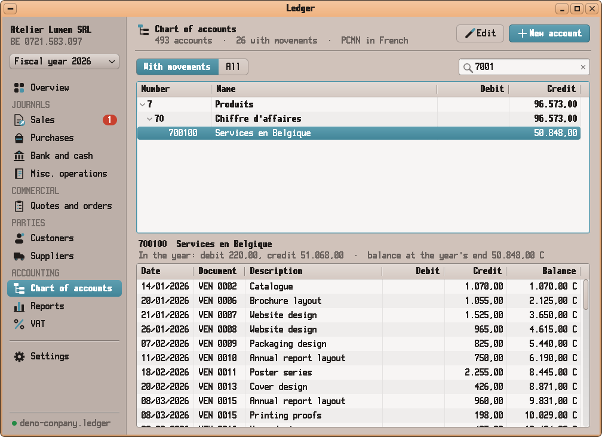
*Le plan : les comptes répondant à « 7001 » ; l'historique du compte 700100, les ventes de services de l'exercice.*

- **With movements** ne montre que les comptes mouvementés cette année ; **All** tout le plan.
- La zone de recherche trouve un compte par le début de son numéro (`7001`) ou des mots de son intitulé
  (`leasing`).
- Double-cliquez une classe ou un groupe pour le replier ou le déplier.
- Double-cliquez une ligne de l'historique pour ouvrir son document.

**New account** ajoute un compte : son **numéro** (en général 6 chiffres, classes 0 à 7, absent du plan)
et son **intitulé**. **Edit** modifie le compte choisi :

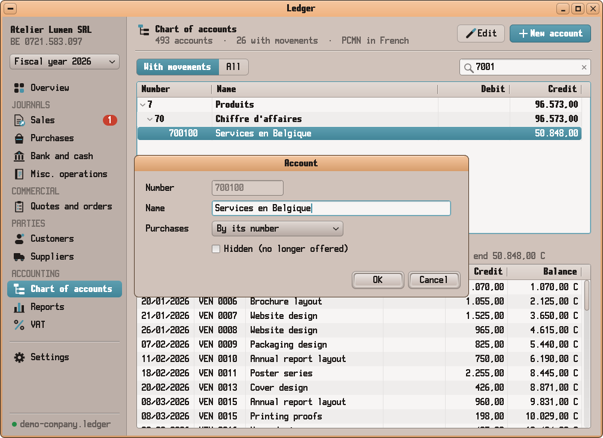
*La fiche d'un compte : son intitulé, la nature de ses achats, masqué ou non.*

- **Name** : l'intitulé.
- **Purchases** : la nature de ce qui est acheté sur ce compte, qui décide de la grille des achats dans
  la déclaration TVA — **Goods** (marchandises, grille 81), **Services** (services et biens divers,
  grille 82), **Investments** (investissements, grille 83), ou **By its number** (d'après son numéro :
  60 marchandises, 61 services, 2x investissements...).
- **Hidden (no longer offered)** : le compte reste dans le plan et les rapports mais n'est plus proposé
  pendant la frappe.

### 4.6 Reprendre une comptabilité existante

Si vous passez à Ledger en cours de vie d'une société, reprenez les soldes par une seule **opération
diverse** (section 10) datée du **premier jour** de votre premier exercice dans Ledger, en cochant
**Opening balances** (soldes d'ouverture) :

- une ligne par compte de bilan avec son solde — le capital (100000) et les réserves au crédit, le
  matériel (2x) et la banque (550000) au débit... ;
- une ligne **par facture ouverte** sur 400000 avec son client (au débit) ou sur 440000 avec son
  fournisseur (au crédit), pour pouvoir la lettrer plus tard avec son paiement ;
- la différence éventuelle sur 499000 (le compte d'attente), à apurer avec votre comptable.

Prenez les chiffres dans le bilan de clôture et les postes ouverts de la comptabilité précédente.

## 5. Clients et fournisseurs

### 5.1 Les listes

**Customers** et **Suppliers** listent les tiers avec leur **code**, leur **nom**, leur **numéro de
TVA**, leur **localité**, leur **solde** et ce qui est **en retard**. Les filtres montrent **All** (tous),
ceux **With a balance** (avec un solde) ou ceux **Overdue** (en retard) ; la recherche trouve un code, un
nom, une localité, un numéro de TVA ou un e-mail.

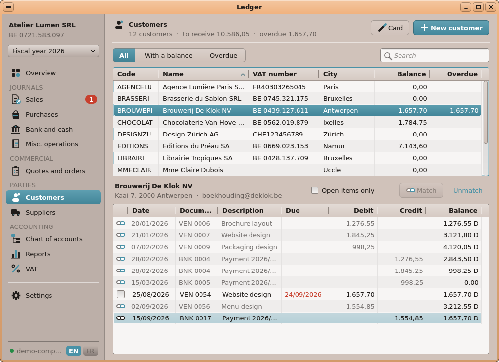
*Les clients ; en dessous, le compte du client choisi : ses factures et paiements, lettrés (le maillon) ou ouverts.*

Sous la liste, le **compte** du tiers choisi pour l'exercice affiché : le solde reporté, chaque facture,
note de crédit et paiement, leur **échéance** (en rouge si elle est passée) et le **solde progressif**
(D : le tiers vous doit, C : vous devez au tiers). Un maillon marque les lignes déjà **lettrées**.
Double-cliquez une ligne pour ouvrir son document.

### 5.2 La fiche d'un tiers

Cliquez sur **New customer** (ou **New supplier**), double-cliquez un tiers, ou choisissez-le et cliquez
sur **Card**. On peut aussi créer un tiers pendant la saisie d'un document : le bouton **+** à droite de
son champ.

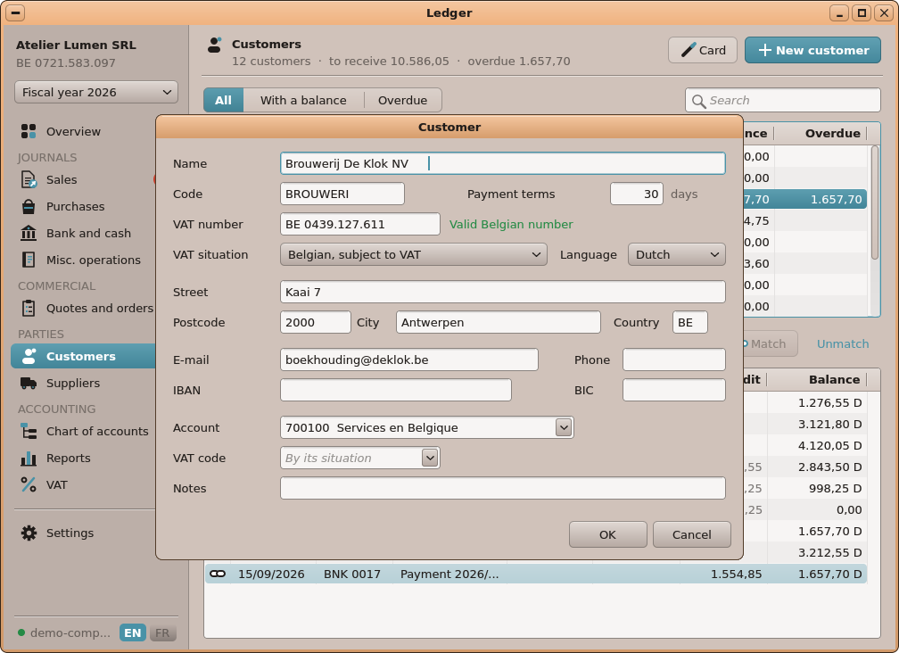
*La fiche d'un client : son code, son délai de paiement, son numéro et son régime TVA, sa langue, son adresse, sa banque, son compte habituel.*

- **Name** et un **Code** — fait à partir du nom s'il est laissé vide (*BROUWERI*) ; vous pouvez taper le
  vôtre.
- **Payment terms** : les jours jusqu'à l'échéance d'une facture (30 par défaut). L'échéance des
  factures en découle.
- **VAT number** : vérifié pendant la frappe — **Valid Belgian number**, **EU number (its form)**
  (numéro européen, sa forme), **Its check digits are wrong** (chiffres de contrôle faux). Le taper
  remplit aussi le **régime TVA** et le **pays**.
- **VAT situation** : le régime TVA du tiers, qui décide des codes TVA proposés sur ses documents
  (section 6.3) :
  - **Belgian, subject to VAT** : assujetti belge, les taux normaux (V21, A21...) ;
  - **Private person (no VAT number)** : un particulier, les taux normaux ; il n'entre pas dans le
    listing clients ;
  - **Other EU country, VAT number** : intracommunautaire (VEUS services, VEUG biens pour un client ;
    AEUS21, AEU21 pour un fournisseur) ;
  - **Outside the EU** : hors UE — exportations (VEX), ou services venus de l'étranger (AWS21) ;
  - **Belgian co-contractor (reverse charge)** : cocontractant belge — travaux immobiliers, le client
    acquitte la TVA (VCC, ACC21).
- **Language** : **French**, **Dutch** ou **English** — la langue des devis, commandes et factures
  imprimés du tiers.
- **Street**, **Postcode**, **City**, **Country** (son code : `BE`, `FR`, `NL`...).
- **E-mail**, **Phone**.
- **IBAN** et **BIC** : le compte d'un fournisseur est nécessaire pour le payer par SEPA (section 8) ;
  celui d'un client permet à l'import CODA de reconnaître ses paiements.
- **Account** : le compte proposé sur les lignes de ses documents (un client : 700100 *services en
  Belgique* ; un fournisseur : 612000 *loyer*...).
- **VAT code** : un code TVA propre, sinon **By its situation** (d'après son régime).
- **Notes** : tout ce qu'il faut retenir.

Pour supprimer un tiers, choisissez-le et appuyez sur `Delete`. Un tiers qui a des documents, des devis
ou des commandes ne peut pas être supprimé : sa fiche reste avec eux dans la comptabilité.

### 5.3 Le lettrage

Ledger lettre une facture avec son paiement quand vous enregistrez le paiement (section 9.2) : la
plupart du temps, rien à faire. Pour lettrer vous-même — une facture payée en deux fois, une note de
crédit qui compense une facture :

1. Dans le compte du tiers, cochez les lignes (cliquez leur case, ou `Space`). Le bouton **Match**
   affiche la somme des lignes cochées.
2. Quand elle fait **zéro**, cliquez sur **Match** : les lignes sont marquées d'un maillon et la facture
   apparaît payée (**Paid**).

**Unmatch** défait le lettrage de la ligne choisie. **Open items only** ne montre que les lignes pas
encore lettrées, de tous les exercices.

## 6. Les ventes

### 6.1 Les ventes

**Sales** liste les factures et notes de crédit de vente de l'exercice : leur **numéro**, leur **date**,
leur **client**, leur **libellé**, leur **total** et leur **état** (**Status**).

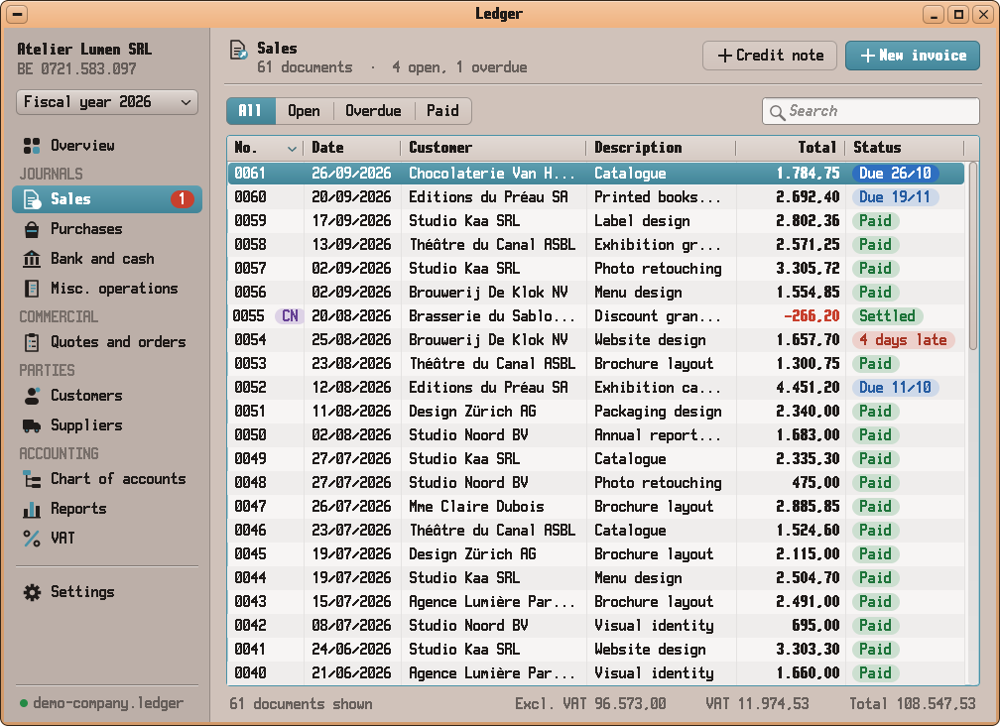
*Les ventes de 2026 : payées, à échoir, en retard, une note de crédit soldée.*

| État | Signification |
|---|---|
| **Paid** | La facture est lettrée avec son paiement |
| **Due 26/10** | Ouverte, échéance à cette date |
| **4 days late** | Ouverte et en retard (ici de 4 jours) |
| **Settled** | Une note de crédit lettrée (avec sa facture ou un remboursement) |
| **Credit open** | Une note de crédit pas encore utilisée |

Une note de crédit est marquée **CN** après son numéro. **All**, **Open**, **Overdue** et **Paid**
filtrent la liste ; quand un type de document a plusieurs journaux, une liste choisit l'un d'eux ou
**All the journals** (tous).

### 6.2 Une facture de vente, pas à pas

Cliquez sur **New invoice** (`Ctrl+N`), ou **Invoice** dans la vue d'ensemble, ou **Documents ▸ Sales
Invoice**.

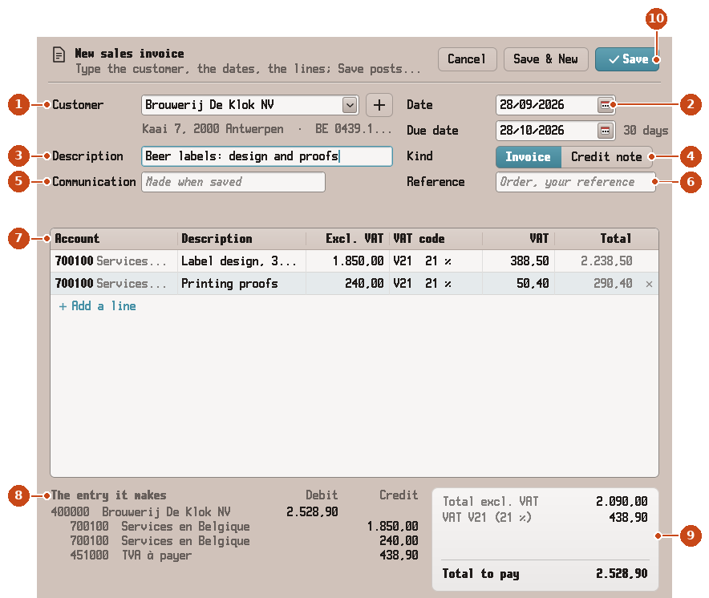
*Une facture de vente en cours de saisie : deux lignes à 21 % ; en dessous, l'écriture qu'elle passera et ses totaux.*

1. **Customer** (client) : tapez quelques lettres de son nom, son code ou son numéro de TVA et
   prenez-le dans la liste (ou cliquez sur **+** pour créer une fiche). Son adresse et son numéro de
   TVA s'affichent en dessous.
2. **Date** et **Due date** (échéance) : aujourd'hui (ou le jour le plus proche dans l'exercice), et la
   date plus le délai de paiement du client ; le nombre de jours est affiché.
3. **Description** (libellé) : l'objet de la facture (*Étiquettes de bière : création et épreuves*) ;
   il s'affiche dans les listes et sur la facture imprimée.
4. **Kind** : **Invoice** (facture) ou **Credit note** (note de crédit).
5. **Communication** : la **communication structurée** belge (+++123/4567/89012+++) que le client
   mettra sur son paiement. Laissez-la vide : Ledger la fabrique à partir du numéro de la facture à
   l'enregistrement, et l'imprime sur la facture. Les fichiers CODA de votre banque la renvoient avec
   le paiement, qui retrouve ainsi sa facture.
6. **Reference** : le numéro de commande ou la référence du client, imprimé sur la facture.
7. **Les lignes** : pour chacune, le **compte** (le compte habituel du client est proposé : 700100...),
   un **libellé**, le montant **hors TVA** (**Excl. VAT**) et le **code TVA** (proposé d'après le régime
   du client, section 6.3). La **TVA** est calculée — tapez un autre montant si la facture en indique un
   autre (il s'affiche alors en bleu) —, comme le **total** de la ligne.
8. **L'écriture qu'elle passe** (**The entry it makes**) : le client débité, les ventes et la TVA
   créditées — telle qu'elle sera comptabilisée.
9. **Les totaux** : hors TVA, la TVA de chaque code, le **total à payer** (**Total to pay**).
10. **Save** comptabilise la facture et revient à la liste ; **Save & New** la comptabilise et commence
    la suivante.

La facture reçoit le numéro suivant du journal (*VEN 2026/0062*). Elle apparaît désormais dans le compte
du client, dans la déclaration TVA de sa période et dans tous les rapports.

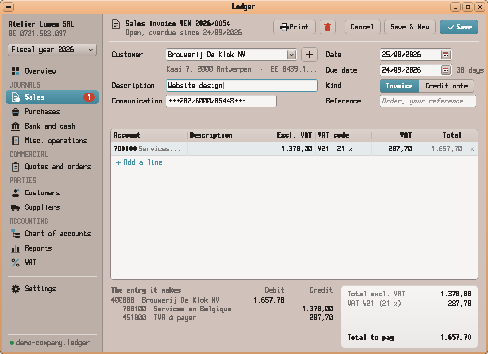
*Une facture enregistrée : « Open, overdue since 24/09/2026 » (ouverte, en retard depuis le 24/09/2026), sa communication structurée ; Print la fait dans Letters.*

### 6.3 Les codes TVA des ventes

| Code | À utiliser pour | Déclaration TVA |
|---|---|---|
| **V21**, **V12**, **V6** | Ventes en Belgique à 21, 12 ou 6 % | Grilles 03, 02, 01 et 54 |
| **V0** | Ventes à 0 % (journaux...) | Grille 00 |
| **VCC** | Travaux pour un cocontractant belge : le client acquitte la TVA | Grille 45 |
| **VEUG** | Biens livrés à une entreprise d'un autre pays de l'UE | Grille 46, relevé intracommunautaire |
| **VEUS** | Services à une entreprise d'un autre pays de l'UE | Grille 44, relevé intracommunautaire |
| **VEUT** | Opérations triangulaires (ABC) dans l'UE | Grille 46, relevé intracommunautaire |
| **VEX** | Exportations hors de l'UE | Grille 47 |
| **VX** | Opérations exemptées (article 44), hors déclaration | — |

Le code est proposé d'après le **régime TVA** du client, ou le **code TVA** propre de sa fiche. Les notes
de crédit vont en grilles 48 (intracommunautaire) et 49 (autres), leur TVA en grille 64. L'annexe A
liste tous les codes.

> **Note.** Sur une facture imprimée, le détail de la TVA porte la mention légale que ses codes
> exigent — autoliquidation intracommunautaire (art. 39bis, art. 21 § 2), autoliquidation du
> cocontractant (art. 20 de l'AR n° 1), exportation (art. 39), exemption (art. 44) —, dans la langue de
> la facture.

### 6.4 Imprimer une facture

Sur une facture enregistrée, cliquez sur **Print** — ou cliquez-la du bouton droit dans la liste et
choisissez **Print**. Ledger passe ses données à **Letters**, qui fait la facture à partir de son modèle
et l'affiche : imprimez-la, ou enregistrez-la à nouveau en `.docx` ou `.odt`. Voir la section 12.

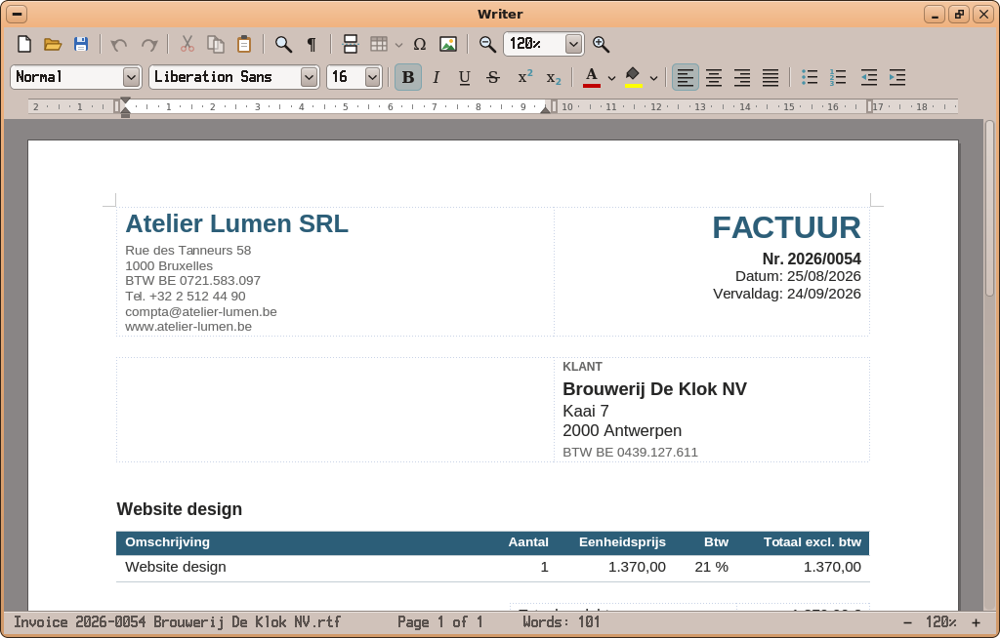
*La même facture imprimée : en néerlandais, la langue du client — « FACTUUR ».*

### 6.5 Les notes de crédit

Une note de crédit annule tout ou partie d'une facture. Dans la liste, cliquez la facture du bouton
droit et choisissez **Make a credit note for it** : une note de crédit s'ouvre avec le même client, les
mêmes lignes et le libellé *Note de crédit pour VEN 2026/0054* ; changez les montants si une partie
seulement est créditée, puis enregistrez.

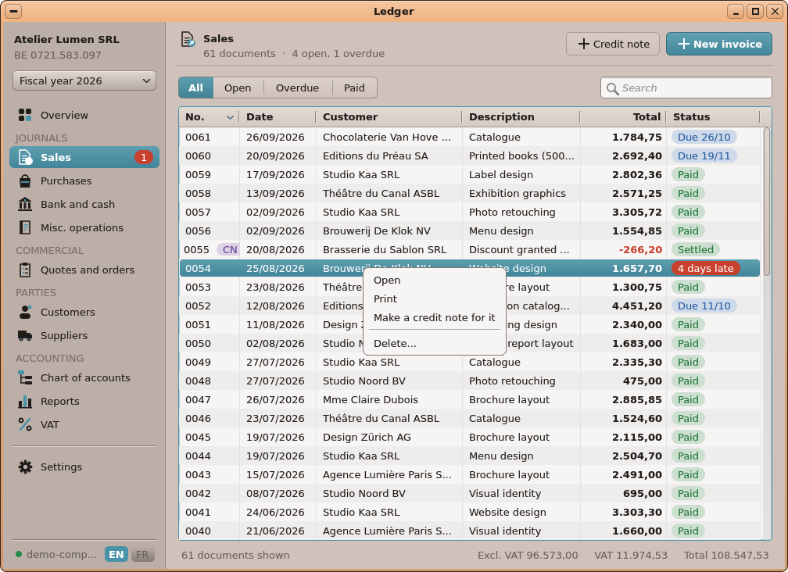
*Le bouton droit sur une vente : l'ouvrir, l'imprimer, lui faire une note de crédit, la supprimer.*

Vous pouvez aussi cliquer sur **Credit note** en haut de la liste pour une note de crédit libre. Une
fois enregistrée, lettrez-la avec sa facture dans le compte du client (section 5.3) si elle la solde.

### 6.6 Modifier une vente

Ouvrez une vente, modifiez-la et enregistrez : son écriture est comptabilisée à nouveau, sous le même
numéro. Son paiement reste lettré tant que son total ne change pas. Une vente ne peut plus être
modifiée une fois sa déclaration TVA déposée ou son exercice clôturé (section 3.4).

## 7. Les achats

### 7.1 Les achats

**Purchases** liste les factures et notes de crédit d'achat de l'exercice, comme les ventes, avec le
**numéro du fournisseur** (**Their number**) à la place du libellé.

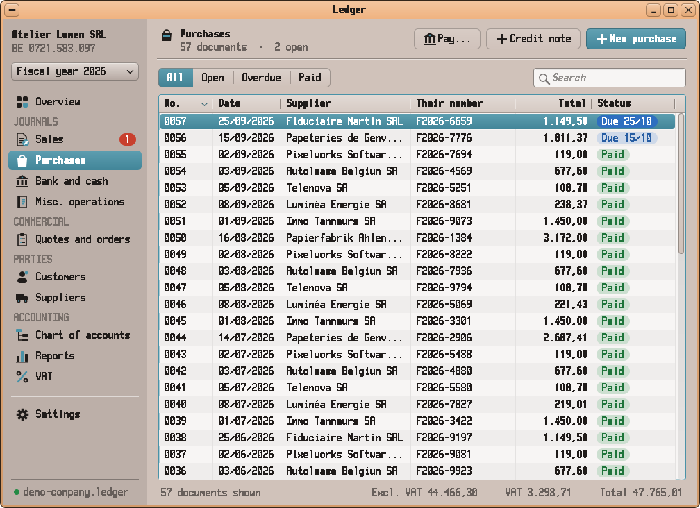
*Les achats de 2026 : deux restent à payer.*

Leurs états sont ceux des ventes, plus **Transfer sent** (virement envoyé) : la facture est dans un
fichier de paiements SEPA (section 8) et attend l'extrait bancaire qui la paie.

### 7.2 Une facture d'achat

Cliquez sur **New purchase**, ou **Purchase** dans la vue d'ensemble, ou **Documents ▸ Purchase
Invoice**. Elle se tape comme une facture de vente (section 6.2), avec ces différences :

- **Their number** : le numéro de facture du fournisseur (*F2026-4569*). Ledger vous avertit si le même
  fournisseur a déjà une facture de ce numéro dans l'exercice : un achat comptabilisé deux fois.
- **Communication** : la communication structurée imprimée sur la facture du fournisseur, s'il y en a
  une. Ledger vérifie ses chiffres ; le paiement SEPA l'utilise.
- Le **compte** de chaque ligne : une charge (60 marchandises, 61 services, 62 rémunérations...) ou,
  pour du matériel, une immobilisation (2x). Le compte habituel du fournisseur est proposé.
- Le **code TVA** : voir la section 7.3. Avec l'autoliquidation, l'écriture montre les deux côtés : la
  TVA due et la même TVA déductible.

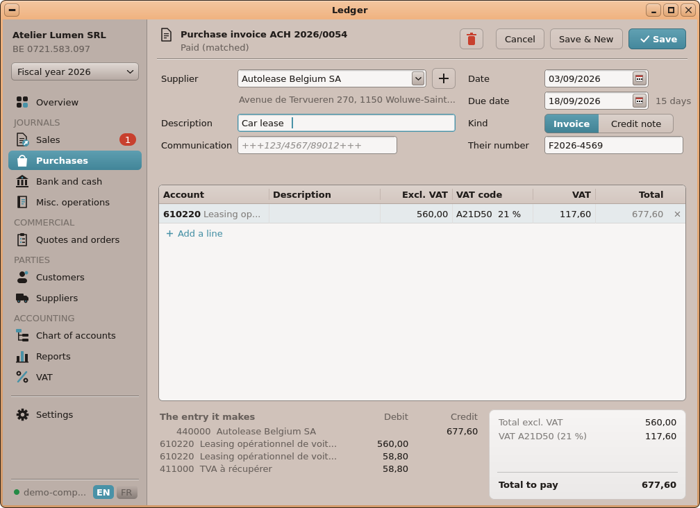
*Un leasing de voiture : code TVA A21D50 — la moitié de la TVA déductible (58,80), l'autre moitié ajoutée à la charge.*

### 7.3 Les codes TVA des achats

| Code | À utiliser pour | Déclaration TVA |
|---|---|---|
| **A21**, **A12**, **A6** | Achats en Belgique, TVA déductible | Grilles 81/82/83 et 59 |
| **A0** | Achats à 0 % ou exemptés | Grilles 81/82/83 |
| **A21D50** | Une voiture de société : la moitié de la TVA déductible | Grilles 81/82/83 et 59 |
| **A21ND**, **A12ND** | TVA non déductible (restaurants, cadeaux...) : ajoutée à la charge | Grilles 81/82/83 |
| **AEU21**, **AEU12**, **AEU6** | Biens achetés dans un autre pays de l'UE | Grilles 86, 55 et 59 |
| **AEUS21** | Services achetés dans un autre pays de l'UE | Grilles 88, 55 et 59 |
| **ACC21**, **ACC12**, **ACC6** | Travaux d'un cocontractant belge | Grilles 87, 56 et 59 |
| **AWS21** | Services venus de hors de l'UE | Grilles 87, 56 et 59 |
| **AIM21** | Importations, TVA reportée (licence ET 14000) | Grilles 87, 57 et 59 |

La grille de l'achat lui-même — **81** marchandises, **82** services, **83** investissements — suit le
compte de la ligne (sa nature **Purchases**, section 4.5). Les notes de crédit reçues vont en grilles 84
ou 85, leur TVA en grille 63.

### 7.4 Les notes de crédit d'achat

Cliquez sur **Credit note**, ou cliquez une facture du bouton droit et choisissez **Make a credit note
for it**. Tapez le numéro de la note de crédit du fournisseur dans **Their number**.

## 8. Payer ses fournisseurs (SEPA)

Ledger écrit le fichier de **virements SEPA** (le format ISO 20022 *pain.001* qu'acceptent toutes les
banques belges) qui paie plusieurs factures d'un coup : chargez-le sur le site de votre banque et
confirmez-y.

1. Dans **Purchases**, cliquez sur **Pay...** (ou choisissez **Tools ▸ Pay Suppliers (SEPA)...**).
2. Choisissez le compte **From the account** (d'où part le paiement : un journal de banque avec son
   IBAN) et le jour **Paid on** (où la banque paie).
3. Cochez les factures à payer. Celles qui échoient dans la semaine de ce jour sont cochées pour vous.
   Un fournisseur sans IBAN sur sa fiche affiche **No IBAN** et ne peut être coché : complétez sa fiche.
   Une facture déjà dans un fichier affiche **In a file**.
4. Vérifiez le nombre de virements et leur total, et cliquez sur **Make the file**.

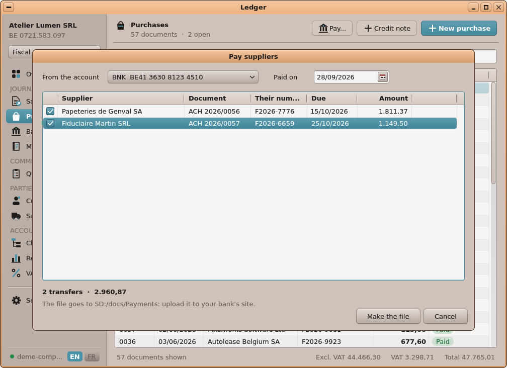
*Deux factures cochées : deux virements, 2.960,87 au total.*

Le fichier est écrit dans `SD:/docs/Payments`, nommé d'après le jour (*SEPA 2026-09-28 123400.xml*).
Chaque virement porte le nom, l'adresse, l'IBAN et le BIC du fournisseur, et sa communication
structurée — sinon le numéro de facture du fournisseur. Les factures affichent alors **Transfer
sent**, jusqu'à ce que l'extrait bancaire qui les paie soit enregistré (encodé ou importé) : elles sont
alors lettrées.

## 9. Banque et caisse

### 9.1 Les extraits

**Bank and cash** liste les extraits de banque et de caisse de l'exercice : leur numéro, leur date,
leur libellé, leur journal, l'argent entré (**In**) et sorti (**Out**), et le **nouveau solde** (**New
balance**).

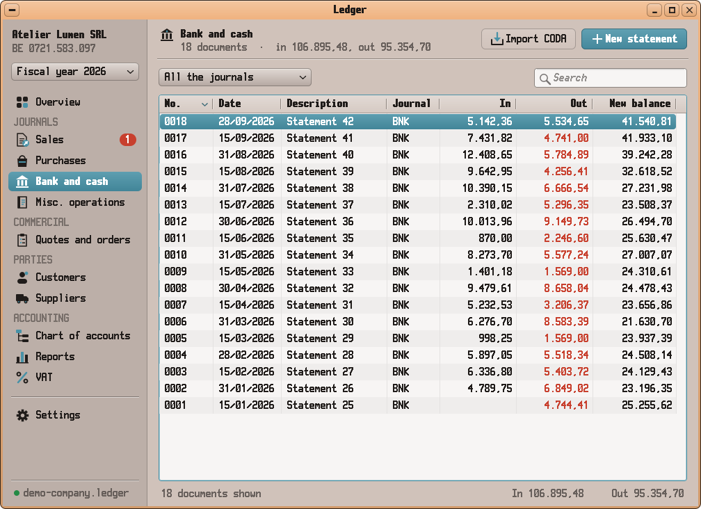
*Les extraits bancaires de 2026, leurs entrées et sorties, et le solde après chacun.*

### 9.2 Encoder un extrait

Cliquez sur **New statement** (ou **Statement** dans la vue d'ensemble, ou **Documents ▸ Bank
Statement**).

1. **Journal** : le journal de banque ou de caisse. Son **ancien solde** — le solde après le dernier
   extrait — est affiché.
2. **Date** : la date de l'extrait. **Description** : le numéro qui suit le dernier extrait du journal
   est proposé (*Statement 43* après *Statement 42*).
3. **New balance** : le nouveau solde imprimé sur l'extrait de votre banque. Facultatif, mais conseillé :
   Ledger vérifie alors les mouvements et affiche **Balanced** (équilibré), ou **Off by** (écart de) la
   différence.
4. Les **mouvements**, un par ligne :
   - **Party or account** : le client ou le fournisseur qui a payé ou a été payé (tapez son nom ou son
     code), ou un compte pour le reste — frais bancaires 657200, la TVA payée à l'État 451200, une
     rémunération 618000 ;
   - **Description** : la communication de la banque ;
   - **Amount** : positif pour l'argent **entré**, négatif pour l'argent **sorti** (`-238,37`).
5. Quand un mouvement a un tiers, ses **postes ouverts** — ses factures pas encore payées — s'affichent
   en dessous. **Cochez** celles que le mouvement paie : le montant les suit. Taper d'abord le montant
   coche le poste qui vaut autant. Et une **communication structurée** tapée dans le libellé retrouve sa
   facture toute seule.
6. **Save**. Les postes cochés sont lettrés avec leur paiement : les factures apparaissent payées.

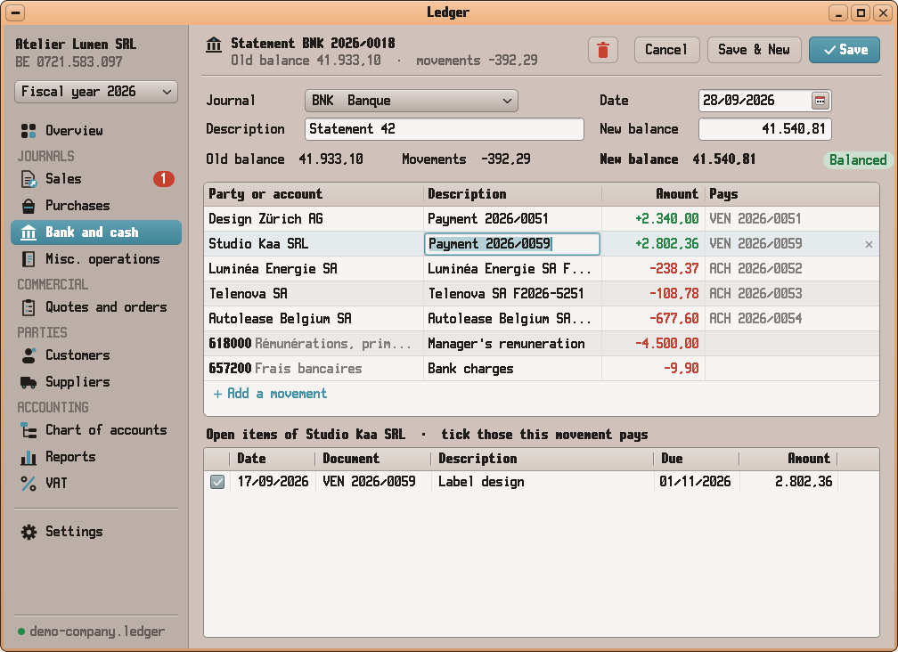
*Un extrait : la facture de chaque paiement dans « Pays » ; en dessous, le poste qu'un mouvement a payé, coché.*

Un extrait enregistré peut être rouvert : la colonne **Pays** montre la facture que chaque mouvement a
payée, et la liste des postes les montre cochés.

### 9.3 Importer des fichiers CODA

Les banques belges fournissent leurs extraits en fichiers **CODA** (*Coded Statement of Account*, la
norme de Febelfin). Téléchargez-les depuis votre banque en ligne — souvent dans une rubrique
*Documents* ou *CODA* ; certaines banques les envoient à votre comptable, qui peut vous les transmettre
— et copiez-les sur la carte SD.

1. Dans **Bank and cash**, cliquez sur **Import CODA** (ou **Tools ▸ Import CODA...**) et choisissez le
   fichier.
2. Ledger lit ses extraits — un fichier peut en contenir plusieurs —, retrouve le **journal de chacun
   par son IBAN** et saute ceux qui sont déjà dans votre comptabilité.
3. Chaque extrait s'ouvre, **déjà complété** :
   - un paiement avec une **communication structurée** retrouve sa facture — de vente ou d'achat —,
     qui est cochée ;
   - sinon la contrepartie est retrouvée par son **IBAN** (celui d'une fiche) ou son **nom**, et son
     poste ouvert du même montant est coché (ou tous ses postes, quand ensemble ils font le montant) ;
   - les **frais bancaires** vont en 657200 ;
   - ce qui n'est pas trouvé affiche **To complete** (à compléter) en rouge : tapez son tiers ou son
     compte.
4. La ligne de titre de la page dit ce qui reste : *CODA: 1 movement to complete* (1 mouvement à
   compléter). Complétez-le et cliquez sur **Save** : l'extrait est comptabilisé et le suivant du
   fichier s'affiche, jusqu'au dernier.

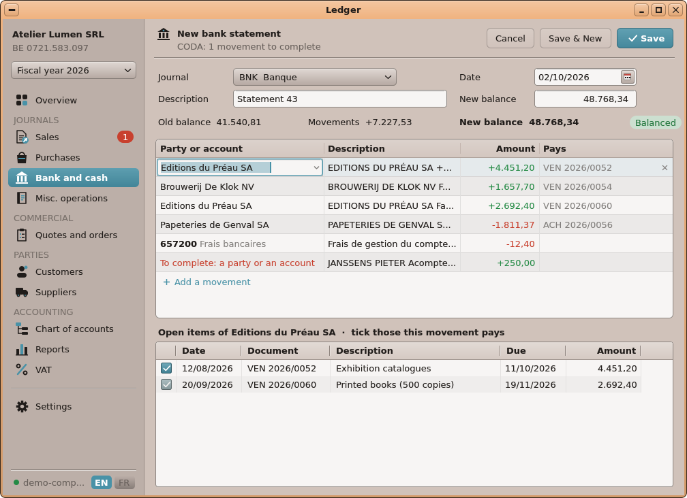
*Le fichier CODA de la démo importé : cinq mouvements trouvés (leurs factures cochées), un à compléter.*

> **Conseil.** Essayez-le sur la démo : **Import CODA** ▸ `demo-bank-statement.cod` ▸ **Open**. Les
> 250,00 de Janssens Pieter ne viennent pas d'un tiers connu : tapez un compte (un produit divers, par
> exemple) ou créez-lui une fiche avec **+**.

Si Ledger dit **No bank journal has the account BE..** (aucun journal de banque n'a ce compte), tapez cet
IBAN dans le journal de banque (**Settings ▸ Journals**) et importez à nouveau le fichier. S'il dit que
**le solde initial de la banque n'est pas celui de la comptabilité** (*the bank's old balance is not
the books'*), un extrait manque entre le dernier de votre comptabilité et celui-ci : importez-le
d'abord.

### 9.4 La caisse

Un **extrait de caisse** (**Documents ▸ Cash Statement**, ou **New statement** avec le journal de caisse
choisi) se tape comme un extrait bancaire : ventes au comptant en entrée, petits achats en sortie, les
mouvements du jour ou du mois.

## 10. Les opérations diverses

**Misc. operations** garde les écritures qui ne sont ni des factures ni des extraits : amortissements,
salaires passés d'après le récapitulatif de votre secrétariat social, régularisations, corrections,
soldes d'ouverture, et les liquidations de TVA que Ledger passe lui-même (section 14.3).

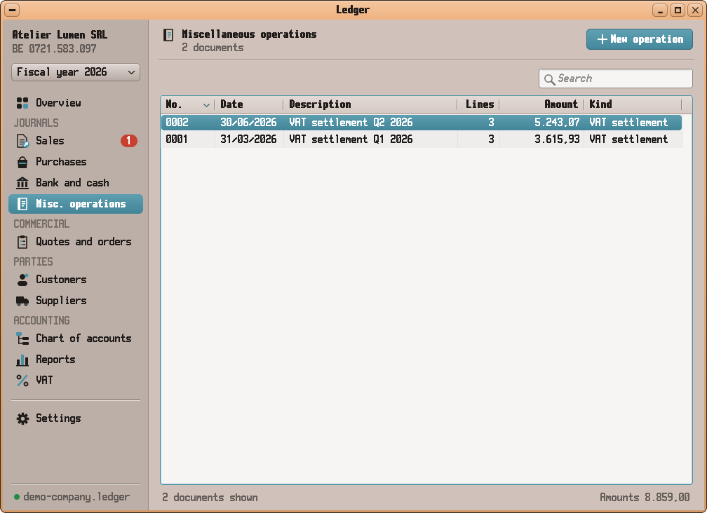
*Les opérations diverses de 2026 : les liquidations de TVA du 1er et du 2e trimestre.*

Cliquez sur **New operation** :

1. **Journal**, **Date** et **Description** (*Amortissement du matériel 2026*).
2. Les lignes : le **compte**, le **tiers** (**Party**) quand le compte est un compte clients ou
   fournisseurs (une ligne sur 400000 a besoin de son client), un **libellé**, le **débit** ou le
   **crédit**, et un code TVA quand la ligne doit compter dans la déclaration TVA (une régularisation :
   codes R61, R62).
3. La ligne de titre montre le total **Debit**, **credit** et la **difference**. **Balance it on this
   line** met la différence sur la ligne où vous êtes.
4. **Save** quand elle est **équilibrée** (*balanced*).

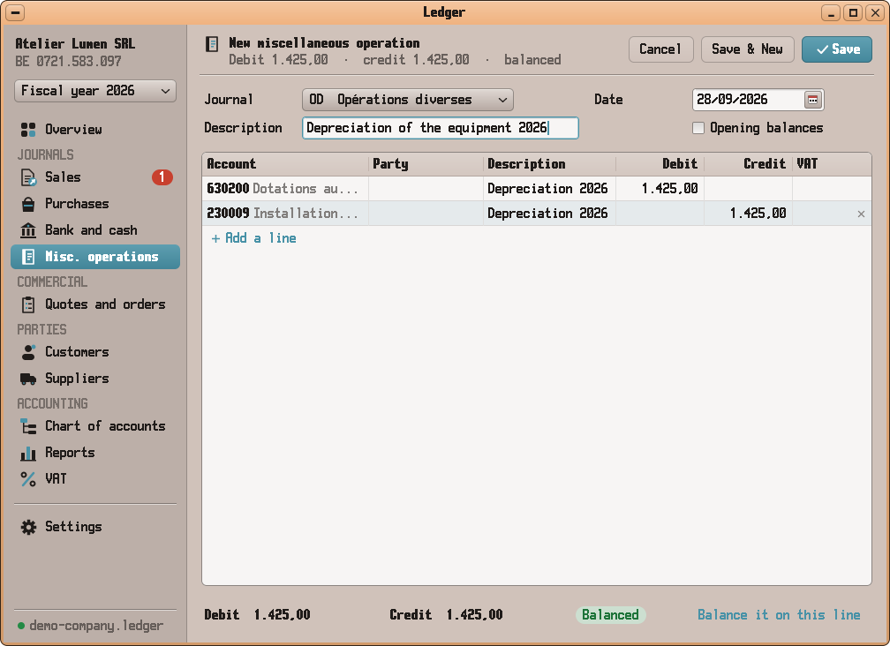
*Un amortissement : 630200 débité, 230009 crédité, 1.425,00 chacun — équilibré.*

Cochez **Opening balances** pour l'écriture qui reprend les soldes de votre comptabilité précédente
(section 4.6) ; elle est marquée **Opening** dans la liste.

## 11. Devis, commandes et bons de livraison

### 11.1 Les documents commerciaux

**Quotes and orders** garde les documents qui précèdent une facture. Ils ne sont **pas comptabilisés** :
ils ne changent ni les comptes ni la TVA.

| Document | Ce que c'est |
|---|---|
| **Quote** | Un devis : un prix offert à un client, valable jusqu'à une date (30 jours par défaut) |
| **Order** | Une commande client (faite à partir de son devis, ou tapée) avec sa date de livraison |
| **Delivery note** | Un bon de livraison : ce qui a été livré, à faire signer par le client |
| **Purchase order** | Un bon de commande : ce que vous commandez à un fournisseur |

Chaque type est numéroté par année : *Quote 2026/0003*.

*Les devis, commandes, bons de livraison et bons de commande de l'année, et leur état.*

Les filtres montrent **All** (tous) ou un type ; l'**état** (**State**) dit où en est chaque document :

| État | Signification |
|---|---|
| **Draft** | Brouillon, en préparation |
| **Sent** | Envoyé au client (ou au fournisseur) |
| **Accepted** | Le client a dit oui |
| **Refused** | Le client a dit non |
| **Expired** | Un devis dont la validité est passée, ni accepté ni refusé |
| **Ordered**, **Delivered**, **Invoiced** | Fait : commandé, livré, facturé — ce qui l'a suivi |

### 11.2 Un devis

Cliquez sur **New quote** (ou **Other...** pour une commande, un bon de livraison ou un bon de commande
fournisseur ; ou le menu **Documents**).

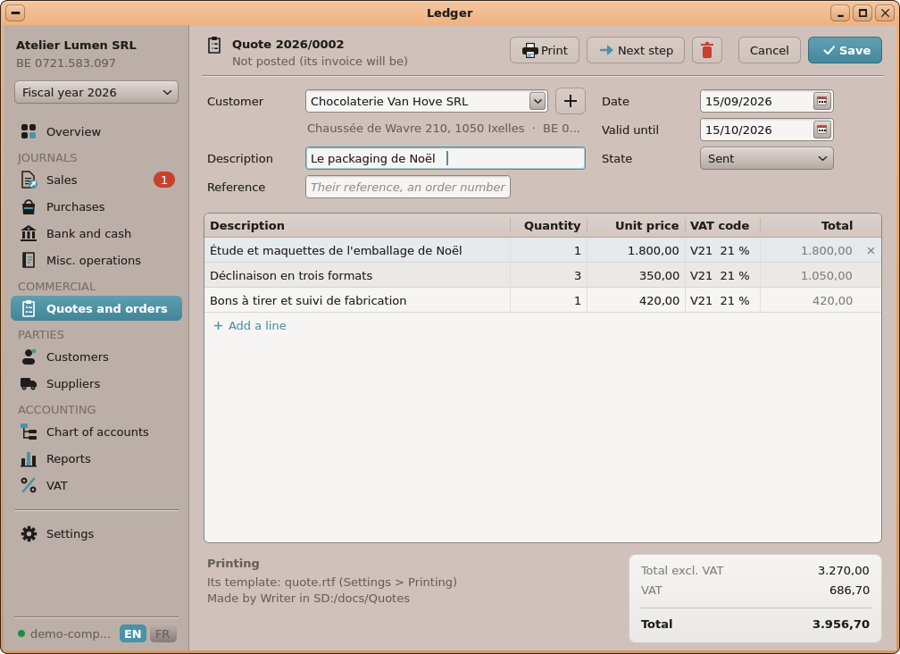
*Un devis : trois lignes — quantité fois prix unitaire —, sa TVA et son total.*

1. Le **client**, la **date**, **Valid until** (valable jusqu'au, un devis) ou **Delivery** (livraison,
   les autres), un **libellé** — le titre du devis sur papier (*Le packaging de Noël*) —, l'**état** et
   la **référence** du client.
2. Les lignes : un **libellé**, la **quantité** (`2,5` heures), le **prix unitaire** hors TVA et le
   **code TVA** ; le **total** est calculé.
3. **Save**, puis **Print** pour le faire dans Letters (section 12).

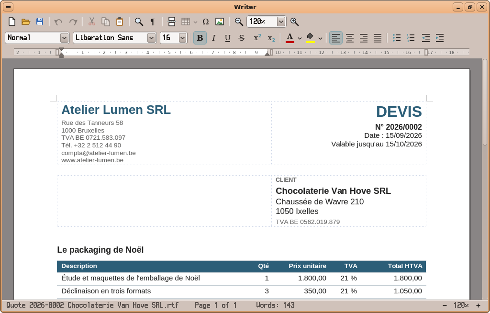
*Le devis imprimé depuis son modèle français : l'en-tête, le client, les lignes, les totaux.*

### 11.3 L'étape suivante

**Next step** transforme le document en suivant :

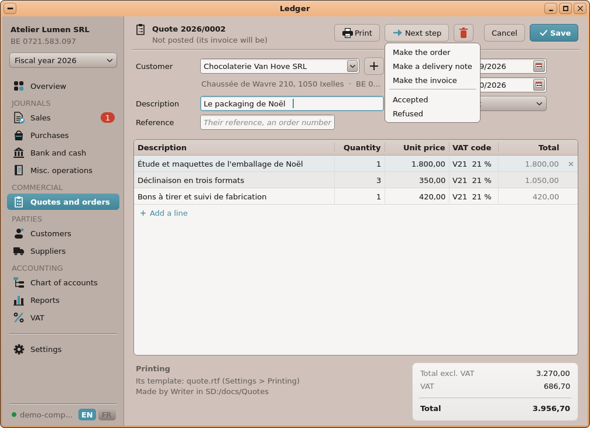
*Les étapes suivantes d'un devis : la commande, un bon de livraison, la facture ; accepté, refusé.*

- **Make the order** (un devis) : une commande avec le même client et les mêmes lignes ; le devis est
  marqué accepté.
- **Make a delivery note** (un devis ou une commande) : un bon de livraison.
- **Make the invoice** : la page de la facture de vente s'ouvre, remplie — chaque ligne *2,5 x
  Design...* avec son total, sur le compte habituel du client. Vérifiez-la et cliquez sur **Save** :
  elle est comptabilisée et le document est marqué **Invoiced** (facturé).
- **Accepted** et **Refused** (un devis) enregistrent la réponse du client.

Un document fait à partir d'un autre le dit sur papier (*Suite au devis 2026/0001*). L'étape suivante
d'un **bon de commande fournisseur** fait la facture d'achat, à compléter du numéro du fournisseur.

## 12. Imprimer des documents à partir de modèles

### 12.1 Le principe

**Print** — sur un devis, une commande, un bon de livraison, un bon de commande, une facture ou une note
de crédit de vente — écrit les données du document et demande à **Letters** de faire le document à partir
de son **modèle**. Letters l'affiche ensuite : imprimez-le, ou enregistrez-le à nouveau en `.docx` ou
`.odt`.

Les documents faits sont gardés dans `SD:/docs`, un dossier par type — **Quotes**, **Orders**,
**Delivery notes**, **Purchase orders**, **Invoices**, **Credit notes** —, nommés d'après leur numéro et
leur tiers (*Quote 2026-0002 Chocolaterie Van Hove SRL.rtf*).

### 12.2 Les langues

Chaque modèle existe en **français**, en **néerlandais** et en **anglais**. Les documents d'un tiers
prennent la langue de sa fiche, sinon celle de la société (celle de son plan). Les mots (*Facture*,
*Factuur*, *Invoice*), les dates et les mentions légales suivent.

### 12.3 Vos propres modèles

Un modèle est un document Letters ordinaire — `.rtf`, `.docx` ou `.odt` — dont Ledger remplit les
**champs de fusion**. Ils se trouvent dans `SD:/apps/ledger.app/templates` : les français dans ce
dossier, les néerlandais dans `nl`, les anglais dans `en`, un par type : `quote` (devis), `order`
(commande), `delivery` (livraison), `porder` (bon de commande), `invoice` (facture), `creditnote` (note
de crédit).

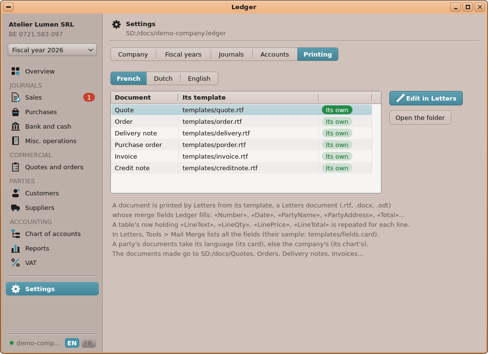
*Les modèles de chaque langue : les siens, ou le français utilisé à sa place.*

Dans **Settings ▸ Printing**, choisissez la langue et le document et cliquez sur **Edit in Letters**.
Changez la mise en page, les mots, les conditions ; ajoutez votre logo (**Insert ▸ Image...** dans
Letters) ; déplacez les champs. Quand une langue n'a pas de modèle propre (**French one**), Ledger propose
de le faire à partir du français. **Open the folder** montre les modèles dans le File Viewer.

Pour ajouter un champ, utilisez **Tools ▸ Mail Merge** dans Letters : il liste tous les champs de Ledger,
avec les valeurs d'un exemple. Une **ligne de tableau** qui contient des champs de ligne (**LineText**,
**LineQty**...) est répétée pour chaque ligne du document. L'annexe B liste tous les champs.

> **Conseil.** Gardez une copie d'un modèle avant de le modifier. Si l'un d'eux est abîmé, les modèles
> d'origine reviennent avec une copie neuve du dossier `apps/ledger.app/templates` de la carte Onyx.

## 13. Les rapports

### 13.1 Choisir un rapport

**Reports** montre un rapport à l'écran ; **Letters** l'ouvre en document à imprimer (A4, à l'italienne
s'il est large, avec son titre et ses numéros de page), **Spreadsheet** en classeur, et **Save as...**
l'écrit en document Letters (`.rtf`), en classeur (`.xlsx`) ou en fichier CSV — dans
`SD:/docs/Reports` par défaut.

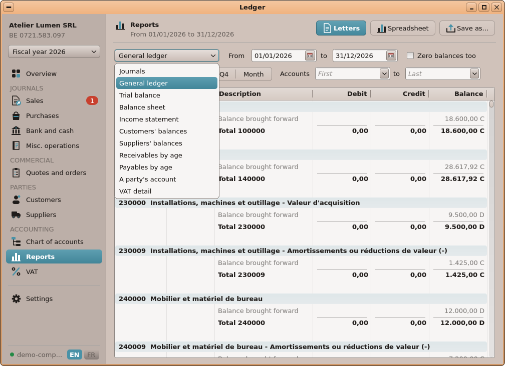
*Les rapports.*

Choisissez le **rapport**, puis sa **période** : **Year** (l'exercice), **Q1** à **Q4** (les
trimestres), **Month** (le mois en cours), ou des dates tapées dans **From** et **to** (les soldes :
**At**, à une date). Double-cliquez une ligne pour ouvrir son document, son compte ou son tiers.

### 13.2 Les rapports un par un

| Rapport | Ce qu'il montre | Ses options |
|---|---|---|
| **Journals** (journaux) | Chaque document de la période avec les lignes de son écriture | Un journal, ou tous |
| **General ledger** (grand livre) | Les lignes de chaque compte, le solde reporté et le solde progressif | Une plage de comptes ; les soldes nuls aussi |
| **Trial balance** (balance) | Les débits, crédits et soldes de chaque compte à une date | Les soldes nuls aussi |
| **Balance sheet** (bilan) | L'actif et le passif, dans les rubriques du schéma abrégé | À une date |
| **Income statement** (compte de résultats) | Les produits et les charges, le résultat de la période | — |
| **Customers' balances**, **Suppliers' balances** | Les débits, crédits, soldes et retards de chaque tiers | À une date |
| **Receivables by age**, **Payables by age** | Les postes ouverts par ancienneté : non échus, 1–30, 31–60, 61–90, plus de 90 jours | À une date |
| **A party's account** (compte d'un tiers) | Les lignes d'un client ou d'un fournisseur, avec échéances et lettrage | Le tiers |
| **VAT detail** (détail TVA) | Les lignes derrière chaque grille de la déclaration TVA | — |

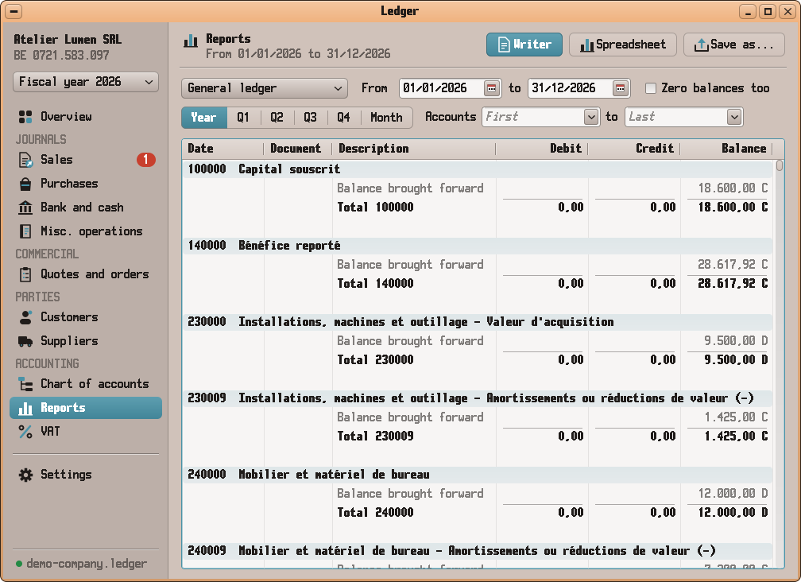
*Le grand livre de 2026 : le solde reporté de chaque compte, ses lignes et son solde progressif.*

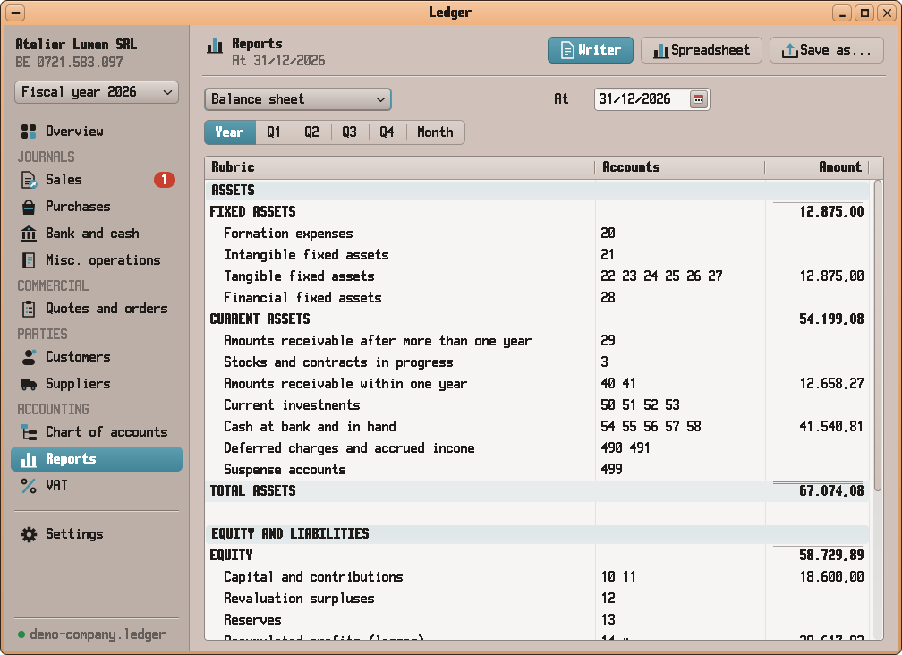
*Le bilan au 31/12/2026, dans les rubriques du schéma abrégé.*

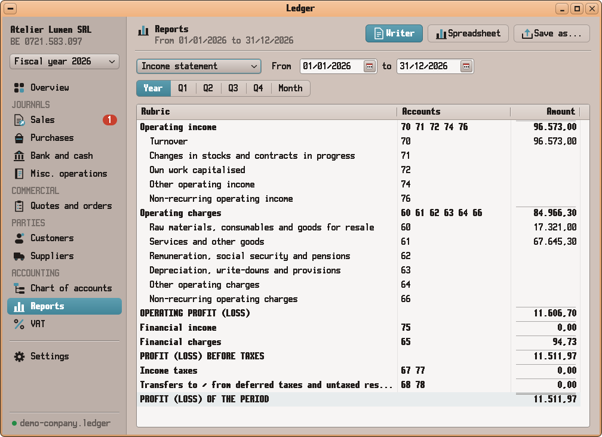
*Le compte de résultats de 2026 : chiffre d'affaires, charges par rubrique, résultat.*

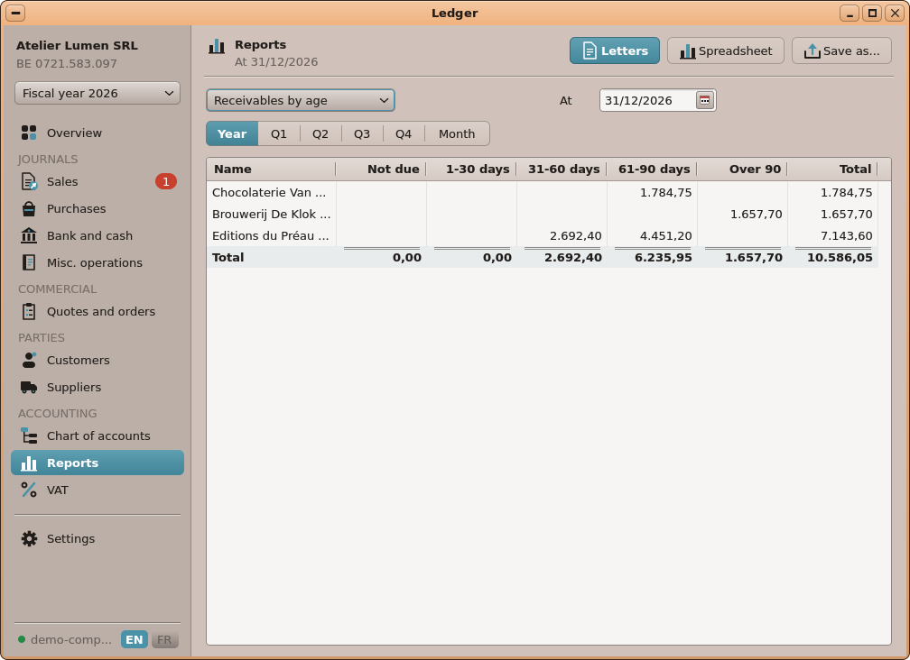
*Ce que doivent les clients, par ancienneté.*

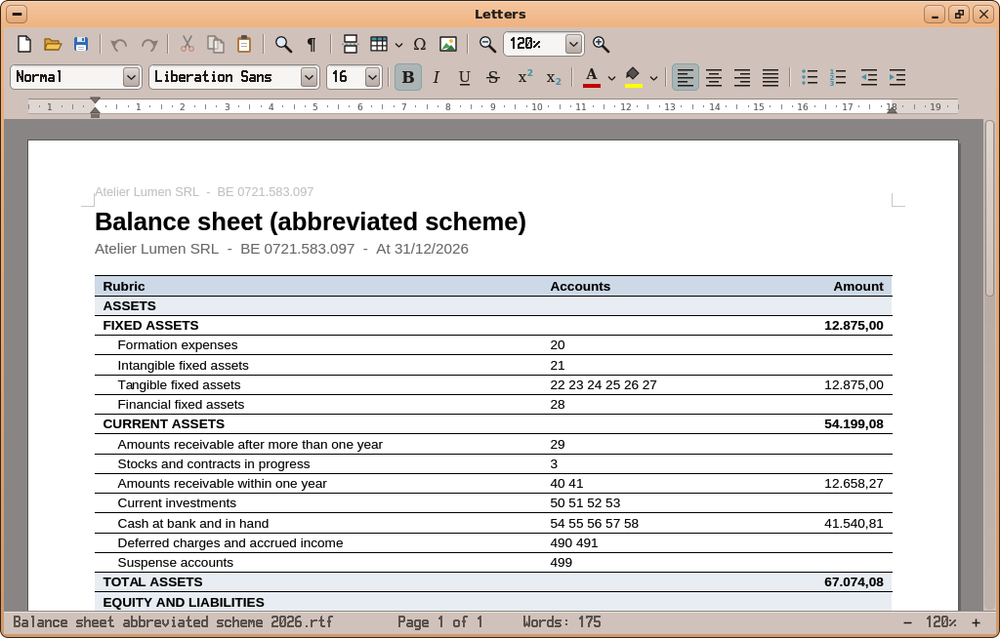
*Le bilan ouvert dans Letters, prêt à imprimer.*

## 14. La TVA

### 14.1 La page TVA

**VAT** montre les déclarations TVA d'une année civile : ses périodes — trimestres ou mois — en tuiles,
et la déclaration de la période choisie telle que le formulaire la présente.

*Le 3e trimestre 2026 : les grilles de la déclaration, calculées d'après la comptabilité ; les contrôles ne trouvent rien.*

L'état de chaque période :

| État | Signification |
|---|---|
| **Filed** | Marquée déposée (ce jour-là) : ses écritures TVA sont verrouillées |
| **Running** | La période n'est pas terminée |
| **To file** | Terminée, sa déclaration est due (le 20 du mois suivant) |
| **Late** | Son échéance est passée |
| **To come** | Pas commencée |

Cliquez une tuile — ou utilisez `←` et `→` — pour voir une autre période. La déclaration est calculée
d'après les documents de la période, dans les cadres du formulaire : **II** les opérations (ventes,
grilles 00 à 49), **III** les achats (81 à 88), **IV** la TVA due (54 à 63, total **XX**), **V** la TVA
déductible (59, 62, 64, total **YY**), **VI** le solde : **71** dû à l'État, ou **72** dû par l'État.
Cliquez une grille, ou **Detail**, pour voir les lignes derrière les grilles (le rapport **VAT detail**
de la période).

Sous le formulaire, **les contrôles que fait Intervat** — une TVA due sans sa base, une note de crédit
sans opération... Quand ils trouvent quelque chose, vérifiez-le avant de déposer.

### 14.2 Déposer la déclaration

1. Vérifiez les grilles (et leur **Detail**).
2. Cochez **Ask for the refund** (demander le remboursement) si la grille 72 montre un montant que l'État
   vous doit et que vous voulez récupérer ; **Ask for payment forms** si vous voulez les formules de
   paiement.
3. Cliquez sur **Intervat XML** et enregistrez le fichier (dans `SD:/docs/VAT`, *VAT return
   2026-Q3.xml*).
4. Sur **Intervat** (intervat.minfin.fgov.be), chargez le fichier et envoyez la déclaration.
5. Répondez **Yes** quand Ledger demande s'il faut marquer la période déposée.

Pour les déclarations mensuelles, celle de décembre montre la grille **91**, l'acompte payé en décembre :
tapez-le à cet endroit.

### 14.3 Marquer déposée, la liquidation

**Mark as filed** verrouille la TVA de la période : ses documents avec TVA ne peuvent plus être modifiés,
et les grilles de la déclaration sont gardées telles que déposées. Ledger propose alors de passer la
**liquidation** (*settlement*) : une opération diverse au dernier jour de la période qui transfère la TVA
due (451000) et la TVA déductible (411000) au **compte courant TVA** — 451200 ce que vous payez à
l'État, 411200 ce qu'il vous rembourse.

Quand vous payez la TVA, enregistrez le paiement dans votre extrait bancaire sur le compte **451200**.

**Reopen** déverrouille une période marquée déposée par erreur. Une déclaration déjà envoyée doit alors
aussi être corrigée sur Intervat.

### 14.4 Les listings

**Listings** fait les deux autres fichiers TVA :

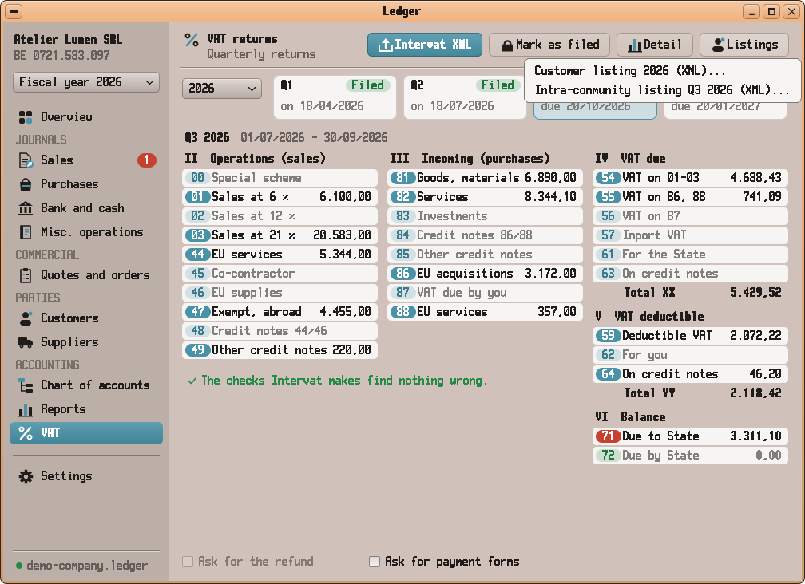
*Le listing clients annuel et le relevé intracommunautaire de la période.*

- **Customer listing 2026 (XML)** : le listing annuel de vos clients belges assujettis qui ont acheté
  pour 250 EUR ou plus, à déposer avant le 31 mars de l'année suivante. Sans aucun client de ce genre, le
  listing est « néant » : il faut le dire dans la dernière déclaration de l'année — Ledger le fait dans le
  fichier de cette déclaration.
- **Intra-community listing (XML)** : le relevé de vos livraisons et services intracommunautaires de la
  période, par numéro de TVA du client. Un client sans numéro de TVA européen valable est laissé de côté,
  et Ledger vous le dit.

Chargez-les aussi sur Intervat.

### 14.5 Sans déclarations TVA

Sous le **régime de la franchise**, vous ne déposez pas de déclaration périodique ; le listing clients
reste dû. **Non assujetti** : aucun fichier TVA. La page TVA le dit.

## 15. Clôturer l'exercice

### 15.1 Avant de clôturer

- Encodez tous les documents de l'exercice : ventes, achats, tous les extraits bancaires jusqu'au
  dernier jour.
- Déposez et marquez déposées les déclarations TVA de l'exercice.
- Passez les écritures de fin d'exercice avec votre comptable : amortissements, régularisations,
  provisions, stocks, impôts.
- Vérifiez la **balance**, le **bilan** et le **compte de résultats**, et remettez-les à votre comptable.

### 15.2 Clôturer

Dans **Settings ▸ Fiscal years**, choisissez l'exercice et cliquez sur **Close the year...** (ou **Tools ▸
Close the Fiscal Year...**).

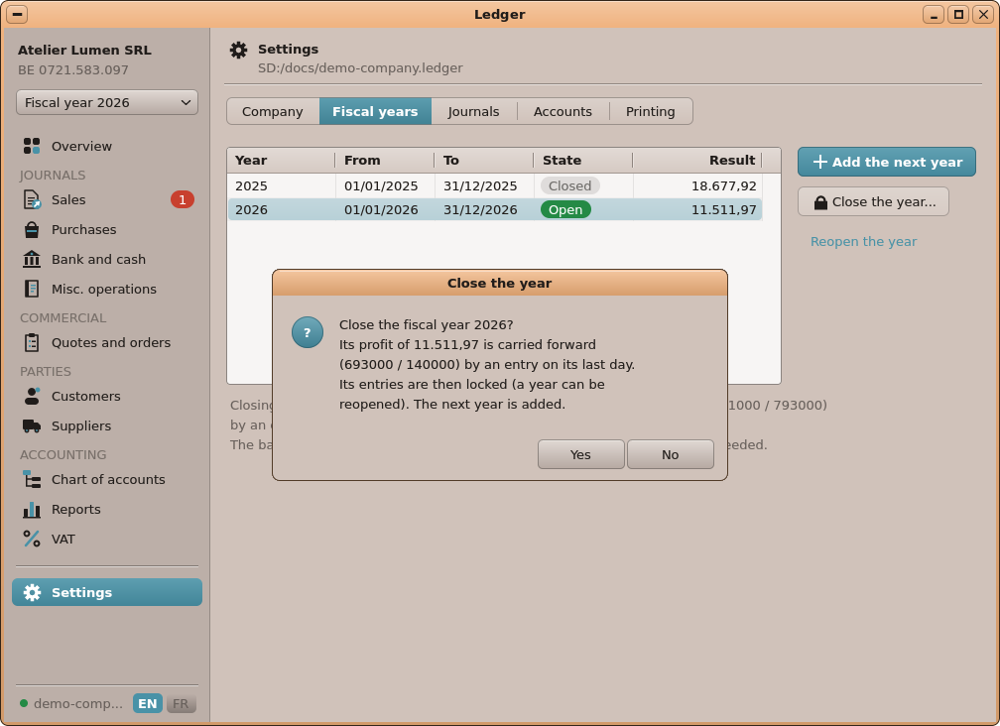
*La clôture de 2026 : son bénéfice reporté par une écriture à son dernier jour.*

Ledger passe l'**affectation** du résultat au dernier jour de l'exercice — un bénéfice : 693000 débité,
140000 crédité ; une perte : 141000 débité, 793000 crédité —, **verrouille** les écritures de l'exercice
et ajoute l'exercice suivant s'il n'existe pas. Les comptes de bilan continuent d'eux-mêmes dans
l'exercice suivant.

Si votre assemblée générale affecte le résultat autrement (un dividende, la réserve légale), passez ces
écritures dans l'exercice suivant (ou avant la clôture, avec les comptes 69x / 79x : Ledger n'affecte
alors que ce qui reste).

**Reopen the year** déverrouille un exercice clôturé ; son écriture d'affectation reste — supprimez-la si
le résultat change, et clôturez à nouveau.

## 16. Fichiers et sauvegardes

| Où | Quoi |
|---|---|
| `SD:/docs/<société>.ledger` | La comptabilité de la société : tout, dans un seul fichier (vous choisissez son nom et sa place) |
| `<société>.ledger.bak` | La version précédente de la comptabilité, gardée à chaque changement |
| `SD:/docs/Quotes`, `Orders`, `Delivery notes`, `Purchase orders`, `Invoices`, `Credit notes` | Les documents imprimés |
| `SD:/docs/Reports` | Les rapports ouverts dans Letters ou le tableur |
| `SD:/docs/VAT` | Les déclarations et listings TVA (XML) |
| `SD:/docs/Payments` | Les fichiers de paiements SEPA |
| `SD:/apps/ledger.app/templates` | Les modèles (`nl`, `en` : les néerlandais et les anglais) |
| `SD:/apps/ledger.app/last.txt` | La comptabilité ouverte en dernier |
| `SD:/apps/ledger.app/merge.card`, `merge-lines.card`, `merge.job` | Les données du dernier document imprimé, pour Letters |

**Sauvegardez** régulièrement votre fichier `.ledger` — au moins après chaque déclaration TVA — sur une
clé USB ou un autre ordinateur : c'est toute votre comptabilité. **File ▸ Save a Copy As...** en écrit
une copie où vous voulez.

Le fichier `.ledger` est du texte simple (Latin-1) : une section `[company]`, puis `[years]`,
`[journals]`, `[accounts]`, `[parties]`, `[entries]`, `[returns]` et `[documents]`, une tabulation entre
les cellules. Il peut être lu — et, en cas d'urgence, réparé — avec n'importe quel éditeur de texte.
Gardez-en une copie avant d'y toucher.

## 17. Questions et réponses

**Je ne peux pas modifier une facture : elle dit « Locked ».** Sa déclaration TVA est déposée ou son
exercice clôturé (section 3.4). Ne rouvrez la période (**VAT ▸ Reopen**) ou l'exercice que si la
déclaration ou les comptes n'ont pas encore été envoyés ; sinon, passez maintenant une note de crédit ou
une opération corrective.

**« Only the journal's last sales document can be deleted ».** Les factures de vente gardent une
numérotation continue. Faites une note de crédit pour la facture (bouton droit ▸ **Make a credit note
for it**).

**« The date is in no fiscal year ».** La date ne tombe dans aucun exercice : ajoutez l'exercice dans
**Settings ▸ Fiscal years** (**Add the next year**), ou corrigez la date.

**« The fiscal year shown is closed: choose another one ».** Les nouveaux documents vont dans
l'exercice affiché dans la barre latérale : choisissez-y l'exercice en cours.

**Une facture payée affiche encore « Due » ou « late ».** Son paiement a été enregistré sans être
lettré. Dans le compte du client, cochez la facture et le paiement et cliquez sur **Match** (section 5.3).

**L'extrait n'est pas équilibré (« Off by... »).** Un mouvement manque ou est mal tapé : comparez les
lignes avec l'extrait de la banque. Videz le **New balance** pour l'enregistrer malgré tout.

**L'import CODA dit « No bank journal has the account ».** Tapez l'IBAN de ce compte bancaire dans son
journal (**Settings ▸ Journals**).

**Les contrôles TVA trouvent quelque chose.** Ouvrez **Detail**, trouvez le document, corrigez-le (son
code TVA, la nature de son compte) et regardez à nouveau.

**Le numéro de TVA d'un client affiche « Its check digits are wrong ».** Vérifiez-le sur le site
européen VIES ; Ledger le garde si vous insistez, mais Intervat le refusera dans les listings.

**Letters affiche « No template for this kind of document ».** Un modèle manque dans
`SD:/apps/ledger.app/templates` : recopiez-le depuis une carte Onyx neuve.

**Où est ma facture en fichier ?** Dans `SD:/docs/Invoices`, nommée d'après son numéro et son client.
Letters peut l'enregistrer à nouveau en `.docx` ou `.odt`.

**Le point au pied de la barre latérale est rouge.** La comptabilité n'a pas pu être écrite (carte
pleine ou protégée en écriture). Libérez de la place, puis **File ▸ Save a Copy As...**.

## 18. Lexique

Les écrans de Ledger sont en anglais : voici les mots qu'on y rencontre, avec leurs équivalents.

| English | Français | Nederlands |
|---|---|---|
| Account | Compte | Rekening |
| Accountant | Expert-comptable | Accountant, boekhouder |
| Balance sheet | Bilan | Balans |
| Chart of accounts (PCMN) | Plan comptable minimum normalisé | Minimum algemeen rekeningenstelsel (MAR) |
| Credit note | Note de crédit | Creditnota |
| Customer | Client | Klant |
| Customer listing | Listing clients | Klantenlisting |
| Debit, credit | Débit, crédit | Debet, credit |
| Delivery note | Bon de livraison | Leveringsbon |
| Depreciation | Amortissement | Afschrijving |
| Due date | Échéance | Vervaldag |
| Entry | Écriture | Boeking |
| Fiscal year | Exercice comptable | Boekjaar |
| General ledger | Grand livre | Grootboek |
| Income statement | Compte de résultats | Resultatenrekening |
| Invoice | Facture | Factuur |
| Journal | Journal | Dagboek |
| Matching | Lettrage | Afpunten |
| Miscellaneous operation | Opération diverse (OD) | Diverse verrichting |
| Open item | Poste ouvert | Openstaande post |
| Order | Commande, bon de commande | Bestelling, bestelbon |
| Purchase | Achat | Aankoop |
| Quote | Devis, offre | Offerte |
| Reverse charge | Autoliquidation | Verlegging van heffing |
| Sale | Vente | Verkoop |
| Statement | Extrait de compte | Rekeninguittreksel |
| Structured communication | Communication structurée | Gestructureerde mededeling |
| Supplier | Fournisseur | Leverancier |
| Trial balance | Balance des comptes | Proef- en saldibalans |
| VAT return | Déclaration TVA | Btw-aangifte |
| VAT number | Numéro de TVA | Btw-nummer |

## Annexe A. Les codes TVA

| Code | Intitulé | Taux | Déductible | Grilles (facture) | Grilles (note de crédit) |
|---|---|---|---|---|---|
| V21 | Ventes 21 % | 21 % | — | 03, 54 | 49, 64 |
| V12 | Ventes 12 % | 12 % | — | 02, 54 | 49, 64 |
| V6 | Ventes 6 % | 6 % | — | 01, 54 | 49, 64 |
| V0 | Ventes 0 % | 0 % | — | 00 | 49 |
| VCC | Ventes, TVA due par le cocontractant belge | — | — | 45 | 49 |
| VEUG | Livraisons intracommunautaires de biens | — | — | 46 | 48 |
| VEUS | Services intracommunautaires | — | — | 44 | 48 |
| VEUT | Opérations triangulaires intracommunautaires (ABC) | — | — | 46 | 48 |
| VEX | Exportations hors UE | — | — | 47 | 49 |
| VX | Exempté (art. 44), hors déclaration | — | — | — | — |
| A21 | Achats 21 % | 21 % | 100 % | 81/82/83, 59 | 81/82/83, 85, 63 |
| A12 | Achats 12 % | 12 % | 100 % | 81/82/83, 59 | 81/82/83, 85, 63 |
| A6 | Achats 6 % | 6 % | 100 % | 81/82/83, 59 | 81/82/83, 85, 63 |
| A0 | Achats 0 % ou exemptés | 0 % | — | 81/82/83 | 81/82/83, 85 |
| A21D50 | Achats 21 %, à moitié déductibles (voitures) | 21 % | 50 % | 81/82/83, 59 | 81/82/83, 85, 63 |
| A21ND | Achats 21 %, non déductibles | 21 % | 0 % | 81/82/83 | 81/82/83, 85 |
| A12ND | Achats 12 %, non déductibles | 12 % | 0 % | 81/82/83 | 81/82/83, 85 |
| AEU21 | Acquisitions intracommunautaires de biens 21 % | 21 % | 100 % | 81/82/83, 86, 55, 59 | 81/82/83, 86, 84 |
| AEU12 | Acquisitions intracommunautaires de biens 12 % | 12 % | 100 % | 81/82/83, 86, 55, 59 | 81/82/83, 86, 84 |
| AEU6 | Acquisitions intracommunautaires de biens 6 % | 6 % | 100 % | 81/82/83, 86, 55, 59 | 81/82/83, 86, 84 |
| AEUS21 | Services intracommunautaires reçus 21 % | 21 % | 100 % | 81/82/83, 88, 55, 59 | 81/82/83, 88, 84 |
| ACC21 | Cocontractant belge (autoliquidation) 21 % | 21 % | 100 % | 81/82/83, 87, 56, 59 | 81/82/83, 87, 85 |
| ACC12 | Cocontractant belge (autoliquidation) 12 % | 12 % | 100 % | 81/82/83, 87, 56, 59 | 81/82/83, 87, 85 |
| ACC6 | Cocontractant belge (autoliquidation) 6 % | 6 % | 100 % | 81/82/83, 87, 56, 59 | 81/82/83, 87, 85 |
| AWS21 | Services de hors UE 21 % (autoliquidation) | 21 % | 100 % | 81/82/83, 87, 56, 59 | 81/82/83, 87, 85 |
| AIM21 | Importations, TVA reportée (ET 14000) 21 % | 21 % | 100 % | 81/82/83, 87, 57, 59 | 81/82/83, 87, 85 |
| R61 | Régularisation en faveur de l'État | — | — | 61 | 61 |
| R62 | Régularisation en faveur du déclarant | — | — | 62 | 62 |

La grille 81, 82 ou 83 est la nature du compte d'achat : marchandises, services ou investissements
(section 4.5).

## Annexe B. Les champs de fusion

Les champs qu'un modèle peut contenir — tapés dans Letters comme champs de fusion (**Tools ▸ Mail
Merge**). Les champs finissant par **Line**, **Address**, **Contact** et **Text** sont faits pour être
imprimés tels quels : une étiquette et sa valeur, dans la langue du document, ou rien du tout s'il n'y a
pas de valeur.

**Le document**

| Champ | Contenu |
|---|---|
| Kind | Le type du document, dans sa langue : *Devis*, *Factuur*, *Invoice*... |
| Number | Son numéro : *2026/0002* |
| Date | Sa date |
| Until | La validité d'un devis, la date de livraison d'une commande |
| UntilLine | *Valable jusqu'au 15/10/2026* |
| DueDate | L'échéance d'une facture |
| Reference, ReferenceLine | La référence du tiers ; avec son étiquette |
| Text | Le libellé |
| Communication | La communication structurée d'une facture |
| Terms, TermsText | Le délai de paiement en jours ; tel qu'imprimé (*30 jours*, *comptant*) |
| FromDocument, FromLine | Le document d'où il vient ; avec son étiquette |
| TotalNet, TotalVAT, Total | Les totaux |
| VATDetail | La TVA par taux, et les mentions légales d'autoliquidation et d'exemption |
| FileName | Le nom du document écrit |

**La société**

| Champ | Contenu |
|---|---|
| CompanyName, CompanyLegal | Le nom, la forme juridique |
| CompanyStreet, CompanyZip, CompanyCity, CompanyCountry, CompanyAddress | L'adresse (CompanyAddress : ses lignes) |
| CompanyVAT, CompanyVATLine | Le numéro de TVA ; avec son étiquette |
| CompanyEmail, CompanyPhone, CompanyWeb, CompanyContact | Les contacts (CompanyContact : tous) |
| CompanyIBAN, CompanyBIC, CompanyBankLine | La banque ; en une ligne |
| CompanyRegister, CompanyLegalLine | Le registre ; la ligne légale — nom et forme, adresse, numéro de TVA, registre |

**Le tiers**

| Champ | Contenu |
|---|---|
| PartyName, PartyCode | Le nom du client ou du fournisseur, son code |
| PartyStreet, PartyZip, PartyCity, PartyCountry, PartyAddress | Son adresse |
| PartyVAT, PartyVATLine | Son numéro de TVA ; avec son étiquette |
| PartyEmail, PartyPhone | Ses contacts |

**Les lignes** — dans une ligne de tableau, répétée pour chaque ligne

| Champ | Contenu |
|---|---|
| LineNo | Le numéro de la ligne |
| LineText | Son libellé |
| LineQty | La quantité |
| LinePrice | Le prix unitaire hors TVA |
| LineVAT | Le taux de TVA |
| LineTotal | Le total hors TVA |
| LineTax | La TVA |
| LineGross | Le total TVA comprise |

## Annexe C. Le clavier

| Touches | Où | Effet |
|---|---|---|
| `Ctrl+N` | Partout | Un nouveau document de la page affichée (une nouvelle fiche, un nouveau compte...) |
| `Ctrl+S` | Un document | L'enregistrer |
| `Esc` | Un document | Le quitter (Ledger demande si quelque chose a été tapé) |
| `Ctrl+F` | Une liste | Aller à la zone de recherche |
| `Ctrl+O` | Partout | Ouvrir la comptabilité d'une autre société |
| `Enter` | Une liste | Ouvrir la ligne choisie |
| `Delete` | Une liste | Supprimer la ligne choisie |
| `Space` | Le compte d'un tiers, les postes d'un extrait | Cocher ou décocher la ligne choisie |
| `Tab`, `Enter` | Les lignes d'un document | La cellule suivante ; après la dernière, une nouvelle ligne |
| `Shift+Tab` | Les lignes d'un document | La cellule précédente |
| `↑`, `↓` | Les lignes d'un document | La ligne du dessus, du dessous |
| `F4`, `Alt+↓` | Une cellule de tiers, de compte ou de code TVA | La liste de ce qu'on peut y taper |
| `Ctrl+Delete` | Les lignes d'un document | Supprimer la ligne |
| `←`, `→` | La page TVA | La période précédente, suivante |
